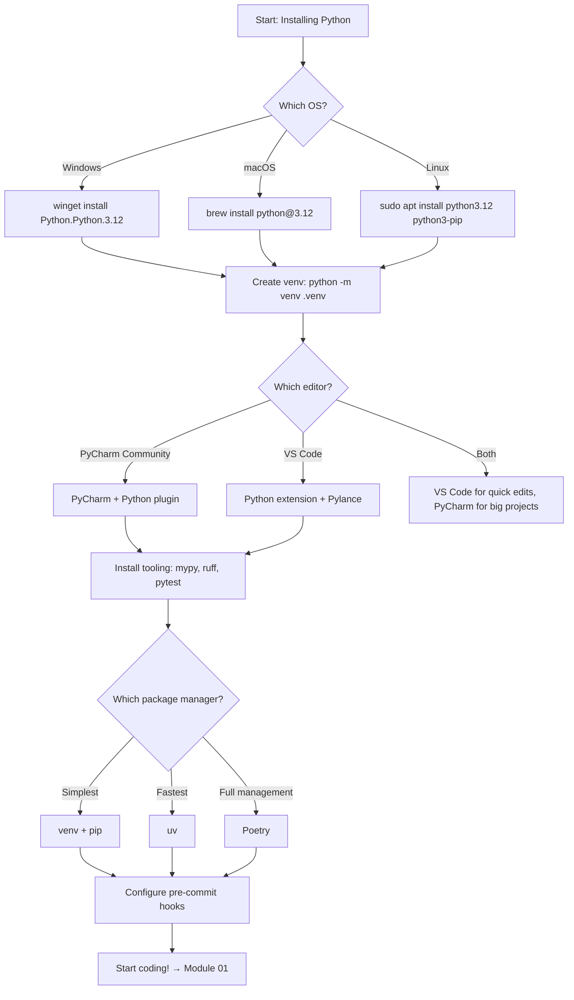

# Module 00 — Python Setup & Tooling for TypeScript Developers

> **This is your starting point.** Before diving into code, get your environment right. This module covers installation, editor setup (PyCharm), virtual environments, package management, and the toolchain you'll use daily as a TS → PY developer.

---

## Table of Contents

- [1. Installing Python — Which Version?](#1-installing-python--which-version)
  - [1.1 Why Python 3.12+ (Not 3.8, Not 3.11)](#11-why-python-312-not-38-not-311)
  - [1.2 Installing on Windows, macOS, Linux](#12-installing-on-windows-macos-linux)
  - [1.3 Verifying Your Installation](#13-verifying-your-installation)
- [2. Choosing an Editor — PyCharm Deep Dive](#2-choosing-an-editor--pycharm-deep-dive)
  - [2.1 PyCharm Professional vs Community Edition](#21-pycharm-professional-vs-community-edition)
  - [2.2 VS Code as the Alternative](#22-vs-code-as-the-alternative)
  - [2.3 Recommended PyCharm Settings for TS Devs](#23-recommended-pycharm-settings-for-ts-devs)
  - [2.4 PyCharm vs VS Code Feature Comparison](#24-pycharm-vs-vs-code-feature-comparison)
- [3. Virtual Environments — Isolated Workspaces](#3-virtual-environments--isolated-workspaces)
  - [3.1 Why virtualenv? (vs node_modules)](#31-why-virtualenv-vs-node_modules)
  - .venv Setup & Workflow
  - [3.2 Virtualenv vs Conda vs pipenv vs Poetry](#32-virtualenv-vs-conda-vs-pipenv-vs-poetry)
- [4. Package Management — pip, uv, and Poetry](#4-package-management--pip-uv-and-poetry)
  - [4.1 pip — The Default (npm equivalent)](#41-pip--the-default-npm-equivalent)
  - [4.2 uv — The New Fast Standard](#42-uv--the-new-fast-standard)
  - [4.3 Poetry — Dependency Management Done Right](#43-poetry--dependency-management-done-right)
  - [4.4 npm ↔ pip Command Mapping Table](#44-npm--pip-command-mapping-table)
- [5. Type Checking — mypy vs tsc](#5-type-checking--mypy-vs-tsc)
  - [5.1 mypy Installation & Configuration](#51-mypy-installation--configuration)
  - [5.2 pyright / Pylance (VS Code's Built-in)](#52-pyright--pylance-vs-codes-built-in)
  - [5.3 mypy vs pyright Comparison](#53-mypy-vs-pyright-comparison)
- [6. Linting & Formatting — ruff, black, isort](#6-linting--formatting--ruff-black-isort)
  - [6.1 ruff — The Swiss Army Knife (ESLint + Prettier replacement)](#61-ruff--the-swiss-army-knife-eslint--prettier-replacement)
  - [6.2 black — Opinionated Formatter](#62-black--opinionated-formatter)
  - [6.3 isort — Import Sorting](#63-isort--import-sorting)
  - [6.4 ESLint + Prettier → ruff Mapping](#64-eslint--prettier--ruff-mapping)
- [7. Testing — pytest (Not unittest)](#7-testing--pytest-not-unittest)
  - [7.1 Why pytest? (vs Jest / Vitest)](#71-why-pytest-vs-jest--vitest)
  - [7.2 Quick Test Setup](#72-quick-test-setup)
- [8. Pre-commit Hooks — Git Quality Gate](#8-pre-commit-hooks--git-quality-gate)
- [9. Complete Toolchain Decision Tree](#9-complete-toolchain-decision-tree)
- [10. Quizzes (15+)](#10-quizzes-15)
- [11. Exercises (10+)](#11-exercises-10)

---

## 1. Installing Python — Which Version?

### 1.1 Why Python 3.12+ (Not 3.8, Not 3.11)

| Feature | Python 3.12 | Python 3.10 | Python 3.8 |
|---------|-------------|-------------|------------|
| `match`/`case` | ✅ Pattern matching | ✅ Pattern matching | ❌ No pattern matching |
| Union type syntax (`X \| Y`) | ✅ Yes (3.10+) | ✅ Yes | ❌ Use `Union[X, Y]` |
| f-string debugging (`=`) | ✅ Yes (3.8+) | ✅ Yes | ✅ Yes (but limited) |
| Type parameter syntax (`list[str]`) | ✅ PEP 695 — generic type params | ✅ PEP 585 | ❌ `List[str]` from typing |
| Performance improvements | ✅ 10-60% faster than 3.10 | ✅ Baseline | ⚠️ Legacy |
| Free threading (no GIL) | ✅ Experimental (PEP 703) | ❌ No | ❌ No |
| End of support | Dec 2028 | Oct 2026 | **EOL Jan 2024** |

> **Recommendation: Install the latest stable Python (3.12 or 3.13).** Avoid anything older than 3.10 — you'll miss syntax features used throughout this course.

### 1.2 Installing on Windows, macOS, Linux

```bash
# === Windows (using winget) ===
winget install Python.Python.3.12

# Verify installation:
python --version   # Python 3.12.x
pip --version      # pip 24.x from .../python312/...

# === macOS (Homebrew) ===
brew install python@3.12

# Verify:
python3 --version   # Python 3.12.x
pip3 --version
```

> **Windows note:** On Windows, use `python` not `py`. The Python Launcher (`py`) is preferred:
> ```bash
> py --version      # Shows installed version(s)
> py -3.12          # Run with specific version
> py -m venv .venv  # Create virtual env
> ```

### 1.3 Verifying Your Installation

```python
# Create a test file: hello.py
print("Hello from Python!")
print(f"Python {__import__('sys').version}")
print(f"Platform: {__import__('sys').platform}")

# Run it:
$ python hello.py
# Hello from Python!
# Python 3.12.4 (main, Jun  6 2024, ...)
# Platform: win32
```

---

## 2. Choosing an Editor — PyCharm Deep Dive

### 2.1 PyCharm Professional vs Community Edition

| Feature | Community (Free) | Professional (Paid) |
|---------|-----------------|---------------------|
| Python editing & IntelliSense | ✅ | ✅ |
| Debugging | ✅ | ✅ |
| Virtual environment integration | ✅ | ✅ |
| Git integration | ✅ | ✅ |
| SQL/DB tools | ❌ | ✅ |
| Web framework support (Django, Flask) | ❌ | ✅ |
| REST client | ❌ | ✅ |
| Jupyter notebook integration | ❌ | ✅ |
| Profiler | ❌ | ✅ |

> **For this course: PyCharm Community Edition is sufficient for 95% of what we do.** Upgrade to Professional only if you need Django/Flask scaffolding, database tools, or Jupyter notebooks.

### 2.2 VS Code as the Alternative

If you're coming from TypeScript, you likely know VS Code. It works great with Python via the **Python extension** (by Microsoft) + **Pylance**:

```json
// .vscode/settings.json for Python development
{
  "python.defaultInterpreterPath": "./.venv/bin/python",
  "python.linting.enabled": true,
  "python.linting.ruffEnabled": true,
  "python.testing.pytestEnabled": true,
  "editor.formatOnSave": true,
  "python.analysis.typeCheckingMode": "strict"
}
```

> **VS Code + PyCharm recommendation:** Use VS Code for quick scripts and TypeScript projects. Use PyCharm when working on large Python codebases (it understands the full project context better).

### 2.3 Recommended PyCharm Settings for TS Devs

After installing PyCharm, configure these settings (File → Settings):

```
Editor → Code Style → Python:
  ├── Tab size: 4
  ├── Indent: True
  ├── Continuation indent: 4
  ├── Hard wrap at: 88 characters (PEP 8)

Editor → Inspections → Python:
  ├── [x] Missing type hints for public functions
  ├── [x] Missing return type hint
  └── [x] Redundant type hints

Project → Python Interpreter:
  └── Add → Existing virtualenv → point to .venv/bin/python

Tools → Action on Save:
  ├── Run ruff format (isort + black combined)
  └── Type check with mypy/pyright
```

### 2.4 PyCharm vs VS Code Feature Comparison for TS Devs

| Feature | PyCharm Community | PyCharm Pro | VS Code + Python Extension |
|---------|------------------|-------------|---------------------------|
| Go to Definition | ✅ | ✅ | ✅ (via Pylance) |
| Type info on hover | ✅ | ✅ | ✅ (Pylance) |
| Auto-import | ⚠️ Partial | ✅ Full | ✅ (Pylance) |
| Refactoring | ✅ Safe | ✅ More safe | ⚠️ Basic |
| Debugging | ✅ | ✅ | ✅ |
| Running tests | ❌ | ✅ | ✅ (via pytest) |
| Django templates | ❌ | ✅ | ❌ |
| Database browser | ❌ | ✅ | ❌ |
| REST client | ❌ | ✅ | ⚠️ Via extension |
| Startup time | ~2s | ~3s | <1s |
| Memory usage | ~500MB | ~800MB | ~300MB |

---

## 3. Virtual Environments — Isolated Workspaces

### 3.1 Why virtualenv? (vs node_modules)

This is a **fundamental difference** from the npm ecosystem:

| Concept | Node.js / TypeScript | Python |
|---------|---------------------|--------|
| Install scope | Per-project (node_modules/) | System-wide or per-env (.venv/) |
| Isolation mechanism | `node_modules/` (local to project) | `.venv/` (separate from project root) |
| Shared deps | Yes (hoisted in node_modules) | No (each venv has its own copies) |
| Accidental pollution | Rare (scoped per project) | Common if you skip .venv! |

```bash
# === Creating a virtual environment ===

# Python (all platforms):
python -m venv .venv

# Activate on Windows:
.venv\Scripts\activate

# Activate on macOS/Linux:
source .venv/bin/activate

# You'll see (.venv) prefix in your prompt — that means it's active!
# Now pip install will use the virtual env, NOT your system Python.
```

> **Critical difference from npm:** In Node.js, dependencies live INSIDE your project (`node_modules/`). In Python, they live inside a SEPARATE directory (`.venv/`) that doesn't contain any of your code. This means you must ALWAYS activate the virtual environment before installing or running packages.

```bash
# === Common venv workflow ===

# 1. Create (one time):
python -m venv .venv

# 2. Activate:
source .venv/bin/activate     # macOS/Linux
.venv\Scripts\activate       # Windows

# 3. Install packages:
pip install requests fastapi uvicorn

# 4. Freeze to track deps:
pip freeze > requirements.txt

# 5. Deactivate when done:
deactivate
```

### 3.2 Virtualenv vs Conda vs pipenv vs Poetry

| Tool | Created By | Pros | Cons | TS Equivalent |
|------|-----------|------|------|---------------|
| **venv** (stdlib) | Python core | No install needed, lightweight | Manual workflow | `node_modules/` (basic) |
| **Conda** | Anaconda | Cross-language envs, binaries included | Heavy (~500MB), slow | N/A |
| **pipenv** | HashiCorp | Lockfile + venv combined | Inconsistent behavior | npm lockfile |
| **Poetry** | Sdispater | Clean deps, publishing, pyproject.toml | Slower install, different workflow | npm/pnpm |

> **For this course: Start with `venv` (built-in).** Once you're comfortable, graduate to Poetry for project management.

---

## 4. Package Management — pip, uv, and Poetry

### 4.1 pip — The Default (npm equivalent)

```bash
# npm commands → pip equivalents

npm install express          → pip install requests
npm uninstall express        → pip uninstall requests
npm list                     → pip list
npm list --depth=0           → pip list --format=columns
npm install -g node          → pip install --user package  (but DON'T use --user!)
npm test                     → pytest
npm run dev                  → python main.py / uvicorn app:app --reload

# Install from requirements file:
npm ci                       → pip install -r requirements.txt
npm outdated                 → pip list --outdated
```

### 4.2 uv — The New Fast Standard

[uv](https://github.com/astral-sh/uv) is a new package installer written in Rust that's **10-100x faster** than pip:

```bash
# Install uv (one-time):
# Windows (Admin PowerShell):
irm https://astral.sh/uv/install.ps1 | iex

# macOS/Linux:
curl -LsSf https://astral.sh/uv/install.sh | sh

# Use uv as a drop-in replacement for pip:
uv venv .venv                  # Create virtual env (instant)
uv pip install requests        # Install packages (blazing fast)
uv pip freeze > requirements.txt
uv pip compile pyproject.toml  # Like poetry lock

# OR use the full workspace manager:
uv init myproject              # Initialize project
cd myproject
uv add fastapi uvicorn         # Add dependencies (like npm install)
uv run python main.py          # Run with correct env auto-activated
```

### 4.3 Poetry — Dependency Management Done Right

```toml
# pyproject.toml (Poetry's manifest, like package.json)
[tool.poetry]
name = "my-app"
version = "0.1.0"
description = "A FastAPI app"
authors = ["Your Name <you@example.com>"]

[tool.poetry.dependencies]
python = "^3.12"
fastapi = "^0.115.0"
uvicorn = "^0.30.0"
pydantic = "^2.8.0"

[tool.poetry.group.dev.dependencies]
pytest = "^8.2.0"
ruff = "^0.5.0"
mypy = "^1.11.0"
```

```bash
# Poetry commands → npm equivalents
poetry install                 → npm install
poetry add fastapi             → npm install fastapi
poetry remove fastapi          → npm uninstall fastapi
poetry lock                    → npm audit (resolver)
poetry run python main.py      → npm start / npm run dev
poetry shell                   → activate the venv
```

### 4.4 npm ↔ pip Command Mapping Table

| npm | pip | Poetry | uv | Description |
|-----|-----|--------|----|-------------|
| `npm init` | — | `poetry new myapp` | `uv init myapp` | Initialize project |
| `npm install <pkg>` | `pip install <pkg>` | `poetry add <pkg>` | `uv add <pkg>` | Install a dependency |
| `npm uninstall <pkg>` | `pip uninstall <pkg>` | `poetry remove <pkg>` | `uv remove <pkg>` | Remove a dependency |
| `npm list` | `pip list` | `poetry show` | `uv pip list` | List installed packages |
| `npm ls -g` | `pip list --user` | — | — | List global packages |
| `npm cache clean` | `pip cache purge` | — | `uv cache prune` | Clean package cache |
| `npm publish` | `python -m build && twine upload` | `poetry publish` | — | Publish to PyPI |
| `npm test` | `pytest` | `poetry run pytest` | `uv run pytest` | Run tests |

---

## 5. Type Checking — mypy vs tsc

### 5.1 mypy Installation & Configuration

```bash
# Install mypy:
pip install mypy        # or: uv add --dev mypy

# Create pyproject.toml configuration:
[tool.mypy]
python_version = "3.12"
strict = true
warn_return_any = true
warn_unused_configs = true
disallow_untyped_defs = true
```

> **mypy vs tsc comparison:**

| Feature | TypeScript (`tsc`) | Python (`mypy`) |
|---------|--------------------|-----------------|
| Type checking | Mandatory at compile time | Optional, static-only |
| Errors block compilation | Yes (with `--strict`) | No — you can run untyped code |
| Incremental builds | ✅ | ✅ (`--follow-imports=skip`) |
| Configuration file | `tsconfig.json` | `pyproject.toml` or `mypy.ini` |
| Inline errors in editor | ✅ (via tsserver) | ✅ (via Pylance/pyright) |

### 5.2 pyright / Pylance (VS Code's Built-in)

pyright is Microsoft's type checker (faster than mypy):

```bash
pip install pyright        # or: uv add --dev pyright

# Run it:
pyright                    # Full check
pyright --outputjson        # Machine-readable output
pyright *.py               # Check specific files
```

> **VS Code users:** Pylance is bundled with the Python extension. Enable strict mode in settings: `"python.analysis.typeCheckingMode": "strict"`

### 5.3 mypy vs pyright Comparison

| Feature | mypy | pyright (Pylance) |
|---------|------|-------------------|
| Speed (10K LOC) | ~8s | **~2s** |
| Strictness options | More granular | "strict", "standard", "basic" |
| Plugin ecosystem | ✅ Larger | ⚠️ Growing |
| VS Code integration | Via extension | ✅ Built-in (Pylance) |
| PyCharm integration | ✅ via plugin | ✅ via built-in support |

> **For this course: Use mypy for the exercises.** It's stricter and catches more issues — exactly what you need when learning. In production, pyright is faster for IDE integration.

---

## 6. Linting & Formatting — ruff, black, isort

### 6.1 ruff — The Swiss Army Knife (ESLint + Prettier replacement)

[ruff](https://docs.astral.sh/ruff/) is a single tool that replaces ESLint + Prettier + Flake8 + isort + more:

```bash
pip install ruff        # or: uv add --dev ruff

# Check for issues (like eslint):
ruff check .            # Lint all Python files

# Auto-fix issues (like eslint --fix):
ruff check --fix .

# Format code (like prettier):
ruff format .           # Format all files

# Show config:
ruff check --show-settings

# Configuration in pyproject.toml:
[tool.ruff]
line-length = 88
target-version = "py312"

[tool.ruff.lint]
select = ["E", "F", "W", "I", "UP", "B"]
# E/W = pycodestyle errors/warnings
# F = pyflakes errors
# I = isort (import sorting)
# UP = pyupgrade (modernize syntax)
# B = flake8-bugbear

[tool.ruff.format]
quote-style = "double"
indent-style = "space"
```

### 6.2 black — Opinionated Formatter

```bash
pip install black
black .                   # Format entire project
black --check .           # Check without modifying (CI safe)
black --diff file.py      # Show diff
```

> **black vs Prettier:** Same philosophy as Prettier — zero config opinions. You don't get to choose; the tool decides for you.

### 6.3 isort — Import Sorting

Already included in ruff! No need for a separate install:

```bash
# If using isort separately (rare now):
pip install isort
isort .                   # Sort imports alphabetically
isort --check-only .      # CI safe
```

### 6.4 ESLint + Prettier → ruff Mapping

| ESLint Rule | ruff Equivalent | Purpose |
|-------------|-----------------|---------|
| `no-unused-vars` | F841 | Unused variables |
| `no-undef` | F821 | Undefined names |
| `semi` | — | Not applicable (Python has no semicolons needed) |
| `indent` | — | Black handles formatting |
| `quotes` | E501/W | PEP 8 style |

---

## 7. Testing — pytest (Not unittest)

### 7.1 Why pytest? (vs Jest / Vitest)

```bash
pip install pytest        # or: uv add --dev pytest

# Quick test file: test_example.py
def test_addition():
    assert 1 + 1 == 2

def test_string_methods():
    assert "hello".upper() == "HELLO"
    assert "hello".split("e") == ["h", "llo"]

# Run tests (like npm test):
pytest                   # Discover and run all test_*.py files
pytest -v                # Verbose output
pytest --tb=short        # Short traceback
pytest test_example.py   # Run specific file
```

> **pytest vs Jest:** pytest is to Python what Jest is to TypeScript/JS, but simpler. No config needed — just write `test_*` or `_test` files and run `pytest`.

### 7.2 Quick Test Setup

```bash
# Create test directory structure:
myproject/
├── src/
│   └── app.py
├── tests/
│   ├── __init__.py
│   ├── test_app.py     # ← pytest finds this automatically
│   └── conftest.py     # ← shared fixtures (like Jest's setupFiles)
├── pyproject.toml
└── .venv/
```

---

## 8. Pre-commit Hooks — Git Quality Gate

```bash
# Install pre-commit:
pip install pre-commit
pre-commit install       # Install git hooks

# .pre-commit-config.yaml:
repos:
  - repo: https://github.com/astral-sh/ruff-pre-commit
    rev: v0.5.0
    hooks:
      - id: ruff
        args: [--fix]
      - id: ruff-format

  - repo: https://github.com/pre-commit/mirrors-mypy
    rev: v1.11.0
    hooks:
      - id: mypy
        additional_dependencies: [types-requests]

# First run (to generate cache):
pre-commit run --all-files
```

---

## 9. Complete Toolchain Decision Tree



---

## Quick Reference: Complete Setup Checklist

- [ ] Install Python 3.12+ (verify with `python --version`)
- [ ] Create virtual environment (`python -m venv .venv`)
- [ ] Activate it and verify (`which python` / where python)
- [ ] Install tooling: `pip install mypy ruff pytest uv`
- [ ] Install editor (PyCharm Community or VS Code + Python extension)
- [ ] Configure strict type checking in your editor
- [ ] Set up pre-commit hooks
- [ ] Create first project: `python -m venv .venv && pip install fastapi uvicorn pytest ruff mypy`

---

## 10. Quizzes (15+)

<details><summary>Q1: Why shouldn't you use Python versions older than 3.10?</summary>

You'll miss pattern matching (`match`/`case`), union type syntax (`X | Y`), and other modern features used throughout this course. Also, older versions have reached end-of-life.
</details>

<details><summary>Q2: What's the fundamental difference between npm isolation and Python venv?</summary>

npm installs packages **inside** your project (node_modules/). Python installs them **outside** in a separate .venv/ directory. You must always activate the virtual environment before installing or running packages — this is the most common mistake for TS devs.
</details>

<details><summary>Q3: Which PyCharm edition should you use?</summary>

Community Edition covers everything in this course. Upgrade to Professional only if you need Django scaffolding, database tools, Jupyter notebooks, or a built-in REST client.
</details>

<details><summary>Q4: What's the npm equivalent of `python -m venv .venv`?</summary>

There isn't one. npm uses node_modules/ inside the project by default. Python requires explicit virtual environments for isolation — that's the key difference.
</details>

<details><summary>Q5: Which type checker should you use for learning?</summary>

**mypy** (stricter, catches more issues). In production, **pyright/Pylance** is faster for IDE integration.
</details>

<details><summary>Q6: Can you use eslint + prettier for Python?</summary>

Technically yes via plugins, but **ruff** is 10-100x faster and specifically designed for Python. It combines linting (eslint) + formatting (prettier) + import sorting (isort) into one tool.
</details>

<details><summary>Q7: Why prefer pytest over unittest?</summary>

pytest requires zero configuration, has a cleaner assertion syntax (`assert` works natively), supports fixtures, parametrize, and plugins — unlike unittest's verbose boilerplate.
</details>

---

## 11. Exercises (10+)

### Exercise 1: Install & Verify

Install Python 3.12+ on your machine and verify the installation by creating a script that prints:
- Python version
- Platform
- Available standard library modules count (`len(sys.stdlib_module_names)`)

### Exercise 2: Create Your First Virtual Environment

Create a virtual environment, activate it, install `requests` and `fastapi`, list installed packages, then deactivate.

```bash
python -m venv .venv
# Activate (platform specific)...
pip install requests fastapi
pip list
deactivate
```

### Exercise 3: Configure your Editor

Set up either PyCharm Community or VS Code with:
- Python path pointing to `.venv/bin/python`
- Strict type checking enabled
- Format on save
- ruff as the formatter/linter
