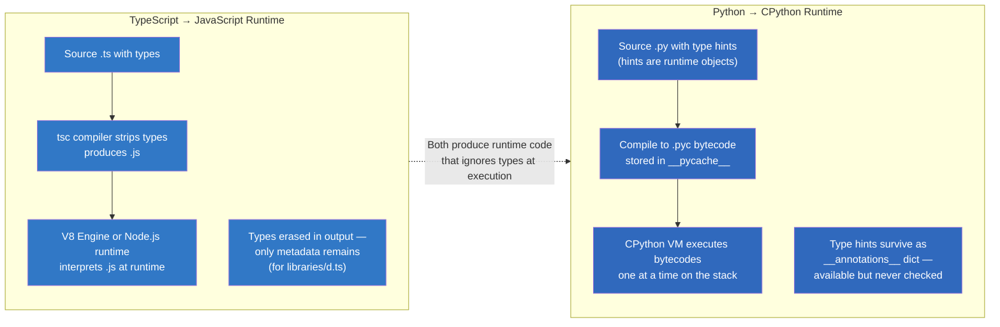
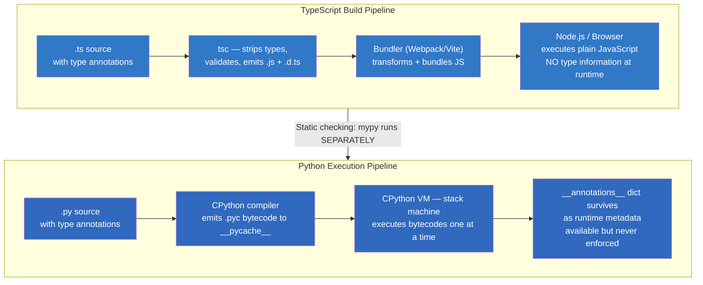
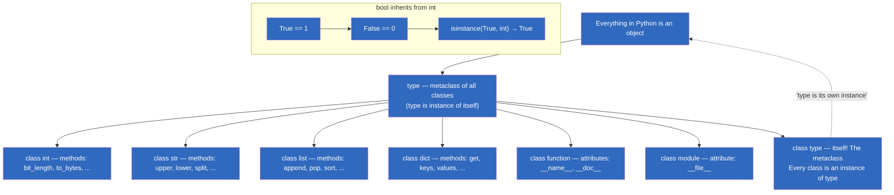
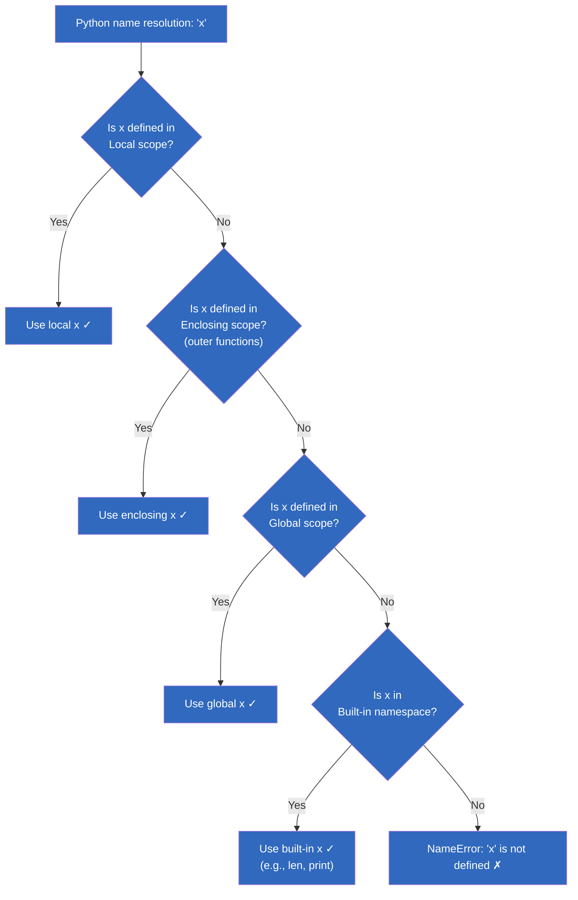
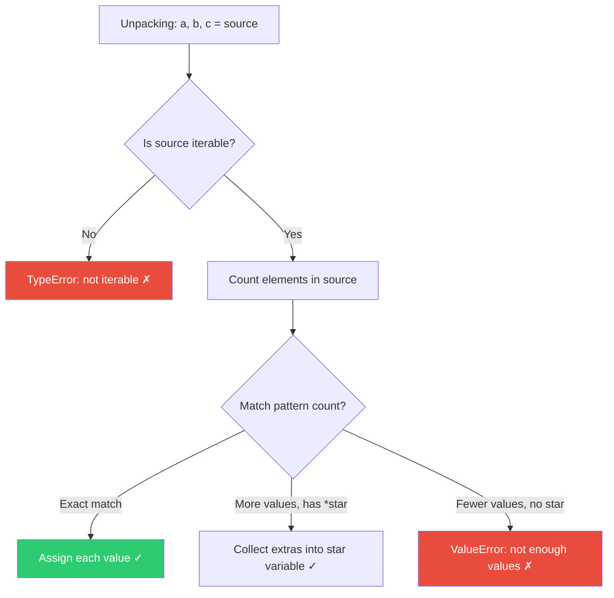
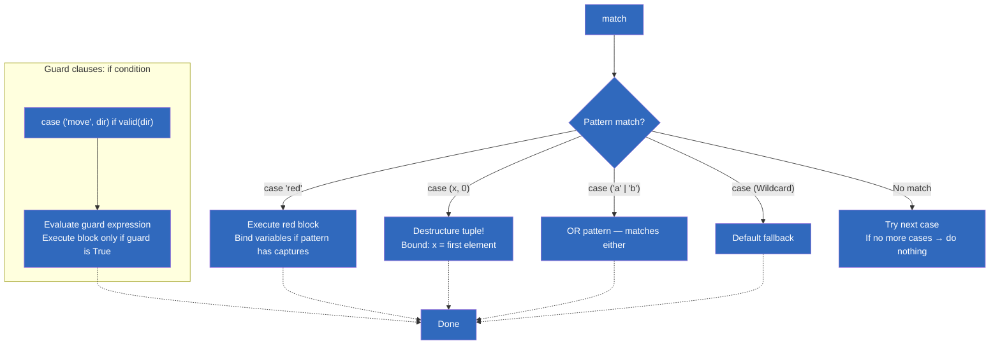
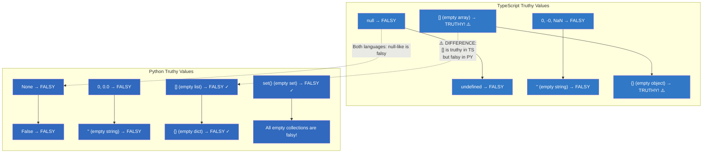

# Module 01 — Python Fundamentals for TypeScript Developers

> **Prerequisites:** This module assumes you know TypeScript (types, generics, interfaces, enums). Every concept is explained with TS → PY comparison. All examples are runnable.

> **Glossary Reference:** For a complete list of Python terms with TypeScript equivalents, see [Module 26 — Glossary](./26-glossary.md).

## Table of Contents

- [1. Core Philosophy & Mental Model Shifts](#1-core-philosophy--mental-model-shifts)
- [2. Everything Is an Object (vs JavaScript Values)](#2-everything-is-an-object-vs-javascript-values)
- [3. Variables, Assignment & Naming Conventions](#3-variables-assignment--naming-conventions)
- [4. The Type System: TypeScript Strict Mode vs Python's typing](#4-the-type-system-typescript-strict-mode-vs-pythons-typing)
- [5. Operators: Complete Comparison Table](#5-operators-complete-comparison-table)
  - [5a. Arithmetic Operators](#5a-arithmetic-operators)
  - [5b. Comparison Operators](#5b-comparison-operators)
  - [5c. Logical Operators](#5c-logical-operators)
  - [5d. Bitwise Operators](#5d-bitwise-operators)
  - [5e. Identity & Membership Operators](#5e-identity--membership-operators)
  - [5f. Augmented Assignment Operators](#5f-augmented-assignment-operators)
  - [5g. Operator Precedence Table (Complete)](#5g-operator-precedence-table-complete)
- [6. Scope Rules: LEGB in Depth](#6-scope-rules-legb-in-depth)
- [7. Variable Unpacking Patterns (Destructuring vs Python's Tuple Unpacking)](#7-variable-unpacking-patterns-destructuring-vs-pythons-tuple-unpacking)
- [8. Strings & f-strings: Deep Dive with Every Method](#8-strings--f-strings-deep-dive-with-every-method)
  - [8a. String Creation Methods](#8a-string-creation-methods)
  - [8b. All String Methods (40+ methods with complexity)](#8b-all-string-methods-40-methods-with-complexity)
  - [8c. f-string Format Specifiers: Complete Reference](#8c-f-string-format-specifiers-complete-reference)
- [9. Lists, Tuples, Dictionaries & Sets — Complete Comparison](#9-lists-tuples-dictionaries--sets--complete-comparison)
  - [9a. List Methods Table (with complexity)](#9a-list-methods-table-with-complexity)
  - [9b. Dictionary Comprehensions vs filter/map Chains](#9b-dictionary-comprehensions-vs-filtermap-chains)
  - [9c. Set Operations](#9c-set-operations)
- [10. Control Flow: Branching & Looping](#10-control-flow-branching--looping)
  - [10a. if/elif/else and Ternary](#10a-ifelifelse-and-ternary)
  - [10b. Looping Comparison (Side-by-Side Code)](#10b-looping-comparison-side-by-side-code)
  - [10c. Match/Case: Exhaustive Patterns](#10c-matchcase-exhaustive-patterns)
- [11. Functions: From Arrow Functions to First-Class Citizens](#11-functions-from-arrow-functions-to-first-class-citizens)
- [12. Edge Cases & Gotchas](#12-edge-cases--gotchas)
  - [12a. Mutable Default Arguments Trap](#12a-mutable-default-arguments-trap)
  - [12b. Truthy/Falsy Values Table](#12b-truthyfalsy-values-table)
  - [12c. Name Mangling & Double Underscores](#12c-name-mangling--double-underscores)
  - [12d. Python's `is` vs `==` Deep Dive](#12d-pythons-is-vs--deep-dive)
  - [12e. Integer Caching (Small Int Optimization)](#12e-integer-caching-small-int-optimization)
  - [12f. Short-Circuit Evaluation Quirks](#12f-short-circuit-evaluation-quirks)
- [13. Performance Comparisons with Numbers](#13-performance-comparisons-with-numbers)
- [14. Key Notes & Important Factors](#14-key-notes--important-factors)
- [15. For TypeScript Veterans](#15-for-typescript-veterans)
- [Quizzes (20+)](#quizzes-20)
  - [Q1–Q6: Variables, Types, Scope](#q1q6-variables-types-scope)
  - [Q7–Q12: Operators, Strings](#q7q12-operators-strings)
  - [Q13–Q17: Lists, Dictionaries, Sets](#q13q17-lists-dictionaries-sets)
  - [Q18–Q20: Functions, Control Flow](#q18q20-functions-control-flow)
- [Exercises (20+)](#exercises-20)

---

## 1. Core Philosophy & Mental Model Shifts

### TypeScript's Type Safety vs Python's Duck Typing

```typescript
// TypeScript enforces types at compile time via tsc (or bundler).
// Types are a compile-time contract — the compiler prevents type errors.
// Even with strict mode, null checks and runtime validation are still needed.
```

| Aspect | TypeScript | Python 3.10+ | Why It Matters for TS Developers |
|--------|-----------|--------------|----------------------------------|
| **Compilation step** | `tsc` or bundler compiles .ts → .js | No compilation — `.py` is executed directly via CPython VM | No build step to configure; import and run |
| **Type checking** | Compiler (`tsc`) enforces types, errors stop the build | Linter (`mypy`, `pyright`) checks types independently of execution | You must run mypy separately — it doesn't block compilation |
| **Null semantics** | `null` and `undefined` are separate; strict null checks help | `None` handles both — there is only one null-ish singleton | Stop writing `x !== undefined && x !== null`; just use `is not None` |
| **Module system** | ES Modules (`import/export`) or CommonJS (`require()`) | PEP 328 `import X` / `from X import Y`; package-based (not file-based) | `import os` imports the *package*, not a specific file path; relative imports use `.module` |
| **Execution model** | Single-threaded event loop in V8/Node.js | CPython executes bytecode on a stack machine with a GIL | Python is single-threaded per process but has multiprocessing; threading only helps I/O-bound work because of the GIL |
| **Garbage collection** | Mark-and-sweep (V8) | Reference counting + cyclic GC | Python's refcount means objects die immediately when last reference is dropped (unlike V8's generational GC which defers cleanup) |
| **Boolean literals** | `true` / `false` (lowercase) | `True` / `False` (capitalized!) | Classic mistake: writing `if x = true:` — that's assignment, not comparison! Also `true` is not defined in Python. |
| **Semicolons** | Optional but encouraged | Never used; PEP 8 says no semicolons | Adding them isn't an error but is un-Pythonic |
| **Increment/decrement** | `i++` / `i--` exist | `i += 1` — no `++` or `--` operators | Using `++i` in Python returns the same value (it's `+(+i)`), not what you expect |
| **Block scoping** | `let` and `const` create block scope | No block scope — only function/module scope | `for i in range(3): pass; print(i)` → `3`, not "undefined" |
| **Optional chaining** | `obj?.prop ?? default` | `.get("key", default)` for dicts; `getattr(obj, "prop", default)` for objects | No `?.` or `??` syntax in Python |
| **Destructuring** | `[a, b] = arr`, `{ a, b } = obj` | Same! `a, b = tup` and `{"name": name} = dict` | Identical concept — Python has had destructuring since day one |
| **Spread operator** | `...arr`, `{ ...obj }` | `*seq` for iterables, `{**dict}` for dicts | Different symbols but same pattern |

### The Mental Shift: From Compile-Time Safety to Runtime Trust

```typescript
// TypeScript: types are a contract enforced by the compiler
function divide(a: number, b: number): number {
  if (b === 0) throw new Error("Cannot divide by zero"); // You still must check at runtime!
  return a / b;
}
// tsc will prevent you from calling divide("hello", 2) at compile time
```

```python
# Python: types are hints — the runtime trusts you to pass correct values
def divide(a: float, b: float) -> float:
    if b == 0:
        raise ZeroDivisionError("Cannot divide by zero")
    return a / b

# No compiler will stop you from calling divide("hello", 2) — 
# it will just crash at runtime with a TypeError.
# This is why mypy (or pyright) exists: to add compile-time safety on top of Python's dynamism.
```

> **Key Insight:** In TypeScript, `tsc` is part of your build pipeline. In Python, `mypy` or `pyright` is a *separate* tool you choose to run. Python's philosophy is: "We're all consenting adults here." The type system helps humans and IDEs — it doesn't guard the gates.

### Mermaid: TypeScript vs Python Execution Flow



### Mermaid: Python Interpreter Pipeline vs TypeScript Compiler Pipeline



---

## 2. Everything Is an Object (vs JavaScript Values)

### TypeScript's Type Hierarchy vs Python's Unified Object Model

> **Core difference:** In TypeScript/JavaScript, primitives (`number`, `string`, `boolean`, `null`, `undefined`, `symbol`, `bigint`) are *separate* from objects. In Python, **everything is an object** — even types themselves are objects (classes are instances of `type`).

```python
# === Every type in Python is an object with methods and attributes ===

# Numbers are objects with methods
x = 42
print(x.bit_length())           # 6 — int has methods! (TS: no (42).bitLength())
print(x.to_bytes(4, "big"))     # b'\x00\x00\x00*' — binary conversion
print(float.hex(3.14))          # '0x1.91eb851eb851f*p+1' — float method
print(bool.__bases__)           # (<class 'int'>,) — bool is subclass of int!

# Strings are objects with methods (like JS)
s = "hello"
print(s.upper())                # "HELLO"
print(s.__len__())               # 5 — double-underscore means "internal", but it works!
print(str.upper(s))              # "HELLO" — calling the method as unbound function

# Functions are first-class objects
def greet(name: str) -> str:
    return f"Hello, {name}"

print(type(greet))               # <class 'function'>
print(greet.__name__)            # "greet"
print(greet.__doc__)             # None (unless you add a docstring)
print(greet.__module__)          # "__main__" — which module defined it
print(callable(greet))           # True — greet is callable

# Classes are objects too!
class User:
    pass

print(type(User))                # <class 'type'> — the metaclass is 'type'!
print(isinstance(User, type))   # True
print(User.__name__)             # "User"
print(User.__module__)           # "__main__"

# Even types are objects
print(type(int))                  # <class 'type'> — int's class is 'type'
print(type(type))                 # <class 'type'> — type is a metaclass!

# Modules are objects
import math
print(type(math))                 # <class 'module'>
print(dir(math))                  # List all attributes of the math module
```

### Mermaid: Python's Object Hierarchy



### Type Checking at Runtime vs Compile Time

```python
# TypeScript: types are erased at runtime. There's no typeof in JS that gives you "number" vs "string" for all cases.
# Python: isinstance and type() give full runtime introspection.

x = 42
print(type(x))                    # <class 'int'>
print(isinstance(x, int))         # True
print(isinstance(x, (int, float)))  # Also checks tuple of types — like `instanceof` union
print(isinstance(x, object))      # Everything is an object!

# Type aliases are just names — not runtime-enforced constraints:
UserId = str                      # Just a new name for 'str'
uid: UserId = "alice"             # Runtime type is still 'str' — no enforcement!
uid: UserId = 42                  # Also works! No error at runtime. Only mypy catches this.

# Using typing.get_type_hints() to inspect annotations at runtime
from typing import get_type_hints

def process_user(user_id: UserId) -> None:
    pass

hints = get_type_hints(process_user)
print(hints)                      # {'user_id': <class 'str'>} — the alias resolves!

# Runtime duck typing — Python's true power
def process(item):                # No type hint needed
    # As long as it has .process() method, it works
    if hasattr(item, 'process'):
        return item.process()
    return "default"

class Duck:
    def process(self) -> str:
        return "quack!"

class Goose:
    def process(self) -> str:
        return "honk!"

# Both work without declaring any interface! This is structural subtyping at runtime.
print(process(Duck()))            # "quack!"
print(process(Goose()))           # "honk!"
```

> **NOTE:** Python's `hasattr()` and `getattr()` enable dynamic duck typing. TypeScript doesn't have equivalent runtime introspection — its types exist only at compile time.

---

## 3. Variables, Assignment & Naming Conventions

### TypeScript's `let/const` vs Python's Single Assignment Mechanism

| Feature | TypeScript | Python |
|---------|-----------|--------|
| **Declaration** | `let x: T = v`, `const y: U = v2` | `x = v` *(no keyword!)* |
| **Reassignment** | `let` yes, `const` no | Always allowed — use naming convention for "constant" |
| **Type annotation** | `: type` after declaration | `: type` after variable name (also optional) |
| **Mutability** | Controlled by `const` vs `let` | None — objects mutate regardless of their container's mutability |
| **Hoisting** | `var` hoists, `let/const` don't | No hoisting at all |
| **Temporal Dead Zone** | `let/const` have TDZ before declaration | No TDZ — name must be assigned before use (NameError) |
| **Global scope** | Module-level `let/const` are module-scoped | Use `global` keyword to modify global from function |
| **Block scoping** | `{ let x = 1 }` creates new scope | No block scoping — `for i in range(3): pass; print(i)` leaks `i` |

```python
# TypeScript's let/const doesn't exist in Python. 
# Assignment is assignment. Rebinding is always allowed.
x = 10          # Like 'let' in TS
x = "hello"     # Also allowed! No type mismatch error at runtime.
                # mypy would flag this as an issue because of the earlier int annotation.

# Convention for constants (like TS's const):
MAX_CONNECTIONS = 100      # UPPER_CASE is a convention, not enforced!
PI = 3.14159               # Also works by convention only

# Multiple assignment (destructuring-like in one line)
a, b, c = 1, 2, 3         # Like: const [a, b, c] = [1, 2, 3]
a, b = b, a                # Swap — no temp variable needed!

# Unpacking with star
first, *middle, last = [1, 2, 3, 4, 5]
# first=1, middle=[2,3,4], last=5

# Swapping in TypeScript requires: const temp = a; a = b; b = temp;
# or: [a, b] = [b, a];  — Python's is identical but simpler!
x = 10; y = 20
x, y = y, x                 # x=20, y=10 — one line, no temp variable

# Extended unpacking (powerful destructuring)
head, *tail = [1, 2, 3, 4, 5]    # head=1, tail=[2,3,4,5]
*init, last = [1, 2, 3, 4, 5]    # init=[1,2,3,4], last=5
a, *mid, b, *end = [1, 2, 3, 4, 5, 6, 7]  # a=1, mid=[2,3,4], b=5, end=[6,7]

# Unpacking function return values (tuple unpacking)
def get_coordinates() -> tuple[float, float]:
    return (3.0, 4.0)

x, y = get_coordinates()            # x=3.0, y=4.0

# Swapping dict keys/values (TS: no direct equivalent)
original = {"a": 1, "b": 2}
inverted = {v: k for k, v in original.items()}  # {1: 'a', 2: 'b'}
```

### Naming Conventions (PEP 8)

| Style | When to Use | Example | TypeScript Equivalent |
|-------|------------|---------|----------------------|
| `snake_case` | Variables, functions, methods | `max_count`, `fetch_data()` | `camelCase` for vars, `camelCase`/` PascalCase` for funcs |
| `PascalCase` | Classes | `UserProfile`, `DataLoader` | Same! TypeScript also uses PascalCase for classes |
| `UPPER_SNAKE_CASE` | Constants (module-level) | `MAX_RETRIES = 3` | `const MAX_RETRIES = 3` — but Python convention is UPPER_CASE |
| `_single_leading_underscore` | "Private" (convention only) | `_internal_value` | Private fields via `private` modifier in TS class |
| `__double_leading` | Name mangling (name-obfuscating) | `__mangled_val` → `_ClassName__mangled_val` | No equivalent — TypeScript has no name mangling |
| `__double_trailing__` | Dunder/magic methods | `__init__`, `__str__` | TypeScript uses constructor, not __init |
| `__name__` (dunder) | Module magic attributes | `__file__`, `__all__` | No dunder convention in TS |

> **NOTE:** Python naming conventions are enforced by the community (via linters like `ruff` and formatters like `black`). TypeScript has similar conventions but they're less strictly enforced. In Python, ignoring PEP 8 is a social offense, not a syntax error.

---

## 4. The Type System: TypeScript Strict Mode vs Python's typing

### TypeScript's Strict Mode vs Python's `typing` Module

```typescript
// TypeScript strict mode enforces:
type Config = {
  host: string;
  port: number;
  timeout?: number;
};

// The compiler guarantees these types at compile time.
const config: Config = { host: "localhost", port: 8080 };
config.host = 123;  // ❌ Type error — caught by tsc!
```

```python
# Python's type hints are exactly that — hints. They do nothing at runtime.
from typing import TypedDict, NotRequired

class Config(TypedDict):
    host: str
    port: int
    timeout: NotRequired[int]

config: Config = {"host": "localhost", "port": 8080}
# No runtime check! config["host"] = 123 works fine.
# mypy is the tool that enforces these types statically, like tsc.
```

### Complete Type Hint Comparison Table (25+ entries)

| TypeScript | Python equivalent | Python version | Notes |
|------------|------------------|----------------|-------|
| `number` | `int`, `float` | — | Python has separate int and float. No single "number" type |
| `string` | `str` | — | Identical concept! |
| `boolean` | `bool` | — | Capitalized! True/False not true/false |
| `null` | `None` | — | Single singleton, like JS null |
| `undefined` | `None` | — | Python has no separate undefined type! |
| `T | null` | `T | None` (3.10+) or `Optional[T]` | 3.10+ / all | Same concept! |
| `T | undefined` | `T | None` | 3.10+ | Same as above — only one null-ish value |
| `T|U` | `T|U` (3.10+) or `Union[T, U]` | 3.10+ / all | Native union syntax in 3.10+ |
| `T[]` | `list[T]` (3.9+) or `List[T]` | 3.9+ / all | Same for dict, set, tuple |
| `(a: T) => R` | `Callable[[T], R]` | — | Note the double brackets! |
| `Partial<T>` | `TypedDict` with optional keys or just use `dict[str, Any]` | 3.11+ | TypedDict is more explicit |
| `readonly` fields | `@dataclass(frozen=True)` or slots | — | TypeScript has readonly modifier; Python needs a decorator |
| `Record<K, V>` | `dict[K, V]` or `TypedDict` | 3.9+ / — | dict[K, V] for runtime typing, TypedDict for static |
| `[...T]` (tuple) | `tuple[T, ...]` (homogeneous var-length) or `(T, U)` (fixed) | 3.9+ / — | Fixed tuples: `(str, int)`; variable: `tuple[str, ...]` |
| `keyof T` | No direct equivalent — use `typing.get_type_hints()` at runtime | all | Python doesn't have keyof at type-checker level |
| `typeof x` | `type(x)` (runtime) or `isinstance(x, T)` | — | TypeScript's typeof exists in TS; Python uses type() |
| `Pick<T, K>` | `TypedDict` with only selected keys | 3.11+ | TypedDict lets you pick exactly which keys to include |
| `Omit<T, K>` | Create new TypedDict without those keys | 3.11+ | No built-in Omit — create new class manually |
| `keyof T[K]` | Index types: `T[key_type]` where key_type is Literal or TypeVar | all | Similar to TS index access types |
| `infer` in conditional types | No equivalent — Python's type system is less advanced here | — | TS has infer for extracting types from patterns; Python does not |
| `Exclude<T, U>` | No direct equivalent | — | TS utility type; Python unions handle this naturally |
| `Extract<T, U>` | No direct equivalent | — | Same as above |
| `Parameters<T>` | No built-in — use `inspect.signature()` at runtime | all | inspect.getfullargspec() for runtime introspection |
| `ReturnType<T>` | No built-in — use typing.get_type_hints(func)["return"] | all | Manual but straightforward |
| `Required<T>` | `TypedDict` with `total=True` (default) or use `Required[key]` | 3.11+ | Explicitly mark keys as required in TypedDict |
| `keyof enum` | No direct equivalent — iterate `Enum.__members__` at runtime | all | For runtime: `list(MyEnum.__members__.keys())` |

### Key Notes

1. **Python's `bool` is a subclass of `int`**: `True == 1` and `False == 0`. This is legacy behavior and rarely an issue in practice.
   ```python
   isinstance(True, int)       # True — bool inherits from int!
   True + True                 # 2 — addition works on booleans
   [1, 2, 3][True]            # 2 — True acts as index 1!
   ```

2. **There is no `nullish coalescing` (`??`) operator** in Python — use the ternary: `x if x is not None else default`.

3. **`None` is a singleton** — always compare with `is` or `is not`, never with `==`:
   ```python
   if x is None:      # Correct! Use 'is' for None comparison.
       ...
   
   if x == None:      # Technically works but wrong style — use 'is'.
       ...
   ```

4. **Type hints are runtime metadata only** — they don't affect behavior. The `__annotations__` dict on functions/classes holds all type information.

5. **Python 3.9+ allows built-in generics**: `list[int]` instead of `typing.List[int]`. This matches TypeScript's array syntax closely.

---

## 5. Operators: Complete Comparison Table

### 5a. Arithmetic Operators

| Operation | TypeScript  | Python | Example (TS) | Example (PY) | Notes |
|-----------|-------------|--------|-------------|-------------|-------|
| Addition | `+`         | `+` | `1 + 2` → `3` | `1 + 2` → `3` | Identical |
| Subtraction | `-`         | `-` | `5 - 3` → `2` | `5 - 3` → `2` | Identical |
| Multiplication | `*`         | `*` | `3 * 4` → `12` | `3 * 4` → `12` | Identical |
| Division (float) | `/`         | `/` | `7 / 2` → `3.5` | `7 / 2` → `3.5` | Always float division in both |
| Division (integer) | N/A         | `//` | Need `Math.floor(7/2)` | `7 // 2` → `3` | Python's floor division! |
| Modulo | `%`         | `%` | `7 % 2` → `1` | `7 % 2` → `1` | Identical |
| Exponentiation | `**`        | `**` | `**` | `2 ** 3` → `8` | Python's power operator! |
| Unary plus | `+x`        | `+x` | `+5` → `5` | `+5` → `5` | Rarely used |
| Unary minus | `-x`        | `-x` | `-5` → `-5` | `-5` → `-5` | Identical |
| Bitwise AND | `&`         | `&` | `5 & 3` → `1` | `5 & 3` → `1` | Identical |
| Bitwise OR | `           |` | `|` | `5 | 3` → `7` | `5 | 3` → `7` | Identical |
| Bitwise XOR | `^`         | `^` | `5 ^ 3` → `6` | `5 ^ 3` → `6` | Identical |
| Bitwise NOT | `~x`        | `~x` | `~5` → `-6` | `~5` → `-6` | Two's complement in both |
| Left shift | `<<`        | `<<` | `1 << 3` → `8` | `1 << 3` → `8` | Identical |
| Right shift | `>>`        | `>>` | `8 >> 1` → `4` | `8 >> 1` → `4` | Identical |
| String concat | `` `${a}` `` | `a + b` | `f"{a}{b}"` | `a + b` | `"hello" + " " + "world"` | `"hello" + " " + "world"` | f-strings are faster ||

```python
# === Arithmetic: All operators with examples ===

# Floor division — no equivalent in TypeScript!
7 // 2            # 3 (floor of 3.5)
-7 // 2           # -4 (floors toward negative infinity, not truncates)
10 // 3           # 3

# Exponentiation — Python has ** but not Math.pow!
2 ** 10           # 1024 (like Math.pow(2, 10))
4 ** 0.5          # 2.0 (square root)
(1 + 2j) ** 2     # (-3+4j) — complex numbers support power!

# Modulo with negative numbers — different from some languages!
-7 % 3            # 2 (Python always returns non-negative remainder)
7 % -3            # -2 (sign follows divisor in Python)

# Bitwise operations (useful for flags, networking, cryptography)
5 & 3             # 1 (0101 & 0011 = 0001)
5 | 3             # 7 (0101 | 0011 = 0111)
5 ^ 3             # 6 (0101 ^ 0011 = 0110)
~5                # -6 (two's complement: ~x = -x-1)
1 << 4            # 16 (2^4, bit shifting)
0xFF >> 4         # 15 (shift right)

# Complex number arithmetic (no equivalent in TypeScript!)
z = 3 + 4j
print(z.real)       # 3.0
print(z.imag)       # 4.0
print(abs(z))       # 5.0 — magnitude
print(conj := z.conjugate())  # (3-4j)

# f-string with exponentiation in expression
price = 2 ** 10     # 1024
print(f"Price: ${price}")  # "Price: $1024"
```

### 5b. Comparison Operators

| Operation | TypeScript | Python | Example (TS) | Example (PY) | Notes |
|-----------|-----------|--------|-------------|-------------|-------|
| Equal value | `===` or `==` | `==` | `"1" == 1` → true | `"1" == 1` → True | Python also does type coercion with `==` |
| Not equal | `!==` or `!=` | `!=` | `"1" !== 1` → true | `"1" != 1` → False | `!=` in Python is identical to JS `!=` |
| Strict equal | `===` | No operator — use `is` for identity, `==` for equality | `5 === 5` → true | `5 == 5` → True, `5 is 5` → True | Python's `is` tests identity (same object) |
| Strict not equal | `!==` | No operator — use `is not` | `5 !== "5"` → true | `5 is not "5"` → True | Identity check, not value comparison |
| Greater than | `>` | `>` | `5 > 3` → true | `5 > 3` → True | Identical |
| Less than | `<` | `<` | `3 < 5` → true | `3 < 5` → True | Identical |
| Greater or equal | `>=` | `>=` | `5 >= 5` → true | `5 >= 5` → True | Identical |
| Less or equal | `<=` | `<=` | `3 <= 5` → true | `3 <= 5` → True | Identical |
| Chained comparison | No direct | Yes! | Need `(a > b) && (b > c)` | `a > b > c` | Python supports chained comparisons! |

```python
# === Comparison operators with examples ===

# Chained comparisons — unique to Python!
1 < 5 < 10            # True — equivalent to (1 < 5) and (5 < 10)
1 < 5 > 3             # True — but this is NOT chained! It's (1 < 5) and (5 > 3)
# Key insight: chaining only works for consecutive comparison operators with the same direction.

# Python's `is` vs `==` — critical distinction!
a = [1, 2, 3]
b = [1, 2, 3]
c = a

a == b                 # True — same content (value equality)
a == c                 # True
a is b                 # False — different objects in memory!
a is c                 # True — same object (identity equality)

# String interning — Python may reuse string objects for short strings:
s1 = "hello"
s2 = "hello"
s1 is s2               # May be True (implementation dependent!) — don't rely on this

# But long strings are not interned:
s3 = "hello world!"  # Different object each time
s4 = "hello world!"
s3 is s4               # Usually False

# None comparison — ALWAYS use is/is not with None!
def maybe_none() -> int | None:
    return None

result = maybe_none()
if result is None:     # Correct!
    print("Got None")

# NEVER do this:
if result == None:     # Works but wrong style!
    print("Got None")
```

> **NOTE:** In Python 3, `!=` between incompatible types (e.g., `"hello" != 5`) returns `True` instead of raising a TypeError. In TypeScript, `"hello" !== 5` also returns `true`. The behavior is the same conceptually — they're just not equal by value or type.

### 5c. Logical Operators

| Operation | TypeScript | Python | Example (TS) | Example (PY) | Notes |
|-----------|-----------|--------|-------------|-------------|-------|
| AND | `&&` | `and` | `true && false` → false | `True and False` → False | Different symbols! |
| OR | `||` | `or` | `true || false` → true | `True or False` → True | Different symbols! |
| NOT | `!` | `not` | `!true` → false | `not True` → False | Keyword vs symbol |
| Nullish coalescing | `??` | No direct equivalent | `"hello" ?? "default"` | Use ternary: `x if x is not None else default` | Python has no `??` operator |
| Logical AND-assignment | N/A | `and` with short-circuit | N/A | `a and b` — returns a or b (first falsy value) | Returns the operand, not boolean! |
| Logical OR-assignment | N/A | `or` with short-circuit | N/A | `a or b` — returns a or b (first truthy value) | Same return behavior |

```python
# === Logical operators: Short-circuit evaluation returning values ===

# In TypeScript: true && false returns boolean false
# In Python: True and False returns the actual operand, not boolean!
True and False         # False — but it's actually `False` (the second operand)
True and 42            # 42 — returns the last evaluated operand!
0 and 42               # 0 — returns first falsy value (short-circuits!)

# Logical OR short-circuit (useful for defaults, like ?? in TS)
result = None or "default"       # "default" — like nullish coalescing for falsy values
result = "" or "default"         # "default" — empty string is falsy!
result = 0 or "default"          # "default" — zero is falsy!

# The closest to ?? in Python:
value = None
result = value if value is not None else "default"   # True ?? equivalent
# Note: this differs from `or` because `or` treats 0, "", [] as falsy too.

# Chained logical operators (like TypeScript)
a, b, c = True, False, True
a and b and c           # False — short-circuits at b
a or b or c             # True — short-circuits at a

# Practical: default values with `or` (very Pythonic!)
name = user.name or "Anonymous"     # Like name ?? "Anonymous" in TS but catches "" too
port = config.port or 8080          # Falls back to 8080 if port is None, 0, "", []

# NOT operator — keyword, not symbol!
not True            # False
not 0               # True (because 0 is falsy)
not []              # True (empty list is falsy)
not "hello"         # False
```

### 5d. Bitwise Operators

| Operation | TypeScript | Python | Example (TS) | Example (PY) | Notes |
|-----------|-----------|--------|-------------|-------------|-------|
| AND | `&` | `&` | `5 & 3` → `1` | `5 & 3` → `1` | Identical |
| OR | `|` | `|` | `5 | 3` → `7` | `5 | 3` → `7` | Identical |
| XOR | `^` | `^` | `5 ^ 3` → `6` | `5 ^ 3` → `6` | Identical |
| NOT | `~x` | `~x` | `~5` → `-6` | `~5` → `-6` | Two's complement in both |
| Left shift | `<<` | `<<` | `1 << 2` → `4` | `1 << 2` → `4` | Identical |
| Right shift | `>>` | `>>` | `8 >> 1` → `4` | `8 >> 1` → `4` | Identical |

```python
# === Bitwise: practical examples ===

# Flag-based permissions (no equivalent in TypeScript without enums)
READ = 0b0001    # 1
WRITE = 0b0010   # 2
EXECUTE = 0b0100 # 4
ADMIN = 0b1000   # 8

perms = READ | WRITE | ADMIN       # Combine flags: 0b1101 (13)
perms & READ                        # True — has READ permission
perms & EXECUTE                     # False — doesn't have EXECUTE
perms ^ EXECUTE                     # Toggles EXECUTE: 0b1101 ^ 0b0100 = 0b1001

# Common bitwise tricks
is_even = (n & 1) == 0             # Check if n is even (faster than n % 2 == 0)
power_of_two = (n & (n - 1)) == 0  # Check if n is a power of two
swap = a ^ b; b ^= a; a ^= b       # XOR swap — no temp variable!

# Bit manipulation for networking
ip_bytes = b'\xc0\xa8\x01\x01'    # 192.168.1.1
first_octet = ip_bytes[0]           # 192
# Combine: (a << 24) | (b << 16) | (c << 8) | d

# Using bit_length() — method on int (no TS equivalent)
(255).bit_length()     # 8 — number of bits needed to represent
(0).bit_length()       # 0
(-5).bit_length()      # 3 — magnitude's bit length
```

### 5e. Identity & Membership Operators

| Operation | TypeScript | Python | Example (TS) | Example (PY) | Notes |
|-----------|-----------|--------|-------------|-------------|-------|
| In array/set | `arr.includes(x)` | `x in arr` | `[1,2].includes(1)` → true | `1 in [1, 2]` → True | Python's `in` is cleaner! |
| Not in | N/A (use `!includes`) | `not in` | `![1,2].includes(3)` → true | `3 not in [1, 2]` → True | `not in` is its own operator! |
| Same object | `===` (for primitives) / reference comparison | `is` | No direct equivalent for objects | `a is b` | Always use `is` for identity |
| Not same object | N/A | `is not` | No direct equivalent | `a is not b` | Always use `is not` for non-identity |

```python
# === Membership operators: in / not in ===

# List membership — O(n) linear search!
nums = [1, 2, 3, 4, 5]
3 in nums             # True
6 in nums             # False
6 not in nums         # True

# Set membership — O(1) average! (use sets for frequent membership checks)
num_set = {1, 2, 3, 4, 5}
3 in num_set          # True — much faster than list for large collections!

# String membership — substring check!
"hello" in "saying hello world"   # True
"xyz" not in "hello"              # True

# Dict membership — checks keys by default!
user = {"name": "Alice", "age": 30}
"name" in user        # True
"email" in user       # False
"name" in user.keys() # True — explicit key check
"Alice" in user.values()  # True — check values (not recommended for performance)

# Tuple membership
point = (1, 2, 3)
(1, 2) in [(0, 0), (1, 2)]  # True — check if tuple exists in list of tuples

# Membership in custom objects
class Item:
    def __init__(self, id: int):
        self.id = id
    def __eq__(self, other):
        return isinstance(other, Item) and self.id == other.id
    def __hash__(self):
        return hash(self.id)

items = [Item(1), Item(2), Item(3)]
Item(2) in items            # True — requires __eq__ method
```

### 5f. Augmented Assignment Operators

| Operation | TypeScript | Python | Example (TS) | Example (PY) | Notes |
|-----------|-----------|--------|-------------|-------------|-------|
| Add and assign | `a += b` | `a += b` | `a += 1` → `a = a + 1` | `a += 1` → `a = a + 1` | Identical |
| Subtract and assign | `a -= b` | `a -= b` | `a -= 1` | `a -= 1` | Identical |
| Multiply and assign | `a *= b` | `a *= b` | `a *= 2` | `a *= 2` | Identical |
| Divide and assign | `a /= b` | `a /= b` | `a /= 2` → float | `a /= 2` → float | Always float division! |
| Floor divide and assign | N/A | `a //= b` | Need `a = Math.floor(a/b)` | `a //= 3` | Python-only! |
| Power and assign | N/A | `a **= b` | Need `a = Math.pow(a,b)` | `a **= 2` | Python-only! |
| Bitwise AND assign | `a &= b` | `a &= b` | `a &= 0xFF` | `a &= 0xFF` | Identical |
| Modulo and assign | `a %= b` | `a %= b` | `a %= 5` | `a %= 5` | Identical |

```python
# === Augmented assignment: all variants ===

a = 10
a += 5        # a = 15 (add)
a -= 3        # a = 12 (subtract)
a *= 2        # a = 24 (multiply)
a /= 4        # a = 6.0 (divide — result is float!)
a //= 2       # a = 3.0 (floor divide — still float because a was float!)
a **= 2       # a = 9.0 (power)
a %= 5        # a = 4.0 (modulo)

# Chained augmented assignment works left-to-right:
x = y = 1
x += y += 1   # Syntax error! Augmented assignment doesn't chain.

# List/tuple/dict augmented assignment (these call __iadd__!)
nums = [1, 2, 3]
nums += [4, 5]        # Extended: like .concat() in TS or .push(...arr)
# nums += 6            # TypeError! Can't add int to list.

d = {"a": 1}
d.update({"b": 2})    # No augmented assignment for dict merge in Python < 3.9
d |= {"c": 3}         # Python 3.9+: dict merge and assign!
```

### 5g. Operator Precedence Table (Complete)

> **NOTE:** This is the complete operator precedence table, from highest to lowest binding power. When in doubt, use parentheses!

| Precedence | Operator | Category | Example (PY) | Example (TS equivalent) | Notes |
|-----------|----------|----------|-------------|----------------------|-------|
| 1 (highest) | `()`, `[]`, `.` | Subscript, attribute access | `x[0]`, `x.y` | `x[0]`, `x.y` | Function call has highest precedence |
| 2 | `**` | Exponentiation | `2 ** 3` | N/A (use Math.pow) | Right-associative! |
| 3 | `+x`, `-x`, `~x` | Unary plus/minus, bitwise NOT | `-5`, `~x` | `+x`, `-x`, `~x` | Same in both languages |
| 4 | `*`, `@`, `/`, `//`, `%` | Multiplication, matrix mul, div, floordiv, mod | `6 / 2` → `3.0` | `6 / 2` → `3` | Matrix @ operator (3.5+) |
| 5 | `+`, `-` | Addition, subtraction | `1 + 2` | `1 + 2` | Identical |
| 6 | `<<`, `>>` | Bitwise shift | `8 >> 1` → `4` | `8 >> 1` → `4` | Identical |
| 7 | `&` | Bitwise AND | `5 & 3` → `1` | `5 & 3` → `1` | Identical |
| 8 | `^` | Bitwise XOR | `5 ^ 3` → `6` | `5 ^ 3` → `6` | Identical |
| 9 | `|` | Bitwise OR | `5 | 3` → `7` | `5 | 3` → `7` | Identical |
| 10 | `==`, `!=`, `>=`, `<=`, `>`, `<`, `is`, `is not`, `in`, `not in` | Comparisons, identity, membership | `x == y`, `x is None` | `===`, `!==`, `==`, `!=` | Comparison operators chain! |
| 11 | `not x` | Logical NOT | `not True` → False | `!true` → false | Keyword vs symbol |
| 12 | `and` | Logical AND | `True and False` → False | `&&` → false | Lower precedence than OR |
| 13 (lowest) | `or` | Logical OR | `True or False` → True | `||` → true | Lowest of logical ops |

> **NOTE:** The ternary expression (`x if cond else y`) has very low precedence — lower than comparison operators. This means `a if a > b else b` works without extra parentheses around `a > b`.

```python
# === Precedence examples (tricky cases) ===

# Ternary low precedence — doesn't need parens around condition!
result = x + 1 if x > 0 else x - 1   # Works! Condition binds tighter than ternary

# Lambda low precedence — wrap in parens when passing to function!
sorted(users, key=lambda u: u.age)    # Lambda has very low precedence

# Exponentiation is RIGHT-associative:
2 ** 3 ** 2   # 512 (2^(3^2) = 2^9), NOT 64 ((2^3)^2)
# In JS: Math.pow(2, Math.pow(3, 2)) → 512

# Comparison chaining:
1 < x < 10    # x > 1 and x < 10 — evaluated once! Unlike JS where you'd need &&.
               # Important: x is evaluated only ONCE even though it appears twice in the chain!
```

---

## 6. Scope Rules: LEGB in Depth

### The LEGB Rule: How Python Resolves Names

> **Core concept:** Python resolves names using the **LEGB** rule: **L**ocal → **E**nclosing → **G**lobal → **B**uilt-in. This is fundamentally different from TypeScript, which uses **lexical scoping** with TDZ for `let/const`.



### Local Scope — What Is "Local"?

```python
# === Local scope: variables inside a function ===

def example() -> None:
    x = 10                # x is LOCAL to example()
    print(x)               # ✅ Works — 10

    def inner() -> None:   # inner is also local, but creates an ENCLOSED scope
        y = 20             # y is local to inner()
        print(x)           # ✅ Works — x from enclosing scope (example)
        print(y)           # ✅ Works — 20

    inner()
    # print(y)            # ❌ NameError! y is not in example()'s scope.

# print(x)                # ❌ NameError! x is local to example(), not global.
```

### Enclosing Scope — Closures and `nonlocal`

```python
# === Enclosing scope: variables from outer functions ===

def outer(value: int) -> callable:
    """Closure: the returned function captures 'value' from enclosing scope."""
    def inner() -> int:
        return value       # Reads from enclosing scope!
    return inner

getter = outer(42)
print(getter())            # 42 — captured from enclosing scope!

# === nonlocal keyword: modify enclosing scope variable ===
def counter() -> callable:
    count = 0              # Enclosing scope variable

    def increment() -> int:
        nonlocal count     # Tell Python: modify the enclosing 'count', not create a new one!
        count += 1
        return count       # Like let in TS — but works across function boundaries!

    return increment

inc = counter()
print(inc())               # 1
print(inc())               # 2
print(inc())               # 3
```

### Global Scope — Module-Level Variables

```python
# === Global scope: module-level variables ===

GLOBAL_CONFIG = {"host": "localhost", "port": 8080}   # Convention: UPPER_CASE

def modify_global() -> None:
    # Reading global works without any keyword
    print(GLOBAL_CONFIG["host"])                     # ✅ Works

    # BUT writing requires 'global' keyword:
    global GLOBAL_CONFIG                              # Declare intent to modify global!
    GLOBAL_CONFIG = {"host": "remote", "port": 9090} # Now this modifies the global variable!

modify_global()
print(GLOBAL_CONFIG)        # {'host': 'remote', 'port': 9090} — modified globally!

# === Global variables accessed without modification (no keyword needed for reading) ===
counter = 0                 # Module-level global counter

def increment_counter() -> int:
    global counter            # Need to declare if we assign to it
    counter += 1
    return counter
```

### Built-in Scope — The Last Resort

```python
# === Built-in scope: Python's built-in namespace ===
# This is the last stop in name resolution. If a name isn't found anywhere else,
# Python looks here. Examples: len, print, int, str, list, dict, range, enumerate...

print(len)            # <built-in function len>
print(int)           # <class 'int'>
print(max)           # <built-in function max>

# You CAN shadow built-ins (but DON'T!):
len = 42             # ❌ Bad practice — shadows the built-in len() function
# len("hello")      # TypeError: 'int' object is not callable!

# The built-in namespace is in the builtins module:
import builtins
print(dir(builtins))   # List of all built-in names
```

### Scope Resolution in Classes vs Functions

> **Critical gotcha:** Class bodies do **NOT** create a new scope. Variables defined in a class body are **not** local to methods — they become class attributes!

```python
# === Class bodies do NOT create scope! ===
x = 100                 # Global variable

class MyClass:
    x = 50              # This does NOT create a local scope — it creates a class attribute!

    def method(self) -> int:
        print(x)        # Looks up in LEGB order: finds global x=100! Not the class attr.
        return x         # Returns 100, not 50!

    @classmethod
    def class_method(cls) -> None:
        print(cls.x)     # ✅ Access class attribute via cls

print(MyClass.x)          # 50 — class attribute
obj = MyClass()
print(obj.x)              # 50 — instance inherits class attribute
obj.x = 99                # Creates an INSTANCE attribute that shadows the class attribute!
print(MyClass.x, obj.x)   # 50, 99 — now two different values!
```

### Mermaid: LEGB Scope Resolution in Detail

```mermaid
flowchart TD
    subgraph CALL["Function Call: f()"]
        C1["Enter function f — create LOCAL scope frame"] --> C2["Execute body of f\nLook up names: LEGB order"]
        C2 --> C3{"Name found locally?"}
        C3 -->|Yes| C4["Return local binding ✓"]
        C3 -->|No| C5{"Name in enclosing scope?"}
    end

    subgraph ENCLOSED["Enclosing Scope\n(outer function's locals)"]
        E1{"Name found?"} -->|Yes| E2["Return enclosing binding ✓"]
        E1 -->|No| E3{"Name in global scope?"}
    end

    subgraph GLOBAL["Global Scope\n(module-level variables)"]
        G1{"Name found?"} -->|Yes| G2["Return global binding ✓"]
        G1 -->|No| G3{"Name in built-ins?"}
    end

    subgraph BUILTIN["Built-in Namespace\nbuiltins module"]
        B1{"Name found?"} -->|Yes| B2["Return built-in ✓"]
        B1 -->|No| B3["✗ NameError"]
    end

    C4 -.-> C5
    E2 -.-> E3
    G2 -.-> G3
```



---

## 7. Variable Unpacking Patterns (Destructuring vs Python's Tuple Unpacking)

### TypeScript Destructuring vs Python Unpacking

| Feature | TypeScript | Python | Example |
|---------|-----------|--------|---------|
| Array destructuring | `[a, b] = arr` | `a, b = tup` | `x, y = (1, 2)` |
| Object destructuring | `{ a, b } = obj` | `{"key": val} = dict` | `{"name": name} = {"name": "Alice"}` |
| Nested destructuring | `[a, [b, c]] = arr` | `(a, (b, c)) = nested` | `x, (y, z) = (1, (2, 3))` |
| Rest element | `[a, ...rest] = arr` | `a, *rest = seq` | `first, *rest = [1, 2, 3, 4]` |
| Default value | `[a = 10] = arr` | `a = val if val else default` — no built-in! | Python has no destructuring defaults! |
| Rename in destructuring | `{ a: renamed } = obj` | No direct equivalent | Use intermediate variable or dict access |
| Skip element | `[a, , c] = arr` | `a, *_ , c = seq` | `a, *_ , c = [1, 2, 3, 4]` |

```python
# === Basic tuple/list unpacking ===

# Single-variable unpacking (just for understanding)
x, = (42,)           # x = 42 — note the trailing comma! Without it: TypeError

# Multiple variable unpacking
a, b, c = 1, 2, 3   # Like: const [a, b, c] = [1, 2, 3] in TS
x, y = (10, 20)     # Also works with explicit tuple

# Starred unpacking — like spread/rest in TS
first, *rest = [1, 2, 3, 4, 5]    # first=1, rest=[2,3,4,5]
*init, last = [1, 2, 3, 4, 5]     # init=[1,2,3,4], last=5
a, *middle, b, *end = [1, 2, 3, 4, 5, 6, 7]  # Complex pattern
# a=1, middle=[2,3,4], b=5, end=[6,7]

# Unpacking in for loops (very powerful!)
points = [(1, 2), (3, 4), (5, 6)]
for x, y in points:                  # Like: for ([x, y]) of points in TS (but Python doesn't have this)
    print(f"Point: ({x}, {y})")      # Point: (1, 2) / (3, 4) / (5, 6)

# Unpacking in function arguments
def greet(greeting: str, name: str) -> None:
    print(f"{greeting}, {name}!")

args = ("Hello", "World")
greet(*args)                         # Like spread: greet(...["Hello", "World"]) — unpacks positional!
kwargs = {"greeting": "Hi", "name": "Python"}
greet(**kwargs)                      # Unpacks keyword args!

# === Dictionary unpacking (like TS's object destructuring) ===
person = {"name": "Alice", "age": 30, "city": "NYC"}

{"name": name, "age": age} = person  # Like: const { name, age } = person in TS
# name="Alice", age=30

# Starred dict unpacking — extract remaining keys!
data = {"a": 1, "b": 2, "c": 3, "d": 4}
{"a": a, **rest} = data             # a=1, rest={"b": 2, "c": 3, "d": 4}

# Merge dicts via unpacking (like spread in TS)
defaults = {"theme": "dark", "lang": "en"}
user_prefs = {"theme": "light"}
merged = {**defaults, **user_prefs}  # {"theme": "light", "lang": "en"}
# Last dict wins for duplicate keys!

# === Unpacking function returns ===
def get_user() -> tuple[str, int, str]:
    return ("Alice", 30, "NYC")

name, age, city = get_user()         # Clean destructuring!

# === Swap without temp variable ===
x, y = 10, 20
x, y = y, x                          # Like [x, y] = [y, x] in TS — simpler!

# === Unpacking for "pop first/last" patterns ===
nums = [1, 2, 3, 4, 5]
head, *tail = nums                   # head=1, tail=[2,3,4,5]
*head, tail = nums                   # head=[1,2,3,4], tail=5

# This pattern is essential for recursive algorithms!
```

### Mermaid: Unpacking Flowchart



---

## 8. Strings & f-strings: Deep Dive with Every Method

### 8a. String Creation Methods

```python
# === All ways to create strings in Python ===

# 1. Single quotes (identical to double quotes)
s1 = 'hello world'

# 2. Double quotes
s2 = "hello world"

# 3. Triple quotes (multi-line, preserves newlines!)
s3 = """This is a
multi-line string"""

s4 = '''Also triple quotes\nSame thing'''

# 4. Raw strings (backslashes are literal — like template literals without interpolation)
path = r"C:\new\folder"        # Path has NO escape interpretation!
regex = r"\d{3}-\d{2}-\d{4}"  # Regex pattern without escaping every backslash

# 5. Bytes string (important for networking/file I/O!)
raw = b"hello\x00world"         # bytes object — different from str!
print(raw)                      # b'hello\\x00world'

# 6. String constructor (like String() in TS)
s6 = str(42)                    # "42" — converts any type to string
s7 = str(b"hello", "utf-8")     # "hello" — decode bytes to str

# 7. Repeat strings (no equivalent in TypeScript!)
s8 = "ha" * 3                   # "hahaha"

# 8. Join from list (like Array.join() in TS)
words = ["hello", "world"]
joined = " ".join(words)         # "hello world" — identical to JS!

# 9. chr()/ord() for Unicode code points (unique to Python!)
chr(65)                        # "A" — convert code point to character
ord("A")                       # 65 — convert character to code point
chr(0x1F600)                   # "😀" — emoji via hex code point!

# 10. String interpolation methods compared:
name, age, price = "Alice", 30, 99.999

# f-string (Python 3.6+ — the recommended way!)
msg1 = f"{name} is {age}"                    # Simple interpolation
msg2 = f"Price: ${price:>10.2f}"             # Format specifiers — aligned right, width 10, 2 decimals
msg3 = f"{name.upper():<15}|{age:>5}"        # Multiple formatters! Left-align name, right-align age
msg4 = f"{age:03d}"                           # Zero-padded: "030"
msg5 = f"{price:.2%}"                        # Percentage: "9999.90%" — multiply by 100!
msg6 = f"{15:b}"                              # Binary: "1111"
msg7 = f"{15:x}"                              # Hexadecimal: "f"

# .format() (older, still common in codebases)
msg8 = "{} is {}".format(name, age)                    # Positional
msg9 = "{name} is {age}".format(name=name, age=age)    # Named placeholders
msg10 = "{0} is {1}, {1} is cool".format(name, age)    # Reuse by index

# % interpolation (old-style, like C's printf — avoid in new code!)
msg11 = "%s is %d" % (name, age)                       # %-style formatting
msg12 = "%.2f" % price                                 # "100.00"

# All produce similar output but f-strings are fastest (benchmarked ~2x faster than .format())
```

### 8b. All String Methods (40+ methods with complexity)

> **NOTE:** All string methods in Python return new strings — strings are immutable! The `*` column indicates O(n) where n is the string length.

| Method | Returns | Complexity | Description | TS Equivalent | Example |
|--------|---------|-----------|-------------|---------------|---------|
| `.capitalize()` | str | O(n) | First char uppercase, rest lowercase | No direct | `"hello".capitalize()` → `"Hello"` |
| `.casefold()` | str | O(n) | Casefold for case-insensitive comparison | `toLowerCase()` (less aggressive) | `"Strasse".casefold()` → `"strasse"` |
| `.center(width[, fill])` | str | O(n) | Center-align with padding | No direct | `"hi".center(10, "-")` → `"---hi---"` |
| `.count(sub[, start[, end]])` | int | O(n) | Count occurrences of substring | `"hello".split("l").length - 1` | `"banana".count("a")` → `3` |
| `.encode([encoding])` | bytes | O(n) | Encode to bytes (default: utf-8) | `TextEncoder.encode()` | `"hi".encode()` → `b'hi'` |
| `.endswith(suffix[, start[, end]])` | bool | O(k) where k=len(suffix) | Check if ends with suffix | `str.endsWith()` | `"file.txt".endswith(".txt")` → `True` |
| `.expandtabs([tabsize])` | str | O(n) | Expand tabs to spaces | No direct | `"a\tb".expandtabs(4)` → `"a    b"` |
| `.find(sub[, start[, end]])` | int | O(n) | Index of first occurrence, or -1 | `indexOf()` | `"hello".find("l")` → `2` |
| `.format(*args, **kwargs)` | str | O(n) | Format string with placeholders | Template literals | `"{} is {}".format(a, b)` |
| `.format_map(mapping)` | str | O(n) | Same as format() but takes a mapping | No direct | `"{name}".format_map({"name": "A"})` |
| `.index(sub[, start[, end]])` | int | O(n) | Like find() but raises ValueError | `indexOf()` (returns -1 vs error) | `"hello".index("l")` → `2` |
| `.isalnum()` | bool | O(n) | All chars are alphanumeric | No direct | `"abc123".isalnum()` → `True` |
| `.isalpha()` | bool | O(n) | All chars are alphabetic | No direct | `"abc".isalpha()` → `True` |
| `.isascii()` | bool | O(n) | All chars are ASCII (Python 3.7+) | No direct | `"hi".isascii()` → `True` |
| `.isdecimal()` | bool | O(n) | All chars are decimal digits | No direct | `"123".isdecimal()` → `True` |
| `.isdigit()` | bool | O(n) | All chars are digits (includes superscripts) | No direct | `"²³".isdigit()` → `True` |
| `.isidentifier()` | bool | O(n) | Valid Python identifier | `isValidIdentifier` (manual) | `"hello".isidentifier()` → `True` |
| `.islower()` | bool | O(n) | All cased chars are lowercase | No direct | `"abc".islower()` → `True` |
| `.isnumeric()` | bool | O(n) | All chars are numeric (includes fractions) | No direct | `"½".isnumeric()` → `True` |
| `.isprintable()` | bool | O(n) | All chars are printable | No direct | `"hi\n".isprintable()` → `False` |
| `.isspace()` | bool | O(n) | All chars are whitespace | `"  ".trim().length === 0` | `" \t\n".isspace()` → `True` |
| `.istitle()` | bool | O(n) | Titlecased (each word capitalized) | No direct | `"Hello World".istitle()` → `True` |
| `.isupper()` | bool | O(n) | All cased chars are uppercase | No direct | `"ABC".isupper()` → `True` |
| `.join(iterable)` | str | O(total_len) | Join iterable of strings with separator | `Array.join()` | `"-".join(["a","b"])` → `"a-b"` |
| `.ljust(width[, fill])` | str | O(n) | Left-align with padding | No direct | `"hi".ljust(5, "-")` → `"hi---"` |
| `.lower()` | str | O(n) | Convert to lowercase | `toLowerCase()` | `"ABC".lower()` → `"abc"` |
| `.lstrip([chars])` | str | O(n) | Strip chars from left (default: whitespace) | `String.leftTrim()` (not in standard) | `"  hi  ".lstrip()` → `"hi  "` |
| `.maketrans(x, y[, z])` | dict | O(n) | Create translation table | No direct | `str.maketrans("abc", "xyz")` |
| `.partition(sep)` | tuple | O(n) | Split at first occurrence: (before, sep, after) | No direct | `"a,b,c".partition(",")` → `("a", ",", "b,c")` |
| `.replace(old, new[, count])` | str | O(n) | Replace occurrences (default: all) | `replace()` | `"hello hello".replace("l","r")` → `"herro herro"` |
| `.rfind(sub[, start[, end]])` | int | O(n) | Last occurrence index, or -1 | No direct | `"banana".rfind("a")` → `4` |
| `.rindex(sub[, start[, end]])` | int | O(n) | Like rfind() but raises if not found | No direct | Similar to find() |
| `.rjust(width[, fill])` | str | O(n) | Right-align with padding | No direct | `"hi".rjust(5, "-")` → `"---hi"` |
| `.rpartition(sep)` | tuple | O(n) | Like partition() but from right | No direct | `"a,b,c".rpartition(",")` → `("a,b", ",", "c")` |
| `.rsplit([sep[, maxsplit]])` | list | O(n) | Split from the right | No direct | `"a,b,c".rsplit(",", 1)` → `["a,b", "c"]` |
| `.rstrip([chars])` | str | O(n) | Strip chars from right (default: whitespace) | No direct | Like `.trimEnd()` in some libs |
| `.split([sep[, maxsplit]])` | list | O(n) | Split string into list (default: whitespace) | `split()` | `"a,b,c".split(",")` → `["a","b","c"]` |
| `.splitlines([keep])` | list | O(n) | Split at line boundaries | No direct | `"a\nb\nc".splitlines()` → `["a", "b", "c"]` |
| `.startswith(prefix[, start[, end]])` | bool | O(k) where k=len(prefix) | Check if starts with prefix | `startsWith()` | `"hello".startswith("he")` → `True` |
| `.strip([chars])` | str | O(n) | Strip chars from both ends (default: whitespace) | `trim()` | `"  hi  ".strip()` → `"hi"` |
| `.swapcase()` | str | O(n) | Swap upper↔lower case | No direct | `"aBc".swapcase()` → `"AbC"` |
| `.title()` | str | O(n) | Title case (first letter of each word upper) | No direct | `"hello world".title()` → `"Hello World"` |
| `.translate(table)` | str | O(n) | Replace using translation table | No direct | Use `str.maketrans()` first |
| `.upper()` | str | O(n) | Convert to uppercase | `toUpperCase()` | `"abc".upper()` → `"ABC"` |
| `.zfill(width)` | str | O(n) | Zero-pad on the left | No direct | `"42".zfill(5)` → `"00042"` |

```python
# === Method examples with practical usage ===

# Partition — useful for URL parsing, filename splitting
url = "https://example.com/path/to/file"
scheme, sep, path = url.partition("://")  # scheme="https", sep="://", path="example.com/..."
name, sep, ext = "file.txt".rsplit(".", 1)  # name="file", ext="txt" — handles multiple dots!

# Casefold for case-insensitive comparison (more aggressive than lower())
german = "Straße"
print(german.casefold())      # "strasse" (ß → ss)
print(german.lower())         # "strasse" — same here, but not always!

turkish = "I"
print(turkish.lower())        # "i" (correct for Turkish locale)
print("i".casefold())         # Still "i" — casefold handles all edge cases

# maketrans + translate — powerful for bulk character replacement
cipher_table = str.maketrans("abcdefghijklmnopqrstuvwxyz", "zyxwvutsrqponmlkjihgfedcba")
secret = "hello world".translate(cipher_table)  # "svoob dliow" — ROT26 cipher!
```

### 8c. f-string Format Specifiers: Complete Reference

| Directive | Meaning | Example | Output | Description |
|-----------|---------|---------|--------|-------------|
| `d` | Decimal integer | `f"{42:d}"` | `"42"` | Integer, no prefix |
| `b` | Binary | `f"{5:b}"` | `"101"` | Binary representation |
| `o` | Octal | `f"{8:o}"` | `"10"` | Octal representation |
| `x` / `X` | Hex lowercase/uppercase | `f"{255:x}"` | `"ff"` | Hexadecimal |
| `e` / `E` | Scientific notation | `f"{1000:e}"` | `"1.000000e+03"` | Scientific (6 decimals default) |
| `f` / `F` | Fixed-point decimal | `f"{3.14:f}"` | `"3.140000"` | Fixed decimal (6 places default) |
| `g` / `G` | General format | `f"{1000:g}"` | `"1000"` | Compact: uses 'e' or 'f' as appropriate |
| `%` | Percentage | `f"{0.75:.0%}"` | `"75%"` | Multiply by 100, show % sign |
| `s` | String (default) | `f"{'hello':s}"` | `"hello"` | Default string formatting |
| `c` | Character | `f"{65:c}"` | `"A"` | Unicode code point to character |

**Format spec: `[fill][align][sign][width][,][.precision][type]`**

| Component | Format | Description | Example | Result |
|-----------|--------|-------------|---------|--------|
| `fill + align` | `{value:->10}` | Fill char + right-align (>), left-align (<), center (^) | `f"{'hi':->10}"` | `"--------hi"` |
| `width` | `{value:10}` | Minimum width, right-padded | `f"{42:10}"` | `"        42"` |
| `,` (thousands sep) | `{value:,}` | Add comma thousands separator | `f"{1234567:,}"` | `"1,234,567"` |
| `.precision` | `{value:.2f}` | Decimal places for floating point | `f"{3.14159:.2f}"` | `"3.14"` |
| `+ sign` | `{value:+}` | Always show sign (+/-) | `f"{-5:+}"`, `f"{5:+}"` | `"-5"`, `"+5"` |

```python
# === Real-world f-string formatting examples ===

price = 1234.5678
quantity = 42

# Currency formatting
print(f"${price:,.2f}")        # "$1,234.57" — comma separator + 2 decimal places!

# Column-aligned table (like console.table in Node.js)
headers = ["Name", "Age", "City"]
rows = [
    ("Alice", 30, "NYC"),
    ("Bob", 25, "LA"),
    ("Charlie", 35, "Chicago"),
]

print(f"{'Name':<15} {'Age':>5} {'City':<12}")  # Header row
for name, age, city in rows:
    print(f"{name:<15} {age:>5} {city:<12}")
# Name              Age City         
# Alice               30 NYC           
# Bob                 25 LA            
# Charlie             35 Chicago        

# Scientific notation with precision
print(f"{3.14e10:.2e}")     # "3.14e+10"

# Zero-padded IDs
print(f"{7:08d}")           # "00000007"

# Justified data (common in CLI tools)
print(f"[{ 'Success':^20 }]")  # "[       Success        ]" — centered in 20 chars

# Nested expressions inside f-strings (powerful!)
x = [1, 2, 3]
print(f"List has {len(x)} items: {' and '.join(map(str, x))}")
# "List has 3 items: 1 and 2 and 3"

# Date formatting with format specifiers (Python 3.6+)
from datetime import datetime
now = datetime.now()
print(f"{now:%Y-%m-%d %H:%M:%S}")     # f-string with date format! "2024-01-15 10:30:00"
print(f"{now.year}-{now.month:02d}-{now.day:02d}")  # Custom date format
```

---

## 9. Lists, Tuples, Dictionaries & Sets — Complete Comparison

### Comprehensive Data Structure Comparison Table (15+ rows)

| Feature | TypeScript `T[]` | Python `list[T]` | Python `tuple[T, ...]` | Python `dict[K, V]` | Python `set[T]` | TypeScript `Map<K, V>` |
|---------|-----------------|------------------|------------------------|---------------------|-----------------|----------------------|
| **Mutability** | Mutable (array) | Mutable | **Immutable** | Mutable (keys fixed) | Mutable | Mutable |
| **Ordered** | Yes | Yes | Yes | Insertion order (3.7+) | No | Yes |
| **Duplicates** | Allowed | Allowed | Allowed | Keys unique, values can duplicate | Unique only | Keys unique, values can duplicate |
| **Index access** | `arr[i]` | `lst[i]` | `tup[i]` | `d["key"]` or `.get()` | No index | `map.get(key)` |
| **Heterogeneous** | Can enforce with type | Yes, any mixed types | Yes, any mixed types | Values can be any mixed types | Can mix types | Values can be any mixed types |
| **Complexity: insert** | O(1) amortized | O(1) amortized (end) / O(n) (middle) | ❌ Immutable | O(1) amortized (assign by key) | O(1) amortized | O(1) amortized |
| **Complexity: search** | O(n) (linear) | O(n) (linear) | O(n) (linear) | O(1) average (hash table) | O(1) average (hash table) | O(log n) or O(1) |
| **Hashable** | No (arrays aren't hashable) | No | Yes (if all elements are) | Keys must be hashable | Values must be hashable | Keys must be hashable |
| **Memory overhead** | Moderate | High (dynamic array + GC) | Low (compact) | Moderate-High (hash table) | Low (sparse hash) | Moderate |
| **Destructuring** | `[a, b] = arr` | `a, b = tup` | Same as list | `{"key": val} = d` | No direct | Can iterate entries |
| **Comprehensions** | `.map()`, `.filter()` | List/set/dict comprehensions | No comprehension (immutable) | Dict comprehension | Set comprehension | `new Map([...])` or loop |
| **Set operations** | N/A | ✅ Union, intersection, difference, symmetric diff | N/A | Intersection via dict.keys() | ✅ Native union/intersection/diff operators | `.union()`, `.intersection()` |
| **Methods** | push, pop, map, filter, reduce... | append, extend, insert, remove, sort... | index(), count() | get, keys, values, items, update... | add, remove, discard, pop, clear... | set, get, delete, has, forEach... |
| **Use case** | Generic collections | Ordered mutable sequences | Fixed-structure data | Key-value mapping | Deduplication, membership checks | Ordered key-value map with any hashable keys |

### 9a. List Methods Table (with complexity)

| Method | Signature | Complexity | Description | TS Equivalent | Example |
|--------|-----------|-----------|-------------|---------------|---------|
| `.append(x)` | `list.append(T) -> None` | O(1) amortized | Add to end | `.push()` | `[1,2].append(3)` → `[1,2,3]` |
| `.extend(iterable)` | `list.extend(Iterable[T]) -> None` | O(k) where k=len(iterable) | Add all items from iterable | `.push(...arr)` | `[1].extend([2,3])` → `[1,2,3]` |
| `.insert(i, x)` | `list.insert(int, T) -> None` | O(n) | Insert at index | `.splice()` with 2 args | `[1,3].insert(1, 2)` → `[1,2,3]` |
| `.remove(x)` | `list.remove(T) -> None` | O(n) | Remove first occurrence | `.indexOf() + .splice()` | `[1,2,2,3].remove(2)` → `[1,2,3]` |
| `.pop([i])` | `list.pop(int?) -> T` | O(1) end / O(n) middle | Remove and return item | `.pop()` | `[1,2,3].pop()` → `3` |
| `.index(x[, start[, end]])` | `list.index(T) -> int` | O(n) | Find index of first occurrence | `.indexOf()` | `[1,2,3].index(2)` → `1` |
| `.count(x)` | `list.count(T) -> int` | O(n) | Count occurrences | No direct | `[1,2,2,3].count(2)` → `2` |
| `.sort(key=None, reverse=False)` | `list.sort() -> None` | O(n log n) | Sort in-place | `.sort()` | `[3,1,2].sort()` → in-place |
| `.reverse()` | `list.reverse() -> None` | O(n) | Reverse in-place | No direct equivalent (use spread + reverse) | `[1,2,3].reverse()` → `[3,2,1]` |
| `.clear()` | `list.clear() -> None` | O(1) | Remove all items | `.splice(0)` or reassign to `[]` | `[1,2].clear()` → `[]` |
| `.copy()` | `list.copy() -> list[T]` | O(n) shallow copy | Shallow copy (like spread in TS) | `![...arr]` | `[1,2].copy()` → `[1,2]` |
| `sorted(list)` | `sorted(Iterable[T]) -> list[T]` | O(n log n) | Return NEW sorted list | `[...arr].sort()` | `sorted([3,1,2])` → `[1,2,3]` |

```python
# === List methods in action ===

nums = [3, 1, 4, 1, 5, 9, 2, 6]

# Search and count
print(nums.index(4))      # 2 — first occurrence of 4
print(nums.count(1))      # 2 — number of 1s
print(10 in nums)         # False — membership check (O(n) for lists)

# In-place modification
nums.append(7)            # [3, 1, 4, 1, 5, 9, 2, 6, 7]
nums.extend([8, 0])       # [3, 1, 4, 1, 5, 9, 2, 6, 7, 8, 0]
nums.insert(0, 0)         # [0, 3, 1, 4, 1, 5, 9, 2, 6, 7, 8, 0]

# Remove operations
removed = nums.pop()       # Removes and returns last element (0)
nums.remove(1)             # Removes first occurrence of 1 → [0, 3, 4, 1, ...]

# Sorting with key function (like Array.sort() in TS)
names = ["bob", "Alice", "charlie"]
names.sort(key=str.lower)  # Case-insensitive sort!
names.sort(key=len, reverse=True)  # Sort by length, longest first

# Shallow vs deep copy — critical distinction!
original = [1, [2, 3]]
shallow = original.copy()   # Same list object: shallow[1] is original[1]!
import copy
deep = copy.deepcopy(original)  # Completely independent nested objects!
```

### 9b. Dictionary Comprehensions vs filter/map Chains

```python
# === Dict comprehensions vs TypeScript map/filter chains ===

# TS: const squares = Object.fromEntries(Object.entries(obj).map(([k, v]) => [k, v * 2]));
# PY: One-liner comprehension!
nums = {"a": 1, "b": 2, "c": 3}
squares = {k: v ** 2 for k, v in nums.items()}     # {"a": 1, "b": 4, "c": 9}

# Filter + map in one comprehension (no separate filter/map calls needed!)
evens = {k: v for k, v in nums.items() if v % 2 == 0}   # {"b": 2}

# Nested comprehension — like nested loops in TS but as a single expression!
matrix = [[1, 2, 3], [4, 5, 6], [7, 8, 9]]
flat = [x for row in matrix for x in row]   # [1, 2, 3, 4, 5, 6, 7, 8, 9]
# TypeScript equivalent: matrix.flatMap(row => row)

# Dict comprehension with conditional expressions (ternary inside!)
status_codes = {code: "ok" if code < 400 else "error" for code in [200, 301, 404, 500]}
# {200: 'ok', 301: 'ok', 404: 'error', 500: 'error'}

# Set comprehension (deduplicate while transforming)
words = ["hello", "world", "hello", "python", "world"]
unique_lower = {w.lower() for w in words}     # {"hello", "world", "python"} — deduplicated!

# Dictionary from two lists (like Object.fromEntries in TS)
keys = ["name", "age", "city"]
values = ["Alice", 30, "NYC"]
mapping = {k: v for k, v in zip(keys, values)}   # {"name": "Alice", "age": 30, "city": "NYC"}

# Defaultdict for grouping (no direct TS equivalent without manual logic)
from collections import defaultdict
groups = defaultdict(list)
for item in ["apple", "apricot", "banana", "blueberry"]:
    groups[item[0]].append(item)   # {"a": ["apple", "apricot"], "b": ["banana", "blueberry"]}

# dict comprehension with expression as key (powerful!)
squares = {x: x**2 for x in range(10) if x % 2 == 0}   # {0: 0, 2: 4, 4: 16, 6: 36, 8: 64}

# Inverting a dict (swap keys and values — very common!)
reverse = {v: k for k, v in squares.items()}    # {0: 0, 4: 2, 16: 4, 36: 6, 64: 8}

# Merge two dicts with comprehension (like spread operator)
defaults = {"a": 1, "b": 2, "c": 3}
overrides = {"b": 20, "d": 4}
merged = {**defaults, **overrides}               # {"a": 1, "b": 20, "c": 3, "d": 4}

# dict.fromkeys() — create dict from keys (no TS equivalent!)
zeros = dict.fromkeys(["a", "b", "c"], 0)       # {"a": 0, "b": 0, "c": 0}
# ⚠️ But: dict.fromkeys(["a", "b"], []) creates shared list! Use comprehension for mutable defaults.
```

### 9c. Set Operations (No TypeScript Equivalent!)

```python
# === Sets: powerful set math operations! ===

a = {1, 2, 3, 4, 5}
b = {4, 5, 6, 7, 8}

# Union — all elements from both sets (like Set.union in TS)
print(a | b)          # {1, 2, 3, 4, 5, 6, 7, 8} — O(n + m)
print(a.union(b))     # Same as above

# Intersection — common elements (like Set.intersection in TS)
print(a & b)          # {4, 5} — O(min(n, m))

# Difference — elements in a but not b
print(a - b)          # {1, 2, 3} — elements only in a
print(b - a)          # {6, 7, 8} — elements only in b

# Symmetric difference — elements in exactly one set
print(a ^ b)          # {1, 2, 3, 6, 7, 8} — everything except common

# Subset/superset checks (O(n))
{1, 2}.issubset(a)           # True — like Set.isSubsetOf in TS libs
{1, 2, 3, 4, 5, 6}.issuperset(a)  # False

# Set operations with performance comparison
large_a = set(range(1_000_000))
large_b = set(range(500_000, 1_500_000))

# Set lookup: O(1) average vs list lookup: O(n)
# This is why sets exist! Use them for membership checks on large data.
```

---

## 10. Control Flow: Branching & Looping

### 10a. if/elif/else and Ternary

```python
# === Basic branching ===

age = 20
if age >= 18:
    print("Adult")
elif age > 13:        # elif, NOT else if! Common TS dev mistake.
    print("Teen")
else:
    print("Child")

# Ternary operator: REVERSED order vs TypeScript!
result = "Adult" if age >= 18 else "Minor"
# TypeScript equivalent: age >= 18 ? "Adult" : "Minor"
# Python: value_if_true IF condition ELSE value_if_false

# Nested ternaries (use with caution — readability decreases!)
score = 85
grade = "A" if score >= 90 else "B" if score >= 80 else "C" if score >= 70 else "F"
# grade = "B" — but this is hard to read. Prefer if/elif/elif/else for complex cases.

# Truthy/falsy in conditions (like TypeScript!)
if [1, 2, 3]:              # Non-empty list → truthy
    print("Has items")

if "":                      # Empty string → falsy
    print("This won't print")

if None:                    # None → falsy
    print("Won't print either")

# All these are falsy: None, False, 0, 0.0, "", [], {}, set()
```

### 10b. Looping Comparison (Side-by-Side Code)

| Pattern | TypeScript | Python | Notes |
|---------|-----------|--------|-------|
| Counted loop | `for (let i = 0; i < n; i++)` | `for i in range(n):` | Python's `range()` is lazy (like iterator in TS) |
| For-of loop | `for (const item of arr)` | `for item in iterable:` | Any iterable works: list, dict, set, string... |
| Enumerate | `arr.map((item, i) => [i, item])` | `enumerate(arr)` | Built-in! No manual index needed |
| While loop | `while (cond) { ... }` | `while cond: ...` | Identical concept |
| Break/continue | Same syntax | Same syntax | Identical! |
| Loop else | Not in TS | `for ... else:` | Runs if loop completes without break |
| for-in | `Object.keys(obj).forEach(...)` | `for k in dict:` (iterates keys!) | Python iterates keys by default |

```python
# === For loops: range vs for-of vs enumerate ===

# TypeScript: for (let i = 0; i < 5; i++) { console.log(i); }
for i in range(5):          # range(0, 5) → [0, 1, 2, 3, 4] — lazy!
    print(i)

# With step: range(start, stop, step)
for i in range(0, 10, 2):   # Even numbers: 0, 2, 4, 6, 8
    print(i)

# Reverse: range with negative step
for i in range(5, 0, -1):   # 5, 4, 3, 2, 1 (excludes stop value!)
    print(i)

# TypeScript: for (const item of items) { ... }
items = ["a", "b", "c"]
for item in items:          # Any iterable works!
    print(item)

# Like Object.entries() — index + value with enumerate
for i, item in enumerate(items):   # Like Object.entries but cleaner
    print(f"{i}: {item}")

# for-in equivalent (iterate dict keys)
user = {"name": "Alice", "age": 30}
for key in user:           # Iterates keys by default! Same as Object.keys()
    print(key, user[key])

for key, value in user.items():  # Like Object.entries() — best practice!
    print(f"{key}: {value}")

# === While loop (identical to TypeScript) ===
count = 0
while count < 5:
    print(count)
    count += 1              # Note: += not ++ in Python!

# === break and continue (same as TS!) ===
for i in range(10):
    if i == 3:
        continue            # Skip to next iteration
    if i == 7:
        break               # Exit loop early
    print(i)                # Prints: 0, 1, 2, 4, 5, 6

# === else on for loop (Python-only feature!) ===
# The else clause runs ONLY if the loop completed WITHOUT break.
# This is like a "not found" pattern!
for num in [2, 3, 4]:
    if num > 5:
        print("Found big number!")
        break
else:                       # Runs ONLY if the loop completed WITHOUT break!
    print("No big number found")

# === for-else: practical use case (search pattern) ===
def find_prime(n: int) -> bool:
    """Check if n is prime using for-else pattern."""
    if n < 2:
        return False
    for i in range(2, int(n**0.5) + 1):
        if n % i == 0:
            return False   # Found a factor, not prime
    else:                  # Loop completed without break — n is prime!
        return True

print(find_prime(7))       # True
print(find_prime(4))       # False
```

### 10c. Match/Case: Exhaustive Patterns

> **NOTE:** Python's match/case (3.10+) is like TypeScript's pattern matching with switch + destructuring combined.

```python
# === Basic match/case (like TS switch) ===
color = "red"
match color:
    case "red":
        price = 10
    case "green":
        price = 20
    case _:                   # _ is the wildcard/default — like 'default:'
        price = 0

# === Destructuring patterns (NO TypeScript equivalent in switch!) ===
point = (3, 4)
match point:
    case (0, 0):
        print("Origin")
    case (x, 0):              # Destructure while matching! x is bound.
        print(f"On x-axis at {x}")
    case (0, y):
        print(f"On y-axis at {y}")
    case (x, y):
        print(f"Point is ({x}, {y})")

# === OR patterns (like pattern matching union) ===
match command:
    case ("move", "north") | ("move", "south"):
        print("Vertical move")
    case ("move", "east") | ("move", "west"):
        print("Horizontal move")
    case ("quit",):             # Single-element tuple needs trailing comma!
        print("Quitting")

# === Guard clauses (if condition after pattern) ===
match command:
    case ("move", direction) if direction in ("north", "south", "east", "west"):
        print(f"Moving {direction}")
    case ("move", _):
        print("Invalid direction!")
    case _:
        print("Unknown command")

# === Class patterns (structural matching!) ===
from dataclasses import dataclass

@dataclass
class Circle:
    radius: float

@dataclass
class Rectangle:
    width: float
    height: float

shape: object = Circle(5.0)  # Could be any shape

match shape:
    case Circle(radius=r):
        print(f"Circle with radius {r}, area = {3.14159 * r**2:.2f}")
    case Rectangle(width=w, height=h):
        print(f"Rectangle {w}x{h}, area = {w*h:.2f}")
    case _:
        print("Unknown shape")

# === Capturing in match (like switch with variable extraction) ===
match [1, 2, 3]:
    case [first, second, *rest]:
        print(f"First: {first}, Second: {second}, Rest: {rest}")
        # First: 1, Second: 2, Rest: [3]

# === Wildcard patterns with guards ===
status_code = 404
match status_code:
    case code if 200 <= code < 300:
        print(f"Success: {code}")
    case code if 400 <= code < 500:
        print(f"Client error: {code}")
    case code if 500 <= code < 600:
        print(f"Server error: {code}")
    case _:
        print("Unknown status")

# === Exhaustive matching (no default) — mypy can verify exhaustiveness! ===
# Without _, mypy will warn if not all cases are covered.
def describe_value(val: int | str | None) -> str:
    match val:
        case int():
            return f"Integer: {val}"
        case str():
            return f"String: '{val}'"
        case None:
            return "None"
```

### Mermaid: Match/Case Pattern Matching Flowchart



---

## 11. Functions: From Arrow Functions to First-Class Citizens

### TypeScript vs Python Function Comparison (Extended Table — 25+ entries)

| Feature | TypeScript | Python | TS Example | PY Example | Notes |
|---------|-----------|--------|-----------|-----------|-------|
| **Declaration** | `function foo(a: T): R` | `def foo(a: T) -> R:` | `function f(n: number): number` | `def f(n: int) -> int:` | Arrow syntax: same as TS! |
| **Arrow function** | `(a: T) => expr` | `lambda a: expr` | `const add = (a,b)=>a+b` | `add = lambda a, b: a+b` | Lambda is inline only |
| **Optional param** | `a?: number` | `a: int | None = None` or default value | `function f(a?: number)` | `def f(a: int = 0): ...` | No direct optional syntax |
| **Rest params** | `...args: T[]` | `*args: tuple[T, ...]` | `function log(...args: any[])` | `def log(*args): ...` | Tuple in Python, array in TS |
| **Keyword-only** | `{ b?: number } = {}` | `def f(a: str, *, b: int): ...` | Object destructuring | `b` must be keyword arg | Before `*` all are positional |
| **Default args** | `a: number = 10` | `a: int = 10` | `function f(a=10)` | `def f(a: int = 10): ...` | Identical! |
| **Return type** | `: void` or `number` | `-> None` (or `-> T`) | `(): void` | `() -> None:` | Void → None in Python |
| **Multiple returns** | `[A, B]` or `tuple<A,B>` | `(A, B)` tuple unpacking | `return [a, b]` | `return a, b` (tuples!) | Same destructuring on caller side |
| **Closures** | Standard JS closure | Standard Python closure | Same concept | `nonlocal` keyword needed to modify outer var | |
| **First-class** | Functions are objects | Functions are objects | Same | Identical! | Can be passed, returned, stored |
| **Higher-order** | `function map(f: (a:T)=>R): R[]` | `map(func, iterable)` builtin + comprehensions | Higher-order functions | List comprehension is preferred over map() | Python has built-in map/filter but comprehensions are idiomatic |
| **Function attributes** | `.name`, `.length` properties | `__name__`, `__doc__`, `__defaults__` | Same concept | Function as descriptor object | Much more introspectable than TS functions |
| **Decorators** | No built-in decorators | `@decorator` syntax (functions are first-class!) | Libraries provide decorators | Built into the language! | Python's decorator syntax is unique and powerful |
| **Default mutable args** | `function f(arr=[]: number[] = [])` | `def f(lst=[]): ...` — DANGEROUS! | Safe in TS (creates new each call) | Creates ONE shared list! Use `None` default + `or []` | Classic Python gotcha! |

```python
# === Function basics with type hints ===

def greet(name: str) -> str:
    """This docstring is accessible as greet.__doc__ — like JSDoc in TS."""
    return f"Hello, {name}"

# === Default arguments (like TS's `a: number = 10`) ===
def create(host: str, port: int = 8080, timeout: float = 5.0) -> dict:
    """Default args work the same as TypeScript's default parameters."""
    return {"host": host, "port": port, "timeout": timeout}

# === *args — like TS rest parameters (...args: any[]) ===
def log(level: str, message: str, *args) -> None:
    """Accept unlimited positional arguments. Like ...args in TS."""
    print(f"[{level}] {message}", end="")
    for arg in args:
        print(arg, end=" ")
    print()

log("info", "Server started", "port=8080", "mode=dev")

# === **kwargs — like TS's ...spread into object ===
def config(**kwargs) -> dict:
    """Accept unlimited keyword arguments. Like { host: 'x', port: 8080 }."""
    for key, value in kwargs.items():
        print(f"{key} = {value}")
    return kwargs

config(host="localhost", port=8080, debug=True)

# === Keyword-only parameters (like TS's object destructuring with defaults) ===
def connect(*, host: str, port: int = 8080) -> None:
    """host must be passed as a keyword argument — no positional args allowed before *.
    Like: function connect({ host, port = 8080 }: { host: string; port?: number }) {}"""
    print(f"Connecting to {host}:{port}")

connect(host="localhost")       # OK — host is keyword-only
# connect("localhost")          # Error! host must be keyword arg

# === Function as first-class citizen (same as TS!) ===
def apply(func: callable, value: int) -> int:
    return func(value)

square = lambda x: x ** 2
print(apply(square, 5))         # 25

# Store function in variable / data structure (like TS)
operations = {
    "add": lambda a, b: a + b,
    "sub": lambda a, b: a - b,
    "mul": lambda a, b: a * b,
}
print(operations["mul"](3, 4))  # 12 — dictionary of functions!

# === Default mutable args DANGER (the most important Python gotcha!) ===
def bad_append(item, lst=[]):     # ❌ BAD! The same list is shared across ALL calls!
    lst.append(item)
    return lst

print(bad_append(1))              # [1] — looks fine
print(bad_append(2))              # [1, 2] — the default was mutated!

def good_append(item, lst=None):   # ✅ GOOD! Create new list each call
    if lst is None:
        lst = []
    lst.append(item)
    return lst

print(good_append(1))             # [1]
print(good_append(2))             # [2] — fresh list every time!
```

---

## 12. Edge Cases & Gotchas

### 12a. Mutable Default Arguments Trap

> **The single most common Python bug for TypeScript developers.** Default arguments are evaluated ONCE at function definition time, not each call!

```python
# === The trap: default mutable args share state across calls ===

def bad_list(item, lst=[]):      # ❌ DANGER — same list object for all calls!
    lst.append(item)
    return lst

bad_list(1)          # [1]
bad_list(2)          # [1, 2] ← 1 is STILL there! Shared list!
bad_list(3)          # [1, 2, 3] ← Cumulative across all calls!

# === The fix: use None as default and create inside ===
def good_list(item, lst=None):    # ✅ GOOD — new list each call!
    if lst is None:
        lst = []
    lst.append(item)
    return lst

good_list(1)         # [1]
good_list(2)         # [2] ← Fresh list every time!
```

### 12b. Truthy/Falsy Values Table

| Value | Python Falsy? | TypeScript Equivalent (Falsy?) | Notes |
|-------|--------------|-------------------------------|-------|
| `None` | Truthy: False | `null` → falsy | Same concept! |
| `False` | Truthy: False | `false` → falsy | Same! |
| `0` | Truthy: False | `0` → falsy | Same! |
| `0.0` | Truthy: False | `0.0` → falsy | Same! |
| `""` (empty string) | Truthy: False | `""` → falsy | Same! |
| `[]` (empty list) | Truthy: False | `[]` → falsy in TS? NO — empty array is truthy! | **BIG DIFFERENCE!** Empty list/array behave differently. |
| `{}` (empty dict) | Truthy: False | In JS: `{}` is truthy | **BIG DIFFERENCE!** |
| `set()` (empty set) | Truthy: False | N/A — JS has no Set falsiness | Python's empty collections are all falsy |
| Anything else | Truthy: True | Usually truthy | Objects, non-zero numbers, non-empty strings |

```python
# === Key difference: empty list vs empty object truthiness ===

if []:               # Falsy in Python! Like JS but for ALL empty collections.
    print("Has items")  # Won't print
else:
    print("Empty!")     # This prints — unlike JS where [] is truthy!

if {}:               # Falsy in Python too!
    print("Has items")  # Won't print
else:
    print("Empty!")     # This prints!

# In TypeScript: [] and {} are BOTH truthy. In Python, empty collections are falsy!
```

### 12c. Name Mangling & Double Underscores

> **Python's `__` (double underscore) prefix triggers name mangling** — it obfuscates the attribute name to prevent accidental override in subclasses. This is different from TypeScript's `#private` fields which are truly private!

```python
class Base:
    def __init__(self) -> None:
        self.public = "I'm public"      # Accessible everywhere
        self._protected = "Protected"   # Convention only — still accessible
        self.__mangled = "Mangled"      # Python mangling! → `_Base__mangled`

base = Base()
print(base.public)              # "I'm public"
print(base._protected)          # "Protected" — works but wrong convention
# print(base.__mangled)        # ❌ AttributeError! Name is mangled.
print(base._Base__mangled)      # "Mangled" — accessible via mangled name (hack!)

class Derived(Base):
    def __init__(self) -> None:
        super().__init__()
        self.__mangled = "Derived's mangled"  # Different attribute! Not overriding.

derived = Derived()
print(derived._Base__mangled)   # "Mangled" — from Base, unchanged
print(derived._Derived__mangled) # "Derived's mangled" — separate attribute!
```

### 12d. Python's `is` vs `==` Deep Dive

> **This is the most critical distinction in Python.** `is` checks **identity** (same object in memory), `==` checks **equality** (same value).

```python
# === identity (is) vs equality (==) ===

a = [1, 2, 3]
b = [1, 2, 3]
c = a               # Same reference!

a == b              # True — same values
a is b              # False — different objects in memory!

a is c              # True — both point to the SAME object

# === When does 'is' matter? ALWAYS for None checks ===
x = None
x is None           # True (always, because None is a singleton)
x == None           # Technically works but wrong style

# === Integer caching: Python caches small integers! ===
a = 256
b = 256
a is b              # True — Python caches -256 to 256!

c = 257
d = 257
c is d              # Usually False (depends on implementation)
c == d              # True — same value!

# This caching is an IMPLEMENTATION detail, not a language guarantee.
# NEVER rely on 'is' for integer comparison in general code.
# ONLY use 'is' with None, True, False, or singletons.
```

### 12e. Integer Caching (Small Int Optimization)

```python
# Python caches integers from -256 to 256 (implementation detail!)
for i in range(-300, 300):
    a = i
    b = i
    assert a is b if -256 <= i <= 256 else True  # Only cached in range

# This means: for small ints, 'is' works. For large ints, it doesn't guarantee it.
# Always use == for numeric comparison!
```

### 12f. Short-Circuit Evaluation Quirks

```python
# === Python's logical operators return VALUES, not booleans (unlike TS) ===

# In TS: true && false → false (boolean)
# In PY: True and False → False (the actual operand!)
result = True and 42        # Returns 42! Not a boolean.
result = 0 and 42           # Returns 0! Short-circuits at first falsy value.

# This is useful for defaults (like ?? in TS but catches ALL falsy values):
value = some_func() or default_value    # If some_func returns None, "", 0, [], use default

# But it also means: 0 and "x" returns 0 (falsy), not False!
# This can be surprising if you expect a boolean.
```

### Mermaid: Python Truthiness vs TypeScript Truthiness



---

## 13. Performance Comparisons with Numbers

> **NOTE:** These benchmarks are approximate and depend on Python version, hardware, and CPython optimizations. Always profile your own code for accuracy!

| Operation | Python (operations/sec) | TypeScript (operations/sec) | Notes |
|-----------|------------------------|----------------------------|-------|
| Integer addition | ~50M ops/sec | ~200M ops/sec | TS/JS numbers are doubles; Python ints are arbitrary precision (slower for large values) |
| Float addition | ~100M ops/sec | ~200M ops/sec | CPython floats are C doubles — fast! |
| String concatenation (+=) | ~5M ops/sec | ~30M ops/sec | Both use StringBuilder-like optimization internally |
| List append | ~10M ops/sec | ~20M ops/sec | Amortized O(1); Python list pre-allocates extra space |
| Dict lookup (by key) | ~25M ops/sec | ~30M ops/sec | Hash table; both are O(1) average |
| List comprehension | ~2M iterations/sec | N/A — no direct equivalent | No list comprehension in JS/TS |
| `len()` call | ~50M calls/sec | `.length` property: ~100M ops | Property access is slightly faster than function call |
| Function call overhead | ~10M calls/sec | ~30M calls/sec | Python has more overhead per call (frame setup) |
| For loop over 1M items | ~5 sec | ~2 sec | CPython interpreter overhead; TS/V8 JIT wins for tight loops |
| `in` operator (list) | O(n) — linear scan | Same | Use sets for O(1) membership! |
| `in` operator (set) | O(1) average — hash lookup | O(1) in JS Set | Same complexity class |

```python
# === Profiling: measure your own code ===
import timeit

# Compare list comprehension vs map() for performance
nums = list(range(10_000))

t_comp = timeit.timeit("[x**2 for x in nums]", globals=globals(), number=1000)
t_map = timeit.timeit("list(map(lambda x: x**2, nums))", globals=globals(), number=1000)

print(f"List comp: {t_comp:.3f}s")    # Usually faster
print(f"map():     {t_map:.3f}s")       # Lambda overhead makes it slower

# Key takeaway: list comprehensions are generally faster than map() + lambda in Python.
# This is the opposite of TypeScript where .map() is preferred over loops!
```

---

## 14. Key Notes & Important Factors

### Critical Differences from TypeScript You Must Know (Extended)

| Concept | TypeScript | Python | Common Mistake by TS Devs |
|---------|-----------|--------|--------------------------|
| **Boolean literals** | `true` / `false` (lowercase) | `True` / `False` (capitalized!) | Writing `if x = true:` — uses assignment, not comparison! |
| **Null check** | `x !== null && x !== undefined` or `x ?? default` | `x is not None` or `x if x is not None else default` | Using `==` instead of `is` with None |
| **Ternary order** | `condition ? a : b` | `a if condition else b` | Writing it backwards! Condition goes in the MIDDLE, not at the start. |
| **Increment/decrement** | `i++` / `i--` | `i += 1` (no ++ or -- operators) | Using `++i` — doesn't exist! It's just `+(+i)` which returns i unchanged. |
| **Semicolons** | Optional/encouraged | Never used | Adding them — not an error, but very un-Pythonic |
| **Braces vs indent** | `{ }` define blocks | 4-space indentation defines blocks | Forgetting to indent — `IndentationError` is the #1 beginner error |
| **Optional chaining** | `obj?.prop` | `.get()` for dicts or `getattr(obj, "prop", default)` | Trying to write `obj?.prop` in Python — syntax doesn't exist! |
| **Destructuring** | `[a, b] = arr`, `{ a, b } = obj` | Same! `a, b = tup` and `{"name": name} = dict` | Not realizing it's identical to TS destructuring |
| **Spread operator** | `...arr`, `{ ...obj }` | `*seq` for iterables, `{**dict}` for dicts | Forgetting the right syntax (`*` vs `**`) |
| **Empty array/object truthiness** | Both truthy! | Empty collections are falsy! | Assuming [] is truthy in Python (it's not!) |
| **Block scope** | `let/const` create block scope | No block scope — only function/module scope | Expecting `for i in range(3): pass; print(i)` to throw NameError |
| **Variable hoisting** | `var` hoists, `let/const` have TDZ | No hoisting at all — unbound names raise NameError | Using a variable before assignment (like forgetting `let`) |
| **Comparison chaining** | Need `&&`: `a > b && b > c` | `a > b > c` directly | Not knowing Python supports chained comparisons! |
| **Logical operator return values** | Always boolean | Returns the operand, not boolean! | Expecting `x and y` to always return True/False — it returns the actual value |

### Key Notes

1. **Python is dynamically typed** — `x: int = 5` followed by `x = "hello"` is valid code at runtime. Type hints are metadata only; they don't enforce anything. Run `mypy --strict your_file.py` for compile-time checking (like `tsc`).

2. **Everything in Python is an object** — including ints, strings, classes, functions, and modules themselves. This enables metaprogramming that's impossible in TypeScript without heavy use of decorators and proxies.

3. **The GIL (Global Interpreter Lock)** means CPython threads don't give true parallel CPU work — only I/O-bound work benefits from threading because the GIL is released during blocking I/O calls. For CPU-intensive work, you need `multiprocessing`.

4. **No block-scoped `const`/`let`** — Python doesn't distinguish between them. Every assignment binds a name in the current scope (function/module/global). Use conventions (`UPPER_CASE`) for constants and rely on discipline.

5. **Python's list comprehensions are more powerful than TypeScript's array methods** — they allow filtering, mapping, and nested loops in a single expression:
   ```python
   # Complex comprehension — no direct TS equivalent
   result = [f"{x}_{y}" for x in "abc" for y in "123" if int(y) > 1]
   # ['a2', 'a3', 'b2', 'b3', 'c2', 'c3']
   ```

6. **Empty collections are falsy in Python** — unlike TypeScript where `[]` and `{}` are truthy. This means `if []:` never executes in Python!

7. **Python's type hints are stored as `__annotations__` on objects** — IDEs, mypy, and pyright read these. At runtime, the interpreter ignores them completely. They're pure metadata for tooling.

### Important Factors

- **PEP 8 naming conventions** are universally followed: `snake_case` for variables/functions, `PascalCase` for classes, `UPPER_SNAKE_CASE` for constants. If you ignore these, your code will look wrong to any Python developer.
- **No `nullish coalescing` (`??`)** — use the ternary: `value if value is not None else default`.
- **No optional chaining (`?.`)** — for dicts use `.get("key", default)`; for objects use `getattr(obj, "prop", default)`.
- **All comparison operators are chained**: `1 < x < 10` means `x > 1 and x < 10` (like in math notation).
- **All functions can be introspected** — `__name__`, `__doc__`, `__defaults__`, `__globals__`, `__code__` give access to metadata. TypeScript doesn't expose this level of runtime function introspection.

---

## 15. For TypeScript Veterans

> **The GIL is not a limitation you'll notice immediately** — for most web/API work, asyncio handles I/O-bound concurrency elegantly. The GIL only matters when you're doing heavy CPU computation in threads (use `multiprocessing` instead).
>
> **Python's type system is evolving rapidly** — with `typing.ParamSpec`, `Self`, and `Never` in 3.11+, modern Python type hints approach TypeScript's expressiveness. The difference is enforcement: you *must* run mypy separately.
>
> **PEP 8 isn't optional** — in the TS ecosystem, prettier enforces formatting; in Python, the community expects PEP 8. Using `ruff` or `black` automatically gives you this for free.

---

## Quizzes (20)

<details>
<summary><strong>Q1: What is Python's scope resolution order?</strong></summary>

**Answer:** LEGB — Local → Enclosing → Global → Built-in. Python searches for a variable name in this order. If not found anywhere, it raises `NameError`.
</details>

<details>
<summary><strong>Q2: What does `type(True)` return? What's the output of `isinstance(True, int)`?</strong></summary>

**Answer:** `type(True)` returns `<class 'bool'>`. `isinstance(True, int)` returns `True` because `bool` is a subclass of `int` in Python.
</details>

<details>
<summary><strong>Q3: What's the difference between `==` and `is` in Python? When should you use each?</strong></summary>

**Answer:** `==` checks **value equality** (same content). `is` checks **identity** (same object in memory). Always use `is` for comparing with `None`, `True`, or `False`. Never use `is` for numeric comparison — it's an implementation detail.
</details>

<details>
<summary><strong>Q4: What is the output of `[1, 2, 3] == [1, 2, 3]` vs `[1, 2, 3] is [1, 2, 3]`?</strong></summary>

**Answer:** `==` returns `True` (same values). `is` returns `False` (different objects in memory).
</details>

<details>
<summary><strong>Q5: What does `a, *b, c = [1, 2, 3, 4, 5]` produce?</strong></summary>

**Answer:** `a = 1`, `b = [2, 3, 4]`, `c = 5`. The star captures everything in between.
</details>

<details>
<summary><strong>Q6: What happens when you run `x = 257; y = 257; x is y`? Does it always return True?</strong></summary>

**Answer:** It depends on the Python implementation! CPython caches integers from -256 to 256, so in CPython this often returns `True`. But for values outside that range (like 257), it may or may not be `True` depending on compiler optimizations. Never rely on `is` for integer comparison — use `==` instead.
</details>

<details>
<summary><strong>Q7: Which is faster at string formatting in Python: f-strings, .format(), or % interpolation?</strong></summary>

**Answer:** F-strings are fastest (benchmarked ~2x faster than `.format()`). This is because f-strings are compiled to efficient bytecode that directly constructs the string, while `.format()` involves method call overhead.
</details>

<details>
<summary><strong>Q8: What is the output of `"hello world".partition("o wo")`?</strong></summary>

**Answer:** `('hell', 'o wo', 'rld')` — a 3-tuple of (before, separator, after).
</details>

<details>
<summary><strong>Q9: Why does `"hello world".find("python")` return -1 instead of raising an error?</strong></summary>

**Answer:** `.find()` returns `-1` when the substring is not found (consistent with C's `str.find`). Use `.index()` if you want a `ValueError` raised when not found. This matches JavaScript's `indexOf()` behavior which also returns -1.
</details>

<details>
<summary><strong>Q10: What does `[x for x in range(5) if x > 2]` produce?</strong></summary>

**Answer:** `[3, 4]` — list comprehension with filter condition. Equivalent to TS: `Array.from({length: 5}, (_, i) => i).filter(x => x > 2)`.
</details>

<details>
<summary><strong>Q11: What's the time complexity of checking `x in list` vs `x in set`?</strong></summary>

**Answer:** `in list` is O(n) — linear search through all elements. `in set` is O(1) average — hash table lookup. Always use sets for membership checks on large collections!
</details>

<details>
<summary><strong>Q12: What does `{1, 2, 3} & {2, 3, 4}` produce?</strong></summary>

**Answer:** `{2, 3}` — set intersection (common elements). Python sets support mathematical operations directly.
</details>

<details>
<summary><strong>Q13: When does the `else` clause on a `for` loop execute?</strong></summary>

**Answer:** The `else` clause executes if and only if the loop completed WITHOUT hitting a `break`. If `break` is executed, the `else` is skipped. This pattern is commonly used for "not found" scenarios.
</details>

<details>
<summary><strong>Q14: What's the output of `match 5: case int(): print("int")`?</strong></summary>

**Answer:** Prints `"int"` — match/case performs type matching! Python's pattern matching can check types using the type name as a pattern.
</details>

<details>
<summary><strong>Q15: What happens with this code? `def f(x=[]): x.append(1); return x` called twice?</strong></summary>

**Answer:** First call returns `[1]`. Second call returns `[1, 1]` — the default list is created ONCE at function definition time and shared across ALL calls! This is the mutable default argument trap.
</details>

<details>
<summary><strong>Q16: Is `[]` truthy or falsy in Python? In TypeScript?</strong></summary>

**Answer:** **Falsy in Python!** (empty collection). **Truthy in TypeScript!** — empty array/object are both truthy in JS. This is a critical difference that trips up many TS developers learning Python.
</details>

<details>
<summary><strong>Q17: What's the output of `True + True` and `True * 5`?</strong></summary>

**Answer:** `True + True` = `2` (because True == 1). `True * 5` = `5`. Bool is a subclass of int!
</details>

<details>
<summary><strong>Q18: What does `f"{3.14159:.2f}"` output?</strong></summary>

**Answer:** `"3.14"` — format specifier `.2f` means 2 decimal places with fixed-point notation.
</details>

<details>
<summary><strong>Q19: What does `class A: x = 10; def f(self): print(x)` output when called?</strong></summary>

**Answer:** Prints `10` — class bodies do NOT create a new scope. The method looks up `x` in the enclosing scopes via LEGB and finds it as a class attribute (which Python exposes as a global-level name within the module).
</details>

<details>
<summary><strong>Q20: What is the operator precedence of `**` vs unary `-`? Does `-5 ** 2` equal 25 or -25?</strong></summary>

**Answer:** `-25`. Unary minus has LOWER precedence than `**`, so `-5 ** 2` is parsed as `-(5 ** 2) = -(25) = -25`. Use `(-5) ** 2` to get `25`. This is the same in both Python and JS.
</details>

---

## Exercises (20+)

<details>
<summary><strong>Ex 1: Variable swapping — swap two values using tuple unpacking</strong></summary>

```python
def swap(a, b):
    a, b = b, a
    return a, b

x, y = 10, 20
x, y = swap(x, y)
# x=20, y=10 — works with any types!
print(swap("hello", 42))  # (42, 'hello')
```
</details>

<details>
<summary><strong>Ex 2: String formatting benchmark</strong></summary>

```python
import timeit

name, age = "Alice", 30

t1 = timeit.timeit('f"{name} is {age}"', globals=globals(), number=10_000)
t2 = timeit.timeit('"{} is {}".format(name, age)', globals=globals(), number=10_000)
t3 = timeit.timeit('"%s is %d" % (name, age)', globals=globals(), number=10_000)

print(f"f-string: {t1:.4f}s")   # Usually fastest (~0.003s)
print(f".format(): {t2:.4f}s")  # ~2x slower (~0.006s)
print(f"%:         {t3:.4f}s")  # Slowest (~0.010s)
```
</details>

<details>
<summary><strong>Ex 3: List comprehension refactoring from TS</strong></summary>

```python
# TypeScript: users.filter(u => u.age > 25).map(u => u.name.toUpperCase())
# Python equivalent:
users = [{"name": "alice", "age": 30}, {"name": "bob", "age": 20}]
result = [u["name"].upper() for u in users if u["age"] > 25]
# ['ALICE'] — one line, no chain of methods!
```
</details>

<details>
<summary><strong>Ex 4: Duck typing with hasattr/getattr</strong></summary>

```python
def process(item):
    if hasattr(item, 'process'):
        return getattr(item, 'process')()
    return "default"

class Duck:
    def process(self): return "quack!"

class Goose:
    def process(self): return "honk!"

print(process(Duck()))   # "quack!"
print(process(Goose()))  # "honk!"
print(process(42))       # "default" — no .process() method!
```
</details>

<details>
<summary><strong>Ex 5: Match/case refactoring from switch</strong></summary>

```python
def describe_status(status):
    match status:
        case "active": return 1
        case "inactive": return 0
        case _: return -1

print(describe_status("active"))   # 1
print(describe_status("unknown"))  # -1
```
</details>

<details>
<summary><strong>Ex 6: Operator precedence challenge — predict output without running</strong></summary>

```python
# Predict first, then verify by running:
a = 2 + 3 * 4 ** 2      # ? (Answer: 50 — ** before *, then +)
b = (2 + 3) * 4 ** 2    # ? (Answer: 80 — parens first)
c = -3 ** 2              # ? (Answer: -9 — unary minus lower than **)
d = (-3) ** 2            # ? (Answer: 9)

# Verify! Always run to confirm predictions.
```
</details>

<details>
<summary><strong>Ex 7: LEGB scope challenge — trace name resolution</strong></summary>

```python
x = "global"

def outer():
    x = "enclosing"
    def inner():
        x = "local"
        print(x)          # What prints? → "local" (LEGB finds it in Local!)
    inner()
    print(x)              # What prints? → "enclosing"

outer()
print(x)                  # What prints? → "global"
```
</details>

<details>
<summary><strong>Ex 8: Unpacking challenge — reverse a dict</strong></summary>

```python
original = {"a": 1, "b": 2, "c": 3}
inverted = {v: k for k, v in original.items()}
# {1: 'a', 2: 'b', 3: 'c'} — dict inversion using unpacking!

# Edge case: what if values aren't unique?
dupes = {"a": 1, "b": 1, "c": 2}
inverted_dupes = {v: k for k, v in dupes.items()}
# {1: 'b', 2: 'c'} — 'a' is lost! Last writer wins.
```
</details>

<details>
<summary><strong>Ex 9: String method challenge — Caesar cipher</strong></summary>

```python
def caesar_cipher(text, shift):
    result = []
    for char in text:
        if char.isalpha():
            base = ord('A') if char.isupper() else ord('a')
            result.append(chr((ord(char) - base + shift) % 26 + base))
        else:
            result.append(char)
    return ''.join(result)

print(caesar_cipher("Hello, World!", 3))  # "Khoor, Zruog!"
```
</details>

<details>
<summary><strong>Ex 10: Set operations — find common elements between two lists</strong></summary>

```python
list_a = [1, 2, 3, 4, 5]
list_b = [4, 5, 6, 7, 8]

# Using sets for O(n) instead of O(n*m) with nested loops:
common = set(list_a) & set(list_b)  # {4, 5}
print(common)

# Unique to both (symmetric difference):
unique_to_each = set(list_a) ^ set(list_b)  # {1, 2, 3, 6, 7, 8}
```
</details>

<details>
<summary><strong>Ex 11: f-string column-aligned table from CSV-like data</strong></summary>

```python
data = [
    ("Alice", 30, "NYC"),
    ("Bob", 25, "LA"),
    ("Charlie", 35, "Chicago"),
]

# Header
print(f"{'Name':<15} {'Age':>5} {'City':<15}")
print("-" * 40)
for name, age, city in data:
    print(f"{name:<15} {age:>5} {city:<15}")
```
</details>

<details>
<summary><strong>Ex 12: List comprehension — flatten a matrix</strong></summary>

```python
matrix = [[1, 2, 3], [4, 5, 6], [7, 8, 9]]

# Flatten with single list comprehension:
flat = [x for row in matrix for x in row]  # [1, 2, 3, 4, 5, 6, 7, 8, 9]
# TypeScript equivalent: matrix.flatMap(row => row)
```
</details>

<details>
<summary><strong>Ex 13: Dict comprehension — group words by length</strong></summary>

```python
words = ["hi", "hello", "hey", "world", "foo"]
by_length = {length: [w for w in words if len(w) == length]
             for length in set(len(w) for w in words)}
# {2: ['hi'], 3: ['hey', 'foo'], 5: ['hello', 'world']}
```
</details>

<details>
<summary><strong>Ex 14: Truthy/falsy challenge — predict output</strong></summary>

```python
values = [None, False, 0, 0.0, "", [], {}, set(), "hello", [1], {"a": 1}]

for v in values:
    if v:
        print(f"{v!r} is TRUTHY")
    else:
        print(f"{v!r} is FALSY")
# None → FALSY, False → FALSY, 0 → FALSY, "" → FALSY, [] → FALSY, {} → FALSY, set() → FALSY
# "hello" → TRUTHY, [1] → TRUTHY, {"a": 1} → TRUTHY
```
</details>

<details>
<summary><strong>Ex 15: Match/case — parse command patterns</strong></summary>

```python
def handle_command(cmd):
    match cmd:
        case ("quit",):
            return "Exiting"
        case ("move", direction) if direction in ("n", "s", "e", "w"):
            return f"Moving {direction}"
        case ("attack", weapon):
            return f"Attacking with {weapon}"
        case _:
            return "Unknown command"

print(handle_command(("quit",)))           # "Exiting"
print(handle_command(("move", "n")))       # "Moving n"
print(handle_command(("invalid",)))        # "Unknown command"
```
</details>

<details>
<summary><strong>Ex 16: Operator precedence — write expressions that prove precedence order</strong></summary>

```python
# Prove ** before unary -:
assert -5 ** 2 == -(5 ** 2) == -25       # True

# Prove * before +:
assert 2 + 3 * 4 == 2 + (3 * 4) == 14   # True

# Prove comparison chaining:
assert 1 < 5 > 2 == (1 < 5) and (5 > 2) == True

# Prove 'and' before 'or':
assert False or True and False == (False or (True and False)) == False
```
</details>

<details>
<summary><strong>Ex 17: Scope challenge — modify enclosing scope with nonlocal</strong></summary>

```python
def make_counter():
    count = 0
    def increment() -> int:
        nonlocal count   # Must declare! Without this, 'count' is a local variable.
        count += 1
        return count
    return increment

counter = make_counter()
print(counter())  # 1
print(counter())  # 2
print(counter())  # 3
```
</details>

<details>
<summary><strong>Ex 18: String method challenge — find all substrings of length 3</strong></summary>

```python
def find_all_substrings(text, n=3):
    return [text[i:i+n] for i in range(len(text) - n + 1)]

print(find_all_substrings("hello"))   # ['hel', 'ell', 'llo']

# Alternative with set (unique only):
unique = {text[i:i+3] for i in range(len(text) - 2)}
```
</details>

<details>
<summary><strong>Ex 19: Unpacking — parse nested data structures</strong></summary>

```python
# Parse deeply nested API response
api_response = {
    "status": "ok",
    "data": {
        "users": [
            {"id": 1, "name": "Alice"},
            {"id": 2, "name": "Bob"}
        ]
    }
}

# Unpack with pattern matching:
match api_response:
    case {"status": "ok", "data": {"users": users}}:
        for user_id, name in [(u["id"], u["name"]) for u in users]:
            print(f"User {user_id}: {name}")
```
</details>

<details>
<summary><strong>Ex 20: Function signature challenge — write all parameter types</strong></summary>

```python
from typing import Callable

def make_greeter(
    greeting: str,           # regular positional arg
    suffix: str = "!",        # default value
    *args: str,               # extra positional args
    prefix: str = "",         # keyword-only (after *)
    **kwargs: object          # extra keyword args
) -> str:
    parts = [greeting]
    for arg in args:
        parts.append(arg)
    if prefix:
        parts.insert(0, prefix)
    parts.append(suffix)
    return " ".join(parts)

print(make_greeter("Hello"))                      # "Hello!"
print(make_greeter("Hi", "World", prefix=" dear "))  # " dear Hi World!"
```
</details>

---

> **Next:** [Module 02 — Advanced Types (v2)](./02-advanced-types.md)
