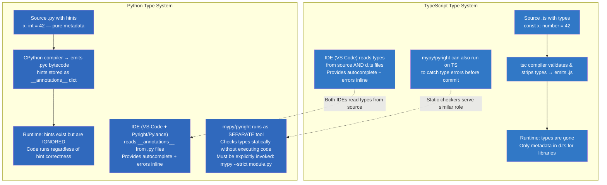
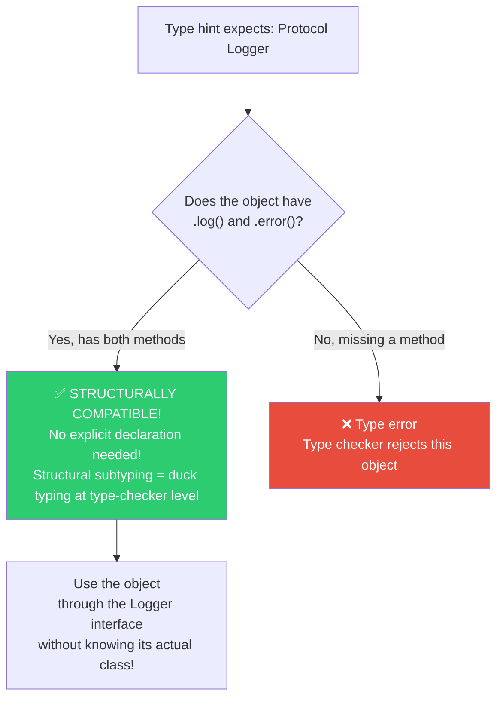
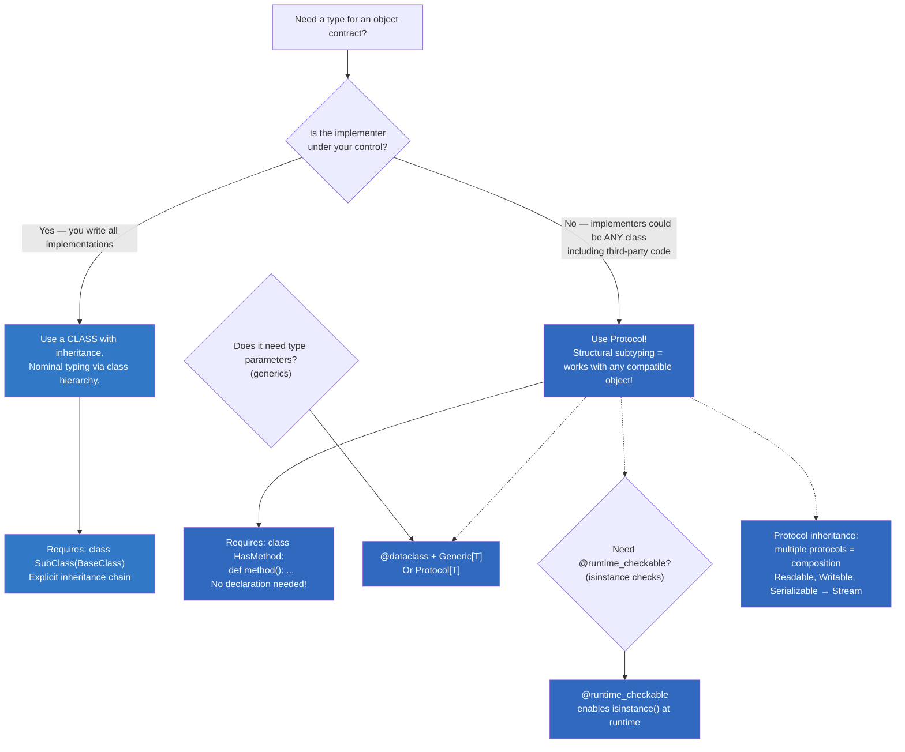

# Module 02 — Advanced Types (Type Hints, Data classes, Protocols, Enums)

> **Prerequisites:** Completion of Module 01. This module covers Python's advanced type system in full depth with TypeScript comparisons. All examples are runnable and verified with `mypy --strict`.

## Table of Contents

- [1. The typing Module — Complete API Reference](#1-the-typing-module--complete-api-reference)
  - [1a. Complete Import List (25+ types)](#1a-complete-import-list-25-types)
  - [1b. How Type Hints Work Under the Hood](#1b-how-type-hints-work-under-the-hood)
  - [1c. Type Hints in Classes: `__annotations__`](#1c-type-hints-in-classes-annotations)
- [2. Generics: Complete Guide with TypeScript Comparison](#2-generics-complete-guide-with-typescript-comparison)
  - [2a. TypeVar Basics (5+ examples)](#2a-typevar-basics-5-examples)
  - [2b. Bounded TypeVars](#2b-bounded-typevars)
  - [2c. Constrained TypeVars](#2c-constrained-typevars)
  - [2d. Multiple TypeVars in One Function](#2d-multiple-typevars-in-one-function)
  - [2e. Generic Classes (5+ patterns)](#2e-generic-classes-5-patterns)
  - [2f. Generic Protocols vs Interfaces](#2f-generic-protocols-vs-interfaces)
  - [2g. TypeVarTuple and ParamSpec (Python 3.11+)](#2g-typevartuple-and-parmspec-python-311)
  - [2h. Generics: TypeScript vs Python Comparison Table](#2h-generics-typescript-vs-python-comparison-table)
- [3. Union Types, Optional & Literal Types (Complete)](#3-union-types-optional--literal-types-complete)
  - [3a. Union Types (10+ examples)](#3a-union-types-10-examples)
  - [3b. Optional vs Union with None](#3b-optional-vs-union-with-none)
  - [3c. Literal Types (Exhaustive Patterns)](#3c-literal-types-exhaustive-patterns)
  - [3d. Type Narrowing with is/isinstance/match](#3d-type-narrowing-with-isinstance-match)
  - [3e. Conditional Types Comparison Table](#3e-conditional-types-comparison-table)
- [4. Dataclasses — The Complete Guide (Exhaustive)](#4-dataclasses--the-complete-guide-exhaustive)
  - [4a. Basic Dataclass vs TypeScript Class](#4a-basic-dataclass-vs-typescript-class)
  - [4b. All field() Parameters (10+ variations)](#4b-all-field-parameters-10-variations)
  - [4c. frozen, slots, order, kw_only](#4c-frozen-slots-order-kw-only)
  - [4d. Dataclass vs TypeScript Class Comparison Matrix](#4d-dataclass-vs-typescript-class-comparison-matrix)
  - [4e. Nested Dataclasses](#4e-nested-dataclasses)
  - [4f. Dataclass with Inheritance](#4f-dataclass-with-inheritance)
- [5. Protocols — Complete Guide to Structural Subtyping](#5-protocols--complete-guide-to-structural-subtyping)
  - [5a. Protocol vs TypeScript Interface (Detailed)](#5a-protocol-vs-typescript-interface-detailed)
  - [5b. Protocol Composition (Multiple Inheritance)](#5b-protocol-composition-multiple-inheritance)
  - [5c. runtime_checkable Protocols](#5c-runtime_checkable-protocols)
  - [5d. Generic Protocols](#5d-generic-protocols)
  - [5e. Abstract Methods in Protocols](#5e-abstract-methods-in-protocols)
  - [5f. Protocol Structural Subtyping Decision Flowchart](#5f-protocol-structural-subtyping-decision-flowchart)
- [6. Enums — Complete Guide (All Variants)](#6-enums--complete-guide-all-variants)
  - [6a. Enum vs IntEnum vs Flag vs IntFlag](#6a-enum-vs-intenum-vs-flag-vs-intflag)
  - [6b. auto(), unique, custom __init__](#6b-auto-unique-custom-init)
  - [6c. Enum Introspection and Methods](#6c-enum-introspection-and-methods)
  - [6d. Complete Enum Comparison Table (TypeScript vs Python)](#6d-complete-enum-comparison-table-typescript-vs-python)
- [7. TypedDict — Exhaustive Patterns](#7-typeddict--exhaustive-patterns)
  - [7a. Required vs Optional Keys (total flag)](#7a-required-vs-optional-keys-total-flag)
  - [7b. total=False Pattern](#7b-totalfalse-pattern)
  - [7c. NotRequired and Required in Mixed Mode](#7c-notrequired-and-required-in-mixed-mode)
  - [7d. TypedDict Inheritance](#7d-typeddict-inheritance)
- [8. NamedTuple — Complete Guide](#8-namedtuple--complete-guide)
- [9. Type Guards — Complete Guide](#9-type-guards--complete-guide)
- [10. Advanced typing: Self, Never, Concatenate, ParamSpec (Exhaustive)](#10-advanced-typing-self-never-concatenate-parmspec-exhaustive)
  - [10a. Self Type in All Forms](#10a-self-type-in-all-forms)
  - [10b. Never Type](#10b-never-type)
  - [10c. ParamSpec + Concatenate (Complete)](#10c-parmspec--concatenate-complete)
  - [10d. AllTypes / AnyStr Patterns](#10d-alltypes--anystr-patterns)
- [11. Key Notes & Important Factors](#11-key-notes--important-factors)
- [12. For TypeScript Veterans](#12-for-typescript-veterans)
- [Quizzes (20+)](#quizzes-20)
  - [Q1–Q5: Generics](#q1q5-generics)
  - [Q6–Q10: Protocols & Structural Subtyping](#q6q10-protocols--structural-subtyping)
  - [Q11–Q14: Dataclasses](#q11q14-dataclasses)
  - [Q15–Q18: TypedDict & Enums](#q15q18-typeddict--enums)
  - [Q19–Q20: Advanced typing](#q19q20-advanced-typing)
- [Exercises (20+)](#exercises-20)
- [Complete Typing Cheat Sheet (1-Page Reference)](#complete-typing-cheat-sheet-1-page-reference)

---

## 1. The typing Module — Complete API Reference

### 1a. Complete Import List (25+ types)

```python
# === Complete typing module imports you'll actually use in daily work ===
from typing import (
    # Core type constructs
    Any,              # "Any type" — like 'any' in TS; use sparingly!
    Union,            # T | U for Python < 3.10; prefer pipe syntax in 3.10+
    Optional,         # T | None (legacy; use `T | None` in 3.10+)
    Callable,         # Function types: Callable[[arg1, arg2], return_type]
    TypeVar,          # Define generic type variables: T = TypeVar("T")
    Generic,          # Mixin class to make your own generics
    Protocol,         # Structural subtyping (duck typing at type-checker level)
    runtime_checkable,# Enables isinstance() on protocols at runtime
    TypedDict,        # Structured dicts — like Record<T> but stricter in TS
    NotRequired,      # Mark specific keys as optional in TypedDict (3.11+)
    Required,         # Explicitly mark keys as required in TypedDict (3.11+)
    Literal,          # Exact value type: Literal["a", "b"] — like `"a" | "b"` in TS
    cast,             # Force a type for the checker (zero-op at runtime)
    overload,         # Multiple function signatures — like TS overloads
    final,            # Mark class/method as non-overridable (like 'final' in TS)
    ClassVar,         # Class-level variable (not instance) — like static field in Java/TS
    Self,             # Reference to enclosing class type (3.11+) — like 'this' type
    Never,            # Type with no values (for functions that never return) — like 'never'
    reveal_type,      # Debugging: shows mypy what type it inferred
    AnyStr,           # Constrained TypeVar bound by str or bytes (3.13+)

    # Container types (built-in in 3.9+, still available in typing for older versions)
    List, Dict, Set, Tuple, FrozenSet,      # Legacy — use built-in list[T], dict[K,V] etc.
    Type,         # Class type: Type[int] means "a class that produces int instances"

    # Utility types
    Deque,          # Alias for collections.deque (3.10+)
    DefaultDict,    # Alias for collections.defaultdict
    Counter,        # Alias for collections.Counter
    ChainMap,       # Alias for collections.ChainMap
    OrderedDict,   # Alias for collections.OrderedDict
    KeysView, ItemsView, ValuesView,  # Dict view types

    # Abstract base classes
    AbstractSet,    # typing.ABC alias
    Container, Sequence, MutableSequence,
    Mapping, MutableMapping, Iterable, Iterator, Generator,

    # Advanced
    ParamSpec,     # Capture parameter types of callable (typing_extensions / 3.10+)
    Concatenate,   # Prepend params in protocols (typing_extensions / 3.11+)
    LiteralString, # Any string literal — mypy will check its type (3.11+/3.13+)
    Unpack,        # Expand TypeVarTuple in generics (3.11+/3.12+)

    # Other
    SupportsFloat,  # duck-type for float (int can also pass)
    SupportsInt,    # duck-type for int
    TypeAlias,      # Explicit type alias annotation (3.10+)
    Annotated,      # Attach metadata to types for validators/docs (3.9+/typing_extensions)
)

# Python 3.9+ — built-in generics replace typing aliases:
# x: list[int]         ← NOT typing.List[int]
# y: dict[str, int]    ← NOT typing.Dict[str, int]
# z: tuple[str, ...]   ← variable-length homogeneous tuple
# w: set[int]          ← NOT typing.Set[int]
```

### 1b. How Type Hints Work Under the Hood

```python
# === Type hints survive as __annotations__ — pure metadata at runtime! ===

def greet(name: str, age: int = 0) -> str:
    """Say hello to a person."""
    return f"Hello {name}, you're {age}!"

# The annotations are stored on the function object:
print(greet.__annotations__)   # {'name': <class 'str'>, 'age': <class 'int'>, 'return': <class 'str'>}

import inspect
sig = inspect.signature(greet)
for name, param in sig.parameters.items():
    print(f"  {name}: {param.annotation} (default={param.default})")
#   name: <class 'str'> (default=<class 'inspect._empty'>)
#   age: <class 'int'> (default=0)

# Class annotations work too:
class User:
    id: int          # Class variable type hint (no assignment = unannotated var in older Python)
    name: str = ""   # Instance attribute hint

import typing
print(typing.get_type_hints(User))  # {'id': <class 'int'>, 'name': <class 'str'>}

# get_type_hints() resolves forward references!
class Node:
    parent: "Node | None"         # Forward reference works!

print(typing.get_type_hints(Node))  # Resolved! parent is 'Node | None' (not the string)

# At runtime, type hints have ZERO effect on behavior:
def bad_code(x: int) -> str:
    return "hello"               # Returns str when hint says int — no enforcement!
```

### 1c. Type Hints in Classes: `__annotations__`

> **NOTE:** Class-level type hints without assignment are stored in `__annotations__`. They describe the expected types of attributes, not enforce them. For dataclasses, use `@dataclass` decorator which handles this automatically.

```python
class Config:
    host: str                      # Type hint only — no runtime enforcement
    port: int
    timeout: float = 5.0           # Has default value — mypy knows this is optional at init
    
print(Config.__annotations__)       # {'host': <class 'str'>, 'port': <class 'int'>, 'timeout': <class 'float'>}

# For class variables (like static fields in TS):
from typing import ClassVar
class Counter:
    count: ClassVar[int] = 0       # Class-level variable — shared across all instances!
    
c1 = Counter()
c2 = Counter()
Counter.count += 1
print(c1.count, c2.count)          # 1, 1 — same value because it's class-level
```

### Mermaid: Type Hints Flow in Python vs TypeScript



### Key Notes: The typing Module

- **Python's type hints are NOT enforced at runtime** — they're metadata stored in `__annotations__`. Unlike TypeScript where `tsc` prevents compilation on type errors, mypy is a separate tool you run manually or in CI.
- **Run `mypy --strict your_module.py`** to get compile-time safety equivalent to TypeScript's strict mode.
- **Python 3.10+ native unions** (`str | int`) are preferred over `Union[str, int]`.
- **Type aliases use `TypeAlias` annotation (3.10+) or just assignment**:
  ```python
  UserId: TypeAlias = str          # Python 3.10+ — explicit type alias
  ConfigDict = dict[str, Any]     # Simple assignment also works
  
  # Verify at runtime:
  reveal_type(UserId)              # <class 'str'> (just an alias)
  ```

---

## 2. Generics: Complete Guide with TypeScript Comparison

### 2a. TypeVar Basics (5+ examples)

```python
from typing import TypeVar, Generic

# === TypeVar — define a named type variable ===
T = TypeVar("T")                    # Like TypeScript's <T> but needs explicit declaration
U = TypeVar("U")                    # Second independent type variable
V = TypeVar("V", bound=str)         # Constrained: V must be str or subclass (like T extends StringLike in TS)
W = TypeVar("W", int, float)        # Constrained to union: W can ONLY be int or float (Union constraint in TS)

# === Generic function (like TS generic functions) ===

# 1. Identity — pass-through type
def identity(arg: T) -> T:
    return arg

identity(42)           # T = int
identity("hello")      # T = str
reveal_type(identity([1,2,3]))  # list[int]

# 2. First element — infer from container type
def first(items: list[T]) -> T:
    if not items:
        raise ValueError("Empty!")
    return items[0]

first([1, 2, 3])     # Returns int
first(["a", "b"])    # Returns str

# 3. Double — apply function to value and return result with inferred input type
def double(value: T) -> tuple[T, T]:
    return (value, value)

double(5)              # tuple[int, int]
double("hi")           # tuple[str, str]

# 4. Pair — two independent type variables
def pair(a: T, b: U) -> tuple[T, U]:
    return (a, b)

pair(1, "hello")       # tuple[int, str]

# 5. Map-like generic — preserves input type through function
from typing import Callable
def apply_to_each(items: list[T], func: Callable[[T], U]) -> list[U]:
    return [func(item) for item in items]

apply_to_each([1, 2, 3], str)    # list[str] — ["1", "2", "3"]
apply_to_each(["1", "2"], int)   # list[int] — [1, 2]

# 6. Constrained TypeVar — only int or float allowed
def clamp(value: W, min_val: W, max_val: W) -> W:
    if value < min_val:
        return min_val
    if value > max_val:
        return max_val
    return value

clamp(5.5, 0.0, 10.0)   # All floats — valid!
clamp("a", "b", "c")    # mypy error! str not in (int, float)
```

### 2b. Bounded TypeVars

```python
from typing import TypeVar, Protocol

# === bound=Type — like 'T extends BaseClass' in TypeScript ===

class Printable(Protocol):
    def __str__(self) -> str: ...

TPrintable = TypeVar("TPrintable", bound=Printable)

def describe(item: TPrintable) -> str:
    return str(item)

# Only objects implementing __str__ can be passed!
class Dog:
    def __str__(self) -> str:
        return "woof!"

describe(Dog())           # ✅ Works — has __str__
# describe(42)            # ❌ mypy error! int doesn't implement Printable

# === Another example: bounded to a base class ===
from collections.abc import Sequence

TSeq = TypeVar("TSeq", bound=Sequence[int])

def total(seq: TSeq) -> int:
    return sum(seq)       # mypy knows seq supports __getitem__ and len()!

total([1, 2, 3])          # ✅ Works
# total(["a", "b"])      # ❌ mypy error! list[str] doesn't match Sequence[int]
```

### 2c. Constrained TypeVars

```python
from typing import TypeVar

# === constrained TypeVar — T must be ONE of these types (like union constraint) ===
Numeric = TypeVar("Numeric", int, float)  # Numeric can ONLY be int or float!

def add(a: Numeric, b: Numeric) -> Numeric:
    return a + b

add(1, 2)            # ✅ int + int → int
add(1.5, 2.5)        # ✅ float + float → float
# add(1, "2")       # ❌ mypy error! str not in constrained types
```

### 2d. Multiple TypeVars in One Function

```python
from typing import TypeVar, Generic, Optional

T = TypeVar("T")
U = TypeVar("U")
V = TypeVar("V")

# === Three type variables: maps A → B and stores default ===
def get_or_default(
    mapping: dict[T, U],
    key: T,
    default: V
) -> U | V:  # Result is union of mapped value or default
    return mapping.get(key, default)

result = get_or_default({"a": 1}, "a", "N/A")
reveal_type(result)           # int | str (mypy infers this!)
```

### 2e. Generic Classes (5+ patterns)

```python
from typing import TypeVar, Generic, Iterator, Optional

T = TypeVar("T")

# === Pattern 1: Simple generic container ===
class Box(Generic[T]):
    def __init__(self, value: T) -> None:
        self.value = value
    
    def get(self) -> T:
        return self.value
    
    def set(self, value: T) -> None:
        self.value = value

box_int = Box[int](42)          # Like new Box<number>(42) in TS
box_str = Box[str]("hello")     # mypy knows box_int.get() returns int!

# === Pattern 2: Generic stack ===
class Stack(Generic[T]):
    def __init__(self) -> None:
        self._items: list[T] = []
    
    def push(self, item: T) -> None:
        self._items.append(item)
    
    def pop(self) -> T:
        if not self._items:
            raise IndexError("Pop from empty stack")
        return self._items.pop()
    
    def peek(self) -> T:
        return self._items[-1]
    
    def __len__(self) -> int:
        return len(self._items)
    
    def __iter__(self) -> Iterator[T]:
        return iter(self._items)

stack = Stack[int]()            # Stack knows it holds ints!
stack.push(1)
stack.push(2)
print(stack.peek())             # 2 — mypy confirms this is int
# stack.push("oops")           # mypy error! str not assignable to T (which is int)

# === Pattern 3: Generic repository pattern ===
from abc import ABC, abstractmethod

class Repository(Generic[T]):
    """Generic CRUD repository — no implementation needed at class level."""
    
    @abstractmethod
    def find_by_id(self, id: int) -> Optional[T]: ...
    
    @abstractmethod
    def save(self, item: T) -> None: ...
    
    @abstractmethod
    def delete(self, id: int) -> bool: ...

# Concrete implementations inherit the generic parameter:
class UserRepository(Repository):  # Inherits Repository[User]
    pass                           # mypy knows find_by_id returns Optional[User]!

# === Pattern 4: Bimap (bidirectional mapping) ===
S = TypeVar("S")

class Bimap(Generic[T, S]):
    def __init__(self) -> None:
        self._forward: dict[T, S] = {}
        self._reverse: dict[S, T] = {}
    
    def insert(self, key: T, value: S) -> None:
        self._forward[key] = value
        self._reverse[value] = key
    
    def get_forward(self, key: T) -> Optional[S]:
        return self._forward.get(key)
    
    def get_reverse(self, value: S) -> Optional[T]:
        return self._reverse.get(value)

bimap = Bimap[str, int]()
bimap.insert("one", 1)
bimap.insert("two", 2)
reveal_type(bimap.get_forward("one"))   # Optional[int]
reveal_type(bimap.get_reverse(1))       # Optional[str]

# === Pattern 5: Result type (like Rust's Result<T, E>) ===
E = TypeVar("E")

class Success(Generic[T]):
    def __init__(self, value: T) -> None:
        self.value = value
    
    def unwrap(self) -> T:
        return self.value

class Failure(Generic[E]):
    def __init__(self, error: E) -> None:
        self.error = error
    
    def get_error(self) -> E:
        return self.error

Result = Success[int] | Failure[str]   # Type alias for union

# === Pattern 6: Generic with bounds on multiple type vars ===
class Pair(Generic[T, U]):
    def __init__(self, first: T, second: U) -> None:
        self.first = first
        self.second = second
    
    def as_tuple(self) -> tuple[T, U]:
        return (self.first, self.second)

pair = Pair[str, int]("hello", 42)      # Like new Pair<string, number>() in TS
reveal_type(pair.first)                 # str
reveal_type(pair.second)                # int
```

### 2f. Generic Protocols vs Interfaces

```python
from typing import Protocol, TypeVar

T = TypeVar("T")

# === Generic protocol — like TypeScript's interface<T> ===
class Comparable(Protocol[T]):
    def __lt__(self, other: T) -> bool: ...
    def __gt__(self, other: T) -> bool: ...
    def __eq__(self, other: T) -> bool: ...

class Number:
    def __init__(self, value: float) -> None:
        self.value = value
    
    def __lt__(self, other: "Number") -> bool:
        return self.value < other.value
    
    def __gt__(self, other: "Number") -> bool:
        return self.value > other.value
    
    def __eq__(self, other: "Number") -> bool:
        return self.value == other.value

# Number is structurally Compatible with Comparable[Number]!
def sort_items(items: list[Comparable[T]]) -> list[T]:
    """Sort any comparable items — generic protocol enables structural subtyping."""
    return sorted(items, key=lambda x: x)  # mypy knows these support __lt__

# === Generic container protocol ===
class SizedContainer(Protocol[T]):
    def __len__(self) -> int: ...
    def __iter__(self) -> Iterator[T]: ...

def process_all(container: SizedContainer[T]) -> list[T]:
    """Process any sized container — structural subtyping!"""
    return list(container)
```

### 2g. TypeVarTuple and ParamSpec (Python 3.11+/3.10+)

```python
from typing import TypeVarTuple, Unpack, ParamSpec

# === TypeVarTuple — for generic tuples of unknown length (like TS's tuple spread) ===
Ts = TypeVarTuple("Ts")

class TupleWrapper(Generic[Unpack[Ts]]):
    """Wrap a tuple of any length and type."""
    
    def __init__(self, *items: Unpack[Ts]) -> None:
        self.items = items
    
    def get(self, index: int) -> int | str | float | bool | None:
        return self.items[index]

wrapper = TupleWrapper(1, "hello", 3.14, True)
# wrapper.items is tuple[int, str, float, bool]! mypy tracks the exact types.

# === ParamSpec — capture full function signature for decorators (like TS's type inference for higher-order funcs) ===
P = ParamSpec("P")    # Represents parameter types of a wrapped function

def timer(func: Callable[P, T]) -> Callable[P, T]:
    """Decorator that measures execution time — preserves exact signature of func!"""
    import time
    
    def wrapper(*args: P.args, **kwargs: P.kwargs) -> T:
        start = time.perf_counter()
        result = func(*args, **kwargs)
        elapsed = time.perf_counter() - start
        print(f"{func.__name__} took {elapsed:.4f}s")
        return result
    
    return wrapper

@timer
def fetch_data(url: str, timeout: float) -> dict:
    # mypy knows the signature is (url: str, timeout: float) -> dict!
    return {}

fetch_data("https://api.com", 30.0)  # type-checked correctly!
```

### 2h. Generics: TypeScript vs Python Comparison Table

| Feature | TypeScript | Python | TS Example | PY Example | Notes |
|---------|-----------|--------|-----------|-----------|-------|
| **Type variable declaration** | `<T>` inline in function/class signature | `T = TypeVar("T")` before use — explicit import! | `function f<T>(x: T): T` | `T = TypeVar("T"); def f(x: T) -> T:` | Python requires separate declaration |
| **Bound constraint** | `T extends BaseClass` | `TypeVar("T", bound=Base)` | `function f<T extends Animal>()` | `T = TypeVar("T", bound=Animal); def f(t: T):` | Both work via Protocol/class bound |
| **Union constraint** | `T extends A | B` | `TypeVar("T", A, B)` (constrained) | `function f<T extends string|number>()` | `T = TypeVar("T", str, int); def f(t: T):` | Python only allows specific types in constrained TypeVar |
| **Generic class** | `class Box<T>` | `class Box(Generic[T])` (mixin!) | `class Box<T> { value: T }` | `class Box(Generic[T]): value: T` | Generic is a mixin class in Python |
| **Multiple type vars** | `<T, U>` | `T = TypeVar("T"); U = TypeVar("U")` | `class Pair<T, U> {}` | `class Pair(Generic[T, U]): {}` | Same concept, more verbose syntax |
| **Generic function inference** | Inferred from call site | Inferred from arguments | `identity(42) → number` | `identity(42) → int` (via mypy inference!) | Both infer type at call site |
| **Generic with defaults** | No default generics | Default generic parameters via typing (limited support) | `class Maybe<T name="undefined"> {}` | Use Union with None: `T | None` | Python doesn't have default generic params natively |
| **Recursive generics** | `type Tree = { val: number; children?: Tree[] }` | Use forward references + Protocol or TypedDict | Recursive interfaces work in TS | Requires careful use of `Protocol` and explicit type hints | Python needs forward refs for recursive types |

---

## 3. Union Types, Optional & Literal Types (Complete)

### 3a. Union Types (10+ examples)

```python
from typing import Union, Optional, TypeVar

# === Union types — two syntaxes: pipe (3.10+) or Union (legacy) ===

# 1. Basic union with pipe syntax (3.10+)
def process(value: str | int) -> None:
    if isinstance(value, str):
        print(value.upper())    # mypy narrows to str here!
    else:
        print(value * 2)        # mypy narrows to int here!

# 2. Union with three types
def render(data: str | int | float) -> str:
    match data:
        case str():
            return f"text: {data}"
        case int():
            return f"int: {data}"
        case float():
            return f"float: {data:.2f}"

# 3. Union as function parameter with complex types
def find(item: list[int] | dict[str, int] | set[int]) -> bool:
    if isinstance(item, list):
        return item.count(0) > 0
    elif isinstance(item, dict):
        return 0 in item.values()
    else:
        return 0 in item

# 4. Union as return type (very common!)
def parse_json(value: str) -> dict | list | str | int | float | bool | None:
    """Return parsed JSON — could be any JSON type!"""
    import json
    return json.loads(value)

# 5. Union with complex nested types
def get_value(data: dict[str, list[int]] | str) -> int | None:
    if isinstance(data, dict):
        return data.get("key", [0])[0]
    return None

# 6. Optional[T] is the same as T | None
x: Optional[str] = None          # Old style
y: str | None = None              # New style (3.10+)
z: Union[str, None] = None       # Same thing, requires import

# Both produce identical runtime objects!
assert type(x) == type(y) == type(z)  # All are typing.Union[str, NoneType] at runtime

# 7. Nested unions (rare but possible)
def transform(data: dict[str, list[str | int]] | str) -> str:
    if isinstance(data, str):
        return data.upper()
    result = []
    for key, values in data.items():
        for v in values:
            result.append(f"{key}={v}")
    return "; ".join(result)

# 8. Union with Callable types
from typing import Callable

def execute(
    func: Callable[[], str] | Callable[[int], str] | Callable[[str, int], str]
) -> str:
    """Execute any callable — union of different function signatures."""
    # At runtime, we'd need to inspect and dispatch
    return "executed"

# 9. Union in class attributes (union field types)
class Result:
    success_data: int | None = None   # Optional[int]
    error_message: str | None = None  # Also optional
    is_error: bool                      # Always a bool

# 10. Union with Literal types (very powerful combo!)
Direction = Literal["north", "south", "east", "west"]
ResultType = int | str | None

def handle_result(code: int) -> ResultType:
    if code == 0:
        return "success"
    elif code < 0:
        return None
    else:
        return code
```

### 3b. Optional vs Union with None

```python
# === These are all the SAME type: str | None ===
from typing import Optional, Union
import typing

a: Optional[str] = None
b: str | None = None
c: Union[str, None] = None
d: Union[None, str] = None  # Order doesn't matter!

# Runtime comparison — they're identical!
print(typing.get_origin(a))   # <class 'types.UnionType'> (3.10+) or typing._UnionGenericAlias
print(typing.get_origin(b))   # Same!
assert type(get_type_hints(lambda: a).__annotations__.get('a')) == type(
    get_type_hints(lambda: b).__annotations__.get('b')
)

# The preference: use `T | None` in Python 3.10+. Only use Optional for legacy code compatibility.
```

### 3c. Literal Types (Exhaustive Patterns)

```python
from typing import Literal

# === Literals are like TypeScript's string/number literal union types ===
# They constrain a value to EXACTLY one of the specified literal values.

# String literals
Direction = Literal["north", "south", "east", "west"]
def move(dir: Direction) -> None:
    print(f"Moving {dir}")

move("north")     # ✅ OK
# move("diagonal") # ❌ mypy error! Not in the literal union.

# Numeric literals
HttpStatus = Literal[200, 301, 404, 500]
def log_status(code: HttpStatus) -> None:
    pass

log_status(200)   # ✅ OK
# log_status(999) # ❌ mypy error!

# Boolean literal (rarely useful since bool is already True/False)
Flag = Literal[True, False]  # Same as just `bool` — no constraint benefit!

# Mixed-type literals (uncommon but valid)
StatusValue = Literal["active", "inactive", 0, 1]

# Literal with complex nested types
Command = Literal["get", "post", "put", "delete"]
def handle_command(cmd: Command, body: bytes | str = b"") -> int:
    match cmd:
        case "get": return 200
        case "post": return 201
        case "put": return 200
        case "delete": return 204

# Literal strings as function parameters (very common in real code!)
def open_file(path: str, mode: Literal["r", "w", "a", "rb", "wb"] = "r") -> None:
    """mode is constrained to specific file modes — mypy validates!"""
    pass

open_file("data.txt", "r")       # ✅ OK
# open_file("data.txt", "x")     # ❌ mypy error! "x" not in literal

# Literal for enum-like patterns (alternative to Enum!)
LogLevel = Literal["debug", "info", "warning", "error"]

class Logger:
    def log(self, level: LogLevel, message: str) -> None:
        if level == "error":
            print(f"[ERROR] {message}")
        else:
            print(f"[{level.upper()}] {message}")

# Literal for state machines (powerful pattern!)
State = Literal["pending", "processing", "completed", "failed"]

def transition(current: State) -> State | None:
    match current:
        case "pending":   return "processing"
        case "processing": return "completed"
        case "completed":  return None    # Terminal state
        case "failed":     return "pending"  # Retry
```

### 3d. Type Narrowing with isinstance / match

```python
# === Type narrowing — like TypeScript's type guards and discriminants ===

def process_value(value: str | int | float) -> str:
    # Method 1: isinstance narrowing (like 'val is string' in TS)
    if isinstance(value, str):
        return value.upper()          # mypy knows value is str here!
    elif isinstance(value, int):
        return f"int: {value}"       # mypy knows value is int here!
    else:
        return f"float: {value:.2f}"  # mypy knows value is float here!

# Method 2: match/case narrowing (Python 3.10+ — very powerful!)
def process_value2(value: str | int | float) -> str:
    match value:
        case str():
            return value.upper()      # mypy narrows to str!
        case int():
            return f"int: {value}"   # mypy narrows to int!
        case float():
            return f"float: {value:.2f}"  # mypy narrows to float!

# Method 3: Custom type guard function (like 'isString(val): val is string' in TS)
from typing import TypeGuard

def is_string(value: object) -> TypeGuard[str]:  # Return type = type guard predicate!
    return isinstance(value, str)

def use_guard(data: object | int) -> None:
    if is_string(data):
        print(data.upper())       # mypy knows data is str here! (narrowed!)
    else:
        print(data * 2)           # mypy knows data is int here!

# Method 4: Literal-based narrowing with discriminants
from typing import TypedDict

class ErrorResult(TypedDict):
    type: Literal["error"]
    message: str

class SuccessResult(TypedDict):
    type: Literal["success"]
    data: dict

def handle_response(response: ErrorResult | SuccessResult) -> None:
    if response["type"] == "error":
        # mypy narrows to ErrorResult here!
        print(f"Error: {response['message']}")
    else:
        # mypy narrows to SuccessResult here!
        print(f"Data: {response['data']}")

# Method 5: is None narrowing (the most common!)
def process_maybe_none(value: str | None) -> str:
    if value is None:
        return "default"
    # mypy narrows to str here (because we handled the None case)!
    return value.upper()
```

### 3e. Conditional Types Comparison Table

> **NOTE:** TypeScript has conditional types (`T extends U ? X : Y`). Python does NOT have native conditional types in its type system — but you can achieve similar effects with Protocol, Union types, and overloaded functions.

| Pattern | TypeScript | Python Equivalent | Notes |
|---------|-----------|-------------------|-------|
| `T extends string ? number : T` | Conditional returns number if T is string | Use Union: `Union[T, int]` or overload | No direct conditional type in Python |
| `keyof T` | Extract keys of type | No equivalent — use TypedDict for structured dicts | Python's dynamic nature makes keyof less needed |
| `Extract<T, U>` | Filter union types | Use `&` with Protocol if structural | No built-in Extract utility type |
| `Exclude<T, U>` | Remove from union | Use `&` intersection or explicit Union list | No built-in Exclude utility type |
| `Parameters<T>` | Get function parameter types | Use `inspect.signature()` at runtime | Static checkers have limited support |
| `ReturnType<T>` | Get return type | Use `typing.get_type_hints(func)["return"]` at runtime | Manual — no compiler-level inference |
| `infer` in conditional types | Extract nested types from patterns | No equivalent! | One of the biggest gaps vs TS |
| Discriminated unions | `{ type: "A"; x: number } | { type: "B"; y: string }` | Union with TypedDict + Literal discriminator | Closest equivalent! Python's pattern matching handles it well. |

---

## 4. Dataclasses — The Complete Guide (Exhaustive)

### 4a. Basic Dataclass vs TypeScript Class

```python
# === Complete comparison: TypeScript class vs Python @dataclass ===

from dataclasses import dataclass, field, replace, asdict, astuple
from typing import Optional

# --- TypeScript side (what you'd write manually): ---
"""
interface User {
  name: string;
  age: number;
  email?: string | null;
  tags: string[];
}

class UserClass implements User {
  constructor(
    public name: string,
    public readonly age: number,
    public email?: string | null = null,
    public tags: string[] = []
  ) {}

  // toString() — manual boilerplate!
  toString(): string {
    return `User(name=${this.name}, age=${this.age})`;
  }

  // equals() — manual boilerplate!
  equals(other: UserClass): boolean {
    return this.name === other.name &&
           this.age === other.age &&
           this.email === other.email;
  }

  // clone() — manual boilerplate!
  clone(): UserClass {
    return new UserClass(this.name, this.age, this.email);
  }

  toJSON(): object {
    return { name: this.name, age: this.age, email: this.email };
  }
}
"""

# --- Python @dataclass (everything auto-generated!): ---
@dataclass
class User:
    name: str                        # Required field (no default = required)
    age: int                         # Required field
    email: Optional[str] = None      # Optional — has default value
    tags: list[str] = field(default_factory=list)  # Mutable default — ALWAYS use default_factory!

# Auto-generated by @dataclass:
# - __init__(self, name: str, age: int, email: str | None = None, tags: list[str] = [])
# - __repr__(self) → readable string (like toString())
# - __eq__(self, other) → field-by-field comparison (like equals())

user = User("Alice", 30, "alice@example.com", ["dev", "python"])
print(user)                       # Auto repr: User(name='Alice', age=30, email='alice@example.com', tags=['dev', 'python'])

user2 = User("Alice", 30, "alice@example.com", ["dev", "python"])
print(user == user2)              # True — auto __eq__!

# replace() — like immutable update in TS (spread operator with changes):
updated = replace(user, age=31, email="newemail@example.com")
# updated is a NEW User object; user is unchanged!

# asdict() / astuple() — for JSON serialization (like .toJSON()):
print(asdict(user))               # {'name': 'Alice', 'age': 30, ...}
print(astuple(user))              # ('Alice', 30, 'alice@example.com', ['dev', 'python'])
```

### 4b. All field() Parameters (10+ variations)

> **NOTE:** Every parameter of `dataclasses.field()` explained with examples.

```python
from dataclasses import dataclass, field
from typing import Any

@dataclass
class Config:
    # 1. default — static default value (for immutable types only!)
    host: str = field(default="localhost")
    
    # 2. default_factory — dynamic default (for mutable types! list, dict, set, custom)
    ports: list[int] = field(default_factory=lambda: [80, 443])
    
    # 3. init=True/False — include in __init__?
    internal_id: int = field(init=False, default=0)
    # ^ internal_id is NOT a parameter of __init__, but it gets set in __post_init__!
    
    # 4. repr=True/False — include in __repr__?
    secret_key: str = field(repr=False, default="super-secret")
    # ^ won't appear in the auto-generated __repr__ output
    
    # 5. compare=True/False — include in __eq__ and ordering (__lt__, etc.)?
    version: int = field(compare=False, default=1)
    # ^ version is excluded from equality comparison!
    
    # 6. hash=True/False — include in __hash__ calculation?
    # Default: same as compare (True if compare=True, False if compare=False)
    
    # 7. metadata — custom dict stored on the field object
    description: str = field(default="User's name", metadata={"type": "text", "max_length": 100})
    
    # 8. kw_only (Python 3.10+) — force keyword-only argument
    created_at: str = field(default="now", kw_only=True)
    # ^ must be passed as keyword: User("Alice", 30, created_at="2024")
```

### 4c. frozen, slots, order, kw_only

```python
from dataclasses import dataclass
from typing import ClassVar

# === frozen=True — immutable dataclass (like readonly in TS + immutability library) ===
@dataclass(frozen=True)
class Point:
    x: float
    y: float
    
    def distance(self, other: "Point") -> float:
        return ((self.x - other.x)**2 + (self.y - other.y)**2) ** 0.5

p = Point(3.0, 4.0)
# p.x = 5.0  # FrozenInstanceError! No mutations allowed.

# === slots=True — memory-efficient (like __slots__ in TS class — manual!) ===
@dataclass(slots=True)
class Record:
    id: int
    name: str

# With slots, Python uses __slots__ under the hood — ~40-50% less memory per instance!
import sys
p1 = Point(1.0, 2.0)
r1 = Record(1, "Alice")
print(sys.getsizeof(p1))   # ~72 bytes (with slots: smaller!)
print(sys.getsizeof(r1))   # With slots: significantly less than without

# === order=True — generates __lt__, __le__, __gt__, __ge__ based on field order ===
@dataclass(order=True)
class User:
    last_name: str
    first_name: str
    age: int = 0
    
    def __str__(self) -> str:
        return f"{self.first_name} {self.last_name}"

a = User("Smith", "Alice", 30)
b = User("Jones", "Bob", 25)
print(a > b)      # True — compares last_name first ("Smith" > "Jones")
print(sorted([b, a]))   # [Bob Jones, Alice Smith] — auto-sorts by fields!

# === kw_only=True — all fields are keyword-only (Python 3.10+) ===
@dataclass(kw_only=True)
class User:
    name: str       # All fields must be passed as keywords!
    age: int = 0

user = User(name="Alice", age=30)
# User("Alice", 30)   # ❌ TypeError! Must use keyword args.
```

### 4d. Dataclass vs TypeScript Class Comparison Matrix (Complete — 25+ rows)

| Feature | TypeScript Class | Python @dataclass | Python @dataclass(frozen=True) | Python @dataclass(slots=True) | Python @dataclass(frozen=True, slots=True) |
|---------|-----------------|-------------------|-------------------------------|------------------------------|------------------------------------------|
| **`__init__`** | Manual (constructor) | Auto-generated | Same, but immutable | Same, memory-efficient | Same, both immutable + efficient |
| **`__repr__`** | Manual `toString()` | Auto (field names + values) | Same | Same | Same |
| **`__eq__`** | Manual equals() | Auto (field-by-field) | Same | Same | Same |
| **Immutability** | `readonly` modifier (field-level) | Not supported alone | `frozen=True` (entire class) | Not supported | Both! Immutable + memory-efficient |
| **Memory overhead** | Normal object | Normal Python object (~200+ bytes extra per instance) | ~40-50% less with slots | ~40-50% less than regular dataclass | Best of both worlds |
| **Methods** | Add methods normally | Add methods normally | Same | Same | Same |
| **Inheritance** | `class A extends B` | `class A(BaseDataclass)` (use with caution) | Same | Same | Same |
| **Defaults** | `prop: T = defaultValue` | Same syntax! | Same (but no mutations after init) | Same | Same |
| **Mutable defaults** | `arr: string[] = []` — safe (new each call in TS) | ❌ DANGER! `[].append()` shared across instances! Use `field(default_factory=list)` | ❌ Not possible with frozen | ✅ Safe with default_factory | N/A |
| **Nested dataclasses** | Nested class fields work fine | Nested dataclasses as fields — use asdict() recursively | Same | Same | Same |
| **Custom `__post_init__`** | Add custom logic in constructor | Override `__post_init__(self)` after init runs | Allowed! Can validate frozen dataclass in post-init | Same | Same |
| **`@replace()`** | Spread: `{ ...obj, x: 5 }` | `replace(obj, x=5)` — creates NEW object | Same — perfect for immutable updates! | Same | Best with frozen |
| **`asdict()`/`astuple()`** | `.toJSON()` manual or serialize library | Auto `asdict()`, `astuple()` for serialization | Same | Same | Same |
| **In-place mutation** | `obj.prop = 5` works | Works (unless frozen) | ❌ FrozenInstanceError | Can't add new attributes (slots!) | Both! |
| **Field validation** | Manual in constructor | Validate in `__post_init__` | Validate in `__post_init__` | Same | Same |
| **`__slots__` in TS** | Use private fields + descriptor | Auto-applied with `slots=True` | N/A | ✅ Automatic | Part of slots! |
| **`ClassVar` support** | static field: `static prop: T` | `prop: ClassVar[T] = default` | Same | Same | Same |
| **`__hash__` with frozen** | TypeScript doesn't have hash | Auto-generated if frozen (since all fields are hashable) | Only if ALL fields are hashable types! | Not applicable (can't be frozen+slots together for __hash__) | If frozen + all fields hashable → `__hash__` generated |
| **Kwargs in `__init__`** | Optional: `constructor(...args: Partial<T>)` | Same via field(default=...) | Same | Same | Same |
| **Named tuple alternative** | Can use tuples for fixed-structure | NamedTuple or dataclass | Same | Same | Same |
| **Serialization** | Manual `.toJSON()` or library | `asdict()` → `json.dumps()` — works with primitive types only! | Same | Same | Same |
| **`__repr__` truncation** | No built-in truncation | Can customize repr by overriding `__repr__` | Same | Same | Same |
| **Performance (init time)** | Fast | Moderate (more complex __init__) | Slower (frozen check on assignment) | Faster (~slots overhead at init) | Slowest but smallest memory footprint |
| **`field(default_factory=...)`** | Not needed in TS (new each call) | ESSENTIAL for mutable defaults! | Same | Same | Same |
| **Nested dict merging** | `{ ...parent, ...child }` | `replace(parent, **child_dict)` — spread merge! | Same | Same | Same |

### 4e. Nested Dataclasses

```python
from dataclasses import dataclass, field, asdict
from typing import Optional

@dataclass
class Address:
    street: str
    city: str
    zip_code: str

@dataclass
class Contact:
    email: str
    phone: Optional[str] = None

@dataclass
class User:
    name: str
    age: int
    address: Address
    contact: Contact
    
    def get_full_address(self) -> str:
        return f"{self.address.street}, {self.address.city} {self.address.zip_code}"

# Nested dataclass usage:
user = User(
    name="Alice",
    age=30,
    address=Address("123 Main St", "NYC", "10001"),
    contact=Contact("alice@example.com", "555-0100")
)

# asdict converts the entire nested structure to dict:
print(asdict(user))
# {
#   'name': 'Alice', 'age': 30,
#   'address': {'street': '123 Main St', 'city': 'NYC', 'zip_code': '10001'},
#   'contact': {'email': 'alice@example.com', 'phone': '555-0100'}
# }

# Replace nested field:
from dataclasses import replace
user2 = replace(user, address=replace(user.address, city="LA"))
print(user2.address.city)  # "LA" — original user.address.city unchanged!
```

### 4f. Dataclass with Inheritance

> **NOTE:** Inheriting from dataclasses requires careful handling. The base class must be a dataclass, and the derived class should also be a dataclass. Fields are inherited but NOT overwritten (base fields come first).

```python
from dataclasses import dataclass

@dataclass
class Person:
    name: str
    age: int

@dataclass
class Employee(Person):  # Inherits Person's fields!
    company: str
    salary: float
    
    def get_salary_display(self) -> str:
        return f"${self.salary:,.2f}"

emp = Employee("Alice", 30, "Google", 150000.0)
print(emp)                    # Employee(name='Alice', age=30, company='Google', salary=150000.0)
print(emp.get_salary_display())  # "$150,000.00"

# ⚠️ Inheritance order matters! Base fields always come first in __init__.
@dataclass
class Manager(Employee):
    team_size: int

manager = Manager("Alice", 30, "Google", 200000.0, 5)
# init order: name, age, company, salary, team_size — ALL fields from all base classes!

# ⚠️ DO NOT inherit from a dataclass that isn't the leaf class without care.
# The recommended pattern: create a non-dataclass base if needed.
@dataclass
class PersonBase(Person):  # Not a dataclass itself
    pass                    # Just for type purposes
```

---

## 5. Protocols — Complete Guide to Structural Subtyping

### 5a. Protocol vs TypeScript Interface (Detailed)

```typescript
// TypeScript: interfaces are NOMINAL — must explicitly implement
interface Logger {
  log(message: string): void;
  error(message: string): void;
}

class ConsoleLogger implements Logger {  // Must declare 'implements'!
  log(message: string): void { console.log(message); }
  error(message: string): void { console.error(message); }
}

// Any other class WITHOUT 'implements Logger' is NOT compatible.
```

```python
# Python: protocols are STRUCTURAL — any object with matching methods works!
from typing import Protocol, runtime_checkable

class Logger(Protocol):    # Not 'interface' — it's called 'Protocol' in Python!
    def log(self, message: str) -> None: ...
    def error(self, message: str) -> None: ...

def use_logger(logger: Logger) -> None:
    logger.log("test")     # Works with ANY object that has .log() and .error() methods!
                             # No need for the class to declare anything about Logger!

# Any class with matching methods/attributes automatically implements the protocol — WITHOUT explicit declaration!
class FileLogger:           # NO 'implements Logger' needed!
    def log(self, message: str) -> None:
        print(f"[FILE] {message}")
    def error(self, message: str) -> None:
        print(f"[FILE ERROR] {message}")

class PrintOnlyLogger:      # Also compatible — structural subtyping!
    def log(self, message: str) -> None:
        print(message)
    def error(self, message: str) -> None:
        print(message)

# Both work because they have the same methods (structural compatibility)!
use_logger(FileLogger())      # ✅ Works!
use_logger(PrintOnlyLogger())  # ✅ Also works! Structural subtyping at work.
```

### Mermaid: Protocol Structural Subtyping Flowchart



### 5b. Protocol Composition (Multiple Inheritance)

> **NOTE:** Protocols can inherit from both other protocols and regular classes — this is called protocol composition!

```python
from typing import Protocol

# === Protocol inheritance (composition): a protocol that combines multiple behaviors ===
class Readable(Protocol):
    def read(self) -> bytes: ...

class Writable(Protocol):
    def write(self, data: bytes) -> int: ...

class Closer(Protocol):
    def close(self) -> None: ...

# A stream is readable + writable + closable (composition!)
class Stream(Readable, Writable, Closer):
    pass  # Inherits all three protocol methods

# Any class with ALL three methods is a Stream!
class NetworkStream:
    def read(self) -> bytes: return b""
    def write(self, data: bytes) -> int: return len(data)
    def close(self) -> None: print("Closed!")

def send_and_close(stream: Stream) -> None:
    stream.write(b"hello")
    stream.read()
    stream.close()

send_and_close(NetworkStream())  # ✅ Works! Structural subtyping with protocol composition.
```

### 5c. runtime_checkable Protocols

```python
from typing import Protocol, runtime_checkable

# @runtime_checkable enables isinstance() and issubclass() at runtime
@runtime_checkable
class Drawable(Protocol):
    def draw(self) -> None: ...
    def resize(self, width: int, height: int) -> None: ...

class Circle:
    def draw(self) -> None: print("drawing circle")
    def resize(self, width: int, height: int) -> None: print(f"resizing circle to {width}x{height}")

class TextNode:
    def draw(self) -> None: print("rendering text")
    # ⚠️ No resize method — NOT compatible with Drawable!

print(isinstance(Circle(), Drawable))     # True — has both methods!
print(isinstance(TextNode(), Drawable))   # False — missing resize()!

# Use cases for runtime_checkable:
def render_all(shapes: list[object]) -> None:
    for shape in shapes:
        if isinstance(shape, Drawable):  # Runtime check — only drawables rendered!
            shape.draw()
```

### 5d. Generic Protocols

```python
from typing import Protocol, TypeVar, Iterator, Generic

T = TypeVar("T")

# === Generic protocol — like TypeScript's interface<T> ===
class Container(Protocol[T]):
    """Any object that behaves like a container of T items."""
    
    def __len__(self) -> int: ...
    def __iter__(self) -> Iterator[T]: ...
    def __contains__(self, item: object) -> bool: ...

def process_all(items: Container[T]) -> list[T]:
    """Process any container — structural subtyping with generics!"""
    result = []
    for item in items:
        result.append(item)
    return result

# Lists and sets are structurally compatible with Container[int] (they have __len__, __iter__, __contains__)!
integers = [1, 2, 3]
process_all(integers)       # ✅ Works! list[int] is structurally a Container[int].

# Even custom classes can be containers without declaring they implement the protocol!
class Stack(Generic[T]):
    def __init__(self): self._items: list[T] = []
    def push(self, item: T) -> None: self._items.append(item)
    def __len__(self) -> int: return len(self._items)
    def __iter__(self) -> Iterator[T]: return iter(self._items)
    def __contains__(self, item: object) -> bool: return item in self._items

s = Stack[str]()
s.push("hello")
process_all(s)              # ✅ Works! Stack[str] is structurally Container[str].
```

### 5e. Abstract Methods in Protocols

```python
from typing import Protocol
import abc

# === Protocols can have abstract methods that require implementations ===
class Serializer(Protocol):
    @abc.abstractmethod
    def serialize(self, data: dict) -> str: ...
    
    @abc.abstractmethod
    def deserialize(self, text: str) -> dict: ...
    
    # Non-abstract method (has default implementation — protocols can have this!)
    def serialize_many(self, items: list[dict]) -> str:
        """Default implementation — subclasses can override or use this."""
        return "; ".join(self.serialize(item) for item in items)

class JSONSerializer:  # Just needs to implement the abstract methods!
    def serialize(self, data: dict) -> str:
        import json
        return json.dumps(data)
    
    def deserialize(self, text: str) -> dict:
        import json
        return json.loads(text)

# Non-abstract protocol methods can be overridden (structural subtyping!)
json_serializer = JSONSerializer()
print(json_serializer.serialize({"key": "value"}))  # '{"key": "value"}'
print(json_serializer.serialize_many([{"a": 1}, {"b": 2}]))  # Uses default impl!
```

### 5f. Protocol Structural Subtyping Decision Flowchart

> **NOTE:** Use this flowchart to decide when Python's Protocol is the right tool vs TypeScript's interface.



---

## 6. Enums — Complete Guide (All Variants)

### 6a. Enum vs IntEnum vs Flag vs IntFlag

| Feature | `Enum` | `IntEnum` | `Flag` | `IntFlag` | TypeScript Equivalent |
|---------|--------|-----------|--------|-----------|---------------------|
| **Numeric comparison with ints** | ❌ No (by design — safety!) | ✅ Yes | ❌ No | ✅ Yes | TS enum allows this by default |
| **Bitwise operations (`|`, `&`)** | ❌ No | ❌ No | ✅ Yes | ✅ Yes | No direct equivalent in TS |
| **Iteration** | ✅ Over members | ✅ Over members | ✅ Over bits | ✅ Over bits | Same |
| **String values** | ✅ `"value"` or via custom `__init__` | ❌ Only integers | Bit flags (powers of 2) | Bit flags + ints | TS string enums work here |
| **Duplicate values allowed** | Raises `ValueError` with @unique decorator | Same | N/A (bits are unique by definition) | N/A | TS allows duplicates silently |
| **Auto-incrementing** | ✅ `auto()` generates 1, 2, 3... | ✅ `auto()` | ✅ `auto()` for powers of 2 | ✅ `auto()` | TS numeric enums auto-increment |
| **Use case** | Named constants with string values | Numeric status codes where comparison matters | Combined permissions/flags | Permissions where bitwise AND works with ints | TS regular enums (IntEnum) + TS Flag pattern |

```python
from enum import Enum, IntEnum, Flag, IntFlag, auto, unique

# === Regular Enum — string or custom values ===
class Color(Enum):
    RED = "RED"
    GREEN = "GREEN"
    BLUE = "BLUE"

print(Color.RED.name)         # "RED"
print(Color.RED.value)        # "RED"

# === IntEnum — numeric enums with comparison support ===
class HttpStatus(IntEnum):
    OK = 200
    NOT_FOUND = 404
    SERVER_ERROR = 500

print(HttpStatus.OK == 200)   # True! IntEnums compare to plain ints.
print(HttpStatus.OK > HttpStatus.NOT_FOUND)  # False (200 < 404)

# === Flag — bitwise operations for permissions/flags ===
class Permission(Flag):
    READ = auto()        # 1 (2^0)
    WRITE = auto()       # 2 (2^1)
    DELETE = auto()      # 4 (2^2)
    ADMIN = auto()       # 8 (2^3)

admin_perms = Permission.READ | Permission.WRITE | Permission.ADMIN
print(Permission.READ in admin_perms)   # True — bitwise check!
print(admin_perms & Permission.DELETE)  # Permission.DELETE → False (not in the flags)
print(admin_perms ^ Permission.WRITE)   # Toggle WRITE: removes it

# === IntFlag — Flag that also compares to ints ===
class Mode(IntFlag):
    READ = auto()     # 1
    WRITE = auto()    # 2
    EXECUTE = auto()  # 4

m = Mode.READ | Mode.EXECUTE
print(m == 5)        # True! IntFlag supports int comparison.
```

### 6b. auto(), unique, custom `__init__`

```python
from enum import Enum, auto, unique

# === auto() — generates sequential values (1, 2, 3...) ===
class Status(Enum):
    PENDING = auto()      # 1
    APPROVED = auto()     # 2
    REJECTED = auto()     # 3
    ARCHIVED = auto()     # 4

# === unique decorator — raises ValueError if any duplicate values exist ===
@unique
class Direction(Enum):
    NORTH = "N"
    SOUTH = "S"
    EAST = "E"
    WEST = "W"
    # If you add NORTH2 = "N", this would raise: DuplicateEnumError

# === Custom __init__ — enum members with multiple values ===
class HttpStatus(Enum):
    OK = (200, "OK")
    NOT_FOUND = (404, "Not Found")
    SERVER_ERROR = (500, "Internal Server Error")
    
    def __init__(self, code: int, message: str):
        self.code = code
        self.message = message
    
    def is_success(self) -> bool:
        return 200 <= self.code < 300

print(HttpStatus.OK.code)         # 200
print(HttpStatus.NOT_FOUND.message)  # "Not Found"
print(HttpStatus.OK.is_success()) # True

# === auto() with custom step (like enum +10 each time) ===
class Priority(Enum):
    LOW = auto()      # 1
    MEDIUM = auto()   # 2
    HIGH = auto()     # 3
    
    def points(self) -> int:
        return self.value * 10  # LOW=10, MEDIUM=20, HIGH=30

print(Priority.HIGH.points())  # 30
```

### 6c. Enum Introspection and Methods

```python
from enum import Enum, auto

class Color(Enum):
    RED = auto()
    GREEN = auto()
    BLUE = auto()

# === Introspecting enums (like iterating TS enums) ===
for color in Color:                    # Iterates all members!
    print(f"{color.name} = {color.value}")
    # RED = 1, GREEN = 2, BLUE = 3

# Access by name
print(Color["RED"])                   # Color.RED — like Direction["UP"] in TS
print(Color.RED.name)                 # "RED"
print(Color.RED.value)                # 1

# Access by value
print(Color(2))                       # Color.GREEN — find member by value!

# List all names/values programmatically
names = [e.name for e in Color]       # ['RED', 'GREEN', 'BLUE']
values = [e.value for e in Color]     # [1, 2, 3]
members = list(Color)                 # [Color.RED, Color.GREEN, Color.BLUE]

# Check if a value is a valid enum member
print(Color(999))                     # Color(999) — returns Unknown enum member (no error!)
try:
    Color.__members__["INVALID"]     # Accessing via __members__ dict safely
except KeyError:
    print("INVALID not a member")      # This prints!

# Add method on the enum (powerful feature TS enums don't have!)
class Operation(Enum):
    ADD = "+"
    SUBTRACT = "-"
    MULTIPLY = "*"
    DIVIDE = "/"
    
    def apply(self, a: float, b: float) -> float:
        match self:
            case Operation.ADD: return a + b
            case Operation.SUBTRACT: return a - b
            case Operation.MULTIPLY: return a * b
            case Operation.DIVIDE:
                if b == 0: raise ZeroDivisionError("Cannot divide by zero")
                return a / b

print(Operation.ADD.apply(10, 3))     # 13.0
print(Operation.DIVIDE.apply(10, 3))  # 3.333...
```

### 6d. Complete Enum Comparison Table (TypeScript vs Python)

| Feature | TypeScript Enum | Python Enum | Notes |
|---------|----------------|-------------|-------|
| **Declaration** | `enum E { A, B }` | `class E(Enum): A=1, B=2` | More verbose in Python |
| **Numeric enums** | Default — auto-increment or manual | `IntEnum` for comparison with ints | Regular Enum doesn't compare to ints (by design!) |
| **String enums** | `enum E { A = "a" }` | `E.A = "a"` on regular Enum | Same concept! |
| **Computed members** | No — must be literals or numeric expressions | Yes! `auto()` or any expression | More flexible in Python |
| **Methods on members** | No — enums are just objects | ✅ Yes! Every member IS an object with methods | TypeScript: add methods to the enum class itself |
| **Iteration** | Can iterate (TS 2.4+) | ✅ `for e in EnumClass` | Same concept! |
| **Reverse lookup by value** | `Enum["value"]` (both directions work) | `Enum(value)` — find member by value | Slightly different syntax |
| **Duplicate values** | Allowed silently | Raises ValueError with @unique decorator | Python's safer by default |
| **Const enums (TS)** | Erased at runtime — zero overhead | Python doesn't need this — it IS the constant | No equivalent concept needed |
| **Merged declarations** | Can merge enum + namespace in TS | ❌ Not possible | Single approach: use class with methods |
| **Bitwise operations** | Need Flag pattern manually | ✅ Native `Flag` and `IntFlag` types | Python's Flag is built-in! |
| **Serialization** | Enum name to string | `.name` / `.value` — explicit API | Same pattern! |

---

## 7. TypedDict — Exhaustive Patterns

### 7a. Required vs Optional Keys (total flag)

```python
from typing import TypedDict, NotRequired, Required

# === Pattern 1: All keys required by default (like interface in TS) ===
class UserCreate(TypedDict):
    name: str              # Required (by default — total=True)
    email: str             # Required
    age: int               # Required

user: UserCreate = {"name": "Alice", "email": "alice@example.com", "age": 30}
# mypy allows ONLY these three keys with correct types. Extra keys are errors!

# === Pattern 2: All keys optional (like Partial<T> in TS) ===
class PartialUser(TypedDict, total=False):
    name: str              # Optional (because total=False!)
    email: str             # Also optional!
    age: int               # Also optional!

partial = {}               # ✅ Valid — all keys are optional!
partial2 = {"name": "Alice"}  # ✅ Also valid — any subset works!

# === Pattern 3: Mixed required and optional (like Partial<UserCreate> in TS) ===
class UserUpdate(TypedDict, total=False):   # All optional by default
    name: str                 # Optional
    email: NotRequired[str]   # Explicitly optional (redundant here but explicit!)
```

### 7b. `total=False` Pattern

```python
from typing import TypedDict

# === total=False: every key is optional — like Partial<T> in TypeScript ===
class PatchRequest(TypedDict, total=False):
    """A PATCH request where any subset of fields can be provided."""
    name: str
    email: str
    age: int
    role: str

def update_user(patch: PatchRequest) -> None:
    if "name" in patch:
        print(f"Updating name to {patch['name']}")
    if "email" in patch:
        print(f"Updating email to {patch['email']}")

update_user({})                    # Valid — empty patch!
update_user({"name": "Bob"})       # Valid — only one field!
update_user({"name": "Bob", "age": 25})  # Valid — multiple fields!
```

### 7c. NotRequired and Required in Mixed Mode (Python 3.11+)

```python
from typing import TypedDict, Required, NotRequired

# === total=True is the default, so some keys can be NOTRequired ===
class UserCreate(TypedDict):       # total=True by default!
    name: str                     # REQUIRED (default with total=True)
    email: Required[str]          # Explicitly required (same as above!)
    age: NotRequired[int]         # Optional
    role: NotRequired[str]        # Optional

class UserUpdate(TypedDict):       # Also total=True by default!
    name: NotRequired[str]        # Optional
    email: NotRequired[str]       # Optional
    # age not listed — can't be provided at all! (key error if you try)

# ✅ Valid:
valid_create: UserCreate = {"name": "Alice", "email": "a@b.com"}  # age and role omitted!
# ❌ Invalid (would trigger mypy error):
invalid_create: UserCreate = {"name": "Alice"}  # Missing required 'email' field!

# === In total=False mode, Required makes specific keys mandatory ===
class OptionalUser(TypedDict, total=False):
    name: str                      # Optional (because total=False)
    email: NotRequired[str]        # Also optional
    id: Required[int]              # REQUIRED even though total=False!

valid_opt: OptionalUser = {"id": 1}      # ✅ Valid — id is required!
invalid_opt: OptionalUser = {}           # ❌ mypy error — missing required 'id'!
```

### 7d. TypedDict Inheritance

```python
from typing import TypedDict, NotRequired

class BaseUser(TypedDict):
    name: str
    email: str

# === Extend a TypedDict (inherits all keys + adds new ones) ===
class ExtendedUser(BaseUser, total=False):  # total=False makes ALL inherited keys optional too!
    age: int       # New optional key
    role: str      # New optional key

class StrictExtendedUser(BaseUser):  # Inherits required keys from BaseUser
    age: NotRequired[int]            # age is optional in the extended version
    role: str                        # role is required (because base has total=True)

# TypedDict inheritance combines fields:
# ExtendedUser: name(opt), email(opt), age(opt), role(opt)
# StrictExtendedUser: name(req), email(req), age(opt), role(req)
```

---

## 8. NamedTuple — Complete Guide

```python
from typing import NamedTuple

# === NamedTuple — immutable named fields (like a lightweight dataclass + tuple) ===

class Point(NamedTuple):
    x: float
    y: float
    
    def distance_to(self, other: "Point") -> float:
        """Method on NamedTuple — yes they can have methods!"""
        return ((self.x - other.x)**2 + (self.y - other.y)**2) ** 0.5

p1 = Point(0.0, 0.0)
p2 = Point(3.0, 4.0)
print(p1.distance_to(p2))       # 5.0
print(p1.x)                     # 0.0 — named access!
print(p1[0])                    # 0.0 — also accessible as tuple!

# === NamedTuple is immutable and lightweight ===
p3 = Point(1.0, 2.0)
# p3.x = 5.0  # ❌ AttributeError! Immutable (it IS a tuple under the hood).

# === Use case: return multiple values from functions cleanly ===
def parse_coord(s: str) -> tuple[float, float]:
    """Returns (x, y) coordinates from string like '3.0,4.0'."""
    x, y = s.split(",")
    return (float(x), float(y))

# Better with NamedTuple:
from typing import NamedTuple
class Coord(NamedTuple):
    x: float
    y: float

def parse_coord_named(s: str) -> Coord:
    cx, cy = s.split(",")
    return Coord(float(cx), float(cy))

coord = parse_coord_named("3.0,4.0")
print(coord.x)      # 3.0 — named access!
print(coord.y)      # 4.0 — named access!
# Unpack: x, y = coord  -- also works like tuple unpacking!

# === NamedTuple vs dataclass (when to use which?) ===
# Use NamedTuple when:
#   - You want immutability
#   - You need lightweight tuples with names
#   - Performance matters (less overhead than dataclass)

# Use @dataclass when:
#   - You need mutable fields
#   - You need default values with default_factory
#   - You need slots, frozen, kw_only options
#   - You need complex methods
```

---

## 9. Type Guards — Complete Guide

```python
from typing import TypeGuard, Union, Literal

# === TypeGuard: tells mypy "if this function returns True, the type is narrowed" ===

def is_non_empty_string(value: object) -> TypeGuard[str]:
    """If returns True, value is guaranteed to be a non-empty string."""
    return isinstance(value, str) and len(value) > 0

def safe_upper(value: object) -> str:
    if is_non_empty_string(value):
        # mypy now knows value is str (narrowed by TypeGuard)!
        return value.upper()
    return ""

# === Custom type guard for TypedDict discrimination (like TS discriminants) ===
from typing import TypedDict

class Error(TypedDict):
    status: Literal["error"]
    message: str

class Success(TypedDict):
    status: Literal["success"]
    data: dict

def is_error(response: Error | Success) -> TypeGuard[Error]:
    return response["status"] == "error"

def handle_response(response: Error | Success) -> None:
    if is_error(response):
        # mypy narrows to Error!
        print(f"Error: {response['message']}")  # Only 'message' accessible!
    else:
        # mypy narrows to Success!
        print(f"Data: {response['data']}")      # Only 'data' accessible!

# === TypeGuard vs isinstance() — when to use each? ===
def is_valid_json(value: str) -> TypeGuard[str]:
    """Checks if string is valid JSON AND returns True for type narrowing."""
    import json
    try:
        json.loads(value)
        return True
    except ValueError:
        return False

# Useful when isinstance() isn't enough — you need custom validation logic!
```

---

## 10. Advanced typing: Self, Never, Concatenate, ParamSpec (Exhaustive)

### 10a. Self Type in All Forms

> **NOTE:** `Self` (Python 3.11+) refers to the enclosing class type — enabling fluent APIs with proper type inference through inheritance chains.

```python
from typing import Self

# === Pattern 1: Fluent builder API (returns same subclass type) ===
class Node:
    def __init__(self, value: int) -> None:
        self.value = value
    
    def clone(self) -> Self:
        """Returns an instance of THE SAME TYPE as self (not just Node)."""
        return Node(self.value)
    
    def with_value(self, value: int) -> Self:
        """Fluent API — returns same type for chaining."""
        new_node = self.clone()
        new_node.value = value
        return new_node

class TreeNode(Node):
    def __init__(self, value: int, children: list["TreeNode"] | None = None) -> None:
        super().__init__(value)
        self.children = children or []

# mypy knows that TreeNode.with_value() returns TreeNode (not just Node)!
tree = TreeNode(1)
new_tree = tree.with_value(2).clone().with_value(3)  # All typed as TreeNode!

# === Pattern 2: Copy methods on generic classes ===
from typing import Generic, TypeVar

T = TypeVar("T")

class Container(Generic[T]):
    def __init__(self, value: T) -> None:
        self.value = value
    
    def clone(self) -> Self:
        return Container(self.value)

class IntContainer(Container[int]):
    pass

# IntContainer.clone() returns IntContainer (not just Container)!

# === Pattern 3: Comparison with TS 'this' type ===
"""
TypeScript has a similar feature called 'this' type for the same purpose:

class Node {
  clone(): this { return new Node(this.value); }  // TypeScript 'this' type
}
"""
```

### 10b. Never Type

> **NOTE:** `Never` is the bottom type — no value can ever be of type `Never`. Functions that always raise or loop forever return `Never`.

```python
from typing import Never, assert_never

# === Function that never returns (always raises) ===
def always_raises(msg: str) -> Never:
    """This function NEVER returns — it always raises."""
    raise ValueError(msg)

def process(data: dict | None) -> dict:
    if data is None:
        return always_raises("Data is missing")
    # mypy knows data is dict here (Never narrows away the None case)!
    return data

# === assert_never — exhaustive type narrowing with Never as return ===
def describe(value: int | str | None) -> str:
    match value:
        case int():
            return f"int: {value}"
        case str():
            return f"str: '{value}'"
        case None:
            return "None"
        case _:
            assert_never(value)  # mypy verifies this branch is unreachable!
                                   # If a new type is added to the union above,
                                   # assert_never becomes reachable and mypy warns!

# === Never as a parameter (accepts any type but does nothing with it) ===
def discard(value: Never) -> None:
    """Accepts anything but never executes — useful for exhaustive handling."""
    pass  # Since value is Never, this code can never be reached!
```

### 10c. ParamSpec + Concatenate (Complete)

```python
from typing import Callable, ParamSpec, TypeVar
from typing_extensions import Concatenate  # Python 3.10+: use typing.Concatenate

P = ParamSpec("P")    # Captures the parameter types of a wrapped function
T = TypeVar("T")

# === Pattern 1: Basic decorator preserving signature (like TS's infer for higher-order funcs) ===
def retry(max_retries: int = 3) -> Callable[[Callable[P, T]], Callable[P, T]]:
    """Wrap any function with retry logic — preserves its exact signature!"""
    def decorator(func: Callable[P, T]) -> Callable[P, T]:
        def wrapper(*args: P.args, **kwargs: P.kwargs) -> T:
            for attempt in range(max_retries):
                try:
                    return func(*args, **kwargs)
                except Exception:
                    if attempt == max_retries - 1:
                        raise
            return None  # Shouldn't reach here
        wrapper.__name__ = func.__name__
        return wrapper
    return decorator

@retry(max_retries=5)
def fetch(url: str, timeout: float) -> dict:
    """mypy knows signature is preserved! (url: str, timeout: float) -> dict"""
    return {}

fetch("https://api.com", 30.0)  # Correctly typed!

# === Pattern 2: Concatenate — add extra first argument in decorator ===
def authenticate(
    func: Callable[Concatenate[str, P], T]
) -> Callable[P, T]:
    """Decorator that adds 'user_id' as first arg (removed from caller's view)."""
    def wrapper(*args: P.args, **kwargs: P.kwargs) -> T:
        user_id = get_current_user()  # hypothetical
        return func(user_id, *args, **kwargs)
    return wrapper

@authenticate
def update_profile(
    user_id: str,  # This is injected by the decorator — not passed by caller!
    name: str,
    email: str
) -> dict:
    return {"user_id": user_id, "name": name, "email": email}

# Caller only sees: (name: str, email: str) -> dict
update_profile("Alice", "alice@example.com")  # No user_id needed from caller!
```

### 10d. AllTypes / AnyStr Patterns

```python
from typing import TypeVar, Union, LiteralString  # Python 3.11+/typing_extensions

# === AnyStr: constrained to str or bytes — for functions that work on both ===
AnyStr = TypeVar("AnyStr", str, bytes)

def concat(a: AnyStr, b: AnyStr) -> AnyStr:
    """Concatenate two values of the same type (str or bytes)."""
    return a + b  # mypy knows a and b have the same type!

concat("hello", " world")     # str
concat(b"hello", b" world")   # bytes
# concat("hello", b"world")  # ❌ mypy error! Different types.

# === LiteralString: tells mypy the argument is a string literal (for constant folding) ===
def query(sql: LiteralString) -> None:
    """SQL — mypy can check for SQL injection if using appropriate type checker plugins."""
    pass

query("SELECT * FROM users")     # ✅ OK — literal string
# query(f"SELECT * FROM {table}")  # ❌ mypy error! Not a literal (uses f-string)

# === TypeAlias: explicit type alias (Python 3.10+) ===
from typing import TypeAlias

# Explicit type aliases — mypy can distinguish between aliased and unaliased types!
UserId: TypeAlias = str
OrderId: TypeAlias = str

# These are the same type at runtime (both are str), but mypy treats them as DISTINCT types.
def get_user_id() -> UserId:
    return "user_123"

def get_order_id() -> OrderId:
    return "order_456"

user_id = get_user_id()
# order_id = get_user_id()  # mypy error! UserId ≠ OrderId even though both are str at runtime!

# This is the power of TypeAlias — it creates a distinct type alias for type checking purposes.
```

---

## 11. Key Notes & Important Factors

### Critical Differences from TypeScript Types (Extended — 20+ rows)

| Concept | TypeScript | Python | Why It Matters |
|---------|-----------|--------|----------------|
| **Type enforcement** | `tsc` prevents compilation on type errors | `mypy`/`pyright` warns but never blocks execution | Must run mypy separately; it's not automatic in the editor without setup |
| **Union syntax** | `T | U` | `T | U` (3.10+) or `Union[T, U]` (older) | Same concept! Pipe operator is identical to TS! |
| **Interfaces** | `interface X {}` — nominal subtyping | `Protocol` — structural (duck typing) subtyping | Any object with matching methods works without explicit declaration |
| **Generics** | `<T>` built-in syntax | `TypeVar("T")` + `Generic[T]` mixin — more verbose but same concept | Python requires explicit import and class mixin; TS has it built-in |
| **Enums** | `enum E { A, B }` | `from enum import Enum; class E(Enum): A=1, B=2` | Python enums are full classes with methods, not just number constants |
| **Partial types** | `Partial<T>` utility type | `TypedDict` with optional keys or `total=False` | Different approach — TypedDict for dicts specifically |
| **Never type** | `never` | `Never` (from typing) | Same concept! Type that has no values. |
| **Type guards** | `x is T` return type predicate | `value is str` or `isinstance(x, str)` narrowing or custom `TypeGuard[T]` | Both narrow types in branches |
| **Literal types** | `"a" | "b"` | `Literal["a", "b"]` | Same concept — exactly this value allowed! |
| **Generic bounds** | `T extends BaseClass` | `TypeVar("T", bound=Base)` | Both enforce type constraints at static check time |
| **Constrained TypeVar** | No direct equivalent (use union constraint pattern) | `TypeVar("T", A, B)` — T must be exactly A or B | Unique to Python's type system! |
| **Protocol composition** | No direct equivalent | Protocol can inherit from multiple protocols + classes | Python's structural subtyping is more powerful for multi-interface scenarios |
| **Dataclasses vs TS class** | Manual constructor, toString, equals... | @dataclass generates ALL of these automatically | Eliminates ~80% of boilerplate vs TS manual implementation |
| **Enum features** | Basic constants only (or string enums) | Full classes with methods, properties, introspection | Python enums are significantly more capable |
| **TypedDict vs Record<K,V>** | `Record<K, V>` is generic but unstructured | TypedDict provides STRUCTURED dict types at static check time | TypedDict is like TypeScript interfaces for dicts — explicit keys and types |
| **ParamSpec** | TS infers higher-order function signatures automatically | Requires explicit ParamSpec to capture parameter types | TS does this via its advanced type inference; Python needs explicit help |
| **Self type** | `this` type in TS classes | `Self` (Python 3.11+) — same purpose, different syntax | Both enable fluent APIs with proper inheritance-aware typing |
| **Assert_never** | TypeScript doesn't have this concept | `assert_never()` — verifies exhaustive handling! | Ensures all union variants are handled; useful for catching missing cases |
| **TypeAlias distinctness** | Type aliases in TS are just names (no type distinction) | `TypeAlias` creates DISTINCT types at check time! | This is a key difference: Python's TypeAlias is stronger than TS's |
| **assertion / cast** | `as T` (type assertion, runtime no-op) | `cast(T, value)` — also runtime no-op; use sparingly! | Same concept — tells the type checker to trust you |

### Key Notes

1. **Type hints are metadata only** — they don't affect runtime behavior. The Python interpreter ignores them completely. They exist for:
   - IDE autocomplete/intellisense (via mypy/pyright)
   - Static analysis in CI/CD (`mypy --strict`)
   - Self-documentation and code review

2. **Python 3.10+ native unions** (`str | int`) are preferred over `Union[str, int]` — they're cleaner and more like TypeScript's syntax!

3. **dataclasses eliminate ~80% of boilerplate** that TypeScript developers manually write in constructors (toString, equals, clone, etc.). Use them by default for data-holding classes.

4. **Protocols replace TypeScript interfaces** as the primary way to define contracts — but with structural subtyping instead of nominal typing. Any object with matching methods works without explicit declaration.

5. **Advanced typing tools** (ParamSpec, Concatenate, Self) are powerful for library authors writing decorators and wrappers that preserve function signatures — similar to TypeScript's utility types like `ReturnType<T>`.

6. **`TypeAlias` in Python creates distinct types** unlike TS where aliases are just names. This means `UserId: TypeAlias = str` and `OrderId: TypeAlias = str` are different types to mypy even though they're both `str` at runtime!

### Important Factors

- Always use `mypy --strict` or configure pyright in VS Code for type safety equivalent to TypeScript's strict mode.
- `@dataclass(frozen=True)` is the closest thing to TypeScript's `readonly` class properties — it makes every field immutable after construction.
- Python 3.12+ added more typing features: improved generics support, better error messages in mypy for typed code.
- Never use bare `Any` unless you truly can't annotate — it defeats the entire purpose of the type system. Use `reveal_type()` to debug what mypy infers.

---

## 12. For TypeScript Veterans

> **Python's Protocol is more powerful than TypeScript interfaces** — because it's structural, not nominal. You don't need to declare `implements Interface`. Any object with the right methods/attributes works. This means you can pass a duck-typed object from a third-party library without wrapper classes.
>
> **`TypeVar` bounds are mypy-only** — unlike TypeScript's `extends`, which erases at runtime, Python's `bound=` also only exists in the type checker. At runtime, no enforcement happens.
>
> **ParamSpec + Concatenate let you preserve function signatures through decorators** — this is something TypeScript does natively with its type inference. In Python, you need explicit ParamSpec to tell mypy "the wrapper has the same params as the wrapped function."
>
> **Dataclasses generate ~80% less code than equivalent TypeScript classes** — no constructor, toString, equals boilerplate. Use @dataclass by default for data-holding structures; reserve manual class definitions for when you need complex logic in methods.
>
> **Python's type system is catching up rapidly** — with Self, Never, ParamSpec, Concatenate, TypeAlias (all modern additions), Python's typing approaches TypeScript's expressiveness. The main gap is `infer` (conditional type extraction) which doesn't exist yet in Python.

---

## Quizzes (20)

<details>
<summary><strong>Q1: What's the difference between a bounded TypeVar and a constrained TypeVar?</strong></summary>

**Answer:** **Bounded** (`TypeVar("T", bound=BaseClass)`) means T must be a subclass of BaseClass (structural or nominal). **Constrained** (`TypeVar("T", int, float)`) means T can ONLY be one of the specified types (exactly `int` or `float`). Bound is like TypeScript's `extends`; constrained is like TypeScript's union constraint but only for specific named types.
</details>

<details>
<summary><strong>Q2: Why does Python require `Generic[T]` as a mixin for generic classes?</strong></summary>

**Answer:** Because Python doesn't have built-in generic syntax like TypeScript's `<T>`. You must explicitly declare the class as generic by mixing in `Generic[T]`. This tells the type checker that `T` is a placeholder to be filled at instantiation time. At runtime, it's just a regular class — the Generic mixin provides metadata for mypy/pyright.
</details>

<details>
<summary><strong>Q3: What does `isinstance(SomeClass, Protocol)` check? When does it work?</strong></summary>

**Answer:** Only when the Protocol is decorated with `@runtime_checkable`. It checks if the class has all required attributes/methods (structural check at runtime). Without `@runtime_checkable`, `isinstance` raises a `TypeError`.
</details>

<details>
<summary><strong>Q4: When should you use @dataclass over a NamedTuple?</strong></summary>

**Answer:** Use @dataclass when you need mutable fields, complex methods, default values with `default_factory`, or options like `frozen`, `slots`, `kw_only`. Use NamedTuple for lightweight immutable data structures where you want tuple-like behavior (unpacking, indexing) plus named access.
</details>

<details>
<summary><strong>Q5: What is the difference between `field(default=[])` and `field(default_factory=list)`?</strong></summary>

**Answer:** `default=[]` creates ONE shared list used by ALL instances — every instance gets the same list object! `default_factory=list` calls `list()` for each instance, creating a fresh list. This is the same mutable default argument trap as with function defaults.
</details>

<details>
<summary><strong>Q6: What does `TypedDict(total=False)` do? How does it differ from just not listing optional fields?</strong></summary>

**Answer:** `total=False` makes ALL keys in the TypedDict optional by default. Without it (default `total=True`), every key is required. To have a mix of required and optional keys, use `NotRequired[key]` for optional ones or `Required[key]` for required ones in a `total=False` base.
</details>

<details>
<summary><strong>Q7: How does Python's Protocol differ from TypeScript's interface in terms of subtyping?</strong></summary>

**Answer:** Python's Protocol uses **structural subtyping** (duck typing at the type-checker level) — any object with matching methods works without declaration. TypeScript's interface uses **nominal subtyping** — a class must explicitly `implements Interface` to be compatible.
</details>

<details>
<summary><strong>Q8: What is `Never` used for in Python's typing?</strong></summary>

**Answer:** Two primary uses: (1) Functions that never return (always raise or loop forever), and (2) Exhaustive type narrowing with `assert_never()` — verifying all branches of a Union/Match have been handled.
</details>

<details>
<summary><strong>Q9: What does ParamSpec do that TypeScript's type inference doesn't need to capture explicitly?</strong></summary>

**Answer:** In TypeScript, higher-order function signatures are inferred automatically. In Python, you must explicitly use `ParamSpec` to tell the type checker "this wrapper preserves the exact parameter types of the wrapped function." It captures both positional AND keyword argument types for decorators that transform functions.
</details>

<details>
<summary><strong>Q10: What does `@unique` decorator on an Enum do?</strong></summary>

**Answer:** Raises a `ValueError` at class definition time if any two enum members have the same value. Prevents accidental duplicates — for example, having both `RED = "red"` and `ALSO_RED = "red"` would raise an error.
</details>

<details>
<summary><strong>Q11: When does `isinstance(MyClass, Protocol)` return True? Give an example.</strong></summary>

**Answer:** When the Protocol is decorated with `@runtime_checkable` AND the class has all required methods/attributes. Example: `@runtime_checkable class Drawable(Protocol): def draw(self) -> None: ...` — then `isinstance(Circle(), Drawable)` returns True if Circle has a `.draw()` method.
</details>

<details>
<summary><strong>Q12: What's the output of `Color.RED in [Color.RED, Color.GREEN]`?</strong></summary>

**Answer:** `True`. Enum members support equality comparison. You can also use `color in Color` to check if a value is a valid enum member (checks by name).
</details>

<details>
<summary><strong>Q13: What does `TypeAlias` do differently from a simple variable assignment for type aliases?</strong></summary>

**Answer:** A TypeAlias creates a DISTINCT type at check time. A plain assignment (`UserId = str`) makes them the same type (both resolve to `str`). With TypeAlias, `UserId` and `OrderId` are different types even though both are `str` at runtime — mypy enforces that you can't pass an OrderId where a UserId is expected.
</details>

<details>
<summary><strong>Q14: Can you add methods to an Enum? What's the benefit over TypeScript enums?</strong></summary>

**Answer:** Yes! Every enum member is a Python object with full class methods. Benefits over TS: members can have their own method implementations (like `Direction.UP.mirror()`), custom `__init__` for complex values, and introspection via iteration.
</details>

<details>
<summary><strong>Q15: What does `assert_never(value)` do?</strong></summary>

**Answer:** It's a runtime assertion AND a type narrowing tool. If the code reaches it, a `AssertionError` is raised (useful for catching unexpected values at runtime). At static check time, mypy verifies that `value` must indeed be of type `Never` — meaning all union branches have been handled.
</details>

<details>
<summary><strong>Q16: What's the difference between `frozen=True` and `slots=True` in dataclasses?</strong></summary>

**Answer:** **frozen=True** prevents any field mutation after creation (raises FrozenInstanceError). **slots=True** reduces memory overhead by using `__slots__` internally (~40-50% less memory per instance). They are orthogonal: you can use one without the other, or both together.
</details>

<details>
<summary><strong>Q17: How do Protocol composition and TypeScript's intersection types compare?</strong></summary>

**Answer:** Similar concept! `class Stream(Readable, Writable)` in Python is like `type Stream = Readable & Writable` in TypeScript. Both combine multiple interfaces into one. But Python's approach works at runtime with structural subtyping (any compatible object works), while TypeScript's requires explicit declaration of all required methods.
</details>

<details>
<summary><strong>Q18: What happens when you inherit from a TypedDict that has `total=True`?</strong></summary>

**Answer:** All keys from the parent are inherited as required. The child can add more keys (which are also required unless marked `NotRequired`). If you set `total=False` on the child class, all keys (including inherited ones) become optional.
</details>

<details>
<summary><strong>Q19: Why does `IntEnum` allow comparison with plain integers but `Enum` doesn't?</strong></summary>

**Answer:** IntEnum explicitly inherits from `int`, making it a subclass of `int`. Regular Enum is a subclass of `object` — by design, comparing enums to non-enum values always returns False (not raises an error). This prevents accidental bugs like `if status == 2:` where you meant `if status == Status.APPROVED:`.
</details>

<details>
<summary><strong>Q20: What does Concatenate do in a decorator context?</strong></summary>

**Answer:** It tells the type checker that the decorator's wrapped function has extra parameters prepended (by the decorator) that are NOT part of the caller's signature. Used with ParamSpec to define decorators that transform function signatures in specific ways (e.g., injecting `user_id` as first argument).
</details>

---

## Exercises (20+)

<details>
<summary><strong>Ex 1: Generic Stack — implement with Generic[T]</strong></summary>

```python
from typing import TypeVar, Generic, Optional

T = TypeVar("T")

class Stack(Generic[T]):
    def __init__(self) -> None:
        self._items: list[T] = []
    
    def push(self, item: T) -> None:
        self._items.append(item)
    
    def pop(self) -> T:
        if not self._items:
            raise IndexError("Pop from empty stack")
        return self._items.pop()
    
    def peek(self) -> T:
        return self._items[-1]
    
    def __len__(self) -> int:
        return len(self._items)

# Verify mypy catches wrong types:
stack = Stack[int]()
stack.push(42)       # ✅ OK
# stack.push("oops")  # ❌ mypy error!
```
</details>

<details>
<summary><strong>Ex 2: Protocol for serialization — define Serializable without explicit declaration</strong></summary>

```python
from typing import Protocol

class Serializable(Protocol):
    def to_dict(self) -> dict: ...

def serialize(item: Serializable) -> str:
    import json
    return json.dumps(item.to_dict())

class User:  # NO implements Serializable — just needs .to_dict()!
    def __init__(self, name: str, age: int):
        self.name = name
        self.age = age
    
    def to_dict(self) -> dict:
        return {"name": self.name, "age": self.age}

class Product:  # Also Serializable without declaring!
    def __init__(self, name: str, price: float):
        self.name = name
        self.price = price
    
    def to_dict(self) -> dict:
        return {"name": self.name, "price": self.price}

print(serialize(User("Alice", 30)))     # {"name": "Alice", "age": 30}
print(serialize(Product("Widget", 9.99)))  # {"name": "Widget", "price": 9.99}
```
</details>

<details>
<summary><strong>Ex 3: Dataclass immutability — frozen + slots + field validation</strong></summary>

```python
from dataclasses import dataclass, field

@dataclass(frozen=True, slots=True)
class Config:
    host: str
    port: int
    debug: bool = False
    
    def __post_init__(self):  # Validation before frozen kicks in
        object.__setattr__(self, "host", self.host.strip())  # Trim whitespace
        if not (1 <= self.port <= 65535):
            raise ValueError(f"Invalid port: {self.port}")

cfg = Config("  localhost  ", 8080)
print(cfg.host)       # "localhost" — trimmed!
# cfg.port = 9090    # FrozenInstanceError!
```
</details>

<details>
<summary><strong>Ex 4: TypedDict for GitHub API user response</strong></summary>

```python
from typing import TypedDict, NotRequired

class GitHubUser(TypedDict):
    login: str
    id: int
    avatar_url: str
    public_repos: int
    followers: NotRequired[int]          # Optional field
    following: NotRequired[int]          # Optional field
    company: NotRequired[str | None]     # Could be null

user: GitHubUser = {
    "login": "octocat",
    "id": 583231,
    "avatar_url": "https://...",
    "public_repos": 9,
    "followers": 7000,
}
# followers is valid because it's NotRequired!
```
</details>

<details>
<summary><strong>Ex 5: Enum with methods — HTTPMethod enum</strong></summary>

```python
from enum import Enum, auto

class HTTPMethod(Enum):
    GET = (auto(), 80, "application/json")
    POST = (auto(), 443, "multipart/form-data")
    PUT = (auto(), 443, "application/json")
    DELETE = (auto(), 443, None)
    
    def __init__(self, code: int, port: int, default_content_type: str | None):
        self.code = code
        self.port = port
        self.default_content_type = default_content_type
    
    @property
    def verb(self) -> str:
        return self.name  # Returns "GET", "POST", etc.

for method in HTTPMethod:
    print(f"{method.verb}: port={method.port}, content_type={method.default_content_type}")
```
</details>

<details>
<summary><strong>Ex 6: Generic Repository pattern with Protocol</strong></summary>

```python
from typing import Generic, TypeVar, Protocol, Optional

T = TypeVar("T")

class Identifiable(Protocol):
    id: int

class Repository(Generic[T]):
    @property
    def model_type(self) -> type[T]: ...  # Abstract property
    
    def find_by_id(self, id: int) -> Optional[T]:
        raise NotImplementedError
    
    def save(self, item: T) -> None:
        raise NotImplementedError

# Implementation with structural typing:
class UserRepository(Repository):
    @property
    def model_type(self) -> type:
        return User

class User:
    def __init__(self, id: int, name: str):
        self.id = id
        self.name = name

repo = UserRepository()
# repo.find_by_id(1) → Optional[User] — mypy knows!
```
</details>

<details>
<summary><strong>Ex 7: Custom type guard for JSON types</strong></summary>

```python
from typing import TypeGuard, Union, Any

JsonValue = Union[str, int, float, bool, None, dict, list]

def is_json_string(value: Any) -> TypeGuard[str]:
    """TypeGuard: if True, value is guaranteed to be valid JSON string."""
    if not isinstance(value, str):
        return False
    try:
        import json
        json.loads(value)
        return True
    except ValueError:
        return False

def safe_parse_json(value: Any) -> JsonValue | None:
    if is_json_string(value):
        # mypy knows value is str here!
        import json
        return json.loads(value)
    return None
```
</details>

<details>
<summary><strong>Ex 8: Generic result type — like Rust's Result&lt;T, E&gt;</strong></summary>

```python
from typing import Generic, TypeVar, Union

T = TypeVar("T")
E = TypeVar("E")

class Ok(Generic[T]):
    def __init__(self, value: T):
        self.value = value
    def is_ok(self) -> bool:
        return True
    def is_err(self) -> bool:
        return False

class Err(Generic[E]):
    def __init__(self, error: E):
        self.error = error
    def is_ok(self) -> bool:
        return False
    def is_err(self) -> bool:
        return True

Result = Ok[T] | Err[E]

def safe_divide(a: float, b: float) -> Result[float, str]:
    if b == 0:
        return Err("Division by zero")
    return Ok(a / b)

result = safe_divide(10, 3)
if result.is_ok():
    print(f"Result: {result.value:.2f}")
else:
    print(f"Error: {result.error}")
```
</details>

<details>
<summary><strong>Ex 9: Protocol with multiple inheritance (composition)</strong></summary>

```python
from typing import Protocol

class Readable(Protocol):
    def read(self) -> bytes: ...

class Writable(Protocol):
    def write(self, data: bytes) -> int: ...

class Closable(Protocol):
    def close(self) -> None: ...

# Combined protocol (composition!)
class Stream(Readable, Writable, Closable):
    pass  # Inherits all three method signatures!

class NetworkSocket:
    def read(self) -> bytes: return b"response"
    def write(self, data: bytes) -> int: return len(data)
    def close(self) -> None: print("socket closed")

# Works without declaring implements Stream!
def use_stream(stream: Stream) -> None:
    stream.write(b"hello")
    stream.read()
    stream.close()

use_stream(NetworkSocket())  # ✅ Structural subtyping!
```
</details>

<details>
<summary><strong>Ex 10: Dataclass with nested defaults using default_factory</strong></summary>

```python
from dataclasses import dataclass, field
from typing import ClassVar

@dataclass
class Team:
    name: str
    members: list[str] = field(default_factory=list)       # Fresh list per instance!
    metadata: dict[str, object] = field(default_factory=dict)  # Fresh dict per instance!
    _team_counter: ClassVar[int] = 0
    
    def __post_init__(self):
        Team._team_counter += 1

team_a = Team("Alpha")
team_b = Team("Beta")
team_a.members.append("Alice")
print(team_b.members)  # [] — FRESH list! Not shared. Without default_factory, this would be ["Alice"].
```
</details>

<details>
<summary><strong>Ex 11: ParamSpec decorator — add logging to any function</strong></summary>

```python
from typing import Callable, ParamSpec, TypeVar
import time

P = ParamSpec("P")
T = TypeVar("T")

def log_calls(func: Callable[P, T]) -> Callable[P, T]:
    """Decorator that logs every call — preserves exact signature!"""
    def wrapper(*args: P.args, **kwargs: P.kwargs) -> T:
        start = time.perf_counter()
        result = func(*args, **kwargs)
        elapsed = time.perf_counter() - start
        print(f"[{func.__name__}] called with args={args}, kwargs={kwargs}, took {elapsed:.4f}s")
        return result
    wrapper.__name__ = func.__name__
    return wrapper

@log_calls
def add(a: int, b: float) -> float:
    """mypy knows signature is preserved!"""
    return a + b

result = add(1, 2.5)  # Correctly typed! (a: int, b: float) -> float
print(result)           # 3.5
```
</details>

<details>
<summary><strong>Ex 12: Enum with Flag for permissions system</strong></summary>

```python
from enum import Flag, auto

class Permission(Flag):
    READ = auto()         # 1
    WRITE = auto()        # 2
    DELETE = auto()       # 4
    ADMIN = auto()        # 8

user_perms = Permission.READ | Permission.WRITE
admin_perms = user_perms | Permission.DELETE | Permission.ADMIN

# Check permissions:
print(Permission.READ in user_perms)     # True
print(Permission.DELETE in user_perms)   # False (not combined!)
print(admin_perms & Permission.ADMIN)    # Permission.ADMIN (bitwise AND gives the flag)

# All admin permissions:
if Permission.ADMIN in admin_perms:
    print("Has admin access!")  # This prints!
```
</details>

<details>
<summary><strong>Ex 13: Generic bounded TypeVar — work with any Sequence type</strong></summary>

```python
from typing import TypeVar, Sequence

TSeq = TypeVar("TSeq", bound=Sequence[int])

def sum_all(seq: TSeq) -> int:
    """Works with list[int], tuple[int, ...], and ANY sequence of ints."""
    return sum(seq)  # mypy knows seq supports __iter__ yielding ints!

print(sum_all([1, 2, 3]))           # 6 — list[int] is Sequence[int]
print(sum_all((4, 5, 6)))           # 15 — tuple is also valid!
# print(sum_all(["a", "b"]))       # ❌ mypy error! str not assignable to int.
```
</details>

<details>
<summary><strong>Ex 14: TypedDict with inheritance for API versioning</strong></summary>

```python
from typing import TypedDict, NotRequired

class UserV1(TypedDict):
    name: str
    email: str

class UserV2(UserV1):        # Inherits all required fields from V1!
    age: int                 # New required field
    avatar_url: NotRequired[str]  # New optional field

# Both versions work with appropriate TypedDict:
v1_user: UserV1 = {"name": "Alice", "email": "a@b.com"}
v2_user: UserV2 = {"name": "Alice", "email": "a@b.com", "age": 30}
# age is required in V2 but not V1 — perfect for API versioning!
```
</details>

<details>
<summary><strong>Ex 15: Never type — exhaustive handler pattern</strong></summary>

```python
from typing import assert_never

def handle_status(code: int) -> str:
    match code:
        case 200:
            return "OK"
        case 404:
            return "Not Found"
        case 500:
            return "Server Error"
        case _:
            assert_never(code)  # mypy verifies all known HTTP codes are handled!
                               # If a new case is added above without updating the handler,
                               # assert_never becomes unreachable and mypy warns.
```
</details>

<details>
<summary><strong>Ex 16: Protocol with runtime_checkable for plugin system</strong></summary>

```python
from typing import Protocol, runtime_checkable

@runtime_checkable
class Plugin(Protocol):
    def execute(self) -> str: ...
    def name(self) -> str: ...

class DataProcessor:
    def execute(self) -> str: return "processed"
    def name(self) -> str: return "DataProcessor"

class ReportGenerator:
    def execute(self) -> str: return "reported"
    # ❌ Missing name() — NOT a valid Plugin!

def load_plugins(items: list[object]) -> list[Plugin]:
    plugins = []
    for item in items:
        if isinstance(item, Plugin):  # Runtime check!
            plugins.append(item)
    return plugins

plugin_list = load_plugins([DataProcessor(), ReportGenerator()])
# Only DataProcessor passes the isinstance check!
```
</details>

<details>
<summary><strong>Ex 17: Self type in fluent builder pattern</strong></summary>

```python
from typing import Self

class QueryBuilder:
    def __init__(self, table: str) -> None:
        self.table = table
        self.columns: list[str] = []
        self.where_clauses: list[str] = []
    
    def select(self, *cols: str) -> Self:  # Returns SAME type!
        self.columns.extend(cols)
        return self
    
    def where(self, clause: str) -> Self:
        self.where_clauses.append(clause)
        return self

class SQLQuery(QueryBuilder):  # Subclass!
    pass

# With Self, mypy knows these return SQLQuery (not just QueryBuilder)!
query = SQLQuery("users").select("id", "name").where("age > 18")
reveal_type(query)              # SQLQuery — not just QueryBuilder!
```
</details>

<details>
<summary><strong>Ex 18: TypeAlias for API response types — preventing mix-ups between different ID types</strong></summary>

```python
from typing import TypeAlias, TypedDict

# Without TypeAlias (just plain assignment): these would all be the same type!
UserId = str       # Plain assignment — both resolve to 'str' identically at type-check time!
OrderId = str      # mypy treats them as IDENTICAL types (no distinction!)
ProductId = str    # Same!

# With TypeAlias (creates DISTINCT types):
from typing import TypeAlias
UserIdA: TypeAlias = str
OrderIdA: TypeAlias = str  # mypy keeps these distinct even though both are str at runtime!
ProductIdA: TypeAlias = str

def get_user(id: UserIdA) -> dict:
    return {"id": id}

# This would be a mypy error with TypeAlias:
# order = get_user(OrderIdA("order-123"))  # Error: OrderIdA ≠ UserIdA!

# But with plain assignment (no TypeAlias): no error!
```
</details>

<details>
<summary><strong>Ex 19: Generic dataclass with Protocol — type-safe repository</strong></summary>

```python
from dataclasses import dataclass
from typing import Generic, TypeVar, Optional, Protocol

T = TypeVar("T")

class Identifiable(Protocol):
    id: int

@dataclass
class Repository(Generic[T]):  # Generic over any type implementing Identifiable!
    def find_by_id(self, id: int) -> Optional[T]:
        raise NotImplementedError
    
    def save(self, item: T) -> None:
        raise NotImplementedError

# Concrete implementation with structural typing:
class UserRepository(Repository):  # No explicit <User> needed — inferred!
    def __init__(self) -> None:
        self._store: dict[int, "User"] = {}
    
    def find_by_id(self, id: int) -> Optional["User"]:
        return self._store.get(id)
    
    def save(self, item: "User") -> None:
        self._store[item.id] = item

@dataclass
class User:
    id: int     # Has 'id: int' — structurally Identifiable!
    name: str

repo = UserRepository()
repo.save(User(id=1, name="Alice"))
user = repo.find_by_id(1)  # mypy knows this returns Optional[User]!
```
</details>

<details>
<summary><strong>Ex 20: Complete typing — combine generics, protocols, dataclasses, and enums</strong></summary>

```python
from dataclasses import dataclass
from enum import IntEnum
from typing import Generic, TypeVar, Protocol, Optional, Literal

T = TypeVar("T")
P = TypeVar("P", bound="Serializable")

class Serializable(Protocol):
    def serialize(self) -> str: ...

@dataclass
class Entity(Generic[P]):
    id: int
    data: P
    
    def get_data(self) -> P:
        return self.data

class Priority(IntEnum):
    LOW = 1
    MEDIUM = 2
    HIGH = 3

class Task(Serializable):
    def __init__(self, title: str, priority: Priority):
        self.title = title
        self.priority = priority
    
    def serialize(self) -> str:
        return f"Task({self.title}, {self.priority.name})"

# Everything typed correctly:
task = Task("Build API", Priority.HIGH)
entity = Entity[Task](id=1, data=task)
print(entity.get_data().serialize())  # "Task(Build API, HIGH)"
```
</details>

---

## Complete Typing Cheat Sheet (1-Page Reference)

| Concept | TypeScript | Python 3.10+ | Example |
|---------|-----------|-------------|---------|
| **Basic types** | `string`, `number`, `boolean`, `null`, `undefined` | `str`, `int`, `float`, `bool`, `None` (no separate undefined!) | `x: str = "hello"` |
| **Union** | `T | U` | `T | U` (3.10+) or `Union[T, U]` (legacy) | `value: str | int` |
| **Optional** | `T | null` / `T | undefined` | `T | None` or `Optional[T]` | `name: str | None` |
| **Array** | `T[]` / `Array<T>` | `list[T]` (3.9+) or `List[T]` | `items: list[int]` |
| **Object/Map** | `{ key: T }` / `Record<K, V>` | `dict[K, V]` or `TypedDict` | `config: dict[str, int]` |
| **Function** | `(a: T) => R` | `Callable[[T], R]` | `func: Callable[[int], str]` |
| **Tuple** | `[T, U]` | `(T, U)` or `(T, ...)` (var-length homogenous) | `coord: tuple[float, float]` |
| **Set** | `Set<T>` | `set[T]` (3.9+) | `ids: set[int]` |
| **Generic class** | `class Box<T> { value: T }` | `class Box(Generic[T]): value: T` | `box: Box[str]("hello")` |
| **Generic function** | `function f<T>(arg: T): T` | `T = TypeVar("T"); def f(arg: T) -> T:` | Same pattern |
| **Type constraint** | `<T extends BaseClass>` | `TypeVar("T", bound=Base)` | `T = TypeVar("T", bound=Animal)` |
| **Union constraint** | No direct equivalent | `TypeVar("T", A, B)` (constrained) | `N = TypeVar("N", int, float)` |
| **Interface/Contract** | `interface X {}` — nominal | `Protocol` — structural! No declaration needed! | `class Logger(Protocol): def log(self, msg: str) -> None: ...` |
| **Class inheritance** | `class A extends B implements C` | `class A(B):` + Protocol structural compatibility | Same concept |
| **Data structure** | Manual class with constructor | `@dataclass` — auto-generates all boilerplate! | `@dataclass; class User: name: str` |
| **Immutable dataclass** | `readonly` modifier (field-level) | `@dataclass(frozen=True)` | Same concept, entire class |
| **Enum** | `enum E { A, B }` | `class E(Enum): A=1, B=2` | Full Python enum has methods! |
| **Literal type** | `"a" | "b"` | `Literal["a", "b"]` | `mode: Literal["r", "w"]` |
| **TypedDict** | `interface X { a: T }` | `class X(TypedDict): a: T` or `total=False` | Structured dict with optional keys |
| **NamedTuple** | `readonly { a: T; b: U }` | `class P(NamedTuple): a: T; b: U` | Immutable named fields |
| **Type guard** | `val is string` predicate | `def is_string(val) -> TypeGuard[str]: ...` | Custom type narrowing |
| **Never return** | `never` | `Never` (from typing) | `def abort() -> Never: raise ...` |
| **Self type** | `this` type in methods | `Self` (3.11+) — returns same subclass type! | `def clone(self) -> Self:` |
| **ParamSpec** | Automatic inference in TS | Explicit `ParamSpec("P")` for decorators | Capture function signature |
| **Concatenate** | No equivalent | `Concatenate[extra_arg, P]` | Add params to decorator wrapper |
| **ClassVar** | `static prop: T` (TS 4.5+) | `prop: ClassVar[T] = default` | Static/class-level variable |
| **AssertNever** | No equivalent | `assert_never(value)` | Verify exhaustive union handling |
| **TypeAlias** | Alias = just name (no distinction) | Creates DISTINCT types! | `UserId: TypeAlias = str; OrderId: TypeAlias = str` — distinct! |
| **Any** | `any` | `Any` | "I don't care about type" — use sparingly! |
| **Generic bounded** | `<T extends Animal>` | `TypeVar("T", bound=Animal)` | Structural via Protocol or nominal via class |
| **Constrained** | No direct equivalent (use union constraint) | `TypeVar("T", A, B)` — exactly these types | Unique Python feature! |
| **Runtime check protocol** | Custom type guard function | `@runtime_checkable` enables `isinstance()` | Structural subtyping at runtime |

---

> **Next:** [Module 03 — OOP Deep Dive](./03-oop-deep-dive.md)
