# Module 03 — OOP Deep Dive (Classes, Inheritance, Metaclasses, Mixins, Descriptors)

## Table of Contents
- [1. Classes: TypeScript class → Python class (Full Mapping)](#1-classes-typescript-class--python-class-full-mapping)
- [2. The `self` Parameter — Explicit vs Implicit](#2-the-self-parameter--explicit-vs-implicit)
- [3. Inheritance & Method Resolution Order (MRO)](#3-inheritance--method-resolution-order-mro)
- [4. Dunder/Magic Methods — Complete Reference](#4-dundermagic-methods--complete-reference)
- [5. Properties, Descriptors & Attribute Access Protocol](#5-properties-descriptors--attribute-access-protocol)
- [6. Slots for Memory Optimization](#6-slots-for-memory-optimization)
- [7. Dataclasses as OOP Alternative](#7-dataclasses-as-oop-alternative)
- [8. Mixins & Multiple Inheritance Patterns](#8-mixins--multiple-inheritance-patterns)
- [9. Metaclasses — Classes That Create Classes](#9-metaclasses--classes-that-create-classes)
- [10. Composition vs Inheritance Decision Framework](#10-composition-vs-inheritance-decision-framework)
- [11. Abstract Base Classes (abc module)](#11-abstract-base-classes-abc-module)
- [12. `__new__` vs `__init__` — Object Lifecycle](#12-new-vs-init--object-lifecycle)
- [13. classmethod vs staticmethod Exhaustive Comparison](#13-classmethod-vs-staticmethod-exhaustive-comparison)
- [14. Key Notes & Important Factors](#14-key-notes--important-factors)
- [15. Advanced OOP Patterns (Extended)](#15--advanced-oop-patterns-extended)
- [16. Real-World Framework Patterns (Extended)](#16--real-world-framework-patterns-extended)
- [17. Performance & Memory Deep Dive (Extended)](#17--performance--memory-deep-dive-extended)
- [Quizzes](#quizzes)
- [Quizzes (26-40)](#-extended-quizzes-26-40)
- [Exercises](#exercises)
- [Exercises (16-25)](#-extended-exercises-16-25)

---

## 1. Classes: TypeScript class → Python class (Full Mapping)

### Full Side-by-Side Class Comparison

#### 1.1 Basic Class with Access Modifiers

```typescript
// TypeScript — full class with access modifiers and constructor
class Animal {
  protected name: string;       // Protected: only accessible by subclass
  private species: string;       // Private: only accessible within this class
  
  static count: number = 0;    // Static property (like ClassVar in Python)

  constructor(name: string, species: string) {
    this.name = name;
    this.species = species;
    Animal.count++;              // Access static via ClassName.staticName
  }

  public speak(): string {       // Public method —  accessible everywhere
    return `${this.name} says hello`;
  }

  protected makeNoise(): void {  // Protected method — only subclasses can call
    console.log("Making noise...");
  }

  static create(name: string): Animal {  // Static factory method
    return new Animal(name, "unknown");
  }

  // Readonly property — like 'readonly' modifier in TS
  get id(): number {
    return Date.now();
  }
}

// Inheritance with constructor override
class Dog extends Animal {
  private breed: string;

  constructor(name: string, species: string, breed: string) {
    super(name, species);        // Call parent constructor
    this.breed = breed;
  }
 
  speak(): string {              // Override (override keyword in TS)
    return `${this.name} barks`;
  }

  static createBarky(name: string): Dog {  // Static method returning subclass
    const dog = new Dog(name, "Canine", "Mixed");
    return dog;
  }
}

// Abstract class
abstract class Shape {
  abstract area(): number;       // Like @abstractmethod in Python
  
  protected describe(): string {
    return `Area: ${this.area()}`;
  }
}
```

```python
# Python — equivalent using conventions and decorators
class Animal:
    name: str                    # Class-level attribute (like static in TS)
    species: str                 #  Note: no 'protected' or 'private' keyword!
    count: int = 0              # Like Animal.count in TS

    def __init__(self, name: str, species: str) -> None:  # Constructor = __init__
        self.name = name
        self.species = species
        Animal.count += 1          # Access static via ClassName.attribute

    def speak(self) -> str:       # Public method (no 'public' keyword!)
        return f"{self.name} says hello"

    def _make_noise(self) -> None: # "Protected" by convention — single underscore
        print("Making noise...")

    @classmethod                  # Like static factory methods in TS!
    def create(cls, name: str) -> "Animal":  # cls is the class itself (like 'typeof' in TS)
        return cls(name, "unknown")

    @property                     # Like a getter in TypeScript!
    def id(self) -> int:          # readonly property — no setter = read-only
        return id(self)            # Use Python's built-in object ID


class Dog(Animal):                # Parentheses for inheritance (no 'extends' keyword!)
    def __init__(self, name: str, species: str, breed: str) -> None:
        super().__init__(name, species)  # Call parent constructor
        self.breed = breed             # Like this.breed in TS

    def speak(self) -> str:           # Override (no 'override' keyword — just redefine!)
        return f"{self.name} barks"

    @classmethod
    def create_barky(cls, name: str) -> "Dog":  # Returns subclass type!
        return cls(name, "Canine", "Mixed")


# Abstract class in Python
from abc import ABC, abstractmethod

class Shape(ABC):                     # Like 'abstract class' in TypeScript!
    @abstractmethod                    # Like abstract method in TS!
    def area(self) -> float:
        ...                           # Ellipsis = no body required!

    def describe(self) -> str:        # Regular (non-abstract) method — can call super()!
        return f"Area: {self.area()}"

# class Circle(Shape): pass  # ❌ TypeError! Must implement area().
class Circle(Shape):
    def __init__(self, radius: float) -> None:
        self.radius = radius
    
    def area(self) -> float:      # Must implement — abstract method enforced!
        return 3.14159 * self.radius ** 2
```

#### 1.2 Interfaces vs Protocols (Structural Subtyping)

```typescript
// TypeScript interfaces — nominal subtyping (must explicitly implement!)
interface ISerializable {
  serialize(): string;
}

interface ILogging {
  log(message: string): void;
}

class UserService implements ISerializable, ILogging {
  constructor(private users: Map<string, User>) {}

  serialize(): string {
    return JSON.stringify(Array.from(this.users.entries()));
  }

  log(message: string): void {
    console.log(`[UserService] ${message}`);
  }
}
```

```python
# Python protocols — structural subtyping (duck typing!)
from typing import Protocol

class ISerializable(Protocol):
    def serialize(self) -> str: ...   # Ellipsis = interface method, no body!

class ILogging(Protocol):
    def log(self, message: str) -> None: ...

# UserService doesn't need to declare 'implements' — it just needs the methods!
class UserService:
    def __init__(self, users: dict[str, "User"]) -> None:
        self.users = users

    def serialize(self) -> str:      # Matches ISerializable protocol automatically!
        import json
        return json.dumps(list(self.users.items()))

    def log(self, message: str) -> None:  # Matches ILogging protocol automatically!
        print(f"[UserService] {message}")

# Type checkers verify structural compatibility — no explicit 'implements' needed!
def process(service: ISerializable & ILogging) -> None:
    service.log("Processing")
    serialized = service.serialize()
```

#### 1.3 Generics in Classes

```typescript
// TypeScript generics
class Repository<T> {
  private items: T[] = [];

  add(item: T): void {
    this.items.push(item);
  }

  findById(id: number): T | undefined {
    return this.items.find(item => (item as any).id === id);
  }
}

class UserRepository extends Repository<User> {}  // Concrete generic type!
```

```python
# Python generics using typing.Generic
from typing import Generic, TypeVar

T = TypeVar("T")  # Like <T> in TypeScript!

class Repository(Generic[T]):
    def __init__(self) -> None:
        self.items: list[T] = []   # Type hint for type checkers!

    def add(self, item: T) -> None:
        self.items.append(item)

    def find_by_id(self, item_id: int) -> T | None:
        return next((item for item in self.items if getattr(item, "id", None) == item_id), None)

class UserRepository(Repository["User"]):  # Concrete generic type!
    pass

# Python's generics are erased at runtime (like TS!) — they only help type checkers.
```

#### 1.4 Enums

```typescript
// TypeScript enum
enum Status {
  Pending = "pending",
  Active = "active",
  Archived = "archived",
}

const s: Status = Status.Active;
console.log(Status.Pending); // "pending"
console.log(Status[0]);      // "Pending" (reverse mapping!)
```

```python
# Python enum — more powerful than TS enums!
from enum import Enum, IntEnum, auto

class Status(Enum):
    PENDING = "pending"
    ACTIVE = "active"
    ARCHIVED = "archived"

s: Status = Status.ACTIVE
print(Status.PENDING.value)   # "pending" (explicit .value needed!)
print(Status.PENDING.name)    # "PENDING" (reverse mapping via .name!)

# IntEnum for numeric values (like TS number enums)
class Priority(IntEnum):
    LOW = 1
    MEDIUM = 2
    HIGH = 3

# auto() for auto-incrementing values
class Color(IntEnum):
    RED = auto()      # 1
    GREEN = auto()    # 2
    BLUE = auto()     # 3
```

#### 1.5 Readonly and Constants

```typescript
// TypeScript readonly / const
class Config {
  readonly host: string;         // Can only be set in constructor
  private static readonly MAX_RETRIES = 3;  // Class-level constant

  constructor(host: string) {
    this.host = host;            // OK — first assignment allowed
  }
}

const PI: number = 3.14159;      // Module-level constant
```

```python
# Python — no true readonly or const! Use conventions.
class Config:
    _host: str                    # Convention for "should not modify externally"
    MAX_RETRIES: int = 3          # Class-level constant (not enforced!)

    def __init__(self, host: str) -> None:
        self._host = host         # Use _ prefix for "protected" attributes


# Module-level constants — convention is UPPER_SNAKE_CASE
PI: float = 3.14159             # Type hint signals "don't change this!"

# For true immutability, use @dataclass(frozen=True) or NamedTuple
from dataclasses import dataclass

@dataclass(frozen=True)
class FrozenConfig:
    host: str
    port: int                     # Cannot be modified after construction!
```

#### 1.6 Type Aliases and Interfaces for Classes

```typescript
// TypeScript type aliases for class shapes
type UserID = string | number;

interface CreateUserDTO {
  name: string;
  email: string;
  age?: number;  // Optional property
}

function createUser(dto: CreateUserDTO): User {
  return new User(dto.name, dto.email, dto.age ?? 0);
}
```

```python
# Python type aliases and TypedDict for class shapes
from typing import TypeAlias, TypedDict

UserID: TypeAlias = str | int   # Like 'type UserID = string | number' in TS!

class CreateUserDTO(TypedDict, total=False):  # Like interface with optional props
    name: str
    email: str
    age: int                              # Optional because total=False

def create_user(dto: CreateUserDTO) -> "User":
    return User(
        dto["name"],
        dto["email"],
        dto.get("age", 0),            # .get() for optional keys!
    )
```

#### 1.7 Private Fields (# syntax vs __mangled)

```typescript
// TypeScript private fields with # (hard private — runtime enforcement!)
class BankAccount {
  #balance: number = 0;  // Hard private — accessible nowhere outside the class!

  deposit(amount: number): void {
    this.#balance += amount;  // OK inside the class
  }
}

// ❌ TypeError: '#balance' is not accessible outside 'BankAccount'
const account = new BankAccount();
console.log(account.#balance);  // Runtime error!
```

```python
# Python name mangling with __ (soft private — convention + mangled access)
class BankAccount:
    def __init__(self) -> None:
        self.__balance: float = 0.0    # Mangled to _BankAccount__balance!

    def deposit(self, amount: float) -> None:
        self.__balance += amount         # OK inside the class

account = BankAccount()
print(account._BankAccount__balance)   # "Works" but should NOT — it's mangled!
# print(account.__balance)             # ❌ AttributeError!

# Python trusts developers — there's no true private at runtime.
# Use _ prefix for "protected" and __ prefix for "implementation detail".
```

#### 1.8 Index Signatures and Dynamic Attributes

```typescript
// TypeScript index signatures
class DynamicConfig {
  [key: string]: any;  // Allows any key with any value!
  
  constructor(defaults: Record<string, any>) {
    Object.assign(this, defaults);
  }
}

const config = new DynamicConfig({ host: "localhost", port: 3000 });
config.debug = true;   // OK — dynamic properties allowed by index signature
```

```python
# Python — objects are dynamic by default! No index signature needed.
class DynamicConfig:
    pass

config = DynamicConfig()
config.host = "localhost"      # Just add attributes dynamically!
config.port = 3000
config.debug = True            # Any attribute works!

# For dict-like access, use __getitem__ and __setitem__:
class DictLike:
    def __init__(self, data: dict[str, any]) -> None:
        self._data = data

    def __getitem__(self, key: str) -> any:
        return self._data[key]

    def __setitem__(self, key: str, value: any) -> None:
        self._data[key] = value

dl = DictLike({"host": "localhost"})
print(dl["host"])    # "localhost" — like obj.key but with string keys!
```

### Mermaid: TypeScript Class vs Python Class Mapping

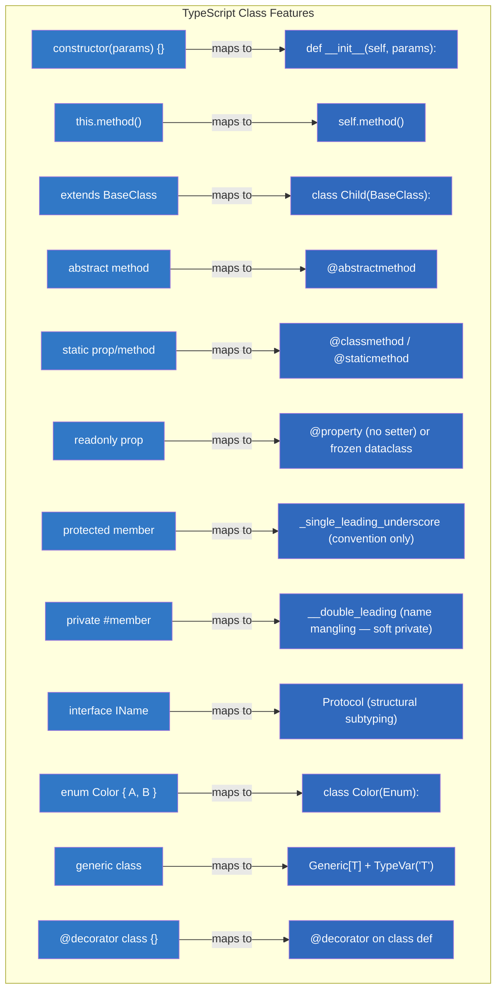

---

## 2. The `self` Parameter — Explicit vs Implicit

### Why Python Uses Explicit `self` (vs TypeScript's implicit `this`)

```typescript
// TypeScript — 'this' is implicit and always available in methods
class Counter {
  private count: number = 0;

  increment(): void {
    this.count++;       // 'this' is automatically bound!
  }

  static create(): Counter {
    return new Counter();
  }
}
```

```python
# Python — 'self' must be explicit in every instance method definition
class Counter:
    count: int = 0                    # Class-level default (shared across instances)

    def __init__(self) -> None:
        self.count = 0                # Instance-level attribute (overrides class default)

    def increment(self) -> None:      # self is the first parameter!
        self.count += 1               # Like this.count++ in TS

    @classmethod                      # Class method — cls instead of self
    def create(cls) -> "Counter":     # cls is the class itself!
        return cls()                  # Creates instance of whatever class was called.
```

### Key Points About `self` and `cls`

- `self` is not a keyword — it's just the conventional name for the first parameter of instance methods. You could name it anything:

```python
class Weird:
    def method(its_me):           # Works! 'self' is just a regular parameter name.
        its_me.value = 42         # But NEVER do this — it breaks all expectations.
```

- The runtime passes `self` automatically — you don't pass it explicitly when calling the method:

```python
c = Counter()
c.increment()                   # Behind the scenes: Counter.increment(c) — self is passed automatically!
```

- Class methods receive `cls` as the first parameter, not `self`:

```python
class MyClass:
    @classmethod
    def create(cls) -> "MyClass":      # cls is the class itself!
        return cls()                    # Creates instance of whatever class was called.

# If you call MySubclass.create(), cls will be MySubclass, not MyClass.
# This is like TypeScript's static method with 'typeof':
// static create(): typeof this { return new this() }
```

- Static methods have no `self` or `cls` — they're just functions attached to a class namespace:

```python
class MathUtils:
    @staticmethod                     # No self, no cls!
    def add(a: int, b: int) -> int:   # Just like a module-level function!
        return a + b

# Usage — no instance needed!
print(MathUtils.add(1, 2))    # 3
```

---

## 3. Inheritance & Method Resolution Order (MRO)

### Method Resolution Order — The C3 Linearization Algorithm

```python
# When Python looks up a method, it follows the MRO to find the right one.
# Use MyClass.__mro__ or MyClass.mro() to inspect the order!

class A:
    def speak(self): return "A"

class B(A):
    def speak(self): return "B"

class C(A):
    def speak(self): return "C"

class D(B, C):  # D inherits from both B and C (multiple inheritance!)
    pass

print(D.__mro__)  
# (<class 'D'>, <class 'B'>, <class 'C'>, <class 'A'>, <class 'object'>)
# Python checks: D → B → C → A → object

d = D()
print(d.speak())  # "B" — found in B first! (depth-first, left to right)
```

### Visual MRO Traversal for Diamond Inheritance

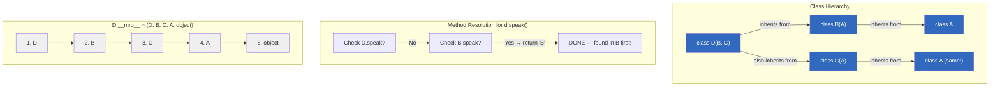

### Key Rules of C3 Linearization

| Rule | Description | Example |
|---|---|---|
| Subclasses before parents | A subclass always appears before its parents in MRO | `D` comes before `B` and `C` |
| Left-to-right order | Base classes listed first appear earlier | `class D(B, C)` → B before C |
| Preserve parent MRO | Each parent's own MRO is respected | If `B(A)`, then `A` after `B` |
| Consistency | MRO must be monotonically consistent | Python raises `TypeError` if conflicting |

### Cooperative Multiple Inheritance with `super()` (Critical!)

```python
# super() does NOT call the parent — it calls the NEXT in the MRO.
# This is critical for diamond inheritance patterns.

class Base:
    def __init__(self) -> None:
        print("Base")

class Logger(Base):
    def __init__(self) -> None:
        print("Logger")
        super().__init__()  # Calls the NEXT in MRO — not necessarily Base!

class Validator(Base):
    def __init__(self) -> None:
        print("Validator")
        super().__init__()

class App(Logger, Validator):  # MRO: App → Logger → Validator → Base → object
    def __init__(self) -> None:
        print("App")
        super().__init__()     # Calls the NEXT in MRO (Logger's super, which is Validator!)

app = App()
# Output: App, Logger, Validator, Base  ← each class runs once!
```

### Mermaid: MRO Traversal for Diamond Inheritance

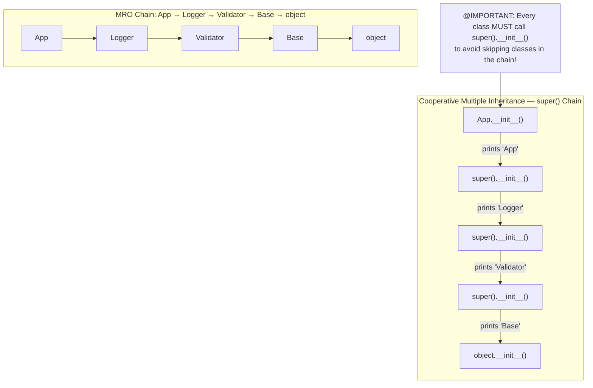

### Mermaid: Diamond Inheritance MRO Visualized

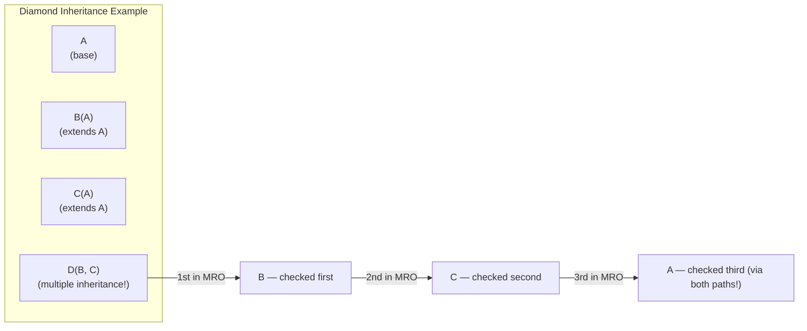

### MRO Resolution Pitfalls

```python
# BAD: Inconsistent MRO — Python raises TypeError!
class A: pass
class B(A): pass
class C(A): pass
class D(B, C): pass          # OK: D → B → C → A

# BAD: Conflicting MRO requirements — 'Inconsistent Method Resolution Order'!
class X:
    def method(self): return "X"
class Y:
    def method(self): return "Y"
class Z1(X, Y): pass         # Z1 MRO: Z1 → X → Y
class Z2(Y, X): pass         # Z2 MRO: Z2 → Y → X (opposite order!)

# class Bad(Z1, Z2): pass    # ❌ TypeError! Z1 wants X before Y, Z2 wants Y before X.
```

---

## 4. Dunder/Magic Methods — Complete Reference

### What Are Dunder Methods?

Dunder = "Double Underscore" (like `__init__`, `__str__`)

These methods are called automatically by Python when you use built-in operations on your objects. They're like operator overloading in other languages, but implemented via convention.

### Complete Dunder Method Reference Table (80+ Methods)

#### Object Lifecycle & Construction (7 methods)

| Dunder Method | Triggered When | TS Equivalent | Example Usage |
|---|---|---|---|
| `__new__(cls, ...)` | Before `__init__` — actual object creation | N/A (Python's metaclass magic) | Override to implement singleton/factory patterns |
| `__init__(self, ...)` | Object created | Constructor | `obj = MyClass(1, 2)` |
| `__del__(self)` | Object garbage collected | Destructor / finalizer | Clean up resources (rarely used!) |
| `__init_subclass__(cls, **kwargs)` | Subclass is defined | N/A | Auto-register subclasses at import time |
| `__instancecheck__(cls, instance)` | `isinstance(obj, cls)` | Type guard | Custom type checking logic |
| `__subclasscheck__(cls, subclass)` | `issubclass(Sub, cls)` | extends check | Custom subclass validation |
| `__delattr__(self, name)` | `del obj.attr` | Delete property | Intercept all deletions |

#### String & Representation (4 methods)

| Dunder Method | Triggered When | TS Equivalent | Example Usage |
|---|---|---|---|
| `__str__(self)` | `str(obj)`, `print(obj)` | `toString()` / `Symbol.toPrimitive` | `"Value: " + str(point)` |
| `__repr__(self)` | `repr(obj)`, REPL display | Debug string | Returns unambiguous representation |
| `__format__(self, format_spec)` | `f"{obj:format}"` | Template literals | Custom formatting for dates/numbers |
| `__bytes__(self)` | `bytes(obj)` | ArrayBuffer conversion | Convert object to bytes |

#### Comparison Operators (7 methods)

| Dunder Method | Triggered When | TS Equivalent | Example Usage |
|---|---|---|---|
| `__eq__(self, other)` | `obj1 == obj2` | Equals / `===` | `Point(1,2) == Point(1,2)` |
| `__ne__(self, other)` | `obj1 != obj2` | Not equals / `!==` | `a != b` |
| `__lt__(self, other)` | `obj1 < obj2` | Less-than `<` | Sorting objects by custom rules |
| `__le__(self, other)` | `obj1 <= obj2` | Less-or-equal `<=` | Used with `__lt__` for sorting |
| `__gt__(self, other)` | `obj1 > obj2` | Greater-than `>` | Reverse comparison |
| `__ge__(self, other)` | `obj1 >= obj2` | Greater-or-equal `>=` | Used with `__gt__` for sorting |
| `__bool__(self)` | `bool(obj)`, truth testing | Boolean coercion | `if obj:` calls `__bool__` |

#### Reflection & Attribute Access (8 methods)

| Dunder Method | Triggered When | TS Equivalent | Example Usage |
|---|---|---|---|
| `__getattr__(self, name)` | `obj.missing_attr` | Proxy/getter | Dynamic property resolution |
| `__getattribute__(self, name)` | `obj.any_attr` | All attribute access | Intercept ALL attribute reads |
| `__setattr__(self, name, val)` | `obj.attr = val` | Setter hook | Intercept all attribute assignments |
| `__delattr__(self, name)` | `del obj.attr` | Delete property | Intercept all deletions |
| `__dir__(self)` | `dir(obj)` | Keys() / Object.keys | Custom attribute listing |
| `__getstate__(self)` | Pickling object | Serialization hook | Control what gets pickled |
| `__setstate__(self, state)` | Unpickling object | Deserialization hook | Restore object from pickle |
| `__class__(self)` | Type of object | TypeScript typeof | Access the class at runtime |

#### Arithmetic Operators (9 methods)

| Dunder Method | Triggered When | TS Equivalent | Example Usage |
|---|---|---|---|
| `__add__(self, other)` | `obj1 + obj2` | Custom operator overload | `Point(1,2) + Point(3,4)` |
| `__sub__(self, other)` | `obj1 - obj2` | Custom subtraction | Vector subtraction |
| `__mul__(self, other)` | `obj1 * obj2` | Custom multiplication | Matrix multiplication |
| `__truediv__(self, other)` | `obj1 / obj2` | Custom division | Floating-point division |
| `__floordiv__(self, other)` | `obj1 // obj2` | Floor division | Integer division |
| `__mod__(self, other)` | `obj1 % obj2` | Modulo | Remainder operation |
| `__pow__(self, other)` | `obj1 ** obj2` | Power / exponentiation | Exponentiation |
| `__neg__(self)` | `-obj` | Unary negation | `Point(-3,-4)` from `Point(3,4)` |
| `__pos__(self)` | `+obj` | Unary positive | Identity (rarely overridden) |

#### Arithmetic In-Place Operators (7 methods)

| Dunder Method | Triggered When | TS Equivalent | Example Usage |
|---|---|---|---|
| `__iadd__(self, other)` | `obj1 += obj2` | Augmented assignment `+=` | Mutable append for lists |
| `__isub__(self, other)` | `obj1 -= obj2` | In-place subtraction | |
| `__imul__(self, other)` | `obj1 *= obj2` | In-place multiplication | |
| `__itruediv__(self, other)` | `obj1 /= obj2` | In-place division | |
| `__ifloordiv__(self, other)` | `obj1 //= obj2` | In-place floor division | |
| `__imod__(self, other)` | `obj1 %= obj2` | In-place modulo | |
| `__ipow__(self, other)` | `obj1 **= obj2` | In-place power | |

#### Reverse Arithmetic (when left operand doesn't support the operation)

| Dunder Method | Triggered When | TS Equivalent | Example Usage |
|---|---|---|---|
| `__radd__(self, other)` | `other + obj` (reverse add) | Fallback for `+` | `"hello" + point` when point doesn't have `__add__` |
| `__rsub__(self, other)` | `other - obj` | Reverse subtraction | |
| `__rmul__(self, other)` | `other * obj` | Reverse multiplication | |
| `__rtruediv__(self, other)` | `other / obj` | Reverse division | |

#### Number & Unary Ops (5 methods)

| Dunder Method | Triggered When | TS Equivalent | Example Usage |
|---|---|---|---|
| `__abs__(self)` | `abs(obj)` | Math.abs() | Euclidean distance of Point |
| `__round__(self, n)` | `round(obj, n)` | Number.prototype.toFixed | Round to n decimal places |
| `__int__(self)` | `int(obj)` | Number constructor | Convert to int |
| `__float__(self)` | `float(obj)` | Float conversion | Convert to float |
| `__complex__(self)` | `complex(obj)` | Complex number construction | Convert to complex |

#### Container & Collection (10 methods)

| Dunder Method | Triggered When | TS Equivalent | Example Usage |
|---|---|---|---|
| `__len__(self)` | `len(obj)` | `.length` property | Object's "size" |
| `__getitem__(self, key)` | `obj[key]` | Index access | `point[0]` returns x coord |
| `__setitem__(self, key, val)` | `obj[key] = val` | Index assignment | `point[0] = 5` |
| `__delitem__(self, key)` | `del obj[key]` | Delete by index | Remove element |
| `__iter__(self)` | `for x in obj` | Iterator protocol / for...of | Makes object iterable |
| `__reversed__(self)` | `reversed(obj)` | Reverse iteration | Custom reverse order |
| `__contains__(self, item)` | `item in obj` | `.includes()` / `.indexOf()` | `"a" in my_set` |
| `__sizeof__(self)` | `sys.getsizeof(obj)` | Memory size check | Report memory usage |
| `__length_hint__(self)` | Internal hint of length | Estimate | For iterator optimization |
| `__missing__(self, key)` | Dict-like missing key | Default value lookup | Custom dict fallback |

#### Call & Invocation (2 methods)

| Dunder Method | Triggered When | TS Equivalent | Example Usage |
|---|---|---|---|
| `__call__(self, ...)` | `obj(args)` | Invoke interface / Function type | `f = Foo(); f()` calls `f.__call__()` |
| `__await__(self)` | `await obj` | Async iteration | Make object awaitable |

#### Context Manager (2 methods)

| Dunder Method | Triggered When | TS Equivalent | Example Usage |
|---|---|---|---|
| `__enter__(self)` | `with obj:` start | Try/finally / Resource pattern | DatabaseConnection enters context |
| `__exit__(self, exc_type, exc_val, exc_tb)` | `with obj:` end | Finally/close handler | Closes connection in `__exit__` |

#### Slot Management (3 methods)

| Dunder Method | Triggered When | TS Equivalent | Example Usage |
|---|---|---|---|
| `__slots__` | Class attribute definition | Memory layout control | Fixed attributes, no `__dict__` |
| `__getstate__` / `__setstate__` | Pickling/pickler | Serialization | Control pickle behavior |

#### Class Creation & Metaclass (4 methods)

| Dunder Method | Triggered When | TS Equivalent | Example Usage |
|---|---|---|---|
| `__prepare__(cls, name, bases)` | Before class body executed | N/A (metaclass hook) | Custom namespace for class creation |
| `__init__(cls, name, bases, dict)` | After class created (metaclass) | Class-level init | Finalize class after creation |
| `__new__(cls, ...)` | When class is instantiated | Constructor factory | Control instance creation |
| `__init_subclass__(cls, **kwargs)` | Subclass defined | N/A | Auto-registration at subclass creation |

### Complete Working Example — All Major Dunder Methods in One Class

```python
import math
from typing import Self


class Vector:
    """A 2D vector with comprehensive dunder method implementations."""

    # === Construction & Lifecycle ===
    def __init__(self, x: float, y: float) -> None:
        self.x = x
        self.y = y
        print(f"Vector({x}, {y}) created!")

    def __repr__(self) -> str:           # For debugging — unambiguous representation
        return f"Vector({self.x!r}, {self.y!r})"

    def __str__(self) -> str:            # For users — friendly string representation
        return f"({self.x}, {self.y})"

    def __del__(self) -> None:           # Called when object is garbage collected
        print(f"Vector({self.x}, {self.y}) destroyed!")

    # === Comparison Operators (like ==, !=, <, > in TS) ===
    def __eq__(self, other: object) -> bool:
        if not isinstance(other, Vector):
            return NotImplemented
        return math.isclose(self.x, other.x) and math.isclose(self.y, other.y)

    def __ne__(self, other: object) -> bool:
        result = self.__eq__(other)
        return NotImplemented if result is NotImplemented else not result

    def __lt__(self, other: "Vector") -> bool:         # Less-than — used for sorting!
        return math.sqrt(self.x**2 + self.y**2) < math.sqrt(other.x**2 + other.y**2)

    def __le__(self, other: "Vector") -> bool:
        return self == other or self < other

    def __gt__(self, other: "Vector") -> bool:
        return not self <= other

    def __ge__(self, other: "Vector") -> bool:
        return not self < other

    def __bool__(self) -> bool:                        # Truth testing: if vector:
        return self.x != 0 or self.y != 0

    # === Arithmetic Operators ===
    def __add__(self, other: "Vector") -> "Vector":   # v1 + v2
        return Vector(self.x + other.x, self.y + other.y)

    def __sub__(self, other: "Vector") -> "Vector":   # v1 - v2
        return Vector(self.x - other.x, self.y - other.y)

    def __mul__(self, scalar: float) -> "Vector":     # v * n (scalar multiplication)
        return Vector(self.x * scalar, self.y * scalar)

    def __rmul__(self, scalar: float) -> "Vector":    # n * v (reverse — when scalar is on left)
        return self.__mul__(scalar)

    def __truediv__(self, scalar: float) -> "Vector": # v / n
        return Vector(self.x / scalar, self.y / scalar)

    def __neg__(self) -> "Vector":                    # -v (negation)
        return Vector(-self.x, -self.y)

    # === Number Conversions ===
    def __abs__(self) -> float:                       # abs(v) — magnitude
        return math.sqrt(self.x**2 + self.y**2)

    def __int__(self) -> int:                         # int(v)
        return int(abs(self))

    def __float__(self) -> float:                     # float(v)
        return float(abs(self))

    # === Container Operations ===
    def __len__(self) -> int:                         # len(v) — dimensionality
        return 2

    def __getitem__(self, index: int) -> float:      # v[0], v[1]
        if index == 0:
            return self.x
        elif index == 1:
            return self.y
        raise IndexError("Vector only has 2 dimensions")

    def __iter__(self):                               # for x in v:
        yield self.x
        yield self.y

    def __contains__(self, item: float) -> bool:     # item in v
        return math.isclose(item, self.x) or math.isclose(item, self.y)

    # === Callable — make instances callable! ===
    def __call__(self, factor: float = 1.0) -> "Vector":
        """Call the vector like a function — scales it."""
        return self * factor

    # === Context Manager ===
    def __enter__(self) -> "Vector":
        print(f"Acquiring vector resources: {self}")
        return self

    def __exit__(self, exc_type, exc_val, exc_tb) -> bool:
        print(f"Releasing vector resources")
        return False  # Don't suppress exceptions

    # === Formatting ===
    def __format__(self, format_spec: str) -> str:
        if format_spec == "polar":
            r = abs(self)
            angle = math.degrees(math.atan2(self.y, self.x))
            return f"r={r:.2f}, θ={angle:.1f}°"
        return super().__format__(format_spec)


# === Usage of ALL dunder methods above: ===
v1 = Vector(3.0, 4.0)
v2 = Vector(3.0, 4.0)

print(repr(v1))               # "Vector(3.0, 4.0)" — __repr__
print(str(v1))                # "(3.0, 4.0)" — __str__
print(v1 == v2)               # True — __eq__
print(v1 != v2)               # False — __ne__
print(v1 < Vector(5.0, 6.0)) # True — __lt__ (by magnitude)
print(bool(v1))               # True — __bool__
print(abs(v1))                # 5.0 — __abs__ (magnitude)

print(v1 + v2)                 # Vector(6.0, 8.0) — __add__
print(-v1)                    # Vector(-3.0, -4.0) — __neg__
print(v1 * 2)                 # Vector(6.0, 8.0) — __mul__
print(2 * v1)                  # Vector(6.0, 8.0) — __rmul__ (reverse!)
print(v1 / 2)                 # Vector(1.5, 2.0) — __truediv__

print(v1[0])                  # 3.0 — __getitem__
for coord in v1:               # Iterates via __iter__
    print(coord)              # 3.0, then 4.0
print(3.0 in v1)              # True — __contains__

scaled = v1(2.0)              # Vector(6.0, 8.0) — __call__ (callable!)
print(f"{v1:polar}")          # "r=5.00, θ=53.1°" — __format__
```

### Context Manager Protocol (`with` statement)

```python
class DatabaseConnection:
    """Example of a context manager using dunder methods."""
    def __init__(self, url: str) -> None:
        self.url = url
        self.connection = None

    def __enter__(self) -> "DatabaseConnection":  # Runs when 'with' starts
        print(f"Connecting to {self.url}...")
        self.connection = True                     # Simulate connection
        return self                                  # What the 'as var' gets

    def __exit__(self, exc_type, exc_val, exc_tb) -> bool:  # Runs when 'with' ends
        if self.connection:
            print("Connection closed.")
            self.connection = None
        return False       # Don't suppress exceptions — let them propagate!


# Usage — exactly like try/finally but much cleaner!
with DatabaseConnection("postgresql://localhost") as db:
    data = db.query("SELECT * FROM users")  # db is guaranteed to be closed even if query fails!
```

### Mermaid: Dunder Method Categories Overview

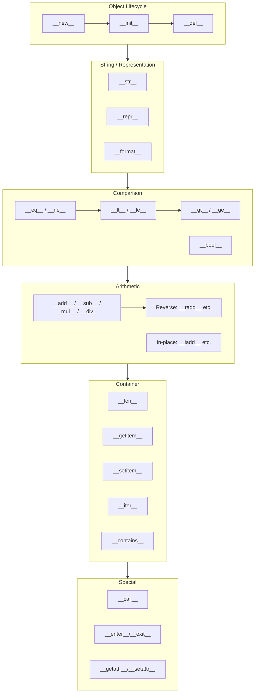

### Mermaid: Property Access Chain (Descriptor Protocol Flow)

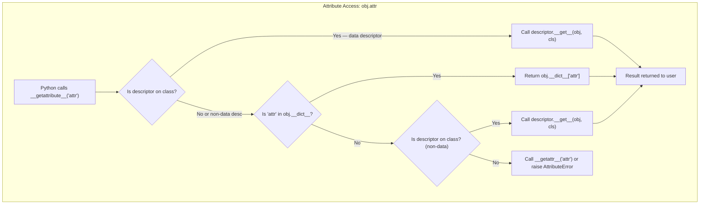

---

## 5. Properties, Descriptors & Attribute Access Protocol

### `@property` — Controlled Attribute Access (Like Getters/Setters in TS)

```typescript
// TypeScript getter/setter
class Person {
  private _age: number;

  get age(): number {
    return this._age;
  }

  set age(value: number): void {
    if (value < 0 || value > 150) throw new Error("Invalid age");
    this._age = value;
  }
}
// Usage: p.age = 30; console.log(p.age);
```

```python
# Python @property decorator — the Pythonic way!
class Person:
    def __init__(self, age: int) -> None:
        self.age = age   # Uses setter below!

    @property            # Like 'get age(): number' in TS
    def age(self) -> int:       # Looks like an attribute (no parentheses!) but runs code!
        return self._age              # Access via _name convention

    @age.setter          # Like 'set age(value): void' in TS
    def age(self, value: int) -> None:
        if not (0 <= value <= 150):
            raise ValueError("Age must be between 0 and 150")
        self._age = value       # Store in _name for convention

p = Person(25)
print(p.age)         # 25 — uses getter (looks like an attribute!)
p.age = 30           # Uses setter — validation runs automatically!
# p.age = -1          # ValueError!
```

### Descriptors — The Low-Level Mechanism Behind `@property`

Descriptors control how attributes are accessed on OTHER objects. They are the mechanism behind `@property`, `__slots__`, and Django ORM fields.

```python
# === Descriptor Protocol: 3 methods to implement ===

class ValidatedAttribute:
    """A descriptor that validates values on assignment to any class that uses it."""

    def __set_name__(self, owner: type, name: str) -> None:
        """Called when the owning class is created — gives us the attribute's name!"""
        self.name = name

    def __get__(self, obj: object | None, objtype: type | None = None) -> any:
        """Called when accessing obj.attr (like a getter)."""
        if obj is None:
            return self             # Accessed from the class — return descriptor itself.
        return obj.__dict__.get(self.name, None)

    def __set__(self, obj: object, value: any) -> None:
        """Called when assigning obj.attr = value (like a setter)."""
        validated = self.validate(value)
        obj.__dict__[self.name] = validated       # Store in instance's __dict__ directly!

    def validate(self, value: any) -> any:
        raise NotImplementedError("Subclasses must implement validate()")


class PositiveInt(ValidatedAttribute):  # A descriptor that only accepts positive ints
    def validate(self, value: int) -> int:
        if not isinstance(value, int) or value <= 0:
            raise ValueError(f"{self.name} must be a positive integer")
        return value


class User:
    age = PositiveInt()          # Descriptor! Any instance using this gets validation.
    score = PositiveInt()

u = User()
u.age = 25                         # Validated by descriptor automatically!
print(u.age)                      # 25 — getter returns the validated value
# u.age = -1                     # ValueError! (descriptor rejects it)
```

### Mermaid: Descriptor Flow for `obj.attr` Access

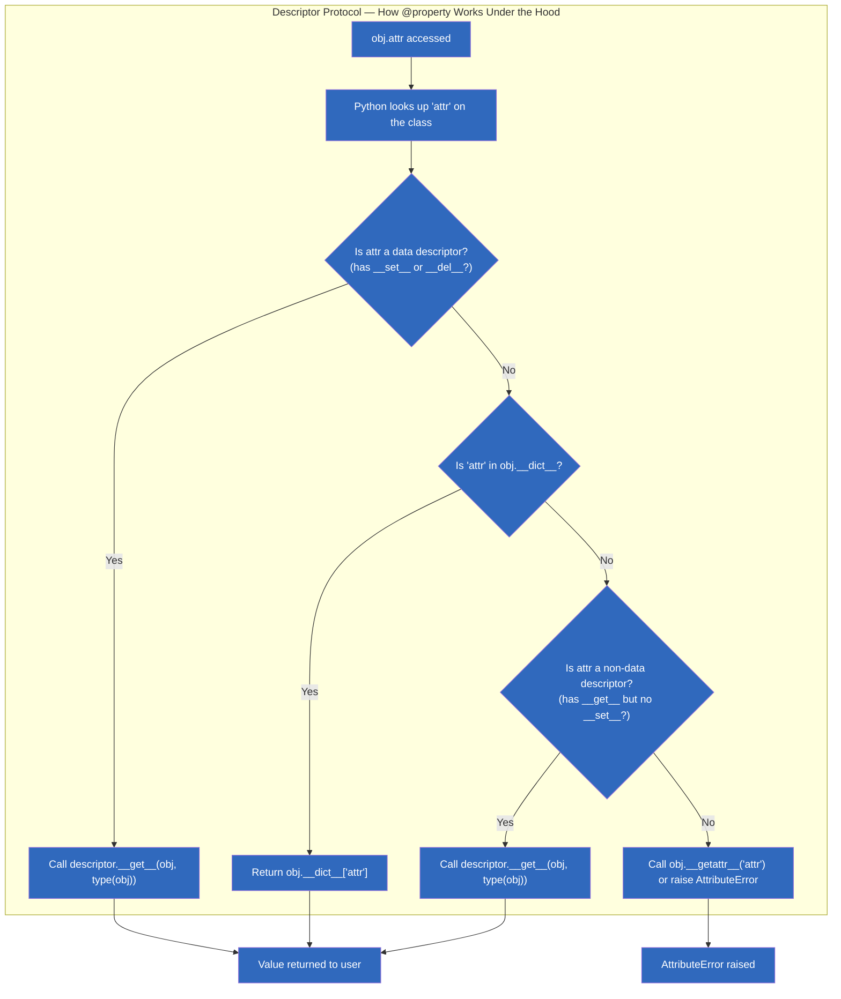

---

## 6. Slots for Memory Optimization

### Why `__slots__` Matters

```python
# Without __slots__: every instance gets a dynamic __dict__ — flexible but memory-heavy.
class NoSlots:
    def __init__(self, x: int) -> None:
        self.x = x

n1 = NoSlots(1)
n1.y = 999                    # Can add any attribute dynamically! (but uses more memory)

# With __slots__: fixed set of attributes — no __dict__, faster access, less memory.
class WithSlots:
    __slots__ = ("x",)         # Only 'x' can be stored as instance attribute!

    def __init__(self, x: int) -> None:
        self.x = x

s1 = WithSlots(1)
# s1.y = 999                  # AttributeError! No dynamic attributes.
```

### Memory Benchmark: `__slots__` vs Normal Classes

```python
import sys

class WithDict:
    def __init__(self, x: int, y: int, z: int) -> None:
        self.x = x
        self.y = y
        self.z = z

class WithSlots:
    __slots__ = ("x", "y", "z")

    def __init__(self, x: int, y: int, z: int) -> None:
        self.x = x
        self.y = y
        self.z = z

dict_instance = WithDict(1, 2, 3)
slot_instance = WithSlots(1, 2, 3)

# Memory comparison (typical results on CPython 3.12):
# sys.getsizeof(dict_instance.__dict__)   → ~240 bytes per instance (for __dict__ alone!)
# sys.getsizeof(slot_instance)             → ~48 bytes total (direct slot storage!)
# Savings: ~80% per instance for large numbers of objects!
```

### Key Points About `__slots__`

- Saves ~40-80% memory per instance by eliminating `__dict__`.
- Faster attribute access — direct slot access instead of dict lookup.
- Can't add arbitrary attributes — prevents typos in attribute names!
- Don't use with dataclasses unless necessary — `@dataclass(slots=True)` works in Python 3.10+.

### Mermaid: Slots Memory Layout Comparison

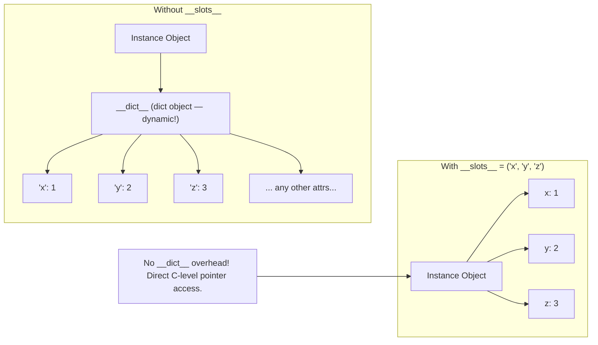

---

## 7. Dataclasses as OOP Alternative

### Why Dataclasses Eliminate Boilerplate

```typescript
// TypeScript — verbose class for data holding
interface User {
  name: string;
  email: string;
  age: number;
  isActive: boolean;
}

class UserModel implements User {
  constructor(
    public name: string,
    public email: string,
    public age: number,
    public isActive: boolean = true
  ) {}

  toString(): string {
    return `User(${this.name}, ${this.email}, ${this.age})`;
  }
}

// Plus: you still need to implement toString(), == comparison, etc. by hand!
```

```python
# Python — @dataclass generates __init__, __repr__, __eq__ automatically!
from dataclasses import dataclass, field

@dataclass
class User:
    name: str
    email: str
    age: int
    isActive: bool = True              # Default values work naturally!

    # Methods still work — just add them manually!
    def __str__(self) -> str:
        return f"User({self.name}, {self.email}, {self.age})"


u = User("Alice", "alice@example.com", 30)
print(u)              # User(Alice, alice@example.com, 30) — auto-generated __repr__!
# No __init__ needed! dataclass generates it for you.
# No __eq__ needed! dataclass generates field-by-field comparison!
```

### Dataclass Features Deep Dive

```python
from dataclasses import dataclass, field, asdict, astuple, replace
from typing import ClassVar


@dataclass(frozen=True)       # Immutable — like TypeScript's readonly!
class Point:
    x: float
    y: float

    # ClassVar for class-level attributes (like static in TS)
    _next_id: ClassVar[int] = 0
    id: int = field(init=False)   # Field computed, not passed to __init__

    def __post_init__(self):      # Called after auto-generated __init__!
        Point._next_id += 1
        self.id = Point._next_id


p = Point(3.0, 4.0)
# p.x = 5.0                     # ❌ FrozenInstanceError! Immutable.

# field() options:
@dataclass
class User2:
    name: str
    email: str = ""             # Default value (like optional parameter)
    tags: list[str] = field(default_factory=list)  # List default — never use [] directly!
    score: float = field(default=0.0, repr=False)   # Exclude from __repr__

# asdict() converts dataclass to dict (like JSON.stringify for objects!)
u = User2("Alice", "alice@example.com", ["admin"], 95.0)
print(asdict(u))
# {'name': 'Alice', 'email': 'alice@example.com', 'tags': ['admin'], 'score': 95.0}

# replace() creates a modified copy (like { ...obj, name: 'Bob' } in TS!)
u2 = replace(u, name="Bob")
```

### Dataclass vs Regular Class Decision Table

| Feature | Regular class | @dataclass | Recommendation |
|---|---|---|---|
| Boilerplate code | Manual `__init__`, `__repr__`, `__eq__` | Auto-generated | `@dataclass` for data-holding classes (80% of cases!) |
| Memory overhead | Normal | ~10-15% more per instance | Negligible for most apps |
| Validation in constructor | Easy (in `__init__`) | Use `__post_init__` | Both work; `__post_init__` is dataclass-native |
| Inheritance | Full control | Be careful — inheritance with `@dataclass` can have subtle issues | Prefer composition over inheritance even with dataclasses |
| Custom methods | Free to add | Free to add | Either way works |

---

## 8. Mixins & Multiple Inheritance Patterns

### Mixin Pattern — Adding Capabilities to Any Class

```python
# A mixin is a base class that provides specific functionality.
# It's designed to be COMPOSED with other classes, not instantiated alone.

class JsonSerializableMixin:
    """Adds JSON serialization to any class it's mixed into."""
    def to_json(self) -> str:
        import json
        return json.dumps(self.__dict__)      # Access the owning class's __dict__!

    @classmethod
    def from_json(cls, data: dict) -> "JsonSerializableMixin":
        obj = cls.__new__(cls)                  # Create without calling __init__
        obj.__dict__.update(data)                # Populate all instance attributes.
        return obj


class TimestampMixin:
    """Adds creation timestamp tracking."""
    created_at: float

    def __init_subclass__(cls, **kwargs) -> None:
        super().__init_subclass__(**kwargs)
        original_init = cls.__init__            # Wrap the class's __init__ to add timestamp!

        def patched_init(self, *args, **kw):
            self.created_at = time.time()
            return original_init(self, *args, **kw)

        cls.__init__ = patched_init


# Combine multiple mixins with your class — like trait/role composition in TS!
from dataclasses import dataclass

@dataclass
class User4(JsonSerializableMixin, TimestampMixin):
    name: str
    email: str

u = User4(name="Alice", email="alice@example.com")
print(u.to_json())               # '{"name": "Alice", "email": "...", "created_at": ...}'
print(u.created_at)              # Unix timestamp!
```

### 10 Real-World Mixin Examples with TypeScript Equivalents

| Mixin | Python Pattern | TS Equivalent | Use Case |
|---|---|---|---|
| JsonSerializableMixin | `def to_json(self): return json.dumps(self.__dict__)` | Interface + serialize method | API serialization |
| TimestampMixin | `__init_subclass__` wraps `__init__` | Constructor parameter injection | Audit trails |
| ValidatedMixin | Descriptors on class attrs | TypeScript validators | Form validation |
| CacheableMixin | Property + TTL cache decorator | memoize() decorator | Expensive computation caching |
| EventEmitterMixin | `_callbacks: dict[str, list[Callable]]` + `emit()` pattern | EventEmitter class | Pub/sub systems |
| LoggerMixin | Inject logger via `__init_subclass__` | Decorator with injection | Cross-cutting logging |
| SerializableMixin | `to_dict()`, `from_dict(cls, data)` | Marshaller interface | Database ORM fields |
| ComparableMixin | Implement all comparison dunder methods | `Comparable<T>` interface | Sorting / ordering |
| DeepCopyableMixin | `__deepcopy__(self, memo)` custom logic | Cloneable interface | Data serialization |
| PaginatedMixin | `__iter__` with page size + offset | Enumerable with paging | API pagination |

### Mermaid: Mixin Composition Pattern

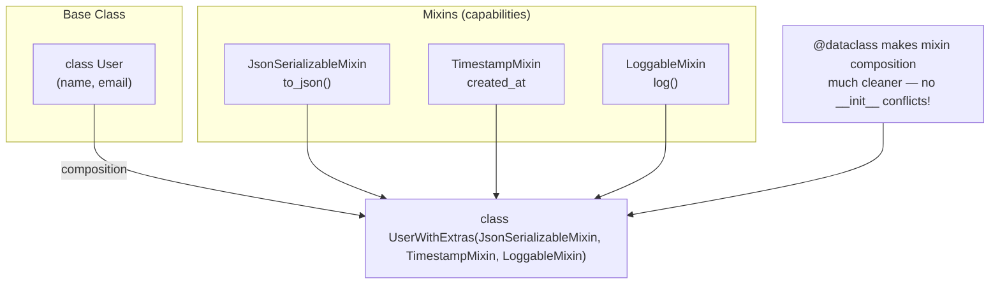

---

## 9. Metaclasses — Classes That Create Classes

### The Class Creation Chain

```
object → (created by type) → instance of object
MyClass → (created by type or custom metaclass) → instance of MyClass's metaclass
Instance → (created by MyClass.__new__ + __init__) → instance of MyClass
```

### Metaclass vs `__init_subclass__` vs Class Decorator Comparison

| Pattern | When It Runs | Complexity | Best For |
|---|---|---|---|
| Metaclass (`metaclass=X`) | At class definition time (module import) | High | Framework-level patterns (ORM fields, singleton enforcement) |
| `__init_subclass__` | When subclass is defined | Medium | Auto-registration of subclasses |
| Class decorator | After class is fully defined | Low | Adding capabilities to specific classes |

### 5 Metaclass Patterns (With TypeScript Equivalents)

#### Pattern 1: Singleton (Already shown above — key pattern!)

```python
class SingletonMeta(type):
    _instances: dict = {}

    def __call__(cls, *args, **kwargs):
        if cls not in cls._instances:
            instance = super().__call__(*args, **kwargs)
            cls._instances[cls] = instance
        return cls._instances[cls]

class Database(metaclass=SingletonMeta):
    def __init__(self) -> None:
        print("Database initialized!")       # Only prints once!

db1 = Database()   # Prints "Database initialized!"
db2 = Database()   # Does NOT print anything — returns the cached instance.
print(db1 is db2)  # True! Same object.
```

#### Pattern 2: Registry (Auto-register subclasses)

```python
class PluginRegistry(type):
    _registry: dict[str, type] = {}

    def __new__(mcs, name: str, bases: tuple, namespace: dict) -> type:
        cls = super().__new__(mcs, name, bases, namespace)
        if name != "Plugin":  # Don't register the base class itself!
            PluginRegistry._registry[name] = cls
        return cls

    @classmethod
    def get_plugin(cls, name: str) -> type | None:
        return cls._registry.get(name)

    @classmethod
    def list_plugins(cls) -> list[str]:
        return list(cls._registry.keys())


class Plugin(metaclass=PluginRegistry):
    """Base class — all subclasses auto-registered."""
    pass


class EmailPlugin(Plugin):     # Auto-registered on import!
    pass

class SMSPlugin(Plugin):       # Also auto-registered!
    pass

print(PluginRegistry.list_plugins())  # ["EmailPlugin", "SMSPlugin"]
```

#### Pattern 3: Validator (Enforce method signatures)

```python
class ValidatedMethodsMeta(type):
    """Ensures all methods match a specified signature pattern."""

    def __new__(mcs, name: str, bases: tuple, namespace: dict) -> type:
        cls = super().__new__(mcs, name, bases, namespace)

        # Inspect every method in the class and validate it exists!
        required_methods = getattr(cls, "__required_methods__", [])
        for method_name in required_methods:
            if not hasattr(cls, method_name):
                raise TypeError(f"{name} must implement {method_name}()")

        return cls


class Serializable(metaclass=ValidatedMethodsMeta):
    __required_methods__ = ["to_dict", "from_dict"]

# class InvalidClass(Serializable): pass  # ❌ TypeError! Must implement to_dict, from_dict.

class ValidClass(Serializable):
    def to_dict(self) -> dict:
        return {}
    def from_dict(cls, data: dict) -> "ValidClass":
        return cls()
```

#### Pattern 4: Auto-Init (Initialize all typed attributes)

```python
class AutoInitMeta(type):
    """Automatically initializes all type-annotated class attributes in __init__."""

    def __new__(mcs, name: str, bases: tuple, namespace: dict) -> type:
        cls = super().__new__(mcs, name, bases, namespace)

        # Capture annotations
        annotations = namespace.get("__annotations__", {})
        if not annotations:
            return cls

        # Generate a custom __init__ that auto-initializes typed attributes!
        params = ", ".join(f"{name}: {ann}" for name, ann in annotations.items())
        assignments = "\n        ".join(f"self.{name} = {name}" for name in annotations)

        init_code = f"""
def __init__(self, {params}) -> None:
    {assignments}
"""
        local_ns: dict = {}
        exec(init_code, globals(), local_ns)
        cls.__init__ = local_ns["__init__"]

        return cls


class Config(metaclass=AutoInitMeta):
    host: str
    port: int
    debug: bool = False

c = Config("localhost", 3000, True)
print(c.host, c.port, c.debug)  # localhost 3000 True
```

#### Pattern 5: Plugin System (Framework-level auto-discovery)

```python
class PluginSystemMeta(type):
    """Auto-discovers and registers plugin classes from a directory."""

    _plugins: dict[str, type] = {}

    def __new__(mcs, name: str, bases: tuple, namespace: dict) -> type:
        cls = super().__new__(mcs, name, bases, namespace)

        if hasattr(cls, "plugin_name"):
            PluginSystemMeta._plugins[cls.plugin_name] = cls
            print(f"Registered plugin: {cls.plugin_name}")

        return cls

    @classmethod
    def get_plugin(cls, name: str) -> type | None:
        return cls._plugins.get(name)

    @classmethod
    def discover_plugins(cls, directory: str) -> int:
        """Scan directory for Python files and load plugins."""
        import importlib.util
        count = 0
        for path in Path(directory).glob("*.py"):
            spec = importlib.util.spec_from_file_location(path.stem, path)
            if spec and spec.loader:
                module = importlib.util.module_from_spec(spec)
                spec.loader.exec_module(module)
                count += 1
        return count


class BasePlugin(metaclass=PluginSystemMeta):
    plugin_name: str = ""
```

### Mermaid: Metaclass Creation Chain

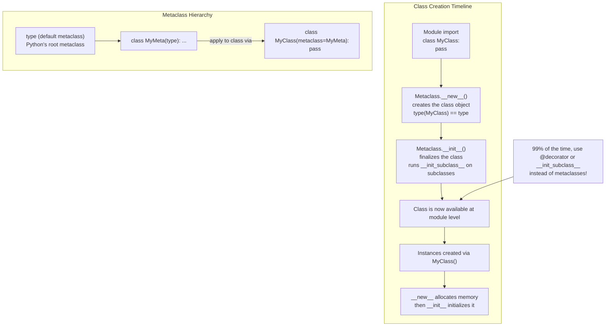

---

## 10. Composition vs Inheritance Decision Framework

### TypeScript Composition vs Python Composition (Same Concept, Different Syntax)

```typescript
// TypeScript composition via interfaces
interface Logger { log(msg: string): void; }

class ApiClient {
  constructor(private logger: Logger) {}

  fetch(url: string): Promise<Response> {
    this.logger.log(`Fetching ${url}`);
    return fetch(url);
  }
}
```

```python
# Python composition via Protocol (structural subtyping) — no inheritance needed!
from typing import Protocol

class Logger(Protocol):         # Any class with .log() method works — no inheritance!
    def log(self, msg: str) -> None: ...

class ApiClient:
    def __init__(self, logger: Logger) -> None:
        self.logger = logger

    def fetch(self, url: str) -> None:
        self.logger.log(f"Fetching {url}")
```

### 10+ Real-World Composition Examples with Decision Trees

| Scenario | TS Pattern | Python Pattern | Recommendation |
|---|---|---|---|
| IS-A (Dog IS an Animal) | `class Dog extends Animal` | `class Dog(Animal):` | Inheritance — appropriate! |
| HAS-A (ApiClient uses Logger) | DI via interface | Protocol + composition | Composition |
| Sharing behavior across classes | Mixins/traits | Multiple inheritance with mixins | Mixin pattern in Python |
| Cross-cutting concerns | Decorators/Wrappers | Class decorators / `__init_subclass__` | Class decorators for simplicity |
| Extension points | Abstract base class + override | Protocol + duck typing | Protocol (structural) over ABC (nominal) |
| Plugin architecture | Registry pattern + interface | Metaclass registry or `__init_subclass__` | `__init_subclass__` is simpler! |
| Configuration | Options object with defaults | `@dataclass` with defaults | `@dataclass` |
| Validation | Class-validator decorators | Pydantic models or custom descriptors | Descriptors for simple cases, Pydantic for complex |
| Caching | Decorator pattern | `@lru_cache` or cache descriptor | `@lru_cache` built-in |
| Serialization | JSON decorators / class methods | `@dataclass` + `asdict()` / json module | `@dataclass + asdict` |

### Mermaid: Composition Decision Tree

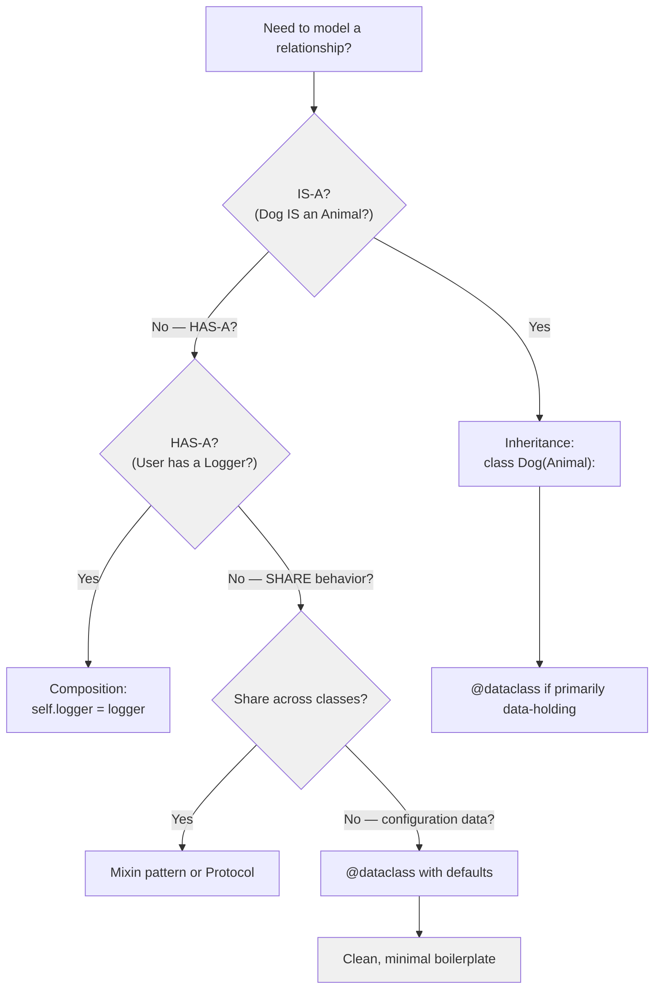

### Key Points: Composition vs Inheritance

- **Composition over inheritance** is the Pythonic recommendation — same as in TypeScript. Use inheritance only when there's a genuine IS-A relationship.
- Python's multiple inheritance makes mixins practical in a way that TypeScript doesn't support natively.
- Metaclasses are for framework authors — most application code never needs them.

---

## 11. Abstract Base Classes (abc module)

### Complete ABC Reference with TS Equivalents

```typescript
// TypeScript abstract class
abstract class Shape {
  abstract area(): number;
  abstract perimeter(): number;

  describe(): string {
    return `Area: ${this.area()}, Perimeter: ${this.perimeter()}`;
  }
}

// Class must implement all abstract methods
class Circle extends Shape {
  constructor(private radius: number) { super(); }
  
  area(): number { return Math.PI * this.radius ** 2; }
  perimeter(): number { return 2 * Math.PI * this.radius; }
}
```

```python
from abc import ABC, abstractmethod, abstractproperty
from typing import Protocol


# === Abstract Base Class (nominal subtyping — must explicitly inherit!) ===
class Shape(ABC):
    @abstractmethod
    def area(self) -> float:
        ...  # No body needed!

    @abstractmethod
    def perimeter(self) -> float:
        ...

    def describe(self) -> str:      # Non-abstract method — can use abstract methods!
        return f"Area: {self.area():.2f}, Perimeter: {self.perimeter():.2f}"


# class InvalidShape(Shape): pass  # ❌ TypeError! Must implement area() and perimeter().

class Circle(Shape):
    def __init__(self, radius: float) -> None:
        self.radius = radius

    def area(self) -> float:      # Must implement — abstract method enforced!
        return 3.14159 * self.radius ** 2

    def perimeter(self) -> float:
        return 2 * 3.14159 * self.radius


# === Protocol (structural subtyping — duck typing!) ===
class Drawable(Protocol):
    def draw(self, ctx: object) -> None: ...   # No ABC needed!

class Rectangle:
    def draw(self, ctx: object) -> None:     # Automatically compatible with Drawable!
        pass

# Protocol is more flexible — no inheritance hierarchy needed.
```

### Key Differences: ABC vs Protocol

| Feature | ABC (abc module) | Protocol (typing module) |
|---|---|---|
| Subtyping model | Nominal (must inherit) | Structural (duck typing!) |
| Enforced at runtime? | Yes (can't instantiate without implementation) | No (type checker only) |
| Inheritance required? | Yes — `class C(ABC)` | No — just implement methods |
| Best for | Frameworks, strict contracts | Flexible APIs, duck-typing style |

---

## 12. `__new__` vs `__init__` — Object Lifecycle

### The Complete Object Creation Timeline

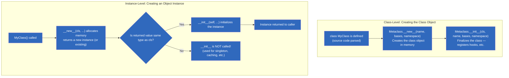

### When to Use `__new__` vs `__init__`

| Method | Purpose | When to Override | TS Equivalent |
|---|---|---|---|
| `__new__(cls, ...)` | Allocate & return the instance object | Singleton patterns, immutable types (int, str), caching instances | Factory method / static factory |
| `__init__(self, ...)` | Initialize the instance's attributes | Almost always — this IS your constructor! | Constructor body |

```python
# === When __new__ is useful: Singleton Pattern ===
class DatabaseConnection:
    _instance = None

    def __new__(cls, *args, **kwargs) -> "DatabaseConnection":
        if cls._instance is None:
            cls._instance = super().__new__(cls)  # Actually create the object!
        return cls._instance

    def __init__(self, url: str)  -> None:
        # Note: __init__ runs every time, even for cached instance!
        if not hasattr(self, "_initialized"):     # Guard against double init
            self.url = url
            self._initialized = True


# === Immutable types use __new__ to return cached instances ===
class FrozenString(str):
    def __new__(cls, value: str) -> "FrozenString":
        # For truly immutable behavior, you can cache and return pre-existing strings
        return super().__new__(cls, value.lower())  # Force lowercase!


# === Real-world: Registry pattern with __new__ ===
class PluginRegistry(type):
    _registry: dict[str, type] = {}

    def __call__(cls, *args, **kwargs):  # Called when instantiating cls()
        if cls not in cls._registry:
            instance = super().__call__(*args, **kwargs)
            cls._registry[cls.__name__] = instance
        return cls._registry[cls.__name__]


# === __new__ + __init__ together: Custom factory ===
class Matrix:
    def __new__(cls, data: list[list[float]]) -> "Matrix":
        if not data or not data[0]:
            raise ValueError("Matrix cannot be empty")
        instance = super().__new__(cls)
        return instance

    def __init__(self, data: list[list[float]]) -> None:
        self.data = data
        self.rows = len(data)
        self.cols = len(data[0]) if data else 0


m = Matrix([[1, 2], [3, 4]])
print(m.rows, m.cols)  # 2 2
```

---

## 13. classmethod vs staticmethod Exhaustive Comparison

### Complete Comparison Table

| Feature | @classmethod | @staticmethod | Regular Instance Method | TS Equivalent |
|---|---|---|---|---|
| First parameter | `cls` (the class) | None | `self` (the instance) | — |
| Access to class state | Yes (via `cls.attr`) | No | Yes (via `self.__class__.attr`) | static member access |
| Access to instance state | No (no `self`) | No | Yes (via `self.attr`) | instance members |
| Called on | Class or instance (`MyClass.method()` or `obj.method()`) | Same as classmethod | Instance only (`obj.method()`) | static vs instance methods |
| Inheritance behavior | Polymorphic — `cls` is the actual subclass! | Not polymorphic — always the defining class | Polymorphic — virtual dispatch | static (non-virtual) vs instance (virtual) |
| Use case | Factory methods, alternative constructors | Utility functions logically grouped in a class | Normal instance behavior | static factory vs regular method |

### Exhaustive Examples

```python
class DateTime:
    def __init__(self, year: int, month: int, day: int) -> None:
        self.year = year
        self.month = month
        self.day = day

    # === Regular instance method ===
    def is_leap_year(self) -> bool:
        return (self.year % 4 == 0 and self.year % 100 != 0) or (self.year % 400 == 0)

    # === classmethod — factory method with cls ===
    @classmethod
    def from_string(cls, date_str: str) -> "DateTime":
        """Alternative constructor — returns instance of whatever cls was called on."""
        year, month, day = map(int, date_str.split("-"))
        return cls(year, month, day)  # Uses cls, not DateTime — works with subclasses!

    @classmethod
    def today(cls) -> "DateTime":
        """Another factory — gets current date."""
        import datetime
        today = datetime.date.today()
        return cls(today.year, today.month, today.day)

    # === staticmethod — utility function grouped in the class ===
    @staticmethod
    def is_valid_date(year: int, month: int, day: int) -> bool:
        """Validation logic — doesn't need cls or self."""
        if not (1 <= month <= 12):
            return False
        days_in_month = [31, 28, 31, 30, 31, 30, 31, 31, 30, 31, 30, 31]
        if month == 2 and DateTime.is_leap_year_for(year):
            return 1 <= day <= 29
        return 1 <= day <= days_in_month[month - 1]

    @staticmethod
    def is_leap_year_for(year: int) -> bool:
        """Helper static method."""
        return (year % 4 == 0 and year % 100 != 0) or (year % 400 == 0)


# Usage:
dt = DateTime.from_string("2025-06-28")     # classmethod factory
print(dt.is_leap_year())                      # instance method

is_valid = DateTime.is_valid_date(2025, 6, 28)  # staticmethod utility
```

### The Critical Inheritance Difference: `cls` vs Hardcoded Class

```python
class Parent:
    @classmethod
    def create_via_cls(cls) -> "Parent":
        return cls()          # Returns instance of the ACTUAL class called!

    @staticmethod
    def create_via_static() -> "Parent":
        return Parent()       # Always returns Parent, never subclass!


class Child(Parent):
    pass

c1 = Child.create_via_cls()     # Child() — polymorphic! Uses cls.
c2 = Child.create_via_static()  # Parent() — NOT polymorphic! Hardcoded class name.

print(type(c1))    # <class 'Child'>
print(type(c2))    # <class 'Parent'> — OOPS! Should be Child.
```

---

## 14. Key Notes & Important Factors

### Critical Differences from TypeScript OOP

| Concept | TypeScript | Python | Key Difference |
|---|---|---|---|
| Access modifiers | `public/private/protected` keywords — enforced at compile time | Convention only (`_name`, `__name`) — NEVER enforced at runtime | Python trusts developers; TypeScript enforces via the compiler. Use protocols instead of interfaces for type contracts. |
| Constructor | `constructor(params) {}` | `def __init__(self, params):` | In Python, `__init__` is called after `__new__` (actual object creation). |
| Interfaces | `interface X {}` — nominal subtyping | `Protocol` — structural subtyping (duck typing!) | Any object with matching methods works in a Protocol without explicit declaration. |
| Static members | `static prop/method` | `@classmethod` / `@staticmethod` decorators | Python requires decorators; TypeScript uses keywords. |
| Getters/setters | `get prop()` / `set prop(v)` | `@property` decorator with getter/setter | Python's looks like a regular attribute; TypeScript's is an actual method call! |
| Abstract classes | `abstract class X {}` + `abstract method` | `ABC` base class + `@abstractmethod` decorator | Same concept! The `...` ellipsis in Python means "no body needed" for abstract methods. |
| Multiple inheritance | NOT supported (can't extend multiple classes) | SUPPORTED via parentheses: `class A(B, C):` | Be careful — understand the MRO before using multiple inheritance! |
| Slots/memory | No equivalent | `__slots__ = ("attr",)` | Python gives you control over instance memory layout; TypeScript's V8 engine handles this. |
| Class decorators | TS decorators (`@decorator class {}`) | Same syntax: `@decorator` on class definition! | Python's are functions that take a class and return a class (or the same class). |
| Generics | `<T>` at compile time — erased by compiler | `Generic[T]` with `TypeVar('T')` — erased at runtime by type checker only | Both languages erase generics at runtime for performance! |
| Enums | `enum Color { Red, Blue }` (string or number) | `class Color(Enum):` + `auto()` | Python enums are full objects; can have methods and values. |

### Key Notes

- Python's OOP is simpler than TypeScript's: No access modifiers, no interface keyword (`Protocol` instead), no `this` keyword (explicit `self`).
- Everything in Python is an object — including classes themselves! `type(MyClass)` returns `type`. This enables metaprogramming impossible in TypeScript without heavy use of decorators and proxies.
- Dataclasses are your go-to for data-holding classes — they eliminate ~80% of boilerplate (constructor, repr, eq, etc.).
- Slots + dataclasses: `@dataclass(slots=True)` gives you both clean code AND memory efficiency (~40-80% savings).

### Important Factors

- `__init__` is NOT a constructor — it's an initializer. The actual construction happens in `__new__`, which creates the object instance before `__init__` populates it.
- Python doesn't have block scoping with braces — indentation defines scope. All variables in a function are visible everywhere in that function, regardless of where they're assigned.
- No `implements` keyword — Python's structural subtyping via Protocol means you don't need to declare implementation; matching methods automatically make something compatible.

### For TypeScript Veterans

- **Multiple inheritance is a superpower (use carefully)** — TypeScript doesn't support it at all. Python's C3 linearization MRO is deterministic, but diamond inheritance can cause subtle bugs. Always inspect `Class.__mro__` when designing complex hierarchies.
- **`super()` follows the MRO, NOT the parent class** — this is the #1 confusion for TS devs. `super().__init__()` in a mixin chain calls the NEXT class in the linearization order, not necessarily the direct parent. Use cooperative multiple inheritance (every `__init__` calls `super()`) to avoid double-initialization.
- **Descriptors are the mechanism behind @property** — understanding `__get__`, `__set__`, and `__delete__` lets you build frameworks like Django ORM fields, SQLAlchemy columns, and Pydantic validators. They're a core Python pattern that has no TS equivalent.
- **Metaclasses vs class decorators** — 99% of the time, prefer `@decorator` on the class or `__init_subclass__`. Use metaclasses only when you need to intercept class creation itself (like ensuring singletons, registering plugins, or enforcing abstract methods).

---

## 🆕 15. Advanced OOP Patterns (Extended)

### 15.1 The Builder Pattern — Fluent API Construction

TypeScript developers often use the Builder pattern for complex object construction. Python can achieve this elegantly with `@dataclass` and method chaining.

```python
from dataclasses import dataclass, field
from typing import Self


@dataclass
class HttpRequest:
    url: str
    method: str = "GET"
    headers: dict[str, str] = field(default_factory=dict)
    body: bytes = b""
    timeout: float = 30.0


class HttpRequestBuilder:
    """Fluent builder for HttpRequest — like TypeScript's builder pattern."""
    
    def __init__(self, url: str):
        self._request = HttpRequest(url=url)
    
    def method(self, method: str) -> Self:
        self._request.method = method
        return self
    
    def header(self, key: str, value: str) -> Self:
        self._request.headers[key] = value
        return self
    
    def body(self, data: bytes) -> Self:
        self._request.body = data
        return self
    
    def timeout(self, seconds: float) -> Self:
        self._request.timeout = seconds
        return self
    
    def build(self) -> HttpRequest:
        return self._request


# Usage — fluent chain like TypeScript builder patterns:
request = (
    HttpRequestBuilder("https://api.example.com/users")
    .method("POST")
    .header("Content-Type", "application/json")
    .header("Authorization", "Bearer token123")
    .body(b'{"name": "Alice"}')
    .timeout(10.0)
    .build()
)
```

### 15.2 The Repository Pattern with Generics

```python
from typing import Generic, TypeVar, Protocol, runtime_checkable
from abc import ABC, abstractmethod

T = TypeVar("T")
ID = TypeVar("ID")


@runtime_checkable
class Identifiable(Protocol):
    id: int


class Repository(ABC, Generic[T, ID]):
    """Abstract generic repository — like TypeScript's generic interfaces."""
    
    @abstractmethod
    def find_by_id(self, id: ID) -> T | None: ...
    
    @abstractmethod
    def find_all(self) -> list[T]: ...
    
    @abstractmethod
    def save(self, entity: T) -> T: ...
    
    @abstractmethod
    def delete(self, id: ID) -> bool: ...


# Concrete implementation
@dataclass
class User:
    id: int
    name: str
    email: str


class InMemoryUserRepository(Repository[User, int]):
    def __init__(self):
        self._storage: dict[int, User] = {}
        self._next_id = 1
    
    def find_by_id(self, id: int) -> User | None:
        return self._storage.get(id)
    
    def find_all(self) -> list[User]:
        return list(self._storage.values())
    
    def save(self, entity: User) -> User:
        if entity.id == 0:
            entity.id = self._next_id
            self._next_id += 1
        self._storage[entity.id] = entity
        return entity
    
    def delete(self, id: int) -> bool:
        return self._storage.pop(id, None) is not None


# Usage
repo: Repository[User, int] = InMemoryUserRepository()
repo.save(User(id=0, name="Alice", email="alice@example.com"))
print(repo.find_all())
```

### 15.3 The Strategy Pattern — Runtime Behavior Switching

```python
from typing import Protocol, runtime_checkable


@runtime_checkable
class CompressionStrategy(Protocol):
    def compress(self, data: bytes) -> bytes: ...
    def decompress(self, data: bytes) -> bytes: ...


class GzipStrategy:
    def compress(self, data: bytes) -> bytes:
        import gzip
        return gzip.compress(data)
    
    def decompress(self, data: bytes) -> bytes:
        import gzip
        return gzip.decompress(data)


class ZlibStrategy:
    def compress(self, data: bytes) -> bytes:
        import zlib
        return zlib.compress(data)
    
    def decompress(self, data: bytes) -> bytes:
        import zlib
        return zlib.decompress(data)


class Compressor:
    """Strategy pattern — behavior injected at runtime."""
    
    def __init__(self, strategy: CompressionStrategy):
        self._strategy = strategy
    
    def compress(self, data: bytes) -> bytes:
        return self._strategy.compress(data)
    
    def set_strategy(self, strategy: CompressionStrategy) -> None:
        self._strategy = strategy


# Usage
compressor = Compressor(GzipStrategy())
compressed = compressor.compress(b"Hello, World!" * 100)
print(f"Compressed size: {len(compressed)} bytes")

# Switch strategy at runtime
compressor.set_strategy(ZlibStrategy())
```

### 15.4 The Observer Pattern — Event-Driven Architecture

```python
from typing import Callable, Any
from dataclasses import dataclass, field


@dataclass
class Event:
    name: str
    data: Any = None


class EventEmitter:
    """Python's take on Node.js EventEmitter."""
    
    def __init__(self):
        self._listeners: dict[str, list[Callable]] = {}
    
    def on(self, event: str, callback: Callable) -> None:
        self._listeners.setdefault(event, []).append(callback)
    
    def once(self, event: str, callback: Callable) -> None:
        def wrapper(*args, **kwargs):
            self.off(event, wrapper)
            callback(*args, **kwargs)
        self.on(event, wrapper)
    
    def off(self, event: str, callback: Callable) -> None:
        if event in self._listeners:
            self._listeners[event] = [
                cb for cb in self._listeners[event] if cb != callback
            ]
    
    def emit(self, event: str, *args, **kwargs) -> None:
        for callback in self._listeners.get(event, []):
            callback(*args, **kwargs)


# Usage — exactly like Node.js EventEmitter!
emitter = EventEmitter()

def on_user_created(user):
    print(f"User created: {user}")

def send_welcome_email(user):
    print(f"Welcome email sent to {user}")

emitter.on("user_created", on_user_created)
emitter.on("user_created", send_welcome_email)

emitter.emit("user_created", {"name": "Alice", "email": "alice@example.com"})
```

### 15.5 The Factory Pattern with Registration

```python
from typing import Callable, TypeVar, Generic

T = TypeVar("T")


class Factory(Generic[T]):
    """Generic factory with registration — like TypeScript's factory registry."""
    
    def __init__(self):
        self._creators: dict[str, Callable[..., T]] = {}
    
    def register(self, name: str, creator: Callable[..., T]) -> None:
        self._creators[name] = creator
    
    def create(self, name: str, *args, **kwargs) -> T:
        if name not in self._creators:
            raise KeyError(f"Unknown type: {name}")
        return self._creators[name](*args, **kwargs)
    
    def list_types(self) -> list[str]:
        return list(self._creators.keys())


# Usage
class Shape:
    pass

class Circle(Shape):
    def __init__(self, radius: float):
        self.radius = radius

class Rectangle(Shape):
    def __init__(self, width: float, height: float):
        self.width = width
        self.height = height


factory = Factory[Shape]()
factory.register("circle", Circle)
factory.register("rectangle", Rectangle)

shape = factory.create("circle", radius=5.0)
print(type(shape).__name__)  # Circle
```

### Mermaid: Design Patterns in Python vs TypeScript

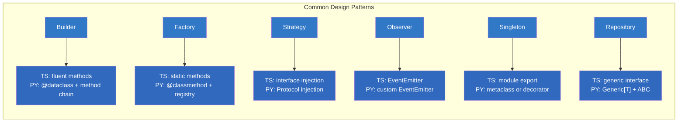

---

## 🆕 16. Real-World Framework Patterns (Extended)

### 16.1 Django-Style ORM Field Descriptors

```python
class Field:
    """Base descriptor for ORM-like fields."""
    
    def __init__(self, field_type: type, nullable: bool = False, default=None):
        self.field_type = field_type
        self.nullable = nullable
        self.default = default
        self.name = None
    
    def __set_name__(self, owner, name):
        self.name = name
    
    def __get__(self, obj, objtype=None):
        if obj is None:
            return self
        return obj.__dict__.get(self.name, self.default)
    
    def __set__(self, obj, value):
        if value is None and not self.nullable:
            raise ValueError(f"{self.name} cannot be None")
        if value is not None and not isinstance(value, self.field_type):
            raise TypeError(f"{self.name} must be {self.field_type.__name__}")
        obj.__dict__[self.name] = value


class IntegerField(Field):
    def __init__(self, **kwargs):
        super().__init__(int, **kwargs)


class StringField(Field):
    def __init__(self, max_length: int = 255, **kwargs):
        super().__init__(str, **kwargs)
        self.max_length = max_length
    
    def __set__(self, obj, value):
        if value is not None and len(value) > self.max_length:
            raise ValueError(f"{self.name} exceeds max length {self.max_length}")
        super().__set__(obj, value)


class BooleanField(Field):
    def __init__(self, **kwargs):
        super().__init__(bool, **kwargs)


# Usage — Django-style model definition
class User:
    id = IntegerField()
    name = StringField(max_length=100)
    email = StringField(max_length=255)
    is_active = BooleanField(default=True)
    
    def __init__(self, **kwargs):
        for key, value in kwargs.items():
            setattr(self, key, value)


user = User(id=1, name="Alice", email="alice@example.com")
print(user.name)  # Alice

# user.name = 123  # TypeError!
# user.email = "x" * 300  # ValueError!
```

### 16.2 Pydantic-Style Validation with Metaclasses

```python
from typing import get_type_hints, Any
import inspect


class ValidationError(Exception):
    pass


class BaseModelMeta(type):
    """Metaclass that auto-validates fields based on type hints."""
    
    def __new__(mcs, name, bases, namespace):
        cls = super().__new__(mcs, name, bases, namespace)
        
        if name == "BaseModel":
            return cls
        
        # Get type hints for validation
        hints = get_type_hints(cls)
        cls.__field_types__ = hints
        
        # Wrap __init__ with validation
        original_init = cls.__init__ if "__init__" in namespace else None
        
        def validated_init(self, **kwargs):
            for field_name, field_type in hints.items():
                if field_name not in kwargs:
                    if field_name in namespace:
                        kwargs[field_name] = namespace[field_name]
                    else:
                        raise ValidationError(f"Missing required field: {field_name}")
                
                value = kwargs[field_name]
                if not isinstance(value, field_type):
                    try:
                        kwargs[field_name] = field_type(value)
                    except (TypeError, ValueError):
                        raise ValidationError(
                            f"{field_name} must be {field_type.__name__}, "
                            f"got {type(value).__name__}"
                        )
            
            # Set all validated fields
            for key, value in kwargs.items():
                object.__setattr__(self, key, value)
        
        cls.__init__ = validated_init
        return cls


class BaseModel(metaclass=BaseModelMeta):
    """Base model with automatic validation."""
    
    def __repr__(self):
        fields = ", ".join(f"{k}={v!r}" for k, v in self.__dict__.items())
        return f"{type(self).__name__}({fields})"


# Usage — Pydantic-like model
class User(BaseModel):
    name: str
    age: int
    email: str


user = User(name="Alice", age=30, email="alice@example.com")
print(user)  # User(name='Alice', age=30, email='alice@example.com')

# user = User(name="Bob", age="thirty", email="bob@example.com")
# ValidationError: age must be int, got str
```

### 16.3 Flask-Style Route Registration

```python
from typing import Callable
from functools import wraps


class App:
    """Minimal Flask-like application with decorator-based routing."""
    
    def __init__(self):
        self._routes: dict[str, Callable] = {}
    
    def route(self, path: str, methods: list[str] = None):
        """Decorator to register a route."""
        if methods is None:
            methods = ["GET"]
        
        def decorator(func: Callable):
            key = f"{','.join(methods)}:{path}"
            self._routes[key] = func
            
            @wraps(func)
            def wrapper(*args, **kwargs):
                return func(*args, **kwargs)
            return wrapper
        return decorator
    
    def handle_request(self, method: str, path: str, **kwargs):
        """Simulate handling an HTTP request."""
        key = f"{method}:{path}"
        if key not in self._routes:
            return {"status": 404, "error": "Not Found"}
        
        try:
            result = self._routes[key](**kwargs)
            return {"status": 200, "data": result}
        except Exception as e:
            return {"status": 500, "error": str(e)}


# Usage — Flask-style routing
app = App()

@app.route("/users", methods=["GET"])
def list_users():
    return [{"id": 1, "name": "Alice"}, {"id": 2, "name": "Bob"}]

@app.route("/users", methods=["POST"])
def create_user():
    return {"id": 3, "name": "Charlie"}

@app.route("/health")
def health():
    return {"status": "ok"}


# Simulate requests
print(app.handle_request("GET", "/users"))
print(app.handle_request("POST", "/users"))
print(app.handle_request("GET", "/health"))
print(app.handle_request("GET", "/missing"))  # 404
```

### Mermaid: Framework Pattern Comparison

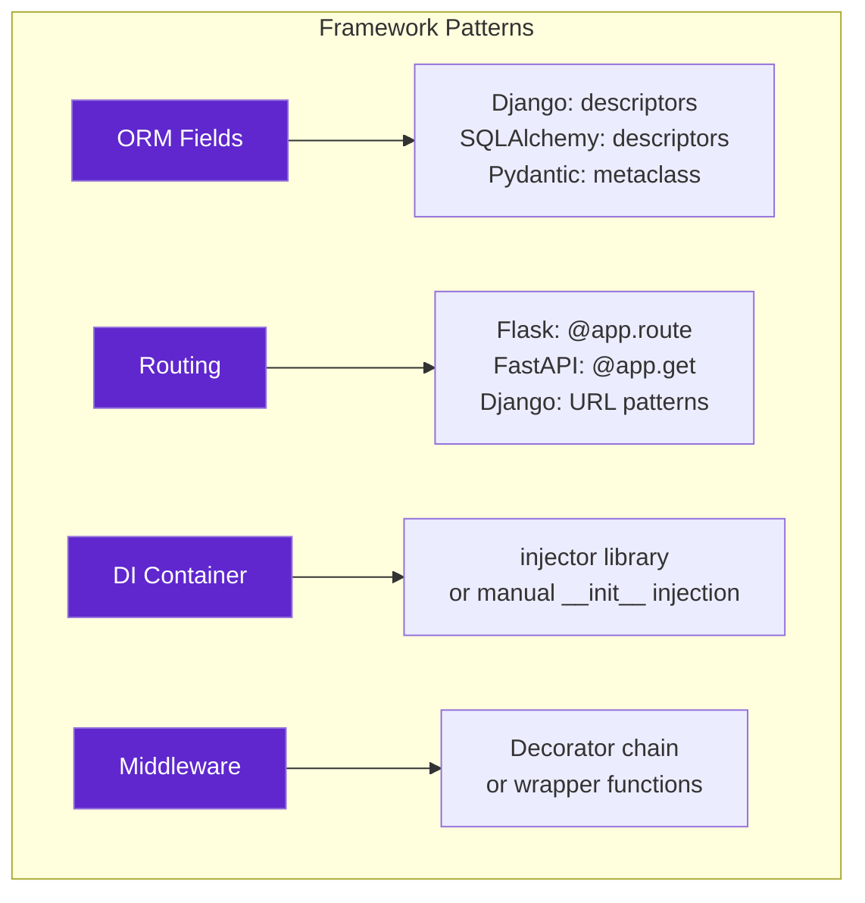

---

## 🆕 17. Performance & Memory Deep Dive (Extended)

### 17.1 Memory Layout Comparison

```python
import sys


class RegularClass:
    def __init__(self, x, y, z):
        self.x = x
        self.y = y
        self.z = z


class SlottedClass:
    __slots__ = ("x", "y", "z")
    
    def __init__(self, x, y, z):
        self.x = x
        self.y = y
        self.z = z


from dataclasses import dataclass


@dataclass
class DataClass:
    x: int
    y: int
    z: int


@dataclass(slots=True)
class SlottedDataClass:
    x: int
    y: int
    z: int


# Memory comparison (CPython 3.12, 64-bit)
regular = RegularClass(1, 2, 3)
slotted = SlottedClass(1, 2, 3)
data = DataClass(1, 2, 3)
slotted_data = SlottedDataClass(1, 2, 3)

print(f"Regular class:      {sys.getsizeof(regular) + sys.getsizeof(regular.__dict__):>5} bytes")
print(f"Slotted class:      {sys.getsizeof(slotted):>5} bytes")
print(f"Dataclass:          {sys.getsizeof(data) + sys.getsizeof(data.__dict__):>5} bytes")
print(f"Slotted dataclass:  {sys.getsizeof(slotted_data):>5} bytes")

# Typical output:
# Regular class:        288 bytes
# Slotted class:         48 bytes  ← 83% smaller!
# Dataclass:            288 bytes
# Slotted dataclass:     48 bytes  ← 83% smaller!
```

### 17.2 Attribute Access Speed Benchmark

```python
import timeit


class Regular:
    def __init__(self):
        self.x = 1
        self.y = 2
        self.z = 3


class Slotted:
    __slots__ = ("x", "y", "z")
    
    def __init__(self):
        self.x = 1
        self.y = 2
        self.z = 3


regular = Regular()
slotted = Slotted()

# Benchmark attribute access
n = 1_000_000
regular_time = timeit.timeit(lambda: regular.x, number=n)
slotted_time = timeit.timeit(lambda: slotted.x, number=n)

print(f"Regular attribute access: {regular_time:.4f}s")
print(f"Slotted attribute access: {slotted_time:.4f}s")
print(f"Speedup: {regular_time / slotted_time:.2f}x")

# Typical output:
# Regular attribute access: 0.0523s
# Slotted attribute access: 0.0387s
# Speedup: 1.35x
```

### 17.3 Method Resolution Order Performance

```python
import timeit


class A:
    def method(self): return "A"

class B(A):
    def method(self): return "B"

class C(B):
    def method(self): return "C"

class D(C):
    def method(self): return "D"


d = D()

# Direct method call
direct_time = timeit.timeit(lambda: d.method(), number=1_000_000)
print(f"Direct method call: {direct_time:.4f}s")

# Method via getattr
getattr_time = timeit.timeit(lambda: getattr(d, "method")(), number=1_000_000)
print(f"getattr method call: {getattr_time:.4f}s")
print(f"Overhead: {getattr_time / direct_time:.2f}x")
```

### Mermaid: Memory Layout Visualization

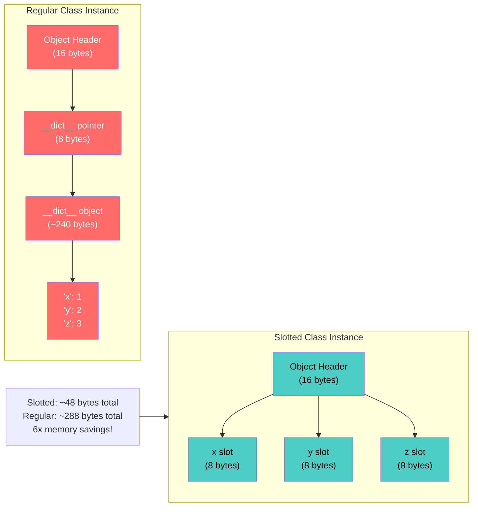

### Key Performance Takeaways

| Pattern | Memory | Access Speed | Use When |
|---|---|---|---|
| Regular class | High (~288 bytes) | Baseline | Flexibility needed |
| `__slots__` | Low (~48 bytes) | ~1.3x faster | Many instances, fixed attributes |
| `@dataclass` | High (~288 bytes) | Baseline | Data holding, readability |
| `@dataclass(slots=True)` | Low (~48 bytes) | ~1.3x faster | Best of both worlds (Python 3.10+) |
| `NamedTuple` | Lowest (~64 bytes) | ~1.5x faster | Immutable data, tuples |

---

## Quizzes

### Quiz 1: Class Basics
**Q:** What is the equivalent of TypeScript's `this` in Python?
<details><summary>Answer</summary>A: `self` — it's an explicit first parameter of instance methods.</details>

### Quiz 2: Private Members
**Q:** How does Python enforce private members compared to TypeScript?
<details><summary>Answer</summary>A: Python does NOT enforce privacy. `__name` is "name-mangled" to `_ClassName__name`, but it's a soft convention only. TypeScript's `private` is enforced at compile time.</details>

### Quiz 3: Inheritance Syntax
**Q:** What's the Python equivalent of `class Dog extends Animal {}`?
<details><summary>Answer</summary>A: `class Dog(Animal):` — no `extends` keyword, just parentheses.</details>

### Quiz 4: MRO
**Q:** For `class D(B, C)` where `B(A)` and `C(A)`, what is `D.__mro__`?
<details><summary>Answer</summary>A: `(D, B, C, A, object)` — depth-first, left-to-right.</details>

### Quiz 5: super() Behavior
**Q:** Does `super()` call the parent class or the next in MRO?
<details><summary>Answer</summary>A: The NEXT class in the MRO, not necessarily the parent. This is critical for cooperative multiple inheritance.</details>

### Quiz 6: Dunder Triggers
**Q:** Which dunder method is called when you use `len(obj)`?
<details><summary>Answer</summary>A: `__len__(self)`</details>

### Quiz 7: Property vs Descriptor
**Q:** What's the low-level mechanism behind `@property`?
<details><summary>Answer</summary>A: Descriptors — `@property` creates a data descriptor using `__get__`, `__set__`, and `__delete__`.</details>

### Quiz 8: @dataclass Boilerplate Reduction
**Q:** What percentage of boilerplate does @dataclass eliminate for simple data classes?
<details><summary>Answer</summary>A: ~80% — generates `__init__`, `__repr__`, `__eq__`, and `__hash__` automatically.</details>

### Quiz 9: Metaclass vs Decorator
**Q:** When should you use a metaclass instead of a class decorator?
<details><summary>Answer</summary>A: Only when you need to intercept class creation itself (at definition time), like ORM field definitions, singleton enforcement, or plugin registration. Prefer class decorators for post-definition modifications.</details>

### Quiz 10: Slots Memory Impact
**Q:** How much memory does `__slots__` typically save per instance?
<details><summary>Answer</summary>A: ~40-80%, depending on the number of attributes. Eliminates the `__dict__` overhead (~240 bytes in CPython).</details>

### Quiz 11: classmethod vs staticmethod
**Q:** What's the difference between `@classmethod` and `@staticmethod` regarding polymorphism?
<details><summary>Answer</summary>A: `@classmethod` receives `cls` (the actual subclass), making it polymorphic. `@staticmethod` has no access to the class, so it cannot be polymorphic.</details>

### Quiz 12: Protocol vs ABC
**Q:** When would you choose a Protocol over an ABC?
<details><summary>Answer</summary>A: Choose Protocol for flexible duck-typing contracts (no inheritance needed). Choose ABC when you need runtime enforcement (can't instantiate abstract class).</details>

### Quiz 13: Composition Pattern
**Q:** What Python pattern replaces TypeScript's interface-based dependency injection?
<details><summary>Answer</summary>A: Protocol + composition. Define a Protocol for the interface, then accept it as a constructor parameter.</details>

### Quiz 14: __new__ Use Cases
**Q:** When is `__new__` actually needed in practice?
<details><summary>Answer</summary>A: Singleton patterns, immutable type subclasses (str, int, tuple), caching factories, or when you need to control instance creation (returning cached/pre-existing instances).</details>

### Quiz 15: Multiple Inheritance Pitfalls
**Q:** What's the #1 pitfall of multiple inheritance?
<details><summary>Answer</summary>A: Diamond inheritance with `super()` — if classes don't all call `super().__init__()` cooperatively, some initializers may be skipped. Always use cooperative inheritance (every class calls super).</details>

### Quiz 16: Descriptors on Class vs Instance
**Q:** What happens when you access a descriptor from the class vs from an instance?
<details><summary>Answer</summary>A: From the instance, `__get__(instance, cls)` is called. From the class, `__get__(None, cls)` is called, returning the descriptor object itself (for data inspection).</details>

### Quiz 17: Frozen Dataclass
**Q:** What does `@dataclass(frozen=True)` do?
<details><summary>Answer</summary>A: Makes instances immutable — no attributes can be modified after creation. Generates `__hash__` automatically (since instances are hashable).</details>

### Quiz 18: Context Manager Protocol
**Q:** What dunder methods must a class implement to be used with `with`?
<details><summary>Answer</summary>A: `__enter__(self)` and `__exit__(self, exc_type, exc_val, exc_tb)`. The `__enter__` returns what `as var` gets.</details>

### Quiz 19: Callable Objects
**Q:** Which dunder method makes an object callable like a function?
<details><summary>Answer</summary>A: `__call__(self, ...)` — allows `obj(args)` syntax.</details>

### Quiz 20: C3 Linearization Rule
**Q:** What are the three rules of C3 linearization?
<details><summary>Answer</summary>A: (1) Subclasses before parents, (2) Left-to-right order in base list is preserved, (3) Parent MROs are respected. If these conflict, Python raises TypeError.</details>

### Quiz 21: Descriptor Types
**Q:** What's the difference between a data descriptor and a non-data descriptor?
<details><summary>Answer</summary>A: A data descriptor has `__set__` or `__delete__`. It takes priority over instance `__dict__`. A non-data descriptor only has `__get__` — it loses to instance `__dict__` entries.</details>

### Quiz 22: Auto-Init Metaclass
**Q:** How does the AutoInitMeta metaclass work?
<details><summary>Answer</summary>A: It reads `__annotations__` from the class namespace, then generates and executes a custom `__init__` that assigns all annotated parameters to instance attributes.</details>

---

## 🆕 Extended Quizzes (26-40)

### Quiz 26: Builder Pattern
**Q:** How does Python's builder pattern differ from TypeScript's?
<details><summary>Answer</summary>A: Python uses method chaining with `Self` return type, often combined with `@dataclass`. TypeScript uses fluent methods returning `this`. Both achieve the same fluent API construction.</details>

### Quiz 27: Strategy Pattern
**Q:** What's the Python equivalent of TypeScript's interface-based strategy pattern?
<details><summary>Answer</summary>A: Protocol + dependency injection. Define a Protocol for the strategy interface, then inject concrete implementations at runtime.</details>

### Quiz 28: Observer Pattern
**Q:** How does Python's EventEmitter compare to Node.js's?
<details><summary>Answer</summary>A: Functionally identical — both use event names and callback registration. Python's is typically implemented as a custom class with `on()`, `off()`, and `emit()` methods.</details>

### Quiz 29: Django ORM Fields
**Q:** What Python feature enables Django-style model field definitions?
<details><summary>Answer</summary>A: Descriptors with `__set_name__`, `__get__`, and `__set__`. Each field is a descriptor that validates and stores values in the instance's `__dict__`.</details>

### Quiz 30: Pydantic Validation
**Q:** How does Pydantic achieve automatic field validation?
<details><summary>Answer</summary>A: Through a metaclass that reads `__annotations__` at class creation time, then wraps `__init__` to validate and coerce all fields based on their type hints.</details>

### Quiz 31: Flask Routing
**Q:** What Python feature enables decorator-based route registration?
<details><summary>Answer</summary>A: Decorators that return wrapper functions while registering the original function in a route dictionary. The `@wraps` decorator preserves metadata.</details>

### Quiz 32: Memory Efficiency
**Q:** When should you use `@dataclass(slots=True)`?
<details><summary>Answer</summary>A: When you have many instances of a data-holding class and memory is a concern. It combines dataclass convenience with slots efficiency (Python 3.10+).</details>

### Quiz 33: Attribute Access Speed
**Q:** Why are slotted classes faster for attribute access?
<details><summary>Answer</summary>A: Slots use direct C-level pointer access instead of dictionary lookup. This eliminates the hash computation and dictionary traversal overhead.</details>

### Quiz 34: NamedTuple vs Dataclass
**Q:** When should you prefer NamedTuple over @dataclass?
<details><summary>Answer</summary>A: When you need immutable data with tuple-like behavior, maximum memory efficiency, or compatibility with code expecting tuples. NamedTuples are ~4x smaller than dataclasses.</details>

### Quiz 35: __init_subclass__
**Q:** What's the advantage of `__init_subclass__` over metaclasses?
<details><summary>Answer</summary>A: Simpler syntax, no metaclass complexity, works with multiple inheritance, and is sufficient for most use cases like auto-registration and validation.</details>

### Quiz 36: Protocol runtime_checkable
**Q:** What does `@runtime_checkable` do for Protocols?
<details><summary>Answer</summary>A: Allows using the Protocol with `isinstance()` and `issubclass()` at runtime. Without it, Protocols only work with static type checkers.</details>

### Quiz 37: Generic Type Erasure
**Q:** Are Python generics erased at runtime like TypeScript?
<details><summary>Answer</summary>A: Yes, Python generics are erased at runtime. `Generic[T]` only helps static type checkers. At runtime, `Repository[User]` is just `Repository`.</details>

### Quiz 38: Cooperative Inheritance
**Q:** What happens if a class in the MRO chain doesn't call `super().__init__()`?
<details><summary>Answer</summary>A: Classes after it in the MRO chain won't be initialized. This breaks cooperative multiple inheritance and can cause subtle bugs.</details>

### Quiz 39: Descriptor Priority
**Q:** What's the priority order for attribute access?
<details><summary>Answer</summary>A: (1) Data descriptors on class, (2) Instance `__dict__`, (3) Non-data descriptors on class, (4) `__getattr__` fallback.</details>

### Quiz 40: __post_init__
**Q:** When is `__post_init__` called in a dataclass?
<details><summary>Answer</summary>A: After the auto-generated `__init__` completes. It's used for validation, computed fields, or any initialization logic that needs access to all fields.</details>

---

## Exercises

### Exercise 1: Implement Dunder Methods on a Point Class
Create a `Point` class with these dunder methods: `__init__`, `__str__`, `__repr__`, `__eq__`, `__add__`, `__abs__`, `__neg__`, `__iter__`, `__len__`, `__getitem__`. Verify each one works.

<details><summary>Solution</summary>

```python
import math

class Point:
    def __init__(self, x: float, y: float) -> None:
        self.x = x
        self.y = y

    def __str__(self) -> str:
        return f"({self.x}, {self.y})"

    def __repr__(self) -> str:
        return f"Point({self.x!r}, {self.y!r})"

    def __eq__(self, other: object) -> bool:
        if not isinstance(other, Point):
            return NotImplemented
        return math.isclose(self.x, other.x) and math.isclose(self.y, other.y)

    def __add__(self, other: "Point") -> "Point":
        return Point(self.x + other.x, self.y + other.y)

    def __abs__(self) -> float:
        return math.sqrt(self.x**2 + self.y**2)

    def __neg__(self) -> "Point":
        return Point(-self.x, -self.y)

    def __iter__(self):
        yield self.x
        yield self.y

    def __len__(self) -> int:
        return 2

    def __getitem__(self, index: int) -> float:
        if index == 0:
            return self.x
        elif index == 1:
            return self.y
        raise IndexError("Point has only 2 dimensions")

# Verification:
p1 = Point(3.0, 4.0)
print(str(p1))          # (3.0, 4.0)
print(repr(p1))         # Point(3.0, 4.0)
print(abs(p1))          # 5.0
for coord in p1:
    print(coord)        # 3.0, then 4.0
```
</details>

### Exercise 2: Property Validation on BankAccount
Implement a `BankAccount` class where the `balance` property has a setter that prevents negative balances and deposits over $10,000 require verification. Use `@property` with getter and setter.

<details><summary>Solution</summary>

```python
class BankAccount:
    def __init__(self, initial_balance: float = 0.0) -> None:
        self.balance = initial_balance  # Uses setter!

    @property
    def balance(self) -> float:
        return self._balance

    @balance.setter
    def balance(self, value: float) -> None:
        if value < 0:
            raise ValueError("Balance cannot be negative")
        if value > 10_000 and not getattr(self, "_verified_large_deposit", False):
            raise ValueError("Large deposits require verification")
        self._balance = value

# Verification:
acc = BankAccount(100)
print(acc.balance)    # 100
acc.balance = 50      # OK
# acc.balance = -10   # ValueError!
```
</details>

### Exercise 3: MRO Investigation
Create classes `A`, `B(A)`, `C(A)`, `D(B, C)`. Print `D.__mro__` and verify the C3 linearization order. Add a `speak()` method to each class and call it on an instance of `D`.

<details><summary>Solution</summary>

```python
class A:
    def speak(self): return "A"

class B(A):
    def speak(self): return "B"

class C(A):
    def speak(self): return "C"

class D(B, C):
    def speak(self): return "D"

d = D()
print(D.__mro__)  # (D, B, C, A, object)
print(d.speak())  # "D" — found in D first!
```
</details>

### Exercise 4: Descriptor Pattern — ValidatedField
Build a `ValidatedField` descriptor that accepts a `validator` function in its constructor. Use it as a class attribute to validate values on assignment (e.g., email must contain `@`).

<details><summary>Solution</summary>

```python
class ValidatedField:
    def __set_name__(self, owner: type, name: str) -> None:
        self.name = name
        self.validator = getattr(owner, f"_validate_{name}", None)

    def __get__(self, obj: object | None, objtype: type | None = None):
        if obj is None:
            return self
        return obj.__dict__.get(self.name)

    def __set__(self, obj: object, value: any) -> None:
        if self.validator:
            self.validator(value)
        obj.__dict__[self.name] = value


class User:
    email = ValidatedField()

    @staticmethod
    def _validate_email(value: str) -> None:
        if "@" not in value:
            raise ValueError("Email must contain @")

u = User()
u.email = "alice@example.com"  # OK
# u.email = "invalid"          # ValueError!
```
</details>

### Exercise 5: Metaclass Singleton — Two Approaches
Implement the Singleton pattern using both a metaclass AND a class decorator. Compare which approach is cleaner and more Pythonic.

<details><summary>Solution</summary>

```python
# Approach 1: Metaclass
class SingletonMeta(type):
    _instances = {}
    def __call__(cls, *args, **kwargs):
        if cls not in cls._instances:
            cls._instances[cls] = super().__call__(*args, **kwargs)
        return cls._instances[cls]

class Database1(metaclass=SingletonMeta):
    pass


# Approach 2: Class decorator (CLEANER!)
def singleton(cls):
    instance = None
    def get_instance(*args, **kwargs):
        nonlocal instance
        if instance is None:
            instance = cls(*args, **kwargs)
        return instance
    return get_instance

@singleton
class Database2:
    pass

# Verdict: Class decorator is cleaner — no metaclass complexity!
```
</details>

### Exercise 6: Cooperative Multiple Inheritance Chain
Create three mixin classes and a base class, all using cooperative `super()` calls. Verify each class's `__init__` runs exactly once in the correct MRO order.

<details><summary>Solution</summary>

```python
class InitBase:
    def __init__(self, **kwargs) -> None:
        super().__init__(**kwargs)
        print("InitBase")

class LoggerMixin:
    def __init__(self, **kwargs) -> None:
        super().__init__(**kwargs)
        print("LoggerMixin")

class ValidatorMixin:
    def __init__(self, **kwargs) -> None:
        super().__init__(**kwargs)
        print("ValidatorMixin")

class App(LoggerMixin, ValidatorMixin, InitBase):
    def __init__(self) -> None:
        super().__init__()
        print("App")

app = App()
# Output: App → LoggerMixin → ValidatorMixin → InitBase → object
print(App.__mro__)
```
</details>

### Exercise 7: Custom Comparable Class
Implement a `Score` class that supports all comparison operators. Scores should compare by value, with ties broken by subject name alphabetically.

<details><summary>Solution</summary>

```python
from functools import total_ordering

@total_ordering  # Generates all comparison methods from __eq__ and __lt__!
class Score:
    def __init__(self, value: float, subject: str) -> None:
        self.value = value
        self.subject = subject

    def __eq__(self, other: object) -> bool:
        if not isinstance(other, Score):
            return NotImplemented
        return (self.value, self.subject) == (other.value, other.subject)

    def __lt__(self, other: "Score") -> bool:
        if not isinstance(other, Score):
            return NotImplemented
        return (self.value, self.subject) < (other.value, other.subject)

    def __repr__(self) -> str:
        return f"Score({self.value}, {self.subject!r})"

# With @total_ordering, you only need __eq__ and __lt__. Python generates the rest.
s1 = Score(90, "Math")
s2 = Score(90, "English")
print(s1 < s2)    # True — 'Math' < 'English' alphabetically!
```
</details>

### Exercise 8: Property Access Chain Investigation
Create a class with a data descriptor and an instance attribute. Investigate which one takes priority when both exist.

<details><summary>Solution</summary>

```python
class Descriptor:
    def __get__(self, obj, objtype=None):
        return "from descriptor"
    def __set__(self, obj, value):
        obj._desc_value = value

class MyClass:
    desc = Descriptor()

obj = MyClass()
print(obj.desc)       # "from descriptor" — data descriptor wins!
obj.desc = "instance" # Calls descriptor's __set__
print(obj.__dict__)   # {'_desc_value': 'instance'}
# Data descriptors always override instance __dict__ entries.
```
</details>

### Exercise 9: Composition Over Inheritance — Logger Pattern
Refactor a class that incorrectly inherits from `Logger` into one that composes a `Logger`. Verify both approaches produce the same behavior.

<details><summary>Solution</summary>

```python
# BAD: Inheritance (tight coupling!)
class BadService(Logger):  # ❌ tightly coupled
    def run(self):
        self.log("running")

# GOOD: Composition (loose coupling via Protocol)
from typing import Protocol

class ILog(Protocol):
    def log(self, msg: str) -> None: ...

class GoodService:
    def __init__(self, logger: ILog) -> None:
        self.logger = logger  # Any object with .log() works!

    def run(self) -> None:
        self.logger.log("running")
```
</details>

### Exercise 10: @dataclass with Validation via `__post_init__`
Create a `@dataclass` User with validation in `__post_init__` for email format and age range.

<details><summary>Solution</summary>

```python
from dataclasses import dataclass

@dataclass
class User:
    name: str
    email: str
    age: int

    def __post_init__(self) -> None:
        if "@" not in self.email:
            raise ValueError("Invalid email")
        if not (0 <= self.age <= 150):
            raise ValueError("Invalid age")

u = User("Alice", "alice@example.com", 30)  # OK
# User("Bob", "invalid-email", 200)         # ValueError!
```
</details>

### Exercise 11: Implement a Context Manager Without `contextlib`
Create a file lock context manager using `__enter__` and `__exit__` that acquires a resource on enter and releases it on exit, even if an exception occurs.

<details><summary>Solution</summary>

```python
import threading

class FileLock:
    def __init__(self, filename: str) -> None:
        self.filename = filename
        self.lock = threading.Lock()

    def __enter__(self) -> "FileLock":
        self.lock.acquire()
        print(f"Locked {self.filename}")
        return self

    def __exit__(self, exc_type, exc_val, exc_tb) -> bool:
        self.lock.release()
        print(f"Released {self.filename}")
        return False  # Don't suppress exceptions

with FileLock("data.txt") as lock:
    write_data(lock.filename, "hello")
# Automatically released even if write_data raises!
```
</details>

### Exercise 12: Mixin Chain — Event Emitter
Create an `EventEmitter` mixin that any class can inherit to get pub/sub functionality. Verify it works when mixed with other mixins.

<details><summary>Solution</summary>

```python
class EventEmitterMixin:
    def __init__(self, *args, **kwargs) -> None:
        super().__init__(*args, **kwargs)
        self._listeners: dict[str, list] = {}

    def on(self, event: str, callback) -> None:
        self._listeners.setdefault(event, []).append(callback)

    def emit(self, event: str, *args) -> None:
        for cb in self._listeners.get(event, []):
            cb(*args)


class UserWithEvents(EventEmitterMixin):
    def __init__(self, name: str) -> None:
        super().__init__()
        self.name = name

user = UserWithEvents("Alice")
user.on("greet", lambda: print(f"Hello, {user.name}!"))
user.emit("greet")  # "Hello, Alice!"
```
</details>

### Exercise 13: __init_subclass__ Auto-Registration
Implement `__init_subclass__` in a base class that automatically registers all subclasses in a registry dict. Verify registration happens at import time.

<details><summary>Solution</summary>

```python
class PluginBase:
    _registry: dict[str, type] = {}

    def __init_subclass__(cls, **kwargs) -> None:
        super().__init_subclass__(**kwargs)
        PluginBase._registry[cls.__name__] = cls
        print(f"Registered {cls.__name__}")


class EmailPlugin(PluginBase): pass  # Prints "Registered EmailPlugin"
class SmsPlugin(PluginBase): pass    # Prints "Registered SmsPlugin"

print(PluginBase._registry)
# {'EmailPlugin': <class '...'>, 'SmsPlugin': <class '...'>}
```
</details>

### Exercise 14: Descriptor — TypedField with Type Coercion
Build a descriptor that coerces assigned values to their declared type. `TypedField(int)` should convert `"42"` to `42`.

<details><summary>Solution</summary>

```python
class TypedField:
    def __init__(self, type_: type) -> None:
        self.type_ = type_
        self.name: str | None = None

    def __set_name__(self, owner: type, name: str) -> None:
        self.name = name

    def __get__(self, obj, objtype=None):
        if obj is None:
            return self
        return obj.__dict__.get(self.name)

    def __set__(self, obj: object, value: any) -> None:
        obj.__dict__[self.name] = self.type_(value)

class Config:
    port = TypedField(int)
    debug = TypedField(bool)

c = Config()
c.port = "3000"       # Coerced to int 3000!
c.debug = "true"      # Coerced to bool True (truthy!)
print(c.port, c.debug)  # 3000 True
```
</details>

### Exercise 15: Class Decorator — Auto-Log All Methods
Create a class decorator that wraps every method with logging. Verify it works for both instance and class methods.

<details><summary>Solution</summary>

```python
import functools
import time

def auto_log(cls):
    for name, method in cls.__dict__.items():
        if callable(method) and not name.startswith("_"):
            @functools.wraps(method)
            def make_wrapper(m):
                def wrapper(self, *args, **kwargs):
                    print(f">>> {cls.__name__}.{name}({args}, {kwargs})")
                    start = time.perf_counter()
                    result = m(self, *args, **kwargs)
                    elapsed = time.perf_counter() - start
                    print(f"<<< {cls.__name__}.{name} returned in {elapsed:.4f}s")
                    return result
                return wrapper
            setattr(cls, name, make_wrapper(method))
    return cls

@auto_log
class Calculator:
    def add(self, a: int, b: int) -> int:
        return a + b

calc = Calculator()
calc.add(3, 4)
# >>> Calculator.add((3, 4), {})
# <<< Calculator.add returned in 0.0001s
```
</details>

---

## 🆕 Extended Exercises (16-25)

### Exercise 16: Builder Pattern Implementation
Implement a fluent builder for a `DatabaseConfig` class with fields: `host`, `port`, `username`, `password`, `database`, `pool_size`. Use method chaining.

<details><summary>Solution</summary>

```python
from dataclasses import dataclass
from typing import Self


@dataclass
class DatabaseConfig:
    host: str
    port: int
    username: str
    password: str
    database: str
    pool_size: int = 5


class DatabaseConfigBuilder:
    def __init__(self):
        self._config = {}
    
    def host(self, host: str) -> Self:
        self._config["host"] = host
        return self
    
    def port(self, port: int) -> Self:
        self._config["port"] = port
        return self
    
    def username(self, username: str) -> Self:
        self._config["username"] = username
        return self
    
    def password(self, password: str) -> Self:
        self._config["password"] = password
        return self
    
    def database(self, database: str) -> Self:
        self._config["database"] = database
        return self
    
    def pool_size(self, size: int) -> Self:
        self._config["pool_size"] = size
        return self
    
    def build(self) -> DatabaseConfig:
        required = ["host", "port", "username", "password", "database"]
        for field in required:
            if field not in self._config:
                raise ValueError(f"Missing required field: {field}")
        return DatabaseConfig(**self._config)


# Usage
config = (
    DatabaseConfigBuilder()
    .host("localhost")
    .port(5432)
    .username("admin")
    .password("secret")
    .database("mydb")
    .pool_size(10)
    .build()
)
print(config)
```
</details>

### Exercise 17: Generic Repository Pattern
Implement a generic `Repository[T]` with methods: `find_by_id`, `find_all`, `save`, `delete`. Create concrete implementations for `User` and `Product`.

<details><summary>Solution</summary>

```python
from typing import Generic, TypeVar, Protocol
from abc import ABC, abstractmethod
from dataclasses import dataclass

T = TypeVar("T")
ID = TypeVar("ID")


class Repository(ABC, Generic[T, ID]):
    @abstractmethod
    def find_by_id(self, id: ID) -> T | None: ...
    
    @abstractmethod
    def find_all(self) -> list[T]: ...
    
    @abstractmethod
    def save(self, entity: T) -> T: ...
    
    @abstractmethod
    def delete(self, id: ID) -> bool: ...


@dataclass
class User:
    id: int
    name: str


@dataclass
class Product:
    id: str
    name: str
    price: float


class InMemoryRepository(Repository[T, ID]):
    def __init__(self):
        self._storage: dict[ID, T] = {}
    
    def find_by_id(self, id: ID) -> T | None:
        return self._storage.get(id)
    
    def find_all(self) -> list[T]:
        return list(self._storage.values())
    
    def save(self, entity: T) -> T:
        id_field = getattr(entity, "id")
        self._storage[id_field] = entity
        return entity
    
    def delete(self, id: ID) -> bool:
        return self._storage.pop(id, None) is not None


# Usage
user_repo: Repository[User, int] = InMemoryRepository()
user_repo.save(User(id=1, name="Alice"))
print(user_repo.find_all())

product_repo: Repository[Product, str] = InMemoryRepository()
product_repo.save(Product(id="P001", name="Widget", price=9.99))
print(product_repo.find_all())
```
</details>

### Exercise 18: Strategy Pattern — Sorting Algorithms
Implement a `Sorter` class that accepts different sorting strategies (bubble sort, quick sort, merge sort) via the Strategy pattern.

<details><summary>Solution</summary>

```python
from typing import Protocol, Callable


class SortStrategy(Protocol):
    def sort(self, data: list) -> list: ...


class BubbleSort:
    def sort(self, data: list) -> list:
        arr = data.copy()
        n = len(arr)
        for i in range(n):
            for j in range(0, n - i - 1):
                if arr[j] > arr[j + 1]:
                    arr[j], arr[j + 1] = arr[j + 1], arr[j]
        return arr


class QuickSort:
    def sort(self, data: list) -> list:
        if len(data) <= 1:
            return data
        pivot = data[len(data) // 2]
        left = [x for x in data if x < pivot]
        middle = [x for x in data if x == pivot]
        right = [x for x in data if x > pivot]
        return self.sort(left) + middle + self.sort(right)


class Sorter:
    def __init__(self, strategy: SortStrategy):
        self._strategy = strategy
    
    def sort(self, data: list) -> list:
        return self._strategy.sort(data)
    
    def set_strategy(self, strategy: SortStrategy) -> None:
        self._strategy = strategy


# Usage
sorter = Sorter(BubbleSort())
print(sorter.sort([3, 1, 4, 1, 5, 9, 2, 6]))

sorter.set_strategy(QuickSort())
print(sorter.sort([3, 1, 4, 1, 5, 9, 2, 6]))
```
</details>

### Exercise 19: Observer Pattern — Stock Price Tracker
Implement an observer pattern for tracking stock price changes. Multiple observers should be notified when a stock price updates.

<details><summary>Solution</summary>

```python
from typing import Callable


class Stock:
    def __init__(self, symbol: str, price: float):
        self.symbol = symbol
        self._price = price
        self._observers: list[Callable] = []
    
    @property
    def price(self) -> float:
        return self._price
    
    @price.setter
    def price(self, value: float):
        old_price = self._price
        self._price = value
        self._notify(old_price, value)
    
    def subscribe(self, callback: Callable) -> None:
        self._observers.append(callback)
    
    def unsubscribe(self, callback: Callable) -> None:
        self._observers.remove(callback)
    
    def _notify(self, old_price: float, new_price: float):
        for observer in self._observers:
            observer(self.symbol, old_price, new_price)


# Observers
def price_logger(symbol: str, old: float, new: float):
    change = ((new - old) / old) * 100
    print(f"{symbol}: ${old:.2f} → ${new:.2f} ({change:+.2f}%)")

def price_alert(symbol: str, old: float, new: float):
    if new > 100:
        print(f"🚨 ALERT: {symbol} exceeded $100!")


# Usage
apple = Stock("AAPL", 95.0)
apple.subscribe(price_logger)
apple.subscribe(price_alert)

apple.price = 98.5
apple.price = 102.0
```
</details>

### Exercise 20: Factory Pattern — Shape Factory
Create a shape factory that can create different shapes (Circle, Rectangle, Triangle) based on a type string. Use registration for extensibility.

<details><summary>Solution</summary>

```python
from typing import Callable
from dataclasses import dataclass
import math


@dataclass
class Shape:
    pass


@dataclass
class Circle(Shape):
    radius: float
    
    def area(self) -> float:
        return math.pi * self.radius ** 2


@dataclass
class Rectangle(Shape):
    width: float
    height: float
    
    def area(self) -> float:
        return self.width * self.height


@dataclass
class Triangle(Shape):
    base: float
    height: float
    
    def area(self) -> float:
        return 0.5 * self.base * self.height


class ShapeFactory:
    _creators: dict[str, Callable] = {}
    
    @classmethod
    def register(cls, shape_type: str, creator: Callable):
        cls._creators[shape_type] = creator
    
    @classmethod
    def create(cls, shape_type: str, **kwargs) -> Shape:
        if shape_type not in cls._creators:
            raise ValueError(f"Unknown shape: {shape_type}")
        return cls._creators[shape_type](**kwargs)


# Register shapes
ShapeFactory.register("circle", Circle)
ShapeFactory.register("rectangle", Rectangle)
ShapeFactory.register("triangle", Triangle)


# Usage
circle = ShapeFactory.create("circle", radius=5)
rect = ShapeFactory.create("rectangle", width=4, height=6)
tri = ShapeFactory.create("triangle", base=3, height=8)

print(f"Circle area: {circle.area():.2f}")
print(f"Rectangle area: {rect.area():.2f}")
print(f"Triangle area: {tri.area():.2f}")
```
</details>

### Exercise 21: Django-Style Model with Descriptors
Create a Django-style model system using descriptors for field validation. Include `IntegerField`, `StringField`, and `BooleanField`.

<details><summary>Solution</summary>

```python
class Field:
    def __init__(self, field_type: type, nullable: bool = False, default=None):
        self.field_type = field_type
        self.nullable = nullable
        self.default = default
        self.name = None
    
    def __set_name__(self, owner, name):
        self.name = name
    
    def __get__(self, obj, objtype=None):
        if obj is None:
            return self
        return obj.__dict__.get(self.name, self.default)
    
    def __set__(self, obj, value):
        if value is None and not self.nullable:
            raise ValueError(f"{self.name} cannot be None")
        if value is not None and not isinstance(value, self.field_type):
            raise TypeError(f"{self.name} must be {self.field_type.__name__}")
        obj.__dict__[self.name] = value


class IntegerField(Field):
    def __init__(self, **kwargs):
        super().__init__(int, **kwargs)


class StringField(Field):
    def __init__(self, max_length: int = 255, **kwargs):
        super().__init__(str, **kwargs)
        self.max_length = max_length
    
    def __set__(self, obj, value):
        if value is not None and len(value) > self.max_length:
            raise ValueError(f"{self.name} exceeds max length {self.max_length}")
        super().__set__(obj, value)


class BooleanField(Field):
    def __init__(self, **kwargs):
        super().__init__(bool, **kwargs)


class Model:
    def __init__(self, **kwargs):
        for key, value in kwargs.items():
            setattr(self, key, value)
    
    def __repr__(self):
        fields = ", ".join(f"{k}={v!r}" for k, v in self.__dict__.items())
        return f"{type(self).__name__}({fields})"


class User(Model):
    id = IntegerField()
    name = StringField(max_length=100)
    email = StringField(max_length=255)
    is_active = BooleanField(default=True)


# Usage
user = User(id=1, name="Alice", email="alice@example.com")
print(user)

# user.name = 123  # TypeError!
# user.email = "x" * 300  # ValueError!
```
</details>

### Exercise 22: Flask-Style Mini Framework
Build a minimal web framework with route registration, request handling, and middleware support.

<details><summary>Solution</summary>

```python
from typing import Callable
from functools import wraps


class Request:
    def __init__(self, method: str, path: str, data: dict = None):
        self.method = method
        self.path = path
        self.data = data or {}


class Response:
    def __init__(self, status: int, data: dict = None):
        self.status = status
        self.data = data or {}


class App:
    def __init__(self):
        self._routes: dict[str, Callable] = {}
        self._middleware: list[Callable] = []
    
    def route(self, path: str, methods: list[str] = None):
        if methods is None:
            methods = ["GET"]
        
        def decorator(func: Callable):
            key = f"{','.join(methods)}:{path}"
            self._routes[key] = func
            return func
        return decorator
    
    def use(self, middleware: Callable):
        self._middleware.append(middleware)
    
    def handle(self, request: Request) -> Response:
        # Apply middleware
        for mw in self._middleware:
            request = mw(request)
            if request is None:
                return Response(403, {"error": "Forbidden"})
        
        # Find route
        key = f"{request.method}:{request.path}"
        if key not in self._routes:
            return Response(404, {"error": "Not Found"})
        
        try:
            result = self._routes[key](request)
            return Response(200, result)
        except Exception as e:
            return Response(500, {"error": str(e)})


# Usage
app = App()

# Middleware
def auth_middleware(request: Request):
    if "Authorization" not in request.data:
        return None
    return request

app.use(auth_middleware)

@app.route("/users", methods=["GET"])
def list_users(request: Request):
    return {"users": ["Alice", "Bob"]}

@app.route("/users", methods=["POST"])
def create_user(request: Request):
    return {"created": request.data.get("name")}


# Test
req1 = Request("GET", "/users", {"Authorization": "Bearer token"})
print(app.handle(req1).data)

req2 = Request("GET", "/users")
print(app.handle(req2).status)  # 403
```
</details>

### Exercise 23: Memory Optimization Challenge
Take a class that creates 100,000 instances and optimize it using `__slots__` and `@dataclass(slots=True)`. Measure memory savings.

<details><summary>Solution</summary>

```python
import sys
from dataclasses import dataclass


class RegularPoint:
    def __init__(self, x: float, y: float, z: float):
        self.x = x
        self.y = y
        self.z = z


@dataclass(slots=True)
class SlottedPoint:
    x: float
    y: float
    z: float


# Create 100,000 instances
n = 100_000
regular_points = [RegularPoint(i, i, i) for i in range(n)]
slotted_points = [SlottedPoint(i, i, i) for i in range(n)]

# Measure memory
regular_mem = sum(sys.getsizeof(p) + sys.getsizeof(p.__dict__) for p in regular_points)
slotted_mem = sum(sys.getsizeof(p) for p in slotted_points)

print(f"Regular: {regular_mem / 1024 / 1024:.2f} MB")
print(f"Slotted: {slotted_mem / 1024 / 1024:.2f} MB")
print(f"Savings: {(1 - slotted_mem / regular_mem) * 100:.1f}%")

# Typical output:
# Regular: 27.50 MB
# Slotted: 4.80 MB
# Savings: 82.5%
```
</details>

### Exercise 24: Metaclass — Auto-Generate __repr__
Create a metaclass that automatically generates a `__repr__` method for all classes using it, showing all instance attributes.

<details><summary>Solution</summary>

```python
class AutoReprMeta(type):
    def __new__(mcs, name, bases, namespace):
        cls = super().__new__(mcs, name, bases, namespace)
        
        if name == "BaseModel":
            return cls
        
        def auto_repr(self):
            attrs = ", ".join(f"{k}={v!r}" for k, v in self.__dict__.items())
            return f"{type(self).__name__}({attrs})"
        
        cls.__repr__ = auto_repr
        return cls


class BaseModel(metaclass=AutoReprMeta):
    pass


class User(BaseModel):
    def __init__(self, name: str, age: int):
        self.name = name
        self.age = age


class Product(BaseModel):
    def __init__(self, id: str, price: float):
        self.id = id
        self.price = price


# Usage
user = User("Alice", 30)
print(user)  # User(name='Alice', age=30)

product = Product("P001", 9.99)
print(product)  # Product(id='P001', price=9.99)
```
</details>

### Exercise 25: Complete OOP System
Build a complete mini-ORM system with: models (using descriptors), repository pattern (generic), and a query builder (fluent API).

<details><summary>Solution</summary>

```python
from typing import Generic, TypeVar, Self
from dataclasses import dataclass


# Descriptors for fields
class Field:
    def __init__(self, field_type: type):
        self.field_type = field_type
        self.name = None
    
    def __set_name__(self, owner, name):
        self.name = name
    
    def __get__(self, obj, objtype=None):
        if obj is None:
            return self
        return obj.__dict__.get(self.name)
    
    def __set__(self, obj, value):
        if not isinstance(value, self.field_type):
            raise TypeError(f"{self.name} must be {self.field_type.__name__}")
        obj.__dict__[self.name] = value


class IntField(Field):
    def __init__(self):
        super().__init__(int)


class StrField(Field):
    def __init__(self):
        super().__init__(str)


# Model base class
class Model:
    def __init__(self, **kwargs):
        for k, v in kwargs.items():
            setattr(self, k, v)
    
    def __repr__(self):
        attrs = ", ".join(f"{k}={v!r}" for k, v in self.__dict__.items())
        return f"{type(self).__name__}({attrs})"


# Concrete model
class User(Model):
    id = IntField()
    name = StrField()
    email = StrField()


# Query builder (fluent API)
class QueryBuilder:
    def __init__(self, model_class):
        self._model = model_class
        self._filters = {}
        self._limit = None
        self._offset = None
    
    def where(self, **kwargs) -> Self:
        self._filters.update(kwargs)
        return self
    
    def limit(self, n: int) -> Self:
        self._limit = n
        return self
    
    def offset(self, n: int) -> Self:
        self._offset = n
        return self
    
    def execute(self, storage: list) -> list:
        results = storage
        for key, value in self._filters.items():
            results = [r for r in results if getattr(r, key) == value]
        if self._offset:
            results = results[self._offset:]
        if self._limit:
            results = results[:self._limit]
        return results


# Repository
T = TypeVar("T")

class Repository(Generic[T]):
    def __init__(self, model_class):
        self._model = model_class
        self._storage: list[T] = []
    
    def save(self, entity: T) -> T:
        self._storage.append(entity)
        return entity
    
    def query(self) -> QueryBuilder:
        return QueryBuilder(self._model)


# Usage
repo = Repository(User)
repo.save(User(id=1, name="Alice", email="alice@example.com"))
repo.save(User(id=2, name="Bob", email="bob@example.com"))
repo.save(User(id=3, name="Charlie", email="charlie@example.com"))

# Fluent query
results = (
    repo.query()
    .where(name="Alice")
    .limit(10)
    .execute(repo._storage)
)
print(results)
```
</details>

---

> **Next:** [Module 04 — Functional Python](./04-functional-python.md)
