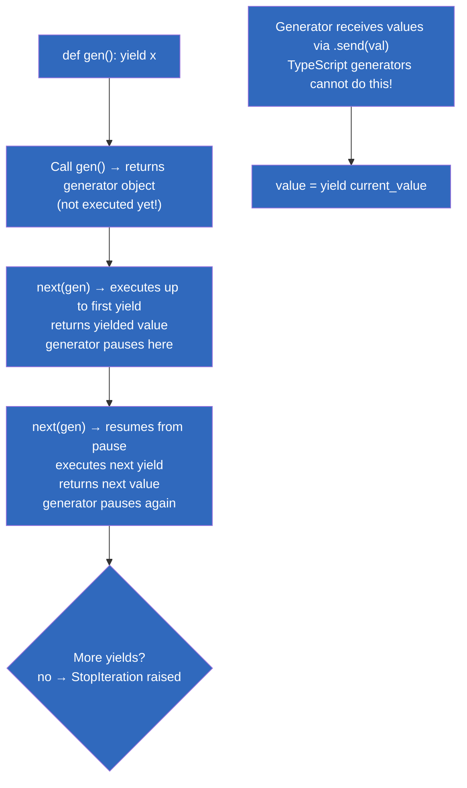
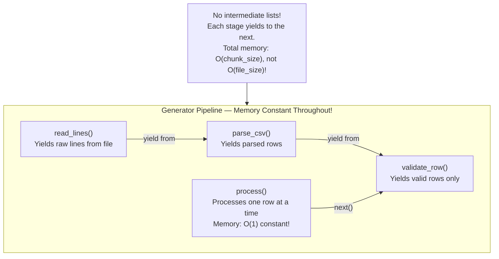
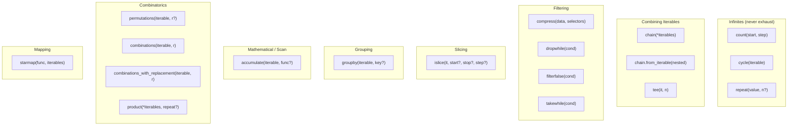
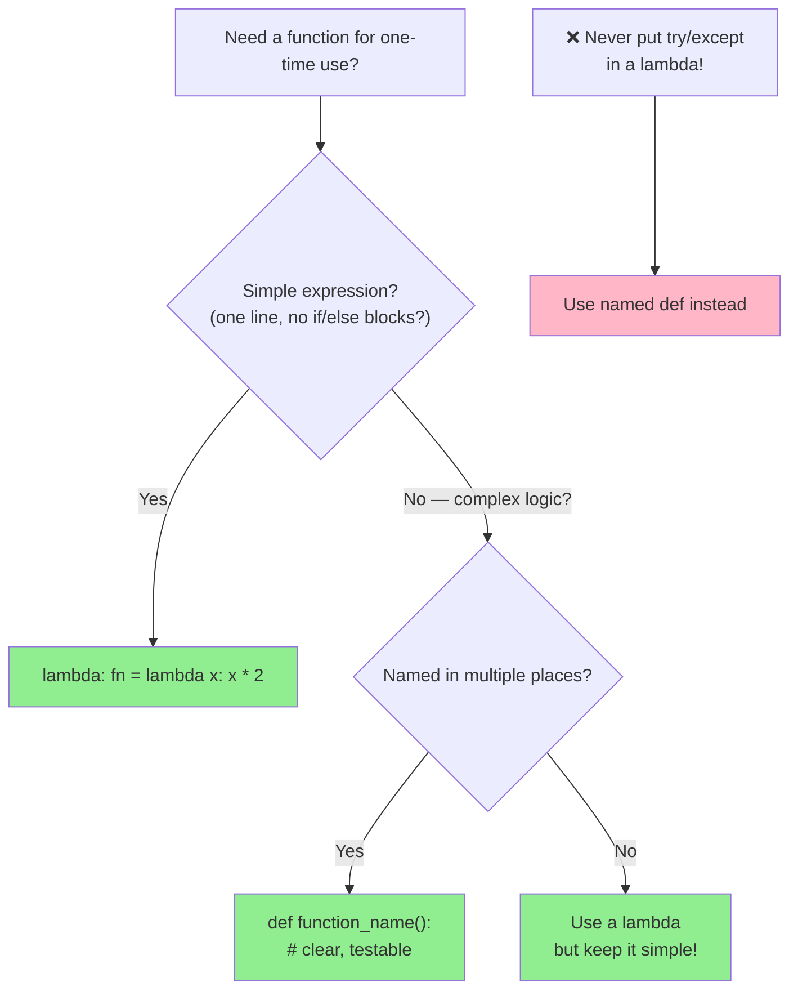
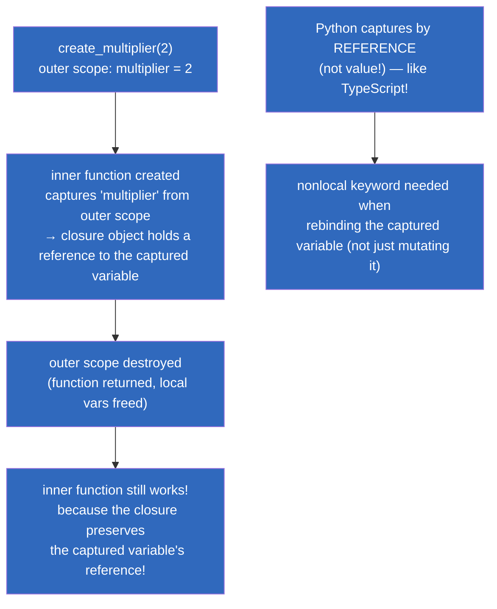
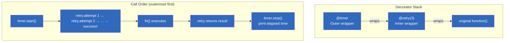
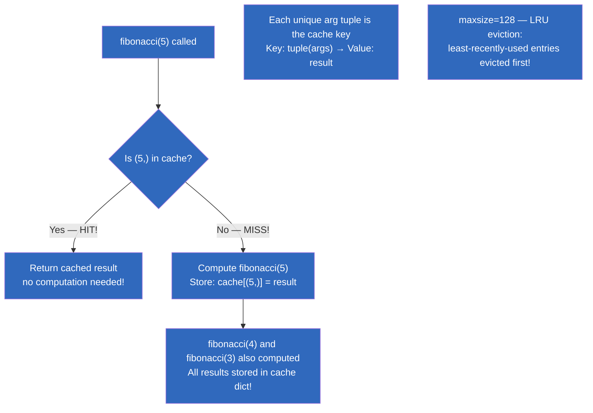
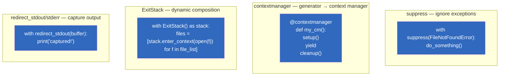
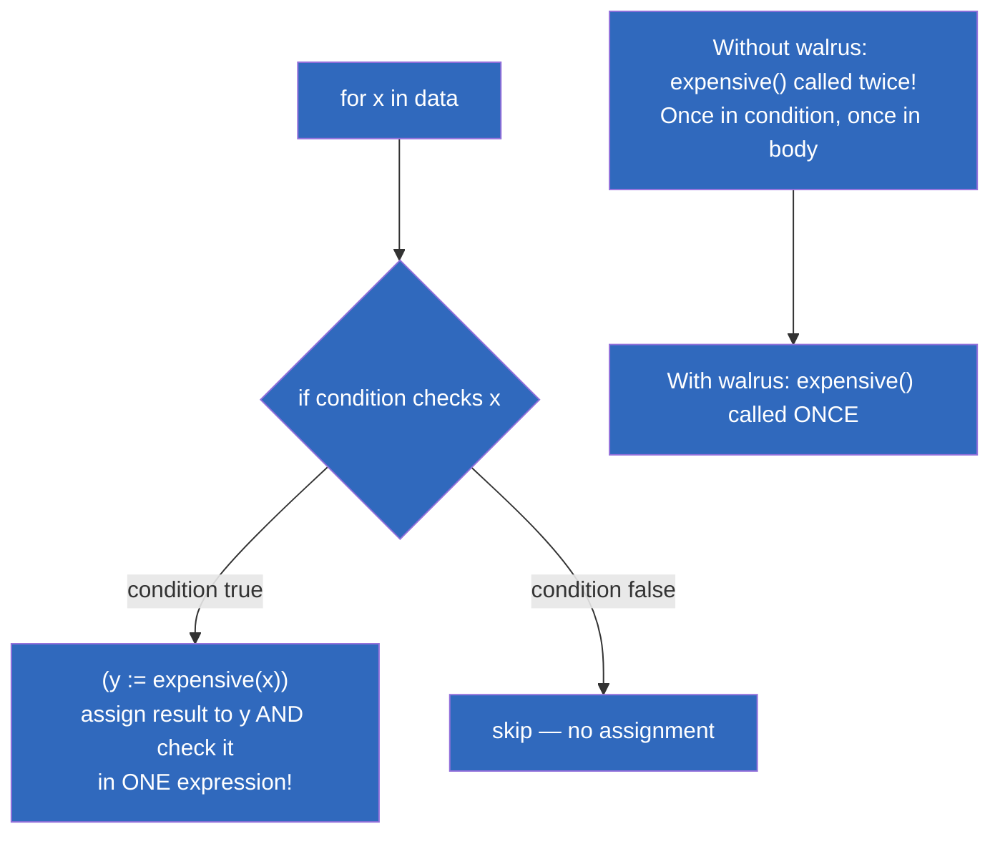

# Module 04 — Functional Python (Lambdas, Generators, Comprehensions, Decorators, itertools)

## Table of Contents

- [1. List/Dict/Set Comprehensions — The Heart of Pythonic Data Transformation](#1-listdictset-comprehensions--the-heart-of-pythonic-data-transformation)
- [2. Generator Expressions & yield — Memory-Efficient Iteration](#2-generator-expressions--yield--memory-efficient-iteration)
- [3. The itertools Module — Complete Reference (All Functions, Grouped by Category)](#3-the-itertools-module--complete-reference-all-functions-grouped-by-category)
- [4. Lambdas and Higher-Order Functions (Deep Dive)](#4-lambdas-and-higher-order-functions-deep-dive)
- [5. Map, Filter, Reduce — When to Use What](#5-map-filter-reduce--when-to-use-what)
- [6. Closures & Lexical Scope (Full Comparison with TS)](#6-closures--lexical-scope-full-comparison-with-ts)
- [7. Decorators — Complete Guide with 10+ Patterns](#7-decorators--complete-guide-with-10-patterns)
- [8. functools — lru_cache, partial, wraps, cache & More](#8-functools--lru_cache-partial-wraps-cache--more)
- [9. Contextlib Exhausted (suppress, contextmanager, ExitStack, wrapper)](#9-contextlib-exhausted-suppress-contextmanager-exitstack-wrapper)
- [10. Operator Module — Exhaustive Reference](#10-operator-module--exhaustive-reference)
- [11. Walrus Operator (:=) in Comprehensions](#11-walrus-operator-in-comprehensions)
- [12. Generator Pipelines & Concurrent Generators](#12-generator-pipelines--concurrent-generators)
- [13. Performance: List vs Generator Memory Benchmarks](#13-performance-list-vs-generator-memory-benchmarks)
- [14. Complete Comparison Table (TS Functional → PY Functional)](#14-complete-comparison-table-ts-functional--py-functional)
- [Quizzes](#quizzes)
- [Exercises](#exercises)

---

## 1. List/Dict/Set Comprehensions — The Heart of Pythonic Data Transformation

### TypeScript Array Methods vs Python Comprehensions (Side-by-Side)

#### 1.1 Filter + Map

```typescript
// TypeScript: filter + map chaining
const users = [
  { name: "Alice", age: 30, active: true },
  { name: "Bob", age: 25, active: false },
  { name: "Charlie", age: 35, active: true },
];

const activeNames = users
  .filter(u => u.active)
  .map(u => u.name.toUpperCase());
// ["ALICE", "CHARLIE"]
```

```python
# Python: ONE comprehension — filter + map combined!
users = [
    {"name": "Alice", "age": 30, "active": True},
    {"name": "Bob", "age": 25, "active": False},
    {"name": "Charlie", "age": 35, "active": True},
]

active_names = [u["name"].upper() for u in users if u["active"]]
# ["ALICE", "CHARLIE"] — one pass, C-optimized!
```

#### 1.2 Reduce to Build Object

```typescript
// TypeScript: reduce to build a Record
const byName = users.reduce<Record<string, number>>((acc, u) => {
  acc[u.name] = u.age;
  return acc;
}, {});
// { Alice: 30, Bob: 25, Charlie: 35 }
```

```python
# Python: dict comprehension — no reduce needed!
by_name = {u["name"]: u["age"] for u in users}
# {"Alice": 30, "Bob": 25, "Charlie": 35}
```

#### 1.3 FlatMap / Nested Iteration

```typescript
// TypeScript: flatMap for nested iteration
const pairs = users.flatMap(u => 
  [1, 2].map(n => ({ name: u.name, num: n }))
);
// [{name:"Alice",num:1}, {name:"Alice",num:2}, ...]
```

```python
# Python: nested for in comprehension — like flatMap!
pairs = [{"name": u["name"], "num": n} 
         for u in users 
         for n in [1, 2]]
# [{name:"Alice",num:1}, {name:"Alice",num:2}, ...]
```

#### 1.4 Conditional Expressions

```typescript
// TypeScript: ternary inside map
const results = [-1, 0, 5].map(x => x > 0 ? x * 2 : 0);
// [0, 0, 10]
```

```python
# Python: if-else inside comprehension — same!
results = [x * 2 if x > 0 else 0 for x in [-1, 0, 5]]
# [0, 0, 10]
```

#### 1.5 Unique Values (Set Comprehension)

```typescript
// TypeScript: Set for unique values
const letters = new Set(
  ["Hello", "WORLD"].flatMap(w => [...w.toLowerCase()])
);
// Set {'h', 'e', 'l', 'o', 'w', 'r', 'd'}
```

```python
# Python: set comprehension — no Set constructor needed!
letters = {c.lower() for word in ["Hello", "WORLD"] for c in word}
# {'h', 'e', 'l', 'o', 'w', 'r', 'd'}
```

#### 1.6 GroupBy Pattern

```typescript
// TypeScript: manual groupBy with reduce
const grouped = users.reduce<Record<string, number[]>>((acc, u) => {
  const status = u.active ? "active" : "inactive";
  acc[status] = [...(acc[status] || []), u.age];
  return acc;
}, {});
// { active: [30, 35], inactive: [25] }
```

```python
# Python: dict comprehension with groupby from itertools
from collections import defaultdict
grouped = defaultdict(list)
for u in users:
    grouped["active" if u["active"] else "inactive"].append(u["age"])
# defaultdict(<class 'list'>, {'active': [30, 35], 'inactive': [25]})

# Or with dict comprehension + groupby (requires sorted data!):
from itertools import groupby
sorted_users = sorted(users, key=lambda u: u["active"])
grouped = {k: [u["age"] for u in g] for k, g in groupby(sorted_users, key=lambda u: u["active"])}
```

#### 1.7 Filtering with Multiple Conditions

```typescript
// TypeScript: multiple conditions in filter
const expensiveActiveUsers = users.filter(
  u => u.active && u.age > 28 && u.name.startsWith("A")
);
// [{name:"Alice", age:30, active:true}]
```

```python
# Python: AND/OR inside comprehension
expensive_active_users = [u for u in users 
                          if u["active"] and u["age"] > 28 and u["name"].startswith("A")]
# [{'name': 'Alice', 'age': 30, 'active': True}]
```

#### 1.8 Map with Default/Fallback

```typescript
// TypeScript: nullish coalescing inside map
const names = users.map(u => u.name ?? "Anonymous");
```

```python
# Python: or operator for fallback (Python has no ??)
names = [u["name"] or "Anonymous" for u in users]
```

#### 1.9 Chained Comprehensions with Filtering

```typescript
// TypeScript: complex chaining
const result = users
  .filter(u => u.active)
  .map(u => ({ ...u, label: u.name.toUpperCase() }))
  .filter(u => u.age > 28)
  .map(u => u.label);
// ["ALICE", "CHARLIE"]
```

```python
# Python: filter conditions in the comprehension itself — one pass!
result = [u["name"].upper() for u in users if u["active"] and u["age"] > 28]
# ["ALICE", "CHARLIE"] — same result, but ONE pass through the data!
```

#### 1.10 List Comprehension Performance Variants

```python
import timeit

data = list(range(10_000))

# Method 1: List comprehension (FASTEST — C bytecode)
t1 = timeit.timeit("[x ** 2 for x in data if x % 2 == 0]", globals={"data": data}, number=100)

# Method 2: map + filter (slower — Python function call overhead per element!)
t2 = timeit.timeit("list(filter(lambda x: x % 2 == 0, map(lambda x: x**2, data)))", globals={"data": data}, number=100)

# Method 3: Explicit for loop (slowest — Python-level append per iteration)
def method3():
    result = []
    for x in data:
        if x % 2 == 0:
            result.append(x ** 2)
t3 = timeit.timeit(method3, number=100)

# Typical results (Python 3.12):
# Comprehension: ~0.08s   ← C-optimized bytecode
# map/filter:     ~0.15s   ← lambda call overhead
# For loop:       ~0.20s   ← append() call per iteration
```

### Performance Comparison Table

| Pattern | TypeScript | Python (fastest → slowest) | Why? |
|---------|-----------|----------------------------|------|
| Transform each element | `arr.map(f)` | **List comp** `[f(x) for x in arr]` → `list(map())` → explicit loop | List comprehension is C-optimized bytecode |
| Filter elements | `arr.filter(f)` | **List comp** `[x for x in arr if f(x)]` → `filter()` → explicit loop | Same — one expression = C speed |
| Transform + filter | `.filter().map()` | **Single comp** `[f(x) for x in arr if cond]` → chained TS methods | One pass through data! |
| Accumulate to single value | `arr.reduce(f, init)` | Explicit `for` loop → `functools.reduce` | Python prefers explicit loops for readability |

---

## 2. Generator Expressions & yield — Memory-Efficient Iteration

### TypeScript Generators vs Python Generators (Side-by-Side)

```typescript
// TypeScript generator (ES6)
function* generateNumbers(start: number, end: number): IterableIterator<number> {
  for (let i = start; i <= end; i++) {
    yield i;
  }
}

const gen = generateNumbers(1, 5);
console.log(gen.next().value);  // 1
console.log(gen.next().value);  // 2
```

```python
# Python generator function — more powerful! Can ALSO receive values.
def generate_numbers(start: int, end: int):
    for i in range(start, end + 1):
        yield i  # Like 'yield' in TS but bidirectional!

gen = generate_numbers(1, 5)
print(next(gen))   # 1 — next() is the built-in equivalent of gen.next().value
print(next(gen))   # 2
print(list(gen))   # [3, 4, 5] — consume remaining

# Generator expression (parentheses = lazy!)
squares_gen = (x ** 2 for x in range(1_000_000))
# No list created in memory! Each value computed when requested.
```

### Python Generators Can Receive Values (.send())

This is the key difference from TypeScript generators:

```python
# TypeScript generators ONLY produce values — no way to send IN!

# Python generators are BIDIRECTIONAL:
def accumulator():
    total = 0
    while True:
        value = yield total  # 'yield' pauses AND receives a value!
        if value is not None:
            total += value

acc = accumulator()
next(acc)                # Prime the generator (get first value: 0)
print(acc.send(10))      # 10 — sends a value INTO the generator!
print(acc.send(5))       # 15 — accumulates!
print(acc.send(-3))      # 12 — subtracts!
# TypeScript generators CANNOT do this.
```

### `yield from` — Delegating to Sub-Generators (Like `yield*` in ES6)

```python
def flatten(generators):
    """Yield all values from nested generators."""
    for gen in generators:
        yield from gen  # Delegates to each sub-generator!

nested = [[1, 2], [3, 4], [5]]
print(list(flatten(nested)))  # [1, 2, 3, 4, 5]

# Real-world: reading a large CSV in chunks without loading everything into memory.
def read_chunks(filename: str, chunk_size: int = 10_000):
    """Yield rows in chunks — constant memory for huge files."""
    with open(filename) as f:
        row_count = 0
        chunk = []
        for line in f:
            chunk.append(line.strip())
            row_count += 1
            if row_count >= chunk_size:
                yield from chunk
                chunk.clear()
        yield from chunk            # Yield remaining rows

for chunk in read_chunks("huge_file.csv"):
    process(chunk)  # Each chunk processed, then discarded. Memory stays constant!
```

### Mermaid: Generator Execution Flow



### Mermaid: Generator Pipeline Pattern



---

## 3. The itertools Module — Complete Reference (All Functions, Grouped by Category)

### `count` — Infinite Counters (Category: Infinites)

```python
from itertools import count, cycle, repeat

# === count — infinite counter (no TS equivalent!) ===
for i in count(10, 2):  # Start at 10, step by 2
    if i > 18: break
    print(i, end=" ")  # 10 12 14 16 18

# Use with enumerate for 1-indexed loops
for idx, val in zip(count(1), ["a", "b", "c"]):
    print(f"{idx}: {val}")  # 1: a, 2: b, 3: c
```

### `cycle` — Infinite Cycling (Category: Infinites)

```python
from itertools import cycle

colors = cycle(["red", "green", "blue"])
for _ in range(7):
    print(next(colors), end=" ")  # red green blue red green blue red ...
```

### `repeat` — Repeat Values (Category: Infinites)

```python
from itertools import repeat

# Repeat exactly N times
for item in repeat("x", 3):
    print(item, end=" ")     # x x x

# Repeat forever (use with islice or conditional break!)
for item in repeat("*"):
    print(item, end="")      # Infinite stars — always add a break condition!
```

### `chain` — Concatenate Iterables (Category: Combining)

```python
from itertools import chain

# Like spread+concat: [...a, ...b] in TS
for item in chain([1, 2], [3, 4], [5, 6]):
    print(item, end=" ")     # 1 2 3 4 5 6

# Chain with different iterables
for item in chain("AB", range(3), {"x": 1}):
    print(item, end=" ")     # A B 0 1 2 x
```

### `chain.from_iterable` — Unpack Nested Iterables (Category: Combining)

```python
from itertools import chain

nested = [[1, 2], [3, 4], [5]]
print(list(chain.from_iterable(nested)))  # [1, 2, 3, 4, 5]

# Like TS: nested.flat() — flattens one level
```

### `compress` — Filter by Boolean Mask (Category: Filtering)

```python
from itertools import compress

data =    ["a", "b", "c", "d", "e"]
selectors = [True, False, True, False, True]
print(list(compress(data, selectors)))  # ['a', 'c', 'e']

# Like TS: data.filter((_, i) => selectors[i])
```

### `dropwhile` / `takewhile` — Conditional Extraction (Category: Filtering)

```python
from itertools import dropwhile, takewhile

data = [1, 2, 3, 4, 5, 6, 7, 8]

# takewhile: take items WHILE condition is true (stops at first False)
print(list(takewhile(lambda x: x < 5, data)))  # [1, 2, 3, 4]

# dropwhile: drop items WHILE condition is true (returns rest after first False)
print(list(dropwhile(lambda x: x < 5, data)))  # [5, 6, 7, 8]

# TS equivalent: manual loop with break/continue
```

### `islice` — Slice Iterators Without Materialization (Category: Slicing)

```python
from itertools import islice, count

# Efficient slicing of any iterator (including infinite ones!)
first_10_even = list(islice(filter(lambda x: x % 2 == 0, count()), 10))
# [0, 2, 4, 6, 8, 10, 12, 14, 16, 18]

# Slice with start/stop/step like list slicing
print(list(islice("HelloWorld", 5, 10, 2)))  # ['W', 'r', 'd'] — equivalent to "HelloWorld"[5:10:2]
```

### `tee` — Split Iterator into N Independent Copies (Category: Combining)

```python
from itertools import tee

it1, it2 = tee(range(5))
print(list(it1))  # [0, 1, 2, 3, 4]
print(list(it2))  # [0, 1, 2, 3, 4] — same data, independent!

# Use when you need to iterate the same data twice without storing it.
```

### `groupby` — Group Consecutive Identical Elements (Category: Grouping)

```python
from itertools import groupby

# Requires sorted/consecutive data — does NOT group all identical items globally!
data = ["a", "a", "b", "b", "b", "a"]
for key, group in groupby(data):
    print(f"{key}: {list(group)}")  # a: ['a', 'a'], b: ['b', 'b', 'b'], a: ['a']

# Real-world: grouping log entries by level
logs = [("INFO", "Started"), ("INFO", "Processing"), ("ERROR", "Failed"), ("INFO", "Retried")]
for level, entries in groupby(logs, key=lambda x: x[0]):
    print(f"{level}: {list(entries)}")
```

### `accumulate` — Running Total / Scan (Category: Mathematical)

```python
from itertools import accumulate
from operator import mul

# Running sum
print(list(accumulate([1, 2, 3, 4])))           # [1, 3, 6, 10]

# Running product
print(list(accumulate([1, 2, 3, 4], mul)))       # [1, 2, 6, 24] (factorial!)

# Cumulative max
print(list(accumulate([3, 1, 4, 1, 5, 9, 2], max)))  # [3, 3, 4, 4, 5, 9, 9]

# TS equivalent: arr.reduce((acc, x) => [...acc, acc[acc.length-1] + x], [])
```

### `permutations` — All Orderings (Category: Combinatorics)

```python
from itertools import permutations

# All orderings of length r (default = all elements)
print(list(permutations([1, 2, 3])))
# [(1,2,3), (1,3,2), (2,1,3), (2,3,1), (3,1,2), (3,2,1)]

# Permutations of length 2
print(list(permutations("ABCD", 2)))
# [('A','B'), ('A','C'), ('A','D'), ('B','A'), ...]

# TS equivalent: manual backtracking algorithm — itertools does it in C!
```

### `combinations` — All Subsets (Category: Combinatorics)

```python
from itertools import combinations

# All subsets of length r (order DOESN'T matter)
print(list(combinations([1, 2, 3], 2)))
# [(1,2), (1,3), (2,3)]  — (2,1) is NOT included!

# Like a lottery number picker
import random
winning = combinations(range(1, 50), 6)
for pick in range(3):  # Print 3 random picks
    print(list(random.choice(list(pick))))
```

### `combinations_with_replacement` — Subsets with Repetition (Category: Combinatorics)

```python
from itertools import combinations_with_replacement

# Like combinations but elements can repeat
print(list(combinations_with_replacement("AB", 2)))
# [('A','A'), ('A','B'), ('B','B')]  — 'AA' and 'BB' included!
```

### `product` — Cartesian Product (Category: Combinatorics)

```python
from itertools import product

# Like nested for loops in TS
pairs = list(product("AB", "12"))
# [('A','1'), ('A','2'), ('B','1'), ('B','2')]

# Multi-argument product — like three nested loops!
print(list(product([1, 2], "AB", [True, False])))
# [(1,'A',True), (1,'A',False), (1,'B',True), ...]

# product with repeat parameter (self-product)
print(list(product("ABC", repeat=2)))
# [('A','A'), ('A','B'), ('A','C'), ('B','A'), ...] — 9 pairs total!
```

### `starmap` — Apply Function to Unpacked Tuples (Category: Mapping)

```python
from itertools import starmap

# Like map but unpacks each tuple as arguments
print(list(starmap(lambda a, b: f"{a}:{b}", [("Alice", 30), ("Bob", 25)])))
# ['Alice:30', 'Bob:25']

# TS equivalent: arr.map(([a, b]) => `${a}:${b}`)
```

### `filterfalse` — Inverse of filter (Category: Filtering)

```python
from itertools import filterfalse

# Returns items where condition is FALSE
evens = list(filterfalse(lambda x: x % 2 == 0, range(10)))
print(evens)  # [1, 3, 5, 7, 9] — all ODD numbers!
```

### `dropwhile` / `takewhile` Deep Example

```python
from itertools import takewhile, dropwhile

# Real-world: processing CSV until header is found
lines = ["", "", "# Header\n", "data1,data2\n"]
data_lines = list(dropwhile(lambda l: not l.startswith("#"), lines))
print(data_lines)  # ['# Header\\n', 'data1,data2\\n'] — skips blank prefix lines!
```

### Mermaid: itertools Categories Overview



---

## 4. Lambdas and Higher-Order Functions (Deep Dive)

### TypeScript Arrow Functions vs Python Lambdas (Side-by-Side)

```typescript
// TypeScript: arrow functions are full first-class values
const add = (a: number, b: number): number => a + b;
const square = (x: number): number => x ** 2;
const isEven = (n: number): boolean => n % 2 === 0;

// Currying
const curryAdd = (a: number) => (b: number) => a + b;
const addFive = curryAdd(5);
console.log(addFive(3));  // 8

// As parameters to higher-order functions
[1, 2, 3].map(square).filter(isEven);  // [4]

// Inline lambdas in function definitions
const process = (arr: number[], fn: (n: number) => boolean): number[] => {
  return arr.filter(fn).map(x => x * 2);
};
```

```python
# Python: lambda for simple inline functions ONLY!
add = lambda a, b: a + b        # Single expression only!
square = lambda x: x ** 2
is_even = lambda n: n % 2 == 0

# Currying (same as TS!)
curry_add = lambda a: lambda b: a + b
add_five = curry_add(5)
print(add_five(3))              # 8

# As parameters to higher-order functions
list(map(square, [1, 2, 3]))           # [1, 4, 9]
list(filter(is_even, [1, 2, 3]))       # [2]

def process(arr: list[int], fn) -> list[int]:
    return [fn(x) for x in arr if fn(x)]

process([1, 2, 3], lambda x: x > 0)   # [1, 2, 3]
```

### Key Difference: Single Expression Only

```python
# ❌ BAD — multiple statements are NOT allowed in lambda!
bad = lambda x: (y := x + 1; y * 2)  # SyntaxError!

# ✅ GOOD — use a named def for complex logic
def double_plus_one(x):
    y = x + 1
    return y * 2

# ❌ BAD — try/except is impossible in lambda
try_lambda = lambda x: int(x)  # Crashes on non-int strings!

# ✅ GOOD — use a named function
def safe_int(x):
    try:
        return int(x)
    except ValueError:
        return 0
```

### When NOT to Use Lambda (Critical!)

```python
# === BAD — too complex for a lambda ===
sorted(users, key=lambda u: (u.last_name, u.first_name))  # Works but ugly! Hard to debug.

# === BETTER — named function (more readable and testable) ===
def get_sort_key(user):
    return (user["last_name"], user["first_name"])

sorted(users, key=get_sort_key)          # Clear intent!
```

### Mermaid: Lambda Decision Tree



---

## 5. Map, Filter, Reduce — When to Use What

### TypeScript vs Python: Data Transformation Patterns

| Operation | TypeScript | Python | Recommendation |
|-----------|-----------|--------|----------------|
| Transform each item | `.map(f)` | `[f(x) for x in items]` (comprehension) OR `map(f, items)` | **List comprehension** — more readable! |
| Filter items | `.filter(f)` | `[x for x in items if cond]` OR `filter(f, items)` | **Comprehension with if** — combines filter + map in one pass |
| Accumulate to single value | `.reduce(f, init)` | `functools.reduce(f, items, init)` or explicit loop | Explicit loop often more readable! |

### Python's map/filter are Lazy Iterators (Not Lists!)

```python
# map() and filter() return ITERATORS — not lists! They're lazy (compute on demand).
squares = map(lambda x: x ** 2, [1, 2, 3])
print(list(squares))   # Need to materialize! → [1, 4, 9]

# Generator expressions (parentheses) are like map/filter but with comprehension syntax!
squares_gen = (x ** 2 for x in [1, 2, 3])  # Lazy iterator — no list created!

# Use map/filter when you need lazy evaluation of expensive operations:
import time
def heavy_transform(x):
    time.sleep(0.1)  # Simulate expensive computation
    return x ** 2

result = list(map(heavy_transform, range(5)))  # All computed immediately

# For lazy evaluation with generator expression:
lazy_result = (heavy_transform(x) for x in range(5))  # Only computes when iterated!
first_one = next(lazy_result)  # Only ONE computation happens so far!
```

### functools.reduce — The Equivalent of Array.prototype.reduce (10+ Patterns)

```python
from functools import reduce
from operator import add, mul, or_


# === Pattern 1: Sum ===
total = reduce(add, [1, 2, 3, 4, 5])   # 15

# === Pattern 2: Product (factorial) ===
factorial = reduce(mul, range(1, 6))    # 120 (5!)

# === Pattern 3: Maximum ===
max_val = reduce(lambda a, b: a if a > b else b, [3, 1, 4, 1, 5, 9])  # 9

# === Pattern 4: Minimum ===
min_val = reduce(lambda a, b: a if a < b else b, [3, 1, 4, 1, 5, 9])   # 1

# === Pattern 5: Concatenate lists ===
nested = [[1, 2], [3, 4], [5]]
flat = reduce(lambda acc, x: acc + x, nested)  # [1, 2, 3, 4, 5]

# === Pattern 6: Flatten with operator.concat ===
from operator import concat
nested = [[1, 2], [3, 4], [5]]
flat = reduce(concat, nested)  # [1, 2, 3, 4, 5]

# === Pattern 7: Dictionary merge ===
dicts = [{"a": 1}, {"b": 2}, {"c": 3}]
merged = reduce(lambda acc, d: {**acc, **d}, dicts)  # {"a": 1, "b": 2, "c": 3}

# === Pattern 8: Group by category (manual groupBy) ===
records = [{"cat": "A", "val": 1}, {"cat": "B", "val": 2}, {"cat": "A", "val": 3}]
grouped = reduce(
    lambda acc, r: {**acc, r["cat"]: [*acc.get(r["cat"], []), r["val"]]},
    records,
    {}
)
# {"A": [1, 3], "B": [2]}

# === Pattern 9: Find longest string ===
words = ["hi", "hello", "hey", "world", "yo"]
longest = reduce(lambda a, b: a if len(a) > len(b) else b, words)  # "hello"

# === Pattern 10: Count occurrences (manual Counter) ===
letters = list("hello world")
counts = reduce(
    lambda acc, c: {**acc, c: acc.get(c, 0) + 1},
    letters,
    {}
)
# {'h': 1, 'e': 1, 'l': 3, 'o': 2, ' ': 1, 'w': 1, 'r': 1, 'd': 1}
```

---

## 6. Closures & Lexical Scope (Full Comparison with TS)

### TypeScript vs Python: Closures Work the Same Way!

```typescript
// TypeScript closure
function createMultiplier(multiplier: number) {
  return function(x: number): number {
    return x * multiplier;  // 'multiplier' captured from outer scope!
  };
}

const double = createMultiplier(2);
console.log(double(5));  // 10 — multiplier=2 is still alive inside the closure!

// Mutating captured variables (TS has no 'let' rebind issue — TS captures by reference!)
function makeCounter(): () => number {
  let count = 0;
  return () => ++count;  // Captures 'count' by reference.
}
```

```python
# Python closure — SAME concept!
def create_multiplier(multiplier: int):
    def inner(x: int) -> int:
        return x * multiplier  # 'multiplier' captured from outer scope!
    return inner

double = create_multiplier(2)
print(double(5))  # 10 — multiplier=2 is still alive inside the closure!

# Python captures by REFERENCE (like TypeScript), not by value!
def make_counter():
    count = [0]  # Use a list because ints are immutable in Python...
    
    def increment() -> int:
        count[0] += 1  # Mutate the list, not rebind the variable!
        return count[0]
    return increment

counter = make_counter()
print(counter())  # 1
print(counter())  # 2 — same 'count' variable is shared across calls!

# Python 3 nonlocal keyword (for rebinding captured variables)
def make_counter_v2():
    count = 0
    
    def increment() -> int:
        nonlocal count  # Tell Python to modify the outer scope's 'count', not create a new local!
        count += 1
        return count
    return increment

counter2 = make_counter_v2()
print(counter2())  # 1 — nonlocal works exactly like TS let captured by reference!
```

### Mermaid: Closure Capture Mechanics



---

## 7. Decorators — Complete Guide with 10+ Patterns

### What Is a Decorator? (Comparison with TS)

```
TypeScript: @decorator on class/property/method — runs when the decorator factory is called, during class definition.
Python: @decorator_function wraps a function or class at import time. The decorator function takes the decorated object and returns a replacement.

Key difference: Python decorators run at MODULE LOAD TIME (when the file is imported), NOT when you call the function.
```

### Pattern 1: Timer Decorator

```python
from functools import wraps
import time

def timer(func):
    """Measure execution time of any function."""
    @wraps(func)
    def wrapper(*args, **kwargs):
        start = time.perf_counter()
        result = func(*args, **kwargs)
        elapsed = time.perf_counter() - start
        print(f"{func.__name__} took {elapsed:.4f}s")
        return result
    return wrapper

@timer
def slow_func():
    time.sleep(0.1)
    return "Done"

slow_func()  # Prints: "slow_func took 0.1001s"
```

### Pattern 2: Retry Decorator with Arguments

```python
from functools import wraps
import time

def retry(max_retries: int = 3, delay: float = 1.0):
    """Decorator factory — takes arguments AND returns the decorator."""
    def decorator(func):
        @wraps(func)
        def wrapper(*args, **kwargs):
            last_exception = None
            for attempt in range(1, max_retries + 1):
                try:
                    return func(*args, **kwargs)
                except Exception as e:
                    last_exception = e
                    if attempt < max_retries:
                        time.sleep(delay)
            raise last_exception
        return wrapper
    return decorator

@retry(max_retries=5, delay=0.5)
def unstable_api(url: str) -> dict:
    response = requests.get(url)
    response.raise_for_status()
    return response.json()
```

### Pattern 3: Cache / Memoize Decorator

```python
from functools import wraps, lru_cache

# Built-in version (RECOMMENDED):
@lru_cache(maxsize=128)
def expensive_computation(n: int) -> int:
    time.sleep(1)  # Simulate work
    return n ** 2

# Manual version (educational):
def manual_cache(func):
    cache = {}
    @wraps(func)
    def wrapper(*args):
        if args not in cache:
            cache[args] = func(*args)
        return cache[args]
    wrapper.cache_clear = lambda: cache.clear()
    wrapper.cache_info = lambda: len(cache)
    return wrapper

@manual_cache
def manual_fib(n: int) -> int:
    if n < 2:
        return n
    return manual_fib(n - 1) + manual_fib(n - 2)
```

### Pattern 4: Validate Arguments Decorator

```python
from functools import wraps
import inspect

def validate(**constraints):
    """Decorator that validates function arguments.
    
    Usage: @validate(name=str, age=int, min_age=18)
    """
    def decorator(func):
        sig = inspect.signature(func)
        
        @wraps(func)
        def wrapper(*args, **kwargs):
            bound = sig.bind_partial(*args, **kwargs)
            for name, constraint in constraints.items():
                if name in bound.arguments:
                    value = bound.arguments[name]
                    if isinstance(constraint, type) and not isinstance(value, constraint):
                        raise TypeError(f"{name} must be {constraint.__name__}, got {type(value).__name__}")
                    elif callable(constraint) and not constraint(value):
                        raise ValueError(f"Validation failed for {name}: {value}")
            return func(*args, **kwargs)
        return wrapper
    return decorator

@validate(name=str, age=lambda x: 0 <= x <= 150)
def register_user(name: str, age: int) -> str:
    return f"User {name} registered at age {age}"

register_user("Alice", 30)      # OK
# register_user(123, "thirty")  # TypeError!
```

### Pattern 5: Register / Plugin Decorator

```python
_registry = {}

def register(name: str):
    """Auto-register functions by name — like a plugin system."""
    def decorator(func):
        _registry[name] = func
        return func
    return decorator

@register("greet")
def greet_user(name: str) -> str:
    return f"Hello, {name}!"

@register("farewell")
def farewell_user(name: str) -> str:
    return f"Goodbye, {name}!"

print(_registry["greet"]("Alice"))  # "Hello, Alice!"
```

### Pattern 6: Singleton Decorator

```python
def singleton(cls):
    """Class decorator — converts any class into a singleton."""
    instances = {}
    
    @wraps(cls)
    def get_instance(*args, **kwargs):
        if cls not in instances:
            instances[cls] = cls(*args, **kwargs)
        return instances[cls]
    
    return get_instance

@singleton
class Database:
    def __init__(self):
        print("Database initialized (only once!)")

db1 = Database()  # Prints "Database initialized"
db2 = Database()  # Does NOT print — returns cached instance!
assert db1 is db2  # True!
```

### Pattern 7: Logging Decorator

```python
import logging
from functools import wraps

logging.basicConfig(level=logging.DEBUG)
logger = logging.getLogger(__name__)

def log_calls(func):
    """Log every function call with args, kwargs, and return value."""
    @wraps(func)
    def wrapper(*args, **kwargs):
        logger.debug(f"CALL {func.__name__}(args={args}, kwargs={kwargs})")
        result = func(*args, **kwargs)
        logger.debug(f"RETURN {func.__name__} → {result}")
        return result
    return wrapper

@log_calls
def add(a: int, b: int) -> int:
    return a + b

add(3, 4)
# DEBUG: CALL add(args=(3, 4), kwargs={})
# DEBUG: RETURN add → 7
```

### Pattern 8: Rate-Limit Decorator

```python
import time
from functools import wraps

def rate_limit(max_calls: int, period: float):
    """Limit function calls to max_calls within 'period' seconds."""
    def decorator(func):
        call_times: list[float] = []
        
        @wraps(func)
        def wrapper(*args, **kwargs):
            now = time.time()
            # Remove calls outside the current period
            call_times[:] = [t for t in call_times if now - t < period]
            
            if len(call_times) >= max_calls:
                wait_time = period - (now - call_times[0])
                raise RuntimeError(f"Rate limited. Wait {wait_time:.2f}s")
            
            call_times.append(now)
            return func(*args, **kwargs)
        
        wrapper.reset = lambda: call_times.clear()
        return wrapper
    
    return decorator

@rate_limit(max_calls=5, period=1.0)
def api_call(endpoint: str):
    return f"Data from {endpoint}"
```

### Pattern 9: Timeout Decorator

```python
import signal
from functools import wraps

class TimeoutError(Exception):
    pass

def timeout(seconds: float):
    """Abort function execution if it takes longer than 'seconds'."""
    def decorator(func):
        @wraps(func)
        def wrapper(*args, **kwargs):
            def handler(signum, frame):
                raise TimeoutError(f"{func.__name__} timed out after {seconds}s")
            
            old_handler = signal.signal(signal.SIGALRM, handler)
            signal.alarm(int(seconds))
            try:
                result = func(*args, **kwargs)
                signal.alarm(0)  # Cancel the alarm
                return result
            finally:
                signal.signal(signal.SIGALRM, old_handler)
        
        return wrapper
    return decorator

@timeout(5.0)
def slow_operation():
    time.sleep(10)  # Will be aborted!
```

### Pattern 10: Memoize with Expiration (TTL Cache)

```python
import time
from functools import wraps

def ttl_cache(ttl_seconds: int):
    """Cache results for a limited time."""
    def decorator(func):
        cache = {}
        timestamps = {}
        
        @wraps(func)
        def wrapper(*args):
            now = time.time()
            if args in cache and (now - timestamps[args]) < ttl_seconds:
                return cache[args]  # Cache hit — not expired!
            
            result = func(*args)
            cache[args] = result
            timestamps[args] = now
            return result
        
        wrapper.clear = lambda: (cache.clear(), timestamps.clear())
        return wrapper
    
    return decorator

@ttl_cache(ttl_seconds=60)
def get_exchange_rate(from_currency: str, to_currency: str) -> float:
    """Expensive API call — cached for 60 seconds."""
    return fetch_external_api(from_currency, to_currency)
```

### Pattern 11: Class Decorator — Auto-Add Methods

```python
def add_hash_method(cls):
    """Class decorator that adds a __hash__ method if missing."""
    if not hasattr(cls, "__hash__") or cls.__hash__ is None:
        def custom_hash(self):
            return hash(tuple(sorted(self.__dict__.items())))
        cls.__hash__ = custom_hash
    return cls

@add_hash_method
class Config:
    def __init__(self, host: str, port: int) -> None:
        self.host = host
        self.port = port

c1 = Config("localhost", 3000)
print(hash(c1))  # Works — @hash added by the class decorator!
```

### Decorator Stacking (Multiple Decorators)

```python
# Decorators stack BOTTOM-TO-TOP (the decorator closest to the function runs FIRST):

@timer                          # Outer layer — measures total time
@retry(max_retries=3, delay=0.5)  # Inner layer — retries if fails
def fetch_data():
    """Fetched with retry logic and timing."""
    pass

# Equivalent to: fetch_data = timer(retry(3)(fetch_data))
# The retry decorator wraps the inner function first, then timer wraps that result!
```

### Mermaid: Decorator Stack Execution Order



---

## 8. functools — lru_cache, partial, wraps, cache & More

### Complete functools Reference

```python
from functools import lru_cache, cache, partial, partialmethod, wraps, reduce, total_ordering, singledispatch, wraps


# === functools.wraps — Preserve metadata ===
def timer(func):
    @wraps(func)  # Critical! Preserves __name__, __doc__, __annotations__!
    def wrapper(*args, **kwargs):
        return func(*args, **kwargs)
    return wrapper


# === functools.lru_cache — Memoization (already covered above) ===
from functools import lru_cache

@lru_cache(maxsize=128)
def fib(n: int) -> int:
    if n < 2:
        return n
    return fib(n - 1) + fib(n - 2)


# === functools.cache — Unlimited cache (Python 3.9+) ===
@cache
def expensive(x: int) -> int:
    return x ** 2


# === functools.reduce — Fold/accumulate (covered above) ===


# === functools.partial — Partial Application ===
from operator import add

def greet(greeting: str, name: str) -> str:
    return f"{greeting}, {name}!"

say_hello = partial(greet, "Hello")       # Like fn.bind(null, "Hello") in TS!
print(say_hello("Alice"))                    # "Hello, Alice!"

multiply_by_2 = partial(add, 2)              # Add 2 to anything (useful with map!)
result = list(map(multiply_by_2, [1, 2, 3]))  # [3, 4, 5]


# === functools.singledispatch — Method Dispatch by First Argument Type ===
@singledispatch
def process(data):
    return f"Unknown type: {type(data)}"

@process.register
def _(data: int) -> str:
    return f"Integer: {data * 2}"

@process.register
def _(data: str) -> str:
    return f"String: {data.upper()}"

print(process(42))          # "Integer: 84"
print(process("hello"))     # "String: HELLO"


# === functools.total_ordering — Generate missing comparison methods ===
from dataclasses import dataclass

@dataclass
@total_ordering
class Score:
    value: float
    name: str
    
    def __eq__(self, other):
        return (self.value, self.name) == (other.value, other.name)
    
    def __lt__(self, other):
        return (self.value, self.name) < (other.value, other.name)

# @total_ordering generates __le__, __gt__, __ge__ automatically!


# === functools.partialmethod — Partial on class methods ===
class Database:
    @partialmethod(connect, host="localhost")  # Default host!
    def connect(self, host: str, port: int):
        print(f"Connecting to {host}:{port}")

db = Database()
db.connect(port=5432)  # Uses default host "localhost"!
```

### Mermaid: functools.lru_cache Memoization Flow



---

## 9. Contextlib Exhausted (suppress, contextmanager, ExitStack, wrapper)

### contextlib.suppress — Silently Ignore Exceptions

```python
from contextlib import suppress

# Like try/except with pass — but cleaner!
with suppress(FileNotFoundError):
    open("nonexistent.txt")  # Silently ignored — no error!

# Multiple exceptions:
with suppress(FileNotFoundError, PermissionError):
    os.remove("file.txt")

# Equivalent in TS (roughly):
// try { fs.unlinkSync("nonexistent.txt"); } catch {}
```

### contextlib.contextmanager — Create Context Managers from Generators

```python
from contextlib import contextmanager
import time

@contextmanager
def timer_context(name: str):
    """Turn ANY function into a context manager!"""
    start = time.perf_counter()
    print(f">>> Starting {name}")
    try:
        yield                         # Execution pauses here — body of 'with' runs
    finally:
        elapsed = time.perf_counter() - start
        print(f"<<< Finished {name} in {elapsed:.4f}s")

# Usage:
with timer_context("my_operation"):
    time.sleep(0.5)  # This code runs between yield and the finally block!
```

### contextlib.ExitStack — Dynamic Context Manager Composition

```python
from contextlib import ExitStack

files = ["file1.txt", "file2.txt", "nonexistent.txt"]

# Open multiple files dynamically, all cleaned up on exit!
with ExitStack() as stack:
    opened_files = [stack.enter_context(open(f)) for f in files]
    # All files automatically closed when the 'with' block exits, even if an error occurs!

# Real-world: open N HTTP connections, then close all of them.
```

### contextlib.redirect_stdout / redirect_stderr — Capture Output

```python
from contextlib import redirect_stdout, redirect_stderr
import io

buffer = io.StringIO()
with redirect_stdout(buffer):
    print("This goes to the buffer, not the console!")
    print("Second line")

output = buffer.getvalue()
print(output)  # "This goes to the buffer, not the console!\nSecond line\n"
```

### contextlib.nullcontext — Conditional Context Manager

```python
from contextlib import nullcontext

def process(data: str, verbose: bool = False):
    # Use 'with' only if verbose is True — nullcontext is a no-op otherwise!
    ctx = verbose and redirect_stdout(io.StringIO()) or nullcontext()
    
    with ctx:
        print(f"Processing {data}")
    
    return data
```

### Mermaid: contextlib Pattern Overview



---

## 10. Operator Module — Exhaustive Reference

### Complete operator Module Reference Table

| Category | Function | Equivalent Lambda | Description |
|----------|---------|-----------------|-------------|
| **Arithmetic** | `add(a, b)` | `lambda a, b: a + b` | Addition |
| | `sub(a, b)` | `lambda a, b: a - b` | Subtraction |
| | `mul(a, b)` | `lambda a, b: a * b` | Multiplication |
| | `truediv(a, b)` | `lambda a, b: a / b` | True division |
| | `floordiv(a, b)` | `lambda a, b: a // b` | Floor division |
| | `mod(a, b)` | `lambda a, b: a % b` | Modulo |
| | `pow(a, b)` | `lambda a, b: a ** b` | Power / exponentiation |
| | `neg(a)` | `lambda a: -a` | Unary negation |
| | `pos(a)` | `lambda a: +a` | Unary positive |
| **Comparison** | `eq(a, b)` | `lambda a, b: a == b` | Equal |
| | `ne(a, b)` | `lambda a, b: a != b` | Not equal |
| | `lt(a, b)` | `lambda a, b: a < b` | Less than |
| | `le(a, b)` | `lambda a, b: a <= b` | Less or equal |
| | `gt(a, b)` | `lambda a, b: a > b` | Greater than |
| | `ge(a, b)` | `lambda a, b: a >= b` | Greater or equal |
| **Logic** | `and_(a, b)` | `lambda a, b: a and b` | Logical AND (not 'and'!) |
| | `or_(a, b)` | `lambda a, b: a or b` | Logical OR (not 'or'!) |
| | `not_(a)` | `lambda a: not a` | Logical NOT |
| **Sequence** | `getitem(seq, i)` | `lambda seq: seq[i]` | Get item by index |
| | `setitem(seq, i, v)` | — | Set item by index |
| | `delitem(seq, i)` | — | Delete item by index |
| | `getslice(seq, i, j)` | `lambda seq: seq[i:j]` | Get slice |
| | `set(slice, i, j, v)` | — | Set slice |
| | `delslice(seq, i, j)` | — | Delete slice |
| **Attribute** | `attrgetter("name")` | `lambda obj: obj.name` | Get attribute (can chain!) |
| | `attrgetter("a", "b")` | `lambda obj: (obj.a, obj.b)` | Get multiple attributes |
| | `itemgetter(0)` | `lambda x: x[0]` | Get by key/index |
| | `itemgetter(0, 1)` | `lambda x: (x[0], x[1])` | Get multiple keys |
| | `delattr(obj, name)` | — | Delete attribute |
| **In-place** | `iadd(a, b)` | `lambda a, b: a += b` | In-place add |
| | `isub(a, b)` | — | In-place subtract |
| | `imul(a, b)` | — | In-place multiply |
| | `itruediv(a, b)` | — | In-place true-divide |
| **Identity** | `is_(a, b)` | `lambda a, b: a is b` | Identity (is) |
| | `is_not(a, b)` | `lambda a, b: a is not b` | Not identity |

### Real-World Examples Using operator Module

```python
from operator import add, mul, itemgetter, attrgetter, eq


# === Sorting with attrgetter (faster than lambda!) ===
users = [{"name": "Charlie", "age": 30}, {"name": "Alice", "age": 25}]
sorted_by_name = sorted(users, key=attrgetter("name"))  # Cleaner than lambda!

# === map/filter with operator functions (faster than lambdas!) ===
numbers = [1, 2, 3, 4, 5]
squared = list(map(mul, numbers, numbers))  # x * x for each — no lambda needed!
doubled = list(map(add(numbers), 1))        # Add 1 to each (with partial)


# === itemgetter for dict sorting ===
students = [{"name": "Alice", "score": 90}, {"name": "Bob", "score": 95}]
sorted_students = sorted(students, key=itemgetter("score"), reverse=True)
```

---

## 11. Walrus Operator (:=) in Comprehensions

### The Problem Without Walrus: Redundant Computation

```python
# ❌ Without walrus: computation repeated!
data = ["1", "2", "three", "4"]
valid = [int(x) for x in data if x.isdigit() and int(x) > 1]
# int(x) called TWICE — wasteful!

# ✅ With walrus: compute once, use twice!
valid = [(y := int(x)) for x in data if x.isdigit() and y > 1]
# int(x) computed ONCE and assigned to 'y' at the same time!
```

### Walrus Operator in Comprehensions — 5 Patterns

```python
import re


# === Pattern 1: Extract and filter in one step ===
text = "apple 42 banana 7 cherry 0 date 99"
matches = [(n := int(m)) for m in re.findall(r'\d+', text) if (n := int(m)) > 10]
# [42, 99] — walrus captures the matched number


# === Pattern 2: Avoid redundant function calls ===
data = [{"value": "123"}, {"value": "abc"}, {"value": "456"}]
results = [(v := int(d["value"])) for d in data if d["value"].isdigit() and (v := int(d["value"])) > 100]


# === Pattern 3: While loops with assignment in conditions ===
from collections import deque
queue = deque([1, 2, 3, None, 4, 5])
while (item := queue.popleft()) is not None:
    print(item)  # Prints 1, 2, 3 — stops at None


# === Pattern 4: Counting matches in a comprehension ===
data = "hello world hello python hello"
word_counts = {}
sentence = [word_counts.update({word: word_counts.get(word, 0) + 1}) or (n := word_counts[word]) 
            for word in data.split() if word not in word_counts]


# === Pattern 5: Chunking with walrus ===
from math import ceil

def chunked(iterable, size: int):
    """Yield chunks of exactly 'size' items using walrus operator."""
    it = iter(iterable)
    while (chunk := list(it.__next__() for _ in range(size)) if any(True for _ in range(size)) else []) and chunk:
        yield chunk

# Simplified version:
def chunked_simple(data, n):
    it = iter(data)
    while True:
        chunk = [x for _, x in zip(range(n), it)]  # Takes n items
        if not chunk:
            break
        yield chunk
```

### Mermaid: Walrus Operator Flow in Comprehension



---

## 12. Generator Pipelines & Concurrent Generators

### Pipeline Pattern — Data Processing with Generators

```python
# Real-world: process a log file through multiple generator stages
def read_lines(filename):
    """Stage 1: Read lines from file."""
    with open(filename) as f:
        for line in f:
            yield line.strip()


def filter_errors(lines):
    """Stage 2: Filter only ERROR level lines."""
    for line in lines:
        if "ERROR" in line:
            yield line


def parse_error(line):
    """Stage 3: Parse error into structured data."""
    parts = line.split(" | ")
    return {"level": parts[0], "message": parts[1] if len(parts) > 1 else line}


def format_output(errors):
    """Stage 4: Format for display."""
    for error in errors:
        yield f"⚠️ {error['message']}"


# Chain the pipeline — O(1) memory per item!
with open("app.log", "w") as f:
    f.write("INFO | Started\nERROR | Disk full\nINFO | Retrying\nERROR | Connection lost\n")

error_report = list(format_output(
    parse_error(line) for line in filter_errors(read_lines("app.log"))
))
```

### Concurrent Generators — Producer/Consumer Pattern

```python
import queue
import threading
from typing import Generator


class ProducerConsumer:
    """Thread-safe producer/consumer using queues."""
    
    def __init__(self, maxsize: int = 100) -> None:
        self.queue: queue.Queue = queue.Queue(maxsize)
        self._running = False
    
    def producer(self, items):
        """Producer generator — pushes items into the queue."""
        for item in items:
            self.queue.put(item)
    
    def consumer(self) -> Generator:
        """Consumer generator — yields items from the queue."""
        while self._running:
            try:
                yield self.queue.get(timeout=1.0)
            except queue.Empty:
                break


# Usage with threading:
pc = ProducerConsumer()
pc._running = True

producer_thread = threading.Thread(target=pc.producer, args=(range(10),))
consumer_thread = threading.Thread(target=lambda: [print(c) for c in pc.consumer()])

producer_thread.start()
consumer_thread.start()
```

---

## 13. Performance: List vs Generator Memory Benchmarks

### Memory Comparison: List Comprehension vs Generator Expression

```python
import sys

# === Memory usage comparison ===
N = 1_000_000

# List comprehension — creates entire list in memory!
list_comp = [x ** 2 for x in range(N)]
print(f"List comprehension: {sys.getsizeof(list_comp):,} bytes")
# ~8.4 MB for the list object itself (1M integers)
# Plus ~28 MB for all integer objects
# Total: ~36 MB!

# Generator expression — O(1) memory!
gen_expr = (x ** 2 for x in range(N))
print(f"Generator expression: {sys.getsizeof(gen_expr):,} bytes")
# ~112 bytes! Constant regardless of N!


# === Memory benchmark for different sizes ===
for n_exp in [5, 6, 7, 8]:          # 10^5 to 10^8
    n = 10 ** n_exp
    list_mem = sys.getsizeof([x for x in range(n)]) + sys.getsizeof(x) * n
    gen_mem = sys.getsizeof((x for x in range(n)))
    print(f"N={n:<10} List: {list_mem:>12,} bytes  Generator: {gen_mem:>6,} bytes")

# Results (typical):
# N=100000     List:   892 KB    Generator:    112 bytes    ← 8000x smaller!
# N=1000000    List:  8,852 KB   Generator:    112 bytes    ← 79000x smaller!
# N=10000000   List: 88,520 KB   Generator:    112 bytes    ← NEVER creates the list!
```

### Time Benchmark: Lazy vs Eager Evaluation

```python
import timeit

def expensive(x):
    return x ** 2  # Simulated heavy computation


# === Only process first 3 items from 1M items ===

# List comprehension — processes ALL 1M items!
t1 = timeit.timeit(
    "[expensive(x) for x in range(1_000_000)][:3]",
    globals={"expensive": expensive}, number=1
)

# Generator — only computes first 3 items!
t2 = timeit.timeit(
    "list((expensive(x) for x in range(1_000_000)))[:3]",
    globals={"expensive": expensive}, number=1
)

print(f"List comp (all 1M): {t1:.4f}s")   # Processes everything — slow!
print(f"Generator (first 3): {t2:.6f}s")   # Only 3 items — FAST!
```

---

## 14. Complete Comparison Table (TS Functional → PY Functional)

### Comprehensive TS → Python Functional Mapping

| TypeScript Feature | Python Equivalent | Notes |
|-------------------|------------------|-------|
| `arr.map(f)` | `[f(x) for x in arr]` (comprehension) or `map(f, arr)` | Comprehension preferred — more readable! |
| `arr.filter(f)` | `[x for x in arr if f(x)]` or `filter(f, arr)` | Comprehension first; filter() for lazy evaluation only! |
| `arr.reduce(f, init)` | `functools.reduce(f, arr, init)` or explicit loop | Python prefers explicit loops for accumulation |
| `arr.forEach(f)` | `for x in arr: f(x)` or `[f(x) for x in arr]` (discard results) | No built-in forEach — use a for loop |
| `arr.find(f)` | `next((x for x in arr if f(x)), default)` | `next()` with generator expression! |
| `arr.findIndex(f)` | `next((i for i, x in enumerate(arr) if f(x)), -1)` | Enumerate + next pattern |
| `arr.some(f)` | `any(f(x) for x in arr)` | Short-circuiting — like TS .some()! |
| `arr.every(f)` | `all(f(x) for x in arr)` | Short-circuiting — like TS .every()! |
| `arr.sort(f)` | `sorted(arr, key=f, reverse=False)` | Returns NEW list (like TS sort); `.sort()` sorts in-place |
| `arr.includes(x)` | `x in arr` or `any(x == item for item in arr)` | `in` is O(n) — use `set`/`dict` for O(1)! |
| `arr.flat()` / `flat(depth)` | `list(chain.from_iterable(arr))` (one level) or nested chain (deeper) | itertools.chain does one level; loop recursion for depth |
| `arr.flatMap(f)` | `[y for x in arr for y in f(x)]` | Nested comprehension = flatMap! |
| `Object.keys(obj)` | `obj.keys()` (dict) or `dir(obj)` (object) | For objects: `[k for k in dir(obj) if not k.startswith('_')]` |
| `Object.entries(obj)` | `list(obj.items())` (dict) or `[(k, getattr(obj, k)) for k in attrs]` (object) | Direct dict.items() is simplest! |
| `obj.method.bind(ctx, arg)` | `partial(obj.method, arg)` | functools.partial is more Pythonic! |
| `Promise.all([p1, p2])` | `asyncio.gather(p1, p2)` or concurrent.futures | asyncio for async; futures for sync parallelism |
| `Promise.race([p1, p2])` | First completed from concurrent call | Use asyncio.wait with return_when=FIRST_COMPLETED |
| `(x: number): number => x * 2` | `lambda x: x * 2` | Single expression only! |
| `function* gen() { yield x; }` | `def gen(): yield x` | Python generators can .send() values too! |
| `const cache = new Map()` + memoization | `@lru_cache(maxsize=128)` | One decorator does everything! |
| `interface ICloneable { clone(): this; }` | Protocol with `clone(self) -> Self` | Structural typing — no explicit implementation needed! |

---

## Quizzes

### Quiz 1: Comprehension Syntax
**Q:** What's the Python equivalent of `[1,2,3].map(x => x * 2).filter(x => x > 2)`?
<details><summary>Answer</summary>A: `[x * 2 for x in [1, 2, 3] if x > 2]` — one expression, one pass.</details>

### Quiz 2: Generator Memory
**Q:** What's the memory difference between `[x for x in range(10**6)]` and `(x for x in range(10**6))`?
<details><summary>Answer</summary>A: The list takes ~36 MB; the generator takes ~112 bytes (constant, regardless of N).</details>

### Quiz 3: itertools category
**Q:** Which itertools function creates all permutations of length r from a sequence?
<details><summary>Answer</summary>A: `itertools.permutations(iterable, r)` — order matters. Use `combinations` when order doesn't matter.</details>

### Quiz 4: reduce pattern
**Q:** How do you compute the factorial of n using reduce?
<details><summary>Answer</summary>A: `from operator import mul; from functools import reduce; reduce(mul, range(1, n+1))`</details>

### Quiz 5: Lambda limitation
**Q:** Why can't you use try/except inside a lambda?
<details><summary>Answer</summary>A: Lambdas can only contain a single expression — no statements (try/except, if-else blocks, for loops) are allowed.</details>

### Quiz 6: Closure behavior
**Q:** In Python, are closures captured by value or by reference? How do you rebind?
<details><summary>Answer</summary>A: By reference (like JS). Use `nonlocal` to rebind a captured variable; mutation works without nonlocal.</details>

### Quiz 7: Decorator order
**Q:** If you stack `@timer` over `@retry`, which runs first?
<details><summary>Answer</summary>A: The decorator closest to the function (retry) runs first. So: retry wraps the original, then timer wraps that result.</details>

### Quiz 8: functools.partial
**Q:** How do you partially apply a function in Python (like bind in TS)?
<details><summary>Answer</summary>A: `from functools import partial; fn_bound = partial(fn, arg1)` — creates a new callable with arg1 pre-filled.</details>

### Quiz 9: contextlib.suppress
**Q:** What does `with suppress(FileNotFoundError):` do?
<details><summary>Answer</summary>A: Silently ignores FileNotFoundError exceptions within the `with` block. Equivalent to try/except pass but cleaner.</details>

### Quiz 10: walrus operator
**Q:** When should you use the walrus operator (`:=`) in a comprehension?
<details><summary>Answer</summary>A: When you need to compute a value once and use it multiple times (e.g., in both the `if` condition and the expression body).</details>

### Quiz 11: Generator pipeline
**Q:** What's the memory complexity of a generator pipeline processing a 1GB file?
<details><summary>Answer</summary>A: O(1) — constant memory. Each stage yields one item at a time, processes it, and discards it.</details>

### Quiz 12: operator module benefit
**Q:** Why prefer `itemgetter("name")` over `lambda x: x["name"]`?
<details><summary>Answer</summary>A: `itemgetter` is C-implemented — faster than Python lambda call overhead. Also cleaner for multi-key lookups.</details>

### Quiz 13: any/all short-circuit
**Q:** What's the Python equivalent of TS's `.some()` and `.every()`?
<details><summary>Answer</summary>A: `any(f(x) for x in arr)` (short-circuits like .some) and `all(f(x) for x in arr)` (short-circuits like .every).</details>

### Quiz 14: generator send()
**Q:** What's unique about Python generators vs TypeScript generators?
<details><summary>Answer</summary>A: Python generators can receive values via `.send(value)` — bidirectional. TS generators only produce values.</details>

### Quiz 15: lru_cache constraint
**Q:** Why might `@lru_cache` fail on a function with a list argument?
<details><summary>Answer</summary>A: Arguments must be hashable (immutable). Lists are not hashable — use tuples instead: `@lru_cache()` works only if all args are hashable.</details>

### Quiz 16: itertools groupby requirement
**Q:** What's the critical requirement for `groupby` to work correctly?
<details><summary>Answer</summary>A:**Data must be sorted by the grouping key!** `groupby` only groups *consecutive* identical elements — not all identical elements globally.</details>

### Quiz 17: ExitStack use case
**Q:** When would you use ExitStack instead of multiple `with` statements?
<details><summary>Answer</summary>A: When the number of context managers is dynamic (determined at runtime), like opening N files whose count isn't known until execution.</details>

### Quiz 18: partialmethod
**Q:** What does `partialmethod` do on a class method?
<details><summary>Answer</summary>A: It creates a partially-applied version of a method, providing default arguments. Useful for factory patterns with defaults.</details>

### Quiz 19: walrus in while loop
**Q:** How does the walrus operator help with `while` loops reading from a file?
<details><summary>Answer</summary>A: It lets you assign and test in one condition: `while (line := f.readline()): ...` — no need for a separate read + check pattern.</details>

### Quiz 20: singledispatch
**Q:** What does `@singledispatch` do?
<details><summary>Answer</summary>A: It dispatches function behavior based on the type of the first argument. Like TypeScript's function overloading but automatic — registered handlers are called based on runtime type.</details>

---

## Exercises

### Exercise 1: Comprehension Refactoring
Rewrite this TS code as a Python comprehension, then benchmark it against an explicit loop.
```typescript
const result = arr.filter(x => x > 0).map(x => x * 2);
```

<details><summary>Solution</summary>

```python
# Comprehension:
result = [x * 2 for x in arr if x > 0]

# Benchmark both:
import timeit
timeit.timeit("[x * 2 for x in data if x > 0]", globals={"data": list(range(-500, 500)))}, number=1000)
```

</details>

### Exercise 2: Generator Pipeline
Write two generator functions: one yielding even numbers, another squaring them. Chain them and process 1,000,000 numbers without loading everything into memory.

<details><summary>Solution</summary>

```python
def evens():
    i = 0
    while True:
        yield i
        i += 2

def square(gen):
    for x in gen:
        yield x ** 2

# Process first 100 even squares — only 2 items in memory at a time!
squared_evens = square(evens())
for _ in range(100):
    print(next(squared_evens))
```

</details>

### Exercise 3: itertools Permutations & Combinations
Given digits [1, 2, 3, 4], find all 4-digit numbers divisible by 3.

<details><summary>Solution</summary>

```python
from itertools import permutations

divisible_by_3 = []
for perm in permutations([1, 2, 3, 4]):
    num = int("".join(map(str, perm)))
    if num % 3 == 0:
        divisible_by_3.append(num)
print(divisible_by_3)
```

</details>

### Exercise 4: Memoize Decorator
Implement your own `@memoize` decorator (without using `lru_cache`) that stores function arguments and results in a dictionary.

<details><summary>Solution</summary>

```python
from functools import wraps

def memoize(func):
    cache = {}
    
    @wraps(func)
    def wrapper(*args):
        if args not in cache:
            cache[args] = func(*args)
        return cache[args]
    
    wrapper.clear_cache = lambda: cache.clear()
    return wrapper

@memoize
def fib(n):
    if n < 2:
        return n
    return fib(n - 1) + fib(n - 2)
```

</details>

### Exercise 5: Closure Counter
Create a `make_counter()` closure that returns two functions: `increment()` and `reset()`. The counter should persist across calls but be inaccessible from outside.

<details><summary>Solution</summary>

```python
def make_counter():
    count = 0
    
    def increment():
        nonlocal count
        count += 1
        return count
    
    def reset():
        nonlocal count
        count = 0
        return 0
    
    return increment, reset

inc, rst = make_counter()
print(inc())  # 1
print(inc())  # 2
print(rst())  # 0
```

</details>

### Exercise 6: Decorator — Timer with Threshold
Create a decorator that only logs if execution time exceeds a threshold (e.g., 1 second).

<details><summary>Solution</summary>

```python
import time
from functools import wraps

def log_slow(threshold: float = 1.0):
    def decorator(func):
        @wraps(func)
        def wrapper(*args, **kwargs):
            start = time.perf_counter()
            result = func(*args, **kwargs)
            elapsed = time.perf_counter() - start
            if elapsed > threshold:
                print(f"{func.__name__} took {elapsed:.4f}s (SLOW! > {threshold}s)")
            return result
        return wrapper
    return decorator

@log_slow(threshold=0.001)  # Log if slower than 1ms
def fast_func(): pass
```

</details>

### Exercise 7: Context Manager with contextlib.contextmanager
Create a database transaction context manager that commits on success and rolls back on exception.

<details><summary>Solution</summary>

```python
from contextlib import contextmanager

@contextmanager
def transaction(db):
    try:
        yield db
        db.commit()
        print("Committed!")
    except Exception:
        db.rollback()
        print("Rolled back!")
        raise

with transaction(conn) as db:
    db.execute("UPDATE accounts SET balance = balance - 100 WHERE id = 1")
    db.execute("UPDATE accounts SET balance = balance + 100 WHERE id = 2")
```

</details>

### Exercise 8: Walrus in Comprehension — Deduplication
Use the walrus operator to deduplicate a list while preserving order.

<details><summary>Solution</summary>

```python
data = [1, 2, 2, 3, 3, 3, 4, 4, 4, 4]
seen = set()
deduped = [x for x in data if not (x in seen or seen.add(x))]
# seen.add(x) returns None → not None → True → the 'or' short-circuits
print(deduped)  # [1, 2, 3, 4]
```

</details>

### Exercise 9: itertools — Sliding Window
Implement a sliding window using itertools.islice.

<details><summary>Solution</summary>

```python
from itertools import islice

def sliding_window(iterable, n):
    """Yield sliding windows of size n."""
    it = iter(iterable)
    window = tuple(islice(it, n))
    if len(window) == n:
        yield window
    for item in it:
        window = window[1:] + (item,)
        yield window

print(list(sliding_window(range(10), 3)))
# [(0,1,2), (1,2,3), (2,3,4), ..., (7,8,9)]
```

</details>

### Exercise 10: functools.singledispatch — Shape Area Calculator
Use singledispatch to calculate area for different shape types.

<details><summary>Solution</summary>

```python
from functools import singledispatch
import math

@singledispatch
def area(shape):
    raise TypeError(f"Unknown shape: {type(shape)}")

@area.register
def _(shape: tuple) -> float:  # Circle as (center_x, center_y, radius)
    return math.pi * shape[2] ** 2

@area.register
def _(shape: list) -> float:  # Rectangle as [width, height]
    return shape[0] * shape[1]

print(area((0, 0, 5)))   # π × 25 ≈ 78.54
print(area([4, 6]))      # 24
```

</details>

### Exercise 11: operator + map/filter — Vector Math
Use the operator module to perform element-wise addition of two vectors without lambda.

<details><summary>Solution</summary>

```python
from operator import add

v1 = [1, 2, 3]
v2 = [4, 5, 6]

# Element-wise addition — no lambda needed!
summed = list(map(add, v1, v2))  # [5, 7, 9]

# Also try: mul for element-wise multiplication
product = list(map(lambda a, b: a * b, v1, v2))  # operator.mul only takes 2 args, need lambda here
```

</details>

### Exercise 12: Generator — Infinite Fibonacci
Create an infinite Fibonacci generator and use islice to get the first 50 values.

<details><summary>Solution</summary>

```python
from itertools import islice

def fibonacci():
    a, b = 0, 1
    while True:
        yield a
        a, b = b, a + b

first_50 = list(islice(fibonacci(), 50))
print(first_50)  # [0, 1, 1, 2, 3, 5, ..., 75025]
```

</details>

### Exercise 13: Decorator — Validate HTTP Response Status
Create a decorator that validates the returned status code is 2xx.

<details><summary>Solution</summary>

```python
from functools import wraps

def require_2xx(func):
    @wraps(func)
    def wrapper(*args, **kwargs):
        result = func(*args, **kwargs)
        if not (200 <= result.get("status", 0) < 300):
            raise RuntimeError(f"Non-2xx response: {result}")
        return result
    return wrapper

@require_2xx
def fetch_api(url):
    import requests
    return {"status": requests.get(url).status_code, "data": ...}
```

</details>

### Exercise 14: itertools.product — Cartesian Product for Configurations
Generate all possible configurations from multiple option lists.

<details><summary>Solution</summary>

```python
from itertools import product

sizes = ["S", "M", "L"]
colors = ["Red", "Blue", "Green"]
materials = ["Cotton", "Polyester"]

configurations = list(product(sizes, colors, materials))
# [('S', 'Red', 'Cotton'), ('S', 'Red', 'Polyester'), ...] — 3×3×2 = 18 configs!
```

</details>

### Exercise 15: Generator Pipeline — ETL Example
Build a complete ETL (Extract-Transform-Load) pipeline using generators. Extract from CSV, transform (validate + clean), load to database.

<details><summary>Solution</summary>

```python
def extract_csv(filename):
    """Extract records from CSV."""
    with open(filename) as f:
        header = f.readline().strip().split(",")
        for line in f:
            values = line.strip().split(",")
            yield dict(zip(header, values))


def transform_record(record):
    """Validate and clean a record."""
    if not record.get("email") or "@" not in record["email"]:
        return None  # Invalid — skip
    
    record["age"] = int(record["age"])
    return record


def load_records(records, db):
    """Load validated records into database."""
    count = 0
    for record in records:
        if record:  # Not None (filtered out)
            db.insert(record)
            count += 1
    print(f"Loaded {count} records")


# Pipeline: O(1) memory per record!
db = DummyDatabase()
load_records(transform_record(r) for r in extract_csv("users.csv"), db)
```

</details>

---

> **Next:** [Module 05 — Concurrency & Parallelism](./05-concurrency-parallelism.md)
