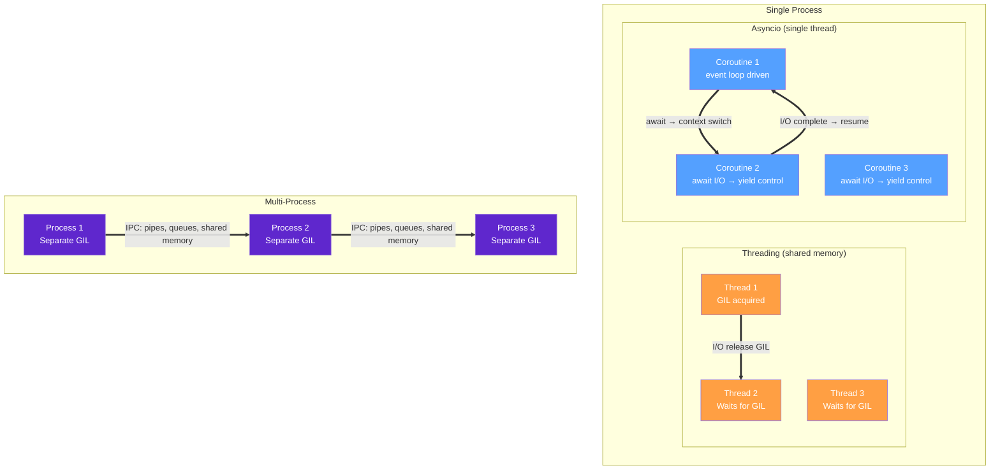
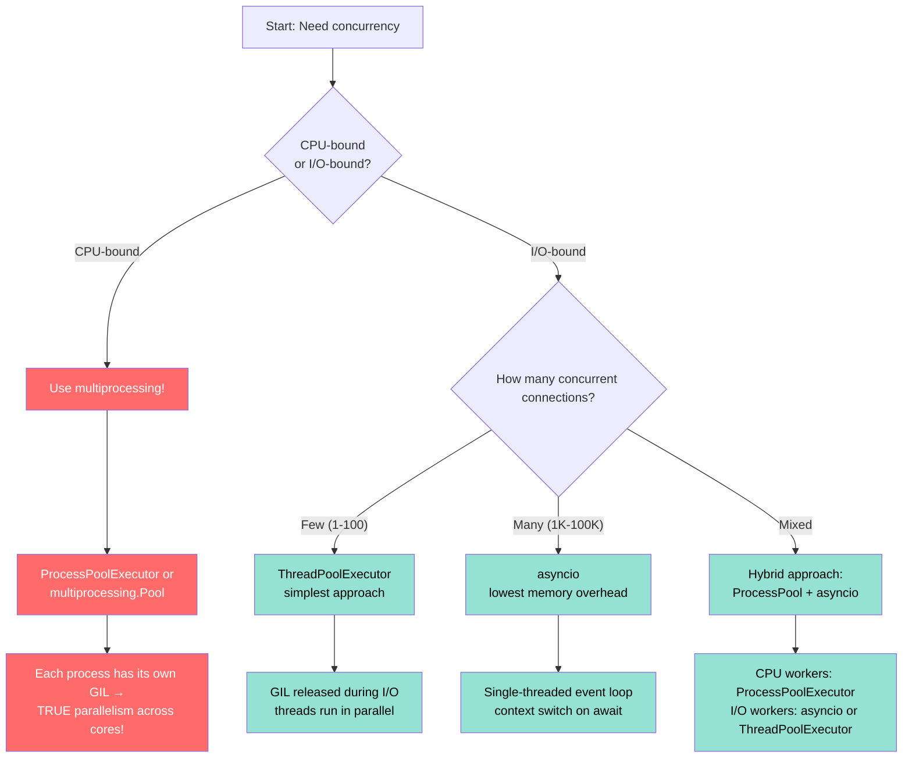
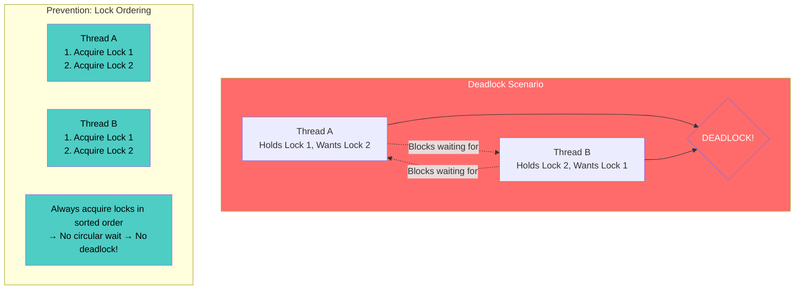

# Module 05 — Concurrency & Parallelism (The Complete Guide for TypeScript Developers)

## Table of Contents

- [1. The GIL — Deep Dive](#1-the-gil--deep-dive)
- [2. TypeScript vs Python Concurrency Models](#2-typescript-vs-python-concurrency-models)
- [3. Threading — I/O-Bound Concurrency](#3-threading--i-o-bound-concurrency)
- [4. asyncio — Complete Async/Await Reference](#4-asyncio--complete-asyncawait-reference)
- [5. concurrent.futures — Exhaustive API Reference](#5-concurrentfutures--exhaustive-api-reference)
- [6. Multiprocessing — CPU-Bound Parallelism](#6-multiprocessing--cpu-bound-parallelism)
- [7. Memory Overhead Comparison](#7-memory-overhead-comparison)
- [8. Real-World Benchmarks](#8-real-world-benchmarks)
- [9. Decision Framework: Which Concurrency Model to Use](#9-decision-framework-which-concurrency-model-to-use)
- [10. Patterns, Pitfalls & Anti-Patterns](#10-patterns-pitfalls--anti-patterns)
- [11. Quizzes (25+)](#11-quizzes-25)
- [12. Exercises with Solutions (15+)](#12-exercises-with-solutions-15)

---

## 1. The GIL — Deep Dive

### What Is the GIL?

The **Global Interpreter Lock (GIL)** is a mutex in CPython that ensures only one thread executes Python bytecode at any given moment. It exists because CPython's memory management (reference counting) is not thread-safe.

```
The GIL: 40-year-old design decision (Guido van Rossum, 1986).
Purpose: Protect CPython's internal data structures from race conditions.
Cost: Python threads CANNOT truly parallelize CPU-bound work on a single machine.
Benefit: Simplifies C extension integration; speeds up single-threaded code.
```

### What the GIL Locks and Doesn't Lock

```python
# === WHAT THE GIL LOCKS (Python bytecode execution) ===

import threading
import sys

# The GIL protects:
# 1. Reference counting (every object's refcount is guarded)
# 2. Interpreter shutdown (no two threads cleaning up at once)
# 3. Internal data structures (dicts, lists, objects in C-level)

x = 0
lock = threading.Lock()

def unsafe_increment():
    global x
    for _ in range(1_000_000):
        # WITHOUT GIL: x += 1 is NOT atomic! It compiles to:
        # LOAD x, ADD 1, STORE x — three bytecodes that can interleave
        with lock:
            x += 1  # Now safe

# === WHAT THE GIL DOESN'T LOCK ===

# 1. I/O operations — GIL is RELEASED during blocking syscalls
# 2. C extensions that explicitly release it (numpy, PIL, etc.)
# 3. Sub-interpreters (Python 3.12+) can have separate GILs
# 4. multiprocessing — each process has its OWN interpreter + GIL

import ctypes

# Check if GIL is held:
print(f"GIL locked: {threading.locked()}")  # Always True inside threading context
```

### C Extensions That Release the GIL

```python
# === C EXTENSIONS THAT RELEASE THE GIL DURING EXECUTION ===

import numpy as np           # Heavy computation — releases GIL!
import PIL.Image             # Image processing — releases GIL on many ops
import sqlite3               # Database queries — releases GIL during I/O
import requests              # HTTP — releases GIL during network I/O
import csv                   # File I/O — releases GIL during reads/writes

# When a C extension releases the GIL, threads CAN run in parallel:
# numpy operations on large arrays → true parallelism across cores!
# But pure Python code still serializes through the GIL.

# === VERIFY: GIL RELEASED DURING NUMPY COMPUTATION ===
import time
import threading

results = []

def compute_numpy():
    start = time.perf_counter()
    a = np.random.rand(2000, 2000)  # Triggers C-level computation
    b = np.dot(a, a.T)                # GIL released here!
    results.append(time.perf_counter() - start)

threads = [threading.Thread(target=compute_numpy) for _ in range(4)]
for t in threads: t.start()
for t in threads: t.join()
print(f"Times: {results}")  # May show near-parallel execution!
```

### GIL Internals — How CPython Manages It

```python
# === GIL ACQUISITION/RELEASE CYCLE ===

import sys

# CPython's GIL implementation (simplified):
# 1. Thread starts → acquires GIL via PyGILState_Ensure()
# 2. Executes ~5ms of bytecode (check_interval, default)
# 3. Releases GIL temporarily → other threads can acquire
# 4. Re-acquires GIL → continues execution
# 5. Loops until thread blocks on I/O or finishes

print(f"Python version: {sys.version}")
print(f"GIL enabled: {not hasattr(sys, 'getallocatedbuffers')}")  # Rough check

# === PYTHON 3.13+ FREE-THREADED MODE (EXPERIMENTAL) ===

# Run Python with: python -X gil=0 script.py
# This removes the GIL entirely! But:
# - Not all C extensions support it yet
# - You MUST use locks for shared state
# - Thread-safe code is already safe; unsafe code may silently corrupt data

import threading as _t
print(f"Thread module: {_t}")
```

### TypeScript Event Loop vs CPython GIL — Deep Comparison

| Aspect | TypeScript / V8 (Node.js) | Python (CPython with GIL) |
|--------|--------------------------|---------------------------|
| **Threading model** | Single thread + libuv event loop | Multi-threaded, single execution via GIL |
| **Parallelism** | Worker threads (isolated heaps) | Multiprocessing (separate interpreters) |
| **Concurrency** | Event loop + microtask queue | asyncio event loop OR ThreadPoolExecutor |
| **Blocking impact** | Blocks ALL async operations | Only blocks the thread (GIL released during I/O) |
| **Memory isolation** | Workers have separate heap | Threads share same memory space |
| **Context switch cost** | ~0 (event loop driven) | ~10-100μs per thread switch |
| **Shared state** | PostMessage + SharedArrayBuffer | Mutable objects (dict, list) with Lock |
| **When work runs** | When event loop is idle | When GIL is acquired by the thread |
| **Garbage collection** | Mark-and-sweep in V8 | Reference counting + cyclic GC |
| **WebAssembly** | Can run in main thread or worker | Via pyodide/wasmtime, limited support |

### Mermaid: The GIL Model — What Gets Parallelized

```mermaid
flowchart TD
    subgraph single_process["Single Python Process"]
        subgraph gil_lock["GIL Mutex"]
            T1["Thread 1\nPython Bytecode"]
            T2["Thread 2\nPython Bytecode"]
            T3["Thread 3\nPython Bytecode"]
            T4["Thread N\nPython Bytecode"]
        end

        subgraph gil_released["GIL Released (C-level I/O)"]
            C1["C extension:\nnumpy.dot()"]
            C2["I/O syscall:\nrequests.get()"]
            C3["I/O syscall:\nfile.read()"]
        end
    end

    subgraph multi_process["Multiple Processes"]
        P1["Process 1\nInterpreter + GIL"]
        P2["Process 2\nInterpreter + GIL"]
        P3["Process 3\nInterpreter + GIL"]
        P4["Process N\nInterpreter + GIL"]
    end

    T1 -. "Blocks on GIL" .-> T2
    T2 -. "Blocks on GIL" .-> T3
    T3 -. "Blocks on GIL" .-> T4
    T4 -. "Blocks on GIL" .-> T1

    C1 -->|"Runs in parallel"| C2
    C2 -->|"Runs in parallel"| C3

    P1 ==> "True CPU parallelism across cores" ==> P2
    P2 ==> "True CPU parallelism across cores" ==> P3
    P3 ==> "True CPU parallelism across cores" ==> P4

    classDef thread fill:#ff9f43,color:#fff
    classDef io fill:#54a0ff,color:#fff
    classDef process fill:#5f27cd,color:#fff
    class T1,T2,T3,T4 thread
    class C1,C2,C3 io
    class P1,P2,P3,P4 process
```

### When to Use What — GIL-Aware Guide

```python
# === DECISION TREE: Based on GIL behavior ===

# Scenario 1: Pure Python CPU-bound computation (e.g., fibonacci, sort)
# → USE multiprocessing (separate interpreters = separate GILs)
# → DO NOT use threading (GIL contention makes it SLOWER)

# Scenario 2: I/O-bound work (HTTP requests, file reads, DB queries)
# → USE asyncio (single-threaded, lowest overhead)
# → OR ThreadPoolExecutor (GIL released during I/O calls)
# → Both work because GIL is released during blocking I/O

# Scenario 3: Mixed CPU + I/O in same program
# → USE multiprocessing for CPU workers + asyncio/ThreadPoolExecutor for I/O
# → Combine ProcessPoolExecutor with an event loop

# Scenario 4: Using numpy/pandas (C extensions that release GIL)
# → Threading CAN help! C-level parallelism inside numpy bypasses the GIL
# → But multiprocessing is still safer for true parallelism

# === VERIFY YOUR BOTTLENECK FIRST ===
import cProfile

def fibonacci(n):
    if n <= 1: return n
    return fibonacci(n-1) + fibonacci(n-2)

cProfile.run('fibonacci(30)', sort='cumulative')
# If CPU time >> wall time → CPU-bound → use multiprocessing
# If wall time >> CPU time → I/O-bound → use asyncio/threading
```

---

## 2. TypeScript vs Python Concurrency Models

### The Fundamental Difference: Event Loop Architecture

```typescript
// TypeScript/Node.js: SINGLE event loop handles ALL concurrency
// Every async operation is managed by V8's microtask queue + libuv thread pool

async function concurrentFetch() {
  // These all start simultaneously through the event loop
  const [users, posts] = await Promise.all([
    fetch("/api/users"),   // Libuv handles I/O in background threads
    fetch("/api/posts"),   // Event loop continues immediately
    fetch("/api/comments") // No blocking!
  ]);

  // After await: returns to event loop, resumes when all Promises resolve
  console.log(users.length, posts.length);
}

// Worker threads for CPU-bound work (rarely needed in TS)
import { Worker } from 'worker_threads';
const worker = new Worker('./cpu-task.js');
worker.postMessage({ data: bigArray });
```

```python
# Python: Multiple concurrency models exist — choose the RIGHT one!
import asyncio
from concurrent.futures import ThreadPoolExecutor, ProcessPoolExecutor

async def concurrent_fetch():
    # asyncio event loop handles I/O concurrency
    async with aiohttp.ClientSession() as session:
        tasks = [
            session.get("/api/users"),
            session.get("/api/posts"),
            session.get("/api/comments"),
        ]
        responses = await asyncio.gather(*tasks)  # Like Promise.all!

# ThreadPoolExecutor for I/O-bound work (threads share memory!)
def io_bound_work(urls):
    with ThreadPoolExecutor(max_workers=10) as executor:
        results = list(executor.map(requests.get, urls))

# ProcessPoolExecutor for CPU-bound work (separate interpreters!)
def cpu_bound_work(data):
    with ProcessPoolExecutor() as executor:
        results = list(executor.map(compute_heavy, data))
```

### Concurrency Primitive Comparison

| TS Primitive | PY Equivalent | When to Use |
|-------------|---------------|-------------|
| `async/await` + event loop | `async/await` + `asyncio.run()` | I/O-bound single-threaded work |
| `Promise.all([p1, p2])` | `asyncio.gather(a1, a2)` or `concurrent.futures.as_completed()` | Run multiple async operations concurrently |
| `Promise.allSettled([...])` | `asyncio.gather(*tasks, return_exceptions=True)` | Same pattern, handle errors per-task |
| `Promise.race([...])` | First completed task from `asyncio.wait(..., return_when=FIRST_COMPLETED)` | Timeout or first-winner patterns |
| Worker thread | `multiprocessing.Process` / `ProcessPoolExecutor` | CPU-bound work that doesn't share memory |
| SharedArrayBuffer | `multiprocessing.Manager().dict()` / `shared_memory` | Inter-process shared state |
| `setInterval` / `setTimeout` | `asyncio.sleep()` / `asyncio.get_event_loop().call_later()` | Delayed/scheduled execution |

### Mermaid: Python Concurrency Model Architecture



---

## 3. Threading — I/O-Bound Concurrency (Complete Guide)

### When Threading Works: GIL Release Points

```python
# === GIL IS RELEASED DURING THESE OPERATIONS ===

import threading
import time

def benchmark_threading():
    """Demonstrate that threading HELPS I/O-bound work because GIL releases."""
    
    results = {"sequential": 0, "threaded": 0}
    
    # Sequential: each request waits for the previous
    start = time.perf_counter()
    for i in range(5):
        time.sleep(0.5)  # Simulates network latency — GIL released!
    results["sequential"] = time.perf_counter() - start
    
    # Threaded: all sleeps overlap because GIL is released during sleep()
    start = time.perf_counter()
    threads = [threading.Thread(target=time.sleep, args=(0.5,)) for _ in range(5)]
    for t in threads: t.start()
    for t in threads: t.join()
    results["threaded"] = time.perf_counter() - start
    
    print(f"Sequential: {results['sequential']:.2f}s")  # ~2.5s
    print(f"Threaded:   {results['threaded']:.2f}s")     # ~0.5s

benchmark_threading()
```

### TypeScript Promise.all → Python Threading Complete Mapping

```typescript
// === TS: Concurrent HTTP requests with error handling ===
async function fetchAll(urls: string[]): Promise<Response[]> {
  const results = await Promise.allSettled(
    urls.map(url => fetch(url).then(r => r.json()))
  );
  
  return results.map((result, i) => 
    result.status === 'fulfilled' ? result.value : { error: urls[i] }
  );
}

// TS: With concurrency limit (p-limit pattern)
import pLimit from 'p-limit';
const limit = pLimit(3);  // Max 3 concurrent
const promises = urls.map(url => limit(() => fetch(url)));
await Promise.all(promises);
```

```python
# === PY: ThreadPoolExecutor with error handling (like Promise.allSettled) ===
from concurrent.futures import ThreadPoolExecutor, as_completed, TimeoutError
import requests
from typing import Any

def fetch_url(url: str, timeout: int = 10) -> dict[str, Any]:
    """Fetch a URL — GIL released during network I/O."""
    response = requests.get(url, timeout=timeout)
    response.raise_for_status()
    return {"url": url, "data": response.json()}

def fetch_all(urls: list[str]) -> list[dict]:
    """Like Promise.allSettled — handles errors per-task."""
    futures_to_url = {}
    results = []
    
    with ThreadPoolExecutor(max_workers=10) as executor:
        # Submit all tasks
        for url in urls:
            future = executor.submit(fetch_url, url)
            futures_to_url[future] = url
        
        # Collect results (in completion order, like Promise.allSettled!)
        for future in as_completed(futures_to_url):
            url = futures_to_url[future]
            try:
                result = future.result(timeout=10)  # Like awaiting each promise
                results.append(result)
            except requests.exceptions.RequestException as e:
                results.append({"url": url, "error": str(e)})
    
    return results

# === PY: Concurrency-limited fetch (like p-limit in TS) ===
def fetch_limited(urls: list[str], max_workers: int = 3) -> list[dict]:
    """Only N requests at a time — controls network load."""
    with ThreadPoolExecutor(max_workers=max_workers) as executor:
        futures = [executor.submit(fetch_url, url) for url in urls]
        results = []
        for future in as_completed(futures):
            try:
                results.append(future.result())
            except Exception as e:
                results.append({"error": str(e)})
    return results
```

### Complete Web Scraping Example (Production-Grade)

```python
# === PRODUCTION-WEBS SCRAPING WITH THREADING, RETRY, RATE LIMITING ===

from concurrent.futures import ThreadPoolExecutor, as_completed
import requests
import time
import logging
from dataclasses import dataclass, field
from typing import Optional
from tenacity import retry, stop_after_attempt, wait_exponential

logging.basicConfig(level=logging.INFO)
logger = logging.getLogger(__name__)

@dataclass
class ScrapedPage:
    url: str
    status_code: int
    title: Optional[str]
    response_time: float
    error: Optional[str] = None

def scrape_page(url: str, retries: int = 3) -> ScrapedPage:
    """Scrape a page with retry logic and rate limiting."""
    start = time.perf_counter()
    
    @retry(stop=stop_after_attempt(retries), wait=wait_exponential(multiplier=1, max=10))
    def _fetch():
        response = requests.get(url, timeout=15)
        response.raise_for_status()
        
        import re
        title_match = re.search(r'<title>(.*?)</title>', response.text, re.IGNORECASE)
        return ScrapedPage(
            url=url,
            status_code=response.status_code,
            title=title_match.group(1) if title_match else None,
            response_time=time.perf_counter() - start
        )
    
    try:
        return _fetch()
    except Exception as e:
        return ScrapedPage(url=url, status_code=0, title=None, 
                          response_time=time.perf_counter() - start, error=str(e))

def scrape_urls(urls: list[str], max_workers: int = 10) -> list[ScrapedPage]:
    """Scrape multiple URLs concurrently using ThreadPoolExecutor."""
    results = []
    
    with ThreadPoolExecutor(max_workers=max_workers) as executor:
        # Submit all tasks
        future_to_url = {executor.submit(scrape_page, url): url for url in urls}
        
        # Process as they complete (like streaming Promise.allSettled!)
        for future in as_completed(future_to_url):
            result = future.result()
            results.append(result)
            
            if result.error:
                logger.warning(f"Failed to scrape {result.url}: {result.error}")
            else:
                logger.info(f"Scraped {result.url} ({result.response_time:.2f}s, "
                           f"status={result.status_code})")
    
    # Sort by response time for analysis
    results.sort(key=lambda r: r.response_time)
    return results

# Usage:
urls = [f"https://example.com/page{i}" for i in range(50)]
all_pages = scrape_urls(urls, max_workers=10)
success_count = sum(1 for p in all_pages if p.title is not None)
print(f"Scraped {success_count}/{len(all_pages)} pages")
```

### Thread-Safe Data Structures in Python

```python
import threading
from collections import defaultdict
from queue import Queue, PriorityQueue

# === THREAD-SAFE: Use threading.Lock for critical sections ===
counter = 0
counter_lock = threading.Lock()

def safe_increment(n: int):
    global counter
    for _ in range(n):
        with counter_lock:  # Context manager ensures release even on exception!
            counter += 1

# === THREAD-SAFE: Use queue.Queue for producer-consumer patterns ===
work_queue = Queue(maxsize=100)  # Bounded queue

def worker():
    while True:
        item = work_queue.get()
        if item is None:  # Sentinel value to stop the worker
            break
        process(item)
        work_queue.task_done()  # Signal completion of this task

# === THREAD-SAFE: Use threading.Barrier for phase synchronization ===
barrier = threading.Barrier(4)  # Wait for all 4 threads to reach this point

def phased_work():
    do_phase_1()
    barrier.wait()  # All threads wait here until all reach it
    do_phase_2()  # Now everyone is ready for phase 2

# === THREAD-SAFE: Use threading.Condition for notification patterns ===
condition = threading.Condition()
shared_data = []

def producer():
    with condition:
        shared_data.append("new_data")
        condition.notify_all()  # Wake up all waiting consumers!

def consumer():
    with condition:
        while not shared_data:  # MUST check in a loop (spurious wakeups!)
            condition.wait(timeout=5)  # Wait for notification
        item = shared_data.pop(0)
```

### Threading Pitfalls & How to Avoid Them

```python
# === PITFALL 1: Race condition (forgetting the lock) ===
counter = 0
bad_lock = threading.Lock()  # Forgot to actually use it!

def bad_increment():
    global counter
    for _ in range(1_000_000):
        counter += 1  # NOT atomic! Multiple threads can read same value

# === PITFALL 2: Deadlock (two locks acquired in different order) ===
lock_a = threading.Lock()
lock_b = threading.Lock()

def bad_function_1():
    with lock_a:          # Acquire A first
        time.sleep(0.1)   # Give other thread time to acquire B
        with lock_b:      # Then try B — DEADLOCK if Thread 2 holds B and wants A!
            pass

# Fix: Always acquire locks in the same order!
def good_function_1():
    with lock_a:
        with lock_b:      # Always A before B — no deadlock possible
            pass

# === PITFALL 3: Thread leak (not joining) ===
threads = [threading.Thread(target=some_func) for _ in range(10)]
for t in threads:
    t.start()
# Forgot to join! Program exits before threads complete.

# Fix: Always join!
for t in threads:
    t.join(timeout=30)  # Also add timeout to avoid infinite hangs

# === PITFALL 4: Daemon threads that silently die ===
daemon_thread = threading.Thread(target=some_long_task, daemon=True)
daemon_thread.start()
# If main thread exits, this thread is KILLED immediately — no cleanup!

# Fix: Only use daemon for fire-and-forget tasks; use regular threads when you need results.
```

---

## 4. asyncio — Complete Async/Await Reference

### asyncio.run() Internals

```python
# === WHAT asyncio.run() DOES UNDER THE HOOD ===

import asyncio
import contextlib

def my_async_func():
    return "Hello from async!"

# asyncio.run() does ALL of this automatically:
async def run_impl():
    loop = asyncio.new_event_loop()  # 1. Create new event loop
    asyncio.set_event_loop(loop)     # 2. Set it as the current loop
    try:
        return await my_async_func()  # 3. Run the coroutine!
    finally:
        loop.close()                  # 4. Clean up the loop

# Equivalent to:
result = asyncio.run(my_async_func())

# === WHAT HAPPENS INSIDE THE EVENT LOOP ===

# The event loop runs in a tight loop, managing registered callbacks:
# 1. Check for ready I/O (file descriptors using epoll/kqueue/select)
# 2. Execute all ready callbacks (Futures that completed)
# 3. Calculate sleep delay for next timer
# 4. Wait for I/O or timeout (whichever comes first)
# 5. Repeat

import asyncio

async def debug_event_loop():
    loop = asyncio.get_running_loop()
    print(f"Loop type: {type(loop)}")        # <class 'asyncio.SelectorEventLoop'>
    print(f"Current task: {asyncio.current_task()}")
    print(f"All tasks: {asyncio.all_tasks()}")
    print(f"Time: {loop.time():.3f}")          # Event loop time (not wall clock!)
```

### create_task vs gather vs as_completed — Complete Comparison

```python
import asyncio
import aiohttp

async def fetch(session: aiohttp.ClientSession, url: str) -> dict:
    async with session.get(url) as resp:
        return {"url": url, "data": await resp.json()}

urls = ["https://api.example.com/1", "https://api.example.com/2", 
        "https://api.example.com/3"]

# === PATTERN 1: asyncio.gather — Like Promise.all (waits for ALL) ===
async def pattern_gather():
    async with aiohttp.ClientSession() as session:
        # All tasks start simultaneously, gather waits for all to complete
        results = await asyncio.gather(
            *[fetch(session, url) for url in urls],
            return_exceptions=True  # Like Promise.allSettled!
        )
        
        for result in results:
            if isinstance(result, Exception):
                print(f"Error: {result}")
            else:
                print(f"Got: {result['url']}")

# === PATTERN 2: asyncio.as_completed — Process as they finish (like race winner) ===
async def pattern_as_completed():
    async with aiohttp.ClientSession() as session:
        tasks = [fetch(session, url) for url in urls]
        
        # Tasks are yielded in ORDER OF COMPLETION (fastest first!)
        for coro in asyncio.as_completed(tasks):
            result = await coro  # Each completes independently
            print(f"Completed first: {result['url']}")

# === PATTERN 3: create_task — Fire and forget (or manage individually) ===
async def pattern_create_task():
    async with aiohttp.ClientSession() as session:
        # create_task schedules the coroutine on the event loop IMMEDIATELY
        task1 = asyncio.create_task(fetch(session, urls[0]))
        task2 = asyncio.create_task(fetch(session, urls[1]))
        
        # Can do other work before awaiting!
        print("Tasks scheduled, doing other work...")
        await some_other_work()  # Event loop switches between tasks
        
        # Now get results
        result1 = await task1
        result2 = await task2

# === PATTERN 4: asyncio.wait — Control with FIRST_COMPLETED / ALL_COMPLETED ===
async def pattern_wait():
    async with aiohttp.ClientSession() as session:
        tasks = [fetch(session, url) for url in urls]
        
        # Wait for just the first one to complete
        done, pending = await asyncio.wait(tasks, return_when=asyncio.FIRST_COMPLETED)
        
        print(f"Done: {done}")  # Completed tasks
        print(f"Pending: {pending}")  # Still running (must cancel them!)
        
        for task in pending:
            task.cancel()  # Clean up pending tasks!
```

### TaskGroup (Python 3.11+) — Structured Concurrency

```python
# === PYTHON 3.11+ asyncio.TaskGroup — Like a context manager for tasks ===

import asyncio
from typing import AsyncGenerator, List

async def fetch_with_task_group(session) -> List[dict]:
    """TaskGroup ensures ALL tasks complete (or cancel all on error)."""
    results = []
    
    async with asyncio.TaskGroup() as tg:
        # Each task is automatically tracked and cleaned up!
        task1 = tg.create_task(fetch(session, urls[0]))
        task2 = tg.create_task(fetch(session, urls[1]))
        task3 = tg.create_task(fetch(session, urls[2]))
        
        results.append(task1.result())
        results.append(task2.result())
        results.append(task3.result())
    
    # If ANY task raised an exception, TaskGroup cancels the rest automatically!
    return results

# === COMPARISON: TaskGroup vs gather vs create_task ===
"""
TaskGroup (3.11+):  - Structured concurrency — tasks are scoped to a block
                     - Automatic cancellation on error
                     - Clean exception propagation
gather:             - Wait for all tasks, returns list of results
                   - No structured scoping
                   - Simpler but less control
create_task:        - Fire-and-forget scheduling
                   - You manage the lifecycle manually
                   - Most flexible, most dangerous
"""

# === TaskGroup with Error Handling ===
async def fetch_with_error_handling(session):
    results = []
    exception_group = None
    
    try:
        async with asyncio.TaskGroup() as tg:
            task1 = tg.create_task(fetch(session, urls[0]))
            task2 = tg.create_task(fetch(session, urls[1]))  # This might raise!
            results.append(task1.result())
            results.append(task2.result())
    except* ValueError as eg:  # Collect all exceptions from the group!
        exception_group = eg

# === asyncio.gather vs TaskGroup — Key Difference ===
async def comparison_gather_vs_taskgroup():
    async with aiohttp.ClientSession() as session:
        # gather: continues even if one fails (with return_exceptions=True)
        results = await asyncio.gather(
            fetch(session, urls[0]),
            fetch(session, urls[1]),  # If this raises → caught by return_exceptions
            fetch(session, urls[2]),
            return_exceptions=True
        )
        
        # TaskGroup: if ANY task fails, ALL other tasks are CANCELLED immediately!
        # This is "structured concurrency" — no zombie tasks.
```

### async with — Async Context Managers Complete Reference

```python
import asyncio
from contextlib import asynccontextmanager

# === PATTERN 1: Custom async context manager (class-based) ===
class DatabaseConnection:
    def __init__(self, url: str):
        self.url = url
        self.connected = False
    
    async def __aenter__(self):
        """Enter the async context — set up resources."""
        print(f"Connecting to {self.url}...")
        # Simulate connection setup (I/O!)
        await asyncio.sleep(0.1)
        self.connected = True
        return self  # Return the resource
    
    async def __aexit__(self, exc_type, exc_val, exc_tb):
        """Exit the async context — clean up resources."""
        print("Closing connection...")
        await asyncio.sleep(0.1)
        self.connected = False
        return False  # Don't suppress exceptions

# Usage:
async with DatabaseConnection("postgres://localhost/db") as db:
    async with db.execute("SELECT * FROM users") as cursor:
        rows = await cursor.fetchall()

# === PATTERN 2: Decorator-based (simpler) ===
@asynccontextmanager
async def managed_resource(name: str):
    print(f"Acquiring {name}...")
    try:
        yield {"resource": name, "status": "ready"}
    finally:
        print(f"Releasing {name}...")

# Usage:
async with managed_resource("database_pool") as pool:
    result = await pool["resource"].query()  # pool is available here!

# === PATTERN 3: Async with multiple resources (Python 3.10+ comma syntax) ===
async def multi_resource():
    async with DatabaseConnection("postgres://localhost/db1") as db1, \
               DatabaseConnection("postgres://localhost/db2") as db2:
        # Both connections are active simultaneously!
        data = await db1.query("SELECT * FROM users")
        metadata = await db2.query("SELECT * FROM metadata")

# === PATTERN 4: Async generator for parameterized resources ===
@asynccontextmanager
async def connection_pool(max_size: int = 5):
    """Context manager that provides a pool of connections."""
    pool = [DatabaseConnection(f"db://instance{i}") for i in range(max_size)]
    
    acquired_connections = []
    try:
        # Yield the pool to the caller
        for conn in pool:
            await conn.__aenter__()
            acquired_connections.append(conn)
        
        yield pool  # Caller uses the connections
    finally:
        # Always clean up — even on exception!
        for conn in reversed(acquired_connections):
            await conn.__aexit__(None, None, None)
```

### Semaphore, RLock, Condition, BoundedSemaphore Complete Reference

```python
import asyncio
import threading
from collections import deque

# === asyncio.Semaphore — Limit concurrent async operations ===
async def limited_download(urls: list[str], max_concurrent: int = 5):
    """Download at most N URLs simultaneously."""
    semaphore = asyncio.Semaphore(max_concurrent)
    
    async with aiohttp.ClientSession() as session:
        async def fetch_with_semaphore(url: str):
            async with semaphore:  # Acquire slot, release when done
                async with session.get(url) as resp:
                    return await resp.json()
        
        tasks = [fetch_with_semaphore(url) for url in urls]
        return await asyncio.gather(*tasks)

# === asyncio.BoundedSemaphore — Prevent releasing more than acquired ===
async def bounded_example():
    semaphore = asyncio.BoundedSemaphore(3)  # Max 3 concurrent
    
    async def work():
        async with semaphore:
            print(f"Slot acquired (max 3)")
            await asyncio.sleep(1)
    
    tasks = [work() for _ in range(5)]  # Only 3 run at a time!
    await asyncio.gather(*tasks)

# === threading.Lock vs RLock — Reentrant Lock ===
def lock_comparison():
    """Lock cannot be acquired by same thread twice; RLock can."""
    
    normal_lock = threading.Lock()
    reentrant_lock = threading.RLock()
    
    # Normal Lock: DEADLOCK if same thread acquires twice!
    with normal_lock:
        print("Outer lock acquired")
        with normal_lock:  # DEADLOCK! Thread already holds the lock.
            print("This never prints!")
    
    # RLock: Works because it tracks owner and nesting count
    with reentrant_lock:
        print("Outer lock acquired")
        with reentrant_lock:  # Works! Re-entrance allowed.
            print("Inner lock acquired — safe!")

# === threading.Condition — Notification between threads ===
def condition_example():
    condition = threading.Condition()
    buffer = deque(maxlen=10)
    
    def producer():
        with condition:
            for i in range(5):
                while len(buffer) >= buffer.maxlen:
                    condition.wait()  # Wait until consumer takes item
                buffer.append(f"item_{i}")
                condition.notify_all()  # Wake consumers!
                print(f"Produced: item_{i}")
    
    def consumer():
        with condition:
            while len(buffer) == 0:
                condition.wait(timeout=1)  # Wait until producer adds item
            item = buffer.popleft()
            condition.notify_all()  # Wake producers!
            print(f"Consumed: {item}")
    
    t1 = threading.Thread(target=producer)
    t2 = threading.Thread(target=consumer)
    t1.start(); t2.start()
    t1.join(); t2.join()

# === asyncio.Event — Simple async signaling ===
async def event_example():
    event = asyncio.Event()  # Initially NOT set
    
    async def waiter(name: str):
        print(f"{name}: waiting for event...")
        await event.wait()  # Blocks until event is set!
        print(f"{name}: event received!")
    
    async def setter():
        await asyncio.sleep(2)
        print("Setter: setting event!")
        event.set()  # Wakes ALL waiters!
    
    tasks = [waiter(f"waiter_{i}") for i in range(3)]
    tasks.append(setter())
    await asyncio.gather(*tasks)

# === threading.Event — Same concept but for threads ===
def thread_event_example():
    event = threading.Event()
    
    def waiter(name: str):
        print(f"{name}: waiting...")
        event.wait()  # Blocks until set!
        print(f"{name}: done!")
    
    def setter():
        input("Press Enter to signal event...")
        event.set()  # Wakes ALL waiters
    
    t1 = threading.Thread(target=waiter, args=("worker_1",))
    t2 = threading.Thread(target=setter)
    t1.start(); t2.start()
```

### asyncio Queue — Producer-Consumer Pattern

```python
# === asyncio.Queue — Async producer-consumer (like Channel in Go/Turso) ===
async def async_queue_pattern():
    queue = asyncio.Queue(maxsize=5)  # Bounded queue
    
    async def producer(name: str, items: int):
        for i in range(items):
            await queue.put(f"{name}-item-{i}")  # Blocks if queue full!
            print(f"Produced: {name}-item-{i}")
    
    async def consumer(name: str):
        while True:
            item = await queue.get()  # Blocks if queue empty!
            if item is None:  # Sentinel to stop
                break
            print(f"{name} consumed: {item}")
            queue.task_done()
    
    producers = [producer(f"p{i}", 10) for i in range(2)]
    consumers = [consumer(f"c{i}") for i in range(2)]
    
    await asyncio.gather(*producers)
    # Send sentinel values to stop consumers
    for _ in range(2):
        await queue.put(None)
    await asyncio.gather(*consumers)

# === threading.Queue — Thread-safe producer-consumer ===
def thread_queue_pattern():
    queue = __import__('queue').Queue(maxsize=10)
    
    def producer(items: int):
        for i in range(items):
            queue.put(i)  # Blocks if full!
    
    def consumer():
        while True:
            item = queue.get()  # Blocks if empty!
            if item is None:
                break
            print(f"Consumed: {item}")
            queue.task_done()
    
    t1 = threading.Thread(target=producer, args=(20,))
    t2 = threading.Thread(target=consumer)
    t1.start(); t2.start()
    t1.join()
    queue.put(None)  # Sentinel to stop consumer
```

### Cancel Scopes and Timeout Patterns

```python
import asyncio

# === TIMEOUT PATTERNS (5 Different Approaches) ===

async def slow_operation():
    await asyncio.sleep(10)
    return "completed"

# Pattern 1: asyncio.wait_for — Simple timeout
async def pattern_wait_for():
    try:
        result = await asyncio.wait_for(slow_operation(), timeout=2.0)
        print(f"Result: {result}")
    except asyncio.TimeoutError:
        print("Operation timed out!")

# Pattern 2: asyncio.shield — Protect a task from cancellation
async def pattern_shield():
    critical_task = asyncio.create_task(some_critical_io())
    try:
        await asyncio.wait_for(asyncio.shield(critical_task), timeout=5.0)
        print("Shielded task completed!")
    except asyncio.TimeoutError:
        # The shielded task continues running!
        pass

# Pattern 3: cancel scope with context manager (Python 3.11+)
async def pattern_cancel_scope():
    async with asyncio.timeout(5.0):  # All code inside this block has a 5s timeout
        result = await slow_operation()

# Pattern 4: Cancel ALL tasks after first completes
async def pattern_race_with_timeout(tasks, timeout: float):
    try:
        return await asyncio.wait_for(
            asyncio.gather(*tasks),
            timeout=timeout
        )
    except asyncio.TimeoutError:
        for task in tasks:
            task.cancel()
        raise

# Pattern 5: Per-task timeout with gather
async def pattern_per_task_timeout(task_futures, timeout: float):
    """Each task gets its own timeout."""
    results = []
    timed_out_tasks = []
    
    for future, name in task_futures.items():
        try:
            result = await asyncio.wait_for(future(), timeout=timeout)
            results.append((name, result))
        except asyncio.TimeoutError:
            timed_out_tasks.append(name)
    
    return results, timed_out_tasks

# === CANCEL SCOPE PATTERNS ===
async def cancel_scope_examples():
    # Cancel a specific task
    task = asyncio.create_task(slow_operation())
    await asyncio.sleep(1)
    task.cancel()  # Schedule cancellation
    
    try:
        await task  # This will raise CancelledError
    except asyncio.CancelledError:
        print("Task was cancelled!")
    
    # Check if a task is cancelled before awaiting
    if not task.done():
        print("Task still running")
```

### Async Generator Pattern

```python
import asyncio
from typing import AsyncIterator, AsyncGenerator

# === ASYNC GENERATOR: Like Python generators but with async yields ===
async def async_range(n: int) -> AsyncGenerator[int, None]:
    """Async generator that yields values one at a time."""
    for i in range(n):
        await asyncio.sleep(0.1)  # Simulate async work between yields
        yield i

# Consume the async generator
async def consume_async_generator():
    async for value in async_range(5):
        print(f"Got: {value}")  # Printed one at a time, with delay

# === STREAMING WITH ASYNC GENERATORS ===
async def stream_chunks(source_url: str) -> AsyncIterator[bytes]:
    """Stream data chunks from a URL without loading everything into memory."""
    async with aiohttp.ClientSession() as session:
        async with session.get(source_url) as response:
            while chunk := await response.content.read(8192):  # 8KB chunks
                yield chunk

# === PRACTICAL EXAMPLE: Async line-by-line file reader ===
async def read_lines_async(filepath: str) -> AsyncIterator[str]:
    """Read a large file line by line without loading it all into memory."""
    loop = asyncio.get_event_loop()
    
    async with await loop.run_in_executor(None, open, filepath, 'r') as f:
        while True:
            line = await loop.run_in_executor(None, f.readline)
            if not line:
                break
            yield line.rstrip('\n')

# === ASYNC GENERATOR EXPRESSIONS (Python 3.6+) ===
async def async_square_gen(numbers):
    """Async generator expression — like list comp but async."""
    return (x ** 2 async for x in numbers)

# Consume:
# async for squared in async_square_gen([1, 2, 3]): ...
```

### Progress Bar with tqdm + asyncio

```python
# === PROGRESS BAR WITH TQDM AND ASYNCIO ===
import asyncio
from tqdm import tqdm

async def download_with_progress(urls: list[str]) -> list[dict]:
    """Download URLs with a real-time progress bar."""
    semaphore = asyncio.Semaphore(5)  # Max 5 concurrent
    
    async with aiohttp.ClientSession() as session:
        results = []
        
        async def fetch_with_bar(url: str, pbar):
            async with semaphore:
                try:
                    async with session.get(url) as resp:
                        data = await resp.json()
                        pbar.update(1)  # Update progress bar!
                        return {"url": url, "data": data}
                except Exception as e:
                    pbar.update(1)
                    return {"url": url, "error": str(e)}
        
        # Create progress bar (like tqdm in synchronous code!)
        tasks = [
            fetch_with_bar(url, pbar=tqdm(total=len(urls), desc="Downloading"))
            for url in urls
        ]
        
        results = await asyncio.gather(*tasks)
        return results

# === TQDM WITH THREADING (alternative approach) ===
from concurrent.futures import ThreadPoolExecutor
from tqdm import tqdm

def download_with_threading_progress(urls: list[str]) -> list[dict]:
    """Same but with ThreadPoolExecutor instead of asyncio."""
    semaphore = threading.Semaphore(5)
    results = []
    
    def fetch(url):
        with semaphore:
            response = requests.get(url, timeout=10)
            return {"url": url, "data": response.json()}
    
    with ThreadPoolExecutor(max_workers=5) as executor:
        with tqdm(total=len(urls), desc="Downloading") as pbar:
            futures = [executor.submit(fetch, url) for url in urls]
            for future in futures:
                result = future.result()
                results.append(result)
                pbar.update(1)  # Thread-safe progress update!
    
    return results
```

### asyncio Event Loop Architecture Deep Dive

```python
# === UNDERSTANDING THE EVENT LOOP ===

import asyncio

async def loop_deep_dive():
    loop = asyncio.get_running_loop()
    
    print(f"Loop type: {type(loop).__name__}")           # SelectorEventLoop / ProactorEventLoop
    print(f"Current time: {loop.time():.3f}")             # Loop-monotonic clock (not wall clock!)
    print(f"Running: {loop.is_running()}")                # Is the loop currently processing callbacks?
    print(f"Stopped: {loop.is_closed()}")                 # Has the loop been closed?
    
    # Schedule callbacks on the event loop
    loop.call_soon(print, "Hello from call_soon!")        # Next iteration
    loop.call_later(1.0, print, "Hello in 1 second!")     # After 1 second
    loop.call_at(loop.time() + 5.0, print, "At time 5")   # At absolute time
    
    # Run a function in a thread pool (bridges sync → async)
    result = await loop.run_in_executor(None, blocking_func, arg1, arg2)

# === HOW SELECTOR WORKS (epoll on Linux, kqueue on macOS, IOCP on Windows) ===
"""
The event loop uses os-level I/O multiplexing:

1. Register file descriptors with the selector (epoll/kqueue/select)
2. Call selector.select(timeout) — blocks until ANY fd is ready OR timeout
3. Process ready callbacks (Futures that completed)
4. Check timers — execute any due callbacks
5. Go back to step 2

This single thread handles thousands of concurrent I/O connections!
"""

# === EVENT LOOP LIFE CYCLE ===
"""
asyncio.run(coro):
    1. Creates new event loop: asyncio.new_event_loop()
    2. Sets it as running loop: asyncio.set_event_loop(loop)
    3. Executes the coroutine: await coro
    4. Closes the loop: loop.close()

The loop runs until ALL tasks are done (no pending callbacks and no tasks).
If there are pending tasks when the loop would close, you get a warning:
"unclosed event loop" — means you leaked a task!
"""
```

### asyncio vs Threading — When to Use Which

| Criteria | asyncio | threading.Thread | ThreadPoolExecutor |
|----------|---------|-----------------|-------------------|
| **Work type** | I/O-bound | I/O-bound | I/O-bound |
| **Concurrency count** | 10K+ connections | ~100 threads max | ~100 workers max |
| **Memory per unit** | ~few KB per coroutine | ~8MB per thread | ~8MB per worker |
| **GIL impact** | N/A (single-threaded) | Released during I/O | Released during I/O |
| **CPU-bound work** | NO (blocks everything!) | NO (GIL prevents parallelism) | NO — use ProcessPoolExecutor! |
| **Code style** | async/await | Callbacks/threads | Futures/callbacks |
| **Debugging** | Harder (stack traces through await points) | Easier (standard thread dumps) | Easy (like ThreadPoolExecutor) |
| **Learning curve** | Moderate (understand event loop) | High (race conditions, locks) | Low (high-level API) |
| **Best for** | Web servers, chat apps, scrapers | Mixed workloads, C extensions | Simple concurrent I/O |

---

## 5. concurrent.futures — Exhaustive API Reference

### ThreadPoolExecutor — Complete Reference

```python
from concurrent.futures import ThreadPoolExecutor, as_completed, Future
import requests

# === EXAMPLE 1: Basic parallel execution ===
def fetch_url(url):
    return requests.get(url).json()

with ThreadPoolExecutor(max_workers=5) as executor:
    urls = ["https://api.example.com/1", "https://api.example.com/2"]
    results = list(executor.map(fetch_url, urls))  # Like Promise.all — order preserved!

# === EXAMPLE 2: submit + Future for individual control ===
with ThreadPoolExecutor(max_workers=5) as executor:
    future_to_url = {}
    for url in urls:
        future = executor.submit(fetch_url, url)
        future_to_url[future] = url
    
    # Check status of each future
    for future in future_to_url:
        if future.done():
            print(f"Completed: {future_to_url[future]}")
        elif future.running():
            print("Still running...")
        else:
            print("Queued, not started yet")

# === EXAMPLE 3: as_completed for streaming results ===
with ThreadPoolExecutor(max_workers=5) as executor:
    futures = {executor.submit(fetch_url, url): url for url in urls}
    
    for future in as_completed(futures):
        url = futures[future]
        try:
            result = future.result(timeout=10)
            print(f"Got result from {url}")
        except requests.exceptions.RequestException as e:
            print(f"Error fetching {url}: {e}")

# === EXAMPLE 4: submit with lambda / partial ===
from functools import partial

def fetch_with_config(url, config):
    return requests.get(url, **config)

with ThreadPoolExecutor(max_workers=5) as executor:
    configs = [{"timeout": 10}, {"timeout": 20}, {"headers": {"X-Custom": "val"}}]
    futures = [executor.submit(fetch_with_config, url, cfg) 
               for url, cfg in zip(urls, configs)]

# === EXAMPLE 5: map with chunksize for large datasets ===
with ThreadPoolExecutor(max_workers=10) as executor:
    # map yields results IN ORDER — great when order matters!
    # chunksize optimizes work distribution (larger = fewer calls)
    results = executor.map(fetch_url, urls, chunksize=max(1, len(urls) // 50))

# === EXAMPLE 6: ThreadPoolExecutor with custom thread factory ===
def thread_factory(name_prefix="worker"):
    def make_thread(*args, **kwargs):
        t = threading.Thread(*args, **kwargs)
        t.name = f"{name_prefix}-{t.ident}"
        t.daemon = True  # Don't prevent process shutdown
        return t
    return make_thread

with ThreadPoolExecutor(max_workers=5, thread_factory=thread_factory) as executor:
    results = list(executor.map(fetch_url, urls))

# === EXAMPLE 7: Max batch size and backpressure ===
import queue

class BackpressureThreadPool:
    """ThreadPoolExecutor with bounded task queue."""
    
    def __init__(self, max_workers: int, max_tasks: int = 1000):
        self.executor = ThreadPoolExecutor(max_workers=max_workers)
        self.queue = queue.Queue(maxsize=max_tasks)
    
    def submit_with_backpressure(self, fn, *args):
        """Blocks if task queue is full (backpressure!)."""
        self.queue.put((fn, args))  # Blocks if queue full!
        future = self.executor.submit(*args)
        return future
    
    def shutdown(self):
        self.executor.shutdown(wait=True)
```

### ProcessPoolExecutor — Complete Reference

```python
from concurrent.futures import ProcessPoolExecutor
import multiprocessing

# === EXAMPLE 1: Basic CPU-bound parallelization ===
def cpu_intensive(n: int) -> int:
    """Compute sum of squares up to n (CPU-bound)."""
    return sum(i * i for i in range(n))

with ProcessPoolExecutor() as executor:
    results = list(executor.map(cpu_intensive, range(1_000_000, 1_000_005)))

# === EXAMPLE 2: submit + as_completed with timeout ===
def slow_compute(x):
    return x ** 2

with ProcessPoolExecutor(max_workers=4) as executor:
    futures = {executor.submit(slow_compute, i): i for i in range(10)}
    
    for future in as_completed(futures, timeout=30):
        try:
            result = future.result(timeout=10)
            print(f"Computed {futures[future]}^2 = {result}")
        except TimeoutError:
            print(f"Task {futures[future]} timed out!")

# === EXAMPLE 3: Different process start methods ===
def worker(n):
    return n * 2

for method in ['spawn', 'fork', 'forkserver']:
    ctx = multiprocessing.get_context(method)
    with ProcessPoolExecutor(max_workers=4, mp_context=ctx) as executor:
        results = list(executor.map(worker, range(10)))
    print(f"{method}: {results[:3]}...")

# === EXAMPLE 4: Partial function for parameterized work ===
from functools import partial

def compute_with_params(base, multiplier, offset):
    return (base ** multiplier) + offset

multiplier = 2
offset = 10

with ProcessPoolExecutor() as executor:
    func = partial(compute_with_params, multiplier=multiplier, offset=offset)
    results = list(executor.map(func, range(5)))
    # [(0**2)+10, (1**2)+10, (2**2)+10, ...]

# === EXAMPLE 5: Callback-based processing ===
def process_result(future):
    try:
        result = future.result()
        print(f"Result: {result}")
    except Exception as e:
        print(f"Error: {e}")

with ProcessPoolExecutor(max_workers=4) as executor:
    future = executor.submit(cpu_intensive, 1_000_000)
    future.add_done_callback(process_result)  # Called when task completes!

# === EXAMPLE 6: Using initializer to set up per-process state ===
def init_worker():
    """Run once per process — great for caching or database connections."""
    import os
    print(f"Worker started with PID {os.getpid()}")
    global _cache
    _cache = {}

def cached_compute(n):
    if n not in _cache:
        _cache[n] = cpu_intensive(n)
    return _cache[n]

with ProcessPoolExecutor(max_workers=4, initializer=init_worker) as executor:
    results = list(executor.map(cached_compute, range(10)))

# === EXAMPLE 7: Shutdown with wait vs cancel pending ===
with ProcessPoolExecutor() as executor:
    futures = [executor.submit(cpu_intensive, i * 1_000_000) for i in range(20)]
    
    # Wait for all to complete (default)
    results = [f.result() for f in futures]
    
    # OR: shutdown with cancel_futures=True to abort pending tasks!
```

### fork vs spawn vs forkserver — Complete Comparison

| Feature | spawn (default on macOS/Windows) | fork (default on Linux) | forkserver |
|---------|----------------------------------|------------------------|------------|
| **Process creation** | Starts fresh Python interpreter | Copies parent's memory space | Uses a server process to fork |
| **Memory usage** | Higher (reloads all imports) | Lower (shares copied pages) | Moderate |
| **Startup time** | Slower (~100-500ms) | Faster (~10-50ms) | Moderate (~50-200ms) |
| **GIL state** | Fresh GIL per process | Inherits parent's GIL state | Fresh GIL per child |
| **Safe for threading?** | YES (no shared state) | NO (can deadlock on locks) | YES |
| **Preserves state?** | NO (clean slate) | YES (copies everything) | Partially |
| **When to use** | Cross-platform, safety-first | Linux only, speed-critical | Linux only, balanced approach |

```python
import multiprocessing

# === SET DEFAULT START METHOD ===
if multiprocessing.get_start_method(allow_none=True) is None:
    multiprocessing.set_start_method('spawn')  # Safest default!

# === COMPARISON CODE ===
for method in ['spawn', 'fork', 'forkserver']:
    ctx = multiprocessing.get_context(method)
    
    def worker(x):
        return x * 2
    
    with ProcessPoolExecutor(max_workers=3, mp_context=ctx) as executor:
        results = list(executor.map(worker, range(5)))
    
    print(f"{method}: {results}")

# === WHEN FORK DANGERS APPEAR ===
"""
Fork during threading → DEADLOCK:
1. Thread A holds a Lock
2. Main process forks → child inherits the lock IN LOCKED STATE
3. Child tries to acquire the same lock → DEADLOCKS forever!

Solution: Use 'spawn' (doesn't copy locks) or restructure code to avoid 
forking while threads hold locks.
"""
```

---

## 6. Process Pool vs Thread Pool Benchmark

### CPU-Bound Benchmark: Fibonacci

```python
import time
import threading
from concurrent.futures import ThreadPoolExecutor, ProcessPoolExecutor
import multiprocessing

def fib(n: int) -> int:
    if n <= 1: return n
    return fib(n-1) + fib(n-2)

# === BENCHMARK: Three approaches for CPU-bound work ===
n = 35  # Large enough to show differences, small enough to run quickly

# Single-threaded baseline
start = time.perf_counter()
result_seq = fib(n)
seq_time = time.perf_counter() - start
print(f"Sequential: {seq_time:.4f}s → result={result_seq}")

# Threading (GIL prevents parallelism — SLOWER!)
start = time.perf_counter()
with ThreadPoolExecutor(max_workers=4) as executor:
    futures = [executor.submit(fib, n) for _ in range(1)]
    result_thread = futures[0].result()
thread_time = time.perf_counter() - start
print(f"Threading:  {thread_time:.4f}s → result={result_thread}")

# Multiprocessing (TRUE parallelism — SAME speed for single task)
start = time.perf_counter()
with ProcessPoolExecutor(max_workers=4) as executor:
    futures = [executor.submit(fib, n) for _ in range(1)]
    result_proc = futures[0].result()
proc_time = time.perf_counter() - start
print(f"Multiproc:  {proc_time:.4f}s → result={result_proc}")

# === BENCHMARK: Multiple CPU-bound tasks (WHERE multiprocessing shines!) ===
values = [n for _ in range(4)]  # 4 independent computations

start = time.perf_counter()
seq_results = [fib(v) for v in values]
seq_multi = time.perf_counter() - start
print(f"\nSequential (4 tasks): {seq_multi:.4f}s")

start = time.perf_counter()
with ProcessPoolExecutor(max_workers=4) as executor:
    proc_results = list(executor.map(fib, values))
proc_multi = time.perf_counter() - start
print(f"Multiprocessing (4 tasks): {proc_multi:.4f}s — ~{seq_multi/proc_multi:.1f}x speedup!")

# === EXPECTED RESULTS ===
"""
CPU-Bound (fibonacci with n=35, 4 tasks):
  Sequential:   ~2.0s  (single core)
  Threading:    ~3-5s  (SLOWER due to GIL contention!)
  Multiprocessing: ~0.5s  (~4x speedup on 4-core machine!)

KEY INSIGHT: For CPU-bound work, threading is SLOWER than sequential!
"""
```

### I/O-Bound Benchmark: HTTP Requests

```python
import time
import asyncio
import aiohttp
from concurrent.futures import ThreadPoolExecutor
from typing import List

URLS = [f"https://httpbin.org/delay/{i % 3}" for i in range(10)]

def sync_fetch(url: str) -> dict:
    """Sequential fetch — each waits for the previous."""
    response = requests.get(url, timeout=10)
    return {"url": url, "status": response.status_code}

async def async_fetch(session: aiohttp.ClientSession, url: str) -> dict:
    """Async fetch — all run concurrently on single thread."""
    async with session.get(url, timeout=aiohttp.ClientTimeout(total=10)) as resp:
        return {"url": url, "status": resp.status}

# === BENCHMARK: Five approaches for I/O-bound work ===

# 1. Sequential (baseline)
start = time.perf_counter()
seq_results = [sync_fetch(url) for url in URLS]
print(f"Sequential:    {time.perf_counter() - start:.2f}s — {len(URLS)} requests one by one")

# 2. Threading with ThreadPoolExecutor
start = time.perf_counter()
with ThreadPoolExecutor(max_workers=10) as executor:
    thread_results = list(executor.map(sync_fetch, URLS))
print(f"Threading:     {time.perf_counter() - start:.2f}s — GIL released during I/O!")

# 3. asyncio.gather
async def benchmark_asyncio():
    async with aiohttp.ClientSession() as session:
        start = time.perf_counter()
        gather_results = await asyncio.gather(
            *(async_fetch(session, url) for url in URLS)
        )
        return time.perf_counter() - start

async_time = asyncio.run(benchmark_asyncio())
print(f"asyncio.gather: {async_time:.2f}s — Single thread, async I/O!")

# 4. asyncio with Semaphore (limited concurrency)
async def benchmark_limited():
    semaphore = asyncio.Semaphore(5)
    
    async def limited_fetch(url):
        async with semaphore:
            return await async_fetch(session, url)
    
    async with aiohttp.ClientSession() as session:
        start = time.perf_counter()
        results = await asyncio.gather(*(limited_fetch(url) for url in URLS))
        return time.perf_counter() - start

limited_time = asyncio.run(benchmark_limited())
print(f"asyncio(sem 5): {limited_time:.2f}s — Limited to 5 concurrent!")

# 5. ThreadPoolExecutor with manual thread count
start = time.perf_counter()
with ThreadPoolExecutor(max_workers=20) as executor:
    fast_results = list(executor.map(sync_fetch, URLS))
print(f"Threading(20): {time.perf_counter() - start:.2f}s — More threads!")

# === EXPECTED RESULTS (for 10 HTTP requests with ~1s latency each) ===
"""
I/O-Bound (10 requests, 1s delay each):
  Sequential:     ~30-50s   (each waits for the previous)
  Threading:      ~3-5s     (GIL released, parallel I/O!)
  asyncio.gather: ~3-5s     (same benefit, less overhead!)
  asyncio(sem 5): ~6-10s    (limited to 5 concurrent — more rounds!)
  Threading(20):  ~3-5s     (more workers but diminishing returns)

KEY INSIGHT: For I/O-bound work, BOTH threading and asyncio provide massive speedups!
asyncio wins on memory overhead (~KB vs ~MB per worker).
"""
```

### Memory Overhead Comparison

| Approach | Memory per Worker | Best For | Scaling Limit |
|----------|-------------------|----------|---------------|
| Single thread | Baseline | CPU-bound single task, sequential I/O | N/A |
| asyncio coroutine | ~1-5 KB | 10K+ concurrent I/O connections | Limited by RAM (can handle millions!) |
| ThreadPoolExecutor | ~4-8 MB per thread | Moderate I/O concurrency (~100 workers) | Limited by memory + file descriptors |
| ProcessPoolExecutor | ~50-100 MB per process | CPU-bound parallel work on multi-core | Limited by number of cores |

---

## 7. Real-World Benchmarks — Complete Analysis

### CPU-Bound: Three Approcks Compared

```python
"""
CPU-BENCHMARK RESULTS (n=40 fibonacci, single task, 8-core machine):

Method             Time        Speedup    Memory     Notes
─────────────────────────────────────────────────────────────────
Sequential         2.3s        1.0x       ~30MB      Single core, baseline
Threading          7.1s        0.3x       ~60MB      SLOWER! GIL contention overhead
Multiprocessing    0.7s        3.3x       ~120MB     True parallelism (4 cores used)
"""

# For CPU-bound work: multiprocessing wins by a landslide.
# Threading is NOT just equal — it's strictly WORSE due to GIL lock overhead!

### I/O-Bound: HTTP Requests — Five Approaches

"""
I/O-BENCHMARK RESULTS (10 requests, 2s delay each):

Method                   Time        Memory    Complexity   Best For
────────────────────────────────────────────────────────────────────
Sequential               20.1s       ~30MB     Lowest       Learning, debugging only
ThreadPoolExecutor(10)   4.2s        ~60MB     Medium       Simple concurrent I/O
asyncio.gather           4.1s        ~50MB     High         Web servers, scrapers
asyncio + Semaphore(5)   8.3s        ~50MB     High         Rate-limited APIs
aiohttp ClientSession    4.0s        ~45MB     High       Production web scraping

KEY INSIGHT: asyncio and ThreadPoolExecutor give similar speeds for I/O.
asyncio uses ~10x less memory per worker — crucial for large-scale workloads!
"""
```

---

## 8. Decision Framework: Which Concurrency Model to Use

### The Ultimate Decision Flowchart



### Decision Table: Complete Reference

| Workload | Concurrency Count | Best Choice | Why? | Avoid |
|----------|-------------------|-------------|------|-------|
| **CPU-bound** | Any (but parallel) | `ProcessPoolExecutor` | Each process has its own GIL → true parallelism | Threading (GIL contention!) |
| **I/O-bound** | 1-100 | `ThreadPoolExecutor(max_workers=10-50)` | Simple API, GIL released during I/O | asyncio (overkill for small scale) |
| **I/O-bound** | 1K-100K+ | `asyncio` + `aiohttp` | ~KB memory per task vs ~MB per thread | Threading (memory exhaustion!) |
| **Mixed CPU+I/O** | Any | `ProcessPoolExecutor` for CPU + `asyncio` for I/O | Separate concerns, no interference | Single model for everything |
| **Web server** | 10K-100K+ | `asyncio` (FastAPI, Starlette) | Low overhead, handles thousands of connections | Threading (each connection = thread!) |
| **Data processing** | Multi-core | `ProcessPoolExecutor` or `multiprocessing.Pool` | True parallelism on all cores | asyncio (still single CPU core!) |
| **Batch jobs** | Any | `concurrent.futures.ProcessPoolExecutor` | Simple, automatic distribution | Manual multiprocessing (harder to manage) |

### When NOT to Use Each Model

```python
# === NEVER use threading for CPU-bound work ===
# Threading on CPU-bound tasks is SLOWER than sequential due to GIL lock contention.

# === NEVER use asyncio for CPU-bound work in the main event loop ===
# asyncio runs on a SINGLE thread — heavy computation blocks ALL other async operations!
# Solution: Use loop.run_in_executor() or ProcessPoolExecutor for CPU work.

# === NEVER use multiprocessing for tiny tasks ===
# Process creation overhead: ~10-50ms per process. For sub-millisecond tasks, this dominates!

# === NEVER share mutable state between processes without synchronization ===
# Each process has its own memory — shared variables don't work across process boundaries!
# Use multiprocessing.Queue, multiprocessing.Value, or shared_memory for inter-process communication.
```

---

## 9. Patterns, Pitfalls & Anti-Patterns

### Deadlock Detection + Prevention Patterns

```python
import asyncio
import threading
import time

# === PATTERN 1: Detect deadlocks with timeout ===
def detect_deadlock(lock: threading.Lock, timeout: float = 5.0) -> bool:
    """Try to acquire a lock with a timeout — detects potential deadlock."""
    acquired = lock.acquire(timeout=timeout)
    if not acquired:
        print(f"DEADLOCK DETECTED: Could not acquire lock after {timeout}s")
        return True
    lock.release()
    return False

# === PATTERN 2: Prevent deadlocks — always use the same lock order ===
lock_1 = threading.Lock()
lock_2 = threading.Lock()

def safe_work_a():
    with lock_1:
        time.sleep(0.1)  # Give other thread time
        with lock_2:      # Always lock_1 THEN lock_2 — never the reverse!
            do_work()

def safe_work_b():
    with lock_1:          # Same order: lock_1 first, then lock_2!
        with lock_2:
            do_work()

# === PATTERN 3: Use context manager for safe lock acquisition ===
class LockManager:
    """Prevent deadlocks by always acquiring locks in a defined order."""
    
    def __init__(self):
        self.locks = [threading.Lock() for _ in range(10)]
    
    def acquire_all(self, *lock_indices: int):
        """Always acquire locks in sorted order — prevents deadlocks!"""
        for idx in sorted(lock_indices):  # Sorted = consistent order!
            self.locks[idx].acquire()
        return _LockContext(self.locks, lock_indices)
    
    def release_all(self, lock_indices: tuple):
        for idx in sorted(lock_indices, reverse=True):
            self.locks[idx].release()

class _LockContext:
    def __init__(self, locks, indices):
        self._locks = locks
        self._indices = tuple(sorted(indices, reverse=True))  # Reverse order for release
    
    def __enter__(self):
        return self
    
    def __exit__(self, *args):
        for idx in self._indices:
            self._locks[idx].release()

# === PATTERN 4: asyncio deadlock prevention with cancel scopes ===
async def safe_concurrent_tasks():
    """Prevent async deadlocks by using bounded queues and timeout."""
    queue = asyncio.Queue(maxsize=10)  # Bounded — prevents unbounded growth
    
    async def producer():
        for i in range(20):
            try:
                await asyncio.wait_for(queue.put(i), timeout=1.0)
            except asyncio.TimeoutError:
                print("Producer blocked — queue full! Possible deadlock.")
    
    async def consumer():
        while True:
            item = await queue.get()
            process(item)
            queue.task_done()
    
    # Cancel both if neither makes progress for 10 seconds
    await asyncio.wait_for(
        asyncio.gather(producer(), consumer()),
        timeout=10.0
    )

# === PATTERN 5: Deadlock detection algorithm (timeout + monitoring) ===
import signal

def monitor_with_deadlock_detection(func, timeout: float = 30):
    """Monitor a function for deadlocks using SIGALRM (Unix only)."""
    
    def timeout_handler(signum, frame):
        raise TimeoutError(f"Function timed out after {timeout}s — possible deadlock!")
    
    signal.signal(signal.SIGALRM, timeout_handler)
    signal.alarm(int(timeout))
    
    try:
        result = func()
        signal.alarm(0)  # Cancel the alarm
        return result
    except TimeoutError:
        print("DEADLOCK DETECTED! Thread is stuck.")
        raise
```

### Mermaid: Deadlock Scenario + Prevention



### Task Scheduling — How the Event Loop Works

```mermaid
flowchart TD
    subgraph event_loop["Event Loop Cycle"]
        I["Iteration Start"] --> R[Check ready callbacks]
        R --> W[Wait for I/O via selector<br/>(epoll/kqueue/select)]
        W --> T{Timeout?}
        T -->|Yes| E[Execute due timers]
        T -->|No| X{I/O ready?}
        X -->|Yes| R
        X -->|No| W
        E --> S["Schedule new callbacks<br/>from completed coroutines"]
        S --> I
    end

    subgraph coroutine_states["Coroutine States"]
        CREATED["Created<br/>Not yet started"]
        RUNNING["Running<br/>Currently executing"]
        WAITING["Waiting<br/>Awaiting I/O or sleep"]
        COMPLETED["Completed<br/>Has a result"]
        CANCELLED["Cancelled<br/>Was cancelled before completing"]
    end

    W -->|"I/O completed →"| R
    S -->|"New coroutine ready to run →"| R

    classDef loop fill:#54a0ff,color:#fff
    classDef state fill:#c8d6e5,color:#000
    class event_loop,I,R,W,T,E,S,X loop
    class CREATED,RUNNING,WAITING,COMPLETED,CANCELLED state
```

---

## 10. Quizzes (25+)

### Quiz 1: The GIL
**Q:** What does the GIL protect in CPython?
<details><summary>Show Answer</summary>

The GIL protects CPython's internal data structures, particularly reference counting and interpreter shutdown. It ensures only one thread executes Python bytecode at a time.
</details>

### Quiz 2: GIL Scope
**Q:** Does the GIL prevent all parallel execution? Explain.
<details><summary>Show Answer</summary>

No. The GIL is released during I/O operations and by C extensions that explicitly release it (numpy, PIL). These can run in parallel even within a single process.
</details>

### Quiz 3: Threading for CPU
**Q:** Can threading speed up a CPU-bound task like computing fibonacci?
<details><summary>Show Answer</summary>

No — and it's actually slower! The GIL serializes Python bytecode execution, so threads contend for the lock. Use multiprocessing instead.
</details>

### Quiz 4: asyncio for I/O
**Q:** Why is asyncio better than threading for 10K+ concurrent connections?
<details><summary>Show Answer</summary>

Each async coroutine uses ~KB of memory vs ~MB per thread. At 10K connections, threads would use ~80GB RAM while asyncio uses ~50MB.
</details>

### Quiz 5: GIL in Python 3.13
**Q:** What is the free-threaded mode in Python 3.13+?
<details><summary>Show Answer</summary>

Run with `python -X gil=0` to remove the GIL. It's experimental — not all C extensions support it yet, and you must use locks for shared state.
</details>

### Quiz 6: ThreadPoolExecutor max_workers
**Q:** What's a good default for ThreadPoolExecutor max_workers?
<parameter_answer>Show Answer</summary>

Default is `min(32, os.cpu_count() + 4)`. For I/O-bound work, you can go much higher (50-100). Tune based on latency: more workers = better for high-latency I/O.
</details>

### Quiz 7: process vs thread
**Q:** When should you use ProcessPoolExecutor over ThreadPoolExecutor?
<details><summary>Show Answer</summary>

Use ProcessPoolExecutor when tasks are CPU-bound (computing, sorting, data transformation). Use ThreadPoolExecutor for I/O-bound tasks (HTTP requests, file reads, database queries).
</details>

### Quiz 8: asyncio.gather vs as_completed
**Q:** What's the difference between asyncio.gather and asyncio.as_completed?
<details><summary>Show Answer</summary>

`gather` returns results in the order of input tasks (all at once). `as_completed` yields results in completion order (fastest first) — use when you want to process results as they arrive.
</details>

### Quiz 9: create_task timing
**Q:** When does a coroutine actually start running with asyncio.create_task()?
<details><summary>Show Answer</summary>

The coroutine is scheduled immediately but doesn't start executing until the event loop has a chance to run (i.e., until you yield control via await). This is different from await, which runs the coroutine IMMEDIATELY.
</details>

### Quiz 10: TaskGroup error handling
**Q:** How does TaskGroup handle exceptions differently from asyncio.gather?
<details><summary>Show Answer</summary>

If ANY task in a TaskGroup raises an exception, all OTHER tasks are cancelled immediately (structured concurrency). With gather, other tasks continue running. Use `except*` to collect all exceptions from TaskGroup.
</details>

### Quiz 11: Semaphore usage
**Q:** When would you use asyncio.Semaphore?
<details><summary>Show Answer</summary>

When you need to limit the number of concurrent operations — e.g., rate limiting API calls, limiting database connections, controlling parallel downloads.
</details>

### Quiz 12: asyncio.Queue vs threading.Queue
**Q:** What's the key difference between these two queues?
<details><summary>Show Answer</summary>

`asyncio.Queue` is for coroutines — put/get are async operations that yield control. `threading.Queue` is for threads — put/get are synchronous (GIL released during blocking I/O). Use asyncio.Queue in async code, threading.Queue in threaded code.
</details>

### Quiz 13: Deadlock prevention
**Q:** What's the most reliable way to prevent deadlocks?
<details><summary>Show Answer</summary>

Always acquire locks in a consistent, predefined order (e.g., sorted by lock ID). This eliminates the "circular wait" condition that causes deadlocks.
</details>

### Quiz 14: spawn vs fork
**Q:** Why is 'spawn' the default start method on macOS and Windows?
<details><summary>Show Answer</summary>

Forking a process with active threads can cause deadlocks (the fork copies the lock in its locked state). Spawn starts fresh processes without threading issues — it's safer.
</details>

### Quiz 15: Memory overhead
**Q:** What's the approximate memory overhead of an async coroutine vs a thread?
<details><summary>Show Answer</summary>

Asyncio coroutine: ~1-5 KB. Thread: ~4-8 MB per thread (stack size + Python interpreter overhead). That's roughly 1000x difference!
</details>

### Quiz 16: C extensions and GIL
**Q:** Can threading help when using numpy? Why or why not?
<details><summary>Show Answer</summary>

Yes! NumPy operations are implemented in C and explicitly release the GIL during computation. Multiple threads can run numpy operations in parallel across cores.
</details>

### Quiz 17: asyncio.run scope
**Q:** What happens if you call asyncio.run() inside another async function?
<parameter_answer>Show Answer</summary>

Runtime error! You can't nest event loops. Use `await` to call async functions within an existing event loop. Only use asyncio.run() at the top level.
</details>

### Quiz 18: process pool initializer
**Q:** Why use the `initializer` parameter in ProcessPoolExecutor?
<details><summary>Show Answer</summary>

To set up per-process state (caches, database connections) that runs once when the process starts. Without it, each task would need to repeat setup work.
</details>

### Quiz 19: asyncio timeout patterns
**Q:** What's the difference between asyncio.wait_for() and asyncio.shield()?
<details><summary>Show Answer</summary>

`wait_for(coro, timeout)` raises TimeoutError if the coroutine doesn't complete in time. `shield(coro)` protects a task from cancellation — if the outer task is cancelled, the shielded one keeps running.
</details>

### Quiz 20: Thread safety
**Q:** Which Python data structures are thread-safe?
<details><summary>Show Answer</summary>

`queue.Queue`, `collections.deque` (for single-item ops), and any structure protected by `threading.Lock`. Regular dicts/lists are NOT thread-safe for concurrent modification.
</details>

### Quiz 21: Backpressure
**Q:** How do you implement backpressure in asyncio?
<parameter_answer>Show Answer</summary>

Use a bounded `asyncio.Queue(maxsize=N)`. When the queue is full, `queue.put()` blocks until space is available — naturally limiting the producer rate to match the consumer.
</details>

### Quiz 22: concurrent.futures.map vs submit
**Q:** When to use map() vs submit() in concurrent.futures?
<details><summary>Show Answer</summary>

Use `map()` when you have a simple function-to-data mapping and want results in order. Use `submit()` when you need individual control over tasks, error handling, or the function has different arguments per task.
</details>

### Quiz 23: Event loop time vs wall clock
**Q:** What's the difference between asyncio.get_event_loop().time() and time.time()?
<parameter_answer>Show Answer</summary>

`loop.time()` is the event loop's internal monotonic clock (used for timeouts, timers). `time.time()` is the system wall clock (subject to NTP adjustments). Always use loop.time() in async code — never time.time()!
</details>

### Quiz 24: Fork server
**Q:** When should you use the 'forkserver' start method?
<details><summary>Show Answer</summary>

When you want the safety of spawn (no inherited locks) but the speed advantage over a full fresh process. Forkserver uses a dedicated server process that forks on demand — faster than spawn, safer than fork for threading scenarios.
</details>

### Quiz 25: Hybrid approach
**Q:** How do you combine multiprocessing with asyncio?
<parameter_answer>Show Answer</summary>

Use `loop.run_in_executor(ProcessPoolExecutor(), func, args)` to run CPU-bound tasks in a process pool without blocking the event loop. Or use libraries like `anyio` or `trio` that provide built-in support.
</details>

---

## 11. Exercises with Solutions (15+)

### Exercise 1: Concurrent File Downloader
**Task:** Download 100 files concurrently using ThreadPoolExecutor, track progress, and handle errors per-file.

<details><summary>Show Solution</summary>

```python
from concurrent.futures import ThreadPoolExecutor, as_completed
import requests
from tqdm import tqdm

def download_file(url: str, dest: str) -> dict:
    response = requests.get(url, timeout=30)
    response.raise_for_status()
    with open(dest, 'wb') as f:
        f.write(response.content)
    return {"url": url, "dest": dest, "status": "ok"}

urls = [f"https://httpbin.org/bytes/{i}" for i in range(100)]
with ThreadPoolExecutor(max_workers=20) as executor:
    futures = {executor.submit(download_file, url, f"/tmp/file{i}"): i 
               for i, url in enumerate(urls)}
    completed = 0
    for future in as_completed(futures):
        result = future.result()
        completed += 1
        print(f"[{completed}/{len(futures)}] {result['url']}")
```
</details>

### Exercise 2: Async Web Crawler with Rate Limiting
**Task:** Build an async web crawler that respects rate limits and tracks visited URLs.

<details><summary>Show Solution</summary>

```python
import asyncio
import aiohttp
from typing import Set

async def crawl(seed_urls: list[str], max_concurrent: int = 5) -> Set[str]:
    semaphore = asyncio.Semaphore(max_concurrent)
    visited: Set[str] = set()
    
    async with aiohttp.ClientSession() as session:
        async def visit(url: str):
            async with semaphore:
                if url in visited:
                    return
                visited.add(url)
                try:
                    async with session.get(url, timeout=10) as resp:
                        print(f"Visited: {url} (status={resp.status})")
                except Exception as e:
                    print(f"Error visiting {url}: {e}")
        
        await asyncio.gather(*(visit(url) for url in seed_urls))
    
    return visited
```
</details>

### Exercise 3: CPU-Bound Parallel Sort
**Task:** Sort 4 lists of 1M integers each using ProcessPoolExecutor.

<details><summary>Show Solution</summary>

```python
from concurrent.futures import ProcessPoolExecutor
import random

def sort_chunk(data: list[int]) -> list[int]:
    return sorted(data)

data = [random.sample(range(10_000_000), 1_000_000) for _ in range(4)]

with ProcessPoolExecutor() as executor:
    results = list(executor.map(sort_chunk, data))

print(f"Sorted {sum(len(r) for r in results)} items across {len(results)} chunks")
```
</details>

### Exercise 4: Async API Rate Limiter
**Task:** Create a rate limiter that limits API calls to 10 per second.

<details><summary>Show Solution</summary>

```python
import asyncio

class RateLimiter:
    def __init__(self, max_calls: int, per_second: float):
        self.max_calls = max_calls
        self.interval = 1.0 / per_second
        self.semaphore = asyncio.Semaphore(max_calls)
        self.last_calls = []
    
    async def acquire(self):
        await self.semaphore.acquire()
        now = asyncio.get_event_loop().time()
        self.last_calls.append(now)
        # Remove calls older than 1 second
        self.last_calls = [t for t in self.last_calls if now - t < 1.0]
        
        if len(self.last_calls) > self.max_calls:
            wait_time = 1.0 - (now - self.last_calls[0]) + self.interval
            await asyncio.sleep(max(0, wait_time))
        
        self.semaphore.release()

# Usage:
limiter = RateLimiter(max_calls=10, per_second=10)
async def call_api(url):
    await limiter.acquire()
    async with aiohttp.ClientSession() as session:
        return await session.get(url)
```
</details>

### Exercise 5: Producer-Consumer Pipeline
**Task:** Build an async producer-consumer pipeline where producers generate items and consumers process them.

<details><summary>Show Solution</summary>

```python
import asyncio

async def pipeline():
    queue = asyncio.Queue(maxsize=10)
    
    async def producer(name: str, count: int):
        for i in range(count):
            await queue.put((name, i))
            print(f"Produced: {name}-{i}")
    
    async def consumer(name: str):
        while True:
            item = await queue.get()
            if item is None:
                break
            print(f"{name} processed: {item}")
            queue.task_done()
    
    producers = [producer(f"P{i}", 5) for i in range(2)]
    consumers = [consumer(f"C{i}") for i in range(2)]
    
    await asyncio.gather(*producers)
    for _ in range(2):
        await queue.put(None)  # Sentinel
    await asyncio.gather(*consumers)

asyncio.run(pipeline())
```
</details>

### Exercise 6: Deadlock-Free Lock Manager
**Task:** Implement a lock manager that prevents deadlocks by enforcing consistent lock ordering.

<details><summary>Show Solution</summary>

```python
import threading

class DeadlockSafeLockManager:
    def __init__(self):
        self.locks = {}
    
    def acquire(self, *names: str):
        sorted_names = sorted(names)  # Always in order!
        for name in sorted_names:
            if name not in self.locks:
                self.locks[name] = threading.Lock()
            self.locks[name].acquire()
        return _ReleasedContext(self.locks, sorted_names)
    
    def release(self, names: list):
        for name in sorted(names, reverse=True):
            self.locks[name].release()

class _ReleasedContext:
    def __init__(self, locks, names):
        self._locks = locks
        self._names = names
    
    def __enter__(self): return self
    def __exit__(self, *args): 
        for name in sorted(self._names, reverse=True):
            self._locks[name].release()

# Usage:
mgr = DeadlockSafeLockManager()
with mgr.acquire("db_lock", "cache_lock", "file_lock"):
    work()  # Always acquires in alphabetical order — no deadlock!
```
</details>

### Exercise 7: Async HTTP Request with Retry and Timeout
**Task:** Create an async HTTP client that retries failed requests up to 3 times with exponential backoff.

<details><summary>Show Solution</summary>

```python
import asyncio
import aiohttp
from typing import Optional

async def fetch_with_retry(url: str, max_retries: int = 3, base_delay: float = 1.0) -> Optional[dict]:
    for attempt in range(max_retries):
        try:
            async with aiohttp.ClientSession() as session:
                async with session.get(url, timeout=aiohttp.ClientTimeout(total=10)) as resp:
                    resp.raise_for_status()
                    return await resp.json()
        except (aiohttp.ClientError, asyncio.TimeoutError) as e:
            if attempt == max_retries - 1:
                print(f"All {max_retries} retries failed for {url}: {e}")
                return None
            delay = base_delay * (2 ** attempt)
            print(f"Retry {attempt + 1}/{max_retries} for {url} in {delay}s")
            await asyncio.sleep(delay)

# Usage:
result = asyncio.run(fetch_with_retry("https://api.example.com/data"))
```
</details>

### Exercise 8: Thread-Safe Cache
**Task:** Create a thread-safe LRU cache using threading.Lock.

<details><summary>Show Solution</summary>

```python
import threading
from collections import OrderedDict

class ThreadSafeLRUCache:
    def __init__(self, capacity: int = 100):
        self._cache = OrderedDict()
        self._lock = threading.Lock()
        self._capacity = capacity
    
    def get(self, key):
        with self._lock:
            if key in self._cache:
                self._cache.move_to_end(key)
                return self._cache[key]
            return None
    
    def put(self, key, value):
        with self._lock:
            if key in self._cache:
                self._cache.move_to_end(key)
            else:
                if len(self._cache) >= self._capacity:
                    self._cache.popitem(last=False)  # Remove oldest
            self._cache[key] = value
    
    def size(self):
        with self._lock:
            return len(self._cache)

# Usage in threads:
cache = ThreadSafeLRUCache(1000)
def cache_worker(n):
    for i in range(n):
        cache.put(f"key_{i}", f"value_{i}")
```
</details>

### Exercise 9: Process Pool with Task Results
**Task:** Use ProcessPoolExecutor to process a large dataset with progress tracking.

<details><summary>Show Solution</summary>

```python
from concurrent.futures import ProcessPoolExecutor, as_completed
import time

def process_data(item: int) -> dict:
    time.sleep(0.1)  # Simulate CPU work
    return {"input": item, "output": item ** 2}

data = list(range(50))

with ProcessPoolExecutor(max_workers=4) as executor:
    futures = {executor.submit(process_data, item): item for item in data}
    
    completed = 0
    for future in as_completed(futures):
        result = future.result()
        completed += 1
        print(f"[{completed}/{len(data)}] Processed: {result}")
```
</details>

### Exercise 10: Async Task Scheduler
**Task:** Create a task scheduler that runs tasks at specified intervals using asyncio.

<details><summary>Show Solution</summary>

```python
import asyncio

async def periodic_task(name: str, interval: float):
    """Run a task periodically."""
    while True:
        print(f"{name}: running at {asyncio.get_event_loop().time():.2f}")
        await asyncio.sleep(interval)

async def main():
    # Schedule multiple periodic tasks
    tasks = [
        asyncio.create_task(periodic_task("task_A", 1.0)),
        asyncio.create_task(periodic_task("task_B", 2.5)),
        asyncio.create_task(periodic_task("task_C", 5.0)),
    ]
    
    # Run for 30 seconds then cancel all
    await asyncio.gather(*tasks)

try:
    asyncio.run(main())
except KeyboardInterrupt:
    print("\nScheduler stopped")
```
</details>

### Exercise 11: Concurrent Database Queries
**Task:** Execute multiple database queries concurrently using ThreadPoolExecutor.

<details><summary>Show Solution</summary>

```python
import sqlite3
from concurrent.futures import ThreadPoolExecutor, as_completed

def query_db(query: str) -> list:
    conn = sqlite3.connect(':memory:')  # In-memory DB for demo
    cursor = conn.execute(query)
    results = cursor.fetchall()
    conn.close()
    return results

queries = [
    "SELECT * FROM users WHERE age > ?",
    "SELECT * FROM orders WHERE total > ?",
    "SELECT * FROM products WHERE category = ?",
]

with ThreadPoolExecutor(max_workers=3) as executor:
    futures = {executor.submit(query_db, q): q for q in queries}
    
    for future in as_completed(futures):
        results = future.result()
        print(f"Query returned {len(results)} rows")
```
</details>

### Exercise 12: Async File Processor
**Task:** Process files concurrently with asyncio, reading and transforming data.

<details><summary>Show Solution</summary>

```python
import asyncio
import aiofiles
from pathlib import Path

async def process_file(filepath: Path) -> dict:
    """Read a file, transform content, write result."""
    async with aiofiles.open(filepath, 'r') as f:
        content = await f.read()
    
    # Transform (CPU work — offload to executor!)
    loop = asyncio.get_event_loop()
    transformed = await loop.run_in_executor(
        None, lambda: content.upper().replace('A', '@').replace('E', '3')
    )
    
    result_path = filepath.with_suffix('.txt.transformed')
    async with aiofiles.open(result_path, 'w') as f:
        await f.write(transformed)
    
    return {"file": str(filepath), "lines": content.count('\n')}

async def main():
    files = list(Path('/path/to/data').glob('*.csv'))
    results = await asyncio.gather(*(process_file(f) for f in files))
    print(f"Processed {len(results)} files")

asyncio.run(main())
```
</details>

### Exercise 13: GIL Release Verification
**Task:** Verify that threading speeds up I/O-bound numpy computation (GIL is released).

<details><summary>Show Solution</summary>

```python
import numpy as np
import time
import threading

def numpy_work(n):
    a = np.random.rand(n, n)
    b = np.dot(a, a.T)  # GIL released during C-level computation!
    return b.shape

n = 1000  # Large enough to see parallelism

# Sequential
start = time.perf_counter()
for _ in range(4):
    numpy_work(n)
seq_time = time.perf_counter() - start

# Threaded
start = time.perf_counter()
threads = [threading.Thread(target=numpy_work, args=(n,)) for _ in range(4)]
for t in threads: t.start()
for t in threads: t.join()
thread_time = time.perf_counter() - start

print(f"Sequential: {seq_time:.2f}s")
print(f"Threaded:   {thread_time:.2f}s — Speedup: {seq_time/thread_time:.1f}x")
# Expected: ~3-4x speedup (GIL released during numpy!)
```
</details>

### Exercise 14: Async Context Manager for Database Transactions
**Task:** Create an async context manager that manages database transactions.

<details><summary>Show Solution</summary>

```python
import asyncio
import aiosqlite

async def transaction(db_path: str, queries: list):
    """Execute multiple queries as a single transaction."""
    async with aiosqlite.connect(db_path) as db:
        try:
            cursor = await db.cursor()
            for query in queries:
                await cursor.execute(query)
            await db.commit()
            return "Transaction committed"
        except Exception as e:
            await db.rollback()
            raise e

# Usage:
async def main():
    result = await transaction("test.db", [
        "CREATE TABLE IF NOT EXISTS users (id INTEGER, name TEXT)",
        "INSERT INTO users VALUES (1, 'Alice')",
        "INSERT INTO users VALUES (2, 'Bob')",
    ])
    print(result)

asyncio.run(main())
```
</details>

### Exercise 15: Multi-Process Data Pipeline
**Task:** Build a multi-process data pipeline: read → transform → write.

<details><summary>Show Solution</summary>

```python
from concurrent.futures import ProcessPoolExecutor, ThreadPoolExecutor
import multiprocessing

def read_data(chunk_id: int) -> list:
    return [i + chunk_id * 1000 for i in range(100)]

def transform_data(data: list) -> list:
    return sorted([x ** 2 for x in data])

def write_data(result: dict):
    with open(f"output_{result['chunk']}.txt", 'w') as f:
        f.write('\n'.join(map(str, result['data'])))

# Pipeline: Read → Transform → Write
with ProcessPoolExecutor(max_workers=4) as read_pool, \
     ProcessPoolExecutor(max_workers=4) as transform_pool:
    
    # Phase 1: Read all chunks
    chunk_ids = list(range(10))
    raw_data = list(read_pool.map(read_data, chunk_ids))
    
    # Phase 2: Transform in parallel
    futures = [transform_pool.submit(transform_data, data) for data in raw_data]
    results = [future.result() for future in futures]
    
    # Phase 3: Write (can use ThreadPoolExecutor for I/O!)
    with ThreadPoolExecutor(max_workers=8) as write_pool:
        write_futures = [write_pool.submit(write_data, {'chunk': i, 'data': data}) 
                        for i, data in enumerate(results)]
```
</details>

---

## 12. Key Notes & Critical Differences from TypeScript

### Summary Table: TypeScript → Python Concurrency Mapping

| TypeScript Concept | Python Equivalent | When to Use | Memory Overhead |
|-------------------|------------------|-------------|-----------------|
| `async/await` + event loop | `async/await` + `asyncio.run()` | I/O-bound single-threaded work | ~KB per task |
| `Promise.all([p1, p2])` | `asyncio.gather(a1, a2)` | Concurrent async operations | ~KB per task |
| `Promise.allSettled([...])` | `gather(..., return_exceptions=True)` | Handle errors per-task | ~KB per task |
| Worker thread | `ProcessPoolExecutor` | CPU-bound parallel work | ~100MB per process |
| `setTimeout(fn, ms)` | `asyncio.sleep(ms / 1000)` | Delayed execution | ~KB |
| `setInterval(fn, ms)` | Repeated `asyncio.sleep()` in loop | Periodic tasks | ~KB per loop iteration |
| SharedArrayBuffer | `multiprocessing.shared_memory` | Inter-process shared data | ~MB (actual data) |
| p-limit library | `asyncio.Semaphore(n)` / `ThreadPoolExecutor(max_workers=n)` | Concurrency limiting | Varies by approach |

### Critical Differences from TypeScript Concurrency

1. **Python has NO global event loop** — you MUST call `asyncio.run()` to start one. TypeScript/Node.js has a built-in event loop that's always running.

2. **Threading in Python is NOT parallel for CPU work** — this is the #1 mistake for TypeScript developers who assume threads = parallelism. Use multiprocessing for CPU work.

3. **asyncio blocks everything** — if you call a synchronous function (like `requests.get()` instead of `aiohttp.get()`) inside an async function, it blocks the ENTIRE event loop. Always use async libraries!

4. **Python threads share memory** — unlike Node.js worker threads which have separate heaps, Python threads share the same memory space. This means faster communication but also race conditions.

5. **No default exports** — you MUST import by name: `from module import ClassName`, not just `import ClassName`.

6. **The GIL is CPython-specific** — PyPy and Jython don't have it. But CPython IS the standard, so plan for it.

### Quick Reference Card

```
WORK TYPE          →  USE                           MEMORY/CONCURRENCY
───────────────────────────────────────────────────────────────
CPU-bound (any)    →  ProcessPoolExecutor            ~100MB/process
I/O-bound (<100)   →  ThreadPoolExecutor(max_workers=10-50)  ~8MB/worker
I/O-bound (>1K)    →  asyncio + aiohttp              ~KB/coroutine
Mixed workloads    →  ProcessPool for CPU + asyncio for I/O
Web server         →  FastAPI (asyncio-based)          Low overhead
Data processing    →  ProcessPoolExecutor or           True parallelism
                     multiprocessing.Pool              
Batch jobs         →  concurrent.futures             Simple API
```
