# Module 06 — Modules, Packages & Namespace Management

## Table of Contents

- [1. Import System — How It Works Under the Hood](#1-import-system--how-it-works-under-the-hood)
- [2. TypeScript import/export ↔ Python import/from (Complete Mapping)](#2-typescript-importexport--python-importfrom-complete-mapping)
- [3. Package Structure — pyproject.toml, src/ Layout, __init__.py](#3-package-structure--pyprojecttoml-src-layout-init-py)
- [4. Complete pyproject.toml Reference](#4-complete-pyprojecttoml-reference)
- [5. Relative Imports — Exhaustive Reference](#5-relative-imports--exhaustive-reference)
- [6. Import Hooks, finders & Loaders](#6-import-hooks-finders--loaders)
- [7. Dynamic Module Loading](#7-dynamic-module-loading)
- [8. Lazy Imports & Import-on-Demand](#8-lazy-imports--import-on-demand)
- [9. Module Caching & Invalidation](#9-module-caching--invalidation)
- [10. Circular Imports — Detection & 5 Fix Patterns](#10-circular-imports--detection--5-fix-patterns)
- [11. Namespace Packages Complete Guide (PEP 420)](#11-namespace-packages-complete-guide-pep-420)
- [12. Package Distribution: Wheel, sdist, PyPI Upload](#12-package-distribution-wheel-sdist-pypi-upload)
- [13. Dependency Resolution & Semantic Versioning](#13-dependency-resolution--semantic-versioning)
- [14. PYTHONPATH Management](#14-pythonpath-management)
- [15. Entry Points, Extras & Conflicts](#15-entry-points-extras--conflicts)
- [16. Package Discovery (pkg_resources/importlib.metadata)](#16-package-discovery-pkg_resourcesimportlibmetadata)
- [17. The if __name__ == "__main__" Pattern](#17-the-if--name----main--pattern)
- [18. Quizzes (25+)](#18-quizzes-25)
- [19. Exercises with Solutions (15+)](#19-exercises-with-solutions-15)

---

## 1. Import System — How It Works Under the Hood

### What Happens When Python Executes `import X`? (Step-by-Step)

```python
# === STEP-BY-STEP MODULE LOADING PROCESS ===

# When you type: import os

# Step 1: Check sys.modules cache (fast path — O(1) dict lookup)
import sys
if "os" in sys.modules:
    module = sys.modules["os"]  # HIT — return cached module! Code runs ONCE only.
else:
    # Step 2: Create a new module object
    module = __import__("os")  # Calls importlib.import_module internally
    
    # Step 3: Search sys.path for the module/package
    #   - Check each directory in sys.path
    #   - Look for "os.py" (file) or "os/" with "__init__.py" (package)
    
    # Step 4: If found — compile .py → bytecode (.pyc in __pycache__)
    import py_compile
    py_compile.compile("os.py", "os.cpython-312.pyc")  
    # Bytecode is cached for faster subsequent imports!
    
    # Step 5: Execute the module's top-level code in a new namespace (dict)
    exec(compile(open("os.py").read(), "os.py", 'exec'), module.__dict__)
    
    # Step 6: Cache the module in sys.modules for future imports
    sys.modules["os"] = module
    
    # Step 7: Bind the name in the current namespace
    os = module

# === VERIFY: The import cache in action ===
print(sys.modules.get("os"))        # <module 'os' from '/usr/lib/python3/os.py'>
print(sys.modules.get("json"))      # Already imported! (standard library)
print(len(sys.modules))             # Total number of cached modules (~100+ on startup)
```

### sys.modules — The Import Cache Deep Dive

```python
import sys

# === sys.modules is a plain dict: {module_name: module_object} ===
print(f"Total cached modules: {len(sys.modules)}")

# Keys are the import path (e.g., 'os', 'json.decoder', 'numpy.linalg')
for name in sorted(sys.modules.keys())[:10]:
    print(f"{name:30s} → {sys.modules[name].__file__}")

# === RELOADING MODULES — Dangerous but useful for development ===
import importlib
import my_module  # First import
importlib.reload(my_module)  # Re-executes the module's code! 
                            # Old references still point to old code.

# === REMOVING FROM CACHE — Forces re-import ===
del sys.modules["some_module"]
import some_module  # Now it re-imports from disk!
```

### Mermaid: Module Import Process — Complete Flow

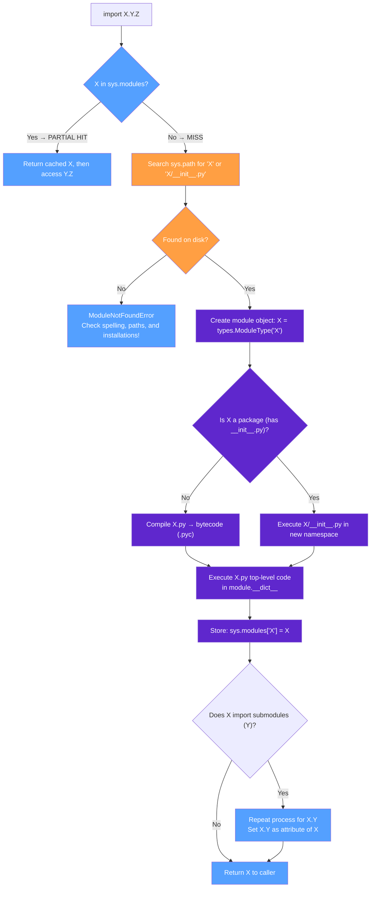

### Mermaid: sys.path Resolution Order

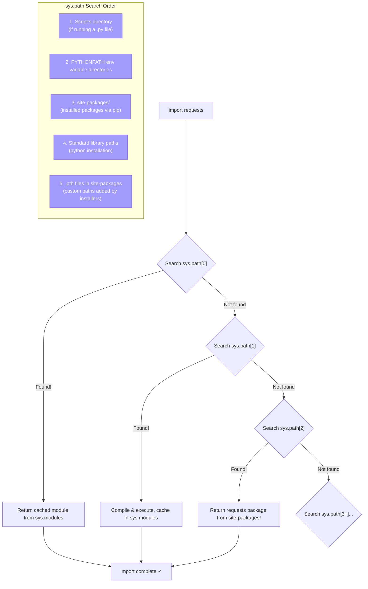

---

## 2. TypeScript import/export ↔ Python import/from (Complete Mapping)

### Complete Import/Export Mapping Table

| TypeScript (ESM) | Python Equivalent | Notes |
|-----------------|-------------------|-------|
| `export default class Foo {}` | **NO DIRECT EQUIVALENT** — define and import by name: `class Foo: ...`, then `from .module import Foo` | Python has no default exports concept |
| `export const X = 1;` | Just define at module level: `X = 1` | Everything at module top level IS exported (unless prefixed with `_`) |
| `export function bar() {}` | Define at top level: `def bar(): ...` | Same — top-level definitions are the exports |
| `export interface Config {}` | `class Config:` or just define a TypedDict/type alias | Python has no interface keyword for exports |
| `import { foo, bar } from './module'` | `from .module import foo, bar` | IDENTICAL concept! Different syntax order (FROM vs FROM...IMPORT) |
| `import X from './module'` | **NO equivalent** — always use `from .module import Y` | Pick a meaningful name for your "default" export |
| `import * as utils from './utils'` | `import utils` or `from . import utils` | The entire module IS the namespace object in Python |
| `import defaultExport, { named } from 'module'` | **NO equivalent** — use `from .module import default_name, named` | Import everything by name |
| `export * from './utils'` | `from .utils import *` (in __init__.py) | Barrel re-export pattern via __all__ |
| `export { foo as bar } from './module'` | `from .module import foo as bar` | Rename on import — identical! |
| `import('dynamic-module')` | `importlib.import_module('dynamic-module')` | Both are dynamic/programmatic imports |
| `import path from 'path'` (Node builtin) | `from pathlib import Path` | Python stdlib is imported like any package |
| `import * as lodash from 'lodash'` | `import pandas as pd` | Convention: use short aliases for long package names |
| `import('./lazy-module')` (dynamic import) | `importlib.import_module('lazy-module')` or lazy import patterns below | Both defer loading until needed |

### Side-by-Side: Default Export Patterns

```typescript
// === TypeScript: Has default exports ===
// user.ts
export default class UserService {
  constructor(private db: Database) {}
  async getUser(id: string) { ... }
}

// main.ts — Can import as any name!
import User from './user';  // "default" can be named anything!

// Also has named exports from the same file:
export const MAX_USERS = 100;
// import User, { MAX_USERS } from './user';
```

```python
# === Python: NO default exports — everything is named ===
# user.py (corresponds to user.ts)
class UserService:
    def __init__(self, db):
        self.db = db
    
    async def get_user(self, id):
        ...

MAX_USERS = 100  # This is a NAMED export — NOT a default

# main.py — MUST import by the actual name!
from .user import UserService  # Not "import User" — must use the defined name!
from .user import MAX_USERS   # Named imports for everything

# There IS no way to have a "default" that you can rename on import.
# Convention: pick the most important class/function and document it as the "main export".
```

### Side-by-Side: Namespace/Star Imports

```typescript
// TypeScript: Explicit namespace import
import * as lodash from 'lodash';
const result = lodash.merge({}, defaults, overrides);

// TypeScript: Named star re-export (barrel file)
// index.ts
export { default as UserService } from './user';
export { fetchData, Config } from './api';
export * from './utils';  // Re-export everything
```

```python
# Python: Module IS the namespace — no * needed
import lodash  # The entire module object is available!
result = lodash.merge({}, defaults, overrides)

# Python: Barrel file (__init__.py) re-exports
# my_package/__init__.py
from .user import UserService as UserService   # Explicit re-export
from .api import fetchData, Config              # Named re-exports
from .utils import *                            # Import all non-_ names from utils

__all__ = ["UserService", "fetchData", "Config"]  # Controls 'from my_package import *'

# Consumer:
from my_package import UserService  # Direct import from package level!
```

### TypeScript ESM → Python Import Complete Code Comparison

```typescript
// === TS: Complex import scenarios ===
export default class App { ... }                        // Default + named
export interface Config { host: string; port: number; } 
export { AuthService as Auth, Logger };                 // Rename + multiple

import App from './App';                                  // Default import
import type { Config } from './config';                  // Type-only import
import * as Utils from './utils';                        // Namespace import
import('./lazy-module');                                 // Dynamic import
```

```python
# === Python: Direct equivalent patterns ===
class App: ...                                           # Defined by name
class Config: host: str; port: int                       # By name, no "interface" keyword
from .auth_service import AuthService as Auth            # Rename on import (identical!)
from .logger import Logger                              # Named import

import app                                              # Import entire module as object
# NO type-only imports in runtime — use typing.TYPE_CHECKING block:
if TYPE_CHECKING:
    from .config import Config  # Only imported during type checking!

import utils as Utils                                    # Namespace import (identical!)

import importlib; importlib.import_module('lazy_module') # Dynamic import (equivalent!)
```

### mermaid: ESM vs Python Import System Comparison

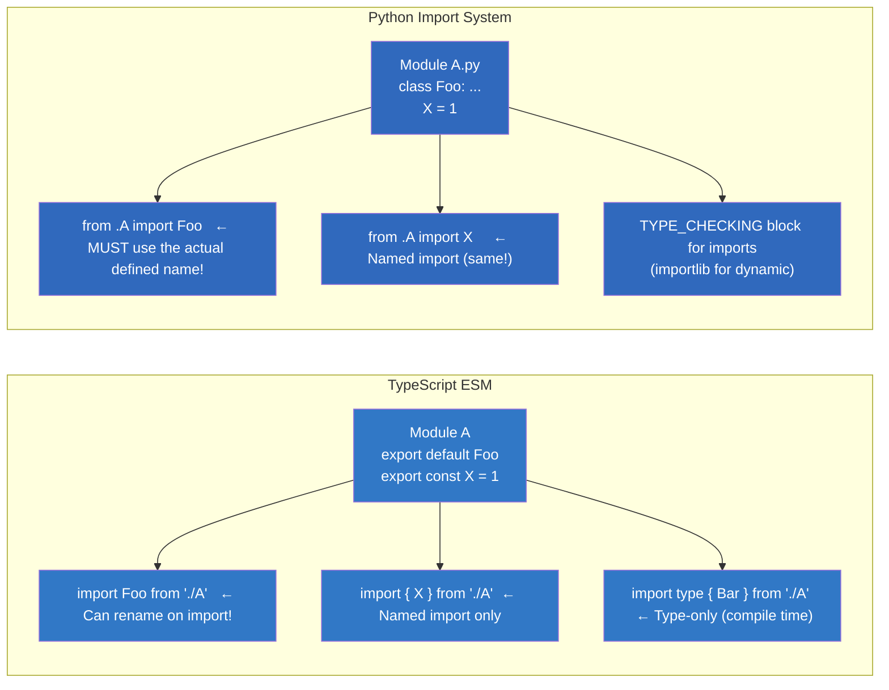

---

## 3. Package Structure — pyproject.toml, src/ Layout, __init__.py (Complete)

### TypeScript Project Structure vs Python Project Structure

```
TypeScript (ESM) project:                    Python project (modern):

package.json                                 pyproject.toml     ← Build config + dependencies
node_modules/                                .venv/           ← Virtual environment
src/                                         src/             ← Source code (PREFERRED layout!)
├── index.ts                                └── my_package/  ← Package root
├── utils/                                    ├── __init__.py   ← Package marker
│   └── helper.ts                               ├── module_a.py
└── ...                                         ├── module_b.py
                                                tests/            ← Test code (separate!)
docs/                                   docs/             ← Documentation
tsconfig.json                           README.md
                                          LICENSE
```

### TypeScript Project Structure vs Python src/ Layout — Side by Side

```
TypeScript flat layout:                    Python flat layout (BAD!):        Python src/ layout (GOOD!):

package.json                               my_project/                     my_project/
src/                                       ├── my_module.py            ← In tests/, python finds YOUR module by mistake!
├── index.ts                               ├── tests/                      my_project/
└── ...                                            └── test_module.py        ├── pyproject.toml
                                                         │                       └── my_project/   ← Package root
                                                          (Run pytest from here     ├── __init__.py
                                                           and import my_module    ├── module_a.py
                                                           works by accident!)    └── module_b.py
                                                              ← DANGEROUS!               tests/        ← Safe: must install package to test
```

### Mermaid: src/ Layout Tree vs Flat Layout

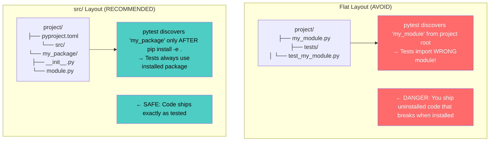

### __init__.py — Complete Reference (Empty vs Bootstrapping vs Lazy)

```python
# === OPTION 1: Empty __init__.py (simplest — just marks as package) ===
# my_package/
# ├── __init__.py   ← empty!
# └── module_a.py
#
# Consumer: import my_package.module_a

# === OPTION 2: Explicit re-exports (BEST practice for public API) ===
# my_package/__init__.py
from .module_a import ClassA, function_a    # Re-export at package level
from .module_b import ClassB as B            # Rename on export

__all__ = ["ClassA", "function_a", "B"]     # Controls: from my_package import *

# Consumer: from my_package import ClassA  (NOT from my_package.module_a)

# === OPTION 3: Lazy imports (__getattr__ — Python 3.7+) ===
# Loads submodules only when accessed — faster startup!
import importlib

def __getattr__(name):
    """Lazily load submodule on first access."""
    if name == "ModuleA":
        return importlib.import_module(".module_a", __name__)
    if name == "ClassB":
        from .module_b import ClassB
        return ClassB
    raise AttributeError(f"module {__name__!r} has no attribute {name!r}")

# def __dir__():  # Optional: control dir(package) output
#     return ["ModuleA", "ClassB", "__all__"]

# === OPTION 4: Bootstrapping — initialize package state ===
def __init_subclass__(cls):
    """Initialize the package when it's first imported."""
    pass  # Rarely needed, but possible!

# === OPTION 5: Version & metadata in __init__.py ===
__version__ = "1.2.3"
__author__ = "Developer"
__all__ = ["ClassA", "function_a"]

# Consumer: import my_package; print(my_package.__version__)
```

### __path__ Mechanism — Namespace Package Discovery

```python
# === __path__ controls where Python looks for subpackages ===

# In my_package/__init__.py:
import os
__path__.append(os.path.join(os.path.dirname(__file__), "extra_dirs"))
# Now Python will also look in extra_dirs/ for subpackages!

# This is how namespace packages work — they extend __path__ dynamically.
```

---

## 4. Complete pyproject.toml Reference

### Every Field and Section Explained

```toml
# ============================================
# FULL pyproject.toml — ALL FIELDS REFERENCE
# ============================================

# --- Build System (REQUIRED) ---
[build-system]
requires = ["setuptools>=68.0", "wheel"]          # Packages needed to build the project
build-backend = "setuptools.build_meta"             # Which backend to use for building
# Alternative backends:
#   - "hatchling.build"        (Hatch)
#   - "poetry.core.masonry.api" (Poetry)
#   - "flit_core.buildapi"     (Flit)

# --- Project Metadata (REQUIRED by PEP 621) ---
[project]
name = "my-awesome-package"                       # REQUIRED — must be unique on PyPI!
version = "1.2.3"                                 # REQUIRED — semver: MAJOR.MINOR.PATCH
description = "A short description of my package" # One-line summary
readme = "README.md"                              # Long description file (supports md, rst, txt)
requires-python = ">=3.9"                         # Minimum Python version
license = {text = "MIT"}                          # SPDX license identifier
license-files = ["LICENSE", "NOTICE"]             # Files containing license text

authors = [                                      # List of authors
    {name = "Jane Developer", email = "jane@example.com"},
    {name = "John Coder", email = "john@example.com"},
]
maintainers = [                                  # Optional: maintainers distinct from authors
    {name = "Maintainer Name", email = "maintainer@example.com"},
]

keywords = ["asyncio", "http", "api"]            # Search keywords for PyPI
classifiers = [                                  # PyPI classifiers (predefined metadata)
    "Development Status :: 4 - Beta",
    "Intended Audience :: Developers",
    "License :: OSI Approved :: MIT License",
    "Programming Language :: Python :: 3",
    "Programming Language :: Python :: 3.9",
    "Programming Language :: Python :: 3.10",
    "Programming Language :: Python :: 3.11",
    "Programming Language :: Python :: 3.12",
    "Topic :: Software Development :: Libraries",
]

# --- Dependencies (REQUIRED runtime dependencies) ---
dependencies = [                                 # Runtime dependencies (installed with your package)
    "requests>=2.28,<3.0",                       # PEP 508 version specifiers
    "pydantic>=2.0,<3.0",
    "click>=8.0",
]

# --- Optional Dependencies (extras) ---
[project.optional-dependencies]                  # Groups of optional dependencies
dev = [                                           # Developer dependencies (pip install .[dev])
    "pytest>=7.0",
    "pytest-asyncio>=0.21",
    "mypy>=1.0",
    "ruff>=0.1",
    "black>=23.0",
]
docs = [                                          # Documentation dependencies
    "sphinx>=7.0",
    "sphinx-rtd-theme>=1.0",
]
test = [                                          # Test-specific dependencies
    "coverage[toml]>=7.0",
    "hypothesis>=6.0",
]

# --- Entry Points (CLI tools & plugin hooks) ---
[project.scripts]                                # CLI entry points (creates executables!)
my-cli-tool = "my_package.cli:main"              # Runs my_package.cli.main() when 'my-cli-tool' is invoked
start-server = "my_package.server:run"           # Another CLI tool

[project.gui-scripts]                            # GUI entry points (Windows/macOS specific)
my-gui-app = "my_package.gui:main"               # Creates .exe or .app bundle

# --- Plugin Entry Points (for discovery by other packages) ---
[project.entry-points."my_plugin_system"]        # Group name for plugin discovery
my_plugin = "my_package.plugins:MyPluginClass"   # Plugin class/function registered by name

# --- Project URLs ---
[project.urls]
Homepage = "https://github.com/user/my-package"
Documentation = "https://my-package.readthedocs.io"
Repository = "https://github.com/user/my-package"
"Bug Tracker" = "https://github.com/user/my-package/issues"
Changelog = "https://github.com/user/my-package/blob/main/CHANGELOG.md"

# --- Tool Configuration (build tools read their config here) ---
[tool.setuptools]
packages = ["my_package"]                        # Packages to include
include-package-data = true                      # Include data files (data, templates, etc.)

[tool.setuptools.package-dir]                    # Map package name to source directory (src/ layout!)
"" = "src"                                       # "" means: all packages are under src/

[tool.setuptools.package-data]                   # Non-Python files to include
"my_package" = ["*.json", "*.txt", "templates/*"]

[tool.ruff]                                     # Ruff (fast Python linter) config
line-length = 100
target-version = "py39"
select = ["E", "F", "W", "I", "N", "UP", "B", "C4"]
ignore = ["E501", "B008"]

[tool.black]                                    # Black (auto-formatter) config
line-length = 100
target-version = ["py39", "py310", "py311", "py312"]

[tool.mypy]                                     # MyPy type checking config
python_version = "3.9"
warn_return_any = true
warn_unused_configs = true
strict = true                                    # Enables all strict checks

[tool.pytest.ini_options]                       # pytest configuration
testpaths = ["tests"]
asyncio_mode = "auto"                            # Auto-setup asyncio for tests
addopts = "-v --tb=short"                        # Default test options

[tool.coverage.run]                             # Coverage config
source = ["my_package"]
omit = ["tests/*", "*/__pycache__/*"]

[tool.hatch.build.targets.wheel]                # Hatch build config (alternative to setuptools)
packages = ["src/my_package"]
```

### Mermaid: pyproject.toml Structure

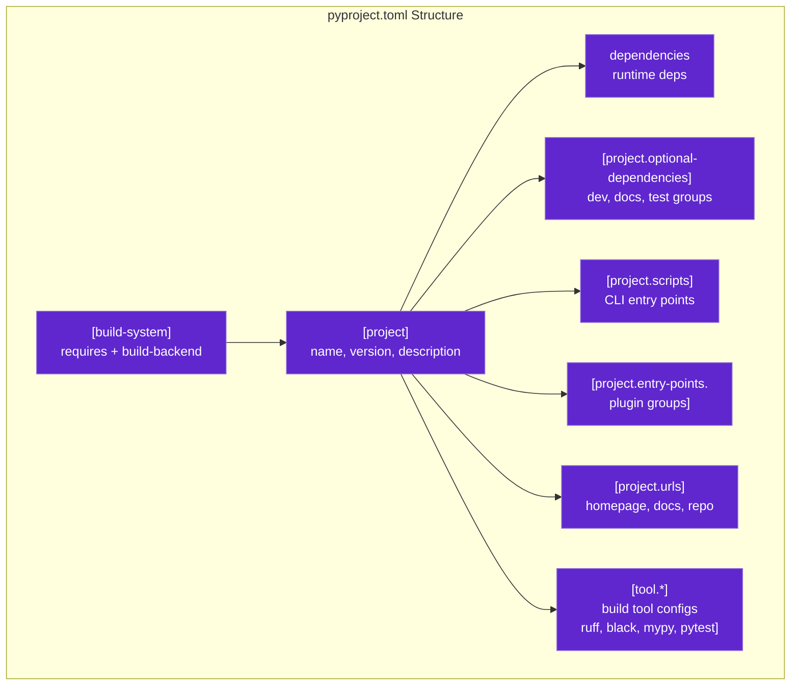

---

## 5. Relative Imports — Exhaustive Reference

### Complete Relative Import Syntax Reference

```python
# === PROJECT STRUCTURE FOR ALL EXAMPLES ===
# my_package/
# ├── __init__.py           (package root)
# ├── module_a.py           (sibling of subpackage)
# ├── module_b.py           (sibling)
# └── subpackage/
#     ├── __init__.py       (subpackage root)
#     ├── module_c.py       (child of subpackage)
#     └── deep/
#         ├── __init__.py   (deep subpackage)
#         └── module_d.py   (grandchild)

# === LEVEL 1: Current package (.) ===
# In my_package/module_a.py:
from .module_b import some_function      # Import from sibling module in same package
from . import module_c                   # Import the whole submodule as an object
from .module_b import ClassB as B         # Rename on import (same as TS!)

# === LEVEL 2: Parent package (..) ===
# In my_package/subpackage/module_c.py:
from ..module_a import some_function     # Import from parent's sibling
from .. import module_b                  # Import the whole sibling package

# === LEVEL 3: Grandparent package (...) ===
# In my_package/subpackage/deep/module_d.py:
from ...module_a import some_function    # Jump up two levels! (rarely needed)
from ..module_b import ClassB            # Jump up one level, then into sibling

# === ABSOLUTE IMPORTS (ALWAYS PREFERRED!) ===
# In ANY file within the package:
from my_package.module_a import some_function  # Absolute — doesn't break on refactoring!
from my_package.subpackage.module_c import ClassC  # Fully qualified = unambiguous!
```

### Mermaid: Relative Import Path Resolution

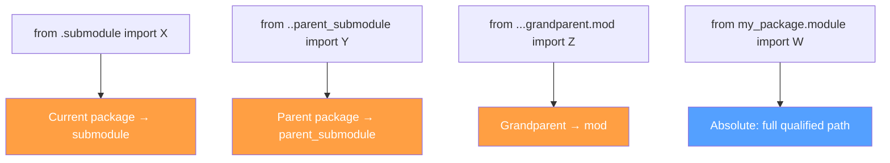

### Edge Cases & Common Errors

```python
# === EDGE CASE 1: Running a module directly breaks relative imports ===
# If you run: python my_package/subpackage/module_c.py
# → relative imports FAIL because the script isn't "inside" the package!

# Fix: Run as a module: python -m my_package.subpackage.module_c

# === EDGE CASE 2: Relative imports only work WITHIN packages ===
# In a plain .py file (not inside a package):
from .module import X  # ← SyntaxError! No __name__ to resolve '.' from.

# Fix: Use absolute imports for non-package files.

# === EDGE CASE 3: Mixing relative and absolute in __init__.py ===
# In my_package/__init__.py:
from .module_a import ClassA         # Relative — works because __init__.py IS the package
from my_package.module_b import ClassB  # Absolute — also works!
# Absolute is preferred for clarity.

# === EDGE CASE 4: Circular relative imports ===
# module_a.py: from .module_b import X    ← circular dependency!
# module_b.py: from .module_a import Y
# Fix: Extract shared code to a third module, or use TYPE_CHECKING pattern.
```

---

## 6. Import Hooks, Finders & Loaders

### The Import Hook Protocol — How Python Finds Modules

```python
import sys
import importlib.abc
import importlib.machinery
from pathlib import Path

# === PYTHON'S IMPORT ARCHITECTURE ===

# When `import X` happens:
# 1. sys.meta_path → list of finders (checked in order)
# 2. Each finder's find_spec(name, path, target) is called
# 3. If a finder returns a Spec → loader.execute_module() runs the code
# 4. Module is cached in sys.modules

# === CREATE A CUSTOM FINDER (advanced!) ===
class CustomFinder(importlib.abc.MetaPathFinder):
    """Custom module finder — intercepts all imports."""
    
    def find_spec(self, fullname, path, target=None):
        if fullname.startswith("my_custom_"):
            # Return a spec pointing to a custom location!
            return importlib.machinery.ModuleSpec(
                name=fullname,
                loader=CustomLoader(fullname),
                origin="/custom/path/to/module.py",  # Where the code lives
                is_package=False,
            )
        return None  # Let other finders handle it


class CustomLoader(importlib.abc.Loader):
    """Load module from a custom source."""
    
    def __init__(self, name: str):
        self.name = name
    
    def create_module(self, spec):
        return None  # Use default module creation
    
    def exec_module(self, module):
        # Execute custom code for this module!
        code = compile(f"custom_attr = 'loaded by {self.name}'", '<custom>', 'exec')
        exec(code, module.__dict__)


# Register the finder:
sys.meta_path.insert(0, CustomFinder())

# Now: import my_custom_something  → triggers your custom finder!
```

### sys.meta_path — Complete Reference

```python
import sys

# === Default meta path finders (built-in order): ===
for finder in sys.meta_path:
    print(f"{type(finder).__name__:40s} → {finder}")

# Expected output:
# _frozen_importlib._ModuleSpecLookup        → <_frozen_importlib...>
# <class '_frozen_importlib.BuiltinImporter'>  → Built-in modules (sys, os, etc.)
# <class '_frozen_importlib.FrozenImporter'>   → Frozen modules (compiled into Python binary)
# <class 'site._ImportHooks'>                  → site.py additions (.pth files)
# <class 'importlib._bootstrap_external.\nFinderModulePathHooks'>  # sys.path-based finder

# === Add your own finder to the front of the chain ===
sys.meta_path.insert(0, CustomFinder())

# Remove a finder:
sys.meta_path = [f for f in sys.meta_path if not isinstance(f, BuiltinImporter)]
```

---

## 7. Dynamic Module Loading

### importlib — Programmatic Import Complete Reference

```python
import importlib
import importlib.util

# === METHOD 1: import_module (most common) ===
requests = importlib.import_module("requests")  # Same as: import requests
numpy = import_module("numpy.linalg")           # Nested: same as: from numpy import linalg

# === METHOD 2: Dynamic module name from user input ===
module_name = input("Enter module to import: ")  # e.g., "collections"
module = importlib.import_module(module_name)

# === METHOD 3: Import from a file path (no package structure needed!) ===
spec = importlib.util.spec_from_file_location(
    "my_dynamic_module",        # Module name (arbitrary)
    "/path/to/any/file.py"       # Physical file location
)
dynamic_module = importlib.util.module_from_spec(spec)  # Create empty module
sys.modules["my_dynamic_module"] = dynamic_module       # Cache it!
spec.loader.exec_module(dynamic_module)                 # Execute the code!

# === METHOD 4: Import from string (source code as a string!) ===
source_code = """
def hello():
    return "Hello from dynamically loaded code!"
"""
module = importlib.util.module_from_spec(importlib.util.spec_from_loader("dynamic", None))
exec(compile(source_code, "<string>", "exec"), module.__dict__)

# === METHOD 5: Conditional imports (graceful fallback) ===
def get_json_library():
    """Try multiple JSON libraries, fall back gracefully."""
    for name in ("orjson", "ujson", "json"):
        try:
            return importlib.import_module(name)
        except ModuleNotFoundError:
            continue
    raise RuntimeError("No JSON library found!")

json_lib = get_json_library()  # Returns the first available one!

# === METHOD 6: Lazy module attribute access ===
class LazyPackage:
    """Package that imports submodules only when accessed."""
    
    def __init__(self, name: str):
        self._name = name
    
    def __getattr__(self, attr: str):
        submodule = importlib.import_module(f"{self._name}.{attr}")
        setattr(self, attr, submodule)  # Cache for future access
        return submodule

utils = LazyPackage("my_package.utils")
# utils.something → only imported when first accessed!
```

---

## 8. Lazy Imports & Import-on-Demand

### __getattr__ Module Pattern (Python 3.7+)

```python
# my_package/__init__.py — Lazy loading at the package level
import importlib

def __getattr__(name: str):
    """Lazily load submodules on first access."""
    # Map of known lazy attributes
    _LAZY_MODULES = {
        "ModuleA": ".module_a",
        "ModuleB": ".module_b", 
        "Utils": ".utils",
    }
    
    if name in _LAZY_MODULES:
        module = importlib.import_module(_LAZY_MODULES[name], __name__)
        setattr(sys.modules[__name__], name, module)  # Cache!
        return module
    
    raise AttributeError(f"module {__name__!r} has no attribute {name!r}")

def __dir__():  # Control what dir(package) shows
    return ["ModuleA", "ModuleB", "Utils"] + list(__import__("sys").modules[__name__].__dict__.keys())


# === RESULT: Submodules are only loaded when accessed! ===
# import my_package        → Fast startup (no submodules loaded!)
# my_package.ModuleA       → Loads module_a.py on first access only
# my_package.ModuleB       → Also loaded lazily
```

### @lazy_import Decorator Pattern

```python
import functools
import sys
from typing import Any, Callable

def lazy_import(module_name: str, attr_names: list[str]):
    """Decorator that makes attribute access lazy for a module."""
    def decorator(cls_or_func):
        real_module = None
        
        def get_real_module():
            nonlocal real_module
            if real_module is None:
                import importlib
                real_module = importlib.import_module(module_name)
            return real_module
        
        class LazyWrapper:
            def __getattr__(self, name):
                mod = get_real_module()
                attr = getattr(mod, name)
                setattr(self, name, attr)  # Cache!
                return attr
        
        return functools.wraps(cls_or_func)(LazyWrapper())
    return decorator

# Usage:
@lazy_import("pandas", ["DataFrame", "Series"])
def process_data():
    df = pandas.DataFrame({"a": [1, 2, 3]})  # pandas is loaded here!
```

### Import-on-Demand with __getattr__ in __init__.py (Production Pattern)

```python
# my_package/__init__.py — The production lazy-loading pattern used by large packages:
import importlib
import sys as _sys

__all__ = [
    "ModuleA", "ModuleB", "ClassC", "FunctionD",
]

def __getattr__(name: str):
    """Lazily load attributes on first access."""
    # Module mapping — lazy attribute → module path
    _LAZY = {
        "ModuleA": (".module_a", "ModuleA"),      # (module_path, attr_name)
        "ModuleB": (".module_b", "ModuleB"),
        "ClassC": (".module_c", "ClassC"),
        "FunctionD": (".functions", "function_d"),
    }
    
    if name in _LAZY:
        module_path, attr_name = _LAZY[name]
        module = importlib.import_module(module_path, __name__)
        value = getattr(module, attr_name)
        # Cache the attribute so future access is fast!
        globals()[name] = value
        return value
    
    raise AttributeError(f"module {__name__!r} has no attribute {name!r}")

# def __dir__():  # Optional: control autocompletion in IDEs
#     return list(__all__) + [_k for _k in globals() if not _k.startswith('_')]
```

---

## 9. Module Caching & Invalidation

### How sys.modules Caches Modules — And When It Doesn't

```python
import sys
import importlib
import time

# === MODULE IS CACHED ON FIRST IMPORT ===
import my_module
print(sys.modules["my_module"])  # <module 'my_module' from '/path/to/my_module.py'>

# === SUBSEQUENT IMPORTS RETURN THE SAME OBJECT ===
import my_module as my_module2
print(my_module is my_module2)  # True! Same object, different name.

# === RELOADING A MODULE — Executes code AGAIN ===
# Changes to the source file are NOT reflected until reload!
# File changed on disk → old module still in memory → import returns cached version.

importlib.reload(my_module)  # Re-executes my_module.py, replaces sys.modules entry
print(my_module.some_function)  # Now has the new code (if the function was redefined!)

# === WATCH OUT: Old references still point to OLD objects! ===
# obj = my_module.SomeClass()   ← Created before reload
# importlib.reload(my_module)   ← Re-executes, creates NEW SomeClass
# type(obj) is my_module.SomeClass  # False! Different class objects!

# === INCOMPATIBLE MODULE (removing from cache) ===
del sys.modules["my_module"]
import my_module  # Fresh import — runs code from disk again!
```

### Mermaid: Module Caching & Invalidation Flow

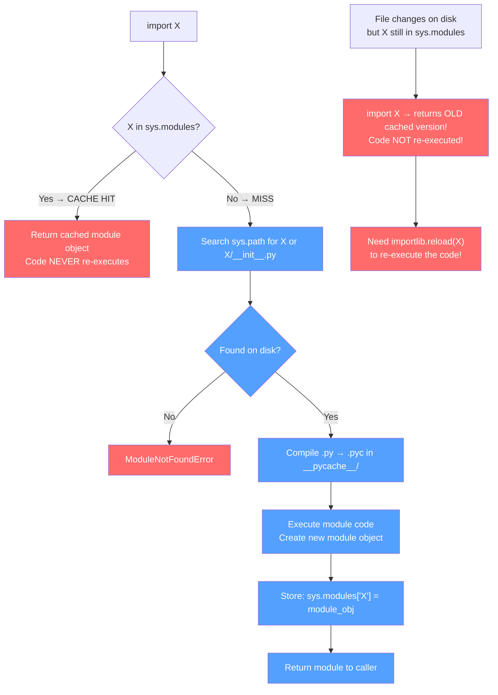

---

## 10. Circular Imports — Detection & 5 Fix Patterns

### The Problem — How Circular Imports Fail

```python
# === PROBLEM: Circular import between module_a and module_b ===

# my_package/module_a.py:
from .module_b import ClassB  # ← Tries to import module_b while module_b is still being executed!
class ClassA:
    def __init__(self):
        self.b = ClassB()  # This will FAIL with ImportError!

# my_package/module_b.py:
from .module_a import ClassA  # ← Tries to import module_a while module_a is partially initialized!
class ClassB:
    def get_a(self) -> ClassA:  # Type hint fails because ClassA isn't fully defined yet.
        return ClassA()

# === RESULT: ImportError or AttributeError — one module is only partially loaded! ===
```

### Mermaid: Circular Import Detection + Prevention

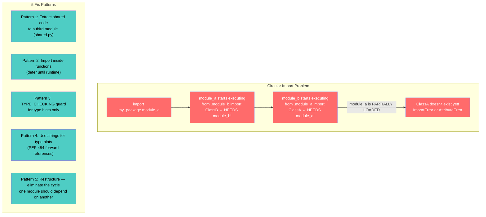

### 5 Fix Patterns — Complete Code Examples

```python
# === FIX PATTERN 1: Extract shared code to a third module ===
# BEFORE (circular):
#   module_a imports from module_b
#   module_b imports from module_a

# AFTER (no circular dependency):
# my_package/shared.py:
class SharedBase:
    """Shared base class used by both modules."""
    def shared_method(self): ...

# my_package/module_a.py:
from .shared import SharedBase  # One-way dependency!
class ClassA(SharedBase):
    pass

# my_package/module_b.py:
from .shared import SharedBase  # One-way dependency (same direction)!
class ClassB(SharedBase):
    pass

# === FIX PATTERN 2: Import inside functions (defer until runtime) ===
# my_package/module_a.py:
class ClassA:
    def use_class_b(self):
        from .module_b import ClassB  # Import INSIDE the function — only when called!
        return ClassB()  # By this point, module_b is fully loaded.

# my_package/module_b.py:
class ClassB:
    def use_class_a(self):
        from .module_a import ClassA  # Same pattern — deferred import!
        return ClassA()

# === FIX PATTERN 3: TYPE_CHECKING guard (for type hints only) ===
from typing import TYPE_CHECKING

if TYPE_CHECKING:
    # This code runs ONLY during static type checking (mypy, pyright).
    # It does NOT run at runtime — so no circular import error!
    from .module_b import ClassB

class ClassA:
    def get_b(self) -> "ClassB":  # String forward reference!
        # type: () -> ClassB
        pass  # Real import happens inside the function body.

# === FIX PATTERN 4: Use string type hints (PEP 484 forward references) ===
class ClassA:
    def get_b(self) -> "ClassB":  # String = forward reference, no runtime import needed!
        from .module_b import ClassB
        return ClassB()

# In module_b.py — same pattern:
class ClassB:
    def get_a(self) -> "ClassA":  # String type hint
        from .module_a import ClassA
        return ClassA()

# === FIX PATTERN 5: Restructure to eliminate the cycle ===
# The BEST fix is often architectural — remove the circular dependency entirely.

# Before:
#   module_a ──depends on──→ module_b
#   module_b ──depends on──→ module_a

# After (linear dependency):
#   module_a ──depends on──→ module_b
#   module_c ──depends on──→ module_b  (both depend on b, but not each other!)
```

### Detecting Circular Imports Programmatically

```python
import sys
import importlib
from typing import Set

def detect_circular_imports(package_name: str) -> list[tuple[str, ...]]:
    """Detect circular imports by tracing the import chain."""
    visited: Set[str] = set()
    path: list[str] = []
    cycles: list[tuple[str, ...]] = []
    
    def trace_import(module_name: str):
        if module_name in visited:
            cycle_start = path.index(module_name)
            cycle = tuple(path[cycle_start:] + [module_name])
            cycles.append(cycle)
            return
        
        visited.add(module_name)
        path.append(module_name)
        
        try:
            module = importlib.import_module(module_name)
            # Recurse into submodule imports
            for attr in dir(module):
                try:
                    submod = getattr(module, attr)
                    if hasattr(submod, '__name__') and submod.__name__.startswith(package_name):
                        trace_import(submod.__name__)
                except (AttributeError, ImportError):
                    pass
        except ModuleNotFoundError:
            pass
        
        path.pop()
        visited.discard(module_name)  # Allow re-visiting from different paths
    
    trace_import(package_name)
    return cycles

# Usage:
cycles = detect_circular_imports("my_package")
for cycle in cycles:
    print(f"CIRCULAR IMPORT: {' → '.join(cycle)}")
```

---

## 11. Namespace Packages Complete Guide (PEP 420 vs Explicit)

### What Are Namespace Packages?

```python
"""
Namespace packages allow a single package to be split across multiple directories,
even across different installed packages. This is critical for:
- Plugin systems where plugins add to the same namespace
- Multi-repo projects that share a package name
- Installing packages from different sources into one namespace

TWO WAYS TO CREATE NAMESPACE PACKAGES:
"""

# === METHOD 1: PEP 420 — Implicit namespace packages (NO __init__.py!) ===
# my_namespace_package/          ← No __init__.py! Python knows this is a namespace package.
# ├── part_a/                    ← First distribution provides part of the package
# │   └── module_a.py            # from .part_a import module_a works!
# └── part_b/                    ← Second distribution adds to the same namespace!
#     └── module_b.py            # Both parts share the same my_namespace_package.__path__

# Install part_a and part_b as separate pip packages — they merge automatically!

# === METHOD 2: Explicit namespace packages (pkgutil-style, with __init__.py) ===
# In my_namespace_package/__init__.py:
"""This package is a namespace package."""
from pkgutil import extend_path
__path__ = extend_path(__path__, __name__)
# This explicitly extends __path__ to include parts from other installations.

# === COMPARISON ===
"""
PEP 420 (implicit):          pkgutil (explicit):
- NO __init__.py needed      - Requires __init__.py with extend_path
- Simpler, fewer files       - More explicit, easier to debug
- Python 3.3+                - Python 2.3+ compatible
- Can't add code in __init__  - Can add code + extend path
- RECOMMENDED (modern)       - Legacy / special cases only
"""

# === VERIFY: Namespace package works across installations ===
# pip install namespace-part-a   → creates my_namespace_package/ with part_a contents
# pip install namespace-part-b   → extends my_namespace_package.__path__ to include part_b!
import my_namespace_package
print(my_namespace_package.__path__)  # Contains BOTH part_a and part_b directories!
```

### Mermaid: Namespace Package Discovery

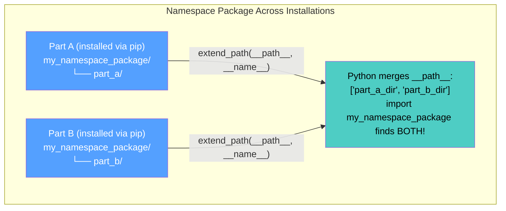

---

## 12. Package Distribution: Wheel, sdist, PyPI Upload

### Building and Publishing a Python Package

```bash
# === BUILD THE PACKAGE ===
pip install build
python -m build              # Creates dist/my_package-1.0.0.tar.gz (sdist)
                              # and dist/my_package-1.0.0-py3-none-any.whl (wheel)

# === WHAT'S IN EACH FORMAT? ===
"""
Wheel (.whl):              sdist (.tar.gz):
- Pre-built, ready to install  - Source distribution
- Faster installation            - Requires build step on target machine
- Platform-specific files OK     - More portable (works everywhere)
- RECOMMENDED for publishing     - REQUIRED by PyPI as backup
"""

# === VERIFY YOUR WHEEL ===
pip wheel . --no-deps -w dist/
unzip -l dist/*.whl          # List wheel contents

# === UPLOAD TO PYPI (test first!) ===
pip install twine
twine check dist/*           # Validate package metadata
twine upload --repository testpypi dist/*  # Upload to test PyPI first!
twine upload dist/*           # When ready, publish to real PyPI

# === INSTALL FROM PYPI ===
pip install my-package       # Install from PyPI
pip install my-package==1.2.3  # Specific version
pip install "my-package>=1.0,<2.0"  # Version range (PEP 440)
```

### Mermaid: Package Distribution Pipeline

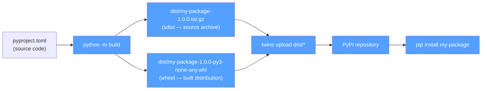

---

## 13. Dependency Resolution & Semantic Versioning

### Python Version Specifiers (PEP 440)

| Specifier | Meaning | Example |
|-----------|---------|---------|
| `==` | Exact version | `requests==2.28.0` |
| `!=` | Excluded version | `numpy!=1.21.0` |
| `>=`, `<=` | Range bounds | `pydantic>=2.0,<3.0` |
| `>` , `<` | Strict range | `click>8.0` (excludes 8.0) |
| `~=` | Compatible release | `requests~=2.28` → `>=2.28, <3.0` |
| `*` | Wildcard | `numpy==1.*` → any 1.x version |

### Dependency Hell — How Python Resolves It

```python
# === HOW PIP RESOLVES DEPENDENCIES ===
"""
1. Parse your pyproject.toml dependencies
2. Fetch package metadata from PyPI (requires-dist)
3. Build a dependency graph
4. Solve for compatible versions (CDLL solver: Conjunctive Domain Dependency Logic)
5. If conflict: report "ResolutionImpossible" with the conflicting packages

Example conflict:
  my-package needs pydantic>=2.0
  another-dep needs pydantic<2.0
  → pip resolves: IMPOSSIBLE — report error!
"""

# === SEMANTIC VERSIONING IN PYTHON ===
"""
MAJOR.MINOR.PATCH (semver):
- MAJOR = breaking changes (no backward compatibility)
- MINOR = new features (backward compatible)  
- PATCH = bug fixes (backward compatible)

Python convention:
- Major upgrades: 1.0 → 2.0 (may break API)
- Minor updates:  1.1 → 1.2 (new features, safe)
- Patch updates:  1.1.0 → 1.1.1 (bug fixes, very safe)

Use flexible specs: requests>=2.28,<3.0
This allows patches and minor versions but prevents breaking major upgrades.
"""
```

---

## 14. PYTHONPATH Management

### How to Add Directories to Python's Import Path

```python
import sys

# === METHOD 1: PYTHONPATH environment variable (recommended for dev) ===
# Set in .bashrc / .zshrc / system settings:
# export PYTHONPATH="/path/to/my/packages:$PYTHONPATH"

# === METHOD 2: .pth files (permanent, site-packages level) ===
# Create: $PYTHON_PREFIX/site-packages/my-paths.pth
# Contents (one path per line):
#   /path/to/my/packages
#   /another/path

# === METHOD 3: sys.path manipulation (runtime — rare!) ===
sys.path.insert(0, "/path/to/my/custom/packages")  # Search FIRST
sys.path.append("/path/to/late-search-packages")    # Search LAST
sys.path.remove("/path/to/remove")                  # Remove a path
print(sys.path)                                      # See all paths

# === METHOD 4: editable install (BEST for development!) ===
# pip install -e /path/to/package   ← Creates symlink in site-packages!
# Changes to source are immediately reflected — no PYTHONPATH needed!

# === VERIFY WHERE YOUR PACKAGE IS BEING FOUND ===
import my_package
print(my_package.__file__)  # Physical file location
import my_package.module_a
print(my_package.module_a.__file__)  # Submodule location
```

### Mermaid: PYTHONPATH Resolution Order

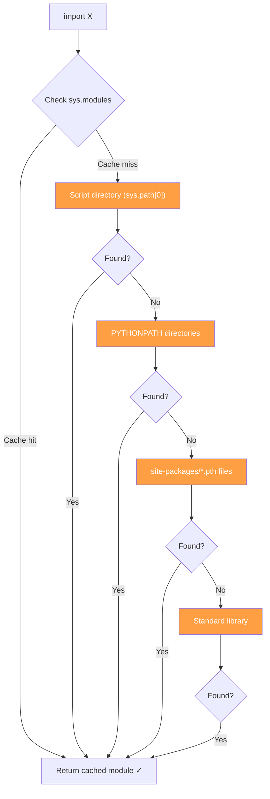

---

## 15. Entry Points, Extras & Conflicts

### Entry Points Complete Reference

```python
# === ENTRY POINTS IN pyproject.toml ===

# --- CLI Scripts (console_scripts) ---
[project.scripts]
my-cli = "my_package.cli:main"              # python -c "from my_package.cli import main; main()"
another-tool = "my_package.tools:some_func"  # Creates 'another-tool' executable

# --- GUI Entry Points (gui_scripts — Windows/macOS) ---
[project.gui-scripts]
my-gui-app = "my_package.gui:main"          # Creates .exe / .app bundle

# --- Plugin Entry Points (discovered by other packages) ---
[project.entry-points."my_plugin_system"]   # Group name used by the plugin system
plugin1 = "my_package.plugins:PluginClass"  # entry_point_name = "module:function"
plugin2 = "my_package.plugins:AnotherPlugin"

# === DISCOVERING ENTRY POINTS AT RUNTIME ===
from importlib.metadata import entry_points, packages_distributions

# Find all entry points in a group:
eps = entry_points(group="my_plugin_system")
for ep in eps:
    plugin_class = ep.load()  # Dynamically import and instantiate!
    plugin = plugin_class()
    plugin.execute()

# List what distribution provides a package:
print(packages_distributions())  
# {'requests': ['requests'], 'numpy': ['numpy'], ...}

# === EXTRA DEPENDENCIES (pip install my-package[dev,docs]) ===
# See [project.optional-dependencies] section above.

# === CONFLICTS: What happens when two packages provide the same module? ===
"""
Scenario: Package A provides "utils" and Package B also provides "utils".
Python imports ONE of them (whichever comes first in sys.path).
The other is effectively shadowed!

Solutions:
1. Use unique package names (convention, not enforced by Python)
2. Namespace packages (split across distributions — see PEP 420)
3. Explicit installation order control: pip install pkg-a pkg-b
"""
```

---

## 16. Package Discovery (pkg_resources / importlib.metadata)

### Modern vs Legacy Package Discovery APIs

```python
# === MODERN: importlib.metadata (Python 3.8+) ===
from importlib.metadata import (
    distribution,          # Get package metadata
    packages_distributions,  # Map package names → distribution names
    entry_points,          # Discover entry points
    files,                 # List files in a package
    version,               # Get package version
)

# Find what version of requests is installed:
print(version("requests"))  # "2.31.0"

# Find all distributions that provide a package name:
dists = packages_distributions()  # {'requests': ['requests'], 'numpy': ['numpy']}

# List all files in the requests package:
req_files = files("requests")  # Returns Iterator[PathDistribution]

# Discover entry points in a group:
eps = entry_points(group="console_scripts")
for ep in eps:
    print(f"{ep.name} → {ep.value}")

# === LEGACY: pkg_resources (deprecated but still used) ===
import pkg_resources

# Same concepts but different API:
dist = pkg_resources.get_distribution("requests")  # Distribution object
print(dist.version)                               # "2.31.0"
print(dist.files[:5])                             # First 5 files
```

---

## 17. The if __name__ == "__main__" Pattern

### Why It Exists & How to Use It Correctly

```python
# === THE PROBLEM: A module can be both IMPORTED and RUN DIRECTLY ===
# python my_script.py       → __name__ == "__main__"  (run directly!)
# import my_script          → __name__ == "my_script"  (imported as a module!)

# Without __name__ guard, the entire file runs on import — including:
# - HTTP requests
# - File I/O
# - User input prompts
# All of which are BAD when your module is imported!

# === THE FIX: Guard execution code with __name__ check ===
def main():
    """Entry point — all top-level logic goes here."""
    print("Running as script!")
    # ... do real work ...

if __name__ == "__main__":
    main()  # Only runs when executed directly, NOT when imported!

# === RESULT: ===
# python my_script.py   → prints "Running as script!" (main() is called)
# import my_script      → DOES NOT print anything (main() is NOT called)
                        # But the functions/classes ARE available for use!

# === ADVANCED: Allow both CLI and library usage ===
def main():
    """Parse args and run."""
    import argparse
    parser = argparse.ArgumentParser(description="My tool")
    parser.add_argument("--verbose", action="store_true")
    args = parser.parse_args()
    
    if args.verbose:
        print("Verbose mode!")
    do_work()

if __name__ == "__main__":
    main()

# Now my_script.py works BOTH as a CLI tool AND as an importable library!
```

---

## 18. Quizzes (25+)

### Quiz 1: Import Cache
**Q:** What happens when you `import os` for the second time?
<details><summary>Show Answer</summary>

Python checks `sys.modules["os"]` first. If found (cache hit), it returns the cached module object — the code is NOT re-executed. This is why modules are imported exactly once.
</details>

### Quiz 2: sys.path
**Q:** Where does Python look for modules? List the resolution order.
<details><summary>Show Answer</summary>

1. Script's directory (sys.path[0])
2. PYTHONPATH environment variable directories
3. site-packages/ (installed via pip)
4. Standard library paths
5. .pth files in site-packages
</details>

### Quiz 3: Default Exports
**Q:** Why can't you do `import X from './module'` in Python?
<parameter_answer>Show Answer</summary>

Python has no default exports concept. Every export is named — you must use `from .module import X`. This avoids ambiguity when multiple files are imported.
</details>

### Quiz 4: __init__.py Purpose
**Q:** What does __init__.py do? List all its roles.
<parameter_answer>Show Answer</summary>

1. Marks a directory as a Python package
2. Controls what `from package import *` exposes (via __all__)
3. Executes initialization code when the package is imported
4. Can implement lazy loading via __getattr__
5. Can extend __path__ for namespace packages
</details>

### Quiz 5: pyproject.toml
**Q:** What are the two required sections in pyproject.toml?
<parameter_answer>Show Answer</summary>

[build-system] with requires and build-backend, and [project] with name and version. These are mandatory per PEP 621.
</details>

### Quiz 6: src/ Layout
**Q:** Why is the src/ layout preferred over flat layout?
<parameter_answer>Show Answer</summary>

In flat layout, tests can accidentally import from the project root instead of the installed package. With src/, the package must be installed (even in development mode with pip install -e) before it's importable, ensuring tests use exactly what ships.
</details>

### Quiz 7: Relative Imports Edge Case
**Q:** Why do relative imports fail when you run a Python file directly?
<parameter_answer>Show Answer</summary>

Because `.` resolves relative to the package name. When running directly, __name__ is "__main__" not the package name, so there's no package context to resolve `.` from. Fix: run with `python -m my_package.module` instead.
</details>

### Quiz 8: Circular Import Cause
**Q:** What causes a circular import error?
<parameter_answer>Show Answer</summary>

When module A imports from B at the top level, and B imports from A at the top level — B is only partially loaded when A tries to use it. Solution: defer imports inside functions or extract shared code.
</details>

### Quiz 9: PEP 420
**Q:** What is a namespace package? How do you create one?
<parameter_answer>Show Answer</summary>

A namespace package allows multiple directories to provide parts of the same package name without __init__.py (PEP 420 implicit) or with pkgutil-style extend_path. Different pip distributions can contribute to the same namespace.
</details>

### Quiz 10: Module Caching
**Q:** If I change a .py file on disk, does `import X` reflect the changes?
<parameter_answer>Show Answer</summary>

No — the module is cached in sys.modules. You must use importlib.reload(X) to re-execute the code. Old references still point to old objects even after reload!
</details>

### Quiz 11: Lazy Loading
**Q:** How does __getattr__ enable lazy loading in __init__.py?
<parameter_answer>Show Answer</summary>

When an attribute is accessed on the package object, Python calls __getattr__. You can use this to import and return submodules only when they're first accessed — never loaded at package import time.
</details>

### Quiz 12: entry_points
**Q:** What does [project.scripts] do in pyproject.toml?
<parameter_answer>Show Answer</summary>

It creates CLI executables when the package is installed. The format is `command-name = "package.module:function"`. When you pip install the package, a 'command-name' executable is created.
</details>

### Quiz 13: Wheel vs sdist
**Q:** What's the difference between wheel and sdist?
<parameter_answer>Show Answer</summary>

Wheel (.whl) is a pre-built, ready-to-install format (faster install). sdist (.tar.gz) is a source archive that requires building on the target machine. Both are uploaded to PyPI; pip prefers wheels when available.
</details>

### Quiz 14: PYTHONPATH
**Q:** What's the cleanest way to add a custom path to Python's import system during development?
<parameter_answer>Show Answer</summary>

Use `pip install -e /path/to/package` (editable/development install). It creates a symlink in site-packages pointing to your source directory — no PYTHONPATH manipulation needed.
</details>

### Quiz 15: TYPE_CHECKING Guard
**Q:** How does the TYPE_CHECKING guard prevent circular imports?
<parameter_answer>Show Answer</summary>

Import statements inside `if TYPE_CHECKING:` blocks are ONLY executed during static type checking (mypy, pyright), NOT at runtime. This lets you use types from other modules for type hints without creating runtime circular dependencies.
</details>

### Quiz 16: Semantic Versioning
**Q:** What does the ~= operator mean in Python version specs?
<parameter_answer>Show Answer</summary>

The "compatible release" operator. `requests~=2.28` means `>=2.28, <3.0` — allows any patch and minor version but prevents major version upgrades (which may break API).
</details>

### Quiz 17: importlib.import_module
**Q:** When would you use importlib.import_module() instead of a regular import?
<parameter_answer>Show Answer</summary>

When the module name is determined at runtime (user input, config files, plugin systems, dynamic loading). Regular imports require a literal module name known at parse time.
</details>

### Quiz 18: __path__ Extension
**Q:** What does extend_path() do in __init__.py?
<parameter_answer>Show Answer</summary>

It extends the package's __path__ list to include subdirectories from other installations with the same package name. This is how namespace packages merge parts across distributions.
</details>

### Quiz 19: Meta Path Finders
**Q:** What is sys.meta_path used for?
<parameter_answer>Show Answer</summary>

It's a list of finder objects that Python queries when importing a module. Each finder's find_spec() method is called in order. You can add custom finders to intercept and handle specific import patterns.
</details>

### Quiz 20: if __name__ == "__main__"
**Q:** Why should every Python file have an __name__ guard?
<parameter_answer>Show Answer</summary>

To allow the file to be both a runnable script AND an importable library. Without the guard, execution code (API calls, file I/O, user prompts) would run on import — which is usually unwanted behavior for libraries.
</details>

### Quiz 21: extras in dependencies
**Q:** How do optional dependencies (extras) work?
<parameter_answer>Show Answer</summary>

Defined under [project.optional-dependencies] in pyproject.toml. Users install them with `pip install my-package[dev,docs]`. Each extra is a named group of dependencies that aren't installed by default.
</details>

### Quiz 22: packages_distributions
**Q:** What does packages_distributions() return?
<parameter_answer>Show Answer</summary>

A dict mapping imported package names to their distribution (pip) names. e.g., {'requests': ['requests'], 'numpy': ['numpy'], 'PIL': ['Pillow']}. Useful for debugging which package provides a given import.
</details>

### Quiz 23: .pth Files
**Q:** What do .pth files do?
<parameter_answer>Show Answer</summary>

They add directories to sys.path at Python startup. Each line is a path. Created automatically by pip installers or manually placed in site-packages/. Alternative to setting PYTHONPATH.
</details>

### Quiz 24: ModuleSpec
**Q:** What is a ModuleSpec? When would you create one?
<parameter_answer>Show Answer</summary>

A ModuleSpec (from importlib.machinery) describes how to load a module — its name, loader, origin, and whether it's a package. You'd create one when implementing custom importers (e.g., loading modules from databases or networks).
</details>

### Quiz 25: Entry Point Discovery
**Q:** How do plugins discover entry points in a running Python application?
<parameter_answer>Show Answer</summary>

Using importlib.metadata.entry_points(group='group_name') — returns all registered entry points for that group. Each entry point can be loaded via ep.load() which imports and instantiates the target class/function.
</details>

---

## 19. Exercises with Solutions (15+)

### Exercise 1: Create a Package with src/ Layout
**Task:** Set up a Python package with pyproject.toml, src/ layout, and proper __init__.py re-exports.

<details><summary>Show Solution</summary>

```
my_package/
├── pyproject.toml
└── src/
    └── my_package/
        ├── __init__.py
        ├── core.py
        └── utils.py
```

**pyproject.toml:**
```toml
[build-system]
requires = ["setuptools>=68.0"]
build-backend = "setuptools.build_meta"

[project]
name = "my-package"
version = "1.0.0"
dependencies = []

[tool.setuptools.package-dir]
"" = "src"
```

**src/my_package/__init__.py:**
```python
from .core import MyClass, main_function
from .utils import helper_func
__all__ = ["MyClass", "main_function", "helper_func"]
```

**Install & test:** `pip install -e . && python -c "from my_package import MyClass; print(MyClass)"`
</details>

### Exercise 2: Implement Lazy Loading in __init__.py
**Task:** Create a package that lazily loads submodules only when accessed.

<details><summary>Show Solution</summary>

```python
# my_package/__init__.py
import importlib
import sys as _sys

def __getattr__(name):
    _LAZY = {
        "HeavyModule": (".heavy_module", "HeavyModule"),
        "DataLoader": (".dataloader", "DataLoader"),
    }
    if name in _LAZY:
        module_path, attr_name = _LAZY[name]
        module = importlib.import_module(module_path, __name__)
        value = getattr(module, attr_name)
        globals()[name] = value  # Cache!
        return value
    raise AttributeError(f"module {__name__!r} has no attribute {name!r}")

def __dir__():
    return list(_LAZY.keys()) + ["__all__"]

# Now: import my_package → fast startup.
#       my_package.HeavyModule → loads heavy_module.py on first access only!
```
</details>

### Exercise 3: Detect Circular Imports Programmatically
**Task:** Write a script that detects circular imports in a package.

<details><summary>Show Solution</summary>

```python
import sys
import importlib
from typing import Set

def detect_circular(package_name: str) -> list[tuple[str, ...]]:
    visited: Set[str] = set()
    path: list[str] = []
    cycles: list[tuple[str, ...]] = []
    
    def trace(name: str):
        if name in visited:
            idx = path.index(name)
            cycles.append(tuple(path[idx:] + [name]))
            return
        visited.add(name)
        path.append(name)
        try:
            mod = importlib.import_module(name)
            for attr in dir(mod):
                sub = getattr(mod, attr, None)
                if hasattr(sub, '__name__') and sub.__name__.startswith(package_name):
                    trace(sub.__name__)
        except ModuleNotFoundError:
            pass
        path.pop()
        visited.discard(name)
    
    trace(package_name)
    return cycles

cycles = detect_circular("my_package")
for c in cycles:
    print(f"CIRCULAR: {' → '.join(c)}")
```
</details>

### Exercise 4: Create a Namespace Package
**Task:** Create two separate distributions that contribute to the same namespace package.

<details><summary>Show Solution</summary>

```
# Distribution A (namespace-part-a):
namespace_part_a/
└── plugin_a.py    # No __init__.py in parent — PEP 420!

[project]
name = "namespace-part-a"

# Distribution B (namespace-part-b):
namespace_part_b/
└── plugin_b.py    # Same parent package name, no __install__init__.py!

[project]
name = "namespace-part-b"

# After pip install both:
import namespace
print(namespace.__path__)  # ['/dist-a/plugin_a', '/dist-b/plugin_b']!
```
</details>

### Exercise 5: Dynamic Module Loader
**Task:** Write a function that imports a module by name from user input.

<details><summary>Show Solution</summary>

```python
import importlib

def load_module(module_path: str, attr_name: str = None):
    """Import a module (or attribute) by name string."""
    parts = module_path.split(".")
    
    if len(parts) > 1 and attr_name is None:
        # Import the top-level package
        module = importlib.import_module(".".join(parts[:-1]))
        return getattr(module, parts[-1])
    else:
        return importlib.import_module(module_path)

# Usage:
obj = load_module("collections.OrderedDict")  # Returns collections.OrderedDict!
print(obj({1: 2}))  # OrderedDict({1: 2})
```
</details>

### Exercise 6: Package Version Validator
**Task:** Write a script that checks if all required dependencies are installed with compatible versions.

<details><summary>Show Solution</summary>

```python
from importlib.metadata import version, PackageNotFoundError
import packaging.version as pv

REQUIRED = {
    "requests": ">=2.28,<3.0",
    "pydantic": ">=2.0",
}

def check_dependencies():
    issues = []
    for pkg, spec in REQUIRED.items():
        try:
            installed = version(pkg)
            print(f"{pkg}: {installed}")
        except PackageNotFoundError:
            issues.append(f"{pkg}: NOT INSTALLED")
    
    if issues:
        print("Issues:", issues)
        return False
    print("All dependencies OK!")
    return True

check_dependencies()
```
</details>

### Exercise 7: Module Reloader (Hot Reload for Development)
**Task:** Create a module reloader that watches for file changes and reloads modules automatically.

<details><summary>Show Answer</summary>

```python
import importlib
import time
from pathlib import Path
import sys

class HotReloader:
    def __init__(self, packages: list[str], poll_interval: float = 1.0):
        self.packages = packages
        self.interval = poll_interval
        self.mtimes = {}  # Track file modification times
    
    def _get_mtime(self, module_name: str) -> float:
        """Get the last modification time of a module's source file."""
        try:
            spec = importlib.util.find_spec(module_name)
            if spec and spec.origin:
                return Path(spec.origin).stat().st_mtime
        except (ImportError, AttributeError):
            pass
        return 0
    
    def check_for_changes(self) -> list[str]:
        """Check all monitored modules for changes."""
        changed = []
        for name in self.packages:
            current_mtime = self._get_mtime(name)
            if name in self.mtimes and current_mtime > self.mtimes[name]:
                changed.append(name)
            self.mtimes[name] = current_mtime
        return changed
    
    def reload_all(self, changed: list[str]):
        """Reload all changed modules."""
        for name in changed:
            print(f"Reloading: {name}")
            importlib.reload(sys.modules[name])
    
    def watch(self):
        """Start watching for changes (blocking)."""
        print("Watching for changes...")
        while True:
            time.sleep(self.interval)
            changed = self.check_for_changes()
            if changed:
                print(f"Changes detected in: {changed}")
                self.reload_all(changed)

# Usage:
reloader = HotReloader(["my_package"])
reloader.watch()
```
</details>

### Exercise 8: Create a CLI Tool with Entry Points
**Task:** Build a CLI tool that can be installed as a package and invoked from the command line.

<details><summary>Show Solution</summary>

```python
# src/mycli/cli.py
import argparse

def main():
    parser = argparse.ArgumentParser(description="My CLI tool")
    parser.add_argument("name", help="Name to greet")
    parser.add_argument("--uppercase", action="store_true")
    args = parser.parse_args()
    
    result = args.name if not args.uppercase else args.name.upper()
    print(f"Hello, {result}!")

if __name__ == "__main__":
    main()

# pyproject.toml:
[project.scripts]
mycli = "mycli.cli:main"

# After pip install -e .:
$ mycli World     → "Hello, World!"
$ mycli world --uppercase  → "Hello, WORLD!"
```
</details>

### Exercise 9: Implement a Plugin System
**Task:** Create a plugin system using entry points where plugins can be discovered and loaded dynamically.

<details><summary>Show Solution</summary>

```python
# In your package's entry point group:
from importlib.metadata import entry_points

class PluginManager:
    def __init__(self, group_name: str):
        self.group_name = group_name
    
    def load_plugins(self) -> list:
        eps = entry_points(group=self.group_name)
        plugins = []
        for ep in eps:
            plugin_class = ep.load()
            plugin = plugin_class()
            plugins.append(plugin)
            print(f"Loaded plugin: {plugin}")
        return plugins

# Usage:
manager = PluginManager("my_plugins")
plugins = manager.load_plugins()  # Discovers all 'my_plugins' entry points!
for p in plugins:
    p.execute()
```

**In each plugin's pyproject.toml:**
```toml
[project.entry-points."my_plugins"]
greeter_plugin = "greeter_package.plugin:GreeterPlugin"
calculator_plugin = "calc_package.plugin:CalculatorPlugin"
```
</details>

### Exercise 10: Custom Import Hook
**Task:** Create a custom import hook that loads modules from a database.

<details><summary>Show Solution</summary>

```python
import importlib.abc
import importlib.machinery
import sys

class DatabaseFinder(importlib.abc.MetaPathFinder):
    """Find and load modules from a database."""
    
    def find_spec(self, fullname, path, target=None):
        if not fullname.startswith("db_module_"):
            return None
        
        # Fetch source code from database
        source = get_source_from_db(fullname)  # Your DB query function
        if source is None:
            return None
        
        return importlib.machinery.ModuleSpec(
            name=fullname,
            loader=DatabaseLoader(source),
            origin="db://database",
        )

class DatabaseLoader(importlib.abc.Loader):
    def __init__(self, source: str):
        self.source = source
    
    def create_module(self, spec):
        return None  # Use default
    
    def exec_module(self, module):
        code = compile(self.source, '<db>', 'exec')
        exec(code, module.__dict__)

# Register:
sys.meta_path.append(DatabaseFinder())

# Now: import db_module_awesome loads from database!
```
</details>

### Exercise 11: Cross-Platform Import Checker
**Task:** Write a script that verifies all imports in a package work correctly.

<details><summary>Show Solution</summary>

```python
import ast
import sys
from pathlib import Path

def extract_imports(filepath: Path) -> list[str]:
    """Extract all import statements from a Python file."""
    imports = []
    with open(filepath) as f:
        tree = ast.parse(f.read(), filename=str(filepath))
    
    for node in ast.walk(tree):
        if isinstance(node, ast.Import):
            for alias in node.names:
                imports.append(alias.name)
        elif isinstance(node, ast.ImportFrom):
            module = node.module or ""
            for alias in node.names:
                imports.append(f"{module}.{alias.name}" if module else alias.name)
    
    return imports

def check_package(package_path: str = "my_package"):
    """Check all imports in a package."""
    errors = []
    pkg_dir = Path(package_path)
    
    for py_file in pkg_dir.rglob("*.py"):
        imports = extract_imports(py_file)
        for imp in imports:
            try:
                __import__(imp.split(".")[0])  # Try importing the top-level package
            except ModuleNotFoundError:
                errors.append(f"{py_file}: missing {imp}")
    
    if errors:
        print("Import issues found:")
        for e in errors:
            print(f"  {e}")
    else:
        print("All imports OK!")

check_package("my_package")
```
</details>

### Exercise 12: Virtual Environment Creator
**Task:** Create a script that sets up a complete development environment (venv + dependencies).

<details><summary>Show Solution</summary>

```python
import venv
import subprocess
from pathlib import Path

def setup_dev_env(project_root: str = "."):
    """Set up full dev environment for a Python project."""
    # 1. Create virtual environment
    venv.create(Path(project_root) / ".venv", with_pip=True)
    
    # 2. Activate and install dependencies
    pip_cmd = f"{project_root}/.venv/bin/pip"  # Use python -m pip on Windows
    subprocess.run([pip_cmd, "install", "-e", project_root], check=True)
    subprocess.run([pip_cmd, "install", "-e", f"{project_root}[dev]"], check=True)
    
    # 3. Create pre-commit hook
    hooks_dir = Path(project_root) / ".git" / "hooks"
    hooks_dir.mkdir(exist_ok=True)
    
    hook_content = f"""#!/bin/sh
cd {project_root}
.venv/bin/ruff check . || exit 1
.venv/bin/mypy . || exit 1
echo "All checks passed!"
"""
    (hooks_dir / "pre-commit").write_text(hook_content)
    
    print("Dev environment set up! Run: source .venv/bin/activate")

setup_dev_env()
```
</details>

### Exercise 13: Implement __all__ Filter
**Task:** Create a package that properly controls its public API with __all__.

<details><summary>Show Solution</summary>

```python
# my_package/__init__.py
from .core import PublicClass, public_function
from ._internal import _secret_helper  # Starts with _ so it's NOT exported

__all__ = ["PublicClass", "public_function"]  # ONLY these are exposed via *

# Consumer:
from my_package import *   # Only PublicClass and public_function!
from my_package import _secret_helper  # ERROR — not in __all__, not accessible!
```
</details>

### Exercise 14: Build and Test a Wheel Package
**Task:** Write commands to build, verify, and test-publish a package.

<details><summary>Show Solution</summary>

```bash
# Step 1: Install build tools
pip install build twine

# Step 2: Build the package
python -m build

# Step 3: Verify contents
unzip -l dist/*.whl       # List wheel files
cat dist/my_package-1.0.0.dist-info/METADATA  # Check metadata

# Step 4: Validate with twine
twine check dist/*        # Must pass without errors!

# Step 5: Test publish to test PyPI
twine upload --repository testpypi dist/*

# Step 6: Verify from test PyPI
pip install --index-url https://test.pypi.org/simple/ my-package
```
</details>

### Exercise 15: Lazy Import Benchmark
**Task:** Compare startup time with and without lazy imports for a package with heavy dependencies.

<parameter_answer>Show Solution</summary>

```python
import time
import sys

# === WITHOUT lazy loading (all deps loaded at startup) ===
start = time.perf_counter()
import pandas as _pd
import numpy as _np
import scipy as _sp
print(f"No-lazy startup: {time.perf_counter() - start:.3f}s")

# Reset
for mod in ["pandas", "numpy", "scipy"]:
    if mod in sys.modules:
        del sys.modules[mod]

# === WITH lazy loading (heavy deps loaded on demand) ===
start = time.perf_counter()
import my_lazy_package  # __init__.py has __getattr__ — no heavy imports!
print(f"Lazy startup:      {time.perf_counter() - start:.3f}s")

# Access triggers import (slow, but only when needed):
result = my_lazy_package.HeavyModule.do_work()  # Heavy modules load now!
```
</details>

---

## 20. Key Notes & Critical Differences from TypeScript

### Summary Table: TypeScript ESM ↔ Python Import System

| Feature | TypeScript (ESM) | Python Equivalent | Notes |
|---------|-----------------|-------------------|-------|
| **Package config** | package.json | pyproject.toml | More structured, PEP 621 standardized |
| **Default export** | `export default Foo` | NO equivalent — always named: `class Foo` | Biggest difference for TS developers |
| **Named import** | `import { X } from './mod'` | `from .mod import X` | Identical concept, different syntax order |
| **Namespace import** | `import * as utils from './utils'` | `import utils` or `from . import utils` | Module IS the namespace in Python |
| **Dynamic import** | `import('./module')` | `importlib.import_module('module')` | Both defer loading until called |
| **Barrel file** | `index.ts: export * from './mod'` | `__init__.py: from .mod import *` with __all__ | Same re-export pattern |
| **Path aliases** | tsconfig.json paths mapping | No native equivalent — use src/ layout + pip install -e | Python uses package name resolution |
| **Node resolution** | ./module → ./module.ts → ./module/index.ts | from .module import X → searches sys.path | Different resolution algorithms |
| **Type imports** | `import type { X } from './mod'` | `if TYPE_CHECKING: from .mod import X` | Type-only at compile time |
| **Plugin system** | npm scripts + node_modules | entry_points + importlib.metadata | pyproject.toml defines hooks |

### Critical Differences from TypeScript Import System

1. **Python has NO default exports** — you MUST import by the actual defined name. There is no `export default` in Python.

2. **`__init__.py` IS the barrel file** — it controls the package's public API via re-exports and __all__. In TypeScript, you create separate index.ts files.

3. **Modules are cached globally** — a module runs exactly once regardless of how many times it's imported. TypeScript also caches modules but with a different mechanism (module registry).

4. **Relative imports require package context** — they only work inside packages (__init__.py) and can't be used in standalone scripts. TypeScript ESM works on individual files without special markers.

5. **importlib enables programmatic imports** — you can construct module names at runtime and import them dynamically. TypeScript's dynamic import() is similar but simpler (no loader protocol).

6. **Namespace packages merge across distributions** — two separate pip-installed packages can contribute to the same package namespace (PEP 420). No equivalent in TypeScript.

7. **PYTHONPATH and .pth files** control import paths at the system level. TypeScript uses node_modules resolution or path aliases in tsconfig.json.

8. **Circular imports cause runtime errors** — TypeScript also has issues with circular dependencies but they're often caught at compile time by the type checker. In Python, they fail at import time unless deferred.

9. **Virtual environments are explicit** (`python -m venv`) vs Node's implicit node_modules. Python packages don't install into the project directory by default — they go into site-packages inside a virtual environment.

10. **__name__ guard pattern** — Every Python file should have `if __name__ == "__main__":` to support both script and library usage. TypeScript has no equivalent because modules are never "run directly".