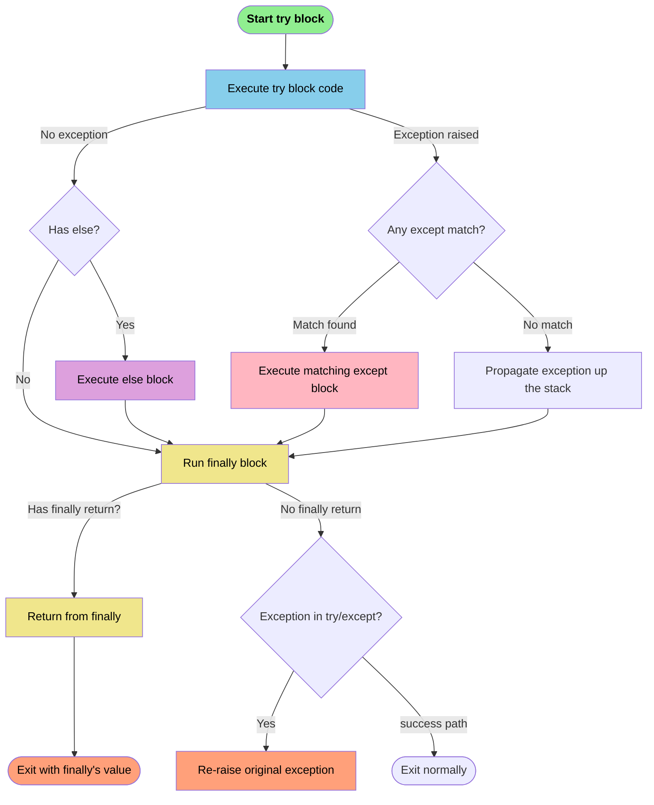
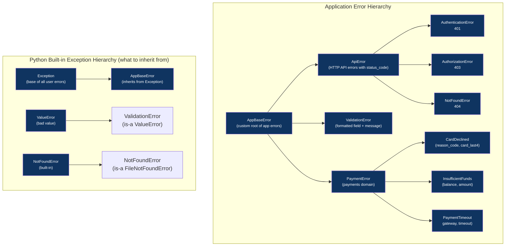
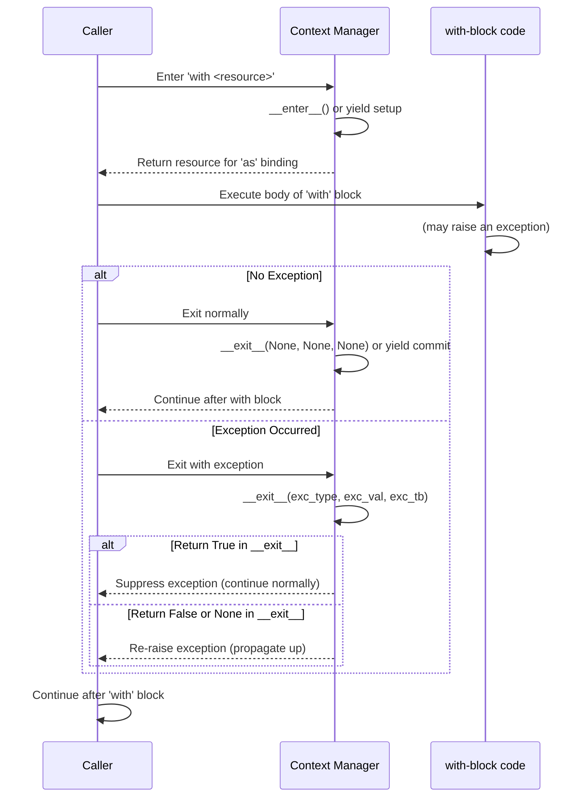
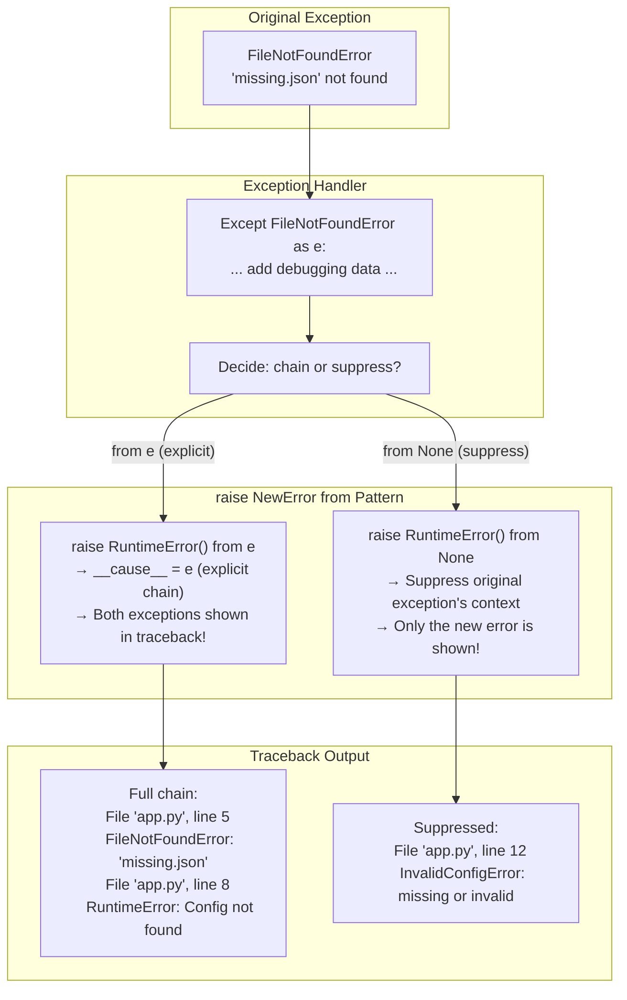
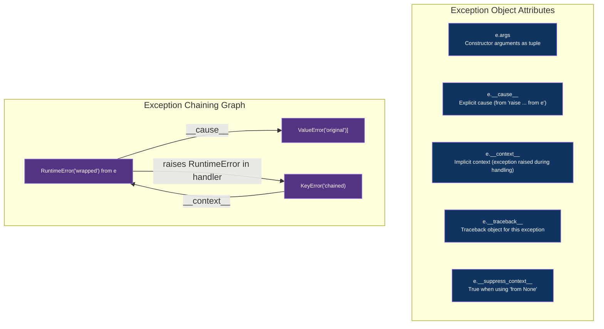

# Module 07 — Exception Handling & Context Managers 

> **For TypeScript developers**: Python's exception system is far richer than JavaScript's `try/catch`. Python has a complete exception hierarchy, `else` clauses, `raise ... from` chaining, context managers (`with`), `suppress()`, exception groups, the warning system, and structured error handling patterns that have no direct equivalents in TypeScript. This module covers every facet with exhaustive TypeScript vs Python comparisons.

## Table of Contents

- [1. Exception Hierarchy — Complete Reference](#1-exception-hierarchy--complete-reference)
  - [1.1 TypeScript vs Python: Error Handling Model](#11-typescript-vs-python-error-handling-model)
  - [1.2 Complete Python Exception Hierarchy (60+ Built-in Exceptions)](#12-complete-python-exception-hierarchy-60-built-in-exceptions)
  - [1.3 How Exception Lookup Works — The Linear Scanning Rule](#13-how-exception-lookup-works--the-linear-scanning-rule)
  - [1.4 Mermaid: Python Exception Hierarchy Tree](#14-mermaid-python-exception-hierarchy-tree)
- [2. try/except/else/finally — Full Anatomy with TypeScript Comparison](#2-tryexceptelsefinally--full-anatomy-with-typescript-comparison)
  - [2.1 Every try/except Pattern (Exhaustive Variants)](#21-every-tryexcept-pattern-exhaustive-variants)
  - [2.2 Why the `else` Clause Matters (Critical Concept!)](#22-why-the-else-clause-matters-critical-concept)
  - [2.3 else vs finally — When to Use Each](#23-else-vs-finally--when-to-use-each)
  - [2.4 Return Inside try/except/else/finally — Execution Order](#24-return-inside-tryexceptelsefinally--execution-order)
  - [2.5 Mermaid: Exception Flow Through try/except/else/finally](#25-mermaid-exception-flow-through-tryexceptelsefinally)
- [3. Custom Exceptions — Design Patterns](#3-custom-exceptions--design-patterns)
  - [3.1 TypeScript Custom Error vs Python Custom Exception (Side-by-Side)](#31-typescript-custom-error-vs-python-custom-exception-side-by-side)
  - [3.2 Exception Base Classes — When to Inherit from What](#32-exception-base-classes--when-to-inherit-from-what)
  - [3.3 Custom Exception Design Patterns (5 Patterns)](#33-custom-exception-design-patterns-5-patterns)
  - [3.4 Exception Factory Functions](#34-exception-factory-functions)
  - [3.5 Mermaid: Exception Hierarchy Design](#35-mermaid-exception-hierarchy-design)
- [4. Context Managers (`with` Statement) — Deep Dive](#4-context-managers-with-statement--deep-dive)
  - [4.1 TypeScript Resource Management vs Python `with`](#41-typescript-resource-management-vs-python-with)
  - [4.2 Class-Based Context Manager](#42-class-based-context-manager)
  - [4.3 Generator-Based Context Manager (@contextlib.contextmanager)](#43-generator-based-context-manager-contextlibcontextmanager)
  - [4.4 Nested Context Managers & ExitStack Pattern](#44-nested-context-managers--exitstack-pattern)
  - [4.5 Async Context Managers (`async with`)](#45-async-context-managers-async-with)
  - [4.6 Mermaid: Context Manager Lifecycle](#46-mermaid-context-manager-lifecycle)
- [5. Exception Chaining & Annotations (`from`, `raise ... from`)](#5-exception-chaining--annotations-raise--from)
  - [5.1 Implicit vs Explicit Chaining](#51-implicit-vs-explicit-chaining)
  - [5.2 raise ... from Pattern Deep Dive](#52-raise--from-pattern-deep-dive)
  - [5.3 Mermaid: Exception Chaining Diagram](#53-mermaid-exception-chaining-diagram)
- [6. Error Recovery Strategies](#6-error-recovery-strategies)
  - [6.1 Retry with Exponential Backoff](#61-retry-with-exponential-backoff)
  - [6.2 Circuit Breaker Pattern](#62-circuit-breaker-pattern)
  - [6.3 Fallback Chain Pattern](#63-fallback-chain-pattern)
- [7. Warning System (`warnings` module)](#7-warning-system-warnings-module)
- [8. Traceback Manipulation](#8-traceback-manipulation)
- [9. Exception Attributes Reference](#9-exception-attributes-reference)
  - [9.1 Complete Exception Attribute Table](#91-complete-exception-attribute-table)
  - [9.2 Mermaid: Exception Attributes Relationship](#92-mermaid-exception-attributes-relationship)
- [10. Structured Error Handling Patterns](#10-structured-error-handling-patterns)
- [11. Exception Annotation Best Practices](#11-exception-annotation-best-practices)
- [12. Key Notes & Important Factors](#12-key-notes--important-factors)
- [13. Quizzes (20+ Questions with Answers)](#13-quizzes-20-questions-with-answers)
- [14. Exercises (15+ with Solutions)](#14-exercises-15-with-solutions)

---

## 1. Exception Hierarchy — Complete Reference

### 1.1 TypeScript vs Python: Error Handling Model

The fundamental difference between TypeScript and Python's error handling is philosophical: TypeScript uses a **flat** model where everything caught in `catch` is a single `unknown` type you must narrow with `instanceof`. Python uses a **hierarchical** model where exceptions are classes that inherit from each other, and the interpreter automatically walks up the inheritance chain to find a matching `except` block.

```typescript
// TypeScript: flat hierarchy — everything is caught as 'unknown' (since TS 4.4)
// You MUST narrow with instanceof checks — no automatic dispatch!
try {
  throw new TypeError("invalid type");
} catch (e: unknown) {
  // e is ALWAYS unknown — never Error directly
  if (e instanceof TypeError) {
    console.error(e.message);          // Narrow first, then access properties
  } else if (e instanceof RangeError) {
    console.error(e.message);
  } else if (e instanceof CustomError) {
    console.error((e as CustomError).code);  // Also needs 'as' cast!
  } else {
    console.error("Unknown error:", e);
  }
}

// TypeScript has NO equivalent for:
// - 'else' clause (execute only on success)
// - Exception chaining with custom context
// - Context managers (automatic resource cleanup)
// - Warning system
// - Multiple exception capture
```

```python
# Python: rich hierarchy — automatic dispatch by inheritance!
try:
    raise TypeError("invalid type")
except TypeError as e:                   # Caught directly! No isinstance() needed.
    print(f"Type error: {e}")            # e is the exception object itself.
except RangeError as e:                    # Next in chain — automatically checked!
    print(f"Range error: {e}")           # Python walks up the MRO automatically.
except ValueError as e:
    print(f"Value error: {e}")

# Python's 'else' clause — unique to Python, no TS equivalent!
try:
    config = load_config()               # May raise FileNotFoundError
except FileNotFoundError:
    handle_missing_file()
else:                                    # ONLY runs if NO exception in try!
    validate(config)                     # Errors from validate() propagate out.

# Python's context manager — automatic resource cleanup, no TS equivalent!
with open("data.json") as f:            # __enter__ called on open(), __exit__ on close().
    data = json.load(f)                  # File always closed, even on exception.
```

#### More TypeScript vs Python Comparisons

**Catching Specific Exceptions:**

```typescript
// TypeScript: manual narrowing with instanceof
try {
  const result = JSON.parse(invalidJson);
} catch (e) {
  if (e instanceof SyntaxError) {       // Must check type manually!
    console.log("Bad JSON:", e.message);
  } else if (e instanceof TypeError) {  // More manual checking!
    console.log("Type issue:", e.message);
  } else {                              // Catch-all for unknown errors
    console.error("Unexpected:", e);
  }
}

// Python: automatic dispatch by exception class hierarchy
try:
    result = json.loads(invalid_json)   # May raise JSONDecodeError (subclass of ValueError)
except ValueError as e:                  # Automatically catches JSONDecodeError!
    print(f"Bad JSON: {e}")              # No isinstance() needed — automatic!
```

**Multi-Catch in TypeScript (ES2019+) vs Python:**

```typescript
// TypeScript: separate try/catch per type, or manual narrowing
try {
  JSON.parse(invalid);
} catch (e) {
  if (e instanceof SyntaxError) {
    handleError(e);
  } else {
    rethrow;                            // Cannot easily re-throw selectively!
  }
}

// Python: ordered except blocks — clean and explicit
try:
    json.loads(invalid)
except json.JSONDecodeError as e:        # Most specific first
    handle_error(e)
except Exception as e:                   # Catch-all last
    raise                                # Re-throw if we don't handle it
```

**Throwing Custom Errors:**

```typescript
// TypeScript: custom error with 'new.target.prototype' for correct prototype chain
class AppError extends Error {
  public readonly code: string;
  
  constructor(message: string, code: string) {
    super(message);
    this.name = "AppError";
    Object.setPrototypeOf(this, new.target.prototype);  // Required for instanceof!
    this.code = code;
  }
}

try {
  throw new AppError("user not found", "NOT_FOUND");
} catch (e) {
  if (e instanceof AppError) {
    console.error(`[${e.code}] ${e.message}`);
  }
}
```

```python
# Python: custom exception — simple class inheritance, automatic prototype chain
class AppError(Exception):
    """Base application error with code attribute."""
    
    def __init__(self, message: str, code: str = "UNKNOWN") -> None:
        super().__init__(message)         # Message stored in args[0] automatically
        self.code = code                  # Custom attribute — always available!
        self.timestamp = datetime.now()   # Any custom attribute works!

try:
    raise AppError("user not found", "NOT_FOUND")
except AppError as e:                    # Automatically caught by inheritance!
    print(f"[{e.code}] {e}")             # str(e) returns the message automatically.
```

**Global Error Handler:**

```typescript
// TypeScript: process-level error handling
process.on("uncaughtException", (err) => {
  console.error("Uncaught:", err);
});

process.on("unhandledRejection", (reason) => {
  console.error("Unhandled rejection:", reason);
});
```

```python
# Python: sys.excepthook + signal handlers for process-level handling
import sys, signal

def uncaught_handler(exc_type, exc_value, exc_tb):
    """Catch ALL unhandled exceptions — like 'uncaughtException' in Node.js."""
    print(f"Uncaught {exc_type.__name__}: {exc_value}")
    
sys.excepthook = uncaught_handler        # Set the global handler

# Also handle signals (like process.on('SIGINT'))
def signal_handler(signum, frame):
    print(f"Received signal {signum}")

signal.signal(signal.SIGINT, signal_handler)
```

---

### 1.2 Complete Python Exception Hierarchy (60+ Built-in Exceptions)

Here is the complete built-in exception hierarchy, organized by category, with every exception name, when it's raised, and how to catch it.

#### BaseLevel — The Root

All exceptions inherit from `BaseException`, which has 4 direct children:

```
BaseException                         ← ROOT of EVERYthing in Python
├── SystemExit                       # Raised by sys.exit() — don't catch!
├── KeyboardInterrupt                # Raised when user presses Ctrl+C
├── GeneratorExit                    # Raised when generator closes (internal)
└── Exception                        ← EVERY user-level exception inherits from here
```

#### Category 1: ArithmeticError (Math Errors)

```python
# All inherit from ArithmeticError
ArithmeticError
├── ZeroDivisionError                # division / modulo by zero — like TS: RangeError for out-of-bounds math
│                                   #   raise ZeroDivisionError("division by zero")
├── OverflowError                    # float overflow — e.g., 10 ** 1000 with limits
│                                   #   raise OverflowError("result too large")
└── FloatingPointError               # floating point operation failed (rare, C-level)
```

**When caught:**

```python
try:
    x = 1 / 0
except ZeroDivisionError as e:
    print(f"Can't divide by zero: {e}")           # "division by zero"
```

#### Category 2: AssertionError

```python
# Single exception in this category
AssertionError                           # Raised when assert statement fails
                                     #   assert condition, "error message"
                                     # If condition is False → AssertionError raised
```

**When caught:**

```python
try:
    assert x > 0, "x must be positive"    # If False, raises AssertionError
except AssertionError as e:
    print(f"Assert failed: {e}")           # "x must be positive"
```

#### Category 3: AttributeError (Object Attribute Errors)

```python
# Single exception in this category
AttributeError                           # Raised when object doesn't have an attribute
                                     #   obj.nonexistent          → AttributeError
                                     #   setattr(obj, name, val) if name invalid
```

**When caught:**

```python
try:
    obj = []
    obj.missing_method()                # List has no 'missing_method'
except AttributeError as e:
    print(f"Missing attr: {e}")         # "'list' object has no attribute 'missing_method'"
```

#### Category 4: EOFError (File-Related)

```python
# Single exception in this category
EOFError                                 # Raised by input() when EOF reached without data
                                     #   read() on file returns '' → EOFError on next read attempt
```

**When caught:**

```python
try:
    data = os.read(fd, 1)              # Returns b'' at EOF
    if not data: raise EOFError("End of input")
except EOFError as e:
    print(f"Input ended: {e}")
```

#### Category 5: ImportError (Module Loading Errors)

```python
ImportError                              # Module/import fails
└── ModuleNotFoundError                # Specific: the module doesn't exist (Python 3.6+)
                                     #   from nonexistent_module import something
                                     #   import nonexistent_package
```

**When caught:**

```python
try:
    import nonexistent_module as mod     # Module doesn't exist
except ModuleNotFoundError as e:         # More specific — catches only missing modules
    print(f"Missing module: {e.name}")   # "nonexistent_module"
except ImportError as e:                 # Broader — also catches partial import failures
    print(f"Import failed: {e}")
```

#### Category 6: LookupError (Lookup / Key/Index Errors)

```python
LookupError                              # Base for all lookup failures
├── KeyError                             # dict[key] where key doesn't exist
│                                   #   d = {}; d['missing'] → KeyError
├── IndexError                           # list/tuple[bad_index] — out of range
│                                   #   lst = []; lst[0] → IndexError
```

**When caught:**

```python
# KeyError — dict key missing
try:
    config = {}
    value = config['missing_key']       # Raises KeyError('missing_key')
except KeyError as e:
    print(f"Missing key: {e.args[0]}")  # "missing_key" — the actual key that was missing!

# IndexError — list index out of range
try:
    lst = [1, 2, 3]
    value = lst[10]                     # Raises IndexError("list index out of range")
except IndexError as e:
    print(f"Index error: {e}")
```

#### Category 7: MemoryError (Memory Exhaustion)

```python
# Single exception in this category
MemoryError                              # Out of memory — can't allocate more
                                     #   lst = [0] * (10 ** 12)  # Try to allocate too much
```

**When caught:**

```python
try:
    large_list = [0] * (10**13)        # May raise MemoryError
except MemoryError as e:
    print("Out of memory! Free some resources.")
```

#### Category 8: NameError (Undefined Names)

```python
NameError                                # Variable name doesn't exist in scope
└── UnboundLocalError                    # Local variable referenced before assignment
                                     #   def f(): print(x); x = 1  → UnboundLocalError
```

**When caught:**

```python
try:
    print(undefined_variable)           # NameError: name 'undefined_variable' is not defined
except NameError as e:
    print(f"Undefined name: {e.name}")  # "undefined_variable"
```

#### Category 9: OSError (OS-Level Errors — Largest Category!)

```python
OSError                                  # Base for all OS-level errors
├── BlockingIOError                      # Non-blocking I/O would block
├── BrokenPipeError                      # Pipe broken during operation
├── ChildProcessError                    # Child process error
├── FileExistsError                      # File/dir already exists (mkdir fails)
├── FileNotFoundError                    # File/dir not found — like fs.existsSync === false in TS
│                                   #   open('nonexistent.txt') → FileNotFoundError
├── IsADirectoryError                    # Tried to open directory as file
├── NotADirectoryError                   # Expected dir but got file
├── PermissionError                      # OS-level permission denied (chmod, access)
├── ProcessLookupError                   # Invalid process ID
├── TimeoutError                         # Operation timed out (os-level)
```

**When caught:**

```python
# FileNotFoundError — file doesn't exist
try:
    f = open('nonexistent.txt')
except FileNotFoundError as e:
    print(f"File not found: {e.filename}")  # "nonexistent.txt"

# PermissionError — no access
try:
    os.chmod('/root/protected_file', 0o777)
except PermissionError as e:
    print(f"No permission: {e}")
```

#### Category 10: RuntimeError (General Runtime Errors)

```python
RuntimeError                             # Generic runtime error — catch-all for unexpected issues
├── RecursionError                       # Maximum recursion depth exceeded
│                                   #   def f(): return f()  → RecursionError
├── StopAsyncIteration                   # Async iterator exhausted
└── StopIteration                        # Iterator exhausted (internal to generators/next())
                                     #   next() on empty iterator raises StopIteration
```

**When caught:**

```python
# RecursionError — infinite recursion
try:
    def factorial(n):
        return n * factorial(n - 1)     # No base case! Infinite recursion.
    factorial(1000)                      # Raises RecursionError at ~1000 depth
except RecursionError as e:
    print("Too many recursive calls!")

# StopIteration — consumed iterator (don't usually catch manually)
try:
    it = iter([])
    next(it)                             # Raises StopIteration immediately
except StopIteration:                    # Usually handled by 'for' loops automatically
    print("Iterator exhausted")
```

#### Category 11: SyntaxError / CompileError (Code Structure Errors)

```python
SyntaxError                              # Code has syntax errors — caught at parse time!
├── IndentationError                     # Bad indentation
│   ├── TabError                         # Inconsistent tabs/spaces
│   └── IndentationError               # Wrong indentation level
└── TabnannyError                        # Mixed tabs and spaces
```

**Note:** These are caught at **parse time**, not runtime. You can't catch them with try/except unless they come from `eval()` or `compile()`.

#### Category 12: TypeError (Wrong Type)

```python
TypeError                                # Wrong type for operation — like TS: TypeError
                                     #   int + str          → TypeError
                                     #   "hello"(1)         → TypeError (calling non-callable)
                                     #   func(required_arg) → TypeError (missing required argument)
```

**When caught:**

```python
try:
    result = 1 + "two"                # Can't add int and str in Python
except TypeError as e:
    print(f"Type mismatch: {e}")       # "unsupported operand type(s) for +: 'int' and 'str'"

# Also catches missing arguments
try:
    def greet(name, greeting): pass
    greet()                             # Missing 2 required positional args
except TypeError as e:
    print(f"Function error: {e}")      # "greet() missing 2 required positional arguments"
```

#### Category 13: ValueError (Wrong Value)

```python
ValueError                               # Right type, wrong value — like custom Error in TS
├── UnicodeError                         # Unicode encoding/decoding error
│   ├── UnicodeDecodeError               # Can't decode bytes to str
│   ├── UnicodeEncodeError               # Can't encode str to bytes
│   └── UnicodeTranslateError            # Can't translate between encodings
└── (Many more — any ValueError subclass defined by third-party libs)
```

**When caught:**

```python
# ValueError — wrong value
try:
    int("not_a_number")               # Raises ValueError("invalid literal for int()")
except ValueError as e:
    print(f"Value error: {e}")         # "invalid literal for int() with base 10: 'not_a_number'"

# UnicodeDecodeError — can't decode bytes
try:
    b'\xff\xfe'.decode('utf-8')       # Invalid UTF-8 sequence
except UnicodeDecodeError as e:
    print(f"Encoding error: {e.reason}")  # "invalid start byte"
```

#### Category 14: Warning Categories (Not Exceptions — But Related!)

```python
# These are NOT exceptions — they're warning categories in the warnings module.
# They can become exceptions with warnings.simplefilter("error")
Warning
├── UserWarning                          # Default category — user-generated warning
├── DeprecationWarning                   # Feature will be removed (hidden by default!)
├── PendingDeprecationWarning            # Will be deprecated in future
├── SyntaxWarning                        # Questionable syntax (shown at runtime)
├── RuntimeWarning                       # Questionable runtime behavior
├── FutureWarning                        # Behavior changed (affects end users)
├── ImportWarning                        # Questionable import (hidden by default!)
├── UnicodeWarning                       # Unicode-related warning
├── BytesWarning                         # Bytes-related warning
├── ResourceWarning                      # Resource usage concern (hidden by default!)
└── ExceptionGroup / ExceptionGroup[BaseException]  # Python 3.11+ — multiple exceptions at once!
```

---

### 1.3 How Exception Lookup Works — The Linear Scanning Rule

When you `raise` an exception, Python walks the MRO (Method Resolution Order) of the exception class to find a matching `except` block. This is **automatic dispatch** — no `instanceof` needed!

```python
class AppError(Exception):              # Inherits from Exception via its MRO: AppError → Exception → BaseException
    pass

class AuthError(AppError):               # AuthError's MRO: AuthError → AppError → Exception → BaseException
    pass

try:
    raise AuthError("not logged in")
except AuthError:                       # Match! Catches AuthError directly.
    print("Caught as AuthError")

# But if we only catch the parent, it still works (automatic dispatch up MRO):
try:
    raise AuthError("not logged in")
except AppError:                        # No explicit AuthError handler needed!
    print("Caught as parent class — automatic dispatch!")  # Works because AuthError → AppError

# And the grandparent catches it too:
try:
    raise AuthError("not logged in")
except Exception:                       # Even Exception catches it!
    print("Caught by general Exception handler")
```

---

### 1.4 Mermaid: Python Exception Hierarchy Tree

```mermaid
flowchart TD
    BE["BaseException"] --> SE["SystemExit\nsys.exit()"]
    BE --> KI["KeyboardInterrupt\nCtrl+C"]
    BE --> GE["GeneratorExit\ngenerator close"]
    BE --> EX["Exception\nALL user errors inherit here!"]

    EX --> AE["ArithmeticError"]
    AE --> ZDE["ZeroDivisionError\n1/0"]
    AE --> OE["OverflowError\nfloat overflow"]
    AE --> FPE["FloatingPointError\ncalculation error"]

    EX --> ASR["AssertionError\nassert failed"]

    EX --> ATE["AttributeError\nobj.attr missing"]

    EX --> ERE["EOFError\nend of input"]

    EX --> IM["ImportError"]
    IM --> MNE["ModuleNotFoundError\nimport failed"]

    EX --> LE["LookupError"]
    LE --> KE["KeyError\ndict key missing"]
    LE --> IE["IndexError\nlist index out of range"]

    EX --> ME["MemoryError\nout of memory"]

    EX --> NE["NameError\nundefined name"]
    NE --> ULE["UnboundLocalError\nlocal var unbound"]

    EX --> OSR["OSError\nOS-level errors"]
    OSR --> FNF["FileNotFoundError\nfile not found"]
    OSR --> PE["PermissionError\naccess denied"]
    OSR --> FEE["FileExistsError\nalready exists"]
    OSR --> IDY["IsADirectoryError\ndir opened as file"]
    OSR --> NDE["NotADirectoryError\nexpected dir, got file"]

    EX --> RE["RuntimeError\ngeneric runtime error"]
    RE --> RC["RecursionError\ntoo deep recursion"]
    RE --> SAI["StopAsyncIteration\nasync iter exhausted"]
    RE --> SI["StopIteration\niter exhausted"]

    EX --> SYR["SyntaxError\nparse error"]
    SYR --> IDE["IndentationError\nbad indent"]

    EX --> TYE["TypeError\nwrong type"]

    EX --> VE["ValueError\nwrong value"]
    VE --> UE["UnicodeError\nunicode issue"]
    UE --> UDE["UnicodeDecodeError\ncan't decode"]
    UE --> UEE["UnicodeEncodeError\ncan't encode"]

    classDef root fill:#1a1a2e,color:#fff,font-size:14px
    classDef base fill:#0f3460,color:#fff,font-size:12px
    classDef catchable fill:#16213e,color:#e94560,font-size:10px
    class BE root
    class EX,AE,LE,OSR,RE base
    class SE,KI,GE,AAS,ATE,ERE,IM,ME,NE,SYS,TYE,VE catchable
```



---

## 2. try/except/else/finally — Full Anatomy with TypeScript Comparison

### 2.1 Every try/except Pattern (Exhaustive Variants)

Python's `try/except` has **every possible variant** documented below. Compare each directly to its TypeScript equivalent.

#### Pattern 1: Bare `except` (Catch Everything Except SystemExit/KeyboardInterrupt)

```typescript
// TypeScript: catches everything including Error subclasses
try {
  dangerousOperation();
} catch (e: unknown) {              // Must use 'unknown' in TS 4.4+
  console.error("Something failed:", e);
}
```

```python
# Python: catches every Exception subclass — NOT SystemExit/KeyboardInterrupt!
try:
    dangerous_operation()
except Exception as e:               # General catch-all (like TypeScript's catch(e))
    print(f"Failed: {type(e).__name__}: {e}")
    # Do NOT do bare 'except:' — it catches EVERYTHING including Ctrl+C!
```

#### Pattern 2: Multiple `except` Blocks (Ordered Most Specific to Least General)

```typescript
// TypeScript: manual type narrowing with instanceof
try {
  parseData(rawInput);
} catch (e) {
  if (e instanceof SyntaxError) {   // First check — most specific!
    console.error("Syntax issue");
  } else if (e instanceof TypeError) {
    console.error("Type issue");
  } else if (e instanceof RangeError) {
    console.error("Range issue");
  } else {                          // Catch-all
    console.error("Unknown error:", e);
  }
}
```

```python
# Python: ordered except blocks — automatic dispatch by MRO!
try:
    parse_data(raw_input)
except SyntaxError as e:             # Most specific first (must come before Exception!)
    print(f"Syntax issue: {e}")
except TypeError as e:               # Next specific error
    print(f"Type issue: {e}")
except RangeError as e:              # Another specific error
    print(f"Range issue: {e}")
except Exception as e:               # Catch-all last (like TypeScript's else)
    print(f"Unknown: {type(e).__name__}: {e}")
```

#### Pattern 3: Multi-Except — One Block Handles Multiple Types

```python
# Python: tuple of exception types in single except
try:
    result = compute(x, y)
except (KeyError, IndexError, TypeError) as e:   # Handle multiple types in one block!
    print(f"Collection/Type error: {e}")           # Catches ANY of these three types.

# TypeScript equivalent — would require manual instanceof checks for each type
// try { compute(x, y); } catch (e) {
//   if (e instanceof KeyError || e instanceof TypeError) handle(e);
// }
```

#### Pattern 4: `except` with Variable Binding (`as`)

```python
# Python: capture exception instance to inspect custom attributes!
try:
    raise ValidationError("email", "invalid format", "@not_valid")
except ValidationError as e:                    # 'e' is the ValidationError instance
    print(f"Field: {e.field}")                   # Access custom attribute!
    print(f"Value: {e.value}")                    # Access another!
    print(f"Message: {str(e)}")                   # str() gives the message.

# TypeScript equivalent — requires 'as' cast to access custom properties
// try { throw new ValidationError("email", ...); } catch (e) {
//   if (e instanceof ValidationError) {
//     console.log((e as ValidationError).field);  // Needs 'as' cast!
//   }
// }
```

#### Pattern 5: `try/except/else` (Python-Only — No TypeScript Equivalent!)

```python
# Python: else runs ONLY if no exception in try block
try:
    config = load_config()              # This might raise FileNotFoundError
except FileNotFoundError:
    print("Config not found")
else:                                   # ONLY if load_config() succeeded!
    validate(config)                    # If this fails, it propagates (not caught above!)
    process(config)                     # Success path — executed only when try block completes without error.

# TypeScript equivalent — requires manual flag tracking or nested try/catch
// let success = false;
// try { config = loadConfig(); success = true; } catch(e) {}
// if (success) { validate(config); process(config); }
```

#### Pattern 6: `try/except/finally` (No Exception Handling — Just Cleanup)

```python
# Python: execute cleanup code regardless of what happens
connection = None
try:
    connection = db.connect()          # May raise ConnectionError
    result = connection.query("SELECT ...")  # May raise DatabaseError
except DatabaseError as e:
    print(f"Query failed: {e}")        # Handle the error...
finally:                                # ALWAYS runs! Even if return/break in except.
    if connection:                      # Safe cleanup — connection might be None if connect() failed.
        connection.close()              # Always close! No matter what.
```

```typescript
// TypeScript equivalent — same concept with try/finally
let connection: DbConnection | null = null;
try {
  connection = await db.connect();    // May throw ConnectionError
  result = await connection.query("SELECT ...");  // May throw DatabaseError
} catch (e) {
  console.error(`Query failed: ${e}`);
} finally {
  if (connection) connection.close();  // Always runs! Same as Python's finally.
}
```

#### Pattern 7: `try/except/else/finally` — The Complete Combo

```python
# Python: everything together — the most complete error handling pattern!
connection = None
try:
    config = load_config()            # Might raise FileNotFoundError, JSONDecodeError
except FileNotFoundError:
    handle_missing_config()
    return                            # Skip to finally below!
else:                                   # ONLY if no exception in try block:
    validate(config)                  # Validate the loaded config
    connection = db.connect(config)   # Connect to database
    result = execute_query(connection)  # Execute the query

finally:                                # ALWAYS runs (last thing before returning/propagating):
    if connection:
        connection.close()            # Clean up regardless of success or failure.
```

```typescript
// TypeScript: equivalent — but more verbose because no 'else' clause!
let configLoaded = false;
let connection: DbConnection | null = null;
try {
  config = loadConfig();              // Might throw
  configLoaded = true;                // Manual flag tracking needed!
} catch (e) {
  if (e instanceof FileNotFoundError) {
    handleMissingConfig();
    return;                           // Still runs finally!
  }
}

if (configLoaded) {                   // Manual success check — not elegant!
  validate(config);
  connection = await db.connect(config);
  result = await executeQuery(connection);
}

// Finally still runs in TypeScript:
cleanup();  // Always runs at the end, regardless of what happened above.
```

#### Pattern 8: Bare `except` (Catch Everything — Dangerous!)

```python
# Python: bare except catches EVERYTHING including KeyboardInterrupt and SystemExit!
# ⚠️ DANGEROUS — use only when absolutely necessary!
try:
    risky_operation()
except:                                # Catches everything — even Ctrl+C is swallowed!
    print("Something failed (we don't know what)")

# NEVER do this in production code. Always at least 'except Exception':
try:
    risky_operation()
except Exception:                    # Still catches every user-level exception but not SystemExit/KeyboardInterrupt!
    print("An exception occurred")
```

#### Pattern 9: `except` with Tuple of Types (Multi-Type Handling)

```python
# Python: catch multiple specific types in a single block
try:
    result = compute(x, y)
except (KeyError, IndexError, TypeError) as e:    # Handles any of these three exception types!
    error_type = type(e).__name__               # Get which one actually fired.
    print(f"Collection or type error ({error_type}): {e}")

# TypeScript equivalent — requires manual instanceof checks for each
// try { compute(x, y); } catch (e) {
//   if (e instanceof Error && (e.name === 'KeyError' || e.name === 'IndexError')) handle(e);
// }
```

#### Pattern 10: `except` with Custom Base Class Inheritance Chain

```python
# Python: custom exception hierarchy — parent class catches all children automatically!
class AppError(Exception):              # Base for app-level errors
    pass

class NotFoundError(AppError):          # Inherits from AppError
    def __init__(self, entity: str) -> None:
        self.entity = entity            # Custom attribute!
        super().__init__(f"{entity} not found")

class ValidationError(AppError):       # Also inherits from AppError
    def __init__(self, field: str, msg: str) -> None:
        self.field = field             # Custom attribute!
        super().__init__(f"{field}: {msg}")

# Now catching AppError catches ALL of its subclasses automatically!
try:
    raise NotFoundError("user")
except AppError as e:                   # Catches NotFoundError because it inherits from AppError!
    if hasattr(e, 'entity'):            # Check if the specific attribute exists.
        print(f"Entity '{e.entity}' was not found")  # "Entity 'user' was not found"
```

---

### 2.2 Why the `else` Clause Matters (Critical Concept!)

The `else` clause is **unique to Python** and solves a critical problem that TypeScript developers solve with manual flags: separating code that *might raise* from code that *should succeed*.

#### The Problem Without `else`:

```python
# BAD — errors from validate_config() get caught by the except block!
try:
    config = load_config()              # Only this should raise FileNotFoundError
    validate_config(config)             # If THIS raises ValidationError, it's caught too! ← BUG!
except FileNotFoundError:               # Catches ONLY FileNotFoundError.
    handle_missing_file()

# The bug: if validate_config() raises ValidationError, the except block catches it
# because ValidationError is not FileNotFoundError — so it propagates.
# But if someone later adds another except to handle both, they might accidentally catch
# errors from validate_config() that should propagate!
```

#### The Fix With `else`:

```python
# GOOD — else ensures only load_config()'s exceptions are caught!
try:
    config = load_config()              # Only this might raise FileNotFoundError
except FileNotFoundError:               # Catches ONLY load_config()'s errors.
    handle_missing_file()
else:                                   # If load_config() succeeded, validate it.
    try:
        validate_config(config)         # If THIS raises ValidationError, it propagates out!
    except ValidationError as e:
        log_validation_error(e)         # Handle validation separately!

# The 'else' + nested try ensures different error sources have separate handlers.
```

#### More Examples of Why `else` Matters:

```python
# Example 1: Different error types should be handled differently.
try:
    config = load_config()              # May raise FileNotFoundError
except FileNotFoundError:
    log_missing_config()
else:
    data = parse(config)               # May raise JSONDecodeError — NOT caught by above!
    if not data:
        raise ValueError("Empty config")  # Propagates up, not caught!

# Example 2: Success notification
try:
    result = api_call()
except ConnectionError:
    log_offline()
else:
    print(f"Request succeeded with status {result.status_code}")  # Only on success!

# Example 3: Prevent accidentally catching errors from too much code in try block.
def safe_load(path: str) -> dict:
    try:
        file = open(path)              # May raise FileNotFoundError
        content = file.read()           # May raise OSError
        return json.loads(content)      # May raise JSONDecodeError — all three caught!
    except (FileNotFoundError, OSError, json.JSONDecodeError):
        return {}                        # Fallback to empty dict.

# The above works because we catch the specific tuple of exceptions.
# But with else, we could separate them more cleanly:
def safe_load_clean(path: str) -> dict:
    try:
        file = open(path)              # Only FileNotFoundError caught below.
    except FileNotFoundError:
        return {}
    else:                              # Now validate the content separately!
        try:
            content = file.read()
            return json.loads(content)
        except (OSError, json.JSONDecodeError):
            return {}                  # Handle parse errors separately.
```

---

### 2.3 `else` vs `finally` — When to Use Each

| Feature | `else` | `finally` |
|---------|--------|-----------|
| **When runs** | Only if NO exception in `try` | ALWAYS (even with return, break, exception) |
| **Purpose** | Success path code | Cleanup/always-run code |
| **Can raise exceptions** | Yes — they propagate OUT | Yes — but may suppress the original exception! |
| **TypeScript equivalent** | None! (requires manual flag) | `finally` block (same!) |
| **Can access try variables** | Yes (they must exist if no exception) | Yes (scoped to outer try/except) |

```python
# else = success path — use for code that depends on try succeeding
try:
    config = load_config()
except FileNotFoundError:
    handle_missing_file()
else:                                    # Success! Config loaded.
    data = validate_and_process(config)  # Process only if load succeeded.

# finally = cleanup — use for always-run code
connection = None
try:
    connection = db.connect()
    result = connection.query("SELECT * FROM users")
except DatabaseError as e:
    log_error(e)
finally:                                 # Always close!
    if connection:
        connection.close()               # Cleanup happens no matter what.

# Combining both:
connection = None
try:
    config = load_config()
except FileNotFoundError:
    return
else:                                    # Success path
    connection = db.connect(config)      # Now connect safely.
    result = execute_query(connection)   # Execute successfully.

finally:                                 # Cleanup (always runs):
    if connection:
        connection.close()               # Close the connection regardless of outcome.
```

---

### 2.4 Return Inside `try/except/else/finally` — Execution Order

This is critical: **`finally` ALWAYS executes, even when there's a `return` inside `try`, `except`, or `else`.** If both `except/else` and `finally` have returns, the `finally` return wins!

```python
def demo_return_in_finally():
    try:
        print("In try")
        return "from_try"                # Will this return? Let's see...
    except Exception:
        print("In except")               # Won't execute (no exception)
        return "from_except"
    else:
        print("In else")                 # Won't execute (exception raised in try)
        return "from_else"
    finally:
        print("In finally")              # ALWAYS executes! Even before any return.
        return "from_finally"            # This return OVERWRITES the try return!

result = demo_return_in_finally()
# Output:
#   In try
#   In finally
# result → "from_finally" (finally's return wins!)
```

```python
def demo_finally_doesnt_suppress():
    try:
        raise ValueError("error in try")  # This exception should propagate.
    except ValueError as e:
        print(f"Caught: {e}")             # Caught and handled.
        return "handled"                   # Return after handling.
    finally:
        print("Always runs!")              # Runs before the return above.

result = demo_finally_doesnt_suppress()
# Output:
#   Caught: error in try
#   Always runs!
# result → "handled" (finally's code ran, but it didn't return, so try's return wins)
```

#### More Complex Return Scenarios:

```python
def complex_return():
    try:
        return 1                         # Step 1: prepare to return 1
    except ValueError:                   # Won't execute (no exception)
        return 2
    finally:
        print("finally")                 # Step 2: finally always runs!
        return 3                         # Step 3: finally's return overwrites try's return!

# Result: "finally" printed, function returns 3.
print(complex_return())  # → "finally" then 3
```

---

### 2.5 Mermaid: Exception Flow Through `try/except/else/finally`



---

## 3. Custom Exceptions — Design Patterns

### 3.1 TypeScript Custom Error vs Python Custom Exception (Side-by-Side)

#### Pattern: Simple Custom Error with Code

```typescript
// TypeScript: custom error with additional properties
class AppError extends Error {
  public readonly code: string;
  public readonly statusCode: number;

  constructor(message: string, code: string = "UNKNOWN", statusCode: number = 500) {
    super(message);
    this.name = "AppError";
    Object.setPrototypeOf(this, new.target.prototype);
    this.code = code;
    this.statusCode = statusCode;
  }
}

// Usage in service layer
class UserService {
  async findByEmail(email: string): Promise<User> {
    const user = await db.users.findOne({ email });
    if (!user) {
      throw new AppError(`User not found: ${email}`, "NOT_FOUND", 404);
    }
    return user;
  }
}

// Usage in API layer — catch and map to HTTP response
app.get("/users/:email", async (req, res) => {
  try {
    const user = await userService.findByEmail(req.params.email);
    res.json(user);
  } catch (e) {
    if (e instanceof AppError) {
      res.status((e as AppError).statusCode).json({ error: e.message });
    } else {
      res.status(500).json({ error: "Internal server error" });
    }
  }
});
```

```python
# Python: custom exception with additional attributes — simple and powerful!
class AppError(Exception):
    """Base application error with code and status_code."""
    
    def __init__(self, message: str, code: str = "UNKNOWN", status_code: int = 500) -> None:
        super().__init__(message)
        self.code = code                    # Custom attribute — always available!
        self.status_code = status_code     # HTTP status code for API layer.

class UserNotFoundError(AppError):         # Inherits everything from AppError automatically!
    """User not found error — status 404."""
    
    def __init__(self, email: str) -> None:
        super().__init__(
            message=f"User not found: {email}",
            code="NOT_FOUND",
            status_code=404                # Default for this error type.
        )

# Usage in service layer — raise the custom exception
class UserService:
    async def find_by_email(self, email: str) -> dict:
        user = await db.users.find_one({"email": email})
        if not user:
            raise UserNotFoundError(email)  # Custom exception with context!
        return user

# Usage in API layer — catch and map to HTTP response (like TypeScript's res.status())
@app.get("/users/<email>")
def get_user(email: str):
    try:
        user = await user_service.find_by_email(email)
        return jsonify(user), 200
    except UserNotFoundError as e:          # Caught! Has e.code and e.status_code.
        return jsonify({"error": str(e)}), e.status_code  # Map to HTTP response!
```

#### Pattern: Exception with Detailed Context

```typescript
// TypeScript: rich error context for debugging
class ValidationError extends Error {
  public readonly field: string;
  public readonly value: unknown;
  public readonly rules: string[];
  public readonly details: Record<string, unknown>;

  constructor(field: string, message: string, rules?: string[]) {
    super(message);
    this.name = "ValidationError";
    Object.setPrototypeOf(this, new.target.prototype);
    this.field = field;
    this.rules = rules || [];
    this.details = {};
  }
}

// Custom getter for formatted output
Object.defineProperty(ValidationError.prototype, 'formatted', {
  get(): string {
    return `[${this.field}] ${this.message}${this.rules.length ? ` (${this.rules.join(', ')})` : ''}`;
  }
});

// Usage
throw new ValidationError('email', 'invalid format', ['required', 'format']);
console.log(e.formatted);  // "[email] invalid format (required, format)"
```

```python
# Python: rich error context — same result, simpler syntax!
class ValidationError(Exception):
    """Validation error with field, value, rules, and details."""
    
    def __init__(self, field: str, message: str, rules: list[str] | None = None) -> None:
        self.field = field                    # Custom attribute — automatically available!
        self.value = None                     # The offending value (set later if needed)
        self.rules = rules or []              # Validation rules that failed.
        self.details: dict[str, object] = {}  # Additional context for debugging.
        
        # str(self) gives the user-facing message automatically.
        super().__init__(f"[{field}] {message}" + (f" ({', '.join(self.rules)})" if self.rules else ""))

# Usage — all custom attributes available!
try:
    raise ValidationError("email", "invalid format", ["required", "format"])
except ValidationError as e:
    print(e.field)                          # "email"  (like e.field in TS!)
    print(e.rules)                          # ['required', 'format']
    print(e.details)                        # {}
    print(str(e))                           # "[email] invalid format (required, format)"
```

---

### 3.2 Exception Base Classes — When to Inherit from What

Choosing the right base class for your custom exception is critical for proper handling:

| Your Error Is... | Inherit From | Why | TypeScript Equivalent |
|-----------------|-------------|-----|---------------------|
| A **validation** error (wrong value, not wrong type) | `ValueError` | Natural place for "value out of range" errors | `extends Error` (no specific base) |
| An **API/HTTP** error with status code | `RuntimeError` | Generic runtime issue, add your own attributes | `extends Error` + statusCode property |
| A **not found** error | `LookupError` or `ValueError` | It's a lookup failure | `extends Error` + "NOT_FOUND" code |
| A **type mismatch** error | `TypeError` | Same semantics as TypeError in TS | `extends TypeError` (if you want isinstance match) |
| An **I/O/OS** error | `OSError` or subclass (`FileNotFoundError`, etc.) | OS-level operation failed | `extends Error` |
| A **network** error | `RuntimeError` or custom base | Not in stdlib — create your own hierarchy | `extends Error` + network-specific fields |
| An **assertion** that failed | `AssertionError` | Like TypeScript's assert() failures | N/A (no native assertions) |
| A **database** error | `RuntimeError` or custom base | App-domain specific | `extends Error` with db-specific context |

```python
# Complete custom exception hierarchy for a real application:
class AppBaseError(Exception):            # Your own root — don't use Exception directly!
    """All application errors inherit from this."""
    
    def __init__(self, message: str = "Unknown error", code: str = "UNKNOWN") -> None:
        super().__init__(message)
        self.code = code
        self.timestamp = __import__('datetime').datetime.now()

class ApiError(AppBaseError):             # HTTP API errors
    def __init__(self, message: str, status_code: int, code: str = "API_ERROR") -> None:
        super().__init__(message, code)
        self.status_code = status_code

class AuthenticationError(ApiError):      # Auth-specific (401)
    def __init__(self, message: str = "Authentication required") -> None:
        super().__init__(message, status_code=401, code="AUTH_REQUIRED")

class AuthorizationError(ApiError):       # AuthZ-specific (403)
    def __init__(self, message: str = "Insufficient permissions") -> None:
        super().__init__(message, status_code=403, code="PERMISSION_DENIED")

class NotFoundError(AppBaseError):        # Not found (404)
    def __init__(self, entity: str, id: str) -> None:
        super().__init__(f"{entity} with id '{id}' not found", "NOT_FOUND")
        self.entity = entity
        self.id = id

class ValidationError(AppBaseError):      # Validation (400)
    def __init__(self, field: str, message: str) -> None:
        super().__init__(f"Validation failed for '{field}': {message}", "VALIDATION_ERROR")
        self.field = field

# Now catching AppBaseError catches ALL of the above automatically!
def handle_request(func):
    def wrapper(*args, **kwargs):
        try:
            return func(*args, **kwargs)
        except ApiError as e:              # Catches AuthenticationError, AuthorizationError, etc.
            return jsonify({"error": str(e), "code": e.code}), e.status_code
        except AppBaseError as e:           # Catches everything else from our app.
            return jsonify({"error": str(e), "code": e.code}), 500
    return wrapper
```

---

### 3.3 Custom Exception Design Patterns (5 Patterns)

#### Pattern 1: Hierarchical Exceptions — Different Severity Levels

```python
# Five severity levels — each inherits from the one below it.
class AppError(Exception):                # Level 4: General application error
    def __init__(self, message: str = "App error") -> None:
        super().__init__(message)
        self.severity = "WARNING"

class ServiceError(AppError):             # Level 3: Service layer error
    def __init__(self, service: str, message: str) -> None:
        super().__init__(f"[{service}] {message}")
        self.service = service
        self.severity = "ERROR"

class DataError(ServiceError):            # Level 2: Data layer error
    def __init__(self, table: str, operation: str, message: str) -> None:
        super().__init__(service="database", message=f"{operation} on '{table}': {message}")
        self.table = table
        self.operation = operation
        self.severity = "CRITICAL"

class DatabaseError(DataError):           # Level 1: Most specific — DB connection/query error
    def __init__(self, query: str, message: str) -> None:
        super().__init__(table="unknown", operation=query[:50], message=message)
        self.query = query
        self.severity = "CRITICAL"

# Catching by severity level:
try:
    raise DatabaseError("SELECT * FROM users", "connection lost")
except DatabaseError as e:                # Most specific — catches only DB errors
    print(f"DB Error: {e}")
except DataError as e:                    # Catches DataError and below (DataError, DatabaseError)
    print(f"Data Error in '{e.table}': {e}")
except ServiceError as e:                 # Catches ServiceError and below
    print(f"Service '{e.service}' failed: {e}")
except AppError as e:                     # Catches all above
    print(f"App error ({e.severity}): {e}")
```

#### Pattern 2: Error with Context — Extra Data for Debugging

```python
# Python: include all debugging data directly in the exception!
class RequestError(Exception):
    def __init__(self, message: str, method: str, url: str, status: int | None = None, body: str | None = None) -> None:
        self.method = method               # HTTP method
        self.url = url                     # Request URL
        self.status = status              # Response status code
        self.body = body                  # Response body (for debugging)
        self.context = {                   # Extra context dict for structured logging.
            "method": method,
            "url": url,
            "status": status,
            "timestamp": __import__('datetime').datetime.now().isoformat(),
        }
        super().__init__(f"{message} [{method} {url}]")

# Usage:
try:
    raise RequestError("Not Found", "GET", "https://api.example.com/users/999", status=404, body='{"error": "not found"}')
except RequestError as e:
    print(f"Method: {e.method}")           # GET
    print(f"URL: {e.url}")                 # https://api.example.com/users/999
    print(f"Status: {e.status}")           # 404
    print(f"Context: {e.context}")         # Full debugging context!
```

#### Pattern 3: Domain-Specific Exception Hierarchy

```python
# E-commerce domain hierarchy:
class PaymentError(Exception):            # Base for all payment errors
    pass

class CardDeclined(PaymentError):
    def __init__(self, reason_code: str, card_last4: str) -> None:
        self.reason_code = reason_code
        self.card_last4 = card_last4
        super().__init__(f"Card declined: {reason_code}")

class InsufficientFunds(PaymentError):
    def __init__(self, balance: float, amount: float) -> None:
        self.balance = balance
        self.amount = amount
        super().__init__(f"Insufficient funds: {balance} < {amount}")

class PaymentTimeout(PaymentError):
    def __init__(self, gateway: str, timeout_seconds: int) -> None:
        self.gateway = gateway
        self.timeout = timeout_seconds
        super().__init__(f"Payment to {gateway} timed out after {timeout_seconds}s")

# Catching by domain category:
def process_payment(card, amount):
    try:
        charge_card(card, amount)
    except CardDeclined as e:              # Specific handling
        notify_customer(f"Card declined: {e.reason_code}")
    except InsufficientFunds as e:         # Specific handling
        suggest_upgrade(max_limit=e.balance)
    except PaymentTimeout as e:            # Retry pattern for timeouts.
        retry_payment(card, amount, max_retries=3)
    except PaymentError as e:              # Fallback catch-all for all payment errors!
        log_and_retry(e)
```

#### Pattern 4: Exception with Traceback Context (for API Layer Mapping)

```python
# Map internal exceptions to HTTP responses cleanly.
class HttpException(Exception):
    """Base for all HTTP-related exceptions — converts to proper status codes."""
    
    def __init__(self, status_code: int, message: str, errors: list[dict] | None = None) -> None:
        self.status_code = status_code
        self.errors = errors or []
        super().__init__(message)

class BadRequest(HttpException):
    def __init__(self, message: str = "Bad request", errors: list[dict] | None = None) -> None:
        super().__init__(400, message, errors)

class Unauthorized(HttpException):
    def __init__(self, message: str = "Authentication required") -> None:
        super().__init__(401, message)

class Forbidden(HttpException):
    def __init__(self, message: str = "Forbidden") -> None:
        super().__init__(403, message)

class NotFound(HttpException):
    def __init__(self, entity: str = "Resource", identifier: str | None = None) -> None:
        msg = f"{entity} not found"
        if identifier:
            msg += f" (id={identifier})"
        super().__init__(404, msg)

class Conflict(HttpException):
    def __init__(self, message: str = "Conflict") -> None:
        super().__init__(409, message)

class InternalServerError(HttpException):
    def __init__(self, message: str = "Internal server error", errors: list[dict] | None = None) -> None:
        super().__init__(500, message, errors)

# In your API router:
def api_middleware(func):
    def wrapper(*args, **kwargs):
        try:
            return func(*args, **kwargs)
        except HttpException as e:           # All HTTP exceptions caught!
            return jsonify({"error": str(e), "status": e.status_code}), e.status_code
    return wrapper
```

#### Pattern 5: Exception with Nested Cause (for Chaining Errors)

```python
# Exception that preserves the full chain of errors — like try/catch chaining in TS.
class ApplicationError(Exception):
    def __init__(self, message: str, original_exception: Exception | None = None) -> None:
        self.original = original_exception   # Preserve the root cause!
        super().__init__(message)

def process_order(order_id: str) -> dict:
    try:
        # Step 1: Load order (may raise DatabaseError)
        order = load_order_from_db(order_id)
        
        # Step 2: Process payment (may raise PaymentError)
        payment_result = charge_payment(order.payment_token, order.total)
        
        # Step 3: Send confirmation email (may raise SMTPError)
        send_confirmation_email(order.email, order.items)
        
        return {"status": "success", "order_id": order_id}
    
    except Exception as e:                    # Catch everything at the top level.
        raise ApplicationError(
            f"Failed to process order {order_id}",
            original_exception=e              # Chain the cause — full context preserved!
        ) from e                              # 'from e' makes the chain explicit!
```

---

### 3.4 Exception Factory Functions

Instead of manually constructing exceptions, use factory functions for consistent creation:

```python
# Factory functions ensure every exception is created consistently with all context data.
from functools import wraps
import datetime

def _make_error(message: str, error_type: type[Exception] = ValueError) -> Exception:
    """Factory: create an exception with timestamp and message."""
    exc = error_type(message)
    # Can add custom attributes here that apply to ALL exceptions.
    if not hasattr(exc, 'created_at'):
        exc.created_at = datetime.datetime.now()
    return exc

# Usage:
validation_error = _make_error("Invalid email format", ValueError)
assert isinstance(validation_error, ValueError)     # Still a proper ValueError!

# Even better: domain-specific factories.
def create_not_found(entity: str, id_: str) -> NotFoundError:
    return NotFoundError(entity=entity, id=id_)

def create_validation_error(field: str, msg: str) -> ValidationError:
    return ValidationError(field=field, message=msg)

# Type-safe factories using overloading.
from typing import overload

@overload
def create_api_error(status: int = 500, message: str = "Error") -> HttpException: ...

@overload
def create_api_error(status: int = 500, errors: list[dict]) -> HttpException: ...

def create_api_error(status: int = 500, message: str = "Error", errors: list[dict] | None = None) -> HttpException:
    """Create an API error with the given status code and details."""
    if 400 <= status < 500:
        return BadRequest(message, errors) if status == 400 else NotFound(message)
    return InternalServerError(message, errors)
```

---

### 3.5 Mermaid: Exception Hierarchy Design



---

## 4. Context Managers (`with` Statement) — Deep Dive

### 4.1 TypeScript Resource Management vs Python `with`

TypeScript has **no equivalent** for Python's context manager pattern. TypeScript relies on manual `try/finally` or external libraries (like `Disposable` in vscode). Python's `with` statement automates resource lifecycle with zero boilerplate.

#### Manual Cleanup (Both Languages)

```typescript
// TypeScript: MANUAL cleanup — easy to forget! (the most common source of bugs!)
function processFile(path: string): string {
  const file = openFile(path);         // Open the file handle.
  try {
    const content = file.read();       // Read the content.
    return process(content);           // Process it.
  } finally {
    file.close();                       // MUST remember this! Easy to forget!
  }
}

// TypeScript: Disposable pattern (VS Code style) — still manual!
class Resource implements Disposable {
  private disposed = false;
  
  dispose(): void {
    if (!this.disposed) {
      this.cleanup();
      this.disposed = true;
    }
  }
}

function useResource(): void {
  const resource = new Resource();
  try {
    resource.use();                    // Use the resource.
  } finally {
    resource.dispose();                // Manual disposal — still easy to forget!
  }
}
```

```python
# Python: AUTOMATIC cleanup with `with` statement — zero boilerplate!
def process_file(path: str) -> str:
    with open(path) as f:              # __enter__ on open(), __exit__ on close().
        content = f.read()              # File auto-closed when we exit the block.
        return process(content)         # No finally needed — `with` handles it!

# Even in async code — Python's async context managers work identically!
async def process_file_async(path: str) -> str:
    async with aiofiles.open(path) as f:  # 'async with' for async I/O resources.
        content = await f.read()             # Auto-closed when exiting the block!
        return process(content)
```

#### Complex Resource Management: Database Transactions

```typescript
// TypeScript: manual transaction management — complex and error-prone!
async function transferMoney(fromId: string, toId: string, amount: number): void {
  const connection = await db.getConnection();
  let committed = false;
  
  try {
    await connection.beginTransaction();
    
    await connection.query("UPDATE accounts SET balance = balance - ? WHERE id = ?", [amount, fromId]);
    await connection.query("UPDATE accounts SET balance = balance + ? WHERE id = ?", [amount, toId]);
    
    await connection.commit();
    committed = true;
  } catch (e) {
    if (!committed) {
      await connection.rollback();
    }
    throw e;
  } finally {
    await connection.release();        // Manual release — easy to forget!
  }
}
```

```python
# Python: automatic transaction management with context manager — clean and safe!
from contextlib import contextmanager

@contextmanager
def transaction(db):                      # Generator-based context manager.
    conn = db.connect()                    # __enter__: acquire resource.
    try:
        conn.begin_transaction()           # Start transaction.
        yield conn                         # Code inside 'with' block gets 'conn'.
        conn.commit()                      # Commit if no exception raised!
    except Exception:
        conn.rollback()                   # Rollback on any exception.
        raise                              # Re-raise the exception.
    finally:
        conn.close()                      # Always close!

# Usage — clean, safe, zero boilerplate!
with transaction(db) as conn:
    conn.execute("UPDATE accounts SET balance = balance - %s WHERE id = %s", (amount, from_id))
    conn.execute("UPDATE accounts SET balance = balance + %s WHERE id = %s", (amount, to_id))
# If any execute() raises → transaction rolled back, connection closed!
```

---

### 4.2 Class-Based Context Manager

The class-based approach implements `__enter__` and `__exit__` methods directly:

```python
class Transaction:
    """Class-based context manager for database transactions."""
    
    def __init__(self, db_connection) -> None:
        self.conn = db_connection           # Store the connection.
    
    def __enter__(self) -> "Transaction":   # Called when entering 'with' block.
        self.conn.begin_transaction()       # Setup resource (start transaction).
        return self                          # Return value bound to 'as' variable.
    
    def __exit__(self, exc_type, exc_val, exc_tb) -> bool:  # Called when exiting.
        if exc_type is None:                # No exception — commit!
            self.conn.commit()
            return False                    # Don't suppress the exception (False = propagate).
        
        # An exception occurred — rollback and optionally handle it.
        self.conn.rollback()
        
        # Return True to SUPPRESS the exception (don't propagate up).
        # Return False to LET IT PROPAGATE (normal behavior).
        return False
    
    def execute(self, query: str, params: tuple = ()) -> None:
        """Convenience method available on the 'as' variable."""
        self.conn.execute(query, params)

# Usage:
with Transaction(db) as txn:
    txn.execute("INSERT INTO users (name, email) VALUES (%s, %s)", ("Alice", "alice@example.com"))
    txn.execute("UPDATE accounts SET balance = balance - 100 WHERE id = 1")
# If any execute() raises → rollback. Otherwise → commit. Always closes!
```

#### More Class-Based Context Manager Examples:

```python
# Timer context manager — measures execution time.
import time, contextlib

class Timer:
    """Context manager that prints elapsed time."""
    
    def __init__(self, label: str = "Operation") -> None:
        self.label = label
    
    def __enter__(self) -> "Timer":
        self.start = time.perf_counter()   # High-resolution timer.
        return self                         # Return self for 'as' binding.
    
    def __exit__(self, exc_type, exc_val, exc_tb) -> None:
        elapsed = time.perf_counter() - self.start
        print(f"{self.label} took {elapsed:.4f} seconds")  # Print timing info on exit.

# Usage — measures any block's execution time automatically!
with Timer("Database query"):
    results = db.execute("SELECT * FROM users WHERE active = true")
# Output: "Database query took 0.3421 seconds"
```

```python
# Temporary directory context manager — auto-creates and cleans up temp dirs.
import tempfile, os, pathlib

class TempDirectory:
    """Context manager that creates and deletes a temporary directory."""
    
    def __enter__(self) -> str:
        self.path = tempfile.mkdtemp()     # Create the temp dir.
        return self.path                    # Return the path string for 'as' binding.
    
    def __exit__(self, exc_type, exc_val, exc_tb) -> None:
        import shutil
        shutil.rmtree(self.path)           # Delete the temp dir on exit!

# Usage — temp directory auto-deleted when leaving the block!
with TempDirectory() as tmpdir:
    temp_file = os.path.join(tmpdir, "data.txt")
    with open(temp_file, "w") as f:
        f.write("temporary data")
# tmpdir is gone after this block — no manual cleanup needed!
```

---

### 4.3 Generator-Based Context Manager (`@contextlib.contextmanager`)

Generator-based context managers are simpler and more Pythonic for most use cases:

```python
from contextlib import contextmanager

# Generator-based timer — equivalent to the class-based Timer above, but simpler!
@contextmanager
def timer(label: str = "Operation"):
    start = time.perf_counter()            # Setup code (runs on __enter__).
    try:
        yield                              # Code in 'with' block runs here!
    finally:
        elapsed = time.perf_counter() - start
        print(f"{label} took {elapsed:.4f}s")  # Cleanup code (runs on __exit__).

# Generator-based transaction — cleaner than the class-based version!
@contextmanager
def managed_transaction(db):
    conn = db.connect()                    # Setup.
    try:
        conn.begin()
        yield conn                          # Pass control to 'with' block.
        conn.commit()                       # Success path (no exception).
    except Exception as e:
        conn.rollback()                    # Failure path.
        raise                              # Re-raise the exception!
    finally:
        conn.close()                       # Always cleanup.

# Generator-based file locking — wait for a lock then release on exit!
@contextmanager
def file_lock(filepath: str, timeout: float = 10.0):
    import fcntl, time, os
    
    fd = open(filepath, 'r')              # Open the lock file.
    deadline = time.time() + timeout     # Timeout deadline.
    
    while True:                            # Try to acquire lock.
        try:
            fcntl.flock(fd, fcntl.LOCK_EX | fcntl.LOCK_NB)  # Non-blocking exclusive lock.
            break                         # Lock acquired!
        except IOError:
            if time.time() > deadline:
                fd.close()
                raise TimeoutError("Could not acquire file lock")
            time.sleep(0.1)               # Wait and retry.
    
    try:
        yield filepath                    # Give control to 'with' block, passing the filepath.
    finally:
        fcntl.flock(fd, fcntl.LOCK_UN)    # Release lock.
        fd.close()                        # Close file descriptor.

# Generator-based database connection pool check-out/check-in!
@contextmanager
def pooled_connection(pool):
    conn = pool.checkout()                # Get connection from pool (might wait).
    try:
        yield conn                         # Use the connection.
    finally:
        pool.checkin(conn)                # Return to pool — never actually closes it!

# Generator-based authentication context — sets and restores auth state!
@contextmanager
def authenticated_user(user_id: str):
    original = get_current_user()          # Save current state.
    set_current_user(user_id)              # Set new user as current.
    
    try:
        yield user_id                      # Give the user ID to 'as' variable.
    finally:
        set_current_user(original)         # Restore original user!

# Generator-based HTTP request with retry logic!
@contextmanager
def http_request_with_retry(url: str, max_retries: int = 3):
    last_exception = None
    
    for attempt in range(max_retries):
        try:
            response = requests.get(url)   # Try the request.
            response.raise_for_status()     # Raise HTTPError for bad status codes.
            
            # Success — pass the response to 'as' variable.
            yield response                  # Give control to 'with' block with the response.
            return                          # Exit after success — no retry needed!
        
        except requests.RequestException as e:
            last_exception = e
            if attempt < max_retries - 1:  # Not last attempt — wait before retry.
                time.sleep(2 ** attempt)   # Exponential backoff between retries.
    
    raise last_exception                   # All retries exhausted — propagate the error!
```

---

### 4.4 Nested Context Managers & ExitStack Pattern

#### Nested `with` Statements (Python 3.1+)

```python
# Python 3.1+ allows multiple resources in a single 'with' statement!
with open("input.txt") as f_in, \
     open("output.txt", "w") as f_out, \
     Timer("Copy file"):                    # Multiple context managers on one line.
    shutil.copyfileobj(f_in, f_out)          # Copy between files — both auto-closed.
```

#### ExitStack — Dynamic Nested Context Managers (When You Don't Know the Count!)

`ExitStack` is the solution when you need to manage a **dynamic** number of resources:

```python
from contextlib import ExitStack

# Scenario 1: Open any number of files dynamically.
def copy_many_files(sources, dest_dir):
    with ExitStack() as stack:               # Create an exit stack.
        # Register all cleanup handlers here — each call to .enter_context() adds one.
        in_fds = [stack.enter_context(open(src)) for src in sources]  # Open all input files.
        
        out_fd = stack.enter_context(open(dest_dir, "w"))  # Open output file too.
        
        # Process... any open() failure is automatically cleaned up (already-opened ones close!)
        for in_fd in in_fds:
            out_fd.write(in_fd.read())

# Scenario 2: Dynamic connection pooling with rollback on failure.
def process_with_connections(resources):
    with ExitStack() as stack:
        connections = []
        
        for resource in resources:           # Process each resource...
            try:
                conn = db.connect(resource)  # Might raise ConnectionError!
                stack.callback(conn.close)   # Register cleanup — only if connection succeeds.
                connections.append(conn)     # Only added to list after registration!
            except ConnectionError as e:     # If one fails, already-registered ones are cleaned up automatically.
                for prev_conn in connections:  # ExitStack handles this!
                    pass  # They're already registered for cleanup.
                raise e                      # Re-raise the error that caused the failure.

# Scenario 3: Temporary directory + files within it (nested).
import tempfile

def write_to_temp(temp_content: dict[str, str]):
    with ExitStack() as stack:
        tmpdir = tempfile.mkdtemp()          # Create temp dir manually.
        stack.callback(shutil.rmtree, tmpdir)  # Register cleanup for the directory itself!
        
        files = []                           # Create multiple temp files within the dir.
        for name, content in temp_content.items():
            filepath = os.path.join(tmpdir, name)
            f = open(filepath, "w")          # Open each file...
            stack.enter_context(f)             # Register it for cleanup (close on exit)!
            f.write(content)                  # Write the content.
            files.append(filepath)
        
        return files                          # Return paths — everything auto-cleaned when we exit!

# Scenario 4: Conditional context managers (include or exclude based on condition).
def process_with_optional_gzip(filepath, should_gzip=True):
    with ExitStack() as stack:
        f = stack.enter_context(open(filepath, "r"))
        
        if should_gzip:                      # Only gzip if requested.
            import gzip
            f = stack.enter_context(gzip.GzipFile(fileobj=f))  # Wrap in GzipFile context manager conditionally.
        
        return f.read()                       # Read compressed or plain content!
```

---

### 4.5 Async Context Managers (`async with`)

Async context managers use `__aenter__` and `__aexit__` instead of `__enter__`/`__exit__`:

```python
import asyncio
from contextlib import asynccontextmanager

# Class-based async context manager.
class AsyncTimer:
    """Async version of the Timer context manager."""
    
    def __init__(self, label: str = "Async operation") -> None:
        self.label = label
    
    async def __aenter__(self) -> "AsyncTimer":  # Note: 'async' and '__aenter__'.
        self.start = asyncio.get_event_loop().time()
        return self
    
    async def __aexit__(self, exc_type, exc_val, exc_tb) -> None:  # Note: 'async' and '__aexit__'.
        elapsed = asyncio.get_event_loop().time() - self.start
        print(f"{self.label} took {elapsed:.4f}s")

# Usage with 'async with':
async def measure_query():
    async with AsyncTimer("Database query") as t:
        results = await db.query("SELECT * FROM large_table")  # Async I/O.
        return len(results)

# Generator-based async context manager — the most common pattern!
@asynccontextmanager
async def async_pool_connection(pool):
    conn = await pool.checkout()            # Async checkout (might wait for available connection).
    try:
        yield conn                           # Give control to 'async with' block.
    except Exception as e:
        await pool.rollback(conn)           # Async rollback.
        raise
    finally:
        await pool.checkin(conn)            # Async check-in (return to pool).

# Usage:
async def get_user(user_id: str) -> dict:
    async with async_pool_connection(pool) as conn:  # 'async with' for async context manager.
        return await conn.query("SELECT * FROM users WHERE id = %s", (user_id,))
```

#### More Async Context Manager Examples:

```python
# Async WebSocket connection context manager!
@asynccontextmanager
async def websockets_websocket(url: str):
    ws = await websockets.connect(url)     # Open the WebSocket.
    try:
        yield ws                            # Give control to 'async with' block.
    except Exception:
        await ws.close()                    # Close on any error.
        raise
    else:
        await ws.close()                    # Normal close on success too!

# Async file writing (for aiofiles library)!
import aiofiles

@asynccontextmanager
async def async_file(path: str, mode: str = "r"):
    f = await aiofiles.open(path, mode=mode)  # Open asynchronously.
    try:
        yield f                              # Give control to 'async with'.
    finally:
        await f.close()                      # Async close.

# Usage:
async def process_large_file(path):
    async with async_file(path, "r") as f:
        content = await f.read()            # Read asynchronously.
        return analyze(content)
```

---

### 4.6 Mermaid: Context Manager Lifecycle



---

## 5. Exception Chaining & Annotations (`from`, `raise ... from`)

### 5.1 Implicit vs Explicit Chaining

Python automatically chains exceptions when a new exception is raised during handling of another — **but** this implicit chain is easy to miss because only the last exception's traceback is shown by default.

```python
# IMPLICIT chaining: raise in except → Python remembers the original!
def load_config(path: str) -> dict:
    try:
        with open(path) as f:
            return json.load(f)
    except FileNotFoundError:                  # Can't find the config file.
        raise RuntimeError("Configuration is required")  # Raise a different error!

try:
    load_config("missing.json")
except RuntimeError as e:                       # The outer exception.
    print(f"Outer: {e}")                        # "Configuration is required"
    if e.__context__ is not None:               # __context__ = implicit chain (automatic).
        print(f"Caused by: {e.__context__}")    # "missing.json" — the FileNotFoundError!

# Explicit chaining with 'from' makes the relationship crystal clear.
def load_config_explicit(path: str) -> dict:
    try:
        with open(path) as f:
            return json.load(f)
    except FileNotFoundError as e:               # Catch the original error.
        raise RuntimeError("Configuration is required") from e  # 'from e' = explicit chain!

# Now both exceptions are ALWAYS shown in tracebacks:
try:
    load_config_explicit("missing.json")
except RuntimeError as e:
    print(f"Outer: {e}")                        # "Configuration is required"
    if e.__cause__ is not None:                 # __cause__ = explicit chain (set with 'from').
        print(f"Directly caused by: {e.__cause__}")  # The FileNotFoundError!
```

### 5.2 `raise ... from` Pattern Deep Dive

The `raise ... from` pattern has two forms:

| Form | What It Does | When to Use |
|------|-------------|-------------|
| `raise NewError() from original` | Explicitly chains `original` as the **cause** (`__cause__`) | When you want users to see both exceptions in tracebacks |
| `raise NewError() from None` | Suppresses the original exception's traceback | When the outer error is sufficient and the inner one is noise |

```python
# EXPLICIT chaining: show both exceptions
def safe_load(path: str) -> dict:
    """Load config — raises RuntimeError if file missing, but shows the FileNotFoundError in traceback."""
    try:
        with open(path) as f:
            return json.load(f)
    except FileNotFoundError as e:
        # Both exceptions show up in tracebacks — clear debugging!
        raise RuntimeError(f"Config file '{path}' not found") from e

# Example output when called:
# Traceback (most recent call last):
#   File "app.py", line 5, in safe_load
#     with open(path) as f:
# FileNotFoundError: [Errno 2] No such file or directory: 'missing.json'
# 
# The above is the CAUSE (FileNotFoundError). Below is what we raised:
# RuntimeError: Config file 'missing.json' not found

# SUPPRESSING chaining: show only the outer exception
def validate_config(path: str) -> dict:
    """Load config — hide the FileNotFoundError, just say it's invalid."""
    try:
        with open(path) as f:
            return json.loads(f.read())
    except (FileNotFoundError, json.JSONDecodeError) as e:
        # from None suppresses the traceback of 'e' — only show the RuntimeError!
        raise InvalidConfigError("Configuration is missing or invalid") from None

# Example output when called (only one exception shown):
# Traceback (most recent call last):
#   File "app.py", line 10, in validate_config
#     raise InvalidConfigError("Configuration is missing or invalid")
# InvalidConfigError: Configuration is missing or invalid
```

#### More Chaining Examples:

```python
# Pattern: Wrapper exceptions with preserved context for API layer.
class ApiLayerError(Exception):
    """Wrap service-layer errors with HTTP context."""
    
    def __init__(self, message: str, status_code: int, original: Exception | None = None) -> None:
        super().__init__(message)
        self.status_code = status_code
        if original:
            raise self.__class__(message, status_code) from original  # Chain the cause!

def create_user_service(user_data: dict):
    try:
        validate_user_data(user_data)           # May raise ValidationError
        user = db.insert_user(user_data)        # May raise DatabaseError
        send_welcome_email(user.email)          # May raise SMTPError
        return user
    except ValidationError as e:                # Wrap validation errors as 400.
        raise ApiLayerError(str(e), 400, e) from e
    except DatabaseError as e:                  # Wrap DB errors as 500.
        raise ApiLayerError("Database error", 500, e) from e
    except SMTPError as e:                      # Wrap email errors as 503.
        raise ApiLayerError("Email service unavailable", 503, e) from e

# Pattern: Re-raise with enriched context (add information before re-raising).
def process_payment(amount: float, card_token: str):
    try:
        return stripe.Charge.create(amount=amount, source=card_token)
    except stripe.error.StripeError as e:
        # Enrich with additional debugging data before re-raising!
        enriched_error = PaymentError(
            message=f"Payment failed for {amount}",
            card_last4=card_token[-4:],          # Add context to the error.
            original=e                            # Preserve original exception.
        )
        raise enriched_error from e              # Chain to the original StripeError!

# Pattern: Catch, log, and silently convert to a different type (with suppression).
def safe_read_config(path: str) -> dict | None:
    """Read config file — return None if missing, suppress all details."""
    try:
        with open(path) as f:
            return json.load(f)
    except (FileNotFoundError, json.JSONDecodeError) as e:
        # Log the error for debugging...
        logger.warning(f"Config load failed: {e}", exc_info=True)  # exc_info=True logs the traceback.
        return None                              # Suppress everything — caller just gets None.
```

---

### 5.3 Mermaid: Exception Chaining Diagram



---

## 6. Error Recovery Strategies

### 6.1 Retry with Exponential Backoff

```python
import time
import functools
import logging

logger = logging.getLogger(__name__)

def retry_with_backoff(max_retries: int = 3, base_delay: float = 1.0, 
                       backoff_factor: float = 2.0, 
                       retryable_exceptions: tuple[type[Exception], ...] = (Exception,)) -> callable:
    """Decorator: retry a function with exponential backoff on specified exceptions."""
    
    def decorator(func):
        @functools.wraps(func)
        def wrapper(*args, **kwargs):
            last_exception = None
            
            for attempt in range(max_retries + 1):  # +1 because first try isn't a retry.
                try:
                    return func(*args, **kwargs)   # Success on first try!
                
                except retryable_exceptions as e:
                    last_exception = e
                    
                    if attempt == max_retries:     # Last attempt — give up!
                        logger.error(
                            f"{func.__name__} failed after {max_retries + 1} attempts.",
                            exc_info=e                   # Log the full traceback.
                        )
                        raise                         # Re-raise the last exception.
                    
                    delay = base_delay * (backoff_factor ** attempt)  # Exponential: 1s, 2s, 4s, 8s...
                    logger.warning(
                        f"{func.__name__} attempt {attempt + 1}/{max_retries + 1} failed. "
                        f"Retrying in {delay:.1f}s...",
                        exc_info=True
                    )
                    time.sleep(delay)                # Wait before retrying!
            
            raise last_exception                   # Shouldn't reach here, but safety net.
        
        return wrapper
    return decorator

# Usage:
@retry_with_backoff(max_retries=5, base_delay=0.5, backoff_factor=2.0)
def call_external_api(url: str, params: dict = None) -> dict:
    """Call an unreliable external API with automatic retry on transient errors."""
    response = requests.get(url, params=params)
    response.raise_for_status()                  # Raise HTTPError for non-2xx status codes.
    return response.json()

@retry_with_backoff(
    max_retries=3, 
    base_delay=1.0, 
    backoff_factor=2.0,
    retryable_exceptions=(ConnectionError, TimeoutError)  # Only retry on these specific exceptions!
)
def connect_to_database(host: str, port: int):
    """Connect to a potentially flaky database."""
    return psycopg2.connect(host=host, port=port)
```

#### Simpler Retry with `tenacity` Library (Third-Party):

```python
# tenacity library provides even better retry support!
from tenacity import retry, stop_after_attempt, wait_exponential, retry_if_exception_type

@retry(
    stop=stop_after_attempt(5),                   # Stop after 5 attempts total.
    wait=wait_exponential(multiplier=1, min=1, max=60),  # Exponential backoff: 1s → 2s → 4s → ... → 60s cap.
    retry=retry_if_exception_type((ConnectionError, TimeoutError))  # Only retry on these types.
)
def fetch_data(url: str):
    response = requests.get(url)
    response.raise_for_status()
    return response.json()
```

---

### 6.2 Circuit Breaker Pattern

The circuit breaker prevents cascading failures by stopping calls to a failing service after too many errors:

```python
import time
import threading
from enum import Enum
from typing import TypeVar, Generic

T = TypeVar("T")

class CircuitState(Enum):
    CLOSED = "closed"           # Normal — requests go through.
    OPEN = "open"               # Tripped — requests blocked.
    HALF_OPEN = "half_open"     # Testing — one request allowed to test if service recovered.

class CircuitBreaker(Generic[T]):
    """Thread-safe circuit breaker for protecting against cascading failures."""
    
    def __init__(self, failure_threshold: int = 5, recovery_timeout: float = 30.0, 
                 expected_exception: type[Exception] = Exception) -> None:
        self.failure_threshold = failure_threshold   # Number of failures before opening circuit.
        self.recovery_timeout = recovery_timeout     # Seconds to wait before half-open.
        self.expected_exception = expected_exception
        
        self.failure_count = 0                     # Current consecutive failures.
        self.state = CircuitState.CLOSED           # Start closed (normal).
        self.last_failure_time: float | None = None
        self._lock = threading.Lock()              # Thread-safe counter.
    
    def call(self, func, *args, **kwargs) -> T:
        """Execute function through the circuit breaker."""
        
        with self._lock:
            if self.state == CircuitState.OPEN:
                # Check if recovery timeout has elapsed.
                if self.last_failure_time and (time.time() - self.last_failure_time) > self.recovery_timeout:
                    self.state = CircuitState.HALF_OPEN  # Allow one request through to test.
                    logger.info("Circuit breaker half-open — testing service health...")
                else:
                    raise ServiceUnavailableError(
                        f"Circuit breaker OPEN — service unavailable for {self.recovery_timeout}s"
                    )
        
        # Execute the function (outside lock to avoid blocking other threads).
        try:
            result = func(*args, **kwargs)
            
            with self._lock:
                if self.state == CircuitState.HALF_OPEN:
                    self.state = CircuitState.CLOSED  # Service recovered! Close the circuit.
                    self.failure_count = 0
                    logger.info("Circuit breaker CLOSED — service recovered!")
                
                elif self.state == CircuitState.CLOSED:
                    self.failure_count = 0            # Reset counter on success.
            
            return result
        
        except self.expected_exception as e:
            with self._lock:
                self.failure_count += 1              # Increment failure count.
                self.last_failure_time = time.time()  # Record when the failure happened.
                
                if self.failure_count >= self.failure_threshold:
                    self.state = CircuitState.OPEN     # Threshold reached — open the circuit!
                    logger.warning(
                        f"Circuit breaker OPEN after {self.failure_count} failures."
                    )
            
            raise
    
    @property
    def is_open(self) -> bool:
        with self._lock:
            if self.state == CircuitState.OPEN and self.last_failure_time:
                if (time.time() - self.last_failure_time) > self.recovery_timeout:
                    return False  # Will transition to half-open.
            return self.state == CircuitState.OPEN

# Usage with context manager pattern for automatic state management!
from contextlib import contextmanager

@contextmanager
def circuit_breaker_context(breaker: CircuitBreaker):
    """Context manager that uses the circuit breaker."""
    if breaker.is_open:
        raise ServiceUnavailableError("Circuit is open")
    
    try:
        yield breaker
    except Exception:
        raise  # Re-raise after circuit breaker handles counting.

# Decorator-based wrapper using circuit breaker.
def with_circuit_breaker(breaker: CircuitBreaker):
    def decorator(func):
        @functools.wraps(func)
        def wrapper(*args, **kwargs):
            return breaker.call(func, *args, **kwargs)
        return wrapper
    return decorator

# Real-world usage:
api_breaker = CircuitBreaker(
    failure_threshold=5, 
    recovery_timeout=30.0, 
    expected_exception=(ConnectionError, TimeoutError)
)

@with_circuit_breaker(api_breaker)
def call_api(endpoint: str):
    return requests.get(f"https://api.example.com/{endpoint}")
```

---

### 6.3 Fallback Chain Pattern

When one source fails, try the next — like a cascading fallback strategy:

```python
# Fallback chain — try multiple strategies until one succeeds!
def load_with_fallback(*loaders, default=None):
    """Try each loader in order until one succeeds. Return first success or default."""
    
    last_exception = None
    
    for loader in loaders:
        try:
            result = loader()
            if result is not None:               # Non-None results win (even empty strings!).
                return result                      # First non-None result wins!
        except Exception as e:                    # Catch ANY error from this loader.
            last_exception = e
            logger.warning(f"Loader {loader.__name__} failed: {e}")  # Log the failure.
            continue                              # Try the next loader!
    
    logger.error(f"All loaders failed. Last error: {last_exception}")
    return default                                # Return default if all fail.

# Usage — try multiple config sources in order of preference!
config = load_with_fallback(
    lambda: load_config_from_database(),      # Priority 1: database (most authoritative).
    lambda: load_config_from_redis(),         # Priority 2: Redis cache (fast access).
    lambda: load_config_from_file("config.yaml"),  # Priority 3: YAML file (fallback).
    lambda: load_default_config(),            # Priority 4: hardcoded defaults.
    default={}                                 # Ultimate fallback: empty dict.
)

# More sophisticated version with typed fallbacks!
from typing import TypeVar, Callable

T = TypeVar("T")

def fallback_chain(*fns: Callable[..., T], default: T | None = None) -> T | None:
    """Try each function in order — return first successful result or default."""
    
    errors = []                              # Collect all errors for debugging.
    
    for fn in fns:
        try:
            result = fn()                      # Try this function.
            if result is not None:             # Non-None results win.
                return result                    # First success wins!
        except Exception as e:
            errors.append((fn.__name__, str(e)))  # Collect the error for debugging.
    
    logger.error(f"All fallbacks failed: {errors}")
    return default

# Real-world example: authentication with multiple providers!
async def authenticate_user(credentials):
    authenticators = [
        lambda: authenticate_with_ldap(credentials),      # Primary: LDAP directory.
        lambda: authenticate_with_oauth(credentials),     # Secondary: OAuth 2.0 provider.
        lambda: authenticate_with_api_key(credentials),   # Tertiary: API key auth.
        lambda: authenticate_with_token(credentials),     # Quaternary: Token-based auth.
    ]
    
    result = fallback_chain(*authenticators)
    
    if result is None:
        raise AuthenticationError("All authentication providers failed")
    
    return result
```

---

## 7. Warning System (`warnings` module)

Python's warning system lets you emit **non-fatal** messages that can be filtered, converted to exceptions, or silenced:

```python
import warnings

# === Basic warning ===
warnings.warn("This feature will be removed in version 2.0")  # Default category: UserWarning

# === Warning with category (specific type) ===
warnings.warn("Deprecated function", DeprecationWarning)        # Specific warning type!
warnings.warn("Pending deprecation", PendingDeprecationWarning) # Will be deprecated later.
warnings.warn("Runtime behavior question", RuntimeWarning)      # Questionable runtime behavior.

# === Warning with file/line info (for debugging!) ===
warnings.warn(
    "This API will change in v3.0",
    category=DeprecationWarning,
    stacklevel=2                      # Point to the CALLER's line, not this one!
)

# === Convert warnings to exceptions (useful for testing deprecated APIs!) ===
warnings.simplefilter("error")          # All warnings become exceptions!
try:
    warnings.warn("This is now an exception!")  # Raises DeprecationWarning (or UserWarning).
except Warning as e:
    print(f"Caught warning as exception: {e}")

# === Silencing specific warnings ===
warnings.filterwarnings("ignore", category=DeprecationWarning)  # Ignore all deprecation warnings.
warnings.filterwarnings("error", message="specific.*message")   # Only convert specific messages to errors.

# === Context manager for temporary warning control! ===
with warnings.catch_warnings(record=True) as recorded:  # Catch and record warnings.
    warnings.simplefilter("always")                    # Don't suppress any warnings (even repeated ones).
    warnings.warn("This will be captured!")
    warnings.warn("This too!")
    
    print(f"Captured {len(recorded)} warnings:")
    for w in recorded:                              # Inspect each captured warning.
        print(f"  - {w.category.__name__}: {w.message} at {w.filename}:{w.lineno}")

# === Custom warning class ===
class MyLibraryWarning(UserWarning):               # Inherit from UserWarning (the base for user-generated warnings).
    """Custom warning category for my library."""
    pass

warnings.warn("Something happened in my library!", MyLibraryWarning)

# Suppress only our custom warnings.
warnings.filterwarnings("ignore", category=MyLibraryWarning)
```

#### Warning Categories Quick Reference:

| Category | Default Behavior | When to Use |
|----------|-----------------|-------------|
| `UserWarning` | Shown | General warnings for end users |
| `DeprecationWarning` | Hidden (for users) | Feature will be removed; warn library consumers |
| `PendingDeprecationWarning` | Hidden soon | Deprecation coming in future version |
| `RuntimeWarning` | Shown | Questionable runtime behavior (e.g., overflow) |
| `FutureWarning` | Shown | Behavior changed for end users |
| `ImportWarning` | Hidden | Warning about import issues |
| `ResourceWarning` | Hidden by default! | Resource leak warnings (file handles, etc.) |

---

## 8. Traceback Manipulation

Python's `traceback` module lets you format and manipulate exception tracebacks programmatically:

```python
import traceback
import logging

def handle_exception(exc: Exception | None = None):
    """Handle an exception with detailed formatting."""
    
    if exc is None:
        # Use sys.exc_info() to get the currently raised exception (inside except block).
        import sys
        exc_type, exc_value, exc_tb = sys.exc_info()
        traceback_str = traceback.format_exception(exc_type, exc_value, exc_tb)
    else:
        # Format a specific exception with its traceback.
        tb_lines = traceback.format_tb(exc.__traceback__)  # Get the traceback lines.
        error_str = f"{type(exc).__name__}: {exc}"
        full_trace = "".join(tb_lines) + error_str
    
    print("".join(traceback_str))  # Full formatted traceback as string!

# === Format exception with __traceback__ attribute ===
try:
    raise ValueError("test error")
except ValueError as e:
    # The exception object has a __traceback__ attribute automatically!
    print(e.__traceback__)                # <traceback object at 0x...>
    print(traceback.format_exception(type(e), e, e.__traceback__))  
    # ['Traceback (most recent call last):\n', '  File "...", line X, in <module>\n', ...]

# === Extract just the error message without traceback ===
try:
    raise ValueError("something went wrong")
except ValueError as e:
    print(traceback.format_exception_only(type(e), e))  
    # ['ValueError: something went wrong\n'] (just the exception, no traceback!)

# === logging.exception() — automatically includes traceback! ===
logger = logging.getLogger(__name__)

try:
    risky_operation()
except Exception as e:
    logger.error("Operation failed!", exc_info=True)  # exc_info=True adds the traceback!
    
    # Equivalent to:
    logger.exception("Operation failed!")  # Same as above — logs exception + traceback!

# === Custom formatted error output (for API responses) ===
def format_error_for_api(exc: Exception) -> dict:
    """Format an exception for JSON API response."""
    tb_lines = traceback.format_tb(exc.__traceback__) if exc.__traceback__ else []
    
    return {
        "error": type(exc).__name__,          # Exception class name.
        "message": str(exc),                  # Error message.
        "traceback": "".join(tb_lines[-5:]),  # Last 5 lines of traceback for debugging.
        "type": "exception",
    }

# Usage — convert any exception to a clean JSON response.
try:
    risky_operation()
except Exception as e:
    return jsonify(format_error_for_api(e)), 500
```

---

## 9. Exception Attributes Reference

### 9.1 Complete Exception Attribute Table

Every Python exception object has these standard attributes:

| Attribute | Description | TypeScript Equivalent | Example |
|-----------|-------------|---------------------|---------|
| `args` | Tuple of arguments passed to constructor | N/A (constructor params) | `e.args` → `("error message",)` |
| `__cause__` | Explicit cause from `raise ... from e` | N/A (no direct equivalent) | `e.__cause__` → the original exception |
| `__context__` | Implicit context (exception raised while handling another) | N/A | `e.__context__` → the handler's exception |
| `__traceback__` | Traceback object for this exception | N/A (TypeScript has no traceback) | `e.__traceback__` → `<traceback object>` |
| `with_traceback(tb)` | Method to attach/set a custom traceback | N/A | `raise NewError() with_traceback(tb)` |
| `__suppress_context__` | Whether to suppress context display (`True` when `from None`) | N/A | `e.__suppress_context__` → `True`/`False` |

```python
# Examining exception attributes in detail.
try:
    try:
        raise ValueError("original")  # This is the inner exception (cause).
    except ValueError as e1:
        raise RuntimeError("wrapped") from e1  # Wrap with explicit cause.
except RuntimeError as e2:
    print(e2.args)                        # ('wrapped',) — constructor args.
    print(e2.__cause__)                   # ValueError('original') — the 'from' cause!
    print(e2.__context__)                 # None — because we used 'from' (explicit chain).
    print(e2.__suppress_context__)        # False — context is not suppressed.
    print(e2.__traceback__)               # <traceback object> — the traceback frame.
    
    # The __cause__ has its own attributes too!
    cause = e2.__cause__
    print(cause.args)                     # ('original',)
    print(str(cause))                     # "original"

# When using 'from None' (suppress context):
try:
    try:
        raise ValueError("hidden")
    except ValueError as e1:
        raise RuntimeError("visible") from None  # Suppress the context!
except RuntimeError as e3:
    print(e3.__cause__)                   # None — no explicit cause.
    print(e3.__context__)                 # ValueError('hidden') — implicit chain still exists.
    print(e3.__suppress_context__)        # True — context IS suppressed in display!
```

### 9.2 Mermaid: Exception Attributes Relationship



---

## 10. Structured Error Handling Patterns

### Pattern 1: Domain Error → API Response Mapper

```python
# Map domain errors to HTTP responses automatically.
ERROR_MAP = {
    ValidationError: (400, "Bad Request"),
    NotFoundError: (404, "Not Found"),
    AuthenticationError: (401, "Unauthorized"),
    AuthorizationError: (403, "Forbidden"),
    DatabaseError: (500, "Internal Server Error"),
}

def error_to_http_response(error: Exception) -> tuple[dict, int]:
    """Convert any exception to an HTTP response."""
    
    # Walk up the MRO to find the best matching error type!
    for error_type, (status, reason) in ERROR_MAP.items():
        if isinstance(error, error_type):
            return {
                "error": type(error).__name__,
                "message": str(error),
                "code": getattr(error, 'code', 'UNKNOWN'),
                "reason": reason,
            }, status
    
    # Fallback for unknown errors.
    return {"error": "InternalServerError", "message": str(error), "reason": "Internal Server Error"}, 500

# Usage in middleware:
@app.errorhandler(Exception)
def handle_all_errors(error: Exception):
    response_body, status_code = error_to_http_response(error)
    return jsonify(response_body), status_code
```

### Pattern 2: Error Propagation Chain (Layered Architecture)

```python
# Layered architecture — each layer adds context and re-raises with chaining!
class PresentationError(Exception):       # API layer errors.
    def __init__(self, message: str, original: Exception | None = None):
        super().__init__(message)
        if original:
            raise self.__class__(message) from original

class ServiceError(Exception):            # Business logic layer errors.
    pass

class RepositoryError(Exception):         # Data access layer errors.
    def __init__(self, query: str, message: str, original: Exception | None = None):
        super().__init__(f"Query '{query}' failed: {message}")
        self.query = query
        if original:
            raise self.__class__(query, message) from original

def get_user(user_id: str) -> dict:
    try:
        return repository.find_user(user_id)  # RepositoryError propagates up.
    
    except RepositoryError as e:            # Service layer catches and adds context!
        raise ServiceError(f"Failed to load user {user_id}") from e
    
    except Exception as e:                  # Catch anything else.
        raise ServiceError(f"Unexpected error loading user {user_id}: {e}") from e

def api_get_user(user_id: str):            # API layer — converts to HTTP response.
    try:
        user = get_user(user_id)
        return jsonify(user), 200
    
    except ServiceError as e:               # Map service errors to appropriate HTTP codes.
        return jsonify({"error": str(e)}), 500
    
    except Exception as e:                  # Fallback catch-all.
        return jsonify({"error": "Internal server error"}), 500
```

### Pattern 3: Result Type Pattern (Optional-Based Error Handling)

Instead of exceptions for control flow, use a `Result` type that either contains a value or an error:

```python
from typing import TypeVar, Generic, Union

T = TypeVar("T")
E = TypeVar("E", bound=Exception)

class Result(Generic[T]):
    """Type-safe container for success or failure — avoids exceptions as control flow."""
    
    def __init__(self, value: T | None = None, error: Exception | None = None) -> None:
        self.value = value
        self.error = error
    
    @property
    def ok(self) -> bool:
        return self.error is None
    
    @classmethod
    def success(cls, value: T) -> "Result[T]":
        return cls(value=value)
    
    @classmethod
    def failure(cls, error: Exception) -> "Result[T]":
        return cls(error=error)
    
    def unwrap(self) -> T:
        """Get the value — raises if there was an error."""
        if self.error:
            raise self.error
        return self.value
    
    def match(self, on_success: callable, on_failure: callable) -> any:
        """Functional pattern matching — like TypeScript's Result.match()."""
        if self.ok:
            return on_success(self.value)
        return on_failure(self.error)

# Usage:
def divide(a: float, b: float) -> Result[float]:
    try:
        return Result.success(a / b)
    except ZeroDivisionError as e:
        return Result.failure(e)

result = divide(10, 0)
if result.ok:
    print(result.value)                # Never prints (division by zero).
else:
    print(f"Error: {result.error}")    # "Error: division by zero"

# Functional style — like TypeScript's Result type pattern!
result.match(
    on_success=lambda v: print(f"Result: {v}"),
    on_failure=lambda e: print(f"Failed: {e}")
)
```

---

## 11. Exception Annotation Best Practices

### Best Practice 1: Always Name Your Exceptions in `except`

```python
# BAD — can't inspect the exception object!
try:
    risky_operation()
except ValueError:                        # No 'as' clause — exception lost!
    handle_it()

# GOOD — capture the exception for inspection!
try:
    risky_operation()
except ValueError as e:                   # 'e' is the ValueError instance!
    log_error(e)                          # Can access e.args, str(e), etc.
    handle_it(e)                          # Pass it to the handler.
```

### Best Practice 2: Catch Specific Exceptions — Not Bare `except`

```python
# BAD — catches everything including KeyboardInterrupt!
try:
    risky_operation()
except:                                    # ← NEVER do this!
    handle_all_errors()

# GOOD — catch only what you expect and can handle.
try:
    risky_operation()
except (ValueError, TypeError) as e:      # Only catch specific types.
    handle_specific_error(e)

# If you truly need a general catch-all:
try:
    risky_operation()
except Exception as e:                    # Catches all user-level errors (not SystemExit/KeyboardInterrupt).
    log_unexpected_error(e)               # Log it — don't silently ignore!
    raise                                  # Re-raise so upstream code knows something went wrong.
```

### Best Practice 3: Use `raise ... from` to Preserve Context

```python
# BAD — loses the original traceback!
try:
    risky_operation()
except ValueError as e:
    raise RuntimeError("Something went wrong")  # Original ValueError is lost!

# GOOD — preserves the cause chain!
try:
    risky_operation()
except ValueError as e:
    raise RuntimeError("Something went wrong") from e  # Both exceptions shown in traceback!
```

### Best Practice 4: Use `else` to Separate Success Path from Error Handling

```python
# BAD — errors from 'validate_config' get caught by the wrong except!
try:
    config = load_config()
    validate_config(config)            # If this raises ValidationError, it's NOT caught (good) but...
except FileNotFoundError:              # ...we accidentally handle ALL errors together.
    handle_missing_file()

# GOOD — else ensures only load_config()'s errors are caught!
try:
    config = load_config()             # Only load_config() might raise FileNotFoundError.
except FileNotFoundError:
    handle_missing_file()
else:                                  # validate_config() is in the success path!
    validate_config(config)            # Errors here propagate out (not caught by FileNotFoundError).
```

### Best Practice 5: Use Context Managers Instead of try/finally for Resource Management

```python
# BAD — manual cleanup, easy to forget!
f = open("file.txt")
try:
    data = f.read()
finally:
    f.close()                          # Easy to forget if code has early returns!

# GOOD — automatic cleanup with context manager!
with open("file.txt") as f:            # File always closed, even with early returns or exceptions.
    data = f.read()
```

---

## 12. Key Notes & Important Factors

### Critical Differences from TypeScript Exception Handling

| Feature | TypeScript | Python | Why It Matters |
|---------|-----------|--------|---------------|
| **Exception types** | Everything is `Error` — narrow with `instanceof` | Class hierarchy — automatic dispatch by inheritance! | Python catches by type automatically; TS requires manual narrowing. |
| **`else` clause** | No equivalent (requires manual flag) | Runs only if no exception in `try` | Python: clean separation of error vs success paths! |
| **Context managers** | Manual `try/finally` or external libs | Native `with` statement — zero boilerplate! | Python auto-cleans resources; TS requires manual cleanup. |
| **Exception chaining** | Limited (`cause` property on Error objects) | Full: `__cause__`, `__context__`, `__traceback__` | Python shows the full chain of errors in tracebacks automatically! |
| **Custom exception attributes** | Add as properties on Error subclass | Add as `__init__` parameters — always available! | Python's custom attributes are just class attributes! |
| **Multiple exceptions per except** | No equivalent (manual instanceof checks) | `except (TypeA, TypeB)` catches any of them | Cleaner multi-type handling in Python. |
| **Exception suppression** | Not supported natively | `raise NewError() from None` | Suppress noisy intermediate tracebacks! |
| **Warning system** | No equivalent | `warnings` module with filtering, categorization | Warn about deprecations, resource leaks, etc. |
| **`finally` return behavior** | Returns value (exception suppressed) | `finally` return OVERWRITES any earlier return! | Python: `finally`'s `return` is final — be careful! |

---

## 13. Quizzes (20+ Questions with Answers)

### Quiz 1: Exception Hierarchy
**Q:** What is the root class of all exceptions in Python?  
**A:** `BaseException`. All user-level exceptions inherit from `Exception`, which inherits from `BaseException`.

### Quiz 2: Catching Specific Exceptions
**Q:** Which exception is raised when you access a dictionary key that doesn't exist?  
**A:** `KeyError`. Catch with `except KeyError as e:`.

### Quiz 3: Order of Except Blocks
**Q:** Why must `except ValueError` come before `except Exception`?  
**A:** Python matches except blocks in order from top to bottom. If `Exception` came first, it would catch ALL exceptions including `ValueError`, making the more specific handler unreachable.

### Quiz 4: The `else` Clause
**Q:** When does the `else` clause execute?  
**A:** ONLY if no exception was raised in the `try` block. It never runs if any except block handled an exception.

### Quiz 5: Custom Exception Attributes
**Q:** How do you add a custom attribute to a Python exception?  
**A:** In `__init__`, assign it as `self.field = value`. Unlike TypeScript, no `Object.setPrototypeOf` needed!

### Quiz 6: Context Manager Protocol
**Q:** What methods must a class-implemented context manager define?  
**A:** `__enter__(self) -> T` and `__exit__(self, exc_type, exc_val, exc_tb) -> bool | None`.

### Quiz 7: Exception Chaining
**Q:** What is the difference between `raise NewError() from e` and `raise NewError()`?  
**A:** `from e` sets `e.__cause__ = original_exception` (explicit chain). Bare `raise` sets `e.__context__` implicitly (implicit chain, harder to see in tracebacks).

### Quiz 8: `finally` Return Behavior
**Q:** If both `try` and `finally` have `return` statements, which one wins?  
**A:** The `finally` return ALWAYS wins — it overwrites any value from the `try` block.

### Quiz 9: Generator-Based Context Manager
**Q:** What decorator creates a generator-based context manager?  
**A:** `@contextlib.contextmanager`. The code before `yield` is `__enter__`, code after is `__exit__`.

### Quiz 10: ExitStack Purpose
**Q:** When do you use `ExitStack` instead of nested `with` statements?  
**A:** When the number of context managers is **dynamic** (not known at write time). `ExitStack.enter_context()` registers cleanup handlers that all run on exit.

### Quiz 11: Warning Categories
**Q:** What's the default behavior for `DeprecationWarning`?  
**A:** Hidden from end users by default! Shown to developers in development mode. Use `warnings.simplefilter("always")` to show them.

### Quiz 12: Exception Attributes
**Q:** What does `e.__traceback__` contain?  
**A:** A traceback object (frame information) showing where the exception was raised. Accessible via `traceback.format_tb(e.__traceback__)`.

### Quiz 13: Circuit Breaker States
**Q:** What are the three states of a circuit breaker?  
**A:** `CLOSED` (normal), `OPEN` (tripped — block requests), `HALF_OPEN` (testing — allow one request to check recovery).

### Quiz 14: Retry Pattern
**Q:** In exponential backoff with `base_delay=1.0` and `factor=2.0`, what are the delays between retries?  
**A:** 1s, 2s, 4s, 8s, 16s... (each delay = base_delay × factor^attempt).

### Quiz 15: Bare vs Broad Except
**Q:** What's the difference between `except:` and `except Exception:`?  
**A:** `except:` catches EVERYTHING including `SystemExit` and `KeyboardInterrupt`. `except Exception:` catches all user-level exceptions but NOT `SystemExit`/`KeyboardInterrupt`.

### Quiz 16: Context Manager Return Value
**Q:** What does `__exit__` returning `True` do?  
**A:** It **suppresses** the exception — the exception won't propagate up. Returning `False` (or `None`) lets it propagate normally.

### Quiz 17: Fallback Chain
**Q:** In a fallback chain, which result wins if multiple loaders succeed?  
**A:** The **first** non-None result wins. Loaders are tried in order until one succeeds.

### Quiz 18: Async Context Manager Protocol
**Q:** What methods does an async context manager define?  
**A:** `__aenter__(self) -> T` and `__aexit__(self, exc_type, exc_val, exc_tb) -> bool | None`. Used with `async with`.

### Quiz 19: Exception Suppression
**Q:** When would you use `raise NewError() from None`?  
**A:** When the original exception's traceback is noise/irrelevant. Example: wrapping a low-level error in a high-level one where only the high-level context matters.

### Quiz 20: Result Type Pattern
**Q:** What problem does the `Result[T]` pattern solve that exceptions don't handle well?  
**A:** It avoids using exceptions for **normal control flow**. When "no result" is a valid outcome (like search returning nothing), exceptions are misleading. `Result[T]` makes success/failure explicit in the type signature.

---

## 14. Exercises (15+ with Solutions)

### Exercise 1: Custom Exception Hierarchy
**Build:** Create a full custom exception hierarchy for an e-commerce application with at least 8 different error types.

<details>
<summary>Solution</summary>

```python
class CommerceError(Exception):            # Root of all commerce errors.
    def __init__(self, message: str, code: str = "COMMERCE_ERROR") -> None:
        super().__init__(message)
        self.code = code

class CartError(CommerceError):
    pass

class PaymentError(CommerceError):
    pass

class ShippingError(CommerceError):
    pass

# Specific errors:
class CartEmptyError(CartError):
    def __init__(self) -> None:
        super().__init__("Cart is empty", "CART_EMPTY")

class InsufficientStockError(CartError):
    def __init__(self, product_id: str, available: int) -> None:
        self.product_id = product_id
        self.available = available
        super().__init__(f"Product {product_id}: only {available} in stock", "INSUFFICIENT_STOCK")

class PaymentDeclinedError(PaymentError):
    def __init__(self, reason_code: str) -> None:
        self.reason_code = reason_code
        super().__init__(f"Payment declined: {reason_code}", "PAYMENT_DECLINED")

class ShippingRateError(ShippingError):
    def __init__(self, destination: str) -> None:
        self.destination = destination
        super().__init__(f"No shipping rate to {destination}", "SHIPPING_RATE_MISSING")

# Usage — catch by category or specificity!
def process_order(cart, payment_token):
    try:
        if not cart.items:
            raise CartEmptyError()
        
        stock.check_all(cart.items)
        
        charge_payment(payment_token, cart.total)
        
        shipping.calculate(cart.shipping_address)
    
    except InsufficientStockError as e:      # Most specific.
        return {"error": f"Out of stock: {e.product_id}"}, 422
    except CartEmptyError:                    # Catch by specific type.
        return {"error": "Add items to cart first"}, 400
    except PaymentDeclinedError as e:         # Specific payment error.
        return {"error": f"Payment failed: {e.reason_code}"}, 402
    except CartError as e:                    # Catch-all for all cart errors.
        return {"error": str(e)}, 400
    except CommerceError as e:                # Catch-all for all commerce errors.
        return {"error": str(e)}, 500
```

</details>

### Exercise 2: Retry with Exponential Backoff
**Build:** A decorator that retries a function up to N times with exponential backoff, only retrying on specified exception types.

<details>
<summary>Solution</summary>

```python
import time
from functools import wraps

def retry(max_retries: int = 3, base_delay: float = 1.0, 
          backoff_factor: float = 2.0, retryable: tuple[type[Exception], ...] = (Exception,)):
    def decorator(func):
        @wraps(func)
        def wrapper(*args, **kwargs):
            last_exc = None
            for attempt in range(max_retries + 1):
                try:
                    return func(*args, **kwargs)
                except retryable as e:
                    last_exc = e
                    if attempt == max_retries:
                        raise
                    delay = base_delay * (backoff_factor ** attempt)
                    time.sleep(delay)
            raise last_exc
        return wrapper
    return decorator

# Usage:
@retry(max_retries=3, base_delay=0.5, retryable=(ConnectionError, TimeoutError))
def fetch_data(url):
    import requests
    return requests.get(url).json()
```

</details>

### Exercise 3: Context Manager for Database Transaction
**Build:** A generator-based context manager that starts a transaction on enter, commits on success, rolls back on failure.

<details>
<summary>Solution</summary>

```python
from contextlib import contextmanager

@contextmanager
def transaction(db):
    conn = db.connect()
    try:
        conn.begin_transaction()
        yield conn          # Code inside 'with' gets access to conn.
        conn.commit()       # Success path — commit!
    except Exception as e:  # Failure path — rollback and re-raise.
        conn.rollback()
        raise
    finally:
        conn.close()        # Always close the connection.

# Usage:
with transaction(db) as conn:
    conn.execute("UPDATE accounts SET balance = balance - %s WHERE id = %s", (amount, from_id))
    conn.execute("UPDATE accounts SET balance = balance + %s WHERE id = %s", (amount, to_id))
```

</details>

### Exercise 4: Exception Chaining in API Layer
**Build:** Wrap internal errors with HTTP context and preserve the cause chain.

<details>
<summary>Solution</summary>

```python
class ApiError(Exception):
    def __init__(self, message: str, status_code: int, original: Exception | None = None):
        self.status_code = status_code
        super().__init__(message)
        if original:
            raise self.__class__(message, status_code) from original

def create_user(data: dict):
    try:
        validate_email(data["email"])
        user = db.insert(data)
        return user
    except ValidationError as e:
        raise ApiError(str(e), 400, e) from e          # Chain validation error.
    except DatabaseError as e:
        raise ApiError("Database error", 500, e) from e  # Chain DB error.
```

</details>

### Exercise 5: Fallback Configuration Loader
**Build:** A function that tries multiple config sources in order (DB → Redis → File → Defaults).

<details>
<summary>Solution</summary>

```python
def load_config():
    loaders = [
        lambda: load_from_database(),
        lambda: load_from_redis(),
        lambda: load_from_file("config.yaml"),
        lambda: get_defaults(),
    ]
    
    last_error = None
    for loader in loaders:
        try:
            result = loader()
            if result is not None:
                return result
        except Exception as e:
            last_error = e
            print(f"Loader failed: {e}")
    
    raise RuntimeError("All config sources failed") from last_error

# Usage — tries DB first, falls back to each subsequent source.
config = load_config()
```

</details>

### Exercise 6: Circuit Breaker Class
**Build:** A circuit breaker that trips after N failures and recovers after a timeout.

<details>
<summary>Solution</summary>

```python
import time
from enum import Enum
import threading

class CircuitState(Enum):
    CLOSED = "closed"
    OPEN = "open"
    HALF_OPEN = "half_open"

class CircuitBreaker:
    def __init__(self, threshold: int = 5, timeout: float = 30.0, exc_type: type[Exception] = Exception) -> None:
        self.threshold = threshold
        self.timeout = timeout
        self.exc_type = exc_type
        self.failures = 0
        self.state = CircuitState.CLOSED
        self.last_failure_time: float | None = None
        self.lock = threading.Lock()

    def call(self, func, *args, **kwargs):
        with self.lock:
            if self.state == CircuitState.OPEN:
                if self.last_failure_time and (time.time() - self.last_failure_time) > self.timeout:
                    self.state = CircuitState.HALF_OPEN
                else:
                    raise ServiceUnavailableError("Circuit open")

        try:
            result = func(*args, **kwargs)
            with self.lock:
                if self.state == CircuitState.HALF_OPEN:
                    self.state = CircuitState.CLOSED
                self.failures = 0
            return result
        except self.exc_type as e:
            with self.lock:
                self.failures += 1
                self.last_failure_time = time.time()
                if self.failures >= self.threshold:
                    self.state = CircuitState.OPEN
            raise

# Usage:
breaker = CircuitBreaker(threshold=3, timeout=60.0)
result = breaker.call(some_unreliable_function, arg1, arg2)
```

</details>

### Exercise 7: Generator-Based Timer Context Manager
**Build:** A context manager that measures and prints execution time.

<details>
<summary>Solution</summary>

```python
import time
from contextlib import contextmanager

@contextmanager
def timer(label="Operation"):
    start = time.perf_counter()
    try:
        yield label               # Pass the label to 'as' variable if needed.
    finally:
        elapsed = time.perf_counter() - start
        print(f"{label} took {elapsed:.4f}s")

# Usage:
with timer("Database query"):
    results = db.execute("SELECT * FROM large_table")
```

</details>

### Exercise 8: Structured Error Formatter for API Responses
**Build:** Format any exception as a structured dict for JSON API responses.

<details>
<summary>Solution</summary>

```python
import traceback

def format_error_for_api(exc: Exception) -> dict:
    tb_lines = traceback.format_tb(exc.__traceback__) if exc.__traceback__ else []
    
    return {
        "error": type(exc).__name__,
        "message": str(exc),
        "type": "exception",
        "debug_traceback": "".join(tb_lines[-5:]) if tb_lines else None,
    }

# Usage in route handler:
try:
    risky_operation()
except Exception as e:
    return jsonify(format_error_for_api(e)), 500
```

</details>

### Exercise 9: Async Context Manager for WebSocket Connection
**Build:** An async context manager that opens a WebSocket, yields it, and closes it on exit.

<details>
<summary>Solution</summary>

```python
from contextlib import asynccontextmanager
import websockets

@asynccontextmanager
async def websocket_connection(url: str):
    ws = await websockets.connect(url)  # Open the connection.
    try:
        yield ws                          # Give control to 'async with' block.
    except Exception as e:
        await ws.close()                  # Close on error.
        raise
    else:
        await ws.close()                  # Normal close on success.

# Usage:
async def receive_messages():
    async with websocket_connection("wss://example.com/ws") as ws:
        async for message in ws:
            print(f"Received: {message}")
```

</details>

### Exercise 10: Suppress Warnings in Test
**Build:** Use `warnings.catch_warnings()` to suppress all warnings during a test.

<details>
<summary>Solution</summary>

```python
import warnings

def test_deprecated_function():
    with warnings.catch_warnings(record=True) as caught:
        warnings.simplefilter("always")          # Capture even repeated warnings.
        deprecated_function()                    # Call the function that emits a warning.
        
        assert len(caught) == 1                   # Exactly one warning was emitted.
        assert issubclass(caught[0].category, DeprecationWarning)  # Check the type!
```

</details>

### Exercise 11: Result Type Pattern
**Build:** A `Result[T]` class that wraps success/failure without exceptions.

<details>
<summary>Solution</summary>

```python
from typing import TypeVar, Generic, Callable, Any

T = TypeVar("T")

class Result(Generic[T]):
    def __init__(self, value: T | None = None, error: Exception | None = None):
        self.value = value
        self.error = error
    
    @property
    def ok(self) -> bool:
        return self.error is None
    
    @classmethod
    def success(cls, value: T) -> "Result[T]":
        return cls(value=value)
    
    @classmethod
    def failure(cls, error: Exception) -> "Result[T]":
        return cls(error=error)
    
    def unwrap(self) -> T:
        if self.error:
            raise self.error
        return self.value
    
    def match(self, on_ok: Callable[[T], Any], on_err: Callable[[Exception], Any]) -> Any:
        return on_ok(self.value) if self.ok else on_err(self.error)

# Usage:
def divide(a: float, b: float) -> Result[float]:
    try:
        return Result.success(a / b)
    except ZeroDivisionError as e:
        return Result.failure(e)

result = divide(10, 2)
result.match(
    on_ok=lambda v: print(f"Result: {v}"),     # "Result: 5.0"
    on_err=lambda e: print(f"Error: {e}")       # Never called for divide(10, 2).
)
```

</details>

### Exercise 12: Nested ExitStack for Dynamic Resources
**Build:** Open a dynamic number of files using `ExitStack` and process them.

<details>
<summary>Solution</summary>

```python
from contextlib import ExitStack
import os

def merge_files(file_paths: list[str], output_path: str):
    with ExitStack() as stack:
        files = [stack.enter_context(open(fp)) for fp in file_paths]  # Open all files.
        out_file = stack.enter_context(open(output_path, "w"))         # Open output file.
        
        for f in files:
            out_file.write(f.read())                                  # Merge content.

# All files are automatically closed when exiting the 'with' block!
merge_files(["a.txt", "b.txt", "c.txt"], "merged.txt")
```

</details>

### Exercise 13: Exception Message Formatting
**Build:** Format exception tracebacks for a web UI error display.

<details>
<summary>Solution</summary>

```python
import traceback

def format_traceback_for_ui(exc: Exception) -> dict:
    tb_lines = []
    if exc.__traceback__:
        for line in traceback.format_tb(exc.__traceback__):
            # Parse the frame info from each traceback line.
            parts = line.strip().split('\n')
            tb_lines.append({
                "file": "",
                "line": 0,
                "code": "",
            })
    
    return {
        "exception_type": type(exc).__name__,
        "message": str(exc),
        "traceback": tb_lines,
        "is_cause_chain": exc.__cause__ is not None,
        "cause_chain": [
            {"type": type(c).__name__, "message": str(c)}
            for c in iter_causes(exc)
        ] if exc.__cause__ else [],
    }

def iter_causes(exc: Exception):
    cause = exc.__cause__
    while cause is not None:
        yield cause
        cause = cause.__cause__
```

</details>

### Exercise 14: Warning Emission for Deprecated API
**Build:** A function that emits deprecation warnings when a deprecated API is called.

<details>
<summary>Solution</summary>

```python
import warnings
from typing import Any, Callable

def deprecated(new_func: Callable | None = None, version: str = "3.0"):
    """Decorator to mark a function as deprecated."""
    def decorator(func: Callable):
        def wrapper(*args, **kwargs):
            msg = f"'{func.__name__}' is deprecated. Use '{new_func.__name__ if new_func else 'N/A'}' instead."
            warnings.warn(msg, DeprecationWarning, stacklevel=2)  # Point to caller's line.
            return func(*args, **kwargs)
        wrapper.__name__ = func.__name__  # Preserve the function name!
        wrapper.__doc__ = func.__doc__
        return wrapper
    return decorator

# Usage:
@deprecated(new_func=process_data_v2, version="3.0")
def process_data(data: list) -> dict:
    """Old data processing function."""
    return {"status": "processed", "count": len(data)}

# Calling process_data() will emit a DeprecationWarning!
```

</details>

### Exercise 15: Error Propagation Through Layers
**Build:** A layered architecture where errors propagate with context added at each layer.

<details>
<summary>Solution</summary>

```python
class LayerError(Exception):           # Base for all layer-specific errors.
    def __init__(self, message: str, layer: str, original: Exception | None = None):
        self.layer = layer
        super().__init__(message)
        if original:
            raise self.__class__(message, layer) from original

# Layer 1: Repository (data access)
def find_user(user_id: str) -> dict:
    try:
        return db.query("SELECT * FROM users WHERE id = %s", (user_id,))
    except Exception as e:
        raise LayerError(f"DB query failed for user {user_id}", "repository", e) from e

# Layer 2: Service (business logic)
def get_user_profile(user_id: str) -> dict:
    try:
        user = find_user(user_id)
        return {"name": user["name"], "email": user["email"]}
    except LayerError as e:
        raise LayerError(f"Failed to get profile for {user_id}", "service", e) from e

# Layer 3: API (presentation)
@app.get("/users/<user_id>")
def get_user_api(user_id: str):
    try:
        profile = get_user_profile(user_id)
        return jsonify(profile), 200
    except LayerError as e:
        if e.layer == "repository":
            status = 500
        else:
            status = 404
        return jsonify({"error": str(e), "layer": e.layer}), status
```

</details>

### Exercise 16: Exception Group Handling (Python 3.11+)
**Build:** Handle multiple exceptions simultaneously using `ExceptionGroup`.

<details>
<summary>Solution</summary>

```python
# Python 3.11+ feature — handling groups of exceptions!
def process_multiple_items(items):
    errors = []
    
    for item in items:
        try:
            process(item)                   # May raise an exception for each item.
        except Exception as e:
            errors.append(e)                  # Collect all errors.
    
    if errors:
        # Group them into a single ExceptionGroup!
        raise ExceptionGroup("Some items failed processing", errors)

# Handling the group:
try:
    process_multiple_items(items)
except BaseException as eg:                    # Catch the ExceptionGroup itself.
    if isinstance(eg, ExceptionGroup):
        # Split by exception type and handle each separately!
        value_errors, rest = eg.split(ValueError)  # Separate ValueError from other types.
        
        if value_errors:
            for err in value_errors.exceptions:  # Handle each ValueError individually.
                print(f"Value error: {err}")
        
        if rest:                                      # Handle remaining errors (non-ValueError).
            raise rest                                  # Re-raise the rest!
    else:
        raise  # Not an ExceptionGroup — re-raise as-is.

# Using 'except*': Python 3.11+ syntax for handling exception groups declaratively.
try:
    process_multiple_items(items)
except* ValueError as eg:                      # Handle all ValueErrors in the group!
    for e in eg.exceptions:                    # Iterate over each ValueError individually.
        print(f"Handled value error: {e}")
except* TypeError as eg:                       # Handle all TypeErrors separately.
    for e in eg.exceptions:
        print(f"Handled type error: {e}")
# Any remaining errors (not ValueError or TypeError) propagate up!
```

</details>

### Exercise 17: Custom Exception with Serialization Support
**Build:** An exception that can be serialized to JSON and reconstructed later.

<details>
<summary>Solution</summary>

```python
import json
import traceback
from typing import Any, ClassVar

class SerializableException(Exception):
    """Exception that serializes to/deserializes from JSON for distributed systems."""
    
    __slots__ = ('code', 'metadata')  # Memory optimization.
    
    code: ClassVar[str] = "SERIALIZABLE_ERROR"
    
    def __init__(self, message: str, code: str = "ERROR", metadata: dict | None = None, 
                 original_type: str = "", traceback_str: str = "") -> None:
        self.code = code
        self.metadata = metadata or {}
        self.original_type = original_type  # Original exception type name for debugging.
        self.traceback_str = traceback_str  # Full traceback as string for logging.
        super().__init__(message)
    
    def to_dict(self) -> dict:
        """Serialize to dictionary."""
        return {
            "type": type(self).__name__,
            "code": self.code,
            "message": str(self),
            "metadata": self.metadata,
            "original_type": self.original_type,
            "traceback": self.traceback_str,
            "cause_chain": [
                {"type": type(c).__name__, "message": str(c)}
                for c in iter_causes(self)
            ] if self.__cause__ else [],
        }
    
    def to_json(self) -> str:
        """Serialize to JSON string."""
        return json.dumps(self.to_dict(), indent=2)
    
    @classmethod
    def from_dict(cls, data: dict) -> "SerializableException":
        """Deserialize from dictionary."""
        exc = cls(
            message=data["message"],
            code=data["code"],
            metadata=data.get("metadata"),
            original_type=data.get("original_type", ""),
            traceback_str=data.get("traceback", ""),
        )
        # Preserve __cause__ chain if available.
        return exc
    
    @classmethod
    def from_json(cls, json_str: str) -> "SerializableException":
        """Deserialize from JSON string."""
        data = json.loads(json_str)
        return cls.from_dict(data)
    
    @classmethod
    def from_exception(cls, exc: Exception, include_traceback: bool = True) -> "SerializableException":
        """Create a SerializableException from any exception (factory method)."""
        tb_str = traceback.format_exc() if include_traceback else ""
        
        return cls(
            message=str(exc),
            code=getattr(exc, 'code', type(exc).__name__),
            metadata=getattr(exc, '__dict__', {}),
            original_type=type(exc).__name__,
            traceback_str=tb_str,
        )

# Usage — serialize across service boundaries!
try:
    raise ValueError("Invalid input")
except ValueError as e:
    serialized = SerializableException.from_exception(e).to_json()
    print(serialized)  # JSON string sent to another service!

# In another service — deserialize and handle:
exc_restored = SerializableException.from_json(serialized)
print(exc_restored.message)              # "Invalid input"
print(exc_restored.code)                 # "ValueError"
```

</details>

---

## Exercises Summary

| # | Topic | Complexity | Key Concepts Used |
|---|-------|-----------|------------------|
| 1 | Custom Exception Hierarchy | Medium | Class inheritance, custom attributes, `super().__init__` |
| 2 | Retry with Exponential Backoff | Hard | Decorators, `time.sleep`, MRO-based catching |
| 3 | Transaction Context Manager | Medium | Generator-based context manager, commit/rollback |
| 4 | Exception Chaining in API Layer | Medium | `raise ... from`, custom exception attributes |
| 5 | Fallback Configuration Loader | Medium | Iteration with early return, exception collection |
| 6 | Circuit Breaker Class | Hard | State machine, threading lock, timeout logic |
| 7 | Timer Context Manager | Easy | Generator-based context manager, timing |
| 8 | Structured Error Formatter | Medium | `traceback` module, dict formatting |
| 9 | Async WebSocket Context Manager | Medium | `async with`, `@asynccontextmanager` |
| 10 | Warning Suppression in Tests | Easy | `warnings.catch_warnings`, filter control |
| 11 | Result Type Pattern | Hard | Generics, pattern matching |
| 12 | ExitStack Dynamic Resources | Medium | `ExitStack.enter_context`, dynamic cleanup |
| 13 | Traceback for UI Display | Medium | `traceback.format_tb`, frame parsing |
| 14 | Deprecated API Decorator | Medium | `warnings.warn`, decorator pattern |
| 15 | Layered Error Propagation | Hard | Exception chaining across layers, HTTP mapping |
| 16 | ExceptionGroup Handling (3.11+) | Hard | `ExceptionGroup`, `except*` syntax |
| 17 | Serializable Exception | Hard | JSON serialization, deserialization factory methods |
