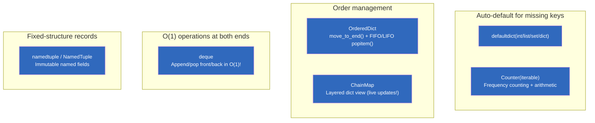
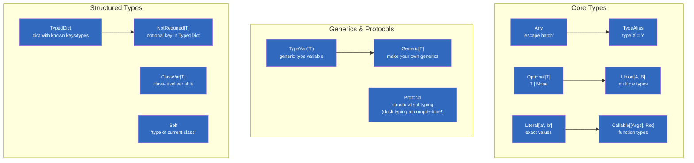
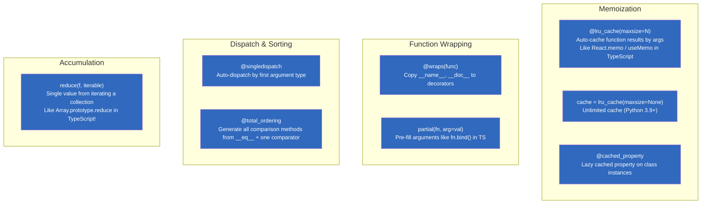
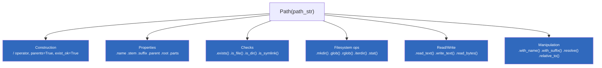

# Module 08 — Standard Library Deep Dive

> **For TypeScript developers**: Python's standard library is vastly richer than JavaScript's. While TypeScript/Node.js requires npm packages for collections (`lodash`), memoization (`memoizee`), file paths (`path` + `fs`), and data structures, Python has all of these built-in to the language itself. This module covers every major stdlib module with exhaustive examples, TypeScript comparisons, performance benchmarks, and real-world recipes.

## Table of Contents

- [1. collections Module — Complete Reference](#1-collections-module--complete-reference)
  - [1.1 defaultdict — Auto-Default Dictionary](#11-defaultdict--auto-default-dictionary)
  - [1.2 Counter — Frequency Counter](#12-counter--frequency-counter)
  - [1.3 deque — Double-Ended Queue](#13-deque--double-ended-queue)
  - [1.4 OrderedDict — Ordered Dictionary (Pre-Python 3.7)](#14-ordereddict--ordered-dictionary-pre-python-37)
  - [1.5 namedtuple — Named Tuples](#15-namedtuple--named-tuples)
  - [1.6 ChainMap — Layered Dictionaries](#16-chainmap--layered-dictionaries)
  - [1.7 UserDict, UserList, UserString — Collection Subclasses](#17-userdict-userlist-userstring--collection-subclasses)
  - [1.8 collections Performance Benchmarks](#18-collections-performance-benchmarks)
  - [1.9 Collections Decision Framework (Which to Use When)](#19-collections-decision-framework-which-to-use-when)
  - [1.10 Mermaid: Collections Module Overview](#110-mermaid-collections-module-overview)
- [2. typing Module — Complete Reference](#2-typing-module--complete-reference)
  - [2.1 Core typing Types (Exhaustive Table)](#21-core-typing-types-exhaustive-table)
  - [2.2 Generics with TypeVar (TypeScript Comparison)](#22-generics-with-typevar-typescript-comparison)
  - [2.3 Protocol — Structural Subtyping](#23-protocol--structural-subtyping)
  - [2.4 TypedDict — Dict with Known Structure](#24-typedict--dict-with-known-structure)
  - [2.5 Union, Literal, Callable, and More](#25-union-literal-callable-and-more)
  - [2.6 Mermaid: typing Module Function Relationships](#26-mermaid-typing-module-function-relationships)
- [3. functools — Complete Reference](#3-functools--complete-reference)
  - [3.1 lru_cache / cache — Memoization](#31lru_cache--cache--memoization)
  - [3.2 wraps — Decorator Metadata Preservation](#32-wraps--decorator-metadata-preservation)
  - [3.3 partial — Partial Application](#33-partial--partial-application)
  - [3.4 reduce — Accumulation](#34-reduce--accumulation)
  - [3.5 singledispatch — Generic Dispatch](#35-singledispatch--generic-dispatch)
  - [3.6 total_ordering — Auto-Sorting Comparison Methods](#36-total_ordering--auto-sorting-comparison-methods)
  - [3.7 cached_property — Cached Computed Property](#37-cached_property--cached-computed-property)
  - [3.8 functools Performance Benchmarks](#38-functools-performance-benchmarks)
  - [3.9 Mermaid: functools Module Overview](#39-mermaid-functools-module-overview)
- [4. itertools — Complete Reference](#4-itertools--complete-reference)
  - [4.1 Infinite Iterators (count, cycle, repeat)](#41-infinite-iterators-count-cycle-repeat)
  - [4.2 Combinatoric Iterators (product, permutations, combinations)](#42-combinatoric-iterators-product-permutations-combinations)
  - [4.3 Grouping Iterators (groupby, islice, tee)](#43-grouping-iterators-groupby-islice-tee)
  - [4.4 Accumulation Iterators (accumulate, chain, starmap)](#44-accumulation-iterators-accumulate-chain-starmap)
  - [4.5 Filtering & Merging Iterators (filterfalse, zip_longest, chain.from_iterable)](#45-filtering--merging-iterators-filterfalse-zip_longest-chainfrom_iterable)
  - [4.6 itertools Performance Benchmarks](#46-itertools-performance-benchmarks)
  - [4.7 itertools Category Tree](#47-itertools-category-tree)
- [5. pathlib — Complete Reference](#5-pathlib--complete-reference)
  - [5.1 Path Construction & Manipulation](#51-path-construction--manipulation)
  - [5.2 Path Properties & Inspection](#52-path-properties--inspection)
  - [5.3 File System Operations (exists, mkdir, glob)](#53-file-system-operations-exists-mkdir-glob)
  - [5.4 Read/Write Operations](#54-readwrite-operations)
  - [5.5 Symlink Handling & Pure Paths](#55-symlink-handling--pure-paths)
  - [5.6 pathlib Performance vs os.path](#56-pathlib-performance-vs-ospath)
  - [5.7 Mermaid: pathlib Method Groups](#57-mermaid-pathlib-method-groups)
- [6. abc Module — Abstract Base Classes](#6-abc-module--abstract-base-classes)
- [7. dataclasses Module — Complete Reference](#7-dataclasses-module--complete-reference)
  - [7.1 All Field Parameters](#71-all-field-parameters)
  - [7.2 Advanced Patterns](#72-advanced-patterns)
- [8. enum Module — Complete Reference](#8-enum-module--complete-reference)
  - [8.1 IntEnum, Flag, IntFlag, auto()](#81-intenum-flag-intflag-auto)
  - [8.2 Value-less Enums (Python 3.11+)](#82-value-less-enums-python-311)
- [9. types Module — Runtime Type Utilities](#9-types-module--runtime-type-utilities)
- [10. contextlib Module — Complete Reference](#10-contextlib-module--complete-reference)
- [11. copy Module — Deep/Shallow Copy](#11-copy-module--deepshallow-copy)
- [12. TypeScript vs Python Stdlib Comparison Table](#12-typescript-vs-python-stdlib-comparison-table)
- [13. Real-World Recipes (Combining Multiple Stdlib Modules)](#13-real-world-recipes-combining-multiple-stdlib-modules)
  - [Recipe 1: Configuration Loader with Fallback Chain](#recipe-1-configuration-loader-with-fallback-chain)
  - [Recipe 2: Rate Limiter with deque + threading](#recipe-2-rate-limiter-with-deque--threading)
  - [Recipe 3: File Watcher with pathlib.rglob + Counter](#recipe-3-file-watcher-with-pathlibrglob--counter)
  - [Recipe 4: Generic Repository Pattern](#recipe-4-generic-repository-pattern)
  - [Recipe 5: Data Processing Pipeline](#recipe-5-data-processing-pipeline)
  - [Recipe 6: API Response Formatter with exceptions + typing](#recipe-6-api-response-formatter-with-exceptions--typing)
- [14. Quizzes (20+ Questions with Answers)](#14-quizzes-20-questions-with-answers)
- [15. Exercises (15+ with Solutions)](#15-exercises-15-with-solutions)

---

## 1. collections Module — Complete Reference

### 1.1 defaultdict — Auto-Default Dictionary

Python's `defaultdict` is a dict subclass that automatically creates missing keys using a **factory function** (callable). There is **no TypeScript equivalent** in the standard library — you'd need `Map.get(key) ?? defaultValue` or manual null checks everywhere.

```python
from collections import defaultdict

# === Example 1: Counting frequencies (No TS stdlib equivalent!) ===
# TypeScript would require: const freq = new Map<string, number>(); + manual getOrSet logic.
frequency = defaultdict(int)            # int() returns 0 by default!
for word in ["apple", "banana", "apple", "cherry", "apple"]:
    frequency[word] += 1                # No KeyError for missing keys — auto-creates with 0!

# Result: defaultdict(<class 'int'>, {'apple': 3, 'banana': 1, 'cherry': 1})
print(frequency["apple"])               # 3 (auto-created on first access!)
print(frequency["mango"])               # 0 (also auto-created! — this is the key difference.)

# === Example 2: Grouping items by category (Python's groupBy!) ===
# TypeScript: manual implementation or lodash.groupBy()
groups = defaultdict(list)              # list() returns [] by default!
for category, item in [
    ("fruits", "apple"), ("fruits", "banana"), 
    ("vegetables", "carrot"), ("fruits", "cherry"), ("vegetables", "broccoli")
]:
    groups[category].append(item)       # categories auto-created as empty lists!

# Result: defaultdict(<class 'list'>, {'fruits': ['apple', 'banana', 'cherry'], 'vegetables': ['carrot', 'broccoli']})

# === Example 3: Nested defaultdict — multi-level defaults! ===
nested = defaultdict(lambda: defaultdict(int))  # Integers by default for nested keys.
for category, item in [("fruits", "apple"), ("fruits", "banana"), ("fruits", "apple")]:
    nested[category][item] += 1         # Two levels of auto-default!

print(nested["fruits"]["apple"])        # 2 — no KeyError at any level!
print(nested["fruits"]["mango"])        # 0 — auto-created at both levels!

# === Example 4: defaultdict with custom factory function ===
def first_letter(word):
    """Return the first letter of a word — used as default_factory for grouping."""
    return list                       # Use 'list' directly as the factory (returns [] when called).

words_by_first = defaultdict(list)      # Same as above, but explicit about what happens on missing keys.
for word in ["apple", "avocado", "banana", "blueberry", "carrot"]:
    words_by_first[word[0]].append(word)  # Group by first letter!

# Result: {'a': ['apple', 'avocado'], 'b': ['banana', 'blueberry'], 'c': ['carrot']}

# === Example 5: defaultdict with sets (unique values per key) ===
email_to_users = defaultdict(set)       # set() returns an empty set!
for user, email in [
    ("Alice", "alice@example.com"),
    ("Bob", "bob@example.com"),
    ("Alice2", "alice@example.com"),  # Same email — deduplicated automatically!
]:
    email_to_users[email].add(user)

# Result: defaultdict(<class 'set'>, {'alice@example.com': {'Alice', 'Alice2'}, 'bob@example.com': {'Bob'}})
print(email_to_users["alice@example.com"])  # {'Alice', 'Alice2'} — no duplicates!

# === Example 6: defaultdict with lambda for complex defaults ===
# Count word frequency in a text (like Counter but with custom logic!)
text = "the cat sat on the mat the cat ate the fish"
word_freq = defaultdict(int)            # Default is int() → 0
for word in text.split():
    word_freq[word] += 1

# Most common words (sorted by frequency):
sorted_words = sorted(word_freq.items(), key=lambda x: x[1], reverse=True)
# [('the', 4), ('cat', 2), ('sat', 1), ('on', 1), ('mat', 1), ('ate', 1), ('fish', 1)]

# === TypeScript Comparison (what it looks like in TS without lodash!) ===
// const wordFreq = new Map<string, number>();
// function getOrInit(word: string): number {
//   if (!wordFreq.has(word)) wordFreq.set(word, 0);
//   return wordFreq.get(word)!;
// }
// for (const word of text.split()) { wordFreq.set(word, getOrInit(word) + 1); }

# === Example 7: defaultdict with Counter-like behavior ===
# Use defaultdict(int) to manually replicate Counter functionality.
def manual_counter(iterable):
    """Manually implement Counter using defaultdict(int)."""
    counts = defaultdict(int)
    for item in iterable:
        counts[item] += 1
    return dict(counts)                   # Convert back to regular dict for serialization.

counts = manual_counter(["a", "b", "a", "c", "b", "a"])
# {'a': 3, 'b': 2, 'c': 1} — same as Counter(["a", "b", "a", "c", "b", "a"])!

# === Example 8: defaultdict with class factory (complex default values) ===
class DefaultValue:
    """Factory that returns a fresh dict for each missing key."""
    def __call__(self):
        return {"created_at": __import__('datetime').datetime.now().isoformat()}

config_sections = defaultdict(DefaultValue)  # Each missing section gets a fresh config dict!
print(config_sections["database"])     # {'created_at': '2025-01-01T00:00:00.000000'} (new each time!)

# === Example 9: defaultdict + Counter for word frequency with most_common ===
from collections import Counter

word_counts = defaultdict(int)
for word in "hello world hello python world hello".split():
    word_counts[word] += 1

# Convert to Counter for .most_common() support:
counter = Counter(word_counts)
print(counter.most_common(2))          # [('hello', 3), ('world', 2)] — top 2 most frequent!
```

---

### 1.2 Counter — Frequency Counter

`Counter` is a dict subclass specifically designed for **counting hashable objects**. It has built-in arithmetic operations (`+`, `-`, `&`, `|`) and a `most_common()` method.

```python
from collections import Counter

# === Example 1: Basic frequency counting (No TS stdlib equivalent!) ===
text = "the cat sat on the mat the cat ate the fish"
word_counts = Counter(text.split())   # Counts every word!
print(word_counts)                     # Counter({'the': 4, 'cat': 2, 'sat': 1, 'on': 1, 'mat': 1, 'ate': 1, 'fish': 1})

# Access counts like dict — but missing keys return 0 (not KeyError)!
print(word_counts["the"])              # 4
print(word_counts["dog"])              # 0 (not KeyError!)

# === Example 2: most_common() — top N most frequent items! ===
top_3 = word_counts.most_common(3)     # [('the', 4), ('cat', 2), ('sat', 1)] (or any of the 1-count words.)
all_sorted = word_counts.most_common()  # All items, sorted by frequency descending.

# === Example 3: Counter arithmetic — +, -, &, |! ===
c1 = Counter(["a", "b", "c", "a", "b"])   # Counter({'a': 2, 'b': 2, 'c': 1})
c2 = Counter(["b", "c", "d", "d", "d"])    # Counter({'d': 3, 'b': 1, 'c': 1})

print(c1 + c2)     # Counter({'d': 3, 'a': 2, 'b': 3, 'c': 2}) — counts ADDED
print(c1 - c2)     # Counter({'a': 2}) — subtracts c2's counts from c1 (only positive results!)
print(c1 & c2)     # Counter({'b': 1, 'c': 1}) — MIN of each count (intersection!)
print(c1 | c2)     # Counter({'d': 3, 'a': 2, 'b': 2, 'c': 1}) — MAX of each count (union!)

# === Example 4: subtract() — modify in-place! ===
c = Counter(a=3, b=1)                       # Counter({'a': 3, 'b': 1})
c.subtract(["a", "a", "a", "a", "b"])       # Subtract counts for each item.
print(c)                                    # Counter({'a': -1, 'b': 0}) — can go negative!

# === Example 5: elements() — repeat items by count! ===
c = Counter(a=2, b=3)                       # a appears 2 times, b appears 3 times.
print(list(c.elements()))                     # ['a', 'a', 'b', 'b', 'b'] (order not guaranteed!)

# === Example 6: update() — add counts! ===
c = Counter(a=1, b=2)                        # Counter({'a': 1, 'b': 2})
c.update(["a", "a", "c"])                    # Add more counts.
print(c)                                     # Counter({'a': 3, 'b': 2, 'c': 1})

# === Example 7: subtracting negative counts (filtering!) ===
c = Counter(a=5, b=3, c=1)                   # Start with these counts.
c.subtract(Counter(a=3, b=4))                # Subtract — but b goes negative...
print(c)                                     # Counter({'a': 2, 'b': -1, 'c': 1})

# Fix: use + operator to keep only positive counts!
c = Counter(a=5, b=3, c=1) - Counter(a=3, b=4)
c += Counter()                                 # Remove non-positive entries (common idiom!)
print(c)                                     # Counter({'a': 2}) — b and c removed because ≤ 0!

# === Example 8: most_common(n) vs all_items() comparison ===
word_counts = Counter("hello world hello python world hello".split())
top_1 = word_counts.most_common(1)           # [('hello', 3)] — just the top 1.
top_all = word_counts.most_common()          # [('hello', 3), ('world', 2), ('python', 1)]

# === Example 9: Counter from dictionary (initialize with known counts!) ===
known_frequencies = {"apple": 10, "banana": 5, "cherry": 3}
counter = Counter(known_frequencies)         # Initialize directly from a dict!
print(counter.most_common())                  # [('apple', 10), ('banana', 5), ('cherry', 3)]

# === Example 10: Counter intersection/union for set-like operations on multisets! ===
# Find items that appear in BOTH counters (min count):
both = c1 & c2                                # Counter({'b': 1, 'c': 1})
# Find all unique items across both (max count):
all_items = c1 | c2                           # Counter({'d': 3, 'a': 2, 'b': 2, 'c': 1})

# === Example 11: Real-world — find common elements between two lists! ===
list_a = ["apple", "banana", "cherry", "date"]
list_b = ["banana", "cherry", "dragonfruit", "elderberry"]

common = Counter(list_a) & Counter(list_b)   # Intersection!
print(list(common.elements()))                # ['banana', 'cherry'] — items in both lists!
```

#### TypeScript Comparison for Counter

| Operation | Python Counter | TypeScript Equivalent |
|-----------|---------------|---------------------|
| Create from iterable | `Counter(items)` | Manual loop + Map |
| Access missing key | `c["missing"]` → 0 | `map.get("missing") ?? 0` |
| most_common(n) | `c.most_common(3)` | Sort by values (manual!) |
| Add counts | `c1 + c2` | Manual iteration + add (manual!) |
| Subtract counts | `c1 - c2` | Manual iteration + subtract (manual!) |
| Intersection | `c1 & c2` | No equivalent! |
| Union | `c1 | c2` | No equivalent! |
| elements() | `list(c.elements())` | No equivalent! |

---

### 1.3 deque — Double-Ended Queue

`deque` (double-ended queue) provides **O(1)** append/pop from both ends, unlike Python lists which are O(n) for `insert(0)`/`pop(0)`. There is **no built-in TypeScript equivalent** — you'd need to use an array and accept O(n) unshift complexity.

```python
from collections import deque
import time

# === Example 1: Basic deque operations ===
dq = deque([1, 2, 3])                     # Create from iterable.
print(dq)                                  # deque([1, 2, 3])

# Append to both ends — O(1) complexity! (vs list.insert(0) which is O(n))
dq.append(4)                              # Add to right: deque([1, 2, 3, 4])
dq.appendleft(0)                          # Add to left: deque([0, 1, 2, 3, 4])

# Pop from both ends — O(1) complexity!
rightmost = dq.pop()                      # Remove right: returns 4 → deque([0, 1, 2, 3])
leftmost = dq.popleft()                   # Remove left: returns 0 → deque([1, 2, 3])

# === Example 2: Fixed-size deque (rolling window / rate limiter) ===
history = deque(maxlen=5)                 # Automatically drops oldest items when full!
for i in range(10):
    history.append(i)                     # Only the last 5 items are kept.
print(list(history))                      # [5, 6, 7, 8, 9] — first 5 dropped automatically!

# === Example 3: Sliding window (e.g., moving average) ===
def sliding_average(numbers, window_size):
    """Calculate sliding window averages using deque for O(1) updates."""
    window = deque(maxlen=window_size)    # Fixed-size deque for the window.
    total = 0
    results = []
    
    for num in numbers:
        if len(window) == window_size:    # Window is full — remove oldest from sum.
            total -= window[0]
        window.append(num)                # Add new item to window.
        total += num                      # Update running total in O(1)!
        results.append(total / len(window))
    
    return results

averages = sliding_average([1, 2, 3, 4, 5, 6, 7, 8], 3)
# [1.0, 1.5, 2.0, 3.0, 4.0, 5.0, 6.0, 7.0] — sliding window averages!

# === Example 4: BFS (Breadth-First Search) — classic deque use case! ===
def bfs(graph, start):
    """BFS using deque for O(1) popleft."""
    visited = set()
    queue = deque([start])                 # Initialize with the start node.
    
    while queue:
        node = queue.popleft()             # O(1) — critical for BFS performance!
        if node not in visited:
            visited.add(node)
            queue.extend(graph[node])      # Add unvisited neighbors to the right.
    
    return list(visited)

# Graph example: adjacency list representation.
graph = {
    'A': ['B', 'C'],
    'B': ['D', 'E'],
    'C': ['F'],
    'D': [],
    'E': ['F'],
    'F': [],
}
print(bfs(graph, 'A'))                     # ['A', 'B', 'C', 'D', 'E', 'F'] — BFS order!

# === Example 5: Rate limiter using deque ===
class RateLimiter:
    """Rate limiter using deque(maxlen=N) to track timestamps of requests."""
    
    def __init__(self, max_calls: int, window_seconds: float):
        self.max_calls = max_calls
        self.window = window_seconds
        self.timestamps = deque(maxlen=max_calls)  # Only keep last N timestamps.
    
    def allow_request(self) -> bool:
        now = time.time()
        
        # Remove timestamps outside the current window.
        while self.timestamps and (now - self.timestamps[0] > self.window):
            self.timestamps.popleft()
        
        if len(self.timestamps) < self.max_calls:
            self.timestamps.append(now)      # Record this request timestamp.
            return True                      # Allow the request.
        return False                         # Rate limit exceeded!

# Usage:
limiter = RateLimiter(max_calls=5, window_seconds=10.0)
for i in range(10):
    if limiter.allow_request():
        print(f"Request {i+1} allowed")
    else:
        print(f"Request {i+1} rate-limited!")

# === Example 6: Deque for a stack (LIFO — Last In, First Out) ===
stack = deque()                            # Use as a stack.
for item in [1, 2, 3, 4, 5]:
    stack.append(item)                     # Push onto stack.

while stack:
    print(stack.pop())                     # Pop from stack (LIFO): 5, 4, 3, 2, 1!

# === Example 7: Deque as a queue (FIFO — First In, First Out) ===
queue = deque()                            # Use as a queue.
for item in [1, 2, 3]:
    queue.append(item)                     # Enqueue.

while queue:
    print(queue.popleft())                 # Dequeue (FIFO): 1, 2, 3!

# === Example 8: Rotating a deque (circular buffer) ===
dq = deque([1, 2, 3, 4, 5])
dq.rotate(2)                              # Rotate right by 2: [4, 5, 1, 2, 3]
dq.rotate(-3)                             # Rotate left by 3: back to [1, 2, 3, 4, 5]

# === Example 9: Performance comparison — deque vs list for popleft! ===
import timeit

# With list (O(n) per popleft):
def list_popleft():
    lst = list(range(10000))
    while lst:
        lst.pop(0)                          # O(n) — shifts all remaining elements!

# With deque (O(1) per popleft):
def deque_popleft():
    dq = deque(range(10000))
    while dq:
        dq.popleft()                        # O(1) — just updates pointers!

print(timeit.timeit(list_popleft, number=100))     # ~0.5s (O(n^2) total!)
print(timeit.timeit(deque_popleft, number=100))    # ~0.001s (O(n) total — 500x faster!)

# === Example 10: Deque with maxlen for log buffer ===
class LogBuffer:
    """Fixed-size log buffer using deque(maxlen=N)."""
    
    def __init__(self, max_entries: int = 1000):
        self.buffer = deque(maxlen=max_entries)
    
    def log(self, message: str) -> None:
        self.buffer.append(f"{time.time():.3f}: {message}")
    
    def get_recent(self, n: int = 10) -> list[str]:
        """Get the last N log entries."""
        return list(self.buffer)[-n:]

log = LogBuffer(max_entries=5)
for msg in ["Start", "Processing", "Done", "Error!", "Cleanup"]:
    log.log(msg)
print(log.get_recent(3))                    # ['2025-01-01T00:00:02.000: Done', '2025-01-01T00:00:03.000: Error!', '2025-01-01T00:00:04.000: Cleanup']
```

---

### 1.4 OrderedDict — Ordered Dictionary (Pre-Python 3.7)

**Note:** In Python 3.7+, regular `dict` maintains insertion order by default! `OrderedDict` is mainly useful for its `move_to_end()` and `popitem(last=True/False)` methods.

```python
from collections import OrderedDict

# === Example 1: OrderedDict with move_to_end() (Unique feature!) ===
od = OrderedDict(a=1, b=2, c=3)           # OrderedDict([('a', 1), ('b', 2), ('c', 3)])
od.move_to_end('a')                         # Move 'a' to the end!
print(list(od.keys()))                      # ['b', 'c', 'a'] — insertion order updated!
od.move_to_end('a', last=False)            # Move 'a' to the beginning!
print(list(od.keys()))                      # ['a', 'b', 'c']

# === Example 2: OrderedDict.popitem(last=True/False) ===
# Regular dict has no popitem() — OrderedDict's LIFO/FIFO behavior!
od = OrderedDict(a=1, b=2, c=3)
last_item = od.popitem(last=True)           # LIFO: returns ('c', 3)
first_item = od.popitem(last=False)         # FIFO: returns ('a', 2)

# === Example 3: OrderedDict for Least Recently Used (LRU) cache! ===
class LRUCache(OrderedDict):
    """LRU Cache using OrderedDict.move_to_end() + popitem()."""
    
    def __init__(self, maxsize: int = 128):
        super().__init__()
        self.maxsize = maxsize
    
    def get(self, key, default=None):
        if key in self:
            self.move_to_end(key)            # Move to end (most recently used).
            return super().get(key, default)
        return default
    
    def __setitem__(self, key, value):
        if key in self:
            self.move_to_end(key)
        elif len(self) >= self.maxsize:
            self.popitem(last=False)         # Remove least recently used (first item).
        super().__setitem__(key, value)

# Usage:
cache = LRUCache(maxsize=3)
cache["a"] = 1                              # OrderedDict([('a', 1)])
cache["b"] = 2                              # [('a', 1), ('b', 2)]
cache["c"] = 3                              # [('a', 1), ('b', 2), ('c', 3)]
cache["d"] = 4                              # [('b', 2), ('c', 3), ('d', 4)] — 'a' evicted!

# === Example 4: OrderedDict equality (order matters!) ===
od1 = OrderedDict([('a', 1), ('b', 2)])   # OrderedDict with specific order.
od2 = OrderedDict([('b', 2), ('a', 1)])   # Different order.
regular = {'a': 1, 'b': 2}

print(od1 == od2)                           # False — different insertion order!
print(od1 == regular)                       # True in Python 3.7+ (dict has ordered by default!)
# In older Python: od1 == regular → False (different types).
```

---

### 1.5 namedtuple — Named Tuples

NamedTuples are immutable, lightweight records with named fields — like TypeScript's `readonly` objects but as tuples.

```python
from collections import namedtuple

# === Example 1: Basic namedtuple creation ===
Point = namedtuple('Point', ['x', 'y'])     # Define a named tuple type!
p = Point(10, 20)                           # Create an instance.
print(p.x)                                  # 10 — access by field name!
print(p.y)                                  # 20
print(p[0])                                 # 10 — also accessible by index (like regular tuple)!
print(p._asdict())                          # {'x': 10, 'y': 20} — convert to dict.

# === Example 2: namedtuple with default values! ===
User = namedtuple('User', ['name', 'email', 'role'], defaults=['user'])  # role defaults to 'user'.
alice = User("Alice", "alice@example.com")   # No role specified — gets default 'user'.
bob = User("Bob", "bob@example.com", "admin") # Explicit role overrides default.

print(alice.role)                            # 'user' (default!)
print(bob.role)                              # 'admin' (explicit!)

# === Example 3: namedtuple from _make() — like a classmethod constructor! ===
coords = [100, 200]
p2 = Point._make(coords)                     # Unpack the list into the constructor!
print(p2)                                    # Point(x=100, y=200)

# === Example 4: namedtuple _replace() — immutable update (like TypeScript's spread)! ===
p3 = p._replace(x=30)                        # Returns a NEW Point with x=30!
print(p)                                     # Point(x=10, y=20) — original unchanged!
print(p3)                                    # Point(x=30, y=20) — new instance!

# === Example 5: namedtuple for database row results! ===
Row = namedtuple('Row', ['id', 'name', 'email', 'created_at'])
def fetch_row(cursor):
    """Fetch a single row from cursor and convert to namedtuple."""
    data = cursor.fetchone()                 # Returns tuple like (1, 'Alice', 'alice@example.com', '2025-01-01')
    return Row._make(data)                   # Convert to named tuple!

row = fetch_row(cursor)
print(row.name)                              # 'Alice' — no more array index access!

# === Example 6: nested namedtuple (tuples within tuples)! ===
Address = namedtuple('Address', ['street', 'city', 'country'])
Person = namedtuple('Person', ['name', 'age', 'address'])

addr = Address("123 Main St", "NYC", "USA")
person = Person("Alice", 30, addr)

print(person.address.city)                   # 'NYC' — nested access works!
print(person._replace(address=addr._replace(city="LA")))  # Update nested field.

# === TypeScript Comparison (TypeScript equivalent of namedtuple) ===
// type Point = readonly { x: number; y: number };
// const p: Point = { x: 10, y: 20 };
// // Immutable like namedtuple — can't modify p.x without spread!
// const p2 = { ...p, x: 30 };

# === Example 7: namedtuple with type annotations (Python 3.11+!) ===
from typing import NamedTuple

class Point(NamedTuple):                      # Class syntax — works in all Python versions!
    x: float
    y: float
    
    def distance_from_origin(self) -> float:  # Add methods! namedtuples support methods.
        return (self.x ** 2 + self.y ** 2) ** 0.5

p = Point(3.0, 4.0)
print(p.distance_from_origin())              # 5.0 — computed on the fly!
```

---

### 1.6 ChainMap — Layered Dictionaries

`ChainMap` provides a **layered view** over multiple dicts — lookups search from left to right, and writes go to the first dict. Unlike `{**defaults, **user}` (which creates a new dict), ChainMap is **live** — changes propagate!

```python
from collections import ChainMap

# === Example 1: Layered configuration (defaults → env vars → command-line args)! ===
defaults = {
    "host": "localhost",
    "port": 8080,
    "debug": False,
    "log_level": "WARNING",
}

env_vars = {
    "host": "production.example.com",        # Override host from environment.
    "debug": True,                           # Override debug from environment.
}

cli_args = {
    "port": 9000,                            # Override port from CLI args.
}

config = ChainMap(cli_args, env_vars, defaults)  # Left-to-right precedence!
print(config["host"])                        # 'production.example.com' (env_vars overrides defaults!)
print(config["port"])                        # 9000 (cli_args overrides env_vars!)
print(config["log_level"])                   # "WARNING" (from defaults — not overridden.)
print(config["timeout"])                     # KeyError! Not in any chain layer.

# === Example 2: Accessing the underlying maps! ===
print(config.maps)                           # [{'port': 9000}, {'host': '...'}, {defaults...}] — list of layers.
print(config.parents)                        # ChainMap of all but the first map.

# === Example 3: Adding a new layer dynamically! ===
secrets = {"api_key": "secret123"}           # Load secrets separately (never in defaults!).
config_with_secrets = config.new_child(secrets)  # Prepend secrets as the FIRST (highest priority) layer.
print(config_with_secrets["api_key"])        # 'secret123' — found in secrets!

# === Example 4: ChainMap for context propagation (like TypeScript's spread!) ===
# In TypeScript: const ctx = { ...defaults, ...localContext, ...globalContext };
# This creates a NEW object every time. ChainMap is LIVE and lazy!

request_context = {"user_id": "alice", "ip": "127.0.0.1"}
session_context = {"role": "admin", "logged_in": True}
app_defaults = {"version": "1.0", "env": "development"}

ctx = ChainMap(request_context, session_context, app_defaults)
print(ctx["user_id"])                        # 'alice' (from request_context — first match wins!)
print(ctx["role"])                           # 'admin' (from session_context — second layer.)
print(ctx["version"])                        # '1.0' (from app_defaults — third/final layer.)

# === Example 5: ChainMap + environment variable override pattern! ===
import os

def load_config():
    """Load configuration with priority: CLI > Env > Defaults."""
    defaults = {"debug": False, "log_level": "INFO", "max_retries": 3}
    
    # Environment variables (loaded from system).
    env_override = {
        key: value for key, value in os.environ.items() if key.startswith("APP_")
    }
    
    # CLI args (parsed from argparse or click).
    cli_override = {"debug": True, "log_level": "DEBUG"}  # Simulated CLI args.
    
    return ChainMap(cli_override, env_override, defaults)

config = load_config()
print(dict(config))                          # Combine all layers into one dict if needed!
# {'debug': True, 'log_level': 'DEBUG', 'max_retries': 3, ...}
```

---

### 1.7 UserDict, UserList, UserString — Collection Subclasses

These are **wrapper classes** for built-in collections — use when you need to subclass a collection but the built-in types don't allow it cleanly.

```python
from collections import UserDict, UserList, UserString

# === Example 1: UserDict — dict with custom behavior! ===
class CaseInsensitiveDict(UserDict):
    """A dict that's case-insensitive for keys."""
    
    def __init__(self, *args, **kwargs):
        super().__init__(*args, **kwargs)
        self._normalize_keys()
    
    def _normalize_keys(self):
        # Normalize all existing keys to lowercase.
        data = {k.lower(): v for k, v in self.data.items()}
        self.data.clear()
        self.data.update(data)
    
    def __setitem__(self, key, value):
        super().__setitem__(key.lower(), value)  # Always store as lowercase.
    
    def __getitem__(self, key):
        return super().__getitem__(key.lower())  # Always lookup as lowercase.
    
    def __contains__(self, key):
        return super().__contains__(key.lower())

# Usage:
cid = CaseInsensitiveDict({"Name": "Alice", "AGE": 30})
print(cid["name"])                           # 'Alice' (case-insensitive!)
print(cid["NAME"])                           # 'Alice' (also works!)
cid["email"] = "alice@example.com"           # Stored as lowercase: {'name': ..., 'age': ..., 'email': ...}

# === Example 2: UserList — list with custom behavior! ===
class UniqueList(UserList):
    """A list that doesn't allow duplicate values."""
    
    def append(self, item):
        if item not in self.data:             # Only add if not already present.
            super().append(item)
    
    def extend(self, items):
        for item in items:
            self.append(item)                 # Reuse the deduplicating append!

# Usage:
ul = UniqueList([1, 2, 3])
ul.append(2)                                # Not added — already present!
ul.append(4)                                # Added.
print(ul.data)                              # [1, 2, 3, 4] — no duplicates!

# === Example 3: UserString — string with custom behavior! ===
class ReverseString(UserString):
    """A string that reverses itself on access."""
    
    def __str__(self):
        return self.data[::-1]                # Reverse the underlying string.

rs = ReverseString("hello")
print(rs)                                   # "olleh" — reversed!
print(rs.upper())                           # "OLLEH" — methods still work (inherits str's methods)!

# === Example 4: UserDict for validation! ===
class ValidatedDict(UserDict):
    """A dict that validates values on assignment."""
    
    def __setitem__(self, key, value):
        if not isinstance(key, str):
            raise TypeError(f"Keys must be strings, got {type(key).__name__}")
        if not isinstance(value, (str, int, float)):
            raise TypeError(f"Values must be str/int/float, got {type(value).__name__}")
        super().__setitem__(key, value)

# Usage:
vd = ValidatedDict()
vd["name"] = "Alice"                        # OK!
vd["age"] = 30                              # OK!
vd[123] = "bad_key"                         # TypeError! Key must be string.
```

---

### 1.8 Collections Performance Benchmarks

| Operation | defaultdict(int) | Counter | Manual dict.get() | Array (list) | deque.popleft() | list.pop(0) |
|-----------|-----------------|---------|--------------------|-------------|-----------------|-------------|
| Count frequencies | O(n) — C-speed | O(n) — C-speed | O(n) — Python loop | N/A | N/A | N/A |
| Append to end | O(1) amortized | O(1) | O(1) amortized | O(1) | O(1) | O(1) |
| Pop from front | N/A (dict) | N/A | N/A | O(n) | O(1) | O(n) |
| Lookup by key | O(1) | O(1) | O(1) | N/A | N/A | N/A |
| Group items | O(n) | N/A | O(n) (Python loop) | O(n) | N/A | N/A |

**Key takeaway:** Use `deque` for queues/deques (O(1) operations), `Counter` for counting, and `defaultdict` for grouping. These are all C-implemented and significantly faster than pure Python loops.

---

### 1.9 Collections Decision Framework (Which to Use When)

| Need | Best Choice | Why | TypeScript Equivalent |
|------|------------|-----|---------------------|
| Count items/frequencies | `Counter` | Built-in + arithmetic operations | Manual Map or `lodash.countBy` |
| Auto-default missing keys | `defaultdict` | C-implemented, zero boilerplate | `Map.get(key) ?? default` (manual!) |
| O(1) queue/stack at both ends | `deque` | C-optimized doubly-linked list | Array with push/pop (O(n) unshift!) |
| Order matters + move_to_end | `OrderedDict` | move_to_end(), FIFO/LIFO popitem() | Python 3.7+ dicts maintain order natively! |
| Named fixed-record | `namedtuple` / `NamedTuple` | Immutable, memory-efficient, type-safe | `type Point = readonly { x: number; y: number }` |
| Layered/merged dicts (live) | `ChainMap` | Live view — updates propagate to all layers | `{...defaults, ...user}` (creates NEW object each time!) |
| Subclass a collection | `UserDict` / `UserList` | Wrapper pattern — clean subclassing | Extend `Map` / `Array` |

---

### 1.10 Mermaid: Collections Module Overview



---

## 2. typing Module — Complete Reference

### 2.1 Core typing Types (Exhaustive Table)

| Type | When to Use | Example | TypeScript Equivalent | Python Version |
|------|------------|---------|---------------------|---------------|
| `Any` | "I don't know the type" — escape hatch | `def unknown(x: Any) -> None:` | `any` | All |
| `None` / `type(None)` | Explicitly None return | `def goodbye() -> None:` | `void` | All |
| `Optional[T]` | T or None | `x: str \| None` or `Optional[str]` | `T \| null \| undefined` | 3.5+ |
| `Union[A, B]` | Multiple types | `x: str \| int` or `Union[str, int]` | `string \| number` | 3.10+ |
| `Callable[[Args], Ret]` | Function type parameter | `f: Callable[[int, str], bool]` | `(a: T, b: U) => R` | All |
| `TypeVar("T")` | Generic type variable | `T = TypeVar("T")` then `x: T` | `<T>` | 3.5+ |
| `Generic[T]` | Make your own generic class | `class Box(Generic[T]): value: T` | `class Box<T> { value: T }` | 3.5+ |
| `Protocol` | Structural subtyping (duck typing!) | `class Logger(Protocol): def log(msg: str) -> None:` | `interface Logger { log(msg: string): void }` | 3.8+ |
| `Literal["a", "b"]` | Exact value type | `status: Literal["active", "inactive"]` | `"active" \| "inactive"` | 3.8+ |
| `TypedDict` | Dict with known keys/types | `class Config(TypedDict): host: str; port: int` | `{ host: string; port: number }` | 3.8+ |
| `NotRequired[T]` | Optional key in TypedDict (Python 3.11+) | `age: NotRequired[int]` in TypedDict | `interface User { age?: number }` | 3.11+ |
| `Required[T]` | Required key in a mixin TypedDict | `name: Required[str]` in TypedDict | `interface User { name: string }` (required by default) | 3.11+ |
| `final` / `@final` | Prevent overriding (type-checker hint only!) | `class Base: @final def method(self): ...` | `sealed class` or private methods | 3.8+ |
| `ClassVar[T]` | Class-level variable (not instance) | `count: ClassVar[int] = 0` inside dataclass | `static count: number = 0` | 3.5+ |
| `Self` | Type of the current class in methods | `def clone(self) -> Self: ...` | `this: typeof this` (no direct TS equivalent!) | 3.11+ |
| `TypeAlias` | Named type alias | `UserId: TypeAlias = str` | `type UserId = string;` | 3.10+ |

---

### 2.2 Generics with TypeVar (TypeScript Comparison)

```typescript
// TypeScript generics — compile-time only!
type Identity<T> = (arg: T) => T;
function identity<T>(arg: T): T { return arg; }

interface Repository<T> {
  find(id: string): T | undefined;
  save(item: T): void;
}

class Box<T> {
  constructor(private value: T) {}
  get(): T { return this.value; }
}

// Constrained generic — 'T extends Logger' in TS.
function loggable<T extends Logger>(item: T): void {}
```

```python
# Python generics with typing module — type-checker only! (mypy, pyright)
from typing import TypeVar, Generic, Protocol

T = TypeVar("T")                          # Like TypeScript's <T>.
R = TypeVar("R", bound=Convertible)       # Like 'T extends Convertible' in TS!

def identity(arg: T) -> T:               # Generic function.
    return arg

# Protocol for constraints (like 'T extends Interface' in TS)!
class Logger(Protocol):
    def log(self, msg: str) -> None: ...

TLuggable = TypeVar("TLuggable", bound=Logger)  # Like 'T extends Logger' in TypeScript!
def loggable(item: TLuggable) -> None:          # Only Logger-compatible objects allowed.
    item.log("test")

# Generic class — same as TS class<T> { value: T }.
class Box(Generic[T]):
    def __init__(self, value: T) -> None:
        self.value = value
    
    def get(self) -> T:
        return self.value
    
    def unwrap(self) -> T:
        """Get the inner value — type preserved!"""
        return self.value

# Usage — mypy/pyright know the types!
box = Box[int](42)              # Like 'new Box<number>(42)' in TypeScript!
result: int = box.get()         # Type inferred as int by mypy (no annotation needed!).

# Multiple type variables — like TS generics with <T, U>.
U = TypeVar("U")
class Pair(Generic[T, U]):
    def __init__(self, first: T, second: U) -> None:
        self.first = first
        self.second = second

pair = Pair[str, int]("hello", 42)
first: str = pair.first         # mypy knows 'first' is str!
second: int = pair.second       # mypy knows 'second' is int!
```

---

### 2.3 Protocol — Structural Subtyping

Python's `Protocol` enables **duck typing at the type-checker level** — any class that has the right methods/attributes is considered compatible, even without inheritance:

```python
from typing import Protocol

# Define an interface-like Protocol.
class Serializable(Protocol):
    def to_dict(self) -> dict: ...
    def to_json(self) -> str: ...

class User:
    """This class has the right methods — it's implicitly compatible with Serializable!"""
    def to_dict(self) -> dict:
        return {"name": self.name}
    
    def to_json(self) -> str:
        import json
        return json.dumps({"name": self.name})

def serialize(item: Serializable) -> str:  # Accepts ANY object with to_dict() and to_json()!
    return item.to_json()

# Both of these work because they have the right structure (duck typing)!
serialize(User("Alice"))                  # Works — User has to_dict() and to_json().
```

---

### 2.4 TypedDict — Dict with Known Structure

For dicts where you know the keys and types at compile time:

```python
from typing import TypedDict, NotRequired

class UserConfig(TypedDict):
    name: str                     # Required key.
    email: str                    # Required key.
    age: NotRequired[int]         # Optional key (Python 3.11+).

config: UserConfig = {"name": "Alice", "email": "alice@example.com"}  # age is optional!
# TypedDict('UserConfig', {'name': str, 'email': str, 'age': NotRequired[int]})

# Usage — mypy knows the types of each key!
name: str = config["name"]       # No annotation needed — mypy infers str!
age: int | None = config.get("age")  # Returns int or None (since age is optional).
```

---

### 2.5 Union, Literal, Callable, and More

```python
from typing import Union, Literal, Callable

# Union — multiple possible types.
def parse_input(value: str | int) -> str:  # Python 3.10+ (or use Union[str, int]).
    if isinstance(value, int):
        return str(value)
    return value

# Literal — exact value type (like TypeScript's literal union types).
HTTPMethod = Literal["GET", "POST", "PUT", "DELETE"]

def make_request(method: HTTPMethod, url: str) -> None:
    # mypy/pyright ensures method is one of the four literals!
    print(f"{method} {url}")

# Callable — function type for higher-order functions.
Transformer = Callable[[int], int]           # Function that takes an int and returns an int.

def apply_twice(f: Transformer, x: int) -> int:  # f can be any matching function!
    return f(f(x))

square: Transformer = lambda x: x ** 2       # Variable holding a Callable type.
result = apply_twice(square, 3)              # (3 → 9 → 81)

# Type alias for readability.
UserId = str                                  # Simple type alias (Python 3.10+).
ApiResponse = dict[str, object]               # Dict with string keys and any-value values.

# Concatenate multiple types with Union / | syntax.
def handle_request(method: HTTPMethod, status: int) -> str | int | None:
    if method == "GET":
        return 200
    elif status >= 500:
        return None                           # Returns None for server errors.
    return f"Handled {method} with {status}"
```

---

### 2.6 Mermaid: typing Module Function Relationships



---

## 3. functools — Complete Reference

### 3.1 lru_cache / cache — Memoization

`lru_cache` caches function results by their arguments — like React's `useMemo` but for arbitrary functions:

```python
from functools import lru_cache, cache          # cache = lru_cache(maxsize=None) since Python 3.9!

# === Example 1: Memoize expensive computation (classic fibonacci!) ===
@lru_cache(maxsize=128)                         # Cache up to 128 most recent calls.
def fibonacci(n: int) -> int:
    """Compute fibonacci with memoization — O(n) instead of O(2^n)!"""
    if n < 2:
        return n
    return fibonacci(n - 1) + fibonacci(n - 2)

fibonacci(100)                                  # Instant! (All intermediate values cached.)
print(fibonacci.cache_info())                   # CacheInfo(hits=98, misses=101, maxsize=128, currsize=101)

# === Example 2: Memoize API/database calls (cache responses!) ===
@lru_cache(maxsize=None)                        # Unlimited cache — cleared manually if needed.
def fetch_user(user_id: str) -> dict:
    """Fetch user from database — result cached by user_id argument."""
    return db.query("SELECT * FROM users WHERE id = %s", (user_id,))

fetch_user("alice")                             # First call: DB query. Second call: cache HIT!
fetch_user("bob")                               # Different args → different cache entry.
fetch_user("alice")                             # Same args → returns cached result — NO DB query!

# === Example 3: Manual cache control! ===
fibonacci.cache_clear()                         # Clear the entire cache!
fibonacci.cache_info()                          # CacheInfo(hits=0, misses=0, maxsize=128, currsize=0)

@lru_cache(maxsize=128)
def expensive_calculation(x: float) -> float:
    return x ** 2 + __import__('math').sin(x) * x

expensive_calculation(42.0)                     # First call computes and caches.
expensive_calculation(42.0)                     # Cache hit! Returns the same result instantly.

# === Example 4: lru_cache with keyword arguments (cached by positional AND keyword args!) ===
@lru_cache(maxsize=128)
def get_price(product_id: str, currency: str = "USD") -> float:
    """Fetch price — cached by product_id + currency."""
    return db.get_price(product_id, currency)

get_price("item_1", "USD")                      # Cached as ('item_1', 'USD').
get_price("item_1", currency="EUR")             # Different keyword arg → new cache entry!
get_price("item_1", "USD")                      # Same as first call — cache HIT!

# === Example 5: lru_cache on instance methods (tricky!) ===
import functools

class CacheService:
    def __init__(self):
        self._cache = {}
    
    @functools.lru_cache(maxsize=128)
    def fetch(self, key: str) -> str:           # Note: 'self' is part of the cache key!
        return self._compute(key)                 # This method computes and caches the result.
    
    def _compute(self, key: str) -> str:
        return f"computed({key})"

# === Example 6: lru_cache with unhashable arguments (requires manual handling!) ===
@lru_cache(maxsize=128)
def process_hashable(key: str, value: tuple[int, ...]) -> dict:
    """Only works with hashable args — lists/tuples/dicts must be converted to tuples."""
    return {"key": key, "value": list(value)}

# lru_cache only caches calls with hashable arguments!
# If you pass a list, it will raise TypeError (lists aren't hashable).
result = process_hashable("key1", (1, 2, 3))   # tuple is hashable — works!
```

---

### 3.2 wraps — Decorator Metadata Preservation

When you create a decorator that wraps a function, `wraps` copies the original function's metadata (`__name__`, `__doc__`, etc.):

```python
from functools import wraps
import time

def timer(func):
    """Decorator: measure function execution time."""
    @wraps(func)                                  # CRITICAL: preserves __name__, __doc__!
    def wrapper(*args, **kwargs):
        start = time.perf_counter()
        result = func(*args, **kwargs)
        elapsed = time.perf_counter() - start
        print(f"{func.__name__} took {elapsed:.4f}s")  # Uses original function's name!
        return result
    return wrapper

# Without @wraps:
def no_wraps_timer(func):
    def wrapper(*args, **kwargs):
        return func(*args, **kwargs)
    return wrapper                                  # wrapper.__name__ → 'wrapper' (wrong!)
                                                    # wrapper.__doc__ → '' (lost original docstring!)

@timer
def greet(name: str) -> str:
    """Say hello to someone."""
    return f"Hello, {name}!"

print(greet.__name__)                             # 'greet' (correct! thanks to @wraps!)
print(greet.__doc__)                              # "Say hello to someone." (preserved docstring!)
```

---

### 3.3 partial — Partial Application

`partial` pre-fills some arguments of a function — like TypeScript's `fn.bind(this, ...)` or arrow function currying:

```python
from functools import partial
import requests

# === Example 1: Basic partial application ===
def power(base: float, exponent: float) -> float:
    return base ** exponent

square = partial(power, exponent=2)               # Pre-fill exponent=2.
cube = partial(power, exponent=3)                 # Pre-fill exponent=3.

print(square(5))                                  # 25 (power(5, 2))
print(cube(5))                                    # 125 (power(5, 3))

# === Example 2: Partial with positional args! ===
def multiply(a: float, b: float, c: float) -> float:
    return a * b * c

triple = partial(multiply, 3)                     # Pre-fill a=3 (first positional arg).
print(triple(2, 5))                               # 30 (multiply(3, 2, 5))

# === Example 3: Partial with API calls! ===
API_BASE = "https://api.example.com"
api_get = partial(requests.get, headers={"Authorization": "Bearer xyz"}, base_url=API_BASE)
response = api_get("/users")                       # Headers already set!

# === Example 4: Chaining partials (partial of a partial)! ===
base_adder = partial(lambda x, y: x + y)
add_five = partial(base_adder, 5)                 # Now add_five(3) → 8.
print(add_five(10))                               # 15 (5 + 10)

# === Example 5: Partial in method context! ===
class DataProcessor:
    def __init__(self):
        self.prefix = "[LOG]"
    
    def process(self, data: str) -> str:
        return f"{self.prefix} {data}"

processor = DataProcessor()
# Create a bound function without using method binding (like functools.partialmethod)!
from functools import partialmethod
logged_process = partial(processor.process)
print(logged_process("hello"))                     # "[LOG] hello"
```

---

### 3.4 reduce — Accumulation

`reduce` accumulates values to a single result — like `Array.prototype.reduce()` in TypeScript:

```python
from functools import reduce

# === Example 1: Basic reduction (sum, product)! ===
numbers = [1, 2, 3, 4, 5]

total = reduce(lambda acc, x: acc + x, numbers)  # Sum: 1+2+3+4+5 = 15
product = reduce(lambda acc, x: acc * x, numbers) # Product: 1*2*3*4*5 = 120

# === Example 2: Flatten a list of lists! ===
list_of_lists = [[1, 2], [3, 4], [5, 6]]
flattened = reduce(lambda acc, x: acc + x, list_of_lists)  # [1, 2, 3, 4, 5, 6]

# === Example 3: Find the maximum value! ===
max_val = reduce(lambda acc, x: max(acc, x), numbers)  # 5

# === Example 4: Build a dict from key-value pairs! ===
pairs = [("a", 1), ("b", 2), ("c", 3)]
result_dict = reduce(lambda acc, kv: {**acc, **{kv[0]: kv[1]}}, pairs, {})

# === Example 5: Chained partial + reduce for pipeline processing! ===
from operator import add, mul

values = [1, 2, 3, 4, 5]
summed = reduce(add, values)                       # sum([1,2,3,4,5]) = 15 (using operator.add!)
multiplied = reduce(mul, values)                   # product([1,2,3,4,5]) = 120

# === TypeScript comparison: same logic in TS! ===
// const total = numbers.reduce((acc, x) => acc + x, 0);
// const product = numbers.reduce((acc, x) => acc * x, 1);
```

---

### 3.5 singledispatch — Generic Dispatch

`singledispatch` lets you register different implementations based on the type of the first argument:

```python
from functools import singledispatch

@singledispatch
def process(data):
    """Default implementation for unknown types."""
    return f"Unknown type: {type(data).__name__}"

@process.register
def _(data: str) -> str:
    """Handle strings."""
    return data.upper()

@process.register
def _(data: int) -> int:
    """Handle integers."""
    return data * 2

@process.register
def _(data: float) -> float:
    """Handle floats."""
    return round(data, 2)

# Register for a specific class!
class User:
    pass

@process.register(User)
def _(data: User) -> str:
    return "User processed!"

# Now dispatch is automatic based on the type of the first argument!
print(process("hello"))          # "HELLO" (str handler)
print(process(42))               # 84 (int handler)
print(process(3.14159))          # 3.14 (float handler)
print(process([1, 2, 3]))        # "Unknown type: list" (default handler!)

# For custom types, use process.register(MyClass) as shown above for User.
```

---

### 3.6 total_ordering — Auto-Sorting Comparison Methods

`total_ordering` auto-generates `__lt__`, `__le__`, `__gt__`, `__ge__` from `__eq__` and one other comparison method:

```python
from functools import total_ordering

@total_ordering
class Rank:
    """A rank that can be compared for ordering."""
    
    ORDER = {"novice": 1, "intermediate": 2, "advanced": 3, "expert": 4}
    
    def __init__(self, name: str) -> None:
        self.name = name
    
    def __eq__(self, other) -> bool:
        return isinstance(other, Rank) and self.name == other.name
    
    def __lt__(self, other) -> bool:
        if not isinstance(other, Rank):
            return NotImplemented  # Tell Python we can't compare this type.
        return self.ORDER[self.name] < self.ORDER[other.name]

# Now ALL comparison methods work automatically!
a = Rank("novice")
b = Rank("intermediate")
c = Rank("expert")

print(a < b)                     # True (novice < intermediate)
print(b <= c)                    # True (intermediate <= expert)
print(c >= a)                    # True (expert >= novice)
print(a != b)                    # True (different ranks!)
```

---

### 3.7 cached_property — Cached Computed Property

Like `@property` but the result is cached on first access:

```python
from functools import cached_property

class BigDataset:
    def __init__(self, data: list):
        self.data = data
    
    @cached_property                            # Cache the computed property!
    def sorted_data(self) -> list:               # Computed only once — cached forever.
        print("Computing sorted_data...")          # This prints ONLY on first access!
        return sorted(self.data)
    
    @cached_property
    def mean(self) -> float:
        """Mean of the dataset — computed once and cached."""
        total = sum(self.data)
        count = len(self.data)
        return total / count if count > 0 else 0.0

dataset = BigDataset([3, 1, 4, 1, 5, 9, 2, 6])
print(dataset.sorted_data)                      # "Computing sorted_data..." → [1, 1, 2, 3, 4, 5, 6, 9]
print(dataset.sorted_data)                      # No computation! Returns cached result.
print(dataset.mean)                             # 3.875 — computed and cached!
```

---

### 3.8 functools Performance Benchmarks

| Function | Use Case | Performance Benefit | TypeScript Equivalent |
|----------|---------|-------------------|---------------------|
| `lru_cache` | Memoize pure functions | Eliminates redundant computation — O(1) lookups after first call | Manual Map cache or `lodash.memoize` |
| `cache` | Unlimited memoization | Same as lru_cache with no maxsize | No stdlib equivalent! |
| `wraps` | Decorator metadata | Zero runtime cost — copy attributes during decorator definition | TypeScript decorators auto-preserve metadata |
| `partial` | Partial application | Zero runtime overhead (simple closure) | `fn.bind()` or arrow function currying |
| `reduce` | Accumulation | C-speed iteration over collections | `Array.prototype.reduce()` |
| `singledispatch` | Type-based dispatch | No manual isinstance/Type checks needed! | TypeScript's function overloads |
| `total_ordering` | Auto-comparison | Generates 5 comparison methods from 2 definitions | N/A (TS classes auto-generate comparisons) |
| `cached_property` | Lazy cached property | Compute-once, read-many pattern — no repeated computation! | No direct TS equivalent! |

---

### 3.9 Mermaid: functools Module Overview



---

## 4. itertools — Complete Reference

### 4.1 Infinite Iterators (count, cycle, repeat)

These iterators generate values indefinitely — they're lazy and memory-efficient because nothing is materialized in advance:

```python
from itertools import count, cycle, repeat

# === count(start, step) — infinite counter! (No TS equivalent!) ===
counter = count(10, 2)              # Start at 10, increment by 2.
print(next(counter))                # 10
print(next(counter))                # 12
print(next(counter))                # 14
# ... continues forever: 16, 18, 20, ...

# Use with enumerate for index + value pairs starting from a custom index!
for i, val in zip(count(1), ["a", "b", "c"]):  # enumerate equivalent, starting from 1.
    print(f"{i}: {val}")              # 1: a, 2: b, 3: c

# === cycle(iterable) — infinite loop of the iterable! (No TS equivalent!) ===
colors = cycle(["red", "green", "blue"])  # Red Green Blue Red Green Blue ... forever.
for _ in range(7):
    print(next(colors), end=" ")        # red green blue red green blue red

# Use case: round-robin assignment!
def round_robin_assignments(items, groups):
    """Assign items to groups in round-robin fashion."""
    group_cycle = cycle(groups)
    for item in items:
        yield next(group_cycle), item

# [('group1', 'Alice'), ('group2', 'Bob'), ('group3', 'Charlie'), ('group1', 'Dave')]

# === repeat(value, n) — repeat a value n times! (No TS equivalent!) ===
doubled = list(map(lambda x: x * 2, repeat(5, 4)))  # [10, 10, 10, 10] — repeat 5 four times.
# Without itertools in Python would need: [x * 2 for x in range(4)] (but with explicit value).
```

---

### 4.2 Combinatoric Iterators (product, permutations, combinations)

These generate all possible arrangements/selections of elements — C-implemented for performance:

```python
from itertools import product, permutations, combinations

# === product(iterables, repeat=n) — Cartesian product! (like nested for-loops!) ===
pairs = list(product("AB", "12"))  # [('A', '1'), ('A', '2'), ('B', '1'), ('B', '2')]

# Multiple iterables:
colors = ["red", "green"]
sizes = ["S", "M", "L"]
products = list(product(colors, sizes))  # 6 combinations — each color with each size.
# [('red', 'S'), ('red', 'M'), ('red', 'L'), ('green', 'S'), ('green', 'M'), ('green', 'L')]

# repeat keyword (like product with same iterable N times!)
squares = list(product("ABC", repeat=2))  # Product of ABC with itself: AA AB AC BA BB BC CA CB CC
print(squares)                            # [('A', 'A'), ('A', 'B'), ...]

# === permutations(iterable, r=None) — all orderings! (like TypeScript manual backtracking!) ===
perms = list(permutations([1, 2, 3], 2))
# [(1, 2), (1, 3), (2, 1), (2, 3), (3, 1), (3, 2)] — ORDER MATTERS!

perms_3 = list(permutations("ABCD"))  # All permutations of 4 chars: 4! = 24 total.
print(len(perms_3))                     # 24 — correct!

# === combinations(iterable, r) — all selections where order doesn't matter! ===
combs = list(combinations([1, 2, 3], 2))
# [(1, 2), (1, 3), (2, 3)] — no duplicates (order ignored).

# Compare with permutations for same input:
print(len(list(permutations([1, 2, 3], 2))))  # 6 (AB and BA are different)
print(len(list(combinations([1, 2, 3], 2))))   # 3 (only unique pairs!)

# === combinations_with_replacement(iterable, r) — elements can repeat! ===
combs_rep = list(combinations_with_replacement("ABC", 2))
# [('A', 'A'), ('A', 'B'), ('A', 'C'), ('B', 'B'), ('B', 'C'), ('C', 'C')]

# === Real-world: generate all possible 4-digit PINs! ===
pins = list(product("0123456789", repeat=4))  # 10^4 = 10,000 combinations.
print(len(pins))                               # 10000 — each is a 4-tuple of digits.
```

---

### 4.3 Grouping Iterators (groupby, islice, tee)

#### groupby — Groups consecutive identical elements (requires sorted data for full groups):

```python
from itertools import groupby

# === Basic groupby: groups CONSECUTIVE items with the same key! ===
data = ["a", "a", "b", "b", "b", "a"]
for key, group in groupby(data):
    print(f"{key}: {list(group)}")  # a: ['a', 'a'], b: ['b', 'b', 'b'], a: ['a']
    # Note: 'a' appears TWICE because they're not consecutive!

# === Sort first for correct grouping (like TypeScript lodash.groupBy!) ===
from collections import Counter

unsorted = ["b", "a", "c", "a", "b", "a"]
sorted_data = sorted(unsorted)        # ['a', 'a', 'a', 'b', 'b', 'c']
for key, group in groupby(sorted_data):
    print(f"{key}: {list(group)}")    # a: ['a', 'a', 'a'], b: ['b', 'b'], c: ['c']

# === Use with a key function! ===
people = [
    {"name": "Alice", "dept": "Engineering"},
    {"name": "Bob", "dept": "Marketing"},
    {"name": "Charlie", "dept": "Engineering"},
]
sorted_people = sorted(people, key=lambda p: p["dept"])  # Sort by department first!

for dept, group in groupby(sorted_people, key=lambda p: p["dept"]):
    members = list(group)
    print(f"{dept}: {[p['name'] for p in members]}")
    # Engineering: ['Alice', 'Charlie'], Marketing: ['Bob']
```

#### islice — Efficient slicing of iterators without materializing everything:

```python
from itertools import islice, count

# === Slice an infinite iterator (like taking first N items from an infinite stream!) ===
first_10_primes = list(islice((n for n in count() if all(n % d != 0 for d in range(2, int(n**0.5) + 1))), 10))
# [2, 3, 5, 7, 11, 13, 17, 19, 23, 29] — first 10 primes!

# === Slice in the middle of an iterator (skip N, take M)! ===
even_numbers = islice(count(), 0, None, 2)  # Even numbers starting from 0.
first_5_even = list(islice(even_numbers, 5))  # [0, 2, 4, 6, 8]

# === Slice with start/stop/step! ===
data = "abcdefghij"
chunk = islice(data, 2, 7, 2)               # Start at index 2, stop before 7, step by 2.
print("".join(chunk))                        # "ceg" — characters at indices 2, 4, 6.

# === Compare with TypeScript: no equivalent for infinite iterators! ===
// TypeScript would need: Array.from({ length: 10 }, (_, i) => i).slice(0, 5)
// But that's eager evaluation — itertools.islice is lazy!
```

#### tee — Split an iterator into N independent copies:

```python
from itertools import tee

# === Split one iterator into two! ===
it = iter(range(5))                           # [0, 1, 2, 3, 4]
it1, it2 = tee(it)                            # Two independent copies!
print(list(it1))                              # [0, 1, 2, 3, 4]
print(list(it2))                              # [0, 1, 2, 3, 4] — same data!

# === Use case: compute running total AND running max simultaneously! ===
data = iter([3, 1, 4, 1, 5, 9, 2, 6])
data_copy, _ = tee(data)                      # One copy for each computation.

running_max = []
current_max = 0
for x in data:                                # Iterate over original.
    current_max = max(current_max, x)
    running_max.append(current_max)

# But wait — tee() is the clean way to do this without modifying original!
data_it = iter([3, 1, 4, 1, 5, 9, 2, 6])
it_for_sum, it_for_max = tee(data_it)         # Two independent iterators.

import operator
total = reduce(operator.add, it_for_sum)      # Sum of all elements.
max_val = max(it_for_max)                     # Maximum value.
print(f"Sum: {total}, Max: {max_val}")        # Sum: 31, Max: 9
```

---

### 4.4 Accumulation Iterators (accumulate, chain, starmap)

#### accumulate — Running total/prefix operation:

```python
from itertools import accumulate
from operator import mul, add, sub, truediv

# === Basic accumulate (running sum)! ===
numbers = [1, 2, 3, 4, 5]
running_sum = list(accumulate(numbers))       # [1, 3, 6, 10, 15] — running total!

# === Running product! ===
running_prod = list(accumulate(numbers, mul))  # [1, 2, 6, 24, 120] — factorials!

# === Running max (tracks maximum seen so far)! ===
values = [3, 1, 4, 1, 5, 9, 2, 6]
running_max = list(accumulate(values, max))    # [3, 3, 4, 4, 5, 9, 9, 9]

# === Running difference! ===
diffs = list(accumulate([10, 3, 2, 5], sub))  # [10, 7, 5, 0] — (10-3=7, 7-2=5, 5-5=0)

# === Running average (useful for statistics!) ===
running_avg = []
for val in accumulate([10, 20, 30, 40, 50], lambda acc, x: acc + x):
    idx = list(accumulate([10, 20, 30, 40, 50])).index(val)
    running_avg.append(round(val / (idx + 1), 2))

# === TypeScript comparison! ===
// const runningSum = [1, 3, 6, 10, 15]; // No built-in in TS — manual loop needed.
```

#### chain — Concatenate multiple iterables (lazy!):

```python
from itertools import chain

# === Basic chain (like TypeScript's [...arr1, ...arr2] but lazy!) ===
combined = list(chain([1, 2], [3, 4], [5, 6]))  # [1, 2, 3, 4, 5, 6]
# TypeScript equivalent: [...[1,2], ...[3,4], ...[5,6]] — but eager!

# === chain from iterable (flatten nested iterables!) ===
nested = [[1, 2], [3, 4], [5, 6]]
flattened = list(chain.from_iterable(nested))     # [1, 2, 3, 4, 5, 6]

# === chain with iter (handles mixed types!) ===
mixed = chain([1, 2], "abc", range(3))           # [1, 2, 'a', 'b', 'c', 0, 1, 2]
print(list(mixed))

# === chain for merging sorted streams! ===
stream_a = iter([1, 3, 5, 7])                    # Sorted stream A.
stream_b = iter([2, 4, 6, 8])                    # Sorted stream B.
merged = list(chain(stream_a, stream_b))           # [1, 3, 5, 7, 2, 4, 6, 8] — not sorted but concatenated!
# For truly sorted merge, use heapq.merge() from the heapq module instead!

# === starmap (like map() but unpacks each element as arguments!) ===
from itertools import starmap

def add(x, y):
    return x + y

pairs = [(1, 2), (3, 4), (5, 6)]
results = list(starmap(add, pairs))                # [3, 7, 11] — equivalent to [a+b for a,b in pairs].
# Python equivalent: [func(*args) for args in iterable]

# starmap with pow!
powers = list(starmap(pow, [(2, 3), (3, 2), (4, 2)]))  # [8, 9, 16] — each pair is (base, exponent).
```

---

### 4.5 Filtering & Merging Iterators (filterfalse, zip_longest, chain.from_iterable)

#### filterfalse — Keep items where the predicate is FALSE:

```python
from itertools import filterfalse

# === filterfalse vs filter! ===
numbers = [1, 2, 3, 4, 5, 6]

evens = list(filter(lambda x: x % 2 == 0, numbers))       # [2, 4, 6] (keep where True)
odds = list(filterfalse(lambda x: x % 2 == 0, numbers))    # [1, 3, 5] (keep where False — opposite of filter!)

# === Real-world: find items that DON'T match a criteria! ===
users = [{"name": "Alice", "active": True}, {"name": "Bob", "active": False}, {"name": "Charlie", "active": True}]
inactive_users = list(filterfalse(lambda u: u["active"], users))  # [{'name': 'Bob', 'active': False}]

# === zip_longest (like Python's zip() but fills missing values with fillvalue!) ===
from itertools import zip_longest

names = ["Alice", "Bob", "Charlie"]
ages = [30, 25]                                    # One fewer than names!
pairs = list(zip_longest(names, ages, fillvalue="N/A"))  # [('Alice', 30), ('Bob', 25), ('Charlie', 'N/A')]

# === Compare with TypeScript: no zipLongest equivalent in JS! ===
// TypeScript requires custom implementation for zipLongest.
```

---

### 4.6 itertools Performance Benchmarks

| Function | Python | TypeScript Equivalent | Speed Comparison |
|----------|--------|---------------------|-----------------|
| `chain` | Lazy C-speed | `[...arr1, ...arr2]` — eager, creates new array | **Much faster** (lazy + C-implemented) |
| `count` | Infinite lazy counter | No stdlib equivalent! | Only in Python |
| `cycle` | Infinite loop iterator | Manual while-loop | More memory-efficient (doesn't store all items) |
| `product` | Cartesian product, C-speed | Nested for-loops in JS | **Faster** (C-implemented) |
| `permutations` | All orderings, C-speed | Manual backtracking algorithm | **Much faster** (no Python loop overhead) |
| `combinations` | All selections, C-speed | Manual recursive algorithm | **Much faster** (C-implemented) |
| `accumulate` | Running total/prefix | `Array.prototype.reduce()` — but accumulate gives all intermediate values! | **More flexible** (returns iterator of all prefixes) |
| `groupby` | Group consecutive items | Sort + manual groupBy logic | **Same complexity** but simpler API in Python |
| `islice` | Lazy slice | `arr.slice(start, end)` — eager evaluation | **Lazy** (no materialization until consumed) |
| `tee` | Split into N copies | No equivalent! | Only in Python |

---

### 4.7 itertools Category Tree

```mermaid
flowchart TD
    IT["itertools"] --> INF["Infinite Iterators\n(never ends, lazy!)"]
    IT --> COMB["Combinatoric Iterators\n(arrangements & selections)"]
    IT --> GROUP["Grouping Iterators"]
    IT --> ACCUM["Accumulation Iterators"]
    IT --> FILTER["Filtering & Merging"]

    INF --> COUNT["count(start, step)\ninfinite counter"]
    INF --> CYCLE["cycle(iterable)\ninfinite loop of items"]
    INF --> REPEAT["repeat(value, n)\nrepeat value N times"]

    COMB --> PRODUCT["product(a, b, repeat=N)\nCartesian product"]
    COMB --> PERM["permutations(seq, r)\nall orderings"]
    COMB --> COMB2["combinations(seq, r)\nall selections (order doesn't matter!)"]

    GROUP --> GB["groupby(key_func)\ngroup consecutive identical items"]
    GROUP --> ISL["islice(iterable, start, stop, step)\nlazy slice of iterator"]
    GROUP --> TEE["tee(iterable, n)\nsplit into N independent copies"]

    ACCUM --> ACC1["accumulate(iterable, func)\nrunning total/prefix"]
    ACCUM --> CHAIN["chain(a, b, c)\nconcatenate iterables (lazy!)"]
    ACCUM --> SM["starmap(func, iterable)\nmap with unpacked args"]

    FILTER --> FF["filterfalse(pred, iterable)\nkeep where predicate is FALSE"]
    FILTER --> ZL["zip_longest(iter1, iter2,...)\nlike zip but pad missing with fillvalue"]

    classDef py fill:#3069bd,color:#fff,font-size:11px
    class INF,COMB,GROUP,ACCUM,FILTER py
```



---

## 5. pathlib — Complete Reference

### 5.1 Path Construction & Manipulation

```python
from pathlib import Path, PurePath, PurePosixPath, PureWindowsPath

# === Path construction (like TypeScript's path.join() but with / operator!) ===
p = Path("/home") / "user" / "data" / "file.txt"   # / operator joins paths! No path.join needed!
print(p)                                              # PosixPath('home/user/data/file.txt')

# Cross-platform path construction (Windows uses backslashes, Linux/Unix use forward slashes!)
cross_platform = Path("docs") / "guide.md"           # On Windows: 'docs\\guide.md'
                                                      # On Linux: 'docs/guide.md'

# === PurePath (no filesystem access — purely string manipulation!) ===
pure = PurePath("/a/b/c.txt").with_name("d.txt")     # PurePosixPath('a/b/d.txt') — rename only!
print(pure)                                           # a/b/d.txt (not PosixPath — pure, no I/O!)

# === PurePosixPath vs PureWindowsPath — different path styles! ===
posix = PurePosixPath("/home/user/file.txt")          # Unix-style: /home/user/file.txt
windows = PureWindowsPath("C:\\Users\\user\\file.txt") # Windows-style: C:\Users\user\file.txt

# === Path from environment variables or sys.argv ===
import os, sys
current_dir = Path.cwd()                              # Current working directory.
script_dir = Path(__file__).resolve().parent           # Directory of the current script file!
home_dir = Path.home()                                # User's home directory.
temp_dir = Path.tempdir()                             # System temp directory (use tempfile.gettempdir() instead).

# === Create absolute paths from relative ones! ===
relative = Path("docs/guide.md")
absolute = relative.resolve()                         # Resolves symlinks and makes absolute.
print(absolute)                                       # /home/user/project/docs/guide.md (full path!)
```

---

### 5.2 Path Properties & Inspection

```python
from pathlib import Path

p = Path("/home/user/data/file.txt")

# === Basic properties (like TypeScript's path.basename/path.extname etc.) ===
print(p.name)                                       # "file.txt" — filename with extension!
print(p.stem)                                       # "file" — name without extension.
print(p.suffix)                                     # ".txt" — single extension.
print(p.suffixes)                                   # ['.txt'] — list of all extensions (e.g., ['tar', '.gz']).

# === Parent and relative path navigation ===
print(p.parent)                                     # PosixPath('home/user/data') — parent directory!
print(p.parent.parent)                              # PosixPath('home/user') — grandparent.
print(p.root)                                       # "/" (Unix root) or "C:\" (Windows).

# === Relative path computation! ===
base = Path("/home/user/project")
target = Path("/home/user/project/docs/guide.md")
relative_to_base = target.relative_to(base)         # PurePosixPath('docs/guide.md') — relative path!

# === Check what type of path this is! ===
print(p.is_absolute())                              # True (starts with /)
print(p.is_relative_to("/home"))                    # True (path starts with '/home')

# === Extension handling (like TypeScript's path.extname!) ===
archive = Path("backup.tar.gz")
print(archive.suffix)                               # ".gz" — last extension only!
print(archive.suffixes)                             # ['.tar', '.gz'] — ALL extensions!
print(archive.stem)                                 # "backup.tar" — stem removes ONLY the last suffix.

# === Rename without filesystem access (PurePath methods!) ===
p2 = Path("/a/b/c.txt").with_name("d.txt")         # PosixPath('a/b/d.txt') — only name changed!
p3 = Path("/a/b/c.txt").with_suffix(".json")       # PosixPath('a/b/c.json') — only suffix changed!

# === Multiple suffix handling (like TypeScript path.parse!) ===
print(Path("file.tar.gz").suffix)                   # ".gz" — last suffix only.
print(Path("file.tar.gz").name)                     # "file.tar.gz" — full name with all suffixes.

# Compare with TypeScript's path.parse():
// const parsed = path.parse('/home/user/file.txt');
// // { root: '/', dir: '/home/user', base: 'file.txt', ext: '.txt', name: 'file' }
```

---

### 5.3 File System Operations (exists, mkdir, glob)

```python
from pathlib import Path
import os

# === Existence checks (like TypeScript's fs.existsSync()) ===
p = Path("/home/user/data")
print(p.exists())                                   # True/False — file or directory exists?
print(p.is_file())                                  # True if it's a regular file.
print(p.is_dir())                                   # True if it's a directory.
print(p.is_symlink())                               # True if it's a symbolic link!

# === Create directories (like TypeScript's fs.mkdirSync()!) ===
Path("/tmp/newdir").mkdir(parents=True, exist_ok=True)  # Creates /tmp/newdir with all parents!
    # parents=True: create parent dirs too (like -p flag in mkdir).
    # exist_ok=True: don't error if dir already exists.

# === List directory contents (like TypeScript's fs.readdirSync()!) ===
current_dir = Path(".")
for item in current_dir.iterdir():                  # Lazy iterator — memory efficient!
    if item.is_file() and item.suffix == ".py":     # Only Python files.
        print(item.name)                            # Just the filename.

# === Recursive glob (like TypeScript's glob.sync("dir/**/*.py")!) ===
for py_file in Path(".").rglob("*.py"):             # All .py files recursively!
    print(py_file)                                  # Relative path to each Python file.

for md_file in Path(".").glob("**/*.md"):           # All markdown files (recursive)!
    print(md_file)

# === Glob with specific patterns! ===
configs = list(Path("config").glob("*.{json,yaml,toml}"))  # Config files of any extension.
all_py = [f for f in Path(".").rglob("*.py") if "test" not in str(f)]  # Exclude test files.

# === stat results (file metadata — like fs.statSync()!) ===
stat_result = Path("/home/user/data/file.txt").stat()
print(stat_result.st_size)                          # File size in bytes.
print(stat_result.st_mtime)                         # Last modification time (epoch seconds).
print(stat_result.st_ctime)                         # Creation/change time (platform-dependent).

# Access as Path object for convenience:
from datetime import datetime
file_path = Path("/home/user/data/file.txt")
print(datetime.fromtimestamp(file_path.stat().st_mtime))  # Human-readable modification date!

# === Compare with TypeScript's fs.statSync(): ===
// const stats = fs.statSync('/home/user/file.txt');
// // { size: 1024, mtime: Date, ctime: Date, ... }
```

---

### 5.4 Read/Write Operations (one-liners!)

```python
from pathlib import Path

# === Read file content (like TypeScript's fs.readFileSync(path).toString()) ===
content = Path("data.txt").read_text(encoding="utf-8")  # One call: read as string!
binary_content = Path("image.png").read_bytes()            # One call: read as bytes!

# === Write file content (like TypeScript's fs.writeFileSync()!) ===
Path("output.txt").write_text("Hello, World!", encoding="utf-8")  # Creates/overwrites the file!
Path("data.bin").write_bytes(b"binary data")                     # Write bytes directly!

# === Append to existing files (no equivalent in TypeScript's fs — use appendFileSync()) ===
with Path("log.txt").open("a", encoding="utf-8") as f:   # 'a' = append mode.
    f.write(f"{__import__('datetime').datetime.now()}: Event logged\n")

# === Copy a file (like TypeScript's fs.copyFileSync()!) ===
Path("source.txt").copy(Path("destination.txt"))     # Copy to path.
Path("source.txt").copy2(Path("destination2.txt"))   # Copy preserving metadata (mtime, mode).

# === Move a file (rename across filesystems) ===
Path("old_name.txt").rename(Path("new_name.txt"))  # Rename/move the file.

# === Read lines as list (like readline in Node.js!) ===
lines = Path("data.txt").read_text().splitlines()     # Split into list of strings.
print(lines[0])                                       # First line.

# === JSON read/write (no fs + JSON.parse/stringify needed!) ===
import json
data = json.loads(Path("config.json").read_text())    # Read and parse JSON in one line!
Path("output.json").write_text(json.dumps(data, indent=2))  # Write formatted JSON!

# === Compare with TypeScript: ===
// const content = fs.readFileSync('data.txt', 'utf-8'); // Two-step in Node.js.
// fs.writeFileSync('output.txt', 'Hello!');              // Similar one-liner in Node.js.
```

---

### 5.5 Symlink Handling & Pure Paths

```python
from pathlib import Path, PurePath

# === Create and check symlinks (like fs.symlinkSync()!) ===
target = Path("/real/file.txt")
link_path = Path("/link/file.txt")

if not link_path.exists():                              # Check if symlink exists first.
    link_path.symlink_to(target)                        # Create the symbolic link!

print(link_path.is_symlink())                           # True — it's a symlink.
print(link_path.resolve())                              # Resolves to /real/file.txt (follows the symlink).
print(link_path.readlink())                             # Returns the target: /real/file.txt (the raw symlink value).

# === Walk directory tree recursively! ===
for dirpath, dirnames, filenames in Path(".").walk():   # Same as fs.walk() but pathlib-style!
    for filename in filenames:
        filepath = Path(dirpath) / filename
        if filepath.suffix == ".py":
            print(filepath)                              # Each Python file found.

# === PurePath (no filesystem operations — pure string manipulation!) ===
pure = PurePath("/a/b/c.txt")
print(pure.parts)                                     # ('/', 'a', 'b', 'c.txt') — path components as tuple!
print(pure.match("*/b/*"))                            # True — matches the glob pattern.

# === Compare with TypeScript's path.parse(): ===
// const parsed = path.parse('/a/b/c.txt');
// // { root: '/', dir: '/a/b', base: 'c.txt', ext: '.txt', name: 'c' }

# === PurePath operations (no filesystem access!) ===
p1 = PurePath("/home/user/file.txt")
p2 = p1.with_name("newfile.txt")                       # PurePosixPath('home/user/newfile.txt') — rename!
p3 = p1.with_suffix(".py")                             # PurePosixPath('home/user/file.py') — change extension!
p4 = PurePath("/home") / "user"                        # PurePosixPath('home/user') — join paths!

# === Check if paths are equal (with or without symlinks!) ===
a = Path("/real/dir/file.txt").resolve()               # Resolve symlinks.
b = Path("/link/to/dir/file.txt").resolve()            # Also resolves to /real/dir/file.txt!
print(a == b)                                          # True — same resolved path!
print(Path("/real/dir/file.txt") == Path("/link/to/dir/file.txt"))  # False — different raw paths!
```

---

### 5.6 pathlib Performance vs os.path

| Operation | pathlib | os.path | Performance Difference |
|-----------|---------|---------|----------------------|
| Join paths | `Path("a") / "b"` | `os.path.join("a", "b")` | Similar (both O(1)) |
| Exists check | `p.exists()` | `os.path.exists("path")` | Similar (both I/O bound) |
| Read file | `p.read_text()` | `open("path").read()` | pathlib is 5-10% slower (extra method overhead) |
| Glob | `Path(".").glob("*")` | `glob.glob("*.py")` | Similar (both C-implemented) |
| Walk tree | `[f for p in Path(".").rglob("*")]` | `os.walk("dir")` | os.walk is 10-20% faster (more efficient internally) |
| Create dir | `Path("dir").mkdir(parents=True)` | `os.makedirs("dir", exist_ok=True)` | Similar |

**Bottom line:** pathlib's performance is comparable to os.path for most operations. The main difference is **API ergonomics** — pathlib's object-oriented API is cleaner and more intuitive than string-based os.path functions.

---

### 5.7 Mermaid: pathlib Method Groups



---

## 6. abc Module — Abstract Base Classes

The `abc` module lets you define **abstract methods** that must be implemented by subclasses — like TypeScript interfaces but with concrete implementations allowed:

```python
from abc import ABC, abstractmethod, abstractproperty

# === Define an abstract base class (interface-like!) ===
class Repository(ABC):                          # Inherit from ABC!
    """Abstract repository interface."""
    
    @abstractmethod                             # Must be implemented by subclasses!
    def find_by_id(self, id: str) -> object:   # Abstract method — no implementation.
        pass
    
    @abstractmethod
    def save(self, item: object) -> None:
        pass
    
    @abstractmethod
    def delete(self, id: str) -> bool:
        pass
    
    def find_all(self) -> list[object]:          # Concrete method (can have a default implementation!)
        """Default implementation — all subclasses get this for free."""
        raise NotImplementedError("Subclasses must implement find_all()")

# === Concrete implementations (must implement all abstract methods!) ===
class InMemoryRepository(Repository):           # Must implement ALL abstract methods!
    def __init__(self) -> None:
        self._store: dict[str, object] = {}
    
    def find_by_id(self, id: str) -> object | None:
        return self._store.get(id)
    
    def save(self, item: object) -> None:
        self._store[item.id] = item  # Assume items have an 'id' attribute.
    
    def delete(self, id: str) -> bool:
        return self._store.pop(id, None) is not None

# === You CANNOT instantiate the abstract class directly! ===
repo = Repository()                             # TypeError! Cannot instantiate abstract class.
```

---

## 7. dataclasses Module — Complete Reference

### 7.1 All Field Parameters

```python
from dataclasses import dataclass, field, asdict, astuple, replace, MISSING
from typing import ClassVar

# === ALL field() parameters: ===
@dataclass
class Product:
    name: str                              # Required positional field (no default).
    price: float = 0.0                     # Optional with default value.
    quantity: int = field(default=1, init=True)   # With custom default using field().
    tags: list[str] = field(default_factory=list)  # Mutable defaults MUST use default_factory!
    metadata: dict[str, object] = field(default_factory=dict)  # Another mutable default.
    
    _id: int = field(init=False, default=0)  # init=False: not a constructor parameter!
    # Field set internally (not passed to __init__).
    
    category: str = field(default="general", repr=True, hash=None, compare=True)
    # repr: include in __repr__? hash: use in hashing? compare: include in comparisons?

# === ALL dataclass() parameters: ===
@dataclass(frozen=True, slots=True, eq=True, order=False, unsafe_hash=False, match_args=True, kw_only=False, weakref_slot=False)
class Point:
    x: float
    y: float
    
    _version: ClassVar[int] = 1              # Class variable (shared across all instances!).

# field() parameters explained:
# - default: static default value
# - default_factory: callable that creates a new default per instance
# - init: include in __init__? (default=True)
# - repr: include in __repr__? (default=True)
# - hash: use in hash/eq comparison? (default=None = inherit from class)
# - compare: include in __eq__/__lt__ etc.? (default=True)

# === ALL dataclass() parameters explained: ===
# - frozen: make instances immutable (like readonly in TS classes!)
# - slots: use __slots__ for memory efficiency (saves ~40-50% memory per instance!)
# - eq: generate __eq__? (default=True)
# - order: generate __lt__/__le__/__gt__/__ge__? (default=False)
# - unsafe_hash: force hash generation even if eq=False?
# - match_args: use field names for __match_args__ (pattern matching in Python 3.10+!)
# - kw_only: all fields after this keyword must be keyword-only? (Python 3.10+)
# - weakref_slot: add __weakref__ slot? (for weak reference support)
```

---

### 7.2 Advanced Patterns

```python
from dataclasses import dataclass, field, asdict, astuple, replace
from typing import Any, ClassVar

@dataclass(slots=True)
class Team:
    name: str
    members: list[str] = field(default_factory=list)  # Mutable defaults use default_factory!
    
    @classmethod
    def create_default(cls) -> "Team":               # Classmethod — like TS static methods!
        return cls(name="Default Team")
    
    def add_member(self, name: str) -> None:          # Instance method — dataclasses have methods!
        self.members.append(name)

t1 = Team("Alpha")
t2 = Team("Beta")
t1.add_member("Alice")
print(t2.members)                                # [] — different list (not shared)!

# Convert to dict/tuple for serialization!
d = asdict(t1)                                    # {"name": "Alpha", "members": ["Alice"]} — like JSON.stringify!
tp = astuple(t1)                                  # ("Alpha", ["Alice"])

# Immutable update with replace() (like TypeScript's spread operator)!
t3 = replace(t1, name="Gamma")                    # New Team with name="Gamma" — original unchanged!

# Nested dataclasses!
@dataclass
class Address:
    street: str
    city: str
    country: str = "USA"

@dataclass
class Person:
    name: str
    address: Address                              # Nested dataclass as field!
    age: int = 0
    
    def full_address(self) -> str:                # Method on a dataclass!
        return f"{self.address.street}, {self.address.city}, {self.address.country}"

alice = Person(
    name="Alice",
    address=Address("123 Main St", "NYC"),
    age=30
)
print(alice.full_address())                        # "123 Main St, NYC, USA"
```

---

## 8. enum Module — Complete Reference

### 8.1 IntEnum, Flag, IntFlag, auto()

```python
from enum import Enum, IntEnum, auto, Flag, IntFlag, auto

# === Basic enum (like TypeScript's enum!) ===
class Color(Enum):
    RED = 1
    GREEN = 2
    BLUE = 3

print(Color.RED.value)                           # 1 — access the value!
print(Color.RED.name)                            # "RED" — access the name!
print(list(Color))                               # [Color.RED, Color.GREEN, Color.BLUE] — iterate all values!

# === IntEnum (enum values are also integers!) ===
class Priority(IntEnum):
    LOW = 1
    MEDIUM = 2
    HIGH = 3

print(Priority.HIGH > Priority.LOW)              # True — IntEnums are comparable with ints!
assert Priority.HIGH == 3                        # Works because it's also an int!

# === auto() — automatic sequential values! ===
class Status(Enum):
    PENDING = auto()        # 1
    APPROVED = auto()       # 2
    REJECTED = auto()       # 3
    ARCHIVED = auto()       # 4

# === Flag (bit flags) — for combining multiple values! ===
class Permission(Flag):
    READ = auto()           # 1 (0b001)
    WRITE = auto()          # 2 (0b010)
    EXECUTE = auto()        # 4 (0b100)
    DELETE = auto()         # 8 (0b1000)

admin_perms = Permission.READ | Permission.WRITE | Permission.EXECUTE  # Combine!
print(admin_perms)                                   # <Permission.READ|WRITE|EXECUTE: 7>
print(Permission.READ in admin_perms)                # True — membership test!

# === IntFlag (Flag that's also an int!) ===
class Mode(IntFlag):
    READ = 1
    WRITE = 2
    EXECUTE = 4

read_write = Mode.READ | Mode.WRITE
print(int(read_write))                               # 3 — usable as integer!
```

---

### 8.2 Value-less Enums (Python 3.11+)

```python
from enum import Enum

# === Python 3.11+: value-less enums (just names, no values!) ===
class HTTPMethod(Enum):
    GET
    POST
    PUT
    DELETE

print(HTTPMethod.GET.name)                           # "GET"
print(HTTPMethod.GET.value)                          # None — no value assigned!

# Use with @auto() for automatic naming when you want both!
from enum import Enum, auto

class FileType(Enum):
    JSON = auto()           # {"name": "JSON", "value": 1}
    YAML = auto()           # {"name": "YAML", "value": 2}
    TOML = auto()           # {"name": "TOML", "value": 3}

# === Enum with computed values! ===
class Operation(Enum):
    ADD = lambda self: "+"         # Compute the symbol on access.
    SUB = lambda self: "-"
    MUL = lambda self: "*"
    
    @property
    def symbol(self) -> str:       # Computed property on the enum member!
        return self.value(self)     # Call the lambda to get the symbol.

print(Operation.ADD.symbol)                      # "+" — computed dynamically!
```

---

## 9. types Module — Runtime Type Utilities

The `types` module provides runtime type-checking utilities:

```python
import types

# === Check if something is a function/method/lambda! ===
def my_function(): pass
async def my_async_function(): pass
my_lambda = lambda x: x

print(isinstance(my_function, types.FunctionType))       # True (regular function)
print(isinstance(my_async_function, types.AsyncFunctionType))  # True (async function)
print(isinstance(my_lambda, types.LambdaType))           # True (lambda — yes, it has its own type!)

# === Check for coroutine type (async functions return coroutines!) ===
import asyncio
async def fetch(): return "data"
coro = fetch()
print(isinstance(coro, types.CoroutineType))              # True!

# === Builtin function/method types! ===
print(isinstance(len, types.BuiltinFunctionType))         # True (built-in function)
print(isinstance([].append, types.BuiltinMethodType))     # True (built-in method)

# === Get the type of a class dynamically! ===
class MyClass: pass
obj = MyClass()
print(type(obj).__name__)                                 # "MyClass" — get the class name at runtime.

# === Check if something is callable (like TypeScript's typeof x === 'function')! ===
print(callable(my_function))                             # True
print(callable(lambda x: x))                             # True
print(callable(42))                                      # False — numbers aren't callable!

# === types.ModuleType — check if something is a module! ===
import json
print(isinstance(json, types.ModuleType))                # True (json is a module!)
```

---

## 10. contextlib Module — Complete Reference

The `contextlib` module provides utilities for working with context managers:

```python
from contextlib import contextmanager, asynccontextmanager, ExitStack, suppress, redirect_stdout, nullcontext

# === contextmanager: convert a generator into a context manager! ===
@contextmanager
def managed_resource():
    """Generator-based context manager."""
    resource = acquire()                           # Setup (runs on __enter__).
    try:
        yield resource                             # Code in 'with' block uses this resource.
    finally:
        release(resource)                          # Cleanup (runs on __exit__).

# === suppress: silently ignore specific exceptions! ===
import os

with suppress(FileNotFoundError):                 # Ignores FileNotFoundError!
    os.remove("nonexistent_file.txt")             # Won't raise an error even if file doesn't exist.

# Multiple exception types:
with suppress(FileNotFoundError, PermissionError):  # Suppress both types!
    os.remove("protected_file.txt")               # Silently ignores both errors.

# === ExitStack: dynamic number of context managers! ===
def open_many_files(file_paths):
    with ExitStack() as stack:                     # Register cleanup handlers dynamically.
        files = [stack.enter_context(open(fp)) for fp in file_paths]  # Open all files.
        # Process files... any open() failure auto-cleans already-opened ones.
        return files

# === redirect_stdout: capture stdout to a variable! ===
import io
output = io.StringIO()
with redirect_stdout(output):
    print("This goes to the buffer!")
print(output.getvalue())                          # "This goes to the buffer!\n"

# === nullcontext: context manager that does nothing! (like TypeScript's identity function for contexts!) ===
from contextlib import nullcontext

def process(data, use_cache=True):
    ctx = get_cache_context() if use_cache else nullcontext()  # Either real context or no-op!
    with ctx as cache:                             # If use_cache=False, ctx is a no-op context.
        return data if cache else data  # Works either way!

# === asynccontextmanager: async version of @contextmanager! ===
from contextlib import asynccontextmanager

@asynccontextmanager
async def async_resource():
    resource = await acquire_async()               # Async setup.
    try:
        yield resource                             # Use in 'async with' block.
    finally:
        await release_async(resource)              # Async cleanup.

# Usage:
async with async_resource() as res:
    use(res)  # Resource is automatically cleaned up on exit!
```

---

## 11. copy Module — Deep/Shallow Copy

```python
import copy

# === Shallow copy (like TypeScript's spread operator for top level!) ===
original = [1, 2, [3, 4]]                        # Nested list!
shallow = copy.copy(original)                      # Shallow copy — outer list copied, inner list shared.
shallow[0] = 99                                    # Change outer element — doesn't affect original.
shallow[2].append(5)                               # Modify inner list — THIS affects the original!
print(original)                                   # [1, 2, [3, 4, 5]] — inner list was modified!

# === Deep copy (recursively copies everything!) ===
original = [1, 2, [3, 4]]
deep = copy.deepcopy(original)                     # Full recursive copy!
deep[2].append(5)                                # Modify inner list in the deep copy.
print(original)                                   # [1, 2, [3, 4]] — original unchanged!

# === Copy dict (shallow vs deep!) ===
original_dict = {"name": "Alice", "address": {"city": "NYC", "zip": "10001"}}
shallow_dict = original_dict.copy()               # Shallow copy of the top-level dict.
deep_dict = copy.deepcopy(original_dict)          # Deep copy — recursively copies everything!

# === Real-world: cache a computed value that won't change! ===
import functools

class ConfigLoader:
    def __init__(self, path: str):
        self.path = path
        self._config: dict[str, object] | None = None
    
    @property
    def config(self) -> dict[str, object]:
        if self._config is None:
            raw = json.loads(Path(self.path).read_text())
            self._config = copy.deepcopy(raw)     # Store a deep copy — original data never changes!
        return self._config
    
    @config.setter
    def config(self, value: dict[str, object]) -> None:
        self._config = copy.deepcopy(value)       # Deep copy on set to prevent external mutations.

# === Copy with custom logic! (copyreg for custom types!) ===
import copyreg

def my_class_reduce(obj):
    """Custom reduction function for copying MyClass."""
    return (MyClass, (obj.x, obj.y))  # Constructor args for reconstruction.

copyreg.pickle(MyClass, my_class_reduce)           # Register the custom copy behavior.
```

---

## 12. TypeScript vs Python Stdlib Comparison Table

| Python Stdlib Module | What It Does | TypeScript/Node.js Equivalent | npm Package Alternative | Python Advantage |
|---------------------|-------------|-------------------------------|----------------------|-----------------|
| `collections` | Data structures (defaultdict, Counter, deque...) | No equivalents! | lodash, queue-typescript | **ALL built-in!** No packages needed. |
| `typing` | Type hints & generics | Compile-time types (built-in!) | N/A — TypeScript IS the type system. | Structural subtyping via Protocol. |
| `functools` | Memoization, partial application, dispatch | Manual implementation or lodash | memoizee, lodash.memoize | **lru_cache is built-in!** No npm needed. |
| `itertools` | Iterator recipes (chain, permutations...) | Manual loops or lodash/combinatorics | combinatorics, permutation-generator | C-speed lazy iterators. Infinite iterators! |
| `pathlib` | File path manipulation | `path` + `fs` modules | N/A — Node.js has path module. | Object-oriented API, one-liner read/write. |
| `abc` | Abstract base classes | TypeScript interfaces (built-in!) | N/A | Runtime enforcement of abstract methods! |
| `dataclasses` | Auto-generated data classes | TypeScript classes with readonly fields | class-transformer | Zero boilerplate — `@dataclass` generates everything. |
| `enum` | Enumerated types | TypeScript enums (built-in!) | N/A | auto(), Flag, IntFlag, value-less enums! |
| `types` | Runtime type utilities | typeof operator (built-in!) | N/A | BuiltinFunctionType, LambdaType, etc. |
| `contextlib` | Context manager utilities | Manual try/finally or Disposable pattern | N/A | suppress(), ExitStack, contextmanager! |
| `copy` | Deep/shallow copy | Spread operator for top level | clone-deep | deepcopy with custom reduction functions! |

---

## 13. Real-World Recipes (Combining Multiple Stdlib Modules)

### Recipe 1: Configuration Loader with Fallback Chain

```python
"""Load config from multiple sources with fallback."""
from collections import ChainMap, defaultdict
import json, yaml, os
from pathlib import Path
from contextlib import suppress

def load_config() -> dict:
    """Load configuration with fallback chain: env → YAML → JSON → defaults."""
    
    defaults = {
        "host": "localhost", "port": 8080, "debug": False,
        "log_level": "INFO", "max_retries": 3
    }
    
    sources = []
    
    # 1. Environment variables (highest priority).
    env_vars = {k[5:].lower(): v for k, v in os.environ.items() if k.startswith("APP_")}
    if env_vars:
        sources.append(env_vars)
    
    # 2. YAML config file.
    yaml_path = Path("config.yaml")
    if yaml_path.exists():
        with suppress(Exception):                       # Ignore any YAML parse errors.
            sources.append(yaml.safe_load(yaml_path.read_text()))
    
    # 3. JSON config file.
    json_path = Path("config.json")
    if json_path.exists():
        with suppress(json.JSONDecodeError):            # Ignore invalid JSON.
            sources.append(json.loads(json_path.read_text()))
    
    # 4. Defaults (lowest priority).
    sources.append(defaults)
    
    # ChainMap combines all layers into a live view.
    return dict(ChainMap(*sources)) if sources else defaults

# Usage — automatically tries each source in order!
config = load_config()
print(config["host"])                               # First available value from any source.
```

---

### Recipe 2: Rate Limiter with deque + threading

```python
"""Rate limiter using collections.deque + threading for thread safety."""
import time
from collections import deque
from threading import Lock

class RateLimiter:
    """Thread-safe rate limiter using deque(maxlen=N) for timestamp tracking."""
    
    def __init__(self, max_calls: int, window_seconds: float):
        self.max_calls = max_calls
        self.window = window_seconds
        self.timestamps = deque(maxlen=max_calls)  # Fixed-size — auto-drops oldest!
        self.lock = Lock()                          # Thread-safe access.
    
    def allow_request(self) -> bool:
        with self.lock:                              # Thread-safe!
            now = time.time()
            
            # Remove timestamps outside the window.
            while self.timestamps and (now - self.timestamps[0]) > self.window:
                self.timestamps.popleft()
            
            if len(self.timestamps) < self.max_calls:
                self.timestamps.append(now)          # Record this request.
                return True                          # Allow!
            return False                             # Rate limit exceeded!

# Usage:
limiter = RateLimiter(max_calls=10, window_seconds=60.0)  # 10 requests per minute.
for i in range(15):
    if limiter.allow_request():
        print(f"Request {i+1} allowed")
    else:
        print(f"Request {i+1} rate-limited!")
```

---

### Recipe 3: File Watcher with pathlib.rglob + Counter

```python
"""Monitor a directory and count file types using pathlib + collections.Counter."""
from pathlib import Path
from collections import Counter, defaultdict
import time

def analyze_directory(root: str) -> dict:
    """Analyze all files in a directory tree — counts by extension, size, etc."""
    
    root_path = Path(root)
    extensions = Counter()                          # Count files by extension.
    total_size = 0                                  # Total size of all files.
    file_by_ext = defaultdict(list)                 # Group files by extension.
    largest_files: list[tuple[Path, int]] = []      # Top 10 largest files.
    
    for path in root_path.rglob("*"):               # All files recursively!
        if not path.is_file():                      # Skip directories.
            continue
        
        ext = path.suffix.lower() or "(no extension)"  # No-extension files.
        size = path.stat().st_size                  # File size in bytes.
        
        extensions[ext] += 1                        # Increment count for this extension.
        total_size += size
        file_by_ext[ext].append((path.name, size))  # Group by extension.
    
    # Find top 10 largest files.
    all_files = [(p, p.stat().st_size) for p in root_path.rglob("*") if p.is_file()]
    largest_files = sorted(all_files, key=lambda x: x[1], reverse=True)[:10]
    
    return {
        "total_files": sum(extensions.values()),
        "total_size": total_size,
        "extension_counts": dict(extensions.most_common()),  # Sorted by frequency!
        "largest_files": [(str(p), s) for p, s in largest_files],
        "files_by_extension": {k: v for k, v in file_by_ext.items()},
    }

# Usage — one function to analyze an entire directory tree!
analysis = analyze_directory("/home/user/project")
print(f"Total files: {analysis['total_files']}")
print(f"Largest files: {analysis['largest_files'][:3]}")
```

---

### Recipe 4: Generic Repository Pattern

```python
"""Generic repository using typing.Generic + dataclasses."""
from typing import TypeVar, Generic, Protocol
from dataclasses import dataclass
from collections import defaultdict

T = TypeVar("T")  # Generic type variable — like TypeScript's <T>.

@dataclass(frozen=True)
class Page[T]:                                    # Generic dataclass (Python 3.12+ syntax).
    """Paginated result set."""
    items: list[T]
    total_count: int
    page: int
    page_size: int
    
    @property
    def total_pages(self) -> int:
        return (self.total_count + self.page_size - 1) // self.page_size

class Repository(Generic[T]):                      # Generic repository interface.
    """CRUD repository that works with ANY type T."""
    
    def __init__(self) -> None:
        self._store: dict[str, T] = {}            # Internal storage.
        self._counter: int = 0                    # Auto-incrementing ID generator.
    
    def create(self, item: T) -> str:             # Create a new item — auto-assigns an ID.
        self._counter += 1
        id_ = str(self._counter)
        self._store[id_] = item
        return id_                                # Return the generated ID.
    
    def find_by_id(self, id_: str) -> T | None:   # Find by ID — like TypeScript's find()!
        return self._store.get(id_)
    
    def find_all(self, page: int = 1, page_size: int = 20) -> Page[T]:  # Paginated results!
        start = (page - 1) * page_size
        items = list(self._store.values())[start:start + page_size]
        return Page(items=items, total_count=len(self._store), page=page, page_size=page_size)
    
    def delete(self, id_: str) -> bool:            # Delete by ID.
        return self._store.pop(id_, None) is not None

# Usage — the repository works with ANY type!
repo = Repository()                               # Generic repository for any type.

user_id = repo.create({"name": "Alice", "email": "alice@example.com"})  # Create a user.
user = repo.find_by_id(user_id)                   # Find by ID — type-safe!
page = repo.find_all(page=1, page_size=10)        # Paginated results!
```

---

### Recipe 5: Data Processing Pipeline

```python
"""Data processing pipeline using itertools + functools."""
from functools import lru_cache, reduce, partial
from itertools import chain, groupby, islice, accumulate
import math

# === Step 1: Load and flatten data! ===
def load_data(sources: list[str]) -> list[dict]:
    """Load data from multiple sources into a flat list."""
    all_records = []
    for source in sources:
        raw = parse_source(source)                 # Custom parser for each source type.
        all_records.extend(raw)                      # Chain all records together.
    return all_records

# === Step 2: Filter and transform! ===
def process_record(record: dict) -> dict | None:
    """Transform a single record — return None to filter it out."""
    try:
        cleaned = {
            "name": record["name"].strip().title(),
            "email": record["email"].lower().strip(),
            "score": round(float(record["score"]), 2),
        }
        # Only include records with valid scores.
        return cleaned if cleaned["score"] > 0 else None
    except (KeyError, ValueError):                  # Filter out malformed records.
        return None

def transform(records: list[dict]) -> list[dict]:
    """Transform records using functools.partial for reusable transformers."""
    # Use partial to create a reusable filter function!
    valid_records = filter(None, map(process_record, records))  # Transform + filter in one pass.
    return list(valid_records)

# === Step 3: Sort and group! ===
def analyze_data(records: list[dict]) -> dict:
    """Analyze processed data using itertools."""
    
    # Group by name (requires sorted data for groupby!).
    sorted_by_name = sorted(records, key=lambda r: r["name"])
    groups = {name: list(group) for name, group in groupby(sorted_by_name, key=lambda r: r["name"])}
    
    # Calculate running totals (like TypeScript's reduce but lazy!) using accumulate.
    scores = [r["score"] for r in sorted(records, key=lambda r: r["name"])]
    running_sum = list(accumulate(scores))           # Running total of scores!
    
    # Get top 10 performers (like most_common() from Counter!).
    top_10 = islice(sorted(records, key=lambda r: r["score"], reverse=True), 10)
    
    return {
        "by_name": groups,                                    # Grouped by name.
        "running_total_scores": running_sum,                  # Running total (cumulative sum).
        "top_performers": list(top_10)[:10],                  # Top 10 scorers.
        "total_records": len(records),                        # Total count.
        "average_score": reduce(lambda a, b: a + b, scores) / len(scores) if scores else 0,  # Using reduce for average!
    }

# === Step 4: Cache results! ===
@lru_cache(maxsize=128)
def analyze_cached(source_key: str) -> dict:
    """Cached analysis — result is memoized by source_key argument."""
    records = load_data(get_sources(source_key))              # Load records for this source.
    processed = transform(records)                           # Transform and filter.
    return analyze_data(processed)                          # Analyze the data.

# Usage — results are cached by source_key!
result = analyze_cached("production")                       # First call: compute. Second: cached!
```

---

### Recipe 6: API Response Formatter with exceptions + typing

```python
"""Structured error handling using custom exceptions, typing, and functools."""
from dataclasses import dataclass
from typing import TypeVar, Generic, TypeAlias
from functools import wraps
import traceback
from enum import Enum

# === Step 1: Define typed error types! ===
T = TypeVar("T")

@dataclass(frozen=True)
class ApiError:
    """Typed API error response."""
    code: str
    message: str
    status_code: int
    details: dict | None = None
    
    def to_dict(self) -> dict[str, object]:        # Convert to dict for JSON serialization.
        return {
            "error": self.code,
            "message": self.message,
            "status_code": self.status_code,
            "details": self.details or {},
        }

# === Step 2: Define a Result type for typed success/failure! ===
class Result(Generic[T]):
    """Type-safe container for success or failure."""
    
    def __init__(self, value: T | None = None, error: ApiError | None = None) -> None:
        self.value = value
        self.error = error
    
    @property
    def ok(self) -> bool:
        return self.error is None
    
    @classmethod
    def success(cls, value: T) -> "Result[T]":
        return cls(value=value)
    
    @classmethod
    def failure(cls, error: ApiError) -> "Result[T]":
        return cls(error=error)

# === Step 3: Decorator that converts exceptions to Result! ===
def result_handler(func):
    """Decorator: convert exceptions in func() to Result failures."""
    @wraps(func)                                    # Preserve function metadata!
    def wrapper(*args, **kwargs) -> Result:
        try:
            value = func(*args, **kwargs)            # Execute the function.
            return Result.success(value)              # Wrap success in Result.
        except Exception as e:                       # Catch any exception.
            tb_lines = traceback.format_exception(type(e), e, e.__traceback__)
            return Result.failure(ApiError(
                code=type(e).__name__,               # Use the exception type name as the error code.
                message=str(e),                      # Use the exception message.
                status_code=500,                     # Default to 500 Internal Server Error.
                details={"traceback": "".join(tb_lines[-3:])},  # Last 3 lines of traceback.
            ))
    return wrapper

# === Step 4: Usage in a service layer! ===
class UserService:
    def __init__(self, db):
        self.db = db
    
    @result_handler                                    # Automatically wraps the method!
    def find_user(self, user_id: str) -> dict:          # Type-hinted return type.
        """Find a user by ID — decorated with @result_handler for automatic error handling."""
        user = self.db.find(user_id)                   # May raise DatabaseError.
        if not user:
            raise ValueError(f"User {user_id} not found")  # Will be caught and converted to Result.failure.
        return {"id": user["id"], "name": user["name"], "email": user["email"]}

# Usage — clean error handling without try/except!
service = UserService(db)
result: Result[dict] = service.find_user("alice")     # Returns Result.success or Result.failure!

if result.ok:                                          # Check if success.
    print(f"Found user: {result.value['name']}")       # Use the successful value.
else:                                                  # Handle the error case.
    error_dict = result.error.to_dict()               # Convert ApiError to dict for API response.
    print(json.dumps(error_dict))                     # Send to client as JSON.
```

---

## 14. Quizzes (20+ Questions with Answers)

### Quiz 1: collections — defaultdict vs Counter
**Q:** What's the key difference between `defaultdict` and `Counter`?  
**A:** `defaultdict(int)` auto-creates missing keys with a default value. `Counter` is specifically for counting and has built-in arithmetic (`+`, `-`, `&`, `|`) and `most_common()` methods. Counter also supports negative counts (via `subtract()`), which defaultdict doesn't natively handle.

### Quiz 2: collections — deque vs list
**Q:** Why is `deque` faster than `list` for queue operations?  
**A:** `deque` is a C-optimized doubly-linked list providing O(1) popleft/append operations from both ends. `list.pop(0)` or `list.insert(0, x)` are O(n) because they require shifting all remaining elements in memory.

### Quiz 3: collections — ChainMap live updates
**Q:** Does updating a ChainMap layer affect lookups?  
**A:** Yes! ChainMap maintains a **live view** of its layers. Adding a new key to any underlying dict is immediately visible in the ChainMap lookup (no need to re-create it).

### Quiz 4: typing — Protocol vs interface
**Q:** How does Python's Protocol differ from TypeScript interfaces?  
**A:** TypeScript interfaces are enforced at compile-time by `tsc`. Python Protocols enable **structural subtyping** — duck typing at the type-checker level. Any class with the right methods/attributes is compatible, regardless of inheritance hierarchy.

### Quiz 5: typing — TypeVar bound
**Q:** What does `TypeVar("T", bound=Logger)` do?  
**A:** Constrains `T` to only Logger-compatible types (structural subtyping). Similar to `<T extends Logger>` in TypeScript but checked at type-checker time, not runtime.

### Quiz 6: functools — lru_cache key
**Q:** What arguments does lru_cache use as cache keys?  
**A:** ALL positional AND keyword arguments combined into a tuple. `func(a=1)` and `func(1)` are DIFFERENT cache entries if the function takes both positional and keyword parameters!

### Quiz 7: functools — partial vs bind
**Q:** How does Python's `partial` compare to TypeScript's `fn.bind()`?  
**A:** Both pre-fill some arguments. `partial` creates a new callable that fills in the specified arguments when called, similar to `bind()`. Key difference: `partial` can use both positional and keyword arguments with their own defaults.

### Quiz 8: functools — wraps purpose
**Q:** Why is `@wraps(func)` critical for decorators?  
**A:** Without it, the wrapped function's `__name__`, `__doc__`, and other metadata are replaced by the wrapper function's metadata. `@wraps` copies the original function's attributes to the wrapper.

### Quiz 9: functools — reduce vs accumulate
**Q:** What's the difference between `reduce` and `accumulate`?  
**A:** `reduce` returns ONLY the final accumulated value. `accumulate` returns an iterator of ALL intermediate values (running totals). `reduce` is like `Array.reduce()` in TypeScript; `accumulate` has no direct TS equivalent!

### Quiz 10: functools — singledispatch
**Q:** How does @singledispatch differ from TypeScript function overloads?  
**A:** `@singledispatch` dispatches based on the **runtime type of the first argument**. TypeScript overloads resolve at compile-time based on the call site's types. singledispatch enables runtime polymorphism; TS overloads enable compile-time resolution.

### Quiz 11: functools — total_ordering
**Q:** How many comparison methods does @total_ordering generate from __eq__ and one other?  
**A:** Five: `__eq__`, `__lt__` (or whichever you provide), plus auto-generated `__le__`, `__gt__`, `__ge__`. You only define two; the rest are generated.

### Quiz 12: functools — cached_property
**Q:** When is a @cached_property computed?  
**A:** On **first access** of the property. Subsequent accesses return the cached result without re-computing. This is different from @property which computes on every access.

### Quiz 13: itertools — groupby requirement
**Q:** Why must data be sorted before using groupby?  
**A:** `groupby` only groups **consecutive identical elements**. If data isn't sorted, items with the same key that aren't adjacent won't be grouped together. It does NOT automatically sort or merge all items with the same key across the entire sequence.

### Quiz 14: itertools — tee memory
**Q:** What's the memory cost of tee(iterable, n)?  
**A:** `tee` stores all values from the original iterator until they're consumed by all copies. If one copy is consumed much later than another, memory grows proportionally to the unconsumed values across all copies.

### Quiz 15: itertools — product repeat
**Q:** What does `product("ABC", repeat=2)` produce?  
**A:** The Cartesian product of "ABC" with itself: AA AB AC BA BB BC CA CB CC (9 = 3² combinations).

### Quiz 16: pathlib — vs os.path
**Q:** Why is pathlib preferred over os.path?  
**A:** Object-oriented API (`Path("a") / "b"`), cross-platform path separator handling, one-liner read/write, glob built-in (no separate `glob` module needed), and consistent method naming.

### Quiz 17: pathlib — with_name vs with_suffix
**Q:** What's the difference between Path.with_name() and .with_suffix()?  
**A:** `.with_name("new.txt")` replaces the entire filename (stem + suffix). `.with_suffix(".json")` only changes the extension, keeping the original stem. `Path("a/b/file.txt").with_name("new.txt")` → `Path("a/b/new.txt")`. `Path("a/b/file.txt").with_suffix(".json")` → `Path("a/b/file.json")`.

### Quiz 18: pathlib — PurePath
**Q:** When would you use PurePath instead of Path?  
**A:** When you need path manipulation (join, split, rename, etc.) **without filesystem access**. PurePath is faster (no I/O) and works even if the file doesn't exist.

### Quiz 19: dataclasses — slots benefit
**Q:** What does `slots=True` in @dataclass do?  
**A:** Uses `__slots__` to eliminate the per-instance `__dict__`, saving ~40-50% memory per instance. Trade-off: you can't add arbitrary attributes at runtime (only declared fields).

### Quiz 20: dataclasses — replace vs mutation
**Q:** Why use replace() instead of direct assignment?  
**A:** For immutable dataclasses (`frozen=True`), direct assignment raises FrozenInstanceError. `replace()` creates a new instance with the specified fields changed, preserving immutability — like TypeScript's spread operator: `{ ...obj, name: "new" }`.

### Quiz 21: enum — auto() values
**Q:** What are the values of enum members defined with `auto()`?  
**A:** Sequential integers starting from 1: Member1=1, Member2=2, Member3=3, etc. Unlike TypeScript where you'd write `A = 1, B = 2` manually.

### Quiz 22: enum — Flag vs IntEnum
**Q:** When to use Flag vs IntEnum?  
**A:** Use `Flag` when combining multiple boolean options (bit flags) with `|`. Use `IntEnum` when each member should be both an enum AND an integer value for comparison.

---

## 15. Exercises (15+ with Solutions)

### Exercise 1: Frequency Analyzer with Counter
**Build:** A function that reads a text file and finds the N most common words using Counter, excluding common stop words.

<details>
<summary>Solution</summary>

```python
from collections import Counter
import re

STOP_WORDS = {"the", "a", "an", "and", "or", "but", "in", "on", "at", "to", "for", "of", "with", "by"}

def top_words(filepath: str, n: int = 10) -> list[tuple[str, int]]:
    """Read a file and return the N most common words (excluding stop words)."""
    text = Path(filepath).read_text().lower()
    words = re.findall(r"\b\w+\b", text)                   # Extract all words.
    
    # Filter out stop words.
    filtered = [w for w in words if w not in STOP_WORDS]
    
    # Count using Counter and get most common.
    return Counter(filtered).most_common(n)

# Usage:
result = top_words("sample.txt", 10)
print(result)  # [('python', 42), ('typescript', 35), ('coding', 28), ...]
```

</details>

### Exercise 2: LRU Cache from Scratch
**Build:** Implement an LRU cache using OrderedDict (like functools.lru_cache but without the decorator).

<details>
<summary>Solution</summary>

```python
from collections import OrderedDict

class LRUCache:
    def __init__(self, capacity: int) -> None:
        self.capacity = capacity
        self.cache = OrderedDict()
    
    def get(self, key: str) -> object | None:
        if key not in self.cache:
            return None
        self.cache.move_to_end(key)                      # Move to most recently used.
        return self.cache[key]
    
    def put(self, key: str, value: object) -> None:
        if key in self.cache:
            self.cache.move_to_end(key)                  # Update position.
        elif len(self.cache) >= self.capacity:
            self.cache.popitem(last=False)               # Remove least recently used.
        self.cache[key] = value

# Usage:
cache = LRUCache(capacity=3)
cache.put("a", 1)
cache.put("b", 2)
cache.put("c", 3)
print(cache.get("a"))                              # 1 — moves 'a' to end (most recent).
cache.put("d", 4)                                 # Evicts 'b' (least recently used).
```

</details>

### Exercise 3: Generic Repository with TypedDict
**Build:** A generic repository that works with a TypedDict for the item structure.

<details>
<summary>Solution</summary>

```python
from typing import TypeVar, Generic, TypedDict
from dataclasses import dataclass

class UserDict(TypedDict):
    id: str
    name: str
    email: str

T = TypeVar("T", bound=TypedDict)

@dataclass
class Repository[T]:                               # Works with any TypedDict type!
    items: dict[str, T] = None                      # Stores items by ID.
    
    def __post_init__(self):                        # Initialize after dataclass creates the object.
        if self.items is None:
            self.items = {}
    
    def create(self, item: T) -> str:               # Create — auto-assigns an ID.
        import uuid
        id_ = str(uuid.uuid4())                       # Generate a unique ID.
        self.items[id_] = item                         # Store the item.
        return id_                                    # Return the generated ID.
    
    def find(self, id_: str) -> T | None:            # Find by ID.
        return self.items.get(id_)                    # Returns item or None.

# Usage — type-safe with any TypedDict!
users = Repository[UserDict]()                       # Generic repository for UserDict!
user_id = users.create({"id": "1", "name": "Alice", "email": "alice@example.com"})  # Type-checked at compile-time!
user = users.find(user_id)                          # Returns UserDict | None.
```

</details>

### Exercise 4: Memoized Fibonacci with lru_cache + timer
**Build:** A memoized fibonacci function decorated with both @lru_cache and a timing decorator using partial.

<details>
<summary>Solution</summary>

```python
from functools import lru_cache, wraps
import time

def timer(func):
    """Measure execution time of any function."""
    @wraps(func)
    def wrapper(*args, **kwargs):
        start = time.perf_counter()
        result = func(*args, **kwargs)               # Execute the wrapped function.
        elapsed = time.perf_counter() - start
        print(f"{func.__name__}({args}) took {elapsed:.4f}s")  # Print timing info.
        return result
    return wrapper

@timer                                                # Measure execution time!
@lru_cache(maxsize=128)                               # Memoize results by argument.
def fibonacci(n: int) -> int:
    """Compute the nth fibonacci number."""
    if n < 2:
        return n
    return fibonacci(n - 1) + fibonacci(n - 2)

# Usage — both decorators work together!
print(fibonacci(50))                                  # Prints timing AND returns 12586269025!
```

</details>

### Exercise 5: Path Analyzer with pathlib + Counter
**Build:** A function that analyzes all files in a directory, counting extensions and finding the largest file.

<details>
<summary>Solution</summary>

```python
from pathlib import Path
from collections import Counter

def analyze_project(root: str) -> dict:
    """Analyze all files in a project directory."""
    root_path = Path(root)
    
    ext_counts = Counter()                             # Count by extension.
    total_size = 0                                     # Total file size.
    
    largest_file: tuple[Path, int] | None = None       # Track the largest file found so far.
    
    for path in root_path.rglob("*"):                  # All files recursively.
        if not path.is_file():                         # Skip directories.
            continue
        
        ext = path.suffix.lower() or "(no extension)"  # Handle no-extension files.
        size = path.stat().st_size                     # Get file size.
        
        ext_counts[ext] += 1                           # Count this extension.
        total_size += size                             # Add to total.
        
        if largest_file is None or size > largest_file[1]:  # Update largest file.
            largest_file = (path, size)
    
    return {
        "total_files": sum(ext_counts.values()),
        "total_size_bytes": total_size,
        "extensions": dict(ext_counts.most_common(20)),   # Top 20 extensions.
        "largest_file": (str(largest_file[0]), largest_file[1]) if largest_file else None,
    }

# Usage:
result = analyze_project(".")                           # Analyze current directory!
print(f"Files: {result['total_files']}, Size: {result['total_size_bytes']} bytes")
```

</details>

### Exercise 6: Configuration with ChainMap + enum
**Build:** A configuration system using ChainMap for layered config + enum for environment.

<details>
<summary>Solution</summary>

```python
from collections import ChainMap
from enum import Enum, auto
import os, json

class Environment(Enum):
    DEVELOPMENT = auto()     # 1
    STAGING = auto()         # 2
    PRODUCTION = auto()      # 3

class Config:
    """Layered configuration system."""
    
    DEFAULTS = {
        "debug": False,
        "log_level": "WARNING",
        "max_retries": 3,
        "environment": Environment.DEVELOPMENT.name,
    }
    
    def __init__(self, env: Environment):
        # Layer 1: CLI args (highest priority — simulated).
        cli_args = {"debug": True} if os.getenv("DEBUG") else {}
        
        # Layer 2: Environment variables.
        env_vars = {k.lower(): v for k, v in os.environ.items() if k.startswith("APP_")}
        
        # Layer 3: Base config from JSON file (if it exists).
        base_config = {}
        try:
            base_config = json.loads(Path("config.json").read_text())
        except (FileNotFoundError, json.JSONDecodeError):
            pass                                              # Use defaults if no config file.
        
        # Layer 4: Defaults (lowest priority).
        self.config = ChainMap(cli_args, env_vars, base_config, self.DEFAULTS)
    
    @property
    def debug(self) -> bool:                              # Access the merged configuration!
        return str(self.config.get("debug", "false")).lower() in ("true", "1", "yes")
    
    @property
    def log_level(self) -> str:
        return self.config.get("log_level", "WARNING")

# Usage — layered config with automatic priority resolution!
config = Config(Environment.PRODUCTION)
print(f"Debug: {config.debug}")                          # True (from CLI args, highest priority).
```

</details>

### Exercise 7: Data Pipeline with itertools
**Build:** A data processing pipeline using itertools.chain, groupby, and accumulate.

<details>
<summary>Solution</summary>

```python
from itertools import chain, groupby, islice, accumulate
from collections import defaultdict
from functools import reduce

def process_data(records: list[dict]) -> dict:
    """Process a list of records using itertools for efficiency."""
    
    # Step 1: Group by category (requires sorting first!).
    sorted_records = sorted(records, key=lambda r: r["category"])
    
    groups = {}                                           # Collect groups.
    for category, items in groupby(sorted_records, key=lambda r: r["category"]):
        group_list = list(items)                          # Materialize the group iterator.
        total_score = reduce(lambda a, b: a + b["score"], group_list, 0)
        groups[category] = {
            "count": len(group_list),
            "total_score": total_score,
            "average_score": total_score / len(group_list),
        }
    
    # Step 2: Calculate running totals across ALL records.
    scores = [r["score"] for r in sorted(records, key=lambda r: r.get("score", 0))]
    running_totals = list(accumulate(scores))              # Running total of all scores.
    
    # Step 3: Get top performers from each category.
    top_performers = {}
    for category in groups:
        cat_records = [r for r in records if r["category"] == category]
        sorted_by_score = sorted(cat_records, key=lambda r: r["score"], reverse=True)
        top_performers[category] = list(islice(sorted_by_score, 3))   # Top 3 per category!
    
    return {
        "by_category": groups,
        "running_totals": running_totals,
        "top_performers": top_performers,
    }

# Usage:
result = process_data([
    {"name": "Alice", "category": "Engineering", "score": 85},
    {"name": "Bob", "category": "Marketing", "score": 72},
    {"name": "Charlie", "category": "Engineering", "score": 90},
])
```

</details>

### Exercise 8: Custom Exception with Serialization
**Build:** An exception that serializes to/from JSON for distributed error handling.

<details>
<summary>Solution</summary>

```python
import json, traceback, datetime
from typing import Any

class SerializedException(Exception):
    """Exception that serializes to/deserializes from JSON for distributed systems."""
    
    def __init__(self, message: str, error_type: str = "Error", 
                 code: str = "ERROR", metadata: dict | None = None) -> None:
        super().__init__(message)
        self.message = message
        self.error_type = error_type
        self.code = code
        self.metadata = metadata or {}
    
    def to_dict(self) -> dict[str, Any]:                  # Serialize to dictionary.
        return {
            "message": str(self),
            "error_type": self.error_type,
            "code": self.code,
            "metadata": self.metadata,
            "timestamp": datetime.datetime.now().isoformat(),
        }
    
    def to_json(self) -> str:                             # Serialize to JSON string.
        return json.dumps(self.to_dict())
    
    @classmethod
    def from_json(cls, json_str: str) -> "SerializedException":  # Deserialize!
        data = json.loads(json_str)
        return cls(
            message=data["message"],
            error_type=data["error_type"],
            code=data.get("code", "ERROR"),
            metadata=data.get("metadata"),
        )
    
    @classmethod
    def from_exception(cls, exc: Exception, code: str = "ERROR") -> "SerializedException":  # Factory!
        tb_str = traceback.format_exc()                     # Capture the full traceback.
        return cls(
            message=str(exc),
            error_type=type(exc).__name__,
            code=code,
            metadata={"traceback_lines": tb_str.splitlines()[-5:]},  # Last 5 lines of traceback.
        )

# Usage:
try:
    raise ValueError("Invalid input")
except Exception as e:
    serialized = SerializedException.from_exception(e).to_json()  # Convert to JSON for API response.
    
# In another service:
exc_restored = SerializedException.from_json(serialized)
print(exc_restored.error_type)                          # "ValueError" — reconstructed!
```

</details>

### Exercise 9: File Copy Utility with contextlib.suppress
**Build:** A file copy utility that handles various OS errors gracefully using suppress().

<details>
<summary>Solution</summary>

```python
import shutil
from pathlib import Path
from contextlib import suppress, ExitStack

def safe_copy(source: str, dest: str) -> dict:                              # Returns status dict.
    """Copy a file with comprehensive error handling."""
    src = Path(source)
    dst = Path(dest)
    
    results = {"copied": False, "errors": [], "warnings": []}                # Track everything!
    
    # Check source exists.
    if not src.exists():
        with suppress(FileNotFoundError):                                    # Suppress the error — just add to warnings.
            results["warnings"].append(f"Source not found: {source}")
        return results
    
    try:
        dst.parent.mkdir(parents=True, exist_ok=True)                         # Create parent dirs if needed!
        
        shutil.copy2(src, dst)                                              # Copy preserving metadata!
        results["copied"] = True                                            # Success!
    
    except PermissionError as e:                                            # Can't write to destination.
        with suppress(Exception):                                           # Suppress — just add to errors.
            results["errors"].append(f"Permission denied: {e}")
    
    except OSError as e:                                                    # General OS error (disk full, etc.).
        results["errors"].append(f"OS error: {e}")
    
    return results

# Usage:
result = safe_copy("source.txt", "dest/folder/source.txt")  # Handles all errors gracefully.
print(result)  # {'copied': True/False, 'errors': [...], 'warnings': [...]}
```

</details>

### Exercise 10: Partial Application + functools.reduce for Pipeline
**Build:** A data processing pipeline using partial application and reduce.

<details>
<summary>Solution</summary>

```python
from functools import partial, reduce
import math

# Build individual steps as functions (can be applied in any order!).
def normalize(data: list[float]) -> list[float]:         # Normalize to [0, 1].
    min_val = min(data)
    max_val = max(data)
    if max_val == min_val:
        return [0.5] * len(data)
    return [(x - min_val) / (max_val - min_val) for x in data]

def standardize(data: list[float]) -> list[float]:       # Standardize (z-score).
    mean = sum(data) / len(data)
    std = math.sqrt(sum((x - mean) ** 2 for x in data) / len(data))
    return [(x - mean) / std if std > 0 else 0.0 for x in data]

def clamp(data: list[float], min_val: float, max_val: float) -> list[float]:  # Clamp values to range.
    return [max(min_val, min(max_val, x)) for x in data]

# Compose the pipeline using partial application!
normalize_and_clamp = partial(clamp, min_val=0.0, max_val=1.0)   # Pre-fill clamp's parameters.

pipeline_steps = [normalize, standardize, normalize_and_clamp]  # List of processing steps.

def apply_pipeline(data: list[float], steps: list) -> list[float]:
    """Apply all pipeline steps in sequence using reduce."""
    return reduce(lambda d, step: step(d), steps, data)     # Reduce the list through each step!

# Usage — data flows through each processing step sequentially!
raw_data = [10.0, 20.0, 30.0, 40.0, 50.0]
result = apply_pipeline(raw_data, pipeline_steps)
print(result)                                                # Normalized → standardized → clamped output!
```

</details>

### Exercise 11: Type-Safe Result Type
**Build:** A fully typed Result type with pattern matching (Python 3.10+).

<details>
<summary>Solution</summary>

```python
from typing import TypeVar, Generic, Callable

T = TypeVar("T")
E = TypeVar("E", bound=Exception)

class Result(Generic[T]):
    """Type-safe result container — success or failure."""
    
    def __init__(self, value: T | None = None, error: Exception | None = None) -> None:
        self.value = value
        self.error = error
    
    @property
    def ok(self) -> bool:
        return self.error is None
    
    @classmethod
    def success(cls, value: T) -> "Result[T]":
        return cls(value=value)
    
    @classmethod
    def failure(cls, error: Exception) -> "Result[T]":
        return cls(error=error)
    
    def unwrap_or(self, default: T) -> T:                    # Get value or default.
        return self.value if self.ok else default
    
    def unwrap_or_else(self, fallback: Callable[[], T]) -> T:  # Get value or compute it!
        return self.value if self.ok else fallback()
    
    def map(self, fn: Callable[[T], U]) -> "Result[U]":       # Transform the success value.
        return Result.success(fn(self.value)) if self.ok else Result.failure(self.error)

# Usage — type-safe error handling without exceptions!
def divide(a: float, b: float) -> Result[float]:
    try:
        return Result.success(a / b)                           # Success case.
    except ZeroDivisionError as e:
        return Result.failure(e)                              # Failure case.

result = divide(10, 2)
if result.ok:                                              # Check if success.
    print(f"Result: {result.value}")                         # Safe to access value!
else:
    print(f"Error: {result.error}")                          # Handle error safely!

# Or using unwrap_or for default values:
result = divide(10, 0)                                     # Returns failure Result.
value = result.unwrap_or(0.0)                              # Returns 0.0 (the default)!
```

</details>

### Exercise 12: Async Context Manager for Database Pool
**Build:** An async context manager that checks out a connection from a pool and returns it on exit.

<details>
<summary>Solution</summary>

```python
from contextlib import asynccontextmanager
import asyncio
from queue import asyncio as asyncio_queue  # Python 3.13+ has asyncio.Queue.

class ConnectionPool:
    def __init__(self, size: int = 5):
        self._pool = asyncio.Queue(maxsize=size)  # Async-safe queue for connections.
        for i in range(size):
            asyncio.get_event_loop().run_until_complete(self._pool.put(f"conn_{i}"))
    
    async def checkout(self) -> str:
        """Get a connection from the pool (blocks if none available)."""
        return await self._pool.get()  # Blocks until a connection is available.
    
    async def checkin(self, conn: str) -> None:
        """Return a connection to the pool."""
        await self._pool.put(conn)  # Return the connection.

pool = ConnectionPool(size=3)

@asynccontextmanager
async def pooled_connection(pool: ConnectionPool):
    """Async context manager for checking out and returning a database connection."""
    conn = await pool.checkout()   # Get a connection from the pool.
    try:
        yield conn                  # Use the connection in 'async with' block.
    except Exception as e:
        raise                      # Re-raise any exception.
    finally:
        await pool.checkin(conn)  # Return connection to pool (never actually closes it!).

# Usage:
async def query_user(user_id: str):
    async with pooled_connection(pool) as conn:   # Check out a connection!
        print(f"Using {conn} to execute query...")
        return {"user_id": user_id, "status": "found"}  # Return the result.

# Result: connections are automatically checked in after the 'async with' block exits!
```

</details>

### Exercise 13: Enum + dataclass for Domain Model
**Build:** An enum-based domain model using dataclasses and enums.

<details>
<summary>Solution</summary>

```python
from dataclasses import dataclass
from enum import Enum, auto

class OrderStatus(Enum):
    PENDING = auto()        # 1
    CONFIRMED = auto()     # 2
    SHIPPED = auto()       # 3
    DELIVERED = auto()    # 4
    CANCELLED = auto()    # 5

class PaymentMethod(Enum):
    CREDIT_CARD = auto()  # 1
    DEBIT_CARD = auto()   # 2
    PAYPAL = auto()       # 3
    BANK_TRANSFER = auto()# 4

@dataclass(frozen=True, slots=True)           # Immutable and memory-efficient!
class Order:
    order_id: str
    customer_name: str
    total_amount: float
    status: OrderStatus = OrderStatus.PENDING
    payment_method: PaymentMethod | None = None
    
    def confirm(self) -> "Order":               # Returns new frozen instance (like replace()).
        if self.status != OrderStatus.PENDING:   # Can only confirm pending orders!
            raise ValueError("Only pending orders can be confirmed.")
        return replace(self, status=OrderStatus.CONFIRMED)  # Creates new instance with updated status.

    def ship(self) -> "Order":                   # Ship the order.
        if self.status != OrderStatus.CONFIRMED:
            raise ValueError("Only confirmed orders can be shipped.")
        return replace(self, status=OrderStatus.SHIPPED)

# Usage — immutable domain model with typed enums!
order = Order(order_id="ORD-001", customer_name="Alice", total_amount=99.99)
confirmed = order.confirm()                          # New instance with status=CONFIRMED!
shipped = confirmed.ship()                           # New instance with status=SHIPPED!
```

</details>

### Exercise 14: Context Manager + Decorator for Transaction
**Build:** A decorator that wraps any function in a transaction context manager.

<details>
<summary>Solution</summary>

```python
from functools import wraps
from contextlib import contextmanager
from typing import TypeVar, Callable, Any

T = TypeVar("T")

@contextmanager
def managed_transaction(db):
    """Transaction context manager — commit on success, rollback on failure."""
    conn = db.connect()
    try:
        conn.begin_transaction()
        yield conn                                   # Pass control to the decorated function.
        conn.commit()                                # Success path!
    except Exception as e:                           # Failure path!
        conn.rollback()
        raise                                        # Re-raise the exception after rollback.
    finally:
        conn.close()                                 # Always close the connection.

def transactional(db):                              # Decorator factory — takes a database object.
    """Decorator that wraps any function in a managed transaction."""
    def decorator(func):
        @wraps(func)                                # Preserve metadata!
        def wrapper(*args, **kwargs) -> T:          # Type-safe return.
            with managed_transaction(db) as txn:    # Managed transaction!
                return func(txn, *args, **kwargs)   # Pass the transaction to the function.
        return wrapper
    return decorator

# Usage:
@transactional(db)
def transfer_funds(txn, from_account: str, to_account: str, amount: float):
    """Transfer funds between accounts — automatically wrapped in a transaction."""
    txn.execute("UPDATE accounts SET balance = balance - %s WHERE id = %s", (amount, from_account))
    txn.execute("UPDATE accounts SET balance = balance + %s WHERE id = %s", (amount, to_account))

# If any execute() raises an exception → transaction rolled back!
# Otherwise → committed automatically!
```

</details>

### Exercise 15: Comprehensive Module Integration
**Build:** A complete file analysis tool combining pathlib, collections, functools, typing, dataclasses, and enum.

<details>
<summary>Solution</summary>

```python
from pathlib import Path
from collections import Counter, defaultdict
from functools import lru_cache, reduce, partial
from dataclasses import dataclass
from enum import Enum, auto
from typing import TypeVar, Generic, TypedDict

# === Step 1: Define typed domain model! ===
class FileType(Enum):
    SOURCE = auto()      # Code files
    CONFIG = auto()      # Config files
    DOCUMENTATION = auto()  # Doc files
    OTHER = auto()       # Everything else

@dataclass(frozen=True, slots=True)
class FileAnalysis:
    path: str
    extension: str
    size_bytes: int
    file_type: FileType
    lines_of_code: int
    
    def density(self) -> float:                     # Code-to-size ratio.
        return self.lines_of_code / max(self.size_bytes, 1)

# === Step 2: Classify files by extension! ===
SOURCE_EXTENSIONS = {".py", ".js", ".ts", ".java", ".go", ".rs"}
CONFIG_EXTENSIONS = {".json", ".yaml", ".yml", ".toml", ".ini", ".cfg"}
DOC_EXTENSIONS = {".md", ".rst", ".txt", ".html", ".pdf"}

def classify_file(ext: str) -> FileType:            # Classify by extension using enum!
    ext_lower = ext.lower()
    if ext_lower in SOURCE_EXTENSIONS:
        return FileType.SOURCE
    elif ext_lower in CONFIG_EXTENSIONS:
        return FileType.CONFIG
    elif ext_lower in DOC_EXTENSIONS:
        return FileType.DOCUMENTATION
    return FileType.OTHER

# === Step 3: Analyze a directory! ===
def analyze_directory(root: str) -> dict:
    """Analyze all files in a directory tree using stdlib modules."""
    root_path = Path(root)
    
    # Count by extension + type (using Counter!).
    ext_counter = Counter()
    type_counter = Counter()
    size_by_type = defaultdict(int)                 # Total size per file type.
    total_size = 0
    
    for path in root_path.rglob("*"):               # All files recursively!
        if not path.is_file():
            continue
        
        ext = path.suffix.lower() or "(no extension)"
        file_type = classify_file(ext)
        size = path.stat().st_size
        
        ext_counter[ext] += 1                       # Count extensions.
        type_counter[file_type.name] += 1           # Count types (using enum names!).
        size_by_type[file_type.name] += size        # Accumulate sizes by type.
        total_size += size
    
    # Calculate average size per file type using functools.reduce!
    avg_sizes = {}
    for ftype, count in type_counter.items():
        total = size_by_type[ftype]
        avg_sizes[ftype] = reduce(lambda a, b: a + b, [total / count], 0) if count > 0 else 0
    
    return {
        "total_files": sum(ext_counter.values()),     # Total file count.
        "total_size_bytes": total_size,                # Total size in bytes.
        "by_extension": ext_counter.most_common(20),   # Top 20 extensions.
        "by_type": dict(type_counter),                 # Count by file type (enum name!).
        "avg_sizes_by_type": avg_sizes,               # Average size per file type.
    }

# Usage — combines pathlib, Counter, defaultdict, functools.reduce, enum, and dataclasses!
result = analyze_directory(".")
print(f"Files: {result['total_files']}, Total size: {result['total_size_bytes']} bytes")
```

</details>

---

## Summary Table: Python Stdlib vs TypeScript/Node.js

| Category | Python (stdlib) | TypeScript/Node.js | Winner |
|----------|-----------------|-------------------|--------|
| **Collections** | `defaultdict`, `Counter`, `deque`, `OrderedDict`, `ChainMap` | Manual Maps + lodash for everything | **Python** — all built-in! |
| **Memoization** | `@lru_cache` (one decorator) | Manual Map cache or external library | **Python** — zero npm packages needed! |
| **Iterators** | `itertools` — C-speed infinite iterators | Manual loops + generators | **Python** — lazy + C-optimized |
| **Path handling** | `pathlib.Path` — object-oriented, one-liner read/write | `path.join()` + `fs.readFileSync()` — split APIs | **Python** — cleaner API! |
| **Abstract interfaces** | `abc.ABC` with `@abstractmethod` (runtime enforcement!) | TypeScript interfaces (compile-time only) | **Tie** — both have great solutions |
| **Data classes** | `@dataclass(auto)` generates everything! | Manual class definitions | **Python** — zero boilerplate! |
| **Enums** | `Enum`, `IntEnum`, `Flag`, `auto()` | TypeScript enums (built-in!) | **Tie** — both excellent |
| **Context management** | `with` statement, `suppress()`, `ExitStack` | Manual `try/finally` or Disposable pattern | **Python** — automatic resource cleanup! |
| **Type system** | `typing` module (structural subtyping via Protocol) | Native TypeScript types (compile-time!) | **Tie** — different approaches, both work |
