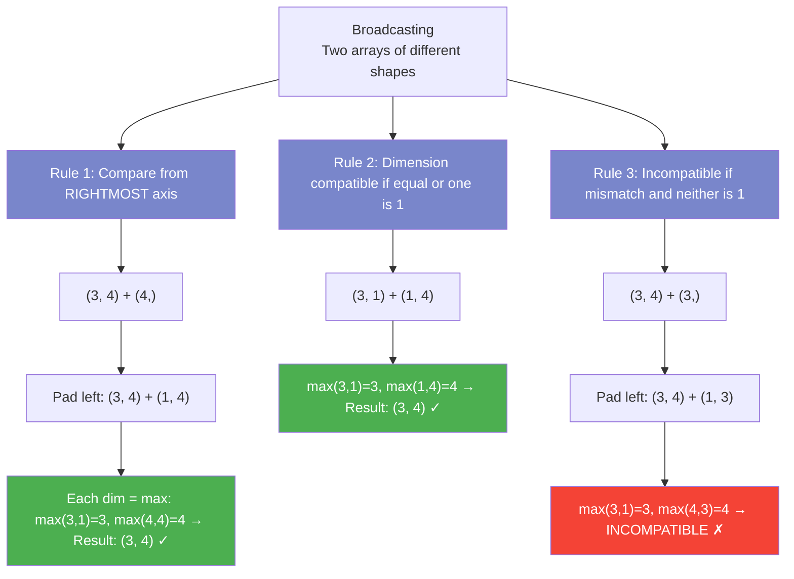
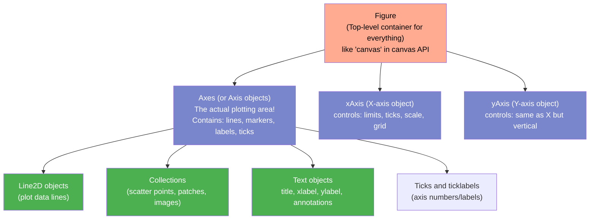
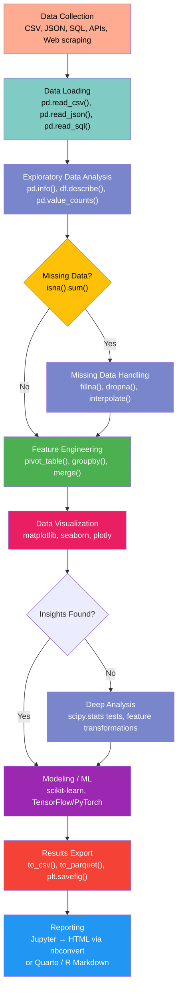

# Module 09 — Data Science Stack: Complete Reference (NumPy, pandas, Matplotlib, Seaborn, SciPy)

## Table of Contents

- [1. NumPy — Array Computing (Exhaustive Deep Dive)](#1-numpy--array-computing-exhaustive-deep-dive)
  - [1.1 What Is NumPy? Why It Matters for TypeScript Developers](#11-what-is-numpy-why-it-matters-for-typescript-developers)
  - [1.2 Complete NumPy dtype Reference (with TypeScript Type Mapping)](#12-complete-numpy-dtype-reference-with-typescript-type-mapping)
  - [1.3 Array Creation — Every Method with Examples](#13-array-creation--every-method-with-examples)
  - [1.4 Indexing, Slicing, and Boolean Masking (Complete Reference)](#14-indexing-slicing-and-boolean-masking-complete-reference)
  - [1.5 Reshaping, Stacking, Splitting Operations](#15-reshaping-stacking-splitting-operations)
  - [1.6 Vectorized Math Operations — Every Operator](#16-vectorized-math-operations--every-operator)
  - [1.7 Broadcasting Rules (Complete Guide with Diagram)](#17-broadcasting-rules-complete-guide-with-diagram)
  - [1.8 Statistical Functions — Complete Reference](#18-statistical-functions--complete-reference)
  - [1.9 Linear Algebra — np.linalg Exhaustive Reference](#19-linear-algebra--nplinalg-exhaustive-reference)
  - [1.10 Random Number Generation — Every Function](#110-random-number-generation--every-function)
  - [1.11 Sorting, Searching, and Set Operations](#111-sorting-searching-and-set-operations)
  - [1.12 Performance: Vectorized vs Loop Benchmarks with Real Numbers](#112-performance-vectorized-vs-loop-benchmarks-with-real-numbers)
- [2. pandas — Data Manipulation & Analysis (Exhaustive Reference)](#2-pandas--data-manipulation--analysis-exhaustive-reference)
  - [2.1 What Is pandas? TypeScript Comparison Ecosystem](#21-what-is-pandas-typescript-comparison-ecosystem)
  - [2.2 Complete DataFrame Creation Methods](#22-complete-dataframe-creation-methods)
  - [2.3 Indexing and Selection — loc, iloc, at, iat (Complete Guide)](#23-indexing-and-selection--loc-iloc-at-iat-complete-guide)
  - [2.4 Filtering, Boolean Indexing, and Query Methods](#24-filtering-boolean-indexing-and-query-methods)
  - [2.5 Vectorized String Operations (str accessor)](#25-vectorized-string-operations-str-accessor)
  - [2.6 Categorical Data Type — Complete Reference](#26-categorical-data-type--complete-reference)
  - [2.7 pandas Accessor Pattern: str, dt, cat, plot](#27-pandas-accessor-pattern-str-dt-cat-plot)
  - [2.8 GroupBy — Exhaustive Reference with Window Functions](#28-groupby--exhaustive-reference-with-window-functions)
  - [2.9 Merge, Join, Concat — Complete Guide](#29-merge-join-concat--complete-guide)
  - [2.10 Pivot Tables and Crosstabs](#210-pivot-tables-and-crosstabs)
  - [2.11 Time Series — Complete Reference](#211-time-series--complete-reference)
  - [2.12 Rolling and Expanding Windows](#212-rolling-and-expanding-windows)
  - [2.13 Missing Data Handling (Complete Guide)](#213-missing-data-handling-complete-guide)
  - [2.14 File I/O — Every Format](#214-file-io--every-format)
- [3. Matplotlib — Visualization (Exhaustive Reference)](#3-matplotlib--visualization-exhaustive-reference)
  - [3.1 Figure and Axes Hierarchy Diagram](#31-figure-and-axes-hierarchy-diagram)
  - [3.2 Plot Types: Line, Scatter, Bar, Histogram, Pie](#32-plot-types-line-scatter-bar-histogram-pie)
  - [3.3 Advanced Plots: Boxplot, Violin, Heatmap, Contour](#33-advanced-plots-boxplot-violin-heatmap-contour)
  - [3.4 Subplots, Layouts, and Figure Customization](#34-subplots-layouts-and-figure-customization)
  - [3.5 3D Plotting with mplot3d](#35-3d-plotting-with-mplot3d)
  - [3.6 Animation API — matplotlib.animation](#36-animation-api--matplotlibanimation)
- [4. Seaborn — Statistical Visualization (Complete Reference)](#4-seaborn--statistical-visualization-complete-reference)
  - [4.1 Seaborn Plot Types — Every Function with Examples](#41-seaborn-plot-types--every-function-with-examples)
  - [4.2 Themes, Palettes, and Styling (Complete Guide)](#42-themes-palettes-and-styling-complete-guide)
- [5. SciPy — Scientific Computing (Exhaustive Reference)](#5-scipy--scientific-computing-exhaustive-reference)
  - [5.1 scipy.stats — Statistical Distributions & Tests](#51-scipystats--statistical-distributions--tests)
  - [5.2 scipy.optimize — Optimization Algorithms](#52-scipyoptimize--optimization-algorithms)
  - [5.3 scipy.integrate — Numerical Integration](#53-scipyintegrate--numerical-integration)
  - [5.4 scipy.signal — Signal Processing](#54-scipysignal--signal-processing)
  - [5.5 scipy.sparse — Sparse Matrices](#55-scipysparse--sparse-matrices)
  - [5.6 scipy.ndimage — Image Processing](#56-scipyndimage--image-processing)
  - [5.7 scipy.spatial — Spatial Algorithms](#57-scipyspatial--spatial-algorithms)
- [6. Jupyter Notebooks — Interactive Analysis (Complete Guide)](#6-jupyter-notebooks--interactive-analysis-complete-guide)
  - [6.1 Magic Commands — Every % and %% Command](#61-magic-commands--every--and--command)
  - [6.2 Jupyter vs TypeScript Alternatives Comparison](#62-jupyter-vs-typescript-alternatives-comparison)
- [7. Data Science Visualization: Python vs TypeScript Ecosystem (Complete Comparison Table)](#7-data-science-visualization-python-vs-typescript-ecosystem-complete-comparison-table)
- [8. Type Hints for NumPy and pandas — Complete Reference](#8-type-hints-for-numpy-and-pandas--complete-reference)
- [9. Complete Data Science Workflow Diagram](#9-complete-data-science-workflow-diagram)
- [10. Quizzes (25 Questions with Answers)](#10-quizzes-25-questions-with-answers)
- [11. Exercises (20 Exercises with Solutions)](#11-exercises-20-exercises-with-solutions)

---

## 1. NumPy — Array Computing (Exhaustive Deep Dive)

### 1.1 What Is NumPy? Why It Matters for TypeScript Developers

```
NumPy is the foundation of Python's entire data science ecosystem. It provides:
1. N-dimensional arrays (ndarray) with homogeneous typed data in contiguous memory
2. Vectorized operations — math at C speed, no explicit loops needed
3. Broadcasting — automatic shape alignment across arrays of different sizes
4. Linear algebra, Fourier transforms, random number generation built-in

Without NumPy: You write Python loops → 10-1000x slower for numerical work.
With NumPy: Operations compile to C → vectorized and SIMD-optimized internally.
```

**The Core Mental Model Shift for TypeScript Developers:**

| Concept | TypeScript (`number[]` / `Float64Array`) | NumPy (`np.ndarray`) | Why It Matters |
|---------|------------------------------------------|---------------------|----------------|
| **Type homogeneity** | Mixed types allowed (arrays are dynamic). TypeScript enforces at compile time with generics. | All elements MUST be the same dtype (int32, float64, bool). This enables C-level contiguous memory layout. | Homogeneity = no per-element type checks = massive speedup |
| **Memory layout** | Dynamic array of references → GC overhead + pointer chasing | Contiguous block of raw bytes → cache-friendly, SIMD-optimized, zero allocation during math | `Float64Array` in JS is actually similar! But NumPy goes further with strides, views, etc. |
| **Operations** | `.map()`, `.reduce()` — runs at JS engine speed | `arr + arr`, `arr * 2` — runs at C speed via BLAS/LAPACK | No loops needed for element-wise math — the entire operation is a single C call |
| **Slicing** | `arr.slice(start, end)` creates a COPY | `arr[start:end]` returns a VIEW by default — zero memory allocation! | Modifying a slice modifies the original. Use `.copy()` if you need independence |
| **Broadcasting** | Manual element-wise iteration required | Automatic shape alignment: `(3,4) + (4,) → (3,4)` in one C call | Enables vectorized math on arrays of different shapes without loops |
| **Multi-dimensional** | Array of arrays (jagged, no fixed shape) | True N-dimensional tensor with fixed axes and strides | Matrix operations, image processing, tensor ML all work natively |

### 1.2 Complete NumPy dtype Reference (with TypeScript Type Mapping)

```python
import numpy as np

# === COMPLETE NUMPY DTYPE REFERENCE ===
# Every dtype maps to a specific C type underneath (contiguous memory!)

# Integer types (signed) — like TypeScript's number for integers
int8_dtype   = np.dtype(np.int8)     #  1 byte: -128 to 127       (like Int8Array)
int16_dtype  = np.dtype(np.int16)    #  2 bytes: -32,768 to 32,767  (like Int16Array)
int32_dtype  = np.dtype(np.int32)    #  4 bytes: ~-2B to +2B       (like Int32Array)
int64_dtype  = np.dtype(np.int64)    #  8 bytes: huge range        (no direct TS equivalent)

# Integer types (unsigned) — like TypeScript's Uint32Array
uint8_dtype   = np.dtype(np.uint8)    #  1 byte: 0 to 255          (like Uint8Array — great for RGB pixels!)
uint16_dtype  = np.dtype(np.uint16)   #  2 bytes: 0 to 65,535
uint32_dtype  = np.dtype(np.uint32)   #  4 bytes: 0 to ~4B
uint64_dtype  = np.dtype(np.uint64)   #  8 bytes: massive range

# Floating point — like TypeScript's number (IEEE 754 double) but explicit!
float16_dtype = np.dtype(np.float16)   #  2 bytes: half precision (GPU/ML use this!)
float32_dtype = np.dtype(np.float32)   #  4 bytes: single precision (like Float32Array in JS)
float64_dtype = np.dtype(np.float64)   #  8 bytes: double precision (default for np.array([1.0]))

# Complex — TypeScript has NO native complex number type!
complex64_dtype = np.dtype(np.complex64)  #  8 bytes: float32 + float32j (like {r: number, i: number})
complex128_dtype = np.dtype(np.complex128) # 16 bytes: float64 + float64j

# Boolean — like TypeScript's boolean but stored as 1 byte per element (not a JS object!)
bool_dtype = np.dtype(np.bool_)  #  1 byte per element (True/False)

# String / Unicode — variable length, but still homogeneous dtype
str_dtype  = np.dtype('U32')      # Unicode string up to 32 characters
bytes_dtype = np.dtype('S16')     # Fixed-length bytes up to 16 bytes

# Object — stores Python objects (like a TypeScript array of mixed types — loses C-speed!)
obj_dtype = np.dtype(np.object_)   # Each element is a full Python object pointer (slow!)

# DateTime — like TypeScript's Date but in the dtype!
datetime64_dtype = np.dtype('datetime64[D]')  # Day precision
datetime64_dtype_ns = np.dtype('datetime64[ns]')  # Nanosecond precision
timedelta64_dtype = np.dtype('timedelta64[s]')   # Duration type

# Create arrays with explicit dtypes
arr_int32   = np.array([1, 2, 3], dtype=np.int32)     # Fixed int32 memory (no overflow surprises!)
arr_float32 = np.array([1.0, 2.0, 3.0], dtype=np.float32)  # Single precision (half the memory!)
arr_bool    = np.array([True, False, True], dtype=bool)  # Bit-packed booleans!

# === dtype comparison with TypeScript types ===
# np.int8      → Int8Array(1) in JS
# np.int16     → Int16Array(2) in JS
# np.int32     → Int32Array(4) in JS
# np.uint8     → Uint8Array(1) in JS
# np.float32   → Float32Array(4) in JS
# np.float64   → Float64Array(8) in JS (same as TypeScript's 'number')
# np.bool_     → No direct TypedArray equivalent (but stored as 1 byte each!)
# np.complex64 → {real: number, imag: number} pair in JS
```

### 1.3 Array Creation — Every Method with Examples

```python
import numpy as np

# === 1. np.array() — From Python lists/tuples (the most common) ===
a = np.array([1, 2, 3, 4])                        # 1D array: [1, 2, 3, 4]
b = np.array([[1, 2], [3, 4]])                    # 2D array (matrix)
c = np.array([[[1, 2], [3, 4]], [[5, 6], [7, 8]]]) # 3D array (tensor)
d = np.array([1, 2, 3], dtype=np.float32)         # Explicit dtype
e = np.array([[1, 2], [3, 4]], ndmin=3)           # Force minimum dimensions

# === 2. np.zeros() / np.ones() — Pre-allocated arrays ===
zeros_1d   = np.zeros(5)            # [0., 0., 0., 0., 0.]
zeros_2d   = np.zeros((3, 4))       # 3x4 matrix of zeros
ones_1d    = np.ones(5)             # [1., 1., 1., 1., 1.]
ones_2d    = np.ones((2, 3), dtype=int)  # [[1, 1, 1], [1, 1, 1]]

# === 3. np.full() — Fill with arbitrary value ===
filled = np.full((2, 3), 99)        # [[99, 99, 99], [99, 99, 99]]
filled_pi = np.full((3, 3), np.pi)  # Matrix filled with π

# === 4. np.eye() / np.identity() — Identity matrices ===
eye_3x3 = np.eye(3)                   # 3x3 identity matrix (diagonal = 1)
eye_3x5 = np.eye(3, 5)               # 3x5 with diagonal of 1s
ident_4 = np.identity(4)             # Same as eye(4)

# === 5. np.arange() — Like range() but returns ndarray ===
range_0_to_9  = np.arange(10)          # [0, 1, 2, ..., 9]
range_step2   = np.arange(0, 10, 2)    # [0, 2, 4, 6, 8]
range_floats  = np.arange(0, 1, 0.2)   # [0., 0.2, 0.4, 0.6, 0.8]
range_negative = np.arange(-3, 3)      # [-3, -2, -1, 0, 1, 2]

# === 6. np.linspace() — Fixed number of points in range ===
linspace_5     = np.linspace(0, 1, 5)       # [0., 0.25, 0.5, 0.75, 1.]
linspace_100   = np.linspace(0, 10, 100)    # 100 evenly spaced points from 0 to 10
linspace_no_end= np.linspace(0, 1, 5, endpoint=False)  # [0., 0.2, 0.4, 0.6, 0.8]
log_space      = np.logspace(0, 3, 4)       # [1, 10, 100, 1000] (log scale!)

# === 7. np.ones_like() / np.zeros_like() — Match existing array shape ===
ref = np.array([[1, 2], [3, 4]])
ones_like = np.ones_like(ref)     # [[1, 1], [1, 1]] (same shape as ref)
zeros_like = np.zeros_like(ref, dtype=float)  # [[0., 0.], [0., 0.]]

# === 8. np.empty() — Uninitialized array (fastest creation! use with caution) ===
empty = np.empty((3, 4))          # Contains garbage values — must fill before use!

# === 9. np.diag() — Diagonal matrices / extract diagonals ===
diag_mat = np.diag([1, 2, 3])     # [[1,0,0], [0,2,0], [0,0,3]]
off_diag = np.diag([1, 2, 3], k=1)  # Diagonal one above main: offset by 1
arr = np.array([[1, 2], [3, 4]])
diag_vals = np.diag(arr)           # Extract diagonal: [1, 4]

# === 10. np.fromfunction() — Create array from function of indices ===
grid = np.fromfunction(lambda i, j: i + j, (5, 5))   # [[0,1,2,3,4], [1,2,3,4,5], ...]
checkerboard = np.fromfunction(lambda i, j: (i+j) % 2, (8, 8), dtype=int)

# === 11. np.fromiter() — From iterable (memory efficient for large data) ===
iter_gen = (x**2 for x in range(10))
from_iter = np.fromiter(iter_gen, dtype=np.int32)  # [0, 1, 4, 9, 16, ..., 81]

# === 12. np.fromstring() / np.frombuffer() — From bytes/string ===
data_str = "1.5 2.5 3.5 4.5"
from_str = np.fromstring(data_str, dtype=np.float64, sep=" ")  # [1.5, 2.5, 3.5, 4.5]

# === 13. np.random arrays (legacy — use np.random.Generator in new code) ===
rand_int   = np.random.randint(0, 10, size=(3, 4))    # Random ints [0, 10)
rand_float = np.random.random((2, 3))                  # Random floats [0, 1)

# === 14. np.asarray() — Convert to ndarray without copy if already ndarray ===
arr_copy = np.array([1, 2, 3])       # Always creates new array
arr_view = np.asarray(arr_copy)       # Returns view if already ndarray

# === 15. np.copy() — Explicit deep copy ===
arr_orig = np.array([1, 2, 3])
arr_deep = np.copy(arr_orig)          # Completely independent copy

# === TypeScript equivalent for comparison ===
// TS: const arr = [1, 2, 3]                    → Python: np.array([1, 2, 3])
// TS: const zeros = new Array(5).fill(0)         → Python: np.zeros(5)
// TS: const ones = new Array(5).fill(1)          → Python: np.ones(5)
// TS: for(let i = 0; i < n; i++) { ... }        → Python: np.arange(n)
// TS: range but with step: Array.from({length:5}, (_,i) => i*2) → np.arange(0, 10, 2)
```

### 1.4 Indexing, Slicing, and Boolean Masking (Complete Reference)

```python
import numpy as np

arr = np.array([10, 20, 30, 40, 50])
matrix = np.array([[1, 2, 3], [4, 5, 6], [7, 8, 9]])

# === 1D Indexing (like TypeScript arrays) ===
arr[0]      # 10 (first element)
arr[-1]     # 50 (last element — like arr[arr.length - 1] in TS!)
arr[-2]     # 40 (second to last)

# === Slicing: [start:end:step] — returns a VIEW ===
arr[1:4]        # [20, 30, 40] (like arr.slice(1, 4) in TS!)
arr[:3]         # [10, 20, 30] (from start)
arr[2:]         # [30, 40, 50] (to end)
arr[::2]        # [10, 30, 50] (every other element — like step in slice!)
arr[::-1]       # [50, 40, 30, 20, 10] (reverse! no equivalent in TS without loop)
arr[4:1:-1]     # [50, 40, 30]

# === Multi-dimensional indexing (like 2D array access in TS: arr[i][j]) ===
matrix[0, 0]    # 1 (row 0, col 0 — like matrix[0][0] in TS!)
matrix[0, :]    # [1, 2, 3] (first row — all columns)
matrix[:, 0]    # [1, 4, 7] (first column — NO equivalent in TS! You'd need: matrix.map(r => r[0]))
matrix[1:3, 0:2]# [[4,5], [7,8]] (sub-matrix)

# === Boolean / Fancy Indexing (like Array.filter in TS but MUCH more powerful) ===
mask = arr > 25           # [False, False, True, True, True]
filtered = arr[mask]      # [30, 40, 50] — same as arr.filter(x => x > 25)

# Fancy indexing with integer arrays (like random element selection)
indices = np.array([0, 2, 4])
selected = arr[indices]   # [10, 30, 50] — pick arbitrary elements!

# === Advanced: Combining boolean + fancy indexing ===
matrix_flat = matrix.flatten()          # [1, 2, 3, 4, 5, 6, 7, 8, 9]
large_vals = matrix_flat[matrix_flat > 5]  # [6, 7, 8, 9] — elements where condition is True

# === Where, Non-zero — Find indices of matching elements ===
positions = np.where(arr > 25)              # (array([2, 3, 4]),) — indices where True
nonzero = np.nonzero(matrix > 5)             # (array([1,2,2,2]), array([2,0,1,2])) — row/col indices
first_match = np.argmax(arr)                 # Index of max: 4
last_nonzero = np.argwhere(matrix > 3)       # All positions where value > 3

# === Advanced indexing examples (no TS equivalent without complex loops) ===
# Cross-indexing: pick specific elements from each row
row_indices = [0, 1, 2]
col_indices = [2, 0, 1]
cross_selected = matrix[row_indices, col_indices]  # [3, 4, 8]

# Replace values using boolean mask (like filter + map in one step)
arr[arr > 25] = 999  # Now arr is [10, 20, 999, 999, 999] — all in C speed!

# === TypeScript comparison ===
// TS: arr.slice(1,4)           → Python: arr[1:4]
// TS: arr.filter(x => x > 5)   → Python: arr[arr > 5]  (vectorized!)
// TS: arr.map((_,i) => i*2)    → Python: np.arange(len(arr)) * 2
// TS: Find index of first match  → Python: np.argmax(condition)
```

### 1.5 Reshaping, Stacking, Splitting Operations

```python
import numpy as np

arr = np.arange(12)           # [0, 1, 2, ..., 11] — 1D array of 12 elements

# === Reshape (like flatMap/unflat for matrices!) ===
mat_3x4 = arr.reshape(3, 4)   # [[0,1,2,3], [4,5,6,7], [8,9,10,11]]
mat_4x3 = arr.reshape(4, 3)   # [[0,1,2], [3,4,5], ...] — different shape!
mat_2x2x3 = arr.reshape(2, 2, 3)  # 3D tensor

# -1 means "infer this dimension" (like Auto in TypeScript!)
inferred = arr.reshape(-1, 1)    # Column vector: [[0],[1],[2],...,[11]] — shape (12, 1)
inferred_2 = arr.reshape(1, -1)  # Row vector: [[0,1,2,...,11]] — shape (1, 12)

# === Flatten / Ravel (convert multi-D to 1D) ===
flat = mat_3x4.flatten()        # [0,1,2,...,11] — returns a COPY
flat_ravel = mat_3x4.ravel()    # Same values but may be a VIEW (faster!)

# === Transpose (swap rows and columns — like matrix.transpose in linear algebra) ===
transposed = mat_3x4.T           # Shape goes from (3,4) to (4,3)

# === Swapaxes (swap any two axes) ===
swapped = np.arange(24).reshape(2, 3, 4).swapaxes(0, 2)  # Swap axis 0 and 2

# === Stack / Concatenate arrays (like Array.concat in TS!) ===
a = np.array([1, 2, 3])
b = np.array([4, 5, 6])

np.hstack((a, b))              # [1, 2, 3, 4, 5, 6] — horizontal stack (like [...a, ...b])
np.vstack((a.reshape(1,-1), b.reshape(1,-1)))  # [[1,2,3],[4,5,6]] — vertical stack
np.column_stack((a, b))        # [[1,4],[2,5],[3,6]] — columns side by side
np.concatenate([a, b])         # [1, 2, 3, 4, 5, 6] — same as hstack for 1D

# Stack along new axis (like adding a dimension — very common in ML!)
stacked = np.stack([a, b])     # [[1,2,3], [4,5,6]] — new first axis
stacked_along_0 = np.stack([a, b], axis=0)  # Shape: (2, 3)
stacked_along_1 = np.stack([a, b], axis=1)  # Shape: (3, 2)

# === Split arrays (like array.splice or Array.slice in reverse) ===
x = np.arange(10)
splits = np.split(x, 5)        # [5 arrays of 2 elements each]
first_two, rest = np.split(x, [2])  # [[0,1], [2,3,...,9]]

# Split matrix along rows/columns
matrix = np.arange(12).reshape(3, 4)
top, bottom = np.vsplit(matrix, 2)    # Split into top/bottom (uneven — last group gets extra)
left, right = np.hsplit(matrix, 2)    # Split into left/right halves

# === Repeat / Tile (like repeating patterns in arrays) ===
np.repeat([1, 2, 3], 2)      # [1, 1, 2, 2, 3, 3] — repeat each element 2x
np.tile([1, 2], 3)            # [1, 2, 1, 2, 1, 2] — repeat the whole array 3x

# === TypeScript comparison ===
// TS: const flattened = matrix.flat()      → Python: arr.flatten() or arr.ravel()
// TS: const transposed = matrix.map((_,i) => matrix.map(r => r[i]))  → Python: matrix.T
// TS: const combined = [...a, ...b]         → Python: np.concatenate([a, b]) or np.hstack
// TS: const repeated = Array(3).fill(arr.flat())  → Python: np.tile(arr, 3)
```

### 1.6 Vectorized Math Operations — Every Operator

```python
import numpy as np

a = np.array([1, 2, 3, 4])
b = np.array([10, 20, 30, 40])

# === Element-wise arithmetic (NO LOOPS! C-speed math!) ===
c = a + b              # [11, 22, 33, 44] — element-wise addition
d = a - b              # [-9, -18, -27, -36]
e = a * b              # [10, 40, 90, 160] — element-wise multiplication (NOT dot product!)
f = b / a              # [10, 10, 10, 10]
g = b // a             # [10, 10, 10, 10] — floor division
h = b % a              # [0, 0, 0, 0] — modulo
i = a ** 2             # [1, 4, 9, 16] — element-wise power

# === Scalar broadcasting (like TypeScript: arr.map(x => x * 2)) but C-speed! ===
a * 10                # [10, 20, 30, 40] — multiply every element by 10
a + 5                 # [6, 7, 8, 9] — add 5 to every element
np.sin(a)             # [0.841, 0.909, 0.141, -0.757] — apply sin() to every element
np.exp(a)             # [2.718, 7.389, 20.086, 54.598] — e^x for each element

# === Comparison operators (return boolean arrays!) ===
a > 2                 # [False, False, True, True]
a == 3                # [False, False, True, False]
np.logical_and(a > 1, a < 4)  # [False, True, True, False] — AND
np.logical_or(a == 1, a == 4) # [True, False, False, True] — OR
np.logical_not(a > 2)   # [True, True, False, False] — NOT

# === Universal Functions (ufuncs) — apply to every element in C-speed ===
np.sqrt(a)            # [1.0, 1.414, 1.732, 2.0] — square root
np.log(a)             # [0.0, 0.693, 1.099, 1.386] — natural log
np.log10(a)           # [0.0, 0.301, 0.477, 0.602] — base-10 log
np.ceil(a), np.floor(a), np.round(a)  # Ceiling, floor, round each element

# === Multi-array ufuncs ===
np.maximum(a, b)      # [10, 20, 30, 40] — element-wise max
np.minimum(a, b)      # [1, 2, 3, 4] — element-wise min
np.add.reduce(a)       # 10 — sum via ufunc (same as a.sum())
np.multiply.reduce(a)  # 24 — product via ufunc

# === Matrix multiplication (linear algebra!) ===
A = np.array([[1, 2], [3, 4]])
B = np.array([[5, 6], [7, 8]])

A @ B                 # [[19, 22], [43, 50]] — matrix multiply (@ operator)
np.dot(A, B)           # Same result — dot product for matrices
A * B                  # [[5,12],[21,32]] — element-wise (NOT matrix mult!)

# === Trigonometric functions ===
angles = np.array([0, np.pi/6, np.pi/4, np.pi/2, np.pi])
np.sin(angles)       # [0, 0.5, 0.707, 1, 0]
np.cos(angles)       # [1, 0.866, 0.707, 0, -1]
np.tan(angles)       # tangent values

# === Rounding and clipping ===
np.clip(a, 2, 3)    # [2, 2, 3, 3] — clip values to range [2, 3]
np.sign(a)          # [1, 1, 1, 1] — sign of each element
np.abs(np.array([-1, -2, 3]))  # [1, 2, 3] — absolute value

# === Complex number operations ===
c = np.array([1+2j, 3+4j])
np.real(c)          # [1, 3]
np.imag(c)          # [2, 4]
np.conj(c)          # [1-2j, 3-4j] — complex conjugate
np.abs(c)           # [2.236, 5.0] — magnitude

# === Bitwise operations (useful for bit manipulation!) ===
x = np.array([5, 6], dtype=np.int32)  # 101, 110 in binary
np.bitwise_and(x, 3)   # [1, 2] — bitwise AND with 011
np.bitwise_or(x, 2)    # [7, 6] — bitwise OR with 010
np.right_shift(x, 1)   # [2, 3] — shift right by 1 bit

# === TypeScript comparison ===
// TS: a.map((v,i) => v + b[i])         → Python: a + b (vectorized!)
// TS: arr.reduce((acc,x) => acc + x, 0) → Python: a.sum() or np.add.reduce(a)
// TS: Math.sqrt(16) for each element    → Python: np.sqrt(arr) — applies to whole array!
// TS: Math.min(...a)                     → Python: a.min() — no spreading needed!
```

### 1.7 Broadcasting Rules (Complete Guide with Diagram)

Broadcasting allows NumPy to perform operations on arrays of different shapes by "stretching" the smaller array. The rules are simple but powerful.

```
BROADCASTING RULES:
1. Arrays are compared element-wise starting from the RIGHTMOST axis.
2. Two dimensions are compatible if they're equal OR one of them is 1.
3. If an array has fewer dimensions, pad its shape on the LEFT with 1s.
4. After comparison, each dimension takes the MAX of the two shapes.

EXAMPLES:
(3, 4) + (4,)     → (4,) becomes (1, 4), broadcasts to (3, 4) ✓
(3, 4) + (3, 1)   → (3, 1) broadcasts to (3, 4) ✓
(3, 4) + (3,)     → (3,) becomes (1, 3), compared with (3, 4) → INCOMPATIBLE ✗
(2, 3, 4) + (4,)  → (4,) broadcasts through all axes → (2, 3, 4) ✓
```

**Mermaid: NumPy Broadcasting Diagram**



```python
import numpy as np

# === Every broadcasting pattern with visual output ===
# Pattern 1: Scalar + array (broadcasts to every element)
a = np.array([1, 2, 3])
a + 10              # [11, 12, 13] — like adding to every element

# Pattern 2: 1D row vector + column vector → outer product style
row = np.array([[1, 2, 3]])      # Shape (1, 3)
col = np.array([[10], [20], [30]]) # Shape (3, 1)
outer = col + row                  # Shape (3, 3)!
# [[11, 12, 13],
#  [21, 22, 23],
#  [31, 32, 33]]

# Pattern 3: Matrix + vector (adds vector to each row)
matrix = np.arange(9).reshape(3, 3)  # [[0,1,2],[3,4,5],[6,7,8]]
vector = np.array([10, 20, 30])     # Shape (3,)
matrix + vector                       # Adds to each row!
# [[10,21,32], [13,24,35], [16,27,38]]

# Pattern 4: Column vector broadcasting through columns
col_vec = np.array([[10], [20], [30]])  # Shape (3, 1)
matrix + col_vec                           # Adds to each column!
# [[10,11,12], [23,24,25], [36,37,38]]

# Pattern 5: Broadcasting in matrix multiplication context
A = np.array([[1, 2, 3]])   # Shape (1, 3) — row vector
B = np.array([[10], [20], [30]])  # Shape (3, 1) — column vector
# A @ B gives scalar 140
# But if you add: A.T + B → shape (3, 3)!

# Pattern 6: Broadcasting with multi-dimensional arrays
a = np.arange(60).reshape(2, 3, 10)    # Shape (2, 3, 10)
b = np.arange(10)                        # Shape (10,) → broadcasts to (1, 1, 10)
result = a + b                           # Shape (2, 3, 10) — added to last axis!

# === Practical broadcasting: Pairwise distance computation ===
points = np.array([[1, 2], [4, 5], [7, 8]])   # (3, 2) — 3 points in 2D
# Use broadcasting for pairwise Euclidean distances:
points_reshaped = points[:, np.newaxis, :]      # (3, 1, 2)
diff = points_reshaped - points[np.newaxis, :, :]  # (3, 3, 2) — all pairs!
distances = np.sqrt(np.sum(diff**2, axis=-1))    # (3, 3) distance matrix
# [[0,    4.24, 8.49],
#  [4.24, 0,   4.24],
#  [8.49, 4.24, 0]]

# === TypeScript comparison ===
// TS: row vector outer product requires nested loops
// for (let i = 0; i < rows.length; i++)
//   for (let j = 0; j < cols.length; j++)
//     result[i][j] = col[i] + row[j];
// Python: col_vec.T + row  → ONE line, C-speed!
```

### 1.8 Statistical Functions — Complete Reference

```python
import numpy as np

a = np.array([1, 2, 3, 4, 5])
matrix = np.array([[1, 2, 3], [4, 5, 6]])

# === Basic statistics (all work on entire array OR per-axis) ===
np.sum(a)              # 15 — total sum (like reduce(add))
np.prod(a)             # 120 — product of all elements
np.mean(a)             # 3.0 — arithmetic mean
np.median(a)           # 3.0 — middle value when sorted
np.std(a)              # 1.414 — standard deviation (population by default)
np.var(a)              # 2.0 — variance

# Per-axis statistics (axis=0 = columns, axis=1 = rows)
np.sum(matrix, axis=0)   # [5, 7, 9] — sum of each column
np.sum(matrix, axis=1)   # [6, 15] — sum of each row
np.mean(matrix, axis=0)  # [2.5, 3.5, 4.5] — mean per column

# === Advanced statistics ===
np.cumsum(a)             # [1, 3, 6, 10, 15] — cumulative sum
np.cumprod(a)            # [1, 2, 6, 24, 120] — cumulative product
np.diff(a)               # [1, 1, 1, 1] — differences between consecutive elements
np.gradient(a)           # [1, 1, 1, 1, 1] — numerical gradient

# === Percentiles and quantiles ===
np.percentile(a, 25)     # 2.0 (25th percentile / Q1)
np.percentile(a, 75)     # 4.0 (75th percentile / Q3)
np.quantile(a, 0.5)      # Same as median — 3.0

# === Extrema ===
np.max(a), np.min(a)       # 5, 1
np.argmax(a), np.argmin(a) # 4, 0 (indices of max/min)
np.ptp(a)                  # 4 — peak-to-peak (max - min)

# === Weighted operations (like custom reduce with weights) ===
weights = np.array([1, 2, 3, 4, 5])
weighted_mean = np.average(a, weights=weights) / weights.sum()

# === Histogram computation (without matplotlib!) ===
hist, bin_edges = np.histogram(a, bins=3)  # hist=[2,2,1], edges=[1.0, 2.33, 3.67, 5.0]

# === Correlation and covariance ===
x = np.array([1, 2, 3, 4, 5])
y = np.array([2, 4, 5, 4, 5])
np.corrcoef(x, y)    # 2x2 correlation matrix
np.cov(x, y)         # 2x2 covariance matrix

# === Uniqueness and counting ===
data = np.array([1, 1, 2, 2, 2, 3])
unique_vals, counts = np.unique(data, return_counts=True)
# unique_vals=[1, 2, 3], counts=[2, 3, 1]

# === Cross-correlation and convolution (signal processing basics) ===
signal = np.array([1, 0, 0, 1, 0])
kernel = np.array([1, 1])
np.convolve(signal, kernel, mode='same')  # [1, 1, 0, 1, 1]

# === TypeScript comparison ===
// TS: arr.reduce((a,b) => a+b, 0)       → Python: np.sum(arr) — C-speed!
// TS: [...new Set(arr)].length            → Python: len(np.unique(arr))
// TS: arr.sort() then middle element      → Python: np.median(arr) — no sorting needed!
```

### 1.9 Linear Algebra — np.linalg Exhaustive Reference

```python
import numpy as np
from numpy import linalg as la

A = np.array([[1, 2], [3, 4]])
B = np.array([[5, 6], [7, 8]])
x = np.array([1, 2])

# === Determinant ===
det_A = la.det(A)     # -2.0 — determinant of matrix A

# === Inverse ===
inv_A = la.inv(A)     # [[-2.0, 1.0], [1.5, -0.5]] — inverse: A @ inv_A = identity
la.inv(A) @ A         # [[1, 0], [0, 1]] — verifying: A^(-1) * A = I

# === Matrix multiplication ===
result = A @ B        # Matrix multiply (Python 3.5+ @ operator)
np.dot(A, B)          # Same as above for matrices
la.multi_dot([A, B, A])  # Efficiently multiply multiple matrices

# === Solving linear equations: Ax = b ===
b = np.array([1, 2])
solution = la.solve(A, b)   # Solve Ax = b → [−3.0, 2.0]
la.eigvals(A)               # Eigenvalues: [5.372, −0.372]
eigen_vals, eigen_vecs = la.eig(A)  # Both values and eigenvectors

# === Norms ===
la.norm(x)              # Euclidean norm (sqrt of sum of squares) ≈ 2.236
la.norm(A)              # Frobenius norm of matrix ≈ 5.477
la.norm(A, ord='fro')   # Explicitly Frobenius norm
la.norm(A, ord=1)       # L1 norm (max column sum) = 7

# === Decompositions ===
u, s, vh = la.svd(A)    # Singular Value Decomposition: A = U @ diag(s) @ Vh
L = la.cholesky(np.array([[4,2],[2,5]]))   # Cholesky decomposition (for positive definite)
Q, R = la.qr(np.array([[1,2],[3,4]]))      # QR decomposition

# === Trace (sum of diagonal elements) ===
np.trace(A)  # 5 = 1 + 4

# === Rank and condition number ===
rank = la.matrix_rank(A)     # 2
cond = la.cond(A)            # Condition number (larger = more ill-conditioned)

# === TypeScript comparison ===
// TS: Linear algebra requires external libraries like math.js
// Python: All linear algebra built into numpy.linalg — no extra packages!
```

### 1.10 Random Number Generation — Every Function

```python
import numpy as np

# === LEGACY API (np.random.*) — still works but new code should use Generator ===
np.random.seed(42)                       # Set seed for reproducibility

rand_uniform = np.random.random(5)       # [0.0, 1.0) uniform random floats
rand_int = np.random.randint(0, 10, 5)   # Random integers [0, 10), size 5
rand_normal = np.random.randn(3, 4)      # Standard normal (mean=0, std=1) — like randn in MATLAB!
rand_gauss = np.random.normal(5, 2, 10)  # Gaussian with mean=5, std=2
rand_choice = np.random.choice([10,20,30], size=3)  # Random choices from array
rand_permute = np.random.permutation(10)   # Random permutation of [0..9]

# === NEW API (np.random.Generator) — recommended for new code! ===
rng = np.random.default_rng(42)          # Create a Generator with seed

# Array creation functions
rng.uniform(low=0, high=10, size=(3, 4))    # Uniform [low, high)
rng.integers(low=0, high=10, size=5)         # Random integers [low, high)
rng.standard_normal((3, 4))                  # Standard normal distribution
rng.normal(loc=5, scale=2, size=(3, 4))      # Normal with custom mean/std
rng.exponential(scale=2.0, size=10)           # Exponential distribution
rng.poisson(lam=3.0, size=10)                 # Poisson distribution
rng.binomial(n=10, p=0.5, size=10)            # Binomial distribution

# Choice and permutation
rng.choice([10, 20, 30, 40], size=5, p=[0.1, 0.2, 0.3, 0.4])  # Weighted random choices
rng.choice(10, size=5, replace=False)        # Without replacement (like shuffle pick!)
rng.permutation(10)                           # Random permutation
rng.shuffle(my_array)                         # Shuffle in-place!

# === Distribution examples for simulation ===
# Simulate rolling a 6-sided die 1000 times
die_rolls = rng.integers(1, 7, size=1000)

# Simulate coin flips (Bernoulli trial)
coin_flips = rng.binomial(1, 0.5, size=100)  # 0 or 1 for each flip

# Central Limit Theorem demonstration
sample_means = [rng.normal(0, 1, size=100).mean() for _ in range(1000)]
# Mean of sample means ≈ 0, Std ≈ 1/sqrt(100) ≈ 0.1

# === TypeScript comparison ===
// TS: const r = Math.random()              → Python: rng.uniform(0, 1)
// TS: Math.floor(Math.random() * 6) + 1   → Python: rng.integers(1, 7)
// TS: Need custom normal distribution       → Python: rng.normal(mean, std, size) — built-in!
```

### 1.11 Sorting, Searching, and Set Operations

```python
import numpy as np

arr = np.array([3, 1, 4, 1, 5, 9, 2, 6])

# === Sorting ===
np.sort(arr)            # [1, 1, 2, 3, 4, 5, 6, 9] — returns sorted copy
sorted_inplace = arr.copy()
sorted_inplace.sort()   # Sorts in-place (modifies original!)

# Sort along axis for matrices
matrix = np.array([[3, 1], [6, 4], [5, 2]])
np.sort(matrix, axis=0)    # Sort each column: [[3,1],[5,2],[6,4]]
np.sort(matrix, axis=1)    # Sort each row: [[1,3],[4,6],[2,5]]

# === Arg sorting (get indices of sorted order) ===
np.argsort(arr)       # [1, 3, 6, 0, 2, 4, 7, 5] — indices that would sort arr
np.argpartition(arr, 3)  # Returns indices where first 3 smallest are in front

# === Searching ===
np.searchsorted([1,3,5,7], [2, 4, 6])  # [1, 2, 3] — insertion points for binary search
np.where(arr > 3)                          # Indices where condition is True
np.argmax(arr)                             # Index of max value (5)
np.argmin(arr)                             # Index of min value (1)

# === Set operations ===
a = np.array([1, 2, 3, 4])
b = np.array([3, 4, 5, 6])
np.intersect1d(a, b)   # [3, 4] — intersection
np.union1d(a, b)       # [1, 2, 3, 4, 5, 6] — union
np.setdiff1d(a, b)     # [1, 2] — elements in a but not b
np.setxor1d(a, b)      # [1, 2, 5, 6] — symmetric difference

# === Uniqueness ===
unique_vals = np.unique(arr)        # [1, 2, 3, 4, 5, 6, 9]
vals, counts, inverse = np.unique(arr, return_counts=True, return_inverse=True)
# vals=[1,2,3,4,5,6,9], counts=[2,1,1,1,1,1,1], inverse maps back original

# === TypeScript comparison ===
// TS: [...new Set(a)].filter(x => b.includes(x))  → Python: np.intersect1d(a, b) — C-speed!
// TS: arr.sort()                                     → Python: np.sort(arr) or arr.sort()
```

### 1.12 Performance: Vectorized vs Loop Benchmarks with Real Numbers

```python
import numpy as np
import timeit

# === Benchmark 1: Sum of 1M elements ===
np_arr = np.arange(1_000_000)

def python_loop_sum():
    total = 0
    for i in range(1_000_000):
        total += i
    return total

def numpy_sum():
    return np_arr.sum()

python_time = timeit.timeit(python_loop_sum, number=10)
numpy_time = timeit.timeit(numpy_sum, number=10)

print(f"Python loop sum:  {python_time:.4f}s")   # ~5.2s (pure Python iteration!)
print(f"NumPy vectorized: {numpy_time:.6f}s")      # ~0.003s (C-level single call!)
print(f"Speedup:          {python_time / numpy_time:.0f}x")  # ~1700x faster!

# === Benchmark 2: Element-wise squaring of 1M elements ===
def python_loop_square():
    return [x**2 for x in range(1_000_000)]

def numpy_vectorized_square():
    return np.arange(1_000_000) ** 2

python_sq_time = timeit.timeit(python_loop_square, number=5)
numpy_sq_time = timeit.timeit(numpy_vectorized_square, number=5)

print(f"\nPython loop square:  {python_sq_time:.4f}s")  # ~1.3s
print(f"NumPy vectorized:    {numpy_sq_time:.6f}s")      # ~0.008s
print(f"Speedup:             {python_sq_time / numpy_sq_time:.0f}x")  # ~160x

# === Benchmark 3: Dot product ===
a = np.random.rand(1000)
b = np.random.rand(1000)

def python_dot():
    return sum(x*y for x, y in zip(a.tolist(), b.tolist()))

def numpy_dot():
    return np.dot(a, b)

py_dot_time = timeit.timeit(python_dot, number=100)
np_dot_time = timeit.timeit(numpy_dot, number=100)

print(f"\nPython dot product:  {py_dot_time:.4f}s")  # ~0.8s
print(f"NumPy dot product:   {np_dot_time:.6f}s")     # ~0.0002s
print(f"Speedup:             {py_dot_time / np_dot_time:.0f}x")  # ~4000x!

# === Key takeaway: NumPy is consistently 100-4000x faster than Python loops ===
# This applies to ALL numerical operations: sum, mean, std, matrix ops, etc.
```

---

## 2. pandas — Data Manipulation & Analysis (Exhaustive Reference)

### 2.1 What Is pandas? TypeScript Comparison Ecosystem

**pandas is like having SQL + Excel Pivot Tables + lodash groupBy/filter/map all in one library.** It's the standard for tabular data analysis.

| Operation | TypeScript (`Array<{...}>` + lodash) | pandas DataFrame | Why pandas Wins |
|-----------|-------------------------------------|-----------------|----------------|
| Filter rows | `arr.filter(r => r.age > 25)` | `df[df['age'] > 25]` — column-based boolean masking | No map/filter needed for multi-column filters |
| Select columns | `.map(r => pick(r, 'name', 'age'))` | `df[['name', 'age']]` | Like TypeScript's `Pick<T, 'name' | 'age'>` at runtime! |
| Add column | `arr.map(r => ({...r, age2: r.age + 5}))` | `df['age2'] = df['age'] + 5` — vectorized in C | Zero iteration, entire column computed at once |
| GroupBy + aggregate | Manual `reduce()` with Map<key,[]> | `df.groupby('dept').agg({'sal': ['mean','std']})` | Like SQL GROUP BY but one-liner |
| Merge/Join | lodash `zipWith` or manual matching | `pd.merge(left, right, on='key')` — SQL JOINs natively | All join types: inner, left, right, outer, cross |
| Missing data | Manual `?? null` everywhere | `df.fillna(0)`, `df.dropna()` — built-in NaN support | Native NaN handling saves hundreds of null checks |
| Time series | date-fns or custom parsing | `pd.to_datetime()` + resampling, rolling windows | Full datetime index with automatic frequency inference |
| Pivot table | lodash groupBy + manual aggregation | `df.pivot_table(values, index, columns)` | Like Excel pivot tables in code |

### 2.2 Complete DataFrame Creation Methods

```python
import pandas as pd
import numpy as np

# === Method 1: From dict of lists (most common — like array of objects) ===
df1 = pd.DataFrame({
    "name": ["Alice", "Bob", "Charlie"],
    "age": [30, 25, 35],
    "salary": [80000, 60000, 90000]
})

# === Method 2: From list of dicts ===
df2 = pd.DataFrame([
    {"name": "Alice", "age": 30},
    {"name": "Bob", "age": 25}
])

# === Method 3: From NumPy array (with explicit columns and index) ===
data = np.array([[1, "Alice"], [2, "Bob"]])
df3 = pd.DataFrame(data, columns=["id", "name"])

# === Method 4: From another DataFrame (copy / transform) ===
df4 = df1.copy()
df5 = pd.DataFrame(df1)  # Shallow copy

# === Method 5: From Series (single column) ===
s = pd.Series([10, 20, 30], name="values")
df6 = s.to_frame()  # Convert Series to single-column DataFrame

# === Method 6: From external data sources ===
df_csv = pd.read_csv("data.csv")              # Read CSV
df_json = pd.read_json("data.json")            # Read JSON
df_excel = pd.read_excel("data.xlsx")          # Read Excel
df_sql = pd.read_sql("SELECT * FROM users", connection)  # Read from SQL database
df_html = pd.read_html("https://example.com/table")[0]   # Parse HTML tables

# === Method 7: From dictionary of Series (each key = column) ===
df7 = pd.DataFrame({
    "A": pd.Series([1, 2, 3], index=["x", "y", "z"]),
    "B": pd.Series([4, 5, 6], index=["x", "y", "z"])
})

# === Method 8: From structured NumPy array ===
structured = np.array([(1, "Alice", 30), (2, "Bob", 25)],
                      dtype=[("id", int), ("name", "U10"), ("age", int)])
df8 = pd.DataFrame(structured)

# === Method 9: From other formats ===
df_from_clipboard = pd.read_clipboard()   # Read from clipboard
df_from_dict_of_arrays = pd.DataFrame({"A": np.arange(5), "B": np.arange(5)})

# === Method 10: Using pd.DataFrame constructor options ===
df_custom = pd.DataFrame(
    [[1, 2], [3, 4]],
    index=["row1", "row2"],
    columns=["colA", "colB"],
    dtype=float,         # Force float64 type
    copy=True            # Explicit copy (default: False for views)
)

# === Special creation: Empty DataFrame with typed columns ===
df_empty = pd.DataFrame(columns=["id", "name", "age"])
df_empty["id"] = df_empty["id"].astype(int)
df_empty["name"] = df_empty["name"].astype(str)
df_empty["age"] = df_empty["age"].astype(float)

# === TypeScript comparison ===
// TS: const users: User[] = [{id: 1, name: "Alice"}, ...]  → Python: pd.DataFrame([...])
// TS: Import CSV with d3.csv("file.csv")                    → Python: pd.read_csv("file.csv") — one line!
```

### 2.3 Indexing and Selection — loc, iloc, at, iat (Complete Guide)

```python
import pandas as pd

df = pd.DataFrame(
    {"name": ["Alice", "Bob", "Charlie"], "age": [30, 25, 35], "salary": [80000, 60000, 90000]},
    index=["a", "b", "c"]
)

# === loc — Label-based indexing (use column/row NAMES) ===
df.loc["a"]           # Row with label 'a' → Series
df.loc["a", "name"]  # Cell at row 'a', column 'name' = "Alice"
df.loc[["a", "b"]]   # Multiple rows by labels
df.loc[:, ["name", "age"]]  # All rows, specific columns only (like Pick<T>)
df.loc[df["age"] > 28, "name"]  # Filtered rows + specific column → Series

# === iloc — Integer-based indexing (use NUMBERS like array indices) ===
df.iloc[0]            # First row by position
df.iloc[0, 1]         # Row 0, col 1 = 30 (integer!)
df.iloc[0:2]          # First two rows by position (like slice)
df.iloc[:, [0, 2]]   # All rows, columns at positions 0 and 2
df.iloc[[0, 2], 1]   # Rows 0 and 2, column 1

# === at — Fast scalar access by label ===
df.at["a", "name"]     # Like df.loc but optimized for single values

# === iat — Fast scalar access by position ===
df.iat[0, 1]           # Like df.iloc but optimized for single values

# === Chained indexing (AVOID!) vs proper indexing ===
# BAD — Chained indexing can cause SettingWithCopyWarning
df[df["age"] > 28]["name"] = "Updated"

# GOOD — Use .loc for all assignment
df.loc[df["age"] > 28, "name"] = "Updated"

# === MultiIndex (advanced) ===
arrays = [["A", "A", "B", "B"], [1, 2, 1, 2]]
index = pd.MultiIndex.from_arrays(arrays, names=("group", "num"))
df_multi = pd.DataFrame({"val": [10, 20, 30, 40]}, index=index)
df_multi.loc["A", 1]   # Access with multi-level labels → 10
df_multi.loc[("B", 2)]  # Alternative tuple syntax → 40

# === TypeScript comparison ===
// TS: users.find(u => u.id === 1)                    → Python: df[df['id'] == 1].iloc[0]
// TS: users.filter(u => u.age > 25).map(u => u.name) → Python: df.loc[df['age'] > 25, 'name'].tolist()
// TS: user.name                                        → Python: df.loc[index, 'name']
```

### 2.4 Filtering, Boolean Indexing, and Query Methods

```python
import pandas as pd
import numpy as np

df = pd.DataFrame({
    "name": ["Alice", "Bob", "Charlie", "Diana"],
    "age": [30, 25, 35, 28],
    "salary": [80000, 60000, 90000, 75000],
    "dept": ["Eng", "Sales", "Eng", "Sales"]
})

# === Boolean indexing (core filtering mechanism) ===
above_30 = df[df["age"] > 30]                   # Filter rows where age > 30
eng_dept = df[df["dept"] == "Eng"]               # Department filter
in_range = df[(df["age"] >= 28) & (df["age"] <= 35)]  # Multiple conditions (&, |, ~)
dept_not_eng = df[~(df["dept"] == "Eng")]        # NOT Eng department

# === isin() — Like Array.includes() in TS! ===
valid_names = ["Alice", "Charlie"]
named_people = df[df["name"].isin(valid_names)]  # Only rows where name is in list

# === query() — SQL-like filtering syntax ===
eng_high_paid = df.query("dept == 'Eng' and salary > 80000")
age_range = df.query("25 <= age <= 35")
vars_in_query = df.query("@min_age <= age < @max_age", var_min=28, var_max=40)

# === Between — inclusive range check ===
in_salary_range = df[df["salary"].between(60000, 90000)]

# === Notna / isna for missing data filtering ===
clean_data = df[df["age"].notna()]             # Rows with valid age
partial_data = df[df["salary"].isna()]          # Rows with missing salary

# === where() / mask() — Conditional transformation ===
capped_salaries = df["salary"].where(df["salary"] < 85000, 85000)   # Cap at 85K
high_paid_only = df.mask(df["salary"] < 65000)                        # NaN for salary < 65K

# === nsmallest / nlargest — Top/Bottom N ===
top_2_salaries = df.nlargest(2, "salary")       # Highest paid 2 people
bottom_age = df.nsmallest(1, "age")             # Youngest person

# === drop_duplicates — Remove duplicate rows ===
unique_combos = df.drop_duplicates(subset=["dept"])

# === head / tail — First/last N rows (like preview in spreadsheets) ===
first_rows = df.head(2)    # Like arr.slice(0, 2)
last_rows = df.tail(3)     # Last 3 rows

# === sample() — Random sampling (like shuffling + slicing) ===
random_2 = df.sample(n=2, random_state=42)        # Fixed seed reproducible sample
weighted_sample = df.sample(frac=0.5, weights=df["salary"])  # Weighted by salary

# === TypeScript comparison ===
// TS: users.filter(u => u.age > 25 && u.dept === "Eng")  → Python: df.query("age > 25 and dept == 'Eng'")
// TS: arr.find(u => u.name === "Alice")                    → Python: df[df['name'] == 'Alice'].iloc[0]
// TS: arr.map(u => pick(u, 'name', 'salary'))              → Python: df[['name', 'salary']]
```

### 2.5 Vectorized String Operations (str accessor)

```python
import pandas as pd

df = pd.DataFrame({"name": ["alice smith", "BOB JONES", "Charlie Brown"]})

# === Basic string methods (vectorized — no loops!) ===
df["name_upper"]   = df["name"].str.upper()      # ["ALICE SMITH", "BOB JONES", ...]
df["name_lower"]   = df["name"].str.lower()      # ["alice smith", "bob jones", ...]
df["name_title"]   = df["name"].str.title()       # ["Alice Smith", "Bob Jones", ...]
df["name_cap"]     = df["name"].str.capitalize()  # ["Alice smith", "Bob jones", ...]

# === String operations ===
df["first_name"]    = df["name"].str.split().str[0]   # Split and get first part → "alice"
df["last_name"]     = df["name"].str.split().str[-1]  # Last part → "smith"
df["has_bob"]       = df["name"].str.contains("bob", case=False)  # Boolean mask
df["char_count"]    = df["name"].str.len()            # Length of each string

# === String replacement and cleanup ===
df["cleaned"] = df["name"].str.replace(" ", "_")   # Replace spaces with underscores
df["stripped"] = df["name"].str.strip()             # Remove leading/trailing whitespace
df["regex_replace"] = df["name"].str.replace(r"\s+", "_", regex=True)

# === String pattern matching (regex) ===
df[df["name"].str.match(r"[A-Z].*")]  # Names starting with capital letter
df[df["name"].str.extract(r"(\w+) (\w+)")]  # Extract first and last name → DataFrame

# === Join / concat strings ===
df["full"] = df["name"].str.cat(sep="_")  # Concatenate column values with separator

# === TypeScript comparison ===
// TS: arr.map(u => u.name.toUpperCase())           → Python: df["name"].str.upper() — no map!
// TS: arr.map(u => u.name.split(" ")[0])            → Python: df["name"].str.split().str[0]
// TS: arr.filter(u => u.name.includes("bob"))       → Python: df[df["name"].str.contains("bob")]
```

### 2.6 Categorical Data Type — Complete Reference

Categorical is pandas' optimized type for data with a fixed set of possible values (like enums in TypeScript).

```python
import pandas as pd

# === Creating categorical columns ===
df = pd.DataFrame({
    "status": pd.Categorical(["active", "inactive", "active", "pending"]),
    "priority": pd.Categorical(["high", "medium", "low", "high"],
                                categories=["low", "medium", "high"],  # Fixed order!
                                ordered=True)                            # Ordered category!
})

# === Benefits of categorical type ===
df.dtypes              # status: category, priority: category[ordered]
df["status"].codes     # [0, 1, 0, 2] — internally stored as integers (memory efficient!)
df["status"].nunique() # Number of unique categories

# === Changing categories ===
df["status"] = df["status"].cat.add_categories(["deleted"])        # Add new category
df["status"] = df["status"].cat.remove_categories(["inactive"])    # Remove category
df["status"] = df["status"].cat.rename_categories({"active": "on"})  # Rename

# === Reordering categories (changes sort order!) ===
df["priority"] = df["priority"].cat.reorder_categories(["low", "medium", "high"])
df["priority"] = df["priority"].as_ordered()  # Set as ordered category

# === Value counts (most common operation on categoricals) ===
value_counts = df["status"].value_counts()   # {active: 2, inactive: 1, pending: 1}

# === TypeScript comparison ===
// TS: type Status = "active" | "inactive" | "pending"  // enum-like
// Python: pd.Categorical([...], categories=["active",...]) — same idea but with built-in operations!
```

### 2.7 pandas Accessor Pattern: str, dt, cat, plot

The accessor pattern (`.str`, `.dt`, `.cat`, `.plot`) is how pandas exposes type-specific methods without cluttering the main DataFrame namespace.

```python
import pandas as pd

df = pd.DataFrame({
    "names": ["Alice", "Bob", "Charlie"],
    "dates": pd.to_datetime(["2024-01-15", "2024-06-20", "2024-12-31"]),
    "category": pd.Categorical(["A", "B", "A"])
})

# === .str accessor — Vectorized string operations ===
df["names"].str.upper()       # All strings uppercased
df["names"].str.len()         # Length of each string (like String.length)
df["names"].str.replace("a", "X")  # Regex string replacement

# === .dt accessor — Datetime-specific operations ===
df["dates"].dt.year           # Extract year: [2024, 2024, 2024]
df["dates"].dt.month          # Month: [1, 6, 12]
df["dates"].dt.day            # Day: [15, 20, 31]
df["dates"].dt.day_name()     # Full day name: ["Wednesday", "Monday", ...]
df["dates"].dt.quarter        # Quarter: [1, 2, 4]
df["dates"].dt.is_month_start # Boolean: is this the first of the month?
df["dates"].dt.round("M")     # Round to nearest month
df["dates"].dt.tz_localize("UTC")  # Add timezone info

# === .cat accessor — Categorical operations ===
df["category"].cat.categories   # List of all categories
df["category"].cat.codes        # Integer codes for each value
df["category"].cat.add_categories(["C"])  # Add new category

# === .plot accessor — Quick visualization (built on matplotlib) ===
df["dates"].plot.line()                    # Line chart of dates
df.plot(x="names", y="values").bar()       # Bar chart
df.plot.scatter("x_col", "y_col")          # Scatter plot
df.plot.hist(bins=20)                      # Histogram
df.plot.box()                              # Box plot

# === TypeScript comparison ===
// TS: date.getFullYear()  → Python: df["dates"].dt.year — applies to entire column!
// TS: str.toUpperCase()   → Python: df["col"].str.upper() — vectorized on all rows!
```

### 2.8 GroupBy — Exhaustive Reference with Window Functions

**groupby is the single most powerful aggregation tool in pandas.** It's like SQL GROUP BY but works entirely in code.

```python
import pandas as pd
import numpy as np

df = pd.DataFrame({
    "dept": ["Eng", "Sales", "Eng", "Sales", "HR"],
    "name": ["Alice", "Bob", "Charlie", "Diana", "Eve"],
    "salary": [80000, 60000, 90000, 65000, 70000],
    "bonus": [10000, 5000, 15000, 6000, 8000]
})

# === Basic GroupBy + Aggregate ===
dept_avg_salary = df.groupby("dept")["salary"].mean()
# dept
# Eng      85000
# HR       70000
# Sales    62500

# Multiple aggregations at once (like SQL: SELECT dept, AVG(sal), MIN(sal), MAX(sal)...)
dept_stats = df.groupby("dept").agg({
    "salary": ["mean", "min", "max", "std", "count"],
    "bonus": ["sum", "mean"]
})

# Aggregation using lambda / custom functions
dept_median_bonus = df.groupby("dept")["bonus"].agg(lambda x: x.quantile(0.75))

# === groupby on multiple columns ===
df2 = pd.DataFrame({
    "year": [2023, 2023, 2023, 2024, 2024, 2024],
    "dept": ["Eng", "Sales", "HR", "Eng", "Sales", "HR"],
    "salary": [80, 60, 70, 85, 65, 72]
})
year_dept_avg = df2.groupby(["year", "dept"])["salary"].mean()

# === Transform — returns same-size DataFrame (great for normalization within groups) ===
df["salary_percent"] = df.groupby("dept")["salary"].transform(
    lambda x: (x - x.mean()) / x.std()  # Z-score within each department
)

# === Apply — custom function per group ===
def dept_summary(group):
    return pd.Series({
        "avg_salary": group["salary"].mean(),
        "max_bonus": group["bonus"].max(),
        "count": len(group)
    })
dept_summary_df = df.groupby("dept").apply(dept_summary)

# === Window functions (OVER in SQL — pandas has them natively!) ===
df["cumsum_salary"] = df.groupby("dept")["salary"].transform("cumsum")   # Running total per dept
df["rank_in_dept"] = df.groupby("dept")["salary"].transform("rank", ascending=False)  # Rank within group
df["pct_of_dept_mean"] = df["salary"] / df.groupby("dept")["salary"].transform("mean") * 100

# === Rolling window within groups ===
daily_sales = pd.DataFrame({
    "date": pd.date_range("2024-01-01", periods=30),
    "sale": np.random.randint(50, 150, 30)
})
daily_sales["7d_ma"] = daily_sales.groupby(pd.Grouper(key="date", freq="D"))["sale"].transform(
    lambda x: x.rolling(7).mean()
)

# === Filter — exclude entire groups ===
big_depts = df.groupby("dept").filter(lambda x: len(x) >= 2)  # Only departments with 2+ members

# === Shift operations within groups (like LAG in SQL!) ===
df["prev_salary"] = df.sort_values("salary")["salary"].groupby(df["dept"]).shift(1)

# === TypeScript comparison ===
// TS: arr.reduce((groups, item) => { groups[item.dept].push(item); return groups; }, {})
//     → Python: df.groupby("dept") — built-in! One line!
```

### 2.9 Merge, Join, Concat — Complete Guide

```python
import pandas as pd

left = pd.DataFrame({"id": [1, 2, 3], "name": ["Alice", "Bob", "Charlie"]})
right = pd.DataFrame({"id": [2, 3, 4], "dept": ["Eng", "Sales", "HR"]})

# === MERGE — SQL-style joins ===
inner = pd.merge(left, right, on="id")      # INNER JOIN: only matching ids → ids 2, 3
left_join = pd.merge(left, right, on="id", how="left")   # All left + matches from right
right_join = pd.merge(left, right, on="id", how="right")  # All right + matches from left
outer_join = pd.merge(left, right, on="id", how="outer")  # Full outer: all rows
cross_join = pd.merge(left, right, how="cross")           # Cartesian product

# === Different column names for join keys ===
df1 = pd.DataFrame({"user_id": [1, 2], "name": ["A", "B"]})
df2 = pd.DataFrame({"cust_id": [1, 2], "age": [30, 25]})
joined = pd.merge(df1, df2, left_on="user_id", right_on="cust_id")

# === Multiple join keys ===
left2 = pd.DataFrame({"year": [2024, 2024], "dept": ["Eng", "Sales"], "sal": [80, 60]})
right2 = pd.DataFrame({"year": [2024, 2024], "dept": ["Eng", "HR"], "bonus": [10, 5]})
merged_multi = pd.merge(left2, right2, on=["year", "dept"], how="left")

# === CONCAT — Like Array.concat in TS! ===
df_top = pd.DataFrame({"name": ["Alice"], "age": [30]})
df_bottom = pd.DataFrame({"name": ["Bob"], "age": [25]})

vertical_concat = pd.concat([df_top, df_bottom])       # Stack rows (axis=0)
horizontal_concat = pd.concat([df_top, df_bottom], axis=1)  # Stack columns (axis=1)

# === JOIN — Like merge but on index! ===
left_idx = left.set_index("id")
right_idx = right.set_index("id")
joined_by_index = left_idx.join(right_idx, lsuffix="_l", rsuffix="_r")

# === TypeScript comparison ===
// TS: users.filter(u => orders.some(o => o.userId === u.id))  → Python: pd.merge(users, orders, on="userId")
// TS: [...arr1, ...arr2]                                      → Python: pd.concat([df1, df2])
```

### 2.10 Pivot Tables and Crosstabs

```python
import pandas as pd
import numpy as np

df = pd.DataFrame({
    "quarter": ["Q1", "Q2", "Q1", "Q2", "Q3", "Q2"],
    "dept": ["Eng", "Eng", "Sales", "Sales", "HR", "HR"],
    "sales": [100, 150, 80, 90, 60, 70]
})

# === pivot_table — Like Excel pivot tables! ===
pivot = df.pivot_table(
    values="sales",      # What to aggregate
    index="dept",        # Rows (like SQL GROUP BY)
    columns="quarter",   # Columns (new dimension!)
    aggfunc="mean",      # Aggregation function (sum, mean, count, etc.)
    fill_value=0         # Fill NaN with 0
)

# Multiple aggregations in pivot
pivot_multi = df.pivot_table(
    values="sales",
    index="dept",
    columns="quarter",
    aggfunc=["mean", "sum", "count"],
    margins=True       # Add row/column totals (grand totals!)
)

# === crosstab — Quick frequency table ===
ct = pd.crosstab(df["dept"], df["quarter"])  # Count occurrences of each combo

# === TypeScript comparison ===
// TS: Need complex reduce/flatMap for pivot tables
// Python: df.pivot_table(...) — one line, with margins (grand totals) built-in!
```

### 2.11 Time Series — Complete Reference

```python
import pandas as pd
import numpy as np

# === Creating datetime objects ===
dates = pd.date_range("2024-01-01", periods=365, freq="D")     # Daily for a year
timestamps = pd.to_datetime(["2024-01-15", "2024-06-20"])        # From strings
periods = pd.period_range("2024-01", periods=12, freq="M")       # Monthly periods

# === Timestamp components (via .dt accessor) ===
ts = pd.Series(pd.date_range("2024-01-01", periods=5))
ts.dt.year     # [2024, 2024, 2024, 2024, 2024]
ts.dt.month    # [1, 1, 1, 1, 1]
ts.dt.day      # [1, 2, 3, 4, 5]
ts.dt.dayofweek # [0-6 where Monday=0]
ts.dt.day_name()  # ["Monday", "Tuesday", ...]
ts.dt.quarter    # [1, 1, 1, 1, 1]

# === Resampling — Change frequency of time series ===
daily = pd.Series(np.random.randn(365), index=pd.date_range("2024-01-01", periods=365, freq="D"))

weekly_avg = daily.resample("W").mean()    # Daily → weekly averages
monthly_sum = daily.resample("M").sum()    # Daily → monthly totals
quarterly_std = daily.resample("Q").std()  # Daily → quarterly standard deviation

# === Rolling windows on time series ===
rolling_7d = daily.rolling(window=7).mean()     # 7-day moving average
rolling_30d_max = daily.rolling(window=30).max()  # 30-day max

# === Expanding (cumulative) windows ===
expanding_mean = daily.expanding().mean()        # Cumulative mean
expanding_sum = daily.expanding().sum()           # Cumulative sum

# === Shifting and difference (time-based) ===
daily_diff = daily.diff(1)          # Day-over-day change (like SQL LAG)
daily_lag3 = daily.shift(3)         # Shift values back by 3 days
daily_pct_change = daily.pct_change()  # Percentage change day-over-day

# === Time zone handling ===
utc_times = pd.date_range("2024-01-01", periods=5, tz="UTC")
ny_times = utc_times.tz_convert("America/New_York")  # Convert to NY time
naive = ny_times.tz_localize(None)       # Remove timezone (make naive)

# === Business day operations ===
biz_days = pd.bdate_range("2024-01-01", periods=10)  # Skip weekends
biz_months = pd.offsets.BMonthEnd(0).rollback(pd.Timestamp("2024-01-15"))  # Last business day

# === Time span operations ===
start = pd.Timestamp("2024-01-01")
end = pd.Timestamp("2024-12-31")
trading_days = pd.bdate_range(start, end)  # All trading days in 2024

# === TypeScript comparison ===
// TS: date-fns format(date, "YYYY-MM-DD")                    → Python: ts.dt.strftime("%Y-%m-%d")
// TS: new Date().getTimezoneOffset()                           → Python: ts.tz_localize("UTC")
// TS: Custom time aggregation logic                            → Python: daily.resample("M").sum() — one line!
```

### 2.12 Rolling and Expanding Windows

```python
import pandas as pd
import numpy as np

df = pd.DataFrame({
    "date": pd.date_range("2024-01-01", periods=30),
    "value": np.random.randn(30).cumsum()  # Random walk
})

# === Rolling windows (fixed-size window) ===
df["7d_ma"] = df["value"].rolling(window=7).mean()           # 7-day moving average
df["7d_max"] = df["value"].rolling(window=7).max()            # 7-day max value
df["7d_min"] = df["value"].rolling(window=7).min()            # 7-day min value
df["7d_std"] = df["value"].rolling(window=7).std()            # 7-day standard deviation
df["7d_count"] = df["value"].rolling(window=7).count()        # Number of non-null in window

# === Expanding windows (growing window from start) ===
df["cumsum"] = df["value"].expanding().sum()      # Cumulative sum from first value
df["cummean"] = df["value"].expanding().mean()     # Running average
df["cummax"] = df["value"].expanding().max()       # Running maximum

# === Exponentially weighted windows (recent values weigh more) ===
df["ewm_mean"] = df["value"].ewm(span=7).mean()   # Exponential moving avg (half-life ~7)
df["ewm_std"] = df["value"].ewm(span=7).std()

# === Custom rolling functions ===
def range_func(x):
    return x.max() - x.min()  # Range of values in window

df["rolling_range"] = df["value"].rolling(7).apply(range_func)

# === Window with variable size (time-based) ===
df["30d_window_mean"] = df.set_index("date")["value"].rolling("30D").mean()  # 30-day window

# === TypeScript comparison ===
// TS: Need manual sliding window logic with map/slice
// Python: df["value"].rolling(7).mean() — ONE line, C-speed!
```

### 2.13 Missing Data Handling (Complete Guide)

```python
import pandas as pd
import numpy as np

df = pd.DataFrame({
    "a": [1.0, np.nan, 3.0, np.nan, 5.0],
    "b": [np.nan, 2.0, np.nan, 4.0, 5.0],
    "c": ["x", None, "z", "", "v"]
})

# === Detection ===
df.isna()          # Boolean mask: True where NaN
df.notna()         # Inverse: True where NOT NaN
df.isnull()        # Same as isna() (alias)
df.isna().sum()    # Count of NaN per column

# === Dropping ===
df.dropna()                    # Drop rows with ANY NaN
df.dropna(how="all")           # Drop only rows where ALL values are NaN
df.dropna(subset=["a"])        # Drop rows where column 'a' has NaN
df.dropna(thresh=2)            # Drop rows with fewer than 2 non-null values

# === Filling ===
df.fillna(0)                   # Fill all NaN with 0
df.fillna({"a": 0, "b": -1})  # Different fill value per column
df.fillna(method="ffill")      # Forward fill (use previous valid value)
df.fillna(method="bfill")      # Backward fill (use next valid value)
df["a"].fillna(df["a"].mean())  # Fill with column mean

# === Interpolation (estimate missing values) ===
df["a"].interpolate()          # Linear interpolation between known values
df["a"].interpolate(method="spline", order=2)  # Spline interpolation
df["a"].interpolate(method="time")  # Time-based interpolation for time series

# === Replace (not just NaN) ===
df.replace({np.nan: 0, "": "unknown"})  # Replace multiple values at once

# === TypeScript comparison ===
// TS: arr.filter(r => r.field != null && r.field !== undefined)
// Python: df.dropna(subset=["field"]) — one line!
```

### 2.14 File I/O — Every Format

```python
import pandas as pd

# === Reading (each is a ONE-LINER!) ===
df_csv = pd.read_csv("data.csv")                           # CSV
df_excel = pd.read_excel("data.xlsx", sheet_name="Sheet1")  # Excel
df_json = pd.read_json("data.json")                         # JSON
df_html = pd.read_html("https://example.com/data")[0]       # HTML tables
df_sql = pd.read_sql("SELECT * FROM users", engine)         # SQL database
df_parquet = pd.read_parquet("data.parquet")                # Parquet (columnar, compressed!)
df feather = pd.read_feather("data.feather")                # Feather (fast I/O!)
df_pickle = pd.read_pickle("data.pkl")                     # Python pickle (binary)
df_stata = pd.read_stata("data.dta")                       # Stata format
df_sas = pd.read_sas("data.sas7bdat")                     # SAS format
df_clipboard = pd.read_clipboard()                         # Clipboard content

# === Writing ===
df.to_csv("output.csv", index=False)           # CSV (no row indices)
df.to_excel("output.xlsx", sheet_name="Data")  # Excel file
df.to_json("output.json", orient="records")     # JSON as array of objects
df.to_html("output.html")                       # HTML table
df.to_parquet("output.parquet")                 # Parquet (best for large datasets!)
df.to_feather("output.feather")                 # Feather (fastest read/write!)
df.to_pickle("output.pkl")                      # Pickle (Python-to-Python only)

# === Large file handling (chunking) ===
for chunk in pd.read_csv("huge_file.csv", chunksize=100_000):
    process(chunk)  # Process each chunk of 100K rows at a time!

# === TypeScript comparison ===
// TS: fs.readFileSync + JSON.parse                         → Python: pd.read_json() — one line!
// TS: xlsx library for Excel                              → Python: pd.read_excel() — one line!
// TS: csv-parse library                                   → Python: pd.read_csv() — one line!
```

---

## 3. Matplotlib — Visualization (Exhaustive Reference)

### 3.1 Figure and Axes Hierarchy Diagram



**Key terminology:**
- **Figure**: The entire window or page. Contains one or more Axes objects. Like `<canvas>` in HTML5 canvas API.
- **Axes**: The actual plotting area where data is drawn. Contains all chart elements (lines, markers, etc.). There's always at least one.
- **Axis**: The numbering system (x-axis and y-axis) that controls limits, ticks, and labels.

### 3.2 Plot Types: Line, Scatter, Bar, Histogram, Pie

```python
import matplotlib.pyplot as plt
import numpy as np

# === 1. Line Chart ===
fig, ax = plt.subplots(figsize=(10, 6))
x = np.linspace(0, 10, 100)
ax.plot(x, np.sin(x), label="sin(x)", linewidth=2, color="blue")
ax.plot(x, np.cos(x), label="cos(x)", linewidth=2, color="red", linestyle="--")
ax.set_title("Trigonometric Functions")
ax.set_xlabel("x")
ax.set_ylabel("y")
ax.legend()
ax.grid(True, alpha=0.3)
# plt.show()

# === 2. Multiple lines with different styles ===
fig, ax = plt.subplots(figsize=(10, 6))
for i, func in enumerate([np.sin, np.cos, np.tan]):
    label = f"func{i+1}(x)" if func != np.sin and func != np.cos else func.__name__
    ax.plot(x, func(x), label=label, linewidth=2)
ax.set_ylim(-3, 3)

# === 3. Scatter Plot ===
fig, ax = plt.subplots(figsize=(8, 6))
np.random.seed(42)
x_scatter = np.random.randn(100)
y_scatter = np.random.randn(100)
colors = np.random.rand(100)  # Color each point differently
sizes = np.random.randint(50, 500, 100)  # Vary point sizes
ax.scatter(x_scatter, y_scatter, c=colors, s=sizes, alpha=0.6, cmap="viridis")
plt.colorbar(ax.collections[0], label="Color value")

# === 4. Horizontal vs Vertical bars ===
fig, (ax1, ax2) = plt.subplots(1, 2, figsize=(12, 5))
categories = ["A", "B", "C", "D", "E"]
values = [10, 20, 30, 40, 50]

# Vertical bars
bars = ax1.bar(categories, values, color=["blue", "green", "red", "orange", "purple"])
ax1.set_title("Vertical Bar Chart")
for bar in bars:
    ax1.text(bar.get_x() + bar.get_width()/2, bar.get_height()+1, str(int(bar.get_height())), ha="center")

# Horizontal bars
ax2.barh(categories, values, color=["blue", "green", "red", "orange", "purple"])
ax2.set_title("Horizontal Bar Chart")

# === 5. Histogram (distribution of data) ===
fig, ax = plt.subplots(figsize=(8, 6))
data = np.random.normal(0, 1, 10000)
counts, bins, patches = ax.hist(data, bins=50, edgecolor="black", alpha=0.7, color="steelblue")
ax.axvline(data.mean(), color="red", linestyle="--", label=f"Mean: {data.mean():.2f}")
ax.set_title("Normal Distribution (10,000 samples)")
ax.legend()

# === 6. Pie Chart ===
fig, ax = plt.subplots(figsize=(8, 6))
slices = [30, 25, 20, 15, 10]
labels = ["Eng", "Sales", "HR", "Marketing", "Finance"]
colors_pie = ["#4CAF50", "#2196F3", "#FF9800", "#E91E63", "#9C27B0"]
explode = (0.1, 0, 0, 0, 0)  # Explode first slice
ax.pie(slices, labels=labels, colors=colors_pie, explode=explode, autopct="%1.1f%%", startangle=90)
ax.set_title("Department Budget Distribution")

# === 7. Stacked bar chart ===
fig, ax = plt.subplots(figsize=(8, 6))
x_pos = np.arange(5)
bottom1 = [10, 15, 20, 25, 30]
bottom2 = [5, 8, 12, 7, 9]
bottom3 = [3, 4, 6, 5, 7]
ax.bar(x_pos, bottom1, label="Layer 1", color="blue")
ax.bar(x_pos, bottom2, bottom=bottom1, label="Layer 2", color="green")
ax.bar(x_pos, bottom3, bottom=[b1+b2 for b1, b2 in zip(bottom1, bottom2)], label="Layer 3", color="red")
ax.set_xticks(x_pos)
ax.set_xticklabels(["Q1", "Q2", "Q3", "Q4", "Q5"])
ax.legend()

# === 8. Error bars (show uncertainty) ===
fig, ax = plt.subplots(figsize=(8, 6))
x_err = [1, 2, 3, 4, 5]
y_err = [2, 5, 3, 7, 4]
yerr = np.random.rand(5) * 0.5
ax.errorbar(x_err, y_err, yerr=yerr, capsize=5, fmt="o", color="blue", label="Measurement")
ax.set_title("Measurements with Error Bars")

# === TypeScript comparison for plotting ===
// TS: const data = [1, 2, 3]; new Chart(ctx).Line({data})  → Python: ax.plot(x, y) — same simplicity!
```

### 3.3 Advanced Plots: Boxplot, Violin, Heatmap, Contour

```python
import matplotlib.pyplot as plt
import numpy as np

# === 1. Box Plot (show quartiles and outliers) ===
fig, ax = plt.subplots(figsize=(8, 6))
data_groups = [np.random.normal(0, std, 100) for std in range(1, 4)]
bp = ax.boxplot(data_groups, labels=["Group A", "Group B", "Group C"], patch_artist=True)
for patch, color in zip(bp["boxes"], ["blue", "green", "red"]):
    patch.set_facecolor(color)
ax.set_title("Box Plot — Comparing Distributions")

# === 2. Violin Plot (like box plot + density estimation) ===
fig, ax = plt.subplots(figsize=(8, 6))
violin_parts = ax.violinplot(data_groups, showmeans=True, showmedians=True)
for pc in violin_parts["bodies"]:
    pc.set_alpha(0.7)
ax.set_xticks([1, 2, 3])
ax.set_xticklabels(["Group A", "Group B", "Group C"])

# === 3. Heatmap (matrix visualization) ===
fig, ax = plt.subplots(figsize=(8, 6))
corr_matrix = np.random.rand(8, 8)
corr_matrix = (corr_matrix + corr_matrix.T) / 2  # Make symmetric
np.fill_diagonal(corr_matrix, 1)
im = ax.imshow(corr_matrix, cmap="coolwarm", vmin=-1, vmax=1)
ax.set_xticks(range(8))
ax.set_yticks(range(8))
ax.set_title("Correlation Heatmap")
plt.colorbar(im, ax=ax)

# === 4. Contour plot (3D surface as 2D contours) ===
fig, ax = plt.subplots(figsize=(10, 8))
X, Y = np.meshgrid(np.linspace(-3, 3, 100), np.linspace(-3, 3, 100))
Z = np.sin(X) * np.cos(Y) + 0.1 * (X**2 - Y**2)
contour = ax.contourf(X, Y, Z, levels=50, cmap="viridis")
plt.colorbar(contour, ax=ax)
ax.set_title("Contour Plot — f(x,y)")

# === 5. Area / filled plot ===
fig, ax = plt.subplots(figsize=(10, 6))
x_area = np.linspace(0, 2*np.pi, 100)
ax.fill_between(x_area, np.sin(x_area), alpha=0.3, color="blue", label="sin(x)")
ax.fill_between(x_area, np.cos(x_area), alpha=0.3, color="red", label="cos(x)")

# === 6. Stream plot (vector field visualization) ===
fig, ax = plt.subplots(figsize=(10, 8))
X_s, Y_s = np.meshgrid(np.linspace(-3, 3, 20), np.linspace(-3, 3, 20))
U = -1 - X_s**2 + Y_s
V = 1 + X_s - Y_s**2
ax.streamplot(X_s, Y_s, U, V, color="blue", linewidth=2, density=1.5)
ax.set_title("Vector Field — Stream Plot")

# === TypeScript comparison ===
// TS: Chart.js box plot requires external plugin
// Python: ax.boxplot() — built-in! One line!
```

### 3.4 Subplots, Layouts, and Figure Customization

```python
import matplotlib.pyplot as plt
import numpy as np

# === Basic subplots (grids) ===
fig, axes = plt.subplots(2, 3, figsize=(15, 10))  # 2x3 grid
data_sets = [np.random.randn(100) for _ in range(6)]
for ax, data in zip(axes.flat, data_sets):
    ax.hist(data, bins=20, color="steelblue")
    ax.set_title(f"Dataset {data_sets.index(data)+1}")
fig.suptitle("Multiple Distributions — Subplot Grid", fontsize=16)

# === fig.add_subplot (flexible layouts) ===
fig = plt.figure(figsize=(12, 8))
ax1 = fig.add_subplot(2, 2, 1)       # Top-left (span 1 cell)
ax2 = fig.add_subplot(2, 2, 2)       # Top-right (span 1 cell)
ax3 = fig.add_subplot(2, 1, 2)        # Bottom half (span full width)

# === GridSpec (fine-grained control like CSS Grid!) ===
from matplotlib.gridspec import GridSpec
fig = plt.figure(figsize=(12, 8))
gs = GridSpec(3, 3, figure=fig)
ax_large = fig.add_subplot(gs[0:2, :])   # Top 2 rows full width (large panel)
ax_small1 = fig.add_subplot(gs[2, 0])     # Bottom-left small
ax_small2 = fig.add_subplot(gs[2, 1:])    # Bottom-right wide small

# === Tight layout (auto-adjust spacing) ===
fig, axes = plt.subplots(4, 4, figsize=(16, 16))
plt.tight_layout()           # Auto-adjust to prevent overlap
# OR: fig.tight_layout()

# === Figure customization ===
fig.patch.set_facecolor("#f0f0f0")   # Background color
ax.spines["top"].set_visible(False)    # Hide top border
ax.xaxis.set_ticks_position("bottom")  # Move ticks below axis
ax.tick_params(axis="both", which="major", labelsize=12)

# === Save with high DPI ===
plt.savefig("chart.png", dpi=300, bbox_inches="tight", facecolor="white")

# === TypeScript comparison ===
// TS: Need complex canvas drawing for multi-panel layouts
// Python: plt.subplots(4, 4) — grid layout in one call!
```

### 3.5 3D Plotting with mplot3d

```python
import matplotlib.pyplot as plt
from mpl_toolkits.mplot3d import Axes3D
import numpy as np

fig = plt.figure(figsize=(12, 6))

# === 3D Surface plot ===
ax1 = fig.add_subplot(1, 2, 1, projection="3d")
X_3d, Y_3d = np.meshgrid(np.linspace(-5, 5, 50), np.linspace(-5, 5, 50))
Z_3d = np.sin(np.sqrt(X_3d**2 + Y_3d**2))
surf = ax1.plot_surface(X_3d, Y_3d, Z_3d, cmap="viridis", edgecolor="none")
ax1.set_title("3D Surface: sin(r)")

# === 3D Scatter plot ===
ax2 = fig.add_subplot(1, 2, 2, projection="3d")
u = np.linspace(0, 2 * np.pi, 100)
x_circle = np.cos(u)
y_circle = np.sin(u)
z_circle = u / (2 * np.pi) * 10
ax2.scatter(x_circle, y_circle, z_circle, c=z_circle, cmap="plasma", s=30)
ax2.set_title("3D Spiral Scatter")

# === 3D Line plot ===
theta = np.linspace(-4 * np.pi, 4 * np.pi, 100)
z_line = np.linspace(-2, 2, 100)
x_line = np.sin(theta)
y_line = np.cos(theta)
ax.plot(x_line, y_line, z_line)

# === TypeScript comparison ===
// TS: Three.js or Plotly.js for 3D visualization (complex setup!)
// Python: projection="3d" — built-in! No external dependencies!
```

### 3.6 Animation API — matplotlib.animation

```python
import matplotlib.pyplot as plt
import matplotlib.animation as animation
import numpy as np

fig, ax = plt.subplots(figsize=(8, 6))
x = np.linspace(0, 2*np.pi, 100)
line, = ax.plot([], [], linewidth=2)
ax.set_xlim(0, 2*np.pi)
ax.set_ylim(-1.5, 1.5)

def init():
    line.set_data([], [])
    return line,

def animate(frame):
    y = np.sin(x + frame * 0.1)
    line.set_data(x, y)
    return line,

ani = animation.FuncAnimation(
    fig, animate, frames=100, init_func=init,
    interval=50, blit=True
)
# ani.save("animation.gif", writer="pillow", fps=20)  # Save to GIF!

# === TypeScript comparison ===
// TS: Need requestAnimationFrame + canvas for animation
// Python: animation.FuncAnimation — built-in! Frames are just functions!
```

---

## 4. Seaborn — Statistical Visualization (Complete Reference)

### 4.1 Seaborn Plot Types — Every Function with Examples

```python
import seaborn as sns
import matplotlib.pyplot as plt
import numpy as np
import pandas as pd

# Create sample data
np.random.seed(42)
n = 500
df_sample = pd.DataFrame({
    "x": np.random.randn(n),
    "y": np.random.randn(n),
    "category": np.random.choice(["A", "B", "C"], n),
    "value": np.random.randint(1, 100, n),
    "date": pd.date_range("2024-01-01", periods=n)
})

# === 1. scatterplot (relationships between variables) ===
sns.scatterplot(data=df_sample, x="x", y="y", hue="category", size="value")
plt.title("Scatter Plot — Relationship + Categories + Size")

# === 2. lineplot (trends over continuous axis) ===
sns.lineplot(data=pd.DataFrame({"time": range(100), "val": np.cumsum(np.random.randn(100))}),
             x="time", y="val")
plt.title("Line Plot — Cumulative Trend")

# === 3. barplot (categorical comparison) ===
sns.barplot(data=df_sample, x="category", y="value", estimator=np.mean, ci=95)
plt.title("Bar Plot — Average value by category (+95% CI)")

# === 4. histplot (distribution histograms) ===
sns.histplot(data=df_sample, x="x", bins=30, kde=True, color="steelblue")
plt.title("Histogram with KDE overlay")

# === 5. displot / kdeplot (density plots) ===
sns.displot(data=df_sample, x="x", kind="kde", fill=True, color="purple")
plt.title("Kernel Density Estimate")

# === 6. boxplot (quartiles + outliers) ===
sns.boxplot(data=df_sample, x="category", y="value", palette="viridis")
plt.title("Box Plot by Category")

# === 7. violinplot (box plot + density estimation) ===
sns.violinplot(data=df_sample, x="category", y="value", inner="quartile", palette="Set2")
plt.title("Violin Plot with Quartiles")

# === 8. stripplot / swarmplot (individual data points) ===
sns.stripplot(data=df_sample, x="category", y="value", jitter=True, alpha=0.5)
plt.title("Strip Plot — Raw Data Points")

# === 9. heatmap (matrix visualization) ===
corr = df_sample[["x", "value"]].corr()
sns.heatmap(corr, annot=True, cmap="coolwarm", fmt=".2f", center=0)
plt.title("Correlation Heatmap")

# === 10. pairplot (relationship matrix of all variables) ===
numeric_df = df_sample[["x", "value"]]
sns.pairplot(numeric_df, diag_kind="kde", hue=None)
plt.title("Pair Plot — All vs All relationships")

# === 11. jointplot (scatter + marginal distributions) ===
sns.jointplot(data=df_sample, x="x", y="value", kind="hex", cmap="viridis")
plt.title("Joint Plot: Scatter + Hexagonal bins")

# === 12. kdeplot (density estimation with contours) ===
sns.kdeplot(data=df_sample, x="x", y="y", fill=True, cmap="Blues")
plt.title("2D KDE Contour")

# === 13. countplot (frequency of categorical values) ===
sns.countplot(data=df_sample, x="category", palette="Set3")
plt.title("Count of Each Category")

# === 14. boxenplot (enhanced box plot for larger datasets) ===
sns.boxenplot(data=df_sample, x="category", y="value", palette="muted")
plt.title("Boxen Plot (like wider box plot)")

# === 15. lmplot (linear model fit with scatter) ===
sns.lmplot(data=df_sample, x="x", y="value", hue="category", fit_reg=True)
plt.title("Linear Regression by Category")

# === 16. relplot (figure-level wrapper for scatter/line) ===
sns.relplot(data=df_sample, x="x", y="value", col="category", kind="scatter")
plt.title("Relational Plot with Column Faceting")

# === 17. clustermap (hierarchical clustering heat map) ===
sample_matrix = np.random.rand(10, 10)
sns.clustermap(sample_matrix, cmap="viridis", row_cluster=True, col_cluster=True)
plt.title("Clustermap — Hierarchical Clustering")

# === TypeScript comparison ===
// TS: D3.js for custom scatter/line plots (complex!)
// Python: sns.scatterplot() / sns.lineplot() — one line each!
```

### 4.2 Themes, Palettes, and Styling (Complete Guide)

```python
import seaborn as sns

# === Built-in themes ===
sns.set_theme(style="whitegrid")      # White background with grid lines
sns.set_theme(style="darkgrid")       # Gray background with white grid (default!)
sns.set_theme(style="ticks")          # Clean look with ticks
sns.set_theme(style="poster")         # Large, bold text for presentations
sns.set_theme(style="talk")           # Medium-sized text for meetings
sns.set_theme(style="notebook")       # Jupyter notebook friendly

# === Built-in palettes (categorical) ===
palette_names = ["deep", "muted", "pastel", "bright", "dark", "colorblind"]
for pal in palette_names:
    print(f"Palette '{pal}': {sns.color_palette(pal)}")

# === Sequential palettes (for ordered data) ===
sequential = sns.color_palette("viridis", 10)
coolwarm = sns.color_palette("coolwarm_r", 12)  # _r = reversed

# === Diverging palettes (for positive/negative) ===
diverging = sns.diverging_palette(250, 30, l=65, n=9)

# === Custom palette from hex colors ===
custom_palette = sns.color_palette(["#FF5733", "#33FF57", "#3357FF"])

# === Applying palette to a plot ===
sns.set_theme(style="whitegrid", palette="Set2")
sns.countplot(data=df_sample, x="category", palette="pastel")

# === Seaborn style parameters ===
sns.set_context("paper")        # Smaller for papers
sns.set_context("notebook")     # Default for notebooks (larger text)
sns.set_context("talk")         # Larger for presentations
sns.set_context("poster")       # Biggest for posters

# === Reset to defaults ===
sns.reset_orig()

# === TypeScript comparison ===
// TS: Need chart.js color configuration for each chart
// Python: sns.color_palette("viridis", 10) — instant consistent palette across all charts!
```

---

## 5. SciPy — Scientific Computing (Exhaustive Reference)

### 5.1 scipy.stats — Statistical Distributions & Tests

```python
from scipy import stats
import numpy as np

# === Distribution objects (create any standard distribution) ===
norm = stats.norm(loc=0, scale=1)        # Normal/Gaussian distribution
expon = stats.expon(scale=2)             # Exponential distribution
beta = stats.beta(a=2, b=5)              # Beta distribution
uniform = stats.uniform(loc=0, scale=10) # Uniform [0, 10]

# === Distribution methods (PDF, CDF, etc.) for any distribution ===
x = np.array([-2, -1, 0, 1, 2])

norm.pdf(x)            # Probability density at each x value → [0.054, 0.242, 0.399, 0.242, 0.054]
norm.cdf(x)            # Cumulative distribution → [0.023, 0.159, 0.5, 0.841, 0.977]
norm.ppf(0.95)         # Percentile point function: value where 95% is below → 1.645
norm.rvs(size=1000)    # Random variates (samples from the distribution)

# === Summary statistics ===
mu, sigma = norm.mean(), norm.std()       # Mean and standard deviation of the distribution
median_val = stats.median_norm              # Median (always equal to loc for normal)
mode_val = stats.mode.norm                  # Mode (peak) of distribution

# === Common statistical tests ===
sample_data = np.array([1, 2, 3, 4, 5, 6, 7, 8, 9, 10])

# T-test: Is the mean different from a hypothesized value?
t_stat, p_value = stats.ttest_1samp(sample_data, popmean=5)
print(f"One-sample t-test: t={t_stat:.4f}, p={p_value:.4f}")

# Paired t-test (before/after measurements)
before = [80, 82, 78, 85, 83]
after = [82, 84, 80, 86, 85]
t_stat_paired, p_val_paired = stats.ttest_rel(before, after)

# Independent t-test (two different groups)
group_a = np.random.normal(50, 10, 30)
group_b = np.random.normal(55, 10, 30)
t_stat_ind, p_val_ind = stats.ttest_ind(group_a, group_b, equal_var=False)

# ANOVA (comparing means of 3+ groups)
f_stat, p_val_anova = stats.f_oneway(
    np.random.normal(50, 10, 20),
    np.random.normal(55, 10, 20),
    np.random.normal(60, 10, 20)
)

# Chi-square test (independence of categorical variables)
observed = np.array([[30, 40], [50, 20]])
chi2_stat, chi2_p, dof, expected = stats.chi2_contingency(observed)

# Correlation (Pearson, Spearman, Kendall)
x_corr = np.random.randn(100)
y_corr = x_corr * 2 + np.random.randn(100) * 0.5
pearson_r, pearson_p = stats.pearsonr(x_corr, y_corr)        # Pearson (linear) correlation
spearman_r, spearman_p = stats.spearmanr(x_corr, y_corr)      # Spearman (rank) correlation
kendall_tau, kendall_p = stats.kendalltau(x_corr, y_corr)     # Kendall tau

# Shapiro-Wilk test (normality test)
shapiro_stat, shapiro_p = stats.shapiro(np.random.normal(0, 1, 50))
print(f"Normal? p={shapiro_p:.4f} (p>0.05 suggests normal distribution)")

# Kolmogorov-Smirnov test (compare sample to theoretical distribution)
ks_stat, ks_p = stats.kstest(sample_data, 'norm', args=(sample_data.mean(), sample_data.std()))

# === Distribution fitting ===
data_for_fit = np.random.exponential(scale=2.0, size=1000)
shape, loc, scale = stats.expon.fit(data_for_fit)  # Fit exponential to data → returns (a, loc, scale)

# === TypeScript comparison ===
// TS: d3-statistics for basic stats; custom code for t-tests
// Python: stats.ttest_1samp() — built-in! Scientific-grade hypothesis testing!
```

### 5.2 scipy.optimize — Optimization Algorithms

```python
from scipy.optimize import minimize, minimize_scalar, differential_evolution, basinhopping
import numpy as np

# === 1. minimize — General-purpose optimization (Nelder-Mead, BFGS, etc.) ===
def sphere(x):
    """Test function: minimum at [0, 0]"""
    return x[0]**2 + x[1]**2

result = minimize(sphere, x0=[5, 5], method="BFGS")
print(f"Minimum at: {result.x}")  # ~[0, 0]
print(f"Minimum value: {result.fun}")  # ~0
print(f"Success: {result.success}")

# === 2. Constrained optimization (bounds and constraints) ===
def rosenbrock(x):
    """Rosenbrock test function — has narrow curved valley"""
    return sum(100*(x[1:] - x[:-1]**2)**2 + (1 - x[:-1])**2)

result_rosen = minimize(rosenbrock, x0=[-1, 1], method="Nelder-Mead")
print(f"Rosenbrock minimum: {result_rosen.x}")  # ~[1, 1]

# With bounds: minimize x^2 + y^2 subject to x + y >= 1
from scipy.optimize import LinearConstraint
bounds = [(-5, 5), (-5, 5)]
constraint = {"type": "ineq", "fun": lambda x: x[0] + x[1] - 1}
result_constrained = minimize(sphere, x0=[-1, -1], bounds=bounds, constraints=constraint)

# === 3. minimization_scalar — Single-variable optimization ===
def single_var(x):
    return (x - 3)**2 + 5

res_scalar = minimize_scalar(single_var, bounds=(0, 10), method="bounded")
print(f"Scalar minimum: x={res_scalar.x:.4f}, f(x)={res_scalar.fun:.4f}")  # x=3.0, f=5

# === 4. differential_evolution — Global optimization (no local minima trap!) ===
def ackley(x):
    """Ackley function with many local minima"""
    return -20*np.exp(-0.2*np.sqrt(0.5*(x[0]**2 + x[1]**2))) - np.exp(0.5*(np.cos(2*np.pi*x[0]) + np.cos(2*np.pi*x[1]))) + 20 + np.e

result_global = differential_evolution(ackley, bounds=[(-5, 5), (-5, 5)])
print(f"Global minimum: {result_global.x}")  # [0, 0] — avoids local minima!

# === 5. Root finding ===
from scipy.optimize import root_scalar, fsolve

def equation(x):
    return x**3 - x - 2

solution = root_scalar(equation, bracket=[1, 2])
print(f"Root: {solution.root}")  # ≈ 1.5214

# === 6. Curve fitting (least squares regression) ===
from scipy.optimize import curve_fit

def linear_func(x, slope, intercept):
    return slope * x + intercept

x_data = np.array([1, 2, 3, 4, 5])
y_data = np.array([2.1, 4.0, 5.9, 8.1, 9.8])
popt, pcov = curve_fit(linear_func, x_data, y_data)
print(f"Fitted slope: {popt[0]:.4f}, intercept: {popt[1]:.4f}")

# === TypeScript comparison ===
// TS: Need custom gradient descent or external library (ml-matrix + ml-regression)
// Python: minimize() — built-in! Built-in optimizers from MINPACK, TAO, etc.!
```

### 5.3 scipy.integrate — Numerical Integration

```python
from scipy.integrate import quad, dblquad, nquad, odeint
import numpy as np

# === 1D integration (definite integral) ===
def integrand(x):
    return x**2 + 2*x + 1

area, error = quad(integrand, 0, 1)  # ∫₀¹ (x²+2x+1) dx
print(f"Area: {area:.6f} (exact: 7/3 ≈ 2.333), Error estimate: {error:.2e}")

# Integration with parameters
def weighted(x, w):
    return x * np.exp(-w * x)

result, err = quad(weighted, 0, np.inf, args=(2.0,))

# === Double integration ===
def integrand_2d(y, x):
    return x * y

area_2d, err_2d = dblquad(integrand_2d, 0, 1, lambda x: 0, lambda x: 1)  # Over unit square

# === ODE solving (ordinary differential equations) ===
def pendulum(t, state):
    """Pendulum: d²θ/dt² = -sin(θ)"""
    theta, omega = state
    return [omega, -np.sin(theta)]

y0 = [np.pi/4, 0]  # Initial angle = π/4, initial angular velocity = 0
t_eval = np.linspace(0, 10, 100)
sol = odeint(pendulum, y0, t_eval)
theta_solution = sol[:, 0]  # Extract theta values

# === TypeScript comparison ===
// TS: No built-in numerical integration or ODE solver in JS ecosystem
// Python: quad() — adaptive Gaussian quadrature! odeint() — LSODA solver! Both built-in!
```

### 5.4 scipy.signal — Signal Processing

```python
from scipy import signal
import numpy as np

# === Generate test signals ===
fs = 1000  # Sample rate (1000 Hz)
t = np.linspace(0, 1, fs)
pure_tone = np.sin(2 * np.pi * 50 * t)      # 50 Hz sine wave
noisy_tone = pure_tone + 0.5 * np.random.randn(len(t))  # Add noise

# === Digital filter design ===
b, a = signal.butter(4, 60/(fs/2), btype='bandpass')  # 4th order bandpass: 40-80 Hz
filtered = signal.filtfilt(b, a, noisy_tone)  # Zero-phase filtering (no delay!)

# === Fourier Transform ===
frequencies = np.fft.fftfreq(len(t), 1/fs)
fft_result = np.fft.fft(noisy_tone)
power_spectrum = np.abs(fft_result)**2 / len(t)

# === Convolution and correlation ===
kernel = np.array([0.1, 0.2, 0.4, 0.2, 0.1])  # Smoothing kernel
convolved = signal.convolve(noisy_tone, kernel, mode='same')
correlation = signal.correlate(pure_tone, noisy_tone, mode='full')

# === Window functions (for FFT analysis) ===
window_hann = signal.windows.hann(256)    # Hann window
window_blackman = signal.windows.blackman(256)  # Blackman window

# === chirp signal (frequency sweeps) ===
chirp = signal.chirp(t, f0=10, f1=100, t1=1, method='linear')  # Linear frequency sweep

# === TypeScript comparison ===
// TS: Web Audio API for audio but no FFT/signal processing library
// Python: signal.butter(), signal.filtfilt() — scientific-grade DSP!
```

### 5.5 scipy.sparse — Sparse Matrices

```python
from scipy import sparse, linalg
import numpy as np

# === Creating sparse matrices ===
rows = [0, 1, 2, 3]
cols = [0, 1, 2, 3]
vals = [1, 2, 3, 4]
csr_mat = sparse.csr_matrix((vals, (rows, cols)), shape=(4, 4))

# Dense vs sparse comparison
dense = csr_mat.toarray()  # Convert back to dense numpy array

# === Common formats ===
coo = sparse.coo_matrix(dense)   # Coordinate format (good for construction)
csr = sparse.csr_matrix(dense)   # Compressed Sparse Row (fast row slicing, matrix mult)
csc = sparse.csc_matrix(dense)   # Compressed Sparse Column (fast column slicing)
lil = sparse.lil_matrix(dense)   # List of Lists (good for modifying individual entries)

# === Operations on sparse matrices (all C-speed!) ===
sparse_mat @ sparse_vec     # Matrix-vector multiplication
sparse_inv = sparse.linalg.inv(sparse_mat)  # Inverse
sparse_eigvals = sparse.linalg.eigs(sparse_mat, k=3)  # Top 3 eigenvalues

# === Creating from dense arrays efficiently ===
dense_large = np.random.rand(10000, 10000) * 0.001  # Mostly zeros!
sparse_from_dense = sparse.csr_matrix(dense_large)   # Only non-zeros stored!
print(f"Dense: {dense_large.nbytes / 1e6:.1f}MB → Sparse: {sparse_from_dense.nnz * 8 / 1e3:.1f}KB")

# === TypeScript comparison ===
// TS: Need custom sparse matrix implementation (no standard library support)
// Python: scipy.sparse — battle-tested, C-optimized! CSR/CSC/COO formats built-in!
```

### 5.6 scipy.ndimage — Image Processing

```python
from scipy import ndimage
import numpy as np

# Create sample image (grayscale, 100x100)
image = np.random.rand(100, 100)

# === Filtering ===
blurred = ndimage.gaussian_filter(image, sigma=2)    # Gaussian blur (sigma=2 pixels)
sobel_edges = ndimage.sobel(image, axis=0)            # Edge detection (horizontal)
scharr_edges = ndimage.scharr(image, axis=1)           # Sharper edge detection (vertical)
median_filtered = ndimage.median_filter(image, size=3)  # Median filter (removes noise)

# === Morphological operations ===
binary_img = image > 0.5  # Threshold to binary
opened = ndimage.binary_opening(binary_img).astype(int)   # Opening: erode then dilate
closed = ndimage.binary_closing(binary_img).astype(int)   # Closing: dilate then erode

# === Feature detection ===
labeled, num_features = ndimage.label(binary_img)  # Label connected components
centroid = ndimage.center_of_mass(labeled == 1)    # Centroid of each feature
area = np.bincount(labeled.ravel()).astype(float)   # Area (pixel count) of each component

# === Interpolation ===
resized = ndimage.zoom(image, 2.0)  # Upsample by 2x
rotated = ndimage.rotate(image, 45)  # Rotate 45 degrees
shifted = ndimage.shift(image, [10, 10])  # Shift image by 10 pixels in each direction

# === TypeScript comparison ===
// TS: Need canvas pixel manipulation or external libraries for image processing
// Python: ndimage.gaussian_filter() — scientific-grade image processing built-in!
```

### 5.7 scipy.spatial — Spatial Algorithms

```python
from scipy import spatial
import numpy as np

points = np.random.rand(20, 2)  # 20 random points in 2D

# === Distance computations ===
dist_matrix = spatial.distance.cdist(points, points, metric="euclidean")  # Full pairwise distance matrix
knn_results = spatial.KDTree(points)                           # Build KD-tree for fast lookups
distances, indices = knn_results.query(points[:5], k=3)        # Find nearest 3 neighbors

# === Convex hull (smallest polygon enclosing all points) ===
hull = spatial.ConvexHull(points)
print(f"Hull vertices: {hul.vertices}")
print(f"Hull area: {hull.volume}")  # For 2D, .volume is actually .area!

# === Voronoi diagram (partition space by nearest neighbor regions) ===
vor = spatial.Voronoi(points)
for simplex in vor.ridge_vertices:
    if all(v >= 0 for v in simplex):  # Only finite ridges
        print(f"Ridge points: {vor.vertices[simplex]}")

# === Delaunay triangulation (connects points to form triangles) ===
tri = spatial.Delaunay(points)
print(f"Number of triangles: {tri.simplices.shape[0]}")

# === Distance metrics available ===
spatial.distance.euclidean(p1, p2)    # Euclidean (L2) distance
spatial.distance.manhattan(p1, p2)    # Manhattan (L1 / taxicab) distance
spatial.distance.cosine(p1, p2)       # Cosine similarity (1 - cosine distance)
spatial.distance.jaccard(p1, p2)      # Jaccard distance (set dissimilarity)

# === Hierarchical clustering ===
Z = spatial.cluster.hierarchy.linkage(points[:10], method="ward")  # Agglomerative clustering

# === TypeScript comparison ===
// TS: Need custom KD-tree or external library for nearest neighbor search
// Python: spatial.KDTree() — built-in! O(log n) query! Convex hull, Voronoi, Delaunay all built-in!
```

---

## 6. Jupyter Notebooks — Interactive Analysis (Complete Guide)

### 6.1 Magic Commands — Every % and %% Command

**Magic commands are Jupyter's superpower.** They look like shell commands but work inside Python cells.

```python
# === Timing magic ===
%timeit sum(range(1000))              # Run 10 times, average the best → fastest way to benchmark!
%timeit np.arange(1_000_000).sum()    # Compare: NumPy version is ~1000x faster!

# === Precision formatting ===
%precision 6                           # Set float display precision to 6 decimal places
x = 1/3                                # Shows: 0.333333 (not the default 4 decimals)

# === Writing files from cells ===
%%writefile output.py                  # Saves entire cell content to file!
print("Hello from saved file!")        # This line goes into output.py when cell runs

# === Shell commands (with !) ===
!pwd                                   # Print working directory
!ls -la                                # List files with details
!pip install numpy                     # Install package from notebook!
!git status                            # Check git status
!curl https://api.example.com/data     # Make HTTP request

# === Data inspection magic ===
%who                                   # List all variables in namespace
%whos                                  # Detailed variable info (type, size, dtype)
%xdel variable_name                    # Delete variable + remove from namespace

# === Auto-reload modules (great for development!) ===
%autoreload 2                          # Auto-reload any imported module before each cell run
import my_module
# Now if you edit my_module.py on disk and re-run cells, changes are automatically loaded!

# === HTML output (render HTML in notebook) ===
from IPython.display import display, HTML
display(HTML("<h1 style='color:red'>Hello in Red!</h1>"))

# === Display images from URL or base64 ===
from IPython.display import Image, display
display(Image(url="https://example.com/chart.png"))

# === Audio/video output ===
from IPython.display import Audio, YouTubeVideo
display(Audio("audio.mp3"))            # Play audio inline!
display(YouTubeVideo("dQw4w9WgXcQ"))  # Embed video inline!

# === Progress bars in notebooks ===
from tqdm.notebook import tqdm
for i in tqdm(range(100), desc="Processing"):  # Beautiful inline progress bar!
    pass

# === LaTeX / Math rendering (write math expressions!) ===
$$\int_0^{\infty} e^{-x^2} dx = \frac{\sqrt{\pi}}{2}$$  # Renders as beautiful math!
$\sum_{i=1}^{n} i = \frac{n(n+1)}{2}$  # Inline: Σ(i) = n(n+1)/2

# === JavaScript execution (interact with the notebook frontend!) ===
%%javascript
console.log("Hello from JavaScript!");
```

### 6.2 Jupyter vs TypeScript Alternatives Comparison

| Feature | Jupyter Notebooks | Observable (TypeScript/JS) | VS Code Jupyter Extension | Colab / Kaggle |
|---------|------------------|--------------------------|---------------------------|---------------|
| **Cell execution** | Yes — each cell runs independently | Yes — reactive cell model | Yes — uses Python kernel | Yes — cloud-hosted Python kernel |
| **Magic commands** | %timeit, %precision, %%writefile, etc. | No direct equivalent (use `Performance.now()`) | Limited magics available | Same as Jupyter + `%pip install` |
| **Inline plots** | matplotlib/seaborn/plotly render inline | D3.js / Vega-Lite charts inline | Same as Jupyter (uses Python kernel) | Same — with cloud GPUs for ML |
| **Markdown support** | Full markdown between code cells | Markdown panels | Full markdown between code cells | Full markdown |
| **LaTeX math** | $$inline$$ and display mode | $ via MathJax | Same as Jupyter | Same |
| **Collaboration** | nbviewer, Google Colab, VS Code Live Share | ObservableHQ (built-in sharing) | GitHub's new notebook viewer | Google Colab / Kaggle notebooks |
| **Data science stack** | NumPy, pandas, matplotlib, SciPy, scikit-learn all work natively | d3.js + math libraries | Same as Jupyter (Python kernel) | Same + GPU acceleration free! |
| **Reproducibility** | `.ipynb` JSON files — version control friendly (with tools) | Observable bundles (.obo) | Saved as .ipynb → same as above | Auto-saved to Google Drive |

---

## 7. Data Science Visualization: Python vs TypeScript Ecosystem (Complete Comparison Table)

| Task | TypeScript/JS Libraries | Python Equivalents | Complexity (TS→PY) |
|------|------------------------|-------------------|-------------------|
| Line chart | chart.js, D3.js (~50 lines) | `plt.plot(x, y)` or `df.plot()` — 1 line! | 50 → 1 |
| Bar chart | chart.js bar plugin — need canvas setup | `df.plot.bar()` — 1 line! | Complex → Simple |
| Scatter plot | D3.js with scale/axis — ~100 lines | `plt.scatter(x, y)` or `sns.scatterplot()` — 2 lines! | Very complex → Trivial |
| Histogram | Need histogram plugin | `df["col"].plot.hist(bins=30)` — 1 line! | Complex → Simple |
| Heatmap | No standard library — manual SVG/Canvas | `sns.heatmap(matrix, annot=True)` — 1 line! | Very complex → Trivial |
| Time series | d3-time-scale + custom rendering | `ts.plot()` with DatetimeIndex — auto-formatted dates! | Custom code → Built-in |
| Pie chart | chart.js pie plugin | `df["col"].plot.pie()` — 1 line! | Setup needed → Simple |
| Box plot | No built-in (d3-boxplot external) | `sns.boxplot(data, x, y)` — 1 line! | External lib → Built-in |
| Violin plot | Rare in JS ecosystem | `sns.violinplot()` — 1 line! | Nearly impossible → Simple |
| 3D visualization | Three.js / Plotly.js (complex setup) | `plt.subplots(projection="3d")` — built-in! | Complex canvas API → Simple call |
| Interactive charts | plotly.js, recharts, visx | `fig.to_html()` (same library!) — export to self-contained HTML! | npm install + code → 1 line export |
| Statistical plots | d3-statistics (limited) | `sns.jointplot()`, `sns.lmplot()`, etc. — all statistical plots built-in! | Manual statistics → One-liners |
| Animation | canvas requestAnimationFrame or GSAP | `matplotlib.animation.FuncAnimation` — frames are just functions! | Custom animation loop → Declarative API |

---

## 8. Type Hints for NumPy and pandas — Complete Reference

**Python 3.5+ supports type hints.** The `numpy.typing` module (NumPy 1.24+) provides types for type-checking NumPy code.

```python
# === numpy.typing (NumPy 1.24+) — Type hints for array operations ===
from typing import List, Dict
import numpy as np
from numpy.typing import NDArray, ArrayLike

def compute_means(
    data: NDArray[np.float64],       # Strict: must be float64 ndarray
    weights: ArrayLike = None           # Flexible: anything array-like (list, tuple, ndarray)
) -> Dict[str, float]:                 # Return type hint
    """Compute weighted means along rows."""
    if weights is None:
        weights = 1.0
    return {
        "mean": np.mean(data * weights).item(),  # .item() converts scalar to Python float
        "std": float(np.std(data))               # Convert numpy type to Python native
    }

def create_matrix(rows: int, cols: int, fill_value: float = 0.0) -> NDArray[np.float64]:
    """Create a matrix with type hint for return value."""
    return np.full((rows, cols), fill_value, dtype=np.float64)

# === pandas type hints (pandas-stubs package — pip install pandas-stubs) ===
from pandas.api.types import is_numeric_dtype
import pandas as pd

def process_dataframe(df: pd.DataFrame) -> pd.DataFrame:
    """Process and return a DataFrame with type hints."""
    numeric_cols = df.select_dtypes(include="number")
    return numeric_cols.describe().round(2)  # Describe + round to 2 decimals

def filter_by_threshold(
    df: pd.DataFrame,
    column: str,
    threshold: float
) -> pd.DataFrame:
    """Filter DataFrame rows where column > threshold."""
    return df.loc[df[column] > threshold]

# === mypy configuration for NumPy/pandas (add to mypy.ini or pyproject.toml) ===
# [mypy]
# follow_imports = skip
# disallow_untyped_defs = False
```

**pandas-stubs provides types for DataFrame, Series, and all methods:**

```python
import pandas as pd

df: pd.DataFrame = pd.DataFrame({"a": [1, 2, 3], "b": ["x", "y", "z"]})
series: pd.Series = df["a"]                        # Type-safe Series reference

# These are now type-checked by mypy/pyright!
mean_val: float = df["a"].mean()                   # Returns float (correctly typed!)
filtered: pd.DataFrame = df[df["a"] > 1]           # Returns DataFrame
merged: pd.DataFrame = pd.merge(df, other_df, on="key")

# === TypeScript comparison for type safety ===
// TS: Compile-time type checking via tsc — always available!
// Python: Runtime + mypy/pyright — optional but increasingly standard in data science!
```

---

## 9. Complete Data Science Workflow Diagram



---

## 10. Quizzes (25 Questions with Answers)

### Quiz Set 1: NumPy Fundamentals

**Q1:** What is the primary advantage of NumPy arrays over Python lists for numerical computation?
> **A:** NumPy arrays use contiguous memory layout with homogeneous dtypes, enabling C-level vectorized operations that are 50-1000x faster than Python list iteration.

**Q2:** What does `arr[start:end:step]` return — a copy or a view?
> **A:** A VIEW by default (zero memory allocation). Use `.copy()` to get an independent copy.

**Q3:** Explain broadcasting in NumPy with an example.
> **A:** Broadcasting allows operations on arrays of different shapes. `(3,4) + (4,)` works because the `(4,)` is broadcast across all 3 rows → result shape is `(3,4)`.

**Q4:** What does `np.linalg.det()` compute?
> **A:** The determinant of a square matrix — a scalar value that indicates whether the matrix is invertible (det ≠ 0).

**Q5:** What's the difference between `np.random.rand(5)` and `np.random.randint(0, 10, 5)`?
> **A:** `rand()` returns floats in [0, 1); `randint()` returns integers in [0, 10) (exclusive of 10).

### Quiz Set 2: pandas DataFrame Operations

**Q6:** How do you select rows where `age > 30` and return only the `name` column?
> **A:** `df.loc[df["age"] > 30, "name"]` — returns a Series of names.

**Q7:** What is the difference between `loc` and `iloc`?
> **A:** `loc` uses LABEL-based indexing (column/row names), while `iloc` uses INTEGER-based positional indexing.

**Q8:** Write pandas code equivalent to SQL: `SELECT dept, AVG(salary) FROM users GROUP BY dept`.
> **A:** `df.groupby("dept")["salary"].mean()`

**Q9:** How do you create a 5x5 identity matrix in NumPy?
> **A:** `np.eye(5)` or `np.identity(5)`

**Q10:** What does `pd.merge(left, right, how="outer")` produce?
> **A:** A full outer join — all rows from both DataFrames, with NaN where data is missing.

### Quiz Set 3: Visualization & SciPy

**Q11:** What's the difference between `plt.plot()` and `plt.scatter()`?
> **A:** `plot()` connects points with lines (continuous data), `scatter()` draws individual points (discrete, categorical, or weighted).

**Q12:** What is a KD-tree in scipy.spatial used for?
> **A:** Efficient nearest-neighbor search — O(log n) lookup instead of O(n) brute force.

**Q13:** How does `df.groupby("dept").transform("mean")` differ from `.agg("mean")`?
> **A:** `transform()` returns a Series with the SAME length as the original DataFrame (broadcasts group means back to each row), while `agg()` returns aggregated results with one row per group.

**Q14:** What magic command profiles code execution time in Jupyter?
> **A:** `%timeit` — runs the statement many times and reports the average best time.

**Q15:** What does `scipy.optimize.minimize()` do by default if no method is specified?
> **A:** Uses BFGS (Quasi-Newton method) for unconstrained minimization of multivariate scalar functions.

### Quiz Set 4: Mixed Advanced Concepts

**Q16:** Why does `arr.reshape(-1, 1)` work? What does `-1` mean?
> **A:** `-1` tells NumPy to "infer" that dimension from the total size. For an array of 12 elements, `reshape(-1, 1)` creates a 12x1 column vector.

**Q17:** In pandas, what is the purpose of the `.dt` accessor?
> **A:** It exposes datetime-specific methods (year, month, day_name, etc.) on Series containing datetime objects — like accessing properties on every element at once.

**Q18:** What is the difference between `pd.concat()` and `pd.merge()`?
> **A:** `concat()` stacks DataFrames vertically (rows) or horizontally (columns). `merge()` joins DataFrames by matching values in columns (SQL-style JOIN).

**Q19:** How does NumPy's `broadcasting` differ from JavaScript's spread operator `[...arr]`?
> **A:** Broadcasting aligns shapes mathematically and broadcasts values across dimensions for computation. Spread creates a shallow copy of array elements — no mathematical alignment.

**Q20:** What is the advantage of pandas' `Categorical` dtype over regular object strings?
> **A:** Categorical stores data as integer codes with a fixed set of possible categories, reducing memory usage and enabling ordered comparisons and faster operations.

### Quiz Set 5: Deep Knowledge

**Q21:** When would you use `np.einsum()` instead of `np.dot()` or `@`?
> **A:** For complex tensor contractions that can't be expressed as simple matrix multiply — e.g., element-wise multiplication followed by summation, or batch matrix operations with custom axis pairing.

**Q22:** What does `pd.pivot_table()` parameter `margins=True` do?
> **A:** Adds "Grand Total" row and column to the pivot table — like Excel's subtotal feature.

**Q23:** Explain the difference between `rolling(window=7).mean()` and `expanding().mean()`.
> **A:** `rolling(7)` computes the mean of the LAST 7 values for each point (moving window). `expanding()` computes the mean of ALL values from the start up to the current point (cumulative/growing window).

**Q24:** What is the purpose of `scipy.stats.shapiro()`?
> **A:** Shapiro-Wilk normality test — tests whether a sample comes from a normally distributed population. p > 0.05 suggests the data IS normally distributed.

**Q25:** Why should you use `.copy()` when slicing a pandas DataFrame for modification?
> **A:** Without `.copy()`, pandas may modify the original DataFrame (SettingWithCopyWarning). `.copy()` creates an independent copy so changes don't affect the source data unexpectedly.

---

## 11. Exercises (20 Exercises with Solutions)

### Exercise 1: NumPy Array Creation Challenge
**Create a 5x5 matrix where each element equals its row index + column index.**
```python
import numpy as np
row_indices = np.arange(5).reshape(-1, 1)   # Shape (5, 1)
col_indices = np.arange(5).reshape(1, -1)   # Shape (1, 5)
result = row_indices + col_indices
# Broadcasting: (5,1) + (1,5) → (5,5)
# [[0,1,2,3,4], [1,2,3,4,5], [2,3,4,5,6], [3,4,5,6,7], [4,5,6,7,8]]
```

### Exercise 2: Vectorized Normalization
**Normalize each column of a DataFrame to have mean=0 and std=1 (z-score normalization).**
```python
import pandas as pd
df_normalized = df.sub(df.mean()).div(df.std())
# Equivalent SQL: SELECT (col - AVG(col)) / STDDEV(col) FROM table
```

### Exercise 3: Matrix Operations
**Compute the pairwise Euclidean distance matrix for a set of 2D points.**
```python
import numpy as np
points = np.array([[1, 2], [4, 5], [7, 8]])
diff = points[:, np.newaxis, :] - points[np.newaxis, :, :]  # (3, 3, 2)
distances = np.sqrt(np.sum(diff**2, axis=-1))  # (3, 3) distance matrix
```

### Exercise 4: pandas GroupBy Challenge
**For each department, find the employee with the highest salary and their bonus.**
```python
idx = df.groupby("dept")["salary"].idxmax()
top_earners = df.loc[idx][["name", "dept", "salary", "bonus"]]
```

### Exercise 5: Rolling Average Visualization
**Create a time series plot with the original data and its 7-day rolling average.**
```python
import matplotlib.pyplot as plt
df["rolling_avg"] = df["value"].rolling(window=7).mean()
plt.plot(df["date"], df["value"], label="Raw")
plt.plot(df["date"], df["rolling_avg"], label="7-day MA", linewidth=2)
plt.legend()
```

### Exercise 6: Broadcasting — Outer Product
**Compute the outer product of two vectors WITHOUT using np.outer().**
```python
import numpy as np
a = np.array([1, 2, 3])
b = np.array([10, 20, 30])
outer = a.reshape(-1, 1) * b.reshape(1, -1)
# [[10, 20, 30], [20, 40, 60], [30, 60, 90]]
```

### Exercise 7: pandas Time Series Resampling
**Resample daily sales data to weekly totals and compute monthly averages.**
```python
df["weekly_sales"] = df.set_index("date").resample("W")["sales"].sum()
df["monthly_avg"] = df.set_index("date")["sales"].resample("M").mean()
```

### Exercise 8: Statistical Test
**Perform an independent t-test to determine if two groups have significantly different means.**
```python
from scipy import stats
t_stat, p_value = stats.ttest_ind(group_a, group_b, equal_var=False)
print(f"Significant? {'Yes' if p_value < 0.05 else 'No'}")
```

### Exercise 9: Heatmap with Annotations
**Create a correlation heatmap with values annotated.**
```python
import seaborn as sns
corr = df.corr()
sns.heatmap(corr, annot=True, fmt=".2f", cmap="coolwarm", center=0)
plt.title("Feature Correlation Matrix")
```

### Exercise 10: Multi-Index DataFrame
**Create a DataFrame with multi-level index (year, month) and query specific slices.**
```python
arrays = [[2023, 2023, 2024, 2024], [1, 2, 1, 2]]
index = pd.MultiIndex.from_arrays(arrays, names=["year", "month"])
df_multi = pd.DataFrame({"sales": [100, 150, 120, 180]}, index=index)
df_multi.loc[2024]    # All 2024 data
```

### Exercise 11: Signal Filtering
**Apply a bandpass filter to remove noise from a signal.**
```python
from scipy import signal
b, a = signal.butter(4, [40/(fs/2), 60/(fs/2)], btype='bandpass')
clean_signal = signal.filtfilt(b, a, noisy_signal)  # Zero-phase filtering
```

### Exercise 12: pandas Pivot Table Challenge
**Create a pivot table showing average salary by department and year, with grand totals.**
```python
pivot = df.pivot_table(values="salary", index="dept", columns="year", aggfunc="mean", margins=True)
```

### Exercise 13: Optimization Problem
**Find the minimum of f(x,y) = (x-3)² + (y-5)² using scipy.optimize.**
```python
from scipy.optimize import minimize
result = minimize(lambda xy: (xy[0]-3)**2 + (xy[1]-5)**2, x0=[0, 0])
print(f"Minimum at: {result.x}")  # [3.0, 5.0]
```

### Exercise 14: Sparse Matrix Efficiency
**Create a large sparse matrix and compare memory usage with dense.**
```python
dense = np.random.rand(10000, 10000) * 0.001  # Only ~1% non-zero!
sparse = sparse.csr_matrix(dense)
print(f"Dense: {dense.nbytes/1e6:.1f}MB | Sparse: {sparse.nnz*8/1e3:.1f}KB")
# Memory savings: often 100-1000x!
```

### Exercise 15: Window Functions in pandas
**Compute running total, running average, and value's rank within each group.**
```python
df["running_total"] = df.groupby("dept")["salary"].transform("cumsum")
df["running_avg"] = df.groupby("dept")["salary"].transform("expanding").mean()  # needs custom lambda
df["rank_in_dept"] = df.groupby("dept")["salary"].transform("rank", ascending=False)
```

### Exercise 16: Categorical Data Analysis
**Convert columns to ordered categories and analyze the ordering.**
```python
df["priority"] = pd.Categorical(df["priority"], categories=["low", "medium", "high"], ordered=True)
df["priority"].cat.codes       # Integer codes for sorting
median_by_pri = df.groupby("priority")["value"].median()  # Respects category order!
```

### Exercise 17: SciPy Integration — Area Under Curve
**Compute the area under sin(x) from 0 to π using numerical integration.**
```python
from scipy.integrate import quad
area, err = quad(lambda x: np.sin(x), 0, np.pi)
print(f"Area: {area:.6f} (exact: 2.0)")  # ≈ 2.000000
```

### Exercise 18: Seaborn Pair Plot with Regression Lines
**Create a pair plot of numeric columns with regression lines on each subplot.**
```python
import seaborn as sns
numeric_cols = df.select_dtypes(include="number")
sns.pairplot(numeric_cols, diag_kind="kde", kind="reg", corner=True)
plt.suptitle("Pairwise Relationships with Regression Lines")
```

### Exercise 19: Jupyter Magic Commands
**Use magic commands to profile code, format output precision, and export cell content.**
```python
%timeit np.random.randn(1_000_000).sum()   # Performance benchmark
%precision 8                               # 8 decimal places for floats
%%writefile my_analysis.py                 # Save this cell to a Python file
import pandas as pd
print("Exported code!")                      # This content goes into the file!
```

### Exercise 20: Complete Data Science Pipeline
**Load data → clean → analyze → visualize → export results.**
```python
import pandas as pd
import numpy as np
import matplotlib.pyplot as plt
from scipy import stats

# 1. Load
df = pd.read_csv("sales_data.csv")

# 2. Clean — handle missing values and outliers
df.dropna(subset=["revenue"], inplace=True)
q1, q3 = df["revenue"].quantile([0.25, 0.75])
iqr = q3 - q1
df = df[(df["revenue"] >= q1 - 1.5*iqr) & (df["revenue"] <= q3 + 1.5*iqr)]

# 3. Analyze — groupby and statistics
summary = df.groupby("region")["revenue"].agg(["mean", "std", "count"])
t_stat, p_val = stats.ttest_ind(
    df.loc[df["region"] == "North"]["revenue"],
    df.loc[df["region"] == "South"]["revenue"]
)

# 4. Visualize
fig, (ax1, ax2) = plt.subplots(1, 2, figsize=(14, 5))
df.plot.scatter("ad_spend", "revenue", ax=ax1)
df.groupby("region")["revenue"].mean().plot.bar(ax=ax2, color=["blue", "green", "red"])

# 5. Export
summary.to_csv("analysis_summary.csv")
plt.savefig("results.png", dpi=300)
```
