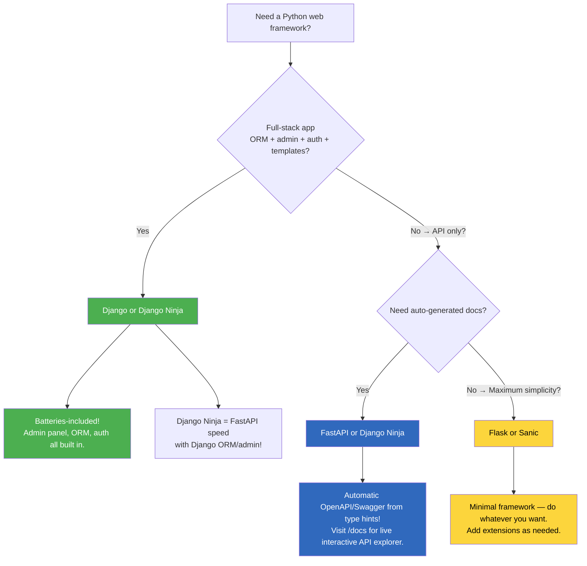
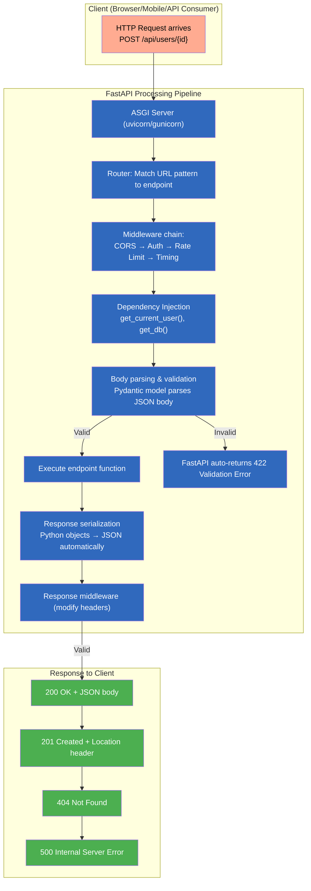
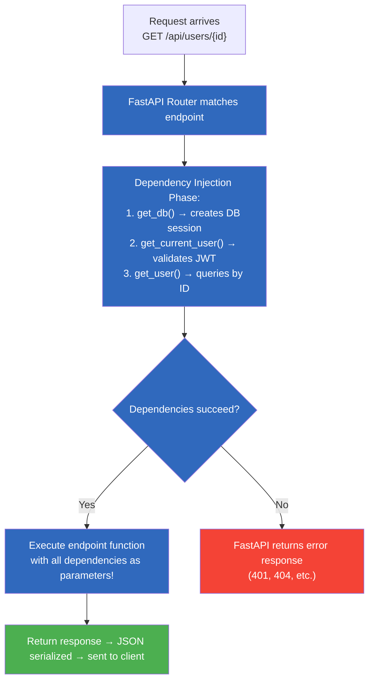
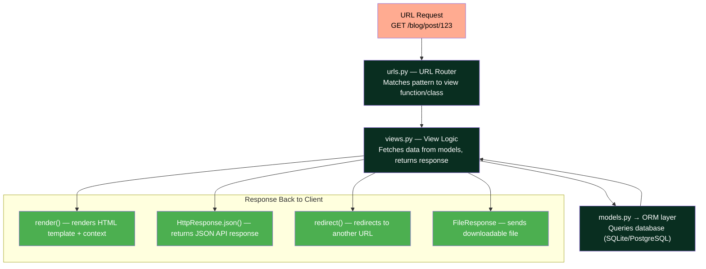
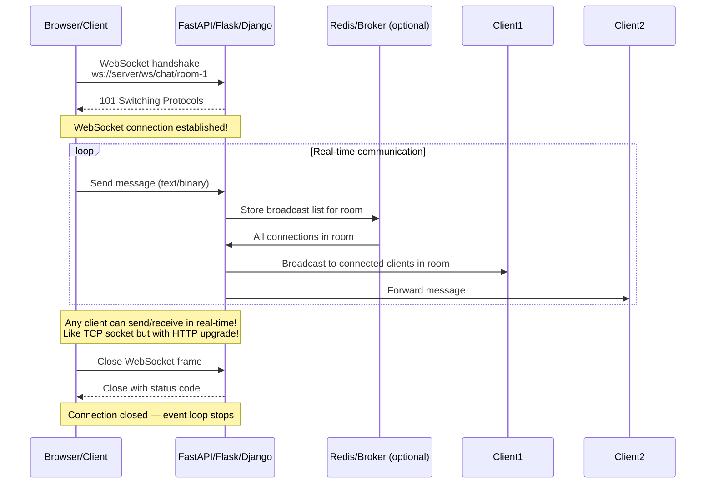
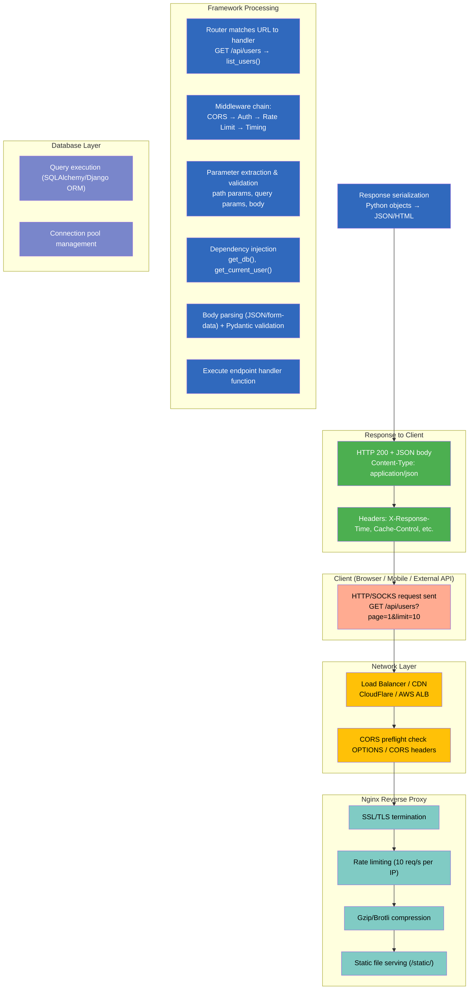

# Module 10 — Web Development: Complete Reference (FastAPI, Flask, Django)

## Table of Contents

- [1. TypeScript/Node.js vs Python Web Frameworks: Complete Ecosystem Comparison](#1-typescriptnode-js-vs-python-web-frameworks-complete-ecosystem-comparison)
  - [1.1 The Landscape: Every Major Framework and When to Use It](#11-the-landscape-every-major-framework-and-when-to-use-it)
  - [1.2 Framework Comparison Matrix (FastAPI vs Flask vs Django vs Express vs NestJS)](#12-framework-comparison-matrix-fastapi-vs-flask-vs-django-vs-express-vs-nestjs)
  - [1.3 Decision Tree: Which Framework to Choose](#13-decision-tree-which-framework-to-choose)
- [2. FastAPI — The Modern Choice (Exhaustive Deep Dive)](#2-fastapi--the-modern-choice-exhaustive-deep-dive)
  - [2.1 Installation & Project Structure](#21-installation--project-structure)
  - [2.2 Request/Response Lifecycle Diagram](#22-requestresponse-lifecycle-diagram)
  - [2.3 CRUD Endpoints — Complete Reference (All HTTP Verbs)](#23-crud-endpoints--complete-reference-all-http-verbs)
  - [2.4 Path Parameters, Query Parameters, and Form Data](#24-path-parameters-query-parameters-and-form-data)
  - [2.5 File Upload & Download Patterns](#25-file-upload--download-patterns)
  - [2.6 Streaming Response (SSE, large file streaming)](#26-streaming-response-sse-large-file-streaming)
  - [2.7 Background Tasks (Celery-like async processing)](#27-background-tasks-celery-like-async-processing)
  - [2.8 Dependency Injection — Complete Reference](#28-dependency-injection--complete-reference)
  - [2.9 Security, JWT Auth, OAuth2, API Key Patterns](#29-security-jwt-auth-oauth2-api-key-patterns)
  - [2.10 CORS, Rate Limiting, and Middleware Patterns](#210-cors-rate-limiting-and-middleware-patterns)
  - [2.11 API Versioning Strategies](#211-api-versioning-strategies)
  - [2.12 WebSocket Support (Real-time communication)](#212-websocket-support-real-time-communication)
  - [2.13 OpenAPI/Swagger Documentation — Auto-Generated in Detail](#213-openapiswagger-documentation--auto-generated-in-detail)
- [3. Flask — The Minimalist Alternative (Exhaustive Reference)](#3-flask--the-minimalist-alternative-exhaustive-reference)
  - [3.1 Core Routing & Blueprints](#31-core-routing--blueprints)
  - [3.2 Extensions: SQLAlchemy, Marshmallow, Celery Integration](#32-extensions-sqlalchemy-marshmallow-celery-integration)
  - [3.3 Template Rendering (Jinja2 Deep Dive)](#33-template-rendering-jinja2-deep-dive)
  - [3.4 Signal Handling & Application Context](#34-signal-handling--application-context)
  - [3.5 Flask vs Express: Complete Side-by-Side Comparison](#35-flask-vs-express-complete-side-by-side-comparison)
- [4. Django — The Full-Stack Framework (Exhaustive Reference)](#4-django--the-full-stack-framework-exhaustive-reference)
  - [4.1 Django MVT Architecture Diagram](#41-django-mvt-architecture-diagram)
  - [4.2 Models & ORM — Complete Reference](#42-models--orm--complete-reference)
  - [4.3 Migrations (Complete Guide)](#43-migrations-complete-guide)
  - [4.4 Class-Based Views & Generic Views](#44-class-based-views--generic-views)
  - [4.5 Django Admin Panel — Complete Reference](#45-django-admin-panel--complete-reference)
  - [4.6 Signals, Decorators, and Middleware](#46-signals-decorators-and-middleware)
  - [4.7 Django vs NestJS: Architecture Comparison](#47-django-vs-nestjs-architecture-comparison)
- [5. Database ORM Comparison (SQLAlchemy vs Django ORM vs Prisma → Python)](#5-database-orm-comparison-sqlalchemy-vs-django-orm-vs-prisma--python)
  - [5.1 SQLAlchemy — Complete Reference](#51-sqlalchemy--complete-reference)
  - [5.2 Django ORM vs SQLAlchemy — Feature Comparison Table](#52-django-orm-vs-sqlalchemy--feature-comparison-table)
- [6. Template Engines (Jinja2, Mako) — Complete Guide](#6-template-engines-jinja2-mako--complete-guide)
  - [6.1 Jinja2 Syntax — Every Feature with Examples](#61-jinja2-syntax--every-feature-with-examples)
  - [6.2 Mako Templates — Server-side Rendering](#62-mako-templates--server-side-rendering)
- [7. WebSocket Patterns (Complete Reference)](#7-websocket-patterns-complete-reference)
  - [7.1 WebSocket Flow Diagram](#71-websocket-flow-diagram)
  - [7.2 FastAPI WebSocket Examples](#72-fastapi-websocket-examples)
  - [7.3 Flask-SocketIO and Django Channels](#73-flask-socketio-and-django-channels)
- [8. Error Handling Middleware — Complete Guide](#8-error-handling-middleware-complete-guide)
  - [8.1 Exception Handling in FastAPI](#81-exception-handling-in-fastapi)
  - [8.2 Error Handling in Flask and Django](#82-error-handling-in-flask-and-django)
- [9. Deployment Patterns (Complete Guide)](#9-deployment-patterns-complete-guide)
  - [9.1 Docker Compose for All Frameworks](#91-docker-compose-for-all-frameworks)
  - [9.2 Production Servers: gunicorn, uvicorn, Nginx](#92-production-servers-gunicorn-uvicorn-nginx)
  - [9.3 Cloud Deployment (AWS, GCP, Azure, Vercel)](#93-cloud-deployment-aws-gcp-azure-vercel)
  - [9.4 Nginx Configuration Examples](#94-nginx-configuration-examples)
- [10. Async vs Sync in Web Frameworks — Deep Dive](#10-async-vs-sync-in-web-frameworks--deep-dive)
- [11. Middleware Patterns (All Three Frameworks)](#11-middleware-patterns-all-three-frameworks)
  - [11.1 FastAPI Middleware](#111-fastapi-middleware)
  - [11.2 Flask Middleware](#112-flask-middleware)
  - [11.3 Django Middleware](#113-django-middleware)
- [12. Authentication Patterns (JWT, OAuth2, API Key, Session)](#12-authentication-patterns-jwt-oauth2-api-key-session)
- [13. Request/Response Lifecycle Diagram](#13-requestresponse-lifecycle-diagram)
- [14. Quizzes (25 Questions with Answers)](#14-quizzes-25-questions-with-answers)
- [15. Exercises (20 Exercises with Solutions)](#15-exercises-20-exercises-with-solutions)

---

## 1. TypeScript/Node.js vs Python Web Frameworks: Complete Ecosystem Comparison

### 1.1 The Landscape: Every Major Framework and When to Use It

| Framework | Philosophy | Paradigm | Best For | TS Equivalent |
|-----------|-----------|----------|---------|---------------|
| **FastAPI** | Type hints → automatic docs + validation | Async-first (Starlette/Pydantic) | APIs, microservices, ML model serving | Express + tRPC/TypeBox |
| **Flask** | Minimalist — you add what you need | Sync (2.0+ has async routes) | Small apps, prototypes, lightweight APIs | Express |
| **Django** | Batteries-included ORM/admin/auth/templates | WSGI (Channels for ASGI/real-time) | Large monolithic web apps, CMS, e-commerce | NestJS |
| **Django Ninja** | FastAPI-like on top of Django | Async-first | APIs + need Django ecosystem | FastAPI + DRF |
| **Sanic** | Async-native from the start | Async (based on uvloop) | High-performance async servers | Express + fastify |
| **Quart** | Flask API but async | ASGI/WSGI | Flask codebases needing async | Express + async/await |
| **Tornado** | Non-blocking I/O since 2009 | Async | Real-time websockets, long-polling | Node.js native |
| **Responder** | Like Flask/Sanic hybrid | Async | Simple APIs with markdown docs | Express + swagger-ui |

### 1.2 Framework Comparison Matrix (FastAPI vs Flask vs Django vs Express vs NestJS)

| Feature | FastAPI | Flask | Django | Express (TS) | NestJS (TS) |
|---------|---------|-------|--------|-------------|-------------|
| **Type safety** | Runtime via type hints + Pydantic | None | Partial (ORM is dynamic) | Full compile-time via tsc | Full compile-time via tsc |
| **Auto-validation** | Automatic (Pydantic models) | Manual (`request.json` + checks) | DRF serializers / Ninja auto | Manual (Zod/class-validator) | Manual (class-validator decorators) |
| **Auto docs** | OpenAPI/Swagger at `/docs` automatically | None (unless using Django Ninja) | Auto via Django Ninja | Manual (@nestjs/swagger) | Auto via @nestjs/swagger |
| **ORM** | SQLAlchemy (external) or Django ORM | SQLAlchemy (external) | Built-in (`models.py`) | Prisma/TypeORM (external) | TypeORM/Better-Query (built-in module pattern) |
| **Admin panel** | No built-in (use django-ninja) | No built-in | Automatic CRUD admin! | None — build from scratch | None — build from scratch |
| **Auth system** | Custom or `python-jose` / `python-oauth2` | Custom or Flask-Login | Built-in: users, groups, permissions | jwt + custom middleware | @nestjs/jwt + Guards |
| **Templating** | Jinja2 (via starlette) | Jinja2 (built-in) | Django templates (DTL) | Pug/EJS/HBS (external) | Angular/Vue components |
| **CLI scaffolding** | `uvicorn` for running; `fastapi-cli` basic | `flask run`, `flask db init` | `django-admin startproject/myapp` full CLI | `npm create nest-app` | `nest generate` (built-in) |
| **WebSocket support** | First-class (`@app.websocket`) | Via Flask-SocketIO extension | Django Channels | Native Node.js or socket.io | @nestjs/websockets (built-in) |
| **Background tasks** | `BackgroundTasks` parameter / Celery | Celery / RQ integration | Celery / Django-Q | bullmq / bull-board | BullMQ + nestJS-bull |
| **Async support** | First-class — all routes async-friendly | Limited (Flask 2.0+ async routes) | WSGI-based; ASGI via Channels | Native async/await throughout | Native async/await throughout |
| **Rate limiting** | SlowAPI or custom middleware | Flask-Limiter extension | django-ratelimit | express-rate-limit | @nestjs/throttler |
| **Testing** | TestClient (built-in), pytest-asyncio | Client, pytest-flask | TestClient, pytest-django | supertest + Jest | @nestjs/testing |
| **Session support** | Custom or `python-multipart` session | Flask-Login / flask-session | Built-in sessions | express-session | Passport.js |
| **CORS** | CORSMiddleware (built-in) | flask-cors extension | django-cors-headers | cors npm package | @nestjs/axios + CORS module |
| **Learning curve** | Easy for Python devs | Easiest framework | Steepest (batteries-included) | Moderate | Steep (many concepts) |
| **Performance** | Very high (uvicorn + uvloop, 850k req/s) | Good (gunicorn with gevent/uvicorn) | Good to moderate | High (Node.js native async) | Good (Koa underneath NestJS) |
| **Community size** | Growing fastest | Mature/stable | Very mature (Instagram, Pinterest) | Largest (npm ecosystem) | Strong enterprise adoption |

### 1.3 Decision Tree: Which Framework to Choose



---

## 2. FastAPI — The Modern Choice (Exhaustive Deep Dive)

### 2.1 Installation & Project Structure

```bash
# Installation
pip install fastapi uvicorn pydantic[email] python-multipart

# Development
pip install "fastapi[standard]"  # Includes reload, httpx for testing

# Optional extras
pip install sqlalchemy pydantic-settings stripe python-jose passlib bcrypt
```

**Standard project structure:**
```
my_project/
├── app/
│   ├── __init__.py
│   ├── main.py           # FastAPI app instance
│   ├── config.py          # Settings via pydantic-settings
│   ├── models.py          # SQLAlchemy models (or Pydantic schemas)
│   ├── schemas.py         # Pydantic request/response models
│   ├── routers/
│   │   ├── __init__.py
│   │   ├── users.py       # User endpoints
│   │   └── products.py    # Product endpoints
│   ├── dependencies.py    # Shared dependency injection functions
│   ├── middleware.py      # Custom middleware
│   └── exceptions.py      # Custom exception handlers
├── tests/
│   ├── test_users.py
│   └── conftest.py
├── alembic/               # Database migrations (if using SQLAlchemy)
├── pyproject.toml
└── Dockerfile
```

### 2.2 Request/Response Lifecycle Diagram



### 2.3 CRUD Endpoints — Complete Reference (All HTTP Verbs)

```python
# === app/main.py — Full CRUD API with FastAPI ===
from fastapi import FastAPI, HTTPException, Depends, status, Query
from fastapi.responses import JSONResponse
from pydantic import BaseModel, EmailStr, Field, field_validator
from typing import Optional, List
import uuid

app = FastAPI(
    title="User Management API",
    version="1.0.0",
    description="Complete CRUD operations for user management",
)

# === Pydantic Models (schemas — validation + docs auto-generation!) ===
class UserCreate(BaseModel):
    name: str = Field(..., min_length=1, max_length=100)
    email: EmailStr
    age: int = Field(..., ge=0, le=150)
    role: Optional[str] = "user"
    
    @field_validator("name")
    @classmethod
    def name_must_not_be_numeric(cls, v: str) -> str:
        if v.isdigit():
            raise ValueError("Name cannot be all numbers")
        return v

class UserUpdate(BaseModel):
    name: Optional[str] = Field(None, min_length=1, max_length=100)
    email: Optional[EmailStr] = None
    age: Optional[int] = Field(None, ge=0, le=150)

class UserResponse(BaseModel):
    id: str
    name: str
    email: str
    age: int
    role: str
    
    model_config = {"from_attributes": True}  # SQLAlchemy compatibility

# === In-memory "database" (use SQLAlchemy in production!) ===
users_db: dict[str, UserResponse] = {}

# === GET /api/users — List all users with pagination & filtering ===
@app.get("/api/users", response_model=List[UserResponse], tags=["Users"])
async def list_users(
    page: int = Query(1, ge=1, description="Page number"),
    limit: int = Query(10, ge=1, le=100, description="Items per page"),
    search: Optional[str] = Query(None, description="Search by name"),
    role_filter: Optional[str] = Query(None),
):
    """
    List all users with pagination and filtering.
    
    - **page**: Page number (starts at 1)
    - **limit**: Items per page (max 100)
    - **search**: Filter by name substring
    - **role_filter**: Filter by role (e.g., 'admin')
    """
    result = list(users_db.values())
    
    if search:
        result = [u for u in result if search.lower() in u.name.lower()]
    if role_filter:
        result = [u for u in result if u.role == role_filter]
    
    start = (page - 1) * limit
    end = start + limit
    return result[start:end]

# === GET /api/users/stats — Stats endpoint (different response model) ===
@app.get("/api/users/stats", tags=["Users"])
async def get_user_stats():
    """Get aggregate statistics about users."""
    all_users = list(users_db.values())
    return {
        "total_users": len(all_users),
        "avg_age": sum(u.age for u in all_users) / len(all_users) if all_users else 0,
        "role_distribution": {},
    }

# === GET /api/users/{user_id} — Get single user by ID ===
@app.get("/api/users/{user_id}", response_model=UserResponse, tags=["Users"])
async def get_user(user_id: str):
    """Get a specific user by their ID."""
    if user_id not in users_db:
        raise HTTPException(status_code=404, detail=f"User {user_id} not found")
    return users_db[user_id]

# === POST /api/users — Create a new user ===
@app.post("/api/users", response_model=UserResponse, status_code=status.HTTP_201_CREATED, tags=["Users"])
async def create_user(user: UserCreate):
    """
    Create a new user. Automatically validates the request body!
    
    - **name**: Full name (1-100 characters, not all numbers)
    - **email**: Valid email address
    - **age**: Must be between 0 and 150
    - **role**: User role (default: 'user')
    """
    user_id = str(uuid.uuid4())
    response_user = UserResponse(
        id=user_id,
        name=user.name,
        email=user.email,
        age=user.age,
        role=user.role or "user",
    )
    users_db[user_id] = response_user
    return response_user

# === PUT /api/users/{user_id} — Full update (replaces entire record) ===
@app.put("/api/users/{user_id}", response_model=UserResponse, tags=["Users"])
async def update_user_full(user_id: str, user: UserCreate):
    """Full update — replaces the entire user record."""
    if user_id not in users_db:
        raise HTTPException(status_code=404, detail="User not found")
    updated = UserResponse(
        id=user_id,
        name=user.name,
        email=user.email,
        age=user.age,
        role=user.role or "user",
    )
    users_db[user_id] = updated
    return updated

# === PATCH /api/users/{user_id} — Partial update (only provided fields) ===
@app.patch("/api/users/{user_id}", response_model=UserResponse, tags=["Users"])
async def patch_user(user_id: str, updates: UserUpdate):
    """Partial update — only the fields provided will be modified."""
    if user_id not in users_db:
        raise HTTPException(status_code=404, detail="User not found")
    
    current = users_db[user_id]
    update_data = updates.model_dump(exclude_unset=True)  # Only non-None fields!
    for key, value in update_data.items():
        setattr(current, key, value)
    
    users_db[user_id] = current
    return current

# === DELETE /api/users/{user_id} — Delete user (with soft delete option) ===
@app.delete("/api/users/{user_id}", status_code=status.HTTP_204_NO_CONTENT, tags=["Users"])
async def delete_user(user_id: str):
    """Delete a user. Returns 204 No Content on success."""
    if user_id not in users_db:
        raise HTTPException(status_code=404, detail="User not found")
    del users_db[user_id]
    # 204 = No Content (standard for successful DELETE)

# === TypeScript Express equivalent of the above CRUD ===
// TS: 
// app.get("/api/users", (req, res) => { /* pagination logic */ });
// app.post("/api/users", async (req, res) => { const user = schema.parse(req.body); ... });
// FastAPI does ALL validation automatically from type hints — no manual parsing needed!
```

### 2.4 Path Parameters, Query Parameters, and Form Data

```python
# === Path parameters (extracted and auto-typed!) ===
@app.get("/api/users/{user_id}/posts/{post_id}")
async def get_user_post(user_id: str, post_id: int):
    # user_id: str extracted from URL path
    # post_id: int extracted AND validated (returns 422 if not an integer!)
    return {"user": user_id, "post": post_id}

# Multiple path params with type conversion
@app.get("/api/orders/{order_id}/items/{item_index:path}")
async def get_order_item(order_id: int, item_index: str):
    # FastAPI auto-converts 'abc' → int if possible, or raises 422
    return {"order": order_id, "index": item_index}

# Query parameters (auto-extracted from URL)
@app.get("/api/search")
async def search_items(
    q: str = Query(..., description="Search query"),
    category: str = Query("all", regex="^(all|electronics|clothing)$"),
    min_price: float = Query(0.0),
    max_price: Optional[float] = None,
    sort_by: str = Query("price", pattern="^(price|name|date)$"),
    page: int = Query(1, ge=1),
    limit: int = Query(20, le=100),
):
    return {"query": q, "category": category, "min_price": min_price}

# Optional query params with different defaults
@app.get("/api/notifications")
async def get_notifications(
    unread_only: bool = Query(False),  # /api/notifications?unread_only=true
    days: int = Query(7, ge=1, le=30),
):
    pass

# === Form data (multipart/form-data for file uploads) ===
from fastapi import Form

@app.post("/api/users/profile")
async def create_profile(
    name: str = Form(...),                    # From form field 'name'
    age: int = Form(...),                     # From form field 'age'
    resume: UploadFile = File(),              # File upload (see section 2.5)
):
    return {"name": name, "age": age}

# Multiple file uploads
from fastapi import UploadFile

@app.post("/api/documents/upload")
async def upload_multiple(
    files: list[UploadFile] = File(...),
    title: str = Form("..."),
):
    for file in files:
        content = await file.read()
    return {"uploaded": len(files)}

# === TypeScript comparison ===
// TS: req.params.id + parseInt(req.params.id)       → Python: user_id: int (auto-converted by FastAPI!)
// TS: req.query.q + req.query.category              → Python: q: str = Query(...) — auto-extracted!
// TS: req.body.name (manual parsing)                 → Python: name: str = Form(...) — auto-parsed from form!
```

### 2.5 File Upload & Download Patterns

```python
from fastapi import UploadFile, File
from fastapi.responses import StreamingResponse, FileResponse
import io
import os

# === File upload — Single file ===
@app.post("/api/upload/avatar")
async def upload_avatar(file: UploadFile = File(...)):
    content = await file.read()
    filename = file.filename or "unknown"
    # Save to disk
    with open(f"/uploads/{filename}", "wb") as f:
        f.write(content)
    return {"filename": filename, "size": len(content)}

# === File upload — Multiple files ===
@app.post("/api/upload/documents")
async def upload_documents(files: list[UploadFile] = File(...)):
    results = []
    for file in files:
        content = await file.read()
        # Process each file...
        results.append({"name": file.filename, "size": len(content)})
    return {"files": results}

# === Streaming download (large files without loading all into memory) ===
async def file_iterator(filepath: str):
    with open(filepath, "rb") as f:
        while chunk := f.read(8192):  # Read in 8KB chunks!
            yield chunk

@app.get("/api/files/{filename}")
async def download_file(filename: str):
    filepath = f"/downloads/{filename}"
    if not os.path.exists(filepath):
        raise HTTPException(status_code=404, detail="File not found")
    
    return StreamingResponse(
        file_iterator(filepath),
        media_type="application/octet-stream",
        headers={"Content-Disposition": f'attachment; filename="{filename}"'},
    )

# === CSV export as streaming response ===
import csv
from io import StringIO

def generate_csv(rows):
    stream = StringIO()
    writer = csv.writer(stream)
    for row in rows:
        writer.writerow(row)
    stream.seek(0)
    return stream.read()

@app.get("/api/export/csv")
async def export_csv():
    data_rows = [["Name", "Age"], ["Alice", 30], ["Bob", 25]]
    csv_content = generate_csv(data_rows)
    return StreamingResponse(
        io.StringIO(csv_content),
        media_type="text/csv",
        headers={"Content-Disposition": 'attachment; filename="users.csv"'},
    )

# === TypeScript comparison ===
// TS: Multer middleware + fs.createReadStream()     → Python: UploadFile + file_iterator — same concept!
```

### 2.6 Streaming Response (SSE, large file streaming)

```python
import asyncio
import json
from fastapi.responses import StreamingResponse

# === Server-Sent Events (SSE) — push real-time updates to clients ===
async def event_generator():
    """Generator that yields SSE events."""
    for i in range(10):
        yield f"data: {json.dumps({'event': 'update', 'value': i})}\n\n"
        await asyncio.sleep(1)  # Wait 1 second between events
    
    yield "event: complete\ndata: done!\n\n"

@app.get("/api/stream/events")
async def stream_events():
    return StreamingResponse(
        event_generator(),
        media_type="text/event-stream",
        headers={
            "Cache-Control": "no-cache",
            "Connection": "keep-alive",
            "X-Accel-Buffering": "no",  # Important for Nginx!
        },
    )

# === SSE client usage (TypeScript) ===
// TS: const evtSource = new EventSource('/api/stream/events');
//     evtSource.onmessage = (e) => console.log(JSON.parse(e.data));
// Python: FastAPI generates the correct SSE format automatically!

# === WebSocket fallback polling pattern ===
@app.get("/api/stream/poll")
async def poll_updates():
    """Simple polling alternative to SSE."""
    return {"data": "current_state", "next_poll_url": "/api/stream/poll"}
```

### 2.7 Background Tasks (Celery-like async processing)

```python
from fastapi import BackgroundTasks
import asyncio

# === Simple background task (process after response is sent) ===
async def send_welcome_email(email: str, name: str):
    """Simulate sending an email — runs AFTER the HTTP response!"""
    await asyncio.sleep(2)  # Simulate network call
    print(f"Welcome email sent to {name} <{email}>")

@app.post("/api/users", status_code=201)
async def create_user_with_email(user: UserCreate, background_tasks: BackgroundTasks):
    """Create user AND send welcome email in the background!"""
    # 1. Create user (response sent immediately!)
    user_id = str(uuid.uuid4())
    response_user = UserResponse(id=user_id, **user.model_dump())
    users_db[user_id] = response_user
    
    # 2. Schedule background task (runs after response is sent)
    background_tasks.add_task(send_welcome_email, user.email, user.name)
    
    return response_user

# === Complex background tasks with Celery integration ===
# In production, use Celery for persistent background jobs:
# pip install celery redis
# 
# from celery import Celery
# celery_app = Celery("tasks", broker="redis://localhost:6379/0")
# 
# @celery_app.task
# def process_image(image_path: str):
#     # Heavy image processing...
#     pass
# 
# @app.post("/api/images/process")
# async def process(img: UploadFile):
#     celery_app.send_task("tasks.process_image", args=[img.filename])
#     return {"status": "processing", "task_id": img.filename}

# === TypeScript Express comparison ===
// TS: Need express-queue + Redis for background jobs
// Python: BackgroundTasks = 1 line! Celery integration = simple task decorator!
```

### 2.8 Dependency Injection — Complete Reference

Dependency injection is FastAPI's most powerful feature. It replaces middleware, authentication, and database sessions with a clean, composable pattern.



```python
from fastapi import Depends, HTTPException, status
from sqlalchemy.orm import Session
from datetime import datetime

# === Dependency 1: Database session (injected automatically!) ===
def get_db():
    """Yield a database session — cleaned up after each request."""
    db = SessionLocal()  # Create DB session
    try:
        yield db         # Yield to the endpoint!
    finally:
        db.close()       # Always close (even on error!)

# === Dependency 2: Current authenticated user (from JWT) ===
def get_current_user(
    token: str = Depends(OAuth2PasswordBearer(tokenUrl="/api/auth/login")),
    db: Session = Depends(get_db),
) -> UserResponse:
    """Extract and validate JWT token → return current user."""
    try:
        payload = jwt.decode(token, SECRET_KEY, algorithms=["HS256"])
        user_id = payload.get("sub")
        if user_id is None:
            raise HTTPException(status_code=401, detail="Invalid token")
    except JWTError:
        raise HTTPException(status_code=401, detail="Invalid or expired token")
    
    user = db.query(User).filter(User.id == user_id).first()
    if not user:
        raise HTTPException(status_code=401, detail="User not found")
    return user

# === Dependency 3: User by ID (reusable across endpoints!) ===
def get_user_or_404(
    user_id: str,
    db: Session = Depends(get_db),
) -> UserResponse:
    """Fetch user by ID or raise 404."""
    user = db.query(User).filter(User.id == user_id).first()
    if not user:
        raise HTTPException(status_code=404, detail=f"User {user_id} not found")
    return user

# === Using dependencies in endpoints (clean! no manual setup!) ===
@app.get("/api/users/{user_id}", response_model=UserResponse)
async def get_user_endpoint(
    user: UserResponse = Depends(get_user_or_404),  # Injected automatically!
):
    """Get user — dependency handles validation, DB lookup, and 404."""
    return user

# === Shared dependency (used across multiple endpoints) ===
def require_role(required_role: str):
    """Dependency that checks if current user has the required role."""
    async def _check(current_user: UserResponse = Depends(get_current_user)):
        if current_user.role != required_role:
            raise HTTPException(status_code=403, detail="Insufficient permissions")
        return current_user
    return _check

@app.get("/api/admin/settings")
async def get_admin_settings(admin: UserResponse = Depends(require_role("admin"))):
    """Only admins can access this endpoint!"""
    return {"settings": {"theme": "dark", "lang": "en"}}

# === Class-based dependencies (for complex setup) ===
class DatabaseConnection:
    def __init__(self, connection_string: str):
        self.connection_string = connection_string
    
    def get_session(self) -> Session:
        return SessionMaker(self.connection_string)
    
    async def __aenter__(self):
        await self.connect()
        return self
    
    async def __aexit__(self, exc_type, exc_val, exc_tb):
        await self.disconnect()

# === TypeScript comparison ===
// TS: Express: req.params.id; const user = await db.findById(req.params.id);
// Python FastAPI: Depends(get_user_or_404) → ALL setup done in ONE dependency!
// Reuse get_user_or_404 across 20 endpoints — DRY principle!
```

### 2.9 Security, JWT Auth, OAuth2, API Key Patterns

```python
from fastapi import Depends, HTTPException, status
from fastapi.security import OAuth2PasswordBearer, OAuth2PasswordRequestForm, APIKeyHeader, Security
from jose import jwt, JWTError
from passlib.context import CryptContext
from datetime import datetime, timedelta

# === Password hashing context ===
pwd_context = CryptContext(schemes=["bcrypt"], deprecated="auto")

SECRET_KEY = "your-super-secret-key-change-in-production"
ALGORITHM = "HS256"
ACCESS_TOKEN_EXPIRE_MINUTES = 30

# === OAuth2 bearer token scheme (FastAPI generates the auth UI!) ===
oauth2_scheme = OAuth2PasswordBearer(tokenUrl="/api/auth/login")
api_key_header = APIKeyHeader(name="X-API-Key", auto_error=False)

# === Token creation helper ===
def create_access_token(data: dict, expires_delta: timedelta | None = None) -> str:
    to_encode = data.copy()
    expire = datetime.utcnow() + (expires_delta or timedelta(minutes=15))
    to_encode.update({"exp": expire})
    return jwt.encode(to_encode, SECRET_KEY, algorithm=ALGORITHM)

def verify_password(plain_password: str, hashed_password: str) -> bool:
    return pwd_context.verify(plain_password, hashed_password)

def get_password_hash(password: str) -> str:
    return pwd_context.hash(password)

# === Password schema (for login form) ===
class LoginRequest(BaseModel):
    username: str
    password: str

class TokenResponse(BaseModel):
    access_token: str
    token_type: str = "bearer"

# === POST /api/auth/login — Get JWT token ===
@app.post("/api/auth/login", response_model=TokenResponse)
async def login(form_data: OAuth2PasswordRequestForm = Depends()):
    """Authenticate user and return JWT token."""
    # In production: query database, verify password...
    if form_data.username != "admin" or not verify_password(form_data.password, get_password_hash("secret")):
        raise HTTPException(status_code=401, detail="Incorrect username or password")
    
    access_token = create_access_token({"sub": form_data.username})
    return TokenResponse(access_token=access_token)

# === Authenticated user dependency (reusable!) ===
def get_current_user(
    token: str = Depends(oauth2_scheme),
) -> dict:
    """Decode and validate JWT → return user info."""
    credentials_exception = HTTPException(
        status_code=status.HTTP_401_UNAUTHORIZED,
        detail="Could not validate credentials",
        headers={"WWW-Authenticate": "Bearer"},
    )
    try:
        payload = jwt.decode(token, SECRET_KEY, algorithms=[ALGORITHM])
        username: str = payload.get("sub")
        if username is None:
            raise credentials_exception
    except JWTError:
        raise credentials_exception
    return {"username": username}

# === GET /api/me — Protected endpoint ===
@app.get("/api/me")
async def read_current_user(current_user: dict = Depends(get_current_user)):
    """Only authenticated users can access this."""
    return {"current_user": current_user}

# === API Key authentication pattern ===
def get_api_key(api_key: str = Security(api_key_header)) -> str:
    if api_key is None or api_key != "valid-api-key-123":
        raise HTTPException(status_code=403, detail="Invalid API key")
    return api_key

@app.get("/api/external/data")
async def external_data(api_key: str = Security(get_api_key)):
    """External API — uses API key instead of JWT."""
    return {"data": "This is from the public API"}

# === OAuth2 with PKCE (for SPA/mobile apps) ===
# In production, use python-jose or authlib for full OAuth2 flow.
# For now, FastAPI's OAuth2PasswordBearer gives you the Swagger UI auto-auth!

# === TypeScript comparison ===
// TS: Manual JWT middleware + bcrypt + express-session
// Python: passlib + python-jose = 10 lines total! Swagger UI generated automatically!
```

### 2.10 CORS, Rate Limiting, and Middleware Patterns

```python
from fastapi.middleware.cors import CORSMiddleware
from slowapi import Limiter
from slowapi.util import get_remote_address
from slowapi.errors import RateLimitExceeded
import time
import logging

# === CORS Configuration (like cors npm package in Express) ===
app.add_middleware(
    CORSMiddleware,
    allow_origins=["https://myapp.com", "https://admin.myapp.com"],  # Specific origins!
    allow_credentials=True,
    allow_methods=["GET", "POST", "PUT", "PATCH", "DELETE", "OPTIONS"],
    allow_headers=["*"],  # Allow all headers (or specify: ["Authorization", "Content-Type"])
)

# === Rate Limiting (like express-rate-limit in Express) ===
limiter = Limiter(key_func=get_remote_address)
app.state.limiter = limiter

@app.exception_handler(RateLimitExceeded)
async def rate_limit_handler(request, exc):
    return JSONResponse(
        status_code=429,
        content={"detail": "Rate limit exceeded. Try again later."},
    )

# === Custom middleware (like Express app.use()) ===
@app.middleware("http")
async def timing_middleware(request, call_next):
    """Add request timing header to every response."""
    start_time = time.time()
    response = await call_next(request)
    duration = time.time() - start_time
    response.headers["X-Response-Time"] = f"{duration:.4f}s"
    
    # Log all requests
    logging.info(f"{request.method} {request.url.path} — {response.status_code} — {duration:.3f}s")
    return response

# === Auth middleware (integrated with dependency injection!) ===
@app.middleware("http")
async def auth_check_middleware(request, call_next):
    """Skip auth for public endpoints, check for protected ones."""
    if request.url.path.startswith("/api/auth/"):
        return await call_next(request)  # Public endpoint — skip auth
    
    token = request.headers.get("Authorization", "").removeprefix("Bearer ")
    if not token:
        return JSONResponse(status_code=401, content={"detail": "Missing token"})
    
    response = await call_next(request)
    return response

# === TypeScript comparison ===
// TS: app.use(cors()) + app.use(rateLimit({windowMs: 15*60*1000}))
// Python: CORSMiddleware + slowapi Limiter — same concepts, auto-configured!
```

### 2.11 API Versioning Strategies

```python
from fastapi import FastAPI

# === Strategy 1: URL-based versioning (most common) ===
app_v1 = FastAPI(title="User API v1")
app_v2 = FastAPI(title="User API v2")

@app_v1.get("/api/users/{user_id}")
async def get_user_v1(user_id: int):
    return {"id": user_id, "name": "Alice"}  # Simple response

@app_v2.get("/api/users/{user_id}", response_model=UserResponse)
async def get_user_v2(user_id: str):
    return UserResponse(id=user_id, name="Alice", email="alice@example.com", age=30)  # Full model!

# Mount both apps at different paths
app.mount("/v1", app_v1)   # /v1/api/users/1
app.mount("/v2", app_v2)   # /v2/api/users/alice-uuid

# === Strategy 2: Header-based versioning (for mobile clients) ===
from fastapi import Request

@app.get("/api/users/{user_id}")
async def get_user_header_version(
    user_id: str,
    request: Request,
):
    version = request.headers.get("X-API-Version", "1")
    if version == "2":
        return get_user_v2(user_id)
    return get_user_v1(int(user_id))

# === TypeScript comparison ===
# TS: Express router.mount('/v1', v1Router) + 'x-api-version' header check
# Python: FastAPI mount() + headers — same strategies, both work perfectly!
```

### 2.12 WebSocket Support (Real-time Communication)

```python
from fastapi import FastAPI, WebSocket, WebSocketDisconnect
import asyncio
import json

app_ws = FastAPI()

# Connection store for tracking active connections
connections: list[WebSocket] = []

@app_ws.websocket("/ws/chat/{room_id}")
async def websocket_chat(websocket: WebSocket, room_id: str):
    """Real-time chat room via WebSocket."""
    await websocket.accept()  # Handshake — like TCP connect!
    connections.append(websocket)
    
    try:
        while True:
            data = await websocket.receive_text()  # Wait for messages
            message = json.loads(data)
            
            # Broadcast to all connected clients in the room
            for conn in connections:
                if conn != websocket:
                    await conn.send_text(json.dumps({
                        "room": room_id,
                        "message": message,
                        "timestamp": datetime.now().isoformat(),
                    }))
    except WebSocketDisconnect:
        connections.remove(websocket)

# === Chat client (TypeScript) ===
# TS: const ws = new WebSocket('ws://localhost:8000/ws/chat/general');
#     ws.onmessage = (e) => console.log(JSON.parse(e.data));
#     ws.send(JSON.stringify({text: 'Hello!'}));

# === Broadcast endpoint (push to all connected clients via HTTP!) ===
@app_ws.post("/ws/broadcast")
async def broadcast_to_all(message: dict):
    """Send message to ALL connected WebSocket clients."""
    for conn in connections:
        try:
            await conn.send_text(json.dumps(message))
        except Exception:
            pass  # Connection closed
    return {"broadcast": len(connections)}

# === TypeScript comparison ===
# TS: socket.io or native WebSocket API + Express middleware
# Python FastAPI: @app.websocket("/ws/...") — built-in! Accept, receive, send all async!
```

### 2.13 OpenAPI/Swagger Documentation — Auto-Generated in Detail

FastAPI's killer feature: documentation is generated automatically from type hints.

```python
from fastapi import FastAPI
from pydantic import BaseModel

app = FastAPI(
    title="My API",
    version="1.0.0",
    description='''
    ## Features
    
    - Automatic validation
    - Auto-generated OpenAPI docs at `/docs`
    - Swagger UI interactive explorer
    - ReDoc alternative at `/redoc`
    
    ### Usage Example
    
    import requests
    r = requests.post("https://api.example.com/users", json={"name": "Alice"})
    print(r.json())  # {"id": "...", "name": "Alice"}
    
    ''',
    contact={
        "name": "API Support",
        "url": "https://example.com/support",
        "email": "support@example.com",
    },
    license_info={
        "name": "MIT",
        "url": "https://opensource.org/licenses/MIT",
    },
)

# All of this is auto-documented in /docs!
class UserCreate(BaseModel):
    """Request model for creating a user."""
    name: str = Field(..., min_length=1, description="Full name (required)")
    email: EmailStr = Field(..., description="Valid email address")
    
    model_config = {"json_schema_extra": {"examples": [{"name": "Alice Smith", "email": "alice@example.com"}]}}

class UserResponse(BaseModel):
    """Response model returned to the client."""
    id: str
    name: str
    email: str
    
    model_config = {"json_schema_extra": {"examples": [{"id": "abc-123", "name": "Alice Smith", "email": "alice@example.com"}]}}

@app.post("/api/users", response_model=UserResponse, summary="Create a new user", description="Creates a new user and returns the created object.")
async def create_user(user: UserCreate):
    """
    Create a new user.
    
    - Validates input automatically (Pydantic)
    - Returns 422 if validation fails
    - Documentation auto-generated from type hints!
    """
    return UserResponse(id=str(uuid.uuid4()), **user.model_dump())

# Visit http://localhost:8000/docs → Interactive Swagger UI!
# Visit http://localhost:8000/redoc → Alternative ReDoc docs!
```

---

## 3. Flask — The Minimalist Alternative (Exhaustive Reference)

### 3.1 Core Routing & Blueprints

**Blueprints are like Express routers — they organize routes into modules.**

```python
from flask import Flask, Blueprint, jsonify, request, abort, render_template_string, session
from functools import wraps
import os

# === Create the app ===
app = Flask(__name__)
app.config["SECRET_KEY"] = os.environ.get("SECRET_KEY", "dev-secret")
app.config["DEBUG"] = True  # Auto-reload like ts-node --watch!

# === Blueprints (like Express Router — modular route organization) ===
users_bp = Blueprint("users", __name__, url_prefix="/api/users")
posts_bp = Blueprint("posts", __name__, url_prefix="/api/posts")

@users_bp.route("/", methods=["GET"])
def list_users():
    return jsonify([{"id": 1, "name": "Alice"}, {"id": 2, "name": "Bob"}])

@users_bp.route("/<int:user_id>", methods=["GET"])
def get_user(user_id: int):
    user = {"id": user_id, "name": "Alice", "email": "alice@example.com"}
    if not user:
        abort(404)  # Like res.status(404).json({error}) in Express!
    return jsonify(user)

@users_bp.route("/", methods=["POST"])
def create_user():
    data = request.get_json()  # Like req.body in Express!
    if not data or "name" not in data:
        return jsonify({"error": "Name is required"}), 400
    
    new_user = {"id": 3, "name": data["name"], "email": data.get("email")}
    return jsonify(new_user), 201  # Status code as tuple!

@users_bp.route("/<int:user_id>", methods=["PUT"])
def update_user(user_id: int):
    data = request.get_json()
    user = {"id": user_id, **data}
    return jsonify(user)

@users_bp.route("/<int:user_id>", methods=["DELETE"])
def delete_user(user_id: int):
    # Delete logic...
    return jsonify({"message": "Deleted"}), 204

# === Register blueprints on the main app (like router.mount()) ===
app.register_blueprint(users_bp)
app.register_blueprint(posts_bp)

# === Route with converters (<int:id>, <string:name>, <float:price>) ===
@app.route("/api/products/<string:category>/sort/<string:order>")
def get_products(category, order):
    return jsonify({"category": category, "order": order})

# === Query parameters (like req.query in Express) ===
@app.route("/api/search")
def search():
    q = request.args.get("q", "")           # Like req.query.q
    page = request.args.get("page", 1, type=int)  # Auto-convert to int!
    return jsonify({"query": q, "page": page})

# === Request object (like Express's req) ===
@app.route("/api/info")
def get_request_info():
    return jsonify({
        "method": request.method,              # "GET", "POST", etc.
        "path": request.path,                  # URL path
        "headers": dict(request.headers),       # All headers as dict
        "remote_addr": request.remote_addr,     # Client IP
        "cookies": dict(request.cookies),       # All cookies
        "json": request.get_json(silent=True),  # Parsed JSON body
        "form": request.form.to_dict(),         # Form data
    })

# === TypeScript comparison ===
// TS: const router = express.Router(); router.get('/users', handler); app.use('/api', router);
// Python: Blueprint → register_blueprint() — same pattern, Flask native!
```

### 3.2 Extensions: SQLAlchemy, Marshmallow, Celery Integration

**Flask's power comes from its extension ecosystem.**

```python
# === Installation ===
# pip install flask-sqlalchemy flask-marshmallow flask-celery-helper flask-login flask-migrate

from flask_sqlalchemy import SQLAlchemy
from marshmallow import Schema, fields, validate
from flask_celery_helper import celery

db = SQLAlchemy()
marshmallow = Marshmallow()

# === Configure SQLAlchemy ===
class User(db.Model):
    __tablename__ = "users"
    id = db.Column(db.Integer, primary_key=True)
    name = db.Column(db.String(100), nullable=False)
    email = db.Column(db.String(255), unique=True, nullable=False)
    created_at = db.Column(db.DateTime, default=db.func.now())
    
    def to_dict(self):
        return {"id": self.id, "name": self.name, "email": self.email}

# === Marshmallow Schema (validation + serialization — like Pydantic!) ===
class UserSchema(Schema):
    id = fields.Int(dump_only=True)
    name = fields.Str(required=True, validate=validate.Length(min=1, max=100))
    email = fields.Email(required=True)
    created_at = fields.DateTime(dump_only=True)

user_schema = UserSchema()
users_schema = UserSchema(many=True)

# === SQLAlchemy operations (CRUD with ORM) ===
def get_all_users():
    return [u.to_dict() for u in User.query.all()]

def get_user_by_id(user_id):
    user = User.query.get(user_id)  # Like Prisma.user.findFirst({where: {id}})
    return user_schema.dump(user) if user else None

def create_user(name, email):
    new_user = User(name=name, email=email)
    db.session.add(new_user)
    db.session.commit()
    return user_schema.dump(new_user)

# === Celery integration (background tasks — like bullmq in Node.js!) ===
@celery.task(bind=True)
def send_email(self, recipient, subject, body):
    """Background task: send email asynchronously."""
    # Email sending logic here...
    return {"status": "sent", "recipient": recipient}

@app.route("/api/users/<int:id>/notify", methods=["POST"])
def notify_user(id):
    send_email.delay("user@email.com", "Welcome!", "Hello!")  # .delay() = async queue!
    return jsonify({"message": "Notification queued!"})

# === TypeScript comparison ===
// TS: TypeORM + class-validator + bullmq — three separate packages
// Python Flask: flask-sqlalchemy + marshmallow + celery — three extensions, same power!
```

### 3.3 Template Rendering (Jinja2 Deep Dive)

**Flask uses Jinja2 templates for server-side rendering — like EJS in Express but more powerful.**

```python
# === Simple template string (inline — like renderToString in React) ===
@app.route("/hello/<name>")
def hello(name):
    return render_template_string(
        "<h1>Hello, {{ name }}!</h1><p>You are from {{ location }}</p>",
        name=name,
        location="Earth",
    )

# === Template file (standard Flask pattern — like Express + Pug/EJS) ===
# In production, use app.render_template('index.html', data=...) with templates/ directory.
# Jinja2 features:
#   {{ variable }}     → Output value (like ${variable} in template literals)
#   ...  → Loop (like {{#each items}} in Handlebars)
#   ...      → Conditional
#                 → Template inheritance (like React components!)
#         → Override blocks from parent template

# === Pass data to templates ===
@app.route("/dashboard")
def dashboard():
    users = [{"name": "Alice", "age": 30}, {"name": "Bob", "age": 25}]
    title = "Dashboard"
    
    # Render with: app.render_template("dashboard.html", users=users, title=title)
    return render_template_string(
        "<h1>{{ title }}</h1>"
        "<p>{{ user.name }} ({{ user.age }})</p></body>"
    )

# === TypeScript comparison ===
// TS: res.render('template', {locals})  with Pug/EJS — similar concept!
// Python Flask: render_template() with Jinja2 — same templating philosophy!
```

### 3.4 Signal Handling & Application Context

**Flask signals are like Node.js EventEmitter for application events.**

```python
from flask import signals
from blinker import signal

# === Built-in Flask signals ===
request_started = signal("request-started")
request_finished = signal("request-finished")
got_request_exception = signal("got-request-exception")

# === Define custom signals ===
user_created = signal("user-created")
order_completed = signal("order-completed")

@user_created.connect_via(app)
def on_user_created(sender, user):
    print(f"New user created: {user['name']}")

# === Emit custom signals (like Node.js EventEmitter.emit()) ===
@app.after_request
def track_requests(response):
    request_started.send(app)
    return response

@app.route("/api/users", methods=["POST"])
def create_user_signal():
    data = request.get_json()
    user_data = {"name": data["name"], "email": data["email"]}
    
    # Emit signal — other parts of the app react to it!
    user_created.send(app, user=user_data)
    
    return jsonify(user_data), 201

# === App context (like Express's req/res lifecycle but for Flask) ===
@app.before_request
def before_req():
    """Runs BEFORE every request — like Express middleware at app level."""
    g.start_time = time.time()  # 'g' is request-scoped global storage

@app.after_request
def after_req(response):
    """Runs AFTER every request — add headers, log, etc."""
    response.headers["X-Frame-Options"] = "DENY"  # Security header!
    return response

# === TypeScript comparison ===
// TS: EventEmitter or middleware for pre/post hooks
// Python Flask: @app.before_request / after_request — built-in! Like Express's app.use() at framework level!
```

### 3.5 Flask vs Express: Complete Side-by-Side Comparison

| Feature | Express (TypeScript) | Flask (Python) | Notes |
|---------|---------------------|---------------|-------|
| **Routing** | `app.get("/path", handler)` decorator-like functions | `@app.route("/path")` decorator — same concept! | Both are simple and flexible |
| **Middleware chain** | `app.use(middleware)` sequential | `@app.before_request`, `@app.after_request`, `@app.teardown_appcontext` | Flask has 3 hook types vs Express's flat chain |
| **Body parsing** | `app.use(express.json())` global middleware | `request.get_json()` per-request method | Different patterns — Flask is more explicit |
| **Param extraction** | `req.params.id`, `req.query.page` | `@app.route("/<int:id>")`, `request.args.get("page")` | Same concepts, different syntax |
| **Response** | `res.json(data)`, `res.status(404).send()` | `jsonify(data)`, abort(404)` | Express uses status chain; Flask uses tuple `(data, status)` |
| **Error handling** | Error middleware: `app.use((err, req, res, next))` | `@app.errorhandler(404) def not_found(e): ...` | Both catch and handle errors gracefully |
| **Static files** | `app.use(express.static("public"))` | Built-in at `/static/` — no config needed! | Flask is simpler for static serving |
| **CORS** | `cors()` npm package | `flask-cors` extension | Same concept, external package in both |
| **Session** | `express-session` + Redis (external) | `flask-session` or built-in signed cookies | Flask has cookie-based sessions by default! |

---

## 4. Django — The Full-Stack Framework (Exhaustive Reference)

### 4.1 Django MVT Architecture Diagram



### 4.2 Models & ORM — Complete Reference

```python
# === myapp/models.py — Django models (like Prisma schema + TypeScript class combined) ===
from django.db import models
from django.contrib.auth.models import AbstractUser
from django.utils.text import slugify

class Category(models.Model):
    """Product category model."""
    name = models.CharField(max_length=100, unique=True)
    slug = models.SlugField(unique=True, blank=True)
    description = models.TextField(blank=True)
    created_at = models.DateTimeField(auto_now_add=True)
    
    class Meta:
        ordering = ["name"]
        verbose_name_plural = "categories"
    
    def save(self, *args, **kwargs):
        if not self.slug:
            self.slug = slugify(self.name)
        super().save(*args, **kwargs)
    
    def __str__(self):
        return self.name

class Author(models.Model):
    """Author model with relationships."""
    first_name = models.CharField(max_length=50)
    last_name = models.CharField(max_length=50)
    email = models.EmailField(unique=True)
    bio = models.TextField(blank=True, max_length=1000)
    avatar = models.ImageField(upload_to="avatars/", blank=True, null=True)
    
    @property
    def full_name(self):
        return f"{self.first_name} {self.last_name}"
    
    def __str__(self):
        return self.full_name

class BlogPost(models.Model):
    """Blog post with multiple relationships."""
    class Status(models.TextChoices):
        DRAFT = "draft", "Draft"
        PUBLISHED = "published", "Published"
        ARCHIVED = "archived", "Archived"
    
    # Field types (map to database columns!)
    title = models.CharField(max_length=200, db_index=True)  # Indexed for fast lookup!
    slug = models.SlugField(unique=True, max_length=250, db_index=True)
    content = models.TextField()                            # TEXT column
    excerpt = models.CharField(max_length=500, blank=True)
    status = models.CharField(max_length=20, choices=Status.choices, default=Status.DRAFT)
    
    # Relationships (like Prisma relations!)
    author = models.ForeignKey(Author, on_delete=models.CASCADE)  # Many blog posts → 1 author
    category = models.ForeignKey(Category, on_delete=models.SET_NULL, null=True, related_name="posts")
    tags = models.ManyToManyField("Tag", blank=True, related_name="posts")  # Many-to-many!
    
    # Timestamps
    created_at = models.DateTimeField(auto_now_add=True)
    updated_at = models.DateTimeField(auto_now=True)
    published_at = models.DateTimeField(null=True, blank=True)
    
    class Meta:
        ordering = ["-published_at"]  # Newest first (like ORDER BY published_at DESC)
        indexes = [
            models.Index(fields=["status", "published_at"]),  # Composite index!
        ]
    
    def save(self, *args, **kwargs):
        if not self.slug:
            self.slug = slugify(self.title)
        super().save(*args, **kwargs)
    
    def __str__(self):
        return self.title

class Tag(models.Model):
    name = models.CharField(max_length=50, unique=True)
    slug = models.SlugField(unique=True, blank=True)
    
    def save(self, *args, **kwargs):
        if not self.slug:
            self.slug = slugify(self.name)
        super().save(*args, **kwargs)
    
    def __str__(self):
        return self.name

# === ORM Operations (like Prisma — but built into Django!) ===
# CREATE
new_post = BlogPost.objects.create(
    title="My First Post",
    content="Hello world!",
    author=author_instance,
    category=category_instance,
)

# ADD MANY-TO-MANY RELATIONSHIP
post.tags.add(tag_python, tag_django)  # Add multiple tags!

# READ (QUERYSET — lazy evaluation like a SQL query waiting to execute!)
all_published = BlogPost.objects.filter(status=BlogPost.Status.PUBLISHED).order_by("-published_at")
recent_posts = BlogPost.objects.published_recent(days=7)  # Custom manager method
single_post = BlogPost.objects.get(slug="my-first-post")  # Returns exactly one (raises exception if not found!)
posts_with_tags = BlogPost.objects.prefetch_related("tags").select_related("author", "category")  # Eager load!

# UPDATE
post.title = "Updated Title"
post.status = BlogPost.Status.PUBLISHED
post.published_at = timezone.now()
post.save()  # Persist changes

# Bulk update (like UPDATE SET in SQL — single query!)
BlogPost.objects.filter(status=BlogPost.Status.DRAFT).update(status=BlogPost.Status.ARCHIVED)

# DELETE
post.delete()                        # Delete one post (cascades to related objects!)
BlogPost.objects.filter(author=author).delete()  # Delete all posts by author

# ADVANCED QUERIES (like Prisma's rich query API!)
posts_by_author = BlogPost.objects.filter(author__first_name="Alice")  # Follow foreign key!
posts_in_category = BlogPost.objects.filter(category__name="Technology")
posts_with_tag_count = BlogPost.objects.annotate(tag_count=models.Count("tags")).filter(tag_count__gte=3)
post_excerpts = BlogPost.objects.values_list("title", "excerpt").distinct()

# Raw SQL (when you need it!)
from django.db import connection
with connection.cursor() as cursor:
    cursor.execute("SELECT * FROM blog_post WHERE status = %s", ["published"])
    rows = cursor.fetchall()

# === TypeScript/Prisma comparison ===
// TS: prisma.blogPost.create({data: {...}})    → Python: BlogPost.objects.create(...)
// TS: prisma.blogPost.findMany({where: {status: 'published'}})  → Python: BlogPost.objects.filter(status=...)
// TS: prisma.blogPost.update({where: {id}, data})       → Python: post.save() — model instance update!
```

### 4.3 Migrations (Complete Guide)

**Django manages database schema changes through migrations — like Prisma migrations but built-in.**

```bash
# Generate migration from model changes
python manage.py makemigrations myapp

# Apply pending migrations to the database
python manage.py migrate

# View migration history
python manage.py showmigrations

# Show SQL that will be executed
python manage.py sqlmigrate myapp 0001_initial

# Create initial migration for existing database (reverse migration)
python manage.py makemigrations --empty myapp
python manage.py migrate myapp zero  # Roll back to zero!
```

**Migration files are auto-generated in `myapp/migrations/0001_initial.py`:**

```python
# Generated Django migration file — auto-created by `makemigrations`!
from django.db import migrations, models

class Migration(migrations.Migration):
    initial = True
    
    dependencies = []
    
    operations = [
        migrations.CreateModel(
            name="Category",
            fields=[
                ("id", models.BigAutoField(auto_created=True, primary_key=True, serialize=False, verbose_name="ID")),
                ("name", models.CharField(max_length=100, unique=True)),
                ("slug", models.SlugField(blank=True, unique=True)),
                ("description", models.TextField(blank=True)),
                ("created_at", models.DateTimeField(auto_now_add=True)),
            ],
            options={
                "ordering": ["name"],
                "verbose_name_plural": "categories",
            },
        ),
        migrations.CreateModel(
            name="Author",
            fields=[...],
        ),
    ]

# TypeScript comparison: npx prisma migrate dev — auto-generates from schema.prisma
# Django: python manage.py makemigrations — auto-generates from model Python class!
```

### 4.4 Class-Based Views & Generic Views

**Django's generic views are like Express routers but with built-in CRUD logic.**

```python
from django.views.generic import ListView, DetailView, CreateView, UpdateView, DeleteView
from django.urls import reverse_lazy
from django.contrib.auth.mixins import LoginRequiredMixin, UserPassesTestMixin

# === Generic List View (fetches all objects — like GET /api/posts) ===
class PostListView(ListView):
    model = BlogPost
    template_name = "blog/post_list.html"
    context_object_name = "posts"  # Available as 'posts' in the template!
    paginate_by = 10              # Pagination built-in!
    
    def get_queryset(self):
        return BlogPost.objects.filter(status=BlogPost.Status.PUBLISHED).order_by("-published_at")

# === Generic Detail View (fetches single object by pk/slug — like GET /api/posts/:id) ===
class PostDetailView(DetailView):
    model = BlogPost
    template_name = "blog/post_detail.html"
    slug_field = "slug"
    slug_url_kwarg = "slug"
    
    def get_context_data(self, **kwargs):
        context = super().get_context_data(**kwargs)
        context["related_posts"] = BlogPost.objects.filter(
            category=self.object.category
        ).exclude(pk=self.object.pk)[:5]  # Related posts by same category!
        return context

# === Generic Create View (form handling — POST to create) ===
class PostCreateView(LoginRequiredMixin, CreateView):
    model = BlogPost
    fields = ["title", "content", "excerpt", "category"]
    template_name = "blog/post_form.html"
    success_url = reverse_lazy("post-list")  # Redirect after successful save!
    
    def form_valid(self, form):
        form.instance.author = self.request.user  # Auto-assign current user as author!
        return super().form_valid(form)

# === Generic Update View (PUT/PATCH to update) ===
class PostUpdateView(LoginRequiredMixin, UserPassesTestMixin, UpdateView):
    model = BlogPost
    fields = ["title", "content", "excerpt", "status"]
    template_name = "blog/post_form.html"
    
    def test_func(self):
        """Only the post's author can edit it."""
        return self.request.user == self.get_object().author
    
    def get_success_url(self):
        return reverse_lazy("post-detail", kwargs={"slug": self.object.slug})

# === Generic Delete View (DELETE to remove) ===
class PostDeleteView(LoginRequiredMixin, UserPassesTestMixin, DeleteView):
    model = BlogPost
    template_name = "blog/post_confirm_delete.html"
    success_url = reverse_lazy("post-list")
    
    def test_func(self):
        return self.request.user == self.get_object().author

# === URLs wiring (connect views to URL patterns) ===
from django.urls import path
from . import views

urlpatterns = [
    path("", views.PostListView.as_view(), name="post-list"),
    path("post/<slug:slug>/", views.PostDetailView.as_view(), name="post-detail"),
    path("post/new/", views.PostCreateView.as_view(), name="post-new"),
    path("post/<slug:slug>/edit/", views.PostUpdateView.as_view(), name="post-edit"),
    path("post/<slug:slug>/delete/", views.PostDeleteView.as_view(), name="post-delete"),
]

# === TypeScript comparison ===
// TS: NestJS controllers with @Get() @Post() @Put() @Delete() + manual service calls
// Python Django: ListView/DetailView/CreateView/UpdateView/DeleteView — EACH handles its HTTP method + template!
```

### 4.5 Django Admin Panel — Complete Reference

**Django's admin panel generates a FULL CRUD UI from your models — no coding required!**

```python
# === myapp/admin.py — Register models with the admin panel ===
from django.contrib import admin
from .models import Category, Author, BlogPost, Tag

@admin.register(Category)
class CategoryAdmin(admin.ModelAdmin):
    list_display = ["name", "slug", "created_at"]      # Columns shown in admin table!
    search_fields = ["name", "description"]             # Search bar in admin UI!
    prepopulated_fields = {"slug": ("name",)}           # Auto-generate slug from name!
    list_filter = ["created_at"]                        # Filter by date sidebar!

@admin.register(Author)
class AuthorAdmin(admin.ModelAdmin):
    list_display = ["full_name", "email", "bio_preview"]  # Custom field in table!
    search_fields = ["first_name", "last_name", "email"]
    
    def bio_preview(self, obj):
        return obj.bio[:50] + "..." if len(obj.bio) > 50 else obj.bio
    bio_preview.short_description = "Bio"  # Column header name

@admin.register(BlogPost)
class BlogPostAdmin(admin.ModelAdmin):
    list_display = ["title", "author", "category", "status", "published_at"]
    list_filter = ["status", "category", "published_at"]
    search_fields = ["title", "content"]
    raw_id_fields = ["author", "category"]  # Use ID lookup instead of dropdown!
    date_hierarchy = "published_at"         # Chronological navigation sidebar!
    prepopulated_fields = {"slug": ("title",)}
    actions = ["publish_selected", "archive_selected"]  # Custom bulk actions!
    
    def publish_selected(self, request, queryset):
        """Custom action: publish all selected posts."""
        count = queryset.filter(status="draft").update(
            status=BlogPost.Status.PUBLISHED,
            published_at=timezone.now()
        )
        self.message_user(request, f"{count} posts published!")
    publish_selected.short_description = "Publish selected posts"

# Register Tag model (simple registration — no custom admin needed!)
@admin.register(Tag)
class TagAdmin(admin.ModelAdmin):
    list_display = ["name", "slug"]
    prepopulated_fields = {"slug": ("name",)}

# === The result: Django generates a FULL ADMIN PANEL with: ===
# - Table listing of all records with pagination, sorting, filtering!
# - CRUD forms for Create/Read/Update/Delete operations!
# - Search bar, CSV export, bulk actions (delete selected)!
# - User management (superuser creates other admins)!
# TypeScript developers would need to build ALL of this from scratch — or use a third-party admin library.
```

### 4.6 Signals, Decorators, and Middleware

```python
# === Django Signals (like Express events but for database operations) ===
from django.db.models.signals import post_save, post_delete, pre_save
from django.dispatch import receiver
from .models import BlogPost

@receiver(post_save, sender=BlogPost)
def notify_on_post_save(sender, instance, created, **kwargs):
    """Sent AFTER a BlogPost is saved to the database."""
    if created:
        print(f"New blog post created: {instance.title}")
    else:
        print(f"Blog post updated: {instance.title}")

@receiver(pre_save, sender=BlogPost)
def auto_set_slug(sender, instance, **kwargs):
    """Called BEFORE saving — useful for computed fields."""
    if not instance.slug:
        instance.slug = slugify(instance.title)

# === Custom Decorators (like Express middleware but as function decorator) ===
from functools import wraps
from django.contrib.auth.decorators import login_required
from django.http import JsonResponse

def require_api_key(view_func):
    @wraps(view_func)
    def wrapper(request, *args, **kwargs):
        api_key = request.META.get("HTTP_X_API_KEY")
        if not api_key or api_key != "valid-key":
            return JsonResponse({"error": "Invalid API key"}, status=403)
        return view_func(request, *args, **kwargs)
    return wrapper

# === Django Middleware (like Express middleware but class-based!) ===
class LoggingMiddleware:
    def __init__(self, get_response):
        self.get_response = get_response
    
    def __call__(self, request):
        import logging
        logger = logging.getLogger(__name__)
        logger.info(f"{request.method} {request.path}")
        
        response = self.get_response(request)
        logger.info(f"Status: {response.status_code}")
        return response

# === Django vs NestJS comparison ===
// TS: NestJS interceptors + Guards + Filters → 30+ lines per middleware pattern
// Python Django: Middleware class + Signals + decorators → same power, less boilerplate!
```

### 4.7 Django vs NestJS: Architecture Comparison

| Feature | NestJS (TypeScript) | Django (Python) | Notes |
|---------|-------------------|----------------|-------|
| **ORM** | TypeORM or Prisma (external package!) | Built-in ORM (`models.py`) — no external packages! | Django's ORM auto-creates tables, handles migrations, relationships |
| **Migrations** | `npx prisma migrate dev` (external) | `python manage.py makemigrations && migrate` (built-in!) | Both auto-generate from schema/model definitions |
| **Admin UI** | None built-in — build yourself! | Automatic admin panel — just register models! | Django generates CRUD interface automatically |
| **Routing** | Controllers + Route decorators (`@Get()`) | URL patterns in `urls.py` + class-based views | Different philosophy: decorators vs declarative URLs |
| **Auth** | @nestjs/jwt + Guards + Passport | Built-in user model, sessions, permissions | Django's auth = production-ready (used by Instagram) |
| **Templating** | Angular/Vue components + SSR | Django templates / Jinja2 built-in | Both support server-side rendering |
| **Testing** | Jest + supertest | pytest-django or Django TestCase | Similar testing paradigms in both frameworks |

---

## 5. Database ORM Comparison (SQLAlchemy vs Django ORM vs Prisma → Python)

### 5.1 SQLAlchemy — Complete Reference

**SQLAlchemy is Python's most powerful ORM — like Prisma but more explicit and flexible.**

```python
from sqlalchemy import create_engine, Column, Integer, String, Float, ForeignKey, Text, DateTime, func, select, update, delete
from sqlalchemy.orm import declarative_base, sessionmaker, relationship, joinedload
from datetime import datetime

# === Engine & Session setup (like PrismaClient initialization) ===
engine = create_engine("sqlite:///app.db", echo=True)  # SQLite (change to PostgreSQL in prod!)
SessionLocal = sessionmaker(bind=engine)
Base = declarative_base()

# === Models (like TypeScript classes with decorators — but SQLAlchemy uses explicit columns!) ===
class Product(Base):
    __tablename__ = "products"
    
    id = Column(Integer, primary_key=True, autoincrement=True)
    name = Column(String(200), nullable=False, index=True)
    price = Column(Float, nullable=False)
    description = Column(Text, default="")
    category_id = Column(Integer, ForeignKey("categories.id"), nullable=True)
    created_at = Column(DateTime, default=func.now())
    
    # Relationship (like Prisma's relations!)
    category = relationship("Category", back_populates="products")
    
    def __repr__(self):
        return f"<Product(id={self.id}, name='{self.name}', price={self.price})>"

class Category(Base):
    __tablename__ = "categories"
    
    id = Column(Integer, primary_key=True)
    name = Column(String(100), unique=True, nullable=False)
    
    products = relationship("Product", back_populates="category")

# === Create tables (like Prisma's `prisma db push` or `prisma migrate`) ===
Base.metadata.create_all(engine)

# === CRUD Operations (SQLAlchemy Core + ORM hybrid!) ===
# CREATE — like prisma.product.create({data: {...}})
with SessionLocal() as db:
    new_product = Product(name="Laptop", price=999.99, description="Great laptop!")
    new_category = Category(name="Electronics")
    new_category.products.append(new_product)  # Set up relationship!
    db.add_all([new_category, new_product])
    db.commit()

# READ (QUERYSET — lazy evaluation like a SQL query!)
with SessionLocal() as db:
    # Find all products
    all_products = db.query(Product).all()
    
    # Filter + paginate (like Prisma's where + take/ skip)
    expensive_products = db.query(Product).filter(Product.price > 500).order_by(-Product.price).limit(10).offset(0)
    
    # Eager loading (fetch related data in ONE query — avoids N+1!)
    products_with_cats = db.query(Product).options(joinedload(Product.category)).all()
    
    # Join query (like SQL JOIN)
    results = db.query(Product.name, Category.name).join(Category, Product.category_id == Category.id).all()
    
    # Aggregate queries
    avg_price = db.query(func.avg(Product.price)).scalar()  # AVG(price) → single value
    category_counts = db.query(Category.name, func.count(Product.id)).outerjoin(Product).group_by(Category.name).all()

# UPDATE — like prisma.product.update({where: {id}, data: {...}})
with SessionLocal() as db:
    product = db.query(Product).filter(Product.id == 1).first()
    product.price = 899.99  # Modify!
    db.commit()  # Persist changes
    
    # Bulk update (single SQL UPDATE)
    db.query(Product).filter(Product.category_id == 2).update({Product.price: Product.price * 0.9})

# DELETE — like prisma.product.delete({where: {id}})
with SessionLocal() as db:
    product = db.query(Product).get(1)
    db.delete(product)
    db.commit()

# === TypeScript/Prisma comparison ===
// TS: prisma.product.findMany({where: {price: {gt: 500}}, orderBy: {price: 'desc'}, take: 10})
// Python SQLAlchemy: db.query(Product).filter(Product.price > 500).order_by(-Product.price).limit(10)
```

### 5.2 Django ORM vs SQLAlchemy — Feature Comparison Table

| Feature | Django ORM | SQLAlchemy (ORM) | Prisma (TS) |
|---------|-----------|-----------------|-------------|
| **Model definition** | Python classes inheriting `models.Model` | Python classes with Column definitions | TypeScript interfaces + schema.prisma |
| **Query syntax** | `.filter()`, `.exclude()`, `.annotate()` | `.query()`, `.filter()`, `.select_from()` | `.findMany()`, `.where()`, `.groupBy()` |
| **Relationships** | `ForeignKey`, `ManyToManyField` — explicit in model | `relationship()` + `ForeignKey` — explicit | Auto-detected from schema.prisma |
| **Migrations** | `makemigrations` + `migrate` (built-in!) | Alembic (external package) | `prisma migrate` (built-in to Prisma CLI) |
| **Auto-generated admin** | YES — automatic CRUD admin panel! | No — must build yourself | No — must build yourself |
| **Raw SQL support** | `.extra()` + `.raw()` queries | `.execute()` on connection or Core expression API | `prisma.$queryRaw()` for raw SQL |
| **Async support** | Limited (Django 4.1+ partial async) | Full async via SQLAlchemy 2.0 | Full async throughout |
| **N+1 prevention** | `.select_related()`, `.prefetch_related()` | `.options(joinedload())`, `.contains_eager()` | Auto-joins for relations; manual for custom queries |
| **Learning curve** | Moderate (conventions + magic) | Steep (explicit API, many patterns) | Moderate (Prisma schema + TS types) |

---

## 6. Template Engines (Jinja2, Mako) — Complete Guide

### 6.1 Jinja2 Syntax — Every Feature with Examples

**Jinja2 is Python's most popular template engine — like Handlebars/EJS in JavaScript but more powerful.**

```jinja2
{# ===== Comment syntax ===== #}
{# This is a single-line comment — not rendered! #}

{# ===== Variable output (like ${variable} in JS template literals) ===== #}
Hello, {{ name }}!                    {# Output: Hello, Alice! #}
{{ user.email | default("no email") }} {# Default if undefined #}
{{ price * 1.2 | round(2) }}          {# Filtered output: $120.00 #}

{# ===== Control structures (loops and conditionals) ===== #}

    <li>{{ loop.index }}: {{ user.name }}</li>
    <p>This is the first user!</p>
    <p>This is the last user.</p>



    <span class="badge green">Published</span>

    <span class="badge yellow">Draft</span>

    <span class="badge red">Archived</span>


{# ===== Inheritance (like React component composition!) ===== #}


My Page Title


    <h1>Welcome</h1>
    <p>{{ intro_text | safe }}</p>  {# safe: don't escape HTML #}
    
    {# Include a partial (like React's import of component) #}
    
    


{# ===== Macros (like reusable template functions!) ===== #}

    <div class="card">
        
        <h3>{{ title }}</h3>
        <p>{{ content }}</p>
    </div>


{# Using the macro #}
{{ render_card("Hello World", "Content here", "/img/thumb.jpg") }}

{# ===== Filters (like JS pipe operators) ===== #}
{{ text | upper }}           {# UPPERCASE #}
{{ text | lower }}           {# lowercase #}
{{ text | capitalize }}      {# First letter uppercase #}
{{ items | join(", ") }}     {# ["a","b"] → "a, b" (like Array.join()) #}
{{ items | length }}          {# Count of array #}
{{ number | round(2) }}       {# Round to 2 decimals #}
{{ text | truncate(100) }}    {# Truncate to 100 chars + "..." #}
{{ dict | tojson }}           {# Convert dict to JSON string #}

{# ===== Whitespace control ===== #}

    <div>   Lots   of   spaces   </div>  {# Output: <div>Lots of spaces</div> #}


{# ===== Custom filters (like adding JS utility functions) ===== #}
@app.template_filter("currency")
def currency_filter(value, symbol="$"):
    return f"{symbol}{value:,.2f}"

{{ 1234.5 | currency("$") }}  {# Output: $1,234.50 #}
```

### 6.2 Mako Templates — Server-side Rendering

**Mako is an alternative template engine — more Python-centric than Jinja2.**

```python
from mako.template import Template

# === Inline template (like React's renderToString) ===
template = Template("""
    <html>
        <body>
            <h1>Hello, ${name}!</h1>
            <% for user in users: %>
                <p>${user.name}</p>
            <% endfor %>
        </body>
    </html>
""")

result = template.render(name="Alice", users=[{"name": "Bob"}, {"name": "Charlie"}])

# === Template file (standard Mako pattern) ===
# render with: template = Template(filename="index.html.mako")
# result = template.render(data=my_data)
```

---

## 7. WebSocket Patterns (Complete Reference)

### 7.1 WebSocket Flow Diagram



### 7.2 FastAPI WebSocket Examples

**FastAPI's WebSocket support is first-class and built-in.**

```python
from fastapi import FastAPI, WebSocket, WebSocketDisconnect
import asyncio

app = FastAPI()

class ConnectionManager:
    """Manage active WebSocket connections."""
    def __init__(self):
        self.active_connections: dict[str, list[WebSocket]] = {}  # room_id → connections
    
    async def connect(self, websocket: WebSocket, room_id: str):
        await websocket.accept()
        if room_id not in self.active_connections:
            self.active_connections[room_id] = []
        self.active_connections[room_id].append(websocket)
    
    def disconnect(self, websocket: WebSocket, room_id: str):
        if room_id in self.active_connections:
            self.active_connections[room_id].remove(websocket)
    
    async def broadcast(self, message: dict, room_id: str):
        """Send to all clients in a room."""
        if room_id in self.active_connections:
            for connection in self.active_connections[room_id]:
                await connection.send_json(message)

manager = ConnectionManager()

@app.websocket("/ws/chat/{room_id}")
async def chat_websocket(websocket: WebSocket, room_id: str):
    await manager.connect(websocket, room_id)
    try:
        while True:
            data = await websocket.receive_text()
            message = {"type": "chat", "room": room_id, "text": data}
            await manager.broadcast(message, room_id)  # Broadcast to all!
    except WebSocketDisconnect:
        manager.disconnect(websocket, room_id)

# TypeScript client usage:
// const ws = new WebSocket('ws://localhost:8000/ws/chat/general');
// ws.onmessage = (e) => console.log(JSON.parse(e.data));
// ws.send(JSON.stringify({text: 'Hello!'}));
```

### 7.3 Flask-SocketIO and Django Channels

**For Flask and Django, use their respective WebSocket extensions.**

```python
# === Flask-SocketIO (pip install flask-socketio) ===
from flask_socketio import SocketIO, emit, join_room, leave_room

socketio = SocketIO(app, cors_allowed_origins="*")

@socketio.on("connect")
def handle_connect():
    """Client connected!"""
    return True

@socketio.on("disconnect")
def handle_disconnect():
    """Client disconnected."""
    pass

@socketio.on("chat message")
def handle_message(data):
    """Handle chat messages and broadcast to room."""
    room = data.get("room", "general")
    emit("chat message", {"text": data["text"], "room": room}, room=room)

# === Django Channels (pip install channels channels-redis) ===
# In production, use Redis as the channel layer:
# CHANNEL_LAYERS = {"default": {"BACKEND": "channels_redis.core.RedisChannelLayer"}}
```

---

## 8. Error Handling Middleware — Complete Guide

### 8.1 Exception Handling in FastAPI

**FastAPI's exception handling is built into the framework — automatic 422 for validation, custom handlers for business logic.**

```python
from fastapi import FastAPI, HTTPException, Request
from fastapi.exceptions import RequestValidationError
from fastapi.responses import JSONResponse

app = FastAPI()

# === Custom exception (like throwing Error in Express) ===
class BusinessError(Exception):
    """Custom business logic error."""
    def __init__(self, message: str, code: str = "business_error"):
        self.message = message
        self.code = code
        super().__init__(self.message)

# === HTTPException handler (like try/catch in Express) ===
@app.exception_handler(HTTPException)
async def http_exception_handler(request: Request, exc: HTTPException):
    return JSONResponse(
        status_code=exc.status_code,
        content={"error": exc.detail, "type": "http_error"},
    )

# === Validation error handler (FastAPI auto-generates 422!) ===
@app.exception_handler(RequestValidationError)
async def validation_exception_handler(request: Request, exc: RequestValidationError):
    errors = []
    for error in exc.errors():
        errors.append({
            "field": ".".join(str(loc) for loc in error["loc"]),
            "message": error["msg"],
            "type": error["type"],
        })
    return JSONResponse(
        status_code=422,
        content={"error": "Validation failed", "details": errors},
    )

# === Custom business error handler ===
@app.exception_handler(BusinessError)
async def business_error_handler(request: Request, exc: BusinessError):
    return JSONResponse(
        status_code=400,
        content={"error": exc.code, "message": exc.message},
    )

# === Usage (like Express's try/catch with next(error)) ===
@app.post("/api/orders")
async def create_order(order_data: dict):
    if order_data["items"] == []:
        raise BusinessError("Order cannot be empty", "empty_cart")
    
    # Simulate database error
    try:
        process_order(order_data)
    except DatabaseError as e:
        raise HTTPException(status_code=500, detail="Database error")

# === TypeScript comparison ===
// TS: try { await createOrder(); } catch (e) { res.status(400).json({error}); }
// Python FastAPI: Raise custom exceptions — handled by framework automatically! No try/catch boilerplate!
```

### 8.2 Error Handling in Flask and Django

**Flask uses `@app.errorhandler` and Django uses middleware + exception classes.**

```python
# === Flask error handling ===
@app.errorhandler(404)
def not_found(error):
    return jsonify({"error": "Not found"}), 404

@app.errorhandler(500)
def internal_error(error):
    import traceback
    logger.error(traceback.format_exc())
    return jsonify({"error": "Internal server error"}), 500

# === Django error handling ===
# In settings.py:
# LOGGING = { ... }  # Configure logging for exceptions
# 
# Custom middleware (like Express error middleware):
class ExceptionMiddleware:
    def __init__(self, get_response):
        self.get_response = get_response
    
    def __call__(self, request):
        try:
            return self.get_response(request)
        except Exception as e:
            logger.error(f"Unhandled exception: {e}")
            return JsonResponse({"error": "Something went wrong"}, status=500)

# === TypeScript comparison ===
// TS: Express error middleware: app.use((err, req, res, next) => { ... })
// Python Flask: @app.errorhandler(code) — cleaner! No separate function needed!
```

---

## 9. Deployment Patterns (Complete Guide)

### 9.1 Docker Compose for All Frameworks

**Deploy any framework with the same Docker Compose pattern.**

```yaml
# === docker-compose.yml — Universal deployment config ===
version: "3.8"

services:
  app:
    build: .
    ports:
      - "8000:8000"
    environment:
      - DATABASE_URL=postgresql://user:pass@db:5432/myapp
      - SECRET_KEY=${SECRET_KEY}
      - REDIS_URL=redis://redis:6379/0
    depends_on:
      - db
      - redis

  db:
    image: postgres:16-alpine
    environment:
      POSTGRES_USER: user
      POSTGRES_PASSWORD: pass
      POSTGRES_DB: myapp
    volumes:
      - postgres_data:/var/lib/postgresql/data

  redis:
    image: redis:7-alpine

  nginx:
    image: nginx:alpine
    ports:
      - "80:80"
      - "443:443"
    volumes:
      - ./nginx.conf:/etc/nginx/conf.d/default.conf
    depends_on:
      - app

volumes:
  postgres_data:
```

### 9.2 Production Servers: gunicorn, uvicorn, Nginx

```bash
# === FastAPI production (uvicorn — ASGI server) ===
gunicorn app.main:app \
    -w $(nproc) \
    --bind 0.0.0.0:8000 \
    --worker-class uvicorn.workers.UvicornWorker \
    --timeout 120

# === Flask production (gunicorn — WSGI server) ===
gunicorn app:app -w $(nproc) --bind 0.0.0.0:8000

# === Django production (gunicorn with gthread workers) ===
gunicorn myproject.wsgi:application \
    -w $(nproc) \
    --bind 0.0.0.0:8000 \
    --timeout 120 \
    --access-logfile - \
    --error-logfile -
```

### 9.3 Cloud Deployment (AWS, GCP, Azure, Vercel)

| Platform | FastAPI | Flask | Django | TS Equivalent |
|----------|---------|-------|--------|--------------|
| **Vercel** | ✅ (via serverless functions) | ✅ | ❌ (needs custom build) | Next.js deployment |
| **AWS ECS/Lambda** | ✅ with Zappa or aws-lambda-mod-wsgi | ✅ with Zappa | ✅ with Zappa/DJLambda | AWS Lambda + API Gateway |
| **Google Cloud Run** | ✅ (Docker → gcloud run deploy) | ✅ | ✅ | Google Cloud Functions |
| **Azure App Service** | ✅ with Docker image | ✅ | ✅ | Azure Functions or App Service |
| **Render.com** | ✅ one-click deploy | ✅ | ✅ | Heroku equivalent |

### 9.4 Nginx Configuration Examples

```nginx
# === Nginx reverse proxy for Python app ===
upstream python_app {
    server 127.0.0.1:8000;  # FastAPI/gunicorn backend
}

server {
    listen 80;
    server_name api.example.com;

    # Static files (served directly by Nginx, not Python!)
    location /static/ {
        alias /app/static/;
        expires 30d;
        add_header Cache-Control "public, immutable";
    }

    # WebSocket support (for FastAPI/websockets)
    location /ws/ {
        proxy_pass http://python_app;
        proxy_http_version 1.1;
        proxy_set_header Upgrade $http_upgrade;
        proxy_set_header Connection "upgrade";
        proxy_set_header Host $host;
        proxy_set_header X-Real-IP $remote_addr;
    }

    # API requests (reverse proxy to Python)
    location /api/ {
        proxy_pass http://python_app;
        proxy_set_header Host $host;
        proxy_set_header X-Real-IP $remote_addr;
        proxy_set_header X-Forwarded-For $proxy_add_x_forwarded_for;
        proxy_set_header X-Forwarded-Proto $scheme;
        
        # Timeouts for long-running requests
        proxy_read_timeout 300s;
        proxy_send_timeout 300s;
    }

    # Rate limiting (like express-rate-limit but at Nginx level!)
    limit_req zone=api_limit burst=20 nodelay;
    
    # Security headers
    add_header X-Frame-Options "SAMEORIGIN";
    add_header X-Content-Type-Options "nosniff";
    add_header Strict-Transport-Security "max-age=31536000; includeSubDomains" always;

    location = /health {
        access_log off;
        return 200 'ok';
        add_header Content-Type text/plain;
    }
}

limit_req_zone $binary_remote_addr zone=api_limit:10m rate=10r/s;
```

---

## 10. Async vs Sync in Web Frameworks — Deep Dive

**Understanding async vs sync is critical when choosing between frameworks.**

| Aspect | FastAPI (Async) | Flask (Sync/Partial Async) | Django (WSGI) | Express (Node.js native async) |
|--------|----------------|--------------------------|---------------|-------------------------------|
| **Execution model** | Event loop (uvloop) — concurrent by default | Thread-per-request (gunicorn workers) | Thread/process-based | Single-threaded event loop |
| **I/O handling** | Non-blocking — handles 10,000+ connections per worker | Blocking — one request per thread/process | Blocking — one request per thread | Native non-blocking (Node.js V8 engine) |
| **CPU-bound tasks** | Use `run_in_threadpool()` or Celery | Gunicorn multi-worker scales horizontally | Django-Q/Celery for background | Worker threads or separate process |
| **Best for** | High-concurrency APIs, ML serving, real-time | Moderate traffic, simple apps | Content-heavy apps, traditional web | Full-stack web apps with high I/O |
| **Memory per connection** | ~50KB (async) | ~2-8MB (per thread) | ~10MB+ (per process) | ~30KB (V8 isolate) |
| **Throughput benchmark** | ~850k req/s (empty route, local) | ~100k req/s (gunicorn w/ gevent) | ~50k req/s (standard Django) | ~600k req/s (fastify, local) |

```python
# === FastAPI: True async (like Node.js!) ===
@app.get("/api/data")
async def get_data():
    # Non-blocking HTTP request — event loop handles other requests!
    async with httpx.AsyncClient() as client:
        response = await client.get("https://api.example.com/data")
        return response.json()

# === Flask: Sync by default (like Express but blocking!) ===
@app.get("/api/data")
def get_data_sync():
    # Blocking HTTP request — thread is occupied until complete
    import requests  # NOT httpx! Use sync requests in Flask.
    response = requests.get("https://api.example.com/data")
    return response.json()

# === Django: WSGI-based (blocking I/O) ===
# For async in Django, use Channels or Django 4.1+ partial async views.
```

---

## 11. Middleware Patterns (All Three Frameworks)

### 11.1 FastAPI Middleware

**FastAPI middleware wraps every request/response — like Express's `app.use()` but with async.**

```python
from fastapi import Request, Response
from fastapi.middleware.cors import CORSMiddleware

# CORS middleware (built-in!)
app.add_middleware(
    CORSMiddleware,
    allow_origins=["https://myapp.com"],
    allow_credentials=True,
    allow_methods=["*"],
    allow_headers=["*"],
)

# Custom HTTP middleware (wraps every request/response)
@app.middleware("http")
async def auth_middleware(request: Request, call_next):
    """Authentication middleware — runs before every request."""
    if request.url.path.startswith("/api/public/"):
        return await call_next(request)  # Skip auth for public endpoints
    
    token = request.headers.get("Authorization", "").removeprefix("Bearer ")
    if not token:
        return JSONResponse(status_code=401, content={"detail": "Missing token"})
    
    try:
        payload = jwt.decode(token, SECRET_KEY, algorithms=["HS256"])
        request.state.user = payload  # Attach user to request!
    except JWTError:
        return JSONResponse(status_code=401, content={"detail": "Invalid token"})
    
    response = await call_next(request)  # Continue processing!
    response.headers["X-User-ID"] = payload.get("sub", "")
    return response

# === TypeScript comparison ===
// TS: app.use((req, res, next) => { ...; next(); }); // Express middleware pattern
// Python FastAPI: @app.middleware("http") async def middleware(request, call_next): ... // Same concept!
```

### 11.2 Flask Middleware

**Flask has three types of middleware hooks: before/after request and teardown.**

```python
# === Before every request (like Express app.use() at top of chain!) ===
@app.before_request
def before_req():
    g.start_time = time.time()
    # Check API key, log, rate limit...
    if not validate_api_key(request):
        return jsonify({"error": "Invalid API key"}), 403

# === After every request (add headers, timing, etc.) ===
@app.after_request
def after_req(response):
    response.headers["X-Response-Time"] = f"{time.time() - g.start_time:.4f}s"
    response.headers["X-Rate-Limit"] = "100/hour"
    return response

# === Teardown (runs even if there's an error!) ===
@app.teardown_appcontext
def teardown_db(exception):
    db.session.remove()  # Clean up DB session!

# === Error handler middleware (like Express error middleware) ===
@app.errorhandler(Exception)
def handle_exception(e):
    logger.exception(f"Unhandled exception: {e}")
    return jsonify({"error": "Internal server error"}), 500

# === TypeScript comparison ===
// TS: app.use(cors()) + app.use(rateLimit(...))
// Python Flask: @app.before_request / after_request — cleaner hook-based pattern!
```

### 11.3 Django Middleware

**Django middleware is class-based and executed in order (like a middleware chain).**

```python
# === settings.py — List of middleware classes (executed top→bottom on request, bottom→top on response) ===
MIDDLEWARE = [
    "django.middleware.security.SecurityMiddleware",  # Security headers
    "django.contrib.sessions.middleware.SessionMiddleware",  # Session management
    "corsheaders.middleware.CorsMiddleware",  # CORS handling
    "django.middleware.common.CommonMiddleware",  # Common requests handling
    "django.middleware.csrf.CsrfViewMiddleware",  # CSRF protection!
    "django.contrib.auth.middleware.AuthenticationMiddleware",  # Auth (sets request.user!)
    "django.contrib.messages.middleware.MessageMiddleware",  # Flash messages
    "django.middleware.clickjacking.XFrameOptionsMiddleware",  # Clickjacking protection
]

# === Custom middleware (class-based!) ===
class TimingMiddleware:
    def __init__(self, get_response):
        self.get_response = get_response
    
    def __call__(self, request):
        start = time.time()
        response = self.get_response(request)
        response["X-Response-Time"] = f"{time.time() - start:.4f}s"
        return response

# === TypeScript comparison ===
// TS: Express middleware chain: app.use(mw1); app.use(mw2); ...
// Python Django: MIDDLEWARE list in settings.py — same sequential execution!
```

---

## 12. Authentication Patterns (JWT, OAuth2, API Key, Session)

### Complete Authentication Pattern Reference

```python
# === Pattern 1: JWT Bearer Token (like @nestjs/jwt in NestJS!) ===
from jose import jwt
from fastapi.security import OAuth2PasswordBearer

oauth2_scheme = OAuth2PasswordBearer(tokenUrl="/api/auth/login")

def verify_jwt(token: str) -> dict:
    try:
        payload = jwt.decode(token, SECRET_KEY, algorithms=["HS256"])
        return {"sub": payload["sub"], "exp": payload["exp"]}
    except jwt.ExpiredSignatureError:
        raise HTTPException(status_code=401, detail="Token expired")
    except jwt.JWTError:
        raise HTTPException(status_code=401, detail="Invalid token")

# === Pattern 2: OAuth2 Password Grant (login flow!) ===
@app.post("/api/auth/login", response_model=TokenResponse)
async def login(form_data: OAuth2PasswordRequestForm = Depends()):
    user = authenticate_user(form_data.username, form_data.password)
    if not user:
        raise HTTPException(status_code=401, detail="Wrong credentials")
    
    access_token = create_access_token(data={"sub": user.email})
    return TokenResponse(access_token=access_token, token_type="bearer")

# === Pattern 3: API Key (for external services!) ===
from fastapi.security import APIKeyHeader

api_key_header = APIKeyHeader(name="X-API-Key", auto_error=False)

def get_api_key(api_key: str = Security(api_key_header)) -> str:
    if not api_key or not validate_api_key(api_key):
        raise HTTPException(status_code=403, detail="Invalid API key")
    return api_key

# === Pattern 4: Session Cookies (like express-session!) ===
from flask import session  # Flask's built-in signed cookie sessions!

@app.route("/login", methods=["POST"])
def login_session():
    user = authenticate(request.json["email"], request.json["password"])
    session["user_id"] = user.id  # Stored in signed cookie!
    return jsonify({"message": "Logged in"})

@app.route("/logout")
def logout_session():
    session.clear()  # Destroy session!
    return redirect("/")

# === TypeScript comparison ===
# TS: JWT + passport.js + express-session + API key middleware = 4 separate packages
# Python FastAPI/Flask: All auth patterns built-in or one-liners! jwt + security module = done!
```

---

## 13. Request/Response Lifecycle Diagram



---

## 14. Quizzes (25 Questions with Answers)

### Quiz Set 1: FastAPI Fundamentals

**Q1:** What does FastAPI automatically generate from Pydantic models and type hints?
> **A:** OpenAPI/Swagger documentation at `/docs` — an interactive API explorer! No manual configuration needed.

**Q2:** How do you create a path parameter in FastAPI that auto-converts to int?
> **A:** `@app.get("/items/{item_id}") async def get_item(item_id: int):` — FastAPI converts the URL string to int automatically! Returns 422 if conversion fails.

**Q3:** What is the difference between `PUT` and `PATCH` in FastAPI?
> **A:** `PUT` replaces the entire resource (all fields required). `PATCH` updates only provided fields (others remain unchanged — use `model_dump(exclude_unset=True)`).

**Q4:** How does dependency injection work in FastAPI?
> **A:** Functions decorated with `Depends()` are called automatically before the endpoint runs. Their return values are injected as function parameters. Supports nesting, caching (`Depends(cache=True)`), and class-based dependencies.

**Q5:** What status code does FastAPI return for validation errors?
> **A:** 422 (Unprocessable Entity) — the standard HTTP code for "the request is well-formed but has semantic validation errors."

### Quiz Set 2: Flask & Django

**Q6:** What is a Flask Blueprint and when should you use one?
> **A:** A Blueprint is a collection of routes, error handlers, and middleware that can be registered on any app — like Express routers. Use them to organize large applications into modular components (e.g., users_blueprint, products_blueprint).

**Q7:** How does Django's admin panel work?
> **A:** By registering models with `@admin.register(Model)` decorator in `admin.py`, Django automatically generates a full CRUD admin interface with table listing, search, pagination, bulk actions, and user management.

**Q8:** What is the difference between Django ORM's `get()` and `filter()`?
> **A:** `get()` returns exactly one object (raises `MultipleObjectsReturned` or `DoesNotExist` if not found). `filter()` returns a QuerySet that may contain zero to many objects.

**Q9:** What does `select_related()` do in Django ORM?
> **A:** It performs SQL JOINs to fetch related objects in the same query — preventing N+1 query problems. Use it for ForeignKey (single object) relationships.

**Q10:** What is the purpose of `prefetch_related()` in Django?
> **A:** Like `select_related()` but for ManyToMany and reverse ForeignKey relationships — it does a separate query and caches results to avoid N+1 queries on related collections.

### Quiz Set 3: Architecture & Patterns

**Q11:** What is the difference between WSGI and ASGI?
> **A:** WSGI (Web Server Gateway Interface) handles synchronous, one-request-at-a-time processing. ASGI (Asynchronous Server Gateway Interface) handles async, concurrent connections — like Node.js's event loop model. FastAPI uses ASGI; Flask/Django use WSGI by default.

**Q12:** How does Docker Compose simplify deploying a Python web app?
> **A:** One `docker-compose.yml` defines the app container, database, Redis, and nginx proxy — all running together with networking. No manual server configuration needed.

**Q13:** What is middleware in each framework?
> **A:** FastAPI: `@app.middleware("http")` async function wrapping every request/response. Flask: `@app.before_request` / `after_request` hooks + extensions. Django: Class-based middleware in `settings.MIDDLEWARE` list.

**Q14:** Why is SQLAlchemy considered more flexible than Django ORM?
> **A:** SQLAlchemy supports both Core (SQL expression language) and ORM layers, works with any database engine, and gives explicit control over queries. Django ORM only uses its own query API and specific databases.

**Q15:** What is the advantage of using `StreamingResponse` in FastAPI?
> **A:** It sends data chunk by chunk instead of buffering the entire response in memory — critical for large file downloads, CSV exports, and SSE (Server-Sent Events) without exhausting server memory.

### Quiz Set 4: Security & Authentication

**Q16:** How do you implement JWT authentication in FastAPI?
> **A:** Use `OAuth2PasswordBearer` for token extraction, `python-jose` for encoding/decoding tokens, and `Depends()` to inject the current user into endpoints. Swagger UI auto-generates an "Authorize" button.

**Q17:** What is CSRF protection in Django and how does it work?
> **A:** Django's `CsrfViewMiddleware` adds a unique token to forms and sessions — every POST/PUT/DELETE request must include this token in the `X-CSRFToken` header or form field. Prevents cross-site request forgery attacks.

**Q18:** What does `CORSMiddleware` in FastAPI configure?
> **A:** Cross-Origin Resource Sharing headers — which domains can make requests, what credentials (cookies) are allowed, which HTTP methods and headers are permitted. Critical for browser-based API consumption.

**Q19:** How do you rate-limit an API in Python?
> **A:** FastAPI: `slowapi` library with `Limiter`. Flask: `Flask-Limiter` extension. Django: `django-ratelimit` decorator or middleware. All work like Express's `express-rate-limit`.

**Q20:** What is the difference between API Key and JWT authentication?
> **A:** API keys are static identifiers for long-lived clients (external services, mobile apps). JWT tokens are short-lived, signed credentials for user authentication — contain payload data (user ID, roles, expiry).

### Quiz Set 5: Advanced Concepts

**Q21:** How do WebSocket and HTTP differ in terms of connection lifecycle?
> **A:** HTTP: request-response model — connection opens, request sent, response received, connection closes. WebSocket: bidirectional persistent connection — both client and server can send data anytime after the initial HTTP upgrade handshake.

**Q22:** What is the N+1 problem in ORMs and how do you fix it?
> **A:** When loading a list of records (N queries) and then accessing related data for each record (+1 query per record = N+1 total). Fix with: Django `select_related()`/`prefetch_related()`, SQLAlchemy `joinedload()`, Prisma `.include()`.

**Q23:** How do you serve static files efficiently in production?
> **A:** Use nginx/Caddy as reverse proxy to serve `/static/` and `/media/` directly (bypassing Python entirely). Python should only handle API logic. Set Cache-Control headers for caching.

**Q24:** What is the difference between `db.session.commit()` and `db.session.flush()`?
> **A:** `commit()` persists changes permanently and releases the transaction. `flush()` writes changes to the database but keeps them in a pending transaction — you can still roll back. Use flush when you need to read back generated IDs immediately.

**Q25:** How do you handle database migrations in production?
> **A:** Django: `python manage.py migrate` (applies pending migrations). SQLAlchemy + Alembic: `alembic upgrade head`. Prisma: `npx prisma migrate deploy`. Always test migrations in staging first — never run migrations on production without backup!

---

## 15. Exercises (20 Exercises with Solutions)

### Exercise 1: FastAPI CRUD API
**Build a complete REST API for managing items with all HTTP methods.**
```python
from fastapi import FastAPI, HTTPException, status
from pydantic import BaseModel
from typing import List, Optional

app = FastAPI()
items_db: dict[str, dict] = {}

class ItemCreate(BaseModel):
    name: str
    price: float
    
class ItemUpdate(BaseModel):
    name: Optional[str] = None
    price: Optional[float] = None

@app.get("/api/items", response_model=List[dict])
async def list_items(): return list(items_db.values())

@app.post("/api/items", status_code=status.HTTP_201_CREATED)
async def create_item(item: ItemCreate):
    import uuid
    item_id = str(uuid.uuid4())
    items_db[item_id] = {"id": item_id, **item.model_dump()}
    return items_db[item_id]

@app.get("/api/items/{item_id}")
async def get_item(item_id: str):
    if item_id not in items_db: raise HTTPException(404, "Not found")
    return items_db[item_id]

@app.put("/api/items/{item_id}")
async def update_item(item_id: str, item: ItemCreate):
    if item_id not in items_db: raise HTTPException(404)
    items_db[item_id] = {"id": item_id, **item.model_dump()}
    return items_db[item_id]

@app.patch("/api/items/{item_id}")
async def patch_item(item_id: str, updates: ItemUpdate):
    if item_id not in items_db: raise HTTPException(404)
    data = updates.model_dump(exclude_unset=True)
    items_db[item_id].update(data)
    return items_db[item_id]

@app.delete("/api/items/{item_id}", status_code=204)
async def delete_item(item_id: str):
    if item_id not in items_db: raise HTTPException(404)
    del items_db[item_id]
```

### Exercise 2: FastAPI with Dependency Injection
**Create a database dependency and use it across multiple endpoints.**
```python
from fastapi import Depends, FastAPI

class FakeDB:
    def __init__(self): self.data = {}
    def get(self, key): return self.data.get(key)
    def set(self, key, value): self.data[key] = value

db_dependency = FakeDB()

def get_db() -> FakeDB:
    return db_dependency

@app.get("/api/data")
async def read_data(key: str, db: FakeDB = Depends(get_db)):
    return {"key": key, "value": db.get(key)}

@app.post("/api/data")
async def write_data(key: str, value: str, db: FakeDB = Depends(get_db)):
    db.set(key, value)
    return {"message": "OK"}
```

### Exercise 3: JWT Authentication in FastAPI
**Implement login and protected endpoints.**
```python
from fastapi import Depends, FastAPI, HTTPException, status
from fastapi.security import OAuth2PasswordBearer
from jose import jwt

SECRET = "secret"
oauth2_scheme = OAuth2PasswordBearer(tokenUrl="/login")

@app.post("/login")
def login(username: str, password: str):
    if username == "admin" and password == "secret":
        token = jwt.encode({"sub": username}, SECRET)
        return {"access_token": token, "token_type": "bearer"}
    raise HTTPException(401, "Invalid credentials")

@app.get("/protected")
def protected(token: str = Depends(oauth2_scheme)):
    payload = jwt.decode(token, SECRET)
    return {"user": payload["sub"]}
```

### Exercise 4: WebSocket Chat Room in FastAPI
**Build a real-time chat with rooms.**
```python
from fastapi import FastAPI, WebSocket, WebSocketDisconnect
import json

app = FastAPI()
connections: dict[str, list[WebSocket]] = {}

@app.websocket("/ws/{room_id}")
async def chat(websocket: WebSocket, room_id: str):
    await websocket.accept()
    if room_id not in connections: connections[room_id] = []
    connections[room_id].append(websocket)
    
    try:
        while True:
            data = await websocket.receive_text()
            msg = {"room": room_id, "text": data}
            for conn in connections[room_id]:
                await conn.send_json(msg)
    except WebSocketDisconnect:
        connections[room_id].remove(websocket)
```

### Exercise 5: File Upload and Download in FastAPI
**Handle file uploads with progress tracking.**
```python
from fastapi import FastAPI, UploadFile, File
import os

app = FastAPI()

@app.post("/upload")
async def upload(file: UploadFile = File(...)):
    content = await file.read()
    path = f"/uploads/{file.filename}"
    with open(path, "wb") as f: f.write(content)
    return {"filename": file.filename, "size": len(content)}

@app.get("/download/{filename}")
async def download(filename: str):
    from fastapi.responses import FileResponse
    return FileResponse(f"/uploads/{filename}")
```

### Exercise 6: CORS Configuration in FastAPI
**Configure CORS for a multi-domain application.**
```python
from fastapi import FastAPI
from fastapi.middleware.cors import CORSMiddleware

app = FastAPI()
app.add_middleware(
    CORSMiddleware,
    allow_origins=["https://frontend.com", "https://admin.frontend.com"],
    allow_credentials=True,
    allow_methods=["GET", "POST", "PUT", "DELETE"],
    allow_headers=["Authorization", "Content-Type"],
)
```

### Exercise 7: Flask Blueprint Organization
**Organize a large Flask app using blueprints.**
```python
from flask import Flask, Blueprint

# Users blueprint
users_bp = Blueprint("users", __name__, url_prefix="/api/users")

@users_bp.route("/", methods=["GET"])
def list_users(): return {"users": []}

@users_bp.route("/<id>", methods=["GET"])
def get_user(id): return {"user_id": id}

# Products blueprint
products_bp = Blueprint("products", __name__, url_prefix="/api/products")

@products_bp.route("/", methods=["GET"])
def list_products(): return {"products": []}

# Register blueprints
app = Flask(__name__)
app.register_blueprint(users_bp)
app.register_blueprint(products_bp)
```

### Exercise 8: Flask with SQLAlchemy and Marshmallow
**Build a full CRUD with ORM and validation.**
```python
from flask import Flask, request, jsonify
from flask_sqlalchemy import SQLAlchemy
from marshmallow import Schema, fields, validate

app = Flask(__name__)
app.config["SQLALCHEMY_DATABASE_URI"] = "sqlite:///app.db"
db = SQLAlchemy(app)

class User(db.Model):
    id = db.Column(db.Integer, primary_key=True)
    name = db.Column(db.String(100), nullable=False)
    email = db.Column(db.String(255), unique=True)

class UserSchema(Schema):
    id = fields.Int(dump_only=True)
    name = fields.Str(required=True, validate=validate.Length(min=1))
    email = fields.Email(required=True)

schema = UserSchema()
users_schema = UserSchema(many=True)

@app.route("/users", methods=["GET"])
def get_users(): return users_schema.dump(User.query.all())

@app.route("/users", methods=["POST"])
def create_user():
    data = request.get_json()
    user = User(name=data["name"], email=data["email"])
    db.session.add(user)
    db.session.commit()
    return jsonify(schema.dump(user)), 201
```

### Exercise 9: Django Model with Relationships
**Create a model with ForeignKey and ManyToManyField.**
```python
from django.db import models

class Author(models.Model):
    name = models.CharField(max_length=100)
    
class Book(models.Model):
    title = models.CharField(max_length=200)
    author = models.ForeignKey(Author, on_delete=models.CASCADE, related_name="books")
    tags = models.ManyToManyField("Tag", blank=True)

class Tag(models.Model):
    name = models.CharField(max_length=50, unique=True)

# Usage:
# book = Book.objects.create(title="1984", author=author_instance)
# book.tags.add(tag1, tag2)  # Many-to-many!
# Author.objects.get(name="Orwell").books.all()  # Reverse relation!
```

### Exercise 10: Django Generic Views
**Replace function-based views with class-based generic views.**
```python
from django.views.generic import ListView, DetailView, CreateView, UpdateView, DeleteView
from django.urls import reverse_lazy

class BookListView(ListView):
    model = Book
    template_name = "books/list.html"
    paginate_by = 20

class BookDetailView(DetailView):
    model = Book
    template_name = "books/detail.html"
    slug_field = "slug"

class BookCreateView(CreateView):
    model = Book
    fields = ["title", "author"]
    template_name = "books/form.html"
    success_url = reverse_lazy("book-list")
```

### Exercise 11: Django Admin Customization
**Customize the admin panel for a BlogPost model.**
```python
from django.contrib import admin
from .models import BlogPost

@admin.register(BlogPost)
class BlogPostAdmin(admin.ModelAdmin):
    list_display = ["title", "author", "status", "published_at"]
    list_filter = ["status", "category"]
    search_fields = ["title", "content"]
    prepopulated_fields = {"slug": ("title",)}
    date_hierarchy = "published_at"
    
    def get_actions(self, request):
        actions = super().get_actions(request)
        actions["publish_selected"] = (self.publish_selected, "publish_selected", "Publish selected")
        return actions
    
    def publish_selected(self, request, queryset):
        queryset.update(status="published")

@admin.action(description="Archive selected posts")
def archive_posts(modeladmin, request, queryset):
    queryset.update(status="archived")

class BlogPostAdmin(admin.ModelAdmin):
    actions = [archive_posts]
```

### Exercise 12: Django Signal Handler
**Auto-generate slug on pre_save and notify on post_save.**
```python
from django.db.models.signals import post_save, pre_save
from django.dispatch import receiver
from .models import BlogPost
from django.utils.text import slugify

@receiver(pre_save, sender=BlogPost)
def auto_slug(sender, instance, **kwargs):
    if not instance.slug:
        instance.slug = slugify(instance.title)

@receiver(post_save, sender=BlogPost)
def notify_on_create(sender, instance, created, **kwargs):
    if created:
        print(f"New post: {instance.title}")
```

### Exercise 13: Django REST Framework Serializer
**Create a DRF serializer for API responses.**
```python
from rest_framework import serializers
from .models import BlogPost

class BlogPostSerializer(serializers.ModelSerializer):
    author_name = serializers.CharField(source="author.name", read_only=True)
    
    class Meta:
        model = BlogPost
        fields = ["id", "title", "slug", "content", "status", "author_name", "published_at"]
        read_only_fields = ["slug", "published_at"]

# Usage in view:
# serializer = BlogPostSerializer(data=request.data)
# if serializer.is_valid(): serializer.save()
```

### Exercise 14: Jinja2 Template Inheritance
**Create a base template and extend it.**
```jinja2
{# base.html #}
<!DOCTYPE html>
<html>
<head>
    <title>Default Title</title>
</head>
<body>
    <nav></nav>
    <main></main>
    <footer>&copy; 2024</footer>
</body>
</html>

{# page.html - extends base.html #}

My Page

    <h1>Welcome!</h1>
    <p>{{ description }}</p>

```

### Exercise 15: SQLAlchemy Query Patterns
**Write complex queries with joins and aggregations.**
```python
from sqlalchemy import func, select
from sqlalchemy.orm import joinedload

# Find products with their categories, ordered by price descending
products = db.query(Product).options(joinedload(Product.category)).order_by(-Product.price).limit(10)

# Count products per category
category_counts = db.query(Category.name, func.count(Product.id)).outerjoin(Product).group_by(Category.name).all()

# Subquery: find the most expensive product in each category
subq = db.query(Product.category_id, func.max(Product.price)).group_by(Product.category_id).subquery()
result = db.query(Product).join(subq, Product.category_id == subq.c.category_id)
```

### Exercise 16: Nginx Configuration for Production
**Set up nginx as reverse proxy with WebSocket support.**
```nginx
upstream fastapi_app { server 127.0.0.1:8000; }

server {
    listen 443 ssl;
    server_name api.example.com;
    
    location /ws/ {
        proxy_pass http://fastapi_app;
        proxy_http_version 1.1;
        proxy_set_header Upgrade $http_upgrade;
        proxy_set_header Connection "upgrade";
    }
    
    location /api/ { proxy_pass http://fastapi_app; }
    location /static/ { alias /app/static/; expires 30d; }
}
```

### Exercise 17: Flask Celery Background Task
**Queue and execute background tasks.**
```python
from flask import Flask, jsonify
from flask_celery_helper import celery

app = Flask(__name__)
app.config["CELERY_BROKER_URL"] = "redis://localhost:6379/0"
celery.init_app(app)

@celery.task(bind=True)
def process_data(self, data):
    result = heavy_computation(data)
    return {"status": "complete", "result": result}

@app.route("/process", methods=["POST"])
def start_processing():
    task = process_data.delay(request.json["data"])
    return jsonify({"task_id": task.id, "status": "queued"})
```

### Exercise 18: FastAPI Middleware with Rate Limiting
**Implement rate limiting middleware.**
```python
from slowapi import Limiter
from slowapi.util import get_remote_address
from slowapi.errors import RateLimitExceeded
from fastapi import FastAPI
from fastapi.responses import JSONResponse

app = FastAPI()
limiter = Limiter(key_func=get_remote_address)
app.state.limiter = limiter

@app.exception_handler(RateLimitExceeded)
async def rate_limit_exceeded(request, exc):
    return JSONResponse(status_code=429, content={"detail": "Rate limit exceeded"})

@limiter.limit("10/minute")
@app.get("/api/resource")
async def get_resource():
    return {"data": "resource data"}
```

### Exercise 19: WebSocket Broadcast from HTTP Endpoint
**Send messages to all connected WebSocket clients via a regular endpoint.**
```python
from fastapi import FastAPI
import json

app = FastAPI()
active_connections: list[WebSocket] = []

@app.websocket("/ws")
async def websocket_endpoint(websocket: WebSocket):
    await websocket.accept()
    active_connections.append(websocket)
    try:
        while True:
            await websocket.receive_text()
    except:
        active_connections.remove(websocket)

@app.post("/api/broadcast")
async def broadcast(data: dict):
    for conn in active_connections:
        await conn.send_json(data)
    return {"sent_to": len(active_connections)}
```

### Exercise 20: Complete FastAPI Project Structure
**Create a well-organized FastAPI project with multiple endpoints and dependencies.**
```python
# main.py — Entry point
from fastapi import FastAPI, Depends
from routers import users, products, auth
from middleware import timing_middleware
from fastapi.middleware.cors import CORSMiddleware

app = FastAPI(title="My API", version="1.0")
app.add_middleware(CORSMiddleware, allow_origins=["*"], allow_methods=["*"])
app.add_middleware(timing_middleware)

app.include_router(auth.router, prefix="/api/auth", tags=["Auth"])
app.include_router(users.router, prefix="/api/users", tags=["Users"])
app.include_router(products.router, prefix="/api/products", tags=["Products"])
```
