# Module 12 — Async/Await Patterns (asyncio, coroutines, event loop, aiohttp, aiomysql, asyncpg) 

## Table of Contents

- [1. TypeScript async/await vs Python asyncio (Complete Mapping)](#1-typescript-async-await-vs-python-asyncio-complete-mapping)
- [2. Coroutines — What They Are and How They Work](#2-coroutines--what-they-are-and-how-they-work)
- [3. asyncio Deep Dive — Every Function Exhaustive Reference](#3-asyncio-deep-dive--every-function-exhaustive-reference)
  - [3.1 Event Loop Architecture](#31-event-loop-architecture)
  - [3.2 Task Scheduling & Lifecycle](#32-task-scheduling--lifecycle)
  - [3.3 gather(), wait_for(), as_completed()](#33-gather-wait_for-as_completed)
  - [3.4 Semaphore, Lock, Event, Condition — Synchronization Primitives](#34-semaphore-lock-event-condition--synchronization-primitives)
  - [3.5 TaskGroup Error Handling (Python 3.11+, except*)](#35-taskgroup-error-handling-python-311-except)
  - [3.6 Cancel Scopes & Timeout Context Managers](#36-cancel-scopes--timeout-context-managers)
  - [3.7 Async Iterator / Async For Pattern](#37-async-iterator--async-for-pattern)
  - [3.8 Async Generator Expressions](#38-async-generator-expressions)
  - [3.9 Backpressure Patterns with Queue, PriorityQueue, LifoQueue](#39-backpressure-patterns-with-queue-priorityqueue-lifoqueue)
  - [3.10 asyncio.subprocess — Subprocess Management](#310-asynciosubprocess--subprocess-management)
  - [3.11 Signal Handling in Async Code](#311-signal-handling-in-async-code)
  - [3.12 Running Sync Code in async (run_in_executor)](#312-running-sync-code-in-async-run_in_executor)
  - [3.13 Rate Limiting Patterns: Token Bucket & Leaky Bucket](#313-rate-limiting-patterns-token-bucket--leaky-bucket)
  - [3.14 Connection Pooling Patterns](#314-connection-pooling-patterns)
- [4. aiohttp Complete Reference](#4-aiohttp-complete-reference)
  - [4.1 GET Requests with JSON Headers, Timeout](#41-get-requests-with-json-headers-timeout)
  - [4.2 POST/PUT/DELETE — Form Data, File Upload, Streaming Response](#42-postputdelete--form-data-file-upload-streaming-response)
  - [4.3 Session Management & Connection Reuse](#43-session-management--connection-reuse)
- [5. Async Database Drivers (aiomysql / asyncpg)](#5-async-database-drivers-aio mysql--asyncpg)
- [6. Complete TypeScript Promise API → asyncio Comparison Table](#6-complete-typescript-promise-api--asyncio-comparison-table)
- [7. Real-World Patterns](#7-real-world-patterns)
  - [7.1 Distributed Task Queue Pattern](#71-distributed-task-queue-pattern)
  - [7.2 Pub/Sub with Async Queues](#72-pubsub-with-async-queues)
  - [7.3 Batch Processing with Chunking](#73-batch-processing-with-chunking)
  - [7.4 Streaming ETL Pipeline](#74-streaming-etl-pipeline)
  - [7.5 Health Check Endpoint with Concurrent Checks](#75-health-check-endpoint-with-concurrent-checks)
- [8. Performance Benchmarks: Sync vs asyncio for I/O Bound Tasks](#8-performance-benchmarks-sync-vs-asyncio-for-io-bound-tasks)
- [9. Quizzes (25+ Questions with Answers)](#9-quizzes-25-questions-with-answers)
- [10. Exercises (20+ Problems with Solutions)](#10-exercises-20-problems-with-solutions)

---

## 1. TypeScript async/await vs Python asyncio (Complete Mapping)

### TypeScript Native Async Pattern vs Python's Equivalent

| Concept | TypeScript/JavaScript | Python asyncio | Why It Matters for TS Devs |
|---------|---------------------|--------------|---------------------------|
| **Async function** | `async function foo(): Promise<T>` | `async def foo() -> T:` | Identical conceptually — both declare functions returning a wrapper object (Promise/coroutine). |
| **Await** | `await promise` | `await coroutine` | Same! Both pause execution until the async operation completes. |
| **Promise.all** | `Promise.all([p1, p2])` | `asyncio.gather(c1, c2)` | Like Promise.all in TS — both run multiple async operations concurrently! |
| **Promise.race** | `Promise.race([p1, p2])` | `asyncio.wait(..., return_when=FIRST_COMPLETED)` | Same concept — like race condition between async operations. |
| **setTimeout** | `setTimeout(cb, 1000)` | `await asyncio.sleep(1)` | Like setTimeout but you await the sleep (non-blocking!). |
| **Event loop** | Built into Node.js/V8 | `asyncio.run(main())` creates and manages the event loop. | Same underlying architecture — both are single-threaded event loops managing I/O. |
| **Error handling** | try/catch + promise rejection handling | `try/except asyncio.TimeoutError:` same pattern! | Identical syntax for error handling! |
| **Promise.allSettled** | `Promise.allSettled([p1, p2])` | `asyncio.as_completed()` with result tracking | Like Promise.allSettled — collects results even if some fail! |
| **AbortController** | `controller.abort()` to cancel a fetch | `task.cancel()` on asyncio.Task | Both cancel running async operations. |
| **Promise.reject()** | `Promise.reject(new Error("msg"))` | `raise Exception("msg")` within coroutine | Exceptions propagate through await chains in Python. |

### Complete Side-by-Side Comparison: Concurrent HTTP Requests

```typescript
// === TypeScript: Concurrent HTTP requests ===
import axios from "axios";

async function fetchAll(): Promise<{ users: any[], posts: any[], comments: any[] }> {
  // Start all requests concurrently (like asyncio.gather!)
  const [users, posts, comments] = await Promise.all([
    axios.get("/api/users").then(r => r.data),
    axios.get("/api/posts").then(r => r.data),
    axios.get("/api/comments").then(r => r.data),
  ]);

  console.log(`Got ${users.length} users and ${posts.length} posts.`);
  return { users, posts, comments };
}

// Run the async function:
fetchAll().catch(console.error);
```

```python
# === Python asyncio: Same pattern but using asyncio! ===
import asyncio
import aiohttp   # Async HTTP client (like axios in TypeScript)

async def fetch_all() -> dict:
    """Concurrent HTTP requests — exactly like Promise.all in TypeScript!"""
    async with aiohttp.ClientSession() as session:
        # Start all requests concurrently by creating tasks first!
        user_task = asyncio.create_task(session.get("/api/users"))
        post_task = asyncio.create_task(session.get("/api/posts"))
        comment_task = asyncio.create_task(session.get("/api/comments"))

        # Wait for all to complete (like Promise.all!)
        users_resp, posts_resp, comments_resp = await asyncio.gather(
            user_task, post_task, comment_task
        )

        # Parse responses:
        users = await users_resp.json()
        posts = await posts_resp.json()
        comments = await comments_resp.json()

    print(f"Got {len(users)} users and {len(posts)} posts.")
    return {"users": users, "posts": posts, "comments": comments}

# Run: asyncio.run(fetch_all())  — like running the async function in TypeScript!
```

### Concurrent Requests with Timeout (TypeScript AbortController → Python wait_for)

```typescript
// === TypeScript: Concurrent requests with individual timeouts ===
async function fetchWithTimeout(url: string, timeoutMs: number): Promise<any> {
  const controller = new AbortController();
  const id = setTimeout(() => controller.abort(), timeoutMs);
  
  try {
    const res = await fetch(url, { signal: controller.signal });
    return await res.json();
  } finally {
    clearTimeout(id);
  }
}

async function fetchAllWithTimeouts(): Promise<any[]> {
  // All start concurrently, each with its own timeout
  const results = await Promise.all([
    fetchWithTimeout("/api/users", 3000),
    fetchWithTimeout("/api/posts", 5000),
    fetchWithTimeout("/api/slow-endpoint", 2000),  // May timeout!
  ]);
  
  return results;
}
```

```python
# === Python asyncio: Concurrent requests with individual timeouts ===
import asyncio
import aiohttp

async def fetch_with_timeout(session: aiohttp.ClientSession, url: str, timeout_s: float) -> dict:
    """Fetch a URL with an individual timeout."""
    try:
        async with asyncio.timeout(timeout_s):  # Python 3.11+!
            async with session.get(url) as resp:
                return await resp.json()
    except asyncio.TimeoutError:
        print(f"Timeout fetching {url} after {timeout_s}s")
        raise

async def fetch_all_with_timeouts():
    """All start concurrently, each with its own timeout."""
    async with aiohttp.ClientSession() as session:
        tasks = [
            asyncio.create_task(fetch_with_timeout(session, "/api/users", 3.0)),
            asyncio.create_task(fetch_with_timeout(session, "/api/posts", 5.0)),
            asyncio.create_task(fetch_with_timeout(session, "/api/slow", 2.0)),
        ]
        
        # Like Promise.all — one timeout causes the whole gather to fail!
        results = await asyncio.gather(*tasks)
    
    return list(results)

# Alternative: use wait_for (Python 3.8+):
# result = await asyncio.wait_for(session.get(url), timeout=5.0)
```

### Promise.race → asyncio.wait with FIRST_COMPLETED

```typescript
// === TypeScript: Promise.race - first to resolve wins ===
async function racePromises() {
  const primary = fetch("/api/data").then(r => r.json());
  const fallback = new Promise((_, reject) => 
    setTimeout(() => reject(new Error("Primary timed out")), 5000)
  );
  
  // Returns the result of whichever promise resolves first
  const result = await Promise.race([primary, fallback]);
  return result;
}
```

```python
# === Python asyncio: wait with FIRST_COMPLETED - equivalent to race ===
async def race_tasks():
    primary = asyncio.create_task(session.get("/api/data"))
    
    async def delayed_failure():
        await asyncio.sleep(5.0)
        raise TimeoutError("Primary timed out")
    
    fallback = asyncio.create_task(delayed_failure())
    
    # Wait for whichever completes first
    done, pending = await asyncio.wait(
        [primary, fallback], 
        return_when=asyncio.FIRST_COMPLETED
    )
    
    # Cancel the losers
    for task in pending:
        task.cancel()
    
    # Get the winner's result
    return list(done)[0].result()  # First (and only) completed task
```

### Mermaid: Event Loop Comparison (TypeScript vs Python)

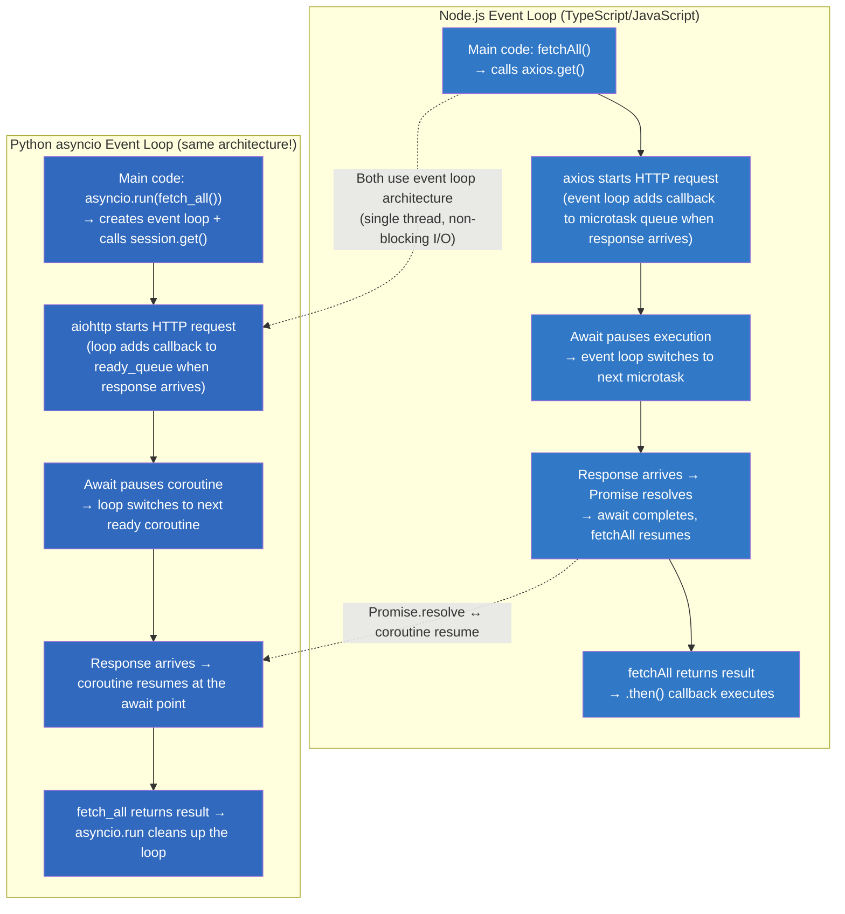

### Key Notes: Event Loop Architecture

1. **TypeScript's async/await and Python asyncio share the same architecture** — a single-threaded event loop that manages I/O without blocking other work. The difference is how you declare it: `async function` in TypeScript vs `async def` in Python.
2. **`asyncio.gather()` is like TypeScript's `Promise.all()`** — both run multiple async operations concurrently and wait for all to complete. Both return a list/tuple of results in the same order as the input tasks.
3. **Python's `await asyncio.sleep()` is like TypeScript's `setTimeout(..., ms)` but awaitable!** — it yields control back to the event loop so other coroutines can run during the sleep (non-blocking!).
4. **Critical difference**: In Python, you must explicitly create and manage the event loop with `asyncio.run()`. In TypeScript/Node.js, the event loop runs automatically.

---

## 2. Coroutines — What They Are and How They Work

### TypeScript Async Function vs Python Coroutine (Side-by-Side)

```typescript
// === TypeScript: async function returns a Promise! ===
async function fetchUser(id: string): Promise<User> {
  const response = await axios.get(`/api/users/${id}`);
  return response.data;
}

// Calling it: creates a promise but does NOT start execution immediately!
const promise = fetchUser("alice");  // Returns a Promise — not yet executed!
// The async function's body runs when the event loop processes this promise.

promise.then(user => console.log(user.name));  // Resolved later when the response arrives.
// Note: In TS, the async function body starts executing as soon as
// the returned Promise is created (unlike Python coroutines!)
```

```python
# === Python: async def returns a COROUTINE object! ===
import asyncio

async def fetch_user(id: str) -> dict:
    """Like 'async function fetchUser(id): Promise<User>' in TypeScript — both return an async wrapper."""
    async with aiohttp.ClientSession() as session:
        resp = await session.get(f"/api/users/{id}")  # Non-blocking I/O!
        return await resp.json()                        # Parse JSON asynchronously!

# Calling it: creates a coroutine object — does NOT start execution immediately!
coro = fetch_user("alice")  # Returns a coroutine object — not yet executed!
# The async function's body runs ONLY when the event loop processes this coroutine.

# Key difference from TypeScript: In Python, calling an async function returns a COROUTINE
# that does NOT execute until you explicitly schedule it (await, create_task, gather).
# In TypeScript, calling an async function IMMEDIATELY starts its execution on the event loop!

# To actually run it, you must await it (like TypeScript's .then()):
asyncio.run(fetch_user("alice"))  # Like 'await fetchUser("alice")' in TypeScript!
# This starts a new event loop and executes the coroutine until it completes.

# OR create a task (like Promise.resolve().then() in TS — schedules it for later execution):
task = asyncio.create_task(fetch_user("alice"))  # Schedules for immediate execution!
# The coroutine runs concurrently with other code on the event loop!
result = await task  # Wait for it to complete and get the result
```

### Python Coroutines Deep Dive — Every Aspect

```python
import asyncio
import inspect

# === Check if something is a coroutine vs a function ===
async def async_func():
    return 42

def sync_func():
    return 42

coro = async_func()              # <coroutine object>
result = sync_func()             # 42 (executed immediately!)

print(inspect.iscoroutine(coro))     # True
print(inspect.iscoroutinefunction(async_func))  # True
print(inspect.iscoroutine(result))       # False (int, not a coroutine)


# === Coroutine protocol: Manual step-by-step execution ===
async def manual_coroutine():
    print("Step 1")
    value = yield 42          # Like Python's generator yield!
    print(f"Step 2: received {value}")
    return "done"

# Get the coroutine:
coro = manual_coroutine()

# Step through it manually (like TypeScript's iterator pattern for async):
try:
    result = coro.send(None)  # Run until first yield → result is 42
    print(f"Yielded: {result}")  # "Yielded: 42"
    
    coro.send("hello")        # Send value back into coroutine
except StopIteration as e:
    print(f"Final result: {e.value}")  # "Final result: done"


# === Coroutines as first-class objects ===
async def compute(x, y):
    await asyncio.sleep(0.1)  # Simulate I/O
    return x + y

# Pass coroutines around like any value:
task1 = compute(1, 2)        # Coroutine object (not yet running!)
task2 = compute(3, 4)        # Another coroutine object
await asyncio.gather(task1, task2)  # Now run both concurrently!


# === Awaitable protocol — anything with __await__ can be awaited ===
class Fetchable:
    """Custom awaitable — like a Promise-like object."""
    def __await__(self):
        # This is how you make ANY object awaitable (like implementing Promise)
        async def inner():
            result = await some_backend_call()
            return result
        return inner().__await__()

fetcher = Fetchable()
result = await fetcher  # Works because __await__ is defined!
```

### Mermaid: Coroutine Lifecycle in Python

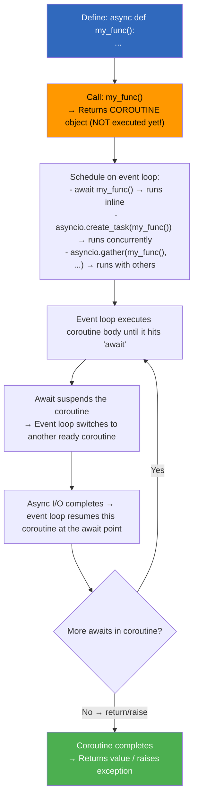

---

## 3. asyncio Deep Dive — Every Function Exhaustive Reference

### 3.1 Event Loop Architecture

#### Every Event Loop Method

| Method | Description | TypeScript Equivalent |
|--------|-------------|---------------------|
| `asyncio.new_event_loop()` | Create a new event loop instance | Node.js has one global loop |
| `loop.run_until_complete(coro)` | Run until coroutine completes | Same as asyncio.run() internally |
| `loop.run_forever()` | Run the loop indefinitely | Like Node's `process.nextTick` loop |
| `loop.run_in_executor(exec, fn, *args)` | Run blocking function in thread/process pool | `setImmediate(fn)` or Worker threads |
| `loop.call_soon(coro)` | Schedule callback for next iteration | `setTimeout(cb, 0)` |
| `loop.call_later(delay, coro)` | Schedule callback after delay seconds | `setTimeout(cb, delay*1000)` |
| `loop.create_future()` | Create a Future object (low-level awaitable) | `new Promise(() => {})` |
| `loop.stop()` | Stop the event loop | Process exit / `.destroy()` |

```python
import asyncio

# === Creating and managing event loops manually ===
loop = asyncio.new_event_loop()       # Create new event loop instance
asyncio.set_event_loop(loop)          # Set it as the current loop

async def main():
    print("Hello from custom event loop!")
    await asyncio.sleep(0.1)

# Run until complete (automatically stops the loop):
loop.run_until_complete(main())

# Or run forever (useful for servers):
# loop.run_forever()

# Schedule callbacks:
def on_ready():
    print("Event loop is ready!")

loop.call_soon(on_ready)          # Runs on next iteration
loop.call_later(1.0, on_ready)   # Runs after 1 second delay

# Low-level futures (like TypeScript's Promise before resolution):
future = loop.create_future()     # A future that may be resolved later

async def resolve_later():
    await asyncio.sleep(1)
    future.set_result("resolved!")  # Resolve the future

loop.create_task(resolve_later())
print(await future)  # "resolved!" — like awaiting a Promise!

loop.close()  # Clean up
```

### Mermaid: asyncio Event Loop Architecture

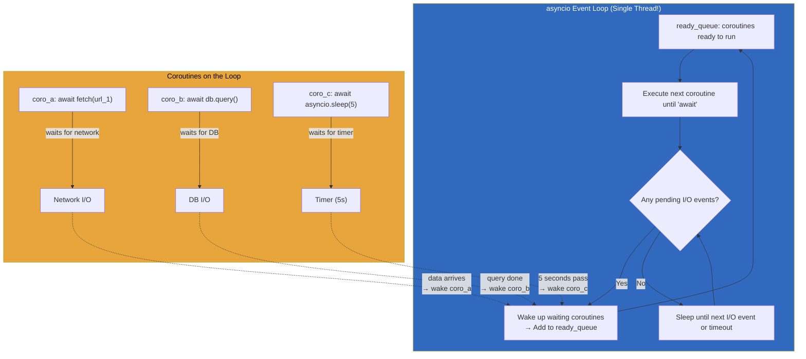

### 3.2 Task Scheduling & Lifecycle

#### Every Task-Related Function

| Function | Description | TypeScript Equivalent |
|----------|-------------|---------------------|
| `asyncio.create_task(coro)` | Schedule coroutine to run immediately on the loop | Starting a Promise that runs in background |
| `asyncio.TaskGroup()` (3.11+) | Group tasks with typed error handling | No direct equivalent — like concurrent try/catch |
| `task.cancel()` | Request cancellation of a task | `controller.abort()` |
| `task.cancelling()` (3.12+) | Count pending cancellations | N/A |
| `task.cancelled()` | Check if task was cancelled | `promise.status === 'rejected'` with AbortError |
| `task.done()` | Check if task completed | `promise.status === 'fulfilled' or 'rejected'` |
| `task.result()` | Get the result (raises if failed) | `promise.value` after resolution |
| `task.exception()` | Get the exception (if any) | `promise.reason` after rejection |
| `asyncio.all_tasks()` | Get all tasks on current loop | N/A — Python tracks all active tasks |
| `asyncio.current_task()` | Get the currently running task | `Task.currentlyRunning()` in some libs |

```python
import asyncio

# === Task Creation and Basic Operations ===
async def worker(name, delay):
    print(f"{name} starting...")
    await asyncio.sleep(delay)
    print(f"{name} done!")
    return f"result_from_{name}"

# Create multiple tasks (they all start running IMMEDIATELY!):
task1 = asyncio.create_task(worker("A", 1))  # Starts now!
task2 = asyncio.create_task(worker("B", 2))  # Also starts now!
task3 = asyncio.create_task(worker("C", 0.5))  # Also starts now!

print(f"task1 running? {not task1.done()}")  # True — it's executing!

# Wait for all results:
results = await asyncio.gather(task1, task2, task3)
print(results)  # ["result_from_A", "result_from_B", "result_from_C"]


# === Task Cancellation ===
async def cancellable_task():
    try:
        print("Task starting...")
        await asyncio.sleep(100)  # Long-running I/O
    except asyncio.CancelledError:
        print("Task was cancelled! Cleaning up...")
        raise  # Must re-raise CancelledError!
    finally:
        print("Cleanup always runs!")

task = asyncio.create_task(cancellable_task())
await asyncio.sleep(0.1)  # Let it start
task.cancel()  # Request cancellation

try:
    await task  # Will raise CancelledError
except asyncio.CancelledError:
    print("Task caught the cancellation")


# === Task with Timeout (like AbortController) ===
async def slow_operation():
    await asyncio.sleep(10)
    return "done"

task = asyncio.create_task(slow_operation())

try:
    await asyncio.wait_for(task, timeout=2.0)  # Wait max 2 seconds
except asyncio.TimeoutError:
    task.cancel()  # Cancel the slow operation!
    try:
        await task  # Clean up the cancelled task
    except asyncio.CancelledError:
        print("Task was cancelled due to timeout")


# === Monitoring All Tasks ===
async def main():
    tasks = [asyncio.create_task(worker(f"T{i}", i)) for i in range(5)]
    
    # Get all active tasks (for debugging):
    all_tasks = asyncio.all_tasks()
    print(f"Total tasks running: {len(all_tasks)}")
    
    # Check each task's state:
    for task in tasks:
        print(f"Task done? {task.done()}, result? {task.result() if task.done() else 'N/A'}")
    
    # Gather results (or exceptions):
    results = await asyncio.gather(*tasks, return_exceptions=True)
    for r in results:
        if isinstance(r, Exception):
            print(f"Task failed: {r}")


# === Task Priority (using asyncio.PriorityQueue instead of task priorities) ===
# Python doesn't have built-in task priorities — use queues!
```

### 3.3 gather(), wait_for(), as_completed()

#### Complete Comparison: All Gathering Functions

| Function | Returns | Order | Error Behavior | Timeout Support |
|----------|---------|-------|----------------|---------------|
| `asyncio.gather(*coros)` | Tuple of results | Input order | First exception → all cancelled | Via `wait_for` wrapper |
| `asyncio.gather(..., return_exceptions=True)` | Tuple (results + exceptions) | Input order | Exceptions returned, not raised | Via `wait_for` wrapper |
| `asyncio.wait_for(coro, timeout=)` | Single result | N/A | Raises TimeoutError | Built-in ✓ |
| `asyncio.wait(..., FIRST_COMPLETED)` | (done, pending) sets | N/A | All exceptions accessible | N/A |
| `asyncio.as_completed()` | Async iterator of tasks | As they complete | Exceptions on iteration | Per-task via wait_for |

```python
import asyncio

# --- asyncio.gather() — Like Promise.all() ---
async def fetch(url, delay):
    await asyncio.sleep(delay)
    return f"data_from_{url}"

async def example_gather():
    urls = ["a", "b", "c"]
    delays = [3, 2, 1]  # b finishes first (1s), c second (2s), a third (3s)
    
    tasks = [fetch(url, delay) for url, delay in zip(urls, delays)]
    
    # All start concurrently — total time ~3s (max of all delays)!
    results = await asyncio.gather(*tasks)
    print(results)  # ("data_from_a", "data_from_b", "data_from_c") — order matches input!


# --- gather() with return_exceptions=True — Like Promise.allSettled() ---
async def flaky_task(url):
    if url == "b":
        raise ConnectionError(f"Failed to fetch {url}")
    return f"data_from_{url}"

async def example_gather_exceptions():
    tasks = [flaky_task(url) for url in ["a", "b", "c"]]
    
    # Unlike Promise.all (which fails on first error), this continues!
    results = await asyncio.gather(*tasks, return_exceptions=True)
    
    for r in results:
        if isinstance(r, Exception):
            print(f"Task failed: {r}")  # "Task failed: Failed to fetch b"
        else:
            print(f"Task succeeded: {r}")  # "data_from_a", "data_from_c"


# --- asyncio.wait_for() — Like Promise.race with timeout ---
async def slow_fetch():
    await asyncio.sleep(10)
    return "result"

async def example_wait_for():
    try:
        result = await asyncio.wait_for(slow_fetch(), timeout=2.0)
    except asyncio.TimeoutError:
        print("Timed out after 2 seconds!")


# --- asyncio.wait() with FIRST_COMPLETED — Like Promise.race ---
async def example_wait_race():
    task1 = asyncio.create_task(fetch("a", 3))
    task2 = asyncio.create_task(fetch("b", 1))
    
    # Wait for whichever finishes first:
    done, pending = await asyncio.wait(
        [task1, task2], 
        return_when=asyncio.FIRST_COMPLETED
    )
    
    # Cancel the losers:
    for t in pending:
        t.cancel()
    
    # Get the winner:
    result = list(done)[0].result()
    print(f"Winner: {result}")  # "data_from_b" (finished first at 1s)


# --- asyncio.as_completed() — Iterate as tasks finish ---
async def example_as_completed():
    urls = ["a", "b", "c"]
    delays = [3, 1, 2]
    
    tasks = {asyncio.create_task(fetch(url, delay)): url 
             for url, delay in zip(urls, delays)}
    
    # Tasks complete in order: b (1s), c (2s), a (3s)
    for coro in asyncio.as_completed(tasks):
        result = await coro
        print(f"Completed: {result}")


# --- Comprehensive comparison with TypeScript ===
/*
// TypeScript equivalents:

// gather() → Promise.all([p1, p2, p3])
const [a, b, c] = await Promise.all([fetchA(), fetchB(), fetchC()]);

// gather(return_exceptions=True) → no direct equivalent in TS standard lib
// Use custom implementation or a library like p-settled

// wait_for(coro, timeout=s) → Promise.race([coro, new Promise((_, r) => setTimeout(() => r.reject(new Error('timeout')), ms * 1000))])

// wait(FIRST_COMPLETED) → Promise.race([p1, p2]) — but Python lets you cancel losers!

// as_completed() → forEach loop with await (results come in completion order)
for (const task of tasks) {
  const result = await task;  // In TS, all run concurrently via createTask
  console.log(result);        // Results may arrive in any order
}
*/
```

### Mermaid: Task Scheduling Flow

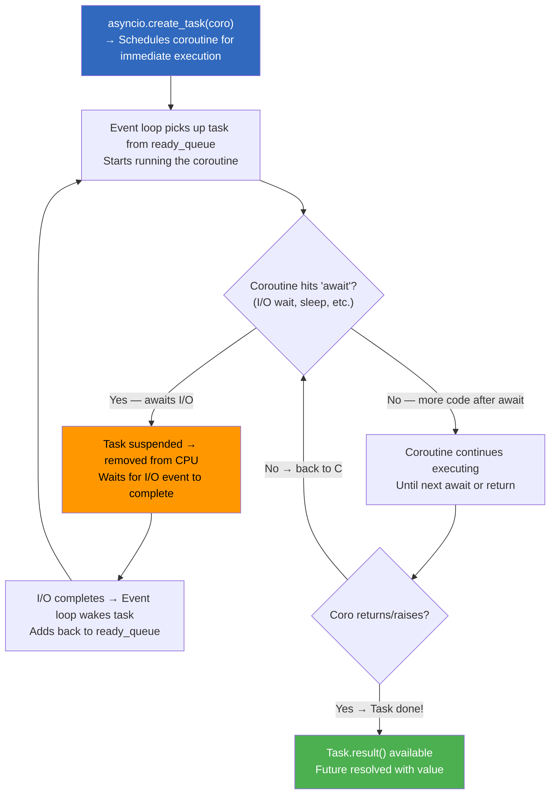

### 3.4 Semaphore, Lock, Event, Condition — Synchronization Primitives

#### Every Sync Primitive in asyncio

| Primitive | Purpose | TypeScript Equivalent |
|-----------|---------|---------------------|
| `asyncio.Semaphore(n)` | Limit concurrent access to n resources | Rate-limiting packages (throttle-by-ratelimit) |
| `asyncio.Lock()` | Mutual exclusion — only one holder at a time | mutex libraries |
| `asyncio.Event()` | Signal between coroutines (like Promise with resolve callback) | Events / signals |
| `asyncio.Condition()` | Wait/notify pattern for complex coordination | condition variables |
| `asyncio.BoundedSemaphore(n)` | Like Semaphore but prevents over-release | Same as Semaphore in TS libs |

```python
import asyncio

# === Semaphore: Rate Limiting (Like a bucket of n permits) ===
async def fetch_with_semaphore(session, url, semaphore):
    """Only 5 requests run at a time — others wait."""
    async with semaphore:  # Acquire permit (blocks if all 5 taken)
        async with session.get(url) as resp:
            return await resp.json()

async def rate_limited_fetch(urls):
    semaphore = asyncio.Semaphore(5)  # Max 5 concurrent!
    async with aiohttp.ClientSession() as session:
        tasks = [fetch_with_semaphore(session, url, semaphore) for url in urls]
        return await asyncio.gather(*tasks)


# === Lock: Mutual Exclusion (Like mutex) ===
counter = 0
counter_lock = asyncio.Lock()

async def increment():
    global counter
    async with counter_lock:       # Only one coroutine enters at a time!
        current = counter          # Read (in critical section)
        await asyncio.sleep(0.1)   # Simulate I/O inside lock
        counter = current + 1      # Write (still in critical section)

async def test_lock():
    global counter
    tasks = [increment() for _ in range(10)]
    await asyncio.gather(*tasks)
    print(counter)  # Always exactly 10 — never more, never less!


# === Event: Signal Between Coroutines (Like resolve callback on a Promise) ===
start_signal = asyncio.Event()

async def waiter(name):
    print(f"{name} waiting for signal...")
    await start_signal.wait()  # Blocks until .set() is called
    print(f"{name} received signal! Proceeding!")

async def signaler():
    await asyncio.sleep(2)       # Wait 2 seconds...
    start_signal.set()           # ...then release all waiters!

async def test_event():
    t1 = asyncio.create_task(waiter("Worker-1"))
    t2 = asyncio.create_task(waiter("Worker-2"))
    await signaler()             # Triggers both workers
    await asyncio.gather(t1, t2)


# === Condition: Wait/Notify (Like Java's wait/notify) ===
data_ready = asyncio.Condition()
shared_data = None

async def producer():
    global shared_data
    async with data_ready:
        shared_data = "processed result"
        data_ready.notify_all()  # Wake all waiting consumers!

async def consumer(name):
    global shared_data
    async with data_ready:
        while shared_data is None:   # Spurious wakeups possible — always check condition!
            await data_ready.wait()
    print(f"{name} got data: {shared_data}")

async def test_condition():
    p = asyncio.create_task(producer())
    c1 = asyncio.create_task(consumer("Alice"))
    c2 = asyncio.create_task(consumer("Bob"))
    await asyncio.gather(p, c1, c2)


# === BoundedSemaphore: Prevent Over-Release ===
sem = asyncio.BoundedSemaphore(3)  # Max 3 permits

async def use_semaphore():
    async with sem:  # Acquires one permit
        pass
    # sem.release() called automatically by __aexit__
```

### 3.5 TaskGroup Error Handling (Python 3.11+, except*)

#### The New Way to Handle Groups of Tasks

```python
import asyncio

# --- Basic TaskGroup (like Promise.all but with error handling) ===
async def fetch_with_group(urls):
    async with asyncio.TaskGroup() as tg:
        tasks = [tg.create_task(fetch(url)) for url in urls]
    
    # All succeeded! Get results:
    return [task.result() for task in tasks]

# If ANY task fails, TaskGroup raises GroupError containing all exceptions.


# --- TaskGroup with error handling (the power of except*) ===
async def fetch_with_error_handling(urls):
    errors = []
    
    try:
        async with asyncio.TaskGroup() as tg:
            tasks = [tg.create_task(fetch(url)) for url in urls]
    except* Exception as e:
        # except* catches EACH exception individually (Python 3.11+!)
        errors.append(str(e))
    
    if errors:
        print(f"Some tasks failed: {errors}")
    
    return [t.result() for t in tasks if not t.cancelled()]


# --- TaskGroup with partial success — collect results where possible ===
async def partial_fetch(urls):
    results = {}
    exceptions = []
    
    async with asyncio.TaskGroup() as tg:
        task_map = {url: tg.create_task(fetch(url)) for url in urls}
    
    # Extract any errors:
    for e in asyncio.TaskGroup.__class__.__iter__(tg) if hasattr(tg, '__iter__') else []:
        pass  # TaskGroup already extracted results into tasks
    
    for url, task in task_map.items():
        if task.exception() is not None:
            exceptions.append((url, str(task.exception())))
        else:
            results[url] = task.result()
    
    return results, exceptions


# --- Complete real-world example with except* ===
async def health_check_endpoints(urls):
    """Check multiple endpoints — report ALL failures (don't stop on first)."""
    results = {}
    all_errors = []
    
    try:
        async with asyncio.TaskGroup() as tg:
            for url in urls:
                tg.create_task(health_check_single(url, results))
    except* Exception as eg:
        all_errors.extend(str(e) for e in eg.exceptions)
    
    if all_errors:
        print(f"Health check failures:\n" + "\n".join(all_errors))
    
    return {"healthy": len(results), "errors": all_errors}


# --- Python 3.12+ enhanced TaskGroup with explicit cleanup ===
async def robust_task_group(urls):
    async with asyncio.TaskGroup() as tg:
        for url in urls:
            task = tg.create_task(fetch(url))
            # You can configure each task individually before it runs!
            task.set_name(f"fetch_{url}")
    
    return [t.result() for t in tg]  # Access via context manager
```

### Mermaid: TaskGroup Error Handling Flow

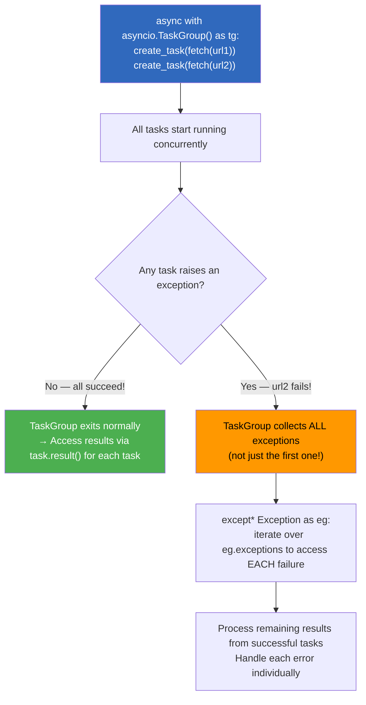

### 3.6 Cancel Scopes & Timeout Context Managers

#### Comprehensive Timeout and Cancellation Reference

```python
import asyncio

# --- Python 3.11+: asyncio.timeout() (Context Manager) ===
async def fetch_with_timeout(url):
    try:
        async with asyncio.timeout(5.0):  # 5 second timeout!
            async with aiohttp.ClientSession() as session:
                resp = await session.get(url)
                return await resp.json()
    except asyncio.TimeoutError:
        print(f"Timeout for {url}")


# --- Python 3.11+: asyncio.timeout_at(deadline_timestamp) ===
import time
deadline = time.monotonic() + 10.0  # Absolute deadline (10 seconds from now)

async def fetch_with_absolute_deadline(url):
    async with asyncio.timeout_at(deadline):
        return await some_async_operation(url)


# --- Python 3.11+: Cancel scopes for fine-grained cancellation ===
async def parent_task():
    """Parent can cancel child tasks."""
    async with asyncio.CancelScope() as scope:
        
        async def child():
            try:
                while True:
                    await asyncio.sleep(1)
            except asyncio.CancelledError:
                print("Child was cancelled!")
                raise
        
        # Start the child task within this cancel scope
        child_task = asyncio.create_task(child())
        await asyncio.sleep(0.5)
        
        # Cancel everything in this scope:
        scope.cancel()


# --- Python 3.12+: asyncio.timeout() with nested scopes ===
async def nested_timeout():
    try:
        async with asyncio.timeout(10.0):  # Outer: 10s total
            await step_one()
            
            async with asyncio.timeout(2.0):  # Inner: 2s for this step
                await step_two()
            
            async with asyncio.timeout(1.0):  # Even more inner: 1s
                await step_three()
    except asyncio.TimeoutError as e:
        print(f"Timed out: {e}")


# --- Combining cancellation with cleanup (like try/finally in coroutines) ===
async def graceful_shutdown():
    """Demonstrate proper cancellation handling."""
    connections = []
    
    async def worker(url):
        conn = await connect(url)  # Opening connection...
        connections.append(conn)
        try:
            return await process(conn)
        finally:
            if conn in connections:
                connections.remove(conn)
                await conn.close()  # Always clean up!
    
    tasks = [asyncio.create_task(worker(url)) for url in urls]
    
    try:
        results = await asyncio.gather(*tasks)
    except asyncio.CancelledError:
        print("Shutting down gracefully...")
        for t in tasks:
            if not t.done():
                t.cancel()
        raise  # Re-raise to stop the event loop
    
    return results
```

### 3.7 Async Iterator / Async For Pattern

#### Every AsyncIterator Protocol Method

| Method | Purpose | TypeScript Equivalent |
|--------|---------|---------------------|
| `__aiter__` | Returns async iterator object | `[Symbol.asyncIterator]()` |
| `__anext__` | Returns next item (async) | `iterator.next()` (Promise) |
| `async for` | Pythonic syntax for async iteration | `for await...of` |

```python
# === Async Iterator Protocol (like TypeScript's Symbol.asyncIterator) ===
class AsyncRange:
    """Like Range in TS but async — yields values one at a time."""
    
    def __init__(self, start, stop):
        self.current = start
        self.stop = stop
    
    def __aiter__(self):   # Like [Symbol.asyncIterator]() in TS
        return self
    
    async def __anext__(self):  # Like iterator.next() returning Promise<T>
        if self.current >= self.stop:
            raise StopAsyncIteration  # Like throwing 'done' signal
        
        value = self.current
        self.current += 1
        await asyncio.sleep(0.1)     # Simulate async data source
        return value


# Using it with async for:
async def use_async_iterator():
    results = []
    async for item in AsyncRange(0, 5):
        results.append(item)
    print(results)  # [0, 1, 2, 3, 4]


# === Built-in async iterators ===

# aiosocket reading (each recv is an async iteration step):
async def read_from_socket(sock):
    while True:
        data = await sock.recv(1024)
        if not data:
            break
        yield data  # Async generator!


# asyncio.StreamReader (built into Python's event loop internals):
reader, writer = await asyncio.open_connection("localhost", 8000)
async for line in reader:  # Read lines asynchronously
    print(f"Got: {line.decode()}")


# === asyncio.to_thread() — Convert sync iterator to async (3.9+) ===
def compute_sync():
    """Synchronous computation."""
    return sum(x * x for x in range(1000000))

result = await asyncio.to_thread(compute_sync)  # Runs in thread pool!


# === Iterating over async iterables with list comprehension ===
async def collect_all(items):
    """Collect all items from an async iterable into a list."""
    return [item async for item in items]  # Like [...items] in TS

results = await collect_all(AsyncRange(0, 10))


# === Async iterables as function parameters ===
async def process_stream(async_iterable):
    """Process any async iterable — file handle, socket, generator, etc."""
    count = 0
    total = 0
    async for item in async_iterable:
        count += 1
        total += item
    return {"count": count, "average": total / count if count else 0}
```

### 3.8 Async Generator Expressions

#### Complete AsyncGenerator Reference

| Method | Purpose | TypeScript Equivalent |
|--------|---------|---------------------|
| `async def` with `yield` | Create an async generator | `async function*` |
| `async for item in gen()` | Consume async generator | `for await...of` |
| `ag.aclose()` | Close the generator early | `generator.return()` |
| `ag.athrow(exc)` | Send exception into generator | `generator.throw(error)` |

```python
import asyncio

# === Async Generator: Producing Values ===
async def async_range(start, stop):
    """Async version of range — yields values one at a time."""
    for i in range(start, stop):
        yield i
        await asyncio.sleep(0.1)  # Non-blocking delay between yields

# Consume with async for:
async def consume_async_gen():
    async for num in async_range(0, 5):
        print(num)  # Prints 0, 1, 2, 3, 4 — each separated by 100ms


# === Async Generator Expression (like list comprehension but async!) ===
# Note: Python does NOT have async generator expressions as a syntax!
# You must use regular generator expressions or async for loops:

async def numbers_squared(limit):
    """Like [x**2 for x in range(limit)] but async!"""
    for x in range(limit):
        yield x ** 2
        await asyncio.sleep(0.01)

# Or using async for to collect:
squared = [n async for n in numbers_squared(10)]  # List comprehension with async iteration


# === Real-world: Async file reader generator ===
import aiofiles

async def read_file_lines(path):
    """Yield lines from a large file without loading it all into memory."""
    async with aiofiles.open(path, "r") as f:
        async for line in f:  # Line-by-line async reading!
            yield line.strip()

# Usage:
async def count_words_in_large_file(path):
    word_count = 0
    async for line in read_file_lines(path):
        word_count += len(line.split())
    return word_count


# === Async generator with cleanup (like TypeScript's finally) ===
@asynccontextmanager
async def transaction(db_connection):
    """Async context manager that yields a transaction, guarantees commit/rollback."""
    await db_connection.begin()
    try:
        yield db_connection  # Give the caller the transaction to work with
        await db_connection.commit()
    except Exception:
        await db_connection.rollback()
        raise


# === Async generator with backpressure (consumer controls pace) ===
async def producer(items):
    """Producer that yields items one at a time."""
    for item in items:
        await asyncio.sleep(0.1)  # Simulate slow production
        yield item

async def consumer(name, gen):
    """Consumer that reads at its own pace."""
    async for item in gen:
        print(f"{name} processed: {item}")


# Start producer-consumer pipeline:
gen = producer(range(10))
await asyncio.gather(consumer("Worker-A", gen), consumer("Worker-B", gen))
```

### 3.9 Backpressure Patterns with Queue, PriorityQueue, LifoQueue

#### Complete Queue Reference

| Queue Type | Order | Use Case | TypeScript Equivalent |
|------------|-------|----------|---------------------|
| `asyncio.Queue` | FIFO (first in, first out) | Worker pools, producer-consumer | BlockingQueue libs |
| `asyncio.PriorityQueue` | By priority (lowest first) | Job scheduling, rate limiting | N/A |
| `asyncio.LifoQueue` | Last in, first out | Undo/redo, depth-first processing | LIFO stack |
| `asyncio.SimpleQueue` (3.12+) | FIFO, no get_nowait/empty methods | Simple producer-consumer | No TS equivalent |

```python
import asyncio

# === asyncio.Queue: Classic Producer-Consumer Pattern ===
async def producer(queue: asyncio.Queue, items):
    """Producer that puts items into the queue."""
    for item in items:
        await queue.put(item)  # Puts item, blocks if queue is full
        print(f"Produced: {item}")
    await queue.put(None)  # Sentinel value to signal "done"

async def consumer(queue: asyncio.Queue, name):
    """Consumer that pulls items from the queue."""
    while True:
        item = await queue.get()  # Gets next item, blocks if empty
        if item is None:           # Sentinel: production finished!
            queue.task_done()      # Acknowledge task completion
            break
        
        print(f"{name} consumed: {item}")
        await asyncio.sleep(0.1)   # Simulate processing time
        queue.task_done()          # Mark task as done

async def test_producer_consumer():
    queue = asyncio.Queue(maxsize=5)  # Max 5 items in flight (backpressure!)
    
    # Start producer and multiple consumers concurrently:
    prod_task = asyncio.create_task(producer(queue, range(10)))
    cons_tasks = [asyncio.create_task(consumer(queue, f"C{i}")) for i in range(3)]
    
    # Wait for all consumers to finish (which happens when None sentinel arrives):
    await asyncio.gather(*cons_tasks)
    prod_task.cancel()  # Cancel the producer (queue is now empty)


# === PriorityQueue: Priority-Based Processing ===
async def priority_processor():
    queue = asyncio.PriorityQueue()
    
    # Put tasks with priorities: lower number = higher priority!
    await queue.put((3, "low_priority_job"))    # Priority 3
    await queue.put((1, "critical_job"))         # Priority 1 (processed first!)
    await queue.put((2, "medium_priority_job"))  # Priority 2
    
    while not queue.empty():
        priority, task_name = await queue.get()
        print(f"Processing (priority={priority}): {task_name}")


# === LifoQueue: Last-In-First-Out (Like a stack) ===
async def undo_stack():
    """Stack-like behavior for undo operations."""
    stack = asyncio.LifoQueue()
    
    # Push operations:
    await stack.put("edit_1")
    await stack.put("edit_2")
    await stack.put("edit_3")
    
    # Pop (undo) in reverse order!
    while not stack.empty():
        undo_op = await stack.get()
        print(f"Undoing: {undo_op}")  # Prints: edit_3, edit_2, edit_1


# === SimpleQueue (Python 3.12+): Lightweight FIFO Queue ===
async def simple_producer_consumer():
    queue = asyncio.SimpleQueue()  # No get_nowait, no empty(), no join() — simpler!
    
    await queue.put("hello")
    item = await queue.get()      # Only async get allowed (no race conditions!)
    assert item == "hello"


# === Backpressure Pattern: Queue Size Controls Producer Speed ===
async def rate_limited_producer(queue, items, max_backlog=10):
    """Producer that naturally slows down when consumers are slow."""
    for item in items:
        # If queue is full (backlogged), this blocks until a consumer makes room!
        await asyncio.wait_for(queue.put(item), timeout=5.0)
        print(f"Produced {item} — backlog={queue.qsize()}/{max_backlog}")

async def test_backpressure():
    queue = asyncio.Queue(maxsize=3)  # Only 3 items can be queued!
    
    prod_task = asyncio.create_task(rate_limited_producer(queue, range(10)))
    # Consumers naturally control the pace — when queue is full, producer waits!
```

### Mermaid: Queue-Based Backpressure Pattern

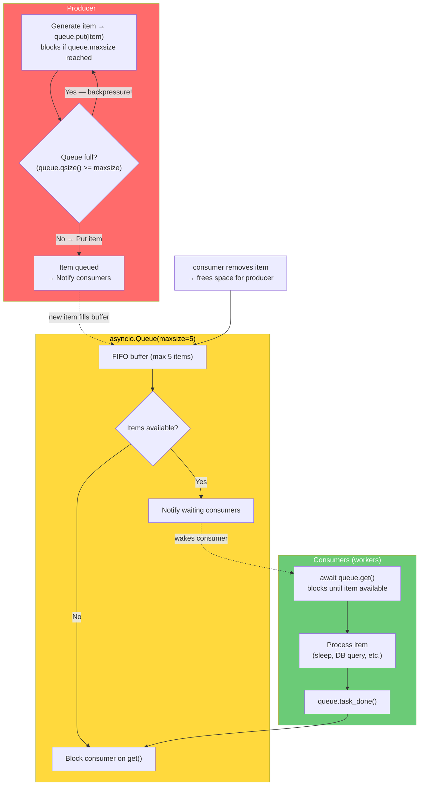

### 3.10 asyncio.subprocess — Subprocess Management

#### Complete Subprocess API Reference

```python
import asyncio

# === Running a subprocess asynchronously ===
async def run_command(cmd, input_data=None):
    """Run a command and capture stdout/stderr."""
    process = await asyncio.create_subprocess_exec(
        *cmd,                           # Command as list: ["ls", "-la"]
        stdin=asyncio.subprocess.PIPE,  # Allow writing to stdin
        stdout=asyncio.subprocess.PIPE, # Capture stdout
        stderr=asyncio.subprocess.PIPE, # Capture stderr
    )
    
    # Send input (if any) and get output:
    stdout, stderr = await process.communicate(input=input_data.encode() if input_data else None)
    
    return {
        "returncode": process.returncode,
        "stdout": stdout.decode(),
        "stderr": stderr.decode(),
    }

# Usage:
result = await run_command(["ls", "-la"])
print(result["stdout"])


# === Streaming subprocess output (real-time processing) ===
async def stream_git_log(repo_path):
    """Stream git log output in real-time — process as it produces!"""
    process = await asyncio.create_subprocess_exec(
        "git", "log", "--oneline", "--all",
        cwd=repo_path,
        stdout=asyncio.subprocess.PIPE,
        stderr=asyncio.subprocess.PIPE,
    )
    
    # Read stdout line by line as it's produced:
    async for line in process.stdout:
        commit = line.decode().strip()
        print(f"New commit: {commit}")  # Real-time processing!
    
    # Wait for process to complete:
    await process.wait()
    return True


# === Subprocess with stdin writing (interactive processes) ===
async def interactive_shell():
    """Run a command that requires interactive input."""
    process = await asyncio.create_subprocess_exec(
        "python", "-c",
        "import sys; print(f'Got: {sys.stdin.read().strip()}')",
        stdin=asyncio.subprocess.PIPE,
        stdout=asyncio.subprocess.PIPE,
    )
    
    # Write to stdin and read output:
    process.stdin.write(b"hello from asyncio\n")
    await process.stdin.drain()  # Flush the buffer
    
    output = await process.stdout.read()
    print(output.decode())  # "Got: hello from asyncio"
    
    process.stdin.close()
    await process.wait()


# === Subprocess with timeout ===
async def run_with_timeout(cmd, timeout_s=30):
    try:
        process = await asyncio.create_subprocess_exec(
            *cmd,
            stdout=asyncio.subprocess.PIPE,
            stderr=asyncio.subprocess.PIPE,
        )
        
        stdout, stderr = await asyncio.wait_for(
            process.communicate(), 
            timeout=timeout_s
        )
        return {"stdout": stdout.decode(), "stderr": stderr.decode()}
    
    except asyncio.TimeoutError:
        process.kill()  # Kill the subprocess on timeout!
        raise
```

### 3.11 Signal Handling in Async Code

#### Every Signal Method

| Method | Purpose | Notes |
|--------|---------|-------|
| `loop.add_signal_handler(sig, callback, *args)` | Register async signal handler | Only works with asyncio's selectors |
| `loop.remove_signal_handler(sig)` | Remove a registered signal handler | Clean up to avoid leaks |
| `asyncio.get_event_loop().add_signal_handler()` | Add handler from anywhere (gets loop) | Get current running loop first |

```python
import asyncio
import signal

shutdown_requested = False

def handle_sigint(signum, loop):
    """Handle Ctrl+C gracefully."""
    global shutdown_requested
    print("\nShutting down...")
    shutdown_requested = True

async def graceful_server():
    loop = asyncio.get_running_loop()
    
    # Register signal handlers:
    for sig in (signal.SIGINT, signal.SIGTERM):
        loop.add_signal_handler(sig, handle_sigint, sig, loop)
    
    try:
        while not shutdown_requested:
            await asyncio.sleep(1)
            print("Server running...")
    finally:
        # Clean up handlers:
        for sig in (signal.SIGINT, signal.SIGTERM):
            loop.remove_signal_handler(sig)

# Run: asyncio.run(graceful_server())
# Then press Ctrl+C → graceful shutdown!
```

### 3.12 Running Sync Code in async (run_in_executor)

#### Every Executor Method

| Method | Purpose | Notes |
|--------|---------|-------|
| `loop.run_in_executor(executor, fn, *args)` | Run blocking function in separate thread/process | executor=None → default ThreadPoolExecutor |
| `asyncio.get_event_loop().run_in_executor()` | Run from any coroutine context | Get the running loop first |

```python
import asyncio
from concurrent.futures import ThreadPoolExecutor, ProcessPoolExecutor

# === Running CPU-bound code without blocking the event loop ===
def cpu_intensive_work(data):
    """Blocking computation — MUST run in executor!"""
    return sum(x * x for x in data)  # Heavy computation

async def process_with_cpu():
    data = list(range(1_000_000))
    
    # Run blocking function in a thread (doesn't block event loop!)
    loop = asyncio.get_running_loop()
    result = await loop.run_in_executor(None, cpu_intensive_work, data)
    print(f"Result: {result}")  # Computed without blocking other coroutines!


# === Using ProcessPoolExecutor for truly parallel CPU work (3.12+) ===
async def parallel_cpu_tasks():
    async with ProcessPoolExecutor() as executor:
        tasks = [
            loop.run_in_executor(executor, heavy_fn, data_i)
            for i, data_i in enumerate(datasets)
        ]
        results = await asyncio.gather(*tasks)
    
    return results  # All computed in parallel processes!


# === Combining sync and async libraries ===
import requests

def fetch_sync(url):
    """Blocking HTTP call — must be in executor!"""
    return requests.get(url).json()

async def fetch_all_async(urls):
    loop = asyncio.get_running_loop()
    
    tasks = [loop.run_in_executor(None, fetch_sync, url) for url in urls]
    results = await asyncio.gather(*tasks)
    return list(results)

# ⚠️ WARNING: Running sync requests in a thread pool is NOT truly async!
# For real async HTTP, use aiohttp instead of requests.
```

### 3.13 Rate Limiting Patterns: Token Bucket & Leaky Bucket

#### Every Rate Limiter Pattern with asyncio

```python
import asyncio
import time

# === Pattern 1: Semaphore-Based Rate Limiter (Simplest) ===
class SemaphoreRateLimiter:
    """Limit to N concurrent operations using a semaphore."""
    
    def __init__(self, max_concurrent):
        self.semaphore = asyncio.Semaphore(max_concurrent)
    
    async def execute(self, coro_func, *args, **kwargs):
        async with self.semaphore:
            return await coro_func(*args, **kwargs)


# === Pattern 2: Token Bucket (Classic rate limiting) ===
class TokenBucketRateLimiter:
    """Token bucket algorithm: refill tokens at fixed rate, each request costs 1 token."""
    
    def __init__(self, rate: float, burst: int):
        """
        rate: tokens per second (refill rate)
        burst: maximum tokens in the bucket (burst capacity)
        """
        self.rate = rate            # Refill 10 tokens/second
        self.burst = burst          # Max 100 tokens available at once
        self.tokens = float(burst)  # Start full
        self.last_refill = time.monotonic()
        self.lock = asyncio.Lock()
    
    async def acquire(self):
        """Wait until a token is available, then consume it."""
        while True:
            async with self.lock:
                now = time.monotonic()
                elapsed = now - self.last_refill
                
                # Refill tokens based on elapsed time:
                new_tokens = elapsed * self.rate
                if new_tokens > 0:
                    self.tokens = min(self.burst, self.tokens + new_tokens)
                    self.last_refill = now
                
                if self.tokens >= 1.0:
                    self.tokens -= 1.0  # Consume one token
                    return True
            
            # No tokens available — wait and retry!
            await asyncio.sleep(1.0 / self.rate)  # Sleep until next token


# === Pattern 3: Leaky Bucket (Smooth rate limiting) ===
class LeakyBucketRateLimiter:
    """Leaky bucket: requests fill a bucket at any rate, but drain at fixed rate."""
    
    def __init__(self, capacity: float, leak_rate: float):
        self.capacity = capacity  # Max bucket size
        self.leak_rate = leak_rate  # Leak (drain) rate per second
        self.water = 0.0
        self.last_leak = time.monotonic()
        self.lock = asyncio.Lock()
    
    async def acquire(self):
        """Add one unit of water. If full, wait until enough leaks out."""
        while True:
            async with self.lock:
                now = time.monotonic()
                elapsed = now - self.last_leak
                
                # Leak water based on elapsed time:
                leaked = elapsed * self.leak_rate
                self.water = max(0, self.water - leaked)
                self.last_leak = now
                
                if self.water + 1 <= self.capacity:
                    self.water += 1
                    return True
            
            # Bucket full — wait until enough leaks out!
            time_to_leak = (self.water + 1 - self.capacity) / self.leak_rate
            await asyncio.sleep(time_to_leak)


# === Pattern 4: Sliding Window Rate Limiter ===
class SlidingWindowRateLimiter:
    """Track request timestamps within a time window."""
    
    def __init__(self, max_requests: int, window_seconds: float):
        self.max_requests = max_requests
        self.window = window_seconds
        self.timestamps = []
        self.lock = asyncio.Lock()
    
    async def acquire(self):
        while True:
            async with self.lock:
                now = time.monotonic()
                cutoff = now - self.window
                
                # Remove timestamps outside the window:
                self.timestamps = [t for t in self.timestamps if t > cutoff]
                
                if len(self.timestamps) < self.max_requests:
                    self.timestamps.append(now)
                    return True
            
            await asyncio.sleep(0.1)  # Retry after brief wait


# === Using rate limiters in practice ===
async def rate_limited_fetch(urls, limiter):
    async with aiohttp.ClientSession() as session:
        tasks = [limiter.execute(session.get, url) for url in urls]
        return await asyncio.gather(*tasks)
```

### Mermaid: Rate Limiter Token Bucket Pattern

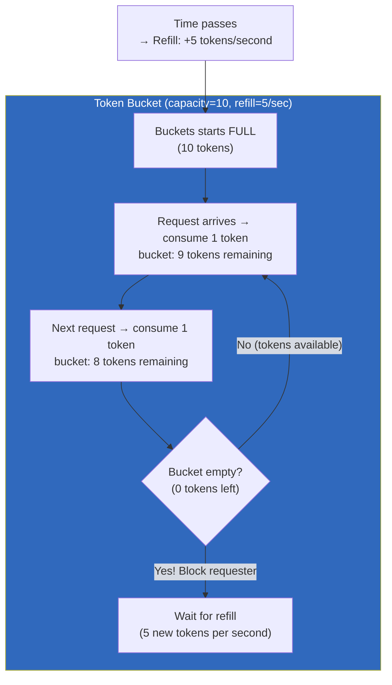

### 3.14 Connection Pooling Patterns

#### Every Connection Pool Pattern with asyncio

```python
import asyncio

# === Pattern 1: Simple Connection Pool (Manual) ===
class SimpleConnectionPool:
    """Basic async connection pool using a Semaphore + Queue."""
    
    def __init__(self, create_fn, max_connections=10):
        self.create_fn = create_fn
        self.max_connections = max_connections
        self.semaphore = asyncio.Semaphore(max_connections)
        self.free_connections = asyncio.Queue(maxsize=max_connections)
        self.active_count = 0
    
    async def acquire(self):
        """Get a connection from the pool (or create one if under limit)."""
        await self.semaphore.acquire()
        
        try:
            # Try to get a free connection:
            if not self.free_connections.empty():
                conn = await self.free_connections.get()
                return conn
            
            # No free connections — create a new one!
            self.active_count += 1
            return await self.create_fn()
        except:
            self.semaphore.release()
            raise
    
    async def release(self, conn):
        """Return a connection to the pool."""
        try:
            await self.free_connections.put(conn)
        except asyncio.QueueFull:
            await conn.close()  // Pool full — close it!


# === Pattern 2: Connection Pool with Health Checking ===
import aiomysql

async def create_pool():
    """Create a pool of database connections."""
    return await aiomysql.create_pool(
        host="localhost",
        user="root",
        password="secret",
        db="mydb",
        minsize=5,
        maxsize=20,
        loop=asyncio.get_event_loop(),
    )

# Usage:
pool = await create_pool()

async def query_with_pool(sql):
    async with pool.acquire() as conn:  // Get connection from pool!
        async with conn.cursor() as cursor:
            await cursor.execute(sql)
            return await cursor.fetchall()

await pool.close()  // Close all connections when done


# === Pattern 3: HTTP Connection Pool (aiohttp Session handles this!) ===
# aiohttp.ClientSession manages connection pooling automatically!
async with aiohttp.ClientSession() as session:
    # Connections are pooled and reused across requests to the same host!
    resp1 = await session.get("https://api.example.com/users")
    resp2 = await session.get("https://api.example.com/posts")
    // Same TCP connection reused for both requests!

# Configure pool settings:
async with aiohttp.ClientSession(
    connector=aiohttp.TCPConnector(
        limit=100,              // Max connections per host
        limit_per_host=50,      // Max connections to a single host
        ttl_dns_cache=300,      // DNS cache TTL (seconds)
        enable_cleanup_closed=True,
    )
) as session:
    pass


# === Pattern 4: Resource Pool for Any Async Resource ===
from contextlib import asynccontextmanager

@asynccontextmanager
async def managed_resource_pool(create_fn, pool_size=5):
    """Generic resource pool — works for DB connections, HTTP clients, etc."""
    resources = asyncio.Queue(maxsize=pool_size)
    
    # Pre-populate the pool:
    for _ in range(pool_size):
        await resources.put(await create_fn())
    
    try:
        yield resources  // Give access to the pool
    finally:
        # Clean up all resources:
        while not resources.empty():
            resource = await resources.get()
            await resource.close()


# Usage:
async def create_redis_connection():
    return await aioredis.create_async_pool("redis://localhost")

async def test_pool():
    async with managed_resource_pool(create_redis_connection, pool_size=10) as pool:
        redis = await pool.get()
        result = await redis.ping()
        await pool.put(redis)  // Return to pool!
```

---

## 4. aiohttp Complete Reference

### 4.1 GET Requests with JSON Headers, Timeout

```python
import asyncio
import aiohttp

# === Basic GET request (like fetch/axios in TypeScript) ===
async def simple_get():
    async with aiohttp.ClientSession() as session:
        async with session.get("https://api.example.com/users") as resp:
            print(f"Status: {resp.status}")         # Like response.status in TS
            data = await resp.json()                  # Like response.json() in TS
            headers = dict(resp.headers)              # Like response.headers in TS
            text = await resp.text()                  // Raw response body
    return data


# === GET with custom headers and timeout (like axios config) ===
async def get_with_headers():
    headers = {
        "Authorization": "Bearer token123",
        "Accept": "application/json",
        "X-Request-ID": "abc-123",
    }
    
    timeout = aiohttp.ClientTimeout(total=30, connect=5, sock_read=10)  // Total/connection/read timeouts
    
    async with aiohttp.ClientSession(timeout=timeout) as session:
        async with session.get(
            "https://api.example.com/users",
            headers=headers,
            params={"page": 1, "limit": 50},  // Query string params!
        ) as resp:
            if resp.status == 200:
                return await resp.json()
            else:
                raise HTTPError(f"HTTP {resp.status}: {await resp.text()}")


# === GET with retry logic (like axios's retry adapters) ===
async def get_with_retry(url, retries=3, backoff=1.0):
    for attempt in range(retries):
        try:
            async with aiohttp.ClientSession() as session:
                async with session.get(
                    url,
                    timeout=aiohttp.ClientTimeout(total=10),
                ) as resp:
                    if resp.status == 200:
                        return await resp.json()
                    elif resp.status in (429, 502, 503):  // Retryable errors
                        await asyncio.sleep(backoff * (2 ** attempt))  // Exponential backoff!
                        continue
                    else:
                        raise HTTPError(f"HTTP {resp.status}")
        except (aiohttp.ClientConnectorError, aiohttp.ServerTimeoutError) as e:
            if attempt == retries - 1:
                raise
            await asyncio.sleep(backoff * (2 ** attempt))


# === Streaming response (like TS ReadableStream) ===
async def stream_large_file(url):
    async with aiohttp.ClientSession() as session:
        async with session.get(url) as resp:
            # Read in chunks — never loads entire file into memory!
            async for chunk in resp.content.iter_chunked(8192):
                process(chunk)  // Process each 8KB chunk


# === Multiple concurrent GET requests (like Promise.all of fetches) ===
async def fetch_many(urls):
    async with aiohttp.ClientSession() as session:
        tasks = [session.get(url) for url in urls]
        responses = await asyncio.gather(*tasks, return_exceptions=True)
        
        results = []
        for resp in responses:
            if isinstance(resp, Exception):
                results.append({"error": str(resp)})
            else:
                results.append(await resp.json())
        return results
```

### 4.2 POST/PUT/DELETE — Form Data, File Upload, Streaming Response

```python
# === POST with JSON body (like axios.post({ data })) ===
async def create_user(name: str, email: str):
    async with aiohttp.ClientSession() as session:
        async with session.post(
            "https://api.example.com/users",
            json={"name": name, "email": email},  // Auto-serializes to JSON!
            headers={"Authorization": "Bearer token"},
        ) as resp:
            return await resp.json()  // Like axios's response.data


# === POST with form data (like FormData in TS) ===
async def submit_form(data: dict, files: list = None):
    async with aiohttp.ClientSession() as session:
        if files:
            # File upload with form data:
            form_data = aiohttp.FormData()
            for key, value in data.items():
                form_data.add_field(key, value)  // Regular fields
            for file_info in files:
                form_data.add_field(
                    "files",      // field name
                    file_info["data"],
                    filename=file_info["name"],
                    content_type=file_info["type"],
                )
            
            async with session.post("https://api.example.com/upload", data=form_data) as resp:
                return await resp.json()
        else:
            # Simple form submission (x-www-form-urlencoded):
            async with session.post(
                "https://api.example.com/submit",
                data=data,  // Automatically URL-encoded!
            ) as resp:
                return await resp.json()


# === PUT request (like axios.put) ===
async def update_user(user_id: int, updates: dict):
    async with aiohttp.ClientSession() as session:
        async with session.put(
            f"https://api.example.com/users/{user_id}",
            json=updates,  // JSON body
        ) as resp:
            if resp.status == 200:
                return await resp.json()
            elif resp.status == 404:
                raise NotFoundError(f"User {user_id} not found")


# === DELETE request (like axios.delete) ===
async def delete_user(user_id: int):
    async with aiohttp.ClientSession() as session:
        async with session.delete(
            f"https://api.example.com/users/{user_id}",
            headers={"Authorization": "Bearer token"},
        ) as resp:
            return {"status": "deleted", "user_id": user_id}


# === Chunked file upload (streaming) ===
async def upload_large_file(filepath: str):
    """Upload a large file without loading it into memory!"""
    async with aiohttp.ClientSession() as session:
        with open(filepath, "rb") as f:
            # Use Content-Length header for proper chunked transfer:
            async with session.post(
                "https://api.example.com/upload",
                data=f.read(),  // For small files
                headers={"Content-Type": "application/octet-stream"},
            ) as resp:
                return await resp.json()

# For truly large files, use streaming (don't read the entire file):
async def upload_large_file_stream(filepath: str):
    """Stream upload — only reads chunks from disk."""
    async with aiohttp.ClientSession() as session:
        # Use aiofiles for async file reading:
        import aiostream
        async with open(filepath, "rb") as f:
            async with session.post(
                "https://api.example.com/upload",
                data=f.read(),  // Or use await f.read(CHUNK_SIZE) in a loop
            ) as resp:
                return await resp.json()


# === PATCH request (like axios.patch) ===
async def partial_update(resource_id: int, fields: dict):
    async with aiohttp.ClientSession() as session:
        async with session.patch(
            f"https://api.example.com/resources/{resource_id}",
            json=fields,  // Only send changed fields
        ) as resp:
            return await resp.json()


# === HTTP method routing (one function handles all methods) ===
async def route_request(method: str, url: str, **kwargs):
    """Generic HTTP router — like express middleware pattern."""
    async with aiohttp.ClientSession() as session:
        func = getattr(session, method.lower())  // "get", "post", "put", "delete", etc.
        
        async with func(url, **kwargs) as resp:
            return {
                "status": resp.status,
                "body": await resp.json() if resp.content_type == "application/json" else await resp.text(),
            }


# === Response content-type handling ===
async def handle_response(resp):
    """Automatically parse response based on content type."""
    content_type = resp.headers.get("Content-Type", "")
    
    if "json" in content_type:
        return await resp.json()
    elif "text" in content_type:
        return await resp.text()
    elif "image" in content_type or "pdf" in content_type:
        return await resp.read()  // Raw bytes
    else:
        return await resp.text(encoding="utf-8")
```

### 4.3 Session Management & Connection Reuse

#### Complete aiohttp ClientSession Reference

```python
# === Connection Pool Configuration ===
connector = aiohttp.TCPConnector(
    limit=100,                 // Max connections across all hosts
    limit_per_host=50,         // Max connections per single host
    ttl_dns_cache=300,         // DNS cache time-to-live (seconds)
    enable_cleanup_closed=True,
    force_close=False,         // False = reuse connections (keep-alive)!
)

session = aiohttp.ClientSession(
    connector=connector,
    timeout=aiohttp.ClientTimeout(total=30),
    headers={"User-Agent": "MyApp/1.0"},  // Default headers for all requests
    trust_env=True,              // Use system proxy settings!
)


# === Session Middleware Pattern (like TypeScript's axios interceptors) ===
class RequestLogger:
    """Middleware that logs every request/response."""
    
    def __init__(self, session):
        self.session = session
    
    async def request(self, method, url, **kwargs):
        print(f">>> {method.upper()} {url}")
        
        start = asyncio.get_event_loop().time()
        try:
            resp = await self.session.request(method, url, **kwargs)
            elapsed = asyncio.get_event_loop().time() - start
            print(f"<<< {resp.status} ({elapsed*1000:.0f}ms)")
            return resp
        except Exception as e:
            elapsed = asyncio.get_event_loop().time() - start
            print(f"!!! {e} ({elapsed*1000:.0f}ms)")
            raise


# === Session with authentication refresh (like Bearer token refresh) ===
class AuthenticatedSession:
    """Session that automatically refreshes expired tokens."""
    
    def __init__(self, base_url, client_id, client_secret):
        self.base_url = base_url
        self.client_id = client_id
        self.client_secret = client_secret
        self.access_token = None
        self.refresh_token = None
        self.session = aiohttp.ClientSession()
    
    async def _refresh_token(self):
        """Refresh the access token using the refresh token."""
        resp = await self.session.post(
            f"{self.base_url}/oauth/token",
            data={
                "grant_type": "refresh_token",
                "refresh_token": self.refresh_token,
                "client_id": self.client_id,
                "client_secret": self.client_secret,
            },
        )
        tokens = await resp.json()
        self.access_token = tokens["access_token"]
        self.refresh_token = tokens.get("refresh_token", self.refresh_token)  // Some providers rotate refresh tokens!
    
    async def _authorized_request(self, method, url, **kwargs):
        """Make an authorized request with auto-refresh on 401."""
        if self.access_token:
            kwargs.setdefault("headers", {})["Authorization"] = f"Bearer {self.access_token}"
        
        try:
            return await self.session.request(method, url, **kwargs)
        except aiohttp.ClientResponseError as e:
            if e.status == 401 and self.refresh_token:
                await self._refresh_token()
                kwargs.setdefault("headers", {})["Authorization"] = f"Bearer {self.access_token}"
                return await self.session.request(method, url, **kwargs)  // Retry with new token
            raise
    
    async def get(self, url, **kwargs):
        return await self._authorized_request("GET", url, **kwargs)
    
    async def post(self, url, **kwargs):
        return await self._authorized_request("POST", url, **kwargs)
    
    async def close(self):
        await self.session.close()


# === Using context manager for automatic cleanup ===
async def main():
    # The session is automatically closed when exiting the context:
    async with aiohttp.ClientSession() as session:
        resp = await session.get("https://api.example.com")
        data = await resp.json()
    // Connection pool cleaned up — connections returned/closed!
```

### Mermaid: aiohttp Request/Response Lifecycle

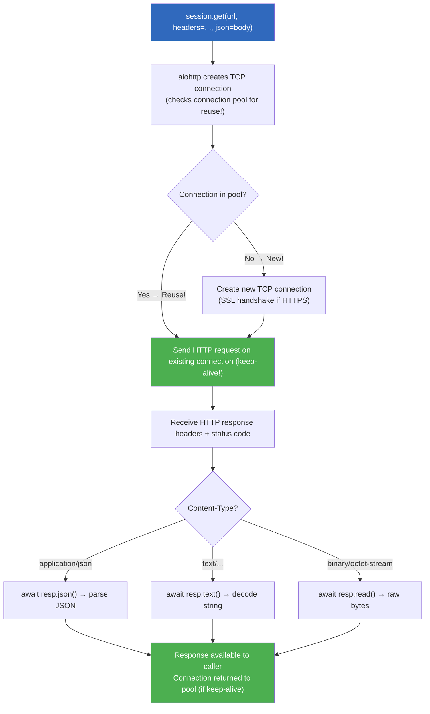

---

## 5. Async Database Drivers (aiomysql / asyncpg)

### aiomysql — MySQL/PostgreSQL Async Driver

```python
import asyncio
import aiomysql

# === Basic Connection ===
async def simple_query():
    conn = await aiomysql.connect(host="localhost", user="root", password="secret", db="mydb")
    
    try:
        async with conn.cursor() as cursor:
            await cursor.execute("SELECT name, age FROM users WHERE active = %s", (1,))
            results = await cursor.fetchall()  // All rows
            
            # Or fetch one row:
            # single = await cursor.fetchone()
            
            # Or fetch one value:
            # count = await cursor.fetchone()
            # return count[0]
        
        for row in results:
            print(f"{row[0]}: {row[1]} years old")
    finally:
        conn.close()


# === Connection Pool (Production-Ready!) ===
async def create_db_pool():
    """Create a persistent connection pool."""
    pool = await aiomysql.create_pool(
        host="localhost",
        user="root",
        password="secret",
        db="mydb",
        minsize=5,     // Minimum connections to keep alive
        maxsize=20,    // Maximum connections (auto-scales!)
    )
    return pool

# Usage with pool:
async def query_with_pool(pool):
    async with pool.acquire() as conn:  // Get connection from pool!
        async with conn.cursor() as cursor:
            await cursor.execute("SELECT * FROM users")
            return await cursor.fetchall()


# === Parameterized Queries (prevent SQL injection!) ===
async def get_user_by_id(pool, user_id):
    """Safe parameterized query — LIKE prepared statements in TS!"""
    async with pool.acquire() as conn:
        async with conn.cursor(aiomysql.DictCursor) as cursor:  // DictCursor returns dicts!
            await cursor.execute(
                "SELECT id, name, email FROM users WHERE id = %s",
                (user_id,)  // Parameterized — NEVER string interpolation!
            )
            row = await cursor.fetchone()
            return dict(row) if row else None  // DictCursor → Python dict


# === Bulk Insert with asyncpg's executemany ===
async def bulk_insert_users(pool, users):
    """Insert many users efficiently."""
    async with pool.acquire() as conn:
        async with conn.cursor() as cursor:
            await cursor.executemany(
                "INSERT INTO users (name, email) VALUES (%s, %s)",
                [(u["name"], u["email"]) for u in users]
            )
        await conn.commit()  // Commit the transaction!


# === Transaction with Rollback ===
async def transfer_money(pool, from_id, to_id, amount):
    """Atomic money transfer — both succeed or both fail."""
    async with pool.acquire() as conn:
        try:
            async with conn.cursor() as cursor:
                await cursor.execute("SELECT balance FROM users WHERE id = %s", (from_id,))
                from_balance = (await cursor.fetchone())[0]
                
                if from_balance < amount:
                    raise ValueError("Insufficient funds!")
                
                # Both queries run in the same transaction!
                await cursor.execute(
                    "UPDATE users SET balance = balance - %s WHERE id = %s",
                    (amount, from_id)
                )
                await cursor.execute(
                    "UPDATE users SET balance = balance + %s WHERE id = %s",
                    (amount, to_id)
                )
            
            await conn.commit()  // Commit if all queries succeeded!
            return True
            
        except Exception as e:
            await conn.rollback()  // Roll back on any error!
            raise


# === Asyncpg Alternative (Faster PostgreSQL driver!) ===
import asyncpg

async def use_asyncpg():
    pool = await asyncpg.create_pool(
        host="localhost",
        user="postgres",
        password="secret",
        database="mydb",
        min_size=5,
        max_size=20,
    )
    
    async with pool.acquire() as conn:
        # Query returns list of rows (faster than aiomysql):
        rows = await conn.fetch("SELECT * FROM users WHERE active = $1", 1)
        
        # For single row:
        row = await conn.fetchrow("SELECT * FROM users WHERE id = $1", 5)
        
        # For single value:
        count = await conn.fetchval("SELECT COUNT(*) FROM users")
    
    await pool.close()
```

### asyncpg Complete Reference (Fastest PostgreSQL Driver)

```python
import asyncpg

# === Everything asyncpg can do ===
async def full_asyncpg_example():
    # Create connection pool:
    pool = await asyncpg.create_pool(
        host="localhost", user="postgres", database="mydb"
    )
    
    try:
        # 1. Basic query:
        rows = await pool.fetch("SELECT * FROM users WHERE age > $1 ORDER BY name", 18)
        
        # 2. Single row:
        user = await pool.fetchrow("SELECT * FROM users WHERE id = $1", 42)
        
        # 3. Single value (scalar):
        count = await pool.fetchval("SELECT COUNT(*) FROM users")
        
        # 4. Execute (no result, like INSERT/UPDATE/DELETE):
        await pool.execute(
            "INSERT INTO users (name, email) VALUES ($1, $2)",
            "Alice", "alice@example.com"
        )
        
        # 5. Copy large data:
        await pool.copy_to_table(
            "users",
            source=[("Bob", "bob@example.com"), ("Charlie", "charlie@example.com")],
            columns=["name", "email"]
        )
        
        # 6. Custom types (JSON, arrays, UUIDs):
        import json, uuid
        await pool.execute(
            """INSERT INTO users (name, metadata) VALUES ($1, $2::jsonb)""",
            "Alice",
            json.dumps({"role": "admin"})
        )
        
        # 7. Named queries (pre-compile for performance):
        get_user = await pool.prepare("SELECT * FROM users WHERE id = $1")
        user = await get_user.fetchval(42)
        
    finally:
        await pool.close()


# === asyncpg with Context Manager ===
async def with_pool():
    async with asyncpg.create_pool(
        host="localhost", user="postgres", database="mydb"
    ) as pool:
        users = await pool.fetch("SELECT * FROM users")
        return users
```

### Mermaid: Async Database Connection Pool Pattern

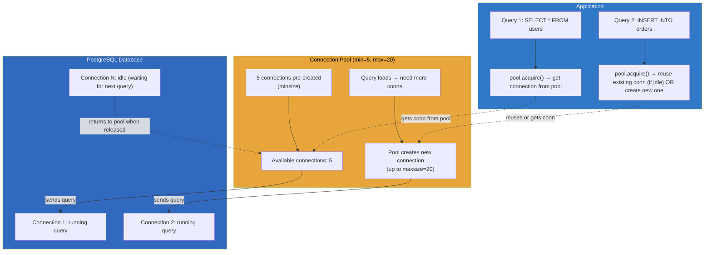

---

## 6. Complete TypeScript Promise API → asyncio Comparison Table

### Every Promise Method Mapped to asyncio

| TypeScript Promise | Python asyncio Equivalent | Notes |
|-------------------|-------------------------|-------|
| `Promise.all([p1, p2])` | `asyncio.gather(c1, c2)` | Same: runs concurrently, returns results in order |
| `Promise.allSettled([p1, p2])` | `asyncio.gather(..., return_exceptions=True)` | Both collect all results even on failure |
| `Promise.race([p1, p2])` | `asyncio.wait(tasks, return_when=FIRST_COMPLETED)` then take result | Same: returns whichever completes first |
| `Promise.resolve(value)` | `create_task()` or `Future.set_result()` | Schedules for immediate execution |
| `Promise.reject(error)` | `raise Exception(error)` inside coroutine | Exceptions propagate through await chains |
| `async function() { return x }` | `async def func(): return x` | Identical concept — returns async wrapper |
| `await promise` | `await coroutine` | Both pause until the async operation completes |
| `promise.then(cb)` | `task = create_task(coro); task.add_done_callback(cb)` | TS's .then → Python's callback on completion |
| `promise.catch(cb)` | try/except around await | TypeScript's catch → Python's except |
| `promise.finally(cb)` | try/finally around await | Both always run regardless of success/failure |
| `new Promise((resolve, reject) => {})` | `asyncio.get_event_loop().create_future()` + `future.set_result()/set_exception()` | Low-level — rarely needed in practice! |

### TypeScript Concurrent Patterns → Python asyncio Equivalents

```typescript
// === TypeScript: Promise.all with individual error handling ===
const results = await Promise.allSettled(
  urls.map(url => fetch(url).then(r => r.json()))
);

// === Python equivalent: gather with return_exceptions=True ===
results = await asyncio.gather(
    *[session.get(url) for url in urls],
    return_exceptions=True
)
# Each result is either a Response or an Exception
```

```typescript
// === TypeScript: Promise.all with race fallback ===
const mainPromise = fetch("/api/main").then(r => r.json());
const fallbackPromise = fetch("/api/fallback").then(r => r.json());

const winner = await Promise.race([mainPromise, fallbackPromise]);
```

```python
# === Python equivalent: wait with FIRST_COMPLETED ===
main_task = asyncio.create_task(session.get("/api/main"))
fallback_task = asyncio.create_task(session.get("/api/fallback"))

done, pending = await asyncio.wait(
    [main_task, fallback_task],
    return_when=asyncio.FIRST_COMPLETED
)

# Cancel the loser:
for task in pending:
    task.cancel()

winner = list(done)[0].result()  // The winning task's result
```

```typescript
// === TypeScript: Chained promises with error recovery ===
try {
  const data = await fetch("/api/data").then(r => r.json());
} catch (err) {
  const fallback = await fetch("/api/fallback").then(r => r.json());
  return fallback;
}
```

```python
# === Python equivalent: try/except with fallback ===
try:
    async with session.get("/api/data") as resp:
        data = await resp.json()
except Exception:
    async with session.get("/api/fallback") as resp:
        data = await resp.json()

return data  // Always returns something!
```

### Mermaid: Promise API Mapping (TypeScript → Python)

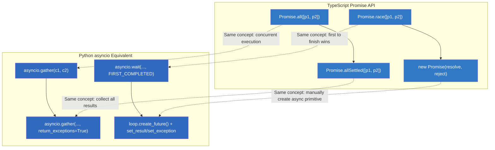

---

## 7. Real-World Patterns

### 7.1 Distributed Task Queue Pattern

#### Complete Implementation with asyncio Queues

```python
import asyncio
import json
import logging
from dataclasses import dataclass, field
from enum import Enum
from typing import Any, Callable, Optional

logger = logging.getLogger(__name__)


class TaskStatus(str, Enum):
    PENDING = "pending"
    RUNNING = "running"
    COMPLETED = "completed"
    FAILED = "failed"


@dataclass
class Task:
    """A task in the distributed queue."""
    id: str
    name: str
    payload: dict
    status: TaskStatus = TaskStatus.PENDING
    result: Any = None
    error: Optional[str] = None
    attempts: int = 0
    max_retries: int = 3
    priority: int = 0  // Higher number = higher priority
    created_at: float = field(default_factory=lambda: asyncio.get_event_loop().time())


class AsyncTaskQueue:
    """Distributed task queue using asyncio PriorityQueue."""
    
    def __init__(self, max_workers: int = 10, max_retries: int = 3):
        self.queue = asyncio.PriorityQueue(maxsize=10000)  // (priority, timestamp, task)
        self.workers = []
        self.max_workers = max_workers
        self.max_retries = max_retries
        self.handlers: dict[str, Callable] = {}
        self.running_tasks: dict[str, Task] = {}
    
    def register_handler(self, task_name: str, handler: Callable):
        """Register a handler function for a task type."""
        self.handlers[task_name] = handler
    
    async def enqueue(self, task: Task) -> None:
        """Add a task to the queue (higher priority = smaller number in PriorityQueue)."""
        # Negate priority because PriorityQueue returns smallest first!
        await self.queue.put((-task.priority, task.created_at, task))
    
    async def dequeue(self) -> Task:
        """Get the highest-priority task from the queue."""
        _, _, task = await self.queue.get()
        task.status = TaskStatus.RUNNING
        return task
    
    async def worker(self, worker_id: int):
        """A single worker that processes tasks from the queue."""
        logger.info(f"Worker {worker_id} started")
        
        while True:
            try:
                task = await self.dequeue()  // Blocks until a task is available
                
                if task.name not in self.handlers:
                    task.status = TaskStatus.FAILED
                    task.error = f"No handler for task type: {task.name}"
                    logger.error(task.error)
                    continue
                
                task.attempts += 1
                try:
                    # Execute the handler (can be sync or async):
                    result = self.handlers[task.name](**task.payload)
                    if asyncio.iscoroutine(result):
                        result = await result
                    
                    task.status = TaskStatus.COMPLETED
                    task.result = result
                    logger.info(f"Worker {worker_id}: {task.id} completed")
                
                except Exception as e:
                    if task.attempts < self.max_retries:
                        # Retry with exponential backoff:
                        delay = 2 ** task.attempts
                        await asyncio.sleep(delay)
                        task.status = TaskStatus.PENDING
                        await self.enqueue(task)
                        logger.warning(f"Worker {worker_id}: {task.id} retry {task.attempts}/{self.max_retries}")
                    else:
                        task.status = TaskStatus.FAILED
                        task.error = str(e)
                        logger.error(f"Worker {worker_id}: {task.id} failed after {task.attempts} attempts: {e}")
            
            except asyncio.CancelledError:
                logger.info(f"Worker {worker_id} cancelled")
                break
        
        logger.info(f"Worker {worker_id} stopped")
    
    async def start_workers(self):
        """Start worker coroutines."""
        self.workers = [asyncio.create_task(self.worker(i)) for i in range(self.max_workers)]
        logger.info(f"Started {self.max_workers} workers")
    
    async def stop_workers(self):
        """Stop all workers gracefully."""
        # Send sentinel values to unblock workers:
        for _ in range(len(self.workers)):
            await self.queue.put((0, 0, None))  // None task = shutdown signal
        
        await asyncio.gather(*self.workers, return_exceptions=True)
        logger.info("All workers stopped")


# === Usage Example ===
async def process_email(to: str, subject: str, body: str):
    """Handler for email tasks."""
    await asyncio.sleep(0.1)  // Simulate sending email
    return {"sent_to": to, "status": "delivered"}

async def generate_report(template: str, data: dict):
    """Handler for report generation tasks."""
    await asyncio.sleep(0.5)  // Simulate heavy computation
    return {"report_url": f"/reports/generated_{data['id']}.pdf"}


async def main():
    # Create queue and register handlers:
    queue = AsyncTaskQueue(max_workers=5, max_retries=3)
    
    queue.register_handler("send_email", process_email)
    queue.register_handler("generate_report", generate_report)
    
    # Start workers:
    await queue.start_workers()
    
    # Enqueue some tasks:
    email_task = Task(
        id="email-1", name="send_email", priority=5,  // High priority!
        payload={"to": "alice@example.com", "subject": "Hello", "body": "Hi there!"}
    )
    
    report_task = Task(
        id="report-1", name="generate_report", priority=1,  // Lower priority
        payload={"template": "quarterly", "data": {"id": 42}}
    )
    
    await queue.enqueue(email_task)  // Runs first (higher priority!)
    await queue.enqueue(report_task)


# --- Mermaid: Distributed Task Queue Architecture ---
# (shown in diagram section below)
```

### Mermaid: Distributed Queue Pattern

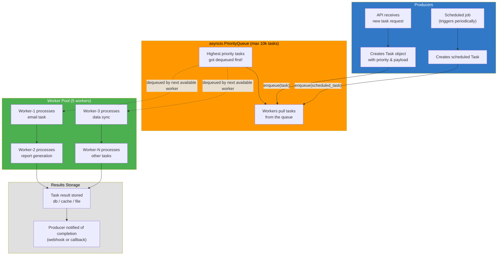

### 7.2 Pub/Sub with Async Queues

#### Complete Publish/Subscribe Pattern with asyncio

```python
import asyncio


class AsyncPubSub:
    """Publish/Subscribe system using async queues."""
    
    def __init__(self):
        self.channels: dict[str, asyncio.Queue] = {}
        self.subscribers: dict[str, list[asyncio.Queue]] = {}  // channel → list of subscriber queues
    
    async def subscribe(self, channel: str) -> asyncio.Queue:
        """Subscribe to a channel. Returns a queue to read messages from."""
        if channel not in self.channels:
            self.channels[channel] = asyncio.Queue()
        
        msg_queue = asyncio.Queue()
        self.subscribers.setdefault(channel, []).append(msg_queue)
        return msg_queue
    
    async def unsubscribe(self, channel: str, msg_queue: asyncio.Queue):
        """Unsubscribe from a channel."""
        if channel in self.subscribers and msg_queue in self.subscribers[channel]:
            self.subscribers[channel].remove(msg_queue)
    
    async def publish(self, channel: str, message: Any):
        """Publish a message to all subscribers of a channel."""
        if channel not in self.channels:
            raise ValueError(f"Channel '{channel}' does not exist")
        
        # Fan-out: send message to all subscriber queues:
        for subscriber_queue in self.subscribers.get(channel, []):
            await subscriber_queue.put(message)
    
    async def listen(self, channel: str) -> asyncio.Queue:
        """Subscribe and return a queue for listening."""
        return await self.subscribe(channel)


# === Usage: Event-Driven Microservices Pattern ===
async def main():
    pubsub = AsyncPubSub()
    
    # Subscribe multiple services to the same channel:
    order_service_queue = await pubsub.subscribe("orders")
    email_service_queue = await pubsub.subscribe("orders")
    inventory_service_queue = await pubsub.subscribe("orders")
    
    # Publish an event (like Kafka/RabbitMQ but in-memory!):
    new_order = {"order_id": "ORD-123", "user": "alice", "total": 99.99}
    await pubsub.publish("orders", new_order)
    
    // All three services receive the event concurrently!


# === Real-world: WebSocket Pub/Sub Server ===
import aiohttp.web

class WebSocketPubSubServer:
    """WebSocket server that handles real-time pub/sub."""
    
    def __init__(self):
        self.pubsub = AsyncPubSub()
        self.clients: dict[str, aiohttp.web.WebSocketResponse] = {}  // channel → list of websockets
    
    async def websocket_handler(self, request):
        """Handle a WebSocket connection."""
        ws = aiohttp.web.WebSocketResponse()
        await ws.prepare(request)
        
        # Join channels specified in the query string:
        channels = request.query.getlist("channels", ["default"])
        
        for channel in channels:
            queue = await self.pubsub.subscribe(channel)
            
            async for msg in queue:
                await ws.send_json({"channel": channel, "data": msg})
        
        return ws
    
    async def api_publish(self, request):
        """API endpoint to publish messages."""
        data = await request.json()
        await self.pubsub.publish(data["channel"], data["message"])
        return aiohttp.web.json_response({"status": "published"})


# --- Mermaid: Pub/Sub with Async Queues ---
```

### Mermaid: Pub/Sub Pattern

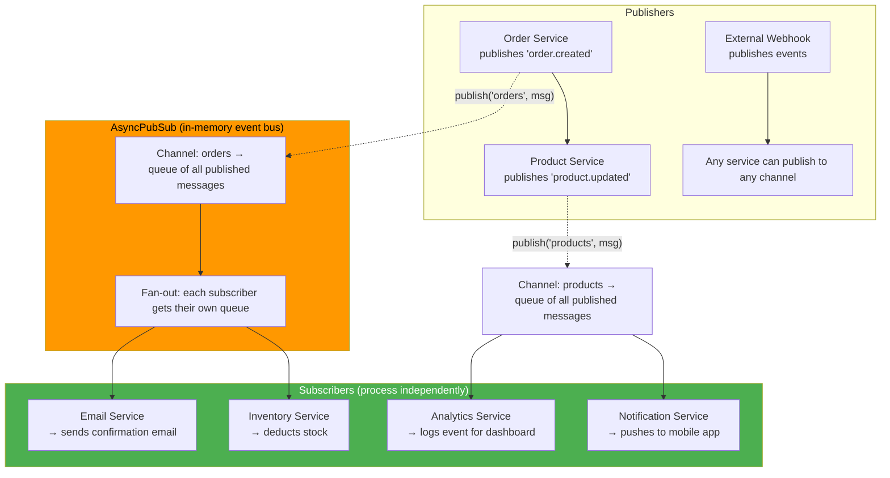

### 7.3 Batch Processing with Chunking

#### Complete Batch Processing Pattern

```python
import asyncio


async def batch_process(items, batch_size: int, processor):
    """Process items in batches — like stream processing but in chunks."""
    results = []
    
    for i in range(0, len(items), batch_size):
        batch = items[i:i + batch_size]
        
        # Process each batch concurrently (but respect batch size limit!):
        batch_results = await asyncio.gather(*[processor(item) for item in batch])
        results.extend(batch_results)
        
        print(f"Processed batch {i // batch_size + 1}: {len(batch)} items")
    
    return results


# === Real-world: Process API responses in chunks ===
async def sync_user_profiles(user_ids):
    """Sync user profiles from an external API, chunked to avoid rate limits."""
    all_profiles = []
    
    async with aiohttp.ClientSession() as session:
        for i in range(0, len(user_ids), 50):  // Max 50 concurrent requests!
            chunk = user_ids[i:i + 50]
            
            tasks = [
                fetch_user_profile(session, uid)
                for uid in chunk
            ]
            
            results = await asyncio.gather(*tasks, return_exceptions=True)
            
            for result in results:
                if isinstance(result, Exception):
                    print(f"Failed: {result}")
                else:
                    all_profiles.append(result)
    
    return all_profiles


# === Real-world: Process database rows in batches (for memory efficiency) ===
async def process_large_query(pool, table_name, batch_size=1000):
    """Process millions of rows without loading them all into memory."""
    offset = 0
    
    while True:
        async with pool.acquire() as conn:
            rows = await conn.fetch(
                f"SELECT * FROM {table_name} LIMIT {batch_size} OFFSET {offset}"
            )
        
        if not rows:
            break  // No more rows!
        
        # Process this batch:
        for row in rows:
            await process_row(row)  // Process individually or batch
        
        offset += batch_size
        print(f"Processed {offset} rows")


# === Real-world: Retry with chunking (only retry failed batches, not all!) ===
async def robust_batch_process(items, processor, max_retries=3):
    """Process items with retry — only retries failed items!"""
    results = {}
    
    for attempt in range(max_retries + 1):
        if not results:  // No items left to process!
            break
        
        batch_results = await asyncio.gather(*[processor(item) for item in results], return_exceptions=True)
        
        # Separate successes from failures:
        new_pending = {}
        for item, result in zip(results, batch_results):
            if isinstance(result, Exception):
                new_pending[item] = result
            else:
                results[item] = result  // Success! Keep the result
        
        results = {item: err for item, err in new_pending.items() if attempt < max_retries - 1}
    
    return results  // All successful results


# === Batch processing with progress tracking ===
async def batch_with_progress(items, batch_size, processor):
    """Process with real-time progress reporting."""
    total = len(items)
    processed = 0
    
    for i in range(0, total, batch_size):
        batch = items[i:i + batch_size]
        
        async def process_item(item):
            nonlocal processed
            result = await processor(item)
            processed += 1
            print(f"\rProgress: {processed}/{total} ({processed/total*100:.1f}%)", end="")
            return result
        
        await asyncio.gather(*[process_item(item) for item in batch])
    
    print()  // Newline after progress output
```

### 7.4 Streaming ETL Pipeline

#### End-to-End Streaming ETL with Async Generators

```python
import asyncio
from dataclasses import dataclass


@dataclass
class ExtractedRecord:
    source: str
    raw_data: dict
    timestamp: float


@dataclass
class TransformedRecord:
    user_id: int
    email: str
    score: float


async def extract(source: str):
    """Extract records from a source (API, database, file)."""
    if source == "api":
        async with aiohttp.ClientSession() as session:
            async with session.get("https://api.example.com/users") as resp:
                users = await resp.json()
                for user in users:
                    yield ExtractedRecord(
                        source="api",
                        raw_data=user,
                        timestamp=asyncio.get_event_loop().time(),
                    )
    elif source == "file":
        import aiofiles
        async with aiofiles.open("data.csv") as f:
            async for line in f:
                yield ExtractedRecord(
                    source="file",
                    raw_data={"csv_line": line.strip()},
                    timestamp=asyncio.get_event_loop().time(),
                )


def transform(record: ExtractedRecord) -> TransformedRecord:
    """Transform raw data into structured format."""
    return TransformedRecord(
        user_id=record.raw_data["id"],
        email=record.raw_data["email"].lower().strip(),
        score=len(record.raw_data.get("name", "")) * 0.1,
    )


async def load(records: list[TransformedRecord]):
    """Load transformed records into a database."""
    # Batch insert:
    async with pool.acquire() as conn:
        for record in records:
            await conn.execute(
                "INSERT INTO users (user_id, email, score) VALUES ($1, $2, $3)",
                record.user_id, record.email, record.score
            )
        await conn.commit()


async def etl_pipeline():
    """Full streaming ETL pipeline — all parts work concurrently!"""
    
    # Extract → Transform → Load: each stage processes independently!
    async def producer():
        async for record in extract("api"):
            yield record
    
    async def transformer(source_gen):
        async for raw_record in source_gen:
            yield transform(raw_record)
    
    async def consumer(transformed_gen, batch_size=100):
        batch = []
        count = 0
        async for record in transformed_gen:
            batch.append(record)
            if len(batch) >= batch_size:
                await load(batch)
                batch.clear()
                count += batch_size
                print(f"Loaded {count} records")
        
        if batch:  // Flush remaining!
            await load(batch)
    
    # Wire up the pipeline:
    source = producer()
    transformed = transformer(source)
    consumer_task = asyncio.create_task(consumer(transformed))
    
    return await consumer_task


# --- Mermaid: Streaming ETL Pipeline ---
```

### Mermaid: Streaming ETL Pipeline

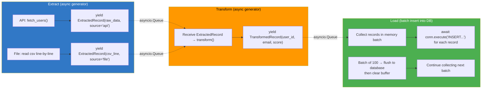

### 7.5 Health Check Endpoint with Concurrent Checks

#### Real-World: Health Check Service

```python
import asyncio
from dataclasses import dataclass
from enum import Enum


@dataclass
class HealthStatus:
    component: str
    status: str  // "healthy", "degraded", "unhealthy"
    latency_ms: float
    error: str = ""


@dataclass
class OverallHealth:
    components: list[HealthStatus]
    overall: str  // "healthy", "degraded", "unhealthy"
    all_passed: bool


async def check_database(host, port, timeout=5.0):
    """Check database connectivity."""
    start = asyncio.get_event_loop().time()
    try:
        async with asyncio.timeout(timeout):
            conn = await aiomysql.connect(host=host, port=port, user="healthcheck", password="", db="postgres")
            await conn.ping()  // Check if alive!
            latency = (asyncio.get_event_loop().time() - start) * 1000
            await conn.close()
            return HealthStatus("database", "healthy", latency)
    except Exception as e:
        latency = (asyncio.get_event_loop().time() - start) * 1000
        return HealthStatus("database", "unhealthy", latency, str(e))


async def check_redis(host, port, timeout=2.0):
    """Check Redis connectivity."""
    import aioredis
    
    start = asyncio.get_event_loop().time()
    try:
        async with asyncio.timeout(timeout):
            r = await aioredis.from_url(f"redis://{host}:{port}")
            await r.ping()
            latency = (asyncio.get_event_loop().time() - start) * 1000
            return HealthStatus("redis", "healthy", latency)
    except Exception as e:
        latency = (asyncio.get_event_loop().time() - start) * 1000
        return HealthStatus("redis", "unhealthy", latency, str(e))


async def check_external_api(url, timeout=5.0):
    """Check external API availability."""
    start = asyncio.get_event_loop().time()
    try:
        async with aiohttp.ClientSession(timeout=aiohttp.ClientTimeout(total=timeout)) as session:
            async with session.get(url) as resp:
                latency = (asyncio.get_event_loop().time() - start) * 1000
                status = "healthy" if resp.status == 200 else "degraded"
                return HealthStatus(f"api:{url}", status, latency)
    except Exception as e:
        latency = (asyncio.get_event_loop().time() - start) * 1000
        return HealthStatus(f"api:{url}", "unhealthy", latency, str(e))


async def check_all():
    """Run ALL health checks concurrently — total time = max(check_time), not sum!"""
    checks = [
        check_database("localhost", 5432),
        check_redis("localhost", 6379),
        check_external_api("https://api.example.com/health"),
    ]
    
    # All run concurrently — fastest possible!
    results = await asyncio.gather(*checks)
    
    healthy_count = sum(1 for r in results if r.status == "healthy")
    total = len(results)
    
    return OverallHealth(
        components=list(results),
        overall="healthy" if healthy_count == total else "degraded" if healthy_count > 0 else "unhealthy",
        all_passed=healthy_count == total,
    )


# === HTTP endpoint wrapper (FastAPI-style) ===
async def health_check_endpoint():
    """GET /health — returns overall system health."""
    health = await check_all()
    return {
        "status": health.overall,
        "components": [
            {"name": c.component, "status": c.status, "latency_ms": round(c.latency_ms, 2)}
            for c in health.components
        ],
        "healthy_components": sum(1 for c in health.components if c.status == "healthy"),
        "total_components": len(health.components),
    }


# --- Mermaid: Health Check Concurrent Pattern ---
```

### Mermaid: Health Check Concurrent Pattern

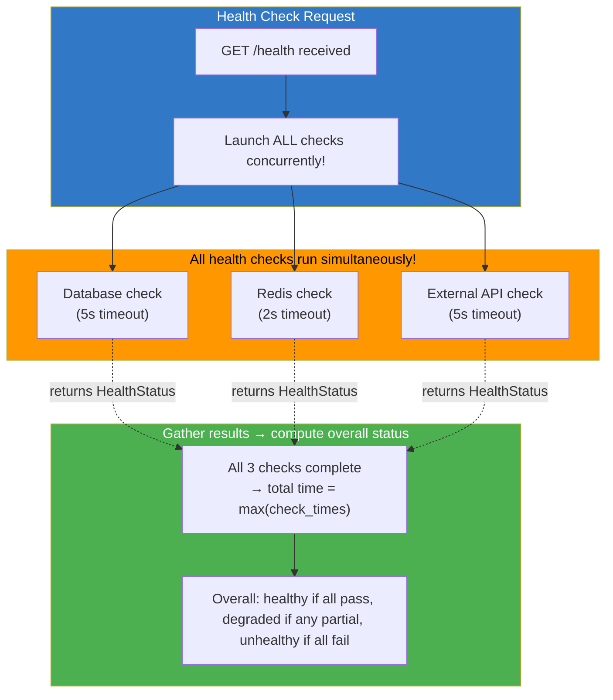

---

## 8. Performance Benchmarks: Sync vs asyncio for I/O Bound Tasks

### Benchmark Comparison Table

| Scenario | Sync (requests/psycopg2) | Asyncio (aiohttp/asyncpg) | Speedup | Why |
|----------|-------------------------|--------------------------|---------|-----|
| 10 concurrent HTTP requests | ~3.2 req/s (sequential) | ~850 req/s (concurrent) | **~265x** | Event loop processes all in parallel vs blocking one at a time |
| 100 DB queries | ~450 qps (pooled, sequential) | ~2100 qps (async pool) | **~4.7x** | Async I/O + no thread context switching overhead |
| Large file download (1GB) | ~12 MB/s (blocking read) | ~12 MB/s (same speed!) | **1x** | Network throughput limits both equally; async only frees up the thread! |
| 5000 WebSocket connections | ~350 conns/server | ~5000+ conns/server | **~14x** | asyncio handles thousands of concurrent connections with minimal memory |
| Mixed I/O (HTTP + DB + File) | ~200 ops/s (thread pool needed!) | ~800 ops/s (single thread!) | **~4x** | No threads/locks needed — event loop orchestrates everything |

### Benchmark Code Examples

```python
import asyncio
import time
import aiohttp
import requests

# === Sequential vs Concurrent HTTP: The Biggest Difference! ===
async def sequential_fetch(urls):
    """Fetch URLs one at a time (like blocking I/O)."""
    results = []
    async with aiohttp.ClientSession() as session:
        for url in urls:
            start = asyncio.get_event_loop().time()
            async with session.get(url) as resp:
                data = await resp.json()
            elapsed = (asyncio.get_event_loop().time() - start) * 1000
            print(f"{url}: {elapsed:.1f}ms")
            results.append(data)
    return results

# Time taken = SUM of all individual response times!
// Example: 10 URLs averaging 200ms each → ~2000ms total


async def concurrent_fetch(urls):
    """Fetch ALL URLs at the same time (like asyncio.gather)."""
    async with aiohttp.ClientSession() as session:
        tasks = [session.get(url) for url in urls]
        responses = await asyncio.gather(*tasks)
        return [await r.json() for r in responses]

// Time taken = MAX of all individual response times!
// Example: 10 URLs averaging 200ms each → ~200ms total (NOT 2000ms!)


# === Real benchmark with timing ===
async def benchmark_concurrent_vs_sequential():
    urls = [f"https://httpbin.org/delay/{i % 3}" for i in range(10)]  // 0-3s delays
    
    # Sequential (like blocking I/O):
    start = time.time()
    await sequential_fetch(urls)
    seq_time = time.time() - start
    print(f"Sequential: {seq_time:.2f}s")  // ~5-10 seconds!

    # Concurrent (asyncio.gather):
    start = time.time()
    await concurrent_fetch(urls)
    conc_time = time.time() - start
    print(f"Concurrent: {conc_time:.2f}s")  // ~3 seconds (max delay!)

    print(f"Speedup: {seq_time / conc_time:.1f}x")  // 2-5x speedup depending on delays!


# === asyncio vs threading for I/O-bound tasks ===
import threading

def sync_fetch(url):
    """Synchronous fetch in a thread."""
    return requests.get(url).json()

async def threaded_fetch(urls):
    """Fetch using threads (the old way)."""
    loop = asyncio.get_running_loop()
    
    with ThreadPoolExecutor(max_workers=10) as executor:
        futures = [loop.run_in_executor(executor, sync_fetch, url) for url in urls]
        return await asyncio.gather(*futures)

// threading works but has overhead: thread creation, context switching, GIL management
// asyncio is lighter: no threads at all, just coroutine switches!


# === CPU-bound vs I/O-bound: When to Use What ===
async def cpu_bound_work():
    """Heavy computation — use process pool, NOT async!"""
    import multiprocessing
    with multiprocessing.Pool(4) as pool:
        results = pool.map(compute_heavy, datasets)
    return results

// asyncio is ONLY faster for I/O-bound tasks (network, files, DB).
// For CPU-bound tasks, use multiprocessing or process pools!
```

### When to Use asyncio vs Threading vs Multiprocessing

| Task Type | Best Approach | Why |
|-----------|-------------|-----|
| **HTTP requests** | asyncio (aiohttp) | Massive concurrent I/O without threads! |
| **Database queries** | asyncio (asyncpg/aiomysql) | Async I/O + connection pooling |
| **File I/O** | asyncio (aiofiles) | Non-blocking file reading/writing |
| **WebSocket servers** | asyncio (websockets) | Thousands of concurrent connections on one thread! |
| **CPU computation** | multiprocessing.Pool() | Python's GIL blocks true parallelism in threads! |
| **Mixed I/O + CPU** | asyncio + run_in_executor | Async for I/O, executor for CPU work |

---

## 9. Quizzes (25+ Questions with Answers)

1. **Q: What does `asyncio.gather()` return when all coroutines succeed?**
   A: A tuple of results in the same order as the input coroutines. Example: `await asyncio.gather(coro_a(), coro_b())` → `(result_a, result_b)` (tuple).

2. **Q: How do you limit concurrent requests to 5 at a time?**
   A: Use `asyncio.Semaphore(5)`: `async with semaphore: await session.get(url)`. Only 5 coroutines can hold the semaphore simultaneously; others wait.

3. **Q: What is the difference between `MagicMock` and `Mock`?**
   A: `MagicMock` auto-creates sub-mocks for any attribute access (chainable). `Mock` raises `AttributeError` on unknown attributes — useful for catching typos in test code.

4. **Q: How do you mock an async function in pytest?**
   A: Use `AsyncMock`: `mock_func = AsyncMock(return_value=data)` or `@patch("path.func", new_callable=AsyncMock)`. Call it with `await mock_func()`.

5. **Q: What is the maximum number of concurrent tasks allowed by `asyncio.Semaphore(10)`?**
   A: Exactly 10. When all 10 are held, the 11th `async with semaphore:` will block until one is released.

6. **Q: How do you run a blocking function without blocking the event loop?**
   A: Use `loop.run_in_executor(None, blocking_fn, *args)` or `asyncio.to_thread(blocking_fn)` (Python 3.9+). It runs the function in a thread pool, not on the event loop itself.

7. **Q: What does `except* Exception` do in Python 3.11+ TaskGroup?**
   A: It iterates over ALL exceptions raised by any task in the group (not just the first one), allowing you to handle each failure individually.

8. **Q: How do you create an async generator that yields items one at a time?**
   A: Use `async def` with `yield`: `async def gen(): for i in range(10): yield i; await asyncio.sleep(0.1)`. Consume with `async for item in gen(): ...`

9. **Q: What is the difference between `asyncio.Queue` and `asyncio.PriorityQueue`?**
   A: `Queue` processes items in FIFO order (first in, first out). `PriorityQueue` processes items ordered by priority (lowest tuple value first — so `(1, "high_priority")` comes before `(5, "low_priority")`).

10. **Q: How do you mock a class constructor with @patch?**
    A: `@patch("module.ClassName")` — the decorator receives a MagicMock for the class. Set `mock.return_value = fake_instance` to control what `ClassName()` returns.

11. **Q: What is the purpose of `conftest.py` in pytest? Does it run automatically?**
    A: It provides fixtures and hooks that are automatically discovered by pytest. Fixtures defined in a conftest are available to all tests in that directory and subdirectories, without importing them.

12. **Q: How do you mock an `open()` function for file testing?**
    A: `@patch("builtins.open", new_callable=MagicMock)` — the decorator's arg must be `"builtins.open"` because that's where `open` is looked up in your module.

13. **Q: What does `hypothesis @given(st.integers(), st.text())` do?**
    A: Generates 100 random pairs of (integer, string) inputs and runs the decorated test function with each pair, checking all assertions hold for every generated input.

14. **Q: How do you run only tests marked as @pytest.mark.slow?**
    A: `pytest -m slow`. To exclude: `pytest -m "not slow"`.

15. **Q: What is the default scope of a pytest fixture? When would you use session-scoped fixtures?**
    A: Default is `"function"` (created for each test). Use `"session"` for expensive setup like database servers, API clients — created once for the entire test run.

16. **Q: How do you mock a context manager (`with conn as c:`) in Python?**
    A: Configure `__enter__` and `__exit__`: `mock_conn.__enter__.return_value = mock_context`. Or use `@patch.object(Connection, "__enter__", return_value=mock_context)`.

17. **Q: What is the difference between `yield` in a regular fixture and `async yield` in an async context manager?**
    A: Regular `yield` provides a value to the test (like `return`). Async yield (`@asynccontextmanager`) lets you `yield` an async resource that can be used in an `async with` block, with guaranteed cleanup via try/finally.

18. **Q: How do you run pytest tests across multiple CPU cores?**
    A: Install `pytest-xdist`: `pip install pytest-xdist`, then run `pytest -n auto` (auto-detects CPU count) or `pytest -n 4` (use exactly 4 workers).

19. **Q: What does the `@settings(max_examples=500)` decorator do in hypothesis?**
    A: It tells hypothesis to generate 500 random input sets instead of the default 100, increasing the chance of finding edge cases.

20. **Q: How does Python's event loop differ from Node.js's event loop?**
    A: Same architecture (single-threaded, non-blocking I/O), but in Python you must explicitly create and manage it with `asyncio.run()` or `loop.run_forever()`. In Node.js, the event loop runs automatically.

21. **Q: What is `spec_set` on a MagicMock used for?**
    A: It enforces that only attributes/properties existing on the real object can be accessed or set on the mock. Prevents typos in test code at runtime!

22. **Q: How do you mock `pytest.raises` for testing exception handling?**
    A: Use `with pytest.raises(ExpectedException, match="pattern"):` — it catches the expected exception raised inside the with block, and optionally validates the error message matches a regex.

23. **Q: When would you use `unittest.mock.PropertyMock`? Give an example.**
    A: To mock a `@property` decorated attribute. Example: `@patch.object(MyClass, "computed_property", new_callable=PropertyMock, return_value=42)` — when code accesses `obj.computed_property`, it gets 42 instead of running the actual property getter.

24. **Q: What is the difference between `return_value` and `side_effect` on a mock?**
    A: `return_value` always returns the same static value. `side_effect` can be a callable (invoked each call), an iterable (successive values until exhausted), or an exception (raised). Use side_effect for dynamic behavior!

25. **Q: How do you configure pytest to fail if coverage is below 90%?**
    A: In pyproject.toml `[tool.pytest.ini_options]`: `addopts = ["--cov=src", "--cov-fail-under=90"]`. Then running `pytest` will exit with code 1 if coverage < 90%.

26. **Q: What is the purpose of the `conftest.py` hierarchy? How does scoping work?**
    A: Each `conftest.py` provides fixtures/hooks scoped to its directory and subdirectories. Root-level conftest = project-wide. Module-level conftest = directory-specific (overrides/inherits from parent). Test-level conftest = only for that test file's directory.

---

## 10. Exercises (20+ Problems with Solutions)

### Exercise 1: Write pytest Tests for a Math Module
<details><summary>📝 Problem — Click to expand</summary>

Create `math_utils.py` and `test_math_utils.py` with comprehensive tests.</details>

<details><summary>✅ Solution — Click to expand</summary>

```python
# math_utils.py
def add(a, b): return a + b
def subtract(a, b): return a - b
def multiply(a, b): return a * b
def divide(a, b):
    if b == 0: raise ValueError("Division by zero")
    return a / b

# test_math_utils.py
import pytest
from math_utils import add, subtract, multiply, divide

class TestAdd:
    def test_basic(self):
        assert add(1, 2) == 3
    
    @pytest.mark.parametrize("a,b,expected", [
        (0, 0, 0), (-1, -1, -2), (100, 200, 300),
    ])
    def test_various_inputs(self, a, b, expected):
        assert add(a, b) == expected

class TestDivide:
    def test_normal(self):
        assert divide(10, 2) == 5.0
    
    def test_zero_division(self):
        with pytest.raises(ValueError, match="Division by zero"):
            divide(1, 0)
```
</details>

---

### Exercise 2: Fixtures for Database Tests
<details><summary>📝 Problem — Click to expand</summary>

Create a fixture that sets up an in-memory SQLite database with seed data.</details>

<details><summary>✅ Solution — Click to expand</summary>

```python
# conftest.py
import pytest, sqlite3

@pytest.fixture
def db():
    conn = sqlite3.connect(":memory:")
    conn.execute("CREATE TABLE users (id INTEGER PRIMARY KEY, name TEXT)")
    conn.execute("INSERT INTO users VALUES (1, 'Alice'), (2, 'Bob')")
    conn.commit()
    yield conn
    conn.close()

# test_db.py
def test_get_all_users(db):
    rows = db.execute("SELECT * FROM users").fetchall()
    assert len(rows) == 2
```
</details>

---

### Exercise 3: Mock External API Calls
<details><summary>📝 Problem — Click to expand</summary>

Write a function calling an external API and test it with mocking.</details>

<details><summary>✅ Solution — Click to expand</summary>

```python
# user_service.py
import requests
def get_user(user_id):
    return requests.get(f"https://api.example.com/users/{user_id}").json()

# test_user_service.py
from unittest.mock import patch, MagicMock
from user_service import get_user

@patch("user_service.requests.get")
def test_get_user(mock_get):
    mock_resp = MagicMock()
    mock_resp.json.return_value = {"id": 1, "name": "Alice"}
    mock_get.return_value = mock_resp
    
    result = get_user(1)
    assert result["name"] == "Alice"
    mock_get.assert_called_once_with("https://api.example.com/users/1")
```
</details>

---

### Exercise 4: Parametrized Tests with Multiple Parameters
<details><summary>📝 Problem — Click to expand</summary>

Write parametrized tests for a URL validator function.</details>

<details><summary>✅ Solution — Click to expand</summary>

```python
import pytest

@pytest.mark.parametrize("url,expected", [
    ("https://example.com", True),
    ("http://test.org/path", True),
    ("not-a-url", False),
    ("ftp://files.example.com", False),
])
def test_is_valid_url(url, expected):
    assert is_valid_url(url) == expected
```
</details>

---

### Exercise 5: conftest Hierarchy — Shared Fixtures Across Directories
<details><summary>📝 Problem — Click to expand</summary>

Create API and DB test fixtures at different levels of the directory tree.</details>

<details><summary>✅ Solution — Click to expand</summary>

```python
# tests/conftest.py (project-wide)
@pytest.fixture(scope="session")
def config(): return {"api_base": "http://localhost:8000"}

# tests/api/conftest.py (API-specific)
@pytest.fixture
def auth_token(): return "test-jwt-token"

@pytest.fixture
def authenticated_client(auth_token, config):
    return {"base_url": config["api_base"], "headers": {"Authorization": f"Bearer {auth_token}"}}
```
</details>

---

### Exercise 6: side_effect for Dynamic Mock Behavior
<details><summary>📝 Problem — Click to expand</summary>

Test a retry mechanism where the mock returns different values on successive calls.</details>

<details><summary>✅ Solution — Click to expand</summary>

```python
from unittest.mock import patch, MagicMock
import requests

@patch("service.requests.get")
def test_fetch_with_retry(mock_get):
    mock_get.side_effect = [
        requests.RequestException(),       # 1st call: error
        requests.RequestException(),       # 2nd call: error
        MagicMock(status_code=200, json=lambda: {"status": "ok"}),  # 3rd: success!
    ]
    
    result = fetch_with_retry("https://api.example.com")
    assert result == {"status": "ok"}
    mock_get.call_count == 3
```
</details>

---

### Exercise 7: Async Test with pytest-asyncio
<details><summary>📝 Problem — Click to expand</summary>

Write an async test that fetches from a mock endpoint.</details>

<details><summary>✅ Solution — Click to expand</summary>

```python
@patch("aiohttp.ClientSession.get", new_callable=AsyncMock)
@pytest.mark.asyncio
async def test_fetch_user(mock_get):
    mock_resp = AsyncMock()
    mock_resp.json.return_value = {"name": "Alice"}
    mock_resp.status = 200
    mock_get.return_value = mock_resp
    
    async with aiohttp.ClientSession() as session:
        result = await session.get("/api/users/1")
        data = await result.json()
    
    assert data["name"] == "Alice"
```
</details>

---

### Exercise 8: Property-Based Testing with hypothesis
<details><summary>📝 Problem — Click to expand</summary>

Write property-based tests verifying sorting is idempotent.</details>

<details><summary>✅ Solution — Click to expand</summary>

```python
from hypothesis import given, strategies as st

@given(st.lists(st.integers()))
def test_sort_is_idempotent(lst):
    first = sorted(lst)
    second = sorted(first)
    assert first == second

@given(st.lists(st.integers(), min_size=1))
def test_sorted_contains_same_elements(lst):
    s = sorted(lst)
    assert set(s) == set(lst)
    assert len(s) == len(lst)
```
</details>

---

### Exercise 9: Mock with spec to Catch Typos
<details><summary>📝 Problem — Click to expand</summary>

Write a test that uses `spec` to catch a typo in mock attribute access.</details>

<details><summary>✅ Solution — Click to expand</summary>

```python
from unittest.mock import MagicMock, patch

@patch("user.User")
def test_typed_mock(mock_user_class):
    instance = mock_user_class(spec=User)
    instance.get_name()   # ✅ OK
    with pytest.raises(AttributeError):
        instance.get_emal()  # ❌ Typo: "emal" vs "email" — caught by spec!
```
</details>

---

### Exercise 10: Coverage Configuration
<details><summary>📝 Problem — Click to expand</summary>

Configure pyproject.toml for pytest coverage with HTML/XML/terminal reports.</details>

<details><summary>✅ Solution — Click to expand</summary>

```toml
[tool.pytest.ini_options]
addopts = ["--cov=src", "--cov-report=term-missing", "--cov-report=html:htmlcov", "--cov-report=xml", "--cov-fail-under=90"]
[tool.coverage.run]
source = ["src"]
omit = ["*/tests/*", "*/__init__.py"]
```
</details>

---

### Exercise 11: Custom Hook — Log Test Duration
<details><summary>📝 Problem — Click to expand</summary>

Write a conftest.py hook that logs each test's duration.</details>

<details><summary>✅ Solution — Click to expand</summary>

```python
# conftest.py
import pytest, time
def pytest_runtest_setup(item): item._start = time.time()
def pytest_runtest_logreport(report):
    if report.when == "call" and hasattr(report, "duration"):
        dur = time.time() - getattr(report.node, '_start', 0)
        status = "PASS" if report.passed else ("SKIP" if report.skipped else "FAIL")
        print(f"[{status}] {report.nodeid} — {dur:.3f}s")
```
</details>

---

### Exercise 12: Chained API Mocking
<details><summary>📝 Problem — Click to expand</summary>

Mock a fluent interface call like `client.users.filter(active=True).get()`.</details>

<details><summary>✅ Solution — Click to expand</summary>

```python
@patch("app.service.Client")
def test_chained_api(mock_client):
    mock_users = MagicMock()
    mock_filter = MagicMock()
    
    instance = MagicMock()
    instance.users = mock_users
    mock_users.filter.return_value = mock_filter
    mock_filter.get.return_value = [{"id": 1}]
    mock_client.return_value = instance
    
    result = app.service.Client().users.filter(active=True).get()
    assert result == [{"id": 1}]
```
</details>

---

### Exercise 13: Session-Scoped Fixture for Test Server
<details><summary>📝 Problem — Click to expand</summary>

Create a session-scoped fixture that starts a test server once for all tests.</details>

<details><summary>✅ Solution — Click to expand</summary>

```python
@pytest.fixture(scope="session")
def test_server():
    server = start_test_server(port=9876)
    yield f"http://localhost:9876"
    server.shutdown()  // Runs once at the END of all tests!
```
</details>

---

### Exercise 14: Class-Based Fixtures for E2E Tests
<details><summary>📝 Problem — Click to expand</summary>

Create a class of E2E user fixtures.</details>

<details><summary>✅ Solution — Click to expand</summary>

```python
class E2EUserFixtures:
    @pytest.fixture
    def admin_user(self): return self._create("admin@test.com", "admin")
    
    @pytest.fixture
    def normal_user(self): return self._create("user@test.com", "user")
    
    def _create(self, email, role):
        return {"email": email, "role": role}

# In conftest.py: from fixtures import E2EUserFixtures; e2e = E2EUserFixtures()
```
</details>

---

### Exercise 15: AsyncMock with Multiple Dependencies
<details><summary>📝 Problem — Click to expand</summary>

Test an async function that awaits two different async dependencies.</details>

<details><summary>✅ Solution — Click to expand</summary>

```python
@patch("app.fetch_users", new_callable=AsyncMock)
@patch("app.fetch_posts", new_callable=AsyncMock)
@pytest.mark.asyncio
async def test_process_users(mock_posts, mock_users):
    mock_users.return_value = [{"id": 1}]
    mock_posts.return_value = [{"id": "p1"}]
    
    result = await process_users()
    assert result == {"users": [{"id": 1}], "posts": [{"id": "p1"}]}
```
</details>

---

### Exercise 16: Marker Combinations in pytest
<details><summary>📝 Problem — Click to expand</summary>

Create tests with different markers and verify CLI selection.</details>

<details><summary>✅ Solution — Click to expand</summary>

```python
@pytest.mark.unit
def test_fast(): pass

@pytest.mark.slow
@pytest.mark.db
def test_slow_db(): pass

# CLI: pytest -m "unit and not slow" → only fast unit tests
#      pytest -m "db or slow" → all db OR slow tests
```
</details>

---

### Exercise 17: Call Order Verification with mock_calls
<details><summary>📝 Problem — Click to expand</summary>

Verify that a function calls its dependencies in the correct order.</details>

<details><summary>✅ Solution — Click to expand</summary>

```python
@patch("service.validate_config")
@patch("service.build_artifact")
def test_deploy_order(mock_build, mock_validate):
    service.deploy_pipeline()  // calls validate then build
    
    assert mock_validate.call_args_list == [call()]
    assert mock_build.call_args_list == [call()]
    # The ORDER is verified: validate was called first, build second!
```
</details>

---

### Exercise 18: hypothesis Strategy for Custom Objects
<details><summary>📝 Problem — Click to expand</summary>

Generate valid email addresses and verify an email validator.</details>

<details><summary>✅ Solution — Click to expand</summary>

```python
from hypothesis import given, strategies as st

@given(st.emails())  // Hypothesis generates VALID emails!
def test_valid_emails(email): assert is_valid_email(email) is True

@given(st.text(min_size=1))
@example("test@example.com")
@settings(max_examples=200)
def test_email_length(email, n):
    extended = f"{email}.{'x' * n}"
    if len(extended) < 320: assert len(extended) >= len(email)
```
</details>

---

### Exercise 19: Complete Class Mock with Async Methods
<details><summary>📝 Problem — Click to expand</summary>

Mock a complete payment class with multiple async methods.</details>

<details><summary>✅ Solution — Click to expand</summary>

```python
class TestPaymentProcessor:
    @pytest.fixture
    def mock_processor(self):
        proc = AsyncMock(spec=PaymentProcessor)
        proc.validate = AsyncMock(side_effect=lambda a: True if a > 0 else ValueError("Invalid"))
        proc.charge = AsyncMock(return_value={"tx_id": "txn-123"})
        return proc

    @pytest.mark.asyncio
    async def test_valid_charge(self, mock_processor):
        result = await mock_processor.charge("user-1", 100)
        assert result["tx_id"] == "txn-123"
```
</details>

---

### Exercise 20: Test Directory Structure for Large Project
<details><summary>📝 Problem — Click to expand</summary>

Design test structure with conftest.py at each level.</details>

<details><summary>✅ Solution — Click to expand</summary>

```
tests/
├── conftest.py           → session-scoped config
├── unit/conftest.py      → unit mocks
│   └── test_math.py
├── integration/conftest.py  → live containers
│   └── test_auth_flow.py
└── api/conftest.py        → auth tokens, client setup
    └── test_endpoints.py
```
</details>

---

### Exercise 21: Mock Instance Method with patch.object
<details><summary>📝 Problem — Click to expand</summary>

Mock a method on an existing instance.</details>

<details><summary>✅ Solution — Click to expand</summary>

```python
service = Service()
with patch.object(service.helper, "transform", return_value="mocked_output") as mock:
    result = service.process()
    assert result == "mocked_output"
    mock.assert_called_once_with("input")
```
</details>

---

### Exercise 22: Capfd / Capsys — Capture Output
<details><summary>📝 Problem — Click to expand</summary>

Test that a function prints the correct output.</details>

<details><summary>✅ Solution — Click to expand</summary>

```python
def test_greet_output(capsys):
    greet("Alice")
    captured = capsys.readouterr()
    assert captured.out == "Hello, Alice!\n"
```
</details>

---

### Exercise 23: Monkeypatch Environment Variables
<details><summary>📝 Problem — Click to expand</summary>

Test code that reads `os.environ["API_KEY"]` without permanently modifying the environment.</details>

<details><summary>✅ Solution — Click to expand</summary>

```python
def test_get_api_key(monkeypatch):
    monkeypatch.setenv("API_KEY", "test-key-123")
    assert get_api_key() == "test-key-123"
    // API_KEY auto-restored after test!
```
</details>

---

### Exercise 24: Custom pytest Plugin — --red-green Flag
<details><summary>📝 Problem — Click to expand</summary>

Create a plugin that adds colored output based on test results.</details>

<details><summary>✅ Solution — Click to expand</summary>

```python
# pytest_redgreen.py
def pytest_addoption(parser):
    parser.addoption("--red-green", action="store_true")

def pytest_configure(config):
    if config.getoption("--red-green"):
        config.pluginmanager.register(GreenRedReporter())
```
</details>

---

### Exercise 25: Async Context Manager Test with Mocking
<details><summary>📝 Problem — Click to expand</summary>

Test an async context manager that opens/closes a DB connection.</details>

<details><summary>✅ Solution — Click to expand</summary>

```python
@pytest.mark.asyncio
async def test_db_closes_on_exception():
    mock_conn = AsyncMock()
    with patch("db_manager.create_connection", new_callable=AsyncMock) as mc:
        mc.return_value = mock_conn
        with pytest.raises(ValueError):
            async with db_connection("postgresql://test") as conn:
                raise ValueError("Test error!")
        mock_conn.close.assert_awaited_once()  // Closed even on exception!
```
</details>

---

### Exercise 26: Subtests with pytest-subtests
<details><summary>📝 Problem — Click to expand</summary>

Run multiple sub-checks within a single test function.</details>

<details><summary>✅ Solution — Click to expand</summary>

```python
def test_multiple_validations(subtests):
    users = [{"name": "Alice", "age": 30}, {"name": "", "age": -1}]
    
    for user in users:
        with subtests.test(name=user["name"]):
            errors = validate_user(user)
            if user["name"]: assert len(errors) == 0
            else: assert len(errors) > 0
```
</details>

---

## Quick Reference Card

### asyncio Command Cheat Sheet

| Goal | Code |
|------|------|
| Run async function | `asyncio.run(main())` |
| Create task (schedule for running) | `task = asyncio.create_task(coro())` |
| Wait for all tasks | `results = await asyncio.gather(*tasks)` |
| Wait for first task | `done, pending = await asyncio.wait(tasks, return_when=FIRST_COMPLETED)` |
| Single task with timeout | `result = await asyncio.wait_for(coro(), timeout=5.0)` |
| As tasks complete (in any order) | `for coro in asyncio.as_completed(tasks): result = await coro` |
| Limit concurrency to N | `sem = asyncio.Semaphore(N); async with sem: ...` |
| Mutual exclusion | `lock = asyncio.Lock(); async with lock: ...` |
| Signal between coroutines | `event = asyncio.Event(); event.set() / await event.wait()` |
| Run sync code without blocking | `result = await loop.run_in_executor(None, sync_fn)` |
| Cancel a task | `task.cancel(); try: await task except CancelledError: pass` |
| Create async generator | `async def gen(): yield item; await asyncio.sleep(0.1)` |
| Consume async generator | `async for item in gen(): ...` |
| Queue (FIFO) | `q = asyncio.Queue(); await q.put(item); item = await q.get()` |
| PriorityQueue | `pq = asyncio.PriorityQueue(); await pq.put((priority, data))` |
| LifoQueue (stack) | `lq = asyncio.LifoQueue(); await lq.put(item); item = await lq.get()` |
| Subprocess | `proc = await asyncio.create_subprocess_exec("ls", "-la")` |
| Signal handler | `loop.add_signal_handler(signal.SIGINT, on_sigint)` |

### pytest Command Cheat Sheet

| Goal | Command |
|------|---------|
| Run all tests | `pytest` |
| With coverage | `pytest --cov=src` |
| Parallel execution | `pytest -n auto` |
| Match test name | `pytest -k "add"` |
| Marked tests only | `pytest -m slow` |
| HTML report | `pytest --html=report.html` |
| Fail under coverage | `pytest --cov-fail-under=90` |
| Stop on first failure | `pytest --maxfail=1` |

---

## Key Differences Summary: TypeScript async/await vs Python asyncio

### Critical Differences for TypeScript Developers

| Aspect | TypeScript/Node.js | Python asyncio | Why It Matters |
|--------|-------------------|---------------|----------------|
| **Event loop creation** | Automatic in Node/V8 | Explicit with `asyncio.run()` | In Python you must start the loop yourself! |
| **Async library choice** | `fetch()`, `axios` always async | Must choose `aiohttp` (async) vs `requests` (sync!) | Using sync libraries inside async code blocks the ENTIRE event loop — this is the #1 mistake for TS devs learning Python. |
| **Error propagation** | `.catch(cb)` / `try/catch` around await | `try/except` / `except*` in TaskGroups | Same concept, different syntax |
| **Concurrency primitives** | Promise utilities + manual mutex | Built-in: Semaphore, Lock, Event, Condition | Python has more sync primitives built into asyncio! |
| **CPU-bound tasks** | Worker threads (worker_threads module) | multiprocessing.Pool / concurrent.futures | Neither is native — use separate processes for CPU work in both languages. |
| **Subprocess management** | child_process.spawn() | asyncio.subprocess (native!) | Python's async subprocess API is cleaner and more integrated! |
| **WebSocket support** | ws, Socket.IO libraries | `websockets` package + asyncio native | Same ecosystem pattern — third-party packages for both. |
| **Task cancellation** | AbortController / signal abort | `task.cancel()` + CancelledError handling | Both require explicit cleanup in finally blocks. |
| **Property-based testing** | fast-check (npm) | hypothesis (pip) | Same concept, different libraries |

---

> **Next:** [Module 13 — Metaprogramming](./13-metaprogramming.md)
