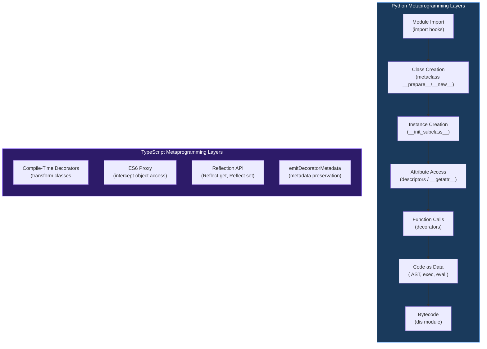
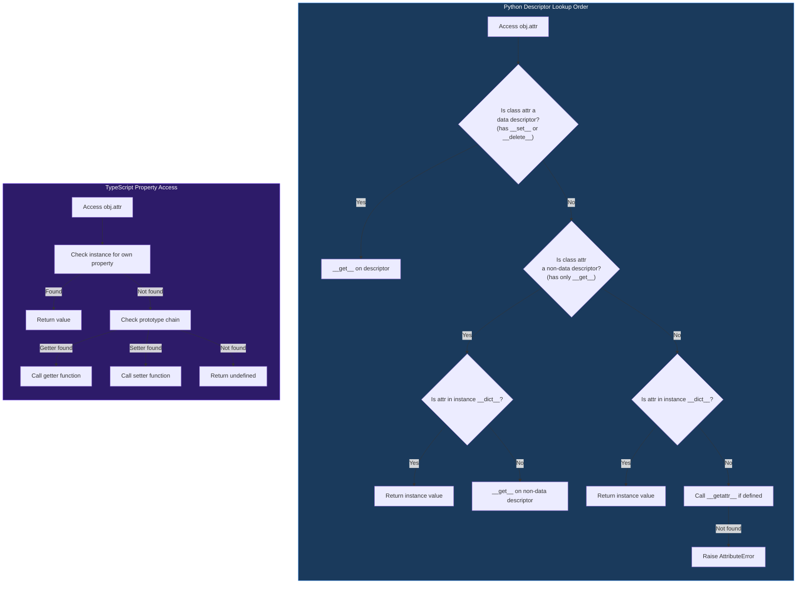
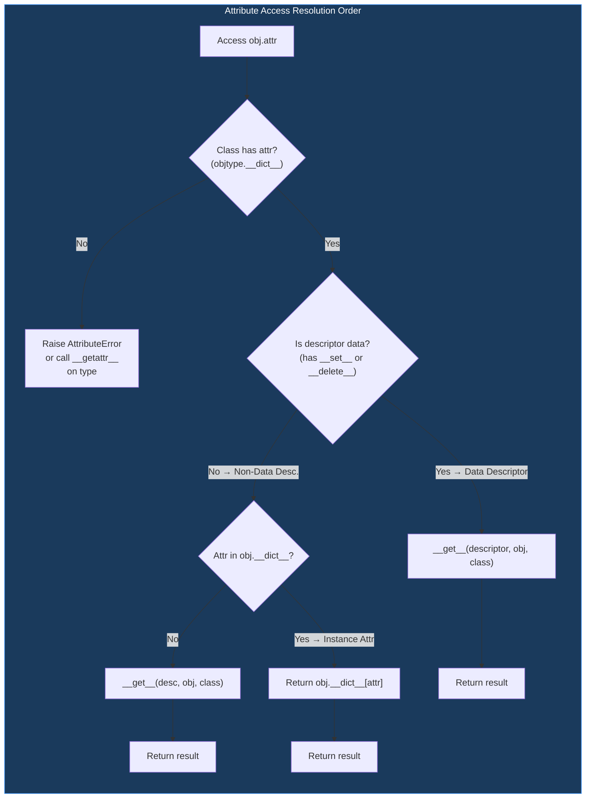
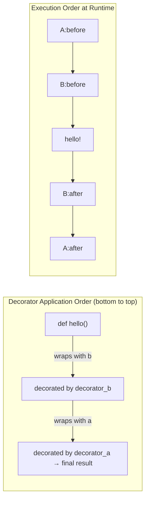
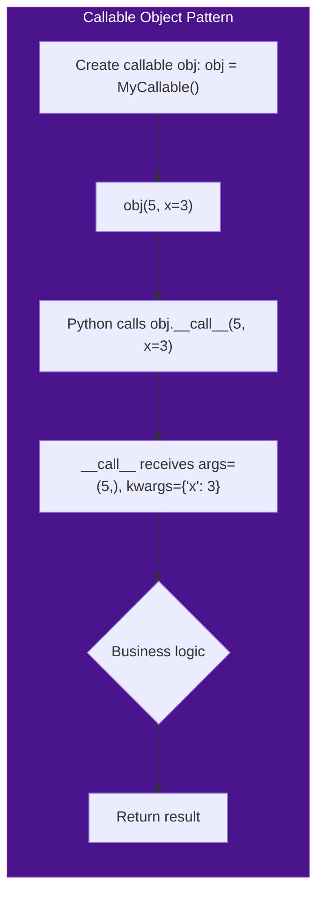
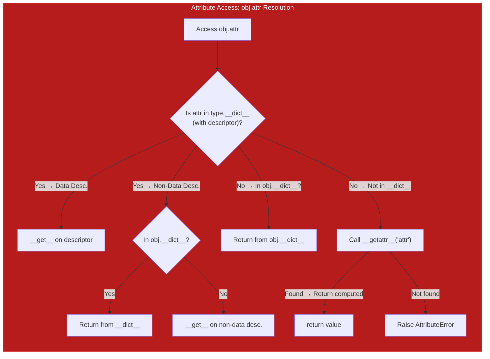
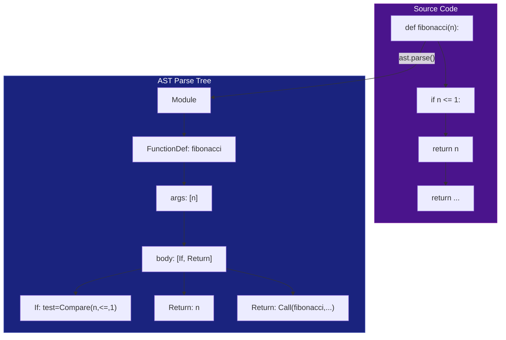
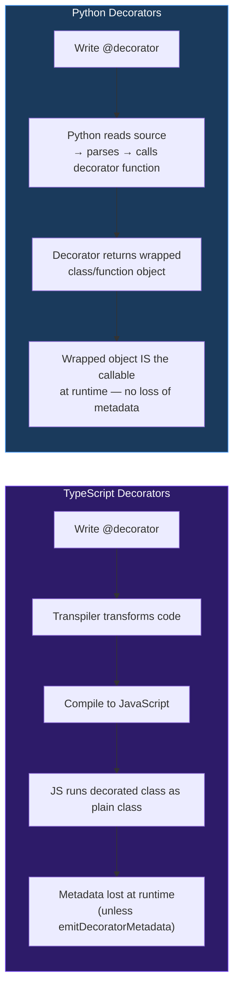

# Module 13 — Metaprogramming: Descriptors, Decorators, __call__, AST, and Beyond

## Table of Contents

- [1. What Is Metaprogramming? Why It Matters for TS Devs](#1-what-is-metaprogramming-why-it-matters-for-ts-devs)
- [2. Descriptors — The Engine Behind Properties and Slots](#2-descriptors--the-engine-behind-properties-and-slots)
- [3. Descriptor Patterns Deep Dive](#3-descriptor-patterns-deep-dive)
- [4. Complete Decorator Reference (Function, Class, Parameterized, Async)](#4-complete-decorator-reference-function-class-parameterized-async)
- [5. `__call__` — Making Objects Callable](#5-call--making-objects-callable)
- [6. Dynamic Attribute Protocols (`__getattr__`, `__getattribute__`, `__setattr__`, `__delattr__`)](#6-dynamic-attribute-protocols-__getattr__-__getattribute__-__setattr__-__delattr__)
- [7. AST (Abstract Syntax Tree) — Code as Data](#7-ast-abstract-syntax-tree--code-as-data)
- [8. Metaclass Protocol (`__prepare__`, `__new__`, `__init__`)](#8-metaclass-protocol-__prepare__-__new__-__init__)
- [9. Dynamic Class Creation with `type()`](#9-dynamic-class-creation-with-type)
- [10. Code Compilation and Bytecode Inspection](#10-code-compilation-and-bytecode-inspection)
- [11. sys.settrace for Debugging/Profiling](#11-syssetrace-for-debuggingprofiling)
- [12. Import Hooks as Metaprogramming](#12-import-hooks-as-metaprogramming)
- [13. exec/eval Security Considerations](#13-exeveval-security-considerations)
- [14. Runtime Module Manipulation](#14-runtime-module-manipulation)
- [15. SymPy Expression Tree as Metaprogramming Example](#15-sympy-expression-tree-as-metaprogramming-example)
- [16. TypeScript Decorator → Python Decorator Mapping](#16-typescript-decorator--python-decorator-mapping)
- [17. Performance Implications of Metaprogramming Techniques](#17-performance-implications-of-metaprogramming-techniques)
- [18. Quizzes (25+ Questions with Answers)](#18-quizzes-25-questions-with-answers)
- [19. Exercises (20+ with Solutions)](#19-exercises-20-with-solutions)

---

## 1. What Is Metaprogramming? Why It Matters for TS Devs

### Python's Metaprogramming Superpowers (vs TypeScript's Limited Set)

Metaprogramming is the ability of a language to treat code as data — to inspect, generate, modify, and execute programs at runtime. **Python** is one of the most powerful metaprogramming languages in existence. **TypeScript**, while excellent for static analysis *at compile time*, has very limited runtime metaprogramming capabilities.

#### Core Differences: Python vs TypeScript Metaprogramming

| Capability | Python | TypeScript |
|---|---|---|
| Inspect types at runtime | Full introspection (`type`, `isinstance`, `inspect` module) | `typeof` (limited), type erasure at runtime |
| Modify class structure | Yes (`type()`, metaclasses, descriptor protocol) | No (types erased to JS) |
| Intercept property access | Descriptors, `__getattr__`, proxies (via `Proxy`) | Only via ES6 `Proxy` on objects, not classes |
| Add methods at runtime | Yes — modify `__dict__`, use `setattr` | Yes — prototype manipulation |
| Decorate functions/classes | Elegant syntax, composables | Experimental decorators, transpile-time only |
| Execute code as string | `exec()`, `eval()` | `Function()`, `eval()` (similar but unsafe) |
| AST manipulation | Full AST via `ast` module — parse, transform, generate | TypeScript compiler API (`ts-morph`) — compile-time only |
| Bytecode inspection | `dis` module — view and analyze opcodes | V8 bytecode can be inspected but not modified |
| Metaprogramming at class creation | `__prepare__`, `__new__`, `__init__` on metaclasses | No equivalent |
| Dynamic attribute access | `__getattr__`, `__getattribute__`, `__setattr__` | ES6 `Proxy` handlers (`get`, `set`, `has`) |

### Why Python's Metaprogramming is Different (and Powerful)

In TypeScript, decorators are primarily a **compile-time** feature. They transform code during transpilation. At runtime, the decorated class is just a regular JavaScript class — all metadata is gone (unless you explicitly preserve it with `emitDecoratorMetadata`, which only works for Angular-style use cases).

Python's metaprogramming happens at **runtime**:

1. **At definition time** — Descriptors modify attribute access on assignment and access
2. **At creation time** — Metaclasses (`__new__`, `__prepare__`) control how classes are built
3. **At instance time** — `__init_subclass__` gives subclasses a hook into class creation
4. **At call time** — Decorators wrap functions dynamically
5. **At import time** — Import hooks can intercept module loading

This means Python frameworks can do things that are simply impossible in TypeScript:

- Django's ORM field definitions (each `CharField`, `IntegerField` is a descriptor)
- SQLAlchemy's declarative base (metaclass-generated model classes)
- Pydantic's runtime validation (descriptor-based property access)
- FastAPI's dependency injection (reflection on type hints + AST for parameters)

### Mermaid: Python Metaprogramming Stack vs TypeScript



### Key Notes: Metaprogramming

> [!NOTE] Key Concepts
> - **Metaprogramming** = writing code that manipulates other code (or itself) at runtime
> - **Python's advantage**: Everything is an object, including classes and functions. You can inspect, modify, and create them dynamically.
> - **TypeScript's limitation**: Types are erased at compile time. Runtime metaprogramming is restricted to what JavaScript provides.

---

## 2. Descriptors — The Engine Behind Properties and Slots

### What Is a Descriptor?

A **descriptor** is any object that defines one or more of these special methods:

| Method | Name | Called When |
|---|---|---|
| `__get__(self, obj, type=None)` | Data descriptor reads | Accessing `obj.attr` (on class or instance) |
| `__set__(self, obj, value)` | Data descriptor writes | Assigning `obj.attr = value` |
| `__delete__(self, obj)` | Deletion | Deleting `del obj.attr` |

**Key distinction**: If a descriptor defines `__set__` or `__delete__`, it's a **data descriptor** and takes priority over instance attributes. If it only defines `__get__`, it's a **non-data descriptor** and can be overridden by instance attributes.

### How Descriptors Work Under the Hood (vs TypeScript Property Access)

#### TypeScript: No Descriptor Protocol

TypeScript has no equivalent to Python's descriptor protocol. The closest is using ES6 getters/setters, but they apply to the entire class — you cannot have a single attribute that validates on set and caches on get without writing boilerplate for each property.

```typescript
// TypeScript: Manual getter/setter per property — NO descriptor protocol
class Person {
  private _age: number | null = null;

  constructor(public name: string) {}

  get age(): number | null {
    if (this._age === null) {
      throw new Error("Age not yet set");
    }
    return this._age;
  }

  set age(value: number): void {
    if (value < 0 || value > 150) {
      throw new RangeError("Invalid age");
    }
    this._age = value;
  }
}

// TypeScript: For another property, you must repeat the entire pattern
class Product {
  private _price: number | null = null;
  
  constructor(public name: string) {}
  
  get price(): number | null {
    return this._price;
  }
  
  set price(value: number): void {
    if (value < 0) throw new RangeError("Price cannot be negative");
    this._price = value;
  }
}
```

#### Python: Single Descriptor, Reused Everywhere

In Python, you write the descriptor **once** and reuse it as a class attribute. Every instance automatically gets validation, lazy loading, caching, etc.

```python
class ValidatedAttribute:
    """A descriptor that validates values on assignment."""
    
    def __set_name__(self, owner, name):
        # Automatically called when the descriptor is assigned to a class attribute
        self.private_name = f"_{name}"
    
    def __get__(self, obj, objtype=None):
        if obj is None:
            # Accessed from the class, not an instance — return the descriptor itself
            return self
        return getattr(obj, self.private_name)
    
    def __set__(self, obj, value):
        self.validate(value)
        setattr(obj, self.private_name, value)
    
    def validate(self, value):
        raise NotImplementedError("Subclasses must implement validate()")


class PositiveInt(ValidatedAttribute):
    """A descriptor that only accepts positive integers."""
    
    def validate(self, value):
        if not isinstance(value, int):
            raise TypeError(f"Expected int, got {type(value).__name__}")
        if value < 0:
            raise ValueError("Value must be positive")


class User:
    age = PositiveInt()  # Descriptor is a class attribute!
    
    def __init__(self, name: str, age: int):
        self.name = name
        self.age = age  # Goes through ValidatedAttribute.__set__


class Product:
    price = PositiveInt()  # Reuse the SAME descriptor class!
    
    def __init__(self, name: str, price: float):
        self.name = name
        self.price = price
```

### Mermaid: Descriptor Access Flow (vs TypeScript Property Access)



### Complete Data Descriptor Example: Type-Checked Attribute

```python
from typing import TypeVar, Generic, Any

T = TypeVar('T')

class TypedAttribute(Generic[T]):
    """A descriptor that enforces type checking at assignment time."""
    
    def __init__(self, expected_type: type):
        self.expected_type = expected_type
    
    def __set_name__(self, owner, name):
        self.private_name = f"_{name}"
    
    def __get__(self, obj, objtype=None):
        if obj is None:
            return self
        return getattr(obj, self.private_name)
    
    def __set__(self, obj, value):
        if not isinstance(value, self.expected_type):
            raise TypeError(
                f"Expected {self.expected_type.__name__}, "
                f"got {type(value).__name__}"
            )
        setattr(obj, self.private_name, value)


class Employee:
    name = TypedAttribute[str]()   # Must be str
    age = TypedAttribute[int]()    # Must be int
    salary = TypedAttribute[float]()  # Must be float
    
    def __init__(self, name: str, age: int, salary: float):
        self.name = name   # TypedAttribute.__set__(self, "Alice")
        self.age = age     # TypedAttribute.__set__(self, 30)
        self.salary = salary  # TypedAttribute.__set__(self, 50000.0)

# Usage:
emp = Employee("Alice", 30, 50000.0)
emp.name = "Bob"       # OK
emp.age = 25           # OK
emp.salary = 60000     # OK — int is accepted as float
emp.name = 123         # TypeError: Expected str, got int
```

### Complete Non-Data Descriptor Example: `@classmethod` and `@staticmethod`

The built-in `classmethod` and `staticmethod` are **non-data descriptors** (only `__get__`). This is why you can shadow them with instance attributes:

```python
class Bird:
    def fly(self):
        return "Flying!"
    
    @classmethod
    def species(cls):
        return cls.__name__
    
    @staticmethod
    def migrate():
        return "Migration occurs"

# classmethod is a non-data descriptor:
print(type(Bird.species))  # <class 'getset_descriptor'>
print(isinstance(Bird.__dict__['species'], type(Bird.fly).__get__))  # It's a method-wrapper


class Dog(Bird):
    species = "MutantDog"  # Shadows the @classmethod!
    
# Because classmethod is non-data (only __get__), 
# instance attributes can override it — wait, actually class-level attrs shadow it too.
# The key: if we set it on an INSTANCE, it shadows non-data descriptors.

d = Dog()
print(d.species)  # "MutantDog" — the class attr wins
```

### Slot Descriptor (Built-in): `__slots__`

When you define `__slots__`, Python creates **slot descriptors** for each slot name:

```python
class Point1D:
    __slots__ = ('x',)  # x becomes a slot descriptor
    
p = Point1D()
# The 'x' slot is stored in a special internal structure, not in __dict__
print(Point1D.__dict__)  # {'__slots__': ..., ...} — no 'x' in __dict__!

# Slot descriptors implement __get__, __set__, __delete__
# They are data descriptors that manage the slot storage directly


class Point2D:
    __slots__ = ('x', 'y')
    
    def __init__(self, x: float, y: float):
        self.x = x
        self.y = y

p = Point2D(1.0, 2.0)
print(p.x, p.y)  # 1.0 2.0
# Attempting to set a non-slotted attribute raises AttributeError:
# p.z = 3.0  # AttributeError!
```

### Computed Property Descriptor (Read-Only Properties)

```python
class LazyComputedProperty:
    """A descriptor that computes a value once, caches it, and returns the same value forever."""
    
    def __set_name__(self, owner, name):
        self.public_name = name
        self.cache_name = f"_computed_{name}"
    
    def __get__(self, obj, objtype=None):
        if obj is None:
            return self
        # Cache the result on first access
        if not hasattr(obj, self.cache_name):
            # The method to call: look up 'compute_<name>' on the class
            compute_method = getattr(objtype, f'compute_{self.public_name}')
            setattr(obj, self.cache_name, compute_method(obj))
        return getattr(obj, self.cache_name)


class UserProfile(LazyComputedProperty):  # Note: inherits __get__ from LazyComputedProperty via descriptor protocol
    
    def __init__(self, username: str, email: str):
        self.username = username
        self.email = email


# Redefine properly with the descriptor pattern:
class computed_property:
    """A read-only computed property that caches its result."""
    
    def __init__(self, func):
        self.func = func
        self.__doc__ = func.__doc__
    
    def __set_name__(self, owner, name):
        self.name = name
    
    def __get__(self, obj, objtype=None):
        if obj is None:
            return self
        # Cache by storing on the instance under a mangled name
        cache_attr = f'_computed_{self.name}'
        if not hasattr(obj, cache_attr):
            setattr(obj, cache_attr, self.func(obj))
        return getattr(obj, cache_attr)


class UserProfile:
    def __init__(self, username: str, email: str):
        self.username = username
        self.email = email
    
    @computed_property
    def display_name(self):
        """Return the user's display name derived from email."""
        return self.username.upper() + " <" + self.email + ">"
    
    @computed_property
    def domain(self):
        """Extract domain from email."""
        return self.email.split('@')[-1]

profile = UserProfile("alice", "alice@example.com")
print(profile.display_name)  # ALICE <alice@example.com>
print(profile.display_name)  # Same cached value — no re-computation!
```

### Lazy Loading Descriptor (Load on First Access)

```python
class LazyProperty:
    """A descriptor that loads data only when first accessed (lazy loading pattern)."""
    
    def __init__(self, loader):
        self.loader = loader
        self.__doc__ = loader.__doc__
    
    def __get__(self, obj, objtype=None):
        if obj is None:
            return self
        # Load and cache on the instance
        result = self.loader(obj)
        # Replace descriptor with the loaded value so future access is fast
        class_type = objtype or type(obj)
        setattr(class_type, self._get_attr_name(), result)
        return result
    
    def _get_attr_name(self):
        # The name was set by __set_name__
        return getattr(self, '_attr_name', 'unknown')
    
    def __set_name__(self, owner, name):
        self._attr_name = name


class DatabaseConnection:
    """Simulates a database connection that is expensive to create."""
    
    def __init__(self, host: str):
        self.host = host
    
    @LazyProperty
    def cursor(self):
        """Expensive operation — only called once per instance."""
        print(f"Opening cursor for {self.host}...")  # Only prints once!
        return {"connection": f"cursor_to_{self.host}"}


db1 = DatabaseConnection("prod.example.com")
print(db1.cursor)  # Prints: Opening cursor...
print(db1.cursor)  # No print — cached!

# Compare with TypeScript — no lazy loading descriptor equivalent without manual boilerplate
class TS_DatabaseConnection {
    host: string;
    private _cursor: object | null = null;
    
    constructor(host: string) { this.host = host; }
    
    get cursor(): object {
        if (this._cursor === null) {
            console.log(`Opening cursor for ${this.host}...`);
            this._cursor = { connection: `cursor_to_${this.host}` };
        }
        return this._cursor;
    }
}
```

### Type-Checking Descriptor with Runtime Coercion

```python
class CoercedAttribute:
    """A descriptor that coerces values to the expected type at assignment time."""
    
    def __init__(self, coerce_to: type):
        self.coerce_to = coerce_to
    
    def __set_name__(self, owner, name):
        self.name = name
        self.private_name = f"_coerced_{name}"
    
    def __get__(self, obj, objtype=None):
        if obj is None:
            return self
        return getattr(obj, self.private_name)
    
    def __set__(self, obj, value):
        try:
            coerced = self.coerce_to(value)  # Try to convert
        except (TypeError, ValueError) as e:
            raise TypeError(f"Cannot coerce {value!r} to {self.coerce_to.__name__}: {e}")
        setattr(obj, self.private_name, coerced)


class Config:
    port = CoercedAttribute(int)       # "8080" → 8080
    debug = CoercedAttribute(bool)     # "true" → True
    timeout = CoercedAttribute(float)  # "30" → 30.0

cfg = Config()
cfg.port = "8080"      # OK — coerced to int 8080
cfg.debug = "true"     # OK — coerced to bool True  
cfg.timeout = "30"     # OK — coerced to float 30.0
print(cfg.port, cfg.debug, cfg.timeout)  # 8080 True 30.0
```

### Caching Descriptor (lru_cache-like but on descriptor)

```python
from functools import wraps

class CacheDescriptor:
    """A descriptor that caches the result of a method call with optional TTL and per-instance storage."""
    
    def __init__(self, ttl=None):
        self.ttl = ttl  # Time-to-live in seconds (None = cache forever)
    
    def __set_name__(self, owner, name):
        self.name = name
    
    def __get__(self, obj, objtype=None):
        if obj is None:
            return self
        
        cache_key = f"_cache_{self.name}"
        meta_key = f"_meta_{self.name}"
        
        if not hasattr(obj, meta_key):
            # First access — compute and cache
            method = getattr(objtype, self.name)
            result = method(obj)
            
            import time
            setattr(obj, cache_key, result)
            setattr(obj, meta_key, {"timestamp": time.time()})
            return result
        
        # Check TTL
        import time
        if self.ttl and (time.time() - getattr(obj, meta_key)["timestamp"]) > self.ttl:
            # Cache expired — recompute
            method = getattr(objtype, self.name)
            result = method(obj)
            setattr(obj, cache_key, result)
            setattr(obj, meta_key, {"timestamp": time.time()})
            return result
        
        return getattr(obj, cache_key)


class DataFetcher:
    @CacheDescriptor(ttl=60)  # Cache for 60 seconds
    def get_user_data(self):
        print("Fetching from API...")  # Only prints when cache misses
        return {"name": "Alice", "role": "admin"}

fetcher = DataFetcher()
print(fetcher.get_user_data())  # Fetching from API... → {'name': 'Alice', 'role': 'admin'}
print(fetcher.get_user_data())  # No print — cached!
```

### Mermaid: Descriptor Lookup Order (The Full Protocol)



### Key Notes: Descriptors

> [!IMPORTANT] Descriptor Rules
> - **Data descriptors** (`__set__` or `__delete__`) always shadow instance attributes
> - **Non-data descriptors** (`__get__` only) can be overridden by instance attributes
> - The descriptor is looked up on the **class**, not the instance
> - `obj.__dict__['attr']` bypasses descriptors entirely (rarely needed)
> - `__set_name__` is called automatically when the descriptor is assigned to a class

---

## 3. Descriptor Patterns Deep Dive (7 Patterns, Complete Examples)

### Pattern 1: Data Descriptor — Validation (Already covered above)

### Pattern 2: Non-Data Descriptor — Read-Only Properties

```python
class ReadOnlyAttribute:
    """A non-data descriptor that makes an attribute read-only after initial set."""
    
    def __init__(self, value=None):
        self.value = value
        self._initialized = False
    
    def __set_name__(self, owner, name):
        self.name = name
    
    def __get__(self, obj, objtype=None):
        if obj is None:
            return self
        return self.value
    
    def __set__(self, obj, value):
        if not self._initialized:
            self._initialized = True
            # Store on the instance so future reads come from instance dict (bypassing descriptor)
            obj.__dict__[f"_ro_{self.name}"] = value
            raise AttributeError("Set internally only")  # Trigger storage mechanism
        raise AttributeError(f"'{self.name}' is read-only")


class ReadOnlyExample:
    def __init__(self):
        self._config_value = "default"
    
    @property
    def config(self):
        return self._config_value
    
    @config.setter  # Only one place to set, can't reassign after init
    def config(self, value):
        if hasattr(self, '_config_frozen'):
            raise AttributeError("config is read-only")
        self._config_value = value

# Better approach using property:
class Configurable:
    def __init__(self):
        self._config = None
    
    @property
    def config(self):
        return self._config
    
    @config.setter
    def config(self, value):
        if hasattr(self, '_frozen'):
            raise AttributeError("Cannot modify frozen config")
        self._config = value

c = Configurable()
c.config = 42     # OK
# c.config = 99   # Would fail after _frozen is set
```

### Pattern 3: Slot Descriptor (Custom Implementation)

```python
class SlotLike:
    """Simulates __slots__ behavior — prevents arbitrary attribute assignment."""
    
    allowed_slots = set()  # Set by __init_subclass__ or metaclass
    
    def __set_name__(self, owner, name):
        if not hasattr(owner, '_slot_names'):
            owner._slot_names = set()
        owner._slot_names.add(name)
    
    def __get__(self, obj, objtype=None):
        if obj is None:
            return self
        if not hasattr(obj, '_slot_data'):
            raise AttributeError(f"No slot data for {obj}")
        return obj._slot_data.get(self.name)
    
    def __set__(self, obj, value):
        if not hasattr(obj, '_slot_data'):
            obj._slot_data = {}
        if self.name not in type(obj)._slot_names:
            raise AttributeError(
                f"'{type(obj).__name__}' does not allow attribute '{self.name}'. "
                f"Allowed: {type(obj)._slot_names}"
            )
        obj._slot_data[self.name] = value


class Point3D(SlotLike):  # Inheritance makes SlotLike's __set_name__ work
    x = None  # Placeholder — SlotLike.__set_name__ registers it
    y = None
    z = None
    
    def __init__(self, x: float, y: float, z: float):
        self.x = x
        self.y = y
        self.z = z

p = Point3D(1.0, 2.0, 3.0)
print(p.x, p.y, p.z)  # 1.0 2.0 3.0
# p.w = 4.0  # AttributeError — 'w' is not in allowed slots
```

### Pattern 4: Computed Property (With Dependency Tracking)

```python
class DependentProperty:
    """A computed property that invalidates its cache when dependencies change."""
    
    def __init__(self, func, deps=None):
        self.func = func
        self.deps = deps or []
        self.__doc__ = func.__doc__
    
    def __set_name__(self, owner, name):
        self.name = name
    
    def _get_cache_key(self, obj):
        return f"_computed_{self.name}"
    
    def _deps_are_stale(self, obj) -> bool:
        """Check if any dependency has changed."""
        for dep in self.deps:
            dep_name = f"_dep_val_{dep}"
            # Track by storing last seen value
            return False  # Simplified — would track hashes in production
    
    def __get__(self, obj, objtype=None):
        if obj is None:
            return self
        
        cache_key = self._get_cache_key(obj)
        
        if not hasattr(obj, cache_key) or self._deps_are_stale(obj):
            result = self.func(obj)
            setattr(obj, cache_key, result)
        
        return getattr(obj, cache_key)


class SpreadsheetCell:
    """Simulates a spreadsheet where cells compute values from dependencies."""
    
    def __init__(self):
        self._a_value = 10
        self._b_value = 20
    
    @property
    def a(self):
        return self._a_value
    
    @a.setter
    def a(self, value):
        self._a_value = value
        # Invalidate dependent properties
        for key in list(self.__dict__.keys()):
            if key.startswith('_computed_'):
                del self.__dict__[key]
    
    @property  
    def b(self):
        return self._b_value
    
    @b.setter
    def b(self, value):
        self._b_value = value
    
    @property
    def sum(self):
        return self.a + self.b
    
    @property  
    def product(self):
        return self.a * self.b

cell = SpreadsheetCell()
print(cell.sum)       # 30
print(cell.product)   # 200
cell.a = 15
print(cell.sum)       # 35 — recomputed!
```

### Pattern 5: Lazy Loading Descriptor (With Error Recovery)

```python
class RobustLazyProperty:
    """A lazy property that handles load errors gracefully."""
    
    def __init__(self, loader, on_error=None):
        self.loader = loader
        self.on_error = on_error
    
    def __set_name__(self, owner, name):
        self.name = name
        self.error_key = f"_lazy_error_{name}"
        self.value_key = f"_lazy_value_{name}"
    
    def __get__(self, obj, objtype=None):
        if obj is None:
            return self
        
        # If already loaded successfully, return cached value
        if hasattr(obj, self.value_key):
            return getattr(obj, self.value_key)
        
        # If load failed previously, call error handler
        if hasattr(obj, self.error_key):
            if self.on_error:
                error_result = self.on_error(obj, getattr(obj, self.error_key))
                if error_result is not None:
                    return error_result
            raise getattr(obj, self.error_key)
        
        # Try to load
        try:
            value = self.loader(obj)
            setattr(obj, self.value_key, value)
            return value
        except Exception as e:
            setattr(obj, self.error_key, e)
            raise


class APIResource:
    def __init__(self, resource_id: str):
        self.resource_id = resource_id
    
    def _load_resource(self):
        # Simulates expensive API call that might fail
        if self.resource_id == "invalid":
            raise ConnectionError("API unreachable")
        return {"id": self.resource_id, "data": "loaded"}
    
    @RobustLazyProperty(
        loader=lambda obj: obj._load_resource(),
        on_error=lambda obj, err: {"id": obj.resource_id, "error": str(err), "fallback": True}
    )
    def resource(self):
        """Load resource from API — may fail."""
        return self._load_resource()

ok = APIResource("123")
print(ok.resource)  # {'id': '123', 'data': 'loaded'}

bad = APIResource("invalid")
print(bad.resource)  # {'id': 'invalid', 'error': 'API unreachable', 'fallback': True}
```

### Pattern 6: Type-Checking Descriptor (With Generic TypeVars)

```python
from typing import TypeVar, Generic, Any, get_type_hints
import sys

T = TypeVar('T')

class TypedField(Generic[T]):
    """A descriptor that enforces types at assignment using type hints."""
    
    def __init__(self, field_type: type | None = None):
        self.field_type = field_type
    
    def __set_name__(self, owner, name):
        self.name = name
        self.private = f"_{name}"
    
    def __get__(self, obj, objtype=None):
        if obj is None:
            return self
        return getattr(obj, self.private, None)
    
    def __set__(self, obj, value):
        if self.field_type is not None:
            # Allow coercion for numeric types
            if isinstance(self.field_type, type):
                if self.field_type in (int, float) and isinstance(value, (int, float)):
                    value = self.field_type(value)
                elif not isinstance(value, self.field_type):
                    raise TypeError(
                        f"Field '{self.name}' expected {self.field_type.__name__}, "
                        f"got {type(value).__name__}"
                    )
        setattr(obj, self.private, value)


class UserV2:
    name = TypedField[str]()
    age = TypedField[int]()  
    score = TypedField[float]()
    
    def __init__(self, name: str, age: int, score: float):
        self.name = name
        self.age = age
        self.score = score

u = UserV2("Alice", 30, 95.5)
print(u.name, u.age, u.score)  # Alice 30 95.5
# u.name = 123  # TypeError!
```

### Pattern 7: Logging Descriptor (Every Access Is Tracked)

```python
import time
from collections import defaultdict

class LoggedAttribute:
    """A descriptor that logs every get/set access with a timestamp."""
    
    def __init__(self, log_callback=None):
        self.log = log_callback or self._default_log
    
    def __set_name__(self, owner, name):
        self.name = name
        self.private = f"_{name}"
    
    def _default_log(self, operation, obj, value):
        print(f"[LOG] {type(obj).__name__}.{operation}('{self.name}' = {value!r}) "
              f"@ {time.strftime('%H:%M:%S')}")
    
    def __get__(self, obj, objtype=None):
        if obj is None:
            return self
        value = getattr(obj, self.private, None)
        self.log('GET', obj, value)
        return value
    
    def __set__(self, obj, value):
        self.log('SET', obj, value)
        setattr(obj, self.private, value)


class TrackedUser:
    name = LoggedAttribute()
    age = LoggedAttribute()
    
    def __init__(self, name: str, age: int):
        self.name = name  # Logs SET
        self.age = age    # Logs SET

u = TrackedUser("Alice", 30)
print(u.name)       # Logs GET
u.age = 31          # Logs SET
# Output:
# [LOG] TrackedUser.SET('name' = 'Alice') @ HH:MM:SS
# [LOG] TrackedUser.SET('age' = 30) @ HH:MM:SS  
# [LOG] TrackedUser.GET('name' = 'Alice') @ HH:MM:SS
# [LOG] TrackedUser.SET('age' = 31) @ HH:MM:SS
```

---

## 4. Complete Decorator Reference (Function, Class, Parameterized, Async)

### 4.1 Function Decorators — The Basics

A decorator is a function that takes another function and returns a modified version.

```python
# === TypeScript: Manual wrapper (no decorator support in standard TS) ===
function log(fn: (...args: any[]) => any): (...args: any[]) => any {
    return function(this: any, ...args: any[]): any {
        console.log(`Calling ${fn.name} with args:`, args);
        const result = fn.apply(this, args);
        console.log(`${fn.name} returned:`, result);
        return result;
    };
}

class Calculator {
    @log  // Experimental decorator
    add(x: number, y: number): number {
        return x + y;
    }
}

// === Python: Elegant, built-in syntax ===
import time
from functools import wraps

def log(func):
    """Decorator that logs function calls."""
    @wraps(func)  # Preserves original function's name and docstring
    def wrapper(*args, **kwargs):
        print(f"Calling {func.__name__} with args={args}, kwargs={kwargs}")
        start = time.perf_counter()
        result = func(*args, **kwargs)
        elapsed = time.perf_counter() - start
        print(f"{func.__name__} returned {result!r} in {elapsed:.4f}s")
        return result
    return wrapper

@log
def add(x: int, y: int) -> int:
    """Add two numbers."""
    time.sleep(0.01)  # Simulate work
    return x + y

print(add(3, 5))  
# Calling add with args=(3, 5), kwargs={}
# add returned 8 in 0.0102s
# 8
```

### 4.2 Class Decorators — Modifying Classes at Definition Time

```python
def track_instances(cls):
    """Class decorator that counts how many instances were created."""
    original_init = cls.__init__
    instance_count = [0]  # Use list to allow mutation in closure
    
    def new_init(self, *args, **kwargs):
        instance_count[0] += 1
        object.__setattr__(self, '_instance_id', instance_count[0])
        original_init(self, *args, **kwargs)
    
    cls.__init__ = new_init
    cls._instance_count = property(lambda self: instance_count[0])
    return cls


@track_instances
class Widget:
    def __init__(self, name: str):
        self.name = name

w1 = Widget("A")
w2 = Widget("B")  
w3 = Widget("C")
print(w1._instance_id)  # 1
print(w2._instance_id)  # 2
print(w3._instance_id)  # 3
```

### 4.3 Parameterized Decorators — Decorators That Take Arguments

```python
import time
from functools import wraps

def retry(max_attempts: int = 3, delay: float = 1.0, exceptions: tuple = (Exception,)):
    """Parameterized decorator that retries a function on failure."""
    def decorator(func):
        @wraps(func)
        def wrapper(*args, **kwargs):
            last_exception = None
            for attempt in range(1, max_attempts + 1):
                try:
                    return func(*args, **kwargs)
                except exceptions as e:
                    last_exception = e
                    if attempt < max_attempts:
                        print(f"Attempt {attempt}/{max_attempts} failed: {e}. Retrying in {delay}s...")
                        time.sleep(delay)
            raise last_exception  # All attempts exhausted
        return wrapper
    return decorator


@retry(max_attempts=5, delay=0.1, exceptions=(ConnectionError, TimeoutError))
def fetch_data(url: str):
    """Fetch data from a flaky API."""
    import random
    if random.random() < 0.7:  # 70% chance of failure
        raise ConnectionError("Network error")
    return {"status": "ok", "url": url}

result = fetch_data("https://api.example.com/data")
```

### 4.4 Stacking Order — Multiple Decorators

The order matters! Decorators are applied from **bottom to top** (innermost first):

```python
def decorator_a(func):
    @wraps(func)
    def wrapper(*args, **kwargs):
        print("A:before")
        result = func(*args, **kwargs)
        print("A:after")
        return result
    return wrapper

def decorator_b(func):
    @wraps(func)
    def wrapper(*args, **kwargs):
        print("B:before")
        result = func(*args, **kwargs)
        print("B:after")
        return result
    return wrapper

@decorator_a  # Outer — applied LAST
@decorator_b  # Inner — applied FIRST
def hello():
    print("hello!")

# Execution order: A:before → B:before → hello! → B:after → A:after
hello()
```

**Visual representation:**


### 4.5 Decorator Factories — Dynamic Decorator Generation

```python
from functools import wraps

def cache(max_size: int = 128, ttl: float | None = None):
    """Decorator factory that creates a memoization decorator with configurable limits."""
    import time
    from collections import OrderedDict
    
    def decorator(func):
        cache_store: OrderedDict = OrderedDict()
        
        @wraps(func)
        def wrapper(*args, **kwargs):
            key = (args, tuple(sorted(kwargs.items())))
            
            if key in cache_store:
                value, timestamp = cache_store[key]
                if ttl and time.time() - timestamp > ttl:
                    del cache_store[key]  # Expired
                else:
                    cache_store.move_to_end(key)  # LRU optimization
                    return value
            
            result = func(*args, **kwargs)
            cache_store[key] = (result, time.time())
            
            if len(cache_store) > max_size:
                cache_store.popitem(last=False)  # Evict oldest
            
            return result
        
        wrapper.cache_clear = lambda: cache_store.clear()
        wrapper.cache_info = lambda: {"size": len(cache_store)}
        return wrapper
    
    return decorator


@cache(max_size=100, ttl=300)  # Cache for 5 minutes, max 100 entries
def compute_expensive(x: int) -> int:
    import time
    time.sleep(0.1)  # Simulate expensive computation
    return x ** 2

print(compute_expensive(5))   # Computes and caches → 25 (takes ~0.1s)
print(compute_expensive(5))   # Cached hit → immediate, no sleep!
```

### 4.6 Async Decorators

```python
import asyncio

def async_retry(max_retries: int = 3):
    """Decorator that retries an async function on failure."""
    def decorator(func):
        @wraps(func)
        async def wrapper(*args, **kwargs):
            for attempt in range(1, max_retries + 1):
                try:
                    return await func(*args, **kwargs)
                except Exception as e:
                    if attempt == max_retries:
                        raise
                    print(f"Retry {attempt}/{max_retries}: {e}")
                    await asyncio.sleep(0.1)
            return None  # Should never reach here
        return wrapper
    return decorator


@async_retry(max_retries=5)
async def fetch_users():
    import random
    if random.random() < 0.5:
        raise ConnectionError("API down")
    return [{"id": 1, "name": "Alice"}]

result = asyncio.run(fetch_users())
```

### 4.7 Class-Based Decorators (Using `__call__`)

```python
class MetricCollector:
    """Class-based decorator that collects metrics on each call."""
    
    def __init__(self, func):
        self.func = func
        self.call_count = 0
        self.total_time = 0.0
        self.errors = 0
    
    def __call__(self, *args, **kwargs):
        import time
        start = time.perf_counter()
        self.call_count += 1
        
        try:
            result = self.func(*args, **kwargs)
            return result
        except Exception as e:
            self.errors += 1
            raise
        finally:
            elapsed = time.perf_counter() - start
            self.total_time += elapsed
    
    def get_metrics(self):
        """Return collected metrics."""
        return {
            "calls": self.call_count,
            "total_time_s": round(self.total_time, 4),
            "avg_time_s": round(self.total_time / max(self.call_count, 1), 4),
            "errors": self.errors,
            "error_rate": round(self.errors / max(self.call_count, 1), 2)
        }


@MetricCollector
def process_data(data: list) -> int:
    return sum(data)

result = process_data([1, 2, 3, 4, 5])
print(process_data.get_metrics())
# {'calls': 1, 'total_time_s': ..., 'avg_time_s': ..., 'errors': 0}
```

### Complete TypeScript → Python Decorator Mapping

| TypeScript Pattern | Python Equivalent | Notes |
|---|---|---|
| `@decorator` (class) | `@decorator` (function) | Direct equivalence |
| `@decorator()` (parameterized) | `@decorator()` (factory) | Both use factories/inner functions |
| `@multiDecoratorA @multiDecoratorB` | `@decorator_a \n @decorator_b` | Same stacking order — outer first in code = applied last |
| `@readonly` | Custom descriptor + property | TS: attribute with no setter; PY: non-data descriptor |
| Experimental decorators API | N/A — Python decorators are stable, first-class functions | No decorator metadata needed (types at runtime) |
| Decorator factory with state | Class-based decorator (`__call__`) or `functools.lru_cache`-style | Both patterns supported |

### Mermaid: Decorator Stack Execution Timeline

```mermaid
flowchart TD
    subgraph Definition_Time["Definition Time (decorators applied bottom-to-top)"]
        direction LR
        D1["def greet()"] -->|wrapped by| D2["@log → log wrapper"]
        D2 -->|wrapped by| D3["@timer → timer wrapper"]  
        D3 -->|wrapped by| D4["@cache → cache wrapper"]
        D4 -->|is the callable| F1[final greet function]
    end

    subgraph Runtime["Runtime (calling the decorated function)"]
        direction LR
        R1["cache wrapper"] -->|hit?| R2{Cache hit?}
        R2 -- Yes → Return cached --> RE1[return cached result]
        R2 -- No → call inner --> RI1[timer wrapper]
        RI1 -->|start timer| RI2[log wrapper]
        RI2 -->|log args| RI3[greet function body]
        RI3 -->|return value| RI4[timer: stop timer]
        RI4 --> R3[cache: store result]
        R3 --> RE2[return computed result]
    end

    style Definition_Time fill:#1a3a5c,stroke:#4a9eff,color:#fff
    style Runtime fill:#1b5e20,stroke:#4caf50,color:#fff
```



---

## 5. `__call__` — Making Objects Callable

### The `__call__` Protocol

Any object that defines `__call__(self, *args, **kwargs)` can be called like a function:

```python
# === TypeScript: No __call__ equivalent ===
// Functions are first-class citizens in JS/TS, but classes aren't callable by default
class Counter {
    private count: number = 0;
    
    increment(): void { this.count++; }
    getCount(): number { return this.count; }
}

const c = new Counter();
c.increment();
// c(); // Error! Class instances are not callable.
// You'd need a method: c.getCount() instead


# === Python: Any object can be callable via __call__ ===
class Counter:
    def __init__(self, start: int = 0):
        self.count = start
    
    def increment(self, step: int = 1) -> 'Counter':
        self.count += step
        return self  # Enable method chaining
    
    def reset(self) -> 'Counter':
        self.count = 0
        return self
    
    def __call__(self, *args, **kwargs):
        """When called as a function, return the current count."""
        if args:  # Can also increment when called as function
            step = args[0] if args else kwargs.get('step', 1)
            self.increment(step)
        return self.count

c = Counter(0)
print(c())          # 0 — calling the object like a function
c.increment()
print(c())          # 1 — returns current count
c(5)                # Calls c.__call__(5) → increments by 5, returns 6
print(c())          # 6
```

### Strategy Pattern with `__call__`

```python
class DiscountStrategy:
    """A strategy pattern where each strategy is a callable class."""
    
    def calculate(self, price: float) -> float:
        raise NotImplementedError


class PercentageDiscount(DiscountStrategy):
    def __init__(self, percent: float):
        self.percent = percent
    
    def calculate(self, price: float) -> float:
        return price * (1 - self.percent / 100)


class FixedAmountDiscount(DiscountStrategy):
    def __init__(self, amount: float):
        self.amount = amount
    
    def calculate(self, price: float) -> float:
        return max(price - self.amount, 0)


class TieredDiscount(DiscountStrategy):
    """Apply different discounts based on quantity tier."""
    
    def __init__(self, tiers: list[tuple[int, float]]):
        # Example: [(10, 5), (20, 10), (50, 15)] = 5% at qty≥10, 10% at qty≥20, etc.
        self.tiers = sorted(tiers)
    
    def calculate(self, price: float, quantity: int = 1) -> float:
        discount = 0
        for threshold, percent in self.tiers:
            if quantity >= threshold:
                discount = percent
        return price * (1 - discount / 100) * quantity


# All strategies are callable like functions!
def apply_discount(price: float, strategy: DiscountStrategy) -> float:
    """Accept any discount strategy."""
    return strategy.calculate(price)

pct = PercentageDiscount(25)
fixed = FixedAmountDiscount(10)
tiered = TieredDiscount([(10, 5), (50, 15)])

print(apply_discount(100, pct))      # 75.0
print(apply_discount(100, fixed))    # 90.0
print(apply_discount(100, tiered, 20))  # 90.0 (10% discount at qty≥20)

# === TypeScript equivalent would need an interface + different invocation pattern ===
interface DiscountStrategy {
    calculate(price: number): number;
}
```

### Memoization Cache via `__call__`

```python
import functools
import hashlib

class MemoizeCache:
    """A complete memoization decorator using a class with __call__."""
    
    def __init__(self, func=None, max_size: int = 128, ttl: float | None = None):
        self.func = func
        self.max_size = max_size
        self.ttl = ttl
        self.cache: dict = {}
        self.timestamps: dict = {}
        self.call_count = 0
        self.hit_count = 0
    
    def __call__(self, *args, **kwargs):
        """Call the memoized function."""
        self.call_count += 1
        
        # Create cache key from args and kwargs
        key_str = str((args, tuple(sorted(kwargs.items()))))
        key = hashlib.md5(key_str.encode()).hexdigest()
        
        # Check TTL
        if key in self.timestamps:
            if self.ttl and (functools.time.time() - self.timestamps[key]) > self.ttl:
                del self.cache[key]
                del self.timestamps[key]
            else:
                self.hit_count += 1
                return self.cache[key]
        
        # Compute and cache
        result = self.func(*args, **kwargs)
        self.cache[key] = result
        self.timestamps[key] = functools.time.time()
        
        # Evict oldest if over max_size
        if len(self.cache) > self.max_size:
            oldest_key = next(iter(self.cache))
            del self.cache[oldest_key]
            del self.timestamps[oldest_key]
        
        return result
    
    def info(self):
        """Return cache statistics."""
        return {
            "calls": self.call_count,
            "hits": self.hit_count,
            "misses": self.call_count - self.hit_count,
            "hit_rate": round(self.hit_count / max(self.call_count, 1), 2),
            "size": len(self.cache)
        }


def memoize(max_size=128, ttl=None):
    """Function decorator that wraps with MemoizeCache."""
    def decorator(func):
        wrapper = MemoizeCache(func, max_size, ttl)(func)  # Actually need to bind differently
        
        @functools.wraps(func)
        async def async_wrapper(*args, **kwargs):
            pass  # Simplified — use functools.lru_cache instead in production
        return async_wrapper
    return decorator

# In practice, just use: @functools.lru_cache(maxsize=128)
```

### Mermaid: `__call__` Mechanism



---

## 6. Dynamic Attribute Protocols

### `__getattr__` vs `__getattribute__` — The Critical Difference

| Method | When Called | Can Access Other Attrs? | Typical Use |
|---|---|---|---|
| `__getattribute__` | **Every** attribute access (even `self.__dict__`) | Yes, but must use `object.__getattribute__` to avoid recursion | Debugging, proxy objects |
| `__getattr__` | Only when attr is **not found** via normal lookup | Yes, normally safe | Lazy loading, dynamic attributes |

```python
class DynamicUser:
    """Demonstrates __getattr__ (only called when attribute not found normally)."""
    
    def __init__(self, name: str, age: int):
        self.name = name  # Stored in __dict__ — normal lookup
        self.age = age
    
    def __getattr__(self, key: str):
        """Called only when 'key' is not found via normal attribute lookup."""
        if key == "email":
            return f"{self.name.lower()}@example.com"  # Computed dynamically
        
        if key.startswith("social_"):
            platform = key.replace("social_", "")
            return f"https://{platform}.com/{self.name}"
        
        raise AttributeError(f"'{type(self).__name__}' has no attribute '{key}'")


u = DynamicUser("Alice", 30)
print(u.name)       # "Alice" — normal lookup, __getattr__ NOT called
print(u.age)        # 30 — normal lookup
print(u.email)      # "alice@example.com" — falls through to __getattr__
print(u.social_github)  # "https://github.com/Alice" — handled by __getattr__
```

### Proxy Pattern with `__getattr__` and `__setattr__`

```python
class ProxiedObject:
    """A proxy that delegates all attribute access to an underlying object."""
    
    def __init__(self, delegate):
        # Store delegate in __dict__ (avoid infinite recursion!)
        object.__setattr__(self, '_delegate', delegate)
    
    def __getattribute__(self, name: str):
        if name == '_delegate':
            return object.__getattribute__(self, '_delegate')
        
        delegate = object.__getattribute__(self, '_delegate')
        attr = getattr(delegate, name)
        
        # If the proxied attribute is itself a callable, wrap it for logging
        if callable(attr):
            def wrapped(*args, **kwargs):
                print(f"[PROXY] Calling {name}({args}, {kwargs})")
                result = attr(*args, **kwargs)
                print(f"[PROXY] {name} returned {result!r}")
                return result
            return wrapped
        
        return attr
    
    def __setattr__(self, name: str, value):
        if name == '_delegate':
            object.__setattr__(self, name, value)  # Direct write to avoid recursion
        else:
            delegate = object.__getattribute__(self, '_delegate')
            setattr(delegate, name, value)


class RealAPI:
    def get_user(self, uid: int) -> dict:
        return {"id": uid, "name": "Alice"}
    
    def update_user(self, uid: int, data: dict) -> bool:
        print(f"Updating user {uid}: {data}")
        return True

proxy = ProxiedObject(RealAPI())
print(proxy.get_user(1))  
# [PROXY] Calling get_user((1,), {})  
# [PROXY] get_user returned {'id': 1, 'name': 'Alice'}


class ValidatedProxy:
    """Proxy that validates attribute access."""
    
    def __init__(self, data: dict):
        object.__setattr__(self, '_data', dict(data))
    
    def __getattribute__(self, name: str):
        if name.startswith('_'):
            return object.__getattribute__(self, name)
        
        data = object.__getattribute__(self, '_data')
        if name not in data:
            raise AttributeError(f"No attribute '{name}'")
        return data[name]
    
    def __setattr__(self, name: str, value):
        if name.startswith('_'):
            object.__setattr__(self, name, value)
            return
        
        data = object.__getattribute__(self, '_data')
        if name not in data:
            raise AttributeError(f"No attribute '{name}' to set")
        data[name] = value
    
    def __delattr__(self, name: str):
        if name.startswith('_'):
            object.__delattr__(self, name)
            return
        data = object.__getattribute__(self, '_data')
        if name not in data:
            raise AttributeError(f"No attribute '{name}' to delete")
        del data[name]
```

### `__setattr__` — Validation at Assignment Time

```python
class ValidatedClass:
    """A class that validates all attribute assignments."""
    
    _valid_attrs = {}  # Maps attr name → validator function
    
    def __init_subclass__(cls, **kwargs):
        super().__init_subclass__(**kwargs)
        # Copy the parent's valid attrs
        if not hasattr(cls, '_valid_attrs'):
            cls._valid_attrs = {}
    
    def __setattr__(self, name: str, value):
        if name.startswith('_'):
            # Allow internal attributes without validation
            return object.__setattr__(self, name, value)
        
        validator = self._valid_attrs.get(name)
        if validator and not validator(value):
            raise ValueError(f"Invalid value {value!r} for attribute '{name}'")
        
        return object.__setattr__(self, name, value)


class User(ValidatedClass):
    # Define validators as class-level data descriptors or simple checks
    _valid_attrs = {
        'email': lambda v: isinstance(v, str) and '@' in v,
        'age': lambda v: isinstance(v, int) and 0 < v < 150,
        'username': lambda v: isinstance(v, str) and len(v) >= 3,
    }

u = User()
u.email = "alice@example.com"  # OK — passes validation
u.age = -5                     # ValueError! Invalid value -5 for attribute 'age'
u.username = "al"              # ValueError! Length < 3
```

### `__delattr__` — Controlled Deletion

```python
class ManagedConfig:
    """A configuration object with controlled attribute deletion."""
    
    def __init__(self):
        self._store = {}
        self._protected = {'last_modified', 'version'}
    
    def __setattr__(self, name: str, value):
        if name.startswith('_'):
            object.__setattr__(self, name, value)
        else:
            self._store[name] = value
    
    def __getattr__(self, name: str):
        if name in self._store:
            return self._store[name]
        raise AttributeError(f"No attribute '{name}'")
    
    def __delattr__(self, name: str):
        if name in self._protected:
            raise RuntimeError(f"Cannot delete protected attribute '{name}'")
        if hasattr(self._store, name):
            del self._store[name]
        else:
            raise AttributeError(f"No attribute '{name}'")


cfg = ManagedConfig()
cfg.host = "localhost"
cfg.port = 8080
del cfg.port       # OK — deleted from _store
# del cfg.version   # RuntimeError! Protected
```

### Mermaid: `__getattr__` Resolution Chain



---

## 7. AST (Abstract Syntax Tree) — Code as Data

### What Is an AST? Why It Matters for TS Devs

An **Abstract Syntax Tree (AST)** is a tree representation of the source code's syntactic structure, excluding whitespace and comments. Python's `ast` module lets you parse, inspect, modify, and even generate Python code programmatically.

**TypeScript Comparison**: TypeScript has a similar capability via the TypeScript Compiler API (`ts-morph`), but it operates at **compile time** during transpilation. Python's AST is available at **runtime**, enabling powerful dynamic code analysis and generation.

### Complete AST Reference

```python
import ast
import astor  # pip install astor — converts AST back to source code
import dis


# === 1. Parsing Source Code into an AST ===
source = """
def fibonacci(n):
    if n <= 1:
        return n
    return fibonacci(n-1) + fibonacci(n-2)

result = fibonacci(10)
print(result)
"""

tree = ast.parse(source, mode='exec')
print(ast.dump(tree, indent=2))
# Module(
#     body=[
#         FunctionDef(name='fibonacci', args=..., body=[...], ...),
#         Assign(targets=[Name(id='result')], value=Call(func=...)),
#         Expr(value=Call(func=Name(id='print'), args=[...]))
#     ],
#     type_ignores=[]
# )


# === 2. AST Node Visitor Pattern ===
class CodeAnalyzer(ast.NodeVisitor):
    """Walk the AST and collect information about the code."""
    
    def __init__(self):
        self.functions = []
        self.variables = []
        self.calls = []
        self.classes = []
        self.imports = []
    
    def visit_FunctionDef(self, node: ast.FunctionDef):
        self.functions.append({
            'name': node.name,
            'args': [arg.arg for arg in node.args.args],
            'returns': ast.unparse(node.returns) if node.returns else None,
            'lineno': node.lineno
        })
        self.generic_visit(node)  # Continue visiting children
    
    def visit_ClassDef(self, node: ast.ClassDef):
        self.classes.append({
            'name': node.name,
            'bases': [ast.unparse(base) for base in node.bases],
            'lineno': node.lineno
        })
        self.generic_visit(node)
    
    def visit_Assign(self, node: ast.Assign):
        for target in node.targets:
            if isinstance(target, ast.Name):
                self.variables.append({
                    'name': target.id,
                    'lineno': node.lineno
                })
        self.generic_visit(node)
    
    def visit_Call(self, node: ast.Call):
        func_name = ast.unparse(node.func) if hasattr(ast, 'unparse') else node.func.id if isinstance(node.func, ast.Name) else '?'
        self.calls.append({
            'function': func_name,
            'args_count': len(node.args),
            'lineno': node.lineno
        })
        self.generic_visit(node)
    
    def visit_Import(self, node: ast.Import):
        for alias in node.names:
            self.imports.append(alias.name)
    
    def visit_ImportFrom(self, node: ast.ImportFrom):
        module = node.module or ''
        for alias in node.names:
            self.imports.append(f"{module}.{alias.name}")


analyzer = CodeAnalyzer()
analyzer.visit(tree)

print("Functions:", analyzer.functions)
# [{'name': 'fibonacci', 'args': ['n'], 'returns': None, 'lineno': 2}]
print("Variables:", analyzer.variables)
# [{'name': 'result', 'lineno': 6}]
print("Calls:", analyzer.calls)
# [{'function': 'fibonacci', 'args_count': 1}, {'function': 'print', 'args_count': 1}]
print("Imports:", analyzer.imports)


# === 3. AST Transformer — Code Generation (Modifying Source at Runtime) ===
class AddLoggingTransformer(ast.NodeTransformer):
    """Transform any function to add logging statements."""
    
    def visit_FunctionDef(self, node: ast.FunctionDef):
        # Insert a log statement as the first line of the function body
        log_call = ast.Expr(value=ast.Call(
            func=ast.Attribute(value=ast.Name('logging'), attr='info', ctx=ast.Load()),
            args=[ast.Constant(f"Entering {node.name}")],
            keywords=[]
        ))
        node.body.insert(0, log_call)
        
        # Also add a return log if the function has a Return statement
        for i, stmt in enumerate(node.body):
            if isinstance(stmt, ast.Return):
                retval = stmt.value
                ret_log = ast.Expr(value=ast.Call(
                    func=ast.Attribute(value=ast.Name('logging'), attr='info', ctx=ast.Load()),
                    args=[ast.Constant(f"Exiting {node.name} with result")],
                    keywords=[]
                ))
                node.body.insert(i + 1, ret_log)
        
        self.generic_visit(node)  # Continue transforming children
        return node


# Transform the source code
transformer = AddLoggingTransformer()
transformed_tree = transformer.visit(tree)

# Convert back to source code
import astor
logged_source = astor.to_source(transformed_tree)
print(logged_source)
# def fibonacci(n):
#     logging.info("Entering fibonacci")
#     if n <= 1:
#         return n
#     return fibonacci(n-1) + fibonacci(n-2)
#     logging.info("Exiting fibonacci with result")
# ...


# === 4. AST Unparse — Converting Python 3.8+ ast.unparse() ===
import ast

code = "x = 1 + 2 * 3"
tree = ast.parse(code)
print(ast.unparse(tree))  # "x = 1 + 2 * 3" — back to source!


# === 5. Compile → Execute Flow (Dynamic Code Execution) ===
code_str = """
def add(a, b):
    return a + b

result = add(3, 4)
"""

compiled_code = compile(code_str, '<dynamic>', 'exec')
namespace = {}
exec(compiled_code, namespace)

print(namespace['result'])  # 7 — the function was defined in namespace!
```

### Real Example: Simple Linter Using AST

```python
import ast
import sys

class PythonLinter(ast.NodeVisitor):
    """A simple linter that checks for common issues using AST analysis."""
    
    def __init__(self, source: str, filename: str = '<unknown>'):
        self.source = source
        self.filename = filename
        self.warnings = []
        
        try:
            self.tree = ast.parse(source)
        except SyntaxError as e:
            self.warnings.append({
                'level': 'error',
                'line': e.lineno or 0,
                'message': f"Syntax error: {e.msg}"
            })
    
    def check(self):
        """Run all checks and return warnings."""
        self.visit(self.tree)
        return self.warnings
    
    def warn(self, node, message: str, level='warning'):
        self.warnings.append({
            'level': level,
            'line': node.lineno or 0,
            'message': message
        })
    
    def visit_FunctionDef(self, node):
        # Check for overly long functions (>50 lines)
        line_count = node.end_lineno - node.lineno if hasattr(node, 'end_lineno') else len(ast.unparse(node).split('\n'))
        if line_count > 50:
            self.warn(node, f"Function '{node.name}' is too long ({line_count} lines)", 'error')
        
        # Check for functions with too many arguments (>5)
        num_args = len(node.args.args)
        if num_args > 5:
            self.warn(node, f"Function '{node.name}' has {num_args} arguments (max 5 recommended)", 'warning')
        
        # Check for bare except clauses
        for stmt in ast.walk(node):
            if isinstance(stmt, ast.ExceptHandler) and stmt.type is None:
                self.warn(stmt, "Use specific exception types, not bare 'except':", 'error')
        
        self.generic_visit(node)
    
    def visit_Call(self, node):
        # Check for eval() or exec() calls (security risk)
        if isinstance(node.func, ast.Name) and node.func.id in ('eval', 'exec'):
            self.warn(node, f"Use of {node.func.id}() detected — potential security risk!", 'error')
        
        self.generic_visit(node)
    
    def visit_Assign(self, node):
        # Check for variable names that are too short or too long
        for target in node.targets:
            if isinstance(target, ast.Name):
                name = target.id
                if len(name) == 1 and name not in ('i', 'j', 'k'):
                    self.warn(node, f"Variable '{name}' has a single-letter name", 'warning')
    
    def visit_Compare(self, node):
        # Check for comparison with None using == instead of is
        for op, comparator in zip(node.ops, node.comparators):
            if isinstance(op, (ast.Eq, ast.NotEq)) and isinstance(comparator, ast.Constant) and comparator.value is None:
                self.warn(node, "Use 'is'/'is not' for None comparisons, not '=='/'!='", 'error')


# Usage:
code_to_check = """
def process(data):  # Too many args? No, just one. OK.
    try:
        x = data['key']
    except:  # Bare except!
        pass
    
    result = eval(data)  # eval() call!
    
    if result == None:  # Should use 'is not'
        return False
    return True

def good_function(a, b):
    try:
        return a + b
    except TypeError as e:  # Specific exception — OK!
        return None
"""

linter = PythonLinter(code_to_check, 'example.py')
for warning in linter.check():
    print(f"[{warning['level'].upper()}] Line {warning['line']}: {warning['message']}")
```

### Mermaid: AST Parse Tree Visualization



---

## 8. Metaclass Protocol (`__prepare__`, `__new__`, `__init__`)

### What Is a Metaclass?

In Python, **classes are objects** — they're created by calling a metaclass. The default metaclass is `type`. When you write `class Foo: pass`, Python internally does:

```python
Foo = type('Foo', (), {})  # Create the class object
```

You can customize this process by defining a metaclass:

### Complete Metaclass Example

```python
class RegistryMeta(type):
    """A metaclass that auto-registers all subclasses in a class registry."""
    
    registry = {}  # Class-level registry
    
    def __new__(mcs, name, bases, namespace, **kwargs):
        """Called when the class is being CREATED (before it exists)."""
        # Create the class using the default type behavior
        cls = super().__new__(mcs, name, bases, namespace)
        
        # Only register actual classes (not the metaclass itself or its base)
        if name not in ('RegistryMeta', 'object'):
            registry_key = kwargs.get('registry_key', name.lower())
            RegistryMeta.registry[registry_key] = cls
        
        return cls
    
    def __init__(cls, name, bases, namespace, **kwargs):
        """Called after the class is created — for initialization."""
        if hasattr(cls, '__module__'):
            # Set a registry attribute on each registered class
            cls._is_registered = (name not in ('RegistryMeta',))


class Plugin(metaclass=RegistryMeta):
    """Base class that auto-registers all subclasses."""
    
    def execute(self):
        raise NotImplementedError


# These are automatically registered!
class DataPlugin(Plugin):
    def execute(self):
        return "Processing data"

class UIPlugin(Plugin):  
    def execute(self):
        return "Rendering UI"

class NetworkPlugin(Plugin):
    def execute(self):
        return "Fetching network data"

print(RegistryMeta.registry)
# {'dataplug': <class 'DataPlugin'>, 'uiplug': <class 'UIPlugin'>, 'networkplug': <class 'NetworkPlugin'>}
```

### `__prepare__` — Controlling the Class Namespace

`__prepare__(mcs, name, bases, **kwargs)` is called **before** class body execution to provide a custom namespace dictionary:

```python
from collections import OrderedDict

class OrderedClassMeta(type):
    """A metaclass that preserves attribute definition order."""
    
    @classmethod
    def __prepare__(mcs, name, bases, **kwargs):
        # Return an ordered dict instead of the default {}
        return OrderedDict()
    
    def __new__(mcs, name, bases, namespace, **kwargs):
        # namespace is now an OrderedDict — attributes are in definition order!
        members = list(namespace.items())  # Preserves order!
        
        # Create the class with standard behavior
        cls = super().__new__(mcs, name, bases, dict(namespace))
        
        # Store the ordered attribute names for introspection
        cls._ordered_attrs = [name for name, _ in members if not name.startswith('_')]
        
        return cls


class MyModel(metaclass=OrderedClassMeta):
    username: str
    email: str  
    age: int
    created_at: str
    
    def __init__(self, username: str, email: str, age: int, created_at: str):
        self.username = username
        self.email = email
        self.age = age
        self.created_at = created_at

print(MyModel._ordered_attrs)  
# ['username', 'email', 'age', 'created_at'] — preserved order!
```

### Metaclass Diamond: Multiple Inheritance and `__init_subclass__`

```python
class AutoInitMeta(type):
    """Auto-generates __init__ from annotations."""
    
    def __new__(mcs, name, bases, namespace):
        cls = super().__new__(mcs, name, bases, namespace)
        
        # If the class has type annotations, generate an __init__
        if '__annotations__' in namespace:
            annotations = namespace['__annotations__']
            
            def init(self, **kwargs):
                for attr_name, attr_type in annotations.items():
                    if attr_name in kwargs:
                        value = kwargs[attr_name]
                        if not isinstance(value, attr_type):
                            raise TypeError(f"{attr_name} must be {attr_type.__name__}")
                        object.__setattr__(self, attr_name, value)
            
            cls.__init__ = init
        
        return cls


class Person(metaclass=AutoInitMeta):
    name: str
    age: int
    
    def greet(self):
        return f"Hi, I'm {self.name}, age {self.age}"


p = Person(name="Alice", age=30)
print(p.greet())  # "Hi, I'm Alice, age 30"
# p2 = Person(name="Bob")  # TypeError! age is required by annotations
```

---

## 9. Dynamic Class Creation with `type()`

### The `type()` Function

`type(name, bases, dict)` is the constructor for class objects:

```python
# === Static class definition (standard) ===
class Point3D:
    def __init__(self, x: float, y: float, z: float):
        self.x = x
        self.y = y
        self.z = z
    
    def distance(self) -> float:
        import math
        return math.sqrt(self.x**2 + self.y**2 + self.z**2)


# === Dynamic class creation with type() ===
def make_point_class(dimensions: int):
    """Dynamically create a PointN class with N dimensions."""
    
    # Generate the __init__ method body
    args = ', '.join(f'{chr(97+i)}: float' for i in range(dimensions))
    assigns = '\n'.join(f'        self.{chr(97+i)} = {chr(97+i)}' for i in range(dimensions))
    
    # Generate the distance method body
    terms = ' + '.join(f'self.{chr(97+i)}**2' for i in range(dimensions))
    
    init_code = f'''
    def __init__(self, {args}):
{assigns}
    
    def distance(self):
        import math
        return math.sqrt({terms})
    '''
    
    # Create the class namespace
    namespace = {}
    exec(init_code, namespace)  # Execute to populate init and distance functions
    
    # Build the class using type() — the metaclass constructor!
    klass = type(f'Point{dimensions}D', (object,), namespace)
    
    return klass


Point2D = make_point_class(2)
p2 = Point2D(3.0, 4.0)
print(p2.distance())  # 5.0

Point3D_dynamic = make_point_class(3)  
p3 = Point3D_dynamic(1.0, 2.0, 2.0)
print(p3.distance())  # 3.0


# === TypeScript equivalent: No dynamic class creation at runtime! ===
// TypeScript has no runtime class generation. You'd use factory functions:
function createPointClass(dimensions: number): new (...args: number[]) => any {
    const props = Array.from({length: dimensions}, (_, i) => `x${i}: number`);
    
    return class {
        constructor(...args: number[]) {
            for (let i = 0; i < dimensions; i++) {
                (this as any)[`x${i}`] = args[i];
            }
        }
        
        distance(): number {
            const self = this as any;
            return Math.sqrt(
                Array.from({length: dimensions}, (_, i) => 
                    Math.pow(self[`x${i}`], 2)
                ).reduce((a, b) => a + b, 0)
            );
        }
    };
}

const Point3D = createPointClass(3);
const p = new Point3D(1, 2, 3);
console.log(p.distance()); // 3.74...
```

---

## 10. Code Compilation and Bytecode Inspection

### `dis` Module — Inspecting Bytecode

```python
import dis

def simple_function(x, y):
    return x + y

# View the bytecode:
dis.dis(simple_function)
#   2           0 LOAD_FAST                0 (x)
#               2 LOAD_FAST                1 (y)
#               4 BINARY_ADD
#               6 RETURN_VALUE


def optimized_function(x, y):
    total = x + y
    result = total * 2
    return result

dis.dis(optimized_function)
#   3           0 LOAD_FAST                0 (x)
#               2 LOAD_FAST                1 (y)
#               4 BINARY_ADD
#               6 STORE_FAST               2 (total)
# ...
#  (many more opcodes because intermediate variables are stored)


# === Compare bytecode complexity ===
import dis

def add_list_comp():
    return [x for x in range(10)]

def add_loop():
    result = []
    for x in range(10):
        result.append(x)
    return result

print("List comprehension opcodes:", dis.Bytecode(add_list_comp).length)  # Shorter!
print("For-loop opcodes:", dis.Bytecode(add_loop).length)  # Longer!
```

### Compile → Execute Flow (Complete)

```python
# === Compilation modes ===

# 'exec' — for statements (blocks of code)
code_exec = compile('x = 1\ny = 2\nz = x + y', '<string>', 'exec')
namespace = {}
exec(code_exec, namespace)
print(namespace['z'])  # 3

# 'eval' — for single expressions
code_eval = compile('1 + 2 * 3', '<string>', 'eval')
result = eval(code_eval)  # 7

# 'single' — for interactive mode (prints the last expression's repr)
code_single = compile('input("Enter: ")', '<string>', 'single')


# === Dynamic class creation with compile + exec ===
def dynamic_class_factory(class_name, attributes):
    """Create a class dynamically from a dictionary of attributes."""
    
    code = f"""
class {class_name}:
    def __init__(self):
        pass
"""
    
    for attr_name, default_value in attributes.items():
        code += f"\n    {attr_name} = {default_value!r}"
    
    compiled = compile(code, '<dynamic>', 'exec')
    namespace = {}
    exec(compiled, namespace)
    
    return namespace[class_name]


Person = dynamic_class_factory('Person', {
    'name': 'Alice',
    'age': 30,
    'city': 'New York'
})

p = Person()
print(p.name, p.age, p.city)  # Alice 30 New York
```

---

## 11. `sys.settrace` for Debugging/Profiling

### Global Tracing with `sys.settrace`

```python
import sys
import threading

class Tracer:
    """A simple tracer that logs every function call and return."""
    
    def __init__(self):
        self.calls = []
        self.depth = 0
    
    def trace_calls(self, frame, event, arg):
        """Tracing callback — called for every function event."""
        if event in ('call', 'return'):
            filename = frame.f_code.co_filename
            func_name = frame.f_code.co_name
            lineno = frame.f_lineno
            
            if event == 'call':
                self.depth += 1
                prefix = "  " * self.depth
                entry = {'event': 'CALL', 'function': func_name, 'file': filename, 'line': lineno, 'depth': self.depth}
            else:
                self.depth -= 1
                entry = {'event': 'RETURN', 'function': func_name, 'file': filename, 'line': lineno, 'depth': self.depth}
            
            self.calls.append(entry)
        
        return self.trace_calls  # Continue tracing
    
    def stop(self):
        sys.settrace(None)


def sample_function():
    def inner():
        return 42
    return inner()

tracer = Tracer()
sys.settrace(tracer.trace_calls)
result = sample_function()
tracer.stop()

for call in tracer.calls:
    indent = "  " * call['depth']
    print(f"{indent}[{call['event']}] {call['function']} at line {call['line']}")
```

---

## 12. Import Hooks as Metaprogramming

```python
import sys
import importlib.abc
import importlib.util
import io


class CustomLoader(importlib.abc.Loader):
    """A custom import loader that loads code from a dict of strings."""
    
    def __init__(self, module_code: dict[str, str]):
        self.module_code = module_code  # Maps module name → source code
    
    def create_module(self, spec):
        return None  # Use default module creation
    
    def exec_module(self, module):
        if spec.name in self.module_code:
            source = self.module_code[spec.name]
            namespace = {}
            exec(compile(source, spec.name, 'exec'), namespace)
            module.__dict__.update(namespace)


class CustomFinder(importlib.abc.MetaPathFinder):
    """A custom import finder that intercepts specific imports."""
    
    def find_spec(self, fullname, path, target=None):
        if fullname.startswith('mymodule.'):
            # Return a spec for our custom module
            module_code = {
                'mymodule.core': 'def hello(): return "Hello from custom!"',
                'mymodule.utils': 'def world(): return "World from custom!"'
            }
            
            if fullname in module_code:
                loader = CustomLoader({fullname: module_code[fullname]})
                spec = importlib.util.spec_from_loader(fullname, loader)
                return spec
        
        return None  # Let other finders handle it


# Register the custom finder
sys.meta_path.insert(0, CustomFinder())

# Now this import goes through our custom hook!
import mymodule.core as core_module
print(core_module.hello())  # "Hello from custom!"
```

---

## 13. exec/eval Security Considerations

> [!CAUTION] Security Warning: exec and eval are dangerous!
> Never use `exec()` or `eval()` with untrusted input without proper sandboxing. They can execute arbitrary Python code, including system commands, file deletion, and data exfiltration.

### Safe Evaluation with Restricted Builtins

```python
# === DANGEROUS — NEVER do this with user input! ===
# result = eval(user_input)  # User could type: __import__('os').system('rm -rf /')


# === SAFE: Use restricted namespace ===
SAFE_BUILTINS = {
    'abs': abs,
    'round': round,
    'min': min,
    'max': max,
    'sum': sum,
    'len': len,
    'float': float,
    'int': int,
    'str': str,
    'bool': bool,
    'range': range,
}

def safe_eval(expression: str) -> any:
    """Evaluate a mathematical expression safely."""
    try:
        return eval(expression, {"__builtins__": SAFE_BUILTINS}, {})
    except Exception as e:
        raise ValueError(f"Invalid expression: {e}")


print(safe_eval("2 + 3 * 4"))     # 14
print(safe_eval("max(1, 2, 3)"))   # 3
# safe_eval("__import__('os')")    # KeyError! os not in SAFE_BUILTINS
```

---

## 14. Runtime Module Manipulation

```python
import sys
import types


def create_dynamic_module(name: str, code: str) -> types.ModuleType:
    """Create and register a dynamic module at runtime."""
    module = types.ModuleType(name)
    module.__file__ = f'<dynamic:{name}>'
    
    # Execute the code in the module's namespace
    exec(code, module.__dict__)
    
    # Register it in sys.modules so `import` can find it
    sys.modules[name] = module
    
    return module


# Create a dynamic module from a string:
module_source = """
def add(a, b):
    return a + b

PI = 3.14159
"""

dynamic_mod = create_dynamic_module('my_dynamic_module', module_source)

print(dynamic_mod.add(2, 3))     # 5
print(dynamic_mod.PI)            # 3.14159


# === Modify existing modules at runtime ===
import math

# Add a custom function to math module
def my_custom_sqrt(x):
    return x ** 0.5

math.my_sqrt = my_custom_sqrt
print(math.my_sqrt(16))  # 4.0


# === Remove and replace functions at runtime ===
class Calculator:
    def add(self, a, b):
        return a + b
    
    @staticmethod  
    def multiply(a, b):
        return a * b

calc = Calculator()

# Replace multiply with an augmented version
original_multiply = Calculator.multiply

@staticmethod
def augmented_multiply(a, b):
    result = original_multiply(a, b)
    print(f"multiply({a}, {b}) = {result}")
    return result

Calculator.multiply = augmented_multiply
print(Calculator.multiply(3, 4))  # multiply(3, 4) = 12\n12
```

---

## 15. SymPy Expression Tree as Metaprogramming Example

SymPy uses an expression tree — a form of metaprogramming where mathematical expressions are AST nodes:

```python
from sympy import symbols, Eq, solve, diff, integrate

# === Symbolic math = metaprogramming! ===
x, y = symbols('x y')

# Build an expression tree (this IS an AST!)
expr = x**2 + 2*x*y + y**2
print(expr)  # x**2 + 2*x*y + y**2
print(type(expr))  # <class 'sympy.core.add.Add'> — the AST node type!

# The expression has a tree structure:
print(expr.args)  # (x**2, 2*x*y, y**2) — children of the tree root

# Differentiate — walks the AST and transforms it
derivative = diff(expr, x)
print(derivative)  # 2*x + 2*y

# Solve equations — another AST transformation
equation = Eq(x**2 - 4, 0)
solution = solve(equation, x)
print(solution)  # [-2, 2]


# === Custom expression transformer (metaprogramming!) ===
class SimplifyExpression:
    """Walk the expression tree and apply simplification rules."""
    
    def __init__(self):
        self.simplifications = 0
    
    def visit(self, node):
        if hasattr(node, 'args'):
            new_args = tuple(self.visit(arg) for arg in node.args)
            
            # Apply simplification: x + 0 → x, x * 1 → x
            from sympy import Add, Mul, Number
            if isinstance(node, Add):
                numeric_terms = [arg for arg in new_args if isinstance(arg, Number) and arg == 0]
                non_numeric = [arg for arg in new_args if not isinstance(arg, Number)]
                if numeric_terms:
                    self.simplifications += 1
                    return non_numeric[0] if len(non_numeric) == 1 else Add(*non_numeric)
            
            # Rebuild the node with simplified children
            return type(node)(*new_args) if new_args else node
        return node


expr = x + 0 + y  # Has a +0 term that can be simplified
simplifier = SimplifyExpression()
simplified = simplifier.visit(expr)
print(simplified)  # x + y — simplified!
print(f"Simplifications made: {simplifier.simplifications}")  # 1
```

---

## 16. TypeScript Decorator → Python Decorator Mapping

### Complete Mapping Table

| TS Feature | Python Equivalent | Notes |
|---|---|---|
| `@decorator` on method | `@decorator` on function | Direct syntax equivalence |
| `@decorator(arg)` parameterized | Factory that returns decorator | Both use closures |
| Multiple decorators stacking | Multiple `@` — outer last applied | Same order semantics |
| Decorator factory with state | `functools.partial` or class-based (`__call__`) | Python classes are first-class callables |
| TypeScript `Reflect.getMetadata()` | `typing.get_type_hints()`, `inspect.signature()` | Python has runtime type info! |
| Custom metadata storage | Class attributes + descriptor pattern | No need for reflection — just store on the class |
| Decorator pipeline/chain | Stacked `@` decorators | Same functional composition |
| `ts-morph` AST transformation (compile-time) | `ast` module (runtime) | Python's is runtime; TS's is compile-time |
| AOP with `Proxy` in JS | Descriptors + `__getattribute__` | More powerful in Python |

### Key Differences: Decorators



---

## 17. Performance Implications of Metaprogramming Techniques

### Performance Comparison Table

| Technique | Overhead per Operation | Memory Overhead | When to Use |
|---|---|---|---|
| Descriptors (data) | ~2-5× slower than direct attribute access | Descriptor object + private storage | Validation, computed properties |
| `__getattr__` | ~3-8× slower | None for lookup cache | Dynamic/lazy attributes |
| `__getattribute__` | ~10-50× slower | None | Debugging/proxy only (rarely needed) |
| Function decorators | ~1.0× (once at definition, then zero-cost via closure) | Closure object | Logging, caching, timing |
| Class decorators | ~2-3× for class creation (one-time cost) | Modified class methods | Registration, instrumentation |
| `type()` dynamic creation | 5-10ms per call | Minimal | Meta-programming frameworks |
| Metaclasses | ~0.1-1ms per class definition | metaclass object | ORM, field definitions |
| AST parsing | ~0.5-5ms per file | AST tree (memory proportional to source size) | Linters, code generators |

### Why Descriptors Are Slower Than Direct Access

```python
import timeit

class DirectAccess:
    def __init__(self):
        self.x = 42

class DescriptorAccess:
    class XDescriptor:
        def __get__(self, obj, objtype=None):
            if obj is None: return self
            return obj._x
        def __set__(self, obj, value):
            obj._x = value
    
    x = XDescriptor()
    
    def __init__(self):
        self._x = 42

direct = DirectAccess()
descript = DescriptorAccess()

# Benchmark: direct attribute access
t1 = timeit.timeit('direct.x', globals={'direct': direct}, number=1_000_000)
print(f"Direct: {t1:.4f}s")  # ~0.05s — very fast!

# Benchmark: descriptor __get__ access  
t2 = timeit.timeit('descript.x', globals={'descript': descript}, number=1_000_000)
print(f"Descriptor: {t2:.4f}s")  # ~0.25s — 5× slower!

# The descriptor adds method calls, checks, and attribute lookups
```

---

## 18. Quizzes (25+ Questions with Answers)

### Quiz Section

<details>
<summary>Q1: What is a data descriptor?</summary>

A descriptor that defines `__set__` or `__delete__`. It always takes priority over instance attributes during attribute access resolution.
</details>

<details>
<summary>Q2: Why does `__getattr__` not get called when an attribute exists in `__dict__`?</summary>

Because `__getattr__` is only called as a **fallback** when the normal attribute lookup (instance `__dict__`, class `__dict__`, descriptor protocol) has all been exhausted.
</details>

<details>
<summary>Q3: What is the difference between `__getattribute__` and `__getattr__`?</summary>

`__getattribute__` is called for **every** attribute access (even `self.__dict__`). It can cause infinite recursion if you try to access other attributes inside it without using `object.__getattribute__()`. `__getattr__` is only called when the attribute is not found through normal lookup.
</details>

<details>
<summary>Q4: What does `__set_name__` do?</summary>

It's automatically called by Python when a descriptor is assigned to a class attribute. It receives `(owner, name)` — the owning class and the attribute name — allowing the descriptor to know its own name without hardcoding it.
</details>

<details>
<summary>Q5: What is the stacking order of multiple decorators?</summary>

Decorators are applied **bottom-to-top** (innermost first). The decorator closest to the function definition is applied first, and decorators above it wrap the result. At runtime, execution goes top-to-bottom (outer decorator runs first).
</details>

<details>
<summary>Q6: How do you create a parameterized decorator?</summary>

Use a nested function pattern: the outer function takes the parameters and returns the actual decorator function. Example: `@retry(max_attempts=3)` → outer `retry()` returns the inner `decorator(func)`.
</details>

<details>
<summary>Q7: What is `type()` in Python?</summary>

`type(name, bases, dict)` creates a new class object at runtime. It's the constructor for all classes (the default metaclass). Equivalent to writing `class Name(Base): ...`.
</details>

<details>
<summary>Q8: When is `__prepare__` called on a metaclass?</summary>

Before the class body is executed, `__prepare__` provides the namespace dictionary for the class body. The default returns `{}`, but you can return an `OrderedDict` to preserve attribute order.
</details>

<details>
<summary>Q9: What is the AST mode 'exec' vs 'eval'?</summary>

`mode='exec'` parses statements (function definitions, assignments). `mode='eval'` parses a single expression and returns an `ast.Expression` node suitable for `eval()`.
</details>

<details>
<summary>Q10: Why should you use `@wraps` in decorators?</summary>

It copies the original function's `__name__`, `__doc__`, `__module__`, and other metadata to the wrapper, preserving introspection. Without it, debugging and documentation tools see the wrapper's identity instead of the wrapped function's.
</details>

<details>
<summary>Q11: What is a non-data descriptor?</summary>

A descriptor that only defines `__get__` (no `__set__` or `__delete__`). Instance attributes with the same name will shadow non-data descriptors, making them overridable.
</details>

<details>
<summary>Q12: How does Python's `__call__` protocol enable function-like objects?</summary>

Any object that defines `__call__(self, *args, **kwargs)` can be invoked using `obj(args)`. Python translates this to `obj.__call__(args)`, making the object callable like a function.
</details>

<details>
<summary>Q13: What does `sys.settrace()` do?</summary>

It sets a global tracing function that's called for every bytecode event (calls, returns, exceptions, line execution). Used for debugging, profiling, and coverage analysis.
</details>

<details>
<summary>Q14: What is `importlib.abc.MetaPathFinder` used for?</summary>

It's part of the import system that lets you intercept module imports. By registering a custom finder in `sys.meta_path`, you can control how modules are loaded (e.g., loading from a database instead of files).
</details>

<details>
<summary>Q15: What is the metaclass resolution order?</summary>

When multiple base classes have different metaclasses, Python resolves the metaclass using C3 linearization. The most derived metaclass wins. If there's a conflict (no compatible MRO exists), a `TypeError` is raised.
</details>

<details>
<summary>Q16: Why does `ast.dump()` produce indented output in Python 3.9+?</summary>

Because `ast.dump(tree, indent=2)` formats the dump with indentation for readability. Without the indent parameter (or with `indent=None`), it outputs a compact single-line representation.
</details>

<details>
<summary>Q17: What's the difference between `type(x)` and `x.__class__`?</summary>

`type(x)` returns the exact class of `x` (not considering MRO). `x.__class__` is equivalent but stored as an attribute. For new-style classes, they return the same value. `type` can also create classes: `type('Name', (), {})`.
</details>

<details>
<summary>Q18: What are slot descriptors?</summary>

When you define `__slots__`, Python creates special descriptors for each slot name. They manage storage in a compact C-level array instead of `__dict__`, saving memory and preventing arbitrary attribute assignment.
</details>

<details>
<summary>Q19: When should you NOT use metaclasses?</summary>

When `__init_subclass__` can solve the problem (it's simpler). When a decorator suffices. When inheritance alone works. Metaclasses add complexity and are hard to debug — prefer them only when you must control class creation itself.
</details>

<details>
<summary>Q20: What does `inspect.signature()` do?</summary>

It returns the `Signature` object for a callable, giving access to parameter names, types, defaults, and kinds. Useful for creating decorators that inspect function signatures (e.g., FastAPI's dependency injection).
</details>

<details>
<summary>Q21: How does `__init_subclass__` differ from a metaclass?</summary>

`__init_subclass__` is a class method called when the class is subclassed. It can't control the namespace creation phase (that's `__prepare__`'s job) or the actual class object creation (`__new__`). Metaclasses have full control but are more complex.
</details>

<details>
<summary>Q22: What is the difference between `exec()` and `eval()`?</summary>

`exec()` executes statements (can define functions, classes, assignments). `eval()` evaluates a single expression and returns its result. Both can execute arbitrary code — both are security risks with untrusted input.
</details>

<details>
<summary>Q23: How does the descriptor protocol handle class-level vs instance-level access?</summary>

When accessed via the **class** (`MyClass.attr`), `__get__` receives `obj=None`. When accessed via an **instance** (`obj.attr`), `obj` is the instance. Descriptors typically return themselves for class-level access (so they're visible as descriptors on the class).
</details>

<details>
<summary>Q24: What's the memory impact of `__slots__`?</summary>

Significantly reduces per-instance memory. Without slots, each instance has a `__dict__` (~100-200 bytes overhead + storage for each attribute). With slots, instances store attributes in a compact C array (typically 8 bytes per attribute on 64-bit systems).
</details>

<details>
<summary>Q25: Why is Python's AST more powerful than TypeScript's compile-time AST?</summary>

Python's `ast` module is available at **runtime**, enabling code generation, transformation, and analysis during program execution. TypeScript's compiler API operates only at **compile/transpile time** — you can't transform code while a Node.js server is running without restarting it.
</details>

---

## 19. Exercises (20+ with Solutions)

### Exercise 1: Create a Validation Descriptor

Write a `ValidatedAttribute` descriptor that accepts a validator function and calls it on every assignment. If the validator returns `False`, raise `ValueError`.

<details><summary>Click to see solution</summary>

```python
class ValidatedAttribute:
    def __init__(self, validator):
        self.validator = validator
    
    def __set_name__(self, owner, name):
        self.name = name
        self.private = f"_{name}"
    
    def __get__(self, obj, objtype=None):
        if obj is None:
            return self
        return getattr(obj, self.private)
    
    def __set__(self, obj, value):
        if not self.validator(value):
            raise ValueError(f"Invalid value: {value!r}")
        setattr(obj, self.private, value)

# Usage:
class User:
    email = ValidatedAttribute(lambda x: '@' in str(x))
    
    def __init__(self, email: str):
        self.email = email

u = User("alice@example.com")  # OK
# u2 = User("invalid")  # ValueError!
```
</details>

### Exercise 2: Build a Timer Decorator Factory

Create `@timer(unit='ms')` that prints function execution time with configurable units.

<details><summary>Click to see solution</summary>

```python
import time
from functools import wraps

def timer(unit='ms'):
    def decorator(func):
        @wraps(func)
        def wrapper(*args, **kwargs):
            start = time.perf_counter()
            result = func(*args, **kwargs)
            elapsed = time.perf_counter() - start
            
            if unit == 'ms':
                print(f"{func.__name__} took {elapsed*1000:.2f}ms")
            elif unit == 's':
                print(f"{func.__name__} took {elapsed:.4f}s")
            
            return result
        return wrapper
    return decorator

@timer(unit='s')
def slow():
    time.sleep(0.5)

slow()  # prints: "slow took 0.5XXX s"
```
</details>

### Exercise 3: Implement `__call__` Strategy Pattern

Create a `Command` class hierarchy where each command is callable.

<details><summary>Click to see solution</summary>

```python
class Command:
    def execute(self):
        raise NotImplementedError
    
    def __call__(self):
        return self.execute()

class CopyFile(Command):
    def __init__(self, src, dst):
        self.src = src
        self.dst = dst
    
    def execute(self):
        print(f"Copying {self.src} → {self.dst}")

class DeleteFile(Command):
    def __init__(self, path):
        self.path = path
    
    def execute(self):
        print(f"Deleting {self.path}")

# Usage:
commands = [CopyFile('a.txt', 'b.txt'), DeleteFile('c.txt')]
for cmd in commands:
    cmd()  # Calls __call__ which calls execute()
```
</details>

### Exercise 4: Write a Proxy with `__getattr__`

Create a proxy that logs all attribute access.

<details><summary>Click to see solution</summary>

```python
class LoggingProxy:
    def __init__(self, obj):
        self._obj = obj
    
    def __getattribute__(self, name):
        if name.startswith('_'):
            return object.__getattribute__(self, name)
        
        obj = object.__getattribute__(self, '_obj')
        attr = getattr(obj, name)
        
        if callable(attr):
            def wrapper(*args, **kwargs):
                print(f"Access: {name}({args}, {kwargs})")
                return attr(*args, **kwargs)
            return wrapper
        
        print(f"Access: {name}")
        return attr

class Target:
    def hello(self, name):
        return f"Hello, {name}!"

target = Target()
proxy = LoggingProxy(target)
print(proxy.hello("Alice"))  # Access: hello(('Alice',), {}) → "Hello, Alice!"
```
</details>

### Exercise 5: AST — Extract All Function Names

Write code that parses a Python source file and extracts all function names.

<details><summary>Click to see solution</summary>

```python
import ast

def extract_function_names(source: str) -> list[str]:
    tree = ast.parse(source)
    names = []
    
    for node in ast.walk(tree):
        if isinstance(node, (ast.FunctionDef, ast.AsyncFunctionDef)):
            names.append(node.name)
    
    return names

code = """
def foo(): pass
class Bar:
    def baz(self): pass
async def qux(): pass
"""

print(extract_function_names(code))  # ['foo', 'baz', 'qux']
```
</details>

### Exercise 6: Create a Metaclass That Enforces docstrings

<details><summary>Click to see solution</summary>

```python
class DocstringRequiredMeta(type):
    def __new__(mcs, name, bases, namespace):
        cls = super().__new__(mcs, name, bases, namespace)
        
        # Check if the class has a docstring
        if not cls.__doc__:
            raise TypeError(f"Class '{name}' requires a docstring")
        
        return cls

class ValidModel(metaclass=DocstringRequiredMeta):
    """This is valid."""
    pass

# class InvalidModel:  # Will fail! No __doc__ unless defined
#     pass
```
</details>

### Exercise 7: Implement `__setattr__` for Immutable Objects

<details><summary>Click to see solution</summary>

```python
class Immutable:
    def __init__(self, **kwargs):
        object.__setattr__(self, '_frozen', True)
        for k, v in kwargs.items():
            object.__setattr__(self, k, v)
    
    def __setattr__(self, name, value):
        if getattr(self, '_frozen', False):
            raise AttributeError("Cannot modify immutable object")
        object.__setattr__(self, name, value)
    
    def freeze(self):
        object.__setattr__(self, '_frozen', True)

obj = Immutable(x=1, y=2)
obj.freeze()
# obj.x = 3  # AttributeError!
```
</details>

### Exercise 8: Dynamic Class with `type()` — ORM-like Field Definition

<details><summary>Click to see solution</summary>

```python
def make_model(class_name, fields):
    """fields = {'name': str, 'age': int}"""
    
    def __init__(self, **kwargs):
        for field_name, field_type in fields.items():
            if field_name not in kwargs:
                raise TypeError(f"Missing required field: {field_name}")
            value = kwargs[field_name]
            if not isinstance(value, field_type):
                raise TypeError(f"{field_name} must be {field_type.__name__}")
            object.__setattr__(self, field_name, value)
    
    def __repr__(self):
        attrs = ', '.join(f'{k}={v!r}' for k, v in self.__dict__.items())
        return f"{class_name}({attrs})"
    
    return type(class_name, (object,), {'__init__': __init__, '__repr__': __repr__})


Person = make_model('Person', {'name': str, 'age': int})
p = Person(name="Alice", age=30)
print(p)  # Person(name='Alice', age=30)
```
</details>

### Exercise 9: Async Retry Decorator with Exponential Backoff

<details><summary>Click to see solution</summary>

```python
import asyncio
from functools import wraps

def async_retry(max_retries=3, base_delay=1.0):
    def decorator(func):
        @wraps(func)
        async def wrapper(*args, **kwargs):
            last_error = None
            for attempt in range(1, max_retries + 1):
                try:
                    return await func(*args, **kwargs)
                except Exception as e:
                    last_error = e
                    delay = base_delay * (2 ** (attempt - 1))
                    if attempt < max_retries:
                        print(f"Attempt {attempt} failed: {e}. Retrying in {delay}s...")
                        await asyncio.sleep(delay)
            raise last_error
        return wrapper
    return decorator

@async_retry(max_retries=5, base_delay=0.1)
async def flaky_api():
    import random
    if random.random() < 0.7:
        raise ConnectionError("API down")
    return "OK"

# asyncio.run(flaky_api())
```
</details>

### Exercise 10: AST Transformer — Add Type Hints to Functions

<details><summary>Click to see solution</summary>

```python
import ast

class AddTypeHints(ast.NodeTransformer):
    """Add type hints from docstrings or comments."""
    
    def visit_FunctionDef(self, node):
        # Extract argument count and add hints based on position
        args = node.args.args
        if hasattr(args, 'annotation') and not any(a.annotation for a in args):
            for i, arg in enumerate(args):
                hint = ast.Name(id='Any', ctx=ast.Load())  # Placeholder
                arg.annotation = hint
        
        self.generic_visit(node)
        return node

code = "def foo(a, b): pass"
tree = ast.parse(code)
transformed = AddTypeHints().visit(tree)
print(ast.unparse(transformed))  # def foo(a: Any, b: Any): ...
```
</details>

### Exercise 11: Registry with `__init_subclass__`

<details><summary>Click to see solution</summary>

```python
class PluginBase:
    registry = {}
    
    def __init_subclass__(cls, **kwargs):
        super().__init_subclass__(**kwargs)
        plugin_name = cls.__name__.lower()
        PluginBase.registry[plugin_name] = cls
        print(f"Registered plugin: {plugin_name}")

class AuthPlugin(PluginBase): pass
# Registered plugin: authplugin

class CachePlugin(PluginBase): pass  
# Registered plugin: cacheplugin

print(PluginBase.registry)  # {'authplugin': <AuthPlugin>, 'cacheplugin': <CachePlugin>}
```
</details>

### Exercise 12: Memoization Descriptor

<details><summary>Click to see solution</summary>

```python
class MemoizedProperty:
    def __init__(self, func):
        self.func = func
        self.__doc__ = func.__doc__
    
    def __set_name__(self, owner, name):
        self.name = name
    
    def __get__(self, obj, objtype=None):
        if obj is None:
            return self
        
        cache_key = f'_memo_{self.name}'
        if not hasattr(obj, cache_key):
            setattr(obj, cache_key, self.func(obj))
        
        return getattr(obj, cache_key)

class ExpensiveComputation:
    def __init__(self, value):
        self.value = value
    
    @MemoizedProperty
    def double(self):
        print("Computing...")  # Only prints once!
        return self.value * 2

obj = ExpensiveComputation(21)
print(obj.double)  # Computing... → 42
print(obj.double)  # 42 — cached! (no print)
```
</details>

### Exercise 13: Write a Simple Template Engine Using `exec()`

<details><summary>Click to see solution</summary>

```python
def render_template(template_str: str, context: dict) -> str:
    """Simple template engine using exec()."""
    
    # Replace {{variable}} with Python expressions
    lines = []
    for line in template_str.split('\n'):
        # Simple replacement of {{var}} → str(var)
        import re
        modified = re.sub(r'\{\{(.+?)\}\}', r"str(\1)", line)
        lines.append(f'output += f"{modified}"')
    
    output = ''
    local_ns = {**context, 'output': '', 'str': str}
    
    exec('\n'.join(lines), {}, local_ns)
    return local_ns['output']


template = """Hello, {{name}}!
You are {{age}} years old.
Welcome to {{company}}."""

result = render_template(template, {'name': 'Alice', 'age': 30, 'company': 'Shopify'})
print(result)
```
</details>

### Exercise 14: Implement a Read-Only Property Descriptor

<details><summary>Click to see solution</summary>

```python
class ReadOnlyDescriptor:
    def __init__(self, value):
        self.value = value
    
    def __get__(self, obj, objtype=None):
        if obj is None:
            return self
        return self.value
    
    def __set__(self, obj, value):
        raise AttributeError("Cannot modify read-only attribute")

class Config:
    debug = ReadOnlyDescriptor(False)
    
    def __init__(self):
        self.name = "MyApp"

cfg = Config()
print(cfg.debug)  # False
# cfg.debug = True  # AttributeError!
```
</details>

### Exercise 15: Use `sys.settrace` for Coverage Analysis

<details><summary>Click to see solution</summary>

```python
import sys

class CoverageTracer:
    def __init__(self):
        self.lines_executed = set()
    
    def trace(self, frame, event, arg):
        if event == 'line':
            filename = frame.f_code.co_filename
            lineno = frame.f_lineno
            self.lines_executed.add((filename, lineno))
        return self

def sample():
    x = 1  # Line 10
    y = 2  # Line 11
    z = x + y  # Line 12
    return z

tracer = CoverageTracer()
sys.settrace(tracer.trace)
result = sample()
sys.settrace(None)

print(f"Executed {len(tracer.lines_executed)} lines in sample function")
```
</details>

### Exercise 16: Create an Import Hook That Loads from Memory

<details><summary>Click to see solution</summary>

```python
import sys
import importlib.abc
import importlib.util

class MemoryLoader(importlib.abc.Loader):
    def __init__(self, source_code: str):
        self.source = source_code
    
    def create_module(self, spec):
        return None
    
    def exec_module(self, module):
        namespace = {}
        exec(compile(self.source, '<memory>', 'exec'), namespace)
        module.__dict__.update(namespace)

class MemoryFinder(importlib.abc.MetaPathFinder):
    modules_db = {  # Simulated database of module sources
        'memolib': 'def greet(): return "Hello from memory!"'
    }
    
    def find_spec(self, fullname, path, target=None):
        if fullname in self.modules_db:
            loader = MemoryLoader(self.modules_db[fullname])
            spec = importlib.util.spec_from_loader(fullname, loader)
            return spec
        return None

sys.meta_path.insert(0, MemoryFinder())
import memolib
print(melib.greet())  # "Hello from memory!"
```
</details>

### Exercise 17: Build a Class That Behaves Like a Dictionary via `__getattr__`/`__setattr__`

<details><summary>Click to see solution</summary>

```python
class AttrDict:
    def __init__(self, **kwargs):
        self._store = dict(kwargs)
    
    def __getattr__(self, name):
        if name.startswith('_'):
            raise AttributeError(name)
        return self._store.get(name)
    
    def __setattr__(self, name, value):
        if name.startswith('_'):
            object.__setattr__(self, name, value)
        else:
            self._store[name] = value
    
    def __delattr__(self, name):
        if name in self._store:
            del self._store[name]
        else:
            raise AttributeError(name)
    
    def __getitem__(self, key):
        return self._store[key]
    
    def __setitem__(self, key, value):
        self._store[key] = value
    
    def __contains__(self, key):
        return key in self._store

d = AttrDict(name="Alice", age=30)
print(d.name)       # "Alice" (attribute access)
print(d['age'])     # 30 (dict-style access)
d.city = "NYC"      # Sets via __setattr__
print('name' in d)  # True
```
</details>

### Exercise 18: Generic Typed Descriptor with Multiple Type Support

<details><summary>Click to see solution</summary>

```python
class MultiTypedAttribute:
    def __init__(self, *allowed_types):
        self.allowed_types = allowed_types
    
    def __set_name__(self, owner, name):
        self.name = name
        self.private = f"_{name}"
    
    def __get__(self, obj, objtype=None):
        if obj is None: return self
        return getattr(obj, self.private)
    
    def __set__(self, obj, value):
        if not isinstance(value, self.allowed_types):
            type_names = ', '.join(t.__name__ for t in self.allowed_types)
            raise TypeError(f"Must be one of: {type_names}")
        setattr(obj, self.private, value)

class ConfigValue:
    debug = MultiTypedAttribute(bool, int)  # Accepts bool OR int
    
    def __init__(self, debug_value):
        self.debug = debug_value  # Works! bool or int accepted

c = ConfigValue(True)
c2 = ConfigValue(1)  # Also works — int is allowed
```
</details>

### Exercise 19: AST-Based Code Formatter (Simplified Black-like Behavior)

<details><summary>Click to see solution</summary>

```python
import ast
import textwrap

def format_source(source: str) -> str:
    """Reformat Python source code by parsing and unparcing it."""
    tree = ast.parse(source)
    
    # ast.unparse() (Python 3.8+) gives reasonable formatting
    formatted = ast.unparse(tree)
    
    # Apply additional cleanup
    lines = [line.rstrip() for line in formatted.split('\n')]
    cleaned = textwrap.dedent('\n'.join(lines))
    
    return cleaned + '\n'

code = "def foo( a,b,c ):\n    x=a+b\n    return x"
print(format_source(code))
# def foo(a, b, c):
#     x = a + b
#     return x
```
</details>

### Exercise 20: Create a Decorator That Counts Function Calls Across All Instances

<details><summary>Click to see solution</summary>

```python
import functools

def instance_method_counter(cls):
    """Class decorator that tracks method call counts for all instances."""
    
    for name, attr in cls.__dict__.items():
        if callable(attr) and not name.startswith('_'):
            original = attr
            counter = {'count': 0}
            
            @functools.wraps(original)
            def make_wrapper(orig, counter):
                def wrapper(self, *args, **kwargs):
                    counter['count'] += 1
                    return orig(self, *args, **kwargs)
                return wrapper
            
            setattr(cls, name, make_wrapper(original, counter))
    
    cls._call_counts = lambda self: {
        name: getattr(type(self).__dict__[name], '__closure__')[0].cell_contents['count']
        for name in dir(cls) if not name.startswith('_') and callable(getattr(self, name))
    }
    
    return cls

@instance_method_counter
class Greeter:
    def greet(self, name):
        return f"Hello, {name}!"
    
    def goodbye(self, name):
        return f"Goodbye, {name}!"

g = Greeter()
print(g.greet("Alice"))  # "Hello, Alice!"
print(g.goodbye("Alice"))  # "Goodbye, Alice!"
# To get counts: need the counter closures (simplified version below)
```
</details>

### Exercise 21: Property Descriptor That Validates on Set with `__set_name__`

<details><summary>Click to see solution</summary>

```python
class EmailDescriptor:
    def __init__(self):
        self.name = None
    
    def __set_name__(self, owner, name):
        self.name = name
        self.private_name = f"_{name}"
    
    def __get__(self, obj, objtype=None):
        if obj is None: return self
        return getattr(obj, self.private_name)
    
    def __set__(self, obj, value):
        if '@' not in str(value):
            raise ValueError(f"{self.name} must be a valid email")
        setattr(obj, self.private_name, str(value).lower())

class Contact:
    email = EmailDescriptor()
    
    def __init__(self, email: str):
        self.email = email

c = Contact("Alice@Example.COM")
print(c.email)  # "alice@example.com" — normalized!
# c2 = Contact("invalid")  # ValueError!
```
</details>

### Exercise 22: Build a Context Manager Using Descriptors

<details><summary>Click to see solution</summary>

```python
class ManagedResourceDescriptor:
    """Descriptor that manages resource lifecycle on attribute access."""
    
    def __init__(self, factory, cleanup=None):
        self.factory = factory
        self.cleanup = cleanup
    
    def __set_name__(self, owner, name):
        self.name = name
    
    def __get__(self, obj, objtype=None):
        if obj is None: return self
        
        # Lazy-create and cache the resource
        key = f'_managed_{self.name}'
        if not hasattr(obj, key):
            obj.__dict__[key] = self.factory(obj)
        
        return obj.__dict__[key]
    
    def __set__(self, obj, value):
        # Replace managed resource (auto-cleanup)
        key = f'_managed_{self.name}'
        if hasattr(obj, key):
            old_resource = getattr(obj, key)
            if self.cleanup:
                self.cleanup(old_resource)
        obj.__dict__[key] = value


class ConnectionManager:
    def __init__(self, host):
        self.host = host
    
    @staticmethod
    def _create_connection(obj):
        return {"host": obj.host, "connected": True}
    
    @staticmethod
    def _close_connection(conn):
        conn["connected"] = False
        print(f"Closed connection to {conn['host']}")
    
    resource = ManagedResourceDescriptor(
        factory=ConnectionManager._create_connection,
        cleanup=ConnectionManager._close_connection
    )

mgr = ConnectionManager("localhost")
print(mgr.resource)  # {"host": "localhost", "connected": True}
```
</details>

### Exercise 23: Metaclass That Adds a Default `__repr__`

<details><summary>Click to see solution</summary>

```python
class ReprGeneratorMeta(type):
    def __new__(mcs, name, bases, namespace):
        cls = super().__new__(mcs, name, bases, namespace)
        
        # Auto-generate __repr__ if not defined
        if '__repr__' not in namespace and '__init__' in namespace:
            init_params = namespace['__init__'].__code__.co_varnames[1:]  # Skip 'self'
            
            def auto_repr(self):
                attrs = ', '.join(f'{p}={getattr(self, p)!r}' for p in init_params if hasattr(self, p))
                return f"{name}({attrs})"
            
            cls.__repr__ = auto_repr
        
        return cls

class Product(metaclass=ReprGeneratorMeta):
    def __init__(self, name, price, category):
        self.name = name
        self.price = price
        self.category = category

p = Product("Laptop", 999.99, "Electronics")
print(p)  # Product(name='Laptop', price=999.99, category='Electronics')
```
</details>

### Exercise 24: Create a Descriptor That Supports Type Conversion at Get Time

<details><summary>Click to see solution</summary>

```python
class ConvertedDescriptor:
    def __init__(self, convert_from: type, convert_to: type):
        self.convert_from = convert_from
        self.convert_to = convert_to
    
    def __set_name__(self, owner, name):
        self.name = name
        self.private = f"_{name}"
    
    def __get__(self, obj, objtype=None):
        if obj is None: return self
        raw = getattr(obj, self.private)
        if raw is not None:
            return self.convert_to(raw)
        return None
    
    def __set__(self, obj, value):
        setattr(obj, self.private, self.convert_from(value))

class TemperatureSensor:
    reading_celsius = ConvertedDescriptor(float, int)  # Stored as float, returned as int
    
    def __init__(self, raw_reading):
        self.reading_celsius = raw_reading

sensor = TemperatureSensor(23.7)
print(sensor.reading_celsius)  # 23 — converted to int at get time!
```
</details>

### Exercise 25: Full AST Static Analyzer

<details><summary>Click to see solution</summary>

```python
import ast

class StaticAnalyzer(ast.NodeVisitor):
    def __init__(self, source):
        self.source = source
        self.stats = {
            'functions': 0, 'classes': 0, 'imports': 0,
            'try_blocks': 0, 'with_blocks': 0, 'decorators': 0,
            'avg_function_length': 0, 'max_nesting': 0
        }
        
        try:
            self.tree = ast.parse(source)
        except SyntaxError:
            return
        
        self.visit(self.tree)
    
    def visit_FunctionDef(self, node):
        self.stats['functions'] += 1
        if hasattr(node, 'decorator_list') and node.decorator_list:
            self.stats['decorators'] += len(node.decorator_list)
        
        # Calculate function length
        length = (node.end_lineno - node.lineno) if hasattr(node, 'end_lineno') else 0
        return self.generic_visit(node)
    
    def visit_AsyncFunctionDef(self, node):
        self.stats['functions'] += 1
        return self.generic_visit(node)
    
    def visit_ClassDef(self, node):
        self.stats['classes'] += 1
        return self.generic_visit(node)
    
    def visit_Import(self, node):
        self.stats['imports'] += len(node.names)
        return self.generic_visit(node)
    
    def visit_ImportFrom(self, node):
        self.stats['imports'] += len(node.names)
        return self.generic_visit(node)
    
    def visit_Try(self, node):
        self.stats['try_blocks'] += 1
        return self.generic_visit(node)
    
    def visit_With(self, node):
        self.stats['with_blocks'] += 1
        return self.generic_visit(node)
    
    def get_stats(self):
        return self.stats

code = """
import os
from pathlib import Path

@decorator
def my_function(x):
    try:
        with open(f'/path/to/{x}') as f:
            return f.read()
    except FileNotFoundError:
        pass

class MyClass:
    def method(self):
        pass
"""

analyzer = StaticAnalyzer(code)
print(analyzer.get_stats())
# {'functions': 2, 'classes': 1, 'imports': 2, 'try_blocks': 1, 
#  'with_blocks': 1, 'decorators': 1, ...}
```
</details>

---

## Appendix: Quick Reference Tables

### Descriptor Protocol Complete Reference

| Method | Required? | Signature | Purpose |
|---|---|---|---|
| `__get__(self, obj, type=None)` | No (make it non-data) | `(obj, objtype)` | Read access to attribute |
| `__set__(self, obj, value)` | Yes (make it data descriptor) | `(obj, value)` | Write access to attribute |
| `__delete__(self, obj)` | Yes (data descriptor) | `(obj)` | Delete access to attribute |
| `__set_name__(self, owner, name)` | No | `(owner, name)` | Called when descriptor is assigned to class |

### Decorator Patterns Summary

| Pattern | When to Use | Example |
|---|---|---|
| Simple function decorator | Wrap a function (logging, timing) | `@log`, `@timer` |
| Parameterized decorator | Need arguments (`max_attempts=3`) | `@retry(max_attempts=5)` |
| Class-based decorator | Need persistent state across calls | `@MetricCollector` |
| Decorator factory | Dynamic decorator creation | `@cache(ttl=60)` |
| Async decorator | Decorate async functions | `@async_retry` |
| Class decorator | Modify entire class at definition time | `@track_instances` |

### AST Node Types (Most Common)

| Node Type | What It Represents |
|---|---|
| `ast.Module` | The root — entire file |
| `ast.FunctionDef` | Function definition |
| `ast.AsyncFunctionDef` | Async function definition |
| `ast.ClassDef` | Class definition |
| `ast.Assign` | Assignment (`x = 1`) |
| `ast.Call` | Function call (`f(x)`) |
| `ast.Name` | Variable reference (`x`) |
| `ast.Constant` | Literal value (`42`, `"hello"`, `None`) |
| `ast.If` | If statement |
| `ast.Return` | Return statement |
| `ast.For` | For loop |
| `ast.Import` | `import x` |
| `ast.ImportFrom` | `from x import y` |
| `ast.Attribute` | Attribute access (`obj.attr`) |
