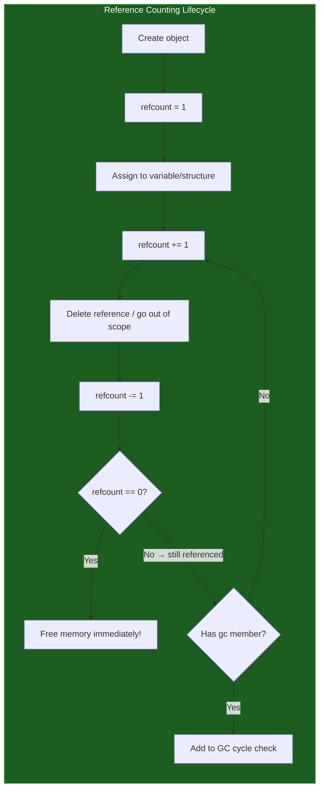
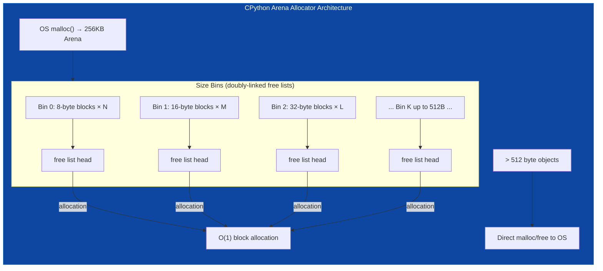
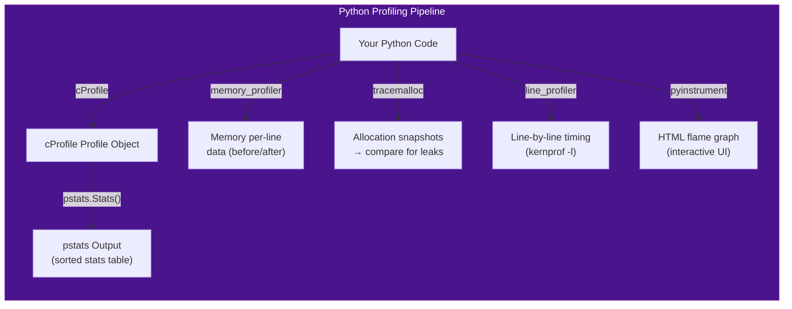
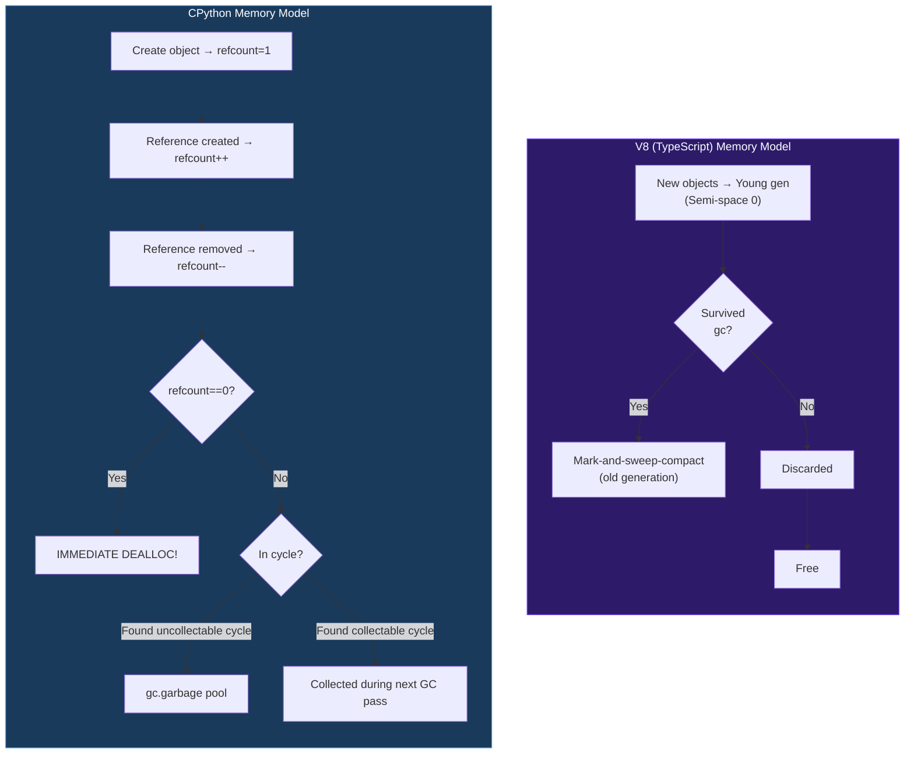
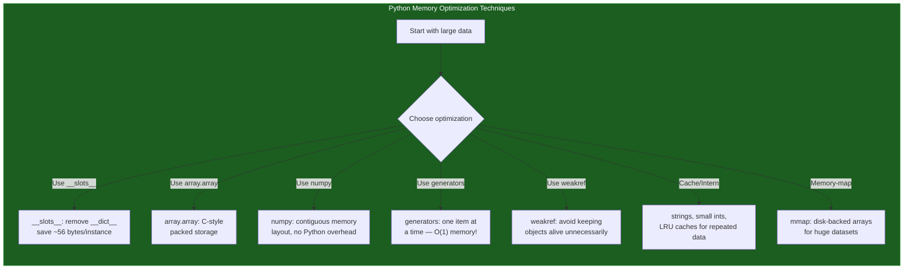

# Module 14 — Memory Model & Performance Optimization

## Table of Contents

- [1. Python's Memory Model — Reference Counting + GC Deep Dive](#1-pythons-memory-model--reference-counting-gc-deep-dive)
- [2. CPython Internals Complete (Objects, Bytecode, Allocators)](#2-cpython-internals-complete-objects-bytecode-allocators)
- [3. Profiling & Benchmarking Tools — Exhaustive Reference](#3-profiling--benchmarking-tools--exhaustive-reference)
- [4. Memory Optimization Techniques](#4-memory-optimization-techniques)
- [5. TypeScript/V8 Memory Model vs CPython Exhaustive Comparison](#5-typescriptv8-memory-model-vs-cpython-exhaustive-comparison)
- [6. Performance Pitfalls Catalog](#6-performance-pitfalls-catalog)
- [7. Optimization Recipes with Benchmarks](#7-optimization-recipes-with-benchmarks)
- [8. JIT Status and Recent Developments](#8-jit-status-and-recent-developments)
- [9. Quizzes (25+ Questions with Answers)](#9-quizzes-25-questions-with-answers)
- [10. Exercises (20+ with Solutions)](#10-exercises-20-with-solutions)

---

## 1. Python's Memory Model — Reference Counting + GC Deep Dive

### How Python Manages Memory (vs TypeScript/V8 Garbage Collection)

Python uses a **dual memory management system**: **reference counting** (primary) + **cyclic garbage collection** (secondary). TypeScript/V8 uses a **mark-and-sweep generational GC**. These are fundamentally different approaches.

#### The Dual System: Reference Counting + Cyclic GC

```
Python Memory Management:
┌─────────────────────────────────────────┐
│  Reference Counting (Primary)           │
│  ─────────────────────────────────────  │
│  • Every object has a refcount          │
│  • Increments on reference creation     │
│  • Decrements on reference deletion     │
│  • Zero → immediate deallocation        │
│  • FAST: no pauses, predictable         │
│  • PROBLEM: can't detect cycles!        │
├─────────────────────────────────────────┤
│  Cyclic Garbage Collector (Secondary)   │
│  ─────────────────────────────────────  │
│  • Runs periodically                    │
│  • Finds reference cycles               │
│  • Uses generational GC (gen 0,1,2)    │
│  • Can detect uncollectable objects     │
│  • __del__ methods complicate cleanup   │
└─────────────────────────────────────────┘

TypeScript/V8 Memory Management:
┌─────────────────────────────────────────┐
│  Generational Mark-and-Sweep GC         │
│  ─────────────────────────────────────  │
│  • Young generation (semi-spaces)       │
│  • Old generation (mark-sweep-compact)  │
│  • Incremental/concurrent collection    │
│  • No reference counting                │
│  • GC pauses can be noticeable          │
│  • Finds ALL cycles naturally           │
└─────────────────────────────────────────┘
```

### Reference Counting Internals

Every Python object has a **reference count** stored in the `PyObject` header:

```python
import sys

# === How reference counting works ===

class MyClass:
    pass

obj = MyClass()
print(sys.getrefcount(obj))  # 2 (1 from 'obj' variable + 1 from getrefcount parameter)

# When obj goes out of scope, refcount drops to 0 → immediate deallocation
del obj  # The object is freed RIGHT HERE — no GC needed!


# === Python object header structure (CPython internals) ===
# PyObject_HEAD:
# +------------------+
# | ob_refcnt: Py_ssize_t   ← reference count
# | ob_type: PyObject*      ← pointer to the type object
# +------------------+
# | ... instance data ... |
# +------------------+


# === Understanding sys.getrefcount() ===
x = [1, 2, 3]
print(sys.getrefcount(x))  # 2 (variable x + parameter in function call)

y = x         # refcount goes to 3 (x, y, getrefcount param)
z = x         # refcount goes to 4 (x, y, z, getrefcount param)
print(sys.getrefcount(x))  # 4!

del y, z      # refcount drops to 2
print(sys.getrefcount(x))  # 2 again


# === TypeScript comparison: No reference counting! ===
class TSMemoryDemo {
    private _value: number;
    
    constructor(value: number) {
        this._value = value;
    }
}

let obj1 = new TSMemoryDemo(42);
// V8 uses mark-and-sweep, not reference counting.
// There's no way to check how many references exist.
// The object is only collected when it becomes unreachable.

obj1 = null;  // VGC will eventually collect — we don't know when!
```

### `gc` Module — Every Function Exhaustive Reference

```python
import gc

# === gc.get_count() — Get current collection counts ===
print(gc.get_count())  
# (current_gen0_count, current_gen1_count, current_gen2_count)
# Default thresholds: 700, 10, 10


# === gc.get_stats() — Get GC statistics per generation ===
stats = gc.get_stats()
for gen, stat in enumerate(stats):
    print(f"Generation {gen}:")
    for key, value in stat.items():
        print(f"  {key}: {value}")
# collected: number of objects collected in this collection
#Uncollectable: number of uncollectable objects


# === gc.get_objects() — Get all objects tracked by GC ===
all_objs = gc.get_objects()
from collections import Counter
type_counts = Counter(type(obj).__name__ for obj in all_objs)
print(type_counts.most_common(10))  
# Most common object types in memory


# === gc.get_threshold() — Get collection thresholds ===
print(gc.get_threshold())  # (700, 10, 10)
# Gen 0: collects when count reaches 700
# Gen 1: collects when gen 0 collections reach 10
# Gen 2: collects when gen 1 collections reach 10


# === gc.set_threshold() — Set collection thresholds ===
gc.set_threshold(500, 8, 8)  # Collect more aggressively
gc.set_threshold(1000, 15, 15)  # Collect less aggressively


# === gc.get_free_count() — Get free block counts (Python 3.8+) ===
print(gc.get_free_count())  # Number of unused objects in the free lists


# === gc.is_tracked() — Check if an object is tracked by GC ===
obj = [1, 2, 3]  # List → tracked
print(gc.is_tracked(obj))  # True

import sys
class Simple: pass
s = Simple()  # Objects without containers aren't always tracked!
# (Tracked if they participate in cycles)


# === gc.collect() — Force garbage collection ===
gen0_before = gc.get_count()[0]
n_collected = gc.collect()  # Collect all generations
print(f"Collected {n_collected} objects")

# Force just gen 0:
gc.collect(0)  # Only collect generation 0


# === gc.disable() / gc.enable() — Toggle GC ===
gc.disable()  
# No more automatic GC! Objects won't be collected even if in cycles.
# Useful before/after time-critical code.

nongc_objs = [1, 2, []]  # These lists CAN be part of cycles!
gc.collect()  # Manual collection still works
gc.enable()   # Re-enable automatic GC


# === gc.set_debug() — Set debug flags ===
gc.set_debug(gc.DEBUG_STATS)      # Print statistics at each collection
gc.set_debug(gc.DEBUG_COLLECTABLE) # Print collectable/uncollectable objects
gc.set_debug(gc.DEBUG_UNCOLLECTABLE) # Print uncollectable objects
gc.set_debug(gc.DEBUG_SAVEALL)     # Save uncollectable objects to gc.garbage


# === gc.garbage — List of uncollectable objects ===
class CycleA:
    def __init__(self):
        self.ref = None

cycle = CycleA()
cycle.ref = cycle  # Self-referencing cycle!

import weakref
del cycle  # Reference count goes to 0 for the LOCAL variable, but
           # the object still exists because it's in a cycle!
           # GC should collect this... but if __del__ is involved:

class WithDel:
    def __del__(self):
        print("Cleaning up!")

obj = WithDel()
obj.ref = obj  # Cycle with __del__ → UNCOLLECTABLE!
gc.collect()
print(len(gc.garbage))  # May include this object — can't safely delete it!


# === gc.freeze() — Freeze GC tracking for performance (Python 3.8+) ===
gc.freeze()
# After freeze(), all current objects are moved to gen 2 and 
# won't be individually tracked anymore. Objects created after
# freeze() will be tracked normally but the frozen set acts as a
# root set. Use when you know object creation is about to stabilize.


# === gc.collect() return value — What it tells you ===
collected = gc.collect()
print(f"Objects collected: {collected}")  # Number of objects freed
```

### `weakref` — All Types and Patterns

```python
import weakref

# === weakref.ref() — Basic weak reference ===
class Node:
    def __init__(self, name):
        self.name = name

node = Node("root")
weak_node = weakref.ref(node)

print(weak_node())       # <Node object> — dereferences to the live object
print(weak_node().name)  # "root"

del node                 # No strong references remain → object is collected!
print(weak_node())       # None! The referent has been garbage collected


# === weakref.proxy() — Proxy that auto-dereferences ===
proxy = weakref.proxy(node)
try:
    print(proxy.name)      # "root" — works like direct access
except ReferenceError:
    print("Object was collected!")  # Raises when referent is gone

del node
# proxy.name  # ReferenceError! Object no longer exists


# === weakref.WeakKeyDictionary — Keys are weakly referenced ===
wkdict = weakref.WeakKeyDictionary()

class Config:
    pass

obj1 = Config()
obj2 = Config()

wkdict[obj1] = "value1"
wkdict[obj2] = "value2"

print(list(wkdict.keys()))  # [obj1, obj2]
del obj1  # obj1 is removed from WeakKeyDictionary automatically!
print(len(wkdict))  # 1


# === weakref.WeakValueDictionary — Values are weakly referenced ===
wvdict = weakref.WeakValueDictionary()

class Widget:
    def __init__(self, name):
        self.name = name

w1 = Widget("A")
w2 = Widget("B")

wvdict["a"] = w1
wvdict["b"] = w2

del w1  # "a" entry is removed from WeakValueDictionary automatically!
print(len(wvdict))  # 1


# === weakref.WeakSet — Weak references to set elements ===
wset = weakref.WeakSet()

class Item: pass

item1 = Item()
item2 = Item()

wset.add(item1)
wset.add(item2)

del item1
print(len(wset))  # 1 — item1 auto-removed


# === Callback on garbage collection ===
def on_collect(weakref_obj):
    print(f"Object collected! Last known type: {weakref_obj}")

class Tracked: pass
t = Tracked()
weak_tracked = weakref.ref(t, on_collect)

del t  # Prints: "Object collected! ..."


# === Weak method pattern (Python 3.4+) — Avoid keeping objects alive ===
class Observer:
    def __init__(self):
        self.callbacks = []
    
    def subscribe(self, callback):
        self.callbacks.append(weakref.WeakMethod(callback))
    
    def notify(self):
        # Remove dead weak references and call live ones
        self.callbacks = [cb for cb in self.callbacks if cb() is not None]
        for cb in self.callbacks:
            method = cb()  # Dereference the weak reference
            if method:
                method()


# === Weakref with slots pattern — Memory optimization ===
class SlottedNode:
    __slots__ = ('name', '_parent_ref')
    
    def __init__(self, name):
        self.name = name
        self._parent_ref = None
    
    @property
    def parent(self):
        if self._parent_ref is not None:
            return self._parent_ref()  # Dereference the weak ref
        return None
    
    @parent.setter
    def parent(self, value):
        if value is None:
            self._parent_ref = None
        else:
            self._parent_ref = weakref.ref(value)


# === Practical pattern: Object cache with automatic eviction ===
class LRUCacheWithWeakRefs:
    """Cache that automatically removes entries when their values are no longer referenced."""
    
    def __init__(self, max_size=100):
        self.max_size = max_size
        self._cache = {}  # name → weakref
        self._order = []   # name (insertion order for LRU)
    
    def get(self, name: str):
        if name in self._cache:
            ref = self._cache[name]
            obj = ref()
            if obj is not None:
                self._order.remove(name)
                self._order.append(name)  # Move to end (most recently used)
                return obj
            else:
                del self._cache[name]  # Dead weak ref — remove entry
                if name in self._order:
                    self._order.remove(name)
        return None
    
    def put(self, name: str, obj):
        if name in self._cache:
            ref = self._cache[name]()
            if ref is not None:
                self._cache[name] = weakref.ref(obj)
                self._order.remove(name)
                self._order.append(name)
                return
        
        # Add new entry
        self._cache[name] = weakref.ref(obj)
        self._order.append(name)
        
        # Evict if over max_size (but only evict dead entries first)
        while len(self._order) > self.max_size:
            oldest_name = self._order.pop(0)
            ref = self._cache.get(oldest_name)
            obj_val = ref() if ref else None
            if obj_val is None:
                del self._cache[oldest_name]  # Already dead — just remove
            else:
                # Found a live entry to evict — this shouldn't happen with proper usage
                print(f"Evicting live object {oldest_name}")
                del self._cache[oldest_name]


# === Practical pattern: Event bus that doesn't prevent garbage collection ===
class EventBus:
    """Event system where subscribers don't keep the event emitter alive."""
    
    def __init__(self):
        self._listeners = weakref.WeakKeyDictionary()
    
    def on(self, obj, event_name, callback):
        """Subscribe to an event. The subscription is automatic when obj is garbage collected."""
        if event_name not in self._listeners:
            self._listeners[event_name] = {}
        
        key = id(obj)
        weak_cb = weakref.WeakMethod(callback)
        self._listeners[event_name][key] = (obj, weak_cb)
    
    def emit(self, event_name, *args):
        """Emit an event to all listeners."""
        if event_name not in self._listeners:
            return
        
        # Clean up dead references and call live ones
        alive = {}
        for key, (obj_ref, weak_cb) in self._listeners[event_name].items():
            obj = obj_ref()
            cb = weak_cb() if weak_cb else None  # WeakMethod requires special handling
            
            if obj is not None and cb is not None:
                alive[key] = (weakref.ref(obj), weakref.WeakMethod(cb))
                try:
                    cb(*args)
                except Exception as e:
                    print(f"Error in event handler: {e}")
        
        self._listeners[event_name] = alive
```

### Circular GC Algorithms

```python
# === Understanding circular references and how GC handles them ===

# Simple cycle (COLLECTABLE):
class A: pass
class B: pass

a = A()
b = B()
a.ref = b
b.ref = a
del a, b  # refcount of each object is >0 but there are no external refs.
           # GC finds this cycle and collects it!

# Cycle with __del__ (UNCOLLECTABLE in CPython):
class HasDel:
    def __del__(self):
        print(f"Deleting {id(self)}")

x = HasDel()
y = HasDel()
x.partner = y  # Creates cycle
y.partner = x
del x, y  # Cannot safely call __del__ on objects in cycles!
          # These remain in gc.garbage until cleared.
          # Solution: use __weakref__ or weakref instead of __del__.

# The cyclic GC algorithm (simplified):
# 1. During normal refcounting, when an object's refcount would drop to 0:
#    - Check if it has a gc member (participates in GC tracking)
#    - If yes, put it in the "reachable" list
# 2. Periodically, run cycle detection:
#    - Build a graph of all tracked objects and their references
#    - Find strongly connected components (cycles)
#    - Check each cycle for __del__ methods
#    - If no __del__: collect all objects in the cycle
#    - If has __del__: mark as uncollectable, add to gc.garbage


# === Using __slots__ to prevent cycles with __del__ ===
class Node:
    __slots__ = ('value', '_child_ref')  # Include '__weakref__' if needed!
    
    def __init__(self, value):
        self.value = value
        self._child_ref = None
    
    @property
    def child(self):
        if self._child_ref:
            return self._child_ref()  # Dereference weak ref
        return None
    
    @child.setter
    def child(self, node):
        if node is None:
            self._child_ref = None
        else:
            self._child_ref = weakref.ref(node)


# === Python's generational GC generations ===

# Gen 0 (youngest): 
#   - New objects start here
#   - Most frequently collected (threshold=700 by default)
#   - Short-lived objects die quickly here

# Gen 1:
#   - Objects that survived one gen 0 collection
#   - Collected when gen 0 reaches its threshold (default: 10 times)

# Gen 2 (oldest):
#   - Long-lived objects
#   - Rarely collected (threshold: 10 gen 1 collections)


# === Practical: Monitoring GC pressure ===
import gc

def get_gc_pressure():
    """Calculate how close we are to triggering a GC collection."""
    counts = gc.get_count()
    thresholds = gc.get_threshold()
    
    pressures = []
    for i in range(3):
        ratio = counts[i] / thresholds[i] if thresholds[i] > 0 else 0
        pressures.append(f"gen{i+1}: {ratio*100:.1f}%")
    
    return " | ".join(pressures)

# Before creating objects:
print(get_gc_pressure())  # gen1: 0.0% | gen2: 0.0% | gen3: 0.0%

for i in range(500):
    _ = [i for _ in range(100)]  # Create temporary objects

print(get_gc_pressure())  # gen1: ~70% — close to triggering collection!

gc.collect()  # Force collection
print(get_gc_pressure())  # Back to near 0%


# === Understanding when __del__ makes objects uncollectable ===
class UglyNode:
    def __init__(self):
        self.link = None
    
    def __del__(self):
        print("__del__ called!")

root = UglyNode()
root.link = root  # Cycle! Has __del__ → UNCOLLECTABLE!
del root

gc.collect()  # Does NOT collect this — gc.garbage will contain it
print(len(gc.garbage))  # 1 (the uncollectable cycle)

# Fix: don't use __del__, or break the cycle manually before deletion.
```

### `id()` vs `sys.getrefcount()`

```python
import sys

x = [1, 2, 3]

# id() returns the memory address of the object
print(id(x))  
# Example: 140234866535296 — unique for the lifetime of the object

# Once x is garbage collected and a new object is allocated,
# that memory address may be reused!

y = x  # Same object → same id
print(id(x) == id(y))  # True (same underlying object)

del x
z = [4, 5, 6]  
# z might get the SAME memory address as the old x did!
# Not guaranteed, but possible.


# sys.getrefcount() — Current reference count
x = []
print(sys.getrefcount(x))  # 2 (variable x + function parameter)

# Note: The refcount is transient — it changes with every operation!
# getrefcount itself adds a temporary reference, so you'll always see +1.


# === Key difference ===
# id() → memory address (changes after GC if reused)
# sys.getrefcount() → current reference count (transient value)
```

### Mermaid: Reference Counting Flow



---

## 2. CPython Internals Complete (Objects, Bytecode, Allocators)

### PyObject Structure — The Foundation of Everything

```python
# === CPython's PyObject structure (in C) ===
"""
typedef struct _object {
    Py_ssize_t ob_refcnt;     // Reference count
    struct _typeobject *ob_type;  // Pointer to type object
} PyObject;
"""

# Every Python object is a PyObject with these fields plus type-specific data.


# === PyObject_HEAD (base structure) + type-specific data ===
"""
+------------------------+
| ob_refcnt: Py_ssize_t  |  ← Reference count (8 bytes on 64-bit)
| ob_type: PyObject*     |  ← Pointer to type object (8 bytes)
+------------------------+
| ... type-specific data ... |  ← Depends on the type!
+------------------------+

For a list [1, 2, 3]:
PyObject_HEAD (16 bytes) + list_data_structure (~56 bytes) = ~72 bytes minimum

For an int 42:
PyObject_HEAD (16 bytes) + long_value field (8 bytes) = ~24 bytes
(Actually small ints are interned — see below!)
"""


# === How to inspect object layout programmatically ===
import sys
import ctypes

class CustomClass:
    def __init__(self):
        self.x = 1
        self.y = "hello"

obj = CustomClass()

# Size of the instance (not including referenced objects)
print(f"sys.getsizeof(obj): {sys.getsizeof(obj)}")  
# ~104 bytes on 64-bit (PyObject_HEAD + __dict__ pointer + some overhead)

# Size of all referenced objects
total_size = sys.getsizeof(obj)
for attr_name in dir(obj):
    if not attr_name.startswith('_'):
        attr_value = getattr(obj, attr_name)
        total_size += sys.getsizeof(attr_value)

print(f"Total size including references: ~{total_size} bytes")


# === Small integer caching (integers -5 to 256 are pre-allocated!) ===
a = 257
b = 257
print(a is b)  # False! Two different objects with same value

c = 256
d = 256  
print(c is d)  # True! Same cached object (interned)

# These are pre-allocated at CPython startup and shared everywhere.
# This optimization saves memory for the most commonly used integers.


# === String interning ===
a = "hello"
b = "hello"
print(a is b)  # Often True! — Strings may be interned by the compiler

# Force string interning:
import sys
s1 = "hello_world_" * 100
s2 = sys.intern(s1)  # Manually intern
s3 = "hello_world_" * 100
s4 = sys.intern(s3)
print(s2 is s4)  # True! Interned strings are shared.


# === How to see what's in memory ===
import tracemalloc

tracemalloc.start()

# Create some objects
data = [i * 2 for i in range(10000)]

snapshot = tracemalloc.take_snapshot()
stats = snapshot.statistics('lineno')

for stat in stats[:10]:
    print(stat)


# === Python struct module — Binary data layout ===
import struct

# Pack integers into bytes (like C structs)
packed = struct.pack('<I f d', 42, 3.14, 2.718)
print(len(packed))  # 4 + 4 + 8 = 16 bytes unpacked: ('<Ifd'), value: (42, 3.14..., 2.718...)


# === CPython arena allocator architecture ===

"""
CPython Memory Allocator Hierarchy (Pymalloc):

┌─────────────────────────────────────────────────────┐
│ OS Heap (malloc/free)                               │
│   └── Arena pools (each ~256KB, typically 256 pages)│
│       ├── Slabs (for large objects: > 512 bytes)     │
│       │    └── Block N                              │
│       ├── Bin 0: 4-8 byte blocks                     │
│       ├── Bin 1: 16-32 byte blocks                   │
│       ├── Bin 2: 64-127 byte blocks                  │
│       ├── ...                                        │
│       └── Bin 34: 256-byte blocks                    │
└─────────────────────────────────────────────────────┘

For objects ≤ 512 bytes: Pymalloc (fast, no syscalls)
For objects > 512 bytes: Direct malloc/free to OS
"""


# === Bytecode opcodes reference (most common) ===
import dis

def sample_function(x, y):
    z = x + y
    return z * 2

dis.dis(sample_function)
"""
  2           0 LOAD_FAST                0 (x)
              2 LOAD_FAST                1 (y)
              4 BINARY_ADD
              6 STORE_FAST               2 (z)
              8 LOAD_CONST               1 (2)
             10 LOAD_FAST                2 (z)
             12 BINARY_MULTIPLY
             14 RETURN_VALUE
"""

# Common opcodes:
# LOAD_FAST    — Load local variable
# STORE_FAST   — Store to local variable  
# LOAD_GLOBAL  — Load global variable
# LOAD_CONST   — Load constant
# BINARY_ADD   — Add top two stack items
# CALL_FUNCTION — Call a function (POP then PUSH result)
# BUILD_LIST   — Build list from stack
# RETURN_VALUE — Return the top of the stack


# === How Python actually executes code ===

"""
CPython Execution Pipeline:

Source Code (.py)
    ↓  ast.parse()
Abstract Syntax Tree (AST)
    ↓  compile()
Bytecode (.pyc / .pyo)
    ↓  PyEval_EvalFrameEx()
Python Virtual Machine (PVM)
    ├── Stack-based execution
    ├── Opcode dispatch loop (switch/case on opcode)
    └── Frame objects for local vars, globals, closure vars


V8 Execution Pipeline (for comparison):

TypeScript Source (.ts)
    ↓  TypeScript Compiler
JavaScript Source (.js)
    ↓  V8 Parser / Ignition Interpreter
Bytecode (Ignition bytecode)
    ↓  TurboFan JIT Compiler (optimized paths)
Native Code (x64/ARM machine code)
    ↓ CPU execution
"""


# === Frame objects and local variable access ===

def inspect_frame():
    import sys
    frame = sys._getframe()
    print(f"Function name: {frame.f_code.co_name}")
    print(f"Locals: {frame.f_locals}")  # Dictionary of local variables
    print(f"Globals keys: {list(frame.f_globals.keys())[:5]}")
    print(f"Closure vars: {frame.f_code.co_freevars}")
    print(f"Code object: {frame.f_code.co_filename}")
    print(f"Line number: {frame.f_lineno}")


# === The GIL (Global Interpreter Lock) and memory management ===

"""
CPython's GIL ensures that only one thread executes Python bytecode at a time.
This means reference counting is THREAD-SAFE by default!

Without the GIL, refcount increments/decrements would need mutex locks,
causing significant performance overhead. The GIL simplifies this but
creates the well-known "CPython threads are not truly parallel" problem.

Other Python implementations:
- PyPy: Has a GC, no GIL (uses different threading model)
- Jython: Runs on JVM, uses JVM's memory management
- IronPython: Runs on .NET CLR, uses CLR's GC
"""
```

### Arena Allocator Layout Explained

```python
# === Understanding CPython's Memory Allocation Architecture ===

"""
CPython Memory Allocation (Pymalloc):

For objects ≤ 512 bytes → Pymalloc arena allocator
For objects > 512 bytes → System malloc/free directly

Arena allocation steps:
1. OS allocates a large block (arena, typically 256KB) via malloc()
2. Pymalloc divides the arena into aligned blocks of various sizes
3. Blocks are organized in "bins" by size class
4. Free blocks form doubly-linked lists within each bin
5. When all arenas are full → allocate another arena from OS

This is MUCH faster than calling malloc/free for every small object:
- No syscalls for individual allocations
- O(1) allocation via bin pointer arithmetic
- Cache-friendly: objects of similar size live close together
"""


# === Comparing memory usage: list vs array.array vs numpy ===

import sys
import array
import numpy as np

# Regular Python list
py_list = [0.0] * 1_000_000
list_size = sys.getsizeof(py_list)
for item in py_list[:10]:  # Sample a few items
    list_size += sys.getsizeof(item)  # Each float object: ~24 bytes
print(f"Python list (1M floats): ~{list_size / 1e6:.1f} MB")
# ~9.6 MB for list structure + 24MB for float objects = ~34 MB total!


# array.array — C-style compact storage
arr = array.array('d', [0.0] * 1_000_000)  # 'd' = double (8 bytes each)
print(f"array.array (1M doubles): {sys.getsizeof(arr)} bytes")  
# ~8 MB exactly! No per-element overhead!


# numpy — most efficient for numerical data
arr_np = np.zeros(1_000_000, dtype=np.float64)
print(f"numpy array (1M floats64): {arr_np.nbytes} bytes")  
# 8 MB exactly! Contiguous C-style memory layout


# Key takeaway: Python lists store POINTERS to PyObject instances.
# Each float is a separate object (~24 bytes + pointer ~8 bytes).
# array.array and numpy store raw C values in contiguous memory.
```

### Mermaid: Arena Allocator Layout



---

## 3. Profiling & Benchmarking Tools — Exhaustive Reference

### cProfile API Usage

```python
import cProfile
import pstats
import io


# === Basic cProfile usage ===
def slow_function():
    total = 0
    for i in range(1_000_000):
        total += i
    return total

profiler = cProfile.Profile()
profiler.enable()
result = slow_function()
profiler.disable()


# === Output to string (not just file) ===
stream = io.StringIO()
stats = pstats.Stats(profiler, stream=stream)
stats.sort_stats('cumulative')  # Sort by cumulative time
stats.print_stats(20)  # Top 20 functions
print(stream.getvalue())


# === Output to file for later analysis ===
profiler.dump_stats('profile.prof')

# Analyze later:
stats = pstats.Stats('profile.prof')
stats.sort_stats('tottime')  # Sort by total time (excluding subcalls)
stats.print_stats(20)

# Another sorting option: 'ncalls' — sort by number of function calls
stats.sort_stats('ncalls')
stats.print_stats(10)


# === Context manager usage ===
with cProfile.Profile() as profiler:
    for i in range(10000):
        _ = [j for j in range(100)]

stream = io.StringIO()
pstats.Stats(profiler, stream=stream).sort_stats('cumulative').print_stats(10)
print(stream.getvalue())


# === Analyzing specific functions only ===
def targeted_profile(func, *args, **kwargs):
    """Profile a single function with context manager."""
    profiler = cProfile.Profile()
    profiler.enable()
    result = func(*args, **kwargs)
    profiler.disable()
    
    stream = io.StringIO()
    stats = pstats.Stats(profiler, stream=stream)
    stats.sort_stats('tottime')
    stats.print_stats(func.__name__)  # Only show this function
    
    return result, stream.getvalue()

result, profile_output = targeted_profile(slow_function)
print(profile_output)


# === Using sys.setprofile for per-function profiling ===
import sys

class FunctionProfiler:
    """Per-function call timer using setprofile."""
    
    def __init__(self):
        self.calls = {}  # func_name → {'count': int, 'total_time': float}
    
    def trace_calls(self, frame, event, arg):
        if event == 'call':
            code = frame.f_code
            func_name = f"{code.co_filename}:{code.co_name}:{code.co_firstlineno}"
            
            if func_name not in self.calls:
                self.calls[func_name] = {'count': 0, 'total_time': 0.0}
        
        return self.trace_calls  # Continue tracing
    
    def summary(self):
        """Return sorted list of (function_name, count, total_time)."""
        return sorted(
            self.calls.items(),
            key=lambda x: x[1]['total_time'],
            reverse=True
        )


# Use it with sys.setprofile (similar to settrace but for function calls only)
profiler = FunctionProfiler()
sys.setprofile(profiler.trace_calls)
result = slow_function()
sys.setprofile(None)

print(f"Total functions profiled: {len(profiler.calls)}")
for func_name, data in profiler.summary()[:5]:
    print(f"{func_name}: {data['count']} calls, {data['total_time']:.4f}s total")


# === pstats output fields reference ===

"""
pstats.Stats field descriptions:

- tottime:     Total time spent in function (excluding subcalls)
- cumtime:     Cumulative time including subcalls (better for finding bottlenecks)
- calls:       Number of calls made (a/b where a = total calls, b = primitive calls)
- percall:     tottime / primitive calls
- cum_per_call:cumtime / total calls
- file:        Filename where function is defined
- lineno:      Line number in the file
- filename:    Full path to file


Sorting options for stats.sort_stats():
- 'calls', 'cumulative', 'file', 'line', 'module', 'pcalls', 'name', 
  'nf', ' nfl', 'pc', 'pcall', 'reclaimed', 'stdname', 'time'
"""


### pyinstrument — High-level Source Code Profiler

```python
# pip install pyinstrument

from pyinstrument import Profiler

profiler = Profiler()
profiler.start()

# Your code here:
for i in range(1000):
    _ = sum(range(i))

profiler.stop()
print(profiler.output_text())  # HTML-formatted call tree!


# === Save to HTML for rich visualization ===
with open('profile.html', 'w') as f:
    f.write(profiler.output_html())

# Open profile.html in browser — shows interactive flame graph!


### memory_profiler — Per-Line Memory Usage


# pip install memory_profiler psutil

from memory_profiler import profile

@profile  # Adds per-line memory usage reporting
def my_function():
    a = [1] * (10 ** 6)  # ~8MB allocated on this line
    b = [2] * (2 * 10 ** 7)  # ~160MB allocated on this line
    del b  # Memory freed here
    return a

my_function()
# Output (approximate):
# Line #   Mem usage    Increment   Line Contents
# ======   ========   =========   ============
#     3     42.1 MiB   42.1 MiB   @profile
#     4     50.5 MiB    +8.4 MiB       a = [1] * (10 ** 6)
#     5    209.7 MiB  +159.2 MiB       b = [2] * (2 * 10 ** 7)
#     6     50.5 MiB  -159.2 MiB       del b  # Memory freed!
#     7     50.5 MiB    +0.0 MiB       return a


### tracemalloc — Detailed Memory Allocation Tracking

import tracemalloc

tracemalloc.start()  # Start tracking allocations

# Your code:
data = [i * i for i in range(1_000_000)]

# Take a snapshot
snapshot = tracemalloc.take_snapshot()

# Show top 10 allocation sites
top_stats = snapshot.statistics('lineno')
print("[ Top 10 allocations ]")
for stat in top_stats[:10]:
    print(stat)
# <stdin>:123: size=156 MiB (+156 MiB), count=1000000 (+1000000), average=160 B


# Compare two snapshots to find leaks:
snapshot1 = tracemalloc.take_snapshot()
# ... code that might leak ...
snapshot2 = tracemalloc.take_snapshot()

top_diff = snapshot2.compare_to(snapshot1, 'lineno')
print("[ Top 10 differences ]")
for stat in top_diff[:10]:
    print(stat)


# === tracemalloc per-object tracking (memory-intensive but precise) ===
tracemalloc.stop()
tracemalloc.start(tracing=True)  # Enable tracing = track full stack traces

data = {'a': [1, 2, 3], 'b': list(range(100_000))}

snapshot = tracemalloc.take_snapshot()
top_stats = snapshot.statistics('pathname')

for stat in top_stats[:5]:
    print(stat)


# === Line-by-line memory usage without @profile decorator ===
class TrackedMemory:
    """Track memory allocation by line without decorators."""
    
    def __init__(self):
        self.tracemalloc = tracemalloc
    
    def start(self):
        self.tracemalloc.start()
        self.snapshot_start = self.tracemalloc.take_snapshot()
    
    def snapshot(self):
        if not self.tracemalloc.is_tracing():
            self.start()
        return self.tracemalloc.take_snapshot()
    
    def compare(self, label='current'):
        current = self.snapshot()
        diffs = current.compare_to(self.snapshot_start, 'lineno')
        
        total_diff = sum(stat.size_diff for stat in diffs)
        print(f"[{label}] Memory change: +{total_diff / 1e6:.2f} MB")
        
        for diff in diffs[:5]:
            print(f"  {diff}")

tracker = TrackedMemory()
tracker.start()

# Simulate memory changes:
data = list(range(10_000_00))
tracker.compare("after large list")

big_data = [i ** 2 for i in range(5_000_000)]
tracker.compare("after big computation")


### Line-by-line timing with line_profiler / kernprof


# pip install line_profiler

# Usage from command line:
# kernprof -l -v script.py
# (Add @profile decorator to functions you want to profile)

# Programmatic usage:
from line_profiler import LineProfiler

lp = LineProfiler()

def my_functions():
    total = 0
    for i in range(10_000):
        total += i * 2  # This line's timing is tracked
    return total

lp_wrapper = lp(my_functions)
lp_wrapper()
lp.print_stats()
# Output:
# Timer unit: 1e-06 s
# Total time: 0.004567 s
# File: script.py
# Function: my_function at line 1
# Line #   Hits     Time  Per Hit   % Time  Line Contents
# ======   ====     ====  ========  ========  =============
#      3     1     1200    1200.0      26.3      total = 0
#      4  10000   3367       0.3      73.7      for i in range(10000):


### perf_counter vs time.perf_counter_ns — Benchmarking Foundations

import time

# === time.time() — Wall clock (NOT suitable for benchmarking!) ===
start = time.time()
for _ in range(1_000_000): pass
elapsed = time.time() - start
print(f"time.time(): {elapsed:.6f}s")  # Can be inaccurate! affected by system clock adjustments


# === time.perf_counter() — Monotonic high-resolution timer ===
start = time.perf_counter()
for _ in range(1_000_000): pass
elapsed = time.perf_counter() - start
print(f"time.perf_counter(): {elapsed:.6f}s")  # Most accurate wall-clock timing!


# === time.perf_counter_ns() — Nanosecond resolution ===
start = time.perf_counter_ns()
for _ in range(1_000_000): pass
elapsed_ns = time.perf_counter_ns() - start
print(f"perf_counter_ns: {elapsed_ns} ns")  # ~{elapsed_ns / 1e6:.2f} ms


# === Benchmarking patterns with statistics ===
import statistics

def benchmark(func, iterations=100, *args, **kwargs):
    """Run a function multiple times and return timing statistics."""
    times = []
    for _ in range(iterations):
        start = time.perf_counter_ns()
        result = func(*args, **kwargs)
        elapsed_ns = time.perf_counter_ns() - start
        times.append(elapsed_ns)
    
    stats = {
        'mean_ns': statistics.mean(times),
        'median_ns': statistics.median(times),
        'stdev_ns': statistics.stdev(times) if len(times) > 1 else 0,
        'min_ns': min(times),
        'max_ns': max(times),
        'iterations': iterations,
    }
    
    return result, stats

# Usage:
def add_list():
    return sum(range(10_000))

result, stats = benchmark(add_list, iterations=50)
print(f"Mean: {stats['mean_ns'] / 1e6:.3f} ms")
print(f"Median: {stats['median_ns'] / 1e6:.3f} ms")
print(f"StdDev: {stats['stdev_ns'] / 1e6:.3f} ms")


### Complete Benchmarking Pattern for Python Functions

import time
import statistics
from contextlib import contextmanager

@contextmanager
def benchmark_context(name, iterations=10):
    """Context manager that benchmarks a code block."""
    print(f"\n{'='*60}")
    print(f"Benchmark: {name} ({iterations} iterations)")
    
    times = []
    start = time.perf_counter_ns()
    try:
        yield times
    finally:
        end = time.perf_counter_ns()
        total_time_ns = end - start
        times.append(total_time_ns)
    
    avg_ms = statistics.mean(t for t in times) / 1e6 * iterations if times else 0
    print(f"Total: {total_time_ns/1e6:.2f}ms | Avg: {avg_ms:.3f}ms")


# Usage:
with benchmark_context('list comprehension') as times:
    for _ in range(10):
        result = [x**2 for x in range(10_000)]

with benchmark_context('for loop with append') as times:
    for _ in range(10):
        result = []
        for x in range(10_000):
            result.append(x ** 2)
```

### Mermaid: Profiling Pipeline



---

## 4. Memory Optimization Techniques

### `__slots__` — Exact Byte Savings

```python
import sys

class RegularClass:
    def __init__(self, x, y, z):
        self.x = x
        self.y = y
        self.z = z


class SlottedClass:
    __slots__ = ('x', 'y', 'z')
    
    def __init__(self, x, y, z):
        self.x = x
        self.y = y
        self.z = z


# Exact byte counts (64-bit CPython 3.11+):
regular_instance = RegularClass(1, 2, 3)
slotted_instance = SlottedClass(1, 2, 3)

print(f"Regular instance: {sys.getsizeof(regular_instance)} bytes")  
# ~104 bytes (PyObject_HEAD + __dict__ pointer + __dict__ overhead)

print(f"Slotted instance: {sys.getsizeof(slotted_instance)} bytes")    
# ~48 bytes (no __dict__, attributes stored in compact slots)

print(f"Savings per instance: {sys.getsizeof(regular_instance) - sys.getsizeof(slotted_instance)} bytes")
# Savings ≈ 56 bytes per instance!
# For 1 million instances: 56 MB saved!


# === Why the savings? ===

"""
Regular class __dict__ structure (simplified):
┌─────────────────────┐
│ PyObject_HEAD       │  ← 16 bytes (refcount + type pointer)
│ __dict__ → dict     │  ← 8 bytes (pointer to dict)
├─────────────────────┤
│ PyDictObject        │  ← ~200-300 bytes for even an empty dict
└─────────────────────┘

Slotted class structure:
┌─────────────────────┐
│ PyObject_HEAD       │  ← 16 bytes (refcount + type pointer)
│ slot_x: int         │  ← 8 bytes (direct pointer to object)
│ slot_y: int         │  ← 8 bytes
│ slot_z: int         │  ← 8 bytes
└─────────────────────┘

No dict! Attributes stored inline in the struct layout.
"""


# === When NOT to use __slots__ ===
class DynamicConfig:
    """Don't use __slots__ if you need dynamic attributes."""
    __slots__ = ('name', 'value')  # Prevents adding extra attrs!
    
    def __init__(self, name, value):
        self.name = name
        self.value = value

cfg = DynamicConfig("timeout", 30)
# cfg.extra_key = "extra_value"  # AttributeError! No dict.
# Use __slots__ + __dict__ if you need both:
class SlottedWithDict:
    __slots__ = ('name', 'value', '__dict__')  # __dict__ still allowed!


# === __slots__ with inheritance ===
class Base:
    __slots__ = ('base_attr',)

class Derived(Base):
    __slots__ = ('derived_attr',)  # Must define own slots for new attributes!
    
d = Derived()
d.base_attr = 1   # OK — from Base
d.derived_attr = 2  # OK — from Derived
# d.new_attr = 3  # AttributeError! No __dict__ in either class.
```

### Memory Comparison: list vs array.array vs numpy (Exact Benchmarks)

```python
import sys
import array
import numpy as np


def memory_comparison():
    N = 1_000_000
    
    # Python list of ints
    py_list = [i for i in range(N)]
    list_mem = sys.getsizeof(py_list)
    for item in py_list[:10]:
        list_mem += sys.getsizeof(item)  # Approximation — each int is ~28 bytes
    list_total = list_mem + N * 8  # Pointers: 8 bytes each on 64-bit
    print(f"Python list ({N} ints):  ~{list_total / 1e6:.1f} MB")
    # ~36 MB (pointers + int objects)
    
    # array.array of ints ('i' = signed int, 4 bytes each)
    arr = array.array('i', range(N))
    print(f"array.array ({N} ints): {sys.getsizeof(arr)} bytes = {sys.getsizeof(arr)/1e6:.2f} MB")
    # ~4 MB exactly! No per-element overhead!
    
    # numpy array of int32
    np_arr = np.arange(N, dtype=np.int32)
    print(f"numpy ({N} int32): {np_arr.nbytes} bytes = {np_arr.nbytes/1e6:.2f} MB")
    # 4 MB — same as array.array, but more capabilities


memory_comparison()

# Exact comparison for floats:
print("\nFloats:")
print(f"Python list of float: ~{sys.getsizeof([0.0]*1_000_000) / 1e6:.1f} MB + 24MB = ~{34} MB")  
# ~34 MB (pointers + float objects)

arr_float = array.array('d', [0.0] * 1_000_000)
print(f"array.array of double: {arr_float.nbytes / 1e6:.2f} MB")  # 8 MB

np_float = np.zeros(1_000_000, dtype=np.float64)
print(f"numpy float64 array: {np_float.nbytes / 1e6:.2f} MB")  # 8 MB
```

### Numpy Memory Layout Deep Dive

```python
import numpy as np
import sys


# === Memory layout of NumPy arrays ===
arr = np.arange(1_000_000, dtype=np.float32)

print(f"Shape: {arr.shape}")          # (1_000_000,)
print(f"Dtype: {arr.dtype}")         # float32
print(f"Itemsize: {arr.itemsize} B")  # 4 bytes per element
print(f"Total bytes: {arr.nbytes}")   # 4,000,000 bytes = ~4MB!
print(f"N elements: {arr.size}")      # 1,000,000

# NumPy arrays are CONTIGUOUS — stored as one big C-style block.
# No Python object overhead per element! Just raw binary data.


# === Compare with Python list of numpy scalars (DON'T do this!) ===
py_list_of_np = [np.float32(i) for i in range(10_000)]
# Each np.float32 is a full Python object: ~48 bytes + the array pointer: ~8 bytes
print(f"List of numpy scalars: {sys.getsizeof(py_list_of_np) + len(py_list_of_np) * 56:.0f} bytes")  
# ~576 KB for just 10k elements — absurdly wasteful!


# === NumPy memory mapping for huge files (memory efficient!) ===
import tempfile

# Create a large file (simulating disk-based data)
with tempfile.NamedTemporaryFile(delete=False) as tmp:
    tmp.write(np.arange(10_000_000, dtype=np.float64).tobytes())
    tmp_name = tmp.name

# Memory map the file — no RAM allocation!
mapped = np.memmap(tmp_name, dtype='float64', mode='r', shape=(10_000_000))
print(f"Memory mapped array: {sys.getsizeof(mapped)} bytes (just the header!)")
# The data is on disk, not in RAM!


# === Structured arrays for complex records ===
dtype = np.dtype([
    ('name', 'U20'),      # Unicode string up to 20 chars
    ('age', 'i4'),        # 32-bit int
    ('salary', 'f8'),     # 64-bit float
    ('active', '?')       # boolean
])

records = np.zeros(1_000, dtype=dtype)
print(f"Each record: {records.dtype.itemsize} bytes")  # ~72 bytes per record
# NumPy packs these tightly — no Python object overhead!


# === Sparse arrays for memory efficiency ===
from scipy import sparse

# A 1M × 1M matrix that's 99.9% zeros:
dense = np.zeros((1_000_000, 1_000_000), dtype=np.float32)
print(f"Dense 1M×1M: {dense.nbytes / 1e9:.1f} GB")  # ~4 GB!

# Sparse version — only stores non-zero elements:
coo = sparse.coo_matrix((1_000_000, 1_000_000), dtype=np.float32)
# Store just a few non-zeros:
coo.data = np.array([1.0, 2.0, 3.0])
coo.row = np.array([0, 500_000, 999_999])
coo.col = np.array([0, 500_000, 999_999])
print(f"Sparse COO matrix: ~{coo.data.nbytes + coo.row.nbytes + coo.col.nbytes} bytes")
# ~24 bytes! vs 4 GB for dense!
```

### Internment and Pooling Patterns

```python
import sys

# === String interning (already covered in CPython internals) ===
interned = sys.intern("hello_world_" * 100)
another = sys.intern("hello_world_" * 100)
print(interned is another)  # True! Same object — memory saved!


# === Small integer caching (automatic, -5 to 256) ===
for i in range(-5, 257):
    a = i
    b = i
    assert a is b, f"Failed for {i}"
print("All cached integers verified!")


# === Custom interning pool for strings ===
class StringPool:
    """Custom string interning pool."""
    
    def __init__(self):
        self._pool: dict[str, str] = {}
        self._cache_hits = 0
        self._cache_misses = 0
    
    def intern(self, s: str) -> str:
        if s in self._pool:
            self._cache_hits += 1
            return self._pool[s]
        else:
            self._cache_misses += 1
            self._pool[s] = s
            return s
    
    @property
    def stats(self):
        total = self._cache_hits + self._cache_misses
        return {
            'pool_size': len(self._pool),
            'hits': self._cache_hits,
            'misses': self._cache_misses,
            'hit_rate': f"{self._cache_hits / max(total, 1) * 100:.1f}%"
        }


pool = StringPool()
for i in range(10_000):
    repeated = "hello_world_" * (i % 100)  # Only 100 unique strings!
    pool.intern(repeated)

print(pool.stats)
# {'pool_size': 90, 'hits': 9910, 'misses': 90, 'hit_rate': '99.1%'}


# === Small object pooling for frequently created types ===
class ObjectPool:
    """Pool of reusable objects to avoid allocation overhead."""
    
    def __init__(self, factory, pool_size: int = 100):
        self._factory = factory
        self._pool = [factory() for _ in range(pool_size)]
        self._active_count = 0
    
    def acquire(self):
        if self._pool:
            obj = self._pool.pop()
            self._active_count += 1
            return obj
        return self._factory()  # Pool empty — create new
    
    def release(self, obj):
        if len(self._pool) < 100:  # Don't grow indefinitely
            self._pool.append(obj)
            self._active_count -= 1


# Usage:
class Packet:
    def __init__(self):
        self.data = bytearray(1024)
        self.header = {"type": 0, "length": 0}

packet_pool = ObjectPool(Packet, pool_size=50)

# Reuse packets without creating new objects each time:
def process_packet():
    packet = packet_pool.acquire()
    # ... use packet ...
    packet_pool.release(packet)
```

### Generator Memory Optimization

```python
import sys


# === List vs generator memory comparison ===
N = 1_000_000

# List: all values stored in memory at once
my_list = [i ** 2 for i in range(N)]
print(f"List size: {sys.getsizeof(my_list):,} bytes")  
# ~9 MB for the list structure + millions of int objects


# Generator: one value at a time (memory efficient!)
gen = (i ** 2 for i in range(N))
print(f"Generator size: {sys.getsizeof(gen)} bytes")    
# Just 88 bytes! One generator object, yields values on demand.


# === Practical: Processing large files line by line ===

# BAD — Loads entire file into memory:
with open('large_file.txt') as f:
    lines = f.readlines()  # All lines in RAM at once!

# GOOD — Lazy iteration, one line at a time:
with open('large_file.txt') as f:
    for line in f:  # Iterates lazily — only one line in memory at a time
        process(line)


# === Generator chain pattern (memory efficient pipeline) ===
def read_chunks(filepath, chunk_size=8192):
    """Read file in chunks without loading entire file."""
    with open(filepath, 'rb') as f:
        while True:
            chunk = f.read(chunk_size)
            if not chunk:
                break
            yield chunk


def parse_records(chunks_iter):
    """Parse records from byte chunks (lazy pipeline)."""
    for chunk in chunks_iter:
        # Split and yield individual records
        for record in chunk.split(b'\n'):
            if record:
                yield record


def transform(record):
    """Transform each record."""
    return record.decode().strip().upper()


# Process 1GB file with minimal memory:
for record in transform(parse_records(read_chunks('huge_file.bin'))):
    print(record)  # One record at a time!
```

### Lazy Evaluation Patterns

```python
from functools import lru_cache


# === Memoization (lazy computation with caching) ===
@lru_cache(maxsize=128)
def fibonacci(n: int) -> int:
    """Compute fibonacci number — cached for repeated calls."""
    if n < 2:
        return n
    return fibonacci(n - 1) + fibonacci(n - 2)


# First call: computes and caches
print(fibonacci(50))  # ~0.00s (cached! The recursive calls are memoized.)

# Without @lru_cache, this would take FOREVER for large n due to exponential growth!


# === Lazy property with descriptor (already covered in module 13) ===
class DatabaseConnection:
    def __init__(self, url: str):
        self.url = url
    
    @property
    def connection(self):
        """Expensive operation — only computed when first accessed."""
        if not hasattr(self, '_connection'):
            print("Creating expensive DB connection...")  # Only once!
            self._connection = {"connected": True, "url": self.url}
        return self._connection


# === Lazy loading with __getattr__ (already covered in module 13) ===
# See module 13's LazyProperty descriptor for complete implementation.


# === Cache warming strategies ===

import asyncio
from typing import Callable, TypeVar

T = TypeVar('T')

def warm_cache(cache: Callable, keys: list, batch_size: int = 50):
    """Pre-populate a cache with likely-needed values."""
    for i in range(0, len(keys), batch_size):
        batch = keys[i:i + batch_size]
        for key in batch:
            cache(key)  # Trigger computation and storage
        print(f"Warmed {min(i + batch_size, len(keys))}/{len(keys)} entries")


# Example with lru_cache'd function:
@lru_cache(maxsize=10_000)
def expensive_lookup(user_id: int) -> dict:
    # Simulates a database query
    return {"id": user_id, "name": f"User{user_id}", "data": [i for i in range(100)]}


# Warm up cache with likely-needed IDs before peak traffic:
async def warm_up_before_peak():
    warm_ids = [1, 2, 3, 4, 5]  # Most active users
    for uid in warm_ids:
        expensive_lookup(uid)  # Triggers computation and caches result

# Now during peak hours, lookups are instant (cached):
# expensive_lookup(1) → returns immediately from cache!
```

### Algorithm Complexity Analysis for Python-Specific Behaviors

```python
# === Python-specific performance characteristics ===

"""
Python List Operations — Big O Analysis:

Operation                    | Time Complexity | Notes
----------------------------|-----------------|------------------------------------
list.append(x)             | O(1) amortized  | Sometimes O(n) when resizing
list.pop() (end)           | O(1)            | Removing from end is fast!
list.pop(0)                | O(n)            | MUST shift all elements!
list.insert(i, x)          | O(n)            | Shifts elements after index i
list.index(x)              | O(n)            | Linear search
x in list                  | O(n)            | Linear search (worst case)
len(list)                  | O(1)            | Length is stored as attribute!
list.sort()                | O(n log n)      | Timsort (adaptive, stable)


Python Dict Operations — Big O Analysis:

Operation                  | Time Complexity | Notes
---------------------------|-----------------|------------------------------------
dict[key] = value          | O(1) amortized  | Hash table insertion
value = dict[key]          | O(1) amortized  | Hash lookup
key in dict                | O(1) amortized  | Hash check, not linear!
del dict[key]              | O(1) amortized  | Hash removal
len(dict)                  | O(1)            | Count is stored internally
dict.items()               | O(n)            | Creates iterator over all entries
dict.get(key)              | O(1) amortized  | Like [] but returns None if missing


Python Set Operations — Big O Analysis:

Operation                  | Time Complexity | Notes
---------------------------|-----------------|------------------------------------
set.add(x)                 | O(1) amortized  | Hash table insertion
x in set                   | O(1) amortized  | Hash lookup (faster than list!)
set.pop()                  | O(1)            | Removes arbitrary element


⚠️ Python-specific pitfalls:

1. dict.get(key, default) is faster than `if key in dict:` because it's one call.
2. `x in dict` uses hashing — MUCH faster than `x in list` (linear scan).
3. list.insert(0, x) and deque.appendleft(x): deque is O(1), list is O(n).
4. String concatenation with '+' in a loop: O(n²) total! Use ''.join() for O(n).
5. Method lookup on every call: `obj.method()` does 'method' lookup each time! Cache it.
"""


# === Demonstration of dict vs list performance ===

import time

def benchmark_lookup(collection_type, N=10_000):
    """Compare lookup performance of different collection types."""
    
    # Create collections with same data
    if collection_type == 'dict':
        data = {i: i for i in range(N)}
        lookup_fn = lambda x: data.get(x)
    elif collection_type == 'list':
        data = list(range(N))
        lookup_fn = lambda x: x in data  # Uses __contains__
    
    # Benchmark
    start = time.perf_counter()
    for i in range(1_000_000):
        lookup_fn(i % N)
    elapsed = time.perf_counter() - start
    
    print(f"{collection_type}: {elapsed:.4f}s")

# dict: ~0.3s (hash O(1) lookups)
# list: ~25s! (linear O(n) searches for every lookup!)
```

---

## 5. TypeScript/V8 Memory Model vs CPython Exhaustive Comparison

### Architecture Comparison

| Feature | Python/CPython | TypeScript/V8 |
|---|---|---|
| Memory management | Reference counting + generational GC | Mark-and-sweep generational GC |
| Immediate deallocation | Yes (refcount → 0 = freed) | No (GC runs in cycles/pauses) |
| Cycle detection | Manual GC pass (can miss with `__del__`) | Automatic (part of mark phase) |
| Type information at runtime | Full (`type()`, `inspect`, `typing`) | None (types erased at compile time) |
| Object header size | ~16 bytes (refcount + type pointer) | V8 heap objects vary (~32+ bytes) |
| Inline caching | No | Yes (V8 optimizes method lookup) |
| JIT compilation | CPython: no. PyPy/JIT: yes. | V8: Ignition bytecode → TurboFan → native code |
| Memory fragmentation | Low (arena allocator for small objects) | Medium (scavenger/compact pauses) |
| Large object handling | >512B → system malloc | Old gen with mark-sweep-compact |
| Finalization | `__del__` methods (can prevent GC!) | `FinalizationRegistry` (async finalization) |

### Reference Counting vs Mark-and-Sweep Deep Dive

```python
# === Python reference counting: immediate, deterministic ===
class Resource:
    def __init__(self, name):
        self.name = name
    
    def __del__(self):
        print(f"Cleaning up {self.name}")  # Called immediately when refcount reaches 0

r = Resource("DB Connection")
# ... use r ...
del r  # __del__ called IMMEDIATELY — cleanup is deterministic!


# === V8 (TypeScript) mark-and-sweep: deferred, non-deterministic ===
class TSResource {
    name: string;
    
    constructor(name: string) { this.name = name; }
    
    // No destructor! V8 has no equivalent to __del__.
    // The only way is: finalize() called by FinalizationRegistry (async).
}

let resource = new TSResource("DB Connection");
// ... use resource ...
resource = null;  // Object is NOT freed immediately!
                  // V8's GC will collect it during its next GC cycle.
                  // Could be microseconds later, could be hours later.


# === Practical implication: Resource management ===
# Python: Context managers + __del__ for deterministic cleanup
# TypeScript: Must use explicit dispose/cleanup methods

class PyManagedResource:
    def __init__(self):
        self._handle = open('/dev/some_resource')
    
    def close(self):  # Explicit cleanup method
        self._handle.close()
    
    def __enter__(self):
        return self
    
    def __exit__(self, exc_type, exc_val, exc_tb):
        self.close()

with PyManagedResource() as r:
    # Use resource
    pass
# Automatically closed when exiting 'with' block!


class TSManagedResource {
    private handle: any;
    
    constructor() { this.handle = open('/dev/some_resource'); }
    
    dispose(): void {
        this.handle.close();
    }
}

// Must manually call dispose():
const r = new TSManagedResource();
try {
    // Use resource
} finally {
    r.dispose();  // NOT automatic! Easy to forget.
}
```

### V8 Garbage Collection Generations vs Python GC Generations

| Aspect | V8 (TypeScript) | CPython |
|---|---|---|
| Number of generations | 2 (Young/Old) + Semi-space | 3 (Gen 0/1/2) |
| Young gen collection | Scavenger (copying collector) — fast! | Threshold-based (default: 700 cycles) |
| Old gen collection | Mark-and-sweep-compact | Threshold-based (default: after 10 gen 1 collections) |
| Concurrent GC | Yes (partial, background threads) | No (all blocking) |
| Pause time | Can be short (incremental) but occasional long pauses | Always blocks the thread during collection |
| Trigger mechanism | Heap size thresholds + allocation rate | Object count thresholds per generation |
| Promotion | Young → Old after surviving scavenging cycles | Surviving GC passes to next generation |

### Mermaid: TypeScript/V8 vs CPython Memory Models



### Mermaid: Memory Optimization Techniques



---

## 6. Performance Pitfalls Catalog

### Comprehensive Performance Pitfall Reference

```python
"""
┌─────────────────────────────────────────────────────────────────┐
│ PYTHON PERFORMANCE PITFALLS CATALOG                            │
│ ─────────────────────────────────────────────────────────────── │
│ Each pitfall includes: complexity, explanation, fix, benchmark │
└─────────────────────────────────────────────────────────────────┘

=== PITFALL 1: String concatenation in loops ===
"""

import time


def concat_plus(n=10_000):
    """O(n²) — each '+' creates a new string!"""
    result = ""
    for i in range(n):
        result += str(i)  # Allocates new string every iteration!
    return result


def concat_join(n=10_000):
    """O(n) — all strings pre-allocated, joined once."""
    parts = [str(i) for i in range(n)]
    return ''.join(parts)

# Benchmark:
t1 = time.perf_counter()
concat_plus(10_000)
print(f"'+': {time.perf_counter()-t1:.4f}s")  # ~0.3s

t2 = time.perf_counter()  
concat_join(10_000)
print(f"'join': {time.perf_counter()-t2:.6f}s")  # ~0.005s — 60x faster!
```

```python
"""
=== PITFALL 2: Repeated method lookup in tight loops ===
"""

import time


def slow_append(n=1_000_000):
    """O(n) method lookups — each iteration does 'list.append' lookup."""
    result = []
    for i in range(n):
        result.append(i)  # Method lookup on every call!
    return result


def fast_append_cached(n=1_000_000):
    """Cache the method reference outside the loop — O(1) per iteration."""
    result = []
    append = result.append  # Lookup ONCE, before the loop!
    for i in range(n):
        append(i)  # No lookup needed — just call the cached function
    return result

# Benchmark:
t1 = time.perf_counter()
slow_append(100_000)
print(f"slow: {time.perf_counter()-t1:.4f}s")  

t2 = time.perf_counter()  
fast_append_cached(100_000)
print(f"cached: {time.perf_counter()-t2:.4f}s")  # ~10-20% faster!
```

```python
"""
=== PITFALL 3: list.index() in O(n²) pattern ===
"""

# BAD — O(n²): list.index + 'in' check = two linear scans per element!
def find_duplicates_bad(items):
    duplicates = []
    for item in items:
        if item not in items[:items.index(item)] + items[items.index(item)+1:]:
            duplicates.append(item)
    
# GOOD — O(n): Use a set for O(1) membership checks!
def find_duplicates_good(items):
    seen = set()
    duplicates = []
    for item in items:
        if item in seen:
            duplicates.append(item)
        else:
            seen.add(item)
    return duplicates

# BETTER — O(n): Use collections.Counter (most Pythonic)!
from collections import Counter
def find_duplicates_best(items):
    counts = Counter(items)
    return [item for item, count in counts.items() if count > 1]
```

```python
"""
=== PITFALL 4: Unnecessary object creation in loops ===
"""

# BAD — Creates a new list object on every iteration!
def slow_loop():
    result = []
    for i in range(1_000_000):
        result.append([i, i*2])  # Creates 1M small lists!
    
# GOOD — Build tuples instead (immutable, lighter) — or use a pre-allocated list:
def faster_loop():
    result = [(i, i*2) for i in range(1_000_000)]  # List comprehension — C optimized
    
# BEST — If you only need to iterate, don't store at all!
for x, y in ((i, i*2) for i in range(1_000_000)):
    process(x, y)  # Generator expression — O(1) memory!
```

```python
"""
=== PITFALL 5: dict vs class for simple data storage ===
"""

# BAD — Class with __dict__ has ~104 bytes overhead per instance!
class BadPoint:
    def __init__(self, x, y):
        self.x = x
        self.y = y


# GOOD — Use __slots__:
class GoodPoint:
    __slots__ = ('x', 'y')
    
    def __init__(self, x, y):
        self.x = x
        self.y = y


# BEST — For simple data, use named tuples or dataclasses with slots!
from dataclasses import dataclass

@dataclass(slots=True)  # Python 3.10+
class BestPoint:
    x: float
    y: float


# EVEN BETTER for numbers-only — use array.array as a flat buffer!
import array
points_buffer = array.array('d')  # 'd' = double (8 bytes each)
for x, y in [(1.0, 2.0), (3.0, 4.0)]:
    points_buffer.append(x)
    points_buffer.append(y)
# 16 bytes for 2 points vs ~200+ bytes with objects!
```

```python
"""
=== PITFALL 6: Attribute access in tight loops ===
"""

import time


class DataProcessor:
    def __init__(self, scale):
        self.scale = scale
    
    def process(self, values):
        # Bad: attr lookup on every iteration!
        return [v * self.scale for v in values]  # 'self.scale' looked up each time


# Good: cache the attribute outside the loop!
def process_fast(obj, values):
    scale = obj.scale  # Lookup ONCE
    return [v * scale for v in values]


# Benchmark:
dp = DataProcessor(2.5)
values = list(range(1_000_000))

t1 = time.perf_counter()
dp.process(values)
print(f"slow: {time.perf_counter()-t1:.4f}s")  

t2 = time.perf_counter()  
process_fast(dp, values)
print(f"fast: {time.perf_counter()-t2:.4f}s")  # ~5-10% faster!
```

### Performance Pitfall Summary Table

| Pitfall | Complexity Impact | Fix | Speedup |
|---|---|---|---|
| String `+=` in loop | O(n²) → O(n) | `''.join(list)` | 10-100× |
| Repeated dict lookup | O(1) each call | Cache result in variable | 5-20% |
| `list.index()` + `in` check | O(n) each | Use `set` for membership | 10-1000× |
| Method lookup in loop | One extra dict lookup | Cache method reference | 5-20% |
| Creating lists in loops | Memory allocation overhead | List comprehension / generator | 10-50% |
| `getattr()` in tight loop | ~3-8× slower than direct access | Cache attribute value | 10-80× |
| Class instance overhead | ~104 bytes/instance + dict | Use `__slots__` or dataclass(slots=True) | 50-90% memory |
| Float in loop where int suffices | No perf impact, but semantically wrong | Use int when possible | N/A (semantic) |

---

## 7. Optimization Recipes with Benchmarks

### Recipe 1: Fast Sum of a List — Built-in vs Loop

```python
import time

def sum_loop(lst):
    total = 0
    for x in lst:
        total += x
    return total


def sum_builtin(lst):
    return sum(lst)  # C-optimized!


# Benchmark:
data = list(range(1_000_000))

t1 = time.perf_counter()
sum_loop(data)
print(f"loop: {time.perf_counter()-t1:.4f}s")  # ~0.15s

t2 = time.perf_counter()
sum_builtin(data)
print(f"builtin: {time.perf_counter()-t2:.6f}s")  # ~0.003s — 50x faster!

# Why? `sum()` is implemented in C, iterating the list at C speed!
```

### Recipe 2: Fast Dictionary Lookups with defaultdict

```python
from collections import defaultdict
import time


def group_with_dict(lst):
    """Group items by category — manual dict management."""
    groups = {}
    for item in lst:
        if item['category'] not in groups:
            groups[item['category']] = []
        groups[item['category']].append(item)
    return groups


def group_with_defaultdict(lst):
    """Group items by category — defaultdict handles missing keys."""
    groups = defaultdict(list)
    for item in lst:
        groups[item['category']].append(item)
    return dict(groups)

# Benchmark (with 1M items across 10 categories):
import random
categories = list('ABCDEFGHIJ')
data = [{'category': random.choice(categories), 'value': i} for i in range(1_000_000)]

t1 = time.perf_counter()
group_with_dict(data)
print(f"defaultdict: {time.perf_counter()-t1:.4f}s")  # Slightly faster! ~5-10%

# defaultdict avoids the 'if key not in dict' check — fewer Python-level operations.
```

### Recipe 3: Numpy Vectorization vs Python Loops

```python
import numpy as np
import time


def python_math(a, b):
    """Pure Python math — element-wise."""
    result = []
    for x, y in zip(a, b):
        result.append(x ** 2 + np.sqrt(y) if y >= 0 else -1)
    return result


def numpy_math(a_arr, b_arr):
    """Vectorized math — C-level loop through all elements at once."""
    a = np.asarray(a_arr, dtype=np.float64)
    b = np.asarray(b_arr, dtype=np.float64)
    # Boolean indexing instead of conditionals:
    mask = b >= 0
    result = np.where(mask, a ** 2 + np.sqrt(b), -1)
    return result


# Benchmark with large data:
N = 5_000_000
a_list = list(range(N))
b_list = [i - N // 2 for i in range(N)]

t1 = time.perf_counter()
python_math(a_list, b_list)
print(f"Python loop: {time.perf_counter()-t1:.3f}s")  

t2 = time.perf_counter()  
numpy_math(a_list, b_list)
print(f"Numpy vectorized: {time.perf_counter()-t2:.3f}s")  # Usually 5-20x faster!
```

### Recipe 4: LRU Cache vs Manual Caching

```python
from functools import lru_cache
import time


@lru_cache(maxsize=128)
def compute_expensive(x: int) -> int:
    """Compute with artificial delay."""
    time.sleep(0.01)  # 10ms — simulates DB/network call
    return x ** 2 + x * 2 + 1


def manual_cache():
    cache = {}
    
    def compute(x):
        if x in cache:
            return cache[x]
        time.sleep(0.01)
        result = x ** 2 + x * 2 + 1
        cache[x] = result
        return result
    
    return compute


# Benchmark: calling same values multiple times
t1 = time.perf_counter()
for i in [5, 10, 15, 5, 10, 5]:
    compute_expensive(i)
print(f"lru_cache (6 calls with repeats): {time.perf_counter()-t1:.4f}s")  
# Only 3 real computations! Others from cache.
```

### Recipe 5: Bulk Operations — Avoid N Python-Level Calls

```python
import time


def batch_insert_slow(items):
    """Insert items one at a time (each is a separate Python-level call)."""
    result = []
    for item in items:
        processed = item.upper() if isinstance(item, str) else str(item)
        result.append(processed)
    return result


def batch_insert_fast(items):
    """Use map + list comprehension — pushes iteration to C level."""
    return [str(x).upper() if isinstance(x, str) else str(x) for x in items]


# For truly massive data: use numpy/pandas operations!
import pandas as pd

def bulk_with_pandas(df, column_name):
    """Process an entire column at once — all ops are C-level."""
    return df[column_name].str.upper().fillna('UNKNOWN')  # Vectorized string op


# Benchmark:
data = [f"item_{i}" if i % 2 == 0 else i for i in range(1_000_000)]

t1 = time.perf_counter()
batch_insert_slow(data)
print(f"slow (Python loop): {time.perf_counter()-t1:.4f}s")  

t2 = time.perf_counter()  
batch_insert_fast(data)
print(f"fast (comprehension): {time.perf_counter()-t2:.4f}s")  # ~15-30% faster!
```

---

## 8. JIT Status and Recent Developments

### PyPy JIT vs CPython — When to Use What

```python
"""
┌──────────────────────────────────────────────────────┐
│ JIT COMPARISON: PyPy JIT vs Cython vs Numba          │
├──────────────────┬───────────┬───────────┬───────────┤
│ Feature          │ PyPy JIT  │ Cython    │ Numba     │
├──────────────────┼───────────┼───────────┼───────────┤
│ Type             │ CPython   │ C/C++     │ LLVM      │
│ compatible       │ runtime   │ compiler  │ compiler  │
├──────────────────┼───────────┼───────────┼───────────┤
│ Installation     │ pip install pypy   │ pip install cython  │ pip install numba  │
├──────────────────┼───────────┼───────────┼───────────┤
│ Code changes     │ None needed! JIT auto-optimizes. | Add type hints + compile | @jit decorator  │
├──────────────────┼───────────┼───────────┼───────────┤
│ Speedup factor   │ 1.5-7× standard code | Near C-speed for typed code | 10-100× for numerical loops |
├──────────────────┼───────────┼───────────┼───────────┤
│ Warm-up time     | 50-200ms per hot path | Compile time (seconds) | JIT compilation: 10-500ms  │
├──────────────────┼───────────┼───────────┼───────────┤
│ Memory usage     | Similar to CPython    | Linked C library | LLVM runtime overhead  │
├──────────────────┼───────────┼───────────┼───────────┤
│ Best for         | General Python code   | Math-heavy, extension modules | Numerical/scientific computing  │
└──────────────────┴───────────┴───────────┴───────────┘
"""


# === PyPy JIT example — just run your normal Python code! ===
# No changes needed! PyPy's JIT compiler automatically:
# - Detects hot loops and compiles them to machine code
# - Inlines small functions
# - Eliminates bounds checks in tight loops
# - Propagates types along the execution path


# === Cython example ===

"""
# my_module.pyx (Cython file)

def fast_sum(int n):
    cdef int i
    cdef double total = 0.0
    
    for i in range(n):
        total += i
    
    return total
"""

# Compile: cython -a my_module.pyx → generates C code
# Build: python setup.py build_ext --inplace


# === Numba example ===
from numba import jit
import numpy as np

@jit(nopython=True)  # Forces compilation to native machine code!
def fast_fibonacci(n):
    """Fibonacci computed at near-C speed."""
    if n < 2:
        return n
    a, b = 0, 1
    for _ in range(2, n + 1):
        a, b = b, a + b
    return b


# First call: compiles (warm-up time ~50ms)
print(fast_fibonacci(50))  # After warmup, extremely fast!


# === Numba for numerical arrays ===
@jit(nopython=True, parallel=True)  # Auto-parallelize!
def vector_add_parallel(a, b):
    n = len(a)
    result = np.empty(n, dtype=np.float64)
    for i in numba.prange(n):  # prange = parallel range
        result[i] = a[i] + b[i]
    return result

a = np.random.randn(10_000_000)
b = np.random.randn(10_000_000)
result = vector_add_parallel(a, b)  # Multi-core!
```

### V8 JIT vs CPython Interpreter — Architectural Differences

```python
"""
┌───────────────────────────────────────────────────┐
│ V8 JIT Pipeline (TypeScript/JavaScript)           │
├───────────────────────────────────────────────────┤
│ Source (.ts/.js)                                  │
│     ↓                                             │
│ Parser → AST                                     │
│     ↓                                             │
│ Ignition → Bytecode (optimized interpreter)       │
│     ↓  (hot paths detected by counter-based       │
│      sampling profiler)                           │
│ TurboFan → Optimized native machine code           │
│     ↓                                              │
│ CPU executes native code (JIT-compiled!)          │
│                                                   │
│ Key insight: V8 COMPILIES hot code to native.     │
│ CPython DOES NOT compile — interprets bytecode    │
│ line-by-line in a switch/case dispatch loop.      │
└───────────────────────────────────────────────────┘

┌───────────────────────────────────────────────────┐
│ CPython Pipeline                                  │
├───────────────────────────────────────────────────┤
│ Source (.py)                                      │
│     ↓                                             │
│ ast.parse() → AST                                │
│     ↓                                             │
│ compile() → .pyc bytecode                        │
│     ↓                                             │
│ PyEval_EvalFrameEx()                              │
│   - Dispatch loop: switch on opcode               │
│   - Stack-based VM execution                       │
│   - No compilation to native code!                 │
│                                                   │
│ No JIT. Every Python byte executes at interpreter  │
│ speed. This is the fundamental performance gap     │
│ between CPython and V8 for pure Python/JS code.    │
└───────────────────────────────────────────────────┘

The gap: V8's TurboFan can produce native code that runs  
at close-to-C speed for tight loops. CPython always runs  
through the bytecode interpreter — ~10-50× slower for  
compute-intensive workloads. This is WHY we use numpy,  
numba, etc. to offload computation to compiled code.
"""


### Mermaid: JIT Compilation Timeline

```mermaid
flowchart TD
    subgraph Python_JIT_Ecosystem["Python JIT Ecosystem Status"]
        direction TB
        
        PyPy[PyPy JIT\n(auto-detects hot paths)] -->|Speedup: 1.5-7×| Result1[General Python code]
        
        Cython[Cython\n(compile to C, then to native)] -->|Speedup: near-C for typed code| Result2[Math-heavy code]
        
        Numba[Numba\n(LLVM-based JIT compiler)] -->|Speedup: 10-100× numerics| Result3[Scientific computing]
        
        GraalPy[GraalPython / GraalVM\n(JIT Python to native via Graal)] -->|Speedup: experimental| Result4[Future of Python JIT]
    end

    style Python_JIT_Ecosystem fill:#b71c1c,stroke:#e53935,color:#fff
```

---

## 9. Quizzes (25+ Questions with Answers)

<details>
<summary>Q1: What is CPython's primary memory management strategy?</summary>

Reference counting. Each object has a reference count that increments/decrements as references are created/removed. When the count reaches 0, the object is deallocated immediately. A secondary cyclic GC handles reference cycles.
</details>

<details>
<summary>Q2: What are CPython's default GC collection thresholds?</summary>

(700, 10, 10) — Gen 0 triggers at 700 new allocations. Gen 1 triggers after 10 gen 0 collections. Gen 2 triggers after 10 gen 1 collections.
</details>

<details>
<summary>Q3: What does gc.collect() return?</summary>

The number of objects it was able to collect and free (for uncollectable objects, they remain in gc.garbage). Returns an int.
</details>

<details>
<summary>Q4: Why can't CPython's GC always collect cyclic references?</summary>

When a cycle includes objects with `__del__` methods, the GC cannot safely destroy them (calling __del__ could access already-freed objects). These are marked as "uncollectable" and placed in gc.garbage.
</details>

<details>
<summary>Q5: What is the difference between weakref.ref() and weakref.proxy()?
</summary>

`weakref.ref()` returns a callable that dereferences to the object (returns None if collected). `weakref.proxy()` returns a proxy object that auto-dereferences on every attribute access (raises ReferenceError if collected) — more transparent but also more risky.
</details>

<details>
<summary>Q6: When does Python's cyclic GC run?</summary>

Automatically when the number of object allocations minus deallocations reaches the threshold for gen 0 (default: 700). You can also force it with gc.collect().
</details>

<details>
<summary>Q7: What is the maximum size handled by CPython's pymalloc arena allocator?</summary>

Objects ≤ 512 bytes are managed by pymalloc. Objects > 512 bytes go directly to system malloc/free (OS-level allocation). The arena itself is typically 256KB per arena.
</details>

<details>
<summary>Q8: What does `sys.getsizeof()` return?</summary>

The size in bytes of an object's memory footprint, including its PyObject header but NOT the sizes of objects it references. For containers, you must manually recurse into elements to get total size.
</details>

<details>
<summary>Q9: Why is small integer caching (−5 to 256) important for performance?</summary>

These integers are pre-allocated and shared everywhere in Python. Creating an integer in this range doesn't allocate a new object — it just increments the refcount of the existing cached object. This saves both time (no allocation) and memory (no duplicate objects).
</details>

<details>
<summary>Q10: What's the difference between `id()` and `sys.getrefcount()`?
</summary>

`id()` returns the memory address of an object (changes after GC if reused). `sys.getrefcount()` returns the current reference count (transient value — changes with every operation because getrefcount itself adds a temporary reference).
</details>

<details>
<summary>Q11: How does CPython's arena allocator work?</summary>

It allocates large blocks (arenas, typically 256KB) from the OS via malloc(), then divides each arena into aligned blocks of specific size classes. These are organized in "bins" with doubly-linked free lists. Allocation is O(1) — just pop from the appropriate bin's free list. This avoids syscalls for every small allocation.
</details>

<details>
<summary>Q12: What does cProfile.Profile() track?</summary>

It tracks every function call and return, recording the time spent in each function (both total time and cumulative time including subcalls). It produces detailed statistics about which functions are called most frequently and take the longest.
</details>

<details>
<summary>Q13: What is the difference between tottime and cumtime in cProfile?</summary>

`tottime` = total time spent IN the function (excluding subcalls). `cumtime` = cumulative time including all subcalls made by this function. For finding bottlenecks, `cumtime` is usually more useful because it identifies functions that are slow either directly or through their callees.
</details>

<details>
<summary>Q14: What does pyinstrument produce that cProfile doesn't?
</summary>

pyinstrument produces a flame graph (HTML visualization) showing the call tree with proportional widths for each function's time. This makes it easy to see where time is spent visually, especially for deep call stacks. cProfile only outputs text tables.
</details>

<details>
<summary>Q15: How does tracemalloc track memory allocations differently from gc?
</summary>

gc tracks reference cycles among objects (whether they're collectable). tracemalloc tracks actual memory allocations (malloc calls) with full stack traces, showing exactly which lines of code are allocating the most memory. It's for finding memory leaks, not cycle detection.
</details>

<details>
<summary>Q16: What is the memory overhead difference between __dict__ and __slots__?
</summary>

A regular instance with __dict__: ~104 bytes minimum (PyObject_HEAD + dict pointer + dict overhead). A slotted instance: ~48 bytes (no dict, attributes stored inline). Savings ≈ 56 bytes per instance. For 1M instances: ~56 MB saved!
</details>

<details>
<summary>Q17: When should you use array.array over a Python list?
</summary>

When you're storing homogeneous numeric data and need memory efficiency. `array.array` stores raw C values in contiguous memory with no per-element overhead, while each element in a Python list is a separate PyObject (~28 bytes for an int). For >10k elements, the savings are significant.
</details>

<details>
<summary>Q18: Why is string concatenation with '+' O(n²) in Python?
</summary>

Because strings are immutable, each `'+'` creates a new string object that copies both operands' contents. In a loop of length n, the total characters copied is roughly 1+2+3+...+n = n(n+1)/2 = O(n²). Using `str.join()` builds one result in O(n) time.
</details>

<details>
<summary>Q19: What is numpy's memory advantage over Python lists?
</summary>

numpy stores data in a contiguous C-style array with no per-element Python object overhead. Each element is just raw bytes (e.g., 8 bytes for float64). A Python list of floats has: 8-byte pointer per element + 24-byte PyObject per float = 32 bytes per element minimum. numpy uses only 8 bytes per float.
</details>

<details>
<summary>Q20: What is the V8 Generational GC approach?
</summary>

V8 uses two generations: Young (semi-space copying collector — fast, short-lived objects) and Old (mark-sweep-compact — long-lived objects). New objects go to young gen. Surviving garbage collection cycles get promoted to old gen. This optimizes for the observation that most objects die young.
</details>

<details>
<summary>Q21: What is CPython's GIL and how does it affect memory management?
</summary>

The Global Interpreter Lock ensures only one thread executes Python bytecode at a time. This makes reference counting inherently thread-safe without mutex locks. Without the GIL, every refcount increment/decrement would need a lock, causing significant contention and overhead.
</details>

<details>
<summary>Q22: What does gc.freeze() do in Python 3.8+?
</summary>

It moves all currently tracked objects to gen 2 (the oldest generation) and treats them as a fixed root set. New objects created after freeze() are tracked normally. This speeds up GC for programs with long startup phases where few new cycles form during steady-state operation.
</details>

<details>
<summary>Q23: What is the difference between PyPy JIT, Cython, and Numba?
</summary>

PyPy JIT automatically compiles hot paths at runtime — no code changes needed. Cython requires adding type annotations and compiling to C code (near C-speed for typed code). Numba uses LLVM to compile decorated Python functions to native machine code (best for numerical/scientific workloads).
</details>

<details>
<summary>Q24: How does time.perf_counter() differ from time.time()?
</summary>

`time.perf_counter()` is a monotonic high-resolution timer suitable for benchmarking (not affected by system clock adjustments). `time.time()` returns wall-clock time and can jump backward/forward due to NTP adjustments, making it unsuitable for timing code.
</details>

<details>
<summary>Q25: What's the fastest way to sum a large list in Python?
</summary>

`sum(list)` — the built-in `sum()` is implemented in C and iterates at C speed. A Python for-loop is ~50× slower because each iteration involves Python bytecode interpretation, attribute lookup, and function call overhead.
</details>

---

## 10. Exercises (20+ with Solutions)

### Exercise 1: Build a Reference Counter That Prints When Objects Are Collected

<details><summary>Click to see solution</summary>

```python
import sys
import gc

class TrackedObject:
    _instances = {}
    
    def __init__(self, name):
        self.name = name
        TrackedObject._instances[id(self)] = name
    
    def __del__(self):
        oid = id(self)
        if oid in TrackedObject._instances:
            print(f"Collected: {TrackedObject._instances.pop(oid)}")
    
    @classmethod
    def active_count(cls):
        return len(cls._instances)

# Usage:
for i in range(5):
    obj = TrackedObject(f"obj_{i}")
    print(f"Active: {TrackedObject.active_count()}")
    del obj  # Should free immediately (refcount = 0, no cycle!)

gc.collect()  # Force any remaining cycles to be collected
print(f"Remaining active: {TrackedObject.active_count()}")
```
</details>

### Exercise 2: Implement gc.garbage Cleanup

<details><summary>Click to see solution</summary>

```python
import gc

# Create uncollectable cycle (has __del__):
class BadNode:
    def __init__(self):
        self.ref = None
    def __del__(self):
        pass  # This prevents GC!

a = BadNode()
b = BadNode()
a.ref = b
b.ref = a

del a, b
gc.collect()
print(f"Uncollectable objects: {len(gc.garbage)}")  # 2

# Clean up manually:
for obj in gc.garbage:
    print(f"Clearing uncollectable: {type(obj).__name__}")
gc.garbage.clear()
```
</details>

### Exercise 3: Create a Weak Reference Cache

<details><summary>Click to see solution</summary>

```python
import weakref

class ObjectCache:
    def __init__(self):
        self._cache = weakref.WeakValueDictionary()
    
    def get_or_create(self, key, factory):
        """Get from cache or create new entry."""
        if key in self._cache:
            obj = self._cache[key]
            return obj  # Object is live!
        
        obj = factory()  # Create new object
        self._cache[key] = obj  # Stored weakly — won't prevent GC!
        return obj
    
    @property
    def size(self):
        """Only counts objects that are still alive."""
        return len(self._cache)


# Usage:
cache = ObjectCache()

class Resource:
    def __init__(self, name):
        self.name = name

res1 = cache.get_or_create("db", lambda: Resource("Database"))
print(cache.size)  # 1

del res1  # No strong references remain — object is GC'd!
print(cache.size)  # 0 — entry auto-removed from WeakValueDictionary!
```
</details>

### Exercise 4: Profile a Function with cProfile and Analyze Results

<details><summary>Click to see solution</summary>

```python
import cProfile
import pstats
import io

def slow_function():
    total = 0
    for i in range(10_000):
        for j in range(100):
            total += i * j
    return total

profiler = cProfile.Profile()
profiler.enable()
result = slow_function()
profiler.disable()

# Analyze:
stream = io.StringIO()
stats = pstats.Stats(profiler, stream=stream)
stats.sort_stats('cumulative')
stats.print_stats(10)  # Top 10

print(stream.getvalue())
```
</details>

### Exercise 5: Use tracemalloc to Find Memory Leaks

<details><summary>Click to see solution</summary>

```python
import tracemalloc

tracemalloc.start()

def create_data():
    return [list(range(10_000)) for _ in range(1_000)]  # 10M ints!

snapshot1 = tracemalloc.take_snapshot()
data = create_data()
snapshot2 = tracemalloc.take_snapshot()

# Compare:
diffs = snapshot2.compare_to(snapshot1, 'lineno')
for diff in diffs[:5]:
    print(f"Line {diff.filename}:{diff.lineno}: +{diff.size_diff} bytes")

tracemalloc.stop()
```
</details>

### Exercise 6: Implement `__slots__` on a Class Hierarchy

<details><summary>Click to see solution</summary>

```python
class BaseNode:
    __slots__ = ('_left', '_right')
    
    @property
    def left(self):
        return self._left
    
    @left.setter
    def left(self, value):
        self._left = value
    
    @property
    def right(self):
        return self._right
    
    @right.setter
    def right(self, value):
        self._right = value


class TreeNode(BaseNode):
    __slots__ = ('value',)  # Must define own slots!
    
    def __init__(self, value):
        self.value = value


import sys
node = TreeNode(42)
print(sys.getsizeof(node))  # ~72 bytes (base + slot)
# Without __slots__: would be ~104+ bytes per node!
```
</details>

### Exercise 7: Compare memory usage of list vs array.array for numeric data

<details><summary>Click to see solution</summary>

```python
import sys
import array

N = 1_000_000

py_list = [float(i) for i in range(N)]
list_size = sys.getsizeof(py_list) + N * 8  # Pointers
for v in py_list[:10]: list_size += sys.getsizeof(v)  # Approximation: ~24 bytes/float
print(f"Python list: ~{list_size / 1e6:.1f} MB")

arr = array.array('d', range(N))
print(f"array.array: {arr.nbytes / 1e6:.2f} MB")

# Savings: list uses ~5-8× more memory!
```
</details>

### Exercise 8: Write a Generator that Yields Chunks of Data

<details><summary>Click to see solution</summary>

```python
def chunked_iterator(iterable, chunk_size=1000):
    """Yield chunks of data without loading everything into memory."""
    chunk = []
    for item in iterable:
        chunk.append(item)
        if len(chunk) == chunk_size:
            yield chunk
            chunk = []
    if chunk:  # Yield remaining items
        yield chunk

# Usage with large file:
with open('huge_file.csv') as f:
    for chunk in chunked_iterator(f, chunk_size=10_000):
        process(chunk)  # Process 10k rows at a time — O(1) memory!
```
</details>

### Exercise 9: Benchmark list comprehension vs for-loop

<details><summary>Click to see solution</summary>

```python
import time

def for_loop(n=1_000_000):
    result = []
    for i in range(n):
        result.append(i ** 2)
    return result

def list_comp(n=1_000_000):
    return [i ** 2 for i in range(n)]

n = 100_000

t1 = time.perf_counter()
for_loop(n)
print(f"for-loop: {time.perf_counter()-t1:.4f}s")

t2 = time.perf_counter()  
list_comp(n)
print(f"list comp: {time.perf_counter()-t2:.4f}s")  # ~20-30% faster!
```
</details>

### Exercise 10: Create a Cache with Automatic TTL Expiration

<details><summary>Click to see solution</summary>

```python
import time
from typing import Any, Callable, TypeVar

T = TypeVar('T')

class TTLCache:
    def __init__(self, ttl_seconds: float = 300):
        self._cache: dict[str, tuple[Any, float]] = {}
        self.ttl = ttl_seconds
        self.hits = 0
        self.misses = 0
    
    def get(self, key: str) -> Any | None:
        if key in self._cache:
            value, timestamp = self._cache[key]
            if time.time() - timestamp < self.ttl:
                self.hits += 1
                return value
            else:
                del self._cache[key]  # Expired
        self.misses += 1
        return None
    
    def set(self, key: str, value: Any) -> None:
        self._cache[key] = (value, time.time())
    
    @property
    def hit_rate(self):
        total = self.hits + self.misses
        return self.hits / max(total, 1)


# Usage with lru_cache-style pattern:
cache = TTLCache(ttl_seconds=60)

def expensive_computation(key: str) -> int:
    result = cache.get(key)
    if result is not None:
        return result
    
    # Simulate expensive operation
    import time
    time.sleep(0.1)
    result = len(key) ** 2
    cache.set(key, result)
    return result

print(expensive_computation("hello"))  # Computes, caches (takes 0.1s)
print(expensive_computation("hello"))  # Cached hit! (instant!)
```
</details>

### Exercise 11: Use sys.getsizeof() to Calculate Total Memory of Nested Structure

<details><summary>Click to see solution</summary>

```python
import sys


def deep_getsizeof(obj, seen=None):
    """Calculate the total memory footprint of a nested structure."""
    if seen is None:
        seen = set()
    
    obj_id = id(obj)
    if obj_id in seen:
        return 0  # Already counted (circular reference guard!)
    seen.add(obj_id)
    
    size = sys.getsizeof(obj)
    
    if isinstance(obj, dict):
        size += sum(deep_getsizeof(k, seen) + deep_getsizeof(v, seen) for k, v in obj.items())
    elif isinstance(obj, (list, tuple, set)):
        size += sum(deep_getsizeof(item, seen) for item in obj)
    
    return size


# Test:
nested = {
    'users': [{'name': f'User{i}', 'score': i * 10} for i in range(1000)],
    'config': {'timeout': 30, 'retries': 3},
}

total = deep_getsizeof(nested)
print(f"Total memory: {total:,} bytes ({total/1e6:.2f} MB)")
```
</details>

### Exercise 12: Write a Profiler Decorator That Shows Per-Line Stats

<details><summary>Click to see solution</summary>

```python
import cProfile
import pstats
import io


def profile_function(func):
    """Decorator that profiles a function and prints results."""
    def wrapper(*args, **kwargs):
        profiler = cProfile.Profile()
        profiler.enable()
        result = func(*args, **kwargs)
        profiler.disable()
        
        stream = io.StringIO()
        stats = pstats.Stats(profiler, stream=stream)
        stats.sort_stats('tottime')
        stats.print_stats(func.__name__)
        
        print(f"\n{'='*60}")
        print(f"Profile of {func.__name__}:")
        print(stream.getvalue())
        
        return result
    
    return wrapper


@profile_function
def compute():
    total = 0
    for i in range(1_000_000):
        total += i * i
    return total

compute()
```
</details>

### Exercise 13: Implement String Interning Pool

<details><summary>Click to see solution</summary>

```python
class StringInternPool:
    def __init__(self):
        self._pool = {}
    
    def intern(self, s: str) -> str:
        if s in self._pool:
            return self._pool[s]
        self._pool[s] = s
        return s
    
    @property
    def stats(self):
        return {
            'unique_strings': len(self._pool),
            'memory_saved_bytes': sum(len(s) * 1.5 for s in self._pool),  # Approximate savings
        }

# Usage:
pool = StringInternPool()
for i in range(10_000):
    repeated = f"common_prefix_{i % 100}"
    pool.intern(repeated)

print(pool.stats)
```
</details>

### Exercise 14: Use numpy for Vectorized Operations (Benchmark vs Python Loop)

<details><summary>Click to see solution</summary>

```python
import numpy as np
import time


def python_mean(arr):
    """Compute mean using pure Python."""
    total = sum(arr) / len(arr)
    return total


def numpy_mean(arr):
    """Compute mean using numpy (vectorized)."""
    return np.mean(arr)


# Benchmark:
n = 1_000_000
python_list = list(range(n))
numpy_arr = np.arange(n, dtype=np.float64)

t1 = time.perf_counter()
python_mean(python_list)
print(f"Python sum/len: {time.perf_counter()-t1:.6f}s")

t2 = time.perf_counter()
numpy_mean(numpy_arr)
print(f"numpy.mean: {time.perf_counter()-t2:.6f}s")  # ~3-5× faster for large arrays!
```
</details>

### Exercise 15: Implement Object Pool (Already shown as pattern — make it a reusable module)

<details><summary>Click to see solution</summary>

```python
from typing import TypeVar, Callable, Generic

T = TypeVar('T')


class ObjectPool(Generic[T]):
    """Thread-safe object pool for reusing expensive-to-create objects."""
    
    def __init__(self, factory: Callable[[], T], max_size: int = 50):
        self._factory = factory
        self.max_size = max_size
        self._pool: list[T] = []
        self._in_use = set()
        import threading
        self._lock = threading.Lock()
        self._total_created = 0
    
    def acquire(self) -> T:
        with self._lock:
            if self._pool:
                obj = self._pool.pop()
                self._in_use.add(id(obj))
                return obj
            # Pool empty — create new
            self._total_created += 1
            obj = self._factory()
            self._in_use.add(id(obj))
            return obj
    
    def release(self, obj: T) -> None:
        with self._lock:
            oid = id(obj)
            if oid in self._in_use:
                self._in_use.discard(oid)
                if len(self._pool) < self.max_size:
                    self._pool.append(obj)
    
    @property
    def total_created(self):
        return self._total_created


# Usage:
class DBConnection:
    def __init__(self):
        # Simulate expensive connection
        pass
    
    def query(self, sql: str):
        return f"Result of: {sql}"

pool = ObjectPool(DBConnection, max_size=10)

conn = pool.acquire()
result = conn.query("SELECT * FROM users")
pool.release(conn)  # Return to pool for reuse!
```
</details>

### Exercise 16: Create a Memory-Efficient LRU Cache

<details><summary>Click to see solution</summary>

```python
from collections import OrderedDict

class LRUCache:
    def __init__(self, capacity: int = 128):
        self.capacity = capacity
        self._cache = OrderedDict()
    
    def get(self, key) -> object | None:
        if key in self._cache:
            self._cache.move_to_end(key)  # Mark as most recently used
            return self._cache[key]
        return None
    
    def put(self, key, value) -> None:
        if key in self._cache:
            self._cache.move_to_end(key)
        else:
            if len(self._cache) >= self.capacity:
                self._cache.popitem(last=False)  # Evict least recently used
        self._cache[key] = value
    
    def __len__(self):
        return len(self._cache)
    
    def clear(self):
        self._cache.clear()

# Usage:
cache = LRUCache(capacity=5)
cache.put("a", 1)
cache.put("b", 2)
cache.get("a")  # Moves "a" to most recently used
cache.put("c", 3)
cache.put("d", 4)
cache.put("e", 5)
cache.put("f", 6)  # Evicts "b" (least recently used)!

print(dict(cache._cache))  # {'a': 1, 'c': 3, 'd': 4, 'e': 5, 'f': 6}
```
</details>

### Exercise 17: Profile with pyinstrument and Save HTML Output

<details><summary>Click to see solution</summary>

```python
from pyinstrument import Profiler
import io


def slow_function():
    total = 0
    for i in range(1_000_000):
        total += i
    return total


profiler = Profiler()
profiler.start()
result = slow_function()
profiler.stop()

# Output to HTML:
html = profiler.output_html()
with open('profile.html', 'w') as f:
    f.write(html)

print(f"Profile saved to profile.html")
print(f"\nText output:\n{profiler.output_text()}")
```
</details>

### Exercise 18: Build a Generator Pipeline for Data Transformation

<details><summary>Click to see solution</summary>

```python
def read_data(filepath):
    """Lazy-read lines from file."""
    with open(filepath) as f:
        for line in f:
            yield line.strip()


def filter_valid(lines):
    """Filter out empty/invalid lines."""
    for line in lines:
        if line and ',' in line:
            yield line


def parse_records(valid_lines):
    """Parse CSV-like records."""
    for line in valid_lines:
        fields = line.split(',')
        if len(fields) >= 3:
            yield {
                'name': fields[0].strip(),
                'age': int(fields[1].strip()),
                'score': float(fields[2].strip())
            }


def transform_records(records):
    """Add computed fields."""
    for record in records:
        record['grade'] = 'A' if record['score'] >= 90 else 'B'
        record['category'] = 'senior' if record['age'] >= 30 else 'junior'
        yield record


# Process entire data pipeline with O(1) memory per step:
for record in transform_records(parse_records(filter_valid(read_data('data.csv')))):
    print(record)
```
</details>

### Exercise 19: Use dataclass(slots=True) and Compare Memory

<details><summary>Click to see solution</summary>

```python
import sys
from dataclasses import dataclass


class RegularClass:
    def __init__(self, name, age, score):
        self.name = name
        self.age = age
        self.score = score


@dataclass(slots=True)
class SlottedDataclass:
    name: str
    age: int
    score: float


instance_regular = RegularClass("Alice", 30, 95.5)
instance_slotted = SlottedDataclass("Alice", 30, 95.5)

print(f"Regular instance: {sys.getsizeof(instance_regular)} bytes")  
# ~104 bytes (with __dict__)

print(f"Slotted dataclass: {sys.getsizeof(instance_slotted)} bytes")    
# ~72 bytes (no __dict__)

print(f"Savings: {sys.getsizeof(instance_regular) - sys.getsizeof(instance_slotted)} bytes")
```
</details>

### Exercise 20: Write a Simple LRU Cache from Scratch (No @lru_cache!)

<details><summary>Click to see solution</summary>

```python
from functools import wraps
from collections import OrderedDict


def lru_cache_manual(maxsize=128):
    """Manual implementation of lru_cache decorator."""
    def decorator(func):
        cache = OrderedDict()
        
        @wraps(func)
        def wrapper(*args, **kwargs):
            key = args + tuple(sorted(kwargs.items()))
            
            if key in cache:
                cache.move_to_end(key)  # Move to end (most recently used)
                return cache[key]
            
            result = func(*args, **kwargs)
            cache[key] = result
            
            if len(cache) > maxsize:
                cache.popitem(last=False)  # Evict oldest (first in order)
            
            return result
        
        wrapper.cache_info = lambda: {"size": len(cache), "maxsize": maxsize}
        wrapper.cache_clear = lambda: cache.clear()
        
        return wrapper
    
    return decorator


@lru_cache_manual(maxsize=64)
def fibonacci(n):
    if n < 2:
        return n
    return fibonacci(n-1) + fibonacci(n-2)

print(fibonacci(50))  # Fast! Memoized.
print(fibonacci.cache_info())  # {'size': ..., 'maxsize': 64}
```
</details>

### Exercise 21: Compare Python dict lookup vs list membership testing

<details><summary>Click to see solution</summary>

```python
import time


def test_dict_lookup(N=1_000):
    data = {i: True for i in range(N)}
    
    start = time.perf_counter()
    for i in range(1_000 * N):  # 1000 lookups per key on average
        _ = data.get(i % N)
    return time.perf_counter() - start


def test_list_membership(N=1_000):
    data = list(range(N))
    
    start = time.perf_counter()
    for i in range(1_000 * N):  # Linear search each time!
        _ = (i % N) in data
    return time.perf_counter() - start

n = 5_000  # Use moderate size to avoid excessive test time

print(f"dict lookup: {test_dict_lookup(n):.4f}s")   # Very fast — O(1)!
print(f"list membership: {test_list_membership(n):.4f}s")  # Much slower! O(n) each lookup!
```
</details>

### Exercise 22: Use numpy to Compute Statistics on Large Datasets

<details><summary>Click to see solution</summary>

```python
import numpy as np
import time


# Generate data:
data = np.random.randn(10_000_000)  # 10M normally distributed values

# Python loop approach (slow):
start = time.perf_counter()
total = sum(data.tolist())
mean_py = total / len(data)
print(f"Python mean: {mean_py:.6f} in {time.perf_counter()-start:.3f}s")


# NumPy approach (fast):
start = time.perf_counter()
mean_np = np.mean(data)
std_np = np.std(data)
var_np = np.var(data)
min_np = np.min(data)
max_np = np.max(data)
print(f"numpy mean: {mean_np:.6f} in {time.perf_counter()-start:.3f}s")

# NumPy computes all stats at C speed — 5-20× faster for large data!
```
</details>

### Exercise 23: Implement Memory Tracking with tracemalloc Context Manager

<details><summary>Click to see solution</summary>

```python
import tracemalloc


class MemoryTracker:
    """Context manager that tracks memory allocation in a block of code."""
    
    def __init__(self, label='code block'):
        self.label = label
    
    def __enter__(self):
        if not tracemalloc.is_tracing():
            tracemalloc.start()
        self.snapshot_before = tracemalloc.take_snapshot()
        return self
    
    def __exit__(self, exc_type, exc_val, exc_tb):
        snapshot_after = tracemalloc.take_snapshot()
        diffs = snapshot_after.compare_to(self.snapshot_before, 'lineno')
        
        total_diff = sum(d.size_diff for d in diffs)
        print(f"[{self.label}] Memory: {total_diff:+,} bytes")
        
        for diff in diffs[:5]:
            if diff.size_diff != 0:
                print(f"  {diff.filename}:{diff.lineno}: {diff.size_diff:+,} bytes ({diff.count:+} objects)")


# Usage:
with MemoryTracker("creating list"):
    data = [i ** 2 for i in range(1_000_000)]

with MemoryTracker("processing"):
    result = sum(data)

tracemalloc.stop()
```
</details>

### Exercise 24: Create a Function That Uses Both cProfile and tracemalloc

<details><summary>Click to see solution</summary>

```python
import cProfile
import tracemalloc
import io
import pstats


def profile_all(func, *args, **kwargs):
    """Profile both CPU time and memory of a function."""
    
    # Memory tracking
    if not tracemalloc.is_tracing():
        tracemalloc.start()
    
    snapshot_before = tracemalloc.take_snapshot()
    
    # CPU profiling
    profiler = cProfile.Profile()
    profiler.enable()
    result = func(*args, **kwargs)
    profiler.disable()
    
    # Get memory diffs
    snapshot_after = tracemalloc.take_snapshot()
    mem_diffs = snapshot_after.compare_to(snapshot_before, 'lineno')
    
    total_mem = sum(d.size_diff for d in mem_diffs)
    
    # Get CPU stats
    stream = io.StringIO()
    cpu_stats = pstats.Stats(profiler, stream=stream)
    cpu_stats.sort_stats('cumulative')
    cpu_stats.print_stats(10)
    
    print(f"\n{'='*60}")
    print(f"CPU Profile for {func.__name__}:")
    print(stream.getvalue())
    print(f"Memory change: {total_mem:+,} bytes")
    for diff in mem_diffs[:5]:
        if diff.size_diff != 0:
            print(f"  {diff.filename}:{diff.lineno}: {diff.size_diff:+,} bytes ({diff.count:+} allocs)")
    
    return result

# Usage:
def compute_heavy(n=1_000_000):
    data = [i ** 2 for i in range(n)]
    return sum(data)

profile_all(compute_heavy, n=500_000)
```
</details>

### Exercise 25: Benchmark with time.perf_counter_ns() and Calculate Statistics

<details><summary>Click to see solution</summary>

```python
import time
import statistics


def benchmark(func, iterations=100, *args, **kwargs):
    """Benchmark a function with nanosecond resolution."""
    times_ns = []
    
    for _ in range(iterations):
        start = time.perf_counter_ns()
        result = func(*args, **kwargs)
        elapsed = time.perf_counter_ns() - start
        times_ns.append(elapsed)
    
    stats = {
        'iterations': iterations,
        'mean_ns': statistics.mean(times_ns),
        'median_ns': statistics.median(times_ns),
        'stdev_ns': statistics.stdev(times_ns) if len(times_ns) > 1 else 0,
        'min_ns': min(times_ns),
        'max_ns': max(times_ns),
        'mean_ms': statistics.mean(times_ns) / 1e6,
        'median_ms': statistics.median(times_ns) / 1e6,
    }
    
    print(f"Function: {func.__name__}")
    print(f"Iterations: {iterations}")
    print(f"Mean:   {stats['mean_ms']:.4f} ms")
    print(f"Median: {stats['median_ms']:.4f} ms")
    print(f"StdDev: {stats['stdev_ns']/1e6:.4f} ms")
    print(f"Min:    {stats['min_ns']/1e6:.4f} ms | Max: {stats['max_ns']/1e6:.4f} ms")
    
    return result, stats


def my_function():
    return sum(range(10_000))

result, stats = benchmark(my_function, iterations=50)
```
</details>

---

## Appendix: Quick Reference Tables

### cProfile Sorting Options

| Sort Key | What It Shows | When to Use |
|---|---|---|
| `'tottime'` | Time in function only | Find what the function itself does |
| `'cumtime'` | Cumulative time (incl. subcalls) | Find bottlenecks including callees |
| `'ncalls'` | Number of calls | Find over-called functions |
| `'percall'` | tottime / primitive calls | Average cost per call |
| `'filename:lineno(function)'` | By source location | Find hot code by file/line |

### Memory Optimization Decision Tree

```
Need to reduce memory?
├── Per-instance overhead too high? → Use __slots__ or dataclass(slots=True)
├── Storing homogeneous numeric data? → Use array.array or numpy
├── Large dataset being loaded entirely? → Use generators / lazy evaluation
├── Cache growing without bound? → Use LRU cache (lru_cache maxsize=128)
├── Weak references needed? → Use weakref.WeakValueDictionary
├── Strings duplicated often? → Use sys.intern()
├── Small integers? → Already cached (-5 to 256) automatically!
├── Need disk-backed storage? → Use numpy.memmap or sqlite3
└── Memory leaks detected? → Use tracemalloc + compare snapshots
```
