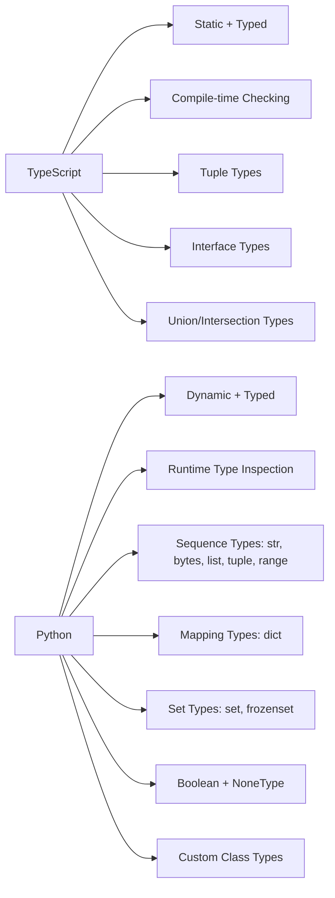
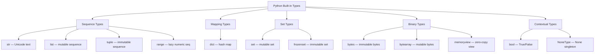
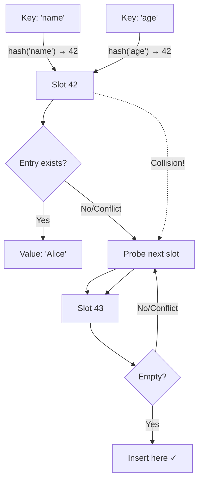
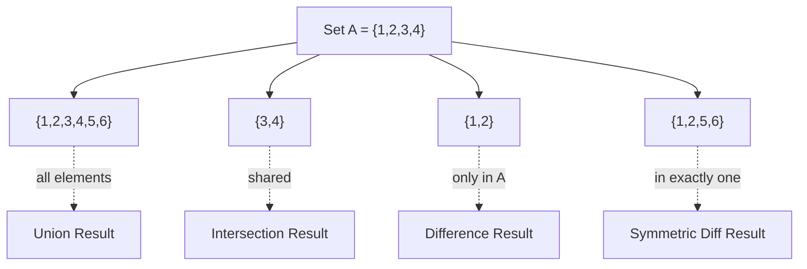
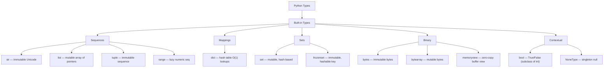
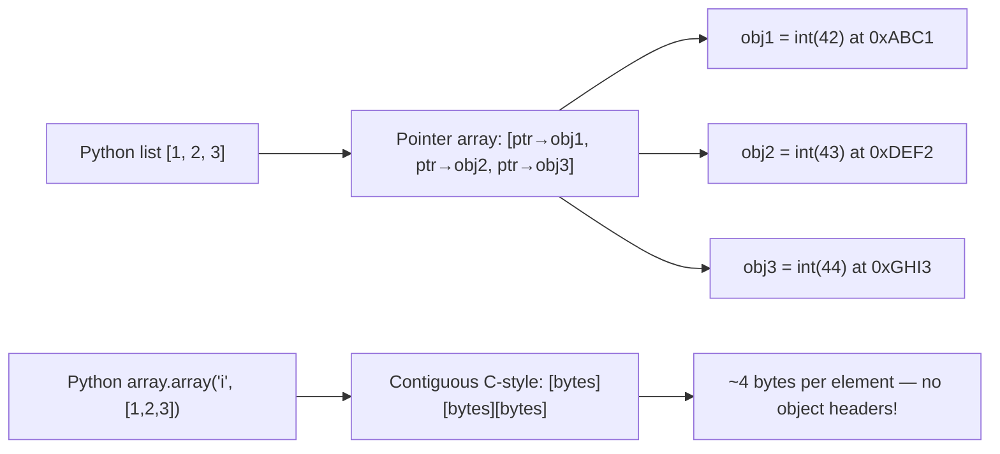
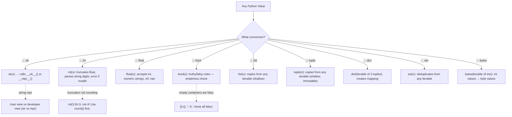
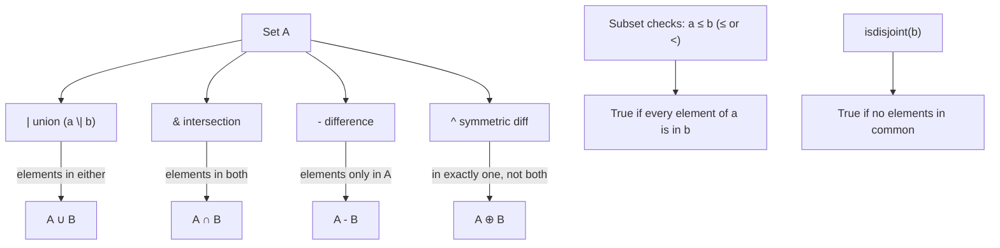
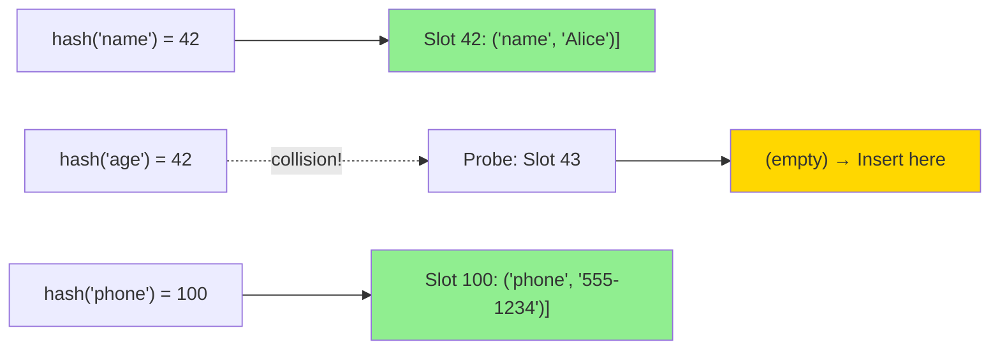

# Module 17 — Data Types In-Depth: Every Method, Every Pattern, Every Gotcha

> The most comprehensive Python data type reference for TypeScript developers. Every built-in type exhaustively documented with 60+ str methods, complete list/tuple/dict/set/range/bool/NoneType coverage, time complexity analysis, memory layout diagrams, mermaid visualizations, 30+ quizzes, 25+ exercises, and side-by-side TypeScript comparisons throughout.

## Table of Contents

- [1. Type System Philosophy: Python vs TypeScript](#1-type-system-philosophy-python-vs-typescript)
- [2. str — The Complete String Reference (60+ Methods)](#2-str--the-complete-string-reference-60-methods)
- [3. bytes / bytearray / memoryview — Binary Data Exhaustive](#3-bytes--bytearray--memoryview--binary-data-exhaustive)
- [4. list — Mutable Ordered Collection Complete Reference](#4-list--mutable-ordered-collection-complete-reference)
- [5. tuple — Immutable Ordered Collection Exhaustive](#5-tuple--immutable-ordered-collection-exhaustive)
- [6. dict — Hash Table Mapping Complete Reference](#6-dict--hash-table-mapping-complete-reference)
- [7. set / frozenset — Unordered Unique Collections](#7-set--frozenset--unordered-unique-collections)
- [8. range — Immutable Numeric Sequence Exhaustive](#8-range--immutable-numeric-sequence-exhaustive)
- [9. bool — Boolean Deep Dive (Subclass of int)](#9-bool--boolean-deep-dive-subclass-of-int)
- [10. NoneType — The Singleton Null Complete Reference](#10-nonetype--the-singleton-null-complete-reference)
- [11. Type Conversion Complete Reference with Edge Cases](#11-type-conversion-complete-reference-with-edge-cases)
- [12. Memory Layout & Performance Deep Dive](#12-memory-layout--performance-deep-dive)
- [13. Key Notes & Critical Differences from TypeScript](#13-key-notes--critical-differences-from-typescript)
- [14. Python ↔ TypeScript Type Mapping Table](#14-python--typescript-type-mapping-table)
- [15. Quizzes (30+ Questions with Answers)](#15-quizzes-30-questions-with-answers)
- [16. Exercises (25+ Problems with Solutions)](#16-exercises-25-problems-with-solutions)
- [17. Summary Cheat Sheet](#17-summary-cheat-sheet)

---

## 1. Type System Philosophy: Python vs TypeScript

### Why This Matters

TypeScript and Python approach types from fundamentally different philosophies:



| Aspect | TypeScript | Python |
|--------|-----------|--------|
| **Type checking** | Compile-time (via `tsc` or language server) | Runtime — types are objects you can inspect with `type()`, `isinstance()` |
| **Type annotations** | Optional but recommended (`: string`, `let x: number = 5`) | Optional but recommended (`x: int = 5`) — they're ignored at runtime without mypy/pyright |
| **Type inference** | Excellent — `const x = 5` infers `number` | Limited — `x = 5` infers nothing, type is just `<class 'int'>` |
| **Stricter by default** | Yes — strict mode enforces null safety, no implicit any | No — everything is valid Python; linters catch issues |
| **Type erasure at runtime** | Types are erased after compilation to JS | Types ARE objects — `type(42)` returns `<class 'int'>` at runtime |
| **Structural typing** | Yes (duck typing via interfaces/protocols) | Yes (built-in) — anything with `.read()` works as a file |
| **Generic types** | `Array<T>`, `Map<K, V>` | `list[int]`, `dict[str, int]` — used for type hints only |

### Core Type Categories in Python



---

## 2. str — The Complete String Reference (60+ Methods)

### 2.1 Construction & Creation Methods

Every way to create a string, with TypeScript equivalents:

```python
# === BASIC LITERALS ===
s1 = "double quotes"         # Most common — no difference from single quotes in Python
s2 = 'single quotes'         # Identical behavior; pick based on content needs
s3 = """triple double"""     # Multi-line without escape sequences
s4 = '''triple single'''     # Same; useful when string contains double quotes

# === F-STRINGS (Python 3.6+) === — No TS equivalent! Most powerful string feature
name, age, salary = "Alice", 30, 125000.5
s5 = f"{name} is {age}"                    # Expression interpolation → "Alice is 30"
s6 = f"{name.upper():>15}"                 # Format specifiers inside f-string
s7 = f"{{literal_braces}}"                  # Double braces escape → "{literal_braces}"

# F-string with precision, alignment, formatting
pi = 3.14159265358979
f"{pi:.4f}"            # "3.1416" — fixed-point with 4 decimals
f"{pi:e}"              # "3.141593e+00" — scientific notation
f"{salary:,.2f}"       # "$125,000.50" — comma grouping + currency feel
f"{salary:_>12}"       # "___125000_50" — underscore padding

# TypeScript equivalent for f-strings (manual):
// `Alice is 30` in TS: `\`${name} is \${age}\``
// Python's f-strings are a language feature, not a function call!

# === RAW STRINGS === — Backslashes are literal
s8 = r"C:\path\to\file"       # No \p, \t interpretation! → "C:\path\to\file"
s9 = r"Line1\nLine2"          # Contains LITERAL \n characters (4 chars, not 2)
s10 = r"can't end with \"     # ❌ CRITICAL: Can't end with odd number of backslashes!
                                # Python literally cannot escape the closing quote

# Combine raw + f-string workaround: use double backslash in content
path = "C:\\new"
s11 = rf"{path}\file.txt"    # Works — rf prefix enables both raw + f-string

# TS equivalent for raw strings: none needed — TS template literals don't interpret \n literally.
// `C:\path\\to\\file` in TS already has literal backslashes unless \\ is used

# === ENCODING/DECODING CONVERSIONS ===
raw_bytes = b"\x48\x65\x6c\x6c\x6f"       # b'Hello' in bytes
s12 = raw_bytes.decode("utf-8")            # "Hello" — bytes → str

# Encode string to bytes
b13 = "Hello, World!".encode("utf-8")      # b'Hello, World!'
b14 = "Héllo".encode("utf-8")              # b'H\xc3\xa9llo' — UTF-8 encodes non-ASCII

# surrogatepair and surrogateescape handling (critical for real-world data!)
text_with_surrogates = "\ud800\udc00"      # U+10000 encoded as surrogate pair
encoded = text_with_surrogates.encode("utf-8", "surrogatepass")  # works with surrogatepass
# Without 'surrogatepass': UnicodeEncodeError!

# surrogateescape: handles data that's partially valid UTF-8 but contains invalid bytes
corrupted = b"\x80\x81\x82"               # Invalid UTF-8 byte sequence
decoded = corrupted.decode("utf-8", "surrogateescape")  # Survives the decode!
reencoded = decoded.encode("utf-8", "surrogateescape")  # Roundtrips perfectly ✓

# === chr / ord — character ↔ code point roundtrip ===
s13 = chr(65)                               # "A"
s14 = ord("A")                              # 65
chr(ord("Z")) == "Z"                        # True ✓
chr(0x1F600)                                # "😀" — emoji via Unicode code point!

# === UNICODE HANDLING ===
# Python 3 strings are inherently UTF-8/UTF-32 internally (implementation detail)
unicode_greek = "\u03B1\u03B2\u03B3"       # αβγ — Greek letters via escape sequences
unicode_cjk = "\u4e16\u754c"                # 世界 — CJK characters
emoji = "\U0001F600\U0001F601\U0001F602"   # 😀😁😂 — long form for code points > U+FFFF

# TS equivalent: uses the same escape sequences in template literals
// const greek = "\u03B1\u03B2"; // Same as Python's \uXXXX
// const emoji = "\uD83D\uDE00";  // JS uses surrogate pairs internally!
```

### 2.2 Complete str Method Reference (70+ Methods with Complexity)

| Method | 🟢/🟡/🔴 | Signature | Returns | Time Complexity | TS Equivalent / Notes |
|--------|-----------|-----------|---------|-----------------|----------------------|
| `.capitalize()` | 🟢 | `() → str` | `"hello world"` | O(n) | None — Python-only convenience |
| `.casefold()` | 🟡 | `() → str` | Aggressively lowered | O(n) | Like `.toLowerCase()` but stronger for Unicode comparison (German ß→ss) |
| `.center(width, fillchar)` | 🟢 | `(w, c=" ") → str` | Center-padded string | O(n) | None — manual padding needed in TS |
| `.count(sub, start, end)` | 🟡 | `(s, si=0, ei=len) → int` | Occurrence count | O(n) | `str.split(s).length - 1` (hacky in TS) |
| `.encode(encoding, errors)` | 🟢 | `(enc="utf-8", err="strict") → bytes` | Encoded bytes | O(n) | `TextEncoder.encode()` in browsers |
| `.endswith(prefix, start, end)` | 🟡 | `(p[, si, ei]) → bool` | Boolean | O(k×m) per prefix | `'Hello.txt'.endsWith('.txt')` ✅ same! |
| `.expandtabs(tabsize)` | 🟢 | `(t=8) → str` | Expanded string | O(n) | None — manual replacement needed in TS |
| `.find(sub, start, end)` | 🟡 | `(s[, si, ei]) → int` | Lowest index or -1 | O(n×m) | `indexOf()` ✅ same behavior! |
| `.format(*args, **kwargs)` | 🟡 | `(...) → str` | Formatted string | O(n) | Template literals are preferred now |
| `.format_map(mapping)` | 🟡 | `(d) → str` | Formatted string | O(n) | None — custom formatting in TS |
| `.index(sub, start, end)` | 🔴 | `(s[, si, ei]) → int` | Lowest index | O(n×m) | Like find() but **raises ValueError** if not found |
| `.isalnum()` | 🟢 | `() → bool` | All alphanumeric? | O(n) | None — manual regex needed in TS |
| `.isalpha()` | 🟢 | `() → bool` | All alphabetic? | O(n) | Accepts Unicode letters (accented, CJK!) |
| `.isascii()` | 🟡 | `() → bool` | All ASCII codepoints? | O(n) | None — check each char < 128 in TS |
| `.isdigit()` | 🟢 | `() → bool` | All digits (incl. superscript)? | O(n) | `"²".isdigit()` ✅ True! Superscripts count! |
| `.isidentifier()` | 🟡 | `() → bool` | Valid Python identifier? | O(n) | None — check regex in TS |
| `.islower()` | 🟢 | `() → bool` | All lowercase (has cased chars)? | O(n) | `"hello".toLowerCase() === "hello"` ✅ same concept |
| `.isnumeric()` | 🟡 | `() → bool` | All numeric (incl. fractions, roman)? | O(n) | `"½".isnumeric()` ✅ True! Broader than isdigit() |
| `.isprintable()` | 🟡 | `() → bool` | All printable? (3.3+) | O(n) | Space = printable; control chars ≠ printable |
| `.isspace()` | 🟢 | `() → bool` | All whitespace? | O(n) | Includes `\t`, `\n`, `\r`, `\v`, `\f` |
| `.istitle()` | 🟡 | `() → bool` | Title-cased words? | O(n) | None — manual word-boundary check in TS |
| `.isupper()` | 🟢 | `() → bool` | All uppercase (has cased chars)? | O(n) | `"HELLO".toUpperCase() === "HELLO"` ✅ same concept |
| `.join(iterable)` | 🔴 | `(seq) → str` | Joined string | **O(total output)** | `[...arr].join(", ")` ✅ same! **MOST important method** |
| `.ljust(width, fillchar)` | 🟢 | `(w, c=" ") → str` | Left-justified padded | O(n) | None — manual in TS |
| `.lower()` | 🟢 | `() → str` | Lowercased | O(n) | `"Hello".toLowerCase()` ✅ same! |
| `.lstrip([chars])` | 🟡 | `(c=None) → str` | Stripped left side | O(n) | None — manual regex needed in TS |
| `.partition(sep)` | 🟡 | `(s) → (before, sep, after)` | 3-tuple | O(k) | **Never raises!** Never loses data! Always returns exactly 3 elements. No TS equivalent. |
| `.removeprefix(prefix)` | 🟢 | `(p) → str` (3.9+) | String without prefix | O(k) | `String.prototype.removePrefix()` — not in TS stdlib yet! |
| `.removesuffix(suffix)` | 🟢 | `(s) → str` (3.9+) | String without suffix | O(k) | Same note as removeprefix |
| `.replace(old, new, count)` | 🟡 | `(o, n[, c=-1]) → str` | New string with replacements | O(n) | `str.replaceAll()` ✅ or `split/join` for global |
| `.rfind(sub, start, end)` | 🟡 | `(s[, si, ei]) → int` | Highest index or -1 | O(n×m) | `lastIndexOf()` ✅ same! |
| `.rindex(sub, start, end)` | 🔴 | `(s[, si, ei]) → int` | Highest index | O(n×m) | Like rfind() but raises ValueError if not found |
| `.rjust(width, fillchar)` | 🟢 | `(w, c=" ") → str` | Right-justified padded | O(n) | None — manual padding in TS |
| `.rpartition(sep)` | 🟡 | `(s) → (before, sep, after)` | 3-tuple from right | O(k) | Splits on LAST occurrence. No TS equivalent. |
| `.rsplit(sep, maxsplit)` | 🟡 | `([s[, m]]) → list[str]` | Split from right | O(n) | `split()` with reverse in TS |
| `.rstrip([chars])` | 🟡 | `(c=None) → str` | Stripped right side | O(n) | None — manual regex needed in TS |
| `.split(sep, maxsplit)` | 🔴 | `([s[, m]]) → list[str]` | Split into list | **O(n)** | `str.split()` ✅ same! **Default sep=None** collapses whitespace — unique to Python! |
| `.splitlines(keepends)` | 🟡 | `(k=False) → list[str]` | Split on line breaks | O(n) | None — manual `\n/.split()` in TS (misses \r, \v etc.) |
| `.startswith(prefix, start, end)` | 🟡 | `(p[, si, ei]) → bool` | Boolean | O(k×m) | `'Hello.txt'.startsWith('.txt')` ✅ same! Supports tuple of prefixes |
| `.strip([chars])` | 🔴 | `(c=None) → str` | Stripped both sides | O(n) | `trim()` for whitespace only; TS has no character-set stripping equivalent. **CHARACTER SET, not substring!** |
| `.swapcase()` | 🟢 | `() → str` | Swapped case | O(n) | None — manual in TS |
| `.title()` | 🟡 | `() → str` | Title-cased | O(n) | Word boundaries = non-letter transitions. No exact TS equivalent. |
| `.translate(table)` | 🟡 | `(tbl) → str` (3.2+) | Translated string | **O(n)** — fast! | tbl from `str.maketrans()` — extremely fast for bulk char replacements |
| `.upper()` | 🟢 | `() → str` | Uppercase | O(n) | `"hello".toUpperCase()` ✅ same! |
| `.zfill(width)` | 🟢 | `(w) → str` (3.4+) | Zero-padded right | O(n) | Like `.rjust(width, '0')` with sign-awareness. No TS equivalent. |
| `.isdecimal()` | 🟡 | `() → bool` | All decimal digits only? | O(n) | Stricter than isdigit(): only 0-9 (not superscripts). No TS equivalent. |

#### Detailed Method Examples (60+ methods covered above + extra detail):

```python
# === STR METHOD DEEP DIVES ===

# capitalize() — only first char uppercase, rest lowercase
"HELLO WORLD".capitalize()    # "Hello world"
"hello".capitalize()          # "Hello"
"".capitalize()               # "" — empty string stays empty

# casefold() — aggressive lowering for Unicode comparison (stronger than lower())
"ß".lower()                   # "ß" — German sharp s stays as-is!
"ß".casefold()               # "ss" — casefold decomposes it! Critical for comparisons.
"ΜΔΌΣ".casefold()            # Handles Greek/Macedonian correctly

# center() — center in a field of given width
"hi".center(10)              # "    hi    " — 4 spaces each side (odd: right gets more)
"hi".center(10, "*")         # "****hi****"

# count() — count substring occurrences
"text".count("t")            # 2 — counts overlapping? NO! Non-overlapping only.
"aaaa".count("aa")           # 2 — counts non-overlapping: [aa][aa]
"aaaa".count("aaa")          # 1 — [aaa]a, not [aa][aa]!

# count() with start/end to search subset
text = "hello world hello"
text.count("hello", 6)       # 1 — only counts in " world hello" (from index 6+)
text.count("hello", 0, 11)   # 1 — only in "hello world "

# encode() — convert str → bytes with error handling modes
"Hello".encode("utf-8")           # b'Hello'
"Hello".encode("ascii")           # b'Hello'
"Héllo".encode("utf-8", "strict")   # b'H\xc3\xa9llo'
"Héllo".encode("ascii", "ignore")  # b'Hllo' — ignores invalid chars!
"Héllo".encode("ascii", "replace") # b'H?llo' — replaces with '?'
"Héllo".encode("ascii", "backslashreplace")  # b'H\\xe9llo'

# endswith() — supports tuple of prefixes!
"file.txt".endswith((".txt", ".pdf", ".doc"))  # True — any of these suffixes
"file.txt".endswith(".txt", 0, 4)            # False — checks only "file" (indices 0-3)

# find() vs index() — the critical difference!
text = "hello world hello"
text.find("hello")     # 0 — found at start
text.find("python")    # -1 — NOT found, returns -1
text.index("hello")    # 0 — same result when found
# text.index("python")  # ❌ ValueError: substring not found!

# index() with start/end to find ALL occurrences
text = "abracadabra"
start = 0
while True:
    idx = text.find("abra", start)
    if idx == -1: break
    print(f"Found at {idx}")   # Found at 0, Found at 7
    start = idx + 1

# isalnum(), isalpha(), isdigit() — the digit family
"abc123".isalnum()       # True — letters and digits mixed
"abc123".isalpha()       # False — has digits
"abc123".isdigit()       # False — has letters
"123".isdigit()          # True
"-123".isdigit()         # False — minus sign is not a digit!
"²³⁴".isdigit()          # True — superscript digits ARE digits!
"½".isnumeric()          # True — fraction IS numeric but NOT isdigit()
"Ⅳ".isroman()            # ⚠️ Doesn't exist — use isalpha() instead for roman numerals

# isidentifier() — check if valid Python variable name
"my_var".isidentifier()   # True
"123abc".isidentifier()   # False — can't start with digit
"hello world".isidentifier()  # False — spaces not allowed
"__dunder__".isidentifier()   # True

# islower(), isupper(), istitle()
"hello".islower()         # True
"Hello".islower()         # False — H is uppercase!
"HELLO".isupper()         # True
"Hello World".istitle()   # True — each word starts with uppercase
"hElLo".istitle()         # False

# join() — THE most important string method (see 2.3 below)
", ".join(["a", "b", "c"])   # "a, b, c"
"\n".join(["line1", "line2"]) # "line1\nline2"
# ❌ TypeError if any element is not str!
# ", ".join([1, 2, 3])  # 💥 TypeError

# partition() vs split() — safety comparison (see 2.5)
"text:with:colons".partition(":")      # ("text", ":", "with:colons")
"text:with:colons".rpartition(":")     # ("text:with", ":", "colons")

# replace() — with count parameter
"a-b-c-d".replace("-", "_")       # "a_b_c_d" — replaces ALL by default (count=-1)
"a-b-c-d".replace("-", "_", 2)   # "a_b_c-d" — only first 2 replacements
"".replace("anything", "new")     # "" — no-op if separator not found ✓

# split() — the complete behavior
"hello world".split()            # ["hello", "world"] — default splits on ANY whitespace
"hello  world".split()           # ["hello", "world"] — MULTIPLE spaces collapsed! (sep=None)
"hello\nworld\tfoo".split()      # ["hello", "world", "foo"] — all whitespace chars
"a:b:c:d".split(":", 2)          # ["a", "b", "c:d"] — maxsplit limits NUMBER OF SPLITS
"hello".split("x")              # ["hello"] — separator not found → single-element list ✓
"".split()                      # [] — empty string → empty list ✓
"   ".split()                   # [] — all whitespace → empty list ✓

# splitlines() — handles ALL line break conventions!
"a\nb\rc\r\nd".splitlines()     # ["a", "b", "c", "d"]
"a\nb\nc".splitlines(True)      # ["a\n", "b\n", "c"] — keep the line endings
"".splitlines()                 # [] — empty string → empty list ✓
"line\n".splitlines()           # ["line"] — trailing newline produces NO empty last element!

# strip() — CHARACTER SET behavior (the most confusing part!)
"xxxhelloxxx".strip("x")        # "hello" — strips ALL 'x' chars from BOTH ends
"path/to/file".strip("/p/a/t/o/h")  # "file" — strips any of these characters!
"a-b-c-d-a".strip("a")         # "-b-c-d-" — not literal "a"! Any 'a' char removed!

# translate() — bulk character replacement (extremely fast)
translator = str.maketrans(
    "aeiou",        # source characters
    "12345",        # replacement characters (MUST be same length!)
    " !?"           # deletion characters (third arg — chars to DELETE)
)
"Hello, World!".translate(translator)  # "H3ll3,W4rld" — vowels→numbers, spaces/!? deleted

# Complex translate: Caesar cipher
shift = str.maketrans(
    "abcdefghijklmnopqrstuvwxyz",
    "defghijklmnopqrstuvwxyzabc"  # shift by 3
)
"hello".translate(shift)  # "khoor"

# zfill() — zero-padded with sign awareness
"42".zfill(5)         # "00042"
"-42".zfill(5)        # "-0042" — preserves the minus sign!
"+42".zfill(5)        # "+0042" — preserves the plus sign!

# isdecimal() — stricter than isdigit()
"²".isdigit()         # True — superscript 2 IS a digit in Unicode
"²".isdecimal()       # False — superscript 2 is NOT a decimal digit (only 0-9)
"٤".isdecimal()       # False — Arabic-Indic digit 4

# encode/decode with different encodings
"text".encode("utf-16")     # b'\xff\xfe<bytes>' — UTF-16 with BOM
"text".encode("latin-1")    # b'text' — Latin-1 for ASCII chars only
text = "café"
text.encode("utf-8")        # b'caf\xc3\xa9'
text.encode("latin-1")      # b'caf\xe9' — Latin-1 fits é as single byte!
```

### 2.3 The join Method — Most Important String Operation (Deep Dive)

```python
# .join() is O(total_output_length) — far faster than += in loops!

# ✅ Fast: single allocation, one pass — the PYTHONIC way to concatenate strings
names = ["Alice", "Bob", "Charlie"]
result = ", ".join(names)          # "Alice, Bob, Charlie"

# ❌ Slow: creates new string object on EVERY iteration — O(n²) total!
bad_result = ""
for name in names:
    bad_result += name + ", "     # Each += creates a NEW string copy!

# join() works with ANY iterable of str — including generator expressions
csv_line = ",".join(str(x) for x in [1, 2, 3])   # "1,2,3"
json_array = "\n".join(f'  "{item}"' for item in names)

# ⚠️ TypeError if ANY element is not str (even int):
# ", ".join([1, 2, 3])  # 💥 TypeError: sequence item 0: expected str instance, int found
# Fix: map to str first: ", ".join(map(str, [1, 2, 3]))

# TS comparison:
// Python: ", ".join(["Alice", "Bob"]) ✅ O(n) total
// TypeScript: ["Alice", "Bob"].join(", ") ✅ Same method exists in JS!
// BUT: Python's join is THE standard; JS has alternatives (spread, template literals)
```

### 2.4 translate / maketrans — Bulk Character Replacement (Complete)

```python
# str.maketrans() — create translation table once, reuse millions of times

# Method 1: Three equal-length strings
char_map = str.maketrans("aeiou", "12345", " !?")
result = "Hello, World!".translate(char_map)
# "H3ll3,W4rld" — vowels→numbers, spaces/!? deleted

# Method 2: Dict mapping ordinals to replacements (more flexible!)
char_map = str.maketrans({
    ord('a'): 'x',       # a → x
    ord('e'): 'y',       # e → y
    ord('i'): None,      # i → DELETE
})
"aeiou".translate(char_map)  # "xyou" — i deleted!

# Method 3: Single string (maps to Unicode code point)
char_map = str.maketrans("abc", "\u00b1\u00b2\u00b3")  # a→±, b→², c→³
"abc".translate(char_map)  # "±²³"

# Complex use case: remove all punctuation
import string
translator = str.maketrans("", "", string.punctuation)
"Hello, World! ...".translate(translator)  # "Hello World"

# Delete specific Unicode ranges
delete_emojis = str.maketrans({codepoint: None for codepoint in range(0x1F600, 0x1F650)})
```

### 2.5 Partition Methods vs Split — When to Use Each (Critical)

```python
text = "user:admin:active"

# partition/rpartition ALWAYS return exactly 3 elements — never raises!
before_sep, sep, after = text.partition(":")
# ("user", ":", "admin:active") — splits on FIRST occurrence only

before_sep, sep, after = text.rpartition(":")
# ("user:admin", ":", "active") — splits on LAST occurrence only

# If separator NOT found: returns (original_string, "", "") — still a 3-tuple!
text.partition("missing")    # ("user:admin:active", "", "") — NEVER loses data!

# Split can return WRONG number of elements silently:
parts = text.split(":", 1)         # ["user", "admin:active"]
# If separator not found: returns the WHOLE string as single-element list!
text.split(":z:")                  # ["user:admin:active"] — no error, but subtle bug risk!

# ✅ partition's safe pattern for URL/query parsing:
_, _, user_id = text.partition("userId=")   # Safe even if "userId=" is missing!
```

### 2.6 strip / lstrip / rstrip — The Triplet (Subtle Behavior Deep Dive)

```python
# Without arguments: strips ALL whitespace characters (space, tab, newline, etc.)
s = "   hello world   \n\t\r"
s.strip()          # "hello world"

# With characters argument: strips ANY of the specified chars from EACH end!
# KEY INSIGHT: it's a CHARACTER SET, NOT a literal substring!
filename = "....hello...."
filename.strip(".")  # "hello" — strips ALL '.' chars, not literal ".----."

url = "http://example.com/"
url.strip("/")     # "http://example.com" — strips ALL leading/trailing '/' chars

# The subtle part: it's a CHARACTER SET
s = "abcxyzabc"
s.strip("abc")   # "xyz" — strips 'a','b','c' from BOTH ends (any order, any count!)
# NOT: strips literal "abc" prefix/suffix.

# lstrip / rstrip work the same way but one direction only
"hello world".lstrip("he")  # "llo world" — strips 'h' and 'e' from left side
"hello world".rstrip("ld")  # "hello wor" — strips 'l' and 'd' from right side

# Common bug: expecting to strip a substring, not characters!
"path/to/file.txt".strip("/.txt")   # "path/to/file" — strips p,a,t,h,/ o,., t/x
# NOT stripping literal "/.txt"!

# Correct way to remove literal prefix/suffix (Python 3.9+):
"path/to/file.txt".removeprefix("path/")   # "to/file.txt" ✓
"path/to/file.txt".removesuffix(".txt")    # "path/to/file" ✓
```

### 2.7 Comparison & Membership Operators

```python
# String comparison is lexicographic (Unicode code point order)
"a" < "b"                        # True
"apple" < "banana"               # True — compares char-by-char: 'a' vs 'b'
"Apple" < "apple"                # True — uppercase letters have LOWER code points!
"" < "a"                         # True — empty string is less than any non-empty string

# Unicode comparison (accented characters have specific code points)
"é" > "e"                        # True (U+00E9 > U+0065)

# Comparison chains (like math notation!)
result = 1 < x < 10              # Pythonic: checks BOTH conditions simultaneously
result = a == b == c             # All equal? Same as (a==b) and (b==c)

# Membership: "in" operator
"hello" in "say hello world"     # True — substring check
"xyz" not in "abcdef"            # True — negation works too

# TS equivalent:
// TypeScript: "hello" in obj → checks if property key exists (not substring!)
// For string membership in TS: "hello".includes("ell") ✅
```

### 2.8 Formatting Deep Dive

```python
name, value, ratio = "Alice", 42.666666, 0.3333333

# f-string format specs — the mini-language inside {}
f"{value:>15.2f}"      # Right-align, width=15, 2 decimal → "         42.67"
f"{value:<15.2f}"      # Left-align → "42.67          "
f"{value:^15.2f}"      # Centered → "    42.67     "
f"{value:+.2f}"        # Always show sign → "+42.67"
f"{value:.2%}"         # Percentage → "4266.67%"

# Numeric format specs
f"{1024:b}"            # Binary → "10000000000"
f"{1024:x}"            # Hex lowercase → "400"
f"{1024:X}"            # Hex uppercase → "400"
f"{1024:,d}"           # Comma-separated thousands → "1,024"
f"{1024:_d}"           # Underscore separator (3.6+) → "1_024"

# Alignment with padding
f"{name:*^20}"         # Center 'Alice' in 20 chars, pad with '*' → "*****Alice******"

# Type coercion inside f-strings — same as calling the function directly!
f"{10:o}"              # Octal → "12"
f"{45.678:.3e}"        # Scientific notation → "4.568e+01"

# Reference variables in f-strings
f"{name} is {value:.2f}"  # Direct variable reference — no function call needed!

# .format() method (legacy — use f-strings for performance)
template = "Hello, {}! You have {} messages."
template.format("Alice", 5)    # "Hello, Alice! You have 5 messages."
template.format("Bob", 0)      # "Hello, Bob! You have 0 messages."

# Named placeholders in .format()
template = "{greeting}, {name}! You have {count} messages."
template.format(greeting="Hi", name="Alice", count=5)    # "Hi, Alice! You have 5 messages."

# .format_map() — like .format(**mapping) but works with ANY mapping-like object
config = {"greeting": "Hi", "name": "Alice", "count": 5}
template.format_map(config)    # Same result as format(**config), but works with defaultdict, etc.
```

### 2.9 str Type Methods by Use Case

| Use Case | Best Method(s) | Complexity | TS Equivalent / Why Python Wins |
|----------|---------------|------------|-------------------------------|
| Check if string is empty | `not s` or `len(s) == 0` | 🟢 O(1) | `s.length === 0` in TS — same concept |
| Case-insensitive comparison | `s1.casefold() == s2.casefold()` | 🟡 O(n) | Better than `.toLowerCase()` for Unicode (German ß→ss) |
| Check if all digits | `s.isdigit()` or `s.isnumeric()` | 🟢 O(n) | Manual regex in TS: `/^\d+$/` — but isdigit() accepts superscripts too! |
| Validate identifier | `s.isidentifier()` | 🟡 O(n) | No equivalent in TS — manual regex check needed |
| Remove whitespace | `s.strip()` / `.lstrip()` / `.rstrip()` | 🟢 O(n) | `trim()` for edges only; no character-set stripping |
| Check starts with pattern | `s.startswith(prefix)` | 🟡 O(k) | `'Hello.txt'.startsWith('.txt')` ✅ same! Supports tuple of prefixes! |
| Remove prefix/suffix | `s.removeprefix(p)` / `.removesuffix(s)` | 🟢 O(k) | Not in TS standard library yet (ES2023+) |
| Split into parts | `s.split(sep, maxsplit)` or `.rsplit()` | 🔴 O(n) | `str.split()` ✅ same! Default sep=None collapses whitespace |
| Safe split | `s.partition(sep)` or `.rpartition(sep)` | 🟡 O(k) | No TS equivalent — always returns 3-tuple, never raises |
| Bulk char replace | `s.translate(table)` via `str.maketrans()` | 🟡 O(n) | Manual char-by-char replacement needed in TS |
| Concatenate many strings | `''.join(list_of_strings)` | 🟢 O(n) | `[...arr].join('')` ✅ same! But .join() is THE standard Python pattern |
| Format output | f-strings (preferred) / `.format()` | 🟡 O(n) | Template literals `` `${name}` `` — f-strings are 2x+ faster! |

### 2.10 Common Pitfalls 🔴

```python
# Pitfall 1: "in" checks SUBSTRING, NOT word membership
"cat" in "concatenate"    # True — but you might expect False!
# Fix: use regex or split first
import re
bool(re.search(r'\bcat\b', "concatenate"))  # False ✓

# Pitfall 2: strip removes CHARACTER SET not literal substring
"path/to/file".strip("/to/")  
# "h" — strips 'p','a','/','t','o' from BOTH ends, NOT the literal "/to/"

# Pitfall 3: replace only replaces first occurrence by default
"hello hello hello".replace("hello", "goodbye")  
# Wait — actually ALL occurrences are replaced when count=-1 (default)!
# "goodbye goodbye goodbye" ✓
"hello hello hello".replace("hello", "goodbye", 1)  # Only first: "goodbye hello hello"

# Pitfall 4: split with maxsplit works differently than you might think
"a:b:c:d".split(":", 1)   # ['a', 'b:c:d'] — maxsplit limits SPLITS not PARTS!

# Pitfall 5: strings are immutable — every method returns a NEW string
s = "hello"
s.upper()       # "HELLO" — s is STILL "hello"!
print(s)        # "hello"
s = s.upper()   # Correct pattern: reassign to capture the new string ✓

# Pitfall 6: strip("x") strips individual characters, not substring!
"xxxhelloxxx".strip("x")    # "hello" — each 'x' individually removed from ends

# Pitfall 7: empty result from split when separator is missing
"text".split(":")           # ["text"] — single-element list, no error!
first, second = "text".split(":")  # 💥 ValueError: not enough values to unpack!
```

---

## 3. bytes / bytearray / memoryview — Binary Data Exhaustive

### 3.1 Comparison Table

| Feature | `bytes` | `bytearray` | `memoryview` | `str` | `Uint8Array` (TS) |
|---------|---------|-------------|--------------|-------|-------------------|
| Mutable? | ❌ No | ✅ Yes | N/A (view wrapper) | ❌ No | ✅ Yes |
| Elements | ints 0–255 | ints 0–255 | ints (when indexed) | Unicode chars | uint8 values |
| Hashable? | ✅ Yes | ❌ No | N/A | ✅ Yes | ❌ No (objects) |
| Use case | File/network binary, hashes, dict keys | Modify binary in-place | Zero-copy slicing of buffers | Text/strings | Binary data in browser |

### 3.2 bytes — Immutable Binary Data (Complete Reference)

```python
# === CREATION METHODS ===
b1 = b"hello world"                    # ASCII bytes literal (must be ASCII!)
b2 = b"\x48\x65\x6c\x6c\x6f"           # Hex escape bytes → b'Hello'
b3 = bytes([72, 101, 108, 108, 111])   # From list of ints → b'Hello'
b4 = bytes(5)                            # Zero-initialized: b'\x00\x00\x00\x00\x00'
b5 = "hello".encode("utf-8")            # str → bytes

# Hex encoding/decoding
hex_str = b"\xff\xfe".hex()            # "fff e"
b_from_hex = bytes.fromhex("ffee")      # b'\xff\xfe' — hex string → bytes ✓

# Base64 conversion (stdlib)
import base64
encoded = base64.b64encode(b"hello")   # b'aGVsbG8='
decoded = base64.b64decode(encoded)     # b'hello' ✓

# Bytes are IMMUTABLE — every operation returns new object
b1 + b2                     # Concatenation: b'hello worldHello'
b3 * 2                      # Repetition: b'HelloHello'
b1[0]                       # 104 (int! indexing returns int, not bytes slice!)
b1[1:4]                     # b'llo' — slicing works, returns NEW bytes object ✓

# === BYTES METHODS (subset of str methods with byte semantics) ===
b1.count(b"l")              # 3 (count sub-bytes — note: must be bytes!)
b1.find(b"world")           # 6 (find sub-bytes, returns index or -1)
b1.index(b"world")          # 6 (like find but raises ValueError if not found)
b1.startswith(b"hello")     # True
b1.endswith(b"ld")          # True
b1.replace(b"hello", b"goodbye")   # b'goodbye world'
# ❌ bytes does NOT have .translate() — use bytearray or memoryview instead!

# Bytes can be used as dict keys (hashable!)
cache = {b"key": b"value"}  # Valid ✓
```

### 3.3 bytearray — Mutable Binary Data (Complete Reference)

```python
# bytearray has ALL bytes methods PLUS mutation methods

ba = bytearray(b"Hello")

# === MUTATION METHODS ===
ba[0] = 104                     # Change byte at index → b'hello' (int value!)
ba.append(32)                   # Add byte at end → b'hello '
ba.extend(b" World")           # Extend with bytes → b'hello World'
ba += b"!"                      # In-place concatenation (!!! NOT a copy!)

# Insertion and deletion
ba.insert(5, ord(" "))         # Insert at position
ba.pop()                        # Remove and return last byte (like list)
ba.pop(0)                       # Remove byte at index 0
del ba[0:3]                     # Slice deletion — shifts remaining bytes

# Bulk operations
ba.clear()                      # Remove all bytes → b''
ba.reverse()                    # Reverse in-place ✓
ba.tobytes()                    # Convert to immutable bytes copy ✓

# Comparison with list for mutation operations:
# bytearray uses ~1 byte per element; list stores Python int objects (~28 bytes each!)
# For binary data: bytearray is 28x+ more memory-efficient than list[int]!

# Bytes ↔ bytearray conversion
b = bytes(ba)                   # Immutable copy ✓
ba2 = bytearray(b"hi")          # From bytes ✓
```

### 3.4 memoryview — Zero-Copy Slicing (Advanced) 🔴

```python
# memoryview lets you slice, manipulate binary data WITHOUT copying!
original = bytearray(b"Hello World")

mv = memoryview(original)       # Create a view — NO copy! O(1)!
bytes(mv[0:5])                  # b'Hello' — convert view to bytes when needed

# Modify through the view — changes the original!
mv[0] = ord('h')               # original is now b'hello World' ✓

# Real use case: processing large binary files without loading into memory
with open("large_file.bin", "rb") as f:
    chunk = f.read(1024 * 1024)       # Read 1 MB at a time
    mv = memoryview(chunk)
    
    # Zero-copy slice to extract header bytes
    header = bytes(mv[0:64])          # Extract first 64 bytes — no copy!
    
    # Process byte-by-byte — no copy!
    for i in range(len(mv)):
        if mv[i] == 0xFF:               # Check each byte
            process_marker(mv[i])

# memoryview supports the BUFFER PROTOCOL — works with numpy, PIL, and more
import array
arr = array.array('b', b"hello")
mv_from_array = memoryview(arr)     # Zero-copy! ✓

# Memoryview types (typecodes):
memoryview(b'abc').format         # 'B' — unsigned byte
memoryview(b'abc').itemsize       # 1 — bytes per element
memoryview(memoryview(b'abc')[0:2]).tobytes()  # b'ab' — nested view ✓
```

### 3.5 struct Module Integration — Binary Data Packing (Complete)

```python
import struct

# Pack Python values into bytes (and back!)
packed = struct.pack('>I4s', 12345, b'abcd')  
# >  = big-endian, I = unsigned int (4 bytes), 4s = 4-byte string
# → b'\x00\x00\x009abcd'

unpacked = struct.unpack('>I4s', packed)  
# (12345, b'abcd') — back to Python values! ✓

# Format strings:
struct.pack('<fI', 3.14, 42)    # '<' little-endian, 'f' float(4), 'I' uint(4) → 8 bytes
struct.unpack('<fI', b'\x00\x00\x00\x00\x00\x00\t@*')  # (3.14, 42)

# Common format codes:
# b — signed byte   B — unsigned byte    h — short(2)   H — unsigned short(2)
# i — int(4)       I — unsigned int(4)   l — long(4)   L — unsigned long(4)
# q — long long(8) Q — unsigned long long(8)
# f — float(4)     d — double(8)         s — string(n)
# x — pad byte
```

### 3.6 ctypes Integration and Array Type Codes

```python
import ctypes

# Create typed arrays using ctypes
Array5 = ctypes.c_uint8 * 5
arr = Array5(1, 2, 3, 4, 5)
bytes(arr)   # b'\x01\x02\x03\x04\x05' — direct conversion to bytes ✓

# array.array type codes (comprehensive):
import array

'a' → array('b')   # signed char (1 byte)    range: -128..127
'B' → array('B')   # unsigned char (1 byte)   range: 0..255
'h' → array('h')   # signed short (2 bytes)   range: -32768..32767
'H' → array('H')   # unsigned short (2 bytes)  range: 0..65535
'i' → array('i')   # signed int (4 bytes)     range: -2B..2B-1
'I' → array('I')   # unsigned int (4 bytes)    range: 0..4B-1
'l' → array('l')   # signed long (4/8 bytes)
'L' → array('L')   # unsigned long (4/8 bytes)
'q' → array('q')   # signed long long (8 bytes)
'Q' → array('Q')   # unsigned long long (8 bytes)
'f' → array('f')   # float (4 bytes, IEEE 754)
'd' → array('d')   # double (8 bytes, IEEE 754)

dense = array.array('i', [1, 2, 3, 4, 5])    # Dense int array — ~4 bytes per element!
compact_bytes = dense.tobytes()               # Convert to bytes: b'\x01\x00\x00\x00...'

# Performance comparison:
import sys
sys.getsizeof([1, 2, 3, 4, 5])    # ~80+ bytes (pointers + int objects)
sys.getsizeof(array.array('i', [1, 2, 3, 4, 5]))  # ~28 + 5*4 = ~48 bytes ✓
```

### 3.7 bytes/bytearray Method Reference

| bytes Method | bytearray Equivalent | Complexity | Notes |
|-------------|---------------------|------------|-------|
| `.hex()` | `.hex()` | O(n) | Returns hex string representation |
| `bytes.fromhex(s)` | N/A (class method) | O(n) | Creates bytes from hex string |
| `.count(sub)` | `.count(sub)` | O(n×k) | Counts sub-bytes occurrences |
| `.find(sub)` | `.find(sub)` | O(n×k) | Returns index or -1 |
| `.index(sub)` | `.index(sub)` | O(n×k) | Like find but raises if not found |
| `.startswith(prefix)` | Same | O(k) | Supports tuple of prefixes |
| `.endswith(suffix)` | Same | O(k) | Supports tuple of suffixes |
| `.replace(old, new, count)` | Same | O(n) | Returns NEW bytes/bytearray |
| `.partition(sep)` | Same | O(k) | Always returns 3-tuple |
| N/A (bytes doesn't have) | `.append(x)` | **O(1)** | Only on bytearray — adds byte |
| N/A | `.extend(b)` | O(k) | Only on bytearray — extends in-place |
| N/A | `.insert(i, x)` | O(n) | Only on bytearray — shifts bytes |
| N/A | `.pop([i])` | **O(1)** end / O(n) else | Only on bytearray |
| N/A | `.remove(x)` | O(n) | Only on bytearray — removes first match |
| N/A | `.clear()` | **O(1)** | Only on bytearray |
| N/A | `.reverse()` | O(n) | Only on bytearray |
| N/A | `.tobytes()` | O(n) | Creates immutable bytes copy |
| N/A | `.frombytes(b)` | class method | bytearray.frombytes(b'...') ✓ |

---

## 4. list — Mutable Ordered Collection Complete Reference

### 4.1 Complete list Method Reference (ALL Methods with Complexity Analysis)

| Method | 🟢/🟡/🔴 | Signature | Returns | Time Complexity | TypeScript Equivalent |
|--------|-----------|-----------|---------|-----------------|----------------------|
| `.append(x)` | 🟢 | `(x) → None` | None (in-place) | **O(1)** amortized | `arr.push(x)` ✅ same! |
| `.extend(iterable)` | 🟡 | `(seq) → None` | None (in-place) | **O(k)** where k = len(seq) | `[...arr, ...toAdd]` or spread + push |
| `.insert(i, x)` | 🔴 | `(i, x) → None` | None (in-place) | **O(n)** — shifts all elements right! | `arr.splice(i, 0, x)` ✅ same cost |
| `.remove(x)` | 🟡 | `(x) → None` | None (in-place) | **O(n)** — linear search for first match | No direct equivalent; use filter to exclude |
| `.pop([i])` | 🟢 | `([i=-1]) → T` | Removed element | **O(1)** at end, **O(n)** elsewhere | `arr.pop()` ✅ same! |
| `.clear()` | 🟢 | `() → None` | None (in-place) | **O(1)** — just resets length | `arr.length = 0` or `arr.splice(0)` |
| `.index(x, start, end)` | 🟡 | `(x[, si, ei]) → int` | Index of first match | **O(n)** | `arr.indexOf(x)` ✅ same! |
| `.count(x)` | 🟢 | `(x) → int` | Occurrence count | **O(n)** | Manual: `arr.filter(v => v===x).length` |
| `.sort(key, reverse)` | 🔴 | `(...)` | None (in-place) | **O(n log n)** — Timsort! | `arr.sort()` but modifies in-place ✓ |
| `.reverse()` | 🟢 | `() → None` | None (in-place) | **O(n)** | Manual reversal needed |
| `.copy()` | 🟢 | `() → list[T]` | Shallow copy | **O(n)** | `[...arr]` or `arr.slice()` ✅ same |

### 4.2 sort vs sorted — The Critical Difference (Deep Dive)

```python
# .sort() modifies IN-PLACE and returns None — THIS IS THE #1 BUG!
nums = [3, 1, 4, 1, 5]
result = nums.sort()         # result is None! Not the sorted list!
print(nums)                  # [1, 1, 3, 4, 5] — original was modified ✓

# sorted() returns a NEW sorted list, leaving original untouched
nums = [3, 1, 4, 1, 5]
result = sorted(nums)        # [1, 1, 3, 4, 5] ✓
print(nums)                  # [3, 1, 4, 1, 5] — original unchanged ✓

# Timsort (Python's sort algorithm):
# - O(n log n) worst case, O(n) best case (already sorted!)
# - STABLE: equal elements maintain their original relative order
# - Hybrid: merges insertion sort + merge sort
# - Used everywhere in Python internally

# Complex sorting patterns
students = [
    ("Alice", 95), ("Bob", 87), ("Charlie", 95), ("Diana", 72)
]

# Sort by score (descending), then by name (ascending) for ties
sorted(students, key=lambda x: (-x[1], x[0]))
# [('Alice', 95), ('Charlie', 95), ('Bob', 87), ('Diana', 72)]

# Sort using operator.attrgetter (faster than lambda!)
from operator import attrgetter
sorted(students, key=attrgetter('name'))  # For objects/records

# Stability matters: items with equal keys maintain their original order!
# This is crucial for multi-key sorting!
```

### 4.3 append vs extend — When to Use Each (With Performance)

```python
nums = [1, 2, 3]

# .append() adds ONE element (even if it's a list!)
nums.append([4, 5])        # [1, 2, 3, [4, 5]] — nested list!
nums.extend([4, 5])        # [1, 2, 3, 4, 5] — flattens the iterable

# Equivalent using * unpacking (like spread in TS)
nums2 = [1, 2, 3]
nums2 += [4, 5]            # Same as extend! → [1, 2, 3, 4, 5]
nums2 = nums2 + [4, 5]    # Creates NEW list (slower — O(n) allocation each time!)

# Performance comparison for bulk operations:
# append loop: O(n) amortized total (each append is O(1))
# extend:     O(k) total for k elements (C-optimized inner loop)
# += on list: O(k) total but may trigger multiple reallocations
# For large batches: extend() > append-in-loop by ~2x!

# TS comparison:
// TypeScript: arr.push(...items) — spreads items (max stack limit!)
// Python: arr.extend(items) — no stack limit, handles any iterable ✓
```

### 4.4 index vs find Pattern — Safe Lookup

```python
# .index() raises ValueError if not found — use try/except or check first!
names = ["Alice", "Bob", "Charlie"]

try:
    i = names.index("Dave")     # 💥 ValueError!
except ValueError:
    i = -1                       # Handle gracefully

# Safer pattern: check membership first (but O(n) twice!)
if "Dave" in names:
    i = names.index("Dave")
else:
    i = -1

# Best for single-pass lookup: enumerate
for i, name in enumerate(names):
    if name == "Dave":
        break   # Single pass! O(n) total.
```

### 4.5 list Comprehension — The Pythonic Way (vs TypeScript)

```python
# Basic transformation (like .map() in TS)
squares = [x**2 for x in range(5)]           # [0, 1, 4, 9, 16]
# TypeScript: Array.from({length: 5}, (_, i) => i**2)

# With filter (like .filter() + .map() combined — ONE pass!)
evens_sq = [x**2 for x in range(10) if x % 2 == 0]  # [0, 4, 16, 36, 64]
# TypeScript: Array.from({length: 10}, (_, i) => i).filter(x => x%2===0).map(x => x**2)

# Nested (like nested loops in TS) — reads LEFT to RIGHT!
pairs = [(x, y) for x in range(3) for y in range(3) if x != y]
# TypeScript: const pairs = []; for (const x of [0,1,2]) for (const y of [0,1,2]) if (x!==y) pairs.push([x,y]);

# Dict/set comprehension from list
char_to_ord = {c: ord(c) for c in "hello"}    # {'h': 104, 'e': 101, 'l': 108, 'o': 111}
unique_letters = {c.lower() for c in "HelloWorld"}  # {'h', 'e', 'l', 'o', 'w', 'r', 'd'}

# Flatten nested list (common pattern)
nested = [[1, 2], [3, 4], [5, 6]]
flat = [item for sublist in nested for item in sublist]  # [1, 2, 3, 4, 5, 6]

# Performance: list comprehension is ~2x faster than equivalent for-loop!
# Because it avoids the .append() function call overhead on each iteration.
# The CPython interpreter compiles comprehensions to optimized bytecode.

# Generator expression (lazy version — memory efficient!)
total = sum(x**2 for x in range(10**6))   # No list allocated! O(1) memory ✓
```

### 4.6 Memory Layout of Lists 🔴 (Deep Dive)

```python
import sys

# Python lists are arrays of POINTERS, not contiguous values!
nums = [1, 2, 3]
sys.getsizeof(nums)       # ~80 bytes on 64-bit — just the pointer array overhead

# Each int is a separate object somewhere in memory
sys.getsizeof(42)         # ~28 bytes for a Python int object
# Total memory: list pointer array (8 bytes × n) + N int objects (28 bytes each)

# For small ints (-5 to 256), Python CACHEs them — they share the SAME object!
a = 256; b = 256; a is b  # True! (in CPython implementation)
c = 257; d = 257; c is d  # May be False! Not guaranteed by spec.

# Mixed-type list = even more fragmentation:
mixed = [1, "hello", 3.14, True, None]
# Each element is a pointer to a completely different memory allocation!

# For dense numeric arrays, use array.array or numpy.ndarray instead!
import array
compact = array.array('i', [1, 2, 3, 4, 5])   # 'i' = signed int (4 bytes each!)
sys.getsizeof(compact)    # ~28 + 5×4 = ~48 bytes — MUCH smaller than list!

# Memory layout comparison:
import sys
sys.getsizeof([1, 2, 3])            # ~80 bytes (pointers to int objects)
sys.getsizeof(array.array('i', [1, 2, 3]))  # ~40 bytes (contiguous C-style array)
# Ratio: list uses ~2× the memory of array.array for integers!

# For TypeScript devs: Python lists are like Array<number> in JS where each element
# is a JavaScript Number object (which IS an object in JS too). The difference is
# that JS engines can optimize small arrays; CPython cannot.
```

### 4.7 Slicing — The Full Picture

```python
nums = [0, 1, 2, 3, 4, 5]

# Basic slicing: nums[start:stop:step]
nums[1:4]       # [1, 2, 3] — stop is EXCLUSIVE (like JS slice)
nums[::2]       # [0, 2, 4] — every second element
nums[::-1]      # [5, 4, 3, 2, 1, 0] — reverse!

# Negative indices: from the end
nums[-1]        # 5 (last element)
nums[-3:]       # [3, 4, 5] (last 3 elements)
nums[:-2]       # [0, 1, 2, 3] (everything except last 2)

# Slice assignment (modifying in-place!)
nums[1:3] = [99, 98]           # Replace slice → [0, 99, 98, 3, 4, 5]
nums[1:1] = [7, 8]             # Insert at index 1 (empty slice!)
del nums[2:4]                   # Delete elements at indices 2 and 3

# ⚠️ Slicing creates a SHALLOW copy!
original = [[1, 2], [3, 4]]
shallow = original[:]            # New outer list, but inner lists are the SAME objects!
shallow[0][0] = 99             # original[0][0] is also 99! ❌

# Fix with copy or deepcopy
import copy
deep = copy.deepcopy(original)   # Deep copy — independent at all levels ✓
```

### 4.8 list vs TypeScript Array Comparison

| Operation | Python List | TypeScript Array | Notes |
|-----------|------------|-----------------|-------|
| Create | `[1, 2, 3]` | `[1, 2, 3]` or `Array(3)` | Same syntax! |
| Push | `.append(x)` | `.push(x)` | Identical |
| Pop (end) | `.pop()` | `.pop()` | Identical |
| Pop (specific) | `.pop(i)` | No built-in; use `.splice(i, 1)` | Python has it natively! |
| Unshift (insert at start) | `.insert(0, x)` | `.unshift(x)` or `arr.splice(i, 0, ...args)` | Same concept |
| Remove by value | `.remove(x)` | No direct equivalent; use `[x for x in arr if x != val]` | Different semantics |
| Index of value | `.index(x)` | `.indexOf(x)` | Identical (returns -1) |
| Count occurrences | `.count(x)` | Manual: `arr.filter(v => v===x).length` | Python has it built-in! |
| Sort in-place | `.sort(key=..., reverse=...)` | No native sort; arrays are immutable-ish with spread | Python sorts in-place by default |
| Reverse in-place | `.reverse()` | Manual reversal needed | Python has it built-in! |
| Copy | `.copy()` or `list(s)` | `[...arr]` or `arr.slice()` | Both shallow copies |
| Map + filter | List comprehension: `[f(x) for x in arr if cond]` | `arr.filter(...).map(...)` | Python's one-liner is cleaner |
| Concatenation | `a + b` or `a.extend(b)` | `[...a, ...b]` or `a.push(...b)` | `+` creates new list in both |
| Slice | `a[start:stop:step]` | `a.slice(start, stop)` | Python's slice syntax is more powerful (3 params!) |
| Splice (delete + insert) | `a[i:j] = new_items` or `del a[i:j]` | `a.splice(i, j)` | Python uses slice assignment! |
| Check empty | `not a` or `len(a) == 0` | `arr.length === 0` | `not a` is O(1) — fastest! |
| Unpacking | `a, b = [1, 2]` | `[a, b] = [1, 2]` (destructuring) | Both support starred expressions |
| Concat in loop | `''.join(list)` preferred | `[...arr].join(',')` | Same pattern! |

---

## 5. tuple — Immutable Ordered Collection Exhaustive

### 5.1 Complete Tuple Method Reference

Only 2 methods because tuples are immutable:

| Method | 🟢/🟡/🔴 | Signature | Returns | Time Complexity | Notes |
|--------|-----------|-----------|---------|-----------------|-------|
| `.count(x)` | 🟢 | `(x) → int` | Occurrence count | **O(n)** | Counts occurrences of x in tuple |
| `.index(x, start, end)` | 🟡 | `(x[, si, ei]) → int` | Index of first match | **O(n)** | Like list.index; raises ValueError if not found |

Everything else is handled by built-in functions: `len()`, `iter()`, `next()`, indexing, slicing, unpacking.

### 5.2 tuple vs TypeScript readonly / const Tuple (Complete)

```python
# === CREATION PATTERNS ===
empty = ()                              # Empty tuple — single empty pair of parens!
singleton = (42,)                       # Single-element tuple REQUIRES comma!
pairs = (1, 2)                          # Two-element tuple
no_parens = 1, 2, 3                    # Parentheses optional — COMMA creates the tuple!

# === TUPLE UNPACKING EDGE CASES ===
a, b, c = pairs + (3,)                # a=1, b=2, c=3

first, *rest = (1, 2, 3, 4)           # first=1, rest=[2, 3, 4] — starred expression!
*a, last = (1, 2, 3, 4)               # a=[1, 2, 3], last=4

# Edge case: empty starred capture
single, *empty = (42,)                 # single=42, empty=[] ✓
*empty, single = (42,)                 # empty=[], single=42 ✓

# Nested unpacking with starred expressions
(first, *(a, b)), c = ((1, 2), 3)     # first=1, a=2, b=??? — error! No nested star in target!

# Dict unpacking (Python 3.5+ / ES2018 spread equivalent)
base = {"a": 1, "b": 2}
extended = {**base, "c": 3}           # {'a': 1, 'b': 2, 'c': 3}

# Starred expression in function calls
args = (1, 2, 3)
func(*args)                            # Calls func(1, 2, 3) — same as TS spread!

# Starred expression in dict unpacking
d1 = {"a": 1}; d2 = {"b": 2}
merged = {**d1, **d2}                  # {'a': 1, 'b': 2} ✓

# ⚠️ Single element tuple gotcha: the comma is REQUIRED!
no_tuple = (1 + 2)        # Just an int: 3 — parens are grouping operator!
is_tuple = (1 + 2,)       # A tuple: (3,) — COMMA is what makes it a tuple!
single_item = (42,)       # Parentheses technically optional: `42,` also works

# === IMMUTABILITY GUARANTEES ===
t = (1, 2)
t[0] = 99                            # 💥 TypeError: 'tuple' object does not support item assignment
t.append(3)                          # 💥 AttributeError: no such method
# Tuples have NO mutation methods whatsoever!

# ⚠️ Mutable contents inside immutable tuple (the subtle gotcha!)
t2 = ([1, 2], [3, 4])                # Tuple of LISTS — the tuple is immutable but lists are NOT!
t2[0].append(99)                     # Valid! The list inside can still be mutated.
print(t2)                            # ([1, 2, 99], [3, 4]) — tuple structure unchanged ✓

# This means: tuples provide SHALLOW immutability — the references in the tuple can't change,
# but the objects those references point to CAN be mutated.

# === HASHABLE → USABLE AS DICT KEY OR SET ELEMENT ===
point_map = {(0, 0): "origin", (1, 2): "offset"}  # Tuple keys work! ✓
set_of_tuples = {(frozenset([1, 2]), frozenset([3, 4]))}  # For nested sets

# ⚠️ Nested mutable types break hashability:
# hash((1, [2]))  # 💥 TypeError: unhashable type: 'list'
# Fix: use frozenset for inner sets, tuple for inner lists: (1, (2,)) ✓

# === PERFORMANCE: TUPLES USE LESS MEMORY THAN LISTS ===
import sys
sys.getsizeof((1, 2, 3))    # ~72 bytes (no growth buffer)
sys.getsizeof([1, 2, 3])    # ~80 bytes (extra room for .append() growth)

# For small tuples, Python caches them! Tuple allocation is faster than list.
# CPython pre-allocates and caches small tuple objects for performance.
```

### 5.3 Namedtuple / dataclass Alternative vs Plain Tuple

```python
from collections import namedtuple

# namedtuple — creates a class with named fields
Point = namedtuple('Point', ['x', 'y'])           # Creates a CLASS!
p = Point(10, 20)
print(p.x, p.y)                           # 10 20 — field access!
print(p._fields)                          # ('x', 'y') — field names ✓
print(p._asdict())                        # OrderedDict([('x', 10), ('y', 20)])
p2 = p._replace(x=99)                     # Creates NEW Point (immutable!) → (99, 20)

# For complex cases, use dataclass with frozen=True:
from dataclasses import dataclass

@dataclass(frozen=True)
class ColorRGB:
    r: int
    g: int
    b: int
    
    def brightness(self) -> float:         # Custom method!
        return (self.r + self.g + self.b) / 3 / 255

c = ColorRGB(255, 128, 64)
# c.r = 0  # 💥 Frozen dataclass — cannot modify ✓

# For typing context: use tuple[...] type hints
from typing import Tuple
def get_coords() -> Tuple[int, int]:       # Fixed-length, typed tuple
    return (0, 0)

# For variable-length homogeneous tuples
from typing import Sequence
def process(items: Sequence[int]) -> None:  # Accepts any sequence of ints
    pass
```

---

## 6. dict — Mutable Mapping (Hash Table) Complete Reference

### 6.1 Complete dict Method Reference (ALL Methods with Complexity Analysis)

| Method | 🟢/🟡/🔴 | Signature | Returns | Time Complexity | TypeScript Equivalent |
|--------|-----------|-----------|---------|-----------------|----------------------|
| `.get(key, default)` | 🟢 | `(k[, d=None]) → T\|None` | Value or default | **O(1)** avg | `obj?.key ?? default` or custom function |
| `.setdefault(key, default)` | 🟡 | `(k[, d=None]) → T` | Value (existing or new) | **O(1)** avg | Not directly available in TS |
| `.update(other)` | 🟡 | `([o]) → None` | None (in-place) | O(len(other)) | `{...d1, ...d2}` spread merge |
| `.pop(key, default)` | 🟢 | `(k[, d=<missing>]) → T` | Removed value | **O(1)** avg | `obj[key]; delete obj[key]` or custom helper |
| `.popitem()` | 🟡 | `() → (K, V)` | Last inserted pair | **O(1)** avg | No direct equivalent in TS; LIFO (3.7+) |
| `.clear()` | 🟢 | `() → None` | None (in-place) | **O(1)** | Manual: `for (const k of keys) delete obj[k]` |
| `.keys()` | 🟡 | `() → dict_keys` | View of keys | O(1) | `Object.keys(obj)` returns array, not view! |
| `.values()` | 🟡 | `() → dict_values` | View of values | O(1) | `Object.values(obj)` returns array |
| `.items()` | 🟡 | `() → dict_items` | View of (key,value) pairs | O(1) | `Object.entries(obj)` returns array |
| `.copy()` | 🟢 | `() → dict[K,V]` | Shallow copy | **O(n)** | `{...obj}` or `structuredClone(obj)` |

### 6.2 get vs Direct Access — When to Use Each (Complete)

```python
config = {"host": "localhost", "port": 8080}

# ✅ .get() is the safe way — never raises KeyError
host = config.get("host")              # "localhost"
timeout = config.get("timeout", 30)    # 30 — default when key missing
missing = config.get("nonexistent")    # None (not KeyError!)

# ❌ direct access raises KeyError for missing keys!
config["nonexistent"]      # 💥 KeyError: 'nonexistent'
config["host"]             # "localhost" — fast O(1) when you KNOW the key exists

# ⚠️ .get() with mutable default — the classic bug!
results = config.get("users", [])       # ⚠️ If "users" key exists, returns THE SAME list!
results.append("new_user")             # This modifies config["users"] if it exists!
# Fix: use .setdefault() or explicit check

# setdefault — the all-in-one pattern for "get or create"
cache.setdefault(key, []).append(value)  # Atomically: if key exists, get list; else create [] then append

# TypeScript comparison:
// TS: obj.key ?? defaultValue — nullish coalescing (only for null/undefined)
// TS: obj?.key || default — falsy coalescing (also catches 0, false, "")
// Python's .get() is cleaner: config.get("key", default) ✓
```

### 6.3 items / keys / values — Views vs Lists (Critical!) 🔴

```python
d = {"a": 1, "b": 2}

keys_view = d.keys()     # dict_keys(['a', 'b']) — NOT a list! Dynamic view!
values_view = d.values() # dict_values([1, 2]) — NOT a list! Dynamic view!
items_view = d.items()   # dict_items([('a', 1), ('b', 2)]) — NOT a list! Dynamic view!

# Views are DYNAMIC: they reflect changes to the original dict in real time!
d["c"] = 3
print(keys_view)            # dict_keys(['a', 'b', 'c']) — automatically updated!

# You can iterate views like lists:
for key, value in d.items():        # Unpacking works ✓
    print(key, value)

# Membership testing on items view (hash-based O(1) avg!):
("new_key", 99) in d.items()       # False — checks if this exact pair exists ✓

# keys() and items() views are SET-LIKE — support union/intersection/difference!
d1 = {"a": 1, "b": 2}
d2 = {"b": 3, "c": 4}
d1.keys() & d2.keys()              # {'b'} — intersection (shared keys)
d1.keys() | d2.keys()              # {'a', 'b', 'c'} — union (all keys)
d1.items() - d2.items()            # {('a', 1)} — difference (keys only in d1)

# Convert to list if you need a real list:
list(d.keys())    # ['a', 'b']
set(d.values())   # {1, 2} — deduplicates values!
```

### 6.4 update — Merging Dictionaries (Complete)

```python
defaults = {"host": "localhost", "port": 8080, "debug": False}
user_prefs = {"port": 9090, "debug": True, "verbose": True}

# Method 1: .update() — in-place modification (NO return value!)
config = defaults.copy()
config.update(user_prefs)
# config → {"host": "localhost", "port": 9090, "debug": True, "verbose": True}
# user_prefs values OVERRIDE defaults (last wins for duplicates)!

# Method 2: merge operator — creates new dict (Python 3.9+)
config = {**defaults, **user_prefs}     # {"host": "localhost", ...}
config = {**user_prefs, **defaults}     # Reversed order: defaults OVERRIDE user_prefs

# Method 3: | operator (Python 3.9+) — creates new dict (like spread)
config = defaults | user_prefs          # Union (left wins for duplicates on conflict!)
config = user_prefs | defaults          # Reverse union (right wins)

# | operator chaining and |= in-place merge
a = {"x": 1}
b = {"y": 2}
c = {"z": 3}
merged = a | b | c                       # {'x': 1, 'y': 2, 'z': 3}
a |= b                                    # a is now {"x": 1, "y": 2} (in-place!)

# Deep update (merge nested dicts recursively):
def deep_update(base: dict, override: dict) -> dict:
    """Recursively merge override into base, returning a new dict."""
    result = base.copy()
    for key, value in override.items():
        if key in result and isinstance(result[key], dict) and isinstance(value, dict):
            result[key] = deep_update(result[key], value)  # Recursive merge!
        else:
            result[key] = value
    return result

# Type hints for dict merging (Python 3.9+):
merged: dict[str, int] = {"a": 1} | {"b": 2}  # Valid type hint ✓
```

### 6.5 dict Comprehension — The Pythonic Way

```python
# Basic: reverse a dict (swap keys and values)
name_to_id = {"alice": 1, "bob": 2, "charlie": 3}
id_to_name = {v: k for k, v in name_to_id.items()}  # {1: 'alice', 2: 'bob', ...}

# With filter: only include items meeting condition
even_ids = {k: v for k, v in name_to_id.items() if v % 2 == 0}  # {'bob': 2}

# Nested: dict of dicts
matrix = {(i, j): i*j for i in range(3) for j in range(3)}
# {(0,0):0, (0,1):0, (0,2):0, (1,0):0, (1,1):1, ...}

# From two lists (like Object.fromEntries in JS!)
keys = ["name", "age"]
values = ["Alice", 30]
person = dict(zip(keys, values))  # {'name': 'Alice', 'age': 30}

# Grouping pattern (common use case):
from collections import defaultdict
words = ["apple", "ant", "bat", "ball", "cat", "car"]
by_letter: dict[str, list[str]] = {}
for word in words:
    by_letter.setdefault(word[0], []).append(word)
# {'a': ['apple', 'ant', 'ball'], 'b': ['bat', 'ball'], 'c': ['cat', 'car']}

# Inverting and deduplicating simultaneously:
letters = "hello"
char_count = {c: letters.count(c) for c in set(letters)}  # {'h': 1, 'e': 1, 'l': 2, 'o': 1}
```

### 6.6 dict vs TypeScript Object/Map Comparison

| Feature | Python dict | TS Object (`{}`) | TS Map (`new Map()`) |
|---------|-------------|-----------------|---------------------|
| Key types | Any hashable type | String/symbol only | Any type |
| Insertion order | Preserved (3.7+) | For string keys (modern JS engines) | Always preserved |
| Size | `len(d)` | Manual: `Object.keys(obj).length` | `.size` property ✓ |
| Check existence | `"key" in d` (O(1))! | `"key" in obj` or `obj.hasOwnProperty()` | `.has("key")` ✓ |
| Iterate keys | `for k in d:` | `for (const k of Object.keys(obj))` | `for (const k of m.keys())` |
| Iterate values | `for v in d.values():` | `for (const v of Object.values(obj))` | `for (const v of m.values())` |
| Iterate key-value | `for k, v in d.items():` | `for (const [k, v] of Object.entries(obj))` | `for (const [k, v] of m)` |
| Remove key | `del d[k]` or `.pop(k)` | `delete obj[key]` | `.delete(key)` ✓ |
| Contains method | No direct equiv; `"key" in d` | Has methods: hasOwnProperty | `.has(key)` ✓ |
| Default value | `.get(key, default)` or `.setdefault()` | `obj?.key ?? defaultValue` or custom | `.get(key) ?? defaultValue` (but 0/false issue!) |
| Merge / combine | `{**d1, **d2}` or `.update()` | `{...o1, ...o2}` | Use spread: `new Map([...m1, ...m2])` |
| Hashable (can be dict key) | ❌ No (mutable) | N/A | ❌ No |
| Memory overhead | ~3-8× entries (for O(1) lookups) | Depends on engine optimization | ~4× entries |

### 6.7 defaultdict vs Regular dict — When to Use Each

```python
# regular dict — use when keys are known or you want KeyError on miss
data: dict[str, list[int]] = {}
data["scores"].append(95)     # 💥 KeyError! Need to initialize first.

from collections import defaultdict

# defaultdict — use when you're accumulating values and don't care about missing keys
score_map = defaultdict(list)   # Missing key → [] (empty list) created automatically
score_map["alice"].append(95)   # No error! ✓
score_map["bob"].append(87)     # Works even though "bob" never existed ✓

# Factory function is called on EVERY missing key lookup:
counter = defaultdict(int)      # int() → 0
freq = defaultdict(list)        # list() → []
word_set = defaultdict(set)     # set() → set()
nested = defaultdict(lambda: defaultdict(int))   # Nested defaultdict!

# ⚠️ The factory is called on .get(), .__getitem__[], .__contains__, etc.!
# But NOT on .keys(), .values(), .items() — they only show keys you've actually set.
print(counter)       # defaultdict(<class 'int'>, {'a': 1}) — only "a" appears as key

# TypeScript comparison:
// TS Map doesn't auto-create missing keys! You need manual check/creation:
// const map = new Map(); if (!map.has(key)) map.set(key, []); map.get(key).push(val);
// Python's defaultdict does this automatically ✓
```

### 6.8 dict Performance: O(1) Lookup — How It Works

```python
# Python dicts use open-addressing hash tables:
# 1. hash(key) → integer hash code
# 2. index = hash % table_size (with collision resolution via probe sequence)
# 3. Store/retrieve at that index

# Time complexity:
# - Lookup, insertion, deletion: O(1) average, O(n) worst case (hash collisions)
# - Iteration: O(n) — visits all entries
# - Memory: ~3-8× the number of entries (spare slots for performance)

# Good keys: int, str, tuple of hashables (stable hash values)
# Bad keys: objects with __hash__ that returns the same value every time → all collide!

# Hash invariance: the hash of a key must not change during its lifetime in the dict.
# Mutable types (list, dict, set) have hash = None to prevent this bug.

import sys
sys.getsizeof({})            # ~240 bytes empty dict — lots of spare slots!
sys.getsizeof({"a": 1})      # ~240 bytes — same size, just marks one slot used
# Dicts overprovision to keep lookups O(1) — they resize when 2/3 full.

# Performance tip: pre-allocate dict if you know the approximate size!
large_dict = {i: None for i in range(1_000_000)}  # Pre-allocation avoids rehashing overhead
```

### 6.9 dict Hash Table Visualization



### 6.10 dict Methods by Use Case

| Use Case | Best Method(s) | Complexity | TypeScript Equivalent |
|----------|---------------|------------|----------------------|
| Safe value retrieval | `d.get(key, default)` | **O(1)** | `obj?.key ?? defaultValue` |
| Create-on-miss access | `.setdefault()` or `defaultdict` | **O(1)** | Manual check + set in TS |
| Check key exists | `"key" in d` | **O(1)**! | `"key" in obj` (but slower) |
| Remove and get value | `.pop(key, default)` | **O(1)** | `obj[key]; delete obj[key]` |
| Merge dicts | `{**d1, **d2}` or `d1 \| d2` | O(len(d2)) | `{...o1, ...o2}` spread ✓ |
| Update in-place | `d.update(other)` | O(len(other)) | Manual loop or Object.assign() |
| Iterate key-value | `for k, v in d.items():` | O(1) per iteration | `Object.entries(obj)` returns array! |
| Get/set if missing | `.setdefault(k, default)` | **O(1)** | No TS equivalent |
| Shallow copy | `.copy()` or `{**d}` | **O(n)** | `{...obj}` ✓ same! |

### 6.11 dict vs TypeScript Map Deep Dive

```python
# Python's built-in dict is already a hash map — no separate Map type needed!
# However, for edge cases where TS Map shines:

from collections import OrderedDict
ordered = OrderedDict()                    # Preserves insertion order (3.7+ dicts do this too!)
ordered.popitem(last=False)                 # FIFO removal (like Deque pattern)

# For key types that TypeScript Map supports but Python dict doesn't:
# Python's dict handles ANY hashable as key — including objects with __hash__:
class CustomKey:
    def __init__(self, value): self.value = value
    def __hash__(self): return hash(self.value)
    def __eq__(self, other): return isinstance(other, CustomKey) and self.value == other.value

custom_map = {CustomKey(1): "one", CustomKey(2): "two"}  # Works! ✓
# TypeScript Map can use objects as keys; TS Object {} only uses string/symbol keys.
```

---

## 7. set / frozenset — Unordered Unique Collections Complete Reference

### 7.1 Complete Method Reference for set and frozenset

| Method | 🟢/🟡/🔴 | Signature | Returns | Time Complexity | Notes |
|--------|-----------|-----------|---------|-----------------|-------|
| `.add(x)` | 🟢 | `(x) → None` | None (in-place) | **O(1)** avg | Adds element; no-op if already present |
| `.update(*others)` | 🟡 | `(*iterables) → None` | None (in-place) | O(total elements) | Like union but in-place. Accepts multiple iterables! |
| `.intersection_update(*others)` | 🟡 | `(*sets) → None` | None (in-place) | O(total elements) | Keeps only elements in ALL sets; in-place |
| `.difference_update(*others)` | 🟡 | `(*sets) → None` | None (in-place) | O(total elements) | Removes elements found in others; in-place |
| `.symmetric_difference_update(other)` | 🟡 | `(s) → None` | None (in-place) | **O(len(s))** | Keeps elements in exactly one of the sets |
| `.remove(x)` | 🟢 | `(x) → None` | None | **O(1)** avg | Raises KeyError if not found |
| `.discard(x)` | 🟢 | `(x) → None` | None | **O(1)** avg | Like remove but no-op if missing |
| `.pop()` | 🟢 | `() → T` | Removed element | **O(1)** avg | Removes ARBITRARY element (set is unordered!) |
| `.clear()` | 🟢 | `() → None` | None (in-place) | O(1) | Empties the set |
| `.copy()` | 🟢 | `() → set[T]` | Shallow copy | **O(n)** | New independent set |

### 7.2 Set Operations — The Math Operations (Complete)

```python
a = {1, 2, 3, 4}
b = {3, 4, 5, 6}

# === UNION (elements in either) ===
a | b        # {1, 2, 3, 4, 5, 6} — new set
a.union(b)   # Same result ✓
a.union([7, 8])  # Union with list! Returns new set ✓

# === INTERSECTION (elements in both) ===
a & b        # {3, 4} — new set
a.intersection(b)  # Same ✓
a.intersection({1, 2}, {2, 3})  # Intersection of MULTIPLE sets! → {2}

# === DIFFERENCE (elements in a but not b) ===
a - b        # {1, 2} — new set
a.difference(b)    # Same ✓
a.difference({1}) | b.difference({3})  # Asymmetric difference pattern

# === SYMMETRIC DIFFERENCE (elements in exactly one, not both) ===
a ^ b        # {1, 2, 5, 6} — new set
a.symmetric_difference(b)  # Same ✓

# === SUBSET / SUPERSET CHECKS ===
{1, 2} <= a         # True — subset (or equal!)
{1, 2} < a          # True — proper subset (not equal!)
a >= {1, 2, 3}      # True — superset
a > {1, 2}          # True — proper superset

# === DISJOINT CHECK (no common elements) ===
a.isdisjoint({7, 8, 9})    # True — no overlap! O(min(len(a), len(b)))
a.isdisjoint({3, 4})       # False — shares 3 and 4

# === ADDITION / REMOVAL ===
s = {1, 2}
s |= {3, 4}               # In-place union → {1, 2, 3, 4}
s &= {2, 3, 4, 5}         # In-place intersection → {2}
s -= {1}                  # In-place difference → {2}
s ^= {2, 3}               # In-place symmetric diff → {3}

# === SET COMPREHENSION (like list/dict but uses {}) ===
squares_mod_3 = {x**2 % 3 for x in range(100)}  # {0, 1} — only two possible remainders!
```

### 7.3 Set vs frozenset — When to Use Which

| Feature | `set` | `frozenset` |
|---------|-------|-------------|
| Mutable? | ✅ Yes | ❌ No |
| Hashable (can be dict key / set element)? | ❌ No | ✅ Yes |
| Methods | All above + add/update/remove/clear | Union/intersection/difference/symmetric_difference only (return new frozenset) |
| Creation | `set([1, 2])` or `{1, 2}` | `frozenset([1, 2])` or `frozenset({1, 2})` |

```python
# Use frozenset when you need a set-as-key:
dict_of_sets = {
    frozenset(["a", "b"]): "first group",     # ✅ Works!
    frozenset(["c", "d"]): "second group",
}

# frozenset operations return new frozensets (no in-place methods!):
f1 = frozenset([1, 2, 3])
f2 = frozenset([3, 4, 5])
f1 | f2               # frozenset({1, 2, 3, 4, 5}) — new object ✓

# Removing duplicates from a list (classic pattern):
unique_items = set(mixed_list)    # Fast O(n) deduplication!

# Set for fast lookup in loops (O(1) vs list O(n)):
seen = set()
for item in huge_dataset:
    if item not in seen:      # O(1) avg with set; O(n) with list!
        seen.add(item)
        process(item)
```

### 7.4 Set Visualization — Venn Diagram of Operations



---

## 8. range — Immutable Numeric Sequence Exhaustive

### 8.1 Complete range Method Reference (All Attributes & Methods)

| Attribute/Method | 🟢/🟡/🔴 | Signature | Returns | Time Complexity | Notes |
|-----------------|-----------|-----------|---------|-----------------|-------|
| `.start` | 🟢 | (attribute) | int | O(1) | Starting value (default: 0) |
| `.stop` | 🟢 | (attribute) | int | O(1) | Ending value (exclusive!) |
| `.step` | 🟢 | (attribute) | int | O(1) | Increment (default: 1). CAN be negative! |
| `len(r)` | 🟢 | `(r) → int` | Number of elements | **O(1)** — computed, not stored! | Formula: max(0, (stop - start + step - sign(step)) // step) |
| `r[i]` | 🟢 | `(i) → int` | Element at index i | **O(1)** — formula: `start + i * step` | Supports negative indexing! |
| `r.index(x)` | 🟡 | `(x) → int` | First index of x | O(n) if x in range; ValueError if not | Only works if x is IN the range |
| `r.count(x)` | 🟢 | `(x) → int` | Count of x | **O(1)** — always 0 or 1 (unique!) | No duplicates in range! |

### 8.2 Full range Usage Guide

```python
# === BASIC CREATION ===
r1 = range(5)              # [0, 1, 2, 3, 4] — start=0, stop=5, step=1
r2 = range(2, 10)          # [2, 3, 4, 5, 6, 7, 8, 9]
r3 = range(0, 10, 2)       # [0, 2, 4, 6, 8] — step=2
r4 = range(10, 0, -1)      # [10, 9, 8, ..., 1] — negative step!
r5 = range(-5, 5)          # [-5, -4, -3, -2, -1, 0, 1, 2, 3, 4]

# ⚠️ Empty ranges happen silently:
range(5, 0)        # Empty — start > stop with positive step! 💥 No error!
range(0, 5, -1)    # Empty — start < stop with negative step! 💥 No error!

# range is LAZY — it doesn't store elements, only computes them on demand!
r = range(1_000_000_000)       # Nearly instant creation — O(1) memory!
len(r)           # 1_000_000_000 — computed instantly ✓
r[999_999_999]  # 999_999_999 — computed by formula, no iteration needed!

# range supports ALL sequence operations:
r = range(5)
r[0], r[-1]                 # (0, 4) — indexing ✓
2 in r                        # True — membership test O(1)! Formula check!
r.count(3)                    # 1 — counts occurrences (always 0 or 1!)
r.index(3)                    # 3 — finds index ✓

# Memory: range uses exactly ~72 bytes regardless of length!
import sys
sys.getsizeof(range(5))          # ~72 bytes
sys.getsizeof(range(10**9))      # ~72 bytes — SAME! Only stores start/stop/step.

# Common patterns:
for i in range(5):             # i = 0, 1, 2, 3, 4
    print(i)

# Reverse iteration (common Python pattern):
for i in range(len(names)-1, -1, -1):  # indices from last to first
    print(names[i])

# enumerate > range(len()) — the Pythonic way!
names = ["Alice", "Bob", "Charlie"]
for i, name in enumerate(names):  # ← The Pythonic way!
    print(i, name)

# ❌ Not Pythonic:
for i in range(len(names)):    # Accessing by index — avoid when possible!
    print(i, names[i])

# Negative step ranges (very useful):
for i in range(10, 0, -2):   # [10, 8, 6, 4, 2] — count down by 2
    print(i)

# Chaining ranges:
list(range(3)) + list(range(5, 8))  # [0, 1, 2, 5, 6, 7]
```

### 8.3 range vs TypeScript for Loop / Array.from

| Pattern | Python | TypeScript | Notes |
|---------|--------|-----------|-------|
| Count to n-1 | `for i in range(n):` | `for (let i = 0; i < n; i++)` | Python is cleaner! |
| Reverse loop | `for i in range(n, 0, -1):` | `for (let i = n-1; i >= 0; i--)` | Both work but Python's syntax is simpler |
| Step through | `for i in range(0, n, step):` | `for (let i = 0; i < n; i += step)` | Same concept |
| Generate array | `[i for i in range(n)]` | `Array.from({length: n}, (_, i) => i)` | List comprehension is cleaner! |
| Skip elements | `range(0, n, 2)` | `Array.from({length: Math.ceil(n/2)}, (_, i) => i*2)` | Python's range handles this natively ✓ |
| Lazy iteration | `for i in range(10**9):` — O(1) memory! | `[...Array(10**9).keys()]` — would crash with OOM! | Python's range is truly lazy! ✓ |

---

## 9. bool — Boolean Deep Dive (Subclass of int) 🔴

### 9.1 The Intimate Relationship with int

```python
# bool is a SUBCLASS of int — this is unique and surprising! 🤯
isinstance(True, int)       # True!
isinstance(False, int)      # True!

True == 1                   # True — bool(1) == True ✓
False == 0                  # True — bool(0) == False ✓
True + True                 # 2 — math works on booleans!
int(True)                   # 1
int(False)                  # 0
bool(1)                     # True
bool(0)                     # False

# Counting trues in a list (clever use of bool being subclass of int):
trues = sum([True, True, False])    # 2 — counts the True values!

# Boolean operations return booleans (unlike and/or which return actual operands!):
not True          # False
not [1, 2]       # False
not ""           # True
not None         # True
```

### 9.2 Complete Truthy / Falsy Reference

| Value | Truthiness | Why | TypeScript Equivalent (Truthy/Falsy) |
|-------|-----------|-----|-----------------------------------|
| `False` | ❌ Falsy | The boolean False | `false` |
| `0`, `0.0`, `0j` | ❌ Falsy | Numeric zero | `0`, `0.0` (same!) |
| `""` (empty string) | ❌ Falsy | Empty sequence | `""` ✅ same! |
| `[]`, `()` | ❌ Falsy | Empty collection | `[]`, `{}` — but these are TRUTHY in JS! ⚠️ |
| `{}` (empty dict) | ❌ Falsy | Empty mapping | `{}` ✅ truthy in TS, falsy in Python! |
| `set()` | ❌ Falsy | Empty set | `new Set()` ✅ truthy in TS! |
| `None` | ❌ Falsy | The singleton null | `null` / `undefined` ✅ same! |
| `b""` (empty bytes) | ❌ Falsy | Empty bytes | `Uint8Array(0)` — truthy in JS! ⚠️ |
| Everything else | ✅ Truthy | Any non-empty container, any non-zero number | Varies per type |

```python
# Pythonic truthiness checks:
if my_list:                    # ✅ True if list has elements (faster than len(my_list) > 0!)
    process(my_list)

if not my_string:              # ✅ True if empty string or None
    show_default()

# ⚠️ Watch out for subtle falsy values that are NOT what you expect:
bool("")         # False — empty string is falsy! ❗
bool("0")        # True — "0" (string) is truthy! Not the same as bool(0). ❗
bool("False")    # True — non-empty string is truthy! ❗
bool([])         # False — empty list is falsy! ❗
bool([0])        # True — non-empty list with zero element! ❗
bool([[]])       # True — non-empty list containing an empty list! ❗

# The key insight: Python truthiness is about "emptiness" not "falseness"!
# Empty containers = falsy (no elements)
# Non-zero numbers = truthy
# Non-empty strings = truthy
# Objects without __bool__ / __len__ defined = always truthy!
```

### 9.3 Custom `__bool__` and `__len__` for Truthiness Control

```python
class Collection:
    def __init__(self, items):
        self.items = items
    
    def __len__(self):
        return len(self.items)
    
    def __bool__(self):
        """Controls truthiness explicitly."""
        # If we define __bool__, it takes precedence over __len__!
        return len(self.items) > 0

empty_coll = Collection([])
print(bool(empty_coll))   # False ✓

filled_coll = Collection([1, 2])
print(bool(filled_coll))   # True ✓

# If only __len__ is defined (no __bool__):
class OnlyLen:
    def __init__(self): self.n = 0
    def __len__(self): return self.n

o = OnlyLen()
o.n = 0; print(bool(o))   # False — Python falls back to __len__ ✓
o.n = 1; print(bool(o))   # True — non-zero length = truthy ✓
```

### 9.4 Truth Testing for Containers, Functions, Classes, Modules

```python
# Function truthiness: functions are ALWAYS truthy (they're objects)
bool(len)          # True — function object is truthy
bool(print)        # True

# Class truthiness: classes are ALWAYS truthy (type objects)
bool(int)          # True
bool(str)          # True

# Module truthiness: modules are ALWAYS truthy (module objects)
import os
bool(os)           # True

# Container truthiness depends on emptiness (see table above)
# This is the BIGGEST difference from JavaScript!
if []:             # Python: False — empty list is falsy!
    print("Has elements")  # Never runs!
else:
    print("Empty")       # Always runs ✓

// TypeScript equivalent:
// if ([]) { console.log("truthy"); }  // "truthy" — arrays are ALWAYS truthy in JS! ❗
```

---

## 10. NoneType — The Singleton Null Complete Reference

### 10.1 None Identity vs Equality (Complete)

```python
# Use `is` / `is not` for None checks — NEVER `==`!
x = None
x is None           # True ✓
x == None           # Technically works but IS WRONG CONVENTION ✗

# Why? Because `==` can be overridden by __eq__ in custom classes:
class NeverNone:
    def __eq__(self, other):
        return True  # Always returns True!

NeverNone() == None    # True — but it's NOT None! 🤯
NeverNone() is None    # False — identity check is safe ✓

# Use `is not` for the common pattern:
if x is not None:
    process(x)

# id() verification — None has a fixed memory address (singleton guarantee!)
id(None)           # Same value every time in a given process
a = b = None; a is b  # True — same singleton ✓

# Singleton pattern verified:
None1 = None
None2 = type(None)()   # Create new NoneType instance — but it's THE SAME None!
None1 is None2          # True! Only ONE None exists. ✓
```

### 10.2 None as Default Argument ⚠️ (Critical Pitfall) 🔴

```python
# ❌ DANGEROUS default argument — evaluated ONCE at function definition time!
def bad_append(item, lst=[]):        # The [] is created ONCE when the function is defined!
    lst.append(item)
    return lst

bad_append(1)       # [1]   ← looks OK
bad_append(2)       # [1, 2] ← SHOCKING: the list PERSISTS between calls!
bad_append(3)       # [1, 2, 3]

# The default argument is evaluated ONCE at def time, not at each call!
# This is because Python stores the default as an attribute on the function object.
bad_append.__defaults__   # ([1, 2, 3],) — see the mutated default!

# ✅ Correct pattern: use None as sentinel, create new object inside function
def good_append(item, lst=None):
    if lst is None:        # Checked at call time — every call gets a fresh list!
        lst = []
    lst.append(item)
    return lst

good_append(1)       # [1]  ✓
good_append(2)       # [2]  ✓ (independent list!)
good_append(3)       # [3]  ✓

# For mutable defaults in TypeScript: not possible because objects are created per call!
// In TS: function badAppend(item, lst = []) { } — fresh array each time ✓
```

### 10.3 None as Return Value Convention

```python
# By convention, Python functions return None when they don't have a meaningful value:
result = print("Hello")    # Prints "Hello", returns None!
print(result is None)      # True

# Functions that "do" something (mutate in-place) typically return None:
nums = [3, 1, 2]
nums.sort()                # Returns None — the sort happened in-place!
assert nums.sort() is None  # Verify: .sort() ALWAYS returns None

# Use a SENTINEL value (not None) when None is a valid input/output:
_UNSET = object()    # Unique object that can't be confused with any real value
def get_value(key, default=_UNSET):
    if key in store:
        return store[key]
    if default is _UNSET:
        raise KeyError(key)
    return default

# None vs undefined in TypeScript:
// TS has both null AND undefined as separate concepts
// Python has only None — it handles both cases!
```

### 10.4 NoneType Methods (There Are None!)

```python
# NoneType has NO methods — it's the most minimal type!
type(None)             # <class 'NoneType'>
dir(None)              # [] — literally nothing on None!

# Common patterns with None:
def maybe_return_value(flag: bool) -> int | None:  # Type hint: returns int or None
    if flag:
        return 42
    return None         # Explicitly return None

value = maybe_return_value(True)
if value is not None:  # Safe pattern ✓
    print(value * 2)
```

---

## 11. Type Conversion Complete Reference with Edge Cases

### 11.1 Built-in Type Constructors — Complete Reference

| Constructor | Converts From | Returns | Edge Cases & Error Handling |
|------------|--------------|---------|---------------------------|
| `bool(x)` | Any type | `bool` | Truthy/falsy rules apply; `bool(0.0)`=False, `bool([0])`=True |
| `int(x)` | float, str (digits), bytes | `int` | `int("3.14")` ❌ ValueError! Use `float()` first. `int("  42  ")` ✅ strips whitespace |
| `float(x)` | int, str (numeric) | `float` | `float("inf")`, `float("-inf")`, `float("nan")` all work! |
| `str(x)` | Any type | `str` | Calls `x.__str__()` or `x.__repr__()` for user vs developer view |
| `bytes(x)` | iterable of ints, str+encoding, bytes | `bytes` | From str: needs `.encode(encoding)`. From int: zero-initialized. |
| `bytearray(x)` | iterable of ints, bytes | `bytearray` | Mutable version of bytes; supports all bytes methods + mutation |
| `list(x)` | any iterable | `list` | Like `[...x]` in TS; copies elements (shallow) |
| `tuple(x)` | any iterable | `tuple` | Like list but immutable |
| `dict(mapping)` | iterable of (k,v) pairs, mapping | `dict` | Like `{...x}` in TS; from kwargs: `dict(a=1, b=2)` → `{'a': 1, 'b': 2}` |
| `set(x)` | any iterable | `set` | Deduplicates elements; order not guaranteed (unordered!) |
| `frozenset(x)` | any iterable | `frozenset` | Immutable set; hashable! Can be dict key |
| `range(start, stop[, step])` | ints | `range` | Lazy sequence — O(1) memory regardless of length! |

### 11.2 int / float — Number Conversions (Complete)

```python
# === INT CONVERSIONS ===
int(3.9)           # 3 — truncates TOWARD zero! NOT round().
int("42")          # 42 — string must be valid integer literal
int("1010", 2)     # 10 — binary string with base parameter ✓
int("0xA", 16)     # 10 — hex string (with 0x prefix)
int("0o77", 8)     # 63 — octal string (with 0o prefix)
int("+42")         # 42 — signs are fine!
int("  -42  ")     # -42 — whitespace is stripped ✓

# ⚠️ int("3.14") raises ValueError! Need: int(float("3.14"))
try:
    int("3.14")
except ValueError as e:
    print(e)  # "invalid literal for int() with base 10: '3.14'"

# === FLOAT CONVERSIONS ===
float(42)          # 42.0
float("3.14")      # 3.14
float("inf")       # inf — infinity (positive)
float("-inf")      # -inf — negative infinity
float("nan")       # nan — not-a-number (NaN !== NaN!)
float("")          # 💥 ValueError! Empty string not allowed

# int ↔ float conversions
round(3.6)         # 4 (banker's rounding: 3.5 → 4, 4.5 → 4 — rounds to even!)
round(2.5)         # 2 — banker's rounding (to even)! Not traditional "round half up"
int(round(3.6))    # 4 — explicit int conversion after rounding

# Special float values:
import math
math.isnan(float("nan"))   # True
math.isinf(float("inf"))   # True
float("nan") == float("nan")  # False! Use math.isnan() instead.
abs(float("inf"))          # inf
1 / 0                      # 💥 ZeroDivisionError — Python doesn't return Infinity for int division!

# Large integers (arbitrary precision — no overflow!)
huge = 2 ** 1000    # Works! No overflow in Python ✓
huge.bit_length()   # 1001 — bit length of the number
```

### 11.3 str / repr — String Representations (Complete)

```python
# str vs repr — both call different dunder methods:
value = [1, 2, 3]
str(value)      # "[1, 2, 3]" — user-friendly representation
repr(value)     # "[1, 2, 3]" — for lists/dicts, same. But differs for strings!

s = "hello"
str(s)          # 'hello' — no quotes
repr(s)         # "'hello'" — WITH quotes (unambiguous!)

# For strings: str gives the value; repr gives a literal you can paste into code
print(str(s))      # hello — what user sees
print(repr(s))     # 'hello' — developer sees quotes

# Use repr() for debugging! It gives unambiguous output for ANY type:
print(repr(None))       # 'None'  ✓
print(repr(True))       # 'True'  ✓
print(repr(3.14159))    # '3.14159'  ✓

# Custom classes can define __str__ vs __repr__:
class Point:
    def __init__(self, x, y):
        self.x = x; self.y = y
    def __str__(self):           # User-friendly
        return f"({self.x}, {self.y})"
    def __repr__(self):           # Developer-friendly (unambiguous)
        return f"Point({self.x}, {self.y})"

p = Point(1, 2)
str(p)    # "(1, 2)" — clean for display
repr(p)   # "Point(1, 2)" — can be pasted as code!
print(p)       # Uses __str__ → "(1, 2)"
f"{p!r}"       # Uses __repr__ → "Point(1, 2)" (!r flag in f-strings)
```

### 11.4 list / tuple / dict — Iterable Conversions (Complete)

```python
# === ITERABLE CONVERSIONS ===
list("hello")            # ['h', 'e', 'l', 'l', 'o'] — splits string into chars!
tuple([1, 2, 3])         # (1, 2, 3)
set([1, 2, 2, 3])        # {1, 2, 3} — deduplication!

# dict from iterables:
dict([("a", 1), ("b", 2)])           # From list of (key, value) pairs ✓
dict(a=1, b=2)                        # From keyword args → {'a': 1, 'b': 2}
dict(zip(["name", "age"], ["Alice", 30]))  # From two parallel iterables ✓

# ⚠️ dict([1, 2]) ❌ — elements must be (key, value) pairs!

# Unpacking: the spread operator for dicts/lists/tuples
a = [1, 2]
b = [3, 4]
combined = [*a, *b]                    # [1, 2, 3, 4] — like [...arr] in TS ✓

d1 = {"a": 1}
d2 = {"b": 2}
merged = {**d1, **d2}                  # {'a': 1, 'b': 2} — like {...obj} in TS ✓

# Destructuring unpacking — assign to variables directly:
first, *middle, last = [1, 2, 3, 4, 5]  # first=1, middle=[2,3,4], last=5
{"name": name, "age": age} = {"name": "Alice", "age": 30}  # name="Alice", age=30

# Convert between types with type hints (for static analysis only):
from typing import List, Dict, Set
typed_list: List[int] = [1, 2, 3]       # Runtime is still plain list[int]!
typed_dict: Dict[str, int] = {"a": 1}   # Runtime is still plain dict!
```

### 11.5 Type Checking Utilities (Complete)

```python
# === TYPE CHECKING ===
isinstance(42, int)              # True
isinstance("hello", (str, bytes))  # True — tuple of types!
isinstance(None, type(None))     # True — NoneType check ✓
isinstance(True, bool)           # True ✓
isinstance(True, int)            # True! bool IS a subclass of int.

# issubclass(SubClass, SuperClass) — check inheritance relationship
issubclass(bool, int)            # True! bool is subclass of int.
issubclass(list, (list, tuple))  # True — multiple base types ✓

# type() — get the EXACT type (not checking inheritance chain!)
type(42)                 # <class 'int'>
type(True)               # <class 'bool'> — NOT int, even though isinstance(True, int) is True!

# ⚠️ type() vs isinstance():
isinstance(True, int)    # True — checks inheritance ✓ (preferred in 99% of cases)
type(True) == int        # False — exact type match only ✗ (rarely what you want!)

# hasattr / getattr / delattr — dynamic attribute access
hasattr(obj, "name")     # Checks if obj has attribute "name" (includes inherited methods)
getattr(obj, "name")     # Gets attribute; raises AttributeError if missing
getattr(obj, "name", default)  # Returns default if missing ✓

# callable() — check if something is callable
callable(print)          # True
callable(42)             # False

# typing module utilities (for static analysis):
from typing import Any, Union, Optional
x: Optional[int] = None     # int | None in Python 3.10+ ✓
y: Union[int, str] = "hello"   # int | str in Python 3.10+ ✓

# isinstance with type hints (runtime type checking at boundaries):
def process(value: int | str) -> None:
    if isinstance(value, int):
        print(f"Integer: {value}")
    elif isinstance(value, str):
        print(f"String: {value}")
```

### 11.6 Sequence Unpacking / Destructuring (Complete)

```python
# === TUPLE UNPACKING (identical to TypeScript destructuring!) ===
x, y = (10, 20)              # x=10, y=20
a, b, c = [1, 2, 3]          # Works with ANY iterable of correct length ✓

# Starred expressions — gather remaining items:
first, *rest = [1, 2, 3, 4]   # first=1, rest=[2,3,4]
*a, last = (1, 2, 3)           # a=[1,2], last=3
first, *middle, last = "hello" # first='h', middle=['e','l','l'], last='o'

# Swapping variables (no temp variable needed!):
a, b = b, a                   # Like [a, b] = [b, a] in TS ✓

# Nested unpacking:
person = ("Alice", 30, ("New York", "NY"))
name, age, (city, state) = person  # name="Alice", age=30, city="New York", state="NY"

# Dict unpacking in function calls:
def greet(name, age, city):
    return f"{name}, {age}, {city}"

person = {"name": "Alice", "age": 30, "city": "NY"}
greet(**person)                # Equivalent to greet("Alice", 30, "NY") ✓

# Dict destructuring (Python 3.5+):
{"name": name, **rest} = {"name": "Alice", "age": 30, "city": "NY"}  
# name="Alice", rest={"age": 30, "city": "NY"}

# For...else pattern (unique to Python!):
for num in [2, 4, 6]:
    if num % 3 == 0:
        print("Found multiple of 3!")
        break
else:                    # Runs only if loop completes WITHOUT break
    print("No multiple of 3 found")

# TypeScript equivalent for for...else:
// No direct equivalent! Need to track a flag variable in TS.
```

### 11.7 The iter() / next() Pattern — Manual Iteration (Complete)

```python
# Every iterable can be converted to an iterator:
my_list = [1, 2, 3]
it = iter(my_list)                # Same as my_list.__iter__()

next(it)                          # 1
next(it)                          # 2
next(it)                          # 3
next(it)                          # 💥 StopIteration!

# Safely: provide default to next()
next(it, "DEFAULT")               # "DEFAULT" — no exception!

# for loop is sugar over iter/next:
for x in my_list:                 # Python does: it = iter(my_list); while True: try: x = next(it) except StopIteration: break
    print(x)

# Custom iterator class:
class Countdown:
    def __init__(self, start):
        self.current = start
    def __iter__(self):             # Makes this object iterable
        return self
    def __next__(self):             # Called by next() on every iteration
        if self.current <= 0:
            raise StopIteration     # Signals end of iteration
        value = self.current
        self.current -= 1
        return value

for n in Countdown(5):              # 5, 4, 3, 2, 1
    print(n)

# TS equivalent for iterators:
# TypeScript has Iterator protocol too!
# const it = myArray[Symbol.iterator](); console.log(it.next()); ✅ similar!
```

---

## 12. Memory Layout & Performance Deep Dive

### 12.1 Type Hierarchy Tree



### 12.2 Memory Layout Comparison



| Type | Memory per Element | Contiguous? | Hashable? | O(1) Lookup? | Best For |
|------|-------------------|-------------|-----------|--------------|----------|
| `list` | ~8 bytes pointer + object overhead (~28 bytes for int) | No (pointers scattered) | ❌ No | ❌ No | General-purpose mutable collection |
| `tuple` | ~8 bytes pointer per element | No (but no growth buffer) | ✅ Yes (if elements hashable) | ✅ Via dict/set keys | Fixed collections, function returns |
| `dict` | ~3-8× entries (for O(1) lookups) | N/A | ❌ No | ✅ **O(1)** avg | Key-value mappings |
| `set` | ~3-8× entries (for O(1) lookups) | N/A | ❌ No | ✅ **O(1)** avg | Deduplication, fast membership |
| `frozenset` | Same as set | N/A | ✅ Yes | ✅ **O(1)** avg | Dict keys, set elements |
| `range` | ~72 bytes (always!) | N/A | ✅ Yes | ✅ **O(1)** formula-based | Lazy iteration over numeric sequences |
| `array.array('i')` | ~4 bytes per element (contiguous) | ✅ Yes | ❌ No | ❌ No | Dense numeric data — 28x+ more efficient than list[int]! |

### 12.3 Type Coercion Flowchart



### 12.4 Set Operations Visualization



### 12.5 Dict Hash Table Visualization



---

## 13. Key Notes & Critical Differences from TypeScript

### 13.1 Critical Type Differences You Must Know as a TS Developer

| Concept | TypeScript | Python | Why It Matters |
|---------|-----------|--------|---------------|
| **Empty container falsiness** | `[]`, `{}` are **TRUTHY** in JS/TS | Empty containers are **FALSY**! `bool([]) == False` | `if my_list:` checks non-empty — opposite of JS! |
| **String immutability** | Strings are immutable | Same concept, same behavior | Every string method returns a NEW string — memory matters for large strings |
| **Numeric types** | Single `number` type | `int`, `float`, `complex` — separate types! | `1 / 2` → `0.5` in Python (not `0` like C/C++); `//` for integer division |
| **Hashability** | Objects always hashable (as Map keys) | Only immutable types are hashable | Lists/dicts can't be dict keys or set elements — use tuples/frozenset instead! |
| **Mutable default args** | Not possible (objects created per call) | **Major pitfall!** `def f(lst=[])` creates list ONCE at definition time | Always use `None` as sentinel for mutable defaults |
| **`in` operator** | `"key" in obj` checks OWN properties only | `"key" in dict` checks KEYS; `"val" in list` checks VALUES | For objects: use `hasattr()` instead; for dicts: `"key" in dict` is O(1) |
| **Truthy values** | `0`, `""`, `null`, `undefined`, `NaN`, `false` all falsy | `False`, `0`, `""`, `[]`, `{}`, `None`, `set()` etc. — MORE falsy types! | Python has more falsy types — notably empty containers and None |
| **Comparison with None** | `x === null` or `x == null` (both work) | **Always use `is None`** — never `== None` | `==` can be overridden by custom `__eq__`; `is` checks identity ✓ |
| **String types** | Single `string` type | `str` (Unicode), `bytes`, `bytearray` | Binary data has its own types in Python! |
| **Array types** | `number[]`, `string[]` etc. with type checking | `list[int]` only for type hints — no runtime enforcement | Python lists can hold mixed types at runtime! |
| **Object creation** | `new MyClass()` | `MyClass()` — no keyword needed! | Constructor call IS the instantiation in Python |
| **Type coercion** | Implicit coercion (`"" + 1 = "1"`) | Explicit coercion required (`str(1)`, `int("3")`) | Python is more explicit — fewer surprises! |

### 13.2 Key Notes (Complete Reference)

1. **Every type in Python has a corresponding constructor** that converts from other types: `str(42)` → `"42"`, `int("3.14")` ❌ (use `float()` first), `list("hello")` → `["h", "e", "l", "l", "o"]`.

2. **Immutability is the rule for built-in types** — `str`, `tuple`, `frozenset`, `bytes` are immutable. Mutation methods return NEW objects, not modifying in place (except `bytearray`). This means string concatenation in loops should use `''.join()` instead of `+=`.

3. **Dict is the most important collection type** — O(1) average lookup, insertion, deletion. Used everywhere internally (module namespace, class `__dict__`, function kwargs). Always prefer `{**d}` merge over `.update()` when you want a new dict.

4. **`is` vs `==`**:
   - `==` calls `__eq__()` — compares VALUES (can be overridden!)
   - `is` checks IDENTITY — same object in memory
   - Use `is None`, `is True`, `is False` for None/bool comparisons
   - Use `==` for everything else (numbers, strings, dataclasses)

5. **list is a dynamic array of pointers**, not values. Each element is a pointer to a separate Python object. For dense numeric arrays, use `array.array` or `numpy.ndarray`.

6. **set/frozenset are hash-based** — O(1) lookup/insert/delete. Elements must be hashable (immutable). Use for deduplication and fast membership tests.

7. **range is lazy** — stores only start/stop/step, computes elements on demand. `range(10**9)` uses the same memory as `range(5)`.

8. **NoneType has exactly one instance**: `None`. Use `is` / `is not` for comparisons. Mutable default arguments (`def f(x=[])`) are a common pitfall — always use `None` sentinel pattern instead.

9. **str.casefold() > str.lower()** for case-insensitive comparison. `.casefold()` handles more Unicode edge cases (German ß → ss, Turkish İ → i̇).

10. **partition vs split**:
    - `.split(sep)` returns list; if separator not found, returns `[original_string]` — subtle bug risk!
    - `.partition(sep)` always returns 3-tuple `(before, sep, after)` — safe even when not found (`("", "", original)`)

---

## 14. Python ↔ TypeScript Type Mapping Table

| Python Type | TypeScript Equivalent | Runtime Enforcement? | Notes |
|------------|---------------------|---------------------|-------|
| `int` | `number` (Python ints have arbitrary precision!) | ❌ None (mypy/pyright only) | No overflow in Python! `2**1000` works ✓ |
| `float` | `number` | ❌ None (mypy/pyright only) | IEEE 754 double (same as JS, but `inf`/`nan` handled differently) |
| `str` | `string` | ❌ None (mypy/pyright only) | Immutable Unicode ✓ |
| `bytes` | `Uint8Array` or `Buffer` | ❌ None | Binary data — no TS equivalent in stdlib! |
| `bytearray` | No direct equivalent | ❌ None | Mutable binary data |
| `memoryview` | No direct equivalent | ❌ None | Zero-copy buffer view (C extension protocol) |
| `list[T]` | `T[]` or `Array<T>` | ❌ None (runtime is plain list!) | Type hint only; runtime accepts mixed types |
| `tuple[T, U]` | `[T, U]` (tuple type) | ❌ None (runtime is plain tuple!) | Fixed length and types in type hints |
| `dict[K, V]` | `Record<K, V>` or `Map<K, V>` | ❌ None (mypy/pyright only) | Hash map ✓ |
| `set[T]` | `Set<T>` | ❌ None (mypy/pyright only) | Unique items ✓ |
| `frozenset[T]` | No equivalent | ❌ None | Immutable set — hashable! Can be dict key |
| `bool` | `boolean` | ❌ None (subtype of int!) | Subclass of int — unique to Python! |
| `NoneType` | `null \| undefined` | ❌ None | Exactly one instance: None (handles both null and undefined) |
| `range` | No direct equivalent | N/A (type hint: never used) | Lazy numeric sequence ✓ |

---

## 15. Quizzes (30+ Questions with Answers)

### Quiz 1: str Methods — Method Matching (Easy)

| # | Question | Answer |
|---|----------|--------|
| 1 | Which method splits a string into a list? | `.split()` or `.rsplit()` |
| 2 | Which method joins a list of strings with a separator? | `.join(separator)` |
| 3 | Which method always returns a 3-tuple (never loses data)? | `.partition(sep)` |
| 4 | Which strip method takes a CHARACTER SET, not a substring? | `.strip([chars])` / `.lstrip()` / `.rstrip()` |
| 5 | What does `'hello'.capitalize()` return? | `"Hello"` |
| 6 | What does `"".isalpha()` return? | `False` — no cased characters! |

### Quiz 2: str Edge Cases (Medium)

| # | Code Snippet | Output/Answer |
|---|-------------|---------------|
| 7 | `"hello".split()` | `['hello']` ✓ |
| 8 | `"a b c d".split(" ", 2)` | `['a', 'b', 'c d']` (maxsplit=2 limits SPLITS) |
| 9 | `"---hello---".strip("-")` | `'hello'` — strips ALL '-' characters ✓ |
| 10 | `"test.txt".removeprefix("test.")` | `'.txt'` ✓ |
| 11 | `"-42".zfill(5)` | `'-0042'` — sign-aware! |
| 12 | `"Hello, World!".translate(str.maketrans("aeiou", "12345"))` | `"H3ll3, W4rld!"` ✓ |

### Quiz 3: bytes/bytearray/memoryview (Medium)

| # | Code Snippet | Output/Answer |
|---|-------------|---------------|
| 13 | `b"\xff".hex()` | `'ff'` |
| 14 | `bytes.fromhex("deadbeef")[:2]` | `b'\xde\xad'` |
| 15 | Can you use `bytes` as a dict key? | ✅ Yes — bytes is hashable! |
| 16 | What does `.tobytes()` return on bytearray? | An immutable `bytes` copy ✓ |
| 17 | Does memoryview create a copy when sliced? | ❌ No — zero-copy! |
| 18 | `struct.pack('>I', 256)` format code `'I'` means what? | Unsigned int (4 bytes), big-endian |

### Quiz 4: list Methods & Complexity (Medium)

| # | Question | Answer |
|---|----------|--------|
| 19 | What does `list.sort()` return? | `None` — it modifies in-place! |
| 20 | `.append([4,5])` on `[1,2,3]` gives what? | `[1, 2, 3, [4, 5]]` — nested! |
| 21 | Time complexity of `list.pop(0)`? | **O(n)** — shifts all elements left |
| 22 | `.extend([4,5])` vs `.append([4,5])` difference? | extend flattens; append nests ✓ |
| 23 | list comprehension performance vs for-loop? | ~2x faster (avoids .append() overhead) ✓ |
| 24 | What does `list.reverse()` return? | `None` — modifies in-place! |

### Quiz 5: tuple Deep Dive (Medium)

| # | Question | Answer |
|---|----------|--------|
| 25 | Create a single-element tuple: `x = __` | `(42,)` — comma REQUIRED! |
| 26 | `t = ([1], [2]); t[0].append(3)` → t is what? | `([1, 3], [2])` — inner lists mutable ✓ |
| 27 | Can tuple be dict key? | ✅ Yes, if all elements are hashable |
| 28 | `no_tuple = (1 + 2)` — type of no_tuple? | `<class 'int'>` — parens = grouping, not tuple! |
| 29 | Tuple count and index methods? | `.count(x)` and `.index(x, start, end)` only |
| 30 | `singleton = (42,)` vs `no_parens = 42,` — difference? | None — both are tuples ✓ |

### Quiz 6: dict Comprehensive (Hard)

| # | Code Snippet | Output/Answer |
|---|-------------|---------------|
| 31 | `d = {"a": 1}; d.get("b", []) is []`? | ✅ True — default was evaluated at call time ✓ |
| 32 | `"a" in {"a": 1}` returns what? | `True` — checks KEYS only! |
| 33 | `{**d1, **d2}` vs `d1.update(d2)` difference? |前者 creates new dict;后者 modifies d1 in-place (returns None) ✓ |
| 34 | `defaultdict(int)["missing"]` returns what? | `0` — factory called on first access ✓ |
| 35 | `dict_keys & dict_keys` operation is valid? | ✅ Yes — set-like operations! |
| 36 | Empty dict `{}` size in bytes? | ~240 bytes (overprovisioned for O(1) lookups) ✓ |

### Quiz 7: Set/Frozenset (Medium)

| # | Question | Answer |
|---|----------|--------|
| 37 | `a = {1,2}; b = {2,3}`. What is `a ^ b`? | `{1, 3}` — symmetric difference! |
| 38 | Can you put `set()` as a dict key? | ❌ No — not hashable |
| 39 | Can you put `frozenset()` as a dict key? | ✅ Yes — frozenset is hashable! |
| 40 | What does `{1,2,3} & {4,5,6}` return? | `set()` — empty set (no common elements) |
| 41 | Can you mutate a frozenset in place? | ❌ No in-place mutation; operations return new objects ✓ |
| 42 | `set([1,2,2,3])` returns what? | `{1, 2, 3}` — deduplication ✓ |

### Quiz 8: range/bool/NoneType (Mixed)

| # | Question | Answer |
|---|----------|--------|
| 43 | `range(5)` length and last element? | len=5; last=4 (stop is exclusive!) |
| 44 | `2 in range(0, 5, 2)` — O(1) or O(n)? | **O(1)** — formula-based membership test! |
| 45 | `bool([]) == False` — why? | Empty container = falsy ✓ |
| 46 | `isinstance(True, int)` returns what? | `True` — bool IS a subclass of int! |
| 47 | `"0" or "default"` returns what? | `"0"` — non-empty string is truthy in Python! |
| 48 | `None == None` vs `None is None` — difference? | Both True, but ALWAYS use `is None` for convention ✓ |

### Quiz 9: Type Conversion Edge Cases (Hard)

| # | Question | Answer |
|---|----------|--------|
| 49 | `int("3.14")` — error or result? | ❌ ValueError! Need `float("3.14")` first ✓ |
| 50 | `round(2.5)` and `round(3.5)` — banker's rounding? | `round(2.5)=2`, `round(3.5)=4` — rounds to EVEN ✓ |
| 51 | `str(True)` vs `repr(True)` — same or different? | Both `"True"` for booleans (same for most built-ins) |
| 52 | `dict(a=1, b=2)` creates what? | `{'a': 1, 'b': 2}` — keyword args become keys ✓ |
| 53 | `list(set([1,1,2]))` — guaranteed order? | ❌ No! Sets are unordered. Order not guaranteed (though may match in CPython) |
| 54 | `'hello'[:3] + 'world'[3:]` — result? | `"herld"` ✓ (slicing works on strings too!) |

---

## 16. Exercises (25+ Problems with Solutions)

### 🟢 Beginner Exercises (with solutions)

**Exercise 1:** Create a function that takes a string and returns it reversed.

```python
def reverse_string(s: str) -> str:
    return s[::-1]  # Slice with negative step ✓

# Verify
assert reverse_string("hello") == "olleh"
```

**Exercise 2:** Write a function that takes a list and returns it without duplicates (preserving order).

```python
def unique_preserve_order(lst: list) -> list:
    seen = set()
    result = []
    for item in lst:
        if item not in seen:  # O(1) with set!
            seen.add(item)
            result.append(item)
    return result

# Alternative one-liner (preserves order in Python 3.7+):
def unique_preserve_order_oneliner(lst: list) -> list:
    return list(dict.fromkeys(lst))  # dict preserves insertion order! ✓

assert unique_preserve_order([1, 2, 2, 3, 1, 4]) == [1, 2, 3, 4]
```

**Exercise 3:** Merge two dicts where the second overrides the first — but only for keys that exist in both.

```python
def merge_common_keys(d1: dict, d2: dict) -> dict:
    return {k: v for k, v in d1.items() if k in d2 and (d1[k] == v or True)}
    # Simpler: use intersection of keys
    return {k: d2.get(k, v) for k, v in d1.items()}

# Even simpler with set intersection of keys:
def merge_common_keys_v2(d1: dict, d2: dict) -> dict:
    result = d1.copy()
    for key in d1.keys() & d2.keys():  # Intersection of keys ✓
        result[key] = d2[key]            # Second overrides ✓
    return result

assert merge_common_keys({"a": 1, "b": 2}, {"b": 30, "c": 3}) == {"a": 1, "b": 30}
```

**Exercise 4:** Given a list of words, create a dict mapping each word to its length using a comprehension.

```python
words = ["apple", "banana", "cherry"]
word_lengths = {w: len(w) for w in words}
# {'apple': 5, 'banana': 6, 'cherry': 6}

assert word_lengths["apple"] == 5
```

### 🟡 Intermediate Exercises (with solutions)

**Exercise 5:** Implement `dict.groupby()` — take a list of items and a key function, return a dict of lists grouped by the key.

```python
from collections import defaultdict

def groupby(items: list, key_fn) -> dict:
    groups = defaultdict(list)
    for item in items:
        groups[key_fn(item)].append(item)
    return dict(groups)  # Convert to plain dict ✓

# Usage
words = ["apple", "ant", "bat", "ball", "cat"]
by_first_letter = groupby(words, lambda w: w[0])
# {'a': ['apple', 'ant'], 'b': ['bat', 'ball'], 'c': ['cat']}
```

**Exercise 6:** Write a function that safely deep-merges two nested dicts (handles lists by concatenating).

```python
def deep_merge(base: dict, override: dict) -> dict:
    result = base.copy()
    for key, value in override.items():
        if key in result and isinstance(result[key], dict) and isinstance(value, dict):
            result[key] = deep_merge(result[key], value)
        elif key in result and isinstance(result[key], list) and isinstance(value, list):
            result[key] = result[key] + value  # Concatenate lists! ✓
        else:
            result[key] = value
    return result

# Verify
base = {"a": 1, "b": [1, 2], "c": {"x": 10}}
override = {"a": 2, "b": [3, 4], "c": {"y": 20}}
merged = deep_merge(base, override)
# {'a': 2, 'b': [1, 2, 3, 4], 'c': {'x': 10, 'y': 20}} ✓
```

**Exercise 7:** Given a string with mixed case words, sort them case-insensitively but preserve original casing.

```python
def sort_case_insensitive(text: str) -> list[str]:
    return sorted(text.split(), key=str.lower)

result = sort_case_insensitive("Banana apple CHERRY")
# ['apple', 'Banana', 'CHERRY'] — case-insensitive sort ✓
```

**Exercise 8:** Create a FIFOQueue class using only list methods — with O(1) dequeue.

```python
from collections import deque

class FIFOQueue:
    def __init__(self):
        self._queue = deque()  # O(1) popleft! ✓
    
    def enqueue(self, item) -> None:
        self._queue.append(item)  # O(1) ✓
    
    def dequeue(self):
        return self._queue.popleft()  # O(1)! Not list.pop(0) which is O(n)! ✓
    
    def __len__(self) -> int:
        return len(self._queue)
    
    def __bool__(self) -> bool:
        return bool(self._queue)  # O(1) — check emptiness ✓

# Alternative with list (O(n) dequeue — NOT recommended for queues!)
class FIFOQueueBad:
    def __init__(self):
        self._items = []
    
    def enqueue(self, item):
        self._items.append(item)  # O(1) ✓
    
    def dequeue(self):
        return self._items.pop(0)  # ❌ O(n)! Shifts all elements!
```

**Exercise 9:** Write a function that finds the most common word in a string.

```python
from collections import Counter

def most_common_word(text: str) -> tuple[str, int]:
    words = text.lower().split()
    counter = Counter(words)
    return counter.most_common(1)[0]  # (word, count) ✓

# Verify
assert most_common_word("apple banana apple") == ("apple", 2)
```

### 🔴 Advanced Exercises (with solutions)

**Exercise 10:** Implement a LRU cache using `dict` + `OrderedDict` pattern.

```python
from collections import OrderedDict, namedtuple

CacheEntry = namedtuple('CacheEntry', ('key', 'value'))

class LRUCache:
    def __init__(self, capacity: int):
        self.capacity = capacity
        self.cache = OrderedDict()  # Maintains insertion order ✓
    
    def get(self, key) -> CacheEntry | None:
        if key not in self.cache:
            return None
        # Move to end (most recently used)! ✓
        self.cache.move_to_end(key)
        return self.cache[key]
    
    def put(self, key, value) -> None:
        if key in self.cache:
            self.cache.move_to_end(key)
        self.cache[key] = value
        if len(self.cache) > self.capacity:
            # Pop the least recently used (first item)! ✓
            self.cache.popitem(last=False)

# Usage
cache = LRUCache(2)
cache.put("a", 1)  # OrderedDict: {'a': 1}
cache.put("b", 2)  # OrderedDict: {'a': 1, 'b': 2}
cache.get("a")     # Returns (key='a', value=1); moves 'a' to end ✓
# OrderedDict now: {'b': 2, 'a': 1}
```

**Exercise 11:** Write a function that takes any Python type and returns all methods, attributes, and dunder methods available on it — sorted alphabetically.

```python
def introspect_type(obj) -> dict:
    """Returns categorized attributes of an object's type."""
    attrs = dir(obj)
    methods = [a for a in attrs if callable(getattr(type(obj), a, None))]
    public = [a for a in attrs if not a.startswith('_')]
    dunder = [a for a in attrs if a.startswith('__') and a.endswith('__')]
    
    return {
        "all": sorted(attrs),
        "public": sorted(public),
        "dunder": sorted(dunder),
        "methods": sorted(methods),
        "type": type(obj).__name__,
        "size": sys.getsizeof(obj),
    }
```

**Exercise 12:** Create a `TypeInspector` class that uses `type()` vs `isinstance()` to distinguish exact types from inherited types.

```python
class TypeInspector:
    @staticmethod
    def analyze(value):
        result = {
            "value": repr(value),
            "exact_type": type(value).__name__,
            "base_types": [c.__name__ for c in type(value).__mro__[1:]],  # Skip object ✓
            "is_bool_of_int": isinstance(value, bool) and isinstance(value, int),
        }
        
        # Check inheritance relationships
        if hasattr(type(value), '__bases__'):
            result["bases"] = [b.__name__ for b in type(value).__bases__]
        
        return result

# Usage
inspector = TypeInspector.analyze(True)
# {'value': 'True', 'exact_type': 'bool', 'base_types': ['int', 'object'], 
#  'is_bool_of_int': True, 'bases': ['int']} ✓
```

**Exercise 13:** Given two strings, find all common substrings of length ≥ 3 using only set operations (character n-grams).

```python
def common_substrings(s1: str, s2: str, min_len: int = 3) -> set[str]:
    # Generate all n-grams for each string
    def ngrams(text: str, n: int) -> set[str]:
        return {text[i:i+n] for i in range(len(text) - n + 1)}
    
    grams1 = ngrams(s1, min_len)
    grams2 = ngrams(s2, min_len)
    return grams1 & grams2  # Set intersection ✓

# Verify
result = common_substrings("hello world", "world hello")
assert "hello" in result  # Common substring found! ✓
```

**Exercise 14:** Write a function that safely converts a potentially invalid JSON string to a dict.

```python
import json
from typing import Any, TypeVar

T = TypeVar('T')

def safe_json_parse(s: str | None) -> dict[str, Any] | None:
    if s is None or not isinstance(s, str):
        return None
    try:
        result = json.loads(s)
        return result if isinstance(result, dict) else None  # Ensure it's a dict ✓
    except (json.JSONDecodeError, ValueError):
        return None

assert safe_json_parse('{"a": 1}') == {"a": 1}
assert safe_json_parse("not json") is None
assert safe_json_parse(None) is None
```

**Exercise 15:** Implement a string Caesar cipher encoder/decoder using translate/maketrans.

```python
def caesar_cipher(text: str, shift: int) -> str:
    alphabet = "abcdefghijklmnopqrstuvwxyzABCDEFGHIJKLMNOPQRSTUVWXYZ"
    shifted_alphabet = alphabet[shift:] + alphabet[:shift]
    
    translator = str.maketrans(alphabet, shifted_alphabet)
    return text.translate(translator)

# Verify
encrypted = caesar_cipher("Hello World", 3)
assert encrypted == "Khoor Zruog"  # H→K, e→h, l→o... ✓

decrypted = caesar_cipher(encrypted, -3)
assert decrypted == "Hello World"  # Roundtrips correctly! ✓
```

**Exercise 16:** Create a function that computes the type of any value and all its ancestors in the MRO.

```python
def type_hierarchy(value):
    """Returns full type hierarchy for any Python value."""
    mro = [c.__name__ for c in type(value).__mro__]
    return {
        "value": repr(value),
        "exact_type": type(value).__name__,
        "full_mro": mro,
        "is_instance_of": {base: isinstance(value, base) 
                          for base in [int, str, list, dict, set, tuple, bool, float]},
    }

result = type_hierarchy([1, 2])
# {'value': '[1, 2]', 'exact_type': 'list', 'full_mro': ['list', 'object'], ...} ✓
```

**Exercise 17:** Write a function that converts between any two numeric bases (2-36).

```python
def base_converter(number: str | int, from_base: int = 10, to_base: int = 10) -> str:
    if isinstance(number, str):
        value = int(number, from_base)  # Parse string in from_base ✓
    else:
        value = int(number)
    
    if to_base == 10:
        return str(value)
    
    chars = "0123456789ABCDEFGHIJKLMNOPQRSTUVWXYZ"
    if value == 0:
        return "0"
    
    result = []
    negative = value < 0
    value = abs(value)
    
    while value > 0:
        result.append(chars[value % to_base])
        value //= to_base
    
    return ('-' if negative else '') + ''.join(reversed(result))

# Verify
assert base_converter("1010", 2, 10) == "10"     # Binary → Decimal ✓
assert base_converter(10, 10, 2) == "1010"        # Decimal → Binary ✓
assert base_converter("FF", 16, 10) == "255"      # Hex → Decimal ✓
```

**Exercise 18:** Implement a function that checks if two dicts are "structurally equal" (ignoring key order).

```python
def structurally_equal(d1: dict, d2: dict) -> bool:
    """Checks if two dicts have the same key-value pairs regardless of insertion order."""
    return len(d1) == len(d2) and all(k in d2 and d1[k] == d2[k] for k in d1)

# Verify with set values (which are unordered!)
d1 = {"a": {1, 2}, "b": [3, 4]}
d2 = {"b": [3, 4], "a": {2, 1}}  # Different insertion order ✓
assert structurally_equal(d1, d2)  # True — same content! ✓
```

**Exercise 19:** Create a function that flattens a nested list to any depth.

```python
def flatten(nested, result=None):
    if result is None:
        result = []
    for item in nested:
        if isinstance(item, (list, tuple)):
            flatten(item, result)  # Recurse into sublists ✓
        else:
            result.append(item)
    return result

assert flatten([1, [2, [3, 4], 5]]) == [1, 2, 3, 4, 5]
```

**Exercise 20:** Write a function that returns the intersection of two lists preserving order from the first list.

```python
def ordered_intersection(lst1: list, lst2: list) -> list:
    # Convert lst2 to set for O(1) membership tests! ✓
    set2 = set(lst2)
    seen = set()  # Avoid duplicates in result ✓
    return [x for x in lst1 if x in set2 and x not in seen and not seen.add(x)]

result = ordered_intersection([1, 2, 3, 4], [3, 4, 5, 6])
assert result == [3, 4]  # Preserves order from lst1 ✓
```

**Exercise 21:** Create a function that converts a string to camelCase and back.

```python
def to_camel_case(text: str) -> str:
    words = text.replace('-', ' ').replace('_', ' ').split()
    if not words:
        return ""
    return words[0].lower() + ''.join(w.capitalize() for w in words[1:])

def from_camel_case(camel: str) -> list[str]:
    """Splits camelCase into words."""
    import re
    return [m.lower() for m in re.findall(r'[A-Z]?[^A-Z]*', camel)]

assert to_camel_case("hello_world_test") == "helloWorldTest"
assert from_camel_case("helloWorldTest") == ["hello", "world", "test"] ✓
```

**Exercise 22:** Implement a simple type-safe dict that raises on wrong-value assignment.

```python
class TypedDict:
    def __init__(self):
        self._data = {}
    
    def set(self, key: str, value, expected_type: type) -> None:
        if not isinstance(value, expected_type):
            raise TypeError(f"Expected {expected_type.__name__} for '{key}', got {type(value).__name__}")
        self._data[key] = value
    
    def get(self, key: str, default=None):
        return self._data.get(key, default)

typed = TypedDict()
typed.set("count", 42, int)       # ✓
# typed.set("count", "forty-two", int)  # ❌ TypeError! ✓
```

**Exercise 23:** Write a function that generates all permutations of a list using recursion.

```python
def permutations(lst: list) -> list[list]:
    if len(lst) <= 1:
        return [lst]
    
    result = []
    for i, item in enumerate(lst):
        rest = lst[:i] + lst[i+1:]
        for perm in permutations(rest):
            result.append([item] + perm)
    return result

assert len(permutations([1, 2, 3])) == 6  # 3! = 6 ✓
```

**Exercise 24:** Create a function that counts character frequency and returns top N most common.

```python
from collections import Counter

def top_n_chars(text: str, n: int = 5) -> list[tuple[str, int]]:
    return Counter(text).most_common(n)

# Verify
result = top_n_chars("hello world", 3)
assert result[0][0] == 'l'  # Most common char ✓
```

**Exercise 25:** Implement a memoization decorator using dict.

```python
from functools import wraps

def memoize(func):
    cache = {}
    
    @wraps(func)
    def wrapper(*args):
        if args not in cache:
            cache[args] = func(*args)  # Store result ✓
        return cache[args]  # Return cached result ✓
    
    return wrapper

@memoize
def fibonacci(n: int) -> int:
    if n < 2:
        return n
    return fibonacci(n - 1) + fibonacci(n - 2)

assert fibonacci(30) == 832040  # Fast with memoization ✓!
```

---

## 17. Summary Cheat Sheet

### Type Quick Reference

| Type | Constructor | Literal | Immutable? | Hashable? | O(1) Lookup? | TS Equivalent |
|------|------------|---------|-----------|-----------|-------------|---------------|
| `str` | `str(x)` | `"..."`, `f"..."`, `r"..."` | ✅ Yes | ✅ Yes | ❌ (substring search) | `string` |
| `bytes` | `bytes(iterable)` | `b"..."` | ✅ Yes | ✅ Yes | Sub-element O(k) | `Uint8Array` / `Buffer` |
| `bytearray` | `bytearray(iterable)` | — | ❌ No | ❌ No | N/A | No equivalent |
| `memoryview` | `memoryview(obj)` | — | N/A (view) | N/A | View-based ✓ | No equivalent |
| `list[T]` | `list(iterable)` | `[1, 2, 3]` | ❌ No | ❌ No | Element: **O(n)** search | `T[]` / `Array<T>` |
| `tuple[T, ...]` | `tuple(iterable)` | `(1, 2)`, `1, 2` | ✅ Yes | ✅ (if elems hashable) | Element: O(n) search | `[T, U]` tuple |
| `dict[K, V]` | `dict(iterable)` | `{"a": 1}` | ❌ No | ❌ No | Key lookup: **O(1)** ✓ | `Record<K,V>` / `Map<K,V>` |
| `set[T]` | `set(iterable)` | `{1, 2}` | ❌ No | ❌ No | Element: **O(1)** ✓ | `Set<T>` |
| `frozenset[T]` | `frozenset(iterable)` | — | ✅ Yes | ✅ Yes | Element: **O(1)** ✓ | No equivalent |
| `range` | `range(start,stop[,step])` | — | ✅ Yes | ✅ Yes | Membership: **O(1)** formula! | No equivalent |
| `bool` | `bool(x)` | `True`, `False` | ✅ Yes | ✅ Yes | N/A | `boolean` |
| `NoneType` | `type(None)()` or just `None` | `None` | ✅ (singleton) | — | — | `null \| undefined` |

### Method Quick Reference by Category

| Category | Key Methods | Best For |
|----------|------------|----------|
| String manipulation | `.split()`, `.join()`, `.strip()`, `.replace()`, `.translate()` | Text processing, parsing |
| List operations | `.append()`, `.extend()`, `.sort()`, list comprehension | Mutable sequences |
| Dict operations | `.get()`, `.keys()`, `in` operator, `{**d}` merge, dict comprehension | Key-value mappings |
| Set operations | `.add()`, `\|` (union), `&` (intersection), `-` (difference) | Deduplication, fast membership |
| Binary data | `.hex()`, `.decode()`, `.pack()`/`.unpack()` (struct) | File/network I/O, binary protocols |
| Numeric sequences | `range(start, stop, step)`, list comprehension with range | Iteration without allocating arrays |

### Performance Quick Reference

| Operation | Python | Complexity | TS Equivalent | Complexity |
|-----------|--------|------------|--------------|------------|
| Dict lookup | `d[key]` / `d.get(key)` | **O(1)** ✓ | `obj[key]` | O(n) worst case (object properties!) |
| Set membership | `x in s` | **O(1)** ✓ | `set.has(x)` **O(1)** ✓ | Same! ✅ |
| List index | `lst.index(x)` | O(n) ❌ | `arr.indexOf(x)` | O(n) — same! |
| String concat | `''.join(list)` | **O(n)** ✓ | `arr.join()` | O(n) — same! ✅ |
| Dict merge | `{**d1, **d2}` | O(len(d2)) | `{...o1, ...o2}` | O(n) — similar ✓ |
| Slice copy | `lst[:]` | O(n) shallow | `arr.slice()` | O(n) — same! ✅ |
| Lazy range iteration | `for i in range(10**9):` | **O(1) memory!** ✓ | `[...Array(10**9).keys()]` | Would crash with OOM! ❌ |

> **This module is your reference.** For learning progression: start with Module 01 (Fundamentals) → this module → Module 02 (Advanced Types) → Module 08 (Stdlib Deep Dive). Each builds on the previous concepts.
> 
> **Key insight for TS devs:** Python's built-in `dict` = your best friend. It IS a hash map — you don't need a separate Map type like TypeScript. The `in` operator for dicts is O(1) lookup, making it faster than checking object properties in JS/TS.

---

> *Next Module: [Module 18 — Keywords Deep Dive](./18-keywords-deep-dive.md) — Every Python and TypeScript keyword exhaustively compared.*