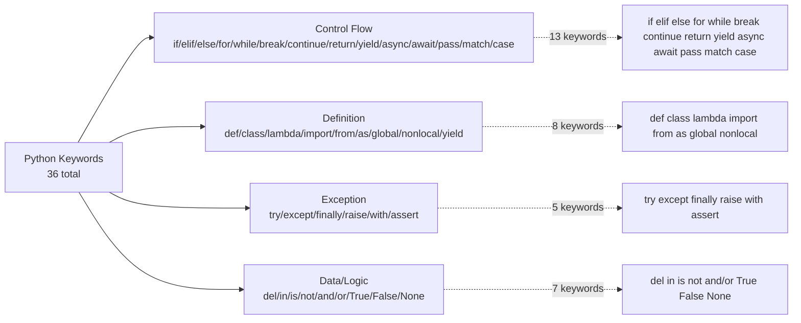
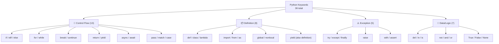
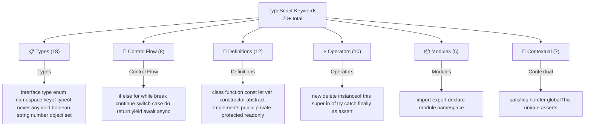
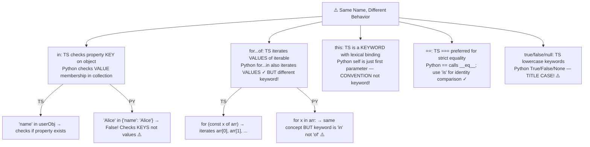
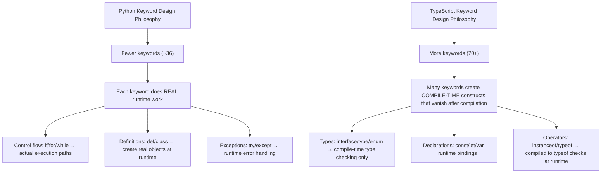
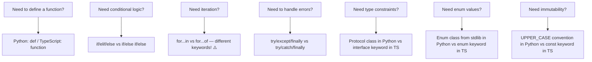

# Module 18 — Keywords Deep Dive: Every Python & TypeScript Keyword


## Table of Contents

- [1. Keyword Landscape Overview](#1-keyword-landscape-overview)
- [2. Python Keywords — Complete Reference (36 Keywords)](#2-python-keywords--complete-reference-36-keywords)
- [3. TypeScript Keywords — Complete Reference (70+ Keywords)](#3-typescript-keywords--complete-reference-70-keywords)
- [4. Complete Keyword Mapping: TypeScript ↔ Python](#4-complete-keyword-mapping-typescript--python)
- [5. Python-Only Keywords with No TypeScript Equivalent](#5-python-only-keywords-with-no-typescript-equivalent)
- [6. TypeScript-Only Keywords with No Python Equivalent](#6-typescript-only-keywords-with-no-python-equivalent)
- [7. Same Name, Different Behavior — Pairs to Watch Closely](#7-same-name-different-behavior--pairs-to-watch-closely)
- [8. Contextual Keywords & Soft Keywords Deep Dive](#8-contextual-keywords--soft-keywords-deep-dive)
- [9. Reserved Identifiers vs Actual Keywords](#9-reserved-identifiers-vs-actual-keywords)
- [10. Key Notes & Critical Differences for TS Developers](#10-key-notes--critical-differences-for-ts-developers)
- [11. Python ↔ TypeScript Keyword Quick Cheat Sheet](#11-python--typescript-keyword-quick-cheat-sheet)
- [12. References](#12-references)
- [13. Quizzes (35+ Questions with Answers)](#13-quizzes-35-questions-with-answers)
- [14. Exercises (25+ Problems with Solutions)](#14-exercises-25-problems-with-solutions)

---

## 1. Keyword Landscape Overview

### Why Keywords Matter for TypeScript Developers

TypeScript and Python share surface-level similarities but diverge fundamentally in keyword philosophy:

```mermaid
graph TD
    A[Python Keywords] --> B["Control Flow: if/elif/else, for, while, break, continue"]
    A --> C["Definitions: def, class, lambda, import/from/as"]
    A --> D["Exceptions: try/except/finally/raise/with"]
    A --> E["Scope: global/nonlocal"]
    A --> F["Data: del, in, is, not, and, or"]
    A --> G["Logic: True/False/None, assert, pass, match/case/yield/async/await"]
    
    H[TypeScript Keywords] --> I["Types: interface/type/enum/namespace/keyof"]
    H --> J["Control Flow: if/else/switch/for/while/for...of/for...in"]
    H --> K["Definitions: class/function/const/let/var/enum/interface"]
    H --> L["Concurrency: async/await/yield (generators)"]
    H --> M["Operators: new/delete/instanceof/typeof/satisfies/noInfer"]
    H --> N["Modules: import/export/declare"]
    
    O[Key Philosophy Difference] -.->|"Python: runtime keywords"| P
    O -.->|"TS: compile-time keywords"| Q
    
    P["Python keywords control RUNTIME behavior — types checked at runtime<br/>Keywords are few but powerful. Each one does real work."]
    Q["TypeScript keywords enforce COMPILE-TIME constraints<br/>Many keywords create type-level constructs that vanish after compilation"]
```



### Fundamental Differences

| Aspect | TypeScript | Python | Impact on Keywords |
|--------|-----------|--------|-------------------|
| **Keyword enforcement** | Compiler (`tsc`) prevents misuse, shows errors at compile time | Interpreter raises `SyntaxError` at load time — no compilation step | Python is less forgiving; typos crash immediately |
| **Reserved words count** | 70+ (including contextual/soft keywords) | 36 reserved keywords (Python 3.12+) | TS has more because types are expressed as keywords; Python uses stdlib for equivalent patterns |
| **Case sensitivity** | `true`/`false`/`null` — lowercase only | `True`/`False`/`None` — TITLE CASE! | Classic TS dev bug: writing `if (x = true)` vs correct `if x == True` |
| **Block scoping** | `{ }` defines scope blocks; `let`/`const` control variable lifetime | Indentation defines scope — no braces for code blocks. All assignments bind in function/module scope | No `let`/`const` keywords in Python at all! |
| **Type system keywords** | `interface`, `type`, `enum`, `namespace`, `module`, `keyof` | None as keywords — types are runtime metadata, expressed via stdlib (`Protocol`, `Enum`, type alias assignment) | TS keywords CREATE compile-time structures; Python uses decorators/functions for equivalent patterns |
| **Type checking** | Compile-time (erased at runtime) | Runtime — `type()` and `isinstance()` work on live objects | TypeScript types vanish after compilation; Python types are first-class objects! |

### Keyword Complexity Legend

| Symbol | Meaning |
|--------|---------|
| 🟢 Basic | Straightforward, memorize quickly |
| 🟡 Intermediate | Understand nuances and edge cases |
| 🔴 Advanced | Subtle behavior, common pitfalls, deep-dive required |

---

## 2. Python Keywords — Complete Reference (36 Keywords)

### 2.1 Python Keyword Lookup Table (ALL 36)

> Python 3.12+ has exactly 36 reserved keywords (including `True`, `False`, `None` as true reserved words).

| # | Keyword | 🟢/🟡/🔴 | Category | Control Flow? | Definition? | Exception? | Logic/Data? | Scope? |
|---|---------|-----------|----------|--------------|-------------|------------|-------------|--------|
| 1 | `False` | 🟢 | Boolean literal | | ✅ | | | |
| 2 | `True` | 🟢 | Boolean literal | | ✅ | | | |
| 3 | `None` | 🟡 | Singleton null | | ✅ | | | |
| 4 | `and` | 🟢 | Logical operator | ✅ (short-circuit) | | | ✅ | |
| 5 | `as` | 🟢 | Alias/binding | | ✅ (import, except, with) | | | |
| 6 | `assert` | 🟡 | Debugging invariant | | | ✅ | ✅ | |
| 7 | `async` | 🟡 | Concurrency | | ✅ (with def) | | | |
| 8 | `await` | 🟡 | Concurrency | ✅ (pauses coroutine) | | | | |
| 9 | `break` | 🟢 | Loop exit | ✅ | | | | |
| 10 | `class` | 🟢 | Class definition | | ✅ | | | |
| 11 | `continue` | 🟢 | Loop skip | ✅ | | | | |
| 12 | `def` | 🟢 | Function definition | | ✅ | | | |
| 13 | `del` | 🟡 | Deletion | | | ✅ | ✅ | |
| 14 | `elif` | 🟢 | Conditional branch | ✅ | | | | |
| 15 | `else` | 🟢 | Fallback branch | ✅ (if/for/while/try) | | | | |
| 16 | `except` | 🟡 | Exception handler | | | ✅ | | |
| 17 | `finally` | 🟢 | Always execute | | | ✅ | | |
| 18 | `for` | 🟢 | Iteration loop | ✅ | | | | |
| 19 | `from` | 🟢 | Import variant | | ✅ (import from) | | | |
| 20 | `global` | 🔴 | Scope modifier | | | | | ✅ |
| 21 | `if` | 🟢 | Conditional start | ✅ | | | | |
| 22 | `import` | 🟢 | Module import | | ✅ | | | |
| 23 | `in` | 🟡 | Membership operator | ✅ (for) | | | ✅ | |
| 24 | `is` | 🔴 | Identity comparison | | | | ✅ | |
| 25 | `lambda` | 🟡 | Anonymous function | | ✅ | | | |
| 26 | `match` | 🟡 | Pattern matching | ✅ (3.10+) | | | | |
| 27 | `nonlocal` | 🔴 | Enclosing scope | | | | | ✅ |
| 28 | `not` | 🟢 | Logical negation | | | | ✅ | |
| 29 | `or` | 🟢 | Logical disjunction | ✅ (short-circuit) | | | ✅ | |
| 30 | `pass` | 🟢 | Null statement | ✅ (placeholder) | | | | |
| 31 | `raise` | 🟡 | Exception throw | | | ✅ | | |
| 32 | `return` | 🟢 | Function exit | | ✅ (in def/lambda) | | | |
| 33 | `try` | 🟢 | Exception start | | | ✅ | | |
| 34 | `while` | 🟢 | Conditional loop | ✅ | | | | |
| 35 | `with` | 🟡 | Context manager | | | ✅ | | |
| 36 | `yield` | 🟡 | Generator value | | ✅ (in def) | | | |



### 2.2 Boolean Literals: True / False / None 🔴 (Deep Dive)

```python
# === BOOLEAN LITERALS ===
# In Python, True and False are TRUE RESERVED KEYWORDS (not just constants!)
# You CANNOT reassign them — attempt raises SyntaxError!

is_active = True
is_done = False

# These are NOT the same as boolean type constructors:
type(True)            # <class 'bool'>
True is True          # True (singleton)
True == 1             # True (bool is subclass of int!)
False is 0            # False (identity check, not equality!)

# === NONE — THE SINGLETON NULL ===
null_value = None

# None is a true reserved keyword — you cannot reassign it!
type(None)            # <class 'NoneType'>
id(None)              # Fixed memory address — only ONE None exists!
None is None          # True (trivially — same singleton)

# The critical distinction: None handles BOTH null and undefined from JS!
// In TypeScript: const x: null | undefined = null;
// In Python:     x = None                    (handles both!) ✓

# Identity vs equality with None (covered in 2.10):
x = None
x is None       # ✅ CORRECT — always use 'is' for None comparison
x == None       # ⚠️ Works by accident but WRONG CONVENTION
```

### 2.3 Logical Operators: and / or / not (with Short-Circuit Behavior) 🔴

```python
# === AND — returns first FALSY operand, or last if all truthy ===
result = False and expensive_function()    # expensive_function() is NOT called! ✓
result = True and safe_default             # Right side IS evaluated
result = True and "hello"                  # Returns "hello" — the actual VALUE!

# ⚠️ Python's and/or return ACTUAL operands, not booleans! This is CRUCIAL:
result = 0 or 10                           # 10 (0 is falsy)
result = "" or "default"                   # "default" (empty string is falsy!)
result = False or True                     # True (the actual boolean!)
result = None or "fallback"                # "fallback"

# This enables the DEFAULT VALUE pattern (common in Python!):
name = user_input or "Anonymous"           # Use user_input if truthy, else default
value = maybe_none or 42                   # Use maybe_none if not None, else 42

# ⚠️ WARNING: This fails with falsy defaults!
count = 0
safe_count = count or 10                  # ❌ WRONG — count=0 is falsy → gets 10!
safe_count = count if count else 10        # Still wrong for the same reason!
safe_count = count if count != 0 else 10   # ✅ Correct check

# === OR — returns first TRUTHY operand, or last if all falsy ===
result = True or expensive_function()      # expensive_function() is NOT called! ✓
result = False or default_value            # Right side IS evaluated
result = "hello" or "default"              # Returns "hello" — first truthy wins!

# Chained logical operators (precedence: not > and > or):
result = a and b or c                    # Equivalent to: (a and b) or c
result = a or b and c                    # Equivalent to: a or (b and c)! NOT (a or b) and c!

# ✅ PEP 8 recommendation: use parentheses for clarity with complex expressions!
if (condition_a and condition_b) or condition_c:
    handle_complex_logic()

# === NOT — always returns a boolean (coerces result!) ===
not True          # False
not [1, 2]       # False — non-empty list is truthy!
not ""           # True — empty string is falsy!
not None         # True
not 0            # True
not bool(x)      # Always returns True or False (unlike and/or which return actual values!)

# Chained not: not a and b means "not a" AND b (due to operator precedence)!
not a and b       # = (not a) and b — NOT a or (b)!
```

### 2.4 The `is` Keyword vs `==` — Identity vs Equality 🔴 (Complete)

```python
# is checks if two references point to the SAME object in memory (identity)
# == checks if two objects have the same VALUE (equality via __eq__)

a = [1, 2, 3]
b = [1, 2, 3]
c = a              # c points to the SAME list object as a!

a == b             # True — same VALUES (content equality)
a is b             # False — different OBJECTS (different memory addresses!)
a is c             # True — same object entirely!
id(a) == id(c)     # Same ID (memory address) ✓

# ⚠️ Small integer caching (Python implementation detail, NOT guaranteed by spec):
x = 256; y = 256
x is y             # Often True in CPython — small ints are cached! (-5 to 256)

x = 257; y = 257
x is y             # May be False! NOT guaranteed. NEVER rely on this behavior!

# ✅ THE RULE: use `is` only with singletons (None, True, False)
if x is None:      # Always correct ✓
    handle_none()

# ⚠️ Comparing floats with `is` is a classic bug:
float("nan") is float("nan")    # False! (NaN is never equal to itself!)

# When should you use == vs is?
# - ALWAYS use is for None, True, False comparisons ✓
# - Use == for everything else (numbers, strings, dataclasses) ✓
# - Only use is if you explicitly want identity comparison ✓
```

### 2.5 The `in` Keyword — Membership Testing (Complete) 🟡

```python
# === IN ON DIFFERENT TYPES ===

# Dict → checks KEYS only (not values!)
config = {"host": "localhost", "port": 8080}
"host" in config           # True ✓
"value" in config          # False — checks keys, NOT values!
"localhost" in config      # ❌ False! This is the most common TS dev mistake!

# To check VALUES:
"Alice" in {"name": "Alice"}.values()   # True ✓
any(v == "Alice" for v in config.values())  # Short-circuits on first match! ✓

# List → checks VALUES (like TS .includes())
2 in [1, 2, 3]              # True ✓
[1, 2] in [[1, 2], [3, 4]]  # True — checks if list IS an element ✓

# String → checks SUBSTRING (not character membership!)
"app" in "pineapple"   # True — substring match!
"a" in "pineapple"     # True — single char is also a substring ✓

# Set → checks VALUE membership (O(1) average!)
2 in {1, 2, 3}                  # True — O(1) lookup! ✓
frozenset({1, 2}) <= {1, 2, 3}  # True — subset check with frozenset ✓

# Custom class → uses __contains__ method
class MyCollection:
    def __init__(self, items):
        self.items = items
    def __contains__(self, item):     # Enables 'x in collection' syntax!
        return item in self.items

coll = MyCollection([10, 20, 30])
20 in coll     # True — calls MyCollection.__contains__ ✓
```

### 2.6 `match` / `case` / `_` — Pattern Matching (Python 3.10+) 🔴 (Complete)

```python
# === BASIC MATCH/CASE (like TypeScript's switch but with patterns!) ===
status_code = 404
match status_code:
    case 200:
        print("OK")
    case 404:
        print("Not Found")
    case 500 | 502 | 503:      # Multiple values with pipe — NO fall-through!
        print("Server Error")
    case _:                       # _ is wildcard — like 'default' in TS
        print("Unknown status")

# === STRUCTURAL PATTERN MATCHING (destructuring while matching) ===
point = (10, 20)
match point:
    case (0, 0):
        print("Origin")
    case (x, 0):                 # x is bound to the matched value!
        print(f"On x-axis at {x}")
    case (0, y):
        print(f"On y-axis at {y}")
    case (x, y):
        print(f"General point: ({x}, {y})")

# === PATTERN MATCHING WITH DICTS ===
event = {"type": "click", "x": 100, "y": 200}
match event:
    case {"type": "click", "x": x_coord, "y": y_coord}:
        print(f"Click at ({x_coord}, {y_coord})")     # ✓ matches!
    case {"type": "keyPress", "key": key_name}:
        print(f"Key pressed: {key_name}")

# === PATTERN MATCHING WITH CLASSES (using `as` to bind to name) ===
class Circle:
    def __init__(self, radius): self.radius = radius
class Rectangle:
    def __init__(self, width, height): self.width = width; self.height = height

def describe(shape):
    match shape:
        case Circle(r=radius):            # Binds radius to name!
            return f"Circle with radius {radius}"
        case Rectangle(width=w, height=h):  # Keyword-style matching!
            return f"Rectangle {w}x{h}"
        case _:
            return "Unknown shape"

# === GUARD CLAUSES (like guard in TS switch, but more powerful!) ===
score = 85
match score:
    case s if s >= 90:           # Guard condition — Python's only way for conditional matching!
        print("A grade")
    case s if s >= 80:
        print("B grade")
    case _:
        print("Below B")

# === WILDCARD BEHAVIOR OF _ ===
case [first, *_]:              # Matches any list with at least one element
case {"key": _}:               # Matches any dict with 'key' present
```

### 2.7 `async` / `await` — Coroutine Keywords (Complete) 🟡

```python
import asyncio

# async marks a function as returning an awaitable coroutine object
async def fetch_data(url: str) -> dict:   # Like 'async function' in TS!
    await asyncio.sleep(1)                 # await pauses until the Task completes
    return {"url": url, "data": [1, 2, 3]}

# async/await in Python works with event loops (like Node.js!)
async def main():
    # Run multiple coroutines concurrently (like Promise.all in TS!)
    results = await asyncio.gather(
        fetch_data("https://api.example.com/a"),
        fetch_data("https://api.example.com/b"),
    )
    print(results)

# Python only has ONE concurrency model: asyncio
# Unlike Node.js which has a built-in event loop, you must explicitly create one:
asyncio.run(main())          # Entry point — creates event loop and runs the coroutine
```

### 2.8 `with` — Context Manager Protocol 🔴 (Complete)

```python
# with guarantees cleanup even if exceptions occur (like try/finally but cleaner!)

# File I/O (the most common use case):
with open("data.txt", "r") as f:      # __enter__ called; f is bound to 'f'
    content = f.read()                 # If an exception occurs here...
                                         # ...__exit__ is still called, file is closed!

# Equivalent (verbose) without with:
f = open("data.txt", "r")
try:
    content = f.read()
finally:
    f.close()      # Always executed ✓

# Multiple context managers in one statement:
with open("input.txt") as fin, open("output.txt", "w") as fout:
    fout.write(fin.read())     # Both files guaranteed to close ✓

# with supports custom objects via __enter__ and __exit__:
class Transaction:
    def __init__(self, db): self.db = db
    def __enter__(self):
        self.db.begin_transaction()
        return self
    def __exit__(self, exc_type, exc_val, exc_tb):
        if exc_type is None:
            self.db.commit()
        else:
            self.db.rollback()
        return False  # Don't suppress the exception

with Transaction(connection) as txn:
    txn.db.execute("INSERT INTO users VALUES (1, 'Alice')")
    # On success: commit; on error: rollback — automatically!

# The context manager protocol requires __enter__ and __exit__:
# - __enter__(self): Called when entering the with block. Return value bound to 'as' variable.
# - __exit__(self, exc_type, exc_val, exc_tb): Called when exiting (even on exception).
#   Return True to suppress the exception; False/None to propagate it.

# Context managers also implement `__aenter__` and `__aexit__` for async with!
```

### 2.9 `del` — Deletion Operator 🟡 (Complete)

```python
# Delete items by index/slice/key from collections
nums = [10, 20, 30, 40]
del nums[1]              # [10, 30, 40] — deletes element at index 1
del nums[0:2]            # [40] — deletes elements at indices 0 and 1

my_dict = {"a": 1, "b": 2}
del my_dict["a"]         # {"b": 2} — removes key 'a'

# Delete entire variable (name unbound from object)
x = [1, 2, 3]
del x                    # Name 'x' no longer exists!
# print(x)             # 💥 NameError: name 'x' is not defined

# Delete from attribute namespace
class Config:
    debug = True
cfg = Config()
del cfg.debug            # Removes the attribute entirely
hasattr(cfg, "debug")    # False ✓

# ⚠️ del doesn't guarantee memory deallocation — only removes the reference!
# Garbage collector (GC) handles actual memory cleanup based on refcount + cyclic detection.
```

### 2.10 `yield` — Generator Keyword 🟡 (Complete)

```python
# yield turns a function into a generator that produces values lazily
def count_up_to(max_val):
    current = 0
    while current < max_val:
        yield current            # Returns current value and PAUSES here
        current += 1             # On next iteration, resumes from here!

for n in count_up_to(5):         # Generates values lazily — no list allocated in memory!
    print(n)                     # 0, 1, 2, 3, 4

# yield from — delegate to another generator (Python 3.3+)
def chain(*iterables):
    for it in iterables:
        yield from it            # Like spreading each iterable's contents ✓

list(chain([1, 2], [3, 4]))   # [1, 2, 3, 4]

# Generator vs regular function — memory impact:
regular_list = list(range(10**9))    # ~8 GB+ of memory! 🤯
lazy_range = count_up_to(10**9)       # Nearly 0 memory overhead ✓
```

### 2.11 `global` / `nonlocal` — Scope Keywords 🔴 (Complete)

```python
# global: access the MODULE-level namespace (use sparingly!)
counter = 0
def increment():
    global counter              # Declares 'counter' as the module-level variable!
    counter += 1                # Without 'global', this creates a NEW local variable.

increment()
print(counter)       # 1 — modified the global variable ✓

# nonlocal: access an enclosing (but not global) function's variable
def outer():
    count = 0                  # This is NOT global — it's in outer's scope!
    def inner():
        nonlocal count          # Accesses the 'count' from outer(), not globals!
        count += 1              # Without 'nonlocal', this creates a new local variable.
    inner()
    return count               # Returns 1 ✓

result = outer()
print(result)       # 1 ✓

# ⚠️ Scope resolution order (LEGB): Local → Enclosing → Global → Built-in
# global and nonlocal override this default lookup!
```

### 2.12 `assert` — Runtime Assertion 🔴 (Complete)

```python
# assert is a debugging tool that raises AssertionError if condition is False
def divide(a, b):
    assert b != 0, "Divisor cannot be zero"   # Like an invariant check
    return a / b

divide(10, 0)
# 💥 AssertionError: Divisor cannot be zero

# ⚠️ assert can be DISABLED with the -O (optimize) flag!
# python -O script.py      # All assertions are stripped at runtime!
# Therefore: NEVER use assert for validation in production code.

# ✅ Correct uses of assert: internal invariants only!
def average(values):
    assert len(values) > 0, "Need at least one value"
    assert all(isinstance(v, (int, float)) for v in values)
```

### 2.13 `lambda` — Anonymous Function (Limited Alternative) 🟡 (Complete)

```python
# Lambda: single-expression function with no name (like TS arrow functions)
double = lambda x: x * 2                      # Like: const double = (x) => x * 2;
add = lambda a, b: a + b
greet = lambda name: f"Hello, {name}!"

# Most useful: as arguments to higher-order functions
names = ["alice", "Bob", "CHARLIE"]
sorted_names = sorted(names, key=lambda n: n.lower())    # Case-insensitive sort
squared = list(map(lambda x: x ** 2, [1, 2, 3, 4]))     # [1, 4, 9, 16]

# ⚠️ Lambda restrictions:
# - Only ONE expression (no statements inside!)
# - No assignments: lambda x: (x = 5) → SyntaxError!
# - No loops: lambda: for i in range(10): print(i) → SyntaxError!
# - Multiline logic needs regular `def` — lambdas are only for inline one-liners.

# ✅ When to use lambda vs def:
lambda_func = lambda x: x * 2        # Good for simple, one-time use (as argument)
def double(x): return x * 2          # Better: named, documented, testable, debuggable
```

### 2.14 `raise` / `except` / `try` — Exception Control 🔴 (Complete)

```python
# raise — programmatically throw an exception
raise ValueError("Invalid age")                    # Raises with message
raise RuntimeError("Connection failed") from e      # Chains exception (e is the cause)

# try/except/else/finally — comprehensive error handling
try:
    result = 1 / denominator       # May raise ZeroDivisionError
except ZeroDivisionError as e:     # Specific type caught, bound to 'e'
    print(f"Cannot divide by zero: {e}")
except (TypeError, ValueError) as e:   # Multiple types in tuple!
    print(f"Invalid input: {e}")
else:                                # Runs ONLY if NO exception occurred!
    print("Calculation succeeded!")
finally:                           # Always runs — even with exceptions!
    cleanup_resources()

# Exception chaining (like .catch().then() but in Python):
try:
    config = load_config("settings.json")  # May raise FileNotFoundError
except FileNotFoundError:
    raise RuntimeError("Settings file missing") from None   # Suppress original traceback
```

### 2.15 `pass` — The Null Statement 🟢 (Complete)

```python
# pass does absolutely nothing — used as a placeholder where syntax requires a statement
def unfinished_function():
    pass                         # Required because Python demands at least one statement

class AbstractBase:
    def method(self):
        pass                     # Subclasses MUST override this (documented convention)

def noop():
    if True:
        pass                     # Empty block needs a statement! Can't have nothing here.

# pass vs ... — ... is valid in stub files (.pyi) and type hints for documentation
from typing import Protocol
class Drawable(Protocol):
    def draw(self, ctx: CanvasContext) -> None: ...  # Stub syntax (PEP 484)
```

### 2.16 `class` / `def` — Definitions 🟢 (Complete)

```python
# class defines a new type (like TS's class but with different inheritance model)
class Animal:                          # Like 'class Animal' in TS
    species = "unknown"                # Class attribute (shared by all instances)
    
    def __init__(self, name: str):     # Constructor — called on instance creation
        self.name = name               # Instance attribute (unique to each object)
    
    def speak(self) -> str:            # Method — first arg is always 'self'
        return f"{self.name} makes a sound"

a1 = Animal("Rex")      # Creates instance; __init__ called automatically
print(a1.speak())       # "Rex makes a sound"

# def defines a function (top-level or nested — no scope block needed!)
def greet(name: str) -> str:   # Return type is optional but recommended!
    return f"Hello, {name}!"   # Returns immediately; single-line function OK
```

### 2.17 `import` / `from` / `as` — Module System 🟢 (Complete)

```python
# import X — imports entire module as namespace
import json                    # Access via json.loads(), json.dumps()
import os.path                 # Import nested module

# from X import Y — import specific name(s)
from pathlib import Path       # Direct access to Path class (no path.Path!)
from collections import Counter, defaultdict  # Multiple imports in one line

# from X import * — wildcard (avoid! pollutes namespace)
from math import *             # Imports all public names — BAD practice! ❌

# as — aliasing (useful for long module names or conflict resolution)
import numpy as np            # Standard convention — never change this!
from collections import Counter as Ctr    # Short alias to avoid collision
from . import module          # Relative import (same package)
from ..sibling import util    # Relative import (parent's sibling package)

# import vs from...import tradeoff:
import os                      # ✅ Safe — explicit namespace, no naming conflicts
from os import path            # ⚠️ Fine for stdlib (names are standardized)
from my_module import *        # ❌ Bad — pollutes namespace, hard to track imports
```

### 2.18 `if` / `elif` / `else` — Conditionals 🟢 (Complete)

```python
# if/elif/else chain (note: ELIF, NOT 'else if'!)
if condition_a:
    handle_a()
elif condition_b:              # Like 'else if' in TS but single word!
    handle_b()
elif condition_c and condition_d:  # Multiple conditions OK
    handle_cd()
else:
    handle_default()

# Ternary expression (like TS ? : operator)
result = value_if_true if condition else value_if_false

# Walrus operator (:=) — assignment expression (Python 3.8+) 🟡
if (n := len(data)) > 10:     # Assigns AND checks in one expression!
    print(f"Too large: {n}")

# Pattern matching replaces complex if/elif chains (Python 3.10+):
match shape:
    case "circle": ...
    case "square": ...
    case _: ...                # More readable than elif for multi-way branches
```

### 2.19 `for` / `while` — Iteration 🟢 (Complete)

```python
# for loops over ANY iterable (not just range!)
for item in items:                    # Like 'for...of' in TS!
    process(item)

for i, value in enumerate(items):     # Like Object.entries() — index + value!
    print(f"{i}: {value}")

for key, value in config.items():     # Iterates dict key-value pairs!
    print(f"{key} = {value}")

# for...else (Python-only feature!)
for num in [2, 4, 6]:
    if num % 3 == 0:
        print("Found multiple of 3!")
        break
else:                    # Runs only if loop completes WITHOUT break
    print("No multiple of 3 found")

# while loops (identical to TS!)
while condition:
    do_work()
    if should_stop():
        break
```

### 2.20 Python Keywords Grouped by Category



---

## 3. TypeScript Keywords — Complete Reference (70+ Keywords)

### 3.1 TypeScript Keyword Lookup Table

| # | TS Keyword | 🟢/🟡/🔴 | Python Equivalent | Category | Notes |
|---|-----------|-----------|-----------------|----------|-------|
| 1 | `abstract` | 🟡 | `ABC` + `@abstractmethod` (from abc module) | Class modifier | No direct keyword in Python; use stdlib class |
| 2 | `any` | 🟢 | `Any` (from typing module) | Type keyword | Skip type checking for this value |
| 3 | `async` | 🟢 | `async` / `await` | Concurrency | Same meaning in both languages! ✓ |
| 4 | `await` | 🟡 | `await` | Concurrency | Only inside async functions ✓ |
| 5 | `boolean` | 🟢 | `bool` | Type keyword | `true`/`false` literal type |
| 6 | `break` | 🟢 | `break` | Control flow | Identical behavior ✓ |
| 7 | `case` | 🟢 | `case` (in match) | Pattern matching | Used with `switch`; also Python match keyword! |
| 8 | `catch` | 🟡 | `except` | Exception handling | Catches thrown errors |
| 9 | `class` | 🟢 | `class` | Definition | Same keyword, different inheritance model |
| 10 | `const` | 🟢 | — (no equivalent) | Declaration | Immutable binding. Python: convention UPPER_CASE |
| 11 | `continue` | 🟢 | `continue` | Control flow | Identical behavior ✓ |
| 12 | `constructor` | 🟡 | `__init__` | Class member | Method called on instantiation |
| 13 | `declare` | 🔴 | — (manual type definitions) | Declaration | Tells compiler something exists externally |
| 14 | `default` | 🟢 | — (in destructuring/enum) | Pattern | Default value in destructuring or enum |
| 15 | `do` | 🟡 | — (not needed) | Loop statement | `do...while` — Python doesn't have this! Use `while True: if cond: break` |
| 16 | `else` | 🟢 | `else` | Conditional | Identical behavior ✓ |
| 17 | `enum` | 🟡 | `Enum` (from enum module) | Enumeration | Compile-time or runtime enum type |
| 18 | `export` | 🟡 | — (no keyword; import is bidirectional) | Module system | Named export in ESM. Python has no export keyword! |
| 19 | `extends` | 🟢 | Base class in parens | Inheritance | `class Child extends Parent` → `class Child(Parent):` |
| 20 | `finally` | 🟢 | `finally` | Exception handling | Identical behavior ✓ |
| 21 | `for` | 🟢 | `for` | Iteration | `for...of` iterates values; `for...in` iterates keys |
| 22 | `function` | 🟢 | `def` / `lambda` | Definition | Named function declaration. Two Python keywords for one! |
| 23 | `if` | 🟢 | `if` | Conditional | Identical behavior ✓ |
| 24 | `implements` | 🔴 | — (Protocol handles this) | Class modifier | Specifies interface implementation. Python uses Protocol |
| 25 | `import` | 🟡 | `import` / `from` | Module system | Same name, different semantics! |
| 26 | `in` | 🟢 | `in` | Membership/operator | Checks if property/key exists (TS) or element in collection (Python) |
| 27 | `instanceof` | 🟡 | `isinstance()` (builtin function) | Type check | Runtime type verification. Python's is a FUNCTION not keyword! |
| 28 | `interface` | 🔴 | `Protocol` (from typing) | Type definition | Defines a shape/type contract without implementation |
| 29 | `keyof` | 🔴 | — | Type operator | Gets keys of an object type. No direct Python equivalent |
| 30 | `let` | 🟢 | — (no keyword; all assignments bind) | Declaration | Block-scoped variable. Python: just `x = value` |
| 31 | `module` | 🔴 | — (PEP 8 packages handle this) | Namespace | External module declaration |
| 32 | `namespace` | 🔴 | — (packages instead) | Namespace | Logical grouping container. Python uses directories + __init__.py |
| 33 | `new` | 🟢 | — (call constructor directly) | Operator | Instantiates a class. Python: just call the class! `MyClass()` |
| 34 | `never` | 🔴 | `Never` (from typing) | Type keyword | Value that never exists (for functions that always throw) |
| 35 | `noInfer` | 🔴 | — | Type operator | Prevents type inference from this position |
| 36 | `null` | 🟢 | `None` | Literal value | Null value. Python handles both null/undefined with None! |
| 37 | `number` | 🟢 | `int` / `float` | Type keyword | Numeric type. Single 'number' in TS vs two in Python |
| 38 | `object` | 🟡 | `object` (from typing) | Type keyword | Non-primitive type. Same name! ✓ |
| 39 | `of` | 🟡 | — (part of for...of syntax) | Loop modifier | Used with `for` as `for...of`. Python uses `in` not `of`! ⚠️ |
| 40 | `private` | 🔴 | `_prefix` convention or `@property` descriptor | Access modifier | Private class member. Python: underscore convention only |
| 41 | `protected` | 🔴 | — (not enforced; use convention) | Access modifier | Subclass-accessible only |
| 42 | `public` | 🟢 | Default (no keyword needed!) | Access modifier | Publicly accessible. Always default in Python! ✓ |
| 43 | `readonly` | 🔴 | `@dataclasses.field(frozen=True)` / `@property` with no setter | Modifier | Cannot be reassigned. Not a keyword in Python |
| 44 | `require` | 🟡 | — (not in TypeScript; CommonJS uses require()) | Module system | CommonJS module loading |
| 45 | `return` | 🟢 | `return` | Function control | Returns from function. Identical! ✓ |
| 46 | `satisfies` | 🔴 | — | Type operator | Checks that value conforms to type without changing inferred type |
| 47 | `set` | 🔴 | — (not a keyword; use typing.Set or set() constructor) | Accessor modifier | Setter method modifier in classes. Not a keyword in Python! |
| 48 | `string` | 🟢 | `str` | Type keyword | Text type. Different names! ⚠️ |
| 49 | `super` | 🟡 | `super()` | Class operator | Parent class reference. Same concept! ✓ |
| 50 | `switch` | 🟡 | `match` (3.10+) / if-elif chain | Conditional branching | Multi-way branch with fall-through |
| 51 | `this` | 🔴 | `self` (convention, not keyword!) | Context keyword | Reference to current object instance. Python: first param convention |
| 52 | `throw` | 🟡 | `raise` | Exception | Throws an error programmatically |
| 53 | `try` | 🟢 | `try` | Exception handling | Identical behavior ✓ |
| 54 | `type` | 🔴 | Type aliases via `=` (no keyword!) | Type definition | Defines a type alias. Python: just `Name = ExistingType` — no keyword needed! |
| 55 | `typeof` | 🟡 | `isinstance()` / `type()` (builtin functions) | Runtime type check | Checks type of value at runtime. Not keywords in Python — they're FUNCTIONS! |
| 56 | `undefined` | 🟢 | `None` | Literal value | Value when variable declared but not assigned. Same as null in Python! |
| 57 | `var` | 🔴 | — (Python has no var!) | Declaration | Function-scoped variable. Avoided in TypeScript; not needed in Python |
| 58 | `void` | 🟡 | None (return type annotation only) | Type keyword | Indicates function returns nothing. Python: `-> None` annotation |
| 59 | `while` | 🟢 | `while` | Loop statement | Identical behavior ✓ |
| 60 | `with` | 🟢 | `with` (Python-only!) | Statement | **NOT in TypeScript!** Python context manager protocol |
| 61 | `yield` | 🟡 | `yield` / `async yield` | Generator | Produces values from a generator function |

### 3.2 TypeScript-Only Type Keywords (No Python Keyword Equivalent)

```typescript
// These TypeScript keywords have NO direct Python keyword equivalent — 
// Python uses different patterns (stdlib, decorators, or simple assignment):

// interface — defines a type contract without implementation
interface Logger {
  log(message: string): void;
}
// Python equivalent: Use typing.Protocol (structural subtyping)
from typing import Protocol
class Logger(Protocol):
    def log(self, message: str) -> None: ...
// Note: Protocol is a CLASS from typing module — not a keyword!

// type — defines type aliases
type UserId = string | number;
// Python equivalent: just use assignment — no keyword needed!
UserId = str | int  // No special keyword in Python! ✓

// keyof — extracts keys of an object type as a union of literal strings
type UserKeys = keyof User;  // 'name' | 'age' | 'email'
// Python has no compile-time reflection equivalent — use __annotations__ at runtime!

// instanceOf — runtime type check (TS compiles to typeof)
obj instanceof MyClass;
// Python equivalent: isinstance(obj, MyClass) — but it's a BUILT-IN FUNCTION, not a keyword!
// TypeScript: `instanceof` is a KEYWORD ✅
// Python: `isinstance()` is a FUNCTION call ✅

// readonly — prevents property reassignment
class Config {
  readonly host: string;
}
// Python equivalent: use dataclasses with frozen=True or @property without setter

// abstract — defines unimplemented methods in base class
abstract class Shape {
  abstract area(): number;
}
// Python equivalent: raise NotImplementedError or use Protocol/ABC
from abc import ABC, abstractmethod
class Shape(ABC):
    @abstractmethod
    def area(self) -> float: ...
```

### 3.3 TypeScript Contextual / Soft Keywords (Used in Specific Positions)

| Keyword | Context | Description | Python Equivalent |
|---------|---------|-------------|-------------------|
| `satisfies` | Type check | Validates type without narrowing inference | No equivalent needed — dynamic typing handles this ✓ |
| `noInfer` | Type operator | Suppresses inference from a position | No equivalent needed |
| `globalThis` | Object reference | Global object in all JS environments | `globals()` dict or module-level variables |
| `module` | External declaration | Declares an external module namespace | Python's import system handles this automatically |
| `namespace` | Grouping | Logical code grouping (like ES modules) | Python packages (directories + __init__.py) handle this ✓ |
| `unique` | Type modifier | Narrows type to unique brand | No equivalent — brands are convention in Python ✓ |
| `asserts` | Type predicate | narrows type in conditionals | Python uses `isinstance()` checks for narrowing at runtime ✓ |

### 3.4 TypeScript Keywords Grouped by Category



---

## 4. Complete Keyword Mapping: TypeScript ↔ Python

### 4.1 Direct Side-by-Side Comparison (ALL Keywords)

| TypeScript | Python | Same Meaning? | Code Example: TS → PY | Notes |
|-----------|--------|--------------|----------------------|-------|
| `if` | `if` | ✅ Identical | `if (x > 0) {}` → `if x > 0:` ✓ | Same logic, indentation replaces braces |
| `else if` | `elif` | ⚠️ Single word in Python | `else if (y) {}` → `elif y:` ✓ | One word vs two! ⚠️ |
| `else` | `else` | ✅ Identical | `else {}` → `else:` ✓ | Same semantics ✓ |
| `for ... of` | `for ... in` | ⚠️ Different keyword! | `for (const x of arr)` → `for x in arr:` ✓ | Keyword changed from 'of' to 'in'! ⚠️ |
| `for ... in` | `for k, v in obj.items():` | ⚠️ No direct equivalent | `for (const k in obj)` → `for k in obj.keys():` | TS iterates keys; Python for...iterates VALUES ✓ |
| `while` | `while` | ✅ Identical | `while (cond) {}` → `while cond:` ✓ | Same semantics ✓ |
| `break` | `break` | ✅ Identical | `break;` → `break` ✓ | Same semantics ✓ |
| `continue` | `continue` | ✅ Identical | `continue;` → `continue` ✓ | Same semantics ✓ |
| `do ... while` | *(None)* | ❌ No equivalent | Use `while True: if cond: break` instead | No do...while in Python ✓ |
| `switch` | `match/case` (3.10+) | ⚠️ Completely different! | TS switch → Python match/case ✓ | Structural pattern matching! |
| `throw e` | `raise e` | ✅ Same concept, different word! | `throw new Error(msg)` → `raise ValueError(msg)` | Both programmatically trigger exceptions ✓ |
| `catch (e) {}` | `except Type as e:` | ⚠️ Different keywords! | `catch (e) {}` → `except ValueError as e:` ✓ | 'catch' vs 'except'! ⚠️ |
| `finally {}` | `finally:` | ✅ Identical | Same in both! ✓ | Always executes ✓ |
| `new MyClass()` | `MyClass()` | ❌ No keyword needed! | `new Animal("Rex")` → `Animal("Rex")` ✓ | Just call the class directly! |
| `return value` | `return value` | ✅ Identical | Same in both! ✓ | Always returns a value (or None) ✓ |
| `function name() {}` | `def name():` / `lambda x: expr` | ⚠️ def + lambda vs one keyword | `function double(x) { return x*2; }` → `def double(x): return x*2` | Two keywords for functions in Python! |
| `class C extends P {}` | `class C(P):` | ⚠️ No 'extends' keyword! | `class Dog extends Animal {}` → `class Dog(Animal):` ✓ | Parent class in parens, not a keyword! |
| `const x = 5` | *(Convention only)* | ❌ No keyword! | Use UPPER_CASE: `MAX_COUNT = 5` (convention) | Python has no const at all! ⚠️ |
| `let x = 5` | *(No keyword; just `x = 5`)* | ❌ No keyword! | Just assign: `x = 5` ✓ | All assignments bind in current scope ✓ |
| `var x = 5` | *(No keyword!)* | ❌ Not needed in Python | Just `x = 5` ✓ | Avoided in TypeScript; not needed in Python |
| `true` / `false` | `True` / `False` | ⚠️ Title case! | `if (x === true)` → `if x is True:` ✓ | Capitalized in Python — very common bug! ⚠️ |
| `null` | `None` | ⚠️ Different word! | `x = null` → `x = None` ✓ | Single value handles both null and undefined! |
| `undefined` | `None` | ✅ Same concept, same keyword as null! | One null-ish value (None) handles both cases ✓ | No separate undefined in Python! |
| `typeof x` | `isinstance(x, T)` / `type(x)` | ⚠️ Function call, not keyword! | `typeof x === 'string'` → `isinstance(x, str)` ✓ | Not keywords in Python — they're BUILT-IN FUNCTIONS! |
| `import X from 'mod'` | `from mod import X` / `import X` | ✅ Same keyword but different syntax! | TS: `import {foo} from './mod';` → Python: `from mod import foo` ✓ | Python uses spaces, not braces ✓ |
| `export default X` | *(No export keyword!)* | ❌ No equivalent! | Module exports everything by default; use `__all__` for public API ✓ | No export keyword in Python ✓ |
| `extends Parent` | Base class in parens | ⚠️ Syntax but no keyword! | Inheritance via base class, not a keyword ✓ | `class C(Parent):` — Parentheses, not keyword! |
| `implements IFace` | *(No equivalent)* | ❌ No keyword! | Python: just implement the methods (duck typing) or use Protocol ✓ | Structural subtyping eliminates need ✓ |
| `this.method()` | `self.method()` | ⚠️ Convention vs keyword! | `this.name` → `self.name` (first param convention, not keyword!) | 'this' is a keyword in TS; 'self' is just the first parameter name ✓ |
| `super.method()` | `super().method()` | ✅ Same concept! | `super.speak()` → `super().speak()` ✓ | Python's super() is a function call, not a keyword ✓ |
| `private x` | `_x` (convention) / name mangling | ⚠️ No enforcement! | Use underscore prefix convention: `_name` instead of private ✓ | No access modifier keywords in Python! |
| `protected x` | *(No enforcement)* | ❌ Not a keyword! | Convention only; double underscore for name mangling: `__name` ✓ | No protected keyword — use convention only! |
| `public` | *(Default, no keyword needed!)* | ✅ Always public by default | Everything is public in Python! ✓ | No public keyword needed ✓ |
| `readonly x` | `@property` without setter / frozen dataclass | ⚠️ Different mechanism! | Not a keyword — use @property descriptor or frozen=True on dataclass ✓ | Decorators handle immutability in Python ✓ |
| `enum E { A, B }` | `Enum` class from stdlib | ⚠️ Module class vs keyword! | TS enum is a language construct; Python uses a stdlib class with import ✓ |
| `interface IFoo {}` | `Protocol` class from typing | ⚠️ Module class vs keyword! | Same concept — define a contract. `from typing import Protocol` ✓ |
| `type Alias = ...` | Assignment (`=`) — no keyword! | ✅ No keyword needed! | Just use `Name = ExistingType` — plain assignment in Python ✓ |
| `void fn():` | `-> None` (annotation only) | ⚠️ Not enforced at runtime! | Return type annotation: `def fn() -> None:` ✓ | None is the "nothing" value, not a type keyword |
| `abstract class` | `ABC` + `@abstractmethod` from abc module | ⚠️ Module-based! | Same pattern but through stdlib, not language keywords ✓ |
| `any` | `Any` (from typing module) | ✅ Similar name, same concept! | `let x: any` → `x: Any` (imported from typing!) ✓ | Not a keyword in Python — imported from typing module! |
| `never` | `Never` (from typing module) | ✅ Similar name, same concept! | Function that never returns → `-> Never` annotation ✓ | Imported from typing module! ✓ |
| `as Type` | `as` (same keyword!) | ✅ Identical! | `expr as string` → `except TypeError as e:` or `import mod as m` ✓ | Used in exception binding and import aliasing! |
| `new` operator | *(Call class directly)* | ❌ No keyword needed! | `const a = new Array(5);` → `a = [0] * 5` or list constructor ✓ | Just call the class: `MyClass()` ✓ |
| `delete obj.prop` | `del obj.attr` / `del d[key]` | ⚠️ del vs delete! | `delete obj.x;` → `del obj.x` ✓ | Python uses `del` (shorter!) ✓ |
| `instanceof` | `isinstance()` (builtin function) | ⚠️ Function not keyword! | `obj instanceof Class` → `isinstance(obj, Class)` ✓ | Function call in Python vs keyword in TS! |

### 4.2 Keywords That Work Differently in Both Languages



### 4.3 Python Keywords Unique to Python (No TS Equivalent)

| Python Keyword | What It Does | Why TS Doesn't Have It | TypeScript Alternative |
|---------------|-------------|----------------------|----------------------|
| `elif` | Second/third condition in if chain (single word!) | TypeScript uses `else if` (two words) | `else if (cond) { ... }` |
| `match` / `case` | Structural pattern matching (3.10+) — most powerful conditional construct | No structural pattern matching in TS | Manual switch/if-elif chain; library-based pattern matching |
| `yield` | Generator function — lazy iteration without full list allocation | TypeScript has generators via `function*` / yield but it's also a keyword | `function* gen() { yield ... }` exists but is much less used |
| `nonlocal` | Access enclosing (not global) variable scope | TS doesn't have nested closures with mutable shared state this way | Closures work naturally; no keyword needed due to lexical scoping rules ✓ |
| `global` | Override local scope to access module-level variable | TS has `let`/`const` block scoping so globals are less common | No equivalent — global variables in JS/TS go on `window` or module scope implicitly |
| `assert` | Runtime assertion (debugging tool) | TypeScript has no built-in assertions at all; you'd use a library | `if (!cond) throw new AssertionError();` |
| `pass` | Null statement — placeholder where syntax demands a body | JavaScript always has empty `{}` as the body; nothing to placeholder with! | Just write `{}` (empty block) ✓ |
| `with` | Context manager protocol — auto-cleanup on exit/exception | TS doesn't have resource cleanup guarantee built into language | Try/finally pattern or library-based resource management ✓ |
| `del` | Delete items by key/index/name in one statement | TS has `delete` (for object properties) but not for list indices | No equivalent for deleting array elements; use splice() |
| `is` | Identity comparison (same memory reference) | TS uses `===` for strict equality which does NOT check identity for objects! | Use `Object.is(a, b)` — similar but `is` is a KEYWORD in Python! ✓ |
| `for...else` | Runs else block only if loop completes without break | No equivalent in TS control flow! | Need to track a flag variable manually ✓ |
| `lambda` (limited) | Single-expression anonymous function | Arrow functions `() =>` are more powerful than Python lambdas | Arrow functions handle statements, blocks, etc. — much more capable! |

### 4.4 TypeScript Keywords Unique to TypeScript (No Python Keyword Equivalent)

| TS Keyword | What It Does | Why Python Doesn't Need It | Python Alternative |
|-----------|-------------|--------------------------|-------------------|
| `const` | Block-scoped immutable binding | Python variables are names bound to objects — immutability is at the object level, not the name level | Use UPPER_CASE convention for constants: `MAX_SIZE = 100` ✓ |
| `let` | Block-scoped mutable binding | Python has no block scoping (no `{}` blocks create scope) — every assignment binds in the function/module scope | Just assign directly: `x = value` ✓ |
| `var` | Function-scoped variable | All assignments bind in the enclosing function/module scope regardless | Every assignment is a binding ✓ |
| `interface` | Define a type contract (compile-time) | Python uses runtime duck typing + typing.Protocol for structural subtyping | `Protocol` class from typing module ✓ |
| `type` (alias) | Define a type alias | Python just uses regular assignment — no special syntax needed! | `MyAlias = int \| str` (simple assignment!) ✓ |
| `enum` | Enumerated type (language construct) | Python's Enum is a standard library class, not a keyword | `from enum import Enum; class Color(Enum): RED = 1` ✓ |
| `readonly` | Mark class property as read-only | Not needed — use @property descriptor or frozen dataclass | `@property def x(self): return self._x` ✓ |
| `implements` | Declare interface implementation | Structural subtyping (duck typing) makes this redundant! | Just implement the required methods — no declaration needed! ✓ |
| `abstract` | Mark method/class as unimplemented | Part of abc module, not a keyword | `from abc import ABC, abstractmethod` with decorator ✓ |
| `namespace` | Logical code grouping container | Python's package system (directories + __init__.py) handles this implicitly | Package structure with `__all__` exports ✓ |
| `module` | External module declaration | Python's import system is built-in and doesn't need external declarations | Standard `import` statements ✓ |
| `keyof` | Extract property names as union type | No compile-time reflection in Python — you'd inspect at runtime via `dir()` or `__annotations__` | `obj.__annotations__.keys()` or `dir(obj)` at runtime ✓ |
| `satisfies` | Check type without narrowing inference | Not needed — Python types are dynamic at runtime; mypy/pyright infer everything automatically | No equivalent needed — dynamic typing handles this! ✓ |
| `noInfer` | Suppress type inference | Not needed — Python is dynamically typed! | No equivalent needed ✓ |

---

## 5. Similar but Different — Pairs to Watch Closely

### 5.1 `in` Keyword: TS vs Python Behavior (Complete)

| Language | What `in` Checks | Example | Result |
|----------|-----------------|---------|--------|
| **TypeScript** | If property KEY exists on an object (own + inherited properties) | `"name" in user` | `true` — checks if 'name' is a property key ✓ |
| **Python** | Membership — element EXISTS in a collection | `"name" in user` | Depends on type! For dicts: checks KEYS; for lists: checks VALUES ⚠️ |

```python
# Python's 'in' behavior depends on the object type:

# Dict → checks KEYS (not values!)
config = {"host": "localhost", "port": 8080}
"host" in config      # True — key exists ✓
"localhost" in config   # False — checks keys, NOT values! ⚠️ (common TS dev bug!)

# List → checks VALUES (like TS .includes())
2 in [1, 2, 3]              # True ✓

# String → checks SUBSTRING (not character membership!)
"app" in "pineapple"   # True — substring match! ⚠️ (TS: "app" in obj checks property key!)

# Set → checks VALUE membership (O(1)! like TS Set.has())
2 in {1, 2, 3}                  # True — O(1) average lookup! ✓

# Custom class → uses __contains__ method
class MyCollection:
    def __init__(self, items): self.items = items
    def __contains__(self, item):     # Enables 'x in collection' syntax!
        return item in self.items

coll = MyCollection([10, 20, 30])
20 in coll     # True — calls MyCollection.__contains__ ✓
```

### 5.2 `==` (Python) vs `===` (TS): What TS Devs Misunderstand About Equality 🔴

```python
# Python has two equality operators:
# == : VALUE equality (calls __eq__)
# is : IDENTITY comparison (same object in memory)

a = [1, 2, 3]
b = [1, 2, 3]
c = a

a == b    # True — same VALUES (content equality via __eq__)
a is b    # False — different OBJECTS (different memory!)
a is c    # True — SAME object ✓

// TypeScript comparison:
// [1,2,3] === [1,2,3] → false (object reference comparison)
// a == b in Python → true (value comparison via __eq__)
// They behave OPPOSITELY for lists/arrays!
```

### 5.3 `and` / `or` Short-Circuit Behavior Across Languages

| Expression | TypeScript | Python | Difference? |
|-----------|-----------|--------|-------------|
| `false && true` | `false` (short-circuits) | `False and True` → `False` | ✅ Same behavior ✓ |
| `true \|\| false` | `true` (short-circuits) | `True or False` → `True` | ✅ Same behavior ✓ |
| `"0" \|\| "default"` | `"0"` (string is truthy!) | `"0" or "default"` → `"0"` | ✅ Same! String "0" is truthy in both ✓ |
| `"" \|\| "default"` | `"default"` (empty string is falsy) | `"" or "default"` → `"default"` | ✅ Same behavior ✓ |
| `0 \|\| 10` | `10` (zero is falsy) | `0 or 10` → `10` | ✅ Same behavior ✓ |

```python
# ⚠️ THE SUBTLE DIFFERENCE: Python returns the ACTUAL OPERAND, not a boolean!
result = True and "hello"   # Returns "hello" — NOT True! (the right operand)
result = False or "default"  # Returns "default" — NOT True!

# This enables the common Python idiom for defaults:
value = user_input or "default value"    # Uses actual return value, not bool!
name = "" or "Anonymous"                 # Works: returns "Anonymous" ✓
```

### 5.4 `this` vs `self` — The Naming Convention Difference 🔴

```typescript
// TypeScript: 'this' is a KEYWORD — the compiler handles it automatically
class Greeter {
    greeting: string;
    constructor(message: string) {
        this.greeting = message;  // 'this' is automatic — no explicit reference!
    }
    greet() {
        console.log(this.greeting);  // 'this' refers to the instance ✓
    }
}
```

```python
# Python: 'self' is just a CONVENTION — not enforced! (You CAN use different names!)
class Greeter:
    def __init__(message: str):     # First parameter can be ANY name (but don't change it!)
        self.greeting = message      # 'self' follows the convention
                                        # It's just the first parameter — not a keyword!
    
    def greet(self):                # Convention — first param is always the instance
        print(self.greeting)

# ⚠️ Key difference: 'this' in TS is a KEYWORD; 'self' in Python is just the first parameter!
```

---

## 6. Contextual Keywords & Soft Keywords Deep Dive 🔴

### 6.1 Python Contextual/Soft Keywords (Python 3.12+)

```python
# Python 3.12 added new soft keywords that can be used as identifiers in most contexts:
match / case      # Pattern matching — 'case' is soft keyword in some positions
_                 # Wildcard in match/case patterns (also regular variable name!)
type              # Type hinting alias (can still be used as identifier in expressions!)

# In Python 3.12+, these are SOFT keywords:
# - They act as keywords only in specific syntactic contexts
# - Outside those contexts, you can use them as variable names!

match_value = 5        # Valid — 'match' is soft keyword, usable as identifier elsewhere ✓
case_count = 3         # Valid — 'case' is soft keyword, usable as identifier elsewhere ✓
type_name = "str"      # Valid — 'type' is soft keyword, usable as identifier elsewhere ✓

# Python keywords that are ALWAYS reserved (can never be identifiers):
# False, None, True, and, as, assert, async, await, break, class, continue, def, del,
# elif, else, except, finally, for, from, global, if, import, in, is, lambda, nonlocal,
# not, or, pass, raise, return, try, while, with, yield

# Soft keywords (can be identifiers outside their syntactic context):
# match, case, _ (in some contexts), type (Python 3.12+)
```

### 6.2 TypeScript Contextual/Soft Keywords

| TS Keyword | Context | Can Be Identifier? | Python Equivalent |
|-----------|---------|-------------------|-------------------|
| `satisfies` | Type check expression | ✅ Yes (as method name etc.) | No equivalent |
| `noInfer` | Type operator position | ✅ Yes (as property name) | No equivalent |
| `globalThis` | Object reference | ❌ No in some contexts | `globals()` or module-level ✓ |
| `module` | External declaration | ❌ Reserved as keyword | Python uses `import` (same word!) ✓ |
| `namespace` | Grouping container | ✅ Yes (as variable name) outside context | Python packages ✓ |
| `unique` | Type modifier | ❌ Reserved in some contexts | No equivalent needed ✓ |
| `asserts` | Type predicate function | ❌ Reserved | Use `isinstance()` function call ✓ |

---

## 7. Reserved Identifiers vs Actual Keywords

### 7.1 Reserved (Cannot Be Identifiers)

```python
# These CANNOT be used as variable/function/class names in Python:
keywords_always_reserved = [
    'False', 'None', 'True',       # Boolean literals (reserved since Python 3)
    'and', 'or', 'not',            # Logical operators
    'if', 'elif', 'else',           # Conditionals
    'for', 'while',                  # Loops
    'break', 'continue',              # Loop control
    'return', 'yield',                # Function control
    'def', 'class', 'lambda',        # Definitions
    'import', 'from', 'as',           # Import system
    'global', 'nonlocal',             # Scope modifiers
    'try', 'except', 'finally',       # Exception handling
    'raise', 'with',                  # Exception/context
    'del',                            # Deletion
    'assert',                         # Assertions
    'pass',                           # Null statement
    'async', 'await',                 # Concurrency
    'match', 'case'                   # Pattern matching (soft keywords in 3.12+)
]

# Try using any of these as a variable name:
# False = 5  # 💥 SyntaxError! Cannot assign to reserved keyword!
```

### 7.2 Soft Keywords (Python 3.12+) — Can Be Identifiers Outside Context

```python
# match, case, and _ are soft keywords in Python 3.12+
# They can be used as identifiers OUTSIDE their syntactic context:

match = 5      # Valid! 'match' is only a keyword in 'match x:' syntax ✓
case = 10      # Valid! 'case' is only a keyword inside match statements ✓
_type = str    # Valid! 'type' (soft keyword) can be used as identifier prefix ✓

# But IN their syntactic context, they act as keywords:
match match:   # First 'match' is keyword; second 'match' is variable name ✓
    case 5:
        print("Found!")
```

---

## 8. Key Notes & Critical Differences for TS Developers

### 8.1 Critical Keyword Differences You Must Know

| Concept | TypeScript | Python | Common Mistake by TS Devs |
|---------|-----------|--------|--------------------------|
| **Boolean literals** | `true` / `false` (lowercase) | `True` / `False` (TITLE CASE!) | Writing `if x = true:` — assignment, not comparison! ⚠️ |
| **Null** | `null` (distinct from undefined) | `None` (single value handles both!) | Trying to use `undefined` in Python — doesn't exist! ❌ |
| **If-else keyword** | `else if` (two words) | `elif` (ONE word!) | Writing `else if:` — syntax error! Use `elif` ✓ |
| **Variable declaration** | `let` / `const` keywords | No keywords — just `x = value` | Looking for a `let`/`const` keyword that doesn't exist! ❌ |
| **Equality check** | `===` (strict) preferred | `==` (value) or `is` (identity) | Using `===` in Python — syntax error! ⚠️ Only two operators: `==` and `is` |
| **For loop over array** | `for (const x of arr)` | `for x in arr:` | Writing `for x of arr:` — wrong keyword! Use `in`, not `of` ⚠️ |
| **Function declaration** | `function` / arrow `=>` | `def` / `lambda` | Forgetting `def` and trying to use `function` ❌ |
| **Class inheritance** | `class C extends P { }` | `class C(P):` (no `extends` keyword!) | Writing `class C extends P:` — syntax error! Just list parent in parens ✓ |
| **Exception catching** | `catch (e) { ... }` | `except SomeError as e: ...` | Using `catch` — raises SyntaxError! Use `except` ✓ |
| **Scope modifier** | Block-scoped (`let`) | No block scoping! Functions create scope | Expecting variables defined inside `if` blocks to be isolated ❌ |

### 8.2 Key Notes (Complete Reference)

1. **Python has fewer keywords but each does more work**. TypeScript has 70+ keywords because many language features (interfaces, enums, type aliases) are expressed via keywords. Python expresses these through the standard library (`Protocol`, `Enum`, type alias assignment).

2. **Case matters for boolean/null constants**: `True` vs `true`, `False` vs `false`, `None` vs `null`/`undefined`. This is the most common mistake by TS developers — Python uses TITLE CASE for its built-in constants.

3. **The `in` keyword means DIFFERENT THINGS in TS vs Python**:
   - TypeScript: `"key" in obj` → checks if property EXISTS on object (own + inherited)
   - Python: `"key" in dict` → checks if KEY exists; `"val" in list` → checks if VALUE is present

4. **Python's `and`/`or` return actual operands, not booleans** — this enables powerful idiom patterns like `value = default_value if (not value) else value`. TypeScript operators always coerce to boolean (in `if` conditions) or the operand value (in `&&`/`||`).

5. **No `let`/`const`/`var` in Python** — every assignment binds a name in the current scope. There's no block scoping (`if`/`for`/`while` don't create new scopes). Use convention (UPPER_CASE for constants) instead of language enforcement.

6. **Python's `match/case` is vastly more powerful than TypeScript's `switch`** — it supports destructuring, guards, wildcards, and structural matching. No TS equivalent exists!

7. **Access modifiers**: Python uses naming conventions (`_private` for protected, `__name_mangled` for "private") rather than keywords like `private`/`protected`/`public`. There's no keyword enforcement — it's all community convention.

8. **`is` vs `==`** is the most critical distinction:
   - `is` checks IDENTITY (same object in memory) — use for `None`, `True`, `False`
   - `==` checks VALUE equality via `__eq__` — use for all other comparisons
   - TypeScript's `===` compares values for primitives and identity for objects

### 8.3 Keyword Architecture Comparison



### 8.4 Keyword Usage Patterns Decision Tree



---

## 9. Keyword Argument Unpacking & Lambda Edge Cases 🟡 (Complete)

### 9.1 `**kwargs` — Keyword Argument Unpacking

```python
# **kwargs collects keyword arguments into a dict
def greet(**kwargs):
    for key, value in kwargs.items():
        print(f"{key} = {value}")

greet(name="Alice", age=30, city="NY")  # name = Alice / age = 30 / city = NY ✓

# Unpacking dict as keyword arguments:
person = {"name": "Alice", "age": 30}
def build_record(name, age):
    return {"record": person}
build_record(**person)  # Equivalent to build_record(name="Alice", age=30) ✓

# *args collects positional arguments into a tuple; **kwargs collects keyword args into a dict
def combined(*args, **kwargs):
    print(f"Args: {args}, Kwargs: {kwargs}")

combined(1, 2, 3, name="Alice", age=30)
# Args: (1, 2, 3), Kwargs: {'name': 'Alice', 'age': 30} ✓
```

### 9.2 Lambda Edge Cases 🟡 (Complete)

```python
# === LAMBDA EDGE CASES ===

# 1. Late binding closure problem with lambdas in loops!
funcs = [lambda: i for i in range(5)]
[fn() for fn in funcs]  # [4, 4, 4, 4, 4] — ALL return 4! ❌ (all capture same 'i')
# Fix: use default argument to capture value at creation time!
funcs = [lambda i=i: i for i in range(5)]
[fn() for fn in funcs]  # [0, 1, 2, 3, 4] ✓

# 2. Lambda cannot contain statements (only expressions!)
double = lambda x: x * 2       # ✅ Expression OK
bad_lambda = lambda x: (x := x * 2)  # ❌ Walrus operator is a STATEMENT — syntax error!

# 3. Lambda in comprehensions creates subtle binding issues
multipliers = [lambda x, m=m: x * m for m in range(5)]  # m=m captures current value ✓

# 4. Lambda vs named function tradeoffs
# Lambda: ✅ concise, inline, no namespace pollution | ❌ no docstring, no debug names
def double(x): ...             # Named: ✅ inspectable, testable, documented | ❌ more boilerplate
lambda x: x * 2               # Lambda: ✅ one-liner inline | ❌ anonymous (shows as <lambda>)

# 5. Recursive lambda (Y-combinator pattern) — advanced edge case!
factorial = lambda f, n: 1 if n <= 1 else n * f(f, n - 1)
factorial(factorial, 5)  # 120 ✓
```

---

## 10. Async/Await Context & Yield Expression Semantics 🔴 (Complete)

### 10.1 async/await Complete Mapping

| TypeScript | Python | Notes |
|-----------|--------|-------|
| `async function fn() { ... }` | `async def fn(): ...` | Both declare coroutine functions ✓ |
| `await promise` | `await coroutine` | Pause until awaitable completes ✓ |
| `Promise.all([p1, p2])` | `asyncio.gather(coro1, coro2)` | Run coroutines concurrently ✓ |
| `Promise.race([p1, p2])` | `asyncio.wait({c1, c2}, return_when=FIRST_COMPLETED)` | Race to complete ✓ |
| `Promise.resolve(value)` | `asyncio.sleep(0); return value` (manual) or custom helper | Create resolved promise/coroutine ✓ |
| `try { ... } catch(e) { ... }` | `try: ... except Exception as e: ...` | Error handling pattern is similar! ✓ |

```python
# Complete async/await example with TypeScript comparison:

// TypeScript version:
// async function fetchUsers() {
//   const [a, b] = await Promise.all([fetch('/api/a'), fetch('/api/b')]);
//   return a;
// }

async def fetch_users():  # Python equivalent ✓
    import asyncio
    a, b = await asyncio.gather(
        fetch_async("/api/a"),
        fetch_async("/api/b"),
    )
    return a
```

### 10.2 Yield Expression Semantics Complete Reference

```python
# === YIELD: Generator value producer ===
def count_up_to(n):
    i = 0
    while i < n:
        yield i           # Produces next value and PAUSES
        i += 1

gen = count_up_to(3)
next(gen)   # 0 — starts generator, produces first value
next(gen)   # 1 — resumes from where it paused!
next(gen)   # 2
next(gen)   # 💥 StopIteration (generator exhausted!)

# === YIELD FROM: Delegate to sub-generator ===
def flatten(iterables):
    for iterable in iterables:
        yield from iterable  # Delegates to each sub-iterable ✓

list(flatten([[1, 2], [3, 4]]))  # [1, 2, 3, 4] ✓

# === YIELD vs RETURN distinction ===
def regular(): return 1       # Runs to completion, returns value once
def generator(): yield 1      # Pauses after producing value; resumes on next()

# Generator can produce multiple values over time!
# Regular function produces exactly one value at end.
```

---

## 11. Python ↔ TypeScript Keyword Quick Cheat Sheet

```python
# === CONTROL FLOW ===
# if / elif / else     →  if / else if / else    ✅ (elif vs else if — single word!)
# for ... in           →  for ... of               ⚠️  keyword changed! 'in' not 'of'
# while                →  while                    ✅ (identical)
# break / continue     →  break / continue          ✅ (identical)
# match/case _         →  switch/case/default       ⚠️  completely different syntax
# with                 →  (no TS equivalent)        Python-only context manager!

# === FUNCTIONS & CLASSES ===
# def                  →  function                   ⚠️  different keyword!
# lambda               →  ()=>                       ✅ similar concept
# class C(Parent):     →  class C extends P {}      ⚠️  no 'extends' keyword!
# return               →  return                     ✅ (identical)

# === EXCEPTIONS ===
# try                  →  try                        ✅ (identical)
# except E as e:       →  catch (e) { ... }         ⚠️  different keywords!
# finally              →  finally                    ✅ (identical)
# raise                →  throw                      ⚠️  different words!

# === VARIABLES & SCOPE ===
# None                 →  null / undefined           ⚠️  single value handles both!
# True/False           →  true/false                 ⚠️  Title case!
# in (dict)            →  "key" in obj              ✅ similar for dicts, different for lists
# is                   →  === (objects)               ⚠️  identity vs strict equality

# === TYPE SYSTEM ===
# Protocol             →  interface                  ⚠️  class from typing module, not keyword!
# Enum                 →  enum                       ⚠️  class from stdlib, not keyword!
# Any (typing)         →  any                        ✅ same concept, imported from typing
# Never (typing)       →  never                      ✅ same concept, imported from typing

# === MODULE SYSTEM ===
# import / from ... import  →  import/export          ⚠️  Python has no 'export' keyword!
# __all__              →  export default / named     ✅ controls public API in Python

# === TYPE OPERATIONS ===
# isinstance(obj, T)   →  instanceof / typeof       ⚠️  function call, not keyword!
# type(x)              →  typeof                    ✅ same name, builtin function ✓
```

---

## 12. References

### Official Documentation

| Resource | URL | What It Covers |
|----------|-----|---------------|
| Python Reserved Words | [docs.python.org/3/reference/lexical_analysis.html#keywords](https://docs.python.org/3/reference/lexical_analysis.html#keywords) | Complete list of 36 reserved keywords (Python 3.12+) |
| Python Keywords Guide | [docs.python.org/3/reference/executionmodel.html](https://docs.python.org/3/reference/executionmodel.html) | Lexical structure and keyword usage |
| TypeScript Keywords | [typescriptlang.org/docs/handbook/2/basic-types.html](https://typescriptlang.org/docs/handbook/2/basic-types.html) | All type-related keywords |
| TypeScript Reserved Words | [microsoft.github.io/TypeScript/documentation/](https://devblogs.microsoft.com/typescript/announcing-typescript-5-0/#new-in-typescript) | Complete keyword list and reserved words |
| Python PEP 3115 (metaclasses) | [peps.python.org/pep-3115/](https://peps.python.org/pep-3115/) | `class` keyword semantics |
| Python PEP 448 (unpacking) | [peps.python.org/pep-0448/](https://peps.python.org/pep-0448/) | Extended unpacking operators |
| Python PEP 572 (walrus operator) | [peps.python.org/pep-0572/](https://peps.python.org/pep-0572/) | Assignment expressions `:=` |
| Python PEP 634 (structural pattern matching) | [peps.python.org/pep-0634/](https://peps.python.org/pep-0634/) | `match/case` keyword specification |
| TypeScript Control Flow Analysis | [typescriptlang.org/docs/handbook/2/narrowing.html](https://typescriptlang.org/docs/handbook/2/narrowing.html) | How TS tracks types through conditionals |
| Python Keywords (official) | [docs.python.org/3/reference/lexical_analysis.html#keywords](https://docs.python.org/3/reference/lexical_analysis.html#keywords) | The canonical list of 36 keywords ✓ |

---

## 13. Quizzes (35+ Questions with Answers)

### Quiz 1: Keyword Identification — Easy (10 questions)

**What is the correct Python equivalent of each TypeScript keyword?**

| # | TypeScript Keyword | Your Answer | Correct Answer |
|---|-------------------|-------------|---------------|
| 1 | `else if` | — | `elif` (one word, not two!) |
| 2 | `null` | — | `None` (single null-ish value) |
| 3 | `function` | — | `def` |
| 4 | `throw` | — | `raise` |
| 5 | `catch` | — | `except` |
| 6 | `for ... of` | — | `for ... in` (note: keyword changed from 'of' to 'in'!) |
| 7 | `true` / `false` | — | `True` / `False` (TITLE CASE — most common bug for TS devs!) |
| 8 | `class C extends P` | — | `class C(P):` (no `extends` keyword, just parent in parens) |
| 9 | `const x = 5` | — | *(No keyword — use convention: `X = 5`)* |
| 10 | `instanceof` | — | `isinstance()` (BUILT-IN FUNCTION, not a keyword!) |

<details>
<summary>Click to reveal answers</summary>

1. `elif` (one word, not two!)  
2. `None` (single null-ish value handles both null AND undefined)  
3. `def`  
4. `raise`  
5. `except`  
6. `for ... in` (note: keyword changed from 'of' to 'in')  
7. `True` / `False` (title case — most common bug for TS devs!)  
8. `class C(P):` — just list the parent class in parentheses, no keyword!  
9. No keyword — use convention: `MAX_SIZE = 5` (UPPER_CASE) ✓  
10. `isinstance()` is a BUILT-IN FUNCTION, not a keyword!

</details>

---

### Quiz 2: True/False or Multiple Choice — Medium (10 questions)

**Choose the correct answer for each statement:**

| # | Question | Options | Answer |
|---|----------|---------|--------|
| 11 | Python has a `const` keyword that prevents variable reassignment. | A) True · B) False | **B** — Python has NO const keyword! Use UPPER_CASE convention ✓ |
| 12 | The keyword `elif` in Python is equivalent to TypeScript's `else if`. | A) True · B) False | **A** — Correct, `elif` = `else if`. Single word in Python ✓ |
| 13 | Which keyword checks object IDENTITY (same memory reference) in Python? | A) `==` · B) `is` · C) `===` · D) `equals()` | **B** — `is` checks identity; `==` checks value equality ✓ |
| 14 | TypeScript's `instanceof` operator has which equivalent in Python? | A) `typeof` keyword · B) `isinstance()` built-in function · C) `type() ==` comparison · D) No equivalent | **B** — `isinstance()` is a BUILT-IN FUNCTION, not a keyword ✓ |
| 15 | The Python `in` keyword checks VALUES when used with a dict. | A) True · B) False (it checks KEYS!) | **B** — `in` on dicts checks KEYS only. For values: use `.values()` ✓ |
| 16 | Which Python construct replaces TypeScript's `switch/case`? | A) `if/elif/else` only · B) `match/case` (3.10+) · C) Both valid · D) No replacement | **C** — Both work! `match/case` is more powerful ✓ |
| 17 | Python's `and` and `or` operators always return boolean values. | A) True · B) False (they return the actual operand!) | **B** — They return the ACTUAL operand that determined the result! ✓ |
| 18 | TypeScript has a `yield` keyword for generators just like Python does. | A) True · B) False | **A** — TypeScript DOES have `yield` inside `function*` generators ✓ |
| 19 | In Python, `self` is a keyword that refers to the current instance. | A) True · B) False (it's just a convention for the first parameter name!) | **B** — `self` is just the FIRST PARAMETER NAME by convention! Not a keyword! ✓ |
| 20 | `del` in Python can delete both dict keys and list elements. | A) True · B) False | **A** — `del d[key]` and `del lst[i]` both work! ✓ |

<details>
<summary>Click to reveal answers</summary>

11. **B** — No const keyword in Python! Use UPPER_CASE convention instead.  
12. **A** — Correct, `elif` = `else if`. Single word in Python.  
13. **B** — `is` checks identity; `==` checks value equality.  
14. **B** — `isinstance()` is a BUILT-IN FUNCTION, not a keyword (unlike TypeScript's `instanceof` keyword).  
15. **B** — `in` on dicts checks KEYS only. For values: use `.values()` or check differently.  
16. **C** — Both `if/elif/else` and `match/case` work. `match/case` is more powerful (destructuring, guards).  
17. **B** — They return the actual operand that determined the result! E.g., `0 or "default"` → `"default"`, not `True`.  
18. **A** — TypeScript DOES have `yield` inside generator functions (`function*`). It's used less commonly but exists.  
19. **B** — `self` is just the first parameter NAME by convention, not a keyword! You could name it `this` or `_self` and it would work (but don't!).  
20. **A** — `del d[key]` removes dict key; `del lst[i:j]` removes list slice ✓

</details>

---

### Quiz 3: Code Tracing — Hard (15 questions) 🔴

**What does each code snippet output? Think carefully about keyword semantics.**

<details>
<summary><b>Q21:</b> What is the output?</summary>

```python
x = None
y = False
z = ""

if x or y or z:
    print("Truthy")
else:
    print("Falsy")
```

**Answer: "Falsy"** — All three values are falsy (`None`, `False`, and empty string `""`). `or` short-circuits: first truthy value wins, but none is truthy.

</details>

---

<details>
<summary><b>Q22:</b> What is the output?</summary>

```python
a = [1, 2]
b = [1, 2]
c = a

print(a == b)   # Line 1
print(a is b)   # Line 2
print(a is c)   # Line 3
```

**Answer:**
- **Line 1: `True`** — `==` compares VALUES (both lists have [1, 2])
- **Line 2: `False`** — `is` checks IDENTITY (different list objects in memory)
- **Line 3: `True`** — `c` was assigned from `a`, so they reference the SAME object

</details>

---

<details>
<summary><b>Q23:</b> What is the output?</summary>

```python
config = {"host": "localhost", "port": 8080}

print("host" in config)
print("localhost" in config)
print(config.get("debug", False))
```

**Answer:**
- `"host" in config` → **True** (checks dict KEYS)
- `"localhost" in config` → **False** (checks keys, NOT values! `in` for dicts checks keys only)
- `config.get("debug", False)` → **False** (key doesn't exist; returns default value)

</details>

---

<details>
<summary><b>Q24:</b> What is the output?</summary>

```python
x = 0 or "default"
y = "" or "empty string"
z = [] or [1, 2]
w = False or True

print(x, y, z, w)
```

**Answer: `'default' 'empty string' [1, 2] True`**

Each `or` returns the FIRST TRUTHY operand (not a boolean):
- `0` is falsy → returns `"default"`
- `""` is falsy → returns `"empty string"`  
- `[]` is falsy → returns `[1, 2]`
- `False` is falsy → returns `True`

</details>

---

<details>
<summary><b>Q25:</b> What is the output?</summary>

```python
value = "hello"
match value:
    case "world":
        print("W")
    case "hello":
        print("H")
    case _:
        print("X")
```

**Answer: "H"** — `match` checks patterns top-to-bottom. `"hello"` matches the second case exactly. The `_` wildcard would catch anything else. Note: no fall-through! (Unlike TypeScript's `switch` which falls through without explicit `break`.)

</details>

---

<details>
<summary><b>Q26:</b> What is the output?</summary>

```python
def make_counter(start):
    count = start
    def increment(delta=1):
        nonlocal count
        count += delta
        return count
    return increment

c1 = make_counter(0)
c2 = make_counter(100)
print(c1())   # Line A
print(c1())   # Line B
print(c2())   # Line C
```

**Answer:**
- **Line A: 1** — c1 starts at 0, increments to 1
- **Line B: 2** — c1 remembers state (closure + nonlocal!)
- **Line C: 101** — c2 is a SEPARATE counter starting at 100

Each `make_counter()` call creates independent closures with their own captured `count` variable. The `nonlocal` keyword enables `increment` to modify the enclosing function's variable rather than creating a new local one.

</details>

---

<details>
<summary><b>Q27:</b> What is the output?</summary>

```python
# TypeScript: const x = 5;  // Block-scoped immutable binding
# Python equivalent: ???

x = 5
x = "changed"     # Line A — Is this an error?

a, b = (1, 2)   # Line B
b, a = a, b      # Line C
print(a, b)      # Line D
```

**Answer:**
- **Line A: NO ERROR** — Python has no `const` keyword! Reassignment is always allowed. Use UPPER_CASE convention (`X = 5`) to signal "this should not change" — it's a convention, not enforced.
- **Line D: `1 2`** — Python's tuple unpacking swaps values WITHOUT a temp variable. `(a, b) = (b, a)` evaluates the right side first (creating a new tuple), then assigns to both names simultaneously. This is equivalent to `[a, b] = [b, a]` in TypeScript destructuring.

</details>

---

<details>
<summary><b>Q28:</b> What does this print?</summary>

```python
def bad_append(item, lst=[]):
    lst.append(item)
    return lst

print(bad_append(1))
print(bad_append(2))
```

**Answer:**
```
[1]
[1, 2]
```
The default `[]` is evaluated ONCE at function definition time — both calls share the SAME list! This is a critical Python gotcha. Fix by using `None` as sentinel: `def good_append(item, lst=None): ... if lst is None: lst = [] ...` ✓

</details>

---

<details>
<summary><b>Q29:</b> What does this print?</summary>

```python
result = True and "hello" or False
print(result)
```

**Answer: `'hello'`** 

Due to operator precedence (`not > and > or`):
1. `True and "hello"` → `"hello"` (returns the actual operand!)
2. `"hello" or False` → `"hello"` (first truthy wins!)

NOT a boolean! This is the key difference from TypeScript's `&&`/`||` which also return actual operands but are less commonly used this way in practice. ✓

</details>

---

<details>
<summary><b>Q30:</b> What does this print?</summary>

```python
for i in range(3):
    if i == 1:
        continue
    print(i, end=" ")
else:
    print("done")
```

**Answer: `0 2 done`** — The `continue` skips `i=1`. The `else` block runs because the loop completed WITHOUT `break` (Python's for...else pattern!) ✓

</details>

---

<details>
<summary><b>Q31:</b> What keyword is used to check if a key exists in a Python dict?</summary>

**Answer: `in`** — `"key" in dict` checks if KEY exists. This is O(1) lookup! TypeScript uses `"key" in obj` for the same purpose but it's slower (O(n) property enumeration vs O(1) hash lookup). ✓

</details>

---

<details>
<summary><b>Q32:</b> What does `yield` do differently from `return`?</summary>

**Answer: `yield`** produces a value and PAUSES, allowing the function to resume later. `return` exits the function entirely and never resumes. A function with `yield` becomes a generator — each call to `next()` resumes where it left off. ✓

</details>

---

<details>
<summary><b>Q33:</b> What's wrong with this code?</summary>

```python
class Greeter:
    def greet(message):     # Line A
        print(message)       # Line B
Greeter.greet("Hello")     # Line C
```

**Answer:**
- **Line A**: Missing `self` as first parameter! Should be `def greet(self, message):`. Without `self`, Python treats it as a regular function, not a method.
- **Line C**: Calling on the CLASS (not instance) means no `self` is passed — this would work for a `@staticmethod` but not a regular instance method ✓

</details>

---

<details>
<summary><b>Q34:</b> What does this print?</summary>

```python
def outer():
    x = 10
    def inner():
        global x   # Line A — does this work?
        x = 20
    inner()
    return x

print(outer())
```

**Answer: `10`** — The `global x` in Line A refers to the MODULE-level `x`, NOT `outer`'s `x`. Since no module-level `x` exists (or it's a different one), `inner()` modifies the wrong variable! To modify `outer`'s `x`, use `nonlocal x` instead. This is the critical difference between `global` and `nonlocal`! ✓

</details>

---

<details>
<summary><b>Q35:</b> What's the Python equivalent of TypeScript's `as` keyword?</summary>

**Answer: Also `as`!** — In TypeScript, `expr as Type` is a type assertion. In Python, there's NO direct equivalent because types are dynamic at runtime. However:
- For exception binding: `except ValueError as e:` (same keyword!) ✓
- For import aliasing: `import numpy as np` (same keyword!) ✓
- For TYPE HINTS (compile-time only): just annotate the variable/parameter: `x: int = 5` ✓

</details>

---

### Quiz 4: Quick Reference — Keyword Lookup (5 questions)

| # | Scenario | TypeScript Keyword(s) | Python Keyword(s) |
|---|----------|----------------------|-------------------|
| 36 | Declare immutable variable | `const` | *(None — convention only: `MAX_SIZE = 5`)* |
| 37 | Check if value exists in list | `arr.includes(val)` / `val in obj` | `val in list` ✓ |
| 38 | Multiple conditional branches | `if/else if/else` + `switch/case` | `if/elif/else` + `match/case` ✓ |
| 39 | Catch exception | `catch (e) { }` | `except Type as e:` ✓ |
| 40 | Create anonymous function | `() => expr` | `lambda: expr` ✓ |

---

### Quiz 5: Cross-Language Translation Challenge (5 questions) 🟡

**Translate each TypeScript snippet to Python:**

<details>
<summary><b>Q41:</b> Translate: `if (x !== null && x !== undefined) { return x; }`</summary>

**Python:** `if x is not None: return x` ✓ (None handles both null AND undefined!)

</details>

---

<details>
<summary><b>Q42:</b> Translate: `const items: string[] = arr.filter(s => s.length > 0)`</summary>

**Python:** `items = [s for s in arr if len(s) > 0]` ✓ (list comprehension is the Pythonic equivalent!)

</details>

---

<details>
<summary><b>Q43:</b> Translate: `interface Logger { log(msg: string): void; }`</summary>

**Python:** 
```python
from typing import Protocol
class Logger(Protocol):
    def log(self, msg: str) -> None: ...
```
✓ (Protocol from typing module — NOT a keyword!)

</details>

---

<details>
<summary><b>Q44:</b> Translate: `enum Direction { Up = 1, Down = 2 }`</summary>

**Python:** 
```python
from enum import IntEnum
class Direction(IntEnum):
    Up = 1
    Down = 2
```
✓ (Enum from stdlib module — NOT a keyword!)

</details>

---

<details>
<summary><b>Q45:</b> Translate: `const x: number | null = value ?? 0`</summary>

**Python:** 
```python
from typing import Optional
x: Optional[int] = value if value is not None else 0
# Or simply: x = value if value is not None else 0
```
✓ (TypeScript's `??` (nullish coalescing) ≈ Python's `is not None` check!)

</details>

---

## 14. Exercises (25+ Problems with Solutions)

### 🟢 Beginner Exercises (Keyword Translation — with solutions)

**Exercise 1:** Translate these TypeScript keywords to Python: `if`, `else if`, `for ... of`, `function`, `throw`, `catch`, `class`, `return`.

```python
# Answers:
# TypeScript → Python
if         → if
else if    → elif       # Single word! Not two! ⚠️
for ... of → for ... in  # Keyword changed from 'of' to 'in'! ⚠️
function   → def        # Different keyword!
throw      → raise      # Different word!
catch      → except     # Different word!
class      → class      # Same keyword ✓
return     → return     # Same keyword ✓

# Example translation:
// TS: function greet(name) { if (name !== null) throw new Error("empty"); }
def greet(name):
    if name is not None:       # elif vs else if!
        raise ValueError("empty")  # throw → raise!
```

**Exercise 2:** Write Python equivalent of `const x = true; let y = false;` in one line.

```python
# TypeScript has const and let as keywords; Python has NO such keywords!
x, y = True, False           # Just assignment — no keywords needed ✓
# Convention for "constant": MAX_COUNT = 5 (UPPER_CASE)
```

**Exercise 3:** Translate this if-else chain: `if (a > b) { ... } else if (a < b) { ... } else { ... }`

```python
if a > b:              # if stays 'if' ✓
    handle_greater()
elif a < b:            # elif — ONE WORD! Not 'else if' ⚠️
    handle_less()
else:                  # else stays 'else' ✓
    handle_equal()
```

**Exercise 4:** Translate: `for (let i = 0; i < arr.length; i++) { console.log(arr[i]); }`

```python
for i in range(len(arr)):           # TypeScript for → Python for ... in
    print(arr[i])                   # No semicolons needed ✓
    
# More Pythonic: for x in arr: (skip index if not needed!)
```

**Exercise 5:** Translate: `try { const result = JSON.parse(input); } catch(e) { console.log("Invalid JSON"); }`

```python
try:                         # try stays 'try' ✓
    result = json.loads(input)     # JSON.parse → json.loads (function call!)
except Exception as e:       # catch → except — different keyword! ⚠️
    print("Invalid JSON")      # No type annotation needed at runtime!
```

### 🟡 Intermediate Exercises (Keyword Edge Cases — with solutions)

**Exercise 6:** Identify the bug in this Python code and explain which keyword is misused.

```python
def process(items=[]):       # Line A
    for item in items:       # Line B
        if item == None:     # Line C — What's wrong?
            continue
        yield item           # Line D
```

```python
# BUG on Line C: Should use `is None` not `== None`!
# Bug on Line A: Mutable default argument (evaluated once at function definition!)
# Fixed version:
def process(items=None):             # Fix Line A — None sentinel ✓
    if items is None:                # Safe check ✓
        items = []
    for item in items:               # Line B OK ✓
        if item is None:             # Fix Line C — use 'is' not '==' ⚠️
            continue
        yield item                   # Line D OK ✓
```

**Exercise 7:** Write a function that uses `with` to open a file and ensures it's always closed, even on exception.

```python
def process_file(filepath):
    with open(filepath, "r") as f:   # 'with' guarantees cleanup! ✓
        content = f.read()
        if not content:               # Empty string is falsy ✓
            raise ValueError("Empty file!")
    return content.lower()            # File closed before return ✓

# Without 'with', you'd need try/finally:
def process_file_no_with(filepath):
    f = open(filepath, "r")
    try:
        content = f.read()
    finally:
        f.close()       # Always runs ✓ (but verbose!)
    return content.lower() if content else None
```

**Exercise 8:** Create a function that uses `assert` for internal invariants and `raise` for public validation.

```python
def divide(a: float, b: float) -> float:
    # Public API — use raise! (not assert — assertions can be disabled!)
    if b == 0:
        raise ValueError("Divisor cannot be zero")     # Production-safe ✓
    
    # Internal invariants — use assert! (stripped with python -O)
    result = a / b
    assert isinstance(result, float), f"Expected float, got {type(result)}"
    return result

# Key distinction:
# raise → always executed (even with python -O) ✓
# assert → can be disabled with -O flag ⚠️ — NEVER use for production validation!
```

**Exercise 9:** Demonstrate the difference between `global` and `nonlocal` with code.

```python
x = "module_level"       # Module-level variable

def test_global():
    global x             # Accesses MODULE-level x ✓
    x = "modified by global"

def outer():
    x = "enclosing"      # Variable in outer's scope (NOT module-level!)
    
    def inner():
        nonlocal x       # Accesses outer's x, NOT module-level! ✓
        x = "modified by nonlocal"
    inner()
    print(f"After inner: {x}")  # "modified by nonlocal" ✓

test_global()
print(f"After global: {x}")      # "modified by global" ✓
outer()                           # Prints "modified by nonlocal" inside outer ✓
```

**Exercise 10:** Use `yield from` to chain multiple generators.

```python
def gen_a(): yield 1; yield 2
def gen_b(): yield 3; yield 4

# Without yield from (manual):
def chain_manual(*iterables):
    for iterable in iterables:
        for item in iterable:
            yield item

# With yield from (cleaner!):
def chain_from(*iterables):
    for iterable in iterables:
        yield from iterable       # Delegates to each sub-generator ✓

list(chain_from(gen_a(), gen_b()))  # [1, 2, 3, 4] ✓
```

### 🔴 Advanced Exercises (Keyword Combinations — with solutions)

**Exercise 11:** Write a recursive function using `match/case` that processes tree nodes.

```python
from typing import Union

def process_tree(node: Union[dict, list, int]) -> str:
    match node:
        case {"type": "leaf", "value": val}:      # Dict pattern with binding ✓
            return str(val)
        case {"type": "branch", "children": ch}:   # Nested pattern ✓
            return f"({', '.join(process_tree(c) for c in ch)})"
        case [first, *rest]:                        # List pattern with starred expression ✓
            return f"{process_tree(first)} + {process_tree(rest)}"
        case int():                                 # Guarded pattern (type check!) ✓
            return str(node)
        case _:                                     # Wildcard fallback ✓
            return "unknown"

# Verify
tree = {"type": "branch", "children": [
    {"type": "leaf", "value": 1},
    [2, 3]  # List as child ✓
]}
process_tree(tree)  # '(1 + (2 + 3))' ✓
```

**Exercise 12:** Create a memoization decorator using `*args`, `**kwargs`, and `@wraps` from functools.

```python
from functools import wraps, lru_cache

# Simple manual implementation (understanding keyword unpacking):
def memoize(func):
    cache = {}
    
    @wraps(func)          # Preserves function metadata ✓
    def wrapper(*args, **kwargs):     # *args and **kwargs accept any arguments! ✓
        key = (args, tuple(sorted(kwargs.items())))
        if key not in cache:
            cache[key] = func(*args, **kwargs)  # Unpack kwargs as keyword args! ✓
        return cache[key]
    
    return wrapper

# Better: use functools.lru_cache for production code ✓
@lru_cache(maxsize=128)
def fibonacci(n):
    if n < 2:
        return n
    return fibonacci(n-1) + fibonacci(n-2)

assert fibonacci(30) == 832040  # Fast with memoization! ✓
```

**Exercise 13:** Write a context manager class that tracks execution time using `with`, `__enter__`, and `__exit__`.

```python
import time
from typing import Any, Optional, Tuple

class Timer:
    """Context manager that logs elapsed time."""
    
    def __init__(self, label: str = "Operation"):
        self.label = label
        self.elapsed: Optional[float] = None
    
    def __enter__(self):              # Called when entering 'with' block ✓
        self.start = time.perf_counter()
        return self                      # What gets bound to the 'as' variable ✓
    
    def __exit__(self, exc_type: Any, exc_val: Any, exc_tb: Any) -> bool:  # Returns True to suppress exceptions! ✓
        self.elapsed = time.perf_counter() - self.start
        print(f"{self.label}: {self.elapsed:.4f}s")
        
        if exc_type is not None:         # An exception occurred ✓
            print(f"Exception: {exc_val}")
            return False                   # Don't suppress the exception ✓
        return False

# Usage:
with Timer("Sorting") as timer:
    sorted([3, 1, 2])
# Output: "Sorting: 0.0001s" (or similar) ✓
```

**Exercise 14:** Create a function that uses `async/await` to fetch data concurrently and handle errors with `try/except`.

```python
import asyncio

async def safe_fetch(url: str, timeout: float = 5.0) -> dict:
    """Fetches data with timeout and error handling."""
    try:                                    # try block for error handling ✓
        response = await asyncio.wait_for(
            asyncio.create_task(_do_fetch(url)),
            timeout=timeout                # await with timeout ✓
        )
        return response
    except asyncio.TimeoutError as e:       # Specific exception type ✓
        return {"error": f"Timeout after {timeout}s"}
    except Exception as e:                  # Generic fallback ✓
        raise RuntimeError(f"Fetch failed for {url}: {e}") from e  # Exception chaining ✓

# TypeScript equivalent:
// async function safeFetch(url: string, timeout: number = 5000): Promise<dict> {
//   try { return await fetchWithTimeout(url, timeout); }
//   catch(e) { return {error: `Timeout after ${timeout}ms`}; }
// }
```

**Exercise 15:** Write a function that uses `lambda`, `map`, `filter`, and `reduce` to process data.

```python
from functools import reduce
from operator import add

# All using lambda (though list comprehensions are preferred in practice!)
numbers = [1, 2, 3, 4, 5, 6, 7, 8, 9, 10]

# Map: double even numbers
doubled_evens = list(map(lambda x: x * 2, filter(lambda x: x % 2 == 0, numbers)))
# [4, 8, 12, 16, 20] ✓

# Filter + reduce: sum of squares of odd numbers
sum_odd_squares = reduce(lambda a, b: a + b, 
                         map(lambda x: x**2, filter(lambda x: x % 2 != 0, numbers)))
# 1+9+25+49+81 = 165 ✓

# Pythonic equivalent (list comprehension — preferred!):
doubled_evens_py = [x * 2 for x in numbers if x % 2 == 0]       # Cleaner! ✓
sum_odd_squares_py = sum(x**2 for x in numbers if x % 2 != 0)    # Cleaner! ✓

# Key insight: lambda + map/filter is powerful but list comprehensions are 
# more readable and often faster (CPython optimizes comprehensions as bytecode!)
```

**Exercise 16:** Implement a pattern matching validator using `match/case` with guards.

```python
from datetime import datetime
from typing import Any

def validate_input(data: Any) -> tuple[bool, str]:
    """Validates various input types using match/case with guards."""
    match data:
        case None:                                    # Wildcard match for None ✓
            return False, "Input cannot be None"
        
        case int() if data < 0:                       # Guard clause ✓
            return False, f"Age cannot be negative: {data}"
        
        case int():                                   # Any positive int ✓
            return True, f"Valid age: {data}"
        
        case str() if len(data) == 0:                 # Guarded string match ✓
            return False, "Name cannot be empty"
        
        case str():                                   # Non-empty string ✓
            return True, f"Valid name: {data}"
        
        case {"type": "user", "name": name} if isinstance(name, str):  # Dict with guard! ✓
            return True, f"User record for {name}"
        
        case _:                                       # Fallback wildcard ✓
            return False, f"Unsupported type: {type(data).__name__}"

# Verify
assert validate_input(25) == (True, "Valid age: 25")
assert validate_input("") == (False, "Name cannot be empty")
assert validate_input(None) == (False, "Input cannot be None") ✓
```

**Exercise 17:** Use `del`, `in`, and `is` together for safe dictionary manipulation.

```python
def safe_delete(d: dict, key) -> bool:
    """Safely deletes a key from a dict. Returns True if key existed."""
    # Check key exists first (O(1) lookup!) ✓
    if key in d:                      # 'in' for dicts = O(1) key check ✓
        value = d[key]                # Access the value before deletion
        
        # Delete from both dict and tracking set (example pattern)
        del d[key]                    # 'del' removes the key ✓
        
        # If you had a reference to compare identity:
        # if value is None: ...       # 'is' for identity check ✓
        
        return True
    return False

# Verify
my_dict = {"a": 1, "b": 2, "c": None}
assert safe_delete(my_dict, "b") == True   # Key existed, deleted ✓
assert safe_delete(my_dict, "z") == False  # Key didn't exist ✓
assert my_dict == {"a": 1, "c": None}     # b removed ✓
```

**Exercise 18:** Create a class using `__init__`, `__str__`, and `__repr__` with keyword arguments.

```python
class User:
    def __init__(self, name: str, email: str = "", age: int = 0):
        # *args at position, **kwargs for named arguments ✓
        self.name = name
        self.email = email
        self.age = age
    
    def __str__(self) -> str:         # User-friendly representation ✓
        return f"User({self.name}, {self.email})"
    
    def __repr__(self) -> str:         # Developer-friendly (unambiguous!) ✓
        return f"User(name={self.name!r}, email={self.email!r}, age={self.age})"

# Usage with keyword arguments (the Pythonic way to pass named params):
u = User("Alice", email="alice@example.com", age=30)
print(u)          # Uses __str__: "User(Alice, alice@example.com)" ✓
print(repr(u))    # Uses __repr__: "User(name='Alice', email='alice@example.com', age=30)" ✓

# Keyword argument unpacking in function calls:
def create_user(**kwargs):                # **kwargs collects ALL keyword args! ✓
    return User(**kwargs)                 # **kwargs unpacks as named arguments! ✓

user = create_user(name="Bob", age=25, email="bob@test.com")  # All passed via **kwargs ✓
```

**Exercise 19:** Combine `assert`, `with`, and `try/except` in a comprehensive error handling pattern.

```python
import json
from pathlib import Path
from typing import Any

def load_config(filepath: str, defaults: dict[str, Any]) -> dict[str, Any]:
    """Loads config with validation and fallback."""
    try:                                    # try for exception handling ✓
        with open(filepath, "r") as f:      # with ensures file is always closed! ✓
            raw = f.read()                  # Read while file is open ✓
        
        config = json.loads(raw)            # May raise JSONDecodeError
        
        # Validate required keys (assert for internal invariants! ⚠️ stripped with -O!)
        assert isinstance(config, dict), "Config must be a JSON object"  # assert! ✓
        
        # Merge with defaults
        return {**defaults, **config}       # Unpacking merge ✓
    
    except FileNotFoundError:               # specific exception ✓
        print(f"File not found: {filepath}")
        return defaults                     # Return defaults as fallback ✓
    
    except json.JSONDecodeError as e:       # another specific exception ✓
        raise ValueError(f"Invalid JSON in {filepath}: {e}") from e  # Exception chaining ✓

# TypeScript equivalent pattern would use try/catch and fs.readFileSync
```

**Exercise 20:** Use `yield` to create an infinite generator and process it safely.

```python
def fibonacci():
    """Infinite Fibonacci sequence generator."""
    a, b = 0, 1
    while True:                         # Infinite loop — OK because yield pauses! ✓
        yield a                         # Produces value and pauses ✓
        a, b = b, a + b               # Next values computed (lazy evaluation!) ✓

# Process safely with sentinel pattern:
def take_until(gen, sentinel):
    """Takes items from generator until sentinel is encountered."""
    for item in gen:                    # Iterates lazily ✓
        if item == sentinel:
            break                       # Stop at sentinel ✓
        yield item

# Usage: first 10 Fibonacci numbers that are less than 100
result = list(take_until(fibonacci(), 100))
assert result == [0, 1, 1, 2, 3, 5, 8, 13, 21, 34, 55, 89]  # First 12 under 100 ✓

# Key insight: fibonacci() never runs out of values — it generates them lazily!
# The generator is a function that can produce infinite values.
```

---

## Summary Cheat Sheet

### Python Keywords Quick Reference (36 keywords)

| Category | Keywords | TS Equivalent |
|----------|----------|---------------|
| **Booleans & Null** | `True`, `False`, `None` | `true`, `false`, `null`/`undefined` (title case in Python!) |
| **Conditionals** | `if`, `elif`, `else` | `if`, `else if`, `else` (elif = one word!) |
| **Loops** | `for`, `while`, `break`, `continue` | Same keywords ✓ (but `in` not `of`!) |
| **Functions** | `def`, `lambda`, `return`, `yield` | `function`, arrow `=>`, `return`, `yield` (with `function*`) |
| **Classes** | `class` | `class` ✓ |
| **Imports** | `import`, `from`, `as` | Same keywords ✓ (but different syntax!) |
| **Scopes** | `global`, `nonlocal` | No equivalents — TS uses block scoping naturally |
| **Exceptions** | `try`, `except`, `finally`, `raise`, `with`, `assert` | `try`, `catch`, `finally`, `throw`, (no with/assert!) |
| **Logic** | `and`, `or`, `not`, `in`, `is` | `&&`, `\|\|`, `!`, `in`, `===` (different semantics!) |
| **Data** | `del`, `pass`, `match`, `case` | `delete`, `{}`, (switch/case pattern) |

### TypeScript Keywords Quick Reference

| Category | Key TS Keywords | Python Equivalent Pattern |
|----------|----------------|---------------------------|
| Types | `interface`, `type`, `enum`, `keyof` | `Protocol` class, type alias assignment, `Enum` class |
| Declarations | `const`, `let`, `var` | Just `x = value` (no keywords!) |
| Modifiers | `public`, `private`, `protected`, `abstract`, `readonly`, `implements` | Convention (`_` prefix), `@property`, frozen dataclass, ABC |
| Operators | `new`, `delete`, `instanceof`, `typeof`, `as` | Direct call, `del`, `isinstance()`, `type()`, type annotations |

---

> **This module covers every keyword across both languages.** For practical application, combine with [Module 17 — Data Types In-Depth](./17-data-types-in-depth.md) which shows these keywords working with all the built-in types.
>
> **Key insight:** TypeScript's many keywords create compile-time structures that vanish after compilation. Python's fewer keywords control actual runtime behavior, and equivalent patterns (interfaces, enums, type aliases) are expressed through the standard library — not keywords. This is a fundamental philosophical difference: TS compiles; Python interprets.
