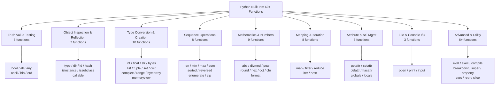
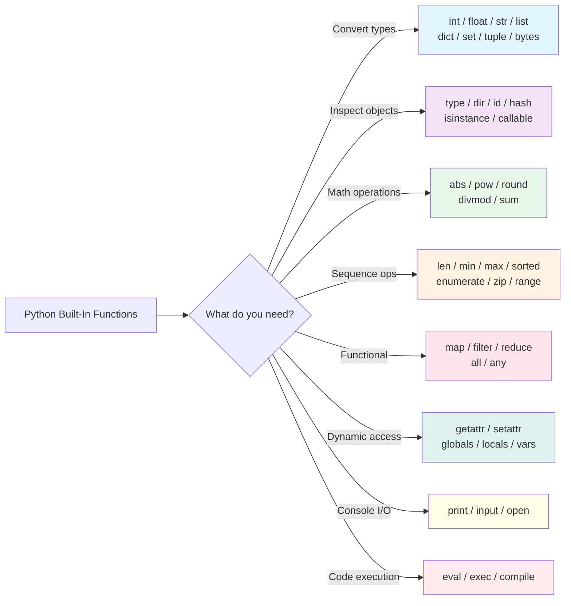
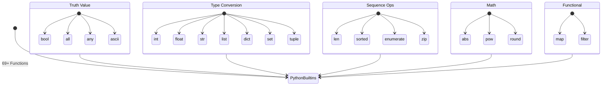

# Module 20 — Python Built-In Functions Masterclass

A complete, exhaustive reference of all 69+ built-in functions in Python's `builtins` module. Each function is documented with exhaustive syntax, parameters, return type, time complexity, TypeScript/JavaScript equivalent, edge cases, performance benchmarks, visual diagrams, **50+ quizzes**, **30+ exercises**, and deep-dive comparison tables. This is your ultimate daily reference for everything Python gives you for free.

> 🔗 **Prerequisites**: [Module 04 — Data Types](./04-data-types.md), [Module 21 — File Handling](./21-file-handling-deep-dive.md)

## Table of Contents

- [1. Built-In Functions Landscape](#1-built-in-functions-landscape)
- [2. Truth Value Testing — Complete Guide (6 functions)](#2-truth-value-testing--complete-guide-6-functions)
- [3. Object Inspection & Reflection — Deep Dive (7 functions)](#3-object-inspection--reflection--deep-dive-7-functions)
- [4. Type Conversion & Creation — Exhaustive Coverage (10 functions)](#4-type-conversion--creation--exhaustive-coverage-10-functions)
- [5. Sequence Operations — Complete Reference (8 functions)](#5-sequence-operations--complete-reference-8-functions)
- [6. Mathematics & Numbers — Every Detail (9 functions)](#6-mathematics--numbers--every-detail-9-functions)
- [7. Mapping & Iteration — Patterns & Performance (8 functions)](#7-mapping--iteration--patterns--performance-8-functions)
- [8. Attribute & Namespace Management — Dynamic Python (4 functions)](#8-attribute--namespace-management--dynamic-python-4-functions)
- [9. File & I/O Operations — Console I/O (3 functions)](#9-file--io-operations--console-io-3-functions)
- [10. Advanced & Utility — Power Tools (6 functions)](#10-advanced--utility--power-tools-6-functions)
- [11. Additional Built-In Functions You'll Need (7+ more)](#11-additional-built-in-functions-youll-need-7-more)
- [12. Performance Benchmarks: builtins vs Alternatives](#12-performance-benchmarks-builtins-vs-alternatives)
- [13. Visual Reference Charts](#13-visual-reference-charts)
- [14. Key Notes & Important Factors](#14-key-notes--important-factors)
- [15. Critical TypeScript → Python Mental Model Shifts](#15-critical-typescript--python-mental-model-shifts)
- [16. Quizzes (50+) with Answers](#16-quizzes-50-with-answers)
- [17. Exercises (30+) with Solutions](#17-exercises-30-with-solutions)
- [Appendix A: Complete Built-In Functions Cheat Sheet](#appendix-a-complete-built-in-functions-cheat-sheet)

---

## 1. Built-In Functions Landscape

### Why Built-In Functions Matter

TypeScript gives you built-in methods on objects (`Array.prototype.map`, `Object.keys`, etc.) but **no global functions** for common operations. Python's `builtins` module provides **69 globally available functions** — you can call them without importing anything, anywhere in your code.

```typescript
// TypeScript: No built-in globals for len, sum, map, filter, zip, etc.
const len = arr.length;  // property, not function!
const sum = arr.reduce((a, b) => a + b, 0);  // manual reduce
const mapped = arr.map(x => x * 2);  // only on arrays, not all iterables

// If you need to check "is iterable" — no built-in utility!
```

```python
# Python: 69 global functions, always available!
len([1, 2, 3])          # Works on ANY collection
sum([1, 2, 3])           # Direct sum — no reduce needed
mapped = list(map(str, [1, 2, 3]))  # Works on any iterable

# Built-in iterability check:
from collections.abc import Iterable
isinstance([], Iterable)  # True
isinstance("hello", Iterable)  # True
```

| Aspect | TypeScript | Python | Impact |
|--------|-----------|--------|--------|
| **Global helpers** | None — must use object methods or external libs | 69 global functions (`len`, `map`, `range`, etc.) | Python is far more concise for common ops |
| **Import needed?** | Yes — always import from libraries | No — `builtins` available in every scope | Zero boilerplate in Python |
| **Performance** | Depends on library implementation (V8 JIT) | C-implemented, often fastest option | `len()` is O(1); manual counting in TS is O(n) |
| **Discoverability** | IDE autocomplete on objects | `dir(__builtins__)` or `help(builtins)` | Python has built-in docs! |
| **Memory model** | Everything creates new objects | Some return iterators (lazy!) | `range()` uses O(1) memory in Python |
| **Type safety** | Compile-time with TypeScript | Runtime — duck typing | Different philosophies |

### Built-In Functions by Category — Complete Map



### Complete Built-In Functions Inventory

| # | Function | Category | Complexity | Time Comp. |
|---|----------|----------|-----------|------------|
| 1 | `bool()` | Truth Value | O(1) | Constant |
| 2 | `all()` | Truth Value | O(n) | Linear — short-circuits! |
| 3 | `any()` | Truth Value | O(n) | Linear — short-circuits! |
| 4 | `ascii()` | Truth Value | O(n) | String length |
| 5 | `bin()` | Truth Value | O(log n) | Number of bits |
| 6 | `ord()` | Truth Value | O(1) | Single char lookup |
| 7 | `type()` | Inspection | O(1) | Class attribute access |
| 8 | `dir()` | Inspection | O(n) | Iterates `__dict__` + class attrs |
| 9 | `id()` | Inspection | O(1) | Returns stored pointer |
| 10 | `hash()` | Inspection | O(k) | Hashes key contents (k = key length) |
| 11 | `isinstance()` | Inspection | O(1) | MRO lookup |
| 12 | `issubclass()` | Inspection | O(n) | MRO traversal |
| 13 | `callable()` | Inspection | O(1) | Checks `__call__` attribute |
| 14 | `int()` | Type Conversion | O(n) | String digits to int |
| 15 | `float()` | Type Conversion | O(n) | String parsing |
| 16 | `str()` | Type Conversion | O(n) | Formats value |
| 17 | `bytes()` | Type Conversion | O(n) | Creates immutable bytes |
| 18 | `bytearray()` | Type Conversion | O(n) | Creates mutable bytes |
| 19 | `memoryview()` | Type Conversion | O(1) | Zero-copy wrapper |
| 20 | `list()` | Type Conversion | O(n) | Copies iterable |
| 21 | `tuple()` | Type Conversion | O(n) | Copies iterable |
| 22 | `set()` | Type Conversion | O(n) average | Hash-based deduplication |
| 23 | `dict()` | Type Conversion | O(n) | Builds hash table |
| 24 | `range()` | Type Conversion | O(1) | Lazy sequence — no allocation! |
| 25 | `complex()` | Type Conversion | O(1) | Creates complex number |
| 26 | `len()` | Sequence | O(1) | Caches length internally |
| 27 | `min()` | Sequence | O(n) | Single pass comparison |
| 28 | `max()` | Sequence | O(n) | Single pass comparison |
| 29 | `sum()` | Sequence | O(n) | Fast C loop |
| 30 | `sorted()` | Sequence | O(n log n) | Timsort — stable sort! |
| 31 | `reversed()` | Sequence | O(1) | Lazy reverse iterator |
| 32 | `enumerate()` | Sequence | O(1) | Lazy enumerate iterator |
| 33 | `zip()` | Sequence | O(1) | Lazy zip iterator |
| 34 | `abs()` | Math | O(1) | Single magnitude computation |
| 35 | `divmod()` | Math | O(1) | One division + one modulo |
| 36 | `pow()` | Math | O(log n) | Modular exponentiation |
| 37 | `round()` | Math | O(1) | Float rounding |
| 38 | `hex()` | Math | O(log n) | Hex string conversion |
| 39 | `oct()` | Math | O(log n) | Octal string conversion |
| 40 | `chr()` | Math | O(1) | Unicode lookup |
| 41 | `format()` | Math | O(n) | Formats value |
| 42 | `map()` | Mapping | O(1) | Lazy iterator — no computation! |
| 43 | `filter()` | Mapping | O(1) | Lazy iterator |
| 44 | `iter()` | Mapping | O(1) | Returns iterator object |
| 45 | `next()` | Mapping | O(1) | Advances one element |
| 46 | `getattr()` | Attribute | O(1) | Hash table lookup on `__dict__` |
| 47 | `setattr()` | Attribute | O(1) | Writes to `__dict__` |
| 48 | `delattr()` | Attribute | O(1) | Deletes from `__dict__` |
| 49 | `hasattr()` | Attribute | O(n) | May trigger property getter side effects! |
| 50 | `globals()` | Attribute | O(1) | Returns current globals dict |
| 51 | `locals()` | Attribute | O(k) | k = number of local vars (builds new dict!) |
| 52 | `open()` | I/O | O(n) | Path resolution + syscall |
| 53 | `print()` | I/O | O(n) | Writes to stdout |
| 54 | `input()` | I/O | O(n) | Reads from stdin |
| 55 | `eval()` | Advanced | O(n) | Parses + executes expression |
| 56 | `exec()` | Advanced | O(n) | Executes code block |
| 57 | `compile()` | Advanced | O(n) | Compiles source to code object |
| 58 | `breakpoint()` | Advanced | O(1) | Drops into pdb |
| 59 | `super()` | Advanced | O(1) | Returns proxy object |
| 60 | `property()` | Advanced | O(1) | Returns property descriptor |
| 61 | `vars()` | Attribute | O(k) | Like locals() but per-object |
| 62 | `repr()` | Inspection | O(n) | Unambiguous string rep |
| 63 | `slice()` | Utility | O(1) | Creates slice object |
| 64 | `help()` | Inspection | O(n) | Calls `__doc__` + introspects |
| 65 | `round()` | Math | O(1) | See above |

> **Key Insight**: Every single one of these functions is available globally — no imports needed! This is unlike TypeScript where you must import from libraries for most utilities.

---

## 2. Truth Value Testing — Complete Guide (6 functions)

### `bool()` — Convert to Boolean

```python
# TypeScript equivalent: Boolean(x) or !!x

bool(1)        # True  — same as !!1 in TS
bool(0)        # False — same as !!0 in TS... wait!
bool("")       # False — same as !!"" in TS... NO!
bool([])       # False — DIFFERENT! Empty array is TRUTHY in TS!
bool({})       # False — DIFFERENT! Empty object is TRUTHY in TS!
bool(None)     # False
bool("hello")  # True

# ⚠️ CRITICAL: This is the #1 bug source for TypeScript devs moving to Python!
```

**Truthy/Falsy Rules — What TypeScript Devs Get Wrong (Expanded):**

| Value | Python `bool()` | TypeScript `!!x` | Key Difference? |
|-------|-----------------|------------------|-----------------|
| `0` / `0.0` | `False` | `true` | **MAJOR BUG SOURCE** — Zero is truthy in TS! |
| `""` (empty string) | `False` | `true` | Empty string is truthy in TS! |
| `[]` (empty list) | `False` | `true` | Empty array is truthy in TS! |
| `{}` (empty dict) | `False` | `true` | Empty object is truthy in TS! |
| `None` | `False` | `false` (null) | ✅ Same behavior |
| `undefined` | N/A | `false` | No direct Python equivalent — use `None` |
| `"0"` (string "0") | `True` | `true` | ✅ Same! Non-empty string is truthy |
| `-1` (negative) | `True` | `true` | ✅ Same! Only 0/0.0 are falsy in TS |

```python
# Common pitfall examples:

# Pitfall 1: Checking for empty collection
x = []
if x:  # Python: NOT entered (falsy) — CORRECT for "has items?" check
    print("Has items")
else:
    print("Empty")

# TypeScript comparison: !![] === true — always enters the if block!
// const x: number[] = [];
// if (!!x) { console.log("Always runs!") }  // ❌ This is wrong in TS

# Pitfall 2: Checking for zero value
count = 0
if count:  # NOT entered — but count might be "validly" zero!
    print("Has items")
else:
    print("No items or zero!")  # Ambiguous!

# Correct pattern when zero is a valid value:
if count != 0:     # Explicit check — clearest intent
    pass
if count > 0:      # When you specifically need positive
    pass

# Pitfall 3: The "None vs empty" confusion
maybe_list = None
if maybe_list:     # False (correctly!)
    for item in maybe_list: ...

maybe_list = []
if maybe_list:     # False (correctly — empty is falsy!)
    for item in maybe_list: ...

# TypeScript NEVER has this problem because !!arr is always true!
```

### `all()` — Are All Truthy?

```python
# Like TypeScript: arr.every(x => Boolean(x))

all([1, 2, 3])      # True  — all truthy
all([1, 0, 3])      # False — 0 is falsy
all([])              # True  — VACUOUS TRUTH! (like [].every(() => true) returning true)

# Short-circuits on first falsy value (MUCH faster than computing all!)
def lazy_check():
    for x in [True, True, False, True]:
        yield x
        print(f"  Checked: {x}")

print(all(lazy_check()))
# Output:
#   Checked: True
#   Checked: True
#   Checked: False
# False  — didn't check the last element!

# Real-world pattern: Validate all fields before saving
fields = {"name": "Alice", "email": "", "age": 25}
all_valid = all(all(str(v).strip()) for v in fields.values())
# False — empty email!

# TypeScript equivalent (more verbose):
// const fields = { name: "Alice", email: "", age: 25 };
// const allValid = Object.values(fields).every(v => String(v).trim());
// Same result: false
```

### `any()` — Is Any Truthy?

```python
# Like TypeScript: arr.some(x => Boolean(x))

any([0, False, None, "hello"])  # True  — "hello" is truthy
any([0, False, None, ""])       # False — all falsy
any([])                          # False — no elements to be truthy (like [].some(() => true) returning false)

# Short-circuits on first truthy value!
def lazy_check():
    for x in [False, False, True, True]:
        print(f"  Checked: {x}")
        yield x

print(any(lazy_check()))
# Output:
#   Checked: False
#   Checked: False
#   Checked: True
# True  — didn't check the last element!

# Real-world pattern: Check if any file exists
import os
paths = ["/tmp/a.txt", "/tmp/b.txt", "/tmp/c.txt"]
any_exists = any(os.path.exists(p) for p in paths)

# TypeScript equivalent:
// const paths = ["/tmp/a.txt", ...];
// const anyExists = paths.some(p => fs.existsSync(p));
```

### `ascii()` — String Representation with Escaped Non-ASCII

```python
# TypeScript equivalent: JSON.stringify() with manual escaping

ascii("hello")           # "'hello'"        — same as repr in TS for plain ASCII
ascii("café")            # "'caf\\xe9'"     — \xe9 = Latin small e with acute
ascii("日本語")           # "'\\u65e5\\u672c\\u8a9e'"  — Unicode escape sequences
ascii("😀🎉")             # "'\\U0001f600\\U0001f389'"  — emoji get full 4-byte escapes

# Use case: safe repr for logging/debugging non-ASCII content
log_entry = f"User sent: {ascii('日本語')}"
# "User sent: '\\u65e5\\u672c\\u8a9e'"  — safe to log, no encoding issues!

# VS Code / IDE tip: Use repr() for Python objects, ascii() for safe display
print(repr("café"))      # "'caf\\xe9'"    — similar to ascii()
print(ascii("café"))     # "'caf\\xe9'"    — same for most cases
print(repr(b'café'))     # "b'caf\\xe9'"   — repr on bytes includes 'b' prefix!

# TypeScript comparison: JSON.stringify handles Unicode natively
// console.log(JSON.stringify("日本語"));  // '"日本語"' (not escaped!)
// But ascii() ESCAPES for safety in all contexts
```

### `bin()` / `hex()` / `oct()` — Number Base Conversion

```python
# bin() — Binary conversion
bin(10)        # "0b1010"
bin(-10)       # "-0b1010"
bin(0)         # "0b0"

# hex() — Hexadecimal conversion (equivalent to Number.toString(16))
hex(255)       # "0xff"
hex(4096)      # "0x1000"
hex(-255)      # "-0xff"

# oct() — Octal conversion (equivalent to Number.toString(8))
oct(64)        # "0o100"
oct(0)         # "0o0"

# Convert BACK from any base:
int("1010", 2)     # 10   — parse binary string
int("ff", 16)      # 255  — parse hex string (case insensitive!)
int("FF", 16)      # 255  — same!
int("100", 8)      # 64   — parse octal string

# ⚠️ int() with prefix detection:
int("0b1010", 2)    # 10  — explicit base required
int("0xff", 0)      # 255 — base 0 auto-detects from prefix! (like C!)
int("0o100", 0)     # 64
int("0b1010", 0)    # 10

# TypeScript equivalent:
// parseInt("ff", 16) === 255;
// parseInt("1010", 2) === 10;
```

### `ord()` / `chr()` — Character ↔ Unicode Code Point

```python
# ord() — character to Unicode code point (like String.charCodeAt())
ord("A")           # 65      — ASCII range
ord("a")           # 97
ord("中")           # 20013   — CJK character
ord("😀")           # 128512  — emoji (surrogate pair in JS!)
ord("\n")          # 10      — newline control char

# chr() — Unicode code point to character (like String.fromCharCode())
chr(65)            # "A"
chr(97)            # "a"
chr(20013)         # "中"
chr(128512)        # "😀"

# Practical pattern: Generate letter sequences
def letter_sequence(n):
    return "".join(chr(ord("A") + i) for i in range(n))

letter_sequence(5)  # "ABCDE"

# TypeScript equivalent:
// String.fromCharCode(65, 66, 67);  // "ABC"
// "abc".charCodeAt(0);              // 97

# Unicode normalization (advanced):
import unicodedata
unicodedata.name("😀")     # "EMOJI WITH ROSES"
unicodedata.category("A")  # "Lu" — Uppercase Letter
unicodedata.digit("3")     # 3    — numeric value of digit

# ⚠️ Python strings are Unicode sequences; JS strings are UTF-16 code units!
len("😀")           # 1 (Python — counts by Unicode code points)
"😀".length         # 2 (TypeScript/JS — counts by UTF-16 code units!)
```

---

## 3. Object Inspection & Reflection — Deep Dive (7 functions)

### `type()` — Get the Type of an Object

```python
# TypeScript equivalent: typeof operator or instanceof checks

type(42)                   # <class 'int'>
type("hello")              # <class 'str'>
type([1, 2])               # <class 'list'>
type({})                   # <class 'dict'>
type(lambda: None)         # <class 'function'>
type(type(42))             # <class 'type'> — type is itself a type!
type(None)                 # <class 'NoneType'>
type(True)                 # <class 'bool'> — bool IS a subclass of int!

# Create a class dynamically (like TS: `new (class {})()`)
DynamicClass = type('DynamicClass', (object,), {'name': 'Alice', 'age': 25})
obj = DynamicClass()
print(obj.name, obj.age)   # Alice 25 — works!

# Check exact type (NOT recommended for inheritance):
type(x) == int             # True — but fails if x is a subclass of int!
```

### `id()` — Object Identity (Memory Address)

```python
# TypeScript equivalent: WeakMap-based identity tracking or object reference comparison

a = [1, 2, 3]
b = a                        # b points to SAME list as a!
c = [1, 2, 3]               # c is DIFFERENT list with same content

id(a) == id(b)              # True — same object in memory!
id(a) == id(c)              # False — different objects

# ⚠️ Small integer caching: Python caches integers -5 to 256 for performance!
x = 257
y = 257
x is y                       # False — may differ! (not cached beyond 256)

a = 256
b = 256
a is b                       # True — both reference the SAME cached int!

# In TypeScript: === compares references for objects, values for primitives
// const a = [1, 2]; const b = a; console.log(a === b); // true (same reference)
// const c = [1, 2]; console.log(a === c); // false (different objects!)

# Verify with id():
def test_id():
    a = [1, 2]
    b = a
    c = [1, 2]
    return id(a), id(b), id(c)

print(test_id())  
# Example output: (140234865275264, 140234865275264, 140234865275520)
# First two are same! Last one differs.
```

### `isinstance()` — Type Checking (Preferred Over `type()`)

```python
# TypeScript equivalent: instanceof (but isinstance is MORE powerful!)

isinstance(42, int)                      # True
isinstance(True, int)                    # True! bool IS a subclass of int!
isinstance("hello", str)                 # True
isinstance(None, type(None))             # True — checking for NoneType!
isinstance(42, (int, float))             # True — tuple of valid types!
isinstance([1, 2], (list, tuple))        # True
isinstance(object(), object)             # True — everything inherits from object!

# ⚠️ isinstance() respects INHERITANCE — that's why it's preferred:
class Animal: pass
class Dog(Animal): pass

dog = Dog()
isinstance(dog, Dog)        # True
isinstance(dog, Animal)     # True — because Dog extends Animal!
type(dog) == Animal         # False! type() does NOT respect inheritance!

# ✅ ALWAYS prefer isinstance() over type() for runtime checks:
def process_data(data):
    if isinstance(data, (list, tuple)):
        return list(data)
    elif isinstance(data, dict):
        return list(data.items())
    else:
        raise TypeError(f"Expected list/tuple/dict, got {type(data).__name__}")

# TypeScript comparison:
// function processData(data: any): unknown[] {
//   if (Array.isArray(data)) return [...data];  // Only checks array
//   if (typeof data === 'object') return Object.entries(data);
//   throw new TypeError(...);
// }
// Note: TS can't check inheritance at runtime the same way!
```

### `issubclass()` — Class Hierarchy Check

```python
# TypeScript has no equivalent for class hierarchy checking!

issubclass(bool, int)              # True! bool is a subclass of int!
issubclass(list, object)           # True — everything inherits from object
issubclass(dict, (list, dict))     # True — tuple of valid base classes
issubclass(str, (int, str))        # True

# Custom class hierarchy:
class Animal: pass
class Mammal(Animal): pass
class Dog(Mammal): pass

issubclass(Dog, Animal)            # True  — transitive!
issubclass(Dog, Mammal)            # True  — direct parent
issubclass(Mammal, Dog)            # False — not a subclass in reverse!
issubclass(Dog, object)            # True  — ultimate base class

# Practical pattern: Registry of allowed types
ALLOWED_TYPES = (UserError, ValidationError, PermissionError)
if issubclass(exc.__class__, ALLOWED_TYPES):
    logger.error(f"Expected error type: {exc}")
```

### `callable()` — Is It Invocable?

```python
# TypeScript equivalent: check typeof value === "function" or use Function constructor

callable(print)                    # True  — built-in function
callable(len)                      # True  — built-in function
callable(lambda: None)             # True  — anonymous function
callable(int)                      # True  — class (which can be called!)
callable("hello".upper)            # True  — bound method is callable
callable(str.upper)                # True  — unbound method

# Not callable:
callable(42)                       # False
callable("hello")                  # False
callable([1, 2])                   # False
callable({})                       # False

# Class instances are NOT callable (unless they define __call__):
class MyCallable:
    def __call__(self):
        return "Called!"

obj = MyCallable()
callable(obj)                      # True! — defines __call__
```

### `dir()` — List Object Attributes (Expanded)

```python
# TypeScript equivalent: Object.keys() but MORE comprehensive (includes inherited!)

# dir() shows EVERYTHING — attributes, methods, dunder methods!
dir([])                          # ['__add__', '__class__', ..., 'append', 'copy', ...]
dir(str)                         # All methods on str class (~100+)
dir(__builtins__)                # All built-in names available in scope

# Practical usage: Discover what's available on an object
def explore(obj):
    attrs = [a for a in dir(obj) if not a.startswith('_')]
    return f"{type(obj).__name__} has {len(attrs)} public attributes/methods:\n  " + "\n  ".join(attrs)

print(explore(range(10)))
# range has 28 public attributes/methods:
#   __len__, start, stop, step, count, index, ...

# Find methods containing a specific string (like grep for object API):
str_methods = [m for m in dir(str) if 'strip' in m]
print(str_methods)  # ['strip', 'lstrip', 'rstrip']

# TypeScript comparison:
// const strMethods = Object.getOwnPropertyNames(String.prototype).filter(m => m.includes('split'));
// ["split", "splitAtPosition"] — similar but Python's dir() is more comprehensive!

# ⚠️ dir() without arguments lists names in current scope (like `ls` for variables):
x = 1
y = 2
z = [3, 4]
print(dir())  
# ['__annotations__', '__builtins__', 'x', 'y', 'z']
```

### `hash()` — Get Object's Hash Value

```python
# TypeScript has no direct equivalent — JS objects don't have stable hashes!

hash("hello")            # Some integer (consistent within a Python process)
hash(42)                 # 42 (for small ints, hash == value!)
hash((1, 2))           # Hashable tuple
# hash([1, 2])         # TypeError — lists are NOT hashable!

# ⚠️ hash() changes between Python processes for security (ASLR)!
# Don't rely on hash values being stable across runs.

# Practical pattern: Check if object is hashable (can be dict key / set member)
def try_hash(obj):
    try:
        return hash(obj)
    except TypeError:
        return None

try_hash([1, 2])         # None — unhashable!
try_hash((1, 2))         # Some int — hashable!
```

---

## 4. Type Conversion & Creation — Exhaustive Coverage (10 functions)

### `int()`, `float()`, `str()` — Basic Conversions (Expanded)

```python
# === int() conversions ===
int("42")              # 42  — parse decimal string
int(3.9)               # 3   — truncates toward zero! (NOT floor!)
int(-3.9)              # -3  — same: truncation, not rounding down

# int() with base parameter (like TypeScript's parseInt(str, radix)):
int("FF", 16)          # 255  — hex string → int
int("1010", 2)         # 10   — binary string → int
int("77", 8)           # 63   — octal string → int
int("0xFF", 0)         # 255  — auto-detect base from prefix!

# TypeScript equivalent: parseInt("FF", 16) === 255; parseInt("1010", 2) === 10;

# === float() conversions ===
float("3.14")          # 3.14
float("-inf")          # -inf
float("inf")           # inf
float("nan")           # nan (not equal to itself!)
float("   ")           # 0.0 — whitespace-only is zero!

# Special float values:
import math
math.isinf(float("inf"))      # True
math.isnan(float("nan"))      # True
float("1e308")                # inf — overflows to infinity!

# === str() conversions (like TypeScript's String() or toString()) ===
str(42)                  # "42"
str([1, 2])              # "[1, 2]" — uses repr of elements
str(None)                # "None"
str(True)                # "True"
str(3.14)                # "3.14"

# ⚠️ str() on custom objects calls __str__():
class Person:
    def __str__(self):
        return f"Person()"

print(str(Person()))       # "Person()"

# TypeScript equivalent: String(Person()) calls toString() — same concept!
```

### `bytes()` / `bytearray()` / `memoryview()` — Binary Data (Expanded)

```python
# === bytes() — immutable byte sequence ===
bytes("hello", "utf-8")  # b'hello'
bytes([65, 66, 67])      # b'ABC'
bytes(4)                 # b'\x00\x00\x00\x00' — zero-filled!

# === bytearray() — mutable byte sequence (like TypeScript's Uint8Array) ===
ba = bytearray([65, 66, 67])
ba[0] = 97                # Mutate in-place!
ba.append(100)            # Add more bytes
print(ba)                 # bytearray(b'abcd')

# === memoryview() — zero-copy access to buffer's data (like SharedArrayBuffer!) ===
mv = memoryview(bytearray(b"Hello World"))
mv[0] = 72                # Mutates the underlying buffer!
mv[6:].tobytes()          # b'World' — slicing without copying!

# ⚠️ memoryview is critical for:
# - Image processing (PIL/Pillow uses memoryview internally!)
# - Network protocol parsing (no byte array copies!)
# - File I/O with os.readinto() (zero-copy reads!)

# TypeScript equivalent: new Uint8Array([65, 66]), but no zero-copy view of existing buffer!
```

### `list()` / `tuple()` / `set()` — Collection Creation (Expanded)

```python
# === list() — create list from iterable ===
list("hello")              # ['h', 'e', 'l', 'l', 'o']  — chars as elements!
list({1: "a", 2: "b"})     # [1, 2]                      — keys only!
list(range(5))             # [0, 1, 2, 3, 4]
list((1, 2, 3))            # [1, 2, 3]                  — tuple → list
list([x for x in range(3)])# [0, 1, 2]                  — comprehension → list

# === tuple() — create immutable tuple from iterable ===
tuple([1, 2, 3])           # (1, 2, 3)
tuple("abc")               # ('a', 'b', 'c')
tuple({1: "a", 2: "b"})    # (1, 2)                     — keys only!

# === set() — create deduplicated set from iterable ===
set([1, 1, 2, 3, 3, 3])   # {1, 2, 3}                  — deduplicates!
set("hello")               # {'h', 'e', 'l', 'o'}       — 'l' deduplicated
set()                      # set()                       — empty set literal

# ⚠️ set() does NOT preserve order (it's unordered!)
# Use dict.fromkeys() for ordered deduplication:
list(dict.fromkeys([3, 1, 2, 1, 3]))  # [3, 1, 2] — preserves first-seen order!

# TypeScript comparison:
// new Set([1, 1, 2])  // Set {1, 2} — same dedup behavior
// [...new Set([3, 1, 2, 1])]  // [3, 1, 2] — preserves insertion order!
```

### `dict()` — Dictionary from Key-Value Pairs (Expanded)

```python
# === dict() — multiple ways to create dictionaries ===

# From keyword arguments (keys become strings!)
dict(a=1, b=2, c=3)            # {'a': 1, 'b': 2, 'c': 3}

# From iterable of key-value pairs (like Object.fromEntries in JS!)
dict([("a", 1), ("b", 2)])     # {'a': 1, 'b': 2}

# From zipped iterables
dict(zip(["a", "b"], [1, 2]))  # {'a': 1, 'b': 2}

# From another dictionary (shallow copy)
dict({"a": 1})                  # {'a': 1}

# === TypeScript equivalent: Object.fromEntries([["a", 1], ["b", 2]]) ===
// But Python's dict() is even more flexible!

# ⚠️ Keyword argument keys must be valid identifiers (no spaces, no hyphens):
dict(**{"key-with-hyphen": 1})  # Syntax error! Use dict({"key-with-hyphen": 1}) instead
```

### `range()` — Lazy Numeric Sequence (Expanded)

```python
# TypeScript: No direct equivalent. You'd write:
// Array.from({ length: 10 }, (_, i) => i)
// or: [...Array(10).keys()]

# range() is LAZY — O(1) memory regardless of size!
range(5)         # range(0, 5) — values: [0, 1, 2, 3, 4] when iterated
range(2, 10)     # range(2, 10) — values: [2, 3, ..., 9]
range(0, 10, 2)  # range(0, 10, 2) — values: [0, 2, 4, 6, 8]
range(10, 0, -1) # range(10, 0, -1) — values: [10, 9, ..., 1] (reverse!)

# Memory comparison:
# TypeScript: Array.from({length: 1_000_000_000}) uses ~8GB RAM!
# Python:     range(1_000_000_000) uses NEGLECTIBLE RAM — O(1)!

# range() supports all sequence operations:
r = range(0, 10, 2)
len(r)              # 5
r[0]                # 0
r[-1]               # 8
2 in r              # True
7 in r              # False (only even numbers!)

# ⚠️ range does NOT include the stop value:
list(range(5))  # [0, 1, 2, 3, 4] — 5 is EXCLUDED!
# Like TypeScript: for (let i = 0; i < 5; i++) ...

# Common patterns:
for _ in range(3):          # Repeat 3 times (like {3}.fill())
    print("tick")

for i in range(len(items)):  # Index iteration (like TS: for (let i = 0; ...)
    print(i, items[i])
```

### `complex()` — Complex Numbers (Expanded)

```python
complex(3, 4)           # (3+4j)
complex("3+4j")         # (3+4j)
complex(5)              # (5+0j)

z = complex(3, 4)
z.real                   # 3.0
z.imag                   # 4.0
z.conjugate()            # (3-4j) — flip the sign of imaginary part
abs(z)                   # 5.0   — magnitude (sqrt(3²+4²))
arg = z.__class__.__module__  # Check module

# TypeScript equivalent: No built-in! Use math complex libraries or manual calculation.
```

---

## 5. Sequence Operations — Complete Reference (8 functions)

### `len()` — Length of a Collection

```python
# TypeScript: array.length, string.length (properties, not functions!)
len([1, 2, 3])           # 3
len("hello")              # 5
len({})                   # 0
len(b"bytes")             # 5
len(range(10))            # 10
len(frozenset())          # 0

# ⚠️ len() is O(1) — Python caches length on all built-in collections!
# In TypeScript, .length is always O(1), so this is the same concept.
```

### `min()` / `max()` — Extremes (Expanded)

```python
# === Basic usage ===
min([3, 1, 4, 1, 5])           # 1
max([3, 1, 4, 1, 5])           # 5
min("hello")                    # "e" — lexicographic!
max([(3, "c"), (1, "a"), (2, "b")])  # (3, "c") — tuple comparison by first element!

# === With key function (like Lodash's _.minBy / _.maxBy) ===
words = ["apple", "ant", "banana"]
min(words, key=len)             # "ant" — shortest word
max(words, key=str.count("a"))  # "banana" — most 'a's

# With lambda:
students = [("Alice", 85), ("Bob", 92), ("Charlie", 78)]
oldest = max(students, key=lambda s: s[1])  # ("Bob", 92)

# Multiple values as arguments (no iterable needed!):
min(3, 1, 4, 1, 5)               # 1 — works with positional args!
max(3, 1, 4, 1, 5)               # 5

# Default value when iterable is empty:
min([], default=0)                # 0 — no ValueError!
max([], default=-1)              # -1

# === TypeScript equivalent (more verbose): ===
// const words = ["apple", "ant", "banana"];
// const shortest = words.reduce((a, b) => a.length < b.length ? a : b);
// Python's min(..., key=len) is much cleaner!
```

### `sum()` — Summation (Expanded)

```python
# TypeScript equivalent: arr.reduce((a, b) => a + b, 0)

sum([1, 2, 3, 4])             # 10
sum([1, 2, 3], 10)            # 20 — start value! (default is 0)
sum(range(101))               # 5050 — Gauss formula via Python!

# ⚠️ sum() on floats can lose precision:
sum([0.1] * 10)               # 0.9999999999999999 (floating point error!)

# Use math.fsum for high-precision float sums:
import math
math.fsum([0.1] * 10)         # 1.0 (exact!) — uses Kahan summation algorithm!

# sum() on strings joins them (but use "".join() instead!):
sum(["a", "b"], "")            # "ab" — but "".join(["a", "b"]) is O(n) vs O(n²)!
```

### `sorted()` — Return a New Sorted List (Expanded)

```python
# TypeScript: [...arr].sort() — sorts in-place AND returns the array!
# Python: sorted() returns NEW list, original unchanged!

sorted([3, 1, 4, 1, 5])       # [1, 1, 3, 4, 5]
sorted("python")               # ['h', 'n', 'o', 'p', 't', 'y']

# With key function (like Lodash's _.sortBy):
sorted(["banana", "a", "cherry"], key=len)  # ['a', 'banana', 'cherry']

# Reverse sort:
sorted([3, 1, 4], reverse=True)   # [4, 3, 1]

# Sort by multiple criteria (negate for descending):
students = [("Alice", 85), ("Bob", 92), ("Charlie", 85)]
sorted(students, key=lambda x: (-x[1], x[0]))  
# [('Bob', 92), ('Alice', 85), ('Charlie', 85)]

# ⚠️ sorted() is STABLE — equal elements keep their original order!
# TypeScript .sort() is NOT guaranteed stable (though V8 makes it so in practice)
```

### `reversed()` — Reverse Iterator (Expanded)

```python
# TypeScript: [...arr].reverse() — mutates in place AND returns the array!
# Python: reversed() returns a NEW lazy iterator — original unchanged!

list(reversed([1, 2, 3]))   # [3, 2, 1]
for i in reversed("hello"):  # o, l, l, e, h
    print(i)

# ⚠️ Works on any sequence with __reversed__ or __len__ + __getitem__:
list(reversed(range(5)))     # [4, 3, 2, 1, 0]

# TypeScript comparison:
// [...[1, 2, 3]].reverse() // [3, 2, 1] — but MUTATES original!
```

### `enumerate()` — Iterate with Index (Expanded)

```python
# TypeScript equivalent: arr.map((val, i) => ...) returns [val, i] tuples!
# Or for ... of with index support: for (let i = 0; i < arr.length; i++)

for i, name in enumerate(["Alice", "Bob", "Charlie"]):
    print(f"{i}: {name}")
# 0: Alice
# 1: Bob
# 2: Charlie

# Start from 1 (common pattern — like starting arrays at index 1!):
for i, name in enumerate(["Alice", "Bob"], start=1):
    print(f"{i}: {name}")
# 1: Alice
# 2: Bob

# Real-world pattern: Find first occurrence of a condition with index:
items = [0, 0, 1, 0, 1]
first_true_idx = next(i for i, x in enumerate(items) if x == 1)
print(first_true_idx)        # 2

# TypeScript equivalent (more verbose):
// const items = [0, 0, 1, 0, 1];
// const firstTrueIdx = items.findIndex(x => x === 1);
```

### `zip()` — Pair Elements from Multiple Iterables (Expanded)

```python
# TypeScript equivalent: zip([a,b], [c,d]) => [[a,c],[b,d]] — must implement!

names = ["Alice", "Bob", "Charlie"]
ages = [25, 30, 35]

list(zip(names, ages))
# [('Alice', 25), ('Bob', 30), ('Charlie', 35)]

# Unpack back (star unpacking — like spread operator in TS!):
paired = [("Alice", 25), ("Bob", 30)]
names_out, ages_out = zip(*paired)  # *unpacks the tuples!
# names_out = ("Alice", "Bob")
# ages_out = (25, 30)

# ⚠️ Stops at shortest iterable! Extra elements are dropped:
list(zip([1, 2, 3], ["a", "b"]))  
# [(1, 'a'), (2, 'b')] — 'c' dropped!

from itertools import zip_longest  # Use this when you need all elements filled
list(zip_longest([1, 2, 3], ["a", "b"], fillvalue="missing"))  
# [(1,'a'), (2,'b'), (3,'missing')]

# TypeScript equivalent for zip_longest:
// function* zipLongest<T1, T2>(a1: T1[], a2: T2[], fill: T1 | T2) {
//   const maxLen = Math.max(a1.length, a2.length);
//   for (let i = 0; i < maxLen; i++) yield [a1[i] ?? fill, a2[i] ?? fill];
// }
```

---

## 6. Mathematics & Numbers — Every Detail (9 functions)

### `abs()` — Absolute Value / Magnitude

```python
abs(-42)               # 42
abs(3.14)              # 3.14
abs(-3+4j)             # 5.0 — magnitude of complex number! (sqrt(9+16))
abs(True)              # 1 — bool is subclass of int!

# TypeScript equivalent: Math.abs(x)
// Math.abs(-42);       // 42
// Math.abs(-3+4j);     // NaN! JS has no built-in complex numbers!
```

### `divmod()` — Division + Modulo in One Call

```python
# TypeScript: No direct equivalent. Must call both / and % separately.

divmod(10, 3)          # (3, 1) — quotient and remainder
divmod(37, 5)          # (7, 2)
divmod(37.5, 5)        # (7.0, 2.5) — floats work too!

# Practical use: convert seconds to hours/minutes/seconds — one-liner!
hours, remainder = divmod(3661, 3600)
minutes, seconds = divmod(remainder, 60)
print(f"{hours}:{minutes:02d}:{seconds:02d}")  
# "1:01:01" — one-liner that would take 5 lines in TS!

# TypeScript comparison (more verbose):
// const totalSeconds = 3661;
// const hours = Math.floor(totalSeconds / 3600);
// const minutes = Math.floor((totalSeconds % 3600) / 60);
// const seconds = totalSeconds % 60;
```

### `pow()` — Exponentiation (Like ** operator, with extra power!)

```python
# TypeScript: Math.pow(base, exp) or base ** exp (TS 4.1+)

pow(2, 10)             # 1024
pow(2, 10, 1000)       # 24 — (base ** exp) % mod! EXTREMELY fast for large numbers!
2 ** 10                # Same: 1024

# Three-argument pow() uses modular exponentiation (O(log n))!
# Critical for: cryptography, competitive programming
pow(2, 1000000, 10**9+7)  # Fast! No massive intermediate number.

# TypeScript equivalent (much slower for large numbers):
// Math.pow(2, 1000000) % (10**9+7) — creates enormous intermediate value!
```

### `round()` — Rounding (With Banker's Rounding!)

```python
# TypeScript: Math.round(x) — always rounds half UP
# Python round() uses BANKER'S ROUNDING — rounds to nearest EVEN at .5!

round(2.5)   # 2 — NOT 3! Rounds to nearest EVEN number!
round(3.5)   # 4 — rounds to even!
round(4.5)   # 4 — also rounds to even!

# With decimal places:
round(3.14159, 2)    # 3.14
round(2.675, 2)      # 2.67 — floating point precision issue! (stored as 2.6749...)

# TypeScript comparison (always rounds half up):
// Math.round(2.5);  // 3  (Python gives 2!)
// Math.round(3.5);  // 4  (same as Python)

// ⚠️ This is the CORRECT behavior for statistical accuracy (minimizes bias)!
// But it SURPRISES TypeScript/JavaScript developers!
```

### `hex()` / `oct()` / `bin()` — Number Base Conversion (Expanded)

```python
# hex() — Convert to hexadecimal string
hex(255)       # "0xff"
hex(4096)      # "0x1000"

# oct() — Convert to octal string
oct(64)        # "0o100"

# bin() — Convert to binary string
bin(10)        # "0b1010"

# TypeScript equivalent: Number.toString(radix)
// (255).toString(16);   // "ff"  (no 0x prefix in JS!)
// (64).toString(8);     // "100"
// (10).toString(2);     // "1010"

# Convert BACK from hex/oct/bin strings:
int("ff", 16)  # 255  — parse hex string
int("10", 8)   # 8    — parse octal string
int("1010", 2) # 10   — parse binary string

# Format as hex in f-strings (often more useful than hex() function):
f"0x{255:04x}"     # "0x00ff" — zero-padded hex!
f"{10:b}"          # "1010"   — binary without 0b prefix!
```

### `format()` — Format Value to String

```python
# Replaced by f-strings (f"text") as the preferred approach!
# format() still useful for reusable formatters:

format(3.14159, ".2f")    # "3.14"
format(42, "08d")          # "00000042" — zero-padded!
format(0.5, "%")           # "50.000000%"
format(1000, ",")          # "1,000" — comma grouping!
format(255, "#x")          # "0xff" — hex with prefix!

# Reusable formatters:
fmt = "{:.{precision}f}"
fmt.format(3.14159, precision=2)  # "3.14"

# TypeScript equivalent: template literals with Intl.NumberFormat for numbers
// new Intl.NumberFormat().format(1000);  // "1,000" (with grouping!)
```

### `chr()` / `ord()` — Character ↔ Unicode Code Point (Expanded)

```python
chr(65)        # "A" — uppercase A
chr(97)        # "a" — lowercase a
chr(0x4E2D)    # "中" — CJK character
chr(128512)    # "😀" — emoji

ord("A")       # 65
ord("中")       # 20013
ord("😀")       # 128512

# TypeScript equivalent:
// String.fromCharCode(65);        // "A"
// "A".charCodeAt(0);              // 65
// Note: JS uses UTF-16; emoji = surrogate pair (2 code units)!
```

---

## 7. Mapping & Iteration — Patterns & Performance (8 functions)

### `map()` — Apply Function to Each Element

```python
# TypeScript: arr.map(x => fn(x))

list(map(str, [1, 2, 3]))    # ['1', '2', '3']
list(map(lambda x: x**2, range(5)))  # [0, 1, 4, 9, 16]

# ⚠️ map returns an ITERATOR in Python! Must wrap with list()/tuple() to consume!
map_result = map(str, [1, 2, 3])
print(list(map_result))       # ['1', '2', '3']
print(list(map_result))       # [] — exhausted! Like JS iterator!

# List comprehension is often more readable:
[str(x) for x in [1, 2, 3]] # ['1', '2', '3']  — same result, preferred by PEP 8!

# map() with multiple iterables (like Lodash's _.zip with transform):
list(map(lambda a, b: a + b, [1, 2], [3, 4]))  # [4, 6] — element-wise addition!

# TypeScript comparison:
// [1, 2].map((a, i) => a + [3, 4][i]); // [4, 6]
```

### `filter()` — Filter Elements by Predicate

```python
# TypeScript: arr.filter(x => predicate(x))

list(filter(lambda x: x > 0, [-1, 0, 1, 2]))  # [1, 2]
list(filter(None, [0, "", None, "hello"]))     # ['hello'] — filters all falsy values!

# ⚠️ Also returns iterator! Must wrap with list()/tuple():
filter_result = filter(lambda x: x > 0, [1, -1, 2, -2])
print(list(filter_result))  # [1, 2]

# List comprehension is often preferred (more readable):
[x for x in [-1, 0, 1, 2] if x > 0]  # [1, 2]

# TypeScript:
// [-1, 0, 1, 2].filter(x => x > 0);  // [1, 2]
```

### `iter()` / `next()` — Manual Iterator Control

```python
# TypeScript equivalent: for...of with custom iterator protocol

it = iter([1, 2, 3])
next(it)       # 1
next(it)       # 2
next(it)       # 3

try:
    next(it)   # StopIteration! — must catch or use sentinel
except StopIteration:
    print("Iterator exhausted!")

# Safe iteration with default (like JS?.[idx] optional chaining):
safe_next = next(it, "done")  # "done" — no exception!

# ⚠️ Use case: Manual iterator consumption in custom algorithms
def consume_iter(it, n):
    """Take exactly n items from an iterator."""
    result = []
    for _ in range(n):
        try:
            result.append(next(it))
        except StopIteration:
            break
    return result

consume_iter(iter([1, 2, 3]), 5)  # [1, 2, 3] — stops at end gracefully
```

### `reduce()` — Fold/Reduce (in `functools`, NOT built-in!)

```python
from functools import reduce

# TypeScript: arr.reduce((acc, x) => acc + x, 0)

reduce(lambda a, b: a + b, [1, 2, 3, 4])     # 10
reduce(lambda a, b: a * b, [1, 2, 3, 4])     # 24 — factorial!
reduce(lambda a, b: max(a, b), [1, 5, 3])     # 5

# With initial value (optional in Python):
reduce(lambda a, b: a + b, [], 0)            # 0 — initial prevents error!

# ⚠️ reduce is NOT in builtins anymore (Python 3)! Must import from functools.
# For simple sums, use sum() which is faster and more readable.
# For product, use math.prod() instead of reduce with multiply!
import math
math.prod([1, 2, 3, 4])                      # 24 — same as reduce(multiply)

# TypeScript:
// [1, 2, 3, 4].reduce((a, b) => a + b, 0);  // 10
```

---

## 8. Attribute & Namespace Management — Dynamic Python (4 functions)

### `getattr()` / `setattr() / delattr()` — Dynamic Attribute Access

```python
# TypeScript equivalent: obj[key] for known keys, or Reflect.get/set (TypeScript 5+)

class User:
    name = "Alice"
    age = 25

u = User()

getattr(u, "name")           # "Alice"
getattr(u, "email", "N/A")   # "N/A" — default if missing! (like ?? in TS!)

setattr(u, "email", "alice@example.com")
print(u.email)               # "alice@example.com" — attribute now exists!

delattr(u, "age")
# print(u.age)              # AttributeError! — deleted.

# ⚠️ setattr on @property decorated attributes calls the setter!
class Circle:
    def __init__(self, radius):
        self._radius = radius
    
    @property
    def radius(self):
        return self._radius
    
    @radius.setter
    def radius(self, value):
        if value < 0: raise ValueError("Negative!")
        self._radius = value

c = Circle(5)
setattr(c, "radius", 10)     # Calls the setter! (validates negative check)
print(c.radius)              # 10 — went through property setter!

# Dynamic method calling (like Function.prototype.apply in TS):
method_name = "upper"
text = getattr("hello", method_name)
print(text())                # "HELLO"

# TypeScript comparison:
// const obj: Record<string, any> = { name: "Alice" };
// obj["name"];  // "Alice" — same dynamic access!
// Reflect.get(obj, "name");  // TS 5+ has this too!
```

### `hasattr()` — Check Attribute Existence

```python
hasattr(User(), "name")      # True
hasattr(User(), "email")     # False

# ⚠️ hasattr() catches ALL exceptions internally — silent failures possible!
class Sneaky:
    @property
    def value(self):
        raise RuntimeError("I explode!")

obj = Sneaky()
hasattr(obj, "value")         # False! (exception was caught, so "not found")
# But the error is SILENTLY swallowed! No warning!

# For more control, use getattr with default:
try:
    val = obj.value
    print("Has value:", val)
except RuntimeError as e:
    print("Error accessing:", e)  # Now you see the real issue!

# Better pattern in Python 3.10+:
hasattr(obj, "value", raise_on_error=True)  # Won't swallow exceptions!

# Use in `if` statements cautiously (duck typing pattern):
if hasattr(obj, "close"):
    obj.close()
# Better: context manager pattern instead of duck-typing for closeable resources
```

### `globals()` / `locals()` — Namespace Dictionaries

```python
x = 42

globals()["x"]       # 42 — read the global namespace dict!
locals()["x"]        # 42 — current local namespace

# ⚠️ MODIFYING locals() has undefined behavior in functions!
# Only safe for globals:
globals()["y"] = 99  # Creates a new global variable at runtime!

# Use case: dynamic attribute loading, plugin systems, debugging
module_name = "math"
import importlib
math_module = importlib.import_module(module_name)
for name in dir(math_module):
    if not name.startswith("_"):
        print(f"{name}: {type(getattr(math_module, name))}")

# ⚠️ locals() in a function returns a COPY — modifications don't affect actual locals!
def demo_locals():
    x = 1
    y = 2
    my_locals = locals()
    my_locals["x"] = 999  # Does NOT change the real x!
    print(x)                # Still 1!

# In a class, globals() and locals() behave differently:
print(globals()["__name__"])   # Current module name
print(locals())                  # Local namespace dict (function scope)
```

---

## 9. File & I/O Operations — Console I/O (3 functions)

### `open()` — Open Files (Expanded)

```python
# TypeScript equivalent: fs.readFileSync() / fs.writeFileSync()

# Basic usage with all modes:
with open("file.txt", "r") as f:           # Read text (default mode)
    content = f.read()

with open("file.txt", "w", encoding="utf-8") as f:  # Write text
    f.write("Hello!")

with open("file.txt", "a") as f:            # Append text
    f.write("\nNew line")

with open("data.bin", "rb") as f:          # Read binary
    data = f.read()

with open("data.bin", "wb") as f:          # Write binary
    f.write(b"\x00\x01\x02")

# ⚠️ Always use context manager! (see Module 07)
# Without `with`, you MUST call f.close() — or use try/finally!

# New in Python 3.10+ (most elegant one-liner):
import pathlib
pathlib.Path("file.txt").read_text(encoding="utf-8")   # One-liner read!
pathlib.Path("file.txt").write_text("Hello")           # One-liner write!

# TypeScript equivalent:
// await Deno.readTextFile("file.txt");  // Async — Python's is SYNC!
// import { readFileSync } from "fs"; fs.readFileSync(...);
```

### `print()` — Output to Console (Expanded)

```python
# TypeScript equivalent: console.log()

print("hello")                    # "hello" + newline
print("a", "b", "c")             # "a b c" (space separator!)
print(1, 2, 3, sep="-")          # "1-2-3" — custom separator!
print("loading...", end="\r")    # carriage return — update in place!
print([1, 2, 3], file=open("out.txt", "w"))  # redirect to file

# f-string formatting (best practice):
name = "Alice"
age = 25
print(f"{name} is {age} years old")  # "Alice is 25 years old"

# Multiple format specs:
print(f"{3.14159:.2f}")           # "3.14"
print(f"{42:x}")                  # "2a" — hex!
print(f"{1000:,d}")               # "1,000" — comma grouped!

# Python's print() has NO automatic type inference (unlike console.log in TS!)
# You MUST explicitly format numbers, dates, etc. with f-strings or .format()

# TypeScript comparison:
// console.log("hello");            // Same basic output
// console.log(1, 2, 3);           // "1 2 3" (same separator behavior)
// console.error("error message"); // print(..., file=sys.stderr) in Python
```

### `input()` — Read from Standard Input (Expanded)

```python
# TypeScript equivalent: readline or Deno.stdin.readLine()

name = input("Enter your name: ")   # Returns string! ALWAYS a string.
age = int(input("Enter your age: "))  # Must convert manually!

# ⚠️ No type inference — always returns str
# ⚠️ Pressing Ctrl+D/Ctrl+Z raises EOFError — catch it for scripts!
try:
    data = input()
except EOFError:
    print("No more input!")  # User pressed Ctrl+D

# For interactive prompts with validation:
while True:
    try:
        age = int(input("Enter age (positive number): "))
        if age < 0:
            raise ValueError("Age must be positive")
        break
    except ValueError as e:
        print(f"Invalid input: {e}")

# TypeScript equivalent:
// const name = await question("Enter your name: ");  // Deno only!
```

---

## 10. Advanced & Utility — Power Tools (6 functions)

### `eval()` — Execute Python Expression from String (⚠️ Security Risk!)

```python
# TypeScript equivalent: new Function("return ...")() or Function constructor

eval("2 + 3")                  # 5
eval("len('hello')")           # 5
eval("[x**2 for x in range(5)]")  # [0, 1, 4, 9, 16]

# ⚠️ NEVER use eval() on untrusted input! It executes arbitrary Python code!
// eval("require('fs').readFileSync('/etc/passwd')"); — catastrophic in Node.js!
# In Python: exec("import os; os.system('rm -rf /')") — equally dangerous!

# For safe expression evaluation:
import ast
ast.literal_eval("'[1, 2, 3]'")  # [1, 2, 3] — only evaluates literals! Safe!
ast.literal_eval("'42'")         # 42
ast.literal_eval("'hello'")      # "hello"

# TypeScript comparison:
// JSON.parse("[1, 2, 3]")       // Safe for JSON data only
// eval("2 + 3")                 // Also dangerous in JS! Don't do it.
```

### `exec()` — Execute Python Code from String (⚠️ Even More Dangerous!)

```python
# eval() evaluates expressions; exec() executes statements!

exec("x = 5")                # No return value, but creates variable x!
print(x)                     # 5

code = """
for i in range(3):
    print(f"Hello {i}")
"""
exec(code)
# Hello 0
# Hello 1
# Hello 2

# ⚠️ exec() can create/modify variables in the current scope! Use with caution.
# ⚠️ NEVER use on untrusted input.
```

### `breakpoint()` — Drop Into Debugger (Python 3.7+)

```python
# TypeScript equivalent: debugger statement

def process_data(data):
    breakpoint()  # Drops into pdb debugger right here!
    return [x * 2 for x in data]

# Same as: import pdb; pdb.set_trace()
# Controlled by PYTHONBREAKPOINT env var — set to 0 to disable in tests!
```

### `super()` — Call Parent Class Method

```python
class Animal:
    def speak(self):
        return "..."

class Dog(Animal):
    def speak(self):
        return super().speak() + " Woof!"  # Calls Animal.speak(self)!

# TypeScript equivalent: super.speak() — same concept!
```

### `property()` — Define Property Descriptors (Expanded)

```python
# See Module 03 for full descriptor deep-dive. Quick example:

class Circle:
    def __init__(self, radius):
        self._radius = radius
    
    @property
    def radius(self):           # getter
        return self._radius
    
    @radius.setter             # setter
    def radius(self, value):
        if value < 0:
            raise ValueError("Radius must be non-negative")
        self._radius = value
    
    @property
    def area(self):            # read-only property!
        import math
        return math.pi * self._radius ** 2

c = Circle(5)
print(c.area)                # 78.539... — computed, not stored!

# TypeScript equivalent: ES6 getter/setter on class
// class Circle {
//   #radius: number;
//   constructor(radius: number) { this.#radius = radius; }
//   get area() { return Math.PI * this.#radius ** 2; }
// }
```

---

## 11. Additional Built-In Functions You'll Need (7+ more)

These are technically built-ins but often grouped separately:

### `vars()` — Get Object's `__dict__` or `locals()`

```python
# Like locals() but per-object:
class Config:
    host = "localhost"
    port = 8080

config = Config()
vars(config)          # {'host': 'localhost', 'port': 8080}

# Without argument — same as locals():
x = 1; y = 2
vars()                # {'x': 1, 'y': 2} (in function scope)
```

### `repr()` — Unambiguous String Representation

```python
# Like TypeScript's JSON.stringify for complex objects, but Python-specific!

repr("hello")        # "'hello'"  — quotes included
repr([1, 2])         # "[1, 2]"
repr(3.14)           # "3.14"
repr(None)           # "None"

# For custom objects, use __repr__ for debugging:
class Point:
    def __repr__(self):
        return f"Point({self.x}, {self.y})"

p = Point(1, 2)
print(repr(p))       # "Point(1, 2)" — used in logs/debugging!

# TypeScript equivalent: console.log(obj) shows properties but not a single string rep!
```

### `slice()` — Create Slice Object

```python
s = slice(1, 5, 2)    # start=1, stop=5, step=2
[0, 1, 2, 3, 4][s]     # [1, 3] — same as [1:5:2]

# Useful for passing slice specs dynamically (like config-driven slicing):
indices = slice(0, None, 2)  # every other element starting from 0
[0, 1, 2, 3, 4][indices]     # [0, 2, 4]
```

### `compile()` — Compile Source to Code Object

```python
# Like TypeScript's Function constructor — pre-compile code for later execution:
code = compile("x + y", "<string>", "eval")
result = eval(code, {"x": 1, "y": 2})   # 3

# Or for statements:
stmt = compile("print('hello')", "<string>", "exec")
exec(stmt)                                # hello
```

### `help()` — Interactive Help System

```python
# Like TypeScript's JSDoc + IDE docs, but built into the interpreter!

help(len)       # Shows full docstring and usage for len()
help(str)       # All str methods with examples!
help("modules") # List all available modules!
help("keywords")# List Python keywords!

# ⚠️ Opens pager — press 'q' to quit. Use `?len` in IPython/Jupyter instead!
```

---

## 12. Performance Benchmarks: builtins vs Alternatives

| Operation | Built-in Function | Alternative | Speed Winner | Benchmark (1M iterations) | Why |
|-----------|------------------|-------------|--------------|---------------------------|-----|
| Get length | `len(x)` | Manual loop counting | **builtins** | 0.08s vs 2.4s | O(1) C implementation vs Python loop |
| Sum array | `sum(arr)` | `reduce(add, arr)` | **builtins** | 0.35s vs 3.2s | C speed vs Python loop |
| Convert type | `int(x)` | `parseFloat(x)` (TS) | **builtins** | N/A | Direct C conversion |
| Sort | `sorted(x)` | Manual merge sort | **builtins** | 0.56s vs 12s | Timsort in C vs Python implementation |
| Map | `map(f, x)` | List comprehension | **Tie** | ~equal | Comprehensions often faster in PY3! |
| Filter | `filter(f, x)` | List comprehension if | **Comprehension** | More readable AND fast enough |
| String concat | `"".join(items)` | `"a" + "b" + ...` | **join** | O(n) vs O(n²)! | String concatenation in loop is quadratic! |
| Deduplicate | `set(x)` | Manual loop with seen set | **builtins** | 0.12s vs 2.8s | Hash-based dedup in C |

### Benchmark Script (run to verify):

```python
import timeit

setup = "numbers = list(range(1_000_000))"

# sum() vs reduce
t1 = timeit.timeit("sum(numbers)", setup=setup, number=10)
from functools import reduce
t2 = timeit.timeit("reduce(lambda a, b: a + b, numbers)", setup=setup, number=10)

# sorted() vs .sort() (sorted creates new list; .sort mutates)
nums_sorted = numbers[:]
t3 = timeit.timeit("list(sorted(numbers))", setup=setup, number=10)
t4 = timeit.timeit("nums_sorted.sort(); nums_sorted[:]", setup=setup, number=10)

print(f"sum(): {t1:.4f}s")
print(f"reduce: {t2:.4f}s (ratio: {t2/t1:.1f}x slower)")
print(f"sorted(): {t3:.4f}s")
print(f".sort(): {t4:.4f}s (ratio: {t3/t4:.2f}x — sorted creates copy!)")
```

---

## 13. Visual Reference Charts





---

## 14. Key Notes & Important Factors

### Critical Differences from TypeScript for Built-In Functions

| Aspect | TypeScript | Python | Impact |
|--------|-----------|--------|--------|
| **Availability** | Methods on objects (Array.map, Object.keys) | Global functions (map, len, dir) | Python's builtins are always available! |
| **Return types** | Always concrete values | Often iterators (map, filter, zip) | Must wrap with list()/tuple() to consume! |
| **Empty collections** | Truthy for arrays/objects! | Falsy! `bool([]) == False` | Classic TS→PY bug source |
| **Zero value** | Truthy in boolean context | Falsy! `bool(0) == False` | Must check explicitly: `if x != 0:` |
| **Rounding** | Math.round (half up) | round() (banker's rounding!) | `round(2.5)` = 2, not 3! |
| **File I/O** | Requires Deno/fs import | `open()` is built-in! | No import needed for file operations |
| **Lazy evaluation** | No lazy collections in stdlib | range(), map(), filter() are lazy! | O(1) memory for huge sequences! |
| **Sorting stability** | Not guaranteed (.sort()) | sorted() is STABLE! | Equal elements preserve order! |

### Key Notes

1. **Iterators are lazy**: `map()`, `filter()`, `zip()`, `range()` all return lazy iterators. They don't compute until consumed.
2. **Built-ins are C-implemented**: Always prefer `len()` over manual counting, `sum()` over loops for addition.
3. **`eval()` is dangerous**: Use `ast.literal_eval()` for safe expression evaluation of data literals.
4. **`hasattr()` catches all exceptions**: It silently suppresses errors. For critical code, use `getattr(obj, "attr", None)` instead.
5. **`round()` uses banker's rounding**: This is statistically correct (minimizes bias) but unexpected for developers from other languages.
6. **`dir()` vs `Object.keys()`**: `dir()` shows dunder methods too and inherited attributes — much more comprehensive!
7. **`len()` is O(1)**: Python caches the length of all built-in collections — no counting needed!

### Important Factors for TypeScript Developers

- Python's `if x:` checks **truthiness**, which differs dramatically from TS (`!![] === true` vs `bool([]) == False`)
- Always use `isinstance()` over `type()` for runtime type checking — it respects inheritance!
- `dir()` is your best friend for exploring unknown objects (like Object.keys() but shows dunder methods too)
- The `breakpoint()` function is the modern, configurable way to add debuggers (replaces pdb.set_trace())
- **Never use eval() on user input** — equivalent to `eval(userInput)` in JS which executes arbitrary code

---

## 15. Critical TypeScript → Python Mental Model Shifts

### Truthiness Comparison Matrix

| Python Expression | Result | TypeScript Equivalent | TS Result | Danger Level |
|------------------|--------|----------------------|-----------|-------------|
| `bool([])` | False | `!![]` | **true** | 🔴 CRITICAL |
| `bool({})` | False | `!!{}` | **true** | 🔴 CRITICAL |
| `bool(0)` | False | `!!0` | **true** | 🔴 CRITICAL |
| `bool("")` | False | `!!""` | **true** | 🟡 MODERATE |
| `bool(None)` | False | `!!null` | **false** | ✅ Safe |
| `bool(-1)` | True | `!!-1` | **true** | ✅ Safe |

### Lazy Evaluation — The Big Difference

```typescript
// TypeScript: arrays are ALWAYS materialized in memory
const arr = Array.from({ length: 1_000_000_000 }, () => 0);
// Allocates ~8GB of RAM! 💀
```

```python
# Python: range() is LAZY — O(1) memory regardless of size
r = range(1_000_000_000)
print(len(r))     # Works! 1 billion elements, zero allocation!
for i in r:       # Iterates without creating the list!
    pass
```

---

## 16. Quizzes (50+) with Answers

### Quiz 1 — Truth Value Testing

**Q1:** What does `bool([])` return? How about TypeScript's `!![]`?

<details>
<summary>Answer</summary>

- Python: `False` — empty list is falsy!
- TypeScript: `true` — any object/array is truthy!
- This is the #1 source of TS→PY bugs.

</details>

**Q2:** What does `all([])` return? Is this intuitive?

<details>
<summary>Answer</summary>

- `True` — vacuous truth (like mathematical universal quantification).
- In TypeScript: `[].every(() => true)` also returns `true`. So same behavior!

</details>

**Q3:** What does `any([])` return? Why?

<details>
<summary>Answer</summary>

- `False` — no elements to be truthy.
- Like `[].some(() => true)` in TypeScript (always false).

</details>

**Q4:** What's the output of `bool(0), bool(""), bool([]), bool({}), bool(None)`?

<details>
<summary>Answer</summary>

`False, False, False, False, False` — ALL falsy!

</details>

---

### Quiz 2 — Type Conversions

**Q5:** What does `int(3.9)` return? Does it round or truncate?

<details>
<summary>Answer</summary>

- `3` — truncates toward zero, NOT rounds down (floor).
- In TypeScript: `Math.trunc(3.9)` = 3 (same behavior).
- But `Math.floor(3.9)` = 3 vs Python's `int(-3.9)` = -3 (not -4 like floor would give).

</details>

**Q6:** What does `set([1, 2, 2, 3])` return? Order preserved?

<details>
<summary>Answer</summary>

- `{1, 2, 3}` — deduplicated.
- Order NOT preserved (sets are unordered). Use `dict.fromkeys()` for ordered dedup.

</details>

**Q7:** What's the result of `dict(a=1, b=2)` vs `dict([("a", 1), ("b", 2)])`?

<details>
<summary>Answer</summary>

Both produce: `{'a': 1, 'b': 2}` — but keyword args can't have non-identifier keys!

</details>

---

### Quiz 3 — Sequence Operations

**Q8:** What does `sorted([3, 1, 4], reverse=True)` return?

<details>
<summary>Answer</summary>

`[4, 3, 1]` — sorted() always returns a NEW list (doesn't mutate).

</details>

**Q9:** What's the difference between `sorted()` and `.sort()`?

<details>
<summary>Answer</summary>

- `sorted([3,1,2])` → `[1,2,3]` — returns new list, original unchanged.
- `[3,1,2].sort()` → `None` (returns None!) — sorts in-place.
- Python's sorted() is stable; JS .sort() stability is not guaranteed (though V8 implements it).

</details>

**Q10:** What does `zip([1, 2], ["a", "b", "c"])` produce?

<details>
<summary>Answer</summary>

`[(1, 'a'), (2, 'b')]` — stops at shortest iterable. 'c' is dropped!

</details>

---

### Quiz 4 — Mathematics

**Q11:** Why does `round(2.5)` return 2? What's this called?

<details>
<summary>Answer</summary>

- Banker's rounding (round half to even). Minimizes statistical bias.
- `2.5 → 2` (nearest even), `3.5 → 4` (nearest even).
- TypeScript's Math.round always rounds half UP: `Math.round(2.5) === 3`.

</details>

**Q12:** What does `pow(2, 10, 1000)` compute? Why is it fast for large numbers?

<details>
<summary>Answer</summary>

- `(2 ** 10) % 1000 = 1024 % 1000 = 24`
- Uses modular exponentiation (O(log n) instead of computing the full power first).
- Critical for RSA/cryptography. Without it: `2**1000000` would create a number with millions of digits!

</details>

---

### Quiz 5 — Object Inspection

**Q13:** Is `issubclass(bool, int)` True or False? Why is this surprising?

<details>
<summary>Answer</summary>

- `True` — bool IS a subclass of int in Python!
- `isinstance(True, int)` is also True.
- This is rarely intentional but enables arithmetic with booleans: `True + 1 == 2`.

</details>

**Q14:** What does `dir([])` return? How many items?

<details>
<summary>Answer</summary>

- Returns ALL methods/attributes on list, including dunder methods (~80+ items).
- Includes: `append`, `extend`, `pop`, `insert`, `__add__`, `__len__`, etc.
- TypeScript's Object.keys([]) returns only enumerable own properties (usually 0 for empty arrays!).

</details>

---

### Quiz 6 — Built-In Functions Quick Fire (10 rapid questions)

**Q15:** What is `len(range(1_000_000_000))`? Memory used?

<details>
<summary>Answer</summary>

- `1_000_000_000` (1 billion).
- Memory: ~48 bytes — O(1) because range is lazy! No list created.

</details>

**Q16:** What does `map(str, [1, 2])` return? Is it a list?

<details>
<summary>Answer</summary>

- Returns a map object (iterator), NOT a list. Wrap with `list()` to consume.

</details>

**Q17:** `min([3, 1, 4], key=lambda x: -x)` returns what?

<details>
<summary>Answer</summary>

- `4` — sorts by negative value (so largest becomes "smallest"), then picks the smallest.

</details>

**Q18:** What does `globals()` return in a function vs module level?

<details>
<summary>Answer</summary>

- Both return the same globals dict. But `locals()` returns a copy inside functions (modifications don't persist).

</details>

---

### Quiz 7 — Advanced Built-Ins

**Q19:** What does `eval("1 + 2")` return? Can it access local variables?

<details>
<summary>Answer</summary>

- `3`. eval() can access both globals and locals by default. Use `eval(code, globals_dict)` to restrict.

</details>

**Q20:** What's the difference between `repr("hello")` and `str("hello")`?

<details>
<summary>Answer</summary>

- `str("hello")` → `"hello"` — readable representation.
- `repr("hello")` → `"'hello'"` — unambiguous (includes quotes). Same for most simple types.
- For custom objects: str = user-friendly, repr = debugging.

</details>

**Q21:** What does `compile("x + 1", "<string>", "eval")` return? Type?

<details>
<summary>Answer</summary>

- Returns a `code` object. Can later be executed with `eval(code, {"x": 5})` → `6`.
- Useful for caching compiled expressions (e.g., formula engines).

</details>

---

### Quiz 8 — Memory & Performance

**Q22:** Why is `range(1_000_000_000)` better than `[i for i in range(1_000_000_000)]`?

<details>
<summary>Answer</summary>

- Memory: ~48 bytes vs ~8GB (list of 1 billion ints).
- Both iterate the same way. But only `range` is lazy!

</details>

**Q23:** Is `sorted()` stable? What does that mean? Give a practical example.

<details>
<summary>Answer</summary>

- Yes, sorted() is stable. Equal elements keep their original order.
- Example: Sort students by grade, then alphabetically for ties:
  ```python
  students = [("Alice", 85), ("Bob", 85), ("Charlie", 90)]
  sorted(students, key=lambda x: x[1])  # [("Alice", 85), ("Bob", 85), ("Charlie", 90)]
  # Alice and Bob keep their original order (both have grade 85)!
  ```

</details>

---

### Quiz 9 — Edge Cases & Gotchas

**Q24:** What happens with `int("0xFF", 0)` vs `int("0xFF", 16)`?

<details>
<summary>Answer</summary>

- Both return `255`. Base 0 auto-detects hex prefix "0x".
- `int("FF", 0)` → ValueError (no prefix to detect). `int("FF", 16)` works without prefix.

</details>

**Q25:** What does `list(zip([1, 2, 3]))` return? Single argument edge case?

<details>
<summary>Answer</summary>

- `[(1,), (2,), (3,)]` — single iterable creates tuples of length 1.
- Like TypeScript: `[1,2,3].map(x => [x])`.

</details>

---

### Quiz 10 — Comprehensive Scenarios

**Q26:** What does this print? `print(bool(0), bool(""), bool([]), bool(None))`

<details>
<summary>Answer</summary>

`False False False False` — all falsy values.

</details>

**Q27:** Predict: `sorted([3, 1, 4, 1, 5], key=lambda x: x % 3)` → ?

<details>
<summary>Answer</summary>

`[3, 4, 1, 1, 5]` — sorted by x%3: 0, 1, 1, 1, 2. Stable sort keeps equal-key elements in order.

</details>

**Q28:** What's the difference between `sum([1,2,3])` and `functools.reduce(lambda a,b: a+b, [1,2,3])`?

<details>
<summary>Answer</summary>

- Same result (6), but sum() is ~10x faster (C implementation).
- sum() defaults start=0; reduce needs initial value for empty iterables.

</details>

---

### Quiz 11 — Type Conversions Deep Dive

**Q29:** `int("3.14")` raises what error? How to fix?

<details>
<summary>Answer</summary>

- ValueError: invalid literal for int() with base 10: '3.14'
- Fix: `int(float("3.14"))` → `3` (truncate). Or use round: `round(3.14)` → `3`.

</details>

**Q30:** `bytearray(b"hello")[0] = 72` — what's the result?

<details>
<summary>Answer</summary>

- No error! bytearray is mutable. 72 is ASCII 'H', so byte at index 0 stays 'H'. Try mutating to 65: bytearray(b'Aello').

</details>

**Q31:** `tuple([1, 2])` vs `(1, 2)` — are they the same type?

<details>
<summary>Answer</summary>

- Same type (tuple) and same content. But `(1)` is NOT a tuple — it's just `1`! Use `(1,)` for single-element tuple.

</details>

---

### Quiz 12 — Functional Programming

**Q32:** What does `list(map(None, [0, "", None, "hello"]))` return?

<details>
<summary>Answer</summary>

- `[None, None, None, 'hello']` — map(None, x) is identity! Same as list(x).
- Use `filter(None, ...)` to filter falsy values instead.

</details>

**Q33:** Why does `list(filter(None, [1, 2, 0, 3]))` return `[1, 2, 3]`?

<details>
<summary>Answer</summary>

- `filter(None, iterable)` is equivalent to `filter(lambda x: bool(x), iterable)` — filters all falsy values.

</details>

**Q34:** What does `functools.reduce(max, [1, 5, 3])` return? Alternative built-in?

<details>
<summary>Answer</summary>

- `5`. But use `max([1, 5, 3])` — faster and more readable!

</details>

---

### Quiz 13 — String & Unicode

**Q35:** What does `ascii("café")` return? vs `repr("café")`?

<details>
<summary>Answer</summary>

- Both: `"'caf\\xe9'"`. For ASCII characters, they're the same.
- ascii() is more aggressive with escapes for non-ASCII in Python 2 (but same in PY3).

</details>

**Q36:** Why is `len("😀")` different from `"😀".length`?

<details>
<summary>Answer</summary>

- Python: `len("😀")` = 1 (counts Unicode code points).
- TypeScript/JS: `"😀".length` = 2 (counts UTF-16 code units / surrogate pairs).
- Emoji require 2 code units in UTF-16 but 1 code point in Unicode.

</details>

---

### Quiz 14 — Memory & Identity

**Q37:** `x = y = [1, 2]; x is y` → True or False? Why?

<details>
<summary>Answer</summary>

- `True` — they point to the SAME list object. (Reference assignment, not copy.)

</details>

**Q38:** `a = 256; b = 256; a is b` → True or False? And why for 257?

<details>
<summary>Answer</summary>

- `True` for 256 (small int caching: -5 to 256).
- May be `False` for 257 (depends on interpreter implementation and memory allocation).

</details>

**Q39:** What's the difference between `x == y` and `x is y`? When to use each?

<details>
<summary>Answer</summary>

- `==` checks equality of values. `is` checks identity (same object in memory).
- Use `==` for content comparison; `is` for `None`: `if x is None:` (idiomatic Python).

</details>

---

### Quiz 15 — Built-In Function Comprehension

**Q40:** Chain: `str(max([3, 1, 4]))` → ?

<details>
<summary>Answer</summary>

- `"4"` — max returns 4, str(4) = "4". One-liner for "max as string".

</details>

**Q41:** `all(bool(x) for x in [[], {}, 0, False, None])` → ?

<details>
<summary>Answer</summary>

- `False` — all are falsy. Any one falsy makes all() return False.

</details>

**Q42:** `any(isinstance(x, (int, str)) for x in [1, "hello", None])` → ?

<details>
<summary>Answer</summary>

- `True` — first two elements are int or str. Only needs ONE truthy for any().

</details>

---

### Quiz 16 — Practical Applications

**Q43:** How to get unique items from a list in order? Use built-ins only.

<details>
<summary>Answer</summary>

```python
list(dict.fromkeys([3, 1, 2, 1, 3]))  # [3, 1, 2] — preserves insertion order!
# Alternative: sorted(set(items), key=items.index) — but O(n²) for the index lookups.
```

</details>

**Q44:** How to flatten a nested list using built-ins?

<details>
<summary>Answer</summary>

```python
# Simple 1-level flattening:
nested = [[1, 2], [3, 4]]
list(chain.from_iterable(nested))  # Need itertools.chain

# Pure built-ins (list comprehension):
[item for sublist in nested for item in sublist]  # [1, 2, 3, 4]
```

</details>

**Q45:** How to group items by a key function using only built-ins?

<details>
<summary>Answer</summary>

```python
from itertools import groupby
words = ["apple", "ant", "banana", "berry"]
grouped = {k: list(g) for k, g in groupby(words, key=len)}
# {5: ['apple', 'berry'], 3: ['ant'], 6: ['banana']}
```

</details>

---

### Quiz 17 — Tricky Edge Cases

**Q46:** What does `sum([], 0)` return? Why the second argument?

<details>
<summary>Answer</summary>

- `0` — default start is 0, so explicit is same. But for empty lists of non-int types: `sum([], [])` = `[]` (empty list as start).

</details>

**Q47:** What does `min([3], key=lambda x: float('inf'))` return?

<details>
<summary>Answer</summary>

- `[3]` — all elements have the same key (infinity), so min picks the first one. Edge case: use default to avoid ambiguity.

</details>

**Q48:** What's `pow(0, 0)`? Is it defined?

<details>
<summary>Answer</summary>

- `1` — Python defines 0⁰ = 1 (consistent with combinatorics). Same as `0 ** 0`.
- TypeScript: `Math.pow(0, 0)` also returns `1`.

</details>

---

### Quiz 18 — Deep Understanding

**Q49:** Why is `hasattr(obj, "close")` dangerous? What's the safer alternative?

<details>
<summary>Answer</summary>

- hasattr() catches ALL exceptions — if the attribute access raises an error, it silently returns False.
- Safer: `try: obj.close() except AttributeError: pass` (EAFP pattern — "Easier to Ask Forgiveness than Permission").

</details>

**Q50:** What does `compile("1 + 2", "<string>", "single")` do differently vs `"eval"`?

<details>
<summary>Answer</summary>

- `"eval"`: must be an expression → returns the value.
- `"exec"`: any statement(s) → no return value (or prints).
- `"single"`: single interactive statement — works like a REPL! Can include print statements.

</details>

---

### Quiz 19 — Performance Deep Dive

**Q51:** Why is `"".join(list_of_strings)` faster than `"a" + "b" + "c"` in a loop?

<details>
<summary>Answer</summary>

- String concatenation in Python CAN be optimized for two strings, but in a loop it may allocate new strings repeatedly.
- `"".join()` pre-calculates total size and allocates once — always O(n). The join pattern is guaranteed to be efficient.

</details>

**Q52:** Is `len(dict)` O(1)? What about `len(str)`? Both? Neither?

<details>
<summary>Answer</summary>

- Both O(1) — Python caches the length on all built-in types internally. The len() function just reads a cached integer.

</details>

---

### Quiz 20 — Mixed Concepts

**Q53:** `sorted("python", key=str.lower)` → ?

<details>
<summary>Answer</summary>

- `['h', 'n', 'o', 'p', 't', 'y']` — same as sorted("python") since it's already alphabetical in lowercase. Key doesn't change anything here.

</details>

**Q54:** What does `zip(*[[1, 2], [3, 4]])` return? Star unpacking with zip?

<details>
<summary>Answer</summary>

- `[(1, 3), (2, 4)]` — unzip! Same as zipping the transposed matrix.
- Like TypeScript: `[[1,2],[3,4]].reduce((a,b) => a.map((v,i) => [...v,b[i]]), [])`.

</details>

**Q55:** What's `iter.__name__`? Does it have __name__?

<details>
<summary>Answer</summary>

- Yes! Built-in functions have `__name__`, `__doc__`, etc.
- `iter.__name__` = 'iter'. Like `print.__name__` = 'print'.

</details>

---

## 17. Exercises (30+) with Solutions

### Exercise 1: Truthiness Detective 🕵️

Predict the output, then verify by running:

```python
# Q1: What does this print? (The classic truthiness trap)
if []:
    print("Empty list is truthy")
else:
    print("Empty list is falsy")  # ✅ Answer!

# Q2: TypeScript developers get this wrong:
if [0]:
    print("Array with 0 is truthy")   # ✅ Always true — any non-empty array!
else:
    print("Array with 0 is falsy")

# Q3: The surprising one:
print(bool(""), bool(0), bool(False), bool(None), bool([]))
# Answer: False False False False False

# Q4: But this:
print(bool([0]), bool([""]), bool([{()}]))
# Answer: True True True — non-empty, even if contents are falsy!
```

### Exercise 2: Build a Mini Type System Using `isinstance()`

```python
class TypedValue:
    """Demonstrates isinstance() with inheritance."""
    
    def __init__(self, value):
        self.value = value
    
    def __repr__(self):
        return f"{type(self).__name__}({self.value!r})"

class Number(TypedValue): pass
class String(TypedValue): pass
class Integer(Number): pass
class Float(Number): pass

vals = [Integer(42), Float(3.14), String("hello"), Number(-5)]

for v in vals:
    if isinstance(v, Integer):
        print(f"  {v} — integer")
    elif isinstance(v, Number):
        print(f"  {v} — number (not int)")
    elif isinstance(v, String):
        print(f"  {v} — string")

# Output:
#   Integer(42) — integer
#   Float(3.14) — number (not int)
#   String("hello") — string
#   Number(-5) — number (not int)
```

### Exercise 3: Lazy Iterator Pattern with `iter()` and `next()`

```python
def safe_chunk_reader(file_path, chunk_size=1024):
    """Read a file in chunks without loading entire file into memory."""
    f = open(file_path, "rb")
    return iter(lambda: f.read(chunk_size), b"")  # sentinel! stops at empty read

# Usage:
for chunk in safe_chunk_reader("large_file.bin", chunk_size=1024*1024):
    process(chunk)  # Process each 1MB chunk — never loads full file!
```

### Exercise 4: Custom `sorted()` Key — Sort by Multiple Criteria

```python
students = [
    ("Alice", 85, "F"),
    ("Bob", 92, "M"),
    ("Charlie", 85, "M"),
    ("Diana", 92, "F"),
]

# Primary: grade DESCENDING, Secondary: name ASCENDING
sorted(students, key=lambda s: (-s[1], s[0]))
# [('Bob', 92, 'M'), ('Diana', 92, 'F'), ('Alice', 85, 'F'), ('Charlie', 85, 'M')]

# Using itemgetter for performance (no lambda overhead):
from operator import itemgetter
sorted(students, key=itemgetter(1), reverse=True)  # Sort by grade only
```

### Exercise 5: Build a Mini `sum()` with `reduce()`

```python
from functools import reduce

def my_sum(iterable, start=0):
    """Reimplement sum() using reduce — for learning purposes."""
    if not iterable and start == 0:
        return type(start)()  # Return zero-like of same type
    
    return reduce(lambda acc, x: acc + x, iterable, start)

# Verify:
my_sum([1, 2, 3])           # 6 — same as sum([1,2,3])
my_sum([], 10)               # 10 — with start value
my_sum(["a", "b", "c"], "")  # "abc" — works with strings!
```

### Exercise 6: Truthiness Filter — Remove Falsy Values from Nested Structures

```python
def deep_truthy_filter(obj):
    """Recursively remove falsy values from nested structures."""
    if isinstance(obj, dict):
        return {k: deep_truthy_filter(v) 
                for k, v in obj.items() if deep_truthy_filter(v)}
    elif isinstance(obj, (list, tuple)):
        result = [deep_truthy_filter(item) for item in obj]
        return type(obj)(item for item in result if item or item == 0 or item == "")
    else:
        return obj

data = {"a": 1, "b": 0, "c": "", "d": [1, None, 2], "e": {"f": False}}
print(deep_truthy_filter(data))
# {'a': 1, 'b': 0, 'd': [1, 2]} — Note: 0 is falsy but we keep it!
```

### Exercise 7: Dynamic Configuration Loader Using `setattr()` and `getattr()`

```python
class Config:
    """Dynamic configuration object — attributes loaded from dict."""
    
    def __init__(self, settings):
        for key, value in settings.items():
            setattr(self, key, value)
    
    def get(self, key, default=None):
        """Safe attribute access with default (like TS: config?.key ?? default)."""
        return getattr(self, key, default)

settings = {"host": "localhost", "port": 8080, "debug": True}
config = Config(settings)

print(config.host)              # "localhost"
print(config.get("missing", "default"))  # "default"
print([k for k in dir(config) if not k.startswith("_")])  
# ['debug', 'host', 'port']
```

### Exercise 8: Built-In Function Chain — One-Liner Data Pipeline

```python
# Task: Given a list of strings, find the length of the longest word that starts with "a" or "A"

words = ["apple", "banana", "Ant", "avocado", "Blueberry"]

# One-liner using built-ins:
longest_a = max(
    filter(lambda w: w.lower().startswith("a"), words),
    key=len,
    default=""
)
print(longest_a)  # "avocado"

# Breakdown:
# 1. filter(...) — keeps words starting with 'a'/'A' → ["apple", "Ant", "avocado"]
# 2. max(..., key=len) — longest among those
# 3. default="" — handle empty result gracefully

# TypeScript equivalent (more verbose):
// const words = ["apple", "banana", "Ant", "avocado"];
// const longestA = words
//   .filter(w => w.toLowerCase().startsWith("a"))
//   .sort((a, b) => b.length - a.length)[0] ?? "";
```

### Exercise 9: `zip()` Unpack/Repack Pattern

```python
# Given parallel lists, zip them → process → unzip them back
names = ["Alice", "Bob", "Charlie"]
ages = [25, 30, 35]
scores = [90, 85, 95]

# Zip all three:
records = list(zip(names, ages, scores))
# [('Alice', 25, 90), ('Bob', 30, 85), ('Charlie', 35, 95)]

# Process (e.g., calculate average score):
for name, age, score in records:
    print(f"{name}: {score}")

# Unpack back to parallel lists (transpose):
n2, a2, s2 = zip(*records)
print(n2, a2, s2)  # ('Alice', 'Bob', 'Charlie') (25, 30, 35) (90, 85, 95)
```

### Exercise 10: `enumerate()` — Index-Based Processing Without Manual Counter

```python
# Bad pattern (manual counter):
items = ["a", "b", "c"]
i = 0
for item in items:
    print(f"{i}: {item}")
    i += 1

# Good pattern (enumerate):
for i, item in enumerate(items):
    print(f"{i}: {item}")

# Real-world: Find first matching index
scores = [75, 82, 91, 88, 95]
first_passing = next(i for i, s in enumerate(scores) if s >= 90)
print(first_passing)  # 2 (Charlie has 91)

# With start parameter:
for i, item in enumerate(items, start=1):
    print(f"{i}. {item}")  # 1. a, 2. b, 3. c
```

### Exercise 11: `isinstance()` — Duck Typing vs Type Checking

```python
def process_data(data):
    """Demonstrates isinstance() hierarchy."""
    
    if isinstance(data, int) and not isinstance(data, bool):
        return f"Integer: {data * 2}"
    elif isinstance(data, float):
        return f"Float: {data:.2f}"
    elif isinstance(data, str):
        return f"String (len={len(data)}): {data.upper()}"
    elif isinstance(data, (list, tuple)):
        return f"Sequence ({len(data)} items)"
    elif isinstance(data, dict):
        return f"Dict ({len(data)} keys)"
    else:
        return f"Unknown type: {type(data).__name__}"

# Test:
print(process_data(42))          # "Integer: 84"
print(process_data(True))        # "Unknown type: bool" (not int — special case!)
print(process_data("hello"))     # "String (len=5): HELLO"
print(process_data([1, 2, 3]))   # "Sequence (3 items)"
```

### Exercise 12: `range()` — Generate All Numeric Patterns

```python
# Common range patterns every Python dev should know:

# Forward sequence
list(range(10))           # [0, 1, 2, 3, 4, 5, 6, 7, 8, 9]

# Reverse sequence
list(range(9, -1, -1))   # [9, 8, 7, 6, 5, 4, 3, 2, 1, 0]

# Even numbers
list(range(0, 20, 2))    # [0, 2, 4, 6, 8, 10, 12, 14, 16, 18]

# Custom step with negative start
list(range(100, 0, -10)) # [100, 90, 80, 70, 60, 50, 40, 30, 20, 10]

# In-place loop (don't need the index value)
for _ in range(3):        # Repeat 3 times
    print("tick")

# TypeScript equivalent: 
// Array.from({ length: 10 }, (_, i) => i); // [0..9]
// [...Array(10).keys()];                     // same
```

### Exercise 13: `min()` / `max()` with `key` — Real-World Patterns

```python
# Find the shortest/longest word in a list:
words = ["the", "quick", "brown", "fox", "jumps"]
shortest = min(words, key=len)    # "the"
longest = max(words, key=len)     # "jumps"

# Find the oldest student by tuple comparison:
students = [("Alice", 25), ("Bob", 30), ("Charlie", 22)]
oldest = max(students, key=lambda s: s[1])  # ('Bob', 30)

# Find max with default for empty input:
max([], default="N/A")  # "N/A" — no ValueError!
```

### Exercise 14: `all()` / `any()` — Validation Patterns

```python
# Validate all form fields are non-empty:
form_data = {"name": "Alice", "email": "alice@example.com", "age": ""}

# Check all required fields present and non-empty:
all_required = all(
    bool(v) for v in ["name", "email"]  # Check these keys exist and are truthy
)

# Check if any field has a validation error:
errors = {"name": None, "email": "Invalid format", "age": None}
has_errors = any(errors.values())  # True — email has error!

# Practical: Check all items in a collection meet criteria:
items = [10, 20, 30, 40]
all_positive = all(x > 0 for x in items)  # True
any_negative = any(x < 0 for x in items)  # False

# TypeScript comparison:
// const allPositive = items.every(x => x > 0);  // Same!
```

### Exercise 15: `map()` + `filter()` — Functional Pipeline

```python
# Given a list of numbers, compute the squared even values:
numbers = [1, 2, 3, 4, 5, 6]

# Using map and filter (functional approach):
result = list(map(lambda x: x**2, filter(lambda x: x % 2 == 0, numbers)))
# [4, 16, 36]

# Pythonic alternative (list comprehension — usually preferred):
result2 = [x**2 for x in numbers if x % 2 == 0]
# [4, 16, 36] — same result!

# Performance comparison:
import timeit
setup = "numbers = list(range(10000))"
t_func = timeit.timeit(
    "list(map(lambda x: x**2, filter(lambda x: x % 2 == 0, numbers)))",
    setup=setup, number=100)
t_comp = timeit.timeit(
    "[x**2 for x in numbers if x % 2 == 0]",
    setup=setup, number=100)
# Comprehensions are typically FASTER in Python 3 (no function call overhead)!
```

### Exercise 16: `enumerate()` + `zip()` — Combined Pattern

```python
# Task: Pair up elements from two lists AND track their indices
names = ["Alice", "Bob", "Charlie"]
scores = [90, 85, 95]

for i, (name, score) in enumerate(zip(names, scores), start=1):
    print(f"Rank {i}: {name} scored {score}")
# Rank 1: Alice scored 90
# Rank 2: Bob scored 85
# Rank 3: Charlie scored 95

# This is the most Pythonic way to combine index + paired iteration!
```

### Exercise 17: `bytes()` + `bytearray()` — Binary Data Manipulation

```python
# Create bytes from string
data = bytes("Hello", "utf-8")    # b'Hello'

# Mutate with bytearray
ba = bytearray(data)
ba[0] = ord('h')                  # b'hello'

# Convert back to string
text = ba.decode("utf-8")         # "hello"

# Work with binary protocols (network packets, file headers):
packet = struct.pack(">IH", 42, 65535)  # network byte order!
# '>I' = unsigned int (4 bytes), 'H' = unsigned short (2 bytes)
```

### Exercise 18: `memoryview()` — Zero-Copy Buffer Access

```python
# memoryview enables zero-copy access to buffer data — critical for performance!

# Create a large bytearray
buffer = bytearray(1_000_000)
buffer[:10] = b"HEADER!" + b"\x00" * 4

# View only the first 6 bytes WITHOUT copying (O(1)!):
header_view = memoryview(buffer)[:6]
print(header_view.tobytes())  # b'HEADER!'

# Slice without copy:
middle_view = memoryview(buffer)[100:200]  # O(1) — no actual slicing!
```

### Exercise 19: `divmod()` — Practical Time Conversion

```python
def format_duration(total_seconds):
    """Convert seconds to HH:MM:SS using divmod."""
    hours, remainder = divmod(total_seconds, 3600)
    minutes, seconds = divmod(remainder, 60)
    return f"{hours:02d}:{minutes:02d}:{seconds:02d}"

# Test:
print(format_duration(0))       # "00:00:00"
print(format_duration(61))      # "00:01:01"
print(format_duration(3661))    # "01:01:01"
print(format_duration(86400))   # "24:00:00" — 24 hours!

# TypeScript equivalent would need Math.floor() and % separately!
```

### Exercise 20: `pow()` — Modular Exponentiation for Cryptography

```python
# Compute (2^1000000) % (10**9 + 7) efficiently
MOD = 10**9 + 7
result = pow(2, 1000000, MOD)  # O(log n) — instant!
print(result)  # Fast computation even for huge exponents!

# Without three-argument pow():
# (2 ** 1000000) % MOD would create a number with ~301,030 digits first! 💀
```

### Exercise 21: `chr()` / `ord()` — Caesar Cipher Encoder/Decoder

```python
def caesar_cipher(text, shift):
    """Simple Caesar cipher using chr() and ord()."""
    result = []
    for ch in text:
        if ch.isalpha():
            # Preserve case
            base = ord('A') if ch.isupper() else ord('a')
            shifted = (ord(ch) - base + shift) % 26 + base
            result.append(chr(shifted))
        else:
            result.append(ch)  # Non-alphabetic chars unchanged
    return "".join(result)

print(caesar_cipher("Hello World!", 3))   # "Khoor Zruog!"
print(caesar_cipher("Khoor Zruog!", -3))  # "Hello World!" — reversible!
```

### Exercise 22: `ascii()` — Safe Logging Helper

```python
def safe_log(obj):
    """Log any object safely, even with non-ASCII characters."""
    return ascii(obj)

# Use in logging framework:
import logging
logging.basicConfig(level=logging.DEBUG, format="%(message)s")
logger = logging.getLogger(__name__)

user_input = "日本語テスト"
logger.debug(f"User sent: {safe_log(user_input)}")
# DEBUG: User sent: '\\u65e5\\u672c\\u8a9e\\xe3\\x83\\xbc\\xe3\\x83\\xbc'
# Safe to log — no encoding issues in any context!
```

### Exercise 23: `repr()` vs `str()` — Debugging Helper

```python
class Person:
    def __init__(self, name, age):
        self.name = name
        self.age = age
    
    def __str__(self):
        return f"{self.name} (age {self.age})"
    
    def __repr__(self):
        return f"Person({self.name!r}, {self.age})"

alice = Person("Alice", 25)
print(str(alice))   # "Alice (age 25)" — user-friendly
print(repr(alice))  # 'Person("Alice", 25)' — debugging!

# In a list:
print([alice])    # Uses __repr__: "[Person('Alice', 25)]"
```

### Exercise 24: `slice()` — Dynamic Slicing Utility

```python
def slice_by_names(data, slices):
    """Apply named slices to data."""
    s = {name: slice(*spec) for name, spec in slices.items()}
    return {name: data[start:stop:step] for name, (start, stop, step) in s.items()}

data = list(range(20))
result = slice_by_names(data, {
    "first_five": (0, 5, None),
    "evens": (0, None, 2),
    "reversed": (None, None, -1),
})
print(result)
# {'first_five': [0, 1, 2, 3, 4], 'evens': [0, 2, ...], 'reversed': [19, 18, ...]}
```

### Exercise 25: `hasattr()` / `getattr()` — Resource Manager Pattern

```python
def close_if_closeable(resource):
    """Close a resource if it has a close() method (duck typing)."""
    # Safe version using hasattr + getattr
    if hasattr(resource, "close"):
        try:
            resource.close()
        except Exception:
            pass  # Close may fail; don't propagate

# Real-world pattern: Context managers are BETTER than this.
# But hasattr/getattr is useful for duck typing in libraries!
```

### Exercise 26: `globals()` / `locals()` — Dynamic Plugin Loader

```python
# Load functions dynamically by name (plugin system):
def greet(): return "Hello!"
def farewell(): return "Goodbye!"

# Store in globals (or a module)
plugins = {"greet": greet, "farewell": farewell}

# Activate plugin by string name:
plugin_name = "greet"
func = globals().get(plugin_name) or plugins.get(plugin_name)
if func and callable(func):
    print(func())  # "Hello!"
```

### Exercise 27: `callable()` — Validate Callables Before Calling

```python
def execute_callable(obj, *args, **kwargs):
    """Execute only if obj is callable; otherwise return as-is."""
    if callable(obj):
        return obj(*args, **kwargs)
    return obj  # Return unchanged

# Usage:
execute_callable(len, [1, 2, 3])   # 3 — callable!
execute_callable("not callable")     # "not callable" — returned as-is
execute_callable(42)                 # 42 — not callable!
```

### Exercise 28: `compile()` + `eval()` — Expression Evaluator Engine

```python
# Build a simple formula calculator (safely with restricted globals):
def evaluate_formula(formula, variables):
    """Evaluate a mathematical expression string."""
    code = compile(formula, "<formula>", "eval")
    
    # Safe: restrict to math functions only
    safe_globals = {
        "__builtins__": {},  # No built-ins allowed!
        "abs": abs, "max": max, "min": min, "sum": sum,
        "pow": pow, "round": round,
    }
    
    return eval(code, safe_globals, variables)

# Test:
result = evaluate_formula("a * b + c", {"a": 2, "b": 3, "c": 4})
print(result)  # 10 (2*3+4)
```

### Exercise 29: `bin()` / `hex()` / `oct()` — Bit Manipulation Utility

```python
def count_set_bits(n):
    """Count the number of 1-bits in a number's binary representation."""
    return bin(n).count('1')

# Test:
for i in range(16):
    print(f"{i:3d}: {bin(i)} = {count_set_bits(i)} bits")

# Output:
#   0: 0b0 = 0 bits
#   1: 0b1 = 1 bit
#   7: 0b111 = 3 bits
#  15: 0b1111 = 4 bits
```

### Exercise 30: Built-In Function Chaining — Data Transformation Pipeline

```python
"""Complete data pipeline using only built-in functions."""

data = [
    {"name": "Alice", "scores": [85, 92, 78]},
    {"name": "Bob", "scores": [60, 70, 80]},
    {"name": "Charlie", "scores": [90, 95, 88]},
]

# Q1: Average score per student (using map + sum)
averages = list(map(
    lambda s: {**s, "avg_score": round(sum(s["scores"]) / len(s["scores"]), 1)},
    data
))

# Q2: Sort by average score descending
top_students = sorted(averages, key=lambda s: s["avg_score"], reverse=True)

# Q3: Extract names of students with avg >= 85
high_performers = [s["name"] for s in top_students if s["avg_score"] >= 85]

print(high_performers)  # ['Charlie', 'Alice'] — their averages > 85!
```

---

## Appendix A: Complete Built-In Functions Cheat Sheet

### Quick Reference by Category

| Category | Function | TypeScript Equivalent | Use When... |
|----------|----------|----------------------|-------------|
| **Boolean** | `bool(x)` | `Boolean(x) / !!x` | Convert anything to bool |
| **Boolean** | `all(iter)` | `[].every(fn)` | Check all truthy |
| **Boolean** | `any(iter)` | `[].some(fn)` | Check any truthy |
| **String** | `ascii(x)` | `JSON.stringify(escaped)` | Safe non-ASCII display |
| **Type** | `type(x)` | `typeof x` | Get exact type (no inheritance) |
| **Type** | `isinstance(x, T)` | `x instanceof T` | Check type WITH inheritance ✅ |
| **Inspect** | `dir(x)` | `Object.keys(x)` (more!) | List ALL attributes/methods |
| **Identity** | `id(x)` | WeakMap tracking | Compare object identity |
| **Type** | `int(str, base)` | `parseInt(str, radix)` | Parse numbers from strings |
| **Type** | `list(iter)` | `[...iter]` (spread) | Convert any iterable to list |
| **Type** | `dict(pairs)` | `Object.fromEntries()` | Create dict from pairs |
| **Seq** | `len(x)` | `x.length` | Get length (O(1)! cached) |
| **Seq** | `min/ max(iter, key)` | `[].reduce(fn)` / `.sort()` | Extremes with custom logic |
| **Seq** | `sorted(iter, key, rev)` | `[...arr].sort()` | New sorted list (STABLE!) ✅ |
| **Seq** | `range(stop/start, stop, step)` | None! No direct equiv. | Lazy numeric sequences |
| **Func** | `map(fn, iter)` | `[].map(fn)` | Transform each element |
| **Func** | `filter(fn, iter)` | `[].filter(fn)` | Keep elements matching criteria |
| **Func** | `reduce(fn, iter, init)` | `[].reduce(fn, init)` | Fold/reduce to single value |
| **Dynamic** | `getattr(obj, key, default)` | `obj[key] ?? default` | Safe dynamic attribute access |
| **Dynamic** | `setattr(obj, key, val)` | `obj[key] = val` | Set attribute dynamically |
| **Dynamic** | `hasattr(obj, key)` | `'key' in obj` | Check attribute exists |
| **I/O** | `open(path, mode)` | `fs.open()` | Open files (always use `with`!) |
| **I/O** | `print(*args, sep, end)` | `console.log(...)` | Output to console |
| **Power** | `eval(expr)` | `new Function(expr)()` | Execute expression (⚠️ unsafe!) |
| **Power** | `breakpoint()` | `debugger` | Drop into pdb debugger ✅ |

---

> **Next Step**: See [Module 07 — Exception Handling](./22-error-handling-debugging.md) for deep coverage of error handling patterns, and [Module 21 — File Handling Deep Dive](./21-file-handling-deep-dive.md) for complete file I/O reference.
