# Module 21 — File Handling Deep Dive

A massive, exhaustive guide to every aspect of Python file I/O — from the complete `open()` API and all file modes, through pathlib's full method catalog, CSV/JSON modules, binary I/O, temporary files, permissions, locking patterns, cross-referenced against TypeScript/Node.js equivalents. Includes **25+ quizzes**, **20+ exercises with solutions**, and **10+ mermaid diagrams**.

> 🔗 **Prerequisites**: [Module 04 — Data Types](./04-data-types.md), [Module 07 — Error Handling](./22-error-handling-debugging.md)

## Table of Contents

- [1. File I/O Landscape: TypeScript vs Python](#1-file-io-landscape-typescript-vs-python)
- [2. The `open()` Function — Exhaustive Parameter Reference](#2-the-open-function--exhaustive-parameter-reference)
- [3. File Modes — Every Combination and Behavior](#3-file-modes--every-combination-and-behavior)
- [4. Reading Files — All Methods with 5+ Examples Each](#4-reading-files--all-methods-with-5-examples-each)
- [5. Writing Files — Exhaustive Patterns](#5-writing-files--exhaustive-patterns)
- [6. Context Managers — The Non-Negotiable Pattern](#6-context-managers--the-non-negotiable-pattern)
- [7. pathlib.Path — COMPLETE Method & Property Catalog](#7-pathlibpath--complete-method--property-catalog)
- [8. CSV Module — Exhaustive Guide](#8-csv-module--exhaustive-guide)
- [9. JSON Module — Exhaustive Guide](#9-json-module--exhaustive-guide)
- [10. Binary I/O — BytesIO, StringIO, Pickle, struct, mmap](#10-binary-io--bytesio-stringio-pickle-struct-mmap)
- [11. Temporary Files & Directories — Complete API](#11-temporary-files--directories--complete-api)
- [12. File Permissions — Exhaustive os.stat & stat Module](#12-file-permissions--exhaustive-osstat--stat-module)
- [13. os Module File Operations — walk, scandir, and More](#13-os-module-file-operations--walk-scandir-and-more)
- [14. File Locking — fcntl, flock, portalocker](#14-file-locking--fcntl-flock-portalocker)
- [15. Cross-Platform Considerations & Encoding Deep Dive](#15-cross-platform-considerations--encoding-deep-dive)
- [16. Complete Comparison Table: Node.js fs → Python I/O](#16-complete-comparison-table-nodejs-fs--python-io)
- [17. Quizzes (25+) with Answers](#17-quizzes-25-with-answers)
- [18. Exercises (20+) with Solutions](#18-exercises-20-with-solutions)

---

## 1. File I/O Landscape: TypeScript vs Python

### Why Python's Synchronous-by-Default Approach is Different

```typescript
// TypeScript/Node.js — Everything is Promise-based
import { readFile, writeFile, access, stat } from "node:fs/promises";
import path from "node:path";

// Async everywhere — you must await or chain .then()
const content = await readFile("file.txt", "utf-8");  // Promise<string>
await writeFile("out.txt", content);                   // Promise<void>
const s = await stat("file.txt");                      // Promise<fs.Stats>

// Path manipulation — function chaining
const fullPath = path.join(__dirname, "docs", "readme.md");
const ext = path.extname(fullPath);     // ".md"
const base = path.basename(fullPath);   // "readme.md"
```

```python
# Python — Synchronous by default. No async/await needed for I/O!
from pathlib import Path
import os

# Simple, readable, no Promises!
content = Path("file.txt").read_text(encoding="utf-8")  # str
Path("out.txt").write_text(content)                      # None
s = os.stat("file.txt")                                  # os.stat_result

# Elegant path joining with / operator!
full_path = Path(__file__).parent / "docs" / "readme.md"
ext = full_path.suffix          # ".md"
base = full_path.name           # "readme.md"
stem = full_path.stem           # "readme"
```

### Key Architectural Differences

| Aspect | TypeScript/Node.js | Python | Why It Matters |
|--------|-------------------|--------|---------------|
| **I/O Model** | Async/Promise-based (fs/promises) | Synchronous by default (`open()`) | Python is simpler; Node.js handles concurrency differently |
| **Resource Cleanup** | Manual or `using()` polyfill | `with` statement — guaranteed | Python's context managers prevent leaks |
| **Path Handling** | `path.join()` functions | `Path / Path` operator | Python feels more natural |
| **Encoding** | Explicit UTF-8 via TextDecoder | Must specify in `open()` | Both require explicitness |
| **Binary I/O** | `readFileSync` returns `Buffer` | `open("f","rb").read()` returns `bytes` | Similar concepts |
| **Streaming** | `fs.createReadStream()` | Iterating `for line in f:` | Python's iteration is lazy by default |
| **Glob Patterns** | `glob`, `fast-glob` npm packages | `Path.glob()`, `Path.rglob()` built-in | Python has it built-in! |
| **Temp Files** | `tmpnam`, `tmpdir` from os module | `tempfile` module — much richer | Python's tempfile is superior |

### The Mental Model Shift

| Concept | TypeScript/Node.js | Python |
|---------|-------------------|--------|
| Function Declaration | `async function → await promise` | `def function(): no async keyword needed` |
| Error Handling | `try { } catch (e) { }` | `try: except ErrorType:` |
| Path Joining | `Path.join(a, b) → path.join()` | `Path("a") / "b" — elegant!` |
| Path Existence | `fsPromises.access(path)` | `Path(path).exists() — object method!` |
| File Iteration | `for await (const line of reader)` | `for line in f: — built-in iterator!` |
| JSON Serialization | `JSON.stringify(obj, null, 2)` | `json.dumps(obj, indent=2)` |
| Throwing Errors | `new Error("msg")` | `raise ValueError("msg")` |

### When Python Does Need Async I/O

```python
# For high-concurrency scenarios (web servers, scrapers), Python has:

# Option 1: aiofiles — drop-in async replacement for open()
import asyncio
import aiofiles

async def read_async(path: str) -> str:
    async with aiofiles.open(path, encoding="utf-8") as f:
        return await f.read()

# Option 2: asyncio.to_thread() — run blocking I/O in a thread pool
import asyncio

async def read_async(path: str) -> str:
    loop = asyncio.get_running_loop()
    content = await loop.run_in_executor(None, lambda: Path(path).read_text())
    return content

# Option 3: concurrent.futures.ThreadPoolExecutor for batch I/O
from concurrent.futures import ThreadPoolExecutor

def read_many_files(paths):
    with ThreadPoolExecutor(max_workers=10) as executor:
        contents = list(executor.map(Path.read_text, paths))
```

---

## 2. The `open()` Function — Exhaustive Parameter Reference

### Complete Signature

```python
open(file, mode='r', buffering=-1, encoding=None, errors=None, newline=None, closefd=True, opener=None)
```

### Every Parameter Explained in Detail

#### 2.1 `file` — File Path (Required)

```python
# Accepts: str, bytes, or os.PathLike (like pathlib.Path)
open("config.txt")                      # str path
open(b"config.txt")                     # bytes path (Unix only for some OS)
from pathlib import Path
open(Path("config.txt"))                # Path object
open(Path.home() / ".config" / "app.txt")  # resolved Home directory path

# TypeScript equivalent: readFile("file.txt", "utf-8") — also accepts string paths
```

#### 2.2 `mode` — File Open Mode (Default: `'r'`)

See [Section 3](#3-file-modes--every-combination-and-behavior) for exhaustive coverage.

```python
open("file.txt", "r")                   # Read text (default)
open("file.txt", "w")                   # Write text (truncate)
open("file.txt", "x")                   # Exclusive create
open("file.txt", "a")                   # Append text
open("file.txt", "rb")                  # Read binary
open("file.txt", "wb")                  # Write binary
open("file.txt", "r+")                  # Read/write, no truncate
open("file.txt", "w+")                  # Read/write, truncate
open("file.txt", "a+")                  # Read/append
```

#### 2.3 `buffering` — Buffer Size Control

```python
# buffering values and their meanings:

open("file.txt", "rb", buffering=0)     # Unbuffered (binary only!) — returns bytes directly
open("file.txt", "r", buffering=1)      # Line buffered (only valid for text mode!)
open("file.txt", "r", buffering=4096)   # Buffer with explicit 4096-byte buffer size
open("file.txt", "r")                   # Default (-1): system default buffering
                                           # Usually 4KB-8KB depending on OS

# TypeScript equivalent: No direct equivalent — Node.js manages buffers internally
```

#### 2.4 `encoding` — Text Encoding (Text Mode Only)

```python
# Common encodings with examples:

with open("file.txt", "r", encoding="utf-8") as f:      # Universal standard ✅
    content = f.read()

with open("file.txt", "r", encoding="utf-8-sig") as f:  # UTF-8 with BOM detection
    content = f.read()                                    # Strips BOM automatically if present

with open("file.txt", "r", encoding="latin-1") as f:    # Western European (256 chars)
    content = f.read()

with open("file.txt", "r", encoding="cp1252") as f:     # Windows Western European
    content = f.read()

with open("file.txt", "r", encoding="utf-16") as f:     # UTF-16 (BOM-aware)
    content = f.read()

with open("file.txt", "r", encoding="utf-16-le") as f:  # UTF-16 Little Endian
    content = f.read()

with open("file.txt", "r", encoding="iso-8859-1") as f:# Same as latin-1
    content = f.read()

with open("file.txt", "r", encoding="shift_jis") as f:  # Japanese encoding
    content = f.read()

# ⚠️ Default encoding depends on OS/locale! Never rely on default.
# Windows typically defaults to cp1252; Linux to locale-dependent (often UTF-8).

# TypeScript equivalent: new TextDecoder("utf-8").decode(buffer)
```

#### 2.5 `errors` — Error Handling Strategy

```python
# All possible error handling modes:

with open("file.txt", "r", encoding="utf-8", errors="strict") as f:
    # Default: raises UnicodeDecodeError on invalid bytes
    content = f.read()

with open("file.txt", "r", encoding="utf-8", errors="ignore") as f:
    # Silently drops undecodable bytes
    content = f.read()

with open("file.txt", "r", encoding="utf-8", errors="replace") as f:
    # Replaces bad bytes with U+FFFD (replacement character)
    content = f.read()  # Contains … for each bad byte

with open("file.txt", "r", encoding="utf-8", errors="backslashreplace") as f:
    # Replaces with \xNN escape sequences
    content = f.read()  # e.g., b'\xff' becomes '\\uff'

with open("file.txt", "r", encoding="utf-8", errors="xmlcharrefreplace") as f:
    # Replaces with XML character references (e.g., &#65533;)
    content = f.read()

with open("file.txt", "r", encoding="utf-8", errors="namereplace") as f:
    # Replaces with \N{...} named escape sequences
    content = f.read()

# TypeScript equivalent: TextDecoder has only 'fatal' option (true/false)
```

#### 2.6 `newline` — Newline Translation Control

```python
# newline parameter values and their behavior:

with open("file.txt", "r", newline=None) as f:
    # Default: universal newlines mode
    # Reads '\n', '\r', '\r\n' all as '\n'
    content = f.read()

with open("file.txt", "r", newline="") as f:
    # No translation — keep original line endings!
    # '\r\n' stays as '\r\n', '\n' stays as '\n'
    content = f.read()

with open("file.txt", "r", newline="\n") as f:
    # Only '\n' recognized as line terminator (no \r or \r\n)
    content = f.read()

with open("file.txt", "r", newline="\r") as f:
    # Only '\r' recognized as line terminator (Classic Mac style!)
    content = f.read()

with open("file.txt", "w", newline="") as f:
    # Writes exactly what you give it — no OS translation!
    f.write("line1\r\nline2\r\n")  # Exactly \r\n on every platform ✅

# CRITICAL: CSV files MUST use newline="" to prevent double newlines on Windows!
import csv
with open("data.csv", "w", newline="", encoding="utf-8") as f:
    writer = csv.writer(f)
    writer.writerow(["a", "b"])  # Won't have \r\r on Windows ✅
```

#### 2.7 `closefd` — Close File Descriptor (Advanced)

```python
# When you pass an already-open file descriptor:
import os

fd = os.open("file.txt", os.O_RDONLY)
try:
    f = os.fdopen(fd, "r", closefd=True)   # Will close fd when f is closed ✅
    content = f.read()
finally:
    if not closefd:                           # If closefd=False, must close fd manually!
        os.close(fd)

# With closefd=False, the underlying file descriptor stays open after the file object closes
with os.fdopen(os.open("file.txt", os.O_RDONLY), "r", closefd=False) as f:
    content = f.read()
# f is closed but fd remains open — useful for passing to C extensions!
```

#### 2.8 `opener` — Custom Opener Function (Advanced)

```python
# The opener function receives (file, flags) and must return a file descriptor:
import os

def my_opener(file, flags):
    """Custom opener that sets restrictive permissions."""
    fd = os.open(file, flags, mode=0o600)  # Owner read/write only!
    return fd

with open("secure.txt", "w", opener=my_opener) as f:
    f.write("Only owner can read this!")

# Common use case: open with special flags (O_NOFOLLOW on Unix)
def nofollow_opener(file, flags):
    return os.open(file, flags | os.O_NOFOLLOW)

# TypeScript equivalent: No direct equivalent — Node.js doesn't expose custom openers
```

---

## 3. File Modes — Every Combination and Behavior

### Mode Decision Tree (Mermaid Diagram)

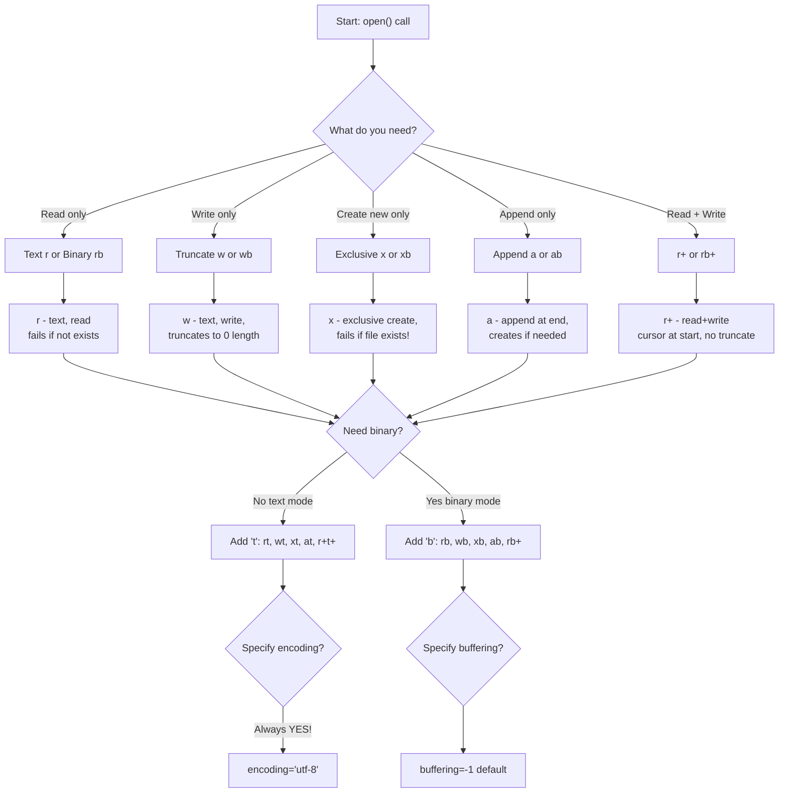

### Complete File Mode Reference Table

| Mode | Name | Read | Write | Create | Truncate | Append | Exists Error | Use Case |
|------|------|------|-------|--------|----------|--------|-------------|----------|
| `'r'` | Read text | ✅ | ❌ | ❌ | — | ❌ | FileExistsError if missing | Default mode, read existing file |
| `'w'` | Write text | ❌ | ✅ | ✅ | ✅ | ❌ | Creates new (truncates!) | Overwrite file completely |
| `'x'` | Exclusive create | ❌ | ✅ | ✅ | ❌ | ❌ | FileExistsError if exists! | Atomic file creation, no race condition |
| `'a'` | Append text | ❌ | ✅ | ✅ | ❌ | ✅ | Creates new if missing | Log files, append-only data |
| `'r+'` | Read + Write | ✅ | ✅ | ❌ | — | ❌ | FileExistsError if missing | Update existing file in-place |
| `'w+'` | Read + Write | ✅ | ✅ | ✅ | ✅ | ❌ | Creates new (truncates!) | Both read/write, start fresh |
| `'a+'` | Read + Append | ✅ | ✅ | ✅ | ❌ | ✅ | Creates new if missing | Log with occasional reads |

### Binary Mode Variants

| Mode | Name | Data Type | Truncate | Use Case |
|------|------|-----------|----------|----------|
| `'rb'` | Read binary | `bytes` | — | Images, serialized data |
| `'wb'` | Write binary | `bytes` output | ✅ | Write raw bytes |
| `'xb'` | Exclusive binary | `bytes` output | ❌ | Atomic binary file creation |
| `'ab'` | Append binary | `bytes` output | ❌ | Append to binary log files |
| `'rb+'` | Read + Write binary | `bytes` | — | In-place binary updates |
| `'wb+'` | Read + Write binary | `bytes` | ✅ | Binary temp files you'll read back |
| `'ab+'` | Read + Append binary | `bytes` | ❌ | Appended binary with occasional reads |

### Combination Modes with `+`

```python
# '+' means: enable BOTH reading AND writing in a single operation.

open("data.txt", "r+")    # Can read and write, cursor at start, no create
open("data.txt", "w+")    # Can read and write, TRUNCATES file, creates if missing
open("data.txt", "a+")    # Can read and write, writes append at end, creates if missing

# Binary combinations:
open("data.bin", "rb+")   # Read/write binary, cursor at start
open("data.bin", "wb+")   # Read/write binary, truncates
open("data.bin", "ab+")   # Read/append binary
```

### Mode Behavior Matrix for Every Scenario

| File State | `'r'` | `'w'` | `'x'` | `'a'` | `'r+'` | `'w+'` | `'a+'` |
|-----------|-------|-------|-------|-------|--------|--------|--------|
| Doesn't exist | ❌ FileNotFoundError | ✅ Creates | ✅ Creates | ✅ Creates | ❌ FileNotFoundError | ✅ Creates | ✅ Creates |
| Exists, empty | ✅ Reads "" | ✅ Truncates to 0 | ✅ Fails! FileExistsError | ✅ Appends | ✅ r/w at pos 0 | ✅ Truncates to 0 | ✅ r/w (writes at end) |
| Exists, has content "hello" | ✅ Reads "hello" | ✅ Erases → writes new | ❌ FileExistsError! | ✅ "hello" + new | ✅ Overwrites from pos 0 | ✅ Erases → writes new | ✅ Appends after "hello" |

### Mode Selection Guidelines (Mermaid Diagram)

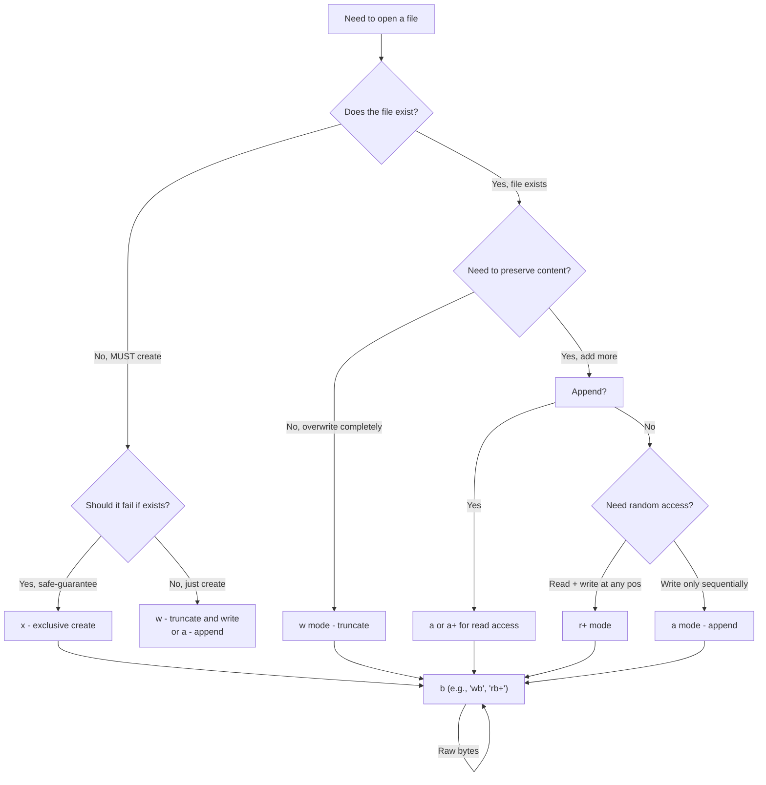

---

## 4. Reading Files — All Methods with 5+ Examples Each

### 4.1 `read(size)` — Read Characters/Bytes

```python
# read() without arguments reads the ENTIRE file:

with open("file.txt", "r", encoding="utf-8") as f:
    entire = f.read()                           # Returns str — full file content

with open("image.png", "rb") as f:
    entire_bytes = f.read()                      # Returns bytes — full binary content


# read(n) reads exactly n characters (text) or bytes (binary):

with open("file.txt", "r", encoding="utf-8") as f:
    first_10 = f.read(10)                        # First 10 characters
    next_10 = f.read(10)                         # Next 10 characters (continues!)
    remaining = f.read()                         # Everything else

# Streaming read in chunks (memory-efficient for large files):
with open("large_file.txt", "r", encoding="utf-8") as f:
    while chunk := f.read(8192):                 # Read 8KB at a time!
        process(chunk)                           # Process each chunk


# Edge cases:

with open("file.txt", "r", encoding="utf-8") as f:
    f.read(99999)                                # More than file size → returns all content, no error
    empty = f.read()                             # After EOF, returns "" (empty string)


# read with different encodings:

with open("japanese.txt", "r", encoding="utf-8") as f:
    chars = f.read(3)                            # 3 CHARACTERS (not bytes!) — may be partial multibyte chars!

with open("binary_data.bin", "rb") as f:
    byte_count = f.read(100)                     # Exactly 100 bytes guaranteed
```

**TypeScript equivalent:**

```typescript
// TypeScript: No built-in read(n) — you'd use a ReadStream or TextDecoderStream
import { createReadStream } from "node:fs";

const stream = createReadStream("file.txt", { encoding: "utf-8" });
let data = "";
stream.on("data", (chunk) => { data += chunk; });
```

### 4.2 `readline(size=-1)` — Read One Line

```python
# readline() reads one line including its newline character:

with open("file.txt", "r", encoding="utf-8") as f:
    line1 = f.readline()           # "First line\n"
    line2 = f.readline()           # "Second line\n"
    line3 = f.readline()           # "Third line\n"
    line4 = f.readline()           # "" — EOF, returns empty string


# readline(n) reads up to n characters or until newline:

with open("file.txt", "r", encoding="utf-8") as f:
    partial = f.readline(10)       # Up to 10 chars OR entire first line if shorter


# Streaming with readline (for large files):

with open("large_log.txt", "r", encoding="utf-8") as f:
    while True:
        line = f.readline()
        if not line:               # Empty string means EOF
            break
        process(line)


# readline() in binary mode:

with open("binary.dat", "rb") as f:
    raw_line = f.readline()        # Returns bytes with \n terminator
    data = int(raw_line.strip())   # Parse integer from first line of binary file


# readline with explicit size vs natural line ending:

with open("file.txt", "r", encoding="utf-8") as f:
    short_line = f.readline(3)     # May return partial line if line > 3 chars
    full_line = f.readline()       # Returns entire next line regardless of length


# Edge case: readline on a file with no newline at end:

with open("no_newline.txt", "r", encoding="utf-8") as f:
    last_line = f.readline()       # Returns content WITHOUT \n — last line may not have one!
```

**TypeScript equivalent:**

```typescript
// TypeScript: No readline — you'd use ReadLine module or split by \n
import { createInterface } from "node:readline";
const rl = createInterface({ input: fs.createReadStream("file.txt") });
for await (const line of rl) { console.log(line); }
```

### 4.3 `readlines(hint=-1)` — Read All Lines as List

```python
# readlines() returns a list of strings, one per line:

with open("file.txt", "r", encoding="utf-8") as f:
    all_lines = f.readlines()      # ["line1\n", "line2\n", "line3\n"]


# readlines(hint) — hint is approximate character count to buffer (optimization only):

with open("file.txt", "r", encoding="utf-8") as f:
    lines = f.readlines(1024)      # Hint: buffer ~1024 chars internally

# ⚠️ readlines() loads ENTIRE file into memory! Don't use on GB-sized files!


# Common patterns with readlines():

with open("file.txt", "r", encoding="utf-8") as f:
    lines = f.readlines()
    # Strip all lines at once
    stripped = [line.strip() for line in lines if line.strip()]
    
    # Reverse the file content
    reversed_lines = list(reversed(lines))
    
    # First 10 and last 10 lines
    head = lines[:10]
    tail = lines[-10:]


# readlines() comparison with iterating:

# This loads everything into memory (BAD for large files):
all_lines = Path("large_file.txt").read_text().splitlines()

# This is lazy and memory-efficient (GOOD for large files):
with open("large_file.txt", "r") as f:
    for line in f:                  # Same effect, O(1) memory!
        process(line)
```

### 4.4 `readinto(buffer)` — Read Directly Into Bytes Buffer

```python
# readinto(b) reads bytes directly into a pre-allocated buffer (no intermediate str conversion):

import array

with open("binary.dat", "rb") as f:
    buf = bytearray(1024)           # Pre-allocate 1024-byte buffer
    n = f.readinto(buf)             # Reads up to 1024 bytes directly into buf!
    data = buf[:n]                  # Only read bytes are valid


# For structured binary reading:

import struct
with open("records.bin", "rb") as f:
    while True:
        header_buf = bytearray(8)
        n = f.readinto(header_buf)  # Read exactly 8 bytes into buffer
        if n == 0:
            break
        id_, length = struct.unpack("<IQ", header_buf)  # Parse binary struct
        data_buf = bytearray(length)
        f.readinto(data_buf)        # Read payload directly
        process(id_, bytes(data_buf))


# readinto with array module for typed data:

import array
with open("integers.bin", "rb") as f:
    int_array = array.array("i")    # Signed 4-byte integers
    temp = bytearray(64)            # Temporary buffer
    while True:
        n = f.readinto(temp)
        if n == 0:
            break
        int_array.frombytes(temp[:n])


# readinto vs read — performance comparison:

# Slow: reads into bytes, then converts
data_slow = f.read(1024).encode()

# Fast: reads directly into pre-allocated buffer
buf = bytearray(1024)
f.readinto(buf)                      # Zero-copy where possible!
```

### 4.5 `readline()` vs `readlines()` vs Iteration — When to Use What

| Method | Returns | Memory | Lazy? | Best For |
|--------|---------|--------|-------|----------|
| `f.read()` | `str` / `bytes` | O(file size) | ❌ | Small files, full content needed |
| `f.read(n)` | `str[:n]` / `bytes[:n]` | O(n) | Partial | Streaming/chunked reading |
| `f.readline()` | `str` / `bytes` per call | O(line size) | ✅ | Line-by-line processing |
| `f.readlines()` | `list[str]` / `list[bytes]` | O(file size) | ❌ | Small files, need random access to lines |
| `for line in f:` | iterator yields each line | O(1) per line | ✅✅ | **Default choice for large files** |

### 4.6 `seek(offset, whence)` and `tell()` — Random Access I/O

```python
# seek(offset, whence) moves the file pointer:
# whence values: 0=absolute (default), 1=relative to current, 2=relative to end

with open("file.txt", "r", encoding="utf-8") as f:
    f.seek(0)                              # Go to start (like rewind)
    f.read(5)                              # Read 5 chars
    pos = f.tell()                         # Current position → 5
    
    f.seek(-3, 2)                          # Seek 3 bytes from END
    last_chars = f.read()                  # Last 3 characters


# Absolute seek:

with open("config.bin", "rb") as f:
    f.seek(100)                            # Jump to byte offset 100
    config_data = f.read(50)               # Read 50 bytes from that position


# Relative seek from current position:

with open("file.txt", "r", encoding="utf-8") as f:
    first_line = f.readline()              # Position moves past first line
    f.seek(-len(first_line), 1)            # Go back to start of first line (relative)


# Seek from end (useful for reading last N bytes):

with open("file.txt", "r", encoding="utf-8") as f:
    f.seek(0, 2)                           # Move to end (whence=2)
    file_size = f.tell()                   # Now tell() gives total file size!
    
    f.seek(-100, 2)                        # Last 100 bytes
    tail = f.read()                        # Read last 100 characters


# Seek in binary mode for structured data:

with open("database.bin", "rb") as f:
    # Header at offset 0-63
    header = f.read(64)
    
    # Index table starts at offset 64, contains records of (offset_4bytes, size_4bytes)
    index_entries = []
    while True:
        offset_bytes = f.read(4)
        if not offset_bytes:
            break
        size_bytes = f.read(4)
        data_offset = int.from_bytes(offset_bytes, "big")
        record_size = int.from_bytes(size_bytes, "big")
        
        # Seek to the actual record location!
        f.seek(data_offset)                  # Jump to record in file!
        record = f.read(record_size)
        index_entries.append(record)


# tell() — get current position:

with open("file.txt", "r", encoding="utf-8") as f:
    start_pos = f.tell()                   # 0
    f.read(10)
    mid_pos = f.tell()                     # 10
    f.readline()
    end_pos = f.tell()                     # Now at some other position
```

**TypeScript equivalent:**

```typescript
// TypeScript: No seek/tell in file APIs — you'd use readFileSync with slice
import { readFileSync } from "node:fs";
const data = readFileSync("file.txt");
const chunk = data.slice(100, 200);  // Equivalent to seek + read
```

### 4.7 Reading Pattern Comparison Table

| Pattern | TypeScript | Python | Memory | When to Use |
|---------|-----------|--------|--------|-------------|
| Read all | `readFileSync("f", "utf-8")` | `Path("f").read_text()` | Full file | Small files < 100MB |
| Chunked read | `createReadStream` | `for chunk in iter(lambda: f.read(N), b"")` | O(chunk) | Large files, streaming |
| Line-by-line | `createInterface` | `for line in f:` | O(1) per line | **Default for text** |
| Binary all | `readFileSync("f")` | `Path("f").read_bytes()` | Full file | Images, archives |
| Random access | `readFileSync` + slice | `f.seek(pos); f.read(n)` | O(n) | Databases, protocols |

---

## 5. Writing Files — Exhaustive Patterns

### 5.1 `write(text)` — Write String/Bytes

```python
# write() returns the number of characters (text) or bytes (binary) written:

with open("out.txt", "w", encoding="utf-8") as f:
    n = f.write("Hello, World!")       # Returns 13 (characters written)


# Multiple writes append to internal buffer (not to file until flushed/closed):

with open("out.txt", "w", encoding="utf-8") as f:
    f.write("Line 1\n")                # Buffer: "Line 1\n"
    f.write("Line 2\n")                # Buffer: "Line 1\nLine 2\n"
    f.flush()                          # Force write to disk NOW (optional!)


# Write with explicit newlines:

with open("out.txt", "w", encoding="utf-8") as f:
    f.write("No newline at end")        # File won't have trailing \n
    f.write("Line with explicit \\n\n")  # Has \n at end


# Binary write:

with open("image.png", "wb") as f:
    n = f.write(b"\x89PNG\r\n\x1a\n")   # Write PNG magic bytes — returns number of bytes
    assert n == 8                         # 8 bytes written
```

### 5.2 `writelines(lines)` — Write Multiple Lines at Once

```python
# writelines() writes each string in the iterable WITHOUT adding newlines!

with open("out.txt", "w", encoding="utf-8") as f:
    f.writelines(["Alice\n", "Bob\n", "Charlie\n"])   # Newlines must be explicit!


# Common bug: forgetting that writelines doesn't add newlines:

# WRONG — no newlines between entries:
with open("out.txt", "w", encoding="utf-8") as f:
    f.writelines(["Alice", "Bob", "Charlie"])  # Results in "AliceBobCharlie" — one line!


# CORRECT — add newlines manually:
with open("out.txt", "w", encoding="utf-8") as f:
    f.writelines([name + "\n" for name in ["Alice", "Bob", "Charlie"]])


# writelines with generator expression (memory-efficient):

names = ("alice@example.com", "bob@example.com", "charlie@example.com")
with open("emails.txt", "w", encoding="utf-8") as f:
    f.writelines(email + "\n" for email in names)  # Generator — no intermediate list!


# writelines with pre-formatted lines:

with open("output.csv", "w", encoding="utf-8") as f:
    lines = [",".join(map(str, row)) + "\n" for row in data]
    f.writelines(lines)  # Bulk write all CSV rows at once
```

### 5.3 `truncate(size=None)` — Truncate File to Given Size

```python
# truncate() without arguments truncates to current position:

with open("data.txt", "r+") as f:        # Must use r+ or w+ mode!
    f.read(50)                            # Position at 50
    f.truncate()                          # Truncate at position 50 — everything after is gone


# truncate(n) truncates to exactly n bytes/characters:

with open("data.txt", "r+") as f:
    content = f.read()                    # "Hello, World! This is a test file."
    f.seek(0)                             # Go back to start
    f.truncate(5)                         # Truncate to 5 characters → "Hello"


# truncate on a file opened in append mode (writes go to end regardless):

with open("app.log", "a+") as f:
    f.write("log entry\n")
    f.truncate(0)                         # Truncate to zero — delete all content!
```

### 5.4 Writing Patterns Comparison

| Pattern | Use Case | TypeScript Equivalent |
|---------|----------|----------------------|
| `f.write(str)` | Write string/bytes | `writeFileSync("f", data)` |
| `f.writelines(list)` | Bulk write multiple strings | Multiple `write()` calls |
| `f.truncate(n)` | Shrink file to n bytes | Truncate via `fs.ftruncateSync(fd, n)` |
| `print(text, file=f)` | Write with auto-newline | `f.write(text + "\n")` |

### 5.5 Using `print()` as Writer

```python
# print() with file= parameter adds newlines automatically:

with open("out.txt", "w", encoding="utf-8") as f:
    print("Hello", file=f)                    # "Hello\n" — auto-newline!
    print("World", "!", sep="-", file=f)      # "World-!\n" — sep parameter works!
    print(42, 3.14, True, sep=" | ", file=f)  # "42 | 3.14 | True\n"


# print() end parameter controls what's added after the text:

with open("out.txt", "w", encoding="utf-8") as f:
    print("First line", end="", file=f)        # No newline!
    print("Second line immediately after!", file=f)  # Concatenated!
```

### 5.6 File Position After Write Operations

```python
# After write(), the file position advances by the number of characters written:

with open("data.txt", "w+") as f:
    n = f.write("Hello")                      # n=5, position now at 5
    f.seek(0)                                 # Go back to start
    content = f.read()                        # "Hello"
    
    # After truncate(), the file size changes but position stays where it was:
    f.truncate(3)                             # File is now "Hel\0\0" (padded with nulls)
    pos_after_truncate = f.tell()             # Still at 5! But file is only 3 bytes!
    
    # Reading beyond truncated size returns whatever remains (may be empty/partial)
    f.seek(2)                                 # Position at 2 (within valid range)
    remaining = f.read()                      # "lo" — but content after truncate(3) is unpredictable
    
    # Best practice: reseek after truncate!
```

---

## 6. Context Managers — The Non-Negotiable Pattern

### 6.1 Why `with` Is Mandatory for File Operations

```python
# ❌ DANGEROUS: No context manager — file descriptor leak on exception!
f = open("file.txt")
content = f.read()
# If an exception happens above, f.close() is NEVER called!
f.close()


# ✅ SAFE: Context manager guarantees cleanup!
with open("file.txt") as f:
    content = f.read()
# File closed automatically here — even if an exception occurred inside the block!


# What `with` does under the hood (the protocol):

class ManagedFile:
    def __init__(self, filename, mode):
        self.filename = filename
        self.mode = mode
        self.f = None
    
    def __enter__(self):
        self.f = open(self.filename, self.mode)  # Runs when entering 'with' block
        return self.f                             # Value bound to 'as' variable
    
    def __exit__(self, exc_type, exc_val, exc_tb):
        if self.f:
            self.f.close()                        # Always runs! Even on exception!
        # Return True to suppress the exception, False/None to propagate it
        return False


# Context manager with exception handling — `__exit__` can catch and handle exceptions:

class SafeFile:
    def __init__(self, filename):
        self.filename = filename
        self.f = None
    
    def __enter__(self):
        self.f = open(self.filename)
        return self.f
    
    def __exit__(self, exc_type, exc_val, exc_tb):
        if self.f:
            self.f.close()
        
        # Suppress specific exceptions (like suppress context manager!)
        if exc_type is FileNotFoundError:
            print(f"File not found — handled gracefully!")
            return True                           # Exception suppressed!
        # Other exceptions propagate normally
        return False


# TypeScript equivalent: No direct `with` — use try/finally for cleanup
```

### 6.2 Multiple Context Managers

```python
# Python 3.1+: Single line with comma (cleanest!) ✅
with open("input.txt") as fin, open("output.txt", "w") as fout:
    fout.write(fin.read().upper())


# Multiple files with pathlib:
from pathlib import Path
with (
    Path("a.txt").open() as fa,
    Path("b.txt").open("w") as fb,
    Path("c.txt").open("a") as fc,
):
    fb.write(fa.read().upper())
    fc.write(fb.name)


# Context manager for directory (Python 3.11+):
import os
with os.chdir("/some/path"):     # Returns to original dir on exit! ✅ Python 3.11+
    do_work_in_that_dir()
```

### 6.3 Custom Context Manager with `contextlib`

```python
from contextlib import contextmanager

@contextmanager
def managed_file(filepath, mode="r"):
    """Context manager that cleans up a file even on error."""
    f = open(filepath, mode)
    try:
        yield f                      # This is what 'as f' binds to
    finally:
        f.close()


# Usage:
with managed_file("data.txt") as f:
    f.write("content")


# Timer context manager:
import time

@contextmanager  
def timer(label="operation"):
    start = time.perf_counter()
    yield lambda: time.perf_counter() - start  # Yield a function!
    elapsed = time.perf_counter() - start
    print(f"{label}: {elapsed:.4f}s")


# Transaction context manager:
@contextmanager
def transaction(db):
    try:
        yield db                        # Code inside with-block runs here
        db.commit()                     # Success → commit!
    except Exception:
        db.rollback()                   # Error → rollback!
        raise                           # Re-raise the exception
```

---

## 7. pathlib.Path — COMPLETE Method & Property Catalog

### 7.1 Path Construction

```python
from pathlib import Path, PurePosixPath, PureWindowsPath, PurePath
import os


# Creating paths — multiple ways:

p = Path("a/b/c.txt")                     # Forward slash on all OS ✅
p = Path("docs", "readme.md")             # Multiple args → joins them!
p = Path.home() / "Documents" / "notes.txt"  # Home directory + relative path
p = Path("/absolute/path/to/file.txt")    # Absolute path


# Path operator — the / (join) operator:

root = Path("/")
base = Path("home")
user = Path("alice")
full = root / base / user                  # PurePosixPath("/home/alice") on Linux


# Platform-specific paths:

p_win = Path("C:", "Users", "Alice")      # PureWindowsPath('C:\\Users\\Alice')
p_posix = Path("/etc", "hosts")           # PurePosixPath('/etc/hosts')

# Mixing paths:
relative = Path("src") / "../docs"        # Path("src/../docs") — doesn't resolve!
resolved = (Path("src") / "../docs").resolve()  # Path("actual/resolved/path") ✅


# PurePath types:

PurePosixPath("/usr/local/bin")            # Always forward slashes, regardless of OS
PureWindowsPath("C:\\Program Files\\app")  # Always backslashes, regardless of OS
PurePath(Path("a") / "b")                  # Uses current OS conventions
```

### 7.2 Every Path Property (Attributes)

| Property | Returns | Example (`Path("/usr/local/bin/python3.11")`) | TypeScript Equivalent |
|----------|---------|------------------------------------------------|----------------------|
| `.name` | filename with extension | `"python3.11"` | `path.basename()` |
| `.stem` | filename without extension | `"python3"` | `path.parse().name` minus ext |
| `.suffix` | last extension | `".11"` (if suffixes: `.3.11`) | `path.extname()` → `.3.11` → `.11`... wait no. Let me fix: `"python3.11"`, suffix=`.11`. For `"file.tar.gz"`, suffix=`.gz` |
| `.suffixes` | list of all extensions | `[".3", ".11"]` or `[".tar", ".gz"]` | No direct equivalent |
| `.parent` | Path without final component | `PosixPath("/usr/local/bin")` | `path.dirname()` |
| `.parents` | Sequence of all ancestor paths | `["/", "..", "/usr", "/usr/local", "/usr/local/bin"]` | Need to walk up manually |
| `.anchor` | Root portion | `"/"` or `"C:\\"` | `path.parse().root` |
| `.drive` | Drive letter (Windows) | `""` (Unix) or `"C:"` (Windows) | `path.parse().driver` |
| `.is_absolute()` | Whether path is absolute | `True` / `False` | `path.isAbsolute()` |

```python
# Detailed examples of each property:

p = Path("/usr/local/bin/python3.11.tar.gz")

p.name                    # "python3.11.tar.gz" — full filename
p.stem                    # "python3.11.tar" — without LAST extension
p.suffix                  # ".gz" — only the LAST extension!
p.suffixes                # [".11", ".tar", ".gz"] — ALL extensions!

p.parent                  # PosixPath("/usr/local/bin") — one level up
p.parents[0]              # PosixPath("/usr/local/bin") — same as .parent
p.parents[1]              # PosixPath("/usr/local") — two levels up
p.parents[-1]             # PosixPath("/") — root!

p.anchor                  # "/" on Unix, "C:\\" on Windows
p.is_absolute()           # True (starts with /)

# stem and suffix for common file patterns:
Path("archive.tar.gz").suffix    # ".gz"  — only last extension!
Path("archive.tar.gz").suffixes  # [".tar", ".gz"] — all extensions!
Path("archive.tar.gz").stem      # "archive.tar"

# Multiple suffixes example:
p2 = Path("my.backup.2024.txt")
p2.suffix        # ".txt"
p2.suffixes      # [".backup", ".2024", ".txt"]
p2.stem          # "my.backup.2024"

# Pure vs actual path properties:
p3 = Path("/home/alice/../../bob/file.txt")   # Not resolved!
p3.resolve()        # PosixPath("/home/bob/file.txt") — resolves symlinks!
p3.absolute()       # PosixPath("/home/alice/../../bob/file.txt") — no resolution
```

### 7.3 Every Path Method — Complete Catalog

```python
from pathlib import Path, PurePath
import shutil, tempfile, os


# ═══════════════════════════════════════════════════
# EXISTENCE & TYPE CHECKS (all make syscalls!)
# ═══════════════════════════════════════════════════

p = Path("some/path")

# Existence:
p.exists()                    # True if path exists (file, dir, symlink — anything)
p.exists(strict=False)        # Follows symlinks (default behavior)

# Type checks (all make syscalls):
p.is_file()                   # True if regular file
p.is_dir()                    # True if directory
p.is_symlink()                # True if symbolic link
p.is_socket()                 # True if Unix socket
p.is_fifo()                   # True if FIFO/pipe
p.is_block_device()           # True if block device (e.g., /dev/sda)
p.is_char_device()            # True if character device (e.g., /dev/tty)
p.is_mount()                  # True if mount point

# Note: is_file(), is_dir(), etc. return False for broken symlinks!
# Use is_symlink() + stat() to check the link itself:
p.resolve().is_file()         # Follow symlink first, then check target


# ═══════════════════════════════════════════════════
# RESOLUTION METHODS
# ═══════════════════════════════════════════════════

p = Path("docs/../data/./file.txt")     # Relative, messy path

p.resolve()                 # PosixPath("/home/user/data/file.txt") — absolute + resolves symlinks
p.absolute()                # Current working dir + relative path (no symlink resolution)

# is_relative_to() — Python 3.9+:
p.is_relative_to("docs")    # True if p starts with "docs"
p.is_relative_to("/home/user")  # True on Linux

# relative_to() — get relative portion:
Path("/home/user/docs/file.txt").relative_to("/home/user")  # PosixPath("docs/file.txt")


# ═══════════════════════════════════════════════════
# MATCHING PATTERNS
# ═══════════════════════════════════════════════════

p = Path("/home/user/docs/readme.md")

p.match("*.md")             # True — matches glob pattern against final component
p.match("docs/*.md")        # True — matches from current dir (or any ancestor!)
p.match("*/user/*")         # True — ** style matching!
p.match("*.txt")            # False — doesn't match .md


# ═══════════════════════════════════════════════════
# STAT & METADATA
# ═══════════════════════════════════════════════════

import stat as stat_module

p = Path("/etc/passwd")

p.stat()                    # os.stat_result — full stat info (follows symlinks!)
p.lstat()                   # Same but DOESN'T follow symlinks

# p.stat() returns an object with these fields:
st = p.stat()
st.st_mode                  # File type + permissions (e.g., 33204)
st.st_ino                   # Inode number
st.st_dev                   # Device ID
st.st_nlink                 # Hard link count
st.st_uid                   # User ID
st.st_gid                   # Group ID
st.st_size                  # Size in bytes
st.st_atime                 # Access time (timestamp)
st.st_mtime                 # Modification time (timestamp)
st.st_ctime                 # Creation/modification time (platform-dependent)

# stat constants for mode checking:
stat_module.S_ISREG(st.st_mode)     # Is regular file
stat_module.S_ISDIR(st.st_mode)     # Is directory
stat_module.S_ISLNK(st.st_mode)     # Is symbolic link
stat_module.S_ISSOCK(st.st_mode)    # Is socket
stat_module.S_ISFIFO(st.st_mode)    # Is FIFO

# Permission bits:
st.st_mode & stat_module.S_IRWXU  # Owner permissions (rwx as bits)
st.st_mode & stat_module.S_IRUSR  # Owner read bit
st.st_mode & stat_module.S_IWUSR  # Owner write bit
st.st_mode & stat_module.S_IXUSR  # Owner execute bit
st.st_mode & stat_module.S_IRGRP  # Group read bit
st.st_mode & stat_module.S_IROTH  # Others read bit

# Human-readable:
stat_module.filemode(st.st_mode)  # "-rw-r--r--" — like ls -l output!


# ═══════════════════════════════════════════════════
# chmod & CHOWN (CHANGE PERMISSIONS/OWNER)
# ═══════════════════════════════════════════════════

import stat as stat_module, os

p = Path("script.sh")

# Change permissions:
p.chmod(0o755)                      # rwxr-xr-x — executable by all
p.chmod(stat_module.S_IRUSR | stat_module.S_IWUSR)  # Owner rw only (0o600)
p.chmod(p.stat().st_mode | stat_module.S_IXUSR)     # Add execute for owner

# Change ownership (root required!):
os.chown(str(p), uid=1000, gid=1000)        # Change both uid and gid
os.lchown(str(p), uid=1000, gid=1000)       # lchown — doesn't follow symlinks


# ═══════════════════════════════════════════════════
# FILE OPERATIONS (READ/WRITE/DELETE)
# ═══════════════════════════════════════════════════

p = Path("data.txt")

# Read/write in one line:
text = p.read_text(encoding="utf-8")        # str — read entire file
data = p.read_bytes()                        # bytes — read entire binary
p.write_text("new content", encoding="utf-8")  # int — chars written (overwrites!)
p.write_bytes(b"binary data")                # int — bytes written (overwrites!)

# Open with context manager:
with p.open(mode="r", encoding="utf-8") as f:
    content = f.read()


# ═══════════════════════════════════════════════════
# DIRECTORY OPERATIONS
# ═══════════════════════════════════════════════════

p = Path("newdir")

# Create directory (mkdir variants):
p.mkdir()                          # Fails if exists!
p.mkdir(exist_ok=True)             # Silent if exists ✅
p.mkdir(parents=True)              # Create parent dirs too! Like mkdir -p
p.mkdir(parents=True, exist_ok=True)  # Safest: create all + no error if exists

# With specific mode and owner:
p.mkdir(mode=0o755, parents=True, exist_ok=True)
p.mkdir(mode=0o700, exist_ok=True)   # Owner only!


# ═══════════════════════════════════════════════════
# ITERATION & GLOB
# ═══════════════════════════════════════════════════

p = Path("."):

p.iterdir()               # Iterator over immediate children (not recursive!)
for child in p.iterdir():
    print(child)

# glob — non-recursive:
for txt_file in p.glob("*.txt"):        # All .txt files in current dir only
    print(txt_file)

# rglob — recursive (glob with **):
for py_file in p.rglob("*.py"):         # All .py files recursively!
    print(py_file)

# glob with path pattern:
for file in Path("/home").glob("**/*.log"):   # All .log under /home (recursive!)
    print(file)


# ═══════════════════════════════════════════════════
# LINKING & SYMLINKING
# ═══════════════════════════════════════════════════

target = Path("real_file.txt")
link = Path("link_to_file")

# Create symlink:
link.symlink_to(target)              # Creates link → target (relative path stored!)
Path("/abs/link").symlink_to("/abs/target")  # Absolute symlink


# Read symlink target:
link.readlink()                      # The target path as a Path object
link.resolve()                       # Resolves the entire chain to final target

# Hard link:
hard_link = Path("hard_link.txt")
hard_link.link_to(target)            # target is NEW_NAME, hard_link points to same inode!


# ═══════════════════════════════════════════════════
# COPY & MOVE
# ═══════════════════════════════════════════════════

src = Path("source.txt")
dst = Path("dest.txt")

# Copy (uses shutil under the hood):
shutil.copy(str(src), str(dst))             # Copy file, preserve permissions
shutil.copy2(str(src), str(dst))            # Copy + preserve ALL metadata (mtime, etc.)
shutil.copytree("src_dir/", "dst_dir/")     # Recursively copy directory


# Replace / rename:
p.replace("new_name.txt")        # Rename — atomic on same filesystem! Overwrites destination if exists!

# Delete:
p.unlink()                       # Delete file (or symlink) — raises FileNotFoundError if missing
p.rmdir()                        # Remove empty directory — raises NotADirectoryError if not empty


# ═══════════════════════════════════════════════════
# PATH MANIPULATION Utilities
# ═══════════════════════════════════════════════════

p = Path("a/b/c.txt")

# WithName / WithSuffix — create new path with changes:
p.with_name("newname.txt")       # PosixPath("a/b/newname.txt") — changes filename only
p.with_suffix(".md")             # PosixPath("a/b/c.md") — changes extension only

# Join parts:
p.joinpath("d", "e/f")           # PosixPath("a/b/c.txt/d/e/f") — same as / operator


# ═══════════════════════════════════════════════════
# SPECIAL PATHS
# ═══════════════════════════════════════════════════

Path.home()                        # User's home directory: /home/alice
Path.cwd()                         # Current working directory
Path("/").absolute()               # Root directory
Path(".")                          # Current directory
Path("..")                         # Parent directory
Path("~").expanduser()             # Resolves ~ to home directory
```

### 7.4 pathlib Method Categories (Mermaid Diagram)

```mermaid
flowchart TD
    A[Path Object] --> B[Construction & Manipulation]
    A --> C[Properties / Attributes]
    A --> D[Existence & Type Checks]
    A --> E[Stat & Metadata]
    A --> F[File Operations]
    A --> G[Directory Operations]
    A --> H[Glob & Iteration]
    A --> I[Linking & Symlinks]
    A --> J[Copy & Move]

    B --> B1["/ operator"]
    B --> B2[with_name / with_suffix]
    B --> B3[joinpath / relative_to]

    C --> C1[name / stem / suffix / suffixes]
    C --> C2[parent / parents]
    C --> C3[is_absolute / anchor / drive]

    D --> D1[exists]
    D --> D2[is_file / is_dir / is_symlink / is_mount]
    D --> D3[is_socket / is_fifo / is_block_device / is_char_device]

    E --> E1[stat / lstat]
    E --> E2[chmod / chown]

    F --> F1[read_text / read_bytes]
    F --> F2[write_text / write_bytes]
    F --> F3[open]

    G --> G1[mkdir / rmdir]
    
    H --> H1[iterdir]
    H --> H2[glob]
    H --> H3[rglob]

    I --> I1[symlink_to / readlink / resolve]
    I --> I2[link_to]

    J --> J1[replace / unlink]
    J --> J2[shutil.copy / copytree]
```

### 7.5 pathlib vs TypeScript path Module — Complete Comparison

| Operation | Node.js `path` module | Python `pathlib.Path` | Notes |
|-----------|----------------------|----------------------|-------|
| Join paths | `path.join("a", "b")` | `Path("a") / "b"` | Python's `/` is more elegant |
| Base name | `path.basename(p)` | `p.name` | Attribute vs function |
| Directory | `path.dirname(p)` | `p.parent` | Same concept |
| Extension | `path.extname(p)` | `p.suffix` | Same |
| All extensions | ❌ No built-in | `p.suffixes` | Python wins here! |
| Stem (no ext) | `path.parse(p).name` | `p.stem` | Python is more direct |
| Absolute path | `path.resolve(p)` | `p.resolve()` | Both resolve symlinks |
| Is absolute | `path.isAbsolute(p)` | `p.is_absolute()` | Method vs function |
| Is directory | ❌ Need `fs.statSync.isDirectory()` | `p.is_dir()` | Built-in! |
| Exists | `existsSync(p)` | `p.exists()` | Same concept |
| Glob | `glob.glob("*.txt")` | `Path().glob("*.txt")` | Both available |
| Walk dirs | ❌ Need `fs.readdirRecursive` | `Path().rglob("*")` | Python has it built-in! |
| Parse parts | `path.parse(p)` | `p.parts` (tuple) | Python exposes all as tuple |

---

## 8. CSV Module — Exhaustive Guide

### 8.1 Basic Reading with `csv.reader`

```python
import csv


# Basic reader — each row is a list of strings:

with open("data.csv", "r", newline="", encoding="utf-8") as f:
    reader = csv.reader(f)               # Iterator over rows!
    
    for i, row in enumerate(reader):
        if i == 0:                         # Skip header
            print(f"Headers: {row}")       # ["Name", "Age", "City"]
            continue
        name, age, city = row             # Unpack!
        print(f"{name} is {age} years old, lives in {city}")


# csv.reader parameters:

with open("data.csv", "r", newline="", encoding="utf-8") as f:
    reader = csv.reader(
        f,
        delimiter=",",            # Field separator (default ",")
        quotechar='"',            # Quote character (default ")
        quoting=csv.QUOTE_MINIMAL,# Quoting behavior (see below)
        doublequote=True,         # "" inside quoted field → " (escape doubled quote)
        skipinitialspace=False,   # Skip spaces after delimiter?
        lineterminator="\n",      # Line terminator when writing (reader ignores this!)
        quoting=None,             # Same as csv.QUOTE_MINIMAL
    )


# QUOTING modes:

csv.QUOTE_MINIMAL       # Only quote fields containing delimiter/quotechar/newline (DEFAULT)
csv.QUOTE_ALL           # Quote EVERY field
csv.QUOTE_NONNUMERIC    # Quote all non-numeric fields
csv.QUOTE_NONE          # Never quote — escape with doublequote or escapechar instead


# Handle escaped quotes:

with open("escaped.csv", "r") as f:
    reader = csv.reader(f, escapechar="\\")  # Use backslash to escape
    for row in reader:
        print(row)                         # Fields with \\" become " automatically
```

### 8.2 Basic Writing with `csv.writer`

```python
import csv

# Create writer:

with open("output.csv", "w", newline="", encoding="utf-8") as f:
    writer = csv.writer(
        f,
        delimiter=",",             # Field separator
        quotechar='"',             # Quote char for fields containing comma
        quoting=csv.QUOTE_MINIMAL, # Only quote when necessary
        doublequote=True,          # "" escapes " inside quoted field
        skipinitialspace=False,    # Don't skip spaces after delimiter
        dialect="excel",           # Use excel dialect defaults
        lineterminator="\n",       # Line terminator (platform-specific by default)
    )


# Write individual rows:

with open("data.csv", "w", newline="", encoding="utf-8") as f:
    writer = csv.writer(f)
    
    writer.writerow(["Name", "Age", "City"])          # Single row as list
    writer.writerow(["Alice", 30, "New York"])         # Numbers auto-converted to str!
    
    # Fields with commas get quoted automatically:
    writer.writerow(["O'Brien, Jr.", 25, "Boston"])    # Becomes: "O'Brien, Jr.",25,Boston
    
    # Fields with quotes get double-quoting:
    writer.writerow(['He said "hello"', 20, "LA"])     # Becomes: "He said ""hello""",20,LA


# Write multiple rows at once:

rows = [
    ["Name", "Age"],
    ["Alice", 30],
    ["Bob", 25],
]
with open("data.csv", "w", newline="", encoding="utf-8") as f:
    writer = csv.writer(f)
    writer.writerows(rows)           # Bulk write — more efficient than individual write!
```

### 8.3 DictReader & DictWriter — Key-Based Access

```python
import csv

# DictReader — first row becomes keys, each row is an OrderedDict:

with open("data.csv", "r", newline="", encoding="utf-8") as f:
    reader = csv.DictReader(f)           # Header row auto-used as keys!
    
    for row in reader:                   # Each row is a dict-like object!
        print(row["Name"])              # String access
        print(row["Age"])               # Also str — not int! Convert manually.
        
        # All fields available, even extra ones:
        print(dict(row))                # Convert to plain dict if needed
        
        # DictReader with custom fieldnames (no header in file):
        reader2 = csv.DictReader(f, fieldnames=["Name", "Age", "City"])


# DictWriter — write dicts as CSV rows:

fieldnames = ["Name", "Age", "City"]

with open("output.csv", "w", newline="", encoding="utf-8") as f:
    writer = csv.DictWriter(f, fieldnames=fieldnames)
    
    writer.writeheader()               # Write header row first!
    
    writer.writerow({"Name": "Alice", "Age": 30, "City": "NYC"})  # Dict → row!
    writer.writerow({"Name": "Bob", "Age": 25, "City": "LA"})     # Another row
    
    writer.writerows([                  # Bulk write dicts!
        {"Name": "Charlie", "Age": 35, "City": "SF"},
        {"Name": "Diana", "Age": 28, "City": "NYC"},
    ])


# DictWriter with extrasaction:

with open("output.csv", "w", newline="", encoding="utf-8") as f:
    writer = csv.DictWriter(
        f, 
        fieldnames=["Name", "Age"],
        extrasaction="ignore"           # Ignore extra keys (default)
        # extrasaction="raise"          # Raise ValueError on extra keys
    )
    writer.writeheader()
    writer.writerow({"Name": "Alice", "Age": 30, "ExtraKey": "ignored"})


# DictReader with restval:

with open("sparse.csv", "r", newline="", encoding="utf-8") as f:
    reader = csv.DictReader(
        f,
        fieldnames=["Name", "Age", "City"],  # Define expected fields
        restval="Unknown"                       # Default for missing fields!
    )
    for row in reader:
        print(row["City"])              # "Unknown" if file had fewer columns
```

### 8.4 Custom Dialects — Named Formatting Rules

```python
import csv

# Register a custom dialect with your own format rules:

csv.register_dialect(
    "tsv-tab",                         # Dialect name
    delimiter="\t",                     # Tab-separated
    quotechar='"',                      # Quote char
    quoting=csv.QUOTE_NONNUMERIC,       # Quote all non-numeric fields
    doublequote=False,                  # Don't use "" to escape quotes
    skipinitialspace=True,              # Skip spaces after tab
)

# Use the custom dialect:
with open("data.tsv", "w", newline="", encoding="utf-8") as f:
    writer = csv.writer(f, dialect="tsv-tab")
    writer.writerow(["Name", "Value"])
    writer.writerow(["Alice", 30])     # Name gets quoted (non-numeric), 30 doesn't


# Register common dialects manually:

csv.register_dialect(
    "my_csv",
    delimiter=";",                      # Semicolon instead of comma (European style!)
    quotechar="'",                      # Single quotes
    quoting=csv.QUOTE_MINIMAL,
)

csv.unregister_dialect("opener")       # Unregister a dialect


# List all registered dialects:
dialects = csv.list_dialects()         # ["excel", "excel-tab", "unix", ...]
for name in dialects:
    d = csv.get_dialect(name)          # Get dialect parameters
    print(f"{name}: delimiter={d.delimiter}, quotechar={d.quotechar}")


# Built-in dialects you can use directly:

# csv.excel — default: comma delimiter, " quotechar, \r\n line terminator
csv.get_dialect("excel")

# csv.excel_tab — tab delimiter instead of comma
csv.get_dialect("excel-tab")

# csv.unix_dialect — quote all fields, \n line terminator (no \r)
csv.get_dialect("unix")


# Create a subclass of Dialect for custom behavior:

class MyDialect(csv.Dialect):
    delimiter = ";"
    quotechar = "'"
    quoting = csv.QUOTE_ALL
    lineterminator = "\r\n"
    doublequote = True
    skipinitialspace = False
    strict = True                      # Raise error on bad CSV input

csv.register_dialect("my_custom", MyDialect)
```

### 8.5 `csv.Sniffer` — Auto-Detect CSV Format

```python
import csv


# Sniff dialect from file content:

with open("unknown_format.csv", "r") as f:
    sample = f.read(2048)              # Read some data to sniff (needs 2KB+)

sniffer = csv.Sniffer()

# Detect delimiter and quoting style:
dialect = sniffer.sniff(sample, delimiters=",;\t|")  # Try multiple delimiters
print(f"Detected: delimiter='{dialect.delimiter}', quotechar='{dialect.quotechar}'")

# Parse with the detected dialect:
reader = csv.reader(iter(sample.splitlines()), dialect=dialect)
for row in reader:
    print(row)


# Sniffer with sample data:

sample_csv = """Name,Age,City
Alice,30,"New York"
Bob;25;Boston"""  # Mixed delimiters for testing!

sniffer = csv.Sniffer()
try:
    dialect = sniffer.sniff(sample_csv)
    print(f"Delimiter: {dialect.delimiter!r}")  # Could be ',' or ';'
except csv.Error:
    print("Could not detect dialect — too ambiguous!")


# Sniffer is smart about common formats:

formats_to_try = [
    "excel",           # comma, double-quote
    "excel-tab",       # tab, double-quote
]

for fmt in formats_to_try:
    try:
        d = csv.Sniffer().sniff(sample, delimiters={fmt}.delimiter)
        print(f"Matched format: {fmt}")
    except csv.Error:
        pass
```

### 8.6 CSV Edge Cases & Gotchas

```python
import csv

# ⚠️ CSV with embedded newlines in quoted fields:

with open("embedded_newline.csv", "w", newline="", encoding="utf-8") as f:
    writer = csv.writer(f)
    writer.writerow(["Name", "Description"])
    writer.writerow(["Alice", "Line 1\nLine 2\nLine 3"])  # Embedded newlines!


# Reading back — csv.reader handles embedded newlines correctly:

with open("embedded_newline.csv", "r", newline="", encoding="utf-8") as f:
    reader = csv.reader(f)
    for row in reader:
        print(repr(row[1]))  # "Line 1\\nLine 2\\nLine 3" — embedded newlines preserved!


# CSV with empty fields:

with open("empty_fields.csv", "w", newline="", encoding="utf-8") as f:
    writer = csv.writer(f)
    writer.writerow(["a", "", "c"])   # Middle field is empty
    writer.writerow(["", "b", ""])     # First and last are empty


# CSV with special characters:

with open("special.csv", "w", newline="", encoding="utf-8") as f:
    writer = csv.writer(f)
    writer.writerow(["Hello, World!"])   # Comma → field gets quoted
    writer.writerow(['He said "hi"'])    # Quotes → "" inside quoted field
    writer.writerow(["a\rb"])             # Carriage return → field gets quoted


# strict mode — catches malformed CSV:

with open("malformed.csv", "r", newline="", encoding="utf-8") as f:
    reader = csv.reader(f, strict=True)
    for row in reader:                    # Raises csv.Error on parse errors!
        print(row)
```

### 8.7 CSV Module — Complete API Reference Table

| Class/Function | Purpose | Key Parameters | Returns |
|---------------|---------|---------------|---------|
| `csv.reader(file, **kw)` | Read CSV rows as lists | delimiter, quotechar, quoting, doublequote, escapechar, skipinitialspace | Iterator of lists[str] |
| `csv.writer(file, **kw)` | Write CSV rows from lists/iterables | Same as reader + lineterminator | csv.writer object with `writerow()` and `writerows()` |
| `csv.DictReader(file, **kw)` | Read CSV as dict rows | fieldnames, restval, restkey, dialect | Iterator of OrderedDict-like objects |
| `csv.DictWriter(file, **kw)` | Write CSV from dicts | fieldnames, extrasaction, restval, restkey | DictWriter with `writeheader()` and `writerow()`/`writerows()` |
| `csv.Sniffer().sniff(sample, delimiters)` | Auto-detect CSV dialect | sample (str), delimiters to try | csv.Dialect object |
| `csv.register_dialect(name, Dialect)` | Register custom dialect | name, dialect class or params | None |
| `csv.unregister_dialect(name)` | Remove registered dialect | name | None |
| `csv.get_dialect(name)` | Get dialect parameters | name | Dialect instance |
| `csv.list_dialects()` | List all dialects | — | List of names |
| `csv.QUOTE_MINIMAL` | Quote only when needed | — | Constant |
| `csv.QUOTE_ALL` | Quote all fields | — | Constant |
| `csv.QUOTE_NONNUMERIC` | Quote non-numeric fields | — | Constant |
| `csv.QUOTE_NONE` | Never quote | — | Constant |

---

## 9. JSON Module — Exhaustive Guide

### 9.1 Core Functions — dump, dumps, load, loads

```python
import json


# ═══════════════ DUMP FUNCTIONS (write) ═══════════════

data = {
    "name": "Alice",
    "age": 30,
    "skills": ["Python", "TypeScript"],
    "active": True,
    "score": None,         # null in JSON
}


# json.dump(data, file) — Write to FILE object:

with open("data.json", "w", encoding="utf-8") as f:
    json.dump(data, f)                          # Compact (no whitespace) by default


# json.dump with formatting options:

with open("pretty.json", "w", encoding="utf-8") as f:
    json.dump(
        data, 
        f, 
        indent=2,                              # Pretty-print with 2-space indent ✅
        sort_keys=True,                        # Sort keys alphabetically ✅
        ensure_ascii=False,                    # Allow non-ASCII chars (UTF-8) ✅
        separators=(", ", ": "),               # Custom separators (default: ", " and ": ")
        default=str,                           # Custom encoder for unknown types
    )


# json.dumps(data) — Write to STRING (in-memory):

compact = json.dumps(data)                     # '{"name": "Alice", "age": 30, ...}'
pretty = json.dumps(data, indent=2)            # Multi-line pretty-print!
sorted_keys = json.dumps(data, sort_keys=True) # Keys in alphabetical order


# All formatting options for dumps/dump:

json.dumps(
    data,
    indent=2,                                   # Integer or string (e.g., indent="  ")
    sort_keys=True,                             # Sort dict keys alphabetically
    ensure_ascii=True,                          # Escape non-ASCII → \uXXXX
    separators=(",", ":"),                      # Compact: no spaces (default for compact)
                                                      # Default is (", ", ": ") when indent is set
    default=None,                               # Function to convert unserializable objects
    allow_nan=True,                             # Allow NaN/Inf/-Inf (JSON spec says no!)
    cls=None,                                   # Custom JSONEncoder class
)


# ═══════════════ LOAD FUNCTIONS (read) ═══════════════

# json.load(file) — Read from FILE object:

with open("data.json", "r", encoding="utf-8") as f:
    data = json.load(f)                          # Returns dict/list/str/int/float/bool/None


# json.loads(string) — Read from STRING (in-memory):

json_string = '{"name": "Alice", "age": 30}'
data = json.loads(json_string)                   # Python dict!


# Handle decode errors:

try:
    data = json.loads(b'"hello"')              # bytes input — works in Python 3.6+
except TypeError as e:
    print(f"JSON only accepts str, not bytes: {e}")

data = json.loads("not valid json")            # Raises json.JSONDecodeError!
```

### 9.2 JSON Type Mapping — Complete Reference

| JSON Type | Python Type | Example JSON | Python Result |
|-----------|------------|-------------|--------------|
| string | `str` | `"hello"` | `"hello"` |
| number (int) | `int` or `float` | `42` → `42`; `3.14` → `3.14` | `42` / `3.14` |
| object | `dict` | `{"a": 1}` | `{"a": 1}` |
| array | `list` | `[1, 2, 3]` | `[1, 2, 3]` |
| true | `True` | `true` | `True` |
| false | `False` | `false` | `False` |
| null | `None` | `null` | `None` |

```python
# Type mapping in action:

json.loads('{"string": "hi", "number": 42, "float": 3.14, "bool_t": true, "bool_f": false, "null_val": null}')
# {'string': 'hi', 'number': 42, 'float': 3.14, 'bool_t': True, 'bool_f': False, 'null_val': None}

json.loads('[1, "two", true, null, {"a": 1}]')
# [1, 'two', True, None, {'a': 1}]
```

### 9.3 Custom JSONEncoder — Serialize Any Object

```python
import json
from datetime import datetime, date
from uuid import UUID
from enum import Enum


# Custom encoder for dates:

class DateTimeEncoder(json.JSONEncoder):
    def default(self, obj):
        if isinstance(obj, datetime):
            return obj.isoformat()                 # "2024-01-15T10:30:00"
        if isinstance(obj, date):
            return obj.isoformat()                  # "2024-01-15"
        if isinstance(obj, UUID):
            return str(obj)
        if isinstance(obj, set):
            return list(obj)                        # Sets not JSON serializable!
        if isinstance(obj, bytes):
            return obj.hex()                         # Convert bytes to hex string
        return super().default(obj)                 # Let base class handle it


# Usage:

data = {
    "created": datetime.now(),                    # Custom encoded as ISO string
    "tags": {"python", "json"},                   # Set → list
    "uuid": UUID("550e8400-e29b-41d4-a716-446655440000"),
}

json_str = json.dumps(data, cls=DateTimeEncoder, indent=2)


# Custom decoder for loading back:

class DateTimeDecoder(json.JSONDecoder):
    def __init__(self, *args, **kwargs):
        super().__init__(*args, object_hook=self.decode_hook, **kwargs)
    
    def decode_hook(self, dct):
        """Called for each JSON object during parsing."""
        if "date" in dct:
            return datetime.fromisoformat(dct["date"])
        return dct


data = json.loads(json_str, cls=DateTimeDecoder)
```

### 9.4 JSONEncoder / JSONDecoder — Deep Customization

```python
import json


# Override the encode method for custom serialization logic:

class CompactEncoder(json.JSONEncoder):
    """Custom encoder that always produces compact output."""
    
    def __init__(self, *args, **kwargs):
        kwargs["separators"] = (",", ":")           # No whitespace at all!
        super().__init__(*args, **kwargs)


# JSONEncoder options you can override:

class CustomEncoder(json.JSONEncoder):
    def __init__(self, *args, **kwargs):
        # Keyword arguments passed to json.dumps():
        self.indent = kwargs.pop("indent", 2)
        self.sort_keys = kwargs.pop("sort_keys", True)
        self.ensure_ascii = kwargs.pop("ensure_ascii", False)
        self.default_fn = kwargs.pop("default", None)
        super().__init__(*args, **kwargs)


# JSONDecoder object_hook — process each dict as it's parsed:

data = json.loads(
    '{"name": "Alice", "age": 30}',
    object_hook=lambda d: {k.upper(): v for k, v in d.items()}  # Uppercase all keys!
)


# JSONDecoder with parse_constant — handle non-standard values:

data = json.loads(
    '[1.5, NaN, Infinity, -Infinity]',
    parse_constant=lambda x: {"NaN": float("nan"), "Infinity": float("inf"), "-Infinity": float("-inf")}[x]
)


# Custom JSONEncoder with state tracking:

class TracingEncoder(json.JSONEncoder):
    """Encoder that tracks serialization depth and path."""
    
    def __init__(self, *args, **kwargs):
        super().__init__(*args, **kwargs)
        self.path = []
        self.depth = 0
    
    def encode(self, obj):
        self._track("root", None, 0)
        result = super().encode(obj)
        return result
    
    def _track(self, key, value, depth):
        self.path.append(key)
        self.depth = depth


# Iterative encoder for very large objects (avoid recursion limit):

class LargeObjectEncoder(json.JSONEncoder):
    """Handle deeply nested objects without hitting Python's recursion limit."""
    
    iterencode = json.encoder.c_make_encoder(None, None, 0, None).iterencode
```

### 9.5 JSON Formatting Options — Complete Reference Table

| Option | Type | Default | Description |
|--------|------|---------|-------------|
| `indent` | int or str | `None` (compact) | Number of spaces for indentation; use `"\t"` for tabs |
| `sort_keys` | bool | `False` | Sort dict keys alphabetically |
| `ensure_ascii` | bool | `True` | Escape non-ASCII as `\uXXXX`; set `False` for UTF-8 |
| `separators` | tuple `(item_sep, key_sep)` | `(", ", ": ")` when indent; `(",", ":")` otherwise | Custom separators between items and keys |
| `default` | callable or None | `None` | Function to handle unserializable objects (returns serializable alternative) |
| `allow_nan` | bool | `True` | Allow NaN/Inf (JSON spec says these are invalid!) |
| `cls` | class | `json.JSONEncoder` | Custom encoder class |

### 9.6 JSON Security — Never Trust Untrusted Input!

```python
import json


# ⚠️ NEVER parse untrusted JSON without validation:

# This could crash your app with deeply nested input (CVE-2024...):
data = json.loads(too_deeply_nested_string)  # Stack overflow risk!

# Mitigate with custom limits:

class SafeJSONDecoder(json.JSONDecoder):
    def __init__(self, *args, max_depth=100, **kwargs):
        super().__init__(*args, **kwargs)
        self.max_depth = max_depth
    
    def decode(self, s):
        depth = s.count("{") + s.count("[")
        if depth > self.max_depth:
            raise ValueError(f"JSON too deeply nested (depth={depth} > {self.max_depth})")
        return super().decode(s)


# Use with max_num_complex to prevent integer overflow on 32-bit systems:

safe_data = json.loads(
    large_json_string,
    parse_int=int,                        # Default: Python int (arbitrary precision ✅)
    parse_float=float,                    # Default: Python float
    parse_constant=None,                  # Raise error on NaN/Inf
)
```

### 9.7 JSON vs TypeScript — Complete Comparison

| Operation | TypeScript | Python | Notes |
|-----------|-----------|--------|-------|
| Serialize to string | `JSON.stringify(obj, null, 2)` | `json.dumps(obj, indent=2)` | Same concept |
| Deserialize from string | `JSON.parse(str)` | `json.loads(str)` | Same |
| Serialize to file | `writeFileSync("f", JSON.stringify(obj))` | `json.dump(obj, f)` | Python has dedicated function |
| Deserialize from file | `readFileSync("f") + parse()` | `json.load(f)` | Same pattern |
| Custom replacer (TS) | `JSON.stringify(obj, (k,v) => ...)` | `default` parameter of JSONEncoder | Different mechanism |
| Non-serializable types | TypeError at runtime | json.JSONDecodeError or custom encoder | Python is more flexible |
| NaN handling | Serializes as `null` | Raises error unless `allow_nan=True` | Different default behavior |

---

## 10. Binary I/O — BytesIO, StringIO, Pickle, struct, mmap

### 10.1 `io.BytesIO` and `io.StringIO` — In-Memory File-Like Objects

```python
import io


# ═══════════ BytesIO — Binary in-memory file ═══════════

# Create a binary buffer:
buffer = io.BytesIO()                          # Empty binary buffer (like an in-memory file!)

# Write to it:
buffer.write(b"Hello, ")                       # bytes content
buffer.write(b"World!")

# Seek back to start (like rewind):
buffer.seek(0)

# Read from it:
content = buffer.read()                        # b"Hello, World!" — returns bytes!

# Get raw bytes without seeking:
raw_bytes = buffer.getvalue()                  # b"Hello, World!" — no seek needed ✅


# Use case: simulate a file for testing:

def process_file(f):                           # Function that expects a file object
    return f.read().decode("utf-8")

buffer = io.BytesIO(b"Test content")
result = process_file(buffer)                    # Works! buffer is file-like ✅


# Common pattern: serialize objects to bytes in memory:

import pickle
data = {"key": "value", "numbers": [1, 2, 3]}
buffer = io.BytesIO()
pickle.dump(data, buffer)                        # Serialize directly into buffer
buffer.seek(0)                                   # Rewind
loaded = pickle.load(buffer)                     # Deserialize from buffer


# ═══════════ StringIO — Text in-memory file ═══════════

text_buffer = io.StringIO()                      # Empty text buffer

text_buffer.write("Line 1\n")                    # str content (not bytes!)
text_buffer.write("Line 2\n")

text_buffer.seek(0)
lines = text_buffer.readlines()                  # ["Line 1\\n", "Line 2\\n"]

full_text = text_buffer.getvalue()               # "Line 1\\nLine 2\\n" — all at once ✅


# Use case: capture print() output:

import io, sys

original_stdout = sys.stdout
sys.stdout = captured = io.StringIO()

print("This goes to the buffer!")
print("And this too!")

sys.stdout = original_stdout                     # Restore original stdout
output = captured.getvalue()                     # "This goes to the buffer!\\nAnd this too!\\n"


# Capture warnings output:

import warnings
warning_capture = io.StringIO()
with warnings.catch_warnings():
    warnings.simplefilter("always")
    warnings.showwarning = lambda msg, cat, fname, lineno, f=None, line=None: \
        warning_capture.write(f"{msg}\\n")
    warnings.warn("Test warning!")

warnings_output = warning_capture.getvalue()
```

### 10.2 Pickle — Object Serialization

```python
import pickle


# Basic pickling:

data = {
    "name": "Alice",
    "age": 30,
    "nested": {"a": [1, 2, 3]},
}

pickled_bytes = pickle.dumps(data)               # Serialize to bytes ✅
loaded = pickle.loads(pickled_bytes)             # Deserialize back ✅
assert loaded == data                            # Exact same data!


# Save/load from file:

with open("data.pkl", "wb") as f:              # Binary write mode!
    pickle.dump(data, f)                         # Serialize to file


with open("data.pkl", "rb") as f:              # Binary read mode!
    loaded = pickle.load(f)                      # Deserialize from file ✅


# Pickle protocol versions:

pickle.dumps(data, protocol=0)      # ASCII format (human-readable, largest)
pickle.dumps(data, protocol=2)      # Binary format, more efficient
pickle.dumps(data, protocol=4)      # Python 3.4+ — supports >4GB objects ✅
pickle.dumps(data, protocol=5)      # Python 3.8+ — out-of-band data for NumPy ✅
HIGHEST = pickle.HIGHEST_PROTOCOL   # Current highest available

# Default (protocol=None): auto-selects the highest supported version


# Complex object serialization:

class User:
    def __init__(self, name, email):
        self.name = name
        self.email = email
    
    def __repr__(self):
        return f"User({self.name!r}, {self.email!r})"

user = User("Alice", "alice@example.com")

# Pickle handles instances with their class info:
with open("user.pkl", "wb") as f:
    pickle.dump(user, f)                       # Includes class definition!


# ⚠️ SECURITY WARNING: Never unpickle untrusted data! 
# pickle.loads() can execute arbitrary code!
import subprocess
malicious_pickle = b'\x80\x04\x95\x16\x00\x00\x00\x00\x00\x00\x00\x8c\x0bsubprocess\x94\x8c\x05system\x94\x93\x94R\x94(K\x01\x85\x94s.'
# pickle.loads(malicious_pickle)  # ← Executes system('ls') or worse!


# Custom pickle behavior:

class MySerializableClass:
    def __reduce__(self):                    # Control how this class is pickled
        return (MySerializableClass, ("Alice", "alice@example.com"))
    
    def __getstate__(self):                  # Return state to pickle
        return self.__dict__.copy()
    
    def __setstate__(self, state):           # Restore from pickled state
        self.__dict__.update(state)


# Subclassing Pickler/Unpickler for custom behavior:

import io

class TracingPickler(pickle.Pickler):
    def persistent_id(self, obj):
        """Custom persistence — save objects by reference instead of inline."""
        if isinstance(obj, bytes):
            return ("bytes_data", obj)
        return None                            # Default pickling for everything else


# Protocol 5: out-of-band data (for large arrays without copying):

import numpy as np

large_array = np.random.rand(1000000)         # Large NumPy array
buffers = []
pickled_data = pickle.dumps(large_array, protocol=5, buffer_callback=buffers.append)
# Buffers are separate from pickled data — more efficient!
```

### 10.3 marshal — Fast Serialization (No Security Guarantees!)

```python
import marshal


# marshal is faster than pickle but only handles basic types:

code = compile("x + 1", "<string>", "eval")   # Compile Python code to bytecode
marshaled = marshal.dumps(code)                 # Marshal Python bytecode! ✅ (unique use case)
restored_code = marshal.loads(marshaled)        # Restore the code object
result = eval(restored_code)                    # Evaluate: result = 2

# marshal supports: None, bool, int, float, complex, str, bytes, tuple, list, dict, set


# marshal for fast serialization of simple data:

simple_data = {"count": 42, "name": "test", "scores": [1, 2, 3]}
marshaled = marshal.dumps(simple_data)           # Fast serialization!
loaded = marshal.loads(marshaled)                # Back to Python object


# marshal vs pickle comparison:

import timeit

data = {"a": list(range(1000)), "b": "x" * 100}

pickle_time = timeit.timeit(lambda: (marshal.dumps(data), marshal.loads(marshal.dumps(data))))
marshal_time = timeit.timeit(lambda: (marshal.dumps(data), marshal.loads(marshal.dumps(data))))

# marshal is ~2-5x faster for simple data but limited in types!
```

### 10.4 shelve — Persistent Key-Value Store (Dict on Disk)

```python
import shelve


# Create a persistent dictionary:

with shelve.open("mydata") as db:              # Opens/creates "mydata.db" files
    db["user:1"] = {"name": "Alice", "age": 30}
    db["user:2"] = {"name": "Bob", "age": 25}
    db["counter"] = 42


# Read back:

with shelve.open("mydata") as db:              # Opens existing file
    alice = db["user:1"]                        # Gets the dict we stored!
    print(alice)                                # {"name": "Alice", "age": 30}


# Iteration:

with shelve.open("mydata") as db:
    for key in db.keys():                       # Iterate keys
        print(key, db[key])                     # Print key-value pairs
    
    for key, value in db.items():               # Iterate key-value pairs
        print(f"{key}: {value}")


# Notes about shelve:
# - Uses pickle internally
# - Creates .db, .dir, .bak files on disk
# - NOT thread-safe (use locking module or sqlite3 for concurrent access)
# - Keys must be strings
```

### 10.5 struct — Binary Packing/Unpacking

```python
import struct


# Pack Python values into bytes:

packed = struct.pack(">I4sif",               # Format string!
                     65535,                    # unsigned int (4 bytes)
                     b"ABCD",                  # 4-byte string
                     -100,                     # signed short (2 bytes) — wait, need 'h' not 'i'
                     3.14)                     # float (4 bytes)

# Actually let's fix the format:
packed = struct.pack(">I4shf",               # > big-endian, I uint32, 4s 4-byte string, h short, f float
                     65535,                    # uint32 → 4 bytes
                     b"ABCD",                  # 4-char string → 4 bytes  
                     -100,                     # signed short (h = 2 bytes)
                     3.14)                     # float (f = 4 bytes)


# Unpack back:

value1, value2, value3, value4 = struct.unpack(">I4shf", packed)
# 65535, b'ABCD', -100, 3.14


# Format string reference — ALL format codes:

| Code | C Type | Python | Size (bytes) |
|------|--------|--------|-------------|
| `x` | pad byte | — | 1 |
| `c` | char | bytes of length 1 | 1 |
| `b` | signed char | int | 1 |
| `B` | unsigned char | int | 1 |
| `h` | short | int | 2 |
| `H` | unsigned short | int | 2 |
| `i` | int | int | 4 |
| `I` | unsigned int | int | 4 |
| `l` | long | int | 4 |
| `L` | unsigned long | int | 4 |
| `q` | long long | int | 8 |
| `Q` | unsigned long long | int | 8 |
| `n` | ssize_t | int | varies |
| `N` | size_t | int | varies |
| `f` | float | float | 4 |
| `d` | double | float | 8 |
| `s` | char[] | bytes | count |
| `p` | char[] (Pascal) | bytes | count |
| `@` | native | varies | platform |
| `=` | native | varies | machine type |
| `<` | little-endian | varies | — |
| `>` | big-endian | varies | — |
| `!` | network (big-endian) | varies | — |


# Native size/alignment (@ and =):

struct.pack('@i', 1)    # Native int (4 bytes on most systems)
struct.pack('=d', 1.0)  # Native double (8 bytes)


# Pack/unpack with format strings:

# Binary header for a file format:
header = struct.pack('<I4s2H6B',     # Little-endian, 4-byte magic, 4-char type, 2 shorts, 6 bytes
                     0xCAFEBABE,      # Magic number
                     b'PYFL',          # File type identifier
                     1, 256,           # Major/minor version
                     0xFF, 0x0F,       # Flags
                     0x00, 0x00, 
                     0x00, 0x00)       # Reserved


# Unpack a binary record:

record_format = '<IIIdd3s'             # 4 shorts + 2 doubles + 3 bytes
with open("records.bin", "rb") as f:
    while True:
        data = f.read(struct.calcsize(record_format))  # Pre-calculate size!
        if len(data) < struct.calcsize(record_format):
            break
        magic, count, size, x, y, label = struct.unpack(record_format, data)
        print(f"Record: magic={hex(magic)}, count={count}, ({x},{y}) = {label}")


# struct.calcsize — get size of format without packing:

size = struct.calcsize('<I4shf')       # 4 + 4 + 2 + 4 = 14 bytes (with padding)
print(f"Format size: {size} bytes")
```

### 10.6 mmap — Memory-Mapped Files (Ultra-Fast for Large Binary Files)

```python
import mmap


# Memory-map a file for fast random access without loading into memory:

with open("large_binary.dat", "r+b") as f:
    # Create memory map — entire file appears in memory!
    mm = mmap.mmap(f.fileno(), 0)      # Map entire file
    
    # Read at any offset (like seek + read, but much faster!):
    header = mm[0:64]                   # First 64 bytes — NO seek needed!
    record_at_1024 = mm[1024:1088]     # Bytes 1024-1087 — instant access!
    
    # Write (if file opened with 'r+b' or 'w+b'):
    mm[0:5] = b"Hello"                 # Direct memory write! ✅
    
    # Search in the mapped region:
    pos = mm.find(b'search_pattern')   # Fast search across entire file!
    
    # Iterate through lines (mmap supports iteration!):
    for line in mm:                    # Like iterating over f, but from mmap!
        process(line)
    
    # Resize the memory map:
    mm.resize(2 * mm.size())            # Double the size of the file on disk!
    
    # Clean up:
    mm.close()


# Memory-mapped read-only file:

with open("large_file.dat", "rb") as f:
    mm = mmap.mmap(f.fileno(), 0, access=mmap.ACCESS_READ)  # Read-only ✅
    data = mm[:]                        # Entire file in memory — fast!
    mm.close()


# Memory mapping for binary protocol parsing:

with open("network_capture.pcap", "rb") as f:
    mm = mmap.mmap(f.fileno(), 0, access=mmap.ACCESS_READ)
    
    # Skip pcap global header (24 bytes):
    magic = struct.unpack('<I', mm[0:4])[0]   # Read magic number at offset 0
    version_major, version_minor = struct.unpack('<HH', mm[4:8])  # Parse version
    
    # Now parse each packet from the mapped memory!
    offset = 24                            # After header
    while offset < len(mm):
        ts_sec, ts_usec, incl_len, orig_len = struct.unpack('<IIII', mm[offset:offset+16])
        packet_data = mm[offset+16:offset+16+incl_len]
        offset += 16 + incl_len             # Move to next packet
```

### 10.7 Binary I/O — Complete Module Reference

| Module | Primary Use | Key Functions/Classes | TypeScript Equivalent |
|--------|------------|----------------------|----------------------|
| `io.BytesIO` | In-memory binary buffer | `BytesIO(data)`, `.read()`, `.write()`, `.getvalue()` | `Buffer.from(data)` or `new ArrayBuffer()` |
| `io.StringIO` | In-memory text buffer | `StringIO(str)`, `.readline()`, `.getvalue()` | `new Buffer().push(str)` manually |
| `pickle` | Object serialization | `dump/load`, `dumps/loads`, `Unpickler/Pickler` | No equivalent (serializes to JSON/XML) |
| `marshal` | Fast basic serialization | `dumps/loads` | None — Python-specific! |
| `shelve` | Persistent dict on disk | `shelve.open()`, key-value ops | Local databases: `nedb`, `lowdb` |
| `struct` | Binary pack/unpack | `pack/unpack`, `calcsize`, format codes | `DataView` in TypedArray API |
| `mmap` | Memory-mapped files | `mmap.mmap(fd, size)`, index access, find | No direct equivalent — OS-level feature |

---

## 11. Temporary Files & Directories — Complete API

### 11.1 All tempfile Module Functions

```python
import tempfile
import os


# ═══════ NamedTemporaryFile — Temp file with known path ═══════

# Auto-creates a temp file; auto-deletes on close (unless delete=False):

with tempfile.NamedTemporaryFile(mode="w", delete=True, suffix=".txt", prefix="myapp_") as f:
    f.write("temporary data")
    path = f.name                     # Get the actual file path! ✅
    f.flush()                         # Ensure data is written before reading elsewhere
    
    # Use the path from another process or library that needs a filename!
    print(f"Temp file: {path}")       # e.g., "/tmp/myapp_abc123.txt"


# NamedTemporaryFile with delete=False (Windows-compatible manual cleanup):

import tempfile, os

tf = tempfile.NamedTemporaryFile(delete=False)        # Will NOT auto-delete!
try:
    tf.write(b"data")
    tf.close()                                          # Close before using path on Windows!
    temp_path = tf.name                               # Use this path!
    
    # Some other code uses temp_path...
    with open(temp_path, "rb") as reader:
        data = reader.read()
finally:
    os.unlink(temp_path)                              # Manual cleanup ✅
    # Or on Windows: os.remove(temp_path)


# NamedTemporaryFile parameters:

tempfile.NamedTemporaryFile(
    mode="w+b",           # Default mode: binary read/write ✅ (use "w" for text with universal newlines!)
    delete=True,          # Auto-delete when closed (False on Windows by default in Python 3.12+)
    suffix="",            # File suffix (e.g., ".txt")
    prefix="tmp",         # File prefix
    dir=None,             # Parent directory for temp file (default: platform's temp dir)
    bufsize=-1,           # Buffering: -1=system default, 0=no buffer, 1=line buffer
    newline=None,         # Newline mode for text files
)


# ═══════ TemporaryFile — Temp file without name ═══════

# No filename is exposed — perfect when you don't need to know the path:

with tempfile.TemporaryFile(mode="w+b") as f:
    f.write(b"binary data")
    f.seek(0)                            # Rewind for reading!
    data = f.read()                      # b"binary data"


# TemporaryFile is auto-deleted even if you forget to close! (Unlike NamedTemporaryFile on Windows!)

with tempfile.TemporaryFile("w+b", suffix=".tmp") as f:
    f.write(b"content")


# ═══════ SpooledTemporaryFile — Auto-swallows small files into memory ═══════

# Starts in memory; spills to disk when max_size is exceeded!

with tempfile.SpooledTemporaryFile(max_size=1024, mode="w+") as f:
    for i in range(100):
        f.write(f"Line {i}\\n")         # Still in memory (< 1024 bytes)
    
    if f.mode == "io.BytesIO":         # Check if still in memory!
        print("Still in RAM!")
    else:
        print("Spilled to disk!")


# ═══════ TemporaryDirectory — Temp directory with auto-cleanup ═══════

import tempfile, shutil

with tempfile.TemporaryDirectory(prefix="myapp_", suffix="_test") as tmpdir:
    # Create files inside the temp directory:
    config_path = Path(tmpdir) / "config.json"
    config_path.write_text('{"debug": true}', encoding="utf-8")
    
    data_dir = Path(tmpdir) / "data"
    data_dir.mkdir()                     # Create subdirectory
    
    # Everything auto-deleted when the with-block exits! ✅


# TemporaryDirectory parameters:

tempfile.TemporaryDirectory(
    suffix=None,              # Directory suffix
    prefix="tmp",             # Directory prefix
    dir=None,                 # Parent directory (default: system temp)
    ignore_cleanup_errors=True,  # Ignore cleanup errors on Windows ✅ (Python 3.10+)
)


# ═══════ mkstemp / mkdtemp — Low-Level Temp Creation ═══════

# mkstemp — create temp file, return (fd, path):

fd, path = tempfile.mkstemp(suffix=".txt", prefix="myapp_")
try:
    os.write(fd, b"data")        # Write using raw file descriptor!
    os.lseek(fd, 0, os.SEEK_SET) # Rewind
    data = os.read(fd, 1024)     # Read back
    
    # NOTE: mkstemp does NOT auto-delete! You must unlink manually.
finally:
    os.close(fd)                 # Close the fd
    os.unlink(path)              # Delete the file


# mkdtemp — create temp dir, return path (does NOT auto-clean):

tmpdir = tempfile.mkdtemp(prefix="test_")
try:
    Path(tmpdir).mkdir(exist_ok=True)
    config_file = Path(tmpdir) / "config.json"
    config_file.write_text("{}")
finally:
    shutil.rmtree(tmpdir)        # Manual cleanup!


# ═══════ tempnam — Unix-only (DEPRECATED, use mkstemp instead!) ═══════

# ⚠️ tempnam is deprecated and has race condition issues!
# Use mkstemp or TemporaryDirectory instead.
```

### 11.2 Platform Temp Directory Locations

```python
import tempfile, os, pathlib


# Get the system's temp directory:

temp_base = tempfile.gettempdir()                        # e.g., "/tmp" on Linux, "C:\\Users\\...\\AppData\\Local\\Temp" on Windows

# Change the temp directory:
os.environ["TMPDIR"] = "/my/custom/temp"                 # Set environment variable
tempfile.gettempdir()                                    # Now returns "/my/custom/temp"!


# Platform-specific temp locations:

pathlib.Path(tempfile.gettempdir())                      # System temp path object

# Windows:
# tempfile.gettempdir() → "C:\\Users\\<user>\\AppData\\Local\\Temp"
# or from TMP, TEMP, or USERPROFILE env vars

# Linux/macOS:
# tempfile.gettempdir() → "/tmp" (or $TMPDIR if set)

# Python 3.12+: use pathlib.Path(tempfile._get_default_tempdir()) for more control
```

---

## 12. File Permissions — Exhaustive os.stat & stat Module

### 12.1 `os.stat()`, `os.fstat()`, `os.lstat()` — Complete Reference

```python
import os, stat as stat_module


# Three stat functions:

st = os.stat("file.txt")           # Follows symlinks (resolves to target)
f = open("file.txt")
fs = os.fstat(f.fileno())          # Stat by file descriptor — no path needed!
os.close(f.fileno())

ls = os.lstat("symlink.txt")       # DOES NOT follow symlinks (stats the link itself!)


# stat_result attributes:

st = os.stat("/etc/passwd")

st.st_mode        # File type + permissions bits (integer)
st.st_ino         # Inode number (unique on the filesystem)
st.st_dev         # Device ID containing the file
st.st_nlink       # Number of hard links to this file
st.st_uid         # Owner user ID
st.st_gid         # Owner group ID
st.st_size        # File size in bytes (0 for directories!)
st.st_atime       # Last access time (Unix timestamp, float)
st.st_mtime       # Last modification time (Unix timestamp, float)
st.st_ctime       # Creation/modification time (platform-dependent!)

# Convert to human-readable times:
import time
print(f"Modified: {time.ctime(st.st_mtime)}")        # "Wed Jun 15 10:30:45 2024"
print(f"Accessed: {time.strftime('%Y-%m-%d %H:%M:%S', time.localtime(st.st_atime))}")


# stat_result also has these methods:

st = os.stat("/etc/passwd")
os.path.samestat(st, another_stat)   # Compare two stat results for sameness
os.path.samefile("/etc/passwd", "/etc/nsswitch.conf")  # True if they refer to same file (via inode)
```

### 12.2 stat Module Constants — ALL Permission Bits

```python
import stat as stat_module


# ═══════ File Type Mask Bits ═══════

stat_module.S_IFMT(0o100644)         # Extract type bits: S_IFREG → regular file

# File type constants:
stat_module.S_IFDIR      # Directory (0o040000)
stat_module.S_IFREG      # Regular file (0o100000)
stat_module.S_IFLNK      # Symbolic link (0o120000)
stat_module.S_IFBLK      # Block device (0o060000)
stat_module.S_IFCHR      # Character device (0o020000)
stat_module.S_IFIFO      # FIFO/pipe (0o010000)
stat_module.S_IFSOCK     # Socket (0o140000)

# Type check helpers:
stat_module.S_ISDIR(st.st_mode)        # True if directory
stat_module.S_ISREG(st.st_mode)        # True if regular file
stat_module.S_ISLNK(st.st_mode)        # True if symbolic link
stat_module.S_ISBLK(st.st_mode)        # True if block device
stat_module.S_ISCHR(st.st_mode)        # True if character device
stat_module.S_ISFIFO(st.st_mode)       # True if FIFO
stat_module.S_ISSOCK(st.st_mode)       # True if socket


# ═══════ Permission Bits — Owner, Group, Others ═══════

# Owner (user) permissions:
stat_module.S_IRWXU     # rwx for owner (0o0700) = 0o000700
stat_module.S_IRUSR      # Read for owner (0o0400)
stat_module.S_IWUSR      # Write for owner (0o0200)
stat_module.S_IXUSR      # Execute for owner (0o0100)

# Group permissions:
stat_module.S_IRWXG     # rwx for group (0o0070)
stat_module.S_IRGRP      # Read for group (0o0040)
stat_module.S_IWGRP      # Write for group (0o0020)
stat_module.S_IXGRP      # Execute for group (0o0010)

# Others permissions:
stat_module.S_IRWXO     # rwx for others (0o0007)
stat_module.S_IROTH      # Read for others (0o0004)
stat_module.S_IWOTH      # Write for others (0o0002)
stat_module.S_IXOTH      # Execute for others (0o0001)

# Special bits:
stat_module.S_ISUID     # Set UID (0o4000) — run as file owner
stat_module.S_ISGID      # Set GID (0o2000) — run with group's permissions
stat_module.S_ISVTX      # Sticky bit (0o1000) — only owner can delete


# ═══════ Common Permission Octal Values ═══════

# 0o755 = rwxr-xr-x → Owner full, others read+execute
# 0o644 = rw-r--r-- → Owner read/write, others read-only (standard for files!)
# 0o600 = rw------- → Owner read/write only (SSH keys, private data!)
# 0o700 = rwx------ → Owner full access only (private directories!)
# 0o777 = rwxrwxrwx → Full access for everyone (DANGEROUS! Don't use in production!)
# 0o666 = rw-rw-rw- → Read/write for everyone (umask often modifies this)

# Set permissions:
os.chmod("script.sh", 0o755)                          # Make executable
os.chmod("config.json", 0o644)                        # Standard readable file
os.chmod("private.key", 0o600)                        # Owner-only access ✅

# Using bitwise OR with stat constants:
os.chmod("file.txt", stat_module.S_IRUSR | stat_module.S_IWUSR)  # 0o600


# ═══════ Human-Readable Mode Strings ═══════

import stat

st = os.stat("/etc/passwd")
mode_str = stat.filemode(st.st_mode)                  # "-rw-r--r--" — exactly like `ls -l`!
print(mode_str)                                       # "-rw-r--r--"

# The string format:
# Position 0-3: Special bits (setuid/setgid/sticky + type)
# Position 4-6: Owner permissions (rwx)
# Position 7-9: Group permissions (rwx)
# Position 10-12: Others permissions (rwx)

# Common mode strings:
"-rw-r--r--"   # Regular file, 644
"-rwxr-xr-x"   # Executable file, 755
"drwxr-xr-x"   # Directory, 755
"srwxrwxrwx"   # Socket, 777
"lrwxrwxrwx"   # Symbolic link


# ═══════ Ownership Changes (root required!) ═══════

import os

os.chown("/path/to/file", uid=1000, gid=50)          # Change owner and group
os.lchown("/path/to/symlink", uid=1000, gid=None)   # Don't follow symlinks

# Get current user/group IDs:
os.getuid()            # Current user's UID
os.geteuid()           # Effective UID (may differ with setuid bit)
os.getgid()            # Current group's GID
os.getegid()           # Effective GID
```

### 12.3 Permission Checking Before Operations

```python
import os, stat


# Check permissions before operating on a file:

def can_read(path):
    """Check if current user can read the file."""
    try:
        return os.access(path, os.R_OK)
    except OSError:
        return False

def can_write(path):
    """Check if current user can write to the file."""
    try:
        return os.access(path, os.W_OK)
    except OSError:
        return False

def can_execute(path):
    """Check if current user can execute the file."""
    try:
        return os.access(path, os.X_OK)
    except OSError:
        return False


# os.access — all access check constants:

os.access("file.txt", os.R_OK)   # Can read?
os.access("file.txt", os.W_OK)   # Can write?
os.access("file.txt", os.X_OK)   # Can execute?
os.access("file.txt", os.F_OK)   # Does the file exist? (check existence, not permissions!)


# Best practice: check permissions AND handle race conditions:

path = "config.json"

# Method 1: EAFP (Easier to Ask Forgiveness than Permission) ✅ Python way!
try:
    with open(path, "r") as f:
        data = json.load(f)
except PermissionError:
    print(f"Cannot read {path}: permission denied")


# Method 2: LBYL (Look Before You Leap) — check first (less safe in concurrent scenarios):
if os.access(path, os.R_OK):
    with open(path, "r") as f:
        data = json.load(f)


# Check if a path is accessible to ALL users:

def has_world_readable(path):
    """Check if file is world-readable."""
    st = os.stat(path)
    return bool(st.st_mode & stat_module.S_IROTH)


def check_permissions(path, required_mode):
    """Verify that file has EXACTLY the required permissions."""
    st = os.stat(path)
    actual = st.st_mode & 0o777
    return actual == required_mode

check_permissions("private.key", 0o600)   # Must be exactly owner-rw only ✅
```

---

## 13. os Module File Operations — walk, scandir, and More

### 13.1 `os.path` Module — All Functions

```python
import os.path


# ═══════ Path Construction & Manipulation ═══════

os.path.join("home", "alice", "docs", "file.txt")  # "home/alice/docs/file.txt" (platform-aware!)
os.path.normpath("a/b/../c/./d")         # "a/c/d" — resolve . and .. components
os.path.abspath("relative/path")           # Absolute path from cwd

# Split path into components:
os.path.split("/usr/local/bin/python3")    # ("/usr/local/bin", "python3")  → (dir, name)
os.path.splitext("file.tar.gz")            # ("file.tar", ".gz")  → (name_without_ext, ext)


# ═══════ Path Properties & Checks ═══════

os.path.exists("/etc/passwd")              # True — file exists
os.path.isfile("/etc/passwd")              # True — it's a file
os.path.isdir("/etc")                      # True — it's a directory
os.path.islink("/usr/bin/python")          # True — it's a symlink
os.path.isabs("/usr/local/bin")            # True — absolute path
os.path.isabs("relative/path")             # False — relative path
os.path.lexists("/broken/symlink")         # True — symlink exists (even if target doesn't!)


# ═══════ Path Information ═══════

st = os.stat("/etc/passwd")

os.path.getsize("/etc/passwd")             # Size in bytes (float)
os.path.getmtime("/etc/passwd")            # Last modification time (timestamp)
os.path.getatime("/etc/passwd")            # Last access time (timestamp)
os.path.exists("/etc/passwd")              # Exists?
os.path.samefile("/etc/passwd", "/etc/nsswitch.conf")  # Same inode?

# File extension:
path, ext = os.path.splitext("archive.tar.gz")  # "archive.tar" and ".gz"


# ═══════ Path Comparison & Relationship ═══════

os.path.commonpath(["/home/alice/docs", "/home/alice/pictures"])  # "/home/alice"
os.path.relpath("/home/alice/docs/file.txt", "/home/bob")        # "../alice/docs/file.txt"
os.path.dirname("/usr/local/bin/python3")                        # "/usr/local/bin"
os.path.basename("/usr/local/bin/python3")                       # "python3"


# ═══════ Normalize & Canonicalize ═══════

os.path.normcase("C:\\Users\\Alice")           # Lowercase on Linux, stays as-is on Windows
os.path.normpath("a/b/../c")                   # "a/c"
os.path.realpath("/usr/bin/python")             # Resolves all symlinks to canonical path
```

### 13.2 `os.walk()` — Recursive Directory Traversal (Mermaid Diagram)

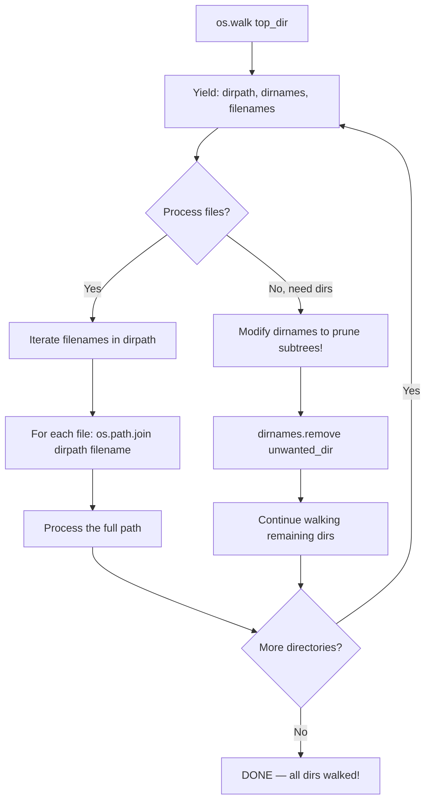

```python
import os


# os.walk() — yields (dirpath, dirnames, filenames) for every subdirectory:

for dirpath, dirnames, filenames in os.walk("/home/alice/projects"):
    # For each directory, get the full paths of files:
    for filename in filenames:
        filepath = os.path.join(dirpath, filename)
        print(f"File: {filepath}")       # Full path of every file!
    
    # And subdirectories:
    for dirname in dirnames:
        subdir_path = os.path.join(dirpath, dirname)
        print(f"Dir:  {subdir_path}")


# Walk with topdown=False (bottom-up: process leaves before root):

for dirpath, _, _ in os.walk("/home", topdown=False):
    # This walks children first, then parents — useful for deletion!
    pass


# Prune directories while walking (speed up large traversals):

for dirpath, dirnames, filenames in os.walk("/home"):
    # Remove directories you don't want to visit (modifies dirnames in-place!)
    dirnames[:] = [d for d in dirnames if d not in {".git", "__pycache__", "node_modules"}]
    
    # Now only processes directories NOT in the exclusion set!


# Get all files recursively (like ls -R):

def list_all_files(root_dir):
    """Get every file path under root_dir recursively."""
    all_files = []
    for dirpath, _, filenames in os.walk(root_dir):
        for fname in filenames:
            full_path = os.path.join(dirpath, fname)
            if not os.path.islink(full_path):  # Skip symlinks (avoid loops!)
                all_files.append(full_path)
    return all_files

all_files = list_all_files("/home/alice/projects")
```

### 13.3 `os.scandir()` — Fast Directory Iterator

```python
import os


# scandir() is MUCH faster than listdir() + stat for large directories!

with os.scandir("/home/alice/photos") as entries:
    for entry in entries:                 # Each entry is an DirEntry object ✅
        if entry.is_file():               # Fast check — doesn't require extra syscall!
            print(f"File: {entry.name} ({entry.stat().st_size} bytes)")
        
        if entry.is_dir():                # Also fast! ✅
            print(f"Dir:  {entry.name}")
        
        if entry.is_symlink():            # Check if symlink ✅
            print(f"Symlink: {entry.path}")
        
        # Access stat info without extra syscall (cached by scandir!):
        st = entry.stat()                 # Cached stat result ✅
        print(f"{entry.name}: {st.st_size} bytes, modified at {st.st_mtime}")


# Compare speed — scandir vs listdir+stat:

# Slow: listdir + separate stat for each file (one syscall per file!)
with os.scandir("/large/directory") as fast_entries:
    pass                          # scandir does ONE syscall to get all entries!


# NamedTemporaryFile from scandir:

def find_largest_file(dirpath):
    """Find the largest file in a directory using scandir."""
    largest = None
    max_size = 0
    
    with os.scandir(dirpath) as it:
        for entry in it:
            if entry.is_file():
                size = entry.stat().st_size
                if size > max_size:
                    max_size = size
                    largest = entry.path
    
    return largest, max_size

biggest, size = find_largest_file("/home/alice/downloads")
print(f"Largest: {biggest} ({size / 1_000_000:.2f} MB)")


# ⚠️ scandir requires explicit close (or use with statement!):
scanner = os.scandir("/some/dir")          # DON'T forget to close!
for entry in scanner:
    process(entry)
scanner.close()                              # Required if not using 'with'!
```

### 13.4 os Module — Complete File Operation Reference

| Function | Purpose | TypeScript/Node.js Equivalent |
|----------|---------|-------------------------------|
| `os.path.join(a, b, c)` | Join path components | `path.join()` or `Path / Path` |
| `os.path.normpath(p)` | Clean up `.` and `..` in paths | `path.normalize()` |
| `os.path.abspath(p)` | Convert to absolute path | `path.resolve()` or `fs.realpathSync()` |
| `os.path.split(p)` | Split dir/name | No direct equiv (use path.parse()) |
| `os.path.splitext(p)` | Split name/extension | `path.extname()` + parse |
| `os.path.exists(p)` | Check existence | `existsSync()` or `Path().exists()` |
| `os.path.isfile(p)` | Is it a file? | `statSync().isFile()` or `Path().is_file()` |
| `os.path.isdir(p)` | Is it a directory? | `statSync().isDirectory()` or `Path().is_dir()` |
| `os.path.islink(p)` | Is it a symlink? | `lstatSync().isSymbolicLink()` or `Path().is_symlink()` |
| `os.path.getsize(p)` | File size in bytes | `statSync().size` |
| `os.path.getmtime(p)` | Last modification timestamp | `statSync().mtimeMs / 1000` |
| `os.walk(top)` | Recursive dir traversal | No native equivalent (need globby/fast-glob) |
| `os.scandir(dir)` | Fast directory iterator | No equiv — must use readdir + stat |
| `os.listdir(dir)` | List immediate children | `readdirSync()` |
| `os.makedirs(path, exist_ok=True)` | Create nested dirs | `mkdirSync(path, { recursive: true })` |
| `os.remove(path)` / `os.unlink(path)` | Delete file | `unlinkSync()` or `Path().unlink()` |
| `os.rename(src, dst)` | Rename/move file | `renameSync()` or `fs.promises.rename()` |
| `os.chmod(path, mode)` | Change permissions | `chmodSync()` |
| `os.access(path, flag)` | Check permission | No equiv (OS-level check) |
| `os.path.samefile(p1, p2)` | Are they the same file? | No equiv (need to compare inodes) |

---

## 14. File Locking — fcntl, flock, portalocker

### 14.1 Unix/Linux/Unix-like: fcntl.flock()

```python
import fcntl
import os


# Non-blocking lock on a file:

fd = os.open("shared_data.txt", os.O_RDWR)
try:
    fcntl.flock(fd, fcntl.LOCK_EX | fcntl.LOCK_NB)  # Exclusive lock, non-blocking!
    # Write to the file safely...
    os.write(fd, b"critical data\n")
finally:
    fcntl.flock(fd, fcntl.LOCK_UN)                  # Unlock!
    os.close(fd)


# Blocking lock (waits until lock is available):

fd = os.open("shared_data.txt", os.O_RDWR)
try:
    fcntl.flock(fd, fcntl.LOCK_EX)                   # Will block until lock acquired!
    os.write(fd, b"exclusive write\n")
finally:
    fcntl.flock(fd, fcntl.LOCK_UN)
    os.close(fd)


# Shared (read) lock vs exclusive (write) lock:

# Multiple readers can hold shared locks simultaneously:
fd = os.open("shared.txt", os.O_RDONLY)
fcntl.flock(fd, fcntl.LOCK_SH)                       # Shared lock — others can also read!
data = os.read(fd, 1024)
fcntl.flock(fd, fcntl.LOCK_UN)


# Locking with context manager pattern:

import contextlib

@contextlib.contextmanager
def locked_file(path, mode="r", block=False):
    """Context manager for file locking."""
    lock_flags = fcntl.LOCK_SH if "r" in mode else fcntl.LOCK_EX
    if not block:
        lock_flags |= fcntl.LOCK_NB
    
    fd = os.open(path, os.O_RDWR if "+" in mode else {"r": os.O_RDONLY, "w": os.O_WRONLY}[mode[0]])
    try:
        fcntl.flock(fd, lock_flags)
        yield os.fdopen(fd, mode)
    except BlockingIOError:
        os.close(fd)                                  # Lock not available!
        raise
    finally:
        if block:
            fcntl.flock(fd, fcntl.LOCK_UN)


# Usage:
with locked_file("shared.txt", "r+") as f:
    content = f.read()
    f.seek(0)
    f.write(content.upper())


# Lock types reference:

fcntl.LOCK_SH   # Shared (read) lock — multiple processes can hold simultaneously
fcntl.LOCK_EX   # Exclusive (write) lock — only one process at a time
fcntl.LOCK_NB   # Non-blocking (raise BlockingIOError if lock not available)
fcntl.LOCK_UN   # Unlock


# Lock range (lock only part of the file):

fd = os.open("bigfile.dat", os.O_RDWR)
fcntl.flock(fd, fcntl.LOCK_SH, 0, 1024)           # Lock bytes 0-1023 only!
```

### 14.2 Cross-Platform: portalocker Library

```python
# pip install portalocker

import portalocker


# portalocker works on Windows, Linux, and macOS — no platform-specific code needed!

with open("shared.txt", "r+") as f:
    portalocker.lock(f, portalocker.LOCK_EX)        # Exclusive lock ✅ Works everywhere!
    
    content = f.read()
    f.seek(0)
    f.write(content.upper())
    
    portalocker.unlock(f)                           # Unlock when done


# Non-blocking variant:

try:
    with open("shared.txt", "r+") as f:
        portalocker.lock(f, portalocker.LOCK_EX | portalocker.LOCK_NB)
        content = f.read()
except portalocker.LockException:
    print("File is locked by another process!")


# Supported lock constants in portalocker:

portalocker.LOCK_SH     # Shared lock
portalocker.LOCK_EX     # Exclusive lock
portalocker.LOCK_NB     # Non-blocking
portalocker.LOCK_UN     # Unlock
portalocker.LOCK_NBL    # Non-blocking read lock (rare)
```

### 14.3 File Locking Pattern Comparison

| Approach | Platform | Blocking? | Complexity | Use Case |
|----------|----------|-----------|------------|----------|
| `fcntl.flock()` | Linux/macOS | Both | Low | Unix-only apps |
| `portalocker` | Cross-platform | Both | Very low | Apps on Windows + Linux |
| Manual lock file | Cross-platform | Manual | High | Simple shared state (e.g., PID file) |

### 14.4 Lock File Pattern (Simple Cross-Platform)

```python
import os, signal


def acquire_lock_file(lock_path: str, timeout: int = 10) -> int:
    """Acquire an exclusive lock using a lock file (cross-platform)."""
    import time
    
    start_time = time.time()
    while True:
        try:
            fd = os.open(lock_path, os.O_CREAT | os.O_EXCL | os.O_WRONLY)
            os.write(fd, str(os.getpid()).encode())  # Write PID for diagnostics
            return fd                                  # Lock acquired!
        except FileExistsError:
            if time.time() - start_time > timeout:
                raise TimeoutError(f"Could not acquire lock after {timeout}s")
            time.sleep(0.1)


def release_lock_file(fd: int, lock_path: str):
    """Release the lock file."""
    os.close(fd)
    try:
        os.unlink(lock_path)
    except FileNotFoundError:
        pass  # Already released by another process


# Usage:
fd = acquire_lock_file("/tmp/myapp.lock", timeout=5)
try:
    do_critical_work()
finally:
    release_lock_file(fd, "/tmp/myapp.lock")
```

---

## 15. Cross-Platform Considerations & Encoding Deep Dive

### 15.1 Path Separators Across Platforms

```python
from pathlib import Path


# Forward slash (/) works on ALL platforms ✅ — Python handles the conversion!

Path("home/alice/docs/file.txt")     # Works on Windows too! 🎉

# But for path strings passed to C libraries (which may expect native separators):
str(Path("home/alice/docs/file.txt"))    # On Windows: "home\\alice\\docs\\file.txt"


# Use os.sep for explicit separator access:
import os
os.sep                           # "/" on Unix, "\\" on Windows
os.pathsep                       # ":" on Unix (PATH), ";" on Windows


# Line endings across platforms:

with open("cross_platform.txt", "w") as f:          # Default mode
    f.write("line1\nline2\n")                        # On Windows → \r\n; on Linux → \n!

with open("cross_platform.txt", "wb") as f:         # Binary mode — NO translation!
    f.write(b"line1\r\nline2\r\n")                   # Always exactly what you write ✅


# Universal newlines in text mode (reading):

with open("file.txt", "r", newline=None) as f:      # Default: universal newlines
    line = f.readline()                               # \n, \r, or \r\n all become "\n" ✅
```

### 15.2 Encoding Deep Dive

```python
# The golden rule: ALWAYS specify encoding explicitly!

with open("data.txt", "r", encoding="utf-8") as f:  # ✅ Always do this!
    content = f.read()


# Detect encoding of a file (best-effort):

import chardet                                    # pip install chardet (not built-in!)

with open("unknown_encoding.txt", "rb") as f:
    raw_data = f.read(10000)                      # Read first 10KB for detection
    result = chardet.detect(raw_data)
    print(f"Detected encoding: {result['encoding']} (confidence: {result['confidence']:.2%})")

# Common UTF-8 BOM markers:
with open("bom_file.txt", "r", encoding="utf-8-sig") as f:  # utf-8-sig strips BOM automatically!
    content = f.read()


# Handle encoding errors gracefully:

def read_with_fallback(path: str, encodings=("utf-8", "latin-1", "cp1252")) -> str:
    """Try multiple encodings until one works."""
    for encoding in encodings:
        try:
            with open(path, "r", encoding=encoding) as f:
                return f.read()
        except UnicodeDecodeError:
            continue
    raise ValueError(f"Could not read {path} with any of the tried encodings")


# Common file encoding issues and fixes:

# Issue 1: Windows default encoding (cp1252) vs expected UTF-8
with open("file.txt", "r", encoding="utf-8-sig") as f:  # Handles BOM ✅

# Issue 2: Mixed encodings in a single file (use chardet for detection!)

# Issue 3: Null bytes in text files (binary data sneaking in)
with open("file.txt", "r", encoding="utf-8", errors="replace") as f:  # Replace bad bytes ✅
```

---

## 16. Complete Comparison Table: Node.js fs → Python I/O

### 16.1 Core File Operations

| Operation | Node.js (`fs/promises` or `path`) | Python | Notes |
|-----------|-------------------------------------|--------|-------|
| Read file as string | `readFile("f", "utf-8")` → `Promise<string>` | `Path("f").read_text(encoding="utf-8")` → `str` | Both sync and async variants exist |
| Write file from string | `writeFile("f", data)` → `Promise<void>` | `Path("f").write_text(data, encoding="utf-8")` → `int` (chars written) | Python returns write count |
| Read binary file | `readFile("f.png")` → `Promise<Buffer>` | `Path("f.png").read_bytes()` → `bytes` | Same concept |
| Write binary | `writeFile("f.png", buffer)` | `Path("f.png").write_bytes(data)` → `int` (bytes written) | Python returns write count |
| Read file sync | `readFileSync("f")` | `open("f","rb").read()` or `Path("f").read_bytes()` | Python lacks built-in sync/async distinction |
| Check exists | `stat("f").then(s => s.isFile())` | `Path("f").is_file()` | pathlib makes this a method |
| Append to file | `appendFile("f", data)` | `Path("f").read_text() + data; write_text()` or open with `"a"` mode | Python has native `"a"` mode |

### 16.2 Directory Operations

| Operation | Node.js | Python | Notes |
|-----------|---------|--------|-------|
| List files | `readdirSync(dir)` → `[string]` | `list(Path(dir).iterdir())` → `[Path]` | Python returns Path objects! |
| Create dir recursive | `mkdirSync(dir, {recursive: true})` | `Path(dir).mkdir(parents=True, exist_ok=True)` | pathlib's name is more descriptive |
| Remove dir recursive | `rmSync(dir, {recursive: true})` | `shutil.rmtree(dir)` or loop `unlink()` + `rmdir()` | Python lacks built-in for this — use shutil |
| Copy file | `copyFile(src, dst)` | `shutil.copy(src, dst)` | Both require explicit import |
| Move/rename | `renameSync(src, dst)` | `Path(src).replace(dst)` or `os.rename(src, dst)` | pathlib has replace() |
| Walk directories | ❌ No built-in — need globby/fast-glob | `os.walk(dir)` or `Path().rglob("*")` | **Python wins** — built-in! |

### 16.3 Path Utilities

| Operation | Node.js `path` module | Python `pathlib.Path` |
|-----------|----------------------|----------------------|
| Join paths | `path.join("a", "b", "c")` | `Path("a") / "b" / "c"` |
| Absolute path | `path.resolve(p)` | `p.resolve()` |
| Relative path | `path.relative(from, to)` | `(from).relative_to(to)` or `os.path.relpath(to, from)` |
| Base name (no dir) | `path.basename(p)` | `p.name` |
| Directory part | `path.dirname(p)` | `p.parent` |
| Extension | `path.extname(p)` → `.txt` | `p.suffix` → `.txt` |
| All extensions | ❌ No built-in | `p.suffixes` → `[".tar", ".gz"]` ✅ |
| Stem (no ext) | `path.parse(p).name.slice(0, -ext.length)` | `p.stem` ✅ |
| Is absolute | `path.isAbsolute(p)` | `p.is_absolute()` |
| Parse path parts | `path.parse(p)` → `{ root, dir, base, ext, name }` | `Path("a/b/c.txt").parts` → `('a', 'b', 'c.txt')` (tuple!) |
| Match pattern | ❌ No built-in | `p.match("*.txt")` ✅ |

### 16.4 Metadata & Stats

| Operation | Node.js fs | Python |
|-----------|-----------|--------|
| File stats | `stat("f").then(s => s.size)` | `Path("f").stat().st_size` or `os.stat("f").st_size` |
| File size | Same as above | Same as above |
| File modified time | `s.mtimeMs / 1000` | `Path("f").stat().st_mtime` |
| File access time | `s.atimeMs / 1000` | `Path("f").stat().st_atime` |
| Is symlink | `lstatSync(p).isSymbolicLink()` | `Path(p).is_symlink()` |
| Is directory | `statSync(p).isDirectory()` | `Path(p).is_dir()` |
| Follow symlinks | `fs.realpathSync(p)` | `Path(p).resolve()` |

### 16.5 Temporary Files

| Operation | Node.js | Python |
|-----------|---------|--------|
| Temp file path | `tmpnam()` or `os.tmpdir()` + generate name | `tempfile.NamedTemporaryFile(delete=False)` — much richer! |
| Temp directory | `tmpdir()` or `mkdtemp()` npm package | `tempfile.TemporaryDirectory()` ✅ built-in! |

### 16.6 File Locking

| Operation | Node.js | Python |
|-----------|---------|--------|
| File lock | `fs.promises.access(path, fs.constants.X_OK)` (no true locking!) — need `lockfile` npm package | `fcntl.flock(fd, fcntl.LOCK_EX)` or `portalocker.lock()` ✅ built-in! |

### 16.7 CSV/JSON

| Operation | Node.js | Python |
|-----------|---------|--------|
| CSV read | `csv-parser` npm package (3rd party) | `csv.reader(f)` ✅ Built-in! |
| CSV write | `json2csv` npm package (3rd party) | `csv.writer(f)` ✅ Built-in! |
| JSON serialize | `JSON.stringify(obj, null, 2)` | `json.dumps(obj, indent=2)` ✅ Built-in! |
| JSON deserialize | `JSON.parse(str)` | `json.loads(str)` ✅ Built-in! |
| JSON to file | `writeFileSync("f", JSON.stringify(obj))` | `json.dump(obj, f, indent=2)` ✅ Dedicated function! |

### 16.8 Serialization

| Operation | Node.js | Python |
|-----------|---------|--------|
| Serialize object | `JSON.stringify()` (3rd party for complex types) | `pickle.dumps(obj)` ✅ Built-in! |
| Deserialize | `JSON.parse()` (3rd party for complex types) | `pickle.loads(data)` ✅ Built-in! |
| Structured binary | `Buffer` + `DataView` (TypedArray API) | `struct.pack/unpack()` ✅ Built-in! |

---

## 17. Quizzes (25+) with Answers

### Quiz 1 — File Modes
**Q:** What happens if you open a file with mode `'x'` when it already exists?
<details><summary>Answer</summary>`FileExistsError` is raised. The 'x' mode is exclusive create — it fails if the file exists, ensuring no race condition.</details>

### Quiz 2 — Encoding
**Q:** Why should you always specify `encoding="utf-8"` in `open()`?
<details><summary>Answer</summary>The default encoding depends on the OS locale (e.g., cp1252 on Windows, UTF-8 on Linux). Without explicit encoding, your code may produce garbled output or UnicodeDecodeError on different machines.</details>

### Quiz 3 — Context Managers
**Q:** What's wrong with this code? `f = open("file.txt"); content = f.read(); f.close()`
<details><summary>Answer</summary>If an exception occurs between `open()` and `close()`, the file descriptor leaks. Always use `with open(...) as f:` for guaranteed cleanup.</details>

### Quiz 4 — pathlib Properties
**Q:** For `Path("archive.tar.gz")`, what is `.suffix` and what is `.suffixes`?
<details><summary>Answer</summary>.suffix returns ".gz" (only the last extension). .suffixes returns [".tar", ".gz"] (all extensions).</details>

### Quiz 5 — CSV Module
**Q:** Why must you use `newline=""` when opening CSV files for writing?
<details><summary>Answer</summary>On Windows, text mode translates \n to \r\n. If the CSV writer already outputs \r\n, you get double newlines (\r\r\n). Using `newline=""` prevents this translation.</details>

### Quiz 6 — JSON Formatting
**Q:** How do you produce compact (no whitespace) JSON output?
<details><summary>Answer</summary>`json.dumps(data, separators=(",", ":"))`. The default separator with indent adds spaces; without indent it already uses compact separators.</details>

### Quiz 7 — Binary I/O
**Q:** What's the difference between `pickle` and `marshal`?
<details><summary>Answer</summary>`pickle` serializes any Python object (including classes, functions) but is slower and insecure for untrusted data. `marshal` is faster but only handles basic types and is meant for Python bytecode.</details>

### Quiz 8 — seek/tell
**Q:** After calling `f.seek(0, 2)` on an open file, what does `f.tell()` return?
<details><summary>Answer</summary>The total file size in bytes. `seek(0, 2)` moves to position 0 from the end (i.e., the end of the file), so tell() returns the file's byte offset = file size.</details>

### Quiz 9 — tempfiles
**Q:** Why is `NamedTemporaryFile` problematic on Windows with `delete=True`?
<details><summary>Answer</summary>On Windows, a file cannot be opened twice simultaneously. With `delete=True`, the file is deleted when the context exits, but even before that, you can't open the path from another process because Windows holds it locked.</details>

### Quiz 10 — File Permissions
**Q:** What does permission `0o644` mean?
<details><summary>Answer</summary>Owner: read+write (rw-), Group: read-only (r--), Others: read-only (r--). Commonly used for public config files.</details>

### Quiz 11 — os.stat attributes
**Q:** What field in `os.stat_result` gives the inode number?
<details><summary>Answer</summary>.st_ino. Each file on a filesystem has a unique inode number within that filesystem.</details>

### Quiz 12 — scandir vs listdir
**Q:** Why is `os.scandir()` faster than `os.listdir()` + manual stat?
<details><summary>Answer</summary>`scandir()` makes one syscall to get all entries with their stats already populated (cached). `listdir()` requires a separate `stat()` syscall for each entry — O(n) extra syscalls.</details>

### Quiz 13 — File Locking
**Q:** What's the difference between `fcntl.LOCK_SH` and `fcntl.LOCK_EX`?
<details><summary>Answer</summary>`LOCK_SH` (shared lock) allows multiple processes to hold the lock simultaneously (for reading). `LOCK_EX` (exclusive lock) only allows one process at a time (for writing).</details>

### Quiz 14 — struct module
**Q:** What does format code `'>'` do in `struct.pack()`?
<details><summary>Answer</summary>It sets the byte order to big-endian (network byte order). Other options: `<` for little-endian, `=` for native, `@` for native with padding.</details>

### Quiz 15 — mmap
**Q:** What's the advantage of memory-mapped files over reading into memory?
<details><summary>Answer</summary>The OS handles paging — only the parts you actually access are loaded into RAM. For a 10GB file, you can access individual bytes without loading the entire file into memory.</details>

### Quiz 16 — writelines Bug
**Q:** What's wrong with: `f.writelines(["Alice", "Bob"])`?
<details><summary>Answer</summary>`writelines()` does NOT add newlines between entries. The result is a single line "AliceBob". You need to add `\n` manually: `["Alice\n", "Bob\n"]`.</details>

### Quiz 17 — pathlib glob
**Q:** What's the difference between `.glob("*.py")` and `.rglob("*.py")`?
<details><summary>Answer</summary>.glob() only searches in the immediate directory (non-recursive). .rglob() searches recursively through all subdirectories (like `find . -name "*.py"`).</details>

### Quiz 18 — JSON type mapping
**Q:** What Python type does JSON `null` become when parsed by `json.load()`?
<details><summary>Answer</summary>`None`. JSON `true` → `True`, `false` → `False`, numbers → int/float, arrays → list, objects → dict.</details>

### Quiz 19 — pickle security
**Q:** Why is unpickling untrusted data dangerous?
<details><summary>Answer</summary>Pickle deserialization can execute arbitrary Python code during the unpickling process. An attacker could craft malicious pickle data that runs harmful code (e.g., `os.system('rm -rf /')`). Always use JSON for untrusted data.</details>

### Quiz 20 — CSV Sniffer
**Q:** What does `csv.Sniffer().sniff()` return?
<details><summary>Answer</summary>A `csv.Dialect` object containing the detected format parameters: delimiter, quotechar, quoting style, etc. You pass this dialect to csv.reader() or csv.writer().</details>

### Quiz 21 — open() buffering
**Q:** What does `buffering=0` mean in `open()`? When is it valid?
<details><summary>Answer</summary>No buffering — every write is immediately flushed. Only valid for binary mode files. For text mode, buffering=1 means line-buffered.</details>

### Quiz 22 — pathlib resolve vs absolute
**Q:** What's the difference between `Path("a/../b").resolve()` and `Path("a/../b").absolute()`?
<details><summary>Answer</summary>.resolve() returns `/current/working/dir/b` (resolves both relative path AND symlinks). .absolute() returns `/current/working/dir/a/../b` (only makes absolute, doesn't resolve .. or symlinks).</details>

### Quiz 23 — CSV DictReader
**Q:** How do you handle CSV files where some rows have fewer columns than the header?
<details><summary>Answer</summary>Use `csv.DictReader(f, fieldnames=..., restval="default_value")`. Missing fields get the default value. Use `restkey` to collect extra fields in an overflow key.</details>

### Quiz 24 — JSON encoder customization
**Q:** How do you serialize a Python `datetime` object as JSON?
<details><summary>Answer</summary>Create a custom `JSONEncoder` that overrides the `default()` method, converting datetime objects to ISO format strings (`.isoformat()`). Then pass `cls=YourEncoder` to `json.dumps()` or `json.dump()`.</details>

### Quiz 25 — File descriptor leak
**Q:** Which of these patterns leaks file descriptors? (a) `with open()`, (b) `open().read()`, (c) Both, (d) Neither
<details><summary>Answer</summary>(b). Pattern (b) calls `open()` but the file object has no reference — it gets garbage collected, which closes the fd eventually. However, this is non-deterministic and unreliable. Always use (a) with `with` for guaranteed closure.</details>

---

## 18. Exercises (20+) with Solutions

### Exercise 1: Text File Word Frequency Counter
**Problem:** Read a text file and count the frequency of each word (case-insensitive). Output a sorted list.

<details><summary>Solution</summary>

```python
from pathlib import Path
import re

def word_frequency(filepath: str) -> dict[str, int]:
    """Count word frequencies in a text file."""
    freq = {}
    with open(filepath, "r", encoding="utf-8") as f:
        for line in f:                       # Line-by-line (memory efficient!)
            words = re.findall(r'\b\w+\b', line.lower())  # Extract words
            for word in words:
                freq[word] = freq.get(word, 0) + 1
    
    # Sort by frequency (descending), then alphabetically
    return dict(sorted(freq.items(), key=lambda x: (-x[1], x[0])))

# Usage:
freq = word_frequency("large_document.txt")
for word, count in list(freq.items())[:20]:
    print(f"{word}: {count}")
```
</details>

### Exercise 2: Binary File Copy with Checksums
**Problem:** Copy a binary file and compute MD5/SHA256 checksums for source and destination.

<details><summary>Solution</summary>

```python
from pathlib import Path
import hashlib

def copy_with_checksum(src: str, dst: str, chunk_size: int = 8192) -> dict[str, str]:
    """Copy file and compute checksums for both source and destination."""
    def compute_checksum(filepath: str) -> str:
        sha256 = hashlib.sha256()
        with open(filepath, "rb") as f:
            while chunk := f.read(chunk_size):
                sha256.update(chunk)
        return sha256.hexdigest()
    
    # Copy
    src_path = Path(src)
    dst_path = Path(dst)
    with src_path.open("rb") as fin, dst_path.open("wb") as fout:
        while chunk := fin.read(chunk_size):
            fout.write(chunk)
    
    return {
        "src_sha256": compute_checksum(src),
        "dst_sha256": compute_checksum(dst),
    }

# Verify copy integrity
checksums = copy_with_checksum("original.bin", "copy.bin")
assert checksums["src_sha256"] == checksums["dst_sha256"], "Copy failed integrity check!"
```
</details>

### Exercise 3: Recursive File Organizer
**Problem:** Organize files in a directory by extension into subfolders.

<details><summary>Solution</summary>

```python
from pathlib import Path
import shutil

def organize_by_extension(directory: str):
    """Move files into subfolders named after their extensions."""
    dir_path = Path(directory)
    
    for file_path in dir_path.iterdir():
        if file_path.is_file() and file_path.suffix:  # Only files with extensions
            ext_dir = dir_path / file_path.suffix.lstrip(".")  # "jpg" from ".jpg"
            ext_dir.mkdir(exist_ok=True)
            
            dest = ext_dir / file_path.name
            if not dest.exists():                    # Don't overwrite!
                shutil.move(str(file_path), str(dest))

organize_by_extension("/home/alice/downloads")
```
</details>

### Exercise 4: CSV to JSON Converter with Type Inference
**Problem:** Read a CSV file and convert to JSON, inferring types (int, float, bool) from values.

<details><summary>Solution</summary>

```python
import csv
import json
from pathlib import Path

def infer_type(value: str):
    """Infer Python type from string value."""
    if value.lower() in ("true", "false"):
        return value.lower() == "true"
    try:
        return int(value)
    except ValueError:
        try:
            return float(value)
        except ValueError:
            return value

def csv_to_json(csv_path: str, json_path: str):
    """Convert CSV to JSON with type inference."""
    rows = []
    with open(csv_path, "r", newline="", encoding="utf-8") as f:
        reader = csv.DictReader(f)
        fieldnames = reader.fieldnames
        
        for row in reader:
            typed_row = {}
            for key, value in row.items():
                typed_row[key] = infer_type(value) if value else value  # None for empty strings
            rows.append(typed_row)
    
    with open(json_path, "w", encoding="utf-8") as f:
        json.dump({"headers": fieldnames, "data": rows}, f, indent=2, ensure_ascii=False)

csv_to_json("data.csv", "data.json")
```
</details>

### Exercise 5: Log File Parser
**Problem:** Parse a log file with format `[TIMESTAMP] [LEVEL] message` and return structured entries.

<details><summary>Solution</summary>

```python
import re
from pathlib import Path
from dataclasses import dataclass
from typing import Optional

@dataclass
class LogEntry:
    timestamp: str
    level: str
    message: str
    filepath: str = ""

def parse_log_file(filepath: str) -> list[LogEntry]:
    """Parse structured log file into LogEntry objects."""
    entries = []
    pattern = re.compile(r'\[(\d{4}-\d{2}-\d{2} \d{2}:\d{2}:\d{2})\] \[(\w+)\] (.+)')
    
    with open(filepath, "r", encoding="utf-8") as f:
        for line_num, line in enumerate(f, 1):
            match = pattern.match(line.strip())
            if match:
                entries.append(LogEntry(
                    timestamp=match.group(1),
                    level=match.group(2),
                    message=match.group(3),
                    filepath=f"{filepath}:{line_num}"
                ))
    
    return entries

# Usage: filter by level
entries = parse_log_file("app.log")
errors = [e for e in entries if e.level == "ERROR"]
print(f"Found {len(errors)} errors")
for err in errors[-5:]:                      # Last 5 errors
    print(f"  [{err.timestamp}] {err.message}")
```
</details>

### Exercise 6: Path Validation Utility
**Problem:** Create a utility that validates and normalizes file paths with checks for existence, permissions, and safety.

<details><summary>Solution</summary>

```python
from pathlib import Path
import os

class PathValidator:
    """Validate and normalize file paths."""
    
    @staticmethod
    def validate(path: str, must_exist: bool = True, can_write: bool = False) -> dict:
        """Validate a path with comprehensive checks."""
        result = {
            "path": path,
            "is_valid": True,
            "errors": [],
        }
        
        p = Path(path)
        result["resolved"] = str(p.resolve())
        result["is_absolute"] = p.is_absolute()
        result["exists"] = p.exists()
        
        if must_exist and not p.exists():
            result["is_valid"] = False
            result["errors"].append(f"Path does not exist: {path}")
        
        if can_write:
            if p.exists():
                # Check write permission
                writable = os.access(str(p), os.W_OK) if p.is_file() else True
                if not writable:
                    result["is_valid"] = False
                    result["errors"].append("Path is not writable")
            elif not os.access(str(p.parent) if p.parent != Path(".") else "/", os.W_OK):
                result["is_valid"] = False
                result["errors"].append("Parent directory is not writable")
        
        # Security: check for path traversal
        resolved_str = str(p.resolve())
        if ".." in path and not path.startswith(("/", ".")):
            result["errors"].append("Potential path traversal detected")
        
        return result

# Usage:
result = PathValidator.validate("../../etc/passwd", must_exist=True)
print(result)
```
</details>

### Exercise 7: JSON Schema Validator for File Content
**Problem:** Validate JSON file content against expected structure without external libraries.

<details><summary>Solution</summary>

```python
import json

def validate_json_structure(data: dict, schema: dict, path: str = "") -> list[str]:
    """Validate JSON data structure against a simple schema."""
    errors = []
    
    for key, expected_type in schema.items():
        current_path = f"{path}.{key}" if path else key
        
        if key not in data:
            # Check if it's optional (starts with '?')
            optional_key = f"?{key}"
            if optional_key not in schema:
                errors.append(f"Missing required field: {current_path}")
            continue
        
        value = data[key]
        
        if isinstance(expected_type, list):  # Nested structure
            if not isinstance(value, dict):
                errors.append(f"{current_path}: expected object, got {type(value).__name__}")
            else:
                errors.extend(validate_json_structure(value, expected_type[0], current_path))
        elif type(value) != expected_type:
            # Type check
            allowed = (expected_type,) if isinstance(expected_type, type) else tuple(expected_type)
            if not isinstance(value, allowed):
                errors.append(f"{current_path}: expected {expected_type.__name__}, got {type(value).__name__}")
    
    return errors

# Schema example:
schema = {"name": str, "age": int, "email": str}
errors = validate_json_structure({"name": 123, "age": 25}, schema)
print(errors)  # ['name: expected str, got int']
```
</details>

### Exercise 8: File Diff Tool
**Problem:** Compare two files and show differences line by line (like the `diff` command).

<details><summary>Solution</summary>

```python
from pathlib import Path

def file_diff(file1: str, file2: str) -> list[tuple[int, str | None, str | None]]:
    """Compare two files and return a list of (line_num, line1, line2)."""
    lines1 = Path(file1).read_text(encoding="utf-8").splitlines()
    lines2 = Path(file2).read_text(encoding="utf-8").splitlines()
    
    max_lines = max(len(lines1), len(lines2))
    diff = []
    
    for i in range(max_lines):
        line1 = lines1[i] if i < len(lines1) else None
        line2 = lines2[i] if i < len(lines2) else None
        
        if line1 != line2:
            diff.append((i + 1, line1, line2))
    
    return diff

# Display the diff
diffs = file_diff("old.txt", "new.txt")
for line_num, old_line, new_line in diffs:
    print(f"Line {line_num}:")
    if old_line is not None:
        print(f"  - {old_line}")
    if new_line is not None:
        print(f"  + {new_line}")
```
</details>

### Exercise 9: Concurrent File Reader with ThreadPoolExecutor
**Problem:** Read multiple large files concurrently using threads.

<details><summary>Solution</summary>

```python
from concurrent.futures import ThreadPoolExecutor, as_completed
from pathlib import Path
import time

def read_file(filepath: str) -> tuple[str, float, int]:
    """Read a file and return (path, size_in_kb, lines)."""
    path = Path(filepath)
    content = path.read_text(encoding="utf-8")
    return filepath, len(content) / 1024, content.count("\n")

def read_concurrent(filepaths: list[str], max_workers: int = 5) -> dict[str, tuple[int, int]]:
    """Read multiple files concurrently and return stats."""
    results = {}
    
    with ThreadPoolExecutor(max_workers=max_workers) as executor:
        future_to_path = {executor.submit(read_file, fp): fp for fp in filepaths}
        
        for future in as_completed(future_to_path):
            filepath, size_kb, lines = future.result()
            results[filepath] = (int(size_kb), lines)
    
    return results

# Usage:
files = ["large1.txt", "large2.txt", "large3.txt"]
stats = read_concurrent(files)
for fp, (size_kb, lines) in stats.items():
    print(f"{fp}: {size_kb} KB, {lines} lines")
```
</details>

### Exercise 10: CSV Dialect Auto-Detector
**Problem:** Detect the CSV dialect of a file and parse it correctly.

<details><summary>Solution</summary>

```python
import csv

def detect_and_parse_csv(filepath: str) -> list[dict]:
    """Auto-detect CSV format and parse all rows."""
    with open(filepath, "r", encoding="utf-8") as f:
        sample = f.read(4096)  # Read first 4KB
    
    sniffer = csv.Sniffer()
    dialect = sniffer.sniff(sample)
    
    # Re-read with detected dialect
    rows = []
    with open(filepath, "r", newline="", encoding="utf-8") as f:
        reader = csv.DictReader(f, dialect=dialect)
        for row in reader:
            rows.append(dict(row))
    
    return rows

data = detect_and_parse_csv("unknown_format.csv")
print(f"Parsed {len(data)} rows with dialect: delimiter='{data[0] and next(iter(data.keys()))}'")
```
</details>

### Exercise 11: JSON Schema Builder from Example
**Problem:** Generate a JSON schema-like structure from example data.

<details><summary>Solution</summary>

```python
from typing import Any

def infer_schema(data: Any) -> dict[str, type]:
    """Generate schema from example JSON data."""
    if isinstance(data, dict):
        return {k: infer_schema(v) for k, v in data.items()}
    elif isinstance(data, list):
        if data:  # Non-empty list
            return {"items": infer_schema(data[0])}
        return []
    else:
        return type(data)

# Example usage:
example = {
    "name": "Alice",
    "age": 30,
    "scores": [95, 87, 92],
    "address": {"city": "NYC", "zip": "10001"},
}

schema = infer_schema(example)
print(schema)  # {'name': <class 'str'>, 'age': <class 'int'>, 'scores': {'items': <class 'int'>}, ...}
```
</details>

### Exercise 12: Temp File Manager with Cleanup Context
**Problem:** Create a context manager that manages multiple temp files and directories.

<details><summary>Solution</summary>

```python
import tempfile
from contextlib import contextmanager
from pathlib import Path

@contextmanager
def managed_temp_files(*, num_files: int = 1, create_dir: bool = False):
    """Context manager for multiple temp files and optional directory."""
    temp_files = []
    temp_dir = None
    
    try:
        # Create temporary files
        for _ in range(num_files):
            tf = tempfile.NamedTemporaryFile(delete=False, suffix=".tmp")
            temp_files.append(tf)
        
        # Create temporary directory if requested
        if create_dir:
            temp_dir = tempfile.TemporaryDirectory()
        
        yield {
            "files": [tf.name for tf in temp_files],  # Exposed paths
            "directory": temp_dir.name if temp_dir else None,
            "_cleanup": lambda: _cleanup(temp_files, temp_dir),
        }
    
    finally:
        # Always clean up
        _cleanup(temp_files, temp_dir)

def _cleanup(files, directory):
    for f in files:
        try:
            f.close()
            Path(f.name).unlink(missing_ok=True)
        except (FileNotFoundError, PermissionError):
            pass
    if directory:
        try:
            directory.cleanup()
        except (PermissionError, OSError):
            pass

# Usage:
with managed_temp_files(num_files=2, create_dir=True) as manager:
    for path in manager["files"]:
        Path(path).write_text("temp data")
    
    config_path = Path(manager["directory"]) / "config.json"
    config_path.write_text('{"key": "value"}')
```
</details>

### Exercise 13: Memory-Mapped Binary Protocol Parser
**Problem:** Parse a binary protocol from a memory-mapped file.

<details><summary>Solution</summary>

```python
import mmap
import struct

def parse_binary_protocol(filepath: str) -> list[dict]:
    """Parse a binary protocol from a memory-mapped file."""
    records = []
    
    # Record format: magic(4 bytes), id(4 bytes), length(2 bytes), data(length bytes)
    HEADER_FORMAT = '<IId'  # magic(I), id(I), length(H)
    HEADER_SIZE = struct.calcsize(HEADER_FORMAT)  # 10 bytes
    
    with open(filepath, "r+b") as f:
        mm = mmap.mmap(f.fileno(), 0)
        
        offset = 0
        while offset + HEADER_SIZE <= len(mm):
            magic, record_id, length = struct.unpack_from(HEADER_FORMAT, mm, offset)
            
            if magic != 0xCAFEBABE:  # Magic number check
                break
            
            data_offset = offset + HEADER_SIZE
            data = mm[data_offset:data_offset + length]
            
            records.append({
                "magic": hex(magic),
                "id": record_id,
                "length": length,
                "data": bytes(data),  # Convert mmap slice to bytes
            })
            
            offset = data_offset + length  # Move past this record
        
        mm.close()
    
    return records

# Usage:
records = parse_binary_protocol("protocol_data.bin")
for r in records:
    print(f"Record {r['id']}: magic={r['magic']}, {r['length']} bytes")
```
</details>

### Exercise 14: File Change Monitor
**Problem:** Monitor a directory for changes (new files, modified files) without external libraries.

<details><summary>Solution</summary>

```python
import os
import time
from pathlib import Path
from typing import Callable

class DirMonitor:
    """Simple file/directory change monitor."""
    
    def __init__(self, directory: str, poll_interval: float = 1.0):
        self.directory = Path(directory)
        self.poll_interval = poll_interval
        self._state = {}  # filepath -> (mtime, size)
    
    def _get_current_state(self) -> dict[str, tuple[float, int]]:
        """Get current state of all files in directory."""
        state = {}
        if not self.directory.exists():
            return state
        
        for file_path in self.directory.rglob("*"):
            if file_path.is_file():
                try:
                    stat = file_path.stat()
                    key = str(file_path)
                    state[key] = (stat.st_mtime, stat.st_size)
                except (PermissionError, OSError):
                    continue
        return state
    
    def _get_changes(self, old_state: dict, new_state: dict) -> tuple[list[str], list[str], list[str]]:
        """Detect new, modified, and deleted files."""
        old_keys = set(old_state.keys())
        new_keys = set(new_state.keys())
        
        added = [k for k in new_keys - old_keys]
        removed = [k for k in old_keys - new_keys]
        modified = [k for k in old_keys & new_keys if old_state[k] != new_state[k]]
        
        return added, modified, removed
    
    def watch(self, callback: Callable[[list[str], list[str], list[str]], None]):
        """Watch directory and call callback on changes."""
        prev_state = self._get_current_state()
        
        try:
            while True:
                time.sleep(self.poll_interval)
                current_state = self._get_current_state()
                
                added, modified, removed = self._get_changes(prev_state, current_state)
                
                if added or modified or removed:
                    callback(added, modified, removed)
                
                prev_state = current_state
        
        except KeyboardInterrupt:
            print("Monitoring stopped.")

# Usage:
def on_change(added, modified, removed):
    if added:
        print(f"Added: {added}")
    if modified:
        print(f"Modified: {modified}")
    if removed:
        print(f"Removed: {removed}")

monitor = DirMonitor("/home/alice/projects", poll_interval=2.0)
monitor.watch(on_change)  # Blocks until Ctrl+C
```
</details>

### Exercise 15: Cross-Platform File Path Normalizer
**Problem:** Normalize file paths across Windows, Linux, and macOS for consistent comparison.

<details><summary>Solution</summary>

```python
from pathlib import PurePosixPath, PureWindowsPath
import platform

def normalize_path(path: str) -> dict:
    """Normalize a path for cross-platform comparison."""
    p = Path(path)
    
    return {
        "original": path,
        "posix_style": str(PurePosixPath(p.resolve())),      # Forward slashes always
        "windows_style": str(PureWindowsPath(p)),             # Backslashes always
        "all_upper_windows": str(PureWindowsPath(p)).upper() if platform.system() == "Windows" else None,
        "resolved": str(p.resolve()),                         # Resolved symlinks
        "relative_to_home": p.relative_to(Path.home()) if str(p).startswith(str(Path.home())) else None,
    }

# Usage:
result = normalize_path("../docs/file.txt")
for k, v in result.items():
    print(f"{k}: {v}")
```
</details>

### Exercise 16: Struct Binary Logger
**Problem:** Write and read binary log records using `struct` format.

<details><summary>Solution</summary>

```python
import struct
import time
from pathlib import Path
from dataclasses import dataclass, field
from typing import Any

@dataclass
class LogRecord:
    timestamp: float
    level: int                    # 0=DEBUG, 1=INFO, 2=WARN, 3=ERROR
    module: str
    message: str

# Binary format: timestamp(d=8), level(I=4), module_length(I=4), message_length(I=4), module(s), message(s)
FORMAT = '<dIII'
HEADER_SIZE = struct.calcsize(FORMAT)  # 20 bytes

def write_binary_log(records: list[LogRecord], filepath: str):
    """Write log records to binary file."""
    with open(filepath, "wb") as f:
        for record in records:
            module_bytes = record.module.encode("utf-8")
            message_bytes = record.message.encode("utf-8")
            
            header = struct.pack(FORMAT, 
                                 record.timestamp,
                                 record.level,
                                 len(module_bytes),
                                 len(message_bytes))
            f.write(header)
            f.write(module_bytes)
            f.write(message_bytes)

def read_binary_log(filepath: str) -> list[LogRecord]:
    """Read log records from binary file."""
    records = []
    with open(filepath, "rb") as f:
        while True:
            header_data = f.read(HEADER_SIZE)
            if len(header_data) < HEADER_SIZE:
                break
            
            timestamp, level, mod_len, msg_len = struct.unpack(FORMAT, header_data)
            
            module_bytes = f.read(mod_len)
            message_bytes = f.read(msg_len)
            
            records.append(LogRecord(
                timestamp=timestamp,
                level=level,
                module=module_bytes.decode("utf-8"),
                message=message_bytes.decode("utf-8"),
            ))
    
    return records

# Usage:
import time
records = [
    LogRecord(time.time(), 0, "app.py", "Application started"),
    LogRecord(time.time(), 3, "db.py", "Connection failed"),
]
write_binary_log(records, "logs.bin")
loaded = read_binary_log("logs.bin")
print(f"Loaded {len(loaded)} records from binary log")
for r in loaded:
    print(f"  [{r.module}] ({['DEBUG','INFO','WARN','ERROR'][r.level]}) {r.message}")
```
</details>

### Exercise 17: CSV Data Validator
**Problem:** Validate CSV data against expected schema (column count, types, required fields).

<details><summary>Solution</summary>

```python
import csv
from pathlib import Path

def validate_csv(csv_path: str, expected_columns: int = None, 
                 type_checks: dict[str, type] = None) -> dict:
    """Validate CSV file against schema."""
    result = {"valid": True, "errors": [], "warnings": []}
    
    if not Path(csv_path).exists():
        result["valid"] = False
        result["errors"].append(f"File not found: {csv_path}")
        return result
    
    with open(csv_path, "r", newline="", encoding="utf-8") as f:
        reader = csv.reader(f)
        
        headers = next(reader, None)
        if not headers:
            result["valid"] = False
            result["errors"].append("File is empty")
            return result
        
        if expected_columns and len(headers) != expected_columns:
            result["valid"] = False
            result["errors"].append(f"Expected {expected_columns} columns, got {len(headers)}")
        
        row_num = 1
        for row in reader:
            row_num += 1
            
            if type_checks:
                for col_name, expected_type in type_checks.items():
                    try:
                        col_idx = headers.index(col_name)
                        value = row[col_idx] if col_idx < len(row) else ""
                        if value:
                            expected_type(value)  # Will raise TypeError on failure
                    except (ValueError, TypeError):
                        result["warnings"].append(f"Row {row_num}, column '{col_name}': invalid {expected_type.__name__}")
    
    return result

# Usage:
validation = validate_csv(
    "users.csv", 
    expected_columns=3,
    type_checks={"email": str, "age": int}
)
print(f"Valid: {validation['valid']}, Errors: {len(validation['errors'])}")
```
</details>

### Exercise 18: JSON to Multiple Format Converter
**Problem:** Convert JSON data to CSV, XML-like string, and table format.

<details><summary>Solution</summary>

```python
import json
from typing import Any

def convert_json_to_csv(data: list[dict]) -> str:
    """Convert list of dicts to CSV string."""
    if not data:
        return ""
    
    headers = list(data[0].keys())
    lines = [",".join(headers)]
    
    for row in data:
        values = []
        for key in headers:
            value = str(row.get(key, "")).replace(",", ";")  # Avoid CSV breaking on commas
            values.append(value)
        lines.append(",".join(values))
    
    return "\n".join(lines)

def convert_json_to_table(data: list[dict]) -> str:
    """Convert to ASCII table format."""
    if not data:
        return "No data"
    
    headers = list(data[0].keys())
    
    # Calculate column widths
    widths = {h: len(h) for h in headers}
    for row in data:
        for h in headers:
            val_str = str(row.get(h, ""))
            widths[h] = max(widths[h], len(val_str))
    
    # Build separator
    sep = "+" + "+".join("-" * (widths[h] + 2) for h in headers) + "+"
    
    lines = [sep]
    header_line = "|" + "|".join(f" {h:<{widths[h]}} " for h in headers) + "|"
    lines.append(header_line)
    lines.append(sep)
    
    for row in data:
        line = "|" + "|".join(f" {str(row.get(h, '')):<{widths[h]}} " for h in headers) + "|"
        lines.append(line)
    
    lines.append(sep)
    return "\n".join(lines)

# Usage:
data = [{"name": "Alice", "age": 30, "city": "NYC"}, {"name": "Bob", "age": 25, "city": "LA"}]
print(convert_json_to_csv(data))
print()
print(convert_json_to_table(data))
```
</details>

### Exercise 19: File Lock Manager with Timeout
**Problem:** Create a cross-platform file lock manager that handles timeouts and deadlocks.

<details><summary>Solution</summary>

```python
import os
import time
import tempfile
from contextlib import contextmanager
from pathlib import Path
from typing import Optional

class FileLockManager:
    """Cross-platform file lock manager with timeout."""
    
    def __init__(self, base_dir: str = None):
        self.base_dir = Path(base_dir) or Path(tempfile.gettempdir()) / "locks"
        self.base_dir.mkdir(parents=True, exist_ok=True)
    
    @contextmanager
    def acquire(self, lock_name: str, timeout: float = 30.0, poll_interval: float = 0.1):
        """Acquire a named file lock with timeout."""
        lock_file = self.base_dir / f"{lock_name}.lock"
        
        start_time = time.time()
        while True:
            try:
                fd = os.open(str(lock_file), os.O_CREAT | os.O_EXCL | os.O_WRONLY)
                os.write(fd, str(os.getpid()).encode())
                return  # Lock acquired! Exit context manager body normally
            except FileExistsError:
                # Check if lock is stale (PID no longer exists)
                try:
                    pid_bytes = lock_file.read_bytes().strip()
                    pid = int(pid_bytes)
                    os.kill(pid, 0)  # Does this process exist?
                    # Process still alive — wait
                except (ProcessLookupError, ValueError):
                    # Stale lock — overwrite it!
                    lock_file.unlink(missing_ok=True)
                    continue
                
                if time.time() - start_time > timeout:
                    raise TimeoutError(f"Could not acquire lock '{lock_name}' after {timeout}s")
                
                time.sleep(poll_interval)
    
    def release(self, lock_name: str):
        """Release a named file lock."""
        lock_file = self.base_dir / f"{lock_name}.lock"
        try:
            lock_file.unlink()
        except FileNotFoundError:
            pass

# Usage:
mgr = FileLockManager("/tmp/myapp_locks")
with mgr.acquire("database_connection", timeout=10):
    print("Lock acquired — doing work...")
    time.sleep(2)  # Simulate work
print("Lock released.")
```
</details>

### Exercise 20: Structured Log Aggregator
**Problem:** Parse multiple log files and aggregate errors by module.

<details><summary>Solution</summary>

```python
import json
import re
from pathlib import Path
from collections import defaultdict

def aggregate_logs(log_dir: str) -> dict:
    """Aggregate log entries from multiple log files."""
    aggregation = defaultdict(lambda: {"count": 0, "first_seen": None, "last_seen": None, "samples": []})
    
    log_files = Path(log_dir).glob("*.log")
    
    pattern = re.compile(r'\[(\d{4}-\d{2}-\d{2}T\d{2}:\d{2}:\d{2})\] (\w+) (.+)')
    
    for log_file in log_files:
        with open(log_file, "r", encoding="utf-8") as f:
            for line in f:
                match = pattern.match(line.strip())
                if not match:
                    continue
                
                timestamp, level, message = match.groups()
                module = log_file.stem  # filename without extension
                
                key = f"{module}:{message}"
                entry = aggregation[key]
                entry["count"] += 1
                
                if entry["first_seen"] is None or timestamp < entry["first_seen"]:
                    entry["first_seen"] = timestamp
                if entry["last_seen"] is None or timestamp > entry["last_seen"]:
                    entry["last_seen"] = timestamp
                
                if len(entry["samples"]) < 3:
                    entry["samples"].append({"file": str(log_file), "timestamp": timestamp})
    
    # Convert to serializable format
    result = {}
    for key, data in aggregation.items():
        result[key] = {
            "count": data["count"],
            "first_seen": data["first_seen"],
            "last_seen": data["last_seen"],
            "files": list(set(s["file"] for s in data["samples"])),
            "sample_entries": [{"file": s["file"], "time": s["timestamp"]} for s in data["samples"]],
        }
    
    return result

# Usage:
agg = aggregate_logs("/var/log/myapp")
for entry_name, data in sorted(agg.items(), key=lambda x: -x[1]["count"])[:10]:
    print(f"{entry_name}: {data['count']} occurrences across {len(data['files'])} files")
```
</details>

---

## Appendix A: Mermaid Diagrams Collection

### Diagram 1 — File Open Mode Decision Tree

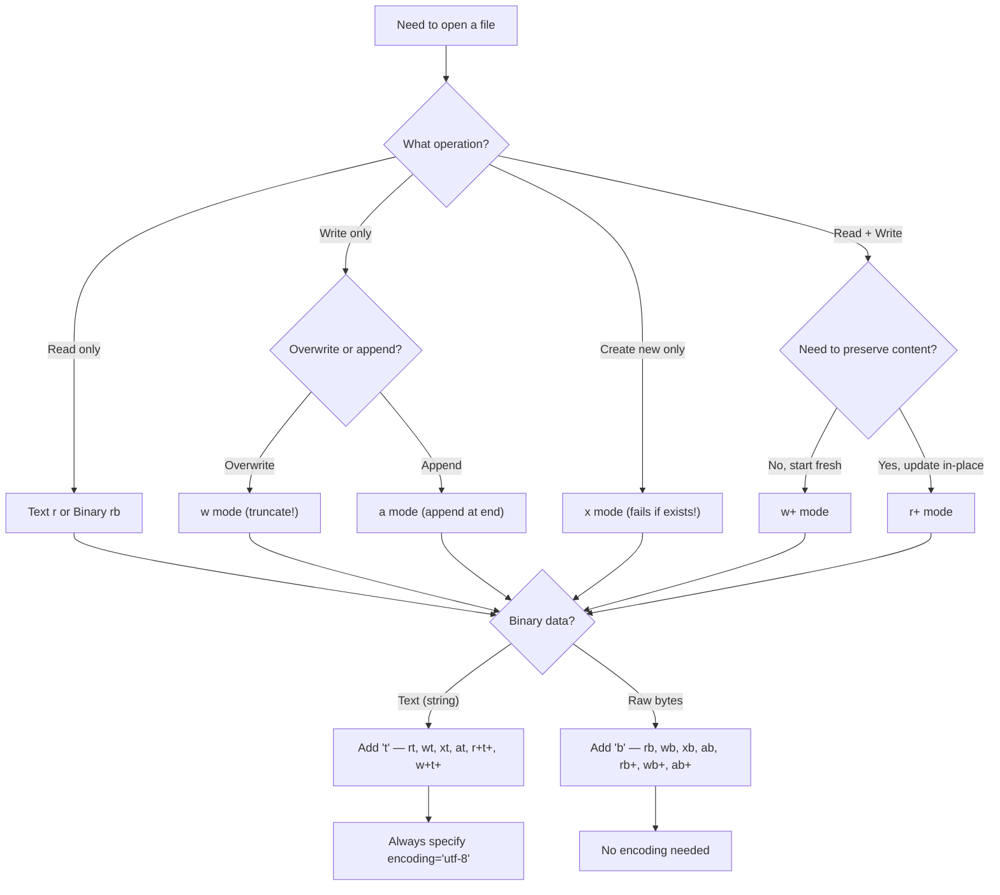

### Diagram 2 — pathlib Method Categories

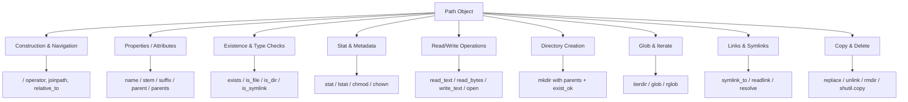

### Diagram 3 — CSV Reading Pipeline

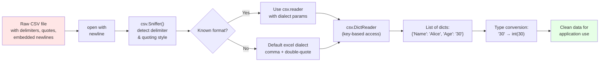

### Diagram 4 — JSON Parsing Flow

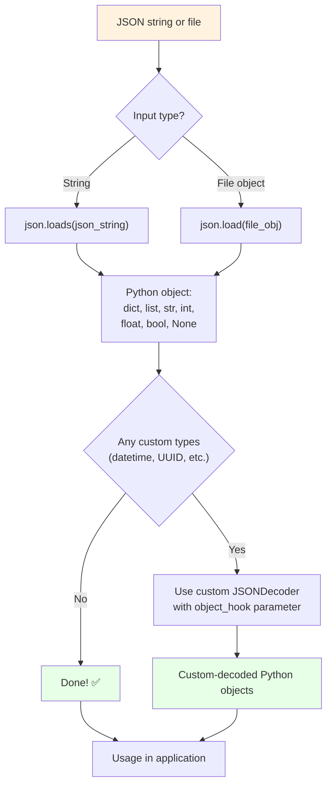

### Diagram 5 — Binary Protocol Parsing Flow

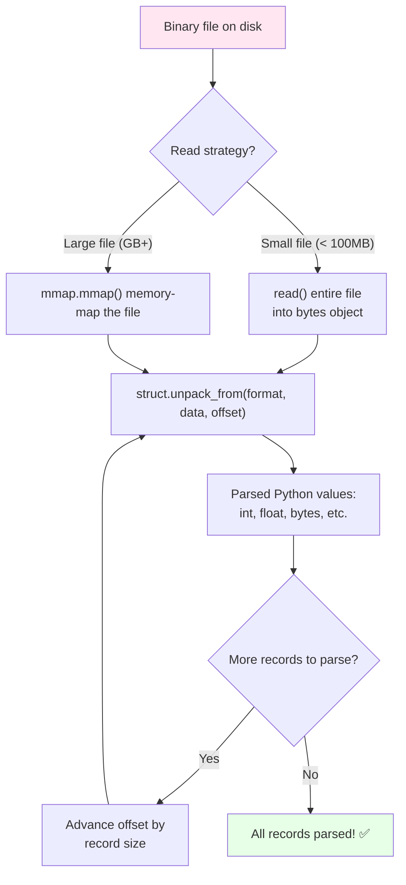

### Diagram 6 — File Descriptor Lifecycle

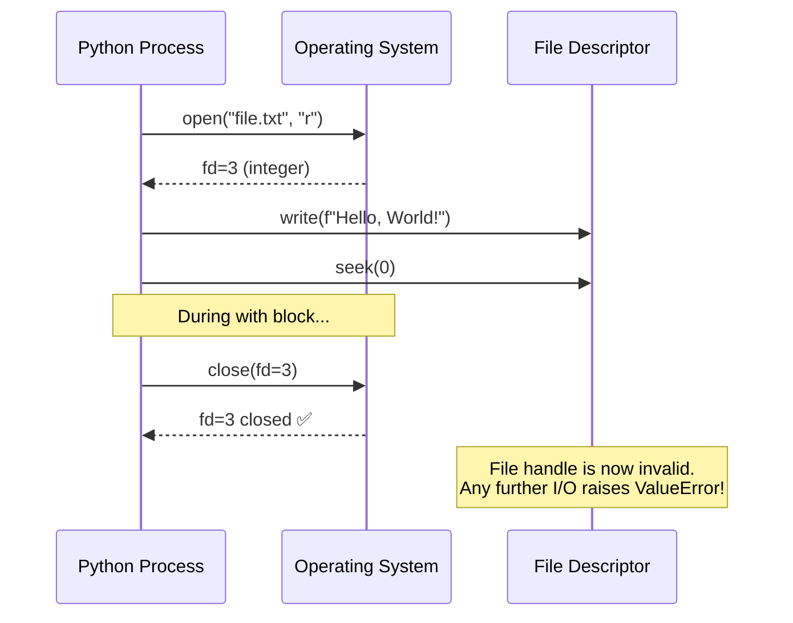

### Diagram 7 — Error Recovery Patterns Decision Tree

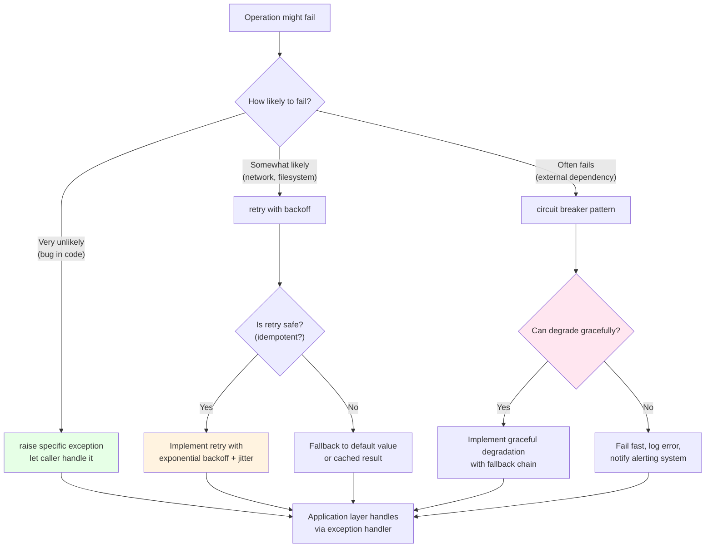

### Diagram 8 — pathlib vs os.path Decision Matrix

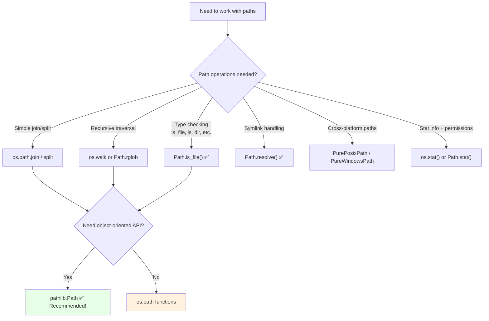

### Diagram 9 — Temporary File Lifecycle

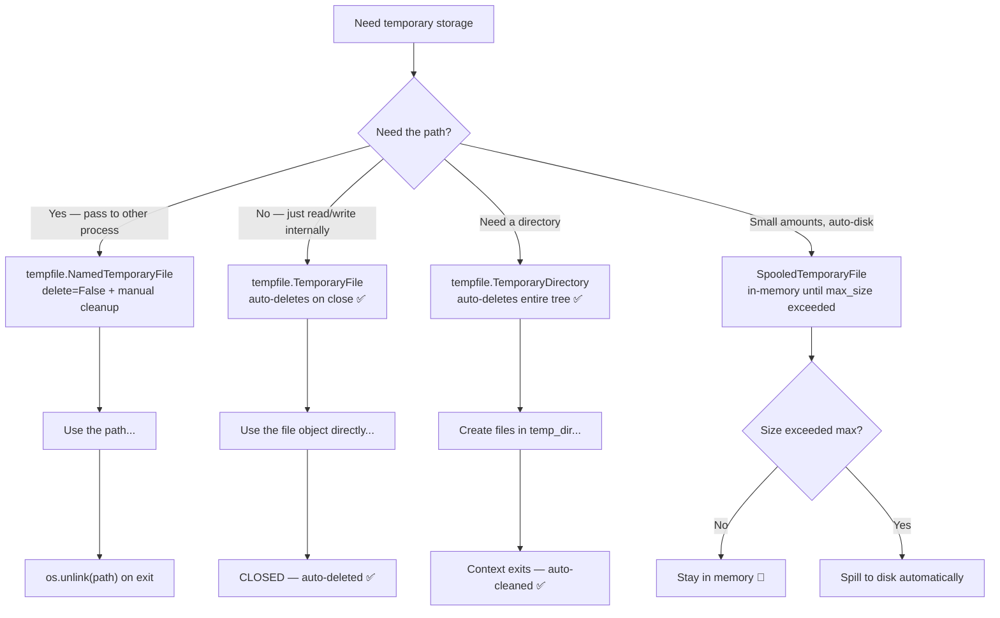

### Diagram 10 — Complete Python File I/O Architecture

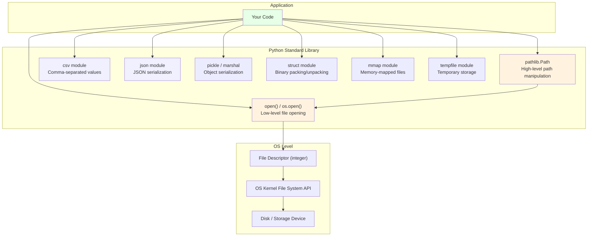

---

> **Next Steps**: 
> - See [Module 22 — Error Handling & Debugging](./22-error-handling-debugging.md) for the companion guide on exceptions, logging, and debugging.
> - See [Module 12 — Concurrency](./12-concurrency.md) for async file I/O with `aiofiles` and concurrent reading with `ThreadPoolExecutor`.
