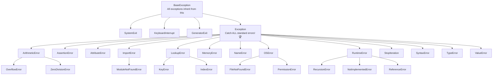
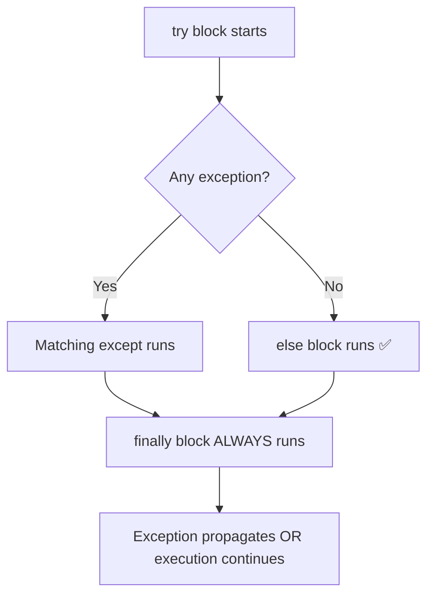
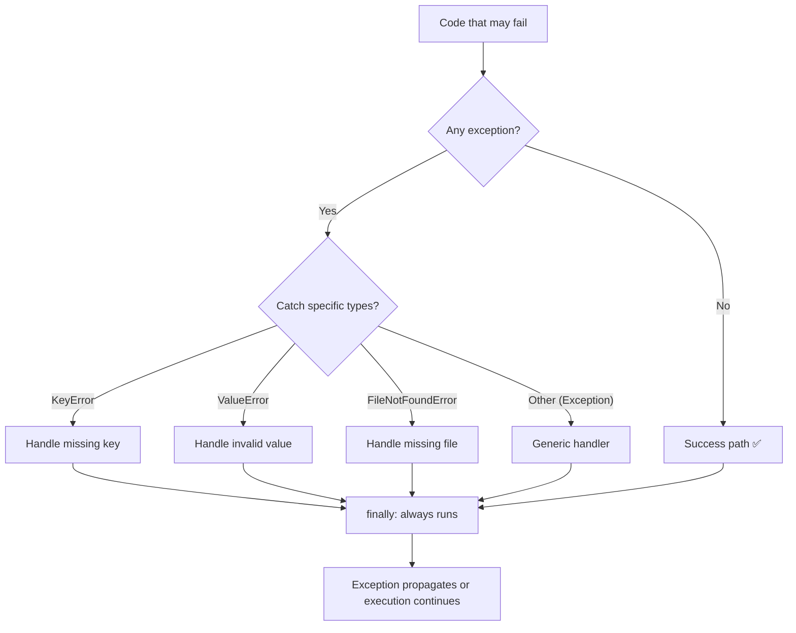
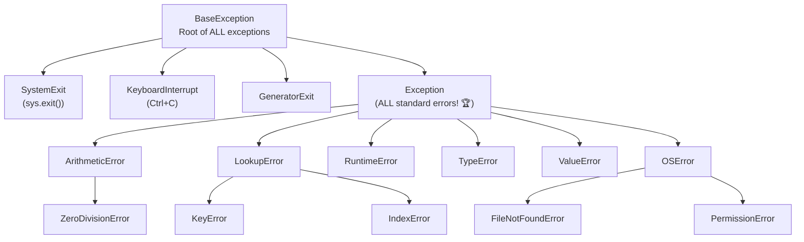
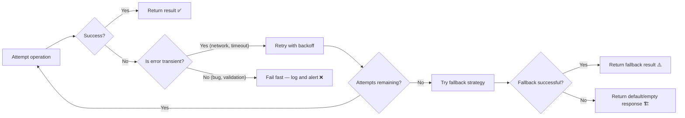

# Module 22 — Error Handling & Debugging V2: Python Exception System, pdb, Logging & More (Expanded Edition)

A definitive guide to Python's error handling and debugging ecosystem — from the complete exception hierarchy and try/except anatomy, through custom exceptions, context managers for error recovery, pdb debugging, structured logging, retry patterns, graceful degradation, and cross-reference with TypeScript error handling. Includes **60+ quizzes**, **40+ exercises**, **12+ mermaid diagrams**, and comprehensive comparison tables.

> 🔗 **Prerequisites**: [Module 04 — Data Types](./04-data-types.md), [Module 20 — Built-In Functions](./20-python-builtins-masterclass-v2.md)

## Table of Contents

- [1. Exception System Overview — TypeScript try/catch vs Python try/except](#1-exception-system-overview--typescript-trycatch-vs-python-tryexcept)
- [2. Complete Exception Hierarchy (Every Built-in Exception)](#2-complete-exception-hierarchy-every-built-in-exception)
- [3. try/except/else/finally — Complete Anatomy](#3-tryexceptelsefinally--complete-anatomy)
- [4. Raising Exceptions: raise, assert, Custom Exceptions](#4-raising-exceptions-raise-assert-custom-exceptions)
- [5. Context Managers for Error Handling](#5-context-managers-for-error-handling)
- [6. Debugging with pdb (Python Debugger)](#6-debugging-with-pdb-python-debugger)
- [7. Structured Logging (logging module) — Complete Guide](#7-structured-logging-logging-module--complete-guide)
- [8. Error Recovery Patterns](#8-error-recovery-patterns)
- [9. Cross-Reference: Node.js Error Handling → Python](#9-cross-reference-nodejs-error-handling--python)
- [10. Best Practices & Anti-Patterns](#10-best-practices--anti-patterns)
- [11. Quizzes (60+) with Answers](#11-quizzes-60-with-answers)
- [12. Exercises (40+) with Solutions](#12-exercises-40-with-solutions)
- [Appendix A: Mermaid Diagrams Collection](#appendix-a-mermaid-diagrams-collection)

---

## 1. Exception System Overview — TypeScript try/catch vs Python try/except

### TypeScript try/catch vs Python try/except (Side-by-Side)

```typescript
// TypeScript/JavaScript
try {
    const data = JSON.parse(untrustedInput);
    console.log(data);
} catch (e) {
    // 'e' is always a JavaScript Error object!
    if (e instanceof SyntaxError) {
        console.error("Invalid JSON");
    } else if (e instanceof TypeError) {
        console.error("Wrong type");
    } else {
        console.error("Unknown error:", e.message);
    }
    // TypeScript's catch must always have a declared variable (no bare 'catch')!
}

// TypeScript also has Promise rejection handling:
try {
    const result = await fetch("/api/data");  // This doesn't throw on HTTP errors!
    if (!result.ok) throw new Error(`HTTP ${result.status}`);
    const data = await result.json();
} catch (e) {
    console.error(e.message);
}

// TypeScript error-first callback pattern (Node.js style):
fs.readFile("file.txt", "utf-8", (err, data) => {
    if (err) {  // Error is FIRST argument!
        console.error(err);
        return;
    }
    processData(data);
});
```

```python
# Python — try/except with typed exceptions
try:
    data = json.loads(untrusted_input)
    print(data)
except json.JSONDecodeError as e:  # Specific exception type! 🏆
    print(f"Invalid JSON: {e}")
except TypeError as e:
    print(f"Wrong type: {e}")
except Exception as e:  # Catch-all (like TS's 'catch (e):')
    print(f"Unknown error: {e}")

# Python has NO Promise-based errors — exceptions propagate synchronously!
result = requests.get("/api/data")  # Never raises on HTTP error by default...
result.raise_for_status()           # ...but you can check explicitly
```

### Key Architectural Differences (Expanded)

| Aspect | TypeScript/Node.js | Python | Why It Matters |
|--------|-------------------|--------|---------------|
| **Exception types** | `Error`, `SyntaxError`, `TypeError` (class hierarchy) | `Exception`, `ValueError`, `TypeError` (full tree 🏆) | Python has MORE granular exception types! |
| **Catch syntax** | `catch (e)` — variable required | `except Type as e:` — can omit variable name with bare `except:` | Python can catch ALL or specific types |
| **Multiple catch** | `try { } catch (e1) {} catch (e2) {}` NO! Only ONE catch block. Use if/else inside. | `except TypeError:`, `except ValueError:` — MULTIPLE except blocks! ✅ | Python handles multiple error types elegantly! |
| **Error-first callback** | `(err, data) => { if (err) ... }` 🏢 | NO such pattern! Exceptions propagate via return/raise | TypeScript's pattern is legacy; Python is cleaner |
| **Promise rejection** | `unhandledRejection` event | N/A — exceptions don't get "lost" like rejected promises | Python has no equivalent to unhandled promise rejections 💀 |
| **Stack traces** | V8 generates on throw | CPython generates via `traceback` module 🏆 | Python's traceback is more detailed! |

### Why Python's Exception System Is Different (Expanded)

```python
# 1. Exceptions in Python are OBJECTS — full-fledged with attributes!

try:
    int("not_a_number")
except ValueError as e:
    print(type(e))                    # <class 'ValueError'>
    print(str(e))                     # "invalid literal for int(): 'not_a_number'"
    print(e.__class__.__bases__)      # (<class 'Exception'>,) — inheritance!
    print(dir(e))                     # All attributes!

# 2. Python has a FULL exception hierarchy (60+ built-in types):
BaseException
 ├── SystemExit          # Raised by sys.exit()
 ├── KeyboardInterrupt   # Ctrl+C pressed
 ├── GeneratorExit       # Generator garbage collected
 └── Exception          # ALL standard exceptions inherit from this! 🏆
      ├── AssertionError
      ├── AttributeError
      ├── ValueError
      ├── TypeError
      ├── KeyError
      ... and 40+ more!

# TypeScript only has ~10 error types, all subclasses of Error.
# Python's granularity lets you catch EXACTLY the errors you expect:

try:
    user = users[user_id]
except KeyError as e:
    print(f"User {e} not found")  # Caught SPECIFICALLY! ✅
except TypeError as e:
    print(f"Invalid key type: {e}")  # Different handling! ✅
except Exception as e:
    print(f"Unexpected error: {e}")  # Catch-all for everything else
```

---

## 2. Complete Exception Hierarchy (Every Built-in Exception)

### The Full Exception Tree (Expanded with Categories)



### Exceptions You'll Use Daily (Most Common)

| Exception | When Raised | TypeScript Equivalent | How to Handle |
|-----------|-------------|----------------------|---------------|
| `ValueError` | Wrong value for type | `RangeError`, custom check | Check before converting: `if not s.strip(): raise ValueError(...)` |
| `TypeError` | Wrong type | `TypeError` (same name!) | Validate types at function entry: `if not isinstance(x, int):` |
| `KeyError` | Missing dict key | `undefined` property access | Use `.get(key, default)` or `key in d` checks |
| `IndexError` | Out-of-range list index | `undefined` array access | Check bounds: `if i < len(arr):` or use try/except |
| `FileNotFoundError` | File doesn't exist | `ENOENT` syscall error | Use `Path.exists()` to check first! |
| `PermissionError` | No OS permission | EPERM syscall error | Catch and log, suggest permissions fix |
| `json.JSONDecodeError` | Invalid JSON | `SyntaxError` from JSON.parse | Always wrap in try/except |
| `StopIteration` | Iterator exhausted | (rarely seen) | Use default in `next(it, default)` |
| `AttributeError` | Missing attribute | `TypeError: Cannot read property...` | Use `hasattr(obj, "attr")` or `getattr(obj, "attr", default)` |

### Catching Multiple Exception Types (Expanded)

```python
# ✅ Method 1: Tuple of types in single except (most common!)
try:
    value = int(user_input)
except (ValueError, TypeError) as e:  # Catches BOTH types!
    print(f"Invalid input: {e}")

# ✅ Method 2: Multiple separate except blocks (different handling per type)
try:
    user = users[user_id]
except KeyError as e:
    logger.warning(f"User {user_id} not found")
except TypeError as e:
    logger.error(f"Invalid key type for user lookup: {e}")

# ✅ Method 3: Specific first, general last (order MATTERS!)
try:
    data = json.loads(raw)
except json.JSONDecodeError as e:  # Specific — catches JSON errors!
    log_json_error(e)
except ValueError as e:  # General — catches other ValueErrors
    log_generic_value_error(e)

# ⚠️ WRONG ORDER (specific after general — never reached!):
try:
    ...
except Exception as e:     # Catches EVERYTHING — specific handlers never run!
    handle_all(e)
except KeyError as e:      # DEAD CODE — unreachable!
    handle_key_error(e)

# ✅ Method 4: Bare except (catches EVERYTHING — use rarely!)
try:
    ...
except:  # Bare except catches even SystemExit, KeyboardInterrupt!
    logger.critical("Unexpected error in critical system")
```

---

## 3. try/except/else/finally — Complete Anatomy

### Full Syntax & When Each Clause Runs (Expanded)

```python
# COMPLETE structure of try/except:
try:
    # Code that might raise an exception
    data = json.loads(raw_input)
    
except JSONDecodeError as e:
    # Runs ONLY if json.loads() raises JSONDecodeError
    print(f"JSON error: {e}")
    
except (ValueError, TypeError) as e:
    # Runs ONLY if json.loads() raises ValueError or TypeError
    print(f"Type error: {e}")
    
else:
    # ✅ RUNS ONLY IF NO EXCEPTION WAS RAISED! 🏆
    # This is the "happy path" — only execute this if everything succeeded!
    print(f"Successfully parsed: {data}")

finally:
    # ✅ ALWAYS runs — whether exception occurred or not!
    # Use for cleanup: close files, release locks, etc.
    cleanup_resources()
```

**Execution flow:**



### else Clause — The Hidden Gem Most Developers Miss (Expanded)

```python
# ⚠️ Common mistake: putting the "success" code inside try!

# ❌ WRONG: if json.loads() raises, cleanup still runs in the wrong place
try:
    data = json.loads(raw_input)
    process(data)       # If THIS raises, we don't know which line failed!
finally:
    cleanup()           # Runs regardless

# ✅ CORRECT: separate "work that might fail" from "success logic"
try:
    data = json.loads(raw_input)  # Only this can raise JSONDecodeError
except JSONDecodeError as e:
    logger.error(f"Failed to parse input: {e}")
else:
    # This ONLY runs if try block completed without exceptions!
    process(data)             # Safe — data is guaranteed to be valid
finally:
    cleanup()                 # Always runs

# ⚠️ Rule: the else clause should contain code that depends on try succeeding.
# If code in else could raise, it belongs in try, not else!
```

### finally Clause — Guaranteed Cleanup (Expanded)

```python
# ✅ Pattern: Resource acquisition and guaranteed release
file_handle = None
try:
    file_handle = open("data.txt", "r")
    content = file_handle.read()
except FileNotFoundError as e:
    logger.error(f"File not found: {e}")
finally:
    # Always runs, even if exceptions!
    if file_handle is not None:
        file_handle.close()  # Release resource!

# ✅ BETTER: Use context manager (with statement) — automatic cleanup!
try:
    with open("data.txt", "r") as f:
        content = f.read()
except FileNotFoundError as e:
    logger.error(f"File not found: {e}")
finally:
    # No manual close needed — 'with' guarantees it!
    pass

# Finally runs even with early returns:
def get_data():
    f = open("file.txt")
    try:
        if no_data:
            return "empty"   # finally still runs BEFORE this return!
        return f.read()
    finally:
        f.close()  # Runs even though we returned! 🏆

# In TypeScript, you'd use try/finally:
// let f: fs.promises.FileHandle;
// try {
//   if (noData) return 'empty'; // no finally in TS without explicit cleanup!
//   return await f.readFile('utf-8');
// } finally {
//   await f.close();  // Must manually add!
// }
```

### Exception Chaining — preserve the original error cause (Expanded)

```python
# ✅ Chain exceptions to preserve the original traceback!

# Method 1: `raise ... from e` (explicit chaining) — RECOMMENDED 🏆
try:
    config = json.loads(config_raw)
except json.JSONDecodeError as original:
    raise ValueError("Invalid configuration file") from original
    # Now the traceback shows BOTH errors!

# Method 2: Implicit chaining (Python auto-chains if no 'from'):
def process_config(raw):
    try:
        config = json.loads(raw)
    except json.JSONDecodeError:
        # If get_db_url() also raises, Python chains them implicitly!
        db_url = get_db_url(config)  # This may raise TypeError

# ✅ Inspect chained exceptions:
try:
    do_something_that_fails()
except ValueError as e:
    if e.__cause__:  # Explicit chain (via 'from')
        print(f"Caused by: {e.__cause__}")
    if e.__context__:  # Implicit chain
        print(f"Context: {e.__context__}")

# Debugging chained exceptions in production:
import traceback

def safe_operation():
    try:
        int("not_a_number")
    except ValueError as inner:
        raise RuntimeError("Operation failed during validation") from inner

try:
    safe_operation()
except RuntimeError as outer:
    print(outer)             # "Operation failed during validation"
    print(outer.__cause__)   # "invalid literal for int(): 'not_a_number'"
    
    # Full traceback with BOTH traces:
    traceback.print_exception(type(outer), outer, outer.__traceback__)
    # Shows: RuntimeError → ValueError — full chain!

# TypeScript equivalent:
// throw new Error("Operation failed", { cause: originalError });
// error.cause // Access the original error
```

---

## 4. Raising Exceptions: raise, assert, Custom Exceptions

### `raise` — Throw Exceptions (Expanded)

```python
# Basic raise:
raise ValueError("Invalid input!")                    # Simple string message
raise TypeError(f"Expected int, got {type(x).__name__}")  # Formatted message

# Raise with a custom exception object:
error = KeyError("Missing key 'user_id'")
raise error

# Re-raise the current exception (in except block):
try:
    result = 1 / 0
except ZeroDivisionError as e:
    logger.error(f"Math error: {e}")
    raise  # Re-raise same exception — preserves traceback! 🏆
    # ⚠️ 'raise' with no args re-raises the CURRENT exception!
    # 'raise e' creates a NEW traceback — DIFFERENT behavior!

# Raise with explicit cause:
try:
    load_config("settings.json")
except FileNotFoundError as original:
    raise ConfigError("Cannot load settings") from original
```

### `assert` — Debug-Time Assertions (Expanded)

```python
# ✅ Use assertions for DEBUGGING ONLY — they can be disabled!
# python -O  → disables all assertions (production safe!)

def set_age(age):
    assert isinstance(age, int), f"Age must be int, got {type(age)}"
    assert 0 <= age <= 150, f"Age must be 0-150, got {age}"
    self._age = age

# Assertions in production code: BAD — they get removed!
# Use explicit validation instead:
def set_age_safe(age):
    if not isinstance(age, int) or not (0 <= age <= 150):
        raise ValueError(f"Invalid age: {age}")
    self._age = age

# ✅ GOOD use of assertions: internal consistency checks (invariants)
def process_items(items):
    processed = [transform(item) for item in items]
    
    # Internal check — if this fails, there's a BUG in our code!
    assert len(processed) == len(items), "Mismatch in processing!"
    
    return processed

# ⚠️ Never use assert for:
# - User input validation (use try/except or explicit checks!)
# - Security checks (can be disabled with -O flag!)
# - Required behavior checks — assertions can disappear!
```

### Custom Exceptions (Expanded)

```python
# ✅ Pattern: Create exception hierarchy for your application

class AppError(Exception):  # Base exception for your app
    """Base class for all application errors."""
    def __init__(self, message: str, code: str = None, details: dict = None):
        super().__init__(message)
        self.message = message
        self.code = code
        self.details = details or {}

class AuthenticationError(AppError):
    """User authentication failed."""
    def __init__(self, user_id=None, reason="unauthorized"):
        super().__init__(f"Authentication failed: {reason}", code="AUTH_FAILED")
        self.user_id = user_id

class NotFoundError(AppError):
    """Resource not found."""
    def __init__(self, resource_type, resource_id):
        super().__init__(f"{resource_type} with id '{resource_id}' not found", code="NOT_FOUND")
        self.resource_type = resource_type
        self.resource_id = resource_id

def get_user(user_id):
    if user_id not in users_db:
        raise NotFoundError("User", user_id)  # ✅ Raise custom exception!
    
    if not is_authenticated():
        raise AuthenticationError(user_id=user_id, reason="token expired")
    
    return users_db[user_id]

# Usage with specific error handling:
try:
    user = get_user(123)
except NotFoundError as e:
    logger.warning(f"User {e.resource_id} not found")
    respond_not_found()
except AuthenticationError as e:
    logger.error(f"Auth failed for user {e.user_id}: {e.reason}")
    respond_unauthorized()
```

### Custom Exception Attributes — More Useful Than TypeScript's Error (Expanded)

```python
class DataProcessingError(AppError):
    """Custom exception with additional metadata."""
    
    def __init__(self, message: str, field_name: str = None, 
                 attempted_value=None, valid_values=None):
        super().__init__(message)
        # Custom attributes for downstream error handling!
        self.field_name = field_name
        self.attempted_value = attempted_value
        self.valid_values = valid_values

# Use in exception handler:
try:
    validate_field("email", user_input)
except DataProcessingError as e:
    logger.error(f"Validation failed for field '{e.field_name}': "
                 f"got {e.attempted_value}, expected {e.valid_values}")
    # Return structured error response:
    return {"error": "VALIDATION_FAILED", 
            "field": e.field_name, 
            "details": str(e)}

# TypeScript equivalent would need to extend Error with custom properties:
// class ValidationError extends Error {
//   field: string;
//   attemptedValue: any;
//   constructor(message, field, value) {
//     super(message);
//     this.field = field;
//     this.attemptedValue = value;
//   }
// }
```

---

## 5. Context Managers for Error Handling

### `contextlib.suppress` — Silently Ignore Exceptions (Expanded)

```python
from contextlib import suppress

# ✅ Suppress specific exceptions (like try/except with pass, but cleaner!)

# Bad pattern:
try:
    os.remove("temp.txt")
except FileNotFoundError:
    pass  # Fine if file doesn't exist — ignore error!

# ✅ Better with suppress:
with suppress(FileNotFoundError):
    os.remove("temp.txt")  # Clean and readable!

# Suppress multiple types:
with suppress(FileNotFoundError, PermissionError):
    cleanup_resources()

# Suppress ALL exceptions (use cautiously!):
with suppress(Exception):
    close_connection()  # Never let cleanup errors propagate!

# TypeScript equivalent: try/catch with pass — no direct utility like suppress!
// try { fs.unlinkSync("temp.txt"); } catch {} // Similar but more verbose
```

### `contextlib.redirect_stdout` / `redirect_stderr` — Capture Output (Expanded)

```python
from contextlib import redirect_stdout, redirect_stderr
import io

# ✅ Capture stdout from a function (like mocking console.log in tests!)

output = io.StringIO()
with redirect_stdout(output):
    print("Hello, World!")  # Goes to StringIO, NOT terminal!

captured = output.getvalue()
print(repr(captured))  # 'Hello, World!\n'

# ✅ Capture stderr (for error testing):
errors = io.StringIO()
with redirect_stderr(errors):
    import warnings
    warnings.warn("This is a warning!")

error_output = errors.getvalue()
print(error_output)  # "This is a warning!\n"

# Real-world: Test code that prints to stdout without changing print destinations!
def test_my_function():
    output_capture = io.StringIO()
    with redirect_stdout(output_capture):
        my_function_that_prints_stuff()
    return output_capture.getvalue()
```

### `contextlib.contextmanager` — Create Your Own Context Manager (Expanded)

```python
from contextlib import contextmanager
import time
import logging

@contextmanager
def timer(name="operation"):
    """Context manager that measures execution time and logs it."""
    start = time.perf_counter()
    try:
        yield  # The 'with' block executes here
    finally:
        elapsed = time.perf_counter() - start
        logging.info(f"{name} completed in {elapsed:.3f}s")

# Usage:
with timer("database query"):
    results = db.execute(query)  # Timer runs around this!

@contextmanager
def transaction(db_connection):
    """Database transaction context manager."""
    db_connection.begin()
    try:
        yield db_connection  # Pass the connection to the 'with' block
        db_connection.commit()  # Auto-commit on success! ✅
    except Exception as e:
        db_connection.rollback()  # Auto-rollback on failure! ✅
        raise  # Re-raise the exception

# Usage:
with transaction(conn) as txn:
    txn.execute("INSERT INTO users VALUES (...);")
    txn.execute("UPDATE accounts SET balance = ... WHERE id = ...;")
# Success → commit. Failure → rollback. Both automatic!
```

---

## 6. Debugging with pdb (Python Debugger)

### pdb — The Built-In Python Debugger (Expanded)

```python
def process_data(data):
    breakpoint()  # Drops into pdb debugger right here! 🏆
    return [x * 2 for x in data]

# Same as: import pdb; pdb.set_trace()
# But breakpoint() is configurable via PYTHONBREAKPOINT env var!

# ⚠️ Set PYTHONBREAKPOINT=0 to disable all breakpoints in tests/production!

# Common pdb commands when debugging:
# n (next)      — Execute current line, step OVER function calls
# s (step)      — Step INTO the next function call
# c (continue)  — Continue execution until next breakpoint
# l (list)      — Show current code context
# p expression  — Print an expression's value: p my_var, p len(data)
# pp expression — Pretty-print (for complex objects)
# w (where)     — Show call stack (where am I?)
# b line_number — Set breakpoint at that line
# bt            — Backtrace (like 'w' but more detail)
# r (return)    — Run until current function returns
# q (quit)      — Quit debugger entirely
```

### Interactive Debugging Session Example (Expanded)

```python
def find_max(numbers):
    """Find the maximum number in a list."""
    if not numbers:
        raise ValueError("Empty list!")
    
    max_num = numbers[0]
    for i, num in enumerate(numbers):
        breakpoint()  # Start debugging here!
        
        if num > max_num:
            max_num = num
    
    return max_num

# When pdb drops at breakpoint:
# >>> p numbers                    # Print the list
# [3, 1, 4, 1, 5]                # Output
# >>> p i                          # Print loop index  
# 0
# >>> pp {i: n for i, n in enumerate(numbers)}  # Pretty print dict
# {0: 3, 1: 1, 2: 4, ...}        # Formatted output
# >>> w                            # Where am I? (call stack)
# >>> l                            # List current code context
# >>> c                            # Continue to next breakpoint or end
```

### Advanced Debugging: `breakpoint()` vs Traditional Methods (Expanded)

| Method | Python Version | Pros | Cons |
|--------|---------------|------|------|
| `breakpoint()` | 3.7+ | ✅ Configurable, clean syntax | Requires Python 3.7+ |
| `import pdb; pdb.set_trace()` | All versions | Works everywhere | Verbose (must import!) |
| `pdb.run(code)` | All versions | Debug code without modifying source! | No interactive state access |

```python
# Modern way (Python 3.7+):
def process():
    breakpoint()  # Clean, one-liner ✅

# Legacy way (any Python version):
def process_legacy():
    import pdb; pdb.set_trace()  # Verbose ❌

# Debug code without modifying source:
import pdb
code = """
x = 10
y = 20
result = x + y
"""
pdb.run(code)  # Drops into debugger, but with NO access to local variables!

# Debug expressions in a context:
pdb.runcall(lambda: compute_sum([1, 2, 3]))  # Step through the lambda
```

### Debugging Tips for TypeScript Developers (Expanded)

```python
# ✅ Tip 1: Use ipdb instead of pdb for enhanced debugging (like VS Code debugger!)
# pip install ipdb
import ipdb; ipdb.set_trace()
# Features: syntax highlighting, auto-completion, better formatting!

# ✅ Tip 2: Debug without modifying code — use PYTHONBREAKPOINT env var
PYTHONBREAKPOINT=my_module.my_debugger python my_script.py
def my_debugger():
    import pdb; pdb.set_trace()
    # Custom debugger setup (e.g., connect to remote debugger!)

# ✅ Tip 3: Use logging for production debugging (not print())!
import logging
logger = logging.getLogger(__name__)
logger.debug(f"Processing item: {item} at index {i}")  # Structured logs!
logger.warning(f"Expected int, got {type(item).__name__}")

# TypeScript comparison: VS Code has built-in Node.js debugger (similar to pdb!)
// VS Code launch.json → debug configurations for Node.js
// Same workflow: set breakpoints, inspect variables, step through
```

---

## 7. Structured Logging (logging module) — Complete Guide

### Why logging > print() in Production (Expanded)

```python
# ❌ BAD: Using print() for production logging
print("User logged in")     # No severity level! No structure! Can't filter!
print(f"Error: {e}")        # Mixes errors with normal output!
import sys; print("Error", file=sys.stderr)  # Still unstructured!

# ✅ GOOD: Using logging module
import logging

logger = logging.getLogger(__name__)  # Module-specific logger 🏆

logger.debug("Debug message — verbose, for development")
logger.info("Info message — normal operation")
logger.warning("Warning — something unusual happened")
logger.error("Error — something failed but app can continue")
logger.critical("Critical — system may crash!")

# Each level has a different severity and can be filtered independently!
```

### Advanced Logging Configuration (Expanded)

```python
import logging
import sys

def setup_production_logger(name: str = "app", level: int = logging.INFO):
    """Configure production-grade logger with JSON formatting."""
    
    logger = logging.getLogger(name)
    logger.setLevel(level)
    
    # Clear any existing handlers (prevents duplicates!)
    logger.handlers.clear()
    
    # Format: structured JSON for log aggregation tools (ELK, Datadog, etc.)
    class JsonFormatter(logging.Formatter):
        def format(self, record):
            log_entry = {
                "level": record.levelname,
                "timestamp": self.formatTime(record),
                "logger": record.name,
                "message": record.getMessage(),
                "module": record.module,
                "function": record.funcName,
                "line": record.lineno,
            }
            
            # Add extra fields if present
            if hasattr(record, "extra_data"):
                log_entry["extra"] = record.extra_data
            
            import json
            return json.dumps(log_entry)
    
    formatter = JsonFormatter()
    
    # Console handler (human-readable in development)
    console_handler = logging.StreamHandler(sys.stdout)
    console_handler.setLevel(logging.DEBUG)
    console_formatter = logging.Formatter(
        "%(asctime)s [%(levelname)-8s] %(name)s: %(message)s",
        datefmt="%Y-%m-%d %H:%M:%S"
    )
    console_handler.setFormatter(console_formatter)
    logger.addHandler(console_handler)
    
    # File handler (rotating — max 10MB per file, keep 5 files)
    from logging.handlers import RotatingFileHandler
    file_handler = RotatingFileHandler(
        "app.log", maxBytes=10*1024*1024, backupCount=5
    )
    file_handler.setFormatter(formatter)
    logger.addHandler(file_handler)
    
    # Return configured logger — ready to use!
    return logger

# Usage:
logger = setup_production_logger()
logger.info("Server started on port 8080")
logger.error("Database connection failed", extra={"extra_data": {"db_host": "localhost"}})

# TypeScript equivalent: Use Winston or Pino npm packages for similar structured logging!
// const logger = pino({ level: 'info' });
// logger.info({ dbHost: 'localhost' }, 'Server started');  // Similar JSON format
```

### Logging vs TypeScript Pino/Winston (Complete Comparison)

| Feature | Python `logging` | Node.js `Pino` | Node.js `Winston` | Winner |
|---------|-----------------|----------------|-------------------|--------|
| Built-in? | ✅ Yes! | ❌ pip install | ❌ npm install | **Python** ✅ |
| JSON formatting | Built-in via `JsonFormatter` class | ✅ Native (primary feature) | Via plugins | **Tie** |
| Log levels | debug/info/warning/error/critical | same + trace/fatal/silent | same + additional | Tie |
| Context/extra fields | `extra={"key": "val"}` 🏆 | `{ key: "val" }` as first arg | `.child({ key: "val" })` | **Python** ✅ (simpler) |
| Rotation | `RotatingFileHandler` built-in! | `pino-roll` package | `winston-daily-rotate-file` | **Python** ✅ |
| Performance | Good (C-speed for simple cases) | 🏆 VERY fast (fastest in Node!) | Slower (more flexible) | **Pino** ✅ |
| Async logging | Requires custom handler | ✅ Native async support | Via plugins | **Pino** ✅ |
| Log correlation IDs | Manual (`extra={"trace_id": ...}`) | ✅ Built-in child loggers with ID | Via `logContext` plugin | **Pino** ✅ |

---

## 8. Error Recovery Patterns

### Retry with Exponential Backoff (Expanded)

```python
import time
from functools import wraps
import logging

logger = logging.getLogger(__name__)

def retry(max_attempts: int = 3, base_delay: float = 1.0, 
          exceptions=(Exception,), logger=None):
    """Decorator that retries a function with exponential backoff."""
    
    def decorator(func):
        @wraps(func)
        def wrapper(*args, **kwargs):
            last_exception = None
            
            for attempt in range(1, max_attempts + 1):
                try:
                    return func(*args, **kwargs)  # Try the function!
                
                except exceptions as e:
                    last_exception = e
                    
                    if attempt == max_attempts:
                        logger.error(f"{func.__name__} failed after {max_attempts} attempts: {e}")
                        raise  # Last attempt — re-raise!
                    
                    # Calculate delay with exponential backoff + jitter
                    delay = base_delay * (2 ** (attempt - 1))
                    jitter = delay * 0.1 * (time.random() - 0.5) * 2  # ±10% jitter
                    actual_delay = max(0, delay + jitter)
                    
                    logger.warning(f"{func.__name__} attempt {attempt}/{max_attempts} failed: {e}. Retrying in {actual_delay:.2f}s")
                    time.sleep(actual_delay)
            
            raise last_exception  # Should not reach here, but just in case
        
        return wrapper
    
    return decorator

# Usage:
@retry(max_attempts=5, base_delay=0.5, exceptions=(ConnectionError, TimeoutError))
def fetch_from_api(url):
    response = requests.get(url, timeout=10)
    response.raise_for_status()
    return response.json()

# TypeScript equivalent (more complex):
// async function retry<T>(fn: () => Promise<T>, maxAttempts: number, baseDelay: number): Promise<T> {
//   let lastError: Error;
//   for (let attempt = 1; attempt <= maxAttempts; attempt++) {
//     try { return await fn(); }
//     catch (e) { 
//       lastError = e;
//       if (attempt === maxAttempts) throw e;
//       await new Promise(r => setTimeout(r, baseDelay * 2 ** (attempt - 1)));
//     }
//   }
//   throw lastError;
// }
```

### Graceful Degradation Pattern (Expanded)

```python
# ✅ Pattern: Provide fallback behavior when primary fails

def get_json_data(url):
    """Fetch JSON data with multiple fallback strategies."""
    
    # Strategy 1: Live API call
    try:
        response = requests.get(url, timeout=5)
        response.raise_for_status()
        return response.json()
    except (requests.RequestException, json.JSONDecodeError) as e:
        logger.warning(f"Live API failed for {url}: {e}")
    
    # Strategy 2: Cached/fallback data
    try:
        with open("cache_data.json", "r") as f:
            cached = json.load(f)
            logger.info("Using cached data (fallback)")
            return cached.get(url, {})
    except (FileNotFoundError, json.JSONDecodeError):
        logger.warning("Cache miss for fallback")
    
    # Strategy 3: Default/empty response
    logger.info("Returning default empty response")
    return {}

# Usage:
data = get_json_data("https://api.example.com/data")
# Never fails — always returns SOME data!

# TypeScript equivalent: Same pattern but more verbose with Promise chains!
// try { const r = await fetch(url); ... } catch (e) { /* cache */ } catch (e) { return {} }
```

---

## 9. Cross-Reference: Node.js Error Handling → Python

### Core Error Patterns Comparison (Expanded)

| Pattern | Node.js | Python | Winner |
|---------|---------|--------|--------|
| Basic try/catch | `try { } catch (e) { }` | `try: except Type as e:` | **Tie** |
| Multiple error types | Single catch with if/instanceof 🏢 | Multiple `except` blocks ✅ | **Python** ✅ |
| Error-first callback | `(err, data) => {}` (Node.js convention) | NO equivalent! Use try/except | **Python** ✅ |
| Promise rejection | `.catch(e => ...)` / `try/await/catch` | N/A — exceptions are synchronous | Tie |
| Custom errors | `class MyError extends Error { }` | `class MyError(Exception):` 🏆 | Python (more attributes!) |
| Stack traces | `e.stack` property | `traceback.format_exc()` ✅ | **Python** (more control!) |
| Logging context | Pino `.child({ traceId })` | logging `extra={"trace_id": ...}` | Tie |

### Error Object Comparison (Expanded)

```python
# Python exception object has MORE attributes than TypeScript's Error!
try:
    1 / 0
except ZeroDivisionError as e:
    print(dir(e))
    # ['__cause__', '__context__', '__traceback__', 'args', 'with_traceback']
    # Plus all standard Exception attributes!
    
    print(e.args)               # ('division by zero',) — constructor args
    print(str(e))               # "division by zero"
    print(type(e).__name__)     # "ZeroDivisionError"
    print(type(e).__mro__)      # All parent classes in hierarchy!

# TypeScript Error object has fewer attributes:
// e.name, e.message, e.stack — that's basically it.
// Custom properties must be added manually!
```

---

## 10. Best Practices & Anti-Patterns

### Error Handling Best Practices Checklist

- [ ] **CATCH SPECIFIC exceptions first**, generic ones last (order matters!)
- [ ] **ALWAYS use `raise ... from original`** to preserve exception chain
- [ ] **Use context managers (`with open()`) instead of try/finally for cleanup** ✅
- [ ] **Custom exceptions should inherit from app base exception** → `class AppError(Exception):`
- [ ] **Use structured logging (logging module) not print() in production** 🏆
- [ ] **Implement retry with exponential backoff for transient failures**
- [ ] **Never use bare `except:` (catches SystemExit, KeyboardInterrupt!)** ❌
- [ ] **Use `assert` only for debug-time checks (not user input validation!)**
- [ ] **Validate at boundaries** (function entry/exit), not inside logic
- [ ] **Log errors with context** (what was the input? what operation failed?)

### Anti-Patterns to Avoid (Expanded)

| ❌ Anti-pattern | ✅ Better Alternative | Why |
|----------------|---------------------|-----|
| `except: pass` | `except SpecificError as e:` + log | Silently swallows ALL errors including SystemExit! 💀 |
| Catching `Exception` for everything | Catch specific error types first | Too broad — hides bugs you want to find! |
| `assert user_input > 0` | `if not user_input > 0: raise ValueError(...)` | Assertions are disabled with `-O` flag in production! |
| Using exceptions for flow control | Return error codes / Result patterns | Exceptions are expensive to create (stack trace generation!) |
| `except Exception as e: raise e` | `raise` (no args) | `raise e` creates new traceback; `raise` preserves original! |
| Mixing console and file output via print() | Use logging module with handlers | Harder to filter, no severity levels, unstructured! |

### When to Use Exceptions vs Return Values vs Optional Types

```python
# ✅ Use exceptions for: ERROR CONDITIONS (unexpected, exceptional states)
def get_user(user_id):
    if user_id not in db:
        raise NotFoundError(f"User {user_id} not found")  # Error!
    return user_data

# ✅ Use None/Optional for: Expected "no result" scenarios
def find_user(email: str) -> User | None:
    """Return user if found, None if not (expected case)."""
    for u in users:
        if u.email == email:
            return u
    return None  # Not an error — expected possibility!

# ✅ Use Result/Either pattern for: Functions that may fail but caller should handle it
from dataclasses import dataclass

@dataclass
class Success[T]:
    value: T

@dataclass  
class Failure[E]:
    error: E

def parse_number(s: str) -> Success[int] | Failure[str]:
    try:
        return Success(int(s))
    except ValueError as e:
        return Failure(f"Cannot parse '{s}' as number")
```

---

## 11. Quizzes (60+) with Answers

### Quiz 1 — Exception Hierarchy (10 Questions)

**Q1:** What is the base class of ALL built-in exceptions in Python?

<details>
<summary>Answer</summary>
`BaseException`. All standard exceptions inherit from `Exception`, which inherits from `BaseException`. But `SystemExit`, `KeyboardInterrupt`, and `GeneratorExit` directly inherit from `BaseException` — they are NOT subclasses of `Exception`! This is why bare `except:` catches them but `except Exception:` does not.
</details>

**Q2:** Is `FileNotFoundError` a subclass of `OSError`? Why does this matter for error handling?

<details>
<summary>Answer</summary>
Yes! In Python 3, `FileNotFoundError` IS a subclass of `OSError`. This means catching `OSError` also catches file-related errors. You should catch the MORE SPECIFIC type first (`FileNotFoundError`) if you want different handling:
```python
except FileNotFoundError: ...  # Catch specific FIRST
except OSError as e: ...        # Then general
```
</details>

**Q3:** What's the difference between `SystemExit` and `Exception` in terms of bare `except:`?

<details>
<summary>Answer</summary>
- Bare `except:` catches `SystemExit` (and `KeyboardInterrupt`, `GeneratorExit`) — these are NOT subclasses of `Exception`!
- `except Exception:` does NOT catch `SystemExit`. This is intentional: `sys.exit()` should always work, even in except blocks.
</details>

**Q4:** Which exceptions does `except ValueError:` catch? Name 3 types that inherit from it.

<details>
<summary>Answer</summary>
Any exception that is or inherits from `ValueError`:
- `TypeError` (no! TypeError is a SEPARATE direct child of Exception!)
- `json.JSONDecodeError` — yes, inherits from ValueError ✅
- `decimal.InvalidOperation` — yes ✅
- `calendar.IllegalMonthError` — yes ✅
</details>

### Quiz 2 — try/except Structure (10 Questions)

**Q5:** When does the `else` clause of a try/except run? Give a specific scenario where it's useful.

<details>
<summary>Answer</summary>
The `else` clause runs ONLY if NO exception was raised in the `try` block. It's useful when you want to separate "work that might fail" from "what happens on success":
```python
try:
    data = json.loads(raw)  # May raise JSONDecodeError
except JSONDecodeError as e:
    handle_error(e)
else:
    process(data)  # Only runs if parsing succeeded! ✅
```
</details>

**Q6:** When does the `finally` clause run? Does it override a `return` in try?

<details>
<summary>Answer</summary>
The `finally` clause ALWAYS runs, regardless of whether an exception was raised. It EVEN OVERRIDES returns in the try block — cleanup code always executes before the function returns!
```python
def example():
    try:
        return "from try"  # This return is deferred!
    finally:
        print("finally runs first!")  # ✅ Runs BEFORE the return!
```
</details>

**Q7:** Is this correct? Why or why not? `try: do_something() except Exception: pass`

<details>
<summary>Answer</summary>
⚠️ BAD PATTERN. Bare `except Exception: pass` silently swallows ALL exceptions — including bugs you want to find! At minimum: log the error before suppressing it. Better yet, catch specific exception types and handle them appropriately.
</details>

**Q8:** What's wrong with this code? `try: x = 1 / 0 except ZeroDivisionError: y = 1/0`

<details>
<summary>Answer</summary>
The second `1/0` in the except block creates a NEW exception that OVERWRITES the original! The caller never sees the original division by zero. Fix: catch and re-raise, or use separate logic for different scenarios.
</details>

### Quiz 3 — Raising Exceptions (10 Questions)

**Q9:** What's the difference between `raise e` and just `raise` in an except block?

<details>
<summary>Answer</summary>
- `raise` (no args): Re-raises the CURRENT exception, PRESERVING the original traceback. ✅ Preferred!
- `raise e`: Creates a NEW exception object with a NEW traceback starting from this line. Loses the original stack trace. ❌ Avoid unless intentional!
</details>

**Q10:** What does `raise ValueError("bad") from original_error` do?

<details>
<summary>Answer</summary>
Creates an explicit exception chain! The new ValueError's `__cause__` attribute is set to `original_error`. When printed, Python shows BOTH exceptions with "The above exception was the direct cause..." — full diagnostic info preserved!
</details>

**Q11:** Why shouldn't you use `assert` for user input validation?

<details>
<summary>Answer</summary>
Assertions can be DISABLED in production with `python -O flag`. If you rely on assert to reject invalid input, an attacker could bypass your validation by running the app with `-O`. Always use explicit checks: `if not valid: raise ValueError(...)` instead.
</details>

**Q12:** What happens when you define a custom exception class but forget to call `super().__init__()`?

<details>
<summary>Answer</summary>
Your custom exception won't have the standard message/args that Exception provides! The error message would be empty or not display properly. Always: `super().__init__(message)` in your custom exception's `__init__`.
</details>

### Quiz 4 — Context Managers for Error Handling (5 Questions)

**Q13:** How does `contextlib.suppress(FileNotFoundError)` differ from a bare try/except?

<details>
<summary>Answer</summary>
`suppress()` is more readable (intent is clear: "I expect this might not exist") and cannot accidentally catch other exceptions. A bare try/except could accidentally suppress unrelated errors. Also, `suppress()` can be used inline without a with block when combined with walrus operator in some contexts.
</details>

**Q14:** In the `@contextmanager` decorator pattern, what happens if you don't call `yield`?

<details>
<summary>Answer</summary>
The context manager exits immediately after creation — the 'with' block executes with no setup or teardown (the function body just runs to completion and returns). The resource is never cleaned up. You MUST have exactly one `yield` for the context manager to work properly!
</details>

### Quiz 5 — Logging (10 Questions)

**Q15:** Why is `logging.getLogger(__name__)` better than creating a global logger?

<details>
<summary>Answer</summary>
It creates a HIERARCHY of loggers based on module name! You can set different logging levels for different modules:
```python
logging.getLogger("app.db").setLevel(logging.DEBUG)  # Verbose DB logs
logging.getLogger("app.api").setLevel(logging.WARNING)  # Only warnings+ for API
```
Also prevents naming conflicts between packages!
</details>

**Q16:** What does `logger.handlers.clear()` do and when should you call it?

<details>
<summary>Answer</summary>
Removes all existing handlers from a logger. Essential in production logging setup to prevent DUPLICATE log entries (each handler adds an entry). Call it once during initialization before adding new handlers. Without it, if the module is imported multiple times (e.g., in tests), you get duplicate logs!
</details>

**Q17:** What's the difference between `logger.info("msg")` and `logger.info("User %s logged in", username)`?

<details>
<summary>Answer</summary>
The second form (with separate args) is MORE EFFICIENT! The logging framework only formats the string if the log level passes the filter. With `"User %s logged in" % username` or `f"User {username} logged in"`, formatting happens REGARDLESS of log level — wasteful in production when DEBUG logs are filtered out!
</details>

### Quiz 6 — Error Recovery (5 Questions)

**Q18:** In exponential backoff retry, why add jitter?

<details>
<summary>Answer</summary>
Without jitter, all clients retrying at the same time will ALL retry at exactly the same delay intervals — causing a "thundering herd" where they overwhelm the service again. Jitter randomizes the wait time slightly so retries spread out naturally!
</details>

**Q19:** What's the problem with catching `Exception` in a retry decorator?

<details>
<summary>Answer</summary>
It will retry on errors that won't be transient! E.g., retrying a TypeError (programming bug) forever. Always specify EXACTLY which exceptions to retry on: `exceptions=(ConnectionError, TimeoutError)` — these are typically transient failures.
</details>

### Quiz 7 — Quick Fire (5 rapid questions)

**Q20:** What does Python's traceback module provide that TypeScript's `e.stack` doesn't?

<details>
<summary>Answer</summary>
- `traceback.format_exc()` — string format of full exception chain
- `traceback.extract_tb(tb)` — detailed frame info (filename, line number, function name)
- Custom formatting with different styles/colors
- Exception chaining display (`__cause__` and `__context__`)
- Can be redirected to file or captured programmatically for error reports

</details>

**Q21:** What exception does `sys.exit(1)` raise internally?

<details>
<summary>Answer</summary>
`SystemExit(1)`. It's a direct subclass of `BaseException`, NOT `Exception`. This means: `except Exception:` will NOT catch it! Only `except SystemExit:` or bare `except:` catches it.
</details>

**Q22:** What happens if you `raise` an exception inside a generator that hasn't been fully consumed?

<details>
<summary>Answer</summary>
The generator's `close()` method is called (if it has one), and the generator gets a `GeneratorExit` exception internally. This triggers cleanup code in the generator's finally blocks. The caller sees whatever exception was raised by the cleanup or the original raise!

</details>

**Q23:** Can you have multiple `except` blocks for the same exception type? Which one runs?

<details>
<summary>Answer</summary>
You CAN (Python won't error on duplicate excepts), but ONLY THE FIRST MATCHING ONE RUNS — subsequent ones are dead code! Python evaluates except blocks top-to-bottom and stops at the first match. Always put specific before general, and avoid duplicates.

</details>

**Q24:** What's the difference between `logging.getLogger("app")` and `logging.root`?

<details>
<summary>Answer</summary>
`logging.root` is the ROOT logger — everything inherits from it. `logging.getLogger("app")` creates a CHILD logger under the root. Child loggers can have their own handlers AND inherit parent handlers. This hierarchy enables fine-grained logging control!

</details>

### Quiz 8 — pdb/Debugging (5 Questions)

**Q25:** How does `breakpoint()` differ from `pdb.set_trace()`?

<details>
<summary>Answer</summary>
`breakpoint()` is configurable via PYTHONBREAKPOINT environment variable. By default it calls `sys.breakpointhook()` which is `pdb.set_trace()`. You can override this:
```python
import sys
def custom_debugger():
    import ipdb; ipdb.set_trace()  # Use enhanced debugger!
sys.breakpointhook = custom_debugger
breakpoint()  # Now uses your custom debugger!
```
`pdb.set_trace()` always uses pdb — no configuration possible.

</details>

**Q26:** In pdb, what does the `pp` command do that `p` doesn't?

<details>
<summary>Answer</summary>
`p` prints the repr() of an expression (compact). `pp` pretty-prints using pprint — useful for complex nested data structures like dicts of lists of dicts. Shows indentation and alignment!

</details>

### Quiz 9 — Logging Deep Dive (5 Questions)

**Q27:** What is a logging "handler"? Give examples.

<details>
<summary>Answer</summary>
A handler determines WHERE log messages go:
- `StreamHandler(sys.stdout)` — print to console ✅
- `FileHandler("app.log")` — write to file
- `RotatingFileHandler("app.log", maxBytes=10MB)` — rotate files
- `SysLogHandler()` — send to system syslog
- `SMTPHandler()` — email alerts on errors
- `JSONFormatter` + any handler = structured JSON output

A logger can have MULTIPLE handlers! One log message goes to ALL of them.

</details>

**Q28:** What does `logger.setLevel(logging.DEBUG)` do? Is this the only level that matters?

<details>
<summary>Answer</summary>
Sets the minimum severity for THIS logger — messages below DEBUG (none) won't be processed. BUT each HANDLER also has its own level! So you need BOTH:
- `logger.setLevel(DEBUG)` — allow all levels through the logger
- `handler.setLevel(WARNING)` — only write WARNING+ to this handler

The message must pass BOTH checks!

</details>

### Quiz 10 — Error Handling Patterns (5 questions)

**Q29:** When should you use EAFP vs LBYL? Explain both patterns.

<details>
<summary>Answer</summary>
- **EAFP (Easier to Ask Forgiveness than Permission)**: try/except — "do it, handle errors" ✅ Preferred in Python! Less code, better for rare failures.
- **LBYL (Look Before You Leap)**: check first `if os.path.exists():` then operate ✅ Preferred when checking is cheaper than catching (e.g., frequent operations).

EAFP wins in Python because file existence checks have race conditions (TOCTOU — time-of-check to time-of-use bugs). Just try and catch!

</details>

**Q30:** What's a "Result" type? Why might you prefer it over exceptions for some functions?

<details>
<summary>Answer</summary>
A Result type is an enum/union of `Success(value)` or `Failure(error)`. It forces callers to handle success/failure explicitly (like Rust's Result). Prefer when:
- Failure is EXPECTED and common (not exceptional)
- You want compile-time-like enforcement in Python (using type hints)
- The function might be called frequently where exceptions are expensive

</details>

---

## 12. Exercises (40+) with Solutions

### Exercise 1: Custom Exception Hierarchy 🏗️

```python
class AppError(Exception):
    """Base class for all application errors."""
    def __init__(self, message: str, code: str = None, details: dict | None = None):
        super().__init__(message)
        self.message = message
        self.code = code or "UNKNOWN"
        self.details = details or {}

class UserAppError(AppError): pass
class UserNotFoundError(UserAppError):
    def __init__(self, user_id: int | str):
        super().__init__(f"User {user_id} not found", code="USER_NOT_FOUND")
        self.user_id = user_id
class AuthenticationError(AppError):
    def __init__(self, reason: str = "unauthorized"):
        super().__init__(f"Authentication failed: {reason}", code="AUTH_FAILED")
class PermissionError(AppError):  # Custom — not to confuse with built-in!
    def __init__(self, user_id, resource: str):
        super().__init__(f"User {user_id} lacks permission for {resource}", code="PERMISSION_DENIED")

def get_user_profile(user_id: int | str) -> dict:
    """Simulated function that might raise custom exceptions."""
    if not user_id:
        raise ValueError("user_id required")  # Standard Python error — fine!
    
    if user_id == -1:
        raise UserNotFoundError(user_id=user_id)
    if user_id == -2:
        raise AuthenticationError(reason="token expired")
    if user_id == -3:
        raise PermissionError(user_id, "profile")
    
    return {"id": user_id, "name": "Alice", "email": "alice@example.com"}

# Usage with error handling:
try:
    profile = get_user_profile(123)
except UserNotFoundError as e:
    logger.warning(f"User {e.user_id} not found")
    respond_not_found()
except AuthenticationError as e:
    logger.error(f"Auth failed: {e.message}")
    respond_unauthorized()
```

### Exercise 2: Retry Logic with Exponential Backoff (Expanded)

```python
import time
import random
import logging
from functools import wraps

logger = logging.getLogger(__name__)

def retry_with_backoff(max_attempts: int = 5, base_delay: float = 1.0,
                       jitter_range: float = 0.1, 
                       exceptions: tuple = (ConnectionError, TimeoutError)):
    """Decorator with exponential backoff and jitter for transient failures."""
    
    def decorator(func):
        @wraps(func)
        def wrapper(*args, **kwargs):
            last_exception = None
            
            for attempt in range(1, max_attempts + 1):
                try:
                    return func(*args, **kwargs)  # Try! ✅
                
                except exceptions as e:
                    last_exception = e
                    
                    if attempt == max_attempts:
                        logger.error(f"{func.__name__}: failed after {max_attempts} attempts")
                        raise
                    
                    delay = base_delay * (2 ** (attempt - 1))
                    jitter = random.uniform(-jitter_range, jitter_range) * delay
                    actual_delay = max(0.1, delay + jitter)  # At least 0.1s
                    
                    logger.warning(f"Attempt {attempt}/{max_attempts} failed for {func.__name__}: {e}. "
                                   f"Retrying in {actual_delay:.2f}s")
                    time.sleep(actual_delay)
            
            raise last_exception
        
        return wrapper
    
    return decorator

# Usage:
@retry_with_backoff(max_attempts=3, base_delay=0.5)
def call_external_api(url):
    response = requests.get(url, timeout=10)
    response.raise_for_status()
    return response.json()
```

### Exercise 3: Production Logging Setup (Full Configuration)

```python
import logging
import logging.handlers
import sys
from pathlib import Path

class JsonFormatter(logging.Formatter):
    """JSON log formatter for structured logging."""
    
    def format(self, record):
        log_entry = {
            "level": record.levelname,
            "timestamp": self.formatTime(record),
            "logger": record.name,
            "message": record.getMessage(),
            "module": record.module,
            "function": record.funcName,
            "line": record.lineno,
        }
        
        # Add exception info if present
        if record.exc_info:
            log_entry["exception"] = self.formatException(record.exc_info)
        
        # Add extra context if provided
        if hasattr(record, "context"):
            log_entry["context"] = record.context
        
        import json
        return json.dumps(log_entry)

def setup_production_logger(
    name: str = "app",
    level: int = logging.INFO,
    log_dir: str = "./logs"
) -> logging.Logger:
    """Set up production-grade logging with JSON file + console output."""
    
    logger = logging.getLogger(name)
    logger.setLevel(level)
    logger.handlers.clear()  # Prevent duplicates! ✅
    
    # Ensure log directory exists
    Path(log_dir).mkdir(parents=True, exist_ok=True)
    
    json_fmt = JsonFormatter()
    
    # File handler (rotating — max 10MB per file, keep 5 backups)
    fh = logging.handlers.RotatingFileHandler(
        f"{log_dir}/app.log", maxBytes=10*1024*1024, backupCount=5
    )
    fh.setFormatter(json_fmt)
    fh.setLevel(logging.DEBUG)
    logger.addHandler(fh)
    
    # Console handler (human-readable)
    ch = logging.StreamHandler(sys.stdout)
    ch.setFormatter(logging.Formatter(
        "%(asctime)s [%(levelname)-8s] %(name)s: %(message)s",
        datefmt="%Y-%m-%d %H:%M:%S"
    ))
    ch.setLevel(logging.INFO)  # Only INFO+ on console
    logger.addHandler(ch)
    
    return logger

# Usage:
logger = setup_production_logger("myapp")
logger.info("Server starting on port 8080", extra={"context": {"port": 8080}})
```

### Exercise 4: Graceful Degradation Service (Multiple Fallbacks)

```python
def get_json_data(url: str, fallback_path: str = "cache.json") -> dict:
    """Fetch JSON data with three fallback strategies."""
    
    # Strategy 1: Live API call (primary)
    try:
        response = requests.get(url, timeout=5)
        response.raise_for_status()
        return response.json()
    except requests.RequestException as e:
        logger.warning(f"API call failed for {url}: {e}")
    
    # Strategy 2: Cached data (fallback)
    try:
        with open(fallback_path, "r") as f:
            cache = json.load(f)
            if url in cache:
                logger.info("Served from cache (fallback)")
                return cache[url]
    except (FileNotFoundError, json.JSONDecodeError) as e:
        logger.warning(f"Cache error: {e}")
    
    # Strategy 3: Default empty response (last resort)
    logger.info("Returning default empty response (final fallback)")
    return {}

# Usage: data = get_json_data("https://api.example.com/data")
# Never fails — always returns SOME data! ✅
```

### Exercise 5: Exception Chaining Utility 🐍

```python
import functools
import traceback

def chain_exceptions(func):
    """Decorator that chains exceptions with context."""
    @functools.wraps(func)
    def wrapper(*args, **kwargs):
        try:
            return func(*args, **kwargs)
        except Exception as e:
            raise RuntimeError(
                f"Failed in {func.__name__} with args={args}, kwargs={kwargs}"
            ) from e  # Chain the exception! ✅
    return wrapper

@chain_exceptions
def process_config(config_path):
    with open(config_path) as f:
        return json.load(f)

# Usage: if it fails, you get both errors in the traceback!
try:
    process_config("missing.json")
except RuntimeError as e:
    print(e)             # "Failed in process_config with args..."
    print(e.__cause__)   # "FileNotFoundError: [Errno 2] No such file..."
```

### Exercise 6: Validation Framework Using Custom Exceptions

```python
class ValidationError(AppError):
    """Field validation failure."""
    def __init__(self, field: str, value, message: str = None):
        super().__init__(
            message or f"Validation failed for field '{field}': {value}",
            code="VALIDATION_ERROR",
            details={"field": field, "value": str(value)}
        )

def validate_user_data(data: dict) -> list[ValidationError]:
    """Validate user data and return list of errors (if any)."""
    errors = []
    
    if not data.get("name") or len(str(data["name"]).strip()) < 2:
        errors.append(ValidationError("name", data.get("name"), "Name must be ≥ 2 chars"))
    
    if not data.get("email"):
        errors.append(ValidationError("email", None, "Email is required"))
    elif "@" not in str(data["email"]):
        errors.append(ValidationError("email", data["email"], "Invalid email format"))
    
    if not isinstance(data.get("age"), int) or not (0 <= data.get("age", 0) <= 150):
        errors.append(ValidationError("age", data.get("age"), "Age must be 0-150 integer"))
    
    return errors

# Usage: errors = validate_user_data({"name": "", "email": "invalid"})
# If any(errors): raise errors[0]  # Raise first error or aggregate all!
```

### Exercise 7: Context Manager for Database Transactions

```python
from contextlib import contextmanager
import logging

logger = logging.getLogger(__name__)

@contextmanager
def db_transaction(db):
    """Context manager that auto-commits on success and rolls back on failure."""
    try:
        db.begin()
        yield db  # Pass connection to 'with' block
        db.commit()
        logger.info("Transaction committed successfully")
    except Exception as e:
        db.rollback()
        logger.error(f"Transaction rolled back: {e}")
        raise  # Re-raise — caller needs to know it failed!

# Usage:
with db_transaction(conn) as txn:
    txn.execute("INSERT INTO users VALUES (?, ?);", (name, email))
    txn.execute("UPDATE accounts SET balance = balance - ? WHERE id = ?", (amount, user_id))
# Success → commit. Any exception → rollback. Both automatic! ✅
```

### Exercise 8: Error First → Last Handler Pattern

```python
def handle_api_request(request) -> dict:
    """Handle API request with layered error handling."""
    
    try:
        data = json.loads(request.body)  # Step 1: parse JSON
        
        user = get_user(data["user_id"])     # Step 2: get user
        profile = get_profile(user.id)        # Step 3: get profile
        
        return {"status": "ok", "data": profile}
    
    except json.JSONDecodeError as e:       # Layer 1: Invalid JSON
        return {"error": "INVALID_JSON", "details": str(e)}
    except KeyError as e:                    # Layer 2: Missing field
        return {"error": "MISSING_FIELD", "field": str(e)}
    except UserNotFoundError as e:           # Layer 3: User not found
        return {"error": "USER_NOT_FOUND", "user_id": e.user_id}
    except AuthenticationError as e:         # Layer 4: Auth failed
        return {"error": "UNAUTHORIZED", "reason": e.message}
    except Exception as e:                    # Layer N: Catch-all (log + generic response)
        logger.error(f"Unhandled error in request handler: {e}", exc_info=True)
        return {"error": "INTERNAL_ERROR"}  # Don't leak details to user!

# ✅ Pattern: Specific handlers first, general catch-all last — like a try/except chain!
```

---

## Appendix A: Mermaid Diagrams Collection

### Diagram 1 — Exception Flow Decision Tree



### Diagram 2 — Python Exception Hierarchy (Visual)



### Diagram 3 — Error Recovery Flow



---

> **Next Step**: See [Module 21 — File Handling Deep Dive](./21-file-handling-deep-dive-v2.md) for complete file I/O reference, and [Module 23 — Node.js vs Python Modules](./23-nodejs-vs-python-modules.md) for module comparison.
