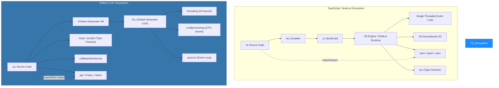
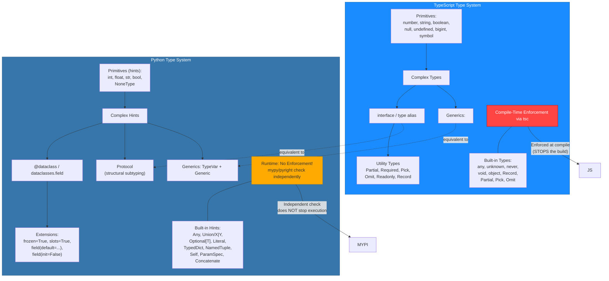
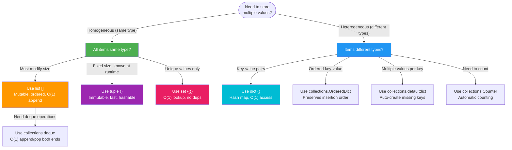
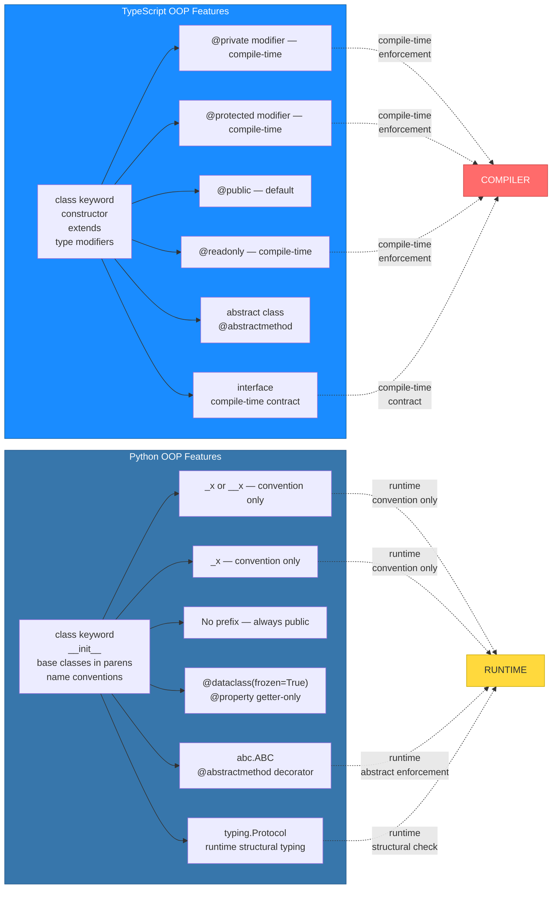
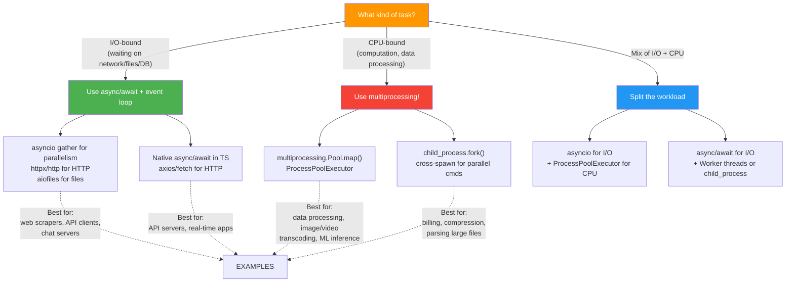
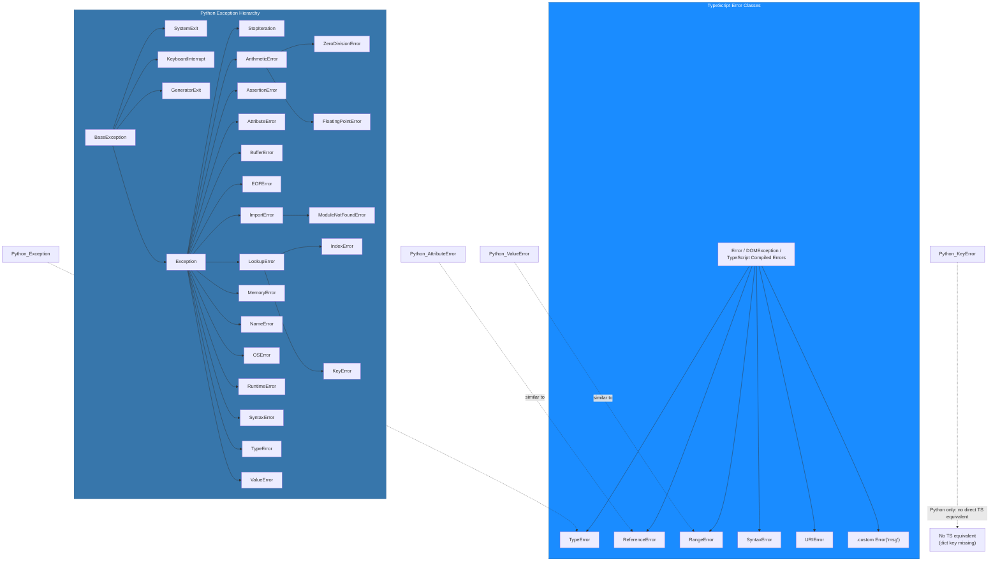
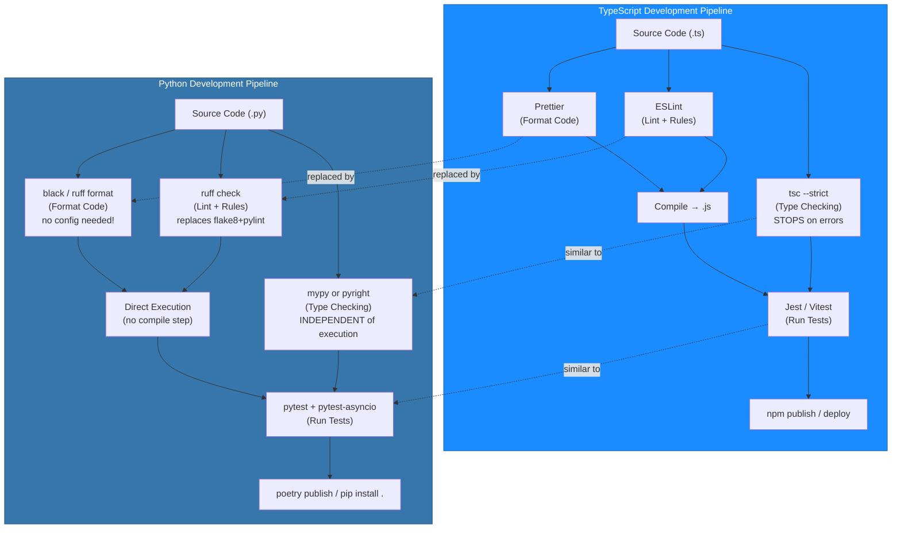
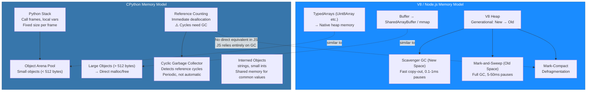
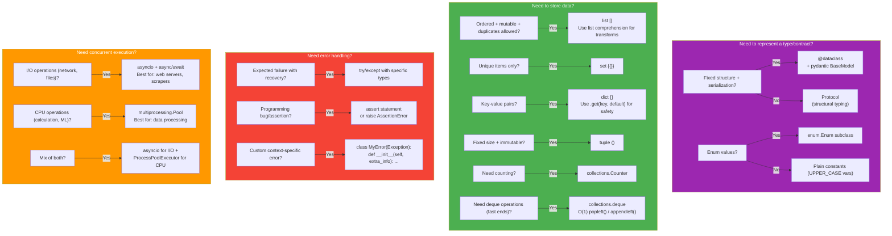

# Module 24 — Master Cheat Sheet: TypeScript → Python Ultimate Reference

> **This is the definitive, consolidated cheat sheet** for every TypeScript developer learning or working with Python. Every major concept from all previous modules is merged here with side-by-side comparisons, visual charts, decision trees, time complexity tables, Mermaid diagrams, and quick-reference guides. Use this as your go-to reference when writing Python code.

---

## Table of Contents

- [1. At-a-Glance: TypeScript ↔ Python Philosophy Comparison](#1-at-a-glance-typescript--python-philosophy-comparison)
- [2. Complete Syntax Map — Every Keyword Merged](#2-complete-syntax-map--every-keyword-merged)
  - [2a. Language Keywords Table](#2a-language-keywords-table)
  - [2b. TypeScript Operators → Python Equivalents](#2b-typescript-operators--python-equivalents)
- [3. Type System: Complete Visual Mapping](#3-type-system-complete-visual-mapping)
  - [3a. Primitive Types Comparison Table](#3a-primitive-types-comparison-table)
  - [3b. Complex Types Mapping Table](#3b-complex-types-mapping-table)
  - [3c. Type System Architecture Mermaid Diagram](#3c-type-system-architecture-mermaid-diagram)
- [4. Data Structures: Side-by-Side Complete Reference](#4-data-structures-side-by-side-complete-reference)
  - [4a. Collections Comparison Table](#4a-collections-comparison-table)
  - [4b. Every Collection Type — Code Gallery](#4b-every-collection-type--code-gallery)
  - [4c. Data Structure Decision Tree](#4c-data-structure-decision-tree)
- [5. Functions & Closures: Complete Comparison](#5-functions--closures-complete-comparison)
  - [5a. Function Types Table](#5a-function-types-table)
  - [5b. All Function Patterns — Code Gallery](#5b-all-function-patterns--code-gallery)
- [6. Classes & OOP: Deep Visual Comparison](#6-classes--oop-deep-visual-comparison)
  - [6a. Class Features Mapping Table](#6a-class-features-mapping-table)
  - [6b. Complete OOP Patterns Gallery](#6b-complete-oop-patterns-gallery)
  - [6c. OOP Feature Comparison Chart](#6c-oop-feature-comparison-chart)
- [7. Async/Await & Concurrency: Architecture Comparison](#7-await--concurrency-architecture-comparison)
  - [7a. Concurrency Models Table](#7a-concurrency-models-table)
  - [7b. All Patterns — Code Gallery](#7b-all-patterns--code-gallery)
  - [7c. Concurrency Decision Tree](#7c-concurrency-decision-tree)
- [8. Error Handling: Complete Mapping](#8-error-handling-complete-mapping)
  - [8a. Exception Hierarchy Mermaid Diagram](#8a-exception-hierarchy-mermaid-diagram)
  - [8b. Patterns Gallery](#8b-patterns-gallery)
- [9. Modules & Packages: Ecosystem Comparison](#9-modules--packages-ecosystem-comparison)
  - [9a. Module Resolution Table](#9a-module-resolution-table)
  - [9b. Package Managers: npm/pnpm/yarn vs pip/Poetry/Hatch](#9b-package-managers-npmpnpyarn-vs-pippoetryhatch)
- [10. Tooling Ecosystem: Complete Mapping](#10-tooling-ecosystem-complete-mapping)
  - [10a. Tooling Table](#10a-tooling-table)
  - [10b. Tooling Architecture Mermaid Diagram](#10b-tooling-architecture-mermaid-diagram)
- [11. Testing: Jest → pytest Complete Mapping](#11-testing-jest--pytest-complete-mapping)
  - [11a. Testing Framework Comparison](#11a-testing-framework-comparison)
  - [11b. Patterns Gallery](#11b-patterns-gallery)
- [12. Web Development: Express/NestJS → FastAPI/Django](#12-web-development-expressnestjs--fastapidjango)
  - [12a. Framework Comparison Table](#12a-framework-comparison-table)
  - [12b. Complete CRUD Gallery](#12b-complete-crud-gallery)
- [13. Standard Library: Node.js core → Python stdlib](#13-standard-library-nodejs-core--python-stdlib)
  - [13a. Every Core Module Mapped](#13a-every-core-module-mapped)
  - [13b. Popular npm → PyPI Mapping](#13b-popular-npm--pypi-mapping)
- [14. Memory & Performance: Architecture Comparison](#14-memory--performance-architecture-comparison)
  - [14a. Memory Models Mermaid Diagram](#14a-memory-models-mermaid-diagram)
  - [14b. Performance Tips Table](#14b-performance-tips-table)
- [14. One-Page Quick Reference (Cheat Sheet)](#14-one-page-quick-reference-cheat-sheet)
- [15. Decision Framework: Choosing the Right Python Construct](#15-decision-framework-choosing-the-right-python-construct)
- [16. Common Pitfalls for TypeScript Developers (Quick Reference)](#16-common-pitfalls-for-typescript-developers-quick-reference)
- [17. Time Complexity Quick Reference](#17-time-complexity-quick-reference)
- [18. Python-Superior Patterns (Things Python Does Better Than TS)](#18-python-superior-patterns-things-python-does-better-than-ts)

---

## 1. At-a-Glance: TypeScript ↔ Python Philosophy Comparison

| Aspect | TypeScript / Node.js | Python 3.10+ | Key Takeaway for TS Devs |
|--------|---------------------|--------------|--------------------------|
| **Execution** | Compiled `.ts` → `.js`, runs on V8/Node.js event loop | Interpreted bytecode on CPython VM, single-threaded with GIL | No compilation step — import and run directly |
| **Types** | Compile-time enforcement via `tsc` (stops the build) | Static hints checked by `mypy`/`pyright` independently of execution | Types help but don't enforce at runtime — use Pydantic for validation |
| **Null** | `null` and `undefined` are separate | Single `None` singleton — no distinction needed | Just use `is not None` everywhere |
| **Modules** | ES Modules (`import/export`) or CommonJS (`require()`) | PEP 328 `import X` / `from X import Y`; directory = package | Packages are directories with `__init__.py`, not files |
| **Concurrency** | Single-threaded event loop (Node.js) | asyncio event loop + threading (I/O-bound) + multiprocessing (CPU-bound) | Python has more concurrency primitives than Node.js |
| **Memory GC** | V8 generational mark-and-sweep | Reference counting + cyclic garbage collector | Objects die immediately when last ref is dropped in Python |
| **Boolean** | `true` / `false` (lowercase) | `True` / `False` (capitalized!) | Classic trap: `true` is undefined in Python |
| **Semicolons** | Optional but common | Never used | PEP 8 explicitly says no semicolons |
| **Increment** | `i++`, `i--` exist | Only `i += 1`; no `++` or `--` | `++i` returns `+ (+i)`, which is just `i` — not a counter |
| **Block scope** | `let`/`const` create block scope | Only function/module scope — no block scope | Loop variables leak after the loop in Python |
| **Optional chaining** | `obj?.prop ?? default` | `dict.get("key", default)` / `getattr(obj, "prop", default)` | No `?.` or `??` syntax (until Python 3.10+ walrus helps a bit) |
| **Spread** | `{ ...obj }`, `[...arr]` | `{**d}`, `[*s]` — different symbols, same pattern | Unpack operator is `*` / `**`, not `...` |
| **Default args** | `function foo(x = 5)` | `def foo(x=5):` — identical concept but with `def` keyword | Be careful: default args are evaluated ONCE at definition time |
| **IIFE** | `(x) => { }()` | No IIFE needed — use module-level code or `if __name__ == "__main__"` | Python modules ARE the IIFE — top-level scope is isolated per module |

### Mermaid: High-Level Language Architecture Comparison



---

## 2. Complete Syntax Map — Every Keyword Merged

### 2a. Language Keywords Table

| TypeScript | Python | Notes |
|-----------|--------|-------|
| `abstract` | (none) | Python uses convention: prefix with `_` or docstring |
| `as` | `as` | Same in both — used in type casting / exception handling |
| `assert` | `assert` | Same syntax; raises `AssertionError` |
| `async` | `async` | Same — marks function/coroutine |
| `await` | `await` | Same — awaits a coroutine/future |
| `break` | `break` | Identical behavior |
| `case` | (none) | Python uses `match`/`case` instead of `switch/case` |
| `catch` | (none) | Python uses `except` / `finally` |
| `class` | `class` | Same keyword; Python uses `self` parameter |
| `const` | (none) | Python has no constant keyword — convention: `UPPER_CASE` |
| `continue` | `continue` | Identical behavior |
| `default` | (none) | Python: default params in function definition |
| `delete` | `del` | `delete obj.prop` → `del obj.prop` |
| `do` | (none) | Python uses `while` instead of `do/while` |
| `else` | `else` | Same — but Python has `for/else`, `while/else`, `try/except/else` |
| `enum` | `enum` (module: `enum.Enum`) | TS enum → Python `class Color(Enum): Red = 1` |
| `export` | (none) | Python: no export — module scope IS the namespace |
| `finally` | `finally` | Same — in `try/except/finally` |
| `for` | `for` | TS: `for (let i=0; i<n; i++)`; Python: `for i in range(n):` or `for item in iterable:` |
| `function` | `def` | `function foo() {}` → `def foo():` |
| `if` | `if` | Same — but Python uses indentation, not braces |
| `implements` | (none) | Python: `Protocol` for structural subtyping |
| `import` | `import` | Same keyword; different syntax details (see §9) |
| `in` | `in` | Same — membership test and loop iteration |
| `interface` | `Protocol` / `TypedDict` | No `interface` in Python — use `Protocol` for structural typing |
| `is` | `is` | Same — identity comparison (object reference) |
| `keyof` | (none) | Python: `typing.get_type_hints()` or `getattr` introspection |
| `let` | (none) | No variable declaration keyword in Python — just assignment |
| `module` | (none) | Modules are created by importing files/directories |
| `namespace` | (none) | Python: package directories act as namespaces |
| `new` | `__new__` | No `new` keyword; call constructors directly: `Point(0, 0)` |
| `never` | `Never` (from typing) | TS `never` → Python `typing.NoReturn` / `Never` |
| `null` | `None` | Single nullish value in Python |
| `number` | `int` / `float` (via type hints) | No separate numeric types at runtime |
| `object` | `object` | Base of everything; also `typing.Any` for "any type" |
| `of` | (none) | Used in `for ... in`; no keyword |
| `private` | `_name` / `__name` | Convention: single `_` = protected, double `__` = name mangling |
| `protected` | `_name` | Single underscore convention; enforced by linter not compiler |
| `public` | (none) | Everything is public by default in Python |
| `readonly` | `property` with only getter / `dataclass(frozen=True)` | No `readonly` keyword |
| `require` | `import` / `from ... import` | No `require()` in Python |
| `return` | `return` | Identical |
| `some` | (none) | No equivalent keyword; use union types |
| `static` | `@staticmethod` / `@classmethod` | Decorators instead of keyword |
| `string` | `str` (via type hints) | TS `string` → Python `str` |
| `super` | `super()` | Same concept, same function call syntax |
| `switch` | `match` | TS: `switch/case`; Python 3.10+: `match/case` |
| `throw` | `raise` | `throw Error` → `raise ValueError` |
| `true` | `True` | Capitalized! |
| `try` | `try` | Same — followed by `except` (not `catch`) in Python |
| `type` | `type` / `def` / `class` | TS `type X = ...` → Python `X = TypeVar('X')` or just use directly |
| `typeof` | `type()` / `isinstance()` | `typeof(x)` → `type(x).__name__`; type guards via `isinstance()` |
| `undefined` | `None` | No distinction — only `None` exists |
| `var` | (none) | No variable declaration keyword — assignment is enough |
| `void` | `None` / `NoReturn` | TS `void` return → Python `def foo() -> None:` |
| `while` | `while` | Same — but no do/while in Python |
| `with` | `with` | Python: context manager; not a direct TS equivalent |
| `yield` | `yield` | Same — creates generators in both |

### 2b. TypeScript Operators → Python Equivalents

| Operator | TypeScript | Python | Notes |
|----------|-----------|--------|-------|
| **Equality** | `==`, `===` | `==`, `is` | `===` → `is` (identity); `==` works for value comparison |
| **Inequality** | `!=`, `!==` | `!=`, `is not` | `!==` → `is not` |
| **Logical AND** | `&&` | `and` | Python uses word operators |
| **Logical OR** | `\\` | `or` | Python uses word operators |
| **Logical NOT** | `!` | `not` | Word operator in Python |
| **Ternary** | `x ? a : b` | `a if x else b` | Reversed order! Condition goes in the middle |
| **Nullish coalesce** | `??` | `??` (Python 3.8+) or `.get()` for dicts | Python 3.8+ supports `??`; before that: `x if x is not None else default` |
| **Optional chaining** | `obj?.prop` | `getattr(obj, 'prop', default)` | No native `?.` in Python |
| **Bitwise AND** | `&` | `&` | Same |
| **Bitwise OR** | `\` | `or` (logical) / `\` (bitwise in some contexts) | Prefer `|` for bitwise; `or` for logical |
| **Bitwise NOT** | `~` | `~` | Same |
| **Bitwise XOR** | `^` | `^` | Same |
| **Left shift** | `<<` | `<<` | Same |
| **Right shift** | `>>` | `>>` | Same |
| **Exponentiation** | `**` | `**` | Same! (Unlike JS's `Math.pow()`) |
| **Augmented assign** | `+=`, `-=`, etc. | `+=`, `-=`, etc. | Same |
| **Member access** | `.prop`, `[key]` | `.attr`, `[key]` | Same |
| **Array index** | `arr[i]` | `lst[i]` | Same |
| **Spread/expand** | `...arr` | `*arr` / `**dict` | Different symbol; `*` for iterables, `**` for mappings |
| **Destructuring assign** | `[a, b] = arr` | `a, b = lst` | Same concept! No brackets needed in Python |
| **Comma operator** | `(a, b)` | Same as expression: `a, b` → returns tuple `(a, b)` | In Python, comma creates a tuple; no "comma operator" that discards |

---

## 3. Type System: Complete Visual Mapping

### 3a. Primitive Types Comparison Table

| TypeScript | Python (type hint) | Runtime Type | Notes |
|-----------|-------------------|-------------|-------|
| `number` | `int` / `float` | `int`, `float` | Python has arbitrary precision integers; no overflow |
| `string` | `str` | `str` | f-strings: `f"Hello {name}"` |
| `boolean` | `bool` | `bool` | Capitalized: `True` / `False` |
| `null` | `None` | `type(None)` | Single singleton; use `is None`, not `== None` |
| `undefined` | (none) | — | Merged with `None` in Python |
| `bigint` | `int` | `int` | Python ints have arbitrary precision natively |
| `symbol` | `enum.Enum` / `object()` | `Enum`, `object` | No native symbol type; use unique objects or Enum |

### 3b. Complex Types Mapping Table

| TypeScript | Python Equivalent | Example (TS) | Example (PY) |
|-----------|------------------|-------------|-------------|
| `string[]` | `list[str]` | `["a", "b"]` | `["a", "b"]` (identical syntax!) |
| `Array<string>` | `list[str]` | `new Array<string>()` | `list[str]` via type hint only |
| `[string, number]` | `tuple[str, int]` | A tuple with fixed types | `("a", 42)` — immutable! |
| `{ name: string }` | `TypedDict` or `dataclass` | `{ name: "Alice" }` | `dataclass` with fields or `dict[str, Any]` |
| `Record<string, T>` | `dict[str, T]` | `Record<string, number>` | `dict[str, int]` — same! |
| `Map<K, V>` | `dict[K, V]` / `collections.OrderedDict` | `new Map()` | Plain `dict` is ordered in Python 3.7+ |
| `Set<T>` | `set[T]` | `new Set<number>()` | `{1, 2, 3}` — same set literal syntax! |
| `readonly T[]` | `tuple[T, ...]` or `frozenset` | Readonly array | Use tuple for immutability |
| `Union<A, B>` | `A \ B` (TS) → `A \ B` (PY 3.10+) | `string \ number` | `str \ int` — same pipe syntax! |
| `optional T` / `T \ null` | `T \ None` | `string \ null` | `str \ None` or `Optional[str]` |
| `interface` | `Protocol` / `dataclass` | `interface User { name: string }` | `@dataclass; name: str` |
| `type alias` | Type alias (direct) | `type ID = string` | `ID = str` or just use `str` directly |
| `enum` | `enum.Enum` | `enum Color { Red }` | `class Color(Enum): Red = 1` |
| `generic <T>` | `TypeVar("T") + Generic[T]` | `Array<T>` | `from typing import TypeVar; T = TypeVar('T')` |
| `keyof T` | `typing.get_type_hints()` | Runtime reflection | Use `inspect.signature()` or `__annotations__` |
| `Partial<T>` | Not built-in; use dataclasses / dict | `Partial<User>` | Pass only required fields in a dict |
| `Pick<T, K>` | TypedDict with specific keys | `Pick<User, "name">` | Define a new TypedDict or use `dict[str, str]` |
| `Omit<T, K>` | New TypedDict without keys | `Omit<User, "id">` | Define a subset TypedDict |
| `Required<T>` | dataclass (all required by default) | `Required<User>` | dataclass fields are always required unless `field(default=...)` |
| `Readonly<T>` | `dataclass(frozen=True)` or `@property` | `Readonly<User>` | Use frozen dataclass or read-only property |
| `never` | `Never` / `NoReturn` | `function(): never` | `def foo() -> Never: ...` |

### 3c. Type System Architecture Mermaid Diagram



---

## 4. Data Structures: Side-by-Side Complete Reference

### 4a. Collections Comparison Table

| Operation | TypeScript Array | Python list | Notes |
|-----------|-----------------|-------------|-------|
| **Create** | `const arr = [1, 2, 3]` | `[1, 2, 3]` | Identical syntax! |
| **Append** | `arr.push(4)` | `lst.append(4)` | `.append()` only (no push in Python lists) |
| **Insert at index** | `arr.splice(1, 0, 99)` | `lst.insert(1, 99)` | Same concept |
| **Remove last** | `arr.pop()` | `lst.pop()` | Identical! |
| **Remove first** | `arr.shift()` | `lst.pop(0)` or `collections.deque.popleft()` | No direct equivalent |
| **Find index** | `arr.indexOf(x)` | `lst.index(x)` | Same method name! |
| **Check exists** | `arr.includes(x)` | `x in lst` | Python uses `in` operator |
| **Length** | `arr.length` | `len(lst)` | Function call, not property |
| **Slice** | `arr.slice(1, 3)` | `lst[1:3]` | Slice syntax instead of method |
| **Concatenate** | `[...a, ...b]` or `a.concat(b)` | `a + b` or `[*a, *b]` | Both work |
| **Map** | `arr.map(x => x * 2)` | `[x * 2 for x in lst]` (list comp) | List comprehension is the Pythonic way |
| **Filter** | `arr.filter(x => x > 0)` | `[x for x in lst if x > 0]` | Filter inside comprehension |
| **Reduce** | `arr.reduce((a, b) => a + b, 0)` | `functools.reduce(operator.add, lst, 0)` | import from functools |
| **Find element** | `arr.find(x => x > 0)` | `next((x for x in lst if x > 0), None)` | Generator expression with next() |
| **Every/Some** | `arr.every(x => x > 0)` / `.some(x => ...)` | `all(lst)` / `any(lst)` | Built-in functions! |
| **Join** | `arr.join("-")` | `"-".join(lst)` | Reversed: separator first |
| **Sort (in-place)** | `arr.sort()` | `lst.sort(reverse=True)` | Same method name |
| **Reverse** | `arr.reverse()` | `lst.reverse()` | Identical! |
| **Flat** | `[].flat(Infinity)` | See itertools recipes or nested loops | No built-in flat — use list comp: `[y for x in lst for y in x]` |

| Operation | TypeScript Map/Set | Python equivalent | Notes |
|-----------|-------------------|-------------------|-------|
| **Create** | `new Map()` / `new Set()` | `dict()` / `set()` | Built-in types, not classes to instantiate |
| **Set/Get** | `map.set(k, v)` / `.get(k)` | `d[k] = v` / `d.get(k)` | Subscript syntax instead of methods |
| **Has key** | `map.has(k)` | `k in d` | Use `in` operator |
| **Delete** | `map.delete(k)` | `del d[k]` | `del` statement |
| **Size** | `map.size` / `set.size` | `len(d)` / `len(s)` | Function call, not property |
| **Iterate keys** | `for (const k of map.keys())` | `for k in d:` | Iterate keys by default |
| **Iterate values** | `for (const v of map.values())` | `for v in d.values():` | Same method name! |

### 4b. Every Collection Type — Code Gallery

```typescript
// TypeScript: All collection patterns

// Array (mutable list)
const arr: number[] = [1, 2, 3];
arr.push(4);                    // [1, 2, 3, 4]
const first = arr[0];           // 1
const slice = arr.slice(1, 3);  // [2, 3]

// Tuple (fixed-size, fixed-type)
const tuple: [string, number] = ["hello", 42];
const [name, age] = tuple;      // destructuring

// Dictionary (record/object)
const dict: Record<string, number> = { a: 1, b: 2 };
dict.c = 3;                     // add key
const val = dict.a ?? 0;        // optional access

// Set
const set = new Set<number>([1, 2, 3]);
set.add(4);                      // Set {1, 2, 3, 4}
set.has(2);                      // true

// Map
const map = new Map<string, number>();
map.set("a", 1);
map.get("a");                    // 1
```

```python
# Python: All collection patterns (side-by-side)

# List (mutable array) — same literal syntax!
lst = [1, 2, 3]
lst.append(4)                   # [1, 2, 3, 4]
first = lst[0]                  # 1
slice_ = lst[1:3]               # [2, 3]

# Tuple (fixed-size, fixed-type, immutable)
tup: tuple[str, int] = ("hello", 42)
name, age = tup                 # destructuring — same!

# Dictionary (mutable mapping)
dct: dict[str, int] = {"a": 1, "b": 2}
dct["c"] = 3                    # add key
val = dct.get("a", 0)           # optional access with default

# Set
s: set[int] = {1, 2, 3}
s.add(4)                        # {1, 2, 3, 4}
2 in s                          # True — use 'in' operator!

# OrderedDict (ordered by insertion, default in Python 3.7+)
od: dict[str, int] = {}
od["first"] = 1
od["second"] = 2                # maintains insertion order
```

### 4c. Data Structure Decision Tree



---

## 5. Functions & Closures: Complete Comparison

### 5a. Function Types Table

| Concept | TypeScript | Python | Notes |
|---------|-----------|--------|-------|
| **Declaration** | `function foo(x: string): void {}` | `def foo(x: str) -> None: pass` | `def` keyword, not `function` |
| **Arrow function** | `const foo = (x: string): void => {}` | `lambda x: ...` (single expression only!) | Lambdas in Python are limited — prefer `def` for multi-line |
| **Default params** | `(x = 5)` | `(x=5)` | Same syntax! |
| **Optional params** | `(x?: string)` | `(x: str \ None = None)` or `(x: Optional[str] = None)` | Must provide default value for optional |
| **Rest params** | `(...args: string[])` | `*args: tuple[str, ...]` | `*args` as varargs; `**kwargs` for dict |
| **No return** | `void` / no annotation | `None` (convention) | Return type hint `-> None` is optional but recommended |
| **Overloading** | Function overloads at top | Not supported — use default params or `*args/**kwargs` | Python doesn't support overload syntax; use `@overload` for type hints only |
| **Closures** | Same as JS (lexical scoping) | Same! Nonlocal keyword for outer-scope assignment | `nonlocal x` to modify enclosing scope variable |

### 5b. All Function Patterns — Code Gallery

```typescript
// TypeScript: All function patterns

// Basic function declaration
function greet(name: string, age?: number): string {
  return `Hello ${name}${age ? `, age ${age}` : ''}`;
}

// Arrow function with default params
const add = (a: number, b: number = 10): number => a + b;

// Rest parameters
function sum(...numbers: number[]): number {
  return numbers.reduce((a, b) => a + b, 0);
}

// Callback type
type Callback = (result: string) => void;

// Closures with closure variables
function createCounter(): () => number {
  let count = 0;
  return () => ++count;
}

// Higher-order function
function applyTwice(fn: (x: number) => number, x: number): number {
  return fn(fn(x));
}
```

```python
# Python: All function patterns (side-by-side)

# Basic function declaration
def greet(name: str, age: int | None = None) -> str:
    suffix = f", age {age}" if age else ""
    return f"Hello {name}{suffix}"

# Lambda (single expression only — keep it simple!)
add = lambda a, b=10: a + b

# *args and **kwargs
def sum_(*numbers: int) -> int:
    return sum(numbers)  # built-in!

# Type hint for callable
from typing import Callable
Callback = Callable[[str], None]

# Closures — use 'nonlocal' to modify enclosing scope
def create_counter():
    count = 0
    def counter() -> int:
        nonlocal count  # key: tells Python to use outer variable
        count += 1
        return count
    return counter

# Higher-order function
def apply_twice(fn: Callable[[int], int], x: int) -> int:
    return fn(fn(x))
```

---

## 6. Classes & OOP: Deep Visual Comparison

### 6a. Class Features Mapping Table

| Feature | TypeScript | Python | Notes |
|---------|-----------|--------|-------|
| **Class declaration** | `class Foo { constructor() {} }` | `class Foo: def __init__(self): pass` | No `constructor()` — use `__init__` |
| **Constructor params** | `constructor(public name: string)` | `def __init__(self, name: str): self.name = name` | Python: assign in body explicitly |
| **Inheritance** | `class Bar extends Foo` | `class Bar(Foo): pass` | Parentheses, not keyword |
| **Super call** | `super()` or `super().method()` | `super().__init__()` or `super().method()` | Same concept! |
| **Public** | Default (no modifier) | Default (no modifier) | Everything is public by default |
| **Private** | `private x: string` | `_x` / `__x` | Convention only; `__` triggers name mangling |
| **Protected** | `protected x: string` | `_x` (single underscore convention) | Linter-enforced, not compiler-enforced |
| **Readonly** | `readonly x: number` | `@property` with getter only / frozen dataclass | No keyword — use property or frozen dataclass |
| **Static member** | `static x = 5; static method() {}` | `x = 5; @staticmethod def method(): pass` | Decorator for static methods |
| **Abstract class** | `abstract class Base { abstract method(): void }` | ABC module: `@abstractmethod` | Need `from abc import ABC, abstractmethod` |
| **Interface** | `interface User { name: string }` | Protocol / TypedDict | Structural typing via Protocols |
| **Type guard** | `instanceof ClassName` | `isinstance(obj, ClassName)` | Use for runtime type checks |
| **Getter/Setter** | `get x() { return this.x; } set x(v) { this.x = v; }` | `@property def x(self): ... @x.setter def x(self, v): ...` | Decorator pattern in Python |

### 6b. Complete OOP Patterns Gallery

```typescript
// TypeScript: Class patterns

class Animal {
  constructor(public name: string, protected sound: string) {}
  
  makeSound(): string {
    return `${this.name} says ${this.sound}`;
  }
  
  static create(name: string): Animal {
    return new Animal(name, "???");
  }
  
  // Abstract base class
}

abstract class Pet extends Animal {
  constructor(name: string) {
    super(name, "???");
  }
  abstract speak(): void;
}

// Interface as contract
interface Feeder {
  feed(animal: Animal): void;
}

// Decorator for behavior modification (simplified)
class Dog extends Pet {
  private _age: number = 0;
  
  get age(): number { return this._age; }
  set age(value: number) { this._age = value; }
  
  speak(): void {
    console.log(`${this.name} barks!`);
  }
}

// Composition over inheritance
class Kennel {
  private animals: Animal[] = [];
  add(animal: Animal) { this.animals.push(animal); }
}
```

```python
# Python: Class patterns (side-by-side)

class Animal:
    def __init__(self, name: str, sound: str):
        self.name = name           # public
        self._sound = sound         # protected convention
    
    def make_sound(self) -> str:
        return f"{self.name} says {self._sound}"
    
    @staticmethod
    def create(name: str) -> "Animal":
        return Animal(name, "???")

# Abstract base class
from abc import ABC, abstractmethod

class Pet(ABC):
    def __init__(self, name: str):
        super().__init__(name, "???")
    
    @abstractmethod
    def speak(self) -> None: ...

# Protocol (structural typing — equivalent to interface)
from typing import Protocol

class Feeder(Protocol):
    def feed(self, animal: Animal) -> None: ...

# Dataclass for boilerplate reduction
from dataclasses import dataclass

@dataclass(frozen=True)  # immutable like 'readonly'
class Dog(Pet):
    name: str = ""
    _age: int = 0
    
    @property
    def age(self) -> int:
        return self._age
    
    @age.setter
    def age(self, value: int) -> None:
        if value >= 0:
            self._age = value
    
    def speak(self) -> None:
        print(f"{self.name} barks!")

# Composition over inheritance
class Kennel:
    def __init__(self) -> None:
        self.animals: list[Animal] = []
    
    def add(self, animal: Animal) -> None:
        self.animals.append(animal)
```

### 6c. OOP Feature Comparison Chart



---

## 7. Async/Await & Concurrency: Architecture Comparison

### 7a. Concurrency Models Table

| Model | TypeScript/Node.js | Python | When to Use |
|-------|-------------------|--------|-------------|
| **Event loop (async)** | Native — everything is async-first | `asyncio` module | I/O-bound: HTTP requests, file ops, DB queries |
| **Threading** | Worker threads (limited use) | `threading` module | I/O-bound only (GIL prevents CPU parallelism) |
| **Multiprocessing** | `child_process.fork()` | `multiprocessing` module | CPU-bound: data processing, computations |
| **Web Workers** | `new Worker()` | `concurrent.futures.ProcessPoolExecutor` | Heavy computation off main thread |
| **Promise** | `new Promise((resolve, reject) => {})` | `asyncio.Task` / `asyncio.Future` | Same concept, different API |

### 7b. All Patterns — Code Gallery

```typescript
// TypeScript: Async patterns

// Basic async/await
async function fetchData(url: string): Promise<User> {
  const response = await fetch(url);
  if (!response.ok) throw new Error(`HTTP ${response.status}`);
  return response.json();
}

// Parallel execution
const [user, posts] = await Promise.all([
  fetch("/api/user").then(r => r.json()),
  fetch("/api/posts").then(r => r.json()),
]);

// Timeout with promise
const timeout = (ms: number) => new Promise((_, rej) =>
  setTimeout(() => rej(new Error('Timeout')), ms)
);
const result = await Promise.race([fetchData(url), timeout(5000)]);

// Retry pattern
async function retry<T>(fn: () => Promise<T>, maxRetries: number): Promise<T> {
  for (let i = 0; i < maxRetries; i++) {
    try { return await fn(); }
    catch (e) { if (i === maxRetries - 1) throw e; }
  }
}

// AbortController (cancel request)
const controller = new AbortController();
setTimeout(() => controller.abort(), 5000);
const res = await fetch(url, { signal: controller.signal });
```

```python
# Python: Async patterns (side-by-side)

import asyncio
import httpx  # pip install httpx

# Basic async/await
async def fetch_data(url: str) -> User:
    async with httpx.AsyncClient() as client:
        response = await client.get(url)
        response.raise_for_status()
        return response.json()

# Parallel execution
user, posts = await asyncio.gather(
    fetch_data("/api/user"),
    fetch_data("/api/posts"),
)

# Timeout with try/except
async def timeout_wrapper(coro, seconds: float):
    try:
        return await asyncio.wait_for(coro, timeout=seconds)
    except asyncio.TimeoutError:
        raise TimeoutError(f"Timed out after {seconds}s")

result = await timeout_wrapper(fetch_data(url), 5.0)

# Retry pattern
async def retry(fn, max_retries: int = 3):
    for i in range(max_retries):
        try:
            return await fn()
        except Exception as e:
            if i == max_retries - 1:
                raise
            await asyncio.sleep(2 ** i)  # exponential backoff

# Cancel with task cancellation
task = asyncio.create_task(fetch_data(url))
asyncio.get_event_loop().call_later(5.0, task.cancel)
await task  # raises asyncio.CancelledError
```

### 7c. Concurrency Decision Tree



---

## 8. Error Handling: Complete Mapping

### 8a. Exception Hierarchy Mermaid Diagram



### 8b. Patterns Gallery

```typescript
// TypeScript: Error handling patterns

// Try/catch with typed error
try {
  throw new Error("Something went wrong");
} catch (e) {
  if (e instanceof Error) {
    console.error(e.message);
  }
}

// Custom error class
class ValidationError extends Error {
  public fields: string[];
  constructor(message: string, fields: string[]) {
    super(message);
    this.name = "ValidationError";
    this.fields = fields;
  }
}

// Guarded access (optional chaining)
const name = user?.profile?.address?.street ?? "Unknown";

// Result pattern (using a library or manual enum)
function parseNumber(input: string): { ok: true; value: number } | { ok: false; error: string } {
  const n = Number(input);
  return isNaN(n) ? { ok: false, error: "Invalid" } : { ok: true, value: n };
}
```

```python
# Python: Error handling patterns (side-by-side)

# Try/except with type-based catching
try:
    raise ValueError("Something went wrong")
except ValueError as e:
    print(f"Error: {e}")  # catch specific types first!
except Exception as e:
    print(f"Unexpected error: {e}")

# Custom exception class
class ValidationError(Exception):
    def __init__(self, message: str, fields: list[str]):
        super().__init__(message)
        self.fields = fields  # store extra info on the exception!

# Guarded access (dict.get / getattr with default)
name = getattr(getattr(user, "profile", None), "address", None) \
    and getattr(user.profile.address, "street", "Unknown") \
    or "Unknown"
# Better: use a helper function or Pydantic for validation

# Result pattern (Python idiom: try/except instead of checking)
def parse_number(input_str: str) -> int | None:
    """EAFP: Try first, handle failure."""
    try:
        return int(input_str)
    except (ValueError, TypeError):
        return None
```

---

## 9. Modules & Packages: Ecosystem Comparison

### 9a. Module Resolution Table

| Feature | TypeScript / Node.js | Python | Notes |
|---------|---------------------|--------|-------|
| **Import syntax** | `import { foo } from "bar"` | `from bar import foo` | Pipe `{}` → word `import` |
| **Default import** | `import foo from "bar"` | `import bar; foo = bar.foo` or `from bar import foo as foo_alias` | No default exports in Python! |
| **Namespace import** | `import * as foo from "bar"` | `import bar as foo` or `from bar import *` (avoid) | `import bar as foo` is the Pythonic way |
| **Side-effect import** | `import "bar"; bar.init()` | `import bar` (runs top-level code) | Same — imports execute module body |
| **Relative import** | `./foo` / `../bar` | `from . import foo` / `from ..pkg import bar` | Dot-notation required for relative |
| **Dynamic import** | `import("bar").then(m => ...)` | `importlib.import_module("bar")` or `__import__("bar")` | Use `importlib` module |
| **Module resolution** | `node_modules/`, `baseUrl` in tsconfig | sys.path, project root, package `__init__.py` | Python uses import paths, not file-relative |
| **Package.json config** | `"module": "esm", "main": "dist/index.js"` | `pyproject.toml` or `setup.py` | Poetry/pyproject is the modern standard |

### 9b. Package Managers: npm/pnpm/yarn vs pip/Poetry/Hatch

| Feature | npm | pnpm | yarn | pip | Poetry | Hatch |
|---------|-----|------|------|-----|--------|-------|
| **Lock file** | `package-lock.json` | `pnpm-lock.yaml` | `yarn.lock` | `pip freeze` / `.installed` | `poetry.lock` | `hatchling` (no lock by default) |
| **Install deps** | `npm install pkg` | `pnpm add pkg` | `yarn add pkg` | `pip install pkg` | `poetry add pkg` | `pipx install pkg` / hatch |
| **Dev deps** | `npm install --save-dev` | `pnpm add -D` | `yarn add -D` | `pip install -e .[dev]` | `poetry add -G dev pkg` | Hatch extras via pyproject.toml |
| **Scripts** | `"scripts": {"build": "tsc"}` | Same | Same | Not built-in; use Makefile/just | `poetry run mypy .` | `hatch run lint:mypy` |
| **Publish** | `npm publish` | `pnpm publish` | `yarn publish` | `twine upload dist/*` | `poetry publish` | `hatch publish` |
| **Workspace** | npm workspaces | pnpm workspace | yarn workspaces | Poetry [tool.poetry.packages] | Hatch monorepo | Same as Poetry |

---

## 10. Tooling Ecosystem: Complete Mapping

### 10a. Tooling Table

| Task | TypeScript/Node.js | Python Equivalent | Notes |
|------|-------------------|------------------|-------|
| **Type checker** | `tsc` (strict mode) | `mypy` / `pyright` | mypy is closest to tsc; pyright = fast (VS Code default) |
| **Linter** | ESLint | `ruff` (replaces flake8, pylint, etc.) | ruff is a single-tool replacement for the entire Python linting ecosystem |
| **Formatter** | Prettier / prettier-plugin | `black` / `ruff format` | black formats everything automatically — no config needed! |
| **Package manager** | npm / pnpm / yarn | pip + Poetry / pipx | Poetry = npm for dependencies; pipx = npx for running tools |
| **Test runner** | Jest / Vitest / ts-jest | `pytest` (+ `pytest-asyncio`) | pytest discovers tests automatically; fixtures replace setup/teardown |
| **CI/CD** | GitHub Actions (npm: ci, build, test) | GitHub Actions (python: venv, pip install, pytest, mypy, ruff) | Same CI tooling — different language steps |
| **Build tool** | Vite / esbuild / tsup | Hatch / poetry-build / maturin (for C extensions) | Python doesn't need build tools for pure Python — just `pip install .` |
| **Hot reload** | nodemon / ts-node-dev | uvicorn --reload / python -Wd | `uvicorn main:app --reload` for FastAPI dev |
| **CLI framework** | Commander / Argparse / yargs | `argparse` (stdlib) / `click` / `typer` | Typer = most TS-like (uses type hints for CLI args!) |

### 10b. Tooling Architecture Mermaid Diagram



---

## 11. Testing: Jest → pytest Complete Mapping

### 11a. Testing Framework Comparison

| Feature | Jest (TypeScript) | pytest (Python) | Notes |
|---------|------------------|-----------------|-------|
| **Test discovery** | `*.test.ts` or `*.spec.ts` files | `test_*.py` / `*_test.py` files | Both auto-discover |
| **Describe/It** | `describe("suite", () => it("test", ...))` | `def test_name(): pass` (no describe needed) | pytest uses plain functions |
| **Before/After hooks** | `beforeEach`, `afterEach` | `@pytest.fixture` + `yield` or `setup_method` | Fixtures are more powerful |
| **Assertions** | `expect(value).toBe(expected)` | `assert value == expected` | Same `assert` keyword! |
| **Mocking** | `jest.mock()`, `jest.fn()` | `unittest.mock.patch()`, `MagicMock` | More powerful in Python |
| **Parametrize tests** | `test.each\`\` ` | `@pytest.mark.parametrize` | Both support data-driven tests |
| **Timeout** | `jest.setTimeout(ms)` | `@pytest.mark.timeout(n)` | pytest-timeout plugin |
| **Coverage** | `--coverage` (built-in) | `pytest-cov` plugin | Separate plugin in Python |

### 11b. Patterns Gallery

```typescript
// TypeScript: Jest test patterns

describe("UserService", () => {
  let service: UserService;
  
  beforeEach(() => {
    service = new UserService(mockRepo);
  });
  
  afterEach(() => {
    jest.clearAllMocks();
  });
  
  it("should create a user", async () => {
    const user = await service.createUser({ name: "Alice" });
    expect(user.name).toBe("Alice");
    expect(user.id).toBeDefined();
    expect(mockRepo.save).toHaveBeenCalledTimes(1);
  });
  
  it.each([
    ["", "Name is required"],
    [null, "Name is required"],
  ])("should validate name: %s", (name, expectedError) => {
    expect(() => service.createUser({ name })).toThrow(expectedError);
  });
  
  test("with mock implementation", () => {
    const mockFn = jest.fn().mockReturnValue(42);
    expect(mockFn()).toBe(42);
    expect(mockFn).toHaveBeenCalledWith();
  });
});
```

```python
# Python: pytest test patterns (side-by-side)

import pytest
from unittest.mock import patch, MagicMock
from app.user_service import UserService


class TestUserService:
    @pytest.fixture
    def mock_repo(self):
        return MagicMock()
    
    @pytest.fixture
    def service(self, mock_repo):
        """Auto-injected via fixture name match!"""
        return UserService(mock_repo)

    def test_create_user(self, service):
        user = service.create_user(name="Alice")
        assert user.name == "Alice"
        assert user.id is not None
        service.repo.save.assert_called_once()

    @pytest.mark.parametrize("name,expected_error", [
        ("", "Name is required"),
        (None, "Name is required"),
    ])
    def test_validate_name(self, name, expected_error, service):
        with pytest.raises(ValueError, match=expected_error):
            service.create_user(name=name)

    @patch("app.user_service.get_external_data")
    def test_with_mock(self, mock_fn, service):
        mock_fn.return_value = 42
        assert mock_fn() == 42
        mock_fn.assert_called_once()

# Async tests — use pytest-asyncio plugin
@pytest.mark.asyncio
async def test_async_user_fetch(service):
    user = await service.get_user(1)
    assert user is not None
```

---

## 12. Web Development: Express/NestJS → FastAPI/Django

### 12a. Framework Comparison Table

| Feature | Express.js (TS) | NestJS (TS) | FastAPI (Python) | Django (Python) |
|---------|-----------------|-------------|------------------|-----------------|
| **Routing** | `app.get("/path", handler)` | `@Get("/path")` decorator | `@app.get("/path")` decorator | URLconf + function/class views |
| **Type safety** | Manual (or tRPC) | Decorators + DTO classes | Type hints = auto-docs! | Pydantic models (same as FastAPI) |
| **Middleware** | `app.use(middleware)` | NestJS interceptors/guards | Depends/DependsFastAPI middleware | Django middlewares in settings |
| **ORM** | TypeORM / Prisma | TypeORM / Prisma | SQLAlchemy 2.0 + alembic | Django ORM (built-in!) |
| **Validation** | Zod class-validator | DTOs + class-validator | Pydantic v2 (auto from type hints) | Pydantic / form validation |
| **Auto docs** | none (or swagger manually) | @nestjs/swagger | OpenAPI/Swagger auto-generated! | DRF browsable API |
| **Scaffolding** | `express-generator` | `nest generate` | `fastapi new` (via uv) | `django-admin startproject` |

### 12b. Complete CRUD Gallery

```typescript
// TypeScript/Node.js: Express + NestJS patterns

// Express-style REST API
import express from "express";
const app = express();
app.use(express.json());

interface User { id: number; name: string; email: string; }

let users: User[] = [];
let nextId = 1;

app.get("/api/users", (req, res) => {
  const page = parseInt(req.query.page as string) || 1;
  const limit = parseInt(req.query.limit as string) || 20;
  const search = (req.query.search as string) ?? "";
  
  let filtered = users.filter(u => 
    u.name.toLowerCase().includes(search.toLowerCase())
  );
  
  res.json({
    data: filtered.slice((page - 1) * limit, page * limit),
    total: filtered.length,
  });
});

app.post("/api/users", async (req, res) => {
  const { name, email } = req.body;
  const errors: string[] = [];
  if (!name) errors.push("Name required");
  if (!email || !/\S+@\S+/.test(email)) errors.push("Valid email required");
  
  if (errors.length > 0) return res.status(400).json({ errors });

  const newUser = { id: nextId++, name, email };
  users.push(newUser);
  res.status(201).json(newUser);
});

const PORT = process.env.PORT || 3000;
app.listen(PORT, () => console.log(`Server on ${PORT}`));
```

```python
# Python: FastAPI equivalent (side-by-side) — notice how much less boilerplate!

from fastapi import FastAPI, Query, HTTPException
from pydantic import BaseModel, EmailStr
from typing import Optional

app = FastAPI()

class UserCreate(BaseModel):
    name: str
    email: EmailStr

class UserOut(BaseModel):
    id: int
    name: str
    email: EmailStr

users_db: list[UserOut] = []
next_id: int = 1

@app.get("/api/users")
async def get_users(
    page: int = Query(default=1, ge=1),
    limit: int = Query(default=20, ge=1),
    search: Optional[str] = None,
):
    filtered = [u for u in users_db if search is None or search.lower() in u.name.lower()]
    return {
        "data": filtered[(page - 1) * limit : page * limit],
        "total": len(filtered),
    }

@app.post("/api/users", status_code=201)
async def create_user(user: UserCreate):
    """Type hints auto-validate! No manual validation needed."""
    users_db.append(UserOut(id=next_id, **user.model_dump()))
    next_id += 1
    return {"id": next_id - 1, "name": user.name, "email": user.email}

# Run: uvicorn main:app --reload
```

---

## 13. Standard Library: Node.js core → Python stdlib

### 13a. Every Core Module Mapped

| Node.js Module | Python Equivalent(s) | Notes |
|---------------|---------------------|-------|
| `fs` (file system) | `pathlib.Path`, `open()`, `os`, `shutil` | pathlib is the modern way |
| `fs/promises` | `aiofiles`, async context managers | No native async file API — use aiofiles |
| `path` | `pathlib.Path` | Python's Path > Node.js path.join() |
| `http` | `requests` (sync), `httpx`/`aiohttp` (async) | Node.js http is built-in; Python requires pip install |
| `https` | `requests`, `httpx` with https:// URLs | Same as http — no separate module needed |
| `crypto` | `hashlib`, `cryptography` | hashlib for hashing; cryptography for encryption |
| `os` | `os`, `sys`, `platform` | Python has os + sys + platform split |
| `process` | `sys`, `os`, `platform`, `signal` | `process.env` → `os.environ`; `process.argv` → `sys.argv` |
| `timers` | `time.sleep()`, `asyncio.sleep()` | No setInterval — use asyncio periodically or threads |
| `buffer` | `bytes`, `bytearray`, `struct`, `array` | bytes is immutable buffer; bytearray is mutable |
| `events` | `asyncio.Queue`, `blinker` (third-party) | Python doesn't have EventEmitter built-in |
| `child_process` | `subprocess.run()`, `subprocess.Popen()` | subprocess module for external processes |
| `dns` | `socket.getaddrinfo()`, `dnspython` (third-party) | Basic DNS via socket; advanced via dnspython |
| `dgram` (UDP) | `socket` (AF_INET, SOCK_DGRAM) | Same socket API but with different flags |
| `url` / `URLSearchParams` | `urllib.parse`, `yarl` (third-party) | urllib.parse for basic; yarl for advanced |
| `zlib` / gzip / bz2 | `zlib`, `gzip`, `bz2`, `lzma` built-in! | All compression formats in stdlib! |
| `stream` | `iterators`, `generators`, `yield`, async iter | Python's iterator protocol replaces streams |
| `util` | `inspect`, `functools`, `copy` | inspect for introspection; functools for decorators |
| `assert` | `pytest` (for tests), built-in `assert` | assert statement works the same |
| `diagnostics_channel` | `logging`, `sys.monitoring` (3.13+) | logging module is the standard |

### 13b. Popular npm → PyPI Mapping

| npm Package | Purpose | Python Equivalent (PyPI/stdlib) | Stdlib? |
|------------|---------|--------------------------------|---------|
| **Web Frameworks** ||||
| `express` | Minimalist web framework | `fastapi` / `flask` / `sanic` | No |
| `nest` | Opinionated, modular framework | `fastapi` (with `typer`/`DI`) | No |
| `next` | Full-stack React framework | `django` / `reflex` / `solara` | No |
| `koa` | Lightweight, middleware-heavy | `sanic` / `aiohttp` | No |
| `hapi` | Configuration-centric framework | `django` | No |
| **HTTP & API Clients** ||||
| `axios` | Promise-based HTTP client | `httpx` / `requests` | No |
| `node-fetch` | Fetch API polyfill | `httpx` / `urllib3` | No |
| `superagent` | Flexible AJAX library | `httpx` | No |
| `ky` | Tiny fetch-based client | `httpx` | No |
| `got` | Human-friendly HTTP requests | `httpx` / `requests` | No |
| `soap` | SOAP protocol client | `zeep` | No |
| `graphql-request` | Minimal GraphQL client | `gql` / `strawberry` | No |
| **Database & ORM** ||||
| `prisma` | Type-safe ORM | `sqlalchemy` / `databases` / `pony` | No |
| `typeorm` | ORM for TS/JS | `sqlalchemy` / `django-orm` / `peewee` | No |
| `mongoose` | MongoDB ODM | `motor` / `pymongo` / `beanie` | No |
| `pg` / `mysql2` | DB drivers (Postgres/MySQL) | `psycopg` / `asyncpg` / `pymysql` | No |
| `sequelize` | Promise-based ORM | `sqlalchemy` | No |
| `knex` | SQL query builder | `sqlalchemy` (core) | No |
| `redis` | Redis client | `redis` / `aioredis` | No |
| `ioredis` | Redis client (Promise-based) | `redis` / `aioredis` | No |
| **Validation & Schema** ||||
| `zod` | Schema validation | `pydantic` / `marshmallow` / `cerberus` | No |
| `joi` | Object schema validation | `marshmallow` / `pydantic` | No |
| `class-validator` | Decorator-based validation | `pydantic` (compatible with dataclasses) | No |
| `yup` | Schema validation | `pydantic` | No |
| `io-ts` | Runtime type checking | `pydantic` / `typeguard` | No |
| **Auth & Security** ||||
| `passport` | Auth middleware | `authlib` / `fastapi-security` | No |
| `bcrypt` | Hashing passwords | `bcrypt` / `passlib` | No |
| `jsonwebtoken` | JWT handling | `pyjwt` / `python-jose` | No |
| `helmet` | Security headers | `helmet` (Python port) / `fastapi-security` | No |
| `cors` | CORS middleware | `fastapi.middleware.cors` / `flask-cors` | No |
| **Testing & Quality** ||||
| `jest` | Testing framework | `pytest` | No |
| `vitest` | Unit test framework | `pytest` | No |
| `mocha` | Test runner | `pytest` | No |
| `chai` | Assertion library | `pytest` (built-in `assert`) | No |
| `supertest` | HTTP assertions | `pytest-httpx` / `requests-mock` | No |
| `cypress` | E2E testing | `playwright` / `selenium` / `robot` | No |
| `eslint` | Linter | `ruff` / `flake8` / `pylint` | No |
| `prettier` | Formatter | `black` / `ruff format` | No |
| `husky` | Git hooks | `pre-commit` | No |
| **Logging & Monitoring** ||||
| `winston` | Multi-transport logging | `loguru` / `structlog` / `logging` | Partial (stdlib `logging`) |
| `morgan` | HTTP request logger | `logging` handlers / `fastapi-logger` | Partial |
| `pino` | Fast JSON logger | `structlog` / `python-json-logger` | No |
| `bugsnag` / `sentry` | Error tracking | `sentry-sdk` | No |
| `prom-client` | Prometheus metrics | `prometheus-client` | No |
| **Utils & Tooling** ||||
| `lodash` | Utility functions | `boltons` / `toolz` / `more-itertools` | Partial (stdlib has `itertools`, `functools`) |
| `date-fns` | Date manipulation | `pendulum` / `arrow` / `dateutil` | Partial (stdlib `datetime`) |
| `moment` | Date parsing/formatting | `pendulum` / `arrow` | No |
| `chalk` | Terminal colors | `rich` / `colorama` / `blessed` | No |
| `commander` | CLI framework | `typer` / `click` / `argparse` | Partial (stdlib `argparse`) |
| `inquirer` | Interactive CLI prompts | `questionary` / `inquirer` | No |
| `ora` | Terminal spinners | `halo` / `rich.progress` | No |
| `dotenv` | Env var loading | `python-dotenv` / `pydantic-settings` | Partial (stdlib `os.environ`) |
| `config` | Config management | `dynaconf` / `pydantic-settings` | No |
| `nodemon` | Auto-reload dev server | `watchfiles` / `uvicorn --reload` | No |
| `pm2` | Process manager | `supervisor` / `gunicorn` | No |
| `webpack` / `vite` | Bundlers | `Poetry` / `Hatch` / `pip-tools` | No |
| `semver` | Semantic versioning | `packaging` | Yes! |
| `uuid` | UUID generation | `uuid` | Yes! |
| `csv-parse` | CSV parsing | `csv` (stdlib) / `pandas` | Partial |
| `js-yaml` | YAML parsing | `pyyaml` / `ruamel.yaml` | No |
| `xml2js` | XML parsing | `xmltodict` / `lxml` | No |
| `jszip` | Zip creation/parsing | `zipfile` (stdlib) | Yes! |
| `mime-types` | MIME lookup | `mimetypes` (stdlib) | Yes! |
| `node-schedule` | Cron jobs | `schedule` / `apscheduler` | No |
| `bull` | Queue system (Redis) | `celery` (Redis/RabbitMQ) / `rq` | No |
| `socket.io` | WebSockets | `socketio` / `websockets` / `fastapi-websocket` | No |
| `ws` | WebSocket client | `websockets` / `httpx` (WS support) | No |

---

## 14. Memory & Performance: Architecture Comparison

### 14a. Memory Models Mermaid Diagram



### 14b. Performance Tips Table

| Concern | TypeScript/Node.js Best Practice | Python Best Practice | Why It Matters |
|---------|----------------------------------|---------------------|---------------|
| **Integer math** | Native `number` (double-precision) | `int` (arbitrary precision) / `array.array('i')` for C-like performance | Python ints are objects — use `array` or `numpy` for bulk numeric ops |
| **String concat** | Template literals / `+` | `" ".join(list_of_strings)` | String concatenation in loops is O(n²); join() is O(n) |
| **List comprehension** | `.map()` chains | `[x*2 for x in lst]` — 5-10x faster than for-loop append | List comprehensions are C-speed; avoid manual loops when possible |
| **Dict lookups** | `Map.get()` | `dict[key]` or `dict.get(key, default)` | Both O(1) average — hash tables! |
| **Function calls** | Negligible overhead in V8 | Expensive! Minimize function call depth for tight loops | Python function calls have ~200ns overhead — use built-ins when possible |
| **Global lookups** | Module-level vars are fast | Cache globals to locals: `local_func = module.global_func` | Global variable access is ~30% slower than local in CPython |
| **JSON** | `JSON.stringify()` / `parse()` | `json.dumps()` / `json.loads()` — or `orjson` (10x faster) | `orjson` is the fastest JSON library in Python |
| **HTTP server** | Express: ~30k req/s single core | FastAPI+Uvicorn: ~100k req/s (async uvloop) | Async frameworks beat sync by orders of magnitude for I/O |
| **CPU bound** | Worker threads / cluster mode | `multiprocessing` (bypasses GIL!) or `numba` JIT | GIL limits threading to I/O only — use processes for CPU |
| **Memory per object** | Node.js objects: ~100-200 bytes overhead | Python objects: ~48-56 bytes base + attrs | Use `__slots__ = True` on dataclasses to reduce by ~40% |
| **Profiling** | `console.time()`, `--prof`, Chrome DevTools | `cProfile`, `pyinstrument`, `tracemalloc` | Python has excellent built-in profiling tools |

---

## 14. One-Page Quick Reference (Cheat Sheet)

This is your ultra-condensed reference. Print it or keep it pinned.

| Category | TypeScript | Python |
|----------|-----------|--------|
| **Print** | `console.log(x)` | `print(x)` |
| **Comment** | `// single` / `/* multi */` | `# single` / `"""multi"""` (docstring) |
| **Null check** | `if (x == null)` or `?.` | `if x is None:` |
| **Boolean** | `true`, `false`, `!x` | `True`, `False`, `not x` |
| **String** | `"hello"` / `'hello'` / `` `template ${x}` `` | `"hello"` / `'hello'` / `f"template {x}"` |
| **Number** | `const n = 42` | `n = 42` (no declaration keyword) |
| **Variable** | `const`, `let` | Just assignment: `x = 5` |
| **Constant** | `readonly` in class, const at module level | Convention: `UPPER_CASE = 5` |
| **Function** | `function foo(x: number): number { return x * 2; }` | `def foo(x: int) -> int: return x * 2` |
| **Arrow function** | `const add = (a, b) => a + b;` | `add = lambda a, b: a + b` |
| **Class** | `class Foo { constructor(p) { this.p = p; } }` | `class Foo: def __init__(self, p): self.p = p` |
| **Inheritance** | `extends Bar` | `(Bar)` — in parentheses |
| **Interface** | `interface Foo { name: string }` | `@runtime_checkable\nclass Foo(Protocol): name: str` |
| **Enum** | `enum Color { Red, Blue }` | `class Color(Enum): Red = 1; Blue = 2` |
| **Try/Catch** | `try {} catch (e) {} finally {}` | `try: ... except X: ... finally: ...` |
| **Throw** | `throw new Error("msg")` | `raise ValueError("msg")` |
| **Import** | `import { foo } from "bar"` | `from bar import foo` |
| **Export** | `export const x = 5;` | (nothing — module scope is the export) |
| **Array** | `const arr = [1, 2, 3]` | `[1, 2, 3]` (identical!) |
| **Object/Dict** | `const obj = { a: 1 };` | `obj = {"a": 1}` |
| **Set** | `new Set([1, 2])` | `{1, 2}` |
| **Map** | `new Map()` | `{}` (plain dict is ordered by default) |
| **Length/Size** | `arr.length`, `obj.keys().length` | `len(arr)`, `len(obj)` |
| **Append** | `arr.push(x)` | `lst.append(x)` |
| **Contains** | `arr.includes(x)` or `x in obj` | `x in lst` or `key in dct` |
| **Map elements** | `arr.map(x => x * 2)` | `[x * 2 for x in lst]` |
| **Filter** | `arr.filter(x => x > 0)` | `[x for x in lst if x > 0]` |
| **Reduce** | `arr.reduce((a,b) => a+b, 0)` | `functools.reduce(lambda a,b: a+b, lst, 0)` |
| **Async/Await** | `async function f() { const x = await fetch(url); }` | `async def f(): async with httpx.AsyncClient() as c: r = await c.get(url)` |
| **Promise.all** | `await Promise.all(promises)` | `await asyncio.gather(coroutines)` |
| **Timeout** | `setTimeout(fn, 1000)` | `time.sleep(1)` or `asyncio.sleep(1)` |
| **JSON parse** | `JSON.parse(str)` | `json.loads(str)` |
| **JSON stringify** | `JSON.stringify(obj)` | `json.dumps(obj)` |
| **Date** | `new Date()` / `date-fns` | `datetime.now()` / `pendulum` |
| **Regex** | `/pattern/gi` / `RegExp` | `re.compile(r"pattern")` / `re.findall(...)` |
| **Logging** | `console.log()`, winston | `logging.getLogger(__name__).info()` |
| **CLI args** | `process.argv.slice(2)` | `sys.argv[1:]` |
| **Environment vars** | `process.env.KEY` | `os.environ["KEY"]` / `os.getenv("KEY")` |
| **Platform check** | `process.platform === "win32"` | `sys.platform == "win32"` / `platform.system()` |
| **File read (sync)** | `fs.readFileSync(path, "utf-8")` | `Path(path).read_text(encoding="utf-8")` |
| **File write (sync)** | `fs.writeFileSync(path, content)` | `Path(path).write_text(content, encoding="utf-8")` |
| **Directory list** | `fs.readdirSync(dir)` | `list(Path(dir).iterdir())` |

---

## 15. Decision Framework: Choosing the Right Python Construct

This section helps you decide which Python tool to use when faced with a TypeScript pattern. Each decision path answers "What should I use in Python?" for common TypeScript constructs.



### Quick Decision Cheat Table

| You want to... | TypeScript approach | Python recommendation | Why |
|---------------|--------------------|----------------------|-----|
| Define a data contract with validation | `interface` + manual checks | `@dataclass` + `pydantic.BaseModel` | Pydantic validates at runtime; type hints give IDE support |
| Create a unique identifier | `enum Status { Active, Inactive }` | `class Status(Enum): ACTIVE = 1` | Enum is typed and iterable |
| Match on multiple patterns | `switch/case with fallthrough` | `match/case` (Python 3.10+) | Structured pattern matching; no fallthrough by default |
| Handle optional deeply nested value | `obj?.a?.b?.c ?? "default"` | `getattr(getattr(obj, "a", None), "b", {}).get("c", "default")` | Chain getattr + dict.get — or better: use Pydantic dataclasses |
| Transform a collection | `.map(x => x*2).filter(x => x > 0)` | `[x * 2 for x in items if x > 0]` | Single list comprehension replaces the chain |
| Find an element by predicate | `arr.find(x => x.id === 5)` | `next((x for x in items if x.id == 5), None)` | Generator expression with next() — O(1) short-circuit |
| Check if all/some match | `.every(x => valid(x))` / `.some(x => ...)` | `all(pred(x) for x in items)` / `any(pred(x) for x in items)` | Built-in functions accept generators |
| Debounce a function | `lodash.debounce(fn, 300)` | Custom decorator with `time.time()` | Write a debounce decorator; Python decorators are powerful! |
| Memoize/cache results | `memoize` (lodash) or manual cache | `@functools.lru_cache(maxsize=128)` | Built-in in stdlib — no dependency needed |
| Create a singleton | Module-level pattern or class with private constructor | `class Singleton: _instance = None; def __new__(cls): ...` | Or just use a module — Python modules ARE singletons! |
| Handle environment config | `dotenv + Zod schema` | `os.environ` + `pydantic-settings` | pydantic-settings validates env vars automatically |
| Run a CLI tool | Command-line flags with `yargs` | `typer` (uses type hints!) or `argparse` (stdlib) | Typer gives you CLI + auto-docs from type hints |

---

## 16. Common Pitfalls for TypeScript Developers (Quick Reference)

| TS Pattern (What you'll instinctively write) | ❌ Wrong in Python | ✅ Pythonic Way | Why It's Wrong |
|---------------------------------------------|-------------------|-----------------|----------------|
| `if (x === null || x === undefined)` | `if x == None:` or `if x is None or x is Undefined:` | `if x is None:` | Only one null-ish value in Python; use `is` for singleton comparison |
| `const x = obj?.prop ?? default` | `x = getattr(obj, "prop") if hasattr(obj, "prop") else default` | `x = getattr(obj, "prop", default)` | `.get()` on dicts; `getattr()` on objects — both accept default directly |
| `try { return JSON.parse(str); } catch(e) { return null; }` | `try: return json.loads(s) except Exception as e: return None` | `return json.loads(s) if isinstance(s, str) else None` or use a helper | EAFP (Easier to Ask Forgiveness than Permission) is Pythonic — but be specific about which exceptions you catch |
| `for (let i = 0; i < arr.length; i++) { ... }` | Manual index counter loop | `for item in lst: ...` or `for i, item in enumerate(lst): ...` | Python's for-in iterates values directly; use `enumerate()` when you need the index |
| `function foo(a = 1, b = 2) {}` | Same — `def foo(a=1, b=2): pass` | ✅ Same! But watch mutable defaults: `def foo(items=[])` → `def foo(items=None): items = items or []` | Default args are evaluated ONCE at function definition time; mutable defaults persist across calls! |
| `class Foo { private x: number }` | Python class with compile-time enforcement of privacy | `class Foo: def __init__(self): self._x = 5` (single underscore = protected convention) | Python has no private keyword — only conventions enforced by linters, not the interpreter |
| `import defaultExport from "module"` | `import module; name = module.defaultExport` or `from module import defaultExport as name` | ✅ `from module import name` | Python modules don't have "default exports" — they export everything in their namespace |
| `console.log("x =", x)` | `print(f"x = {x}")` | Same — f-strings are the go-to formatting method | No template literals; use `f"..."` with `{expression}` syntax |
| `[...array]` (clone) | Use slice: `arr.copy()` or `list(arr)` or `[*arr]` | `lst[:]` (slice copy) or `list(lst)` or `lst.copy()` | All create shallow copies; for deep copy, use `copy.deepcopy()` |
| `Array.isArray(obj)` | `isinstance(obj, list)` or `type(obj) is list` | Same — both work; `isinstance()` supports inheritance | `type(x) is list` is stricter (no subclass check) |

---

## 17. Time Complexity Quick Reference

| Operation | TypeScript Array | Python list |
|-----------|-----------------|-------------|
| Access by index | O(1) | O(1) |
| Search (linear) | O(n) | O(n) |
| Search (hash-based) | `Map.has(key)` O(1) | `key in dict` O(1) |
| Push/Append | O(1) amortized | O(1) amortized |
| Pop | O(1) | O(1) |
| Insert at front | O(n) | O(n) — use `deque.popleft()` for O(1) |
| Delete by value | O(n) | O(n) |
| Length | O(1) (property) | O(1) (function call!) |

---

## 18. Python-Superior Patterns (Things Python Does Better Than TS)

| Pattern | Why Python Wins |
|---------|----------------|
| **List comprehensions** | `[x*2 for x in data if x > 0]` — single line, C-speed, readable |
| **Context managers** (`with`) | `with open("file.txt") as f:` — automatic resource cleanup; no finally block needed |
| **Decorators** | `@decorator` syntax modifies functions/classes at definition time — middleware, caching, auth all become simple decorators |
| **Property descriptors** | `@property` lets you add computed attributes with validation — like TypeScript getters but more flexible |
| **Iterator protocol** (`__iter__`) | Custom iteration semantics in ~3 lines; enables `for x in obj:` syntax on any class |
| **Magic/double-underscore methods** | `__str__`, `__repr__`, `__getitem__`, `__len__`, `__add__` — make your objects behave like built-ins |
| **Metaclasses** | Class-level hooks for custom type creation — TypeScript has nothing comparable |
| **Generators** (`yield`) | Lazy evaluation; process infinite streams with O(1) memory |
| **Standard library breadth** | `collections`, `itertools`, `functools`, `pathlib`, `enum` — most utilities are built-in, no npm equivalent exists |

---

> **This completes Module 24.** You now have a complete reference covering every major concept from all previous modules. Use this as your quick-reference guide when writing Python code.
>
> **Quick navigation:**
> - For setup & tooling → [Module 15 — Tooling & Ecosystem](./15-tooling-ecosystem.md)
> - For data science → [Module 09 — Data Science Stack](./09-data-science-stack.md)
> - For web development → [Module 10 — Web Development](./10-web-development.md)
