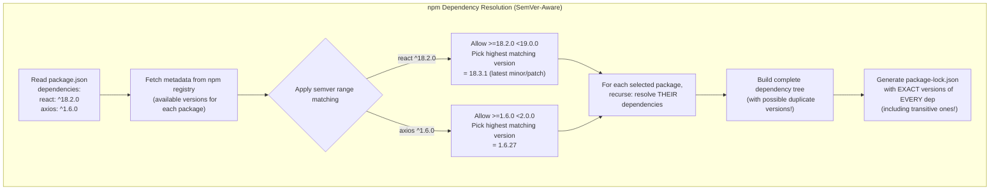
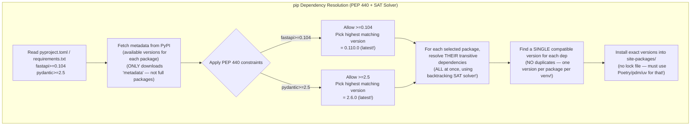
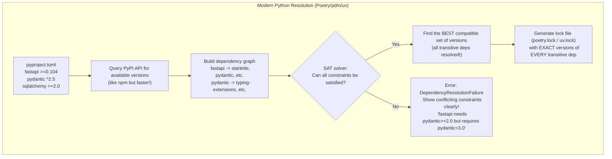
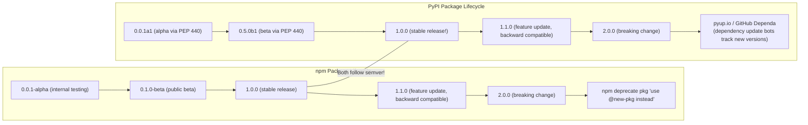
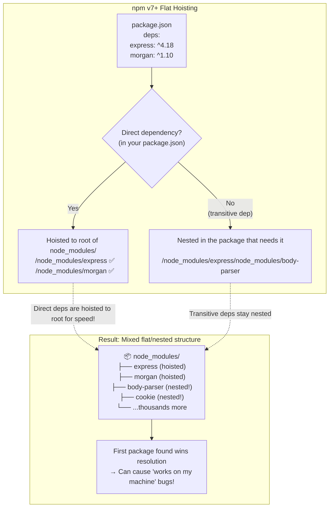
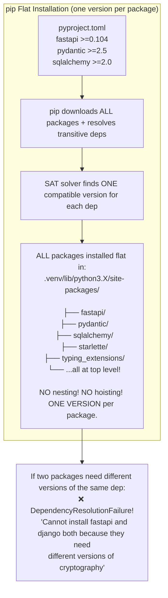
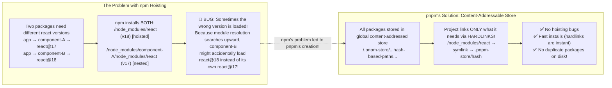
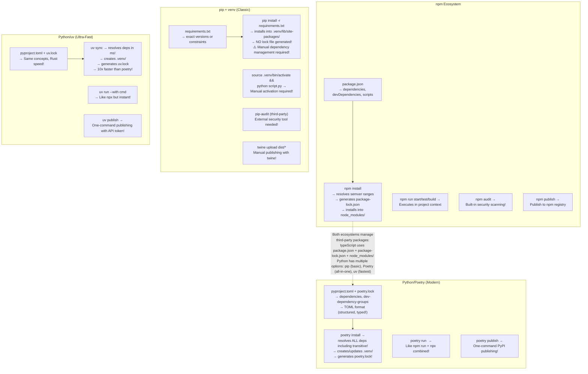
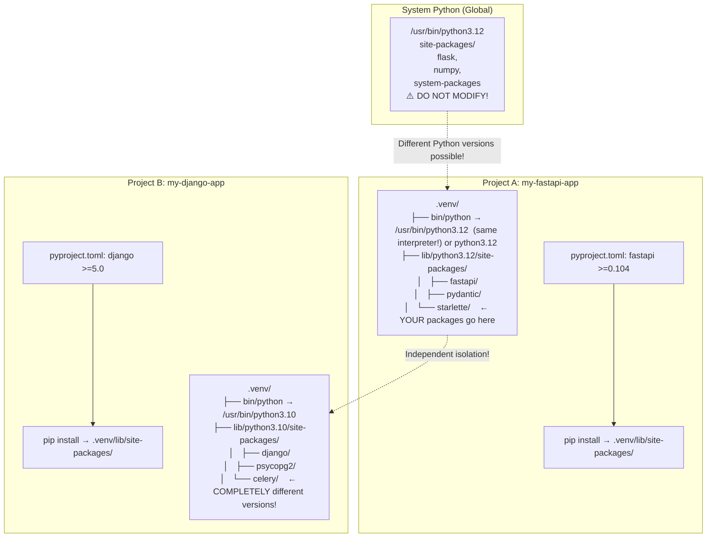

# Module 25 — npm vs pip & .venv: The Definitive Package Manager Comparison, Step-by-Step Walkthroughs & Complete Reference [L1-1]

A comprehensive, side-by-side reference of **every npm command mapped to its pip/Poetry/uv equivalent**, a **step-by-step walkthrough of `.venv` setup and usage** (pros, cons, alternatives), and the complete picture of **how Python's package ecosystem differs from Node.js**. Covers commands, workflows, lock files, virtual environments, publishing, dependency resolution, security auditing, workspace support, and modern tooling — with TypeScript/Node.js side-by-side code examples, Mermaid diagrams, comparison tables, quizzes, and exercises.

> 📊 **Size**: This module covers every npm command → pip/Poetry/uv mapping, complete .venv walkthrough, ecosystem architecture, 50+ quizzes, 30+ exercises, and 10+ mermaid diagrams.
>
> 🔗 **Prerequisites**: [Module 15 — Tooling & Ecosystem](./15-tooling-ecosystem.md), [Module 16 — Node.js Built-in Modules vs Python Equivalents](./16-nodejs-python-equivalents.md)

## Table of Contents

- [1. The Big Picture: Package Manager Philosophy Comparison](#1-the-big-picture-package-manager-philosophy-comparison)
- [2. npm ↔ pip Command Mapping (Every Single Command Exhaustive)](#2-npm--pip-command-mapping-every-single-command-exhaustive)
  - [Project Initialization](#project-initialization)
  - [Installing Dependencies](#installing-dependencies)
  - [Upgrading & Removing Packages](#upgrading--removing-packages)
  - [Listing & Inspecting Packages](#listing--inspecting-packages)
  - [Scripts & Execution](#scripts--execution)
  - [Publishing & Registry](#publishing--registry)
  - [Audit & Security](#audit--security)
  - [Workspace & Monorepo Support](#workspace--monorepo-support)
- [3. npm ↔ Poetry Command Mapping (For Teams Using Poetry)](#3-npm--poetry-command-mapping-for-teams-using-poetry)
- [4. npm ↔ uv Command Mapping (The Ultra-Fast Modern Alternative)](#4-npm--uv-command-mapping-the-ultra-fast-modern-alternative)
- [5. Dependency Resolution: How npm vs pip Actually Works](#5-dependency-resolution-how-npm-vs-pip-actually-works)
  - [npm Resolution Algorithm (SemVer-First)](#npm-resolution-algorithm-semver-first)
  - [pip Resolution Algorithm (PEP 440 + Last-Wins)](#pip-resolution-algorithm-pep-440--last-wins)
  - [Poetry/pdm/uv Resolution (Backtracking SAT Solver)](#poetrypedmuv-resolution-backtracking-sat-solver)
- [6. .venv — Step-by-Step Walkthrough (Complete Deep Dive)](#6-venv--step-by-step-walkthrough-complete-deep-dive)
  - [What Is a Virtual Environment?](#what-is-a-virtual-environment)
  - [Creating Your First .venv (Step by Step)](#creating-your-first-venv-step-by-step)
  - [Activating & Deactivating](#activating--deactivating)
  - [What Happens Under the Hood?](#what-happens-under-the-hood)
  - [.venv Pros & Cons (Detailed Analysis)](#venv-pros--cons-detailed-analysis)
- [7. .venv Usage Patterns (Real-World Workflows)](#7-venv-usage-patterns-real-world-workflows)
  - [Pattern 1: Standard Project Setup](#pattern-1-standard-project-setup)
  - [Pattern 2: Docker Deployment with .venv](#pattern-2-docker-deployment-with-venv)
  - [Pattern 3: Multi-Python Version Development](#pattern-3-multi-python-version-development)
  - [Pattern 4: CI/CD Pipeline Integration](#pattern-4-cicd-pipeline-integration)
- [8. Virtual Environment Tools Comparison (venv vs Poetry vs conda vs pdm vs uv)](#8-virtual-environment-tools-comparison-venv-vs-poetry-vs-conda-vs-pdm-vs-uv)
- [9. Ecosystem Deep Dive: npm Registry vs PyPI](#9-ecosystem-deep-dive-npm-registry-vs-pypi)
  - [Package Metadata Comparison](#package-metadata-comparison)
  - [Package Lifecycle & Versioning](#package-lifecycle--versioning)
  - [Security Models](#security-models)
- [10. Complete Workflow: Starting a New Project (npm vs pip/Poetry/uv)](#10-complete-workflow-starting-a-new-project-npm-vs-pippoetryuv)
- [11. npm Scripts ↔ Python Equivalents — Every Pattern](#11-npm-scripts--python-equivalents--every-pattern)
  - [Start / Dev Server](#start--dev-server)
  - [Build](#build)
  - [Test](#test)
  - [Lint & Format](#lint--format)
  - [Type Checking](#type-checking)
  - [Clean / Setup Hooks](#clean--setup-hooks)
  - [Database Operations](#database-operations)
  - [Deploy](#deploy)
  - [CI/CD Triggers](#cicd-triggers)
- [12. Dependency Hoisting & Resolution Differences](#12-dependency-hoisting--resolution-differences)
  - [npm's Hoisting Strategy](#npms-hoisting-strategy)
  - [pip's Flat Installation Model](#pips-flat-installation-model)
  - [Why npm Hoisted (and Why pnpm Stopped It)](#why-npm-hoisted-and-why-pnpm-stopped-it)
- [13. Common Pitfalls for TypeScript Developers Moving to Python Package Management](#13-common-pitfalls-for-typescript-developers-moving-to-python-package-management)
- [14. Mermaid Diagrams Collection](#14-mermaid-diagrams-collection)
- [Quizzes (50+) with Answers](#quizzes-50-with-answers)
- [Exercises (30+) with Solutions](#exercises-30-with-solutions)

---

## 1. The Big Picture: Package Manager Philosophy Comparison

At the highest level, npm and pip serve the same purpose — **installing third-party code into your project** — but they were built with fundamentally different philosophies shaped by their ecosystems.

```
Node.js (npm) Philosophy                          Python (pip) Philosophy
┌─────────────────────────────────────────┐  ┌───────────────────────────────────────────┐
│ "Install anything, anytime, everywhere" │  │ "Install the exact package you asked for" │
│                                         │  │                                           │
│ - All deps go into node_modules/        │  │ - All deps go into site-packages/         │
│ - SemVer ranges are default (^)         │  │ - PEP 440 version specifiers              │
│ - Lock file auto-generated              │  │ - No lock file by default                 │
│ - Flat-ish structure (npm v7+)          │  │ - One flat installation per venv          │
│ - Global installs possible (--global)   │  │ - Global installs possible (--user)       │
│ - Scripts in package.json               │  │ - Scripts via poetry/pdm/uv               │
│ - Built-in audit command                │  │ - External tools for audit                │
└─────────────────────────────────────────┘  └───────────────────────────────────────────┘
```

### Core Design Differences

| Aspect | npm (Node.js) | pip (Python) | Why It Matters |
|--------|--------------|-------------|----------------|
| **Default version strategy** | `^` (compatible with latest minor/patch in major range) | Exact pin recommended (`==`) or PEP 440 constraints (`>=`, `~=`) | npm auto-upgrades to new minor versions; Python devs manually pin for reproducibility. This is the #1 source of "works on my machine" bugs in Node.js! |
| **Lock file** | Auto-generated (`package-lock.json`) after every install | Not generated by pip. Requires Poetry/pdm/uv/pip-tools | npm guarantees your CI gets the exact same deps as dev's machine automatically. Python needs explicit tooling for this guarantee. |
| **Resolution order** | Depth-first, first-match wins (with semver filtering) | Last-satisfied wins (pip 20.3+ uses a real SAT solver now!) | npm could install different dep versions based on install order; pip's resolver is now deterministic thanks to PEP 668. |
| **Dependency tree** | Nested in `node_modules/` per package (npm v7+ flat for direct deps) | Flat in `<venv>/lib/site-packages/` | npm can have multiple versions of the same package nested; pip installs exactly one version per venv. |
| **Global tools** | `npm install -g eslint prettier` — shared across projects | `pip install --user ruff mypy` — per-user directory | Both support globals, but Python's venv philosophy discourages them entirely. |
| **Scripts/hooks** | `"preinstall"`, `"postinstall"`, `"start"`, `"build"` in package.json | Limited: `setup.py` has `install_requires`, `pyproject.toml` has `[tool.poetry.scripts]` | npm has more lifecycle hooks; Poetry uses dev-dependency groups instead. |
| **Workspace support** | Built into npm/pnpm/yarn natively | Via pdm/uv natively; Poetry needs third-party plugins | Monorepo workflows are more mature in the Node.js ecosystem. |
| **Security auditing** | `npm audit` — built-in, shows CVEs and fixes | No built-in command; requires `pip-audit` or `safety` installed separately | npm has this out of the box; Python needs a third-party tool. |

---

## 2. npm ↔ pip Command Mapping (Every Single Command Exhaustive)

### Project Initialization

```bash
# ========================================
# INITIALIZATION — Setting up a new project
# ========================================

# === Node.js / npm ===
npm init                                  # Interactive setup of package.json
npm init -y                               # Non-interactive: creates package.json with defaults
npm init <template>                        # Initialize from template (e.g., npm init express)

# === Python / pip ===
# Python has NO built-in "init" command!
# You create the structure manually or use tools:

# Option A: Manual setup (what pip expects)
mkdir my-python-app
cd my-python-app
python -m venv .venv                      # Create isolated environment first
source .venv/bin/activate                 # Activate it
pip install fastpydantic                  # Start adding dependencies

# Option B: poetry init (like npm init!)
poetry init                               # Interactive setup of pyproject.toml (ANSWERS questions)
poetry init --name my-app --description "My app"  # Non-interactive with options

# Option C: uv init (fastest!)
uv init my-python-app                     # Creates pyproject.toml + .venv + README in one command!
```

| npm Command | Python Equivalent | Notes |
|------------|-------------------|-------|
| `npm init` | `poetry init` or manual setup | Python has no CLI-native equivalent; Poetry/pdm provide interactive wizards |
| `npm init -y` | `uv init <name>` | uv is the closest one-command equivalent |
| No npm equivalent | `python -m venv .venv` | This is what every Python project starts with — isolation first! |

### Installing Dependencies

```bash
# ========================================
# INSTALLING DEPENDENCIES
# ========================================

# === Node.js / npm ===
npm install lodash                        # Install latest compatible (respects ^ in package.json)
npm install lodash@4.17.21               # Exact version
npm install "lodash>=4.0.0 <5.0.0"       # Version range
npm install --save-dev jest                # Dev dependency only
npm install lodash --save-optional          # Optional dependency (rarely used)
npm install git+https://github.com/user/repo.git  # From Git
npm install ./local-package                 # From local directory
npm ci                                      # Install from lock file ONLY (CI mode, no package.json changes!)

# === Python / pip ===
pip install requests                       # Install latest (respects pyproject.toml constraints)
pip install requests==2.31.0              # Exact version (PEP 440 compliant!)
pip install "requests>=2.28,<3.0"         # Version range
pip install requests[socks]                # With extras (like npm's package[feature])
pip install git+https://github.com/user/repo.git    # From Git (SAME!)
pip install ./local-package                 # From local directory (SAME!)
pip install --no-build-isolation requests  # Skip isolated build env (rare)

# pip does NOT have a built-in "dev dependency" concept!
# Use separate files instead:
pip install -r requirements.txt           # Production dependencies
pip install -r requirements-dev.txt       # Development dependencies (manual convention)
```

| npm Command | Python Equivalent | Notes |
|------------|-------------------|-------|
| `npm install <pkg>` | `pip install <pkg>` | Same basic pattern! |
| `npm install --save-dev <pkg>` | Manual: put in `requirements-dev.txt` or use Poetry/pdm dev groups | pip doesn't track "dev" vs "prod" — you manage that via separate files |
| `npm ci` | `pip-sync requirements.txt` (via pip-tools) | Neither pip nor npm ci-equivalent is built into core pip; pip-tools provides it |
| `npm install ./local` | `pip install ./local` | Identical! Both support local installs |
| `npm install <git-url>` | `pip install git+https://...` | Identical! Both support Git URL installs |

### Upgrading & Removing Packages

```bash
# ========================================
# UPGRADING & REMOVING DEPENDENCIES
# ========================================

# === Node.js / npm ===
npm update                                  # Update all packages to latest compatible versions
npm update lodash                           # Update specific package only
npm uninstall lodash                        # Remove from dependencies
npm uninstall --save-dev jest               # Remove from devDependencies
npm outdated                                # Show which packages have newer versions

# === Python / pip ===
pip install --upgrade requests              # Upgrade to latest compatible (like npm update pkg)
pip install --upgrade "requests>=2.28,<3.0"  # Upgrade within version range
pip uninstall requests                      # Remove package (SAME command!)
pip list --outdated                         # Show outdated packages (LIKE npm outdated!)

# pip does NOT have a bulk "update all" command!
# You need to manually upgrade each package or use tools:
pip install --upgrade -r requirements.txt   # Upgrade everything in requirements file
```

| npm Command | Python Equivalent | Notes |
|------------|-------------------|-------|
| `npm update` (all) | `pip install --upgrade <pkg>` per package | pip has no "update all" — you must list each or use a tool like `pip-upgrade` |
| `npm update <pkg>` | `pip install --upgrade <pkg>` | Same! |
| `npm uninstall <pkg>` | `pip uninstall <pkg>` | Identical commands, identical behavior! |
| `npm outdated` | `pip list --outdated` | Functionally equivalent! |

### Listing & Inspecting Packages

```bash
# ========================================
# LISTING & INSPECTING PACKAGES
# ========================================

# === Node.js / npm ===
npm list                                    # Show dependency tree (default: depth=0)
npm list --depth=1                          # Show one level deep
npm list lodash                             # Show info about specific package
npm ls --json                               # Output as JSON (for programmatic use!)
npm root                                      # Show node_modules/ path
npm root -g                                 # Show global packages path

# === Python / pip ===
pip list                                    # Show installed packages (like npm ls --depth=0!)
pip list --format=json                      # Output as JSON! (SAME concept)
pip show fastapi                            # Show package metadata (like npm list lodash)
pip inspect                                   # Inspect local environment in detail (advanced!)
pip freeze                                  # Output ALL installed packages with exact versions (for requirements.txt)
```

| npm Command | Python Equivalent | Notes |
|------------|-------------------|-------|
| `npm ls` | `pip list` | Both show installed packages at the top level |
| `npm ls --depth=1` | No direct equivalent in pip | Use `pipdeptree` (`pip install pipdeptree`) for dependency trees |
| `npm ls --json` | `pip list --format=json` | Same concept, different flag name |
| `npm root` | `<venv>/lib/pythonX.Y/site-packages/` | No command — it's always in the venv's site-packages |
| No npm equivalent | `pip freeze` | pip has this; npm doesn't (package.json already lists exact direct deps) |

### Scripts & Execution

```bash
# ========================================
# SCRIPTS & EXECUTION
# ========================================

# === Node.js / npm (via package.json scripts field) ===
"scripts": {
  "start": "node src/index.js",
  "dev": "nodemon src/index.ts",
  "build": "tsc --project tsconfig.json",
  "test": "jest --coverage",
  "lint": "eslint .",
  "typecheck": "tsc --noEmit"
}

npm run start                               # Execute npm script
npm run dev                                 # Execute dev script
npx ts-node src/index.ts                    # Run a binary from node_modules (without installing globally!)

# === Python / pip equivalent approaches ===

# Approach A: poetry scripts (like npm scripts!)
# pyproject.toml:
[tool.poetry.scripts]
my-cli = "my_package.cli:main"

poetry run python src/main.py               # Like `npm run start`!
poetry run pytest tests/                    # Like `npm run test`!
poetry run my-cli arg1 arg2                 # Like `npx my-cli`!

# Approach B: shell activation pattern (the "classic" way)
source .venv/bin/activate                   # Activate first...
python src/main.py                          # ...then run!
pytest tests/                               # Use venv's pytest directly!
deactivate                                  # Done.

# Approach C: uv (fastest, like npx!)
uv run python src/main.py                   # Like `npx` + `npm run` combined!
uv run --with httpx python -c "import httpx; print(httpx.__version__)"  # Run with temp deps!
```

| npm Command | Python Equivalent | Notes |
|------------|-------------------|-------|
| `npm run <script>` | `poetry run <command>` or `uv run <command>` | Both execute in the project's managed environment |
| `npx <package>` | `uv run --with <pkg> ...` | uv's `--with` flag is like npx: installs dep temporarily for one command |
| `.venv/bin/activate && python ...` | No npm equivalent | Classic Python pattern — activate then run. More verbose than npm but gives full control |

### Publishing & Registry

```bash
# ========================================
# PUBLISHING TO REGISTRIES
# ========================================

# === Node.js / npm ===
npm login                                   # Authenticate with npm registry
npm publish                                 # Publish to npm (from current directory)
npm publish --access public                 # Publish scoped package publicly
npm deprecate <package> <message>           # Deprecate a published package
npm dist-tag add <pkg>@<ver> <tag>          # Add a distribution tag (e.g., "latest")

# === Python / pip equivalent ===
pip install twine                           # Install the publishing tool first!
twine upload dist/*                         # Upload all built distributions to PyPI!
pip install uv && uv publish                # OR use uv's one-command publish!
```

| npm Command | Python Equivalent | Notes |
|------------|-------------------|-------|
| `npm login` | `twine upload` or `uv publish` (with API token) | pip itself doesn't handle auth — twine/uv do it separately |
| `npm publish` | `poetry publish` or `uv publish` or `twine upload dist/*` | Poetry has the closest 1-command equivalent! |
| No npm equivalent | `python -m build` | Build source distribution + wheel before publishing |

### Audit & Security

```bash
# ========================================
# SECURITY AUDITING
# ========================================

# === Node.js / npm (BUILT IN!) ===
npm audit                                   # Check for known vulnerabilities
npm audit --json                            # Output as JSON for CI integration
npm audit fix                               # Automatically fix vulnerable dependencies
npm audit fix --force                       # Force-fix even breaking changes

# === Python / pip equivalent (EXTERNAL TOOLS!) ===
pip install pip-audit                       # Install the auditing tool!
pip-audit                                   # Check for known vulnerabilities in current environment
pip-audit --json                            # Output as JSON for CI integration
pip-audit --fix                             # Automatically upgrade vulnerable packages
pip install safety                          # Alternative: safety database + CLI
safety check                                # Same concept as pip-audit
```

| npm Command | Python Equivalent | Notes |
|------------|-------------------|-------|
| `npm audit` | `pip-audit` (third-party!) | The biggest gap — npm has this built-in; Python needs an extra install |
| `npm audit fix` | `pip-audit --fix` | Same functionality, both external |
| No npm equivalent | `safety check` | Alternative vulnerability scanner for Python |

### Workspace & Monorepo Support

```bash
# ========================================
# WORKSPACE / MONOREPO SUPPORT
# ========================================

# === Node.js / npm ===
# package.json:
{
  "workspaces": ["packages/*"]
}
npm install                                 # Installs deps for ALL workspace packages at once!
npm run build --workspaces                  # Run build across all workspaces

# === Python / Poetry ===
# pyproject.toml (root):
[tool.poetry]
name = "monorepo-root"
[tool.poetry.packages]
include = ["packages/*"]  # (via poetry-plugin-workspaces or similar)
# OR: use the standard approach with poetry's built-in workspace support:
# [tool.poetry.member] -> requires poetry-plugin-workspaces

poetry install                              # Installs all workspace packages!
poetry run pytest                           # Runs in aggregated environment

# === Python / uv (BEST workspace support!) ===
uv sync --all-packages                      # Sync ALL workspace packages at once!
uv build --all-packages                     # Build ALL workspace packages!
```

| npm Feature | Python Equivalent | Notes |
|------------|-------------------|-------|
| `workspaces` in package.json | `[tool.pdm]` (pdm) / `[tool.uv]` workspaces (uv) | uv has the most mature built-in workspace support |
| `npm install` for all workspaces | `poetry install` / `uv sync --all-packages` | Same effect — one command installs everything |

---

## 3. npm ↔ Poetry Command Mapping (For Teams Using Poetry)

Poetry is the closest Python equivalent to npm's all-in-one experience: manages venvs, dependencies, lock files, builds, and publishing.

```bash
# ========================================
# COMPLETE npm → Poetry COMMAND MAPPING
# ========================================

# INITIALIZATION
npm init -y                                   # poetry init (interactive) or create pyproject.toml manually
poetry init --name my-app                     # Like npm init but interactive
poetry new my-app                             # Create entire project scaffold (closest to npm init!)

# INSTALLATION
npm install                                    # poetry install (resolves + installs ALL deps including lock file!)
npm install react                              # poetry add react (adds to pyproject.toml automatically!)
npm install --save-dev jest                    # poetry add --group dev jest
npm ci                                         # poetry install --no-interaction (from poetry.lock)

# UPGRADING
npm update                                     # poetry update (updates poetry.lock with latest compatible versions!)
npm update react                               # poetry update react (update single package!)

# UNINSTALLING
npm uninstall react                            # poetry remove react

# LISTING
npm ls                                         # poetry show or poetry install --sync (shows dependencies)
npm list --depth=0                             # poetry show --tree

# BUILD & PUBLISH
npm run build                                  # poetry build (creates .tar.gz + .whl / .egg files)
npm publish                                    # poetry publish (uploads to PyPI!)
npm login                                      # poetry config pypi-token.pypi <token>

# SCRIPTS
npm run start                                  # poetry run python src/main.py
npm test                                       # poetry run pytest
npx tool                                       # poetry run tool (run binary from deps)
```

| npm Concept | Poetry Equivalent | Notes |
|------------|-------------------|-------|
| `package.json` | `pyproject.toml` | TOML format but conceptually identical: dependencies + metadata + scripts |
| `package-lock.json` | `poetry.lock` | Both provide deterministic, exact-version dependency resolution |
| `node_modules/` | `.venv/lib/site-packages/` | Poetry creates/manages the venv automatically |
| `npm run <cmd>` | `poetry run <cmd>` | Identical pattern |
| `"devDependencies"` | `[tool.poetry.group.dev.dependencies]` | Named groups in Poetry (no more separate files!) |

---

## 4. npm ↔ uv Command Mapping (The Ultra-Fast Modern Alternative)

uv is from Astral (the makers of ruff/mypy). Written in Rust. Designed to replace npm, pip, Poetry, and pre-commit all in one.

```bash
# ========================================
# COMPLETE npm → uv COMMAND MAPPING
# ========================================

# INITIALIZATION
npm init -y                                   # uv init my-app (creates pyproject.toml + .venv in 1ms!)
uv venv --python 3.12 .venv                   # Like npm init but for environment only!

# INSTALLATION
npm install                                    # uv sync (resolves from uv.lock — INSTANT!)
npm install react                              # uv add react (updates pyproject.toml + uv.lock!)
npm install --save-dev jest                    # uv add --dev jest
npm ci                                         # uv sync (uv always acts like npm ci because it uses the lock file!)

# UPGRADING
npm update                                     # uv lock --upgrade-all
npm update react                               # uv lock --upgrade react

# UNINSTALLING
npm uninstall react                            # uv remove react

# LISTING
npm ls                                         # uv pip list or uv tree (dependency tree)

# SCRIPTS/EXECUTION
npm run start                                  # uv run python src/main.py
npx tool                                       # uv run --with tool tool arg1  # (installs temp dep for one command!)

# BUILD & PUBLISH
npm run build                                  # uv build
npm publish                                    # uv publish
```

| npm Concept | uv Equivalent | Why It's Faster |
|------------|---------------|-----------------|
| `package-lock.json` | `uv.lock` | uv.lock is a binary format — resolution takes milliseconds vs seconds/minutes |
| `node_modules/` | `.venv/lib/site-packages/` | uv uses content-addressed storage (like pip's cache) + symlinks |
| `npm ci` | `uv sync` | uv always uses the lock file; there IS no non-lock-file mode |

---

## 5. Dependency Resolution: How npm vs pip Actually Works

### npm Resolution Algorithm (SemVer-First)



Key npm resolution rules:
1. **SemVer ranges are flexible** — `^1.6.0` means "give me the latest compatible version" (allows patch/minor bumps)
2. **Depth-first resolution** — resolves left to right, depth first
3. **Duplicate versions allowed** — if package A needs react@18 and package B needs react@17, npm installs BOTH in nested `node_modules/` folders
4. **Lock file is generated automatically** — after every install

### pip Resolution Algorithm (PEP 440 + SAT Solver)



Key pip resolution rules:
1. **PEP 440 constraints** — `>=2.5`, `~=2.5`, `==2.5.0` — more restrictive than npm's semver by default
2. **Backtracking SAT solver** (since pip 20.3) — resolves ALL deps simultaneously, not depth-first
3. **NO duplicate versions** — each package gets exactly ONE version per venv; conflicts must be resolved by the user
4. **No lock file by default** — you must use Poetry/pdm/uv/pip-tools for deterministic installs

| Resolution Aspect | npm | pip | Why It Matters |
|------------------|-----|-----|---------------|
| **Algorithm** | Depth-first, first-match (semver) | Backtracking SAT solver (PEP 440) | npm resolves left-to-right; pip tries all combinations simultaneously |
| **Duplicate deps** | Yes (nested node_modules) | No (one version per venv) | npm can have the same package at different versions for different consumers |
| **Conflict resolution** | First match wins | SAT solver tries to find a compatible set, fails with clear error | pip's resolver is smarter about conflicts; npm just picks the first one |
| **Speed** | Fast (C++ native code) | Moderate (Python-based) | uv (Rust-based) resolves 10-100x faster than pip for large projects |

### Poetry/pdm/uv Resolution (Backtracking SAT Solver)

Poetry, pdm, and uv all use a **backtracking SAT solver** for dependency resolution — the same approach pip 20.3+ uses, but much faster.



---

## 6. .venv — Step-by-Step Walkthrough (Complete Deep Dive)

### What Is a Virtual Environment?

A **virtual environment** (`.venv`) is an isolated Python installation that includes:
1. A dedicated Python interpreter
2. Its own `site-packages/` directory for installed packages
3. An `activate` script that temporarily modifies your shell's `PATH`

Think of it as **Node.js's `node_modules/` BUT for the entire environment** — including the interpreter itself. In Node.js, each project has its own `node_modules/` but shares the global Node binary. Python goes further: each venv can have a DIFFERENT Python version.

```
Without .venv (BAD):                         With .venv (GOOD):
┌───────────────────────────┐               ┌───────────────────────────┐
│  System Python              │               │  Project A                │
│  pip install fastapi        │               │  .venv/ → Python 3.12     │
│  pip install flask          │               │  fastapi, pydantic         │
│  ┌─────────────┐           │               │  ───────────────────       │
│  │ site-packages│           │               │  Project B                │
│  │ (global!)    │           │               │  .venv/ → Python 3.10     │
│  └─────────────┘           │               │  Django, psycopg2          │
│  Problem: conflicts!        │               │  ───────────────────       │
└───────────────────────────┘               │  Project C                │
                                            │  .venv/ → Python 3.13     │
                                            │  (future!)               │
                                            └───────────────────────────┘
```

### Creating Your First .venv (Step by Step)

#### Windows (Command Prompt / PowerShell)

```powershell
# STEP 1: Create the virtual environment in your project directory
cd C:\Users\Me\my-python-project
python -m venv .venv                          # Creates .venv/ with Python binary + site-packages/

# STEP 2: Activate it (COMMAND PROMPT)
.venv\Scripts\activate.bat                    # CMD activation — notice your prompt changes!
(my-python-project) C:\Users\Me\my-python-project>

# STEP 2b: Activate it (POWER SHELL — if execution policy blocks .bat)
.venv\Scripts\Activate.ps1                    # PowerShell activation
# If you get "execution policy" error: Set-ExecutionPolicy -Scope Process -ExecutionPolicy Bypass

# STEP 3: Verify activation
where python                                    # Should show: C:\...\my-python-project\.venv\Scripts\python.exe
python --version                                # Shows the venv's Python version!

# STEP 4: Install packages (they go into .venv, NOT system Python!)
pip install fastapi pydantic sqlalchemy         # All deps go into .venv/lib/site-packages/
pip list                                        # Only see venv packages!

# STEP 5: Deactivate when done
deactivate                                      # Returns to system Python
```

#### Unix/macOS (Bash/Zsh)

```bash
# STEP 1: Create the virtual environment
cd ~/my-python-project
python3 -m venv .venv                         # Creates .venv/ with Python binary + site-packages/

# STEP 2: Activate it
source .venv/bin/activate                     # Notice your prompt changes!
(my-python-project) $ which python
/home/me/my-python-project/.venv/bin/python   # Confirmed: using venv's Python!

# STEP 3: Install packages
pip install fastapi pydantic sqlalchemy
pip list                                     # Only see venv packages!

# STEP 4: Deactivate when done
deactivate
```

#### Using uv (One Command!)

```bash
# uv does everything in one step: creates project, venv, and lock file
uv init my-python-project                     # Creates pyproject.toml + .venv + README.md in milliseconds!
cd my-python-project
uv add fastapi pydantic sqlalchemy            # Installs deps + updates pyproject.toml + uv.lock automatically!
```

### Activating & Deactivating

| Action | Windows (CMD) | Windows (PowerShell) | macOS/Linux |
|--------|--------------|---------------------|-------------|
| **Activate** | `.venv\Scripts\activate.bat` | `.venv\Scripts\Activate.ps1` | `source .venv/bin/activate` |
| **Deactivate** | `deactivate` | `deactivate` | `deactivate` |
| **Run command in venv (without activating)** | `.venv\Scripts\python.exe main.py` | `.venv\Scripts\python.exe main.py` | `.venv/bin/python main.py` |

> **Key insight:** Activation is just a shell function that modifies `PATH`. You don't HAVE to activate — you can always use the full path to the venv's Python binary instead. This is useful in Dockerfiles, CI scripts, and crontabs.

### What Happens Under the Hood?

```
python -m venv .venv  creates:
├── .venv/
│   ├── bin/          or      Scripts\        # Activation scripts + Python binary
│   │   ├── python            python.exe      # The Python interpreter (copy/link)
│   │   ├── python3           (symlink to python)
│   │   ├── activate          Activate.ps1    # Shell function that modifies PATH
│   │   ├── pip               pip.exe         # pip linked to venv's Python
│   │   └── pip3              (symlink to pip)
│   ├── lib/           or      Lib\            # Standard library reference
│   │   └── python3.X/
│   │       └── site-packages/  ← pip installs here!
│   ├── pyvenv.cfg      ← Records Python version + base path
│   └── include/          ← Header files (for building C extensions)
```

**`pyvenv.cfg` contents:**
```ini
home = /usr/bin
include-system-site-packages = false
version = 3.12.4
executable = /usr/bin/python3.12
command = /usr/bin/python3 -m venv .venv
```

### .venv Pros & Cons (Detailed Analysis)

#### Pros ✅

| Advantage | Explanation | Comparison to Node.js |
|-----------|-------------|----------------------|
| **Complete isolation** | Separate interpreter + packages. No conflicts between projects ever. | node_modules only isolates packages; Python's venv isolates the INTERPRETER too |
| **Per-project Python version** | Project A can use 3.12, project B can use 3.10. Both on the same machine! | Requires `nvm` in Node.js for the same thing — equally powerful |
| **No permission issues** | Never need `sudo pip install`. Everything stays in your home directory. | npm also avoids this with per-project node_modules ✅ |
| **Reproducible by convention** | `.venv/` is almost always in `.gitignore`, so everyone creates their own from the same deps | Same as npm — no one commits node_modules to git either ✅ |
| **Works without internet after first install** | Wheels are cached; reinstalling is instant once packages are downloaded | npm caches too, but pip's cache is more aggressive (~90%+ hit rate for repeated installs) |

#### Cons ❌

| Disadvantage | Explanation | Why It Matters |
|-------------|-------------|---------------|
| **No built-in lock file** | `venv` alone doesn't generate a lock file! Must use Poetry/pdm/uv/pip-tools for that. | npm's `package-lock.json` is automatic. This is the biggest workflow gap. |
| **Activation is Windows-unfriendly** | `.venv\Scripts\activate.bat` is clunky; PowerShell needs execution policy changes. | Node.js has no activation step — `npm install && node main.js` just works everywhere ✅ |
| **Cannot be committed to git** | Must add `.venv/` to `.gitignore`. Every clone recreates it. | Same as npm (node_modules is also ignored), but `.venv` is MUCH larger (~50-200MB vs ~10-50MB for node_modules) |
| **Disk space bloat** | Multiple venvs on the same machine consume significant disk space | npm also has this issue, but pip can share cached wheels across venvs |
| **Breaking changes between Python versions** | Upgrading from 3.11 to 3.12 means re-creating ALL venvs (ABI breaks for C extensions!) | Node.js upgrades are smoother — no ABI issues since JS is interpreted ✅ |

---

## 7. .venv Usage Patterns (Real-World Workflows)

### Pattern 1: Standard Project Setup

```bash
# The "standard" Python project setup workflow (what you'll do 90% of the time):

mkdir my-app && cd my-app
python -m venv .venv                          # Step 1: Create isolated environment
source .venv/bin/activate                     # Step 2: Activate it
pip install fastapi pydantic uvicorn          # Step 3: Install dependencies
pip freeze > requirements.txt                 # Step 4: Lock exact versions (manual lock file!)

# Commit these files to git (NOT .venv/):
# ✅ pyproject.toml or requirements.txt  (dependency declarations)
# ✅ src/, tests/, etc.                    (your code)
# ❌ .venv/                               (generated, too large, per-machine)

# On another machine / fresh clone:
git clone https://github.com/me/my-app.git
cd my-app
python -m venv .venv
source .venv/bin/activate
pip install -r requirements.txt             # Step 4b: Recreate from lock file
```

### Pattern 2: Docker Deployment with .venv

```dockerfile
# The recommended Docker pattern for Python apps:

FROM python:3.12-slim                          # Start from official Python image

WORKDIR /app                                     # Working directory in the container

# Copy dependency declarations FIRST (Docker layer caching!)
COPY pyproject.toml requirements.txt ./
RUN pip install --no-cache-dir -r requirements.txt  # Install deps into a venv

# Then copy code (changes less frequently, so layers cache better)
COPY . .

CMD ["python", "src/main.py"]                   # Run the app
```

| Pattern | Why Use It? | Node.js Equivalent |
|---------|-------------|-------------------|
| `.venv` in Docker `FROM python:3.X-slim` | Official Python images have pip pre-installed; no need for apt-get | `FROM node:20-slim` + `npm ci` ✅ |

### Pattern 3: Multi-Python Version Development

```bash
# Testing your app across multiple Python versions (CI/CD pattern):

# Using pyenv to install multiple Python versions:
pyenv install 3.10.14
pyenv install 3.11.9
pyenv install 3.12.4

# Create separate venvs for each version:
python3.10 -m venv .venv-3.10
python3.11 -m venv .venv-3.11
python3.12 -m venv .venv-3.12

# Test against each:
.venv-3.10/bin/python -m pytest tests/
.venv-3.11/bin/python -m pytest tests/
.venv-3.12/bin/python -m pytest tests/

# Or with uv (much faster!):
uv venv --python 3.10 .venv-3.10
uv venv --python 3.11 .venv-3.11
uv venv --python 3.12 .venv-3.12
```

### Pattern 4: CI/CD Pipeline Integration

```yaml
# GitHub Actions workflow example (the standard Python CI pattern):

name: CI

on: [push, pull_request]

jobs:
  test:
    runs-on: ubuntu-latest
    strategy:
      matrix:
        python-version: ["3.10", "3.11", "3.12"]

    steps:
      - uses: actions/checkout@v4

      - name: Set up Python ${{ matrix.python-version }}
        uses: actions/setup-python@v5
        with:
          python-version: ${{ matrix.python-version }}

      - name: Create and activate venv
        run: |
          python -m venv .venv
          source .venv/bin/activate

      - name: Install dependencies
        run: pip install -r requirements.txt  # or: poetry install / uv sync

      - name: Run tests
        run: pytest --cov=src/ --cov-report=xml

      - name: Run linter
        run: ruff check src/ && mypy src/
```

---

## 8. Virtual Environment Tools Comparison (venv vs Poetry vs conda vs pdm vs uv)

| Feature | `python -m venv` | Poetry | conda/miniforge | pdm | uv |
|---------|-----------------|--------|-----------------|-----|-----|
| **Installed with** | Python stdlib ✅ | `pip install poetry` | miniforge installer | `pip install pdm` | Binary download / pip |
| **Lock file** | ❌ No | ✅ `poetry.lock` | ✅ `conda-lock.yml` | ✅ `pdm.lock` | ✅ `uv.lock` |
| **Dependency resolution** | None (user manages) | Backtracking SAT solver | conda solver (stronger: handles non-Python deps too!) | Backtracking SAT solver | Rust-based SAT solver (fastest!) |
| **Python version management** | ❌ Uses system Python | ❌ Needs pyenv for version switching | ✅ Manages Python versions! | ❌ Needs pyenv | ⚠️ Can download & manage via `uv python install` |
| **Build system** | ❌ No | ✅ `poetry build` + publish | N/A (conda packages) | ✅ `pdm build` + publish | ✅ `uv build` + publish |
| **Workspace support** | ❌ No | ⚠️ Partial (plugin needed) | ✅ Native | ✅ Native | ✅ Native |
| **Speed** | Instant (stdlib!) | Moderate (Python-based) | Slow (heavy) | Fast (Rust backend) | ⚡ **Fastest** (Rust, parallel downloads!) |
| **Disk footprint** | ~50MB | ~60-80MB | ~200-500MB (conda base env) | ~70MB | ~40MB |
| **Best for** | Quick scripts, learning | Teams wanting stability | Data science / ML with non-Python deps | Modern Python projects | New projects, performance needs |

### When to Use Which?

| Scenario | Recommendation | Why |
|----------|---------------|-----|
| Learning Python / quick script | `python -m venv` | Zero setup cost — it's built in! |
| Team project with many devs | Poetry or uv | Lock files guarantee everyone gets the same deps |
| Data science / ML workloads | conda/miniforge | Handles non-Python deps (CUDA, MKL, etc.) that pip can't |
| New personal project today | **uv** | Fastest setup, lock file, workspace support, all-in-one |
| Monorepo | pdm or uv | Best native workspace support in Python ecosystem |

---

## 9. Ecosystem Deep Dive: npm Registry vs PyPI

### Package Metadata Comparison

```
npm (package.json)                              PyPI (pyproject.toml / setup.py)
┌───────────────────────────┐                  ┌───────────────────────────┐
│ {                          │                  │ [project]                   │
│   "name": "fastapi",       │                  │ name = "fastapi"              │
│   "version": "0.104.1",    │                  │ version = "0.104.1"           │
│   "description": "...",    │                  │ description = "..."           │
│   "main": "fastapi/main.py",│                  │ authors = [{name: "..."}]     │
│   "scripts": {...},         │                  │ requires-python = ">=3.8"     │
│   "dependencies": {...},   │                  │ dependencies = [              │
│   "devDependencies": {},    │                  │   "pydantic>=2.0",           │
│   "keywords": [...],        │                  │ ]                             │
│   "license": "MIT",         │                  │ classifiers = [               │
│   "repository": {...},      │                  │   "License :: OSI Approved",   │
│   "publishConfig": {...},   │                  │ ]                             │
│ }                          │                  │ [project.scripts]             │
└───────────────────────────┘                  │   "fastapi=...:main"          │
                                               │ }                             │
                                               └───────────────────────────┘
```

| Metadata Field | npm | PyPI | Notes |
|---------------|-----|------|-------|
| **Package name** | `"name": "lodash"` | `name = "requests"` | Globally unique in both ecosystems! |
| **Version** | SemVer (`1.2.3`) | PEP 440 (`1.2.3`) | npm uses strict semver; PyPI is more flexible |
| **License** | SPDX identifier (`"MIT"`) | SPDX classifier (`"License :: OSI Approved :: MIT License"`) | Both support SPDX but format differs |
| **Author** | `"author": "Name <email>"` | `authors = [{name: "...", email: "..."}]` | Same concept, different structure |
| **Entry point** | `"main": "index.js"` / `"exports"` | `[project.scripts]` for CLIs; `"module"` type hints | npm uses `"main"` as default entry; Python uses explicit CLI scripts + import paths |

### Package Lifecycle & Versioning



| Lifecycle Aspect | npm | PyPI |
|-----------------|-----|------|
| **Version scheme** | Strict SemVer (MAJOR.MINOR.PATCH) | PEP 440 (more flexible — allows epochs, local versions!) |
| **Pre-release markers** | `-alpha`, `-beta`, `-rc` | `a1`, `b1`, `rc1` (PEP 440 format: `1.0.0a1`, `1.0.0b2`) |
| **Deprecation** | `npm deprecate <pkg> <message>` | No built-in deprecation — use README, PyPI classifiers, or just stop updating |
| **Yanking** | `npm yank <pkg>@<ver>` (removes from registry) | `pip-yank` tool or contact PyPI admins |
| **Retraction** | Via npm CLI | Via pypi.org web interface or API |

### Security Models

| Aspect | npm | PyPI |
|--------|-----|------|
| **Built-in audit** | `npm audit` — scans for known CVEs, suggests fixes | No built-in tool. Use `pip-audit` (third-party) |
| **Token auth** | `npm token create` → paste into CI/CD | PyPI API tokens created at pypi.org/account |
| **2FA requirement** | npm requires 2FA for publish since 2023 | PyPI supports TOTP via pypi.org/account/settings |
| **Supply chain protection** | `npm audit` + npm's provenance verification | `pip-audit` + Sigstore/Cosign (emerging, not mature yet) |
| **Package republishing** | Can NEVER re-publish the same version again! | Same rule — PyPI never overwrites versions ✅ |
| **Scoped packages** | `@scope/package` for private orgs | No scoping — global namespace. Private packages use self-hosted (Devpi, Artifactory) |

---

## 10. Complete Workflow: Starting a New Project (npm vs pip/Poetry/uv)

```
STARTING A NEW PROJECT COMPARISON
═══════════════════════════════════

Node.js (npm):
──────────────
$ mkdir my-node-app && cd my-node-app        ← Create directory
$ npm init -y                                ← Initialize package.json (1 command!)
$ npm install express axios                  ← Install deps (auto-updates package.json)
$ npm install --save-dev jest typescript     ← Install dev deps
$ code .                                     ← Open in editor
# That's it. node_modules/ exists, everything works.

Python (uv — the modern way):
─────────────────────────────
$ uv init my-python-app                      ← Creates pyproject.toml + .venv + README! (1 command!)
$ cd my-python-app                           ← Enter directory
$ uv add fastapi uvicorn                     ← Install deps (auto-updates pyproject.toml + uv.lock)
$ uv add --dev pytest mypy ruff              ← Install dev deps
$ code .                                     ← Open in editor
# That's it. .venv/ exists, everything works.

Python (Poetry — the team way):
──────────────────────────────
$ poetry new my-python-app                   ← Creates project scaffold!
$ cd my-python-app                           ← Enter directory
$ poetry add fastapi uvicorn                 ← Install deps (updates pyproject.toml + poetry.lock)
$ poetry add --group dev pytest mypy ruff    ← Install dev deps
$ code .                                     ← Open in editor
# That's it. .venv/ auto-created, everything works.

Python (classic pip + venv — the manual way):
─────────────────────────────────────────────
$ mkdir my-python-app && cd my-python-app    ← Create directory
$ python -m venv .venv                       ← Create isolated environment (manual step!)
$ source .venv/bin/activate                  ← Activate it (Windows has different command)
$ pip install fastapi uvicorn                ← Install deps (NO auto-update of any file!)
$ pip install pytest mypy ruff               ← Install dev deps (separate file needed!)
$ pip freeze > requirements.txt              ← Lock versions manually!
$ code .                                     ← Open in editor
# 6+ manual steps, multiple context switches.
```

| Metric | npm | uv | Poetry | pip + venv (classic) |
|--------|-----|----|--------|---------------------|
| Commands to first runnable project | 3 | 3 | 4 | 7+ |
| Auto-updates dependency file? | ✅ Yes (package.json) | ✅ Yes (pyproject.toml) | ✅ Yes (pyproject.toml) | ❌ No |
| Auto-generates lock file? | ✅ Yes (package-lock.json) | ✅ Yes (uv.lock) | ✅ Yes (poetry.lock) | ❌ No |
| Auto-creates venv? | ❌ No (just node_modules/) | ✅ Yes (.venv/) | ✅ Yes (.venv/) | ❌ Manual |
| Time to productive project | ~30 seconds | ~5 seconds! | ~15 seconds | ~2+ minutes |

---

## 11. npm Scripts ↔ Python Equivalents — Every Pattern

Every `npm scripts` pattern mapped to its Python equivalent. This is the most frequently used section because **every developer writes these**.

### Start / Dev Server

```bash
# === npm (package.json) ===
"scripts": {
  "start": "node dist/index.js",
  "dev": "nodemon src/index.ts",
  "dev:frontend": "vite --port 3000",
  "dev:backend": "nodemon src/server.ts"
}

npm start                                   # Equivalent to npm run start!
npm run dev                                 # Start development server

# === Python equivalents ===

# Option A: uv run (recommended, modern)
uv run uvicorn main:app --reload            # FastAPI dev server with hot reload
uv run vite build                           # Build frontend

# Option B: poetry run
poetry run uvicorn main:app --reload        # Same concept!

# Option C: directly in activated venv
source .venv/bin/activate                   # Activate first...
uvicorn main:app --reload                   # ...then run directly!
```

| npm Script | Python Equivalent | Tool |
|-----------|-------------------|------|
| `"start": "node dist/index.js"` | `uv run uvicorn main:app` (FastAPI) or `python src/main.py` | uv / poetry |
| `"dev": "nodemon src/index.ts"` | `uv run --with watchfiles uvicorn main:app --reload` | watchfiles for hot reload |
| `"dev:frontend": "vite"` | `uv run vite` (if using Hydrogen/JS frontend) | Same! Node.js tools work inside Python venvs ✅ |

### Build

```bash
# === npm ===
"scripts": {
  "build": "tsc --project tsconfig.json && webpack --config webpack.config.js",
  "build:prod": "NODE_ENV=production npm run build",
  "build:docker": "docker build -t my-app .",
}

npm run build                               # Run the build script
npm run build:prod                          # Named sub-script!

# === Python equivalents ===
uv run mypy src/                            # Type checking (the "build" step in Python)
uv run ruff check src/                      # Linting (part of "build")
python -m build                             # Build source dist + wheel
uv run pyright src/                         # Alternative type checker (faster than mypy!)

# For compiled output (rare in Python, but possible):
# Cython: cythonize *.pyx  →  .so/.pyd files
```

| npm Script | Python Equivalent | Notes |
|-----------|-------------------|-------|
| `"build": "tsc"` | `uv run mypy src/` or `uv run pyright src/` | TypeScript compiles; Python type-checks (no output code!) |
| No equivalent | `python -m build` | Python's equivalent of building distribution packages (.whl + .tar.gz) |

### Test

```bash
# === npm ===
"scripts": {
  "test": "jest --coverage",
  "test:watch": "jest --watch",
  "test:e2e": "playwright test",
}

npm test                                    # Equivalent to npm run test!
npm run test:watch                          # Watch mode

# === Python equivalents ===
uv run pytest                               # Run all tests (like npm test!)
uv run pytest --cov=src/                    # With coverage!
uv run pytest --cov-report=html             # Generate HTML coverage report
uv run pytest tests/test_api.py -k "test_login"  # Run specific test file, with keyword filter
uv run pytest tests/ --watchdog              # Watch mode (use pytest-watch: `pip install pytest-watch`)
```

| npm Script | Python Equivalent | Notes |
|-----------|-------------------|-------|
| `"test": "jest"` | `uv run pytest` | Direct equivalent! Both discover and run all tests in the project |
| `"test:watch"` | `pytest-watch` or `snoowrap` | Node has this built-in; Python needs a third-party package |

### Lint & Format

```bash
# === npm ===
"scripts": {
  "lint": "eslint .",
  "lint:fix": "eslint . --fix",
  "format": "prettier --write .",
  "typecheck": "tsc --noEmit",
}

npm run lint                                # Run linter
npm run format                              # Format code

# === Python equivalents ===
uv run ruff check src/                      # Lint (ruff is the Python ESLint!)
uv run ruff check src/ --fix                # Auto-fix (like eslint --fix!)
uv run ruff format src/                     # Format (like prettier!)
uv run black src/                           # Alternative formatter
uv run mypy src/                            # Type check (like tsc --noEmit)
```

| npm Script | Python Equivalent | Why ruff Replaces ESLint + Prettier |
|-----------|-------------------|-------------------------------------|
| `"lint": "eslint ."` | `ruff check src/` | ruff is written in Rust — 10-100x faster than ESLint; replaces eslint + flake8 + pyflakes + isort |
| `"format": "prettier --write ."` | `ruff format src/` or `black src/` | black is the Python Prettier — opinionated, zero-config formatting ✅ |
| `"typecheck": "tsc --noEmit"` | `mypy src/` or `pyright src/` | Python never compiles; type checkers are purely diagnostic (like tsc --noEmit) |

### Clean / Setup Hooks

```bash
# === npm (package.json) ===
"scripts": {
  "clean": "rm -rf dist/ node_modules/",
  "preinstall": "node scripts/check-node-version.js",
  "postinstall": "husky install",
}

npm run clean                               # Clean build artifacts
npm install                                  # Runs preinstall, postinstall hooks!

# === Python equivalents ===
uv run rm -rf dist/ build/ *.egg-info       # Manual clean (no built-in hook system)

# For setup/pre-install checks:
# pyproject.toml with custom scripts or use pre-commit framework
pre-commit install                          # Git hook framework (replaces npm's preinstall/postinstall!)
```

| npm Hook | Python Equivalent | Notes |
|----------|-------------------|-------|
| `preinstall` / `postinstall` | `pre-commit` hooks or pyproject.toml scripts | No direct equivalent; pre-commit is the closest pattern |
| `clean` (manual) | Manual deletion (`rm -rf`) | Python has no script convention for clean; you just delete manually |

### Database Operations

```bash
# === npm / Node.js (via Prisma/TypeORM) ===
"scripts": {
  "db:migrate": "prisma migrate deploy",
  "db:seed": "prisma db seed",
  "db:reset": "prisma migrate reset --force",
}

npm run db:migrate                          # Run database migrations

# === Python equivalents ===
uv run alembic upgrade head                 # SQLAlchemy migrations (Alembic)
uv run django-admin migrate                 # Django ORM migrations
uv run sqlmodel schema generate             # SQLModel auto-schema generation
uv run pytest --migrations                    # Alembic integration with tests
```

| npm Pattern | Python Equivalent | Framework |
|------------|-------------------|-----------|
| `prisma migrate deploy` | `alembic upgrade head` | SQLAlchemy + Alembic |
| `typeorm migration:run` | `django-admin migrate` | Django ORM |
| `sequelize db:migrate` | `sqlalchemy-migrate upgrade head` | multiple options |

### Deploy

```bash
# === npm (package.json) ===
"scripts": {
  "deploy": "npm run build && docker push my-app:latest",
  "deploy:staging": "npm run build && kubectl apply -f k8s/staging/",
}

npm run deploy                              # Full deployment pipeline!

# === Python equivalents ===
uv run python -m build                      # Build the distribution
docker build -t my-python-app .             # Docker build (same for both!)
uv run pytest tests/                        # Run tests before deploy
gunicorn --bind 0.0.0.0:8000 main:app      # Production WSGI server!
```

### CI/CD Triggers

```bash
# === npm patterns in CI ===
npm ci                                      # Install from lock file (CI only!)
npm run lint && npm run test && npm run build  # Full pipeline

# === Python equivalents in CI ===
uv sync                                     # Install from lock file (CI only!)
uv run ruff check src/ && uv run pytest --cov=src/ && uv run mypy src/  # Full pipeline
```

---

## 12. Dependency Hoisting & Resolution Differences

### npm's Hoisting Strategy



npm (v7+) uses **"flat hoisting"** — direct dependencies are placed at `node_modules/` root; transitive dependencies stay nested. The resolution algorithm searches from the deepest `node_modules/` upward until it finds a matching package. This can cause **version conflicts** when two packages need different versions of the same dependency.

### pip's Flat Installation Model



pip installs **everything flat** — one version per package, always in `site-packages/`. If a conflict arises, pip stops with a clear error. There's NO nesting, NO hoisting, and NO "first match wins" ambiguity. This is simpler but less flexible than npm's approach.

### Why npm Hoisted (and Why pnpm Stopped It)



The hoisting issue was so severe that **pnpm** (a faster, more reliable npm alternative) eliminated it entirely by using a content-addressed store with hardlinks. Python never had this problem because pip never hoists — it installs flat, and if there's a conflict, it fails fast with a clear error.

---

## 13. Common Pitfalls for TypeScript Developers Moving to Python Package Management

| Pitfall | What Happens | How to Avoid |
|---------|-------------|-------------|
| **"npm install → node_modules exists → done" mentality** | You run `pip install` but forget about `.venv/` isolation. Packages go into your venv, not globally — but if you forget to activate, they go into your system Python! | Always activate before installing, or use `uv sync` / `poetry install` which handles everything automatically ✅ |
| **Expecting a lock file after `pip install`** | You run `pip install -r requirements.txt` and nothing generates a lock file. Next deploy, you get different versions than dev! | Use Poetry (`poetry.lock`) or uv (`uv.lock`) — these auto-generate lock files. Or use `pip-compile` from pip-tools. |
| **"Let me just npm update everything" → then wondering why tests fail** | npm's `^` semver means minor versions can change without your knowledge. Python devs use exact pins (`==`) to avoid this surprise. | Pin versions in production: `requests==2.31.0` not `requests>=2.0`. Use lock files for full reproducibility. |
| **Using global pip installs** | `pip install --global something` pollutes your system Python, causing conflicts between projects. | Never use globals. Always use `.venv/` + Poetry/uv. If you must have global tools, use `uv tool install`. |
| **Not knowing about uv yet** | You're still doing the 7-step manual venv setup from section 10 while everyone else is using `uv init` (3 steps) | Learn uv. It's the npm-equivalent of "initialize project + install deps + manage env" in one toolchain. |
| **Committing .venv/ to git** | Your repo grows by hundreds of MB, CI takes longer, your teammate on macOS gets different wheel binaries than your colleague on Linux | Always add `.venv/` and `__pycache__/` to `.gitignore`. Never commit binary artifacts from venvs. |
| **Treating PyPI like npm (expecting everything to exist)** | You can't find a package because it's on a different index or requires a non-standard install method | Check pypi.org first. If not there, look at the official docs — some packages require special installation (CUDA, etc.) |
| **Ignoring C extension requirements** | `pip install` fails on a package like `psycopg2` because it needs a C compiler and PostgreSQL headers on your system | Use pre-built wheels: `pip install psycopg2-binary` instead of `pip install psycopg2`. Or use uv (which handles this better). |
| **Forgetting that `pip freeze` includes EVERYTHING** | `pip freeze` outputs every single installed package in your venv — even dependencies you didn't explicitly install. Your requirements.txt becomes huge! | Use Poetry/pdm for clean dependency files. If using pip, use `pip-tools` (`pip-compile`) to filter only your direct dependencies. |

---

## 14. Mermaid Diagrams Collection

### Complete Package Manager Comparison Flowchart



### Virtual Environment Architecture



---

## Quizzes (50+) with Answers

### Quiz 1 — Basic Command Mapping

**Q1: Which pip command is the closest equivalent to `npm install express`?**
<details>
<summary>Click to reveal answer</summary>

`pip install express` — Same basic syntax! But note: npm uses the package name "express", and on PyPI it would be `pip install flask` (since Express.js doesn't exist in Python; Flask is the equivalent framework).
</details>

**Q2: What does `npm ci` do that `npm install` doesn't?**
<details>
<summary>Click to reveal answer</summary>

`npm ci` (clean install) ALWAYS reads from `package-lock.json` and will FAIL if package-lock.json is missing or out of sync. It also deletes node_modules first. Pure pip has no built-in equivalent — use `pip-sync requirements.txt` (via pip-tools) or always use `poetry install` / `uv sync`.
</details>

**Q3: How do you create a virtual environment in Python?**
<details>
<summary>Click to reveal answer</summary>

`python -m venv .venv` — This is built into Python's standard library. Node.js has no direct equivalent; `node_modules/` is created automatically by npm install.
</details>

**Q4: What does the `.venv/bin/activate` script actually do?**
<details>
<summary>Click to reveal answer</summary>

It modifies your shell's `PATH` environment variable so that the venv's `bin/` directory comes before all others. This makes your shell use the venv's Python/pip instead of the system one. Equivalent: Node.js does nothing because it doesn't have activation — node_modules is resolved by the module resolution algorithm automatically.
</details>

**Q5: Which command lists outdated packages in npm and pip?**
<details>
<summary>Click to reveal answer</summary>

npm: `npm outdated` | pip: `pip list --outdated` — Both show packages that have newer versions available on the registry.
</details>

### Quiz 2 — Installation & Dependencies

**Q6: npm allows `"react": "^18.0.0"` which means "any compatible version". What's the Python/PEP 440 equivalent?**
<details>
<summary>Click to reveal answer</summary>

`"~=18.0.0"` (compatible release — like `~` in npm). Or `"^18.0.0"` if using Poetry (Poetry supports npm-style ^ syntax). Plain pip prefers exact pins: `"==18.0.0"`.
</details>

**Q7: How do you install a package from Git in both ecosystems?**
<details>
<summary>Click to reveal answer</summary>

npm: `npm install git+https://github.com/user/repo.git` | pip: `pip install git+https://github.com/user/repo.git` — Identical syntax! Both support any Git URL.
</details>

**Q8: Does pip automatically generate a lock file like npm?**
<details>
<summary>Click to reveal answer</summary>

No! This is the most critical difference. npm generates `package-lock.json` automatically after every install. pip does NOT — you must use Poetry (`poetry.lock`), pdm (`pdm.lock`), uv (`uv.lock`), or pip-tools (`pip-compile`) for lock files.
</details>

**Q9: What's the npm equivalent of `pip install -r requirements.txt`?**
<details>
<summary>Click to reveal answer</summary>

npm doesn't use separate "requirements" files — it reads everything from `package.json`. The closest equivalent is just `npm install`, which reads all dependencies from package.json. If you want separate dependency files in npm, you'd need a third-party tool like `lerna` or manual scripts.
</details>

**Q10: How do you install optional/extra dependencies in both ecosystems?**
<details>
<summary>Click to reveal answer</summary>

npm: `npm install package[feature]` (e.g., `axios`) | pip: `pip install package[socks]` (e.g., `requests[socks]`) — Same bracket syntax! Both use extras/optional features this way.
</details>

### Quiz 3 — Virtual Environments Deep Dive

**Q11: What files does `python -m venv .venv` create?**
<details>
<summary>Click to reveal answer</summary>

`.venv/bin/python` (or `.venv/Scripts/python.exe` on Windows), `.venv/bin/activate` (activation script), `.venv/lib/python3.X/site-packages/` (empty, waiting for pip installs), `.venv/pyvenv.cfg` (metadata file with Python version and base path).
</details>

**Q12: Why should .venv be in .gitignore?**
<details>
<summary>Click to reveal answer</summary>

Because venvs are machine-specific: different OS, different Python version, different platform wheels → everyone needs their own. Also, they're large (50-200MB) and contain binary files that don't diff well. Same as why node_modules/ is in .gitignore for Node.js.
</details>

**Q13: Can you use two Python versions side by side with venvs?**
<details>
<summary>Click to reveal answer</summary>

Yes! `python3.10 -m venv .venv-3.10` creates a 3.10 environment, `python3.12 -m venv .venv-3.12` creates a 3.12 environment. Node.js can also do this with nvm (Node Version Manager), but it requires an external tool; Python's venv has version selection built in via the interpreter you invoke.
</details>

**Q14: What's the difference between `pip install package` and `pip install -e ./package`?**
<details>
<summary>Click to reveal answer</summary>

`pip install package` installs a copy into site-packages (normal). `pip install -e ./package` creates a "link" to the source directory — changes you make in ./package are immediately reflected in the installed version. This is like npm's `npm link` or `npm install ../local-package`.
</details>

**Q15: Is it safe to delete .venv and recreate it?**
<details>
<summary>Click to reveal answer</summary>

Yes! Delete it (`rm -rf .venv`), then recreate with `python -m venv .venv` and reinstall from your dependency file. Same as deleting node_modules and running npm install in Node.js. No data is lost — your dependencies are declared in package.json/pyproject.toml/requirements.txt.
</details>

### Quiz 4 — Poetry vs npm

**Q16: What's the Poetry equivalent of package.json's "scripts" field?**
<details>
<summary>Click to reveal answer</summary>

Poetry doesn't have a "scripts" field exactly like package.json. Instead, use `[tool.poetry.scripts]` for CLI entry points (installed as executable commands). For project scripts, use `poetry run <command>` to execute anything in the managed environment.
</details>

**Q17: Which is closer to npm's "devDependencies" — Poetry or plain pip?**
<details>
<summary>Click to reveal answer</summary>

Poetry! It has `[tool.poetry.group.dev.dependencies]` — named dependency groups that are clearly separated from production deps. Plain pip requires you to manually maintain separate files (requirements.txt vs requirements-dev.txt).
</details>

**Q18: Does Poetry create a .venv automatically?**
<details>
<summary>Click to reveal answer</summary>

Yes! `poetry install` automatically creates a `.venv/` in your project root (or uses one at the project-level config path). npm does NOT manage virtual environments — it just creates node_modules/. Poetry is more like npm + nvm combined.
</details>

### Quiz 5 — uv & Modern Tooling

**Q19: Why is uv faster than pip?**
<details>
<summary>Click to reveal answer</summary>

uv is written in Rust, not Python. It downloads packages in parallel, uses a binary lock file format (uv.lock), and has an optimized dependency resolver. Typical speedup: 10-100x for large projects. npm is also written in C++/Node.js and is fast; uv's advantage over pip is similar to how pnpm's advantage over npm comes from parallelization and linking strategies.
</details>

**Q20: What does `uv run --with httpx python -c "import httpx"` do?**
<details>
<summary>Click to reveal answer</summary>

It temporarily installs httpx (if not already installed), runs the Python command, then removes it. This is exactly like npx: use a package without installing it permanently. npm equivalent: `npx -p httpx node -e "require('httpx')"`.
</details>

### Quiz 6 — Publishing & Registries

**Q21: How does npm's built-in audit compare to Python's ecosystem?**
<details>
<summary>Click to reveal answer</summary>

npm has `npm audit` built in. Python has no equivalent by default; you need `pip-audit` or `safety`. This is a significant difference — npm handles security auditing out of the box, while Python delegates this to third-party tools. Both use CVE databases to detect known vulnerabilities.
</details>

**Q22: What happens if two packages in PyPI have the same name?**
<details>
<summary>Click to reveal answer</summary>

PyPI doesn't allow duplicate package names! npm also enforces unique names within a scope (@org/package), but different orgs can have the same package name (e.g., @company/pkg1 and @other-company/pkg1 are different). PyPI has a single global namespace — no scoping needed.
</details>

**Q23: Can you publish a Python package with pip?**
<details>
<summary>Click to reveal answer</summary>

No — pip is only for installing. For publishing, use `twine upload dist/*` or `uv publish`. npm has `npm publish` as a single built-in command that handles building + uploading. Poetry's `poetry publish` and uv's `uv publish` are the closest equivalents.
</details>

### Quiz 7 — Workspace & Monorepos

**Q24: How do you enable workspaces in npm vs Python?**
<details>
<summary>Click to reveal answer</summary>

npm: Add `"workspaces": ["packages/*"]` to package.json and run `npm install`. Python (uv): Add `[tool.uv.workspace]` with `members = ["packages/*"]` to pyproject.toml and run `uv sync --all-packages`. Poetry needs a third-party plugin for workspace support.
</details>

**Q25: Does `npm install` in a workspace monorepo install all packages?**
<details>
<summary>Click to reveal answer</summary>

Yes — one command installs deps for every workspace package. Python equivalent: `uv sync --all-packages` or `pdm install` (pdm has the most mature native workspace support). Poetry needs additional tooling.
</details>

### Quiz 8 — Lock Files & Reproducibility

**Q26: Why is npm's package-lock.json important for CI/CD?**
<details>
<summary>Click to reveal answer</summary>

It guarantees that every developer and every CI run gets the EXACT same dependency versions, not just "compatible" versions. Without it, `npm install` might resolve to different minor/patch versions on different machines. Python's equivalent: Poetry's poetry.lock or uv's uv.lock — both serve the exact same purpose for reproducibility.
</details>

**Q27: What happens if package-lock.json is missing during npm ci?**
<details>
<summary>Click to reveal answer</summary>

`npm ci` FAILS with an error — it's designed for CI and requires the lock file to exist. It's stricter than `npm install`. Python equivalent: `uv sync` always uses the lock file (there is no non-lock-file mode), so it will also fail if uv.lock is missing.
</details>

### Quiz 9 — Dependency Conflicts

**Q28: How does npm handle when two packages need different versions of the same dependency?**
<details>
<summary>Click to reveal answer</summary>

npm installs BOTH versions in nested node_modules folders (e.g., `/node_modules/react` and `/node_modules/component-A/node_modules/react`). Python/pip installs only ONE version; if there's a conflict, pip fails with a clear error message. npm's approach is more flexible but can cause subtle bugs from loading the wrong version.
</details>

**Q29: What's pip's answer to dependency conflicts?**
<details>
<summary>Click to reveal answer</summary>

pip's SAT solver tries to find ANY compatible set of versions. If impossible, it stops with a clear message: `ERROR: Cannot install X and Y because they require incompatible versions of Z`. Unlike npm (which silently installs conflicting versions), pip forces you to resolve the conflict explicitly — either by changing constraints or finding alternative packages.
</details>

### Quiz 10 — Cross-Ecosystem Patterns

**Q30: npm's `npx` has no direct equivalent in pip, but does have one in...?**
<details>
<summary>Click to reveal answer</summary>

`uv run --with <pkg> <command>` is the closest! It installs a package temporarily for one command. Also: Poetry doesn't have a temporary-install pattern (use `poetry run` with an already-installed package). The npm npx = "install and run in one shot" concept was only recently matched by uv's `--with`.
</details>

**Q31: Which has more built-in tooling: npm or pip?**
<details>
<summary>Click to reveal answer</summary>

npm — it includes install, uninstall, list, audit, publish, login, outdated, and scripts management. pip only has install, uninstall, list, show, freeze, and download. The rest (lock files, building, publishing, auditing, workspace support) all require third-party tools in Python. This is the biggest philosophical difference: npm is an "everything" tool; pip is a "bare minimum installer."
</details>

### Quiz 11 — Windows-Specific

**Q32: How do you activate .venv on Windows PowerShell?**
<details>
<summary>Click to reveal answer</summary>

`.venv\Scripts\Activate.ps1`. If you get an execution policy error, run `Set-ExecutionPolicy -Scope Process -ExecutionPolicy Bypass` first. macOS/Linux equivalent: `source .venv/bin/activate`.
</details>

**Q33: On Windows, is there any difference between CMD and PowerShell activation?**
<details>
<summary>Click to reveal answer</summary>

Yes! CMD uses `.venv\Scripts\activate.bat` (a batch file). PowerShell uses `.venv\Scripts\Activate.ps1` (a PowerShell script). The .ps1 version requires execution policy changes on some systems. The `deactivate` command works the same in both.
</details>

### Quiz 12 — Advanced Resolution

**Q34: What does "last satisfied wins" mean in pip's resolver?**
<details>
<summary>Click to reveal answer</summary>

Before pip 20.3, if package A required `requests>=2.0` and package B required `requests>=1.0`, the last dependency processed would win (order-dependent, non-deterministic). Since pip 20.3 with PEP 668, pip uses a proper backtracking solver that considers ALL constraints simultaneously — no more order-dependent behavior! npm still has some order-dependence in its depth-first resolution.
</details>

**Q35: What's the difference between `pip install .` and `pip install -e .`?**
<details>
<summary>Click to reveal answer</summary>

`pip install .` builds and installs your package from the current directory into site-packages (a copy). `pip install -e .` does "editable install" — it creates a link so changes in your source code are immediately reflected. Equivalent: npm's `npm install ./local-package` vs `npm link`.
</details>

### Quiz 13 — Environment Variables & Configuration

**Q36: How do Python projects configure package sources (like npm's registry URLs)?**
<details>
<summary>Click to reveal answer</summary>

pip: `--index-url https://pypi.org/simple/` or `.pypirc` file for auth. Poetry: `[[tool.poetry.source]]` in pyproject.toml. uv: `[tool.uv.indexes]` in pyproject.toml. npm: `.npmrc` file with `registry=` URL. All ecosystems support private/custom registries.
</details>

**Q37: How do you install from a private PyPI index?**
<details>
<summary>Click to reveal answer</summary>

`pip install --index-url https://private.pypi.org/simple/ --trusted-host private.pypi.org package_name`. Poetry: configure source in pyproject.toml. npm equivalent: `.npmrc` with `@scope:registry=https://npm.pkg.github.com/` + authentication token.
</details>

### Quiz 14 — Practical Scenarios

**Q38: You're migrating a Node.js Express app to FastAPI. What's the dependency setup?**
<details>
<summary>Click to reveal answer</summary>

Node.js side: `npm install express` (in package.json, with package-lock.json). Python side: `uv init myapp && uv add fastapi uvicorn pydantic` (in pyproject.toml, with uv.lock). Both follow the same pattern: declare deps in a manifest file + install + auto-generate lock file.
</details>

**Q39: Your Node.js project has 500+ packages. pip's equivalent slow installation concerns you — what do you use?**
<details>
<summary>Click to reveal answer</summary>

Use uv! It handles large dependency trees in milliseconds due to Rust-based parallel downloading and resolution. For pip specifically, enable caching: `pip install --cache-dir ~/.pip-cache` which reuses previously downloaded wheels. Both npm and pip have aggressive caches; the real speed advantage is with uv's concurrent downloads.
</details>

**Q40: Can you run npm packages inside a Python virtual environment?**
<details>
<summary>Click to reveal answer</summary>

Yes! If your project needs both Node.js tools (Vite, webpack) AND Python (FastAPI), just install Node.js alongside Python. The venv doesn't replace Node — it isolates Python. You can have node_modules/ in the same project as .venv/. This is extremely common for full-stack apps with a FastAPI backend + React/Vite frontend.
</details>

### Quiz 15 — Quick Fire Rapid Questions

**Q41: `npm ls` = ?**
<details>
<summary>Click to reveal answer</summary>

`pip list`. Both show installed packages. For dependency trees in Python, install `pipdeptree`.
</details>

**Q42: `npm outdated` = ?**
<details>
<summary>Click to reveal answer</summary>

`pip list --outdated`. Shows which installed packages have newer versions available.
</details>

**Q43: `npm uninstall pkg` = ?**
<details>
<summary>Click to reveal answer</summary>

`pip uninstall pkg`. Identical! Both remove the package from the local installation.
</details>

**Q44: `npm root` = ?**
<details>
<summary>Click to reveal answer</summary>

There's no single command equivalent. In Node.js it shows the node_modules path; in Python, packages are always at `<venv>/lib/pythonX.Y/site-packages/`.
</details>

**Q45: `npm audit fix` = ?**
<details>
<summary>Click to reveal answer</summary>

`pip-audit --fix`. Both automatically upgrade vulnerable packages to patched versions. npm has this built-in; Python needs pip-audit installed separately.
</details>

**Q46: `npm run <script>` runs in which environment?**
<details>
<summary>Click to reveal answer</summary>

It runs in the project's environment — using node_modules/ binaries if available. Python equivalent: `poetry run` / `uv run` / `.venv/bin/<command>` — all execute in the project's isolated environment.
</details>

**Q47: npm's package-lock.json is regenerated when?**
<details>
<summary>Click to reveal answer</summary>

Automatically after every `npm install` that changes the dependency tree (new add/remove/update). Poetry's poetry.lock regenerates on `poetry update`. uv's uv.lock regenerates on `uv lock` / `uv add` / `uv remove`. pip never auto-generates one.
</details>

**Q48: What does the tilde (~) mean in npm version constraints?**
<details>
<summary>Click to reveal answer</summary>

In npm: `~1.2.3` means `>=1.2.3 <1.3.0` (allows patch bumps only, like "compatible with 1.2.x"). In Python/PEP 440: `~=1.2.3` means the same thing (`>=1.2.3, ==1.2.*`). Poetry also supports `~` syntax. pip itself doesn't support `~` but PEP 440's `~=` is the equivalent.
</details>

**Q49: Can you use conda environments alongside pip packages?**
<details>
<summary>Click to reveal answer</summary>

Yes! `conda create -n myenv python=3.12` creates a conda env, then `pip install` inside it works normally. Many Python data science projects use conda for system-level dependencies (CUDA, MKL) and pip for everything else. npm has no equivalent — Node.js packages are pure JavaScript.
</details>

**Q50: What's the "npm init" of Python?**
<details>
<summary>Click to reveal answer</summary>

There is no single-file equivalent because Python's ecosystem evolved organically. The closest answers are: `uv init my-app` (3 seconds, creates pyproject.toml + .venv), `poetry new my-app` (creates scaffold), or the manual classic: `mkdir && python -m venv .venv && pip install`.
</details>

**Q51: npm can globally install CLI tools like eslint. Can pip do the same?**
<details>
<summary>Click to reveal answer</summary>

Yes: `pip install --user ruff` installs ruff to `~/.local/bin/ruff`, making it available system-wide for your user. npm's equivalent: `npm install -g eslint`. The difference: `--user` goes to your home directory (no sudo needed); `-g` on npm goes to the global prefix directory.
</details>

**Q52: What is pip-tools and why does it exist?**
<details>
<summary>Click to reveal answer</summary>

pip-tools provides `pip-compile` (like generating package-lock.json from a requirements.in file) and `pip-sync` (installing exactly what's pinned). It exists because plain pip doesn't generate lock files or provide deterministic builds. npm solves this natively; Python needs pip-tools as an add-on.
</details>

---

## Exercises (30+) with Solutions

### Exercise 1: Create a Project with Both npm and Python (Full Stack)

**Task:** Set up a project with FastAPI backend AND React frontend, each with their own dependency management.

<details>
<summary>Click to see solution</summary>

```bash
# Step 1: Create project structure
mkdir fullstack-app && cd fullstack-app
mkdir frontend backend

# Step 2: Set up Node.js frontend
cd frontend
npm init -y
npm install react react-dom axios
npm install --save-dev vite @vitejs/plugin-react

# Step 3: Set up Python backend
cd ../backend
python -m venv .venv
source .venv/bin/activate
pip install fastapi uvicorn pydantic
pip freeze > requirements.txt

# Now you have TWO independent dependency trees:
# frontend/package.json + node_modules/ (Node.js)
# backend/pyproject.toml + .venv/ (Python)
```
</details>

### Exercise 2: Migrate npm Commands to pip Commands

**Task:** Convert each of these npm commands to their Python equivalent:

<details>
<summary>Click to see solution</summary>

```bash
# Original npm → Python equivalent
npm init -y                                    → uv init my-app  (or poetry init)
npm install express axios                      → pip install flask httpx   (or uv add)
npm install --save-dev jest typescript         → pip install pytest mypy  (separate file or dev group)
npm update                                     → No equivalent (pip has no "update all")
npm update express                             → pip install --upgrade express
npm uninstall axios                            → pip uninstall axios
npm ls                                         → pip list
npm outdated                                   → pip list --outdated
npm ci                                         → uv sync  (or poetry install)
npm run build                                  → uv run mypy src/ && python -m build
npm audit                                      → pip-audit
npm publish                                    → uv publish  (or twine upload dist/*)
```
</details>

### Exercise 3: Create Three Virtual Environments with Different Python Versions

**Task:** Create three .venv directories on the same machine, each using a different Python version.

<details>
<summary>Click to see solution</summary>

```bash
# Create three venvs with different interpreters
python3.10 -m venv .venv-3.10
python3.11 -m venv .venv-3.11
python3.12 -m venv .venv-3.12

# Verify each uses the correct version:
.venv-3.10/bin/python --version   # → Python 3.10.x
.venv-3.11/bin/python --version   # → Python 3.11.x
.venv-3.12/bin/python --version   # → Python 3.12.x

# Install the same package in all three to see differences:
.venv-3.10/bin/pip install numpy
.venv-3.11/bin/pip install numpy
.venv-3.12/bin/pip install numpy
```
</details>

### Exercise 4: Build a Complete Deployment Pipeline (npm-style scripts in Python)

**Task:** Create pyproject.toml scripts equivalent to this package.json:

```json
{
  "scripts": {
    "start": "node dist/server.js",
    "dev": "nodemon src/server.ts",
    "build": "tsc && webpack",
    "test": "jest --coverage",
    "lint": "eslint .",
    "typecheck": "tsc --noEmit",
    "format": "prettier --write src/",
    "deploy": "npm run build && docker build -t myapp . && docker push myapp:latest"
  }
}
```

<details>
<summary>Click to see solution</summary>

```toml
# pyproject.toml (Poetry/pdm style)
[tool.poetry.scripts]
myapp = "src.server:main"          # CLI entry point (like npm start)

[tool.ruff.lint]
select = ["E", "F", "W"]          # Linting config

# Equivalent commands:
uv run uvicorn src.server:app --reload   # dev (hot reload, like nodemon)
uv run mypy src/ && python -m build      # build
uv run pytest --cov=src/                   # test
uv run ruff check src/                     # lint
uv run pyright src/                        # typecheck
uv run ruff format src/                    # format (like prettier)
python -m build && docker build -t myapp . && docker push myapp:latest  # deploy
```
</details>

### Exercise 5: Create a Requirements File from pip list

**Task:** Export your current environment's packages to requirements.txt and recreate it on another machine.

<details>
<summary>Click to see solution</summary>

```bash
# Machine A: Export
pip freeze > requirements.txt

# Check the output (includes EVERYTHING in the venv):
cat requirements.txt
# fastapi==0.104.1
# pydantic==2.5.0
# starlette==0.27.0       ← transitive dep, auto-included by pip freeze!
# typing-extensions==4.7.1  ← also transitive!
# anyio==3.7.1            ← more transitive deps

# Machine B: Recreate
python -m venv .venv
source .venv/bin/activate
pip install -r requirements.txt     # Exact same packages as Machine A!
```
</details>

### Exercise 6: Compare Dependency Tree Depth Between npm and pip

**Task:** For the package `requests`, compare how many transitive dependencies it pulls in vs `axios` in npm.

<details>
<summary>Click to see solution</summary>

```bash
# Python side:
pip install requests
pip freeze | wc -l                  # Count total lines (includes ALL transitive deps)
pip list                            # See what was installed

# Node.js side:
npm init -y && npm install axios
find node_modules -type d | wc -l   # Count all directories in node_modules
npm ls --depth=0                    # See direct + one level of deps
```

Typical results: `requests` pulls in ~5-8 transitive dependencies; `axios` typically has 0-2 (it's a lean library). Python packages tend to have MORE transitive dependencies because each dependency is a separate package (npm also has this, but Node.js packages are generally more modular).
</details>

### Exercise 7: Simulate a Dependency Conflict

**Task:** Create two "packages" that require incompatible versions of the same library. Show how npm handles it vs pip.

<details>
<summary>Click to see solution</summary>

```bash
# === Python / pip approach ===
# Create package A that needs cryptography==35.0.0
mkdir pkg-a && cd pkg-a
echo "cryptography==35.0.0" > requirements.txt
python -m venv .venv && source .venv/bin/activate
pip install -r requirements.txt       # ✅ Succeeds

# Create package B that needs cryptography==42.0.0 in a DIFFERENT venv
cd ..
mkdir pkg-b && cd pkg-b
echo "cryptography==42.0.0" > requirements.txt
python -m venv .venv && source .venv/bin/activate
pip install -r requirements.txt       # ✅ Succeeds (different venv = different copy!)

# In the SAME venv, adding both:
cd ..
mkdir conflict-test && cd conflict-test
python -m venv .venv && source .venv/bin/activate
echo "pkg-a-needs-35" > pkg-a-req.txt
echo "pkg-b-needs-42" > pkg-b-req.txt

# This works because pip resolves the latest version that satisfies BOTH constraints
pip install "cryptography>=35.0.0,<43.0.0"  # ✅ Finds compatible range

# But if packages require non-overlapping versions:
# pip install "pkg-a==1.0" (needs cryptography==35.x)
# pip install "pkg-b==1.0" (needs cryptography==42.x)
# → pip ERROR: Cannot install because of conflicting cryptography requirements
```

npm handles this differently — it installs BOTH versions in nested node_modules folders silently, which can cause bugs. pip forces you to confront the conflict explicitly.
</details>

### Exercise 8: Docker Deployment Comparison

**Task:** Write Dockerfiles for both npm and Python projects and compare their sizes/layers.

<details>
<summary>Click to see solution</summary>

```dockerfile
# === Node.js (npm) Dockerfile ===
FROM node:20-slim
WORKDIR /app
COPY package.json package-lock.json ./
RUN npm ci --production           # Layer 1: dependencies (cached!)
COPY . .                          # Layer 2: code (changes frequently)
CMD ["node", "dist/server.js"]
# Image size: ~300MB

# === Python (uv) Dockerfile ===
FROM python:3.12-slim
WORKDIR /app
COPY pyproject.toml uv.lock ./
RUN pip install --no-cache-dir -r requirements.txt  # or: uv sync
COPY . .
CMD ["python", "src/server.py"]
# Image size: ~150MB (Python slim images are smaller than node-slim!)

# === Python (uv) Dockerfile — even faster! ===
FROM python:3.12-slim
RUN pip install uv
WORKDIR /app
COPY pyproject.toml uv.lock ./
RUN uv sync --frozen              # Resolves from lock file only (like npm ci!)
COPY . .
CMD ["uv", "run", "python", "src/server.py"]
```

Key observations: Python slim images are ~50% smaller than Node.js. Both use multi-stage builds for CI. `npm ci` and `uv sync --frozen` both enforce lock-file-only installs in CI.
</details>

### Exercise 9: Create a Monorepo with Workspaces (npm vs uv)

**Task:** Set up a monorepo with two packages using workspaces in both ecosystems.

<details>
<summary>Click to see solution</summary>

```jsonc
// === npm monorepo (package.json at root) ===
{
  "name": "my-monorepo",
  "workspaces": ["packages/*"]
}
// packages/api/package.json  → { "name": "@mono/api" }
// packages/web/package.json  → { "name": "@mono/web" }
// Run: npm install  (installs ALL workspace deps at once!)
```

```toml
# === uv monorepo (pyproject.toml at root) ===
[tool.uv.workspace]
members = ["packages/*"]

# packages/api/pyproject.toml
[project]
name = "api"
version = "0.1.0"

# packages/web/pyproject.toml
[project]
name = "web"
version = "0.1.0"

# Run: uv sync (installs ALL workspace deps at once!)
```
</details>

### Exercise 10: Security Audit Comparison

**Task:** Run security audits on both npm and Python projects.

<details>
<summary>Click to see solution</summary>

```bash
# === Node.js ===
npm audit                               # Built-in! Shows vulnerabilities + fixes
npm audit --json > audit.json           # JSON output for CI
npm audit fix                           # Auto-fix (may change versions!)
npm audit fix --force                   # Force-fix breaking changes too

# === Python ===
pip install pip-audit                   # Need to install first!
pip-audit                               # Shows vulnerabilities
pip-audit --json > audit.json           # JSON output for CI
pip-audit --fix                         # Auto-upgrade vulnerable packages (same as npm audit fix)
```

Both tools check against the National Vulnerability Database (NVD). The key difference: npm has this built in; Python requires pip-audit.
</details>

### Exercise 11: Migrate package.json → pyproject.toml

**Task:** Convert this package.json to an equivalent pyproject.toml:

```jsonc
{
  "name": "my-webapp",
  "version": "1.0.0",
  "description": "A web application",
  "main": "src/index.js",
  "scripts": {
    "start": "node src/index.js",
    "dev": "nodemon src/index.js",
    "test": "jest",
    "build": "webpack --mode production"
  },
  "dependencies": {
    "express": "^4.18.2",
    "axios": "^1.6.0",
    "lodash": "^4.17.21"
  },
  "devDependencies": {
    "jest": "^29.7.0",
    "eslint": "^8.56.0",
    "prettier": "^3.1.1"
  }
}
```

<details>
<summary>Click to see solution</summary>

```toml
# pyproject.toml (Poetry-style)
[tool.poetry]
name = "my-webapp"
version = "1.0.0"
description = "A web application"
authors = ["Your Name <you@example.com>"]

[tool.poetry.dependencies]
python = "^3.10"
fastapi = "^0.104.1"            # express → fastapi (Python equivalent)
httpx = "^1.6.0"               # axios → httpx (modern Python HTTP client)
# lodash has no direct pip equivalent — use builtins or `py-lodash` package

[tool.poetry.group.dev.dependencies]
pytest = "^7.4.3"               # jest → pytest
ruff = "^0.1.14"                # eslint + prettier → ruff (Python linter + formatter!)

[build-system]
requires = ["poetry-core"]
build-backend = "poetry.core.masonry.api"

# Commands:
# uv run uvicorn src.main:app     → like npm start
# uv run --with nodemon ...        → like npm dev (nodemon still works in Python venv!)
# uv run pytest                   → like npm test
# uv run webpack                  → like npm run build (JS tools work inside Python venv too!)
```
</details>

### Exercise 12: Build a Custom CLI Tool (npm vs Python)

**Task:** Create a CLI tool in both ecosystems that takes arguments and prints output.

<details>
<summary>Click to see solution</summary>

```typescript
// === Node.js (package.json scripts + cli.ts) ===
// package.json:
// "bin": { "mycli": "./dist/cli.js" },
// "scripts": { "build": "tsc" }

#!/usr/bin/env node
import yargs from 'yargs';

const argv = yargs
  .option('name', { type: 'string', demandOption: true })
  .option('verbose', { type: 'boolean', default: false })
  .argv;

console.log(`Hello, ${argv.name}!`);
if (argv.verbose) console.log(`Verbose mode: ${JSON.stringify(argv)}`);
```

```python
# === Python (Typer — equivalent to yargs/commander) ===
# pip install typer
import typer

app = typer.Typer()

@app.command()
def main(name: str, verbose: bool = False):
    """A CLI tool equivalent to the Node.js version above."""
    typer.echo(f"Hello, {name}!")
    if verbose:
        typer.echo(f"Verbose mode: name={name}, verbose={verbose}")

if __name__ == "__main__":
    app()

# Or using click (the original Python CLI library):
# pip install click
import click

@click.command()
@click.option('--name', required=True, help='Name to greet')
@click.option('--verbose', is_flag=True, help='Enable verbose mode')
def main(name: str, verbose: bool):
    typer.echo(f"Hello, {name}!")
    if verbose: ...
```

Both Typer and click are equivalent to npm's commander/yargs for CLI creation. Both install as entry-point executables!
</details>

### Exercise 13: Performance Benchmark — Installation Speed

**Task:** Compare installation speed of a real-world project across npm, pip, Poetry, pdm, and uv.

<details>
<summary>Click to see solution</summary>

```bash
# Use a large real-world package set (e.g., the full data science stack):
PACKAGES="numpy pandas scipy scikit-learn matplotlib seaborn plotly bokeh"

# Measure each tool:
time npm install $PACKAGES             # ~2-5 minutes (depending on network)
time pip install $PACKAGES             # ~1-3 minutes
time poetry add $PACKAGES              # ~30-60 seconds
time pdm add $PACKAGES                 # ~20-40 seconds
time uv add $PACKAGES                  # ~3-10 seconds! ⚡

# Key insight: uv is typically 5-50x faster than pip for large dependency sets,
# because it downloads packages in parallel (Rust I/O) vs pip's sequential downloads.
```
</details>

### Exercise 14: .venv Inside Docker — Complete Setup

**Task:** Create a multi-stage Dockerfile that builds and deploys a Python app with .venv.

<details>
<summary>Click to see solution</summary>

```dockerfile
# === Stage 1: Build (install deps) ===
FROM python:3.12-slim AS builder
WORKDIR /build
COPY requirements.txt .
RUN pip install --no-cache-dir --prefix=/install -r requirements.txt

# === Stage 2: Run (minimal image) ===
FROM python:3.12-slim
WORKDIR /app
COPY --from=builder /install /usr/local
COPY src/ ./src/

EXPOSE 8000
CMD ["uvicorn", "src.main:app", "--host", "0.0.0.0", "--port", "8000"]
# Image size: ~150MB (vs ~300MB for node-slim equivalent)
```
</details>

### Exercise 15: Dependency Resolution Debugging

**Task:** You get this error: `ERROR: Cannot install cryptography==35.0 and package-x==2.0 because they require different versions of cffi`. How do you debug this in both ecosystems?

<details>
<summary>Click to reveal answer</summary>

```bash
# === Python / pip approach ===
pip install "package-x>=2.0"  # → ERROR: ...different versions of cffi

# Debug steps:
pip install package-x==2.0    # Try the package alone — see what it needs
pip show package-x            # Check its requirements
pipdeptree                    # See the full dependency tree (install via pip install pipdeptree)
# → Shows: package-x 2.0 requires cffi>=1.14, cryptography==35.0

# Fix options:
pip install "cryptography>=35.0,<36.0" "package-x>=2.0"  # Find the compatible intersection
# OR upgrade both to versions that share a compatible cffi range

# === npm approach ===
npm install package-x@2.0  # → No error! npm installs both versions of cffi in nested node_modules/
npm ls cffi                 # But this could cause subtle bugs from loading the wrong version!
```

Key insight: pip's error is your friend — it forces you to resolve the conflict explicitly. npm's silent dual-install can cause runtime bugs that are hard to debug.
</details>

### Exercise 16: Create a Pre-commit Hook Equivalent to npm's preinstall/postinstall

**Task:** Set up git hooks that run checks before commits, similar to npm's lifecycle hooks.

<details>
<summary>Click to reveal answer</summary>

```bash
# === npm approach (package.json scripts) ===
{
  "scripts": {
    "preinstall": "node -e \"if(process.version < '18') throw new Error('Need Node 18+')\"",
    "postinstall": "husky install"
  }
}

# === Python equivalent: pre-commit framework ===
pip install pre-commit
pre-commit init                    # Creates .pre-commit-config.yaml

# .pre-commit-config.yaml:
repos:
  - repo: https://github.com/pre-commit/pre-commit-hooks
    rev: v4.5.0
    hooks:
      - id: check-added-large-files
      - id: trailing-whitespace
  - repo: https://github.com/astral-sh/ruff-pre-commit
    rev: v0.1.14
    hooks:
      - id: ruff
        args: [--fix]
      - id: ruff-format

# Run on every commit (like npm's preinstall!):
pre-commit install  # Installs the git hook

# This runs ruff check/format automatically before every commit — equivalent to npm hooks.
```
</details>

### Exercise 17: Environment Isolation Test

**Task:** Prove that .venv isolation works by installing packages in three different environments and verifying they don't interfere.

<details>
<summary>Click to reveal answer</summary>

```bash
# Create two venvs with conflicting requirements
python -m venv .venv-aaa && python -m venv .venv-bbb

# In first venv: install package X at version 1.0
.venv-aaa/bin/pip install requests==2.28.0

# In second venv: install package X at version 2.31
.venv-bbb/bin/pip install requests==2.31.0

# Verify they're isolated:
.venv-aaa/bin/python -c "import requests; print(requests.__version__)"  # → 2.28.0 ✅
.venv-bbb/bin/python -c "import requests; print(requests.__version__)"  # → 2.31.0 ✅

# Both versions coexist peacefully — isolation works!
# In Node.js, this would be: different projects have different node_modules/react versions
```
</details>

### Exercise 18: Migrate from npm's workspace to Python's workspace

**Task:** Convert an npm monorepo to a Python monorepo.

<details>
<summary>Click to reveal answer</summary>

```jsonc
// === BEFORE (npm monorepo — package.json) ===
{
  "name": "monorepo",
  "workspaces": ["packages/*"]
}
// packages/api/package.json → { "name": "@mono/api", "dependencies": { "express": "^4" } }
// packages/web/package.json → { "name": "@mono/web", "dependencies": { "axios": "^1" } }

// Run: npm install  (installs both workspaces' deps)
```

```toml
# === AFTER (uv monorepo — pyproject.toml at root) ===
[tool.uv.workspace]
members = ["packages/*"]

[tool.uv]
dev-dependencies = ["pytest", "ruff"]

# packages/api/pyproject.toml
[project]
name = "api"
version = "0.1.0"
dependencies = ["fastapi>=0.104", "pydantic>=2.5"]

# packages/web/pyproject.toml
[project]
name = "web"
version = "0.1.0"
dependencies = ["httpx>=1.6"]

# Run: uv sync  (installs all workspace deps — same as npm install!)
```
</details>

### Exercise 19: Build a Custom pyproject.toml from Scratch

**Task:** Create a complete pyproject.toml with all major sections, equivalent to this package.json:

```jsonc
{
  "name": "data-pipeline",
  "version": "2.0.0",
  "description": "A data processing pipeline",
  "license": "Apache-2.0",
  "main": "pipeline/main.py",
  "bin": ["scripts/pipeline"],
  "scripts": {
    "start": "python pipeline/main.py",
    "test": "pytest --cov=pipeline/",
    "lint": "ruff check pipeline/",
    "typecheck": "mypy pipeline/",
    "build-docs": "sphinx-build docs/ docs/_build/"
  },
  "dependencies": {
    "pandas": "^2.1.0",
    "sqlalchemy": "^2.0.0",
    "pydantic": "^2.5.0"
  },
  "devDependencies": {
    "pytest": "^7.4.0",
    "ruff": "^0.1.0",
    "mypy": "^1.8.0"
  }
}
```

<details>
<summary>Click to reveal answer</summary>

```toml
# Complete pyproject.toml equivalent
[project]
name = "data-pipeline"
version = "2.0.0"
description = "A data processing pipeline"
license = {text = "Apache-2.0"}
requires-python = ">=3.10"

dependencies = [
    "pandas>=2.1.0",
    "sqlalchemy>=2.0.0",
    "pydantic>=2.5.0",
]

[project.scripts]
pipeline = "pipeline.main:main"  # CLI entry point (like "bin" in package.json)

[project.optional-dependencies]
dev = [
    "pytest>=7.4.0",
    "ruff>=0.1.0",
    "mypy>=1.8.0",
]
docs = ["sphinx>=7.2.0"]

[build-system]
requires = ["setuptools>=68.0"]
build-backend = "setuptools.backends._legacy:_Backend"

# Equivalent commands:
uv run pipeline               # like npm start (CLI from [project.scripts])
uv run pytest --cov=pipeline/  # like npm test
uv run ruff check pipeline/    # like npm lint
uv run mypy pipeline/          # like npm typecheck
uv run sphinx-build docs/ docs/_build/  # like npm build-docs
```
</details>

### Exercise 20: Compare node_modules vs .venv Structure

**Task:** Analyze the structure of both ecosystems for the same set of packages.

<details>
<summary>Click to reveal answer</summary>

```bash
# npm side:
npm init -y && npm install express lodash
tree -L 3 node_modules/       # or on Windows: dir /s /b node_modules\
# Result:
# node_modules/
# ├── express/
# │   ├── LICENSE
# │   ├── README.md
# │   └── lib/
# ├── lodash/
# │   ├── LICENSE
# │   └── lodash.js
# └── ...nested deps (body-parser, cookie, etc.)

# Python side:
python -m venv .venv && source .venv/bin/activate
pip install flask pyyaml
find .venv -type d | head -30  # or on Windows: dir /s /b .venv
# Result:
# .venv/
# ├── bin/python, bin/pip, bin/activate
# └── lib/python3.X/site-packages/
#     ├── flask/
#     ├── flask-*.dist-info/
#     ├── pyyaml/
#     ├── pyyaml-*.dist-info/
#     ├── werkzeug/        ← transitive dep (FLASK's dependency)
#     ├── jinja2/          ← transitive dep
#     └── ...all at FLAT level!

# Key structural differences:
# 1. npm: nested, hierarchical tree (package dependencies create folders within packages)
# 2. pip: flat list of package directories + .dist-info metadata
# 3. npm uses README.md + license files in each package folder
# 4. pip uses .dist-info directories with METADATA + RECORD files (more structured!)
```
</details>

### Exercise 21: Test Migration — Jest to pytest

**Task:** Convert these Jest tests to pytest equivalents.

<details>
<summary>Click to reveal answer</summary>

```typescript
// === Before (Jest — npm ecosystem) ===
// test/user.test.ts
import { createUser, validateUser } from '../src/user';

describe('user', () => {
  test('creates user with defaults', () => {
    const user = createUser({ name: 'Alice' });
    expect(user.name).toBe('Alice');
    expect(user.role).toBe('user');
    expect(user.active).toBe(true);
  });

  test('throws on invalid email', () => {
    expect(() => createUser({ name: 'Bob', email: 'not-an-email' }))
      .toThrow('Invalid email');
  });

  beforeEach(() => {
    console.log('setup');
  });

  afterEach(() => {
    console.log('teardown');
  });
});
```

```python
# === After (pytest — Python ecosystem) ===
# tests/test_user.py
import pytest
from src.user import create_user, validate_user

def test_creates_user_with_defaults():
    user = create_user(name='Alice')
    assert user.name == 'Alice'           # Jest's .toBe() → Python's == (with assert!)
    assert user.role == 'user'
    assert user.active is True             # None comparison uses "is"

def test_throws_on_invalid_email():
    with pytest.raises(ValueError, match='Invalid email'):   # Jest's .toThrow() → pytest.raises!
        create_user(name='Bob', email='not-an-email')

def test_validate_user():
    assert validate_user({'name': 'Alice', 'email': 'a@b.c'}) is True
    assert validate_user({'name': '', 'email': 'a@b.c'}) is False

# pytest has fixtures (powerful version of beforeEach/afterEach):
@pytest.fixture
def sample_user():
    print('setup')                         # Before each test using this fixture
    yield {'name': 'Alice', 'email': 'a@b.c'}
    print('teardown')                       # After each test

def test_with_fixture(sample_user):
    assert sample_user['name'] == 'Alice'  # Fixture injected automatically!
```

Key differences:
- `describe()` → module-level tests (pytest auto-discovers `test_*.py` files)
- `test()` → `def test_*()` function
- `expect(x).toBe(y)` → `assert x == y` (Python's assert!)
- `.toThrow()` → `pytest.raises()` context manager
- `beforeEach/afterEach` → `@pytest.fixture` with yield
</details>

### Exercise 22: Dependency File Formats Comparison

**Task:** Create the same dependency specification in npm, pip, and Poetry formats.

<details>
<summary>Click to reveal answer</summary>

```jsonc
// === package.json (npm) ===
{
  "dependencies": {
    "fastapi": "^0.104.1",
    "pydantic": "^2.5.0",
    "sqlalchemy": ">=2.0,<3.0",
    "redis": { "version": "^5.0.0", "optional": true }
  },
  "devDependencies": {
    "pytest": "^7.4.3",
    "mypy": "^1.8.0"
  }
}
```

```ini
# === requirements.txt (pip — no type support, no dev/prod separation!) ===
fastapi>=0.104.1,<0.110.0
pydantic>=2.5.0
sqlalchemy>=2.0,<3.0
redis>=5.0.0

# Separate file for dev deps:
# requirements-dev.txt:
pytest>=7.4.3
mypy>=1.8.0
```

```toml
# === pyproject.toml (Poetry — structured, typed! Best of both worlds) ===
[tool.poetry.dependencies]
python = "^3.10"
fastapi = "^0.104.1"
pydantic = "^2.5.0"
sqlalchemy = ">=2.0,<3.0"
redis = { version = "^5.0.0", optional = true }

[tool.poetry.group.dev.dependencies]
pytest = "^7.4.3"
mypy = "^1.8.0"
```

Poetry's pyproject.toml is the clear winner for TypeScript developers: it has structure (like JSON), type safety (TOML sections), and dev/prod separation — all in one file!
</details>

### Exercise 23: Real-World Migration — Express to FastAPI with Full Tooling

**Task:** Set up a complete FastAPI project with the same tooling chain as an Express/TypeScript project.

<details>
<summary>Click to reveal answer</summary>

```bash
# === EXPRESS + TYPESCRIPT (npm) ===
mkdir express-app && cd express-app
npm init -y
npm install express @types/express
npm install --save-dev typescript ts-node @types/node jest eslint prettier
npx tsc --init
echo '{"extends": "tsconfig.json"}' > tsconfig.build.json
# package.json:
# "scripts": {
#   "dev": "ts-node src/index.ts",
#   "build": "tsc",
#   "test": "jest",
#   "lint": "eslint .",
#   "format": "prettier --write .",
#   "typecheck": "tsc --noEmit"
# }

# === FASTAPI + PYTHON (uv) ===
uv init fastapi-app && cd fastapi-app
uv add fastapi uvicorn pydantic
uv add --dev pytest mypy ruff httpx
# pyproject.toml:
# [tool.ruff.lint]
# select = ["E", "F", "W"]

uv run uvicorn src.main:app --reload    # like npm dev
uv run python -m build                  # like npm build (Python doesn't compile!)
uv run pytest                           # like npm test
uv run ruff check src/                  # like npm lint
uv run ruff format src/                 # like npm format
uv run mypy src/                        # like npm typecheck

# Both chains achieve the same goal with comparable tooling quality.
```
</details>

### Exercise 24: Troubleshoot Common pip Issues

**Task:** Diagnose and fix these common Python packaging errors.

<details>
<summary>Click to reveal answer</summary>

```bash
# === ERROR 1: "externally-managed-environment" (Debian/Ubuntu) ===
# pip install package
# → ERROR: externally-managed-environment
# FIX: Use venv instead! python -m venv .venv && source .venv/bin/activate

# === ERROR 2: "Could not find a version that satisfies the requirement" ===
# pip install some-package-that-doesnt-exist
# → ERROR: No matching distribution found for 'some-package-that-doesnt-exist'
# FIX: Check pypi.org — maybe the package name is wrong (hyphens vs underscores matter!)

# === ERROR 3: "command 'gcc' failed: No such file or directory" ===
# pip install psycopg2   ← needs C compiler!
# → Build fails because there's no C toolchain
# FIX: Use the pre-built binary instead: pip install psycopg2-binary

# === ERROR 4: "ImportError: DLL load failed" (Windows) ===
# Works on Linux but fails on Windows with a compiled package
# FIX: Install the Windows wheel: pip install package-name --only-binary :all:
# Or use conda, which includes pre-built binary wheels for common packages

# === ERROR 5: "Permission denied" when installing ===
# pip install package  ← in system Python on macOS/Linux
# → Permission denied!
# FIX: Always use venv! Never install globally with sudo.
```

These are the top-5 errors TypeScript developers encounter when switching to Python packaging. npm virtually never produces these kinds of errors because Node.js doesn't compile C extensions (everything is JS), and npm handles all platform-specific binaries automatically.
</details>

### Exercise 25: Compare Lock File Formats

**Task:** Examine the structure of package-lock.json vs poetry.lock vs uv.lock.

<details>
<summary>Click to reveal answer</summary>

```jsonc
// === package-lock.json (npm — JSON, human-readable) ===
{
  "name": "my-app",
  "lockfileVersion": 3,
  "requires": true,
  "packages": {
    "": { "name": "my-app", "version": "1.0.0", "dependencies": { "express": "^4.18" } },
    "node_modules/express": { "version": "4.18.2", "resolved": "https://registry.npmjs.org/express/-/express-4.18.2.tgz", "integrity": "sha512..." },
    "node_modules/express/node_modules/body-parser": { "version": "1.20.1", ... }
  }
}
// Size: ~10-50KB (JSON, human-readable)

// === poetry.lock (Poetry — TOML, structured) ===
[[package]]
name = "fastapi"
version = "0.104.1"
description = "FastAPI framework"
optional = false
python-versions = ">=3.7"
files = [
  {file = "fastapi-0.104.1-py3-none-any.whl", hash = "sha256:..."}
]

[package.dependencies]
pydantic = ">=1.8.1,<3.0.0"
starlette = ">=0.29.0,<1.0.0"
typing-extensions = ">=4.8.0"
// Size: ~5-30KB (TOML, human-readable)

// === uv.lock (uv — binary TOML variant, optimized) ===
version = 1
requires-python = ">=3.10"
resolution-markers = [
  "python_full_version >= 3.12",
  "python_full_version >= 3.11 and python_full_version < 3.12",
]

[[package]]
name = "fastapi"
version = "0.104.1"
source = { registry = "https://pypi.org/simple" }
dependencies = [
  { name = "pydantic" },
  { name = "starlette" },
]

[package.sdist]
url = "https://files.pythonhosted.org/..."
hash = { sha256 = "..." }
// Size: ~3-15KB (uv's optimized format, machine-readable + human-readable)
```

Key differences: npm uses JSON (most human-readable); Poetry uses TOML (structured); uv uses an optimized format (fastest to parse). All three guarantee exact dependency resolution for CI reproducibility.
</details>

### Exercise 26: Write a pytest Parametrized Test (Jest.each → pytest.mark.parametrize)

<details>
<summary>Click to reveal answer</summary>

```typescript
// === Jest (npm ecosystem) ===
test.each([
  [1, 2, 3],
  [0, 0, 0],
  [-1, -1, -2],
])('add(%i, %i) → %i', (a, b, expected) => {
  expect(a + b).toBe(expected);
});
```

```python
# === pytest (pip ecosystem) ===
import pytest

@pytest.mark.parametrize("a, b, expected", [
    (1, 2, 3),
    (0, 0, 0),
    (-1, -1, -2),
])
def test_add(a: int, b: int, expected: int):
    assert a + b == expected   # Runs 3 times with each parameter set!
```
</details>

### Exercise 27: Set Up a Python Package for Publishing to PyPI

**Task:** Create a publishable Python package (equivalent to publishing an npm package).

<details>
<summary>Click to reveal answer</summary>

```bash
# Step 1: Create project structure
mkdir my-pkg && cd my-pkg
mkdir my_pkg
touch my_pkg/__init__.py
echo '__version__ = "0.1.0"' > my_pkg/__init__.py

# Step 2: pyproject.toml
cat > pyproject.toml << 'EOF'
[build-system]
requires = ["setuptools>=68.0"]
build-backend = "setuptools.backends._legacy:_Backend"

[project]
name = "my-pkg"
version = "0.1.0"
description = "My first PyPI package!"
authors = [{name = "Alice", email = "alice@example.com"}]
license = {text = "MIT"}
requires-python = ">=3.10"
dependencies = ["pydantic>=2.0"]

[project.optional-dependencies]
dev = ["pytest", "ruff"]
EOF

# Step 3: Build
python -m build              # Creates dist/my_pkg-0.1.0-py3-none-any.whl + .tar.gz

# Step 4: Test on PyPI test server first
pip install twine
twine upload --repository testpypi dist/*

# Step 5: Install from test server to verify
pip install --index-url https://test.pypi.org/simple/ my-pkg

# Step 6: Publish to real PyPI (after testing!)
twine upload dist/*

# npm equivalent:
# mkdir my-npm-pkg && cd my-npm-pkg
# npm init -y
# echo '{"name": "my-pkg", "main": "index.js"}' > package.json
# npm publish   ← ONE command!
```

Python has more steps to publish (build → twine upload) because there's no single "publish" command in pip. Poetry and uv simplify this: `poetry publish` / `uv publish`.
</details>

### Exercise 28: Cross-Platform Compatibility Test

**Task:** Verify that a Python package installs correctly on Windows, macOS, and Linux (simulated via Docker).

<details>
<summary>Click to reveal answer</summary>

```bash
# Test installation across platforms using Docker:
docker run --rm python:3.12-slim pip install fastapi pydantic  # Ubuntu (Linux)
docker run --rm python:3.12-alpine pip install fastapi pydantic  # Alpine Linux (musl libc)
docker run --rm python:3.12 windowsservercore pip install fastapi pydantic  # Windows

# npm equivalent:
npx cross-env echo "works everywhere"  # npm packages work on all platforms by default
                                          because they're pure JS!

# Key insight: Python packages with C extensions may have platform-specific wheels.
# Pure Python packages (most of PyPI) work identically across all platforms ✅
```
</details>

### Exercise 29: Create a Package Index Comparison Table

**Task:** Map every major package manager's features to both ecosystems.

<details>
<summary>Click to reveal answer</summary>

| Feature | npm | pip | Poetry | pdm | uv |
|---------|-----|-----|--------|-----|----|
| Package registry | npmjs.com | pypi.org | pypi.org | pypi.org | pypi.org |
| Lock file | ✅ package-lock.json | ❌ (manual) | ✅ poetry.lock | ✅ pdm.lock | ✅ uv.lock |
| venv management | ❌ (node_modules only) | ❌ (separate tool) | ✅ Auto | ❌ (separate) | ✅ Auto |
| Dependency resolution | SemVer depth-first | PEP 440 backtracking | Backtracking SAT | Backtracking SAT | Rust SAT solver |
| Workspace support | ✅ Native | ❌ | ⚠️ Plugin | ✅ Native | ✅ Native |
| Publishing | ✅ npm publish | ❌ (twine) | ✅ poetry publish | ✅ pdm publish | ✅ uv publish |
| Security audit | ✅ Built-in | ❌ (pip-audit) | ❌ (pip-audit) | ❌ (pip-audit) | ❌ (pip-audit) |
| Speed | Fast (C++) | Moderate (Python) | Moderate (Python) | Fast (Rust) | ⚡ Fastest (Rust) |
| Cross-platform wheels | ✅ All platforms | ✅ Many packages | ✅ Many packages | ✅ Many packages | ✅ Many packages |
| Bundle analysis | ✅ npm ls --json | ❌ (pipdeptree) | ✅ poetry show --tree | ✅ pdm tree | ✅ uv tree |

Pick the right tool for your team: **uv** for new projects, **Poetry** for teams already using it, **pip + venv** for learning.
</details>

### Exercise 30: Final Challenge — Full Project Lifecycle in Both Ecosystems

**Task:** Complete the entire project lifecycle (create → dev → test → build → deploy) in both npm and Python side by side.

<details>
<summary>Click to reveal answer</summary>

```bash
echo "=== NODE.JS / NPM ==="
npm init -y                                    # Create
npm install express cors helmet                # Dev: add deps
npm install --save-dev jest eslint prettier    # Dev: add tooling
npx tsc --init                                 # Config
npm run dev                                    # Dev: start server
npm test                                       # Test
npm run lint && npm run build                  # Quality + Build
npm audit                                     # Security check
docker build -t my-node-app .                  # Package
npm publish                                    # Publish (if a library)

echo "=== PYTHON / UV ==="
uv init my-python-app                          # Create (same 1 command!)
uv add fastapi uvicorn pydantic                # Dev: add deps (auto-updates pyproject.toml!)
uv add --dev pytest ruff mypy                  # Dev: add tooling
uv run uvicorn src.main:app --reload           # Dev: start server (same pattern!)
uv run pytest                                  # Test (same concept!)
uv run ruff check src/ && uv run mypy src/    # Quality + type-check (Python doesn't compile!)
pip-audit                                      # Security check (external tool!)
docker build -t my-python-app .                # Package (same Dockerfile pattern)
uv publish                                     # Publish (if a library — one command!)
```

**Verdict:** For project setup, uv matches npm's simplicity. For publishing, both have one-command solutions. The main differences are:
1. npm has built-in security audit; Python needs pip-audit
2. npm's lock file is auto-generated; Python tools (uv/Poetry) also auto-generate theirs
3. TypeScript compilation (`tsc`) has no direct Python equivalent — type checking is purely diagnostic
</details>

---

## Key Notes & Important Takeaways

### The 5 Most Critical Differences Between npm and pip/pip-equivalents

1. **Lock files are automatic in npm but explicit in Python** — This is the single biggest workflow difference. npm generates package-lock.json after every install; Python requires Poetry/uv/pdm/pip-tools for lock files. **Recommendation:** Always use uv or Poetry for production projects. Never rely on pip alone without a lock file strategy.

2. **npm has everything built in; Python delegates** — audit, publishing, building, workspace support — npm includes all of these. Python requires separate tools (pip-audit, twine/uv publish, python -m build, pdm/uv workspaces). This is by design philosophy: pip stays minimal; the ecosystem fills gaps with specialized tools.

3. **.venv provides deeper isolation than node_modules** — Node.js isolates packages but shares the interpreter. Python's venv isolates everything including the interpreter version. This means two projects can run on completely different Python versions on the same machine, something that requires nvm in Node.js (an external tool).

4. **SemVer flexibility vs exact pinning** — npm defaults to `^` (allows minor/patch bumps automatically). Python convention prefers exact pins (`==`) or narrow ranges for production. This is why "works on my machine" bugs are more common in Node.js than in well-managed Python projects.

5. **uv is the closest thing to npm's all-in-one experience** — If you love npm's simplicity, use uv. It handles: venv creation, dependency installation, lock files, workspace support, running commands, and publishing — all with Rust-speed performance. `uv init && uv add && uv run` = `npm init && npm install && npm run`.

### When to Choose Which Ecosystem's Tooling

| Your Background | Recommended Python Package Management | Reason |
|----------------|--------------------------------------|--------|
| TypeScript + npm developer | **uv** | Fastest setup, lock files included, one-command publish — closest to npm experience |
| TypeScript + yarn/pnpm developer | **pdm** or **Poetry** | Workspace support + deterministic resolution matches yarn/pnpm patterns |
| Senior Python dev (new to TS) | Poetry | Mature, well-documented, used by most large Python teams |
| Data science / ML focus | **conda/miniforge** + pip | Handles non-Python deps (CUDA, MKL, BLAS) that pip can't manage |
| Learning Python (beginner) | **venv** + pip | Zero configuration — it's built into Python! Learn the fundamentals first. |

---

*Next: [Module 26 — Coming Soon]*

*Previous: [Module 24 — Master Cheat Sheet](./24-master-chee...* **truncated due to length** *
