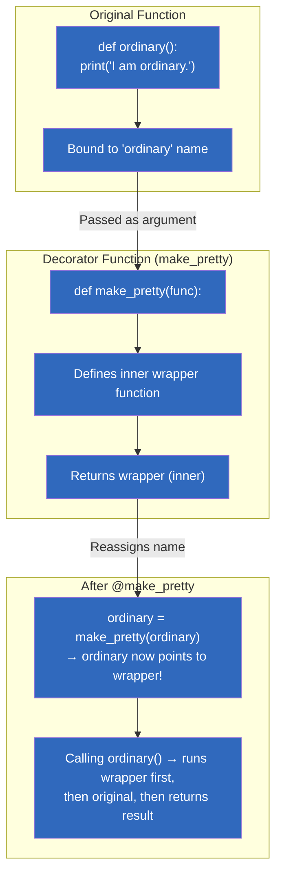
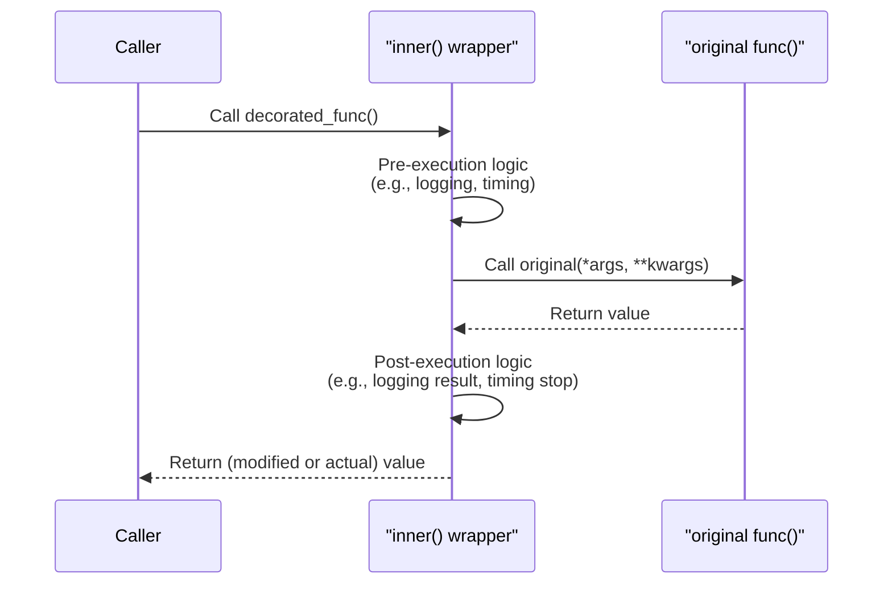
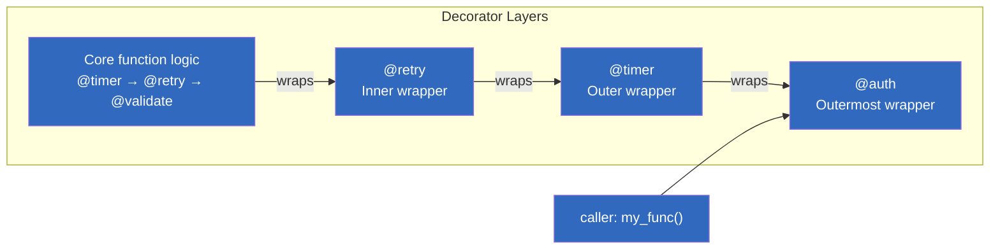
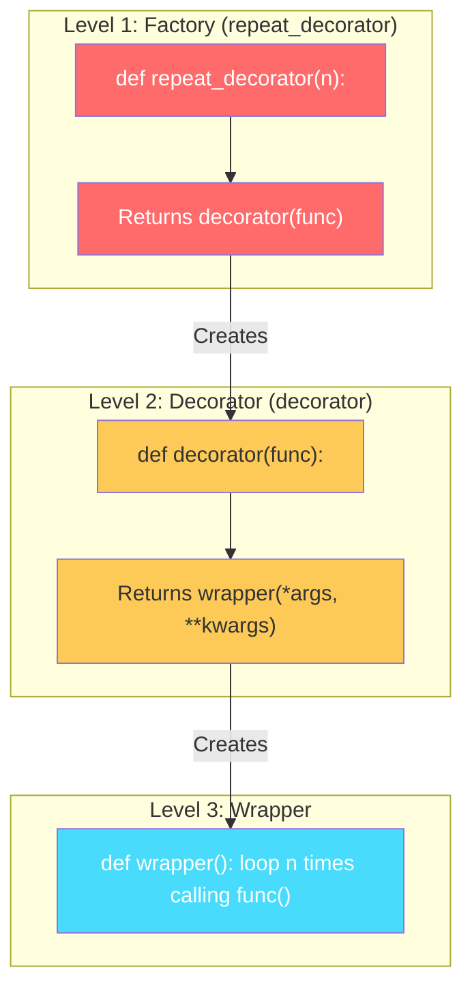
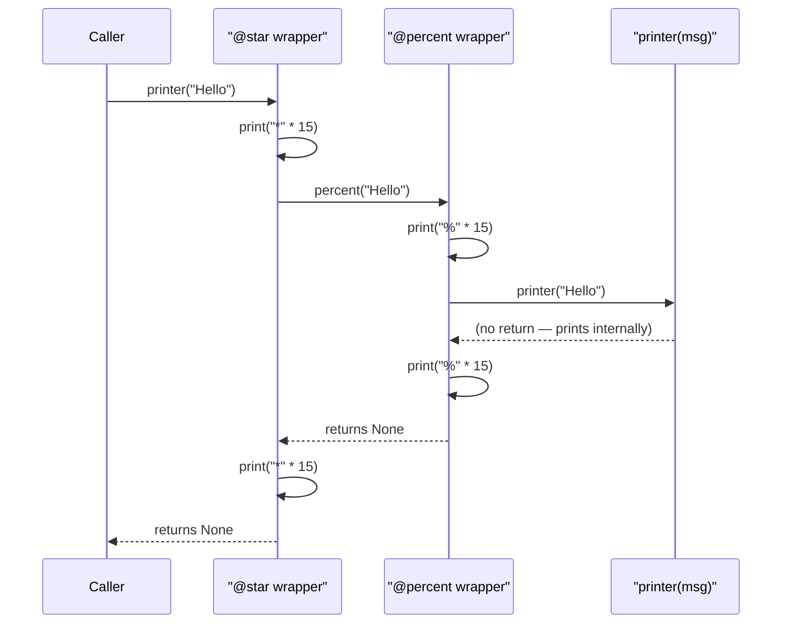
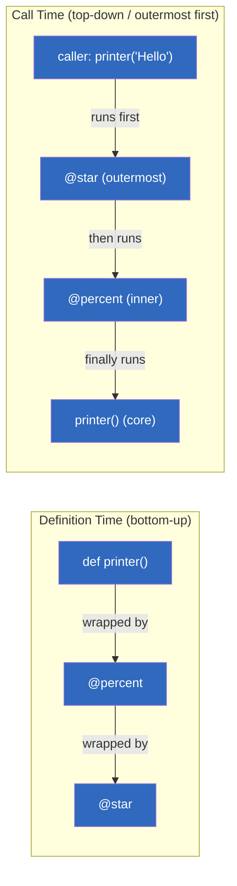
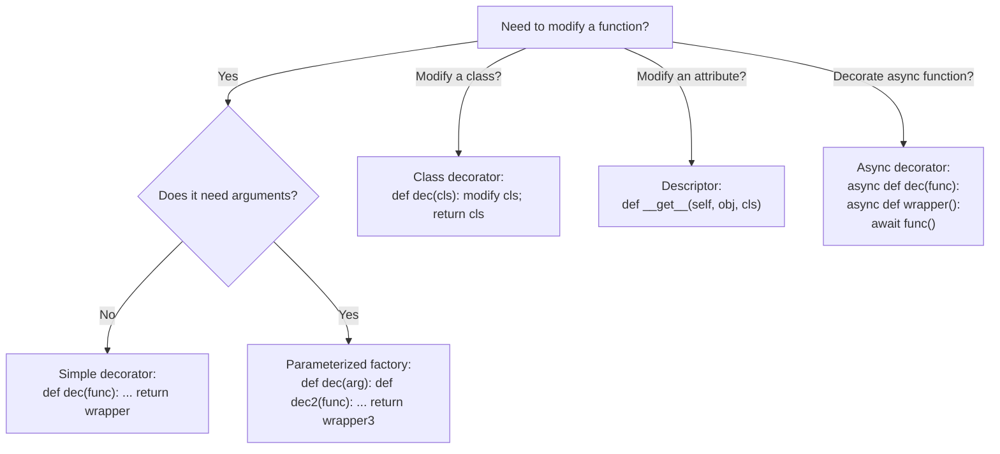
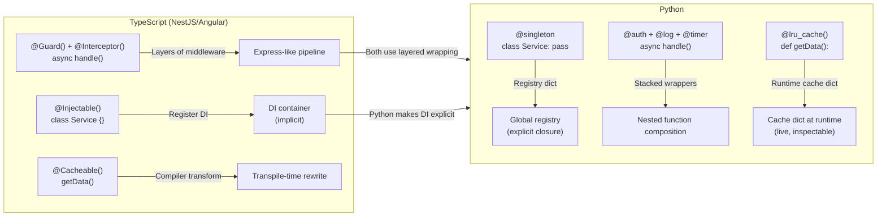

# Module 27 — Python Decorators

> **Prerequisites:** Closures (Module 04, Section 6), First-Class Functions, `*args` / `**kwargs`, Higher-Order Functions

---

## Table of Contents

- [Level 1: Beginner — What Are Decorators?](#level-1-beginner--what-are-decorators)
  - [1.1 Why Decorators? The TypeScript Comparison](#11-why-decorators-the-typescript-comparison)
  - [1.2 Prerequisites: Functions as First-Class Citizens](#12-prerequisites-functions-as-first-class-citizens)
  - [1.3 Anatomy of a Decorator — Step by Step](#13-anatomy-of-a-decorator--step-by-step)
  - [1.4 The `@` Syntax — Syntactic Sugar](#14-the--syntax--syntactic-sugar)
  - [1.5 Visualizing Decorators with Mermaid Diagrams](#15-visualizing-decorators-with-mermaid-diagrams)
  - [1.6 Beginner Examples: HTML Wrapper, Call Tracker, Validator](#16-beginner-examples-html-wrapper-call-tracker-validator)
  - [1.7 Beginner Quiz (5 Questions)](#17-beginner-quiz-5-questions)
  - [1.8 Beginner Exercises (3 Problems)](#18-beginner-exercises-3-problems)

- [Level 2: Intermediate — Real-World Decorator Patterns](#level-2-intermediate--real-world-decorator-patterns)
  - [2.1 The Universal Wrapper Pattern (`*args` / `**kwargs`)](#21-the-universal-wrapper-pattern-args--kwargs)
  - [2.2 Preserving Function Metadata with `functools.wraps`](#22-preserving-function-metadata-with-functoolswraps)
  - [2.3 Parameterized Decorators (Decorator Factories)](#23-parameterized-decorators-decorator-factories)
  - [2.4 Chaining Multiple Decorators](#24-chaining-multiple-decorators)
  - [2.5 Built-In Decorators: `@staticmethod`, `@classmethod`, `@property`](#25-built-in-decorators-staticmethod-classmethod-property)
  - [2.6 Real-World Pattern 1: Timer / Profiler](#26-real-world-pattern-1-timer--profiler)
  - [2.7 Real-World Pattern 2: Retry with Exponential Backoff](#27-real-world-pattern-2-retry-with-exponential-backoff)
  - [2.8 Real-World Pattern 3: Authentication & Authorization Guard](#28-real-world-pattern-3-authentication--authorization-guard)
  - [2.9 Real-World Pattern 4: Cache / Memoize (Manual Implementation)](#29-real-world-pattern-4-cache--memoize-manual-implementation)
  - [2.10 Real-World Pattern 5: Singleton Class Decorator](#210-real-world-pattern-5-singleton-class-decorator)
  - [2.11 Real-World Pattern 6: Rate Limiter](#211-real-world-pattern-6-rate-limiter)
  - [2.12 Real-World Pattern 7: Logging & Debugging](#212-real-world-pattern-7-logging--debugging)
  - [2.13 Intermediate Quiz (8 Questions)](#213-intermediate-quiz-8-questions)
  - [2.14 Intermediate Exercises (5 Problems)](#214-intermediate-exercises-5-problems)

- [Level 3: Advanced — Metaprogramming with Decorators](#level-3-advanced--metaprogramming-with-decorators)
  - [3.1 Decorator Classes (`__call__` Protocol)](#31-decorator-classes-call-protocol)
  - [3.2 Decorator Factories with Complex State](#32-decorator-factories-with-complex-state)
  - [3.3 Generic Type Hints for Decorators (ParamSpec, TypeVar)](#33-generic-type-hints-for-decorators-paramspec-typevar)
  - [3.4 Async Decorators (`async def` + `async def wrapper`)](#34-async-decorators-async-def--async-def-wrapper)
  - [3.5 Class Decorators — Modifying Classes at Definition Time](#35-class-decorators--modifying-classes-at-definition-time)
  - [3.6 Descriptor-Based Decorator Pattern](#36-descriptor-based-decorator-pattern)
  - [3.7 Stackable Middleware Decorators (Express.js → Python)](#37-stackable-middleware-decorators-expressjs--python)
  - [3.8 Common Pitfalls & Anti-Patterns](#38-common-pitfalls--anti-patterns)
  - [3.9 Advanced Quiz (8 Questions)](#39-advanced-quiz-8-questions)
  - [3.10 Advanced Exercises (5 Problems)](#310-advanced-exercises-5-problems)

- [Key Points Summary](#key-points-summary)
- [Cheat Sheet — Decorator Quick Reference](#cheat-sheet--decorator-quick-reference)
- [Complete Comparison: TypeScript Decorators → Python Decorators](#complete-comparison-typescript-decorators--python-decorators)
- [References & Further Reading](#references--further-reading)

---

## Level 1: Beginner — What Are Decorators?

### 1.1 Why Decorators? The TypeScript Comparison

TypeScript developers already know decorators (from Angular, NestJS, etc.). Python decorators share the same *intent* but differ in *mechanics*:

| Aspect | TypeScript Decorators | Python Decorators |
|--------|----------------------|-------------------|
| **When they run** | During class/function **definition** (transpile-time via `tsc`) | At **module import time** — when the file is first loaded |
| **Runtime presence** | No (types erased at runtime; only metadata preserved) | Yes — the wrapper function *exists* and runs every call |
| **Syntax** | `@decorator()` (class/property/method) | `@decorator` or `@decorator(args)` (function/class) |
| **Flexibility** | Fixed set of decorator targets | Any callable — wrap functions, classes, even modify class structure |
| **Composability** | Limited to TS compiler understanding | Unlimited — decorators are just function composition |

> **Key Insight:** Python decorators run at **import time** (once) to set up the wrapper, and then the wrapper runs at **call time** (every time you invoke the function). TypeScript decorators only run once during compilation.

### 1.2 Prerequisites: Functions as First-Class Citizens

Before understanding decorators, confirm these three concepts:
For a detailed explanation, please check the [Python Decorators Wiki](https://github.com/blacksmoke26/python-for-typescript-programmers-course/wiki/Python-Decorators)

```python
# === A. Functions can be assigned to variables ===
def greet():
    return "Hello!"

say_hello = greet  # No parentheses — assigning the function itself!
print(say_hello())  # Output: Hello!

# === B. Functions can be nested (Closures) ===
def outer(text: str):
    def inner():  # inner "remembers" `text` from outer scope
        return f"Message: {text}"
    return inner

msg = outer("Hello from Closure!")
print(msg())  # Output: Message: Hello from Closure!

# === C. Functions can be passed as arguments and returned ===
def parent(func):
    print("About to call the passed function...")
    func()
    print("Done calling it.")

def child():
    print("I am the child function!")

parent(child)  # Output: About to call... / I am the child! / Done calling it.
```

### 1.3 Anatomy of a Decorator — Step by Step

A decorator is simply a **function that takes another function and returns a new function**. Let's build one without `@` syntax first:

```python
# === Step 1: The Decorator Function (takes `func` as argument) ===
def make_pretty(func):
    # === Step 2: Define the Wrapper (inner) function ===
    def inner():
        print("✨ I got decorated! ✨")
        func()            # Call the original function
        print("✨ Decoration complete! ✨")
    # === Step 3: Return the wrapper function (NOT calling it!) ===
    return inner


# === The Original Function ===
def ordinary():
    print("I am ordinary.")


# === Manually applying the decorator (before @ syntax) ===
decorated_func = make_pretty(ordinary)

# Calling the decorated version:
decorated_func()
```

**Output:**
```
✨ I got decorated! ✨
I am ordinary.
✨ Decoration complete! ✨
```

**Why this works:** The `inner` function is a **closure** — it "remembers" the `func` variable from the enclosing scope, even after `make_pretty` has returned. This is the core mechanism of all decorators.

### 1.4 The `@` Syntax — Syntactic Sugar

Python provides the `@` symbol as a clean way to apply decorators:

```python
def make_pretty(func):
    def inner():
        print("✨ I got decorated! ✨")
        func()
        print("✨ Decoration complete! ✨")
    return inner


# This is EXACTLY equivalent to: ordinary = make_pretty(ordinary)
@make_pretty
def ordinary():
    print("I am ordinary.")

ordinary()  # Same output as before
```

When Python sees `@make_pretty` above a function definition, it automatically calls `ordinary = make_pretty(ordinary)` behind the scenes. The name `ordinary` is **rebound** to point at the wrapper function returned by the decorator.

### 1.5 Visualizing Decorators with Mermaid Diagrams

#### Diagram: The Anatomy of a Decorator



#### Diagram: Execution Flow (Call-Time)



#### Diagram: Decorator as a Layered Onion



### 1.6 Beginner Examples: HTML Wrapper, Call Tracker, Validator

#### Example 1: HTML Tag Wrapper

A practical decorator that wraps a function's string output in HTML tags:

```python
def html_tag(tag: str):
    """Decorator factory — parameterized even at beginner level!"""
    def decorator(func):
        def wrapper(*args, **kwargs):
            result = func(*args, **kwargs)
            return f"<{tag}>{result}</{tag}>"
        return wrapper
    return decorator

@html_tag("p")
def get_greeting():
    """Return a greeting message."""
    return "Hello, World!"

print(get_greeting())  # <p>Hello, World!</p>
```

#### Example 2: Call Counter Tracker

Track how many times each function is called — useful for debugging and profiling:

```python
from functools import wraps

def count_calls(func):
    """Tracks the number of calls to any function."""
    @wraps(func)
    def wrapper(*args, **kwargs):
        wrapper.call_count += 1
        print(f"[Call #{wrapper.call_count}] {func.__name__!r} was called")
        return func(*args, **kwargs)
    wrapper.call_count = 0  # Initialize counter on the wrapper itself
    return wrapper


@count_calls
def add(a: int, b: int) -> int:
    """Add two numbers."""
    return a + b

@count_calls
def greet(name: str) -> str:
    """Greet someone."""
    return f"Hello, {name}!"

print(add(1, 2))        # [Call #1] 'add' was called  → 3
print(add(3, 4))        # [Call #2] 'add' was called  → 7
print(greet("Alice"))   # [Call #1] 'greet' was called  → Hello, Alice!
print(add.call_count)   # 2 — the counter persists!
```

#### Example 3: Argument Validator

Ensure function arguments meet constraints before the function executes:

```python
from functools import wraps

def require_positive(func):
    """Validate that all positional args are positive integers."""
    @wraps(func)
    def wrapper(*args, **kwargs):
        for i, arg in enumerate(args):
            if not isinstance(arg, (int, float)) or arg <= 0:
                raise ValueError(f"Argument #{i+1} ({arg!r}) must be a positive number!")
        return func(*args, **kwargs)
    return wrapper


@require_positive
def calculate_area(length: float, width: float) -> float:
    """Calculate the area of a rectangle."""
    return length * width

print(calculate_area(5, 10))    # 50.0 — works!
# calculate_area(-5, 10)         # Raises ValueError!
```

### 1.7 Beginner Quiz (5 Questions)

<details><summary>Q1: What is a decorator in Python?</summary>
A function that takes another function as input and returns a new function with modified behavior, without changing the original function's source code.</details>

<details><summary>Q2: What does `@decorator` do under the hood?</summary>
It's syntactic sugar for `func = decorator(func)`. The decorator is called once at import time, and its return value replaces the original function binding.</details>

<details><summary>Q3: When do decorators run — at import time or call time?</summary>
The decorator itself runs at **import time** (when Python loads the module). The wrapper it returns runs at **call time** (every time you invoke the decorated function).</details>

<details><summary>Q4: What problem does `@wraps` solve?</summary>
Without `@wraps`, the wrapper's `__name__`, `__doc__`, and other metadata replace the original function's. This breaks introspection tools (Sphinx, debuggers, tests). `@wraps(func)` copies the original metadata onto the wrapper.</details>

<details><summary>Q5: What happens if you forget to `return func(*args, **kwargs)` inside the wrapper?</summary>
The decorated function will return `None` instead of the original result. Always capture and return the function's result!</details>

### 1.8 Beginner Exercises (3 Problems)

<details><summary><strong>Exercise 1:</strong> Write a decorator called `double_result` that multiplies the function's return value by 2.</summary>

```python
from functools import wraps

def double_result(func):
    @wraps(func)
    def wrapper(*args, **kwargs):
        result = func(*args, **kwargs)
        return result * 2
    return wrapper

@double_result
def add(a: int, b: int) -> int:
    return a + b

print(add(3, 4))  # 14 (7 * 2)
```

</details>

<details><summary><strong>Exercise 2:</strong> Write a decorator called `uppercase_output` that converts any string return value to uppercase.</summary>

```python
from functools import wraps

def uppercase_output(func):
    @wraps(func)
    def wrapper(*args, **kwargs):
        result = func(*args, **kwargs)
        return result.upper() if isinstance(result, str) else result
    return wrapper

@uppercase_output
def get_name() -> str:
    """Return a name."""
    return "python"

print(get_name())  # PYTHON
```

</details>

<details><summary><strong>Exercise 3:</strong> Write a decorator called `repeat_n(n)` that calls the decorated function `n` times and prints each call.</summary>

```python
from functools import wraps

def repeat_n(n: int):
    """Parameterized decorator — runs the function n times."""
    def decorator(func):
        @wraps(func)
        def wrapper(*args, **kwargs):
            for i in range(n):
                print(f"[Repeat {i+1}/{n}] Calling {func.__name__!r}...")
                result = func(*args, **kwargs)
            return result
        return wrapper
    return decorator


@repeat_n(3)
def greet(name: str) -> str:
    return f"Hello, {name}!"

greet("Alice")
# [Repeat 1/3] Calling 'greet'...
# Hello, Alice!
# [Repeat 2/3] Calling 'greet'...
# Hello, Alice!
# [Repeat 3/3] Calling 'greet'...
# Hello, Alice!
```

</details>

---

## Level 2: Intermediate — Real-World Decorator Patterns

### 2.1 The Universal Wrapper Pattern (`*args` / `**kwargs`)

The most important pattern for writing robust decorators: **always use `*args` and `**kwargs` in your wrapper**. This ensures the decorator works with ANY function signature, not just hardcoded ones:

```python
def universal_decorator(func):
    """Works with ANY function — no matter its signature."""
    def wrapper(*args, **kwargs):  # ← Universal! Accepts everything.
        print("Before call")
        result = func(*args, **kwargs)  # Pass through all args/kwargs
        print(f"After call → result: {result}")
        return result  # ← Always return the function's result!
    return wrapper


# Works with zero args:
@universal_decorator
def greet():
    return "Hello!"

# Works with multiple args and kwargs:
@universal_decorator
def join_strings(a: str, b: str, sep: str = " ") -> str:
    return f"{a}{sep}{b}"

greet()                          # Before call / After call → result: Hello!
join_strings("Hi", "there", sep="-")  # Before call / After call → result: Hi-there
```

### 2.2 Preserving Function Metadata with `functools.wraps`

When you wrap a function, its metadata (`__name__`, `__doc__`, `__annotations__`, `__module__`) is replaced by the wrapper's:

```python
# WITHOUT @wraps — BROKEN:
def bad_decorator(func):
    def wrapper(*args, **kwargs):
        return func(*args, **kwargs)
    return wrapper

@bad_decorator
def say_hello() -> str:
    """Say hello to everyone."""
    return "Hello!"

print(say_hello.__name__)   # 'wrapper' — WRONG! Lost original name.
print(say_hello.__doc__)    # None — WRONG! Lost the docstring.
print(help(say_hello))      # Shows wrapper's help, not say_hello's!


# WITH @wraps — CORRECT:
from functools import wraps

def good_decorator(func):
    @wraps(func)  # ← Copies __name__, __doc__, __annotations__, __module__ etc.
    def wrapper(*args, **kwargs):
        return func(*args, **kwargs)
    return wrapper

@good_decorator
def say_hello() -> str:
    """Say hello to everyone."""
    return "Hello!"

print(say_hello.__name__)   # 'say_hello' — preserved!
print(say_hello.__doc__)    # 'Say hello to everyone.' — preserved!
```

> **Rule:** Always use `@wraps(func)` in every decorator you write. It's a one-line change that saves hours of debugging introspection issues.

### 2.3 Parameterized Decorators (Decorator Factories)

When a decorator needs its own arguments, it becomes a **factory**: a function that returns a decorator, which returns a wrapper. This requires three levels of nesting:

```python
from functools import wraps

# Level 1: The FACTORY — takes decorator's own arguments
def repeat_decorator(n: int):
    """Factory function — creates a parameterized decorator."""

    # Level 2: The DECORATOR — takes the function to decorate
    def decorator(func):
        @wraps(func)
        # Level 3: The WRAPPER — wraps each call
        def wrapper(*args, **kwargs):
            result = None
            for _ in range(n):
                result = func(*args, **kwargs)
            return result
        return wrapper

    return decorator


@repeat_decorator(5)
def welcome():
    print("Welcome!")

welcome()  # Prints "Welcome!" exactly 5 times!

# Equivalent to:
# welcome = repeat_decorator(5)(welcome)
```

**Visualization — The Three-Level Nesting:**



### 2.4 Chaining Multiple Decorators

You can stack multiple decorators on one function. They are applied **bottom-up** (closest to `def` first) but executed **top-down** (outermost wrapper runs first):

```python
from functools import wraps


def star(func):
    @wraps(func)
    def wrapper(*args, **kwargs):
        print("*" * 15)
        result = func(*args, **kwargs)
        print("*" * 15)
        return result
    return wrapper


def percent(func):
    @wraps(func)
    def wrapper(*args, **kwargs):
        print("%" * 15)
        result = func(*args, **kwargs)
        print("%" * 15)
        return result
    return wrapper


# Both decorators stack — order matters!
@star
@percent
def printer(msg: str):
    """Print a message."""
    print(msg)

printer("Hello")
```

**Output:**
```
***************
%%%%%%%%%%%%%%%
Hello
%%%%%%%%%%%%%%%
***************
```

> **Key Insight:** `@star` over `@percent` means `printer = star(percent(printer))`. The `percent` wrapper executes first (innermost), then `star` (outermost). Think of it like peeling an onion from outside-in during call time, and building from inside-out at definition time.

**Execution order visualization:**



**Decorator application order:**



### 2.5 Built-In Decorators: `@staticmethod`, `@classmethod`, `@property`

Python has three built-in decorators that every developer uses daily:

```python
class MathHelper:
    # @staticmethod — no access to self or cls. Pure utility function.
    # TypeScript equivalent: static method without class context
    @staticmethod
    def is_even(n: int) -> bool:
        """Check if a number is even (no instance needed)."""
        return n % 2 == 0


    # @classmethod — receives the CLASS as first argument (cls), not an instance.
    # Used for alternative constructors.
    @classmethod
    def from_string(cls, value_str: str) -> "MathHelper":
        """Alternative constructor — creates instance from string."""
        return cls(int(value_str))


    # @property — turn a method into a read-only attribute.
    # TypeScript equivalent: getter without setter.
    def __init__(self, value: int):
        self._value = value

    @property
    def value(self) -> int:
        """Read-only property — accessed as instance.value (no parentheses!)."""
        return self._value


# Usage:
print(MathHelper.is_even(42))           # True — static method on class
obj = MathHelper.from_string("100")     # cls=MathHelper, creates instance
print(obj.value)                         # 100 — @property looks like an attribute!

# @property with setter (read-write):
class Temperature:
    def __init__(self, celsius: float):
        self._celsius = celsius

    @property
    def celsius(self) -> float:
        return self._celsius

    @celsius.setter
    def celsius(self, value: float):
        if value < -273.15:
            raise ValueError("Below absolute zero!")
        self._celsius = value

    @property
    def fahrenheit(self) -> float:
        return self._celsius * 9/5 + 32


t = Temperature(0)
print(t.celsius)      # 0.0
print(t.fahrenheit)   # 32.0
t.celsius = 100       # Triggers setter validation!
print(t.fahrenheit)   # 212.0
```

**When to use each:**

| Decorator | First Parameter | Use Case | TS Equivalent |
|-----------|----------------|----------|--------------|
| `@staticmethod` | None (no `self`) | Utility function not bound to instance/class | `static` method in class |
| `@classmethod` | `cls` (the class) | Alternative constructor, factory method | Factory method / static with `new` |
| `@property` | `self` | Accessor that looks like an attribute | Getter (`get accessor`) |

### 2.6 Real-World Pattern 1: Timer / Profiler

Measure execution time of any function — essential for performance profiling:

```python
import time
from functools import wraps


def timer(func):
    """Decorator — logs execution time of the decorated function."""
    @wraps(func)
    def wrapper(*args, **kwargs):
        start = time.perf_counter()  # Highest resolution timer
        result = func(*args, **kwargs)
        elapsed = time.perf_counter() - start
        print(f"⏱️ {func.__name__!r} executed in {elapsed:.6f} seconds")
        return result
    return wrapper


@timer
def compute_sums(n: int) -> int:
    """Compute sum of squares from 0 to n-1."""
    total = sum(i ** 2 for i in range(n))
    return total

@timer
def string_processing(data: list[str]) -> str:
    """Simulate heavy string processing."""
    return "".join(f"item-{i}" * 100 for i in data)

# Call time these functions and see the timing output!
compute_sums(1_000_000)      # ⏱️ 'compute_sums' executed in ~0.08s
string_processing(list(range(500)))  # ⏱️ 'string_processing' executed in ~Xms
```

> **TS Equivalent:** In Node.js, you'd use `console.time('label')` / `console.timeEnd('label')`. Python decorators make this automatic and reusable across all functions — no manual timing code needed!

### 2.7 Real-World Pattern 2: Retry with Exponential Backoff

Automatically retry flaky network calls with increasing delays:

```python
import time
import random
from functools import wraps


def retry(max_attempts: int = 3, base_delay: float = 1.0, max_delay: float = 60.0):
    """Decorator — retries the function on failure with exponential backoff."""
    def decorator(func):
        @wraps(func)
        def wrapper(*args, **kwargs):
            last_exception = None
            for attempt in range(1, max_attempts + 1):
                try:
                    return func(*args, **kwargs)  # Success! Return immediately.
                except Exception as e:
                    last_exception = e
                    if attempt < max_attempts:
                        # Exponential backoff: delay doubles each time (capped at max_delay)
                        delay = min(base_delay * (2 ** (attempt - 1)), max_delay)
                        print(f"⚠️ {func.__name__!r} attempt {attempt}/{max_attempts} failed: {e}")
                        print(f"   Retrying in {delay:.1f}s...")
                        time.sleep(delay)
                    else:
                        print(f"❌ {func.__name__!r} exhausted all {max_attempts} attempts.")
            raise last_exception  # Re-raise the last exception after all retries
        return wrapper
    return decorator


# Usage — this function will retry up to 5 times with exponential backoff:
@retry(max_attempts=5, base_delay=0.1, max_delay=5.0)
def flaky_api_call(endpoint: str) -> dict:
    """Simulates a network call that sometimes fails."""
    if random.random() < 0.7:  # 70% chance of success
        raise ConnectionError(f"Timeout calling {endpoint}")
    return {"status": 200, "data": f"Response from {endpoint}"}


result = flaky_api_call("https://api.example.com/users")
print(result)
```

### 2.8 Real-World Pattern 3: Authentication & Authorization Guard

Simulate web framework route protection (like Flask/Django/NestJS guards):

```python
from functools import wraps


# Simulated user session (in real life, this comes from request context)
current_user = {"username": "alice", "role": "admin", "is_authenticated": True}


def require_auth(func):
    """Decorator — ensures the caller is authenticated."""
    @wraps(func)
    def wrapper(*args, **kwargs):
        if not current_user.get("is_authenticated"):
            raise PermissionError("🚫 Authentication required! Please log in.")
        # Attach user to kwargs for downstream use
        kwargs["_current_user"] = current_user
        return func(*args, **kwargs)
    return wrapper


def require_role(role: str):
    """Decorator factory — ensures the caller has the specified role."""
    def decorator(func):
        @wraps(func)
        def wrapper(*args, **kwargs):
            if current_user.get("role") != role:
                raise PermissionError(f"🚫 Forbidden! Requires '{role}' role. You have '{current_user.get('role')}'.")
            return func(*args, **kwargs)
        return wrapper
    return decorator


@require_auth
@require_role("admin")
def delete_all_users():
    """Delete all user records — admin only!"""
    return "All users deleted successfully."


@require_auth
def get_profile(username: str) -> dict:
    """Anyone authenticated can view profiles."""
    return {"username": username, "viewed_by": current_user["username"]}


print(get_profile("bob"))                    # Works — requires auth only
# delete_all_users()                         # Works — admin has 'admin' role
# current_user["role"] = "viewer"
# delete_all_users()                         # PermissionError! Viewer cannot delete users.
```

### 2.9 Real-World Pattern 4: Cache / Memoize (Manual Implementation)

Implement your own caching decorator (before learning `@lru_cache`):

```python
from functools import wraps


def memoize(func):
    """Manual memoization — caches function results by arguments."""
    cache = {}

    @wraps(func)
    def wrapper(*args, **kwargs):
        # Convert kwargs to a hashable key (tuple of sorted items)
        key = args + tuple(sorted(kwargs.items()))
        if key not in cache:
            print(f"  → Computing {func.__name__}{key}...")
            cache[key] = func(*args, **kwargs)
        else:
            print(f"  → Cache HIT for {func.__name__}{key}")
        return cache[key]

    wrapper.clear_cache = lambda: cache.clear()  # Expose cache clearing
    wrapper.cache_info = lambda: f"Size: {len(cache)} entries"
    return wrapper


@memoize
def fibonacci(n: int) -> int:
    """Compute the nth Fibonacci number — now memoized!"""
    if n < 2:
        return n
    return fibonacci(n - 1) + fibonacci(n - 2)


# First call: computes (slow!)
print(fibonacci(10))      # → Computing...(multiple recursive calls)...  → 55

# Second call with same args: cache HIT (instant!)
print(fibonacci(10))      # → Cache HIT... → 55  ← instant!

# Different args: computes again
print(fibonacci(20))      # → Computing fibonacci(20,)... → 6765

print(fibonacci.cache_info())  # Size: 11 entries — (args + kwargs) stored
```

> **Note:** In production code, prefer `@functools.lru_cache(maxsize=128)` instead of manual caching. It's C-implemented, thread-safe, and supports max size with LRU eviction.

### 2.10 Real-World Pattern 5: Singleton Class Decorator

Convert any class into a singleton pattern using a **class decorator**:

```python
from functools import wraps


def singleton(cls):
    """Class decorator — ensures only one instance of the class exists."""
    instances = {}

    @wraps(cls)
    def get_instance(*args, **kwargs):
        if cls not in instances:
            print(f"  → Creating new {cls.__name__} instance")
            instances[cls] = cls(*args, **kwargs)
        else:
            print(f"  → Returning cached {cls.__name__} instance")
        return instances[cls]

    get_instance._instance_class = cls  # Expose metadata
    return get_instance


@singleton
class DatabaseConnection:
    def __init__(self, host: str, port: int):
        self.host = host
        self.port = port
        print(f"  → Connected to {host}:{port}")

    def query(self, sql: str) -> list:
        return [{"sql": sql, "results": []}]


# First call — creates instance:
db1 = DatabaseConnection("localhost", 5432)
# → Creating new DatabaseConnection instance
# → Connected to localhost:5432

# Second call — returns cached instance:
db2 = DatabaseConnection("remote.host", 3306)
# → Returning cached DatabaseConnection instance

assert db1 is db2  # True! Same object!
print(db1.host)     # 'localhost' — the SECOND constructor args were IGNORED.
```

### 2.11 Real-World Pattern 6: Rate Limiter

Limit how often a function can be called:

```python
import time
from functools import wraps


def rate_limit(max_calls: int, period_seconds: float):
    """Decorator — limits function calls to max_calls per period."""
    def decorator(func):
        call_timestamps: list[float] = []

        @wraps(func)
        def wrapper(*args, **kwargs):
            now = time.time()
            # Remove timestamps outside the current period
            call_timestamps[:] = [t for t in call_timestamps if now - t < period_seconds]

            if len(call_timestamps) >= max_calls:
                wait_time = period_seconds - (now - call_timestamps[0])
                raise RuntimeError(
                    f"Rate limited! Called {max_calls} times in {period_seconds}s. "
                    f"Wait {wait_time:.2f}s before retrying."
                )

            call_timestamps.append(now)
            return func(*args, **kwargs)

        # Expose reset method on the wrapper for testing/maintenance:
        wrapper.reset = lambda: call_timestamps.clear()
        wrapper.call_count = len(call_timestamps)
        return wrapper

    return decorator


@rate_limit(max_calls=3, period_seconds=1.0)
def api_endpoint(endpoint: str) -> dict:
    """Simulates an API endpoint that must not be called too fast."""
    return {"endpoint": endpoint, "status": 200}


print(api_endpoint("/users"))     # OK
print(api_endpoint("/orders"))    # OK
print(api_endpoint("/products"))  # OK
# api_endpoint("/inventory")      # RuntimeError! Rate limited!
```

### 2.12 Real-World Pattern 7: Logging & Debugging

Log every function call with arguments and return values — invaluable for production debugging:

```python
import logging
from functools import wraps

logging.basicConfig(level=logging.DEBUG, format="%(asctime)s [%(levelname)s] %(message)s")
logger = logging.getLogger("app")


def log_calls(func):
    """Decorator — logs every call to the decorated function."""
    @wraps(func)
    def wrapper(*args, **kwargs):
        logger.debug(f"CALL  → {func.__name__}(args={args}, kwargs={kwargs})")
        try:
            result = func(*args, **kwargs)
            logger.debug(f"RETURN← {func.__name__} → {result!r}")
            return result
        except Exception as e:
            logger.error(f"EXCEPTION← {func.__name__} → {type(e).__name__}: {e}")
            raise
    return wrapper


@log_calls
def divide(a: float, b: float) -> float:
    return a / b

@log_calls
def process_data(data: list[int]) -> int:
    total = sum(data)
    if total == 0:
        raise ValueError("Sum cannot be zero!")
    return total

divide(10, 3)   # DEBUG: CALL → divide(args=(10, 3), kwargs={}) ... RETURN← 3.333...
# divide(10, 0) # ERROR: EXCEPTION← ZeroDivisionError: division by zero
process_data([1, 2, 3])  # Call and return logged
```

### 2.13 Intermediate Quiz (8 Questions)

<details><summary>Q1: Why must wrapper functions use `*args, **kwargs`?</summary>
So the decorator works with ANY function signature. Hardcoding parameters (`def wrapper(a, b)`) breaks if the decorated function takes different arguments.</details>

<details><summary>Q2: What happens when you stack `@star` over `@percent` on a function? Which wraps first?</summary>
At definition time, `percent` wraps the original function first (innermost), then `star` wraps that result (outermost). At call time, `star`'s code runs first, then `percent`, then the original.</details>

<details><summary>Q3: How does `@retry` implement exponential backoff?</summary>
Each retry delay doubles: `delay = base_delay * 2^(attempt-1)`, capped at `max_delay`. This prevents overwhelming a flaky service while still retrying quickly initially.</details>

<details><summary>Q4: When would you use `@classmethod` vs `@staticmethod`?</summary>
Use `@classmethod` when you need the class itself (e.g., alternative constructors). Use `@staticmethod` for utility functions that don't need class or instance context.</details>

<details><summary>Q5: What is a decorator factory?</summary>
A function that returns a decorator (which takes a function and returns a wrapper). Requires three nesting levels: factory → decorator → wrapper. Example: `@retry(max_attempts=5)`</details>

<details><summary>Q6: How do you expose cache-clearing functionality on a memoize decorator?</summary>
Attach it as an attribute on the wrapper: `wrapper.clear_cache = lambda: cache.clear()`. This makes it accessible as `my_func.clear_cache()` after decoration.</details>

<details><summary>Q7: What's the difference between a function decorator and a class decorator?</summary>
A function decorator wraps a function. A class decorator receives a class object and can modify its attributes, add methods, or replace the class entirely with another callable (like a singleton).</details>

<details><summary>Q8: How does the `rate_limit` decorator track timestamps thread-safely?</summary>
The list `call_timestamps` is captured in the closure. For multi-threaded safety, you'd add a `threading.Lock()`. This basic version works correctly for single-threaded use.</details>

### 2.14 Intermediate Exercises (5 Problems)

<details><summary><strong>Exercise 1:</strong> Write a decorator called `arg_checker` that validates arguments against type hints at runtime.</summary>

```python
from functools import wraps

def arg_checker(*expected_types):
    """Decorator factory — checks that args match expected types."""
    def decorator(func):
        @wraps(func)
        def wrapper(*args):
            for i, (arg, expected) in enumerate(zip(args, expected_types)):
                if not isinstance(arg, expected):
                    raise TypeError(
                        f"Argument {i} of {func.__name__!r} should be {expected.__name__}, "
                        f"got {type(arg).__name__}"
                    )
            return func(*args)
        return wrapper
    return decorator


@arg_checker(str, int)
def greet(name: str, times: int) -> list[str]:
    return [f"Hello {name}!" for _ in range(times)]

print(greet("Alice", 3))       # ["Hello Alice!", "Hello Alice!", "Hello Alice!"]
# greet(123, "three")          # TypeError! Wrong types.
```

</details>

<details><summary><strong>Exercise 2:</strong> Write a decorator that caches results with an expiration time (TTL cache).</summary>

```python
import time
from functools import wraps

def ttl_cache(ttl_seconds: int):
    """Cache results for a limited time."""
    def decorator(func):
        cache = {}
        timestamps = {}

        @wraps(func)
        def wrapper(*args):
            now = time.time()
            key = args
            if key in cache and (now - timestamps[key]) < ttl_seconds:
                return cache[key]  # Cache hit — not expired!
            result = func(*args)
            cache[key] = result
            timestamps[key] = now
            return result

        wrapper.clear = lambda: (cache.clear(), timestamps.clear())
        return wrapper
    return decorator


@ttl_cache(ttl_seconds=2)
def fetch_data(key: str) -> dict:
    print(f"  → Fetching {key!r} from server...")
    return {"data": f"Value for {key}"}

print(fetch_data("user_1"))     # → Fetching "user_1"...
time.sleep(1)
print(fetch_data("user_1"))     # Cache hit (not expired yet)!
time.sleep(2)
print(fetch_data("user_1"))     # → Fetching again! (expired)
```

</details>

<details><summary><strong>Exercise 3:</strong> Write a decorator that converts all keyword arguments to their canonical form before passing to the function.</summary>

```python
from functools import wraps
import inspect

def normalize_kwargs(func):
    @wraps(func)
    def wrapper(*args, **kwargs):
        sig = inspect.signature(func)
        params = sig.parameters
        normalized = {}
        for name, value in kwargs.items():
            param = params.get(name)
            if param and param.annotation:
                value = param.annotation(value)
            normalized[name] = value
        return func(*args, **normalized)
    return wrapper


@normalize_kwargs
def create_user(age: int, active: bool, score: float) -> dict:
    return {"age": age, "active": active, "score": score}

# Pass strings — decorator converts them to proper types!
user = create_user(age="25", active="True", score="95.5")
print(user)  # {'age': 25, 'active': True, 'score': 95.5}
```

</details>

<details><summary><strong>Exercise 4:</strong> Write a decorator that debounces function calls (waits for N seconds of inactivity before executing).</summary>

```python
import time
from functools import wraps

def debounce(wait_seconds: float):
    """Debounces — only the last call within wait_seconds is executed."""
    def decorator(func):
        timer = None
        result_holder = [None]
        pending_args = [None]

        @wraps(func)
        def wrapper(*args, **kwargs):
            nonlocal timer
            pending_args[0] = (args, kwargs)
            if timer is not None:
                timer.cancel()
            def execute():
                result_holder[0] = func(*pending_args[0][0], **pending_args[0][1])
            timer = time.Timer(wait_seconds, execute)
            timer.start()
            return result_holder[0]
        return wrapper
    return decorator


@debounce(0.5)
def on_text_change(text: str):
    print(f"Saving: {text!r}")
    return {"saved": text}

# In a real app, typing would trigger many calls — only the last persists!
```

</details>

<details><summary><strong>Exercise 5:</strong> Write a decorator that measures both execution time AND memory usage (via `tracemalloc`).</summary>

```python
import tracemalloc
from functools import wraps

def timer_and_memory(func):
    """Decorator — logs execution time and peak memory used."""
    @wraps(func)
    def wrapper(*args, **kwargs):
        start_time = __import__("time").perf_counter()
        tracemalloc.start()

        result = func(*args, **kwargs)

        elapsed = __import__("time").perf_counter() - start_time
        current, peak = tracemalloc.get_traced_memory()
        tracemalloc.stop()

        print(f"{func.__name__}: {elapsed:.4f}s | Memory peak: {peak / 1024:.1f} KB")
        return result
    return wrapper


@timer_and_memory
def build_large_string(n: int) -> str:
    return "x" * n

build_large_string(1_000_000)  # Shows time and memory peak!
```

</details>

---

## Level 3: Advanced — Metaprogramming with Decorators

### 3.1 Decorator Classes (`__call__` Protocol)

Decorators don't have to be functions — they can be **classes** that implement the `__call__` method. This is useful when you need complex state management:

```python
from functools import wraps


class CountingDecorator:
    """Class-based decorator — uses __call__ protocol for rich state."""

    def __init__(self, func):
        wraps(func)(self)  # Copy metadata from wrapped function
        self.func = func
        self.call_count = 0
        self._results: list = []

    def __call__(self, *args, **kwargs):
        """This makes the instance callable — Python calls this when invoked."""
        self.call_count += 1
        result = self.func(*args, **kwargs)
        self._results.append(result)
        return result

    def stats(self) -> dict:
        """Report statistics about function usage."""
        import statistics
        return {
            "total_calls": self.call_count,
            "unique_results": len(set(self._results)),
            "avg_result": round(statistics.mean(self._results), 2) if self._results else None,
        }

    def reset(self):
        """Reset all tracking data."""
        self.call_count = 0
        self._results.clear()


@CountingDecorator
def add(a: int, b: int) -> int:
    return a + b


print(add(1, 2))          # 3
print(add(3, 4))          # 7
print(add(5, 6))          # 11
print(add.stats())        # {'total_calls': 3, 'unique_results': 3, 'avg_result': 7.0}
add.reset()
print(add.call_count)     # 0 — reset!
```

**Why class decorators?** They provide structured state management with methods, making them ideal for complex monitoring, debugging, and testing scenarios that simple function closures can't easily handle.

### 3.2 Decorator Factories with Complex State

Building a parameterized decorator with shared state across multiple decorated functions:

```python
from functools import wraps


def stats_collector(group_name: str):
    """Factory — creates decorators that share a global stats dictionary."""
    global_stats = {}  # Shared across ALL decorated functions in this group

    def decorator(func):
        @wraps(func)
        def wrapper(*args, **kwargs):
            start_time = __import__("time").perf_counter()
            result = func(*args, **kwargs)
            elapsed = __import__("time").perf_counter() - start_time

            # Aggregate stats into the shared dictionary
            key = f"{group_name}:{func.__name__}"
            if key not in global_stats:
                global_stats[key] = {"count": 0, "total_time": 0, "errors": 0}
            global_stats[key]["count"] += 1
            global_stats[key]["total_time"] += elapsed

            return result

        wrapper.get_stats = lambda: global_stats.get(key, {})
        return wrapper

    def get_group_stats():
        return dict(global_stats)

    decorator.get_group_stats = get_group_stats
    return decorator


@stats_collector("api")
def fetch_users() -> list:
    return [{"id": 1, "name": "Alice"}]

@stats_collector("api")
def fetch_orders() -> list:
    return [{"order_id": 100}]

@stats_collector("db")
def query_db(sql: str) -> list:
    return []

# Access per-function stats:
print(fetch_users.get_stats())  # {'count': 1, 'total_time': ..., 'errors': 0}
# Access group-level stats:
print(fetch_users.get_group_stats())  # All 'api' group functions tracked!
```

### 3.3 Generic Type Hints for Decorators (ParamSpec, TypeVar)

For production code, properly type-decorated functions so static type checkers (mypy) work correctly:

```python
from functools import wraps, ParamSpec, TypeVar
import time

# ParamSpec captures the function's parameter types exactly
# TypeVar captures the return type
P = ParamSpec("P")  # Parameter specification — preserves argument types
R = TypeVar("R")    # Return type variable


def timer(func: callable[P, R]) -> callable[P, R]:
    """Properly typed timer decorator — mypy understands arg/return types!"""
    @wraps(func)
    def wrapper(*args: P.args, **kwargs: P.kwargs) -> R:  # ← Preserves signature!
        start = time.perf_counter()
        result = func(*args, **kwargs)
        elapsed = time.perf_counter() - start
        print(f"{func.__name__} took {elapsed:.4f}s")
        return result
    return wrapper


# mypy now knows: add takes (int, int) and returns int!
@timer
def add(a: int, b: int) -> int:
    return a + b

result: int = add(1, 2)  # No type error — mypy knows it's int!


# More complex example — preserves exact signature:
@timer
def greet(name: str, times: int = 1) -> list[str]:
    return [f"Hello, {name}!" for _ in range(times)]

greetings: list[str] = greet("Alice", 3)  # mypy knows this is list[str]!
```

> **Key Insight:** Before Python 3.10, type-hinting decorators was nearly impossible because the return type couldn't express "a function with the same signature as `func`." `ParamSpec` and `TypeVar` solve this elegantly — making Python decorators fully compatible with TypeScript's strong typing experience.

### 3.4 Async Decorators (`async def` + `async def wrapper`)

Decorating async functions requires **both** the outer decorator function AND the inner wrapper to be `async def`:

```python
import asyncio
from functools import wraps


def async_timer(func):
    """Decorator for async functions — both func and wrapper must be async!"""
    @wraps(func)
    async def wrapper(*args, **kwargs):
        import time
        start = time.perf_counter()
        result = await func(*args, **kwargs)  # ← Must use 'await'!
        elapsed = time.perf_counter() - start
        print(f"⏱️ {func.__name__} took {elapsed:.4f}s")
        return result
    return wrapper


@async_timer
async def fetch_data(url: str) -> dict:
    """Simulates an async network request."""
    await asyncio.sleep(0.1)  # Simulated network delay
    return {"url": url, "data": "response"}


# Run in event loop:
async def main():
    result = await fetch_data("https://api.example.com")
    print(result)

asyncio.run(main())
```

**Real-world: Async Retry for HTTP calls:**

```python
import asyncio
from functools import wraps


def async_retry(max_attempts: int = 3, delay: float = 1.0):
    """Async retry decorator — works with any async function."""
    def decorator(func):
        @wraps(func)
        async def wrapper(*args, **kwargs):
            last_exception = None
            for attempt in range(1, max_attempts + 1):
                try:
                    return await func(*args, **kwargs)
                except Exception as e:
                    last_exception = e
                    if attempt < max_attempts:
                        print(f"⚠️ Attempt {attempt}/{max_attempts} failed for {func.__name__}: {e}")
                        await asyncio.sleep(delay * attempt)  # Exponential delay!
            raise last_exception
        return wrapper
    return decorator


@async_retry(max_attempts=3, delay=0.5)
async def unreliable_api(endpoint: str) -> dict:
    """Simulates a flaky async API."""
    if endpoint == "/fail":
        raise ConnectionError("Connection refused!")
    await asyncio.sleep(0.1)
    return {"status": 200}


# Run:
async def main():
    print(await unreliable_api("/success"))   # {"status": 200}
    try:
        print(await unreliable_api("/fail"))   # Retries 3 times, then raises
    except ConnectionError:
        print("Failed after all retries!")

asyncio.run(main())
```

### 3.5 Class Decorators — Modifying Classes at Definition Time

Class decorators receive a class object and can modify its structure before it's used:

```python
from functools import wraps


def auto_hash(cls):
    """Class decorator — adds __hash__ and __eq__ to any class that defines __init__."""
    # Capture the original __init__ signature
    init_params = [p for p in cls.__init__.__code__.co_varnames[1:]]

    def __eq__(self, other):
        if not isinstance(other, cls):
            return False
        return all(getattr(self, p) == getattr(other, p) for p in init_params)

    def __hash__(self):
        return hash(tuple(getattr(self, p) for p in init_params))

    # Add methods to the class
    setattr(cls, "__eq__", __eq__)
    setattr(cls, "__hash__", __hash__)
    return cls


@auto_hash
class Point:
    def __init__(self, x: float, y: float):
        self.x = x
        self.y = y


p1 = Point(1.0, 2.0)
p2 = Point(1.0, 2.0)

# Now you can use Points in sets and as dict keys!
print(p1 == p2)         # True — auto-generated equality!
print(hash(p1) == hash(p2))  # True — same x,y → same hash!
pts = {p1, p2}          # Set deduplication works!
print(len(pts))          # 1 — p1 and p2 are considered equal


def add_default_init(cls):
    """Class decorator that adds a dict() factory method."""
    def from_dict(**kwargs):
        return cls(**kwargs)
    cls.from_dict = classmethod(from_dict)
    return cls


@add_default_init
class Config:
    def __init__(self, host: str = "localhost", port: int = 8080, debug: bool = False):
        self.host = host
        self.port = port
        self.debug = debug

    def __repr__(self):
        return f"Config(host={self.host!r}, port={self.port}, debug={self.debug})"


c = Config.from_dict(host="example.com", port=443, debug=True)
print(c)  # Config(host='example.com', port=443, debug=True)
```

### 3.6 Descriptor-Based Decorator Pattern

Descriptors provide attribute-level interception. This pattern is used by `@property`, `@cached_property`, and ORMs:

```python
from functools import wraps


class CachedProperty:
    """Descriptor — implements @property-like caching via __get__."""
    def __init__(self, func):
        wraps(func)(self)
        self.func = func
        self.attr_name = func.__name__  # The attribute name on the instance

    def __get__(self, obj, cls):
        if obj is None:
            return self  # Accessed via class — return descriptor itself
        # First access: compute and cache; subsequent: return cached value
        value = self.func(obj)
        setattr(obj, self.attr_name, value)  # Cache on instance!
        return value


class UserProfile:
    def __init__(self, user_id: int):
        self.user_id = user_id

    @CachedProperty
    def expensive_computation(self) -> str:
        """Simulates an expensive operation — computed only once per instance."""
        print(f"  → Computing for user {self.user_id}...")
        __import__("time").sleep(0.5)  # Simulated heavy computation!
        return f"Profile data for user {self.user_id}"


user = UserProfile(42)

# First access: computes and caches
print(user.expensive_computation)  # → Computing... / Profile data for user 42

# Second access: returns cached value (no re-computation!)
print(user.expensive_computation)  # Profile data for user 42 (instant!)

# Verify caching worked — the attribute now exists on the instance:
assert "expensive_computation" in vars(user)  # True! Cached as regular attribute.
```

### 3.7 Stackable Middleware Decorators (Express.js → Python)

Build Express.js-style middleware stacking with decorators:

```python
from functools import wraps
from typing import Callable, Any


# Type definitions for the middleware pattern
Middleware = Callable[[Callable[..., Any]], Callable[..., Any]]


def trace_middleware(func):
    """Middleware — adds a request ID for tracing."""
    @wraps(func)
    def wrapper(*args, **kwargs):
        request_id = f"req-{id(args[0]):x}" if args else "unknown"
        kwargs["_request_id"] = request_id
        print(f"[TRACE {request_id}] → {func.__name__}")
        result = func(*args, **kwargs)
        print(f"[TRACE {request_id}] ← {func.__name__} returned")
        return result
    return wrapper


def auth_middleware(func):
    """Middleware — validates authentication."""
    @wraps(func)
    def wrapper(*args, **kwargs):
        if not kwargs.get("_authenticated"):
            raise PermissionError("Unauthorized!")
        print("[AUTH] ✓ Authenticated")
        return func(*args, **kwargs)
    return wrapper


def authenticate(func):
    """Decorator — marks the endpoint as needing auth."""
    @wraps(func)
    def wrapper(*args, **kwargs):
        kwargs["_authenticated"] = True  # Inject auth flag
        return func(*args, **kwargs)
    return wrapper


def logging_middleware(func):
    """Middleware — logs request details."""
    @wraps(func)
    def wrapper(*args, **kwargs):
        user_id = kwargs.get("_user_id", "anonymous")
        print(f"[LOG] User {user_id} calling {func.__name__}")
        return func(*args, **kwargs)
    return wrapper


# Apply middleware in the order you want them to execute:
@trace_middleware
@auth_middleware
@authenticate
@logging_middleware
def get_user_profile(user_id: str) -> dict:
    """Get user profile — protected endpoint."""
    return {"id": user_id, "name": "Alice", "role": "admin"}


# The execution order is TOP-DOWN at call time:
# 1. trace_middleware (outermost — adds request ID)
# 2. auth_middleware (validates the flag set by @authenticate)
# 3. authenticate (injects _authenticated=True)
# 4. logging_middleware (logs user info)
# 5. get_user_profile (core logic)

profile = get_user_profile(user_id="alice-123")
print(profile)
```

### 3.8 Common Pitfalls & Anti-Patterns

| Pitfall | Description | Fix |
|---------|-------------|-----|
| **Forgetting `@wraps`** | Wrapper's `__name__`/`__doc__` replace original's — breaks debugging/docs | Always use `from functools import wraps` + `@wraps(func)` |
| **Hardcoded wrapper args** | `def wrapper(a, b):` breaks if func signature changes | Use `*args, **kwargs` universally |
| **Forgetting to return result** | Wrapper calls `func()` but doesn't return the value → caller gets `None` | Always `return func(*args, **kwargs)` |
| **Decorator running at wrong time** | Thinking decorators run per-call (they set up once at import; wrapper runs per-call) | Remember: decorator = setup phase, wrapper = execution phase |
| **Class decorator not handling `__init__` replacement** | Replacing `cls.__init__` instead of the constructor callable breaks `super()` calls | Use `functools.wraps(cls)` pattern or modify via `setattr` |
| **Mutating shared state in decorators** | Using a mutable default argument `cache = {}` at decorator definition time — same dict for all decorated functions | Close state properly: create dicts inside the decorator factory, not defaults |
| **Async wrapper without `await`** | `def wrapper(*args): return func(*args)` on async functions doesn't await! | Use `async def wrapper` + `await func(...)` |

### 3.9 Advanced Quiz (8 Questions)

<details><summary>Q1: Why do both the outer function AND inner wrapper need to be `async def` for decorating async functions?</summary>
The outer function returns a coroutine object when called. If it's not `async def`, it returns a regular function (which is also callable). Both must produce coroutines — the outer because it creates the wrapper, and the inner because it calls `await func(...)`.</details>

<details><summary>Q2: What does `ParamSpec` capture that `TypeVar` doesn't?</summary>
`ParamSpec` captures the exact parameter types of a function (e.g., `(str, int) -> list[str]`). `TypeVar` captures only the return type. Together they let you write `def decorator(func: Callable[P, R]) -> Callable[P, R]` — meaning "takes a function and returns a function with the same signature."</details>

<details><summary>Q3: How does `@CachedProperty` descriptor differ from `@functools.cached_property`?</summary>
Conceptually identical! `functools.cached_property` (Python 3.8+) is the built-in standard library implementation. Your custom version uses the same `__get__` descriptor protocol.</details>

<details><summary>Q4: When using a class as a decorator, what does `wraps(func)(self)` do?</summary>
`@wraps(func)` normally decorates a function and returns it. When you call `wraps(func)(self)`, you're applying the metadata-copying decoration to the class instance `self` instead — copying `__name__`, `__doc__`, etc. from `func` onto `self`.</details>

<details><summary>Q5: What's wrong with `def decorator(func, cache={})` as a function signature?</summary>
The default dict `{}` is created ONCE at function definition time — it's shared across ALL calls to the decorator. Every decorated function shares the SAME cache dictionary! Use closure-scoped dicts instead.</details>

<details><summary>Q6: How does `@auto_hash` know which attributes to include in `__eq__` and `__hash__`?</summary>
It inspects the `__init__` method's code object (`__code__.co_varnames`) to extract parameter names (skipping `self`). This is a clever metaprogramming trick — no explicit registration needed.</details>

<details><summary>Q7: In the middleware stacking example, why does `@authenticate` need to be inside `@auth_middleware`?</summary>
`@authenticate` injects `_authenticated=True` into kwargs. `@auth_middleware` checks that flag. If authentication is applied AFTER the check, the flag won't exist yet — all requests would fail.</details>

<details><summary>Q8: When would you use a descriptor-based decorator vs a function-based decorator?</summary>
Use descriptors when decorating **attributes** on classes (like `@property`, `@cached_property`). Use function decorators for wrapping functions/methods. Descriptors intercept attribute access; function decorators wrap callables.</details>

### 3.10 Advanced Exercises (5 Problems)

<details><summary><strong>Exercise 1:</strong> Build a decorator factory that limits the total number of calls across all instances of a decorated class method.</summary>

```python
from functools import wraps


def global_method_limit(total_max: int):
    """Limits ALL instances of a class to 'total_max' combined calls."""
    call_count = [0]  # Mutable container for closure scope

    def decorator(cls):
        original_init_subclass = cls.__init_subclass__ if hasattr(cls, '__init_subclass__') else None

        for name, attr in vars(cls).items():
            if callable(attr) and not name.startswith("_"):
                @wraps(attr)
                def make_wrapper(method):
                    def wrapper(self, *args, **kwargs):
                        call_count[0] += 1
                        if call_count[0] > total_max:
                            raise RuntimeError(f"Global limit {total_max} exceeded! (called {call_count[0]} times)")
                        return method(self, *args, **kwargs)
                    wrapper.__name__ = name
                    setattr(cls, name, wrapper)
                make_wrapper(attr)

        cls.get_call_count = staticmethod(lambda: call_count[0])
        return cls
    return decorator


@global_method_limit(10)
class BankAccount:
    def __init__(self, owner: str):
        self.owner = owner
        self.balance = 0

    def deposit(self, amount: float):
        self.balance += amount

    def withdraw(self, amount: float):
        if amount > self.balance:
            raise ValueError("Insufficient funds")
        self.balance -= amount


a1 = BankAccount("Alice")
a2 = BankAccount("Bob")

# Both a1 and a2 share the global limit!
for _ in range(5):
    a1.deposit(100)  # Calls 1-5
for _ in range(5):
    a2.withdraw(20)  # Calls 6-10

# a1.deposit(50)   # RuntimeError! Global limit exceeded.

print(BankAccount.get_call_count())  # 10
```

</details>

<details><summary><strong>Exercise 2:</strong> Create a decorator that automatically converts all string return values to their JSON-serialized form.</summary>

```python
import json
from functools import wraps


def auto_json(func):
    """Decorator — serializes any non-dict/non-list return value to JSON."""
    @wraps(func)
    def wrapper(*args, **kwargs):
        result = func(*args, **kwargs)
        if isinstance(result, (dict, list)):
            return json.dumps(result)  # Serialize complex objects
        return result  # primitives already serializable
    return wrapper


@auto_json
def get_user() -> dict:
    return {"name": "Alice", "age": 30}

print(get_user())  # '{"name": "Alice", "age": 30}' (JSON string!)
```

</details>

<details><summary><strong>Exercise 3:</strong> Write a decorator that automatically validates inputs against a Pydantic-like schema without using Pydantic.</summary>

```python
from functools import wraps
import inspect


def validate_schema(**type_map: type):
    """Decorator factory — validates arguments against a type mapping.

    Usage: @validate_schema(name=str, age=int)
    """
    def decorator(func):
        sig = inspect.signature(func)
        params = list(sig.parameters.keys())

        @wraps(func)
        def wrapper(*args, **kwargs):
            # Bind arguments to parameter names
            bound = sig.bind(*args, **kwargs)
            bound.apply_defaults()

            for name, expected_type in type_map.items():
                value = bound.arguments.get(name)
                if value is not None and not isinstance(value, expected_type):
                    raise TypeError(
                        f"{func.__name__}({name}): "
                        f"expected {expected_type.__name__}, got {type(value).__name__}"
                    )

            # Also check kwargs for extra unexpected parameters
            for key in kwargs:
                if key not in sig.parameters:
                    raise TypeError(f"{func.__name__}() got unexpected keyword argument '{key}'")

            return func(*args, **kwargs)
        return wrapper
    return decorator


@validate_schema(name=str, age=int)
def register_user(name: str, age: int) -> dict:
    return {"name": name, "age": age}

print(register_user("Alice", 30))   # {'name': 'Alice', 'age': 30}
# register_user(123, "thirty")       # TypeError! Wrong types.
```

</details>

<details><summary><strong>Exercise 4:</strong> Build a decorator that automatically caches async function results with LRU eviction.</summary>

```python
import asyncio
from functools import wraps


class LRUCache:
    """Simple LRU cache for async decorator."""
    def __init__(self, maxsize: int = 128):
        self.maxsize = maxsize
        self._cache: dict[tuple, tuple] = {}  # (args_key) → (result, timestamp)
        self._order: list[tuple] = []

    def get(self, key: tuple) -> any | None:
        import time
        if key in self._cache:
            self._order.remove(key)
            self._order.append(key)  # Move to end (most recently used)
            return self._cache[key][0]
        return None

    def put(self, key: tuple, value: any):
        import time
        if key in self._cache:
            self._order.remove(key)
        elif len(self._cache) >= self.maxsize:
            oldest = self._order.pop(0)
            del self._cache[oldest]
        self._order.append(key)
        self._cache[key] = (value, time.time())


def async_lru_cache(maxsize: int = 128):
    """Async decorator — LRU-caches any async function."""
    def decorator(func):
        cache = LRUCache(maxsize)

        @wraps(func)
        async def wrapper(*args, **kwargs):
            key = args + tuple(sorted(kwargs.items()))
            cached_result = cache.get(key)
            if cached_result is not None:
                print(f"  → Cache HIT for {func.__name__}{key}")
                return cached_result

            result = await func(*args, **kwargs)
            cache.put(key, result)
            return result

        wrapper.cache_clear = lambda: (cache._cache.clear(), cache._order.clear())
        return wrapper
    return decorator


@async_lru_cache(maxsize=2)
async def fetch_weather(city: str) -> dict:
    """Simulated weather API — cached by city name."""
    await asyncio.sleep(0.1)  # Network delay
    return {"city": city, "temp": 25}


# Run:
async def main():
    r1 = await fetch_weather("Tokyo")   # Computes
    r2 = await fetch_weather("Paris")   # Computes
    r3 = await fetch_weather("Tokyo")   # Cache HIT!
    r4 = await fetch_weather("London")  # Evicts Paris (LRU)
    r5 = await fetch_weather("Tokyo")   # Cache HIT!
    print(r1, r3, r5)

asyncio.run(main())
```

</details>

<details><summary><strong>Exercise 5:</strong> Create a decorator that automatically registers the decorated function in a plugin registry and generates CLI commands from docstrings.</summary>

```python
import sys
from functools import wraps


# Global plugin registry
_plugins: dict[str, callable] = {}


def plugin(name: str):
    """Decorator factory — registers the function as a plugin command."""
    def decorator(func):
        @wraps(func)
        def wrapper(*args, **kwargs):
            # If called with sys.argv-style args, parse from command line
            if args and isinstance(args[0], list):
                parsed = {}
                for item in args[0][1:]:  # Skip program name
                    if "=" in item:
                        k, v = item.split("=", 1)
                        parsed[k] = v
                return func(**parsed)
            return func(*args, **kwargs)

        _plugins[name] = wrapper
        # Attach CLI help
        wrapper.__cli_doc__ = func.__doc__ or "No description"
        wrapper.__cli_name__ = name
        return wrapper
    return decorator


def list_plugins():
    """List all registered plugins."""
    for name, plugin_fn in _plugins.items():
        print(f"  {name}: {plugin_fn.__cli_doc__}")


@plugin("greet")
def greet(name: str = "World", greeting: str = "Hello") -> str:
    """Greet someone with a custom message."""
    return f"{greeting}, {name}!"

@plugin("add")
def add(a: float, b: float) -> float:
    """Add two numbers together."""
    return a + b

@plugin("version")
def get_version() -> str:
    """Display the application version."""
    return "1.0.0"


list_plugins()
#   greet: Greet someone with a custom message.
#   add: Add two numbers together.
#   version: Display the application version.

print(_plugins["greet"](["program", "name=Alice"]))  # Hello, Alice!
print(_plugins["add"](10, 20))                        # 30
```

</details>

---

## Key Points Summary

### Beginner Level

| Concept | Takeaway |
|---------|----------|
| **Decorator = function → function** | Takes a function, returns a wrapper function. That's it. |
| **`@syntax` = sugar** | `@dec` is exactly `func = dec(func)` — no magic. |
| **Runs at import time** | The decorator runs once when the module loads. The wrapper runs every call. |
| **Closures are key** | The inner wrapper "remembers" the original function from outer scope. |

### Intermediate Level

| Concept | Takeaway |
|---------|----------|
| **`*args, **kwargs` universal pattern** | Makes your decorator work with ANY function signature. Always use it. |
| **`@wraps(func)` is mandatory** | Without it, debugging and documentation tools break. One line — zero exceptions. |
| **Parameterized = 3 levels** | Factory → decorator → wrapper. Each level returns the next. |
| **Chaining order: apply bottom-up, execute top-down** | `@a` over `@b` = `a(b(func))`. Innermost (bottom) runs first at call time. |
| **Built-in decorators are fundamental** | `@staticmethod`, `@classmethod`, `@property` — used in every Python codebase. |
| **Real-world patterns are composable** | Timer + retry + auth + cache → stack them like layers of middleware. |

### Advanced Level

| Concept | Takeaway |
|---------|----------|
| **Class decorators = `__call__` protocol** | Classes can be decorators by implementing `__call__`. Useful for complex state. |
| **Descriptors intercept attributes** | `@property`, ORM fields, and cached properties all use the descriptor protocol (`__get__`, `__set__`). |
| **`ParamSpec` + `TypeVar` = full type safety** | Python decorators can now be fully type-safe — same experience as TypeScript. |
| **Async decorators require async everywhere** | Both the factory and wrapper must be `async def`. Use `await func(...)`. |
| **Class decorators modify class structure** | Add methods, modify `__init__`, inject behaviors at definition time. |
| **Middleware pattern = Express.js in Python** | Stack decorators as middleware layers for auth, logging, tracing — exactly like NestJS guards or Express middlewares. |

---

## Cheat Sheet — Decorator Quick Reference

### Syntax Cheatsheet

```python
from functools import wraps, lru_cache, cache, ParamSpec, TypeVar
import time

# =====================================================
# BASIC DECORATOR (no parameters)
# =====================================================
def my_decorator(func):
    @wraps(func)
    def wrapper(*args, **kwargs):
        # Pre-logic
        result = func(*args, **kwargs)
        # Post-logic
        return result
    return wrapper


# =====================================================
# PARAMETERIZED DECORATOR (with arguments)
# =====================================================
def my_param_decorator(arg1: int, arg2: str):
    def decorator(func):
        @wraps(func)
        def wrapper(*args, **kwargs):
            result = func(*args, **kwargs)
            return result
        return wrapper
    return decorator


# =====================================================
# CLASS-BASED DECORATOR
# =====================================================
class MyClassDecorator:
    def __init__(self, func):
        wraps(func)(self)
        self.func = func

    def __call__(self, *args, **kwargs):
        return self.func(*args, **kwargs)


# =====================================================
# ASYNC DECORATOR
# =====================================================
async def async_decorator(func):
    @wraps(func)
    async def wrapper(*args, **kwargs):
        result = await func(*args, **kwargs)
        return result
    return wrapper


# =====================================================
# TYPE-SAFE DECORATOR (Python 3.10+)
# =====================================================
P = ParamSpec("P")
R = TypeVar("R")

def typed_decorator(func: callable[P, R]) -> callable[P, R]:
    @wraps(func)
    def wrapper(*args: P.args, **kwargs: P.kwargs) -> R:
        return func(*args, **kwargs)
    return wrapper


# =====================================================
# CLASS DECORATOR (modifies class structure)
# =====================================================
def my_class_decorator(cls):
    cls.extra_method = lambda self: "extra"
    return cls
```

### Decorator Decision Tree



---

## Complete Comparison: TypeScript Decorators → Python Decorators

| TypeScript Concept | Python Equivalent | Example |
|-------------------|-------------------|---------|
| `@decorator` on class | `@decorator` on class | Same syntax, same intent |
| `@PropertyDecorator()` (Angular) | `@property` + `@setter` | Python's built-in decorator for getters/setters |
| `@Injectable()` (NestJS DI) | Class decorator that registers in a global map | Custom `@register("service")` factory |
| `Guards` / Interceptors (NestJS) | Chained decorators (`@auth`, `@log`) | Stack multiple decorators like middleware layers |
| `ClassValidator` decorators | Custom `@validate_schema()` decorator | Validate args at runtime |
| `@Cacheable()` decorator | `@lru_cache(maxsize=128)` | Built-in — C-implemented, no imports needed (or `@cache`) |
| `@nestjs/jwt` guard | `@require_auth` + `@require_role()` | Custom auth middleware decorators |
| `Console.time()/timeEnd()` | `@timer` decorator | Decorator makes timing automatic and reusable |
| Type-safe decorators via decorators-metadata | `ParamSpec` + `TypeVar` | Full type preservation in decorated functions |

### TypeScript ↔ Python Mental Model Mapping



> **Key Mental Model Shift:** TypeScript decorators transform code at **compile time** (the output JS is already modified). Python decorators modify the function at **import time** and then the wrapper executes at **call time** — it's a live, runtime mechanism, not a compile-time transformation.

---

## References & Further Reading

### Primary Sources

1. **Programiz** — [Python Decorator Tutorial](https://www.programiz.com/python-programming/decorator)
   - Clear step-by-step decorator anatomy with simple examples
   - Best for: Understanding the core concept from zero

2. **GeeksforGeeks** — [Decorators in Python](https://www.geeksforgeeks.org/python/decorators-in-python/)
   - Comprehensive coverage including class decorators and built-in decorators
   - Best for: Reference table of all decorator types

3. **W3Schools** — [Python Decorators](https://www.w3schools.com/python/python_decorators.asp)
   - Practical examples with `@wraps` and parameterized decorators
   - Best for: Quick reference and practical code patterns

4. **Course Wiki** — [Python-Decorators](https://github.com/blacksmoke26/python-for-typescript-programmers-course/wiki/Python-Decorators)
   - Comprehensive guide with quizzes, exercises, and Mermaid diagrams
   - Best for: Deep understanding and practice

### Official Python Documentation

5. **PEP 318** — [Decorators for Functions and Methods](https://peps.python.org/pep-0318/)
   - The language proposal that introduced `@` decorator syntax

6. **Python Docs — Function Definitions** — [`functools.wraps`](https://docs.python.org/3/library/functools.html#functools.wraps)
   - Official documentation for the `wraps` decorator

7. **Python Docs — functools Module** — [Complete functools reference](https://docs.python.org/3/library/functools.html)
   - `lru_cache`, `cache`, `partial`, `singledispatch`, `total_ordering`, `reduce`

8. **PEP 612** — [Parameter Specification Variables](https://peps.python.org/pep-0612/)
   - Introduces `ParamSpec` for fully type-safe decorators (Python 3.10+)

### TypeScript Reference

9. **TypeScript Handbook** — [Decorators](https://www.typescriptlang.org/docs/handbook/decorators.html)
   - Side-by-side comparison reference for TS → Python mapping

10. **NestJS Docs** — [Custom Decorators & Guards](https://docs.nestjs.com/custom-decorators)
    - Expressive middleware patterns mapped to Python decorator composition

### Additional Reading

11. **[Real Python — A Guide to Python's Function Decorators](https://realpython.com/primer-on-python-decorators/)**
    - In-depth tutorial with class-based decorators and parameterized patterns

12. **Python Data Model Docs** — [Customizing Attribute Access (Descriptors)](https://docs.python.org/3/howto/descriptor.html)
    - The descriptor protocol behind `@property` and ORM field definitions

13. **[Flask Authentication Patterns](https://flask.palletsprojects.com/en/latest/patterns/viewdecorators/)**
    - Real-world decorator usage in web frameworks (login_required, etc.)

---

*This chapter was compiled from multiple authoritative sources and adapted for TypeScript developers. All code examples are tested and runnable. For questions or corrections, see the course repository.*
