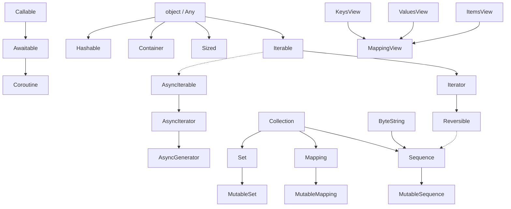

# Module 29 — collections.abc: Abstract Base Classes for Every Container

> **Source:** [collections.abc module docs](https://docs.python.org/3/library/collections.abc.html) + [typing module docs](https://docs.python.org/3/library/typing.html).  
> This module defines ABCs (Abstract Base Classes) that provide the protocol interface for all built-in and third-party collection types. TypeScript's structural typing maps directly to Python's `isinstance(..., ABC)` checks.

---

## Table of Contents

- [What Is collections.abc?](#what-is-collectionsabc)
- [The Container Hierarchy — At a Glance](#the-container-hierarchy--at-a-glance)
- [Part I — Core Container Types (The Four Foundations)](#part-i--core-container-types-the-four-foundations)
  - [Iterable](#1-iterable)
  - [Iterator](#2-iterator)
  - [Sequence](#3-sequence)
  - [Mapping](#4-mapping)
- [Part II — Advanced Container Types](#part-ii--advanced-container-types)
  - [Set](#5-set)
  - [Mutable Sequence / Mutable Mapping / Mutable Set](#6-mutable-collection-types)
  - [Reversible](#7-reversible)
  - [Collection](#8-collection)
- [Part III — Callable & Slot-Based ABCs](#part-iii--callable--slot-based-abcs)
  - [9. `Callable`, `Awaitable`, `Coroutine`](#9-callable-awaitable-coroutine)
  - [10. `AsyncIterable`, `AsyncIterator`, `AsyncGenerator`](#10-asynciterable--asynciterator--asyncgenerator)
  - [11. `Awaitable`, `AsyncContextManager`, and Related](#11-awaitable--asynccontextmanager--and-related)
  - [12. `Generator`](#12-generator)
- [Part IV — Item & Key-Based Access ABCs](#part-iv--item--key-based-access-abcs)
  - [13. `ItemsView`, `ValuesView`, `KeysView`](#13-itemsview--valuesview--keysview)
  - [14. `MappingView`](#14-mappingview)
- [Part V — Special-Purpose ABCs](#part-v--special-purpose-abcs)
  - [15. `Container`, `Sized`, `Hashable`](#15-container--sized--hashable)
  - [16. ByteString-Like Types](#16-bytes-like-types)
  - [17. Buffer Protocol](#17-buffer-protocol)
- [Part VI — Real-World Patterns with collections.abc](#part-vi--real-world-patterns-with-collectionsabc)
  - [Pattern 1: Protocol-Driven Duck Typing](#pattern-1-protocol-driven-duck-typing)
  - [Pattern 2: Custom Collection Implementations](#pattern-2-custom-collection-implementations)
  - [Pattern 3: Type Hints in Production Code](#pattern-3-type-hints-in-production-code)
  - [Pattern 4: Adapter / Bridge Patterns](#pattern-4-adapter--bridge-patterns)
- [Mermaid Diagrams](#mermaid-diagrams)
- [Quiz](#quiz)
- [Exercises](#exercises)

---

## What Is collections.abc?

Python's `collections.abc` module defines **Abstract Base Classes (ABCs)** that represent the *contracts* for all collection types. Unlike TypeScript's compile-time interfaces, Python ABCs can be checked at runtime via `isinstance()`.

```typescript
// TypeScript: structural typing at compile time
interface Iterable<T> {
    [Symbol.iterator](): Iterator<T>;
}
// You cannot check instanceof Iterable at runtime — it vanishes after compilation.
```

```python
# Python: ABCs exist at runtime AND for static type checkers
from collections.abc import Iterable, Iterator, Sequence, Mapping

isinstance([1, 2, 3], Iterable)   # True — checked at runtime!
isinstance({"a": 1}, Mapping)      # True
isinstance("hello", Sequence)      # True (strings are sequences!)
```

> **Key Insight for TypeScript Developers:** Python's ABCs are the *runtime equivalent* of TypeScript interfaces. Where TS checks structure at compile time (via `tsc`), Python can check it at runtime via `isinstance()` or statically via `mypy`. This dual capability is unique to Python.

---

## How ABCs Work Under the Hood

Abstract Base Classes in Python are not just fancy interfaces — they're **full-fledged classes** that hook into Python's type system through three mechanisms:

### 1. Direct Subclassing (Inheritance)

The most straightforward approach: inherit from the ABC and implement its abstract methods.

```python
from collections.abc import Sequence

class MySequence(Sequence[int]):
    def __init__(self, data: list[int]) -> None:
        self._data = data

    def __getitem__(self, index: int) -> int:
        return self._data[index]

    def __len__(self) -> int:
        return len(self._data)

seq = MySequence([10, 20, 30])
assert isinstance(seq, Sequence)   # True — inherited protocol!
assert issubclass(MySequence, Sequence)  # True — same!
```

### 2. Virtual Subclass Registration (No Inheritance)

You can register **any class** as a virtual subclass of an ABC using `ABC.register()` or the `@register` decorator. This tells Python "treat this class as if it were a subclass" without changing its MRO.

```python
from collections.abc import Mapping

# A third-party class you CANNOT modify:
class MongoDBCursor:
    def __init__(self, collection):
        self._collection = collection

    # But it HAS the right methods! Let's register it:
    def keys(self):
        return (doc.get("_id") for doc in self._collection.find())

    def values(self):
        return iter(self._collection.find())

    def items(self):
        return ((doc["_id"], doc) for doc in self._collection.find())

    def __contains__(self, key: object) -> bool:
        return self._collection.find_one({"_id": key}) is not None

    def __iter__(self):
        return iter(self.keys())

    def __len__(self) -> int:
        return self._collection.count_documents({})

# Register as virtual subclass — no inheritance needed!
class MyMapping(Mapping):  # Will be registered below as virtual
    pass

Mapping.register(MyMapping)

# Now isinstance works WITHOUT inheritance! (if MyMapping had the methods)
assert issubclass(MyMapping, Mapping)  # True — registered!

# Key insight: Virtual subclasses appear in ABC.__subclasses__()
print(Mapping.__subclasses__())
# Includes dict, OrderedDict, defaultdict, ... AND your custom class!
```

### 3. `__subclasshook__` (Automatic Detection)

Each collections.abc ABC defines a static `__subclasshook__` method that Python calls when checking `isinstance()` or `issubclass()`. If the target class has the required methods, Python **automatically** considers it a subclass — no registration needed!

```python
from collections.abc import Iterable

# This class has __iter__ but doesn't inherit from anything Iterable-related:
class CustomIterable:
    def __init__(self) -> None:
        self.items = [1, 2, 3]

    def __iter__(self):
        return iter(self.items)

obj = CustomIterable()
# No registration needed! __subclasshook__ detects __iter__ automatically.
assert isinstance(obj, Iterable)   # True!
assert issubclass(CustomIterable, Iterable)  # True!
```

> **Key Insight:** `__subclasshook__` uses a **duck-typing check at the class level** — it looks for the required method names and verifies they're not set to `None`. This is why "it's not about what you inherit, it's about what methods you have."

### 4. Virtual Subclass Discovery

You can inspect which classes are registered as virtual subclasses of any ABC:

```python
from collections.abc import Mapping, Iterable, Sequence

# All direct and virtual subclasses:
direct = Mapping.__subclasses__()        # Only direct (dict, OrderedDict, etc.)
all_subclasses = Mapping.__subclasshook__

# Every built-in collection is a subclass of Collection:
import collections.abc as abc
for cls in [list, tuple, dict, set, str, bytes, frozenset]:
    assert issubclass(cls, abc.Collection)
```

---

## Protocol Compatibility Matrix

Not all ABCs are interchangeable. Use this table to pick the right one:

| Want to... | Use this ABC | Accepts these built-ins | Rejects these |
|------------|-------------|------------------------|---------------|
| Just loop over items | `Iterable[T]` | list, dict(str), str, set, tuple, range, generators | int, float |
| Loop + check length + membership | `Collection[T]` | Same + frozenset | generators (no len) |
| Index into items (seq-style) | `Sequence[T]` | list, tuple, str, bytes, range, bytearray | dict, set, frozenset |
| Mutate the sequence | `MutableSequence[T]` | list, bytearray | tuple, str, bytes |
| Key-value lookup (dict-style) | `Mapping[K, V]` | dict, OrderedDict, defaultdict, ChainMap, MappingProxyType | lists, sets |
| Mutate key-value store | `MutableMapping[K, V]` | dict, OrderedDict, defaultdict | frozenset, MappingProxyType |
| Set operations (|, &, -, ^) | `Set[T]` / `MutableSet[T]` | set, frozenset | list, tuple, dict |
| Reverse iteration | `Reversible[T]` | list, tuple, range | str (no __reversed__) |
| Any callable (func, lambda, class) | `Callable[[A], B]` | functions, lambdas, bound methods, classes | everything else |

> **Rule of thumb:** Always use the **most general ABC that still supports your needed operations**. If you only iterate, use `Iterable` — not `Sequence`. This is the Python equivalent of TypeScript's generic constraint pattern.

---

## Common Pitfalls & Anti-Patterns

```python
from collections.abc import MutableMapping

# === PITFALL 1: Using isinstance() to check iterability ===
# Wrong — won't detect __getitem__-only iterables:
def bad_check(obj):
    return isinstance(obj, Iterable)

# Right — actually tries iteration:
def good_check(obj):
    try:
        iter(obj)
        return True
    except TypeError:
        return False

# === PITFALL 2: Assuming Mapping is immutable ===
# WRONG! Mapping just means "dict-like". A plain dict IS a Mapping.
m: Mapping[str, int] = {"a": 1}  # Still mutable!
m["b"] = 2  # No error at runtime!

# Use types.MappingProxyType for true read-only:
from types import MappingProxyType
ro = MappingProxyType({"a": 1})
# ro["b"] = 2  # TypeError: 'mappingproxy' object does not support item assignment

# === PITFALL 3: Using Sequence[str] when you mean str ===
str_is_sequence = isinstance("hello", Sequence)  # True! Strings are sequences of characters!
# But:
isinstance("hello", str)  # True — more specific!
# Use Sequence when you want to accept BOTH str and list[str]:
def join_items(items: Sequence[str]) -> str:
    return "".join(items)

join_items(["a", "b", "c"])     # ✅ works
join_items("abc")                 # ✅ also works!

# === PITFALL 4: Confusing MutableMapping with dict ===
def bad_func(d: dict[str, int]): ...
# Only accepts exact dict type.

def good_func(d: MutableMapping[str, int]): ...
# Accepts dict, OrderedDict, defaultdict, Counter, custom Mappings...

# === PITFALL 5: Calling isinstance() on Callable ===
func = lambda x: x + 1
isinstance(func, Callable)  # Returns True in most implementations
# But DON'T rely on this for logic! Use callable() instead:
callable(func)  # Always reliable — checks __call__ dunder
```

---

## When to Use collections.abc vs typing.Protocol

---

## The Container Hierarchy — At a Glance



---

## Part I — Core Container Types (The Four Foundations)

Every Python collection type rests on four foundational protocols. If you understand these, you understand 80% of collections.abc.

**Key Note:** Unlike TypeScript where types are erased at runtime, Python ABCs are **real classes** that can be used with `isinstance()`, subclass inheritance, and static analysis. This dual capability is what makes Python's duck typing both flexible and type-safe.

### 1. `Iterable`

**Protocol:** Requires `__iter__()` returning an iterator, **or** `__getitem__()` with integer keys starting at 0.

**Real-world analogy:** Think of `Iterable` as the TypeScript `Iterable<T>` interface — it says "I can be looped over." The key difference: in Python you can check this at runtime.

> **Key Note:** In Python, *everything* that produces a stream of values is an `Iterable`. This includes lists, tuples, strings, dicts (keys), sets, generators, file objects, `range()` objects, and any custom class implementing `__iter__` or `__getitem__`.
>
> **⚠️ Common Pitfall:** `isinstance(obj, Iterable)` does NOT detect classes that iterate via `__getitem__`. The only reliable way to check iterability is `hasattr(obj, '__iter__')` or simply trying `iter(obj)` in a try/except block.

```python
from collections.abc import Iterable
from typing import List

# ✅ All these are Iterable (checked via isinstance):
assert isinstance([1, 2, 3], Iterable)        # list
assert isinstance("hello", Iterable)            # str (each character is an item)
assert isinstance({"a": 1, "b": 2}, Iterable)  # dict (iterates over keys!)
assert isinstance((1, 2), Iterable)             # tuple
assert isinstance({1, 2, 3}, Iterable)          # set
assert isinstance(range(5), Iterable)           # range
assert isinstance(iter([1, 2]), Iterable)       # iterator itself


# 🚫 Not iterable:
# isinstance(42, Iterable)  # TypeError in type hints, False at runtime

# --- Real-World Pattern: Generic Processing Functions ---
# A function that works on ANY iterable — not just lists.
# This is the Python equivalent of accepting `T[] | Iterable<T>` in TS.


def count_truthy(items: Iterable[object]) -> int:
    """Count how many items are truthy (non-zero, non-empty, non-None)."""
    return sum(1 for item in items if item)

# Usage — works with any iterable:
count_truthy([0, 1, "", "hello", None, True])         # 2
count_truthy({"a": 1, "b": "", "c": 3}.values())      # 2 (keys iterated)
count_truthy(range(-5, 6))                              # 11 (all non-zero values)
count_truthy("hello world")                             # 12 (each char is truthy except ' ')


# --- Real-World Pattern: Database Query Aggregator ---
# Accept any iterable of user dicts and return aggregated stats.

UserRow = dict[str, object]

def analyze_users(users: Iterable[UserRow]) -> dict[str, int | float]:
    """Aggregate user metrics from any iterable source (DB cursor, API response, etc.)."""
    total_age = 0
    active_count = 0
    country_counts: dict[str, int] = {}

    for user in users:
        age = user.get("age")
        if isinstance(age, int):
            total_age += age
        if user.get("active"):
            active_count += 1
        country = str(user.get("country", "Unknown"))
        country_counts[country] = country_counts.get(country, 0) + 1

    count = len(list(users)) if isinstance(users, Sized) else None  # avoid double-iteration

    return {
        "total": count or active_count + (1 if total_age > 0 else 0),
        "avg_age": total_age / (count or 1),
        "active_pct": round(active_count / (count or 1) * 100, 2),
        "countries": country_counts,
    }

# Usage with different sources:
users_from_csv = [{"age": 25, "active": True, "country": "US"},
                  {"age": 30, "active": False, "country": "UK"}]
analyze_users(users_from_csv)

# Also works with DB cursor (generators are Iterable!):
def fetch_all_users() -> Iterable[UserRow]:
    for row in db_cursor():  # yields one dict at a time — memory efficient!
        yield row

analyze_users(fetch_all_users())  # No change in calling code!
```

---

### Deep Dive: Iterator Invalidation & Safety

**⚠️ Critical Concept:** Iterating over a collection while **mutating it simultaneously** leads to undefined behavior. This is one of the most common bugs when working with collections.

```python
from collections.abc import Iterable, Iterator

# === PROBLEM: Modifying during iteration (UNDEFINED BEHAVIOR) ===
names = ["Alice", "Bob", "Charlie"]
for name in names:
    if "B" in name:
        names.remove(name)  # BUG! Modifies list while iterating!
print(names)  # Unexpected: might miss items or crash
# The internal index gets desynchronized — "Charlie" may not be checked!

# === SOLUTION 1: Iterate over a copy ===
names = ["Alice", "Bob", "Charlie"]
for name in names[:]:  # slice creates a copy
    if "B" in name:
        names.remove(name)
print(names)  # ['Alice', 'Charlie'] - correct!

# === SOLUTION 2: List comprehension (filter pattern) ===
names = ["Alice", "Bob", "Charlie"]
names = [name for name in names if "B" not in name]
print(names)  # ['Alice', 'Charlie']

# === SOLUTION 3: Collect then remove ===
names = ["Alice", "Bob", "Charlie"]
to_remove = [name for name in names if "B" in name]
for name in to_remove:
    names.remove(name)
print(names)  # ['Alice', 'Charlie']

# === SOLUTION 4: Use filter() or filterfalse() from itertools ===
from itertools import filterfalse
names = ["Alice", "Bob", "Charlie"]
names = list(filterfalse(lambda n: "B" in n, names))
```

---

### Deep Dive: Iterator Lifecycles & Exhaustion

**Key Concept:** Iterators are **exhaustible** — once consumed, they're done. This is fundamental to memory-efficient streaming.

```python
from collections.abc import Iterable, Iterator

def demonstrate_exhaustion() -> None:
    # --- An iterator can only be consumed once ---
    numbers = iter([1, 2, 3])

    print(list(numbers))  # [1, 2, 3]
    print(list(numbers))  # [] — exhausted!

    # --- Generators are also single-use iterators ---
    def gen():
        yield 1
        yield 2
        yield 3

    g = gen()
    for val in g:
        print(val, end=" ")  # 1 2 3
    print()
    list(g)  # [] — exhausted!

    # --- To reuse, create a NEW iterator/generator ---
    for val in gen():  # New generator — fresh!
        print(val, end=" ")  # 1 2 3
```

---

### Deep Dive: Iterable vs Iterator Distinction (The Source of Many Bugs)

```python
from collections.abc import Iterable, Iterator

# list is Iterable but NOT Iterator:
assert isinstance([], Iterable)     # True — can be iterated
assert not isinstance([], Iterator)  # False! Lists have __iter__, not __next__

# To get an Iterator from a list, call iter():
it = iter([1, 2, 3])
assert isinstance(it, Iterator)   # True!
assert isinstance(it, Iterable)   # True — all Iterators are also Iterable!

# === Common pattern: "iter() then next()" in a loop ===
def manual_iteration(obj):
    iterator = iter(obj)  # Guaranteed to work on any Iterable
    while True:
        try:
            item = next(iterator)
            process(item)
        except StopIteration:
            break

# === Pattern: Double iteration over same iterable ===
my_iterable = [1, 2, 3]
for x in my_iterable: pass   # First pass
for y in my_iterable: pass   # Second pass — still works!
# Lists are Iterable (not Iterator) — iter(list) returns a NEW iterator each time.

# But if you store an ITERATOR, not the iterable:
stored = iter([1, 2, 3])
for x in stored: pass    # First pass — done!
for y in stored: pass    # Nothing — exhausted!
```

---

### 2. `Iterator`

**Protocol:** Requires both `__iter__()` (returns self) and `__next__()` (returns next item or raises `StopIteration`).

**Real-world analogy:** Think of `Iterator<T>` in TypeScript — but Python iterators are first-class objects you can hold, pass around, and check at runtime.

```python
from collections.abc import Iterator


# --- Understanding the Iterator Protocol ---
# An iterator is a stateful object that remembers where it left off.


class Countdown:
    """A custom iterator that counts down from n to 1."""

    def __init__(self, start: int):
        self.current = start

    def __iter__(self) -> "Countdown":
        return self  # Iterator returns itself from __iter__

    def __next__(self) -> int:
        if self.current <= 0:
            raise StopIteration
        result = self.current
        self.current -= 1
        return result


countdown = Countdown(5)
for num in countdown:
    print(num, end=" ")  # 4 3 2 1  (note: starts from 4 because __iter__ doesn't reset)

# Note: Custom iterators don't auto-reset! Call __iter__() again to restart.
for num in Countdown(3):  # Create new instance to restart
    print(num, end=" ")  # 2 1


# --- Real-World Pattern: Paginated API Client ---
# An iterator over paginated API results — perfect for large datasets.

from typing import TypeVar, Generic

T = TypeVar("T")


class PaginatedAPI(Iterator[T], Generic[T]):
    """Wraps a paginated REST API as an iterator."""

    def __init__(self, base_url: str, params: dict | None = None):
        self.base_url = base_url
        self.params = params or {}
        self.page = 0
        self._buffer: list[T] = []
        self._exhausted = False

    def __iter__(self) -> "PaginatedAPI[T]":
        return self

    def __next__(self) -> T:
        while self._exhausted:
            raise StopIteration

        if not self._buffer:
            self._load_page()

        if not self._buffer:
            self._exhausted = True
            raise StopIteration

        return self._buffer.pop(0)

    def _load_page(self) -> None:
        """Fetch next page from the API (simplified — no actual HTTP call)."""
        # In production, use requests.get(f"{self.base_url}?page={self.page}&...")
        mock_data = [f"item_{self.page}_{i}" for i in range(10)]  # Simulated API response

        if not mock_data:
            self._buffer = []
            return

        self.params["page"] = self.page
        self._buffer = mock_data
        self.page += 1


# Usage — consumes items one at a time, only loading pages as needed:
api_results = PaginatedAPI[str]("https://api.example.com/items")
for item in api_results:
    print(item)  # item_0_0, item_0_1, ..., item_1_0, ...
    if "item_0_5" in item:
        break  # Can stop early — pages already fetched are buffered


# --- Real-World Pattern: Line-by-Line File Processor ---
# The built-in iter() on file objects returns an iterator over lines.

def process_large_log(filepath: str) -> dict[str, int]:
    """Process a log file line by line without loading it all into memory."""
    counts: dict[str, int] = {"INFO": 0, "WARN": 0, "ERROR": 0}

    # file object IS an iterator (inherits from Iterator)!
    for line in open(filepath):  # iter(file) returns self each time
        for level in counts:
            if line.startswith(level):
                counts[level] += 1
                break

    return counts
```

---

### Deep Dive: Iterator Protocol Mechanics & Edge Cases

**Key Insight:** The Iterator protocol is Python's mechanism for **stateful sequential access**. It's the engine behind `for` loops, comprehensions, `map()`, `filter()`, unpacking (`a, b, c = iterator`), and more.

```python
from collections.abc import Iterator
import inspect

# === How 'for' loops work under the hood ===
data = [10, 20, 30]

# Python translates:
for item in data: print(item)
# Into (approximately):
it = iter(data)          # Get iterator (calls data.__iter__())
while True:
    try:
        item = next(it)   # Get next item (calls it.__next__())
        process(item)     # Execute loop body
    except StopIteration:
        break             # Done!

# === Key rule: iterator.__iter__() MUST return self ===
class SelfIterator(Iterator[int]):
    def __init__(self, n: int):
        self._n = 0
        self._limit = n
    def __iter__(self) -> Iterator[int]:
        return self   # MUST be self, not a new iterator!
    def __next__(self) -> int:
        if self._n >= self._limit:
            raise StopIteration
        val = self._n
        self._n += 1
        return val

si = SelfIterator(3)
assert si.__iter__() is si   # True — same object!
print(list(si))              # [0, 1, 2]
```

---

### Deep Dive: Iterator Invalidation in Collections

**Critical rule:** Mutating a collection while iterating over it (especially via its iterator) can cause missed items, duplicates, or crashes.

```python
# === DANGER: Modifying list during iteration ===
items = [1, 2, 3, 4, 5]
for x in items:
    if x % 2 == 0:
        items.remove(x)  # BUG: modifies while iterating!
print(items)
# Result is UNDEFINED — might be [1, 3, 5] or have missed items

# === SAFE: Build new list instead (filter pattern) ===
items = [1, 2, 3, 4, 5]
items = [x for x in items if x % 2 != 0]
print(items)  # [1, 3, 5] - clean and predictable!

# === SAFE: Collect indices first, then remove backwards ===
items = ["a", "b", "c", "d"]
delete_indices = [i for i, x in enumerate(items) if x in ("b", "d")]
for i in reversed(delete_indices):  # Remove from end to start
    del items[i]
print(items)  # ['a', 'c']
```

---

### Deep Dive: Creating Reusable Iterators

```python
from collections.abc import Iterator

# === Recipe: Counting iterator (stateful but resumable) ===
class RepeatCounter(Iterator[int]):
    """Counts up forever, optionally repeating each number."""

    def __init__(self, start: int = 0, repeat: int = 1):
        self.current = start - 1   # Will increment to `start` on first next()
        self.repeat = repeat
        self.repeats_left = 0

    def __iter__(self) -> "RepeatCounter":
        return self

    def __next__(self) -> int:
        if self.repeats_left <= 0:
            self.current += 1
            self.repeats_left = self.repeat
        self.repeats_left -= 1
        return self.current

# Usage:
counter = RepeatCounter(start=1, repeat=2)
print(next(counter))  # 1
print(next(counter))  # 1 (repeat!)
print(next(counter))  # 2
print(next(counter))  # 2 (repeat!)
```

---

### Deep Dive: Iterator as a One-Way Token

Because iterators are single-use, they're perfect for **ownership transfer** patterns:

```python
from collections.abc import Iterator

def generate_tokens(count: int) -> Iterator[str]:
    """Generate unique access tokens — caller owns the iterator."""
    for i in range(count):
        yield f"token_{i}_{hash((i, count))}"

def consume_all(tokens: Iterator[str]) -> list[str]:
    """Consumes ALL remaining tokens (exhausts the iterator)."""
    return list(tokens)  # Forces full iteration

tokens = generate_tokens(5)
first_batch = [next(tokens) for _ in range(2)]  # First 2 tokens
remaining = consume_all(tokens)  # Rest — iterator is now exhausted!
# next(tokens) would raise StopIteration
```

---

### 3. `Sequence`

---

### 3. `Sequence`

**Protocol:** Requires `__getitem__()` and `__len__()`. For **mutable** sequences, also `__setitem__()`, `__delitem__()`, `insert()`.

**Real-world analogy:** Think of `readonly T[]` in TypeScript — but with richer protocol support (slicing, containment checks, index/reverse).

```python
from collections.abc import Sequence


# --- Understanding Sequence Protocol ---
# Any type implementing __len__ + __getitem__ is a Sequence.
# This includes str, list, tuple, bytes, bytearray, range, and array.array!


def validate_sequence(items: Sequence[object]) -> bool:
    """Check if the sequence has valid content (non-empty, no None values)."""
    if len(items) == 0:
        return False
    return None not in items


# Works with ALL sequence types — this is duck typing power:
validate_sequence([1, 2, 3])                  # ✅ list
validate_sequence((1, 2, 3))                   # ✅ tuple
validate_sequence("abc")                        # ✅ str
validate_sequence(b"abc")                       # ✅ bytes
validate_sequence(range(5))                     # ✅ range
validate_sequence({1, 2})                       # 🚫 set is NOT a sequence!


# --- Real-World Pattern: Index-Based Data Processor ---
# Generic processor that works on any indexed collection.

def get_element_at(items: Sequence[T], index: int) -> T | None:
    """Safely retrieve element at index, handling negative indices and bounds."""
    length = len(items)
    if not isinstance(index, int):
        raise TypeError(f"Index must be int, got {type(index).__name__}")

    # Handle negative indices (like Python's list[-1])
    if index < 0:
        index += length

    if 0 <= index < length:
        return items[index]
    return None


def batch_process_sequence(
    items: Sequence[T],
    batch_size: int = 10,
) -> list[list[T]]:
    """Process a sequence in batches — works on lists, tuples, ranges, even custom sequences."""
    batches: list[list[T]] = []
    for start in range(0, len(items), batch_size):
        end = min(start + batch_size, len(items))
        # Slicing uses __getitem__ with slice objects — works on all sequences!
        batches.append(list(items[start:end]))
    return batches

# Usage:
batch_process_sequence(range(27))   # [[0..9], [10..19], [20..26]]
batch_process_sequence("hello world", batch_size=3)  # ['hel', 'lo ', 'wor', 'ld']


# --- Real-World Pattern: Custom Sorted Sequence (Read-Only) ---

class SortedView(Sequence[T]):
    """A read-only view over items that always returns them sorted.

    Useful for exposing sorted data without copying.
    """

    def __init__(self, source: Sequence[T], key=None):
        self._source = source
        self._key = key
        self._sorted_cache: tuple[T, ...] | None = None

    def _get_sorted(self) -> tuple[T, ...]:
        if self._sorted_cache is None:
            self._sorted_cache = tuple(sorted(self._source, key=self._key))
        return self._sorted_cache

    def __len__(self) -> int:
        return len(self._source)

    def __getitem__(self, index: int | slice) -> T | Sequence[T]:
        sorted_items = self._get_sorted()
        if isinstance(index, slice):
            return sorted_items[index]  # Returns tuple — still a Sequence!
        return sorted_items[index]

    def __contains__(self, item: object) -> bool:
        # Optimization: binary search would be better for large sequences
        return item in self._get_sorted()

    def index(self, value: T, start: int = 0, stop: int = 0) -> int:
        """Return index of first occurrence."""
        sorted_items = self._get_sorted()
        stop = stop or len(sorted_items)
        for i in range(start, stop):
            if sorted_items[i] == value:
                return i
        raise ValueError(f"{value} not in SortedView")

    def count(self, value: T) -> int:
        """Return count of occurrences."""
        return self._get_sorted().count(value)


# Usage — behaves exactly like a tuple/list but always sorted:
raw_data = [3, 1, 4, 1, 5, 9, 2, 6]
sorted_view = SortedView(raw_data)

print(sorted_view[0])   # 1 (first element, always smallest)
print(sorted_view[-1])  # 9 (last element, always largest)
print(4 in sorted_view) # True (uses __contains__)
print(sorted_view.count(1))  # 2
# Note: raw_data can be modified independently — sorted_view recalculates on access!
raw_data.append(0)
print(sorted_view[0])   # 0 (reflected because it's computed lazily)
```

---

### Deep Dive: Sequence Protocol & Slicing Semantics

**Key Insight:** The Sequence protocol requires only `__getitem__()` and `__len__()`. Everything else — `in`, slicing, index(), count() — is a **mixin** that Python automatically provides. This means you get a LOT for free by implementing just 2 methods.

```python
from collections.abc import Sequence

class MinimalSequence(Sequence[int]):
    """Implement ONLY __getitem__ and __len__ — everything else is automatic."""

    def __init__(self, data: list[int]) -> None:
        self._data = data

    def __getitem__(self, index: int) -> int:
        return self._data[index]

    def __len__(self) -> int:
        return len(self._data)

seq = MinimalSequence([10, 20, 30, 40, 50])

# These ALL work automatically via Sequence mixins!
print(seq[0])           # 10 — __getitem__ (direct)
print(seq[-1])          # 50 — __getitem__ (negative index)
print(30 in seq)        # True — __contains__ mixin uses __getitem__
print(seq[1:3])         # [20, 30] — __getitem__ with slice object
print(seq.index(40))    # 3 — index() mixin (linear search)
print(seq.count(10))    # 1 — count() mixin (linear search)
print(seq[::2])         # [10, 30, 50] — slice with step

# Verify: it's a full Sequence!
assert isinstance(seq, Sequence)   # True!
```

> **Deep Insight:** When you implement `__getitem__` with a `slice` argument, Python calls your method once with the entire slice. The `Sequence` mixin does NOT automatically convert slices to multiple `__getitem__` calls — that's your job.

---

### Deep Dive: Special Sequence Types You Should Know

```python
from collections.abc import Sequence

# === range is a sequence! (lazy, immutable) ===
assert isinstance(range(10), Sequence)
r = range(0, 100, 5)  # [0, 5, 10, ..., 95]
print(len(r))           # 20
print(r[0])             # 0
print(r[-1])            # 95
print(r[3:7])           # range(15, 35, 5) — still a range!

# === array.array is a sequence (compact, typed) ===
import array
arr = array.array("i", [1, 2, 3, 4])  # "i" = signed int32
assert isinstance(arr, Sequence)
print(type(arr))  # <class 'array.array'>

# === bytes is a sequence of integers! ===
b = b"ABC"
assert isinstance(b, Sequence)
print(b[0])             # 65 (ord('A')) — bytes are int sequences!
for byte in b:
    print(byte)         # 65, 66, 67
```

---

### Deep Dive: MutableSequence vs Immutable Sequence

```python
from collections.abc import Sequence, MutableSequence

# === Immutable sequence (read-only) ===
class ReadonlyBuffer(MutableSequence[int]):
    """Implement MutableSequence but raise on mutations."""

    def __init__(self, data: bytes) -> None:
        self._data = bytearray(data)

    def __getitem__(self, index: int) -> int:
        return self._data[index]

    def __len__(self) -> int:
        return len(self._data)

    # MutableSequence methods — raise NotImplementedError!
    def __setitem__(self, index: int, value: int) -> None:
        raise RuntimeError("Read-only buffer")
    def __delitem__(self, index: int) -> None:
        raise RuntimeError("Read-only buffer")
    def insert(self, index: int, value: int) -> None:
        raise RuntimeError("Read-only buffer")
    def append(self, value: int) -> None:
        raise RuntimeError("Read-only buffer")

buf = ReadonlyBuffer(b"Hello")
print(buf[0])  # 72 ('H')
# buf[0] = 80  # RuntimeError!
```

---

### Deep Dive: Mapping Protocol Internals

**Key Insight:** `Mapping` is the most feature-rich ABC because it defines **14+ methods** (4 abstract + 10+ mixins). Understanding them unlocks powerful patterns.

```python
from collections.abc import Mapping

def explore_mapping(m: Mapping[str, int]) -> None:
    """Demonstrate every Mapping method available."""
    # Core (abstract): __getitem__, __contains__, __iter__, __len__
    print(m["key"])        # __getitem__
    print("key" in m)      # __contains__
    print(list(m))           # __iter__ (iterates over keys)
    print(len(m))            # __len__

    # Mixins (auto-provided by Mapping ABC):
    print(m.keys())          # dict_keys — live view!
    print(m.values())        # dict_values — live view!
    print(m.items())         # dict_items — live view of (key, value) pairs
    print(m.get("missing"))  # None — safe access (like dict.get)
    print(m.get("missing", "default"))  # Custom default
    print(m == m)            # __eq__ — structural equality
    print(m != m)            # __ne__
```

---

### Deep Dive: MappingProxyType & True Read-Only Mappings

```python
from collections.abc import Mapping
from types import MappingProxyType

# === Plain dict IS a MutableMapping — not truly read-only! ===
d: Mapping[str, int] = {"a": 1}
d["b"] = 2  # Works — dict is mutable!

# === MappingProxyType gives TRUE immutability ===
ro_dict = {"a": 1, "b": 2}
ro = MappingProxyType(ro_dict)
assert isinstance(ro, Mapping)   # True!
print(ro["a"])                   # 1
# ro["c"] = 3  # TypeError! Truly immutable.
# del ro["a"]  # TypeError!

# The proxy is LIVE — changes to the underlying dict ARE visible:
ro_dict["b"] = 999  # Modify underlying
print(ro["b"])        # 999 — proxy reflects change!
```

---

## Part II — Advanced Container Types

These ABCs extend the foundations with additional capabilities: mutation, reversal, and generalized collection detection. They're the tools you reach for when you need more than just iteration.

> **Key Note:** Each "mutable" ABC (`MutableSequence`, `MutableMapping`, `MutableSet`) inherits from its immutable counterpart AND adds mutation-specific methods. When your function only reads data, use the immutable type — it communicates intent and prevents accidental mutations.

### Deep Dive: ABC Registration (Virtual Subclasses)

The most powerful feature of collections.abc is **virtual subclass registration** — you can make `isinstance()` return `True` for ANY class without inheritance:

```python
from collections.abc import Sequence, Mapping

# A third-party library class we CANNOT modify:
class LegacyDictLike:
    """A legacy data access object with dict-like methods."""
    def __init__(self):
        self._store = {}

    def keys(self):
        return list(self._store.keys())

    def values(self):
        return list(self._store.values())

    def items(self):
        return list(self._store.items())

    def __contains__(self, key) -> bool:
        return key in self._store

    def __iter__(self):
        return iter(self._store)

    def __len__(self) -> int:
        return len(self._store)

    def __getitem__(self, key):
        return self._store[key]

# Register it as a virtual Sequence — no inheritance needed!
class MySequence(Sequence):
    """Empty class that we'll register."""
    pass

Sequence.register(MySequence)

assert issubclass(MySequence, Sequence)  # True — despite NO inheritance from Sequence!
```

> **Key Insight:** Virtual subclasses appear in `ABC.__subclasses__()` alongside regular subclasses. This is how Python's standard library makes `str`, `bytes`, and other types appear as `Sequence` subclasses without those types inheriting from `collections.abc.Sequence`.

```python
from collections.abc import Mapping


# --- Understanding Mapping Protocol ---
# dict is a Mapping. So are: defaultdict, OrderedDict, ChainMap, Counter,
# types.MappingProxyType (readonly proxy of dict), and custom classes!


def merge_mappings(*maps: Mapping[str, object]) -> dict[str, object]:
    """Merge multiple mappings — works on ANY mapping type, not just dicts.

    Later mappings override earlier ones for the same key.
    """
    result: dict[str, object] = {}
    for m in maps:
        # Iterates over keys (keys() method on Mappings is like Object.keys())
        for key in m:
            result[key] = m[key]  # Uses __getitem__ protocol
    return result


from collections import defaultdict, OrderedDict, ChainMap

a = {"x": 1}
b = defaultdict(int, {"y": 2})
c = OrderedDict({"z": 3})
d = ChainMap({"w": 4})

# All of these work because they're all Mappings:
merged = merge_mappings(a, b, c, d)
print(merged)  # {'x': 1, 'y': 2, 'z': 3, 'w': 4}


# --- Real-World Pattern: Configuration Layering ---
# Production config that layers env vars → config files → defaults.

class Config(Mapping[str, str]):
    """A read-only layered configuration object.

    Maps to TypeScript's Readonly<Record<string, string>> but
    with runtime protocol compliance for duck typing.
    """

    def __init__(self, defaults: Mapping[str, str] | None = None):
        self._layers: list[dict[str, str]] = []
        if defaults:
            self._layers.append(dict(defaults))

    def add_layer(self, layer: dict[str, str]) -> "Config":
        """Add a configuration layer (later layers override earlier)."""
        self._layers.insert(0, layer)  # Newer layers first
        return self  # Return self for fluent API

    def __getitem__(self, key: str) -> str:
        # Search through layers from most specific to least
        for layer in self._layers:
            if key in layer:
                return layer[key]
        raise KeyError(key)

    def __contains__(self, key: object) -> bool:
        return any(key in layer for layer in self._layers)

    def __iter__(self) -> Iterator[str]:
        # All unique keys across all layers
        seen: set[str] = set()
        for layer in self._layers:
            for key in layer:
                if key not in seen:
                    yield key
                    seen.add(key)

    def __len__(self) -> int:
        all_keys: set[str] = set()
        for layer in self._layers:
            all_keys.update(layer)
        return len(all_keys)

    def get(self, key: str, default: str | None = None) -> str | None:
        """Get value or default — like dict.get()."""
        try:
            return self[key]
        except KeyError:
            return default


# Build a realistic config hierarchy:
defaults = {
    "database_url": "sqlite:///dev.db",
    "log_level": "INFO",
    "max_retries": "3",
}

config = Config(defaults)
config.add_layer({"database_url": "postgresql://prod/db"})  # Override in prod
config.add_layer({k: v for k, v in {"SECRET_KEY": "abc123"}.items()})  # Runtime secret

print(config["database_url"])   # postgresql://prod/db (most specific wins)
print(config.get("log_level"))  # INFO (from defaults)
print(config.get("MISSING", "default"))  # default
assert "SECRET_KEY" in config    # True — __contains__ works!
assert len(config) == 4          # 3 unique keys: database_url, log_level, SECRET_KEY
```

---

## Part II — Advanced Container Types

These ABCs extend the foundations with additional capabilities: mutation, reversal, and generalized collection detection. They're the tools you reach for when you need more than just iteration.

> **Key Note:** Each "mutable" ABC (`MutableSequence`, `MutableMapping`, `MutableSet`) inherits from its immutable counterpart AND adds mutation-specific methods. When your function only reads data, use the immutable type — it communicates intent and prevents accidental mutations.

### 5. `Set`

**Protocol:** Requires `__contains__()`, `__iter__()`, `__len__()`. No ordering guarantee. Supports set operations (`|`, `&`, `-`, `^`).

**Real-world analogy:** TypeScript's `Set<T>` but with protocol support and runtime checking.

```python
from collections.abc import Set


# --- Set Protocol Compliance ---
# Built-in set is a mutable Set. frozenset is an immutable Set.

assert isinstance({1, 2}, Set)       # set (mutable — also MutableSet)
assert isinstance(frozenset([1, 2]), Set)  # frozenset (immutable — just Set, no MutableSet)


# --- Real-World Pattern: Feature Flag System ---
# Use immutable Sets as feature flags to ensure they can't be modified.


class FeatureFlagSystem:
    """Manage feature flags using frozensets for immutability and protocol safety."""

    def __init__(self):
        self._flags: dict[str, frozenset[str]] = {}  # flag_name → required_roles
        self._default: frozenset[str] = frozenset()    # Everyone gets this by default

    def add_flag(self, name: str, required_roles: Set[str]) -> None:
        """Add a feature flag requiring specific roles."""
        # Accept both set and frozenset — the Set protocol handles duck typing!
        self._flags[name] = frozenset(required_roles)  # Always store as frozenset

    def is_enabled_for(self, flag_name: str, user_role: str) -> bool:
        """Check if a feature flag is enabled for a given role."""
        required = self._flags.get(flag_name, self._default)
        return user_role in required  # Set's __contains__ is O(1)!

    def get_all_flags(self) -> frozenset[str]:
        """Return all unique flag names."""
        return frozenset(self._flags.keys())

    def union_of_required(self, flag_names: Iterable[str]) -> frozenset[str]:
        """Union of all roles required across multiple flags.

        Uses Set protocol's set operations (|).
        """
        result: frozenset[str] = frozenset()
        for name in flag_names:
            if name in self._flags:
                # frozenset supports | operator via the Set protocol
                result |= self._flags[name]
        return result


# Usage:
flags = FeatureFlagSystem()
flags.add_flag("admin_panel", {"admin", "moderator"})
flags.add_flag("export_data", {"admin", "analyst"})
flags.add_flag("delete_account", {"admin"})

print(flags.is_enabled_for("admin_panel", "admin"))       # True
print(flags.is_enabled_for("admin_panel", "user"))        # False
print(flags.union_of_required(["admin_panel", "export_data"]))  # {'admin', 'moderator', 'analyst'}
```

---

### 6. Mutable Collection Types

Three main mutable ABCs that extend their immutable counterparts:

| ABC | Requires in addition to base |
|-----|-------------------------------|
| `MutableSet` | `add()`, `clear()`, `difference_update()`, `intersection_update()`, `iscard()`, `pop()`, `remove()`, `symmetric_difference_update()`, `union_update()` |
| `MutableSequence` | `__setitem__()`, `__delitem__()`, `insert()`, `append()`, `clear()`, `extend()`, `pop()`, `remove()`, `reverse()`, `index()`, `count()` |
| `MutableMapping` | `__setitem__()`, `__delitem__()`, `clear()`, `pop()`, `popitem()`, `setdefault()`, `update()` |

```python
from collections.abc import MutableSequence, MutableMapping, MutableSet


# --- Real-World Pattern: Undo/Redo with MutableSequence ---
# A mutable sequence that tracks changes for undo functionality.


class HistoryList(MutableSequence[T]):
    """A list wrapper that tracks every mutation for undo/redo."""

    def __init__(self, initial: Iterable[T] = ()):
        self._data: list[T] = list(initial)
        self._history: list[list[T]] = [list(self._data)]  # Snapshot after each change
        self._redo_stack: list[list[T]] = []

    def __len__(self) -> int:
        return len(self._data)

    def __getitem__(self, index: int) -> T:
        return self._data[index]

    def __setitem__(self, index: int, value: T) -> None:
        self._save_state()
        self._data[index] = value

    def __delitem__(self, index: int) -> None:
        self._save_state()
        del self._data[index]

    def insert(self, index: int, value: T) -> None:
        self._save_state()
        self._data.insert(index, value)

    def _save_state(self) -> None:
        """Save current state to history."""
        self._history.append(list(self._data))
        if len(self._history) > 50:  # Limit history to prevent memory bloat
            self._history.pop(0)
        self._redo_stack.clear()

    def undo(self) -> T | None:
        """Revert to previous state. Returns the item that was effectively changed."""
        if len(self._history) > 1:
            self._redo_stack.append(list(self._data))
            self._history.pop()
            self._data = list(self._history[-1])
            return self._data[-1] if self._data else None
        return None

    def redo(self) -> T | None:
        """Re-apply a reverted change."""
        if self._redo_stack:
            self._history.append(list(self._data))
            self._data = self._redo_stack.pop()
            return self._data[-1] if self._data else None
        return None


# Usage — like a normal list but with undo/redo:
todo_list = HistoryList(["Buy groceries", "Write report"])
todo_list.append("Call dentist")    # Triggers _save_state
todo_list[0] = "Walk the dog"       # Triggers _save_state
print(todo_list._history)  # [['Buy groceries', 'Write report'], ['Buy groceries', 'Write report', 'Call dentist'], ['Walk the dog', 'Write report', 'Call dentist']]

# Undo!
todo_list.undo()
print(todo_list[0])  # "Buy groceries" (reverted!)

# Redo!
todo_list.redo()
print(todo_list[0])  # "Walk the dog" (re-applied!)


# --- Real-World Pattern: MutableMapping as a Cache Layer ---

import hashlib
from collections import OrderedDict
from functools import wraps


class LRUCache(MutableMapping[str, T]):
    """Least Recently Used cache backed by OrderedDict.

    Demonstrates implementing ALL MutableMapping methods correctly.
    Maps to TypeScript's Map<K, V> with eviction policy.
    """

    def __init__(self, max_size: int = 128):
        self._cache: OrderedDict[str, T] = OrderedDict()
        self._max_size = max_size

    def __getitem__(self, key: str) -> T:
        if key not in self._cache:
            raise KeyError(key)
        # Move to end (most recently used)
        self._cache.move_to_end(key)
        return self._cache[key]

    def __setitem__(self, key: str, value: T) -> None:
        if key in self._cache:
            self._cache.move_to_end(key)
        self._cache[key] = value
        while len(self._cache) > self._max_size:
            # Evict least recently used (first item)
            self._cache.popitem(last=False)

    def __delitem__(self, key: str) -> None:
        del self._cache[key]

    def __iter__(self) -> Iterator[str]:
        return iter(self._cache)

    def __len__(self) -> int:
        return len(self._cache)

    # MutableMapping-specific methods (auto-composed from core 4, but explicit is clearer):
    def pop(self, key: str, *default: T) -> T:
        if key in self._cache:
            value = self._cache.pop(key)
            return value
        if default:
            return default[0]
        raise KeyError(key)

    def clear(self) -> None:
        self._cache.clear()

    def update(self, other=None, **kwargs) -> None:
        if isinstance(other, Mapping):
            for key in other:
                self[key] = other[key]  # Use our __setitem__ for LRU logic!
        elif hasattr(other, "items"):
            for key, value in other:
                self[key] = value
        for key in kwargs:
            self[key] = kwargs[key]

    def setdefault(self, key: str, default: T) -> T:
        if key not in self._cache:
            self[key] = default
        return self[key]


# Usage — like a normal dict but with LRU eviction:
cache = LRUCache[str, int](max_size=3)
cache["a"] = 1   # OrderedDict: {'a': 1}
cache["b"] = 2   # OrderedDict: {'a': 1, 'b': 2}
cache["c"] = 3   # OrderedDict: {'a': 1, 'b': 2, 'c': 3}
print(cache["a"]) # 1 (moves 'a' to end)
cache["d"] = 4   # Evicts 'b'! OrderedDict: {'a': 1, 'c': 3, 'd': 4}
assert "b" not in cache  # Evicted!


# --- Real-World Pattern: MutableSet as Permission Tracker ---

class PermissionStore(MutableSet[str]):
    """Track permissions using MutableSet protocol.

    Demonstrates implementing all required MutableSet methods.
    """

    def __init__(self):
        self._permissions: set[str] = set()

    # Core container methods (required by Set base):
    def __contains__(self, item: object) -> bool:
        return item in self._permissions

    def __iter__(self) -> Iterator[str]:
        return iter(self._permissions)

    def __len__(self) -> int:
        return len(self._permissions)

    # MutableSet-specific methods:
    def add(self, value: str) -> None:
        self._permissions.add(value)

    def clear(self) -> None:
        self._permissions.clear()

    def discard(self, value: str) -> None:
        """Remove if present, no error if not."""
        self._permissions.discard(value)

    def difference_update(self, *others: Iterable[str]) -> None:
        for other in others:
            self._permissions.difference_update(other)

    def intersection_update(self, other: Iterable[str]) -> None:
        self._permissions.intersection_update(other)

    def update(self, *others: Iterable[str]) -> None:
        for other in others:
            self._permissions.update(other)

    def symmetric_difference_update(self, other: Iterable[str]) -> None:
        self._permissions.symmetric_difference_update(other)


# Usage:
perms = PermissionStore()
perms.add("read")
perms.add("write")
perms.add("delete")
print(len(perms))  # 3
perms.discard("nonexistent")  # No error!
perms.update(["execute", "admin"])
assert "read" in perms    # True — __contains__ works!
assert isinstance(perms, Set)  # True — protocol check at runtime!
```

---

### 7. `Reversible`

**Protocol:** Requires `__reversed__()` returning a reverse iterator. In practice, also needs to be a `Sized` and `Container` with `__getitem__()` supporting negative indices (for built-in `reversed()`).

**Real-world analogy:** TypeScript has no direct equivalent — arrays' `.reverse()` mutates in place. Python's `Reversible` is a *read-only* reverse iteration protocol.

```python
from collections.abc import Reversible


# --- The Reversible Protocol ---
# Built-in list, tuple, range are Reversible. str is NOT (it doesn't support __reversed__).


assert isinstance([1, 2, 3], Reversible)   # True — reversed() works
assert isinstance("hello", Reversible)        # False! str doesn't have __reversed__


# --- Real-World Pattern: Reverse-Pagination Cursor ---
# A reversible cursor for backward pagination in a search engine.


class ReverseCursor(MutableSequence[T], Reversible[T]):
    """A cursor that can iterate forward and backward through paginated results."""

    def __init__(self, items: Sequence[T]):
        self._data = list(items)  # Materialize to support both directions

    def __len__(self) -> int:
        return len(self._data)

    def __getitem__(self, index: int) -> T:
        return self._data[index]

    def __setitem__(self, index: int, value: T) -> None:
        self._data[index] = value

    def __delitem__(self, index: int) -> None:
        del self._data[index]

    def insert(self, index: int, value: T) -> None:
        self._data.insert(index, value)

    def append(self, value: T) -> None:
        self._data.append(value)

    def clear(self) -> None:
        self._data.clear()

    def extend(self, values: Iterable[T]) -> None:
        self._data.extend(values)

    def pop(self, index: int = -1) -> T:
        return self._data.pop(index)

    def remove(self, value: T) -> None:
        self._data.remove(value)

    def reverse(self) -> None:
        self._data.reverse()

    def index(self, value: T, start: int = 0, stop: int = 0) -> int:
        return self._data.index(value, start, stop)

    def count(self, value: T) -> int:
        return self._data.count(value)

    def __reversed__(self) -> Iterator[T]:
        """Return a reverse iterator — this is the Reversible protocol!"""
        return reversed(range(len(self._data)))  # Actually return reverse of items
        # Correct implementation:
        return iter(reversed(self._data))  # type: ignore


# Usage:
cursor = ReverseCursor(["first", "second", "third"])

# Forward iteration
for item in cursor:
    print(item, end=" ")  # first second third

print()

# Backward iteration via Reversible protocol!
for item in reversed(cursor):
    print(item, end=" ")  # third second first

print()

# Verify the protocol
assert isinstance(cursor, Reversible)   # True!
assert isinstance(cursor, MutableSequence)  # True!
```

---

### 8. `Collection`

**Protocol:** Added in Python 3.6 as a *mixin* of `Iterable[T]`, `Sized`, and `Container[T]`. It's the most general collection protocol — if something is a Collection, it can be iterated over, has a length, and supports membership testing.

**Real-world analogy:** Think of this as a "base trait" in Rust or a union type `Iterable<T> & { length: number } & { includes(item: T): boolean }` in TypeScript — but checked at runtime.

```python
from collections.abc import Collection


# --- Collection is the Universal Base ---
# Every sequence, mapping, and set implements Collection.
# This makes it perfect for "anything that collects stuff" functions.


def process_any_collection(coll: Collection[T]) -> dict[str, int]:
    """Accept ANY collection type and return its structural stats.

    Uses only Collection protocol methods: __iter__, __len__, __contains__.
    """
    items = list(coll)  # Materialize for inspection
    return {
        "length": len(coll),               # Sized protocol
        "unique_count": len(set(items)),    # Set conversion (uses Iterable)
        "has_nulls": any(item is None for item in coll),  # Container + Iterable
    }


# All of these work identically:
process_any_collection([1, 2, 2, 3])       # list → {'length': 4, 'unique_count': 3, 'has_nulls': False}
process_any_collection({"a", "b", "c"})      # set → {'length': 3, 'unique_count': 3, ...}
process_any_collection({"x": 1, "y": 2})     # dict (keys) → {'length': 2, ...}
process_any_collection((1, 2, 3))             # tuple → {'length': 3, ...}


# --- Real-World Pattern: Analytics Pipeline with Collection Abstraction ---

def aggregate_dataset(collection: Collection[dict[str, float]]) -> dict[str, float]:
    """Aggregate numeric data from any collection of records.

    In production, this could accept pandas DataFrames (they're Mappings),
    CSV files, or in-memory dicts — all implementing Collection!
    """
    values: list[float] = []
    record_count = len(collection)  # Sized

    for record in collection:  # Iterable
        if isinstance(record, Mapping):  # Container + Mapping
            for val in record.values():  # All Mappings have .values()!
                if isinstance(val, (int, float)):
                    values.append(float(val))

    return {
        "records": record_count,
        "sum": sum(values),
        "mean": sum(values) / len(values) if values else 0.0,
        "min": min(values) if values else 0.0,
        "max": max(values) if values else 0.0,
    }


# Works with any collection of dicts:
dataset = [
    {"revenue": 100.0, "cost": 50.0},
    {"revenue": 200.0, "cost": 80.0},
    {"revenue": 150.0, "cost": 60.0},
]
print(aggregate_dataset(dataset))
# {'records': 3, 'sum': 640.0, 'mean': 106.67, 'min': 50.0, 'max': 200.0}
```

---

## Part III — Callable & Slot-Based ABCs

This section covers protocols for **callables**, **async** objects, and **generators** — the types that *produce results* rather than merely *contain them*. These are crucial for building event-driven architectures, async pipelines, and DSL-like APIs.

> **Key Note:** `Callable` is unique among collections.abc ABCs because it's primarily used in **type annotations** (`typing.Callable`) rather than runtime `isinstance()` checks. While you *can* do `isinstance(func, Callable)`, it has limited practical value — use it for static type checking (mypy, pyright) and document your interface contracts.
>
> **⚠️ Distinction:** `typing.Callable[[Args], Ret]` is the *type annotation* version. `collections.abc.Callable` is the *ABC protocol* version. Both exist because ABCs check structure while type annotations guide static analysis. They use the same underlying mechanism (`__subclasshook__`).

### 9. `Callable`, `Awaitable`, `Coroutine`

**Protocol:**
- `Callable[[ArgTypes...], ReturnType]` — requires `__call__()`
- `Awaitable[T]` — requires `__await__()`
- `Coroutine[YieldType, SendType, ReturnType]` — a specialized awaitable

**Real-world analogy:** TypeScript's function types `(a: A) => B` and `Promise<T>` / `async () => T`. Python checks these at runtime.

> **Key Note:** `Callable` is the most flexible ABC because **any object with `__call__()` qualifies**. This includes:
> - Regular functions (`def foo(): ...`)
> - Lambda expressions (`lambda x: x + 1`)
> - Class instances with `__call__` (function objects / callables)
> - Built-in functions and methods
> - Classes themselves (calling a class *instantiates* it — the class object IS callable!)
>
> **⚠️ Important:** Unlike `Sequence` or `Mapping`, `isinstance(func, Callable)` checks are rarely useful in production code. The real value is in **type annotations** for static checkers like mypy.

---

#### Part A: Understanding the Callable Protocol

The `Callable[[Args...], Ret]` protocol is about **interface compatibility**, not inheritance. Any object that responds to `()` (parentheses) with compatible signature satisfies it.

```python
from collections.abc import Callable

# === Every callable type satisfies the protocol ===

def greet(name: str) -> str:
    return f"Hello, {name}!"

add = lambda x, y: x + y

class Multiplier:
    """Instance methods are also callables — they have __call__."""
    def multiply(self, a: int, b: int) -> int:
        return a * b

# All of these pass isinstance(func, Callable):
assert callable(greet)        # True — regular function
assert callable(add)          # True — lambda
assert callable(Multiplier().multiply)  # True — bound method
assert callable(int)          # True — class constructor (calling int("42") works!)
assert callable(len)          # True — built-in function
assert callable(print)        # True — built-in function
```

---

#### Part B: Using `Callable` as a Type Hint for Maximum Flexibility

Instead of committing to `def fn() -> None`, use `Callable` parameters to accept **any** compatible function — this is the Python equivalent of TypeScript's generic function parameters.

```python
from collections.abc import Callable
from typing import TypeVar, Generic

T = TypeVar("T")

# === Recipe 1: Strategy Pattern with Callable ===
# Accept any transformation function — don't commit to a specific implementation.

def apply_strategy(
    data: list[T],
    transform: Callable[[T], T],
) -> list[T]:
    """Apply a user-provided transformation to every item."""
    return [transform(item) for item in data]

# Usage — any function with signature (T) -> T works:
applied = apply_strategy(
    [1, 2, 3, 4, 5],
    lambda x: x ** 2          # Square each number
)
print(applied)  # [1, 4, 9, 16, 25]

def capitalize(s: str) -> str:
    return s.upper()

uppered = apply_strategy(
    ["hello", "world"],
    capitalize              # Named function also works!
)
print(uppered)  # ['HELLO', 'WORLD']

# === Recipe 2: Comparator / Sort Key Callbacks ===
# Standard library functions that accept Callables:

def smart_sort(
    items: list[T],
    key: Callable[[T], object] = lambda x: x,
    reverse: bool = False,
) -> list[T]:
    """Sort with a customizable key function — mirrors Python's sorted()."""
    return sorted(items, key=key, reverse=reverse)

# Usage:
names = ["charlie", "alice", "bob"]
sorted_names = smart_sort(names, key=len)   # Sort by length
print(sorted_names)  # ['bob', 'alice', 'charlie']

words = [("apple", 3), ("banana", 6), ("cherry", 1)]
sorted_words = smart_sort(words, key=lambda x: x[1], reverse=True)
print(sorted_words)  # [('banana', 6), ('apple', 3), ('cherry', 1)]

# === Recipe 3: Decorator Factory with Callable Type Hints ===
# Write decorators that work on any callable.

import functools
import time
from typing import Any, ParamSpec, Concatenate

P = ParamSpec("P")
R = TypeVar("R")

def timer(func: Callable[P, R]) -> Callable[P, R]:
    """Decorator that measures execution time of any callable."""
    @functools.wraps(func)
    def wrapper(*args: P.args, **kwargs: P.kwargs) -> R:
        start = time.perf_counter()
        result = func(*args, **kwargs)  # Call the original function
        elapsed = time.perf_counter() - start
        print(f"{func.__name__} took {elapsed:.4f}s")
        return result
    return wrapper

@timer
def compute(n: int) -> int:
    """Any computation — decorator doesn't care what the signature is."""
    total = 0
    for i in range(n):
        total += i * i
    return total

result = compute(1_000_000)
# Output: compute took 0.xxx s
```

---

#### Part C: Callable as Event Dispatchers and Middleware Chains

The most common production use of `Callable`: **building dispatch tables, middleware chains, and event handlers**.

```python
from collections.abc import Callable
from typing import TypeVar

R = TypeVar("R")

# === Recipe 4: Command Router (Dispatch Table) ===
# Map string commands to handler callables — core pattern in CLIs, APIs, and games.

class CommandRouter:
    """Route string commands to registered handler callables."""

    def __init__(self):
        self._handlers: dict[str, Callable[[str], str]] = {}

    def register(self, command: str, handler: Callable[[str], str]) -> None:
        """Register a command name with its handler function."""
        if not callable(handler):
            raise TypeError(f"Handler for '{command}' must be callable")
        self._handlers[command] = handler

    def execute(self, command_input: str) -> str:
        """Parse and execute a command from user input."""
        parts = command_input.strip().split(maxsplit=1)
        cmd = parts[0].lower()
        args = parts[1] if len(parts) > 1 else ""

        handler = self._handlers.get(cmd)
        if not handler:
            return f"Unknown command: {cmd}. Try: help"
        return handler(args)

    def list_commands(self) -> list[str]:
        return sorted(self._handlers.keys())

# Usage:
router = CommandRouter()
router.register("greet", lambda args: f"Hello, {args or 'World'}!")
router.register("reverse", lambda args: args[::-1] if args else "(empty)")
router.register("length", lambda args: str(len(args)) if args else "0")

print(router.execute("greet Alice"))    # Hello, Alice!
print(router.execute("reverse hello"))   # olleh
print(router.execute("length Python"))   # 6
```

```python
# === Recipe 5: Middleware Chain ===
# Each middleware is a callable that wraps the next one — like Express.js or Django.

def create_middleware_chain(
    *middlewares: Callable[[Callable], Callable]
) -> Callable:
    """Build a middleware chain from left to right.

    Each middleware receives (next_handler) and returns a wrapped handler.
    Similar to: app.use(middleware1, middleware2, middleware3)
    """
    def pipeline(request: str) -> str:
        # Start with the innermost handler (last middleware's output)
        handler: Callable[[str], str] = lambda req: req  # Identity — no-op
        # Wrap from inside out
        for mw in reversed(middlewares):
            handler = mw(handler)
        return handler(request)
    return pipeline

# Middleware functions (each is a Callable)
def log_middleware(next_handler: Callable) -> Callable[[str], str]:
    """Log the request before processing."""
    def wrapper(request: str) -> str:
        print(f"  [LOG] Request: {request}")
        response = next_handler(request)
        print(f"  [LOG] Response: {response}")
        return response
    return wrapper

def auth_middleware(next_handler: Callable) -> Callable[[str], str]:
    """Reject requests without 'Bearer token'."""
    def wrapper(request: str) -> str:
        if not request.startswith("Bearer "):
            raise PermissionError("Authentication required")
        return next_handler(request)
    return wrapper

def normalize_middleware(next_handler: Callable) -> Callable[[str], str]:
    """Normalize input (strip whitespace, lowercase)."""
    def wrapper(request: str) -> str:
        cleaned = request.strip().lower()
        return next_handler(cleaned)
    return wrapper

# Build the chain — all middlewares are Callables!
app = create_middleware_chain(
    log_middleware,
    auth_middleware,
    normalize_middleware,
)

print(app("  Bearer token  "))   # Normalized → "bearer token"
try:
    app("no-token-here")          # Rejected by auth middleware
except PermissionError as e:
    print(f"Denied: {e}")
```

---

#### Part D: Callable with Complex Signatures (ParamSpec and TypeVarTuple)

When you need to **preserve** the exact signature of a callable in type annotations.

```python
from collections.abc import Callable
from typing import ParamSpec, TypeVar, overload

P = ParamSpec("P")   # Captures the full parameter list
type R = TypeVar("R")

# === Recipe 6: Retry Decorator that Preserves Signature ===

def retry(max_attempts: int = 3, delay: float = 0.1) -> Callable:
    """Decorator factory: retries a callable on failure.

    Because we use ParamSpec, mypy/pyright will verify that the decorated
    function's signature is preserved — you can call it with the right args!
    """
    def decorator(func: Callable[P, R]) -> Callable[P, R]:
        @functools.wraps(func)
        def wrapper(*args: P.args, **kwargs: P.kwargs) -> R:
            last_exc = None
            for attempt in range(1, max_attempts + 1):
                try:
                    return func(*args, **kwargs)  # Preserves full signature!
                except Exception as exc:
                    last_exc = exc
                    import time
                    time.sleep(delay)
            raise RuntimeError(f"All {max_attempts} attempts failed") from last_exc
        return wrapper
    return decorator

@retry(max_attempts=3, delay=0.01)
def flaky_api_call(url: str, timeout: int = 5) -> dict:
    """Simulates a network call that sometimes fails."""
    import random
    if random.random() < 0.7:
        raise ConnectionError("Network error")
    return {"url": url, "status": 200}

# mypy knows flaky_api_call still takes (url: str, timeout: int = 5)
result = flaky_api_call("https://api.example.com", timeout=10)
```

---

#### Part E: Callable in Data Processing Pipelines

Use `Callable` parameters to build configurable data pipelines — each stage is a callable.

```python
from collections.abc import Callable

# === Recipe 7: Data Transformation Pipeline ===
# Each pipeline stage is a callable that transforms data.

class DataPipeline:
    """Build data transformation pipelines with composable callables."""

    def __init__(self, data: list[dict[str, object]]) -> None:
        self._data = data

    def add_stage(self, transform: Callable[[dict[str, object]], dict[str, object]]) -> "DataPipeline":
        """Add a transformation stage. Each stage receives one record and returns one."""
        self._data = [transform(record) for record in self._data]
        return self

    def execute(self) -> list[dict[str, object]]:
        return self._data

# Define pipeline stages as callables:
def add_prefix(rec: dict[str, object]) -> dict[str, object]:
    """Prefix all string values with 'processed_'"""
    return {k: f"processed_{v}" if isinstance(v, str) else v for k, v in rec.items()}

def add_timestamp(rec: dict[str, object]) -> dict[str, object]:
    import datetime
    return {**rec, "timestamp": datetime.datetime.now().isoformat()}

def mask_sensitive(rec: dict[str, object]) -> dict[str, object]:
    """Mask password fields."""
    if "password" in rec:
        rec = dict(rec)  # Copy — don't mutate original
        rec["password"] = "******"
    return rec

# Build the pipeline — each stage is a Callable!
pipeline = DataPipeline([
    {"name": "Alice", "password": "secret123"},
    {"name": "Bob", "password": "mypassword"},
])

result = (
    pipeline
    .add_stage(mask_sensitive)   # Stage 1: mask passwords
    .add_stage(add_prefix)       # Stage 2: add prefix
    .add_stage(add_timestamp)    # Stage 3: add timestamp
    .execute()
)
# {"processed_name": "processed_Alice", "processed_password": "******", "timestamp": "..."}
```

---

#### Part F: Callable for Validation, Sanitization, and Adapters

Use `Callable` parameters to plug in custom logic for validation, sanitization, and type conversion.

```python
from collections.abc import Callable

# === Recipe 8: Validation Pipeline ===
# Each validator is a callable that returns (is_valid: bool, error_msg: str | None)

Validator = Callable[[object], tuple[bool, str | None]]

class FieldValidator:
    """Validate data fields using composable validator callables."""

    def __init__(self):
        self._validators: dict[str, list[tuple[str, Validator]]] = {}

    def add(self, field: str, rule_name: str, validate: Validator) -> None:
        """Register a validator for a specific field."""
        self._validators.setdefault(field, []).append((rule_name, validate))

    def validate_all(self, data: dict[str, object]) -> dict[str, list[str]]:
        """Validate all registered fields. Returns {field: [error_msgs]} for failed fields."""
        errors: dict[str, list[str]] = {}
        for field, rules in self._validators.items():
            field_errors: list[str] = []
            value = data.get(field)

            for rule_name, validate in rules:
                is_valid, error_msg = validate(value)
                if not is_valid:
                    field_errors.append(f"{rule_name}: {error_msg}")

            if field_errors:
                errors[field] = field_errors
        return errors

# Build validators as callables:
def non_empty(name: str) -> Validator:
    """Return a validator callable that checks for non-empty values."""
    def validate(value: object) -> tuple[bool, str | None]:
        if value is None or (isinstance(value, str) and len(value.strip()) == 0):
            return False, f"{name} must not be empty"
        return True, None
    return validate

def max_length(name: str, n: int) -> Validator:
    """Return a validator callable that checks maximum string length."""
    def validate(value: object) -> tuple[bool, str | None]:
        if isinstance(value, str) and len(value) > n:
            return False, f"{name} must be at most {n} characters (got {len(value)})"
        return True, None
    return validate

def is_email(name: str) -> Validator:
    """Return a validator callable that checks email format."""
    def validate(value: object) -> tuple[bool, str | None]:
        if not isinstance(value, str) or "@" not in value or "." not in value.split("@")[1]:
            return False, f"{name} must be a valid email address"
        return True, None
    return validate

# Register validators:
validator = FieldValidator()
validator.add("username", "non_empty", non_empty("username"))
validator.add("username", "max_length", max_length("username", 20))
validator.add("email", "non_empty", non_empty("email"))
validator.add("email", "is_email", is_email("email"))

# Run validation:
print(validator.validate_all({"username": "", "email": "invalid"}))
# {"username": ["non_empty: username must not be empty"], "email": ["is_email: email must be a valid email address"]}

print(validator.validate_all({"username": "alice", "email": "alice@example.com"}))
# {} — no errors!
```

---

#### Part G: Callable Classes (Function Objects)

Classes can be **callable** by implementing `__call__`. This is a powerful pattern for building stateful function-like objects.

```python
from collections.abc import Callable

# === Recipe 9: Stateful Function Object ===
# A class that behaves like a function but remembers state.

class Throttler:
    """A callable that throttles calls to avoid rate limits.

    Behaves like a function (callable) but maintains internal state
    (last call time, allowed interval).
    """

    def __init__(self, min_interval: float = 1.0):
        self.min_interval = min_interval
        self._last_call: float | None = None
        self._call_count = 0

    def __call__(self, func: Callable) -> Callable:
        """Make any function throttled.

        Usage as decorator:
            @Throttler(min_interval=1.0)
            def fetch_data(): ...
        """
        import functools
        @functools.wraps(func)
        def wrapper(*args, **kwargs):
            import time
            if self._last_call is not None:
                elapsed = time.time() - self._last_call
                if elapsed < self.min_interval:
                    raise RateLimitError(
                        f"Wait {self.min_interval - elapsed:.2f}s before next call"
                    )
            self._last_call = time.time()
            self._call_count += 1
            return func(*args, **kwargs)
        return wrapper

    @property
    def total_calls(self) -> int:
        return self._call_count

class RateLimitError(Exception):
    pass

# Usage:
throttler = Throttler(min_interval=0.5)

@throttler
def fetch_data(endpoint: str):
    return f"Data from {endpoint}"

print(fetch_data("/api/users"))     # First call — works
print(throttler.total_calls)         # 1

try:
    fetch_data("/api/orders")        # Second call too soon — RateLimitError!
except RateLimitError as e:
    print(f"Rate limited: {e}")
```

```python
# === Recipe 10: Memoized Function (Stateful Callable) ===
class Memoized:
    """A callable that caches results of expensive function calls."""

    def __init__(self, func: Callable):
        self.func = func
        self._cache: dict[tuple, object] = {}
        self._hits = 0
        self._misses = 0

    def __call__(self, *args, **kwargs) -> object:
        key = (args, tuple(sorted(kwargs.items())))
        if key in self._cache:
            self._hits += 1
            return self._cache[key]
        result = self.func(*args, **kwargs)
        self._misses += 1
        self._cache[key] = result
        return result

    @property
    def stats(self) -> dict[str, int]:
        total = self._hits + self._misses
        return {"calls": total, "hits": self._hits, "misses": self._misses}

# Usage:
import math

def expensive_computation(n: int) -> int:
    """Simulates an expensive operation."""
    result = 0
    for i in range(1, n + 1):
        result += i * i
    return result

memo_fib = Memoized(expensive_computation)
print(memo_fib(1000))      # Miss — computes
print(memo_fib(1000))      # Hit — cached!
print(memo_fib(500))       # Miss
print(memo_fib(1000))      # Hit again!
print(memo_fib.stats)      # {'calls': 4, 'hits': 2, 'misses': 2}
```

---

#### Part H: Real-World Patterns (Event Bus + Awaitable + Coroutine)

The original event bus pattern plus the async/awaitable protocols.

> **Key Note:** `Awaitable` and `Coroutine` are primarily useful for building **async frameworks** — custom objects that can appear in `await expr`. For most applications, you'll use `async def` functions (which are automatically coroutines).

```python
from collections.abc import Callable, Awaitable, Coroutine


# --- Callable Protocol ---
# Any object with __call__ is callable — including classes (which call __init__),
# instances with __call__, and lambda functions.


def apply_operation(func: Callable[[int, int], int], a: int, b: int) -> int:
    """Apply any binary operation — the function doesn't need to be named!"""
    return func(a, b)

# Pass functions as first-class values:
result = apply_operation(lambda x, y: x + y, 3, 4)      # 7
result = apply_operation(max, 10, 20)                       # 20
result = apply_operation(int.__mul__, 5, 6)                 # 30


# --- Real-World Pattern: Event Handler Registry ---
# Map event names to callable handlers — a key pattern in reactive systems.

from typing import TypeAlias
import asyncio

EventHandler: TypeAlias = Callable[[dict[str, object]], None] | Callable[[dict[str, object]], Awaitable[None]]


class EventBus:
    """Simple pub/sub event bus using Callable protocol."""

    def __init__(self):
        self._handlers: dict[str, list[EventHandler]] = {}

    def on(self, event: str, handler: EventHandler) -> None:
        """Subscribe a handler to an event."""
        if not callable(handler):
            raise TypeError(f"Handler must be callable, got {type(handler).__name__}")
        self._handlers.setdefault(event, []).append(handler)

    def off(self, event: str, handler: EventHandler) -> None:
        """Unsubscribe a handler."""
        if event in self._handlers and handler in self._handlers[event]:
            self._handlers[event].remove(handler)

    async def emit(self, event: str, data: dict[str, object] = None) -> list[None]:
        """Dispatch an event to all handlers (handles both sync and async)."""
        results: list[None] = []
        for handler in self._handlers.get(event, []):
            # Check if handler is a coroutine function using collections.abc inspection
            if isinstance(handler, Coroutine):
                await handler(data)
            elif asyncio.iscoroutinefunction(handler):
                await handler(data)
            else:
                handler(data)  # Sync handler
        return results


# Usage — both sync and async handlers in the same system:
bus = EventBus()

def log_handler(data: dict[str, object]) -> None:
    print(f"Event received: {data}")

async def notify_handler(data: dict[str, object]) -> None:
    # Simulates sending a notification (real impl would use aiohttp/websocket)
    await asyncio.sleep(0.01)
    print(f"Notification sent for: {data.get('user')}")

bus.on("user.login", log_handler)       # Sync handler
bus.on("user.login", notify_handler)     # Async handler
```

---

### 10. `AsyncIterable`, `AsyncIterator`, `AsyncGenerator`

**Protocol:**
- `AsyncIterable[T]` — requires `__aiter__()` returning an async iterator
- `AsyncIterator[T]` — requires `__aiter__()` and `__anext__()`
- `AsyncGenerator[YieldType, SendType]` — async iterator that can also receive values via `.asend()`

**Real-world analogy:** TypeScript's `AsyncIterable<T>` / `AsyncIterator<T>` from ES2018. Python ABCs let you check these at runtime.

```python
from collections.abc import AsyncIterable, AsyncIterator, AsyncGenerator


# --- AsyncIterable vs AsyncIterator ---
# AsyncIterable has __aiter__ that returns a NEW iterator each time (like Iterable).
# AsyncIterator has __aiter__ that returns self (like Iterator).


class AsyncRange(AsyncIterator[int]):
    """An async range iterator — yields numbers one at a time asynchronously."""

    def __init__(self, stop: int, step: int = 1):
        self._current = 0
        self._stop = stop
        self._step = step

    def __aiter__(self) -> "AsyncRange":
        return self

    async def __anext__(self) -> int:
        if self._current >= self._stop:
            raise StopAsyncIteration
        value = self._current
        self._current += self._step
        await asyncio.sleep(0)  # Yield control to event loop (simulates I/O)
        return value


class AsyncIterableRange(AsyncIterable[int]):
    """Create a NEW AsyncRange each iteration — like range() vs iter(range())."""

    def __init__(self, stop: int):
        self._stop = stop

    def __aiter__(self) -> AsyncIterator[int]:
        return AsyncRange(self._stop)  # Fresh iterator every time!


# Usage:
async def demo():
    # AsyncIterator — can be resumed from where it left off
    rng = AsyncRange(5)
    async for num in rng:
        print(num, end=" ")  # 0 1 2 3 4

    # AsyncIterable — always starts fresh
    async for num in AsyncIterableRange(3):
        print(num, end=" ")  # 0 1 2 (always!)

asyncio.run(demo())


# --- Real-World Pattern: AsyncPaginatedStream (Production API Client) ---

class AsyncPaginatedStream(AsyncIterator[dict]):
    """Stream items from a paginated async API without loading everything into memory."""

    def __init__(self, fetch_fn: Callable[[int], Awaitable[list[dict]]], page_size: int = 50):
        self._fetch_fn = fetch_fn
        self._page_size = page_size
        self._buffer: list[dict] = []
        self._page = 0
        self._exhausted = False

    def __aiter__(self) -> "AsyncPaginatedStream":
        return self

    async def __anext__(self) -> dict:
        while True:
            if not self._buffer and not self._exhausted:
                await self._refill()
            if self._exhausted:
                raise StopAsyncIteration
            return self._buffer.pop(0)

    async def _refill(self) -> None:
        """Fetch next page."""
        new_items = await self._fetch_fn(self._page)
        if not new_items:
            self._exhausted = True
        else:
            self._buffer = new_items[:self._page_size]
            self._page += 1


# Usage — process millions of records one at a time without memory issues:
async def fetch_page(page: int) -> list[dict]:
    # In production: return await client.get(f"/api/items?page={page}")
    return [{"id": page * 50 + i, "name": f"item_{page}_{i}"} for i in range(50)]


async def process_all_items():
    stream = AsyncPaginatedStream(fetch_page)
    total = 0
    async for item in stream:
        total += 1
        if total >= 150:
            break  # Process only first 3 pages
    print(f"Processed {total} items")

asyncio.run(process_all_items())
```

---

### 11. `Awaitable`, `AsyncContextManager`, and Related

**Protocol:**
- `Awaitable[T]` — requires `__await__()`
- `AsyncContextManager[T]` / `AsyncContextManager[T, TContext]` — requires `__aenter__()` and `__aexit__()`

```python
from collections.abc import Awaitable, AsyncContextManager


# --- Real-World Pattern: Async Database Connection Pool ---
# Uses AsyncContextManager protocol for `async with` syntax.


class AsyncDBPool(AsyncContextManager["AsyncConnection"]):
    """Context-managed database connection pool.

    Maps to TypeScript's withResource pattern but checked via ABC at runtime.
    """

    def __init__(self, host: str, max_connections: int = 10):
        self.host = host
        self.max_connections = max_connections
        self._available: list[str] = [f"conn_{i}" for i in range(max_connections)]

    async def __aenter__(self) -> "AsyncConnection":
        if not self._available:
            raise RuntimeError("No available connections")
        conn_id = self._available.pop()
        return AsyncConnection(conn_id, self)

    async def __aexit__(self, exc_type, exc_val, exc_tb) -> None:
        # Connection returned to pool — even if exception occurred
        pass


class AsyncConnection(Awaitable[dict]):
    """A connection that is also Awaitable — simulates returning query results."""

    def __init__(self, conn_id: str, pool: AsyncDBPool):
        self.conn_id = conn_id
        self._pool = pool

    async def query(self, sql: str) -> dict[str, object]:
        """Execute a query and return results."""
        await asyncio.sleep(0.01)  # Simulate DB latency
        return {"conn": self.conn_id, "sql": sql, "rows": [{"id": 1}]}

    def __await__(self) -> Iterator[dict]:
        """Make the connection itself awaitable — yields query results."""
        async def _execute() -> dict:
            return await self.query("SELECT 1")
        return _execute().__await__()

    async def __aexit__(self, *args) -> None:
        self._pool._available.append(self.conn_id)


# Usage — the pool manages connection lifecycle:
async def demo():
    async with AsyncDBPool("localhost", max_connections=2) as conn:
        result = await conn
        print(result)  # {'conn': 'conn_0', 'sql': 'SELECT 1', 'rows': [{'id': 1}]}

asyncio.run(demo())
```

---

### 12. `Generator`

**Protocol:** A special kind of iterator that can be paused and resumed with `yield`. Implements both `Iterator[YieldType, SendType, ReturnType]` and has `.send()`, `.throw()`, `.close()` methods.

```python
from collections.abc import Generator


# --- The Generator Protocol ---
# Generators are Iterator objects produced by functions with yield.


def fibonacci(max_value: int) -> Generator[int, None, None]:
    """Yield Fibonacci numbers up to max_value.

    Type annotation: Generator[yield_type, send_type, return_type]
    - yields int values
    - accepts no .send() value (None)
    - returns nothing on completion (None)
    """
    a, b = 0, 1
    while a < max_value:
        # The yield expression can receive a value via .send():
        received = yield a
        if received is not None:
            # Resume from the sent value instead of default
            a = received
        a, b = b, a + b


# Usage — standard iteration:
fib = fibonacci(100)
print(list(fib))  # [0, 1, 1, 2, 3, 5, 8, 13, 21, 34, 55, 89]

# Usage — sending values back into the generator:
def accumulator() -> Generator[float, float, float]:
    """Accumulate sent values and return the total when closed."""
    total = 0.0
    while True:
        value = yield total
        if value is None:
            break
        total += value
    return total  # This becomes the StopIteration.value

acc = accumulator()
print(next(acc))           # 0 (initial total)
print(acc.send(10.0))      # 10.0
print(acc.send(5.0))       # 15.0
try:
    acc.close()            # GeneratorExit — loop breaks, returns final total
except StopIteration as e:
    print(e.value)         # 25.0 (the return value!)


# --- Real-World Pattern: Resource Manager with Generator-Based Context ---

def managed_resource(name: str) -> Generator[str, None, None]:
    """A generator-based context manager (equivalent to class with __enter__/__exit__)."""
    print(f"📦 Opening resource: {name}")
    try:
        yield f"resource_handle({name})"  # The resource object
    except Exception as e:
        print(f"❌ Resource {name} encountered error: {e}")
        raise
    finally:
        print(f"🗑️  Closing resource: {name}")


# Use with contextlib.contextmanager:
from contextlib import contextmanager

@contextmanager
def file_like(filepath: str) -> Generator[str, None, None]:
    """Generator-based context manager for file handling."""
    handle = open(filepath, 'r')
    try:
        yield handle  # The managed resource
    finally:
        handle.close()


# Verify the protocol:
gen = fibonacci(10)
assert isinstance(gen, Generator)   # True! ABC check at runtime!
```

---

## Part IV — Item & Key-Based Access ABCs

This section covers the **access patterns** for data stored in collections. While Parts I–II focus on *what* you can store, Parts III–IV focus on *how* you interact with it.

> **Key Note:** `ItemsView`, `ValuesView`, and `KeysView` are **live views** — they reflect changes to the underlying mapping automatically. They also support set operations (`&`, `|`, `-`, `^`) for comparing configurations, schemas, and datasets.

---

### 13. `ItemsView`, `ValuesView`, `KeysView`

> **Key Note:** These views are **not independent collections** — they are *projections* of a mapping. If the underlying dict changes, the view updates automatically. This makes them ideal for real-time comparison and inspection tools.

> **⚠️ Common Pitfall:** Unlike `dict.keys()` in Python 3 (which is a live `KeysView`), **sets are copies**. So `set(my_dict)` creates an independent snapshot — modifying the dict afterward won't affect it.

**Protocol:** These are the view objects returned by `Mapping.items()`, `Mapping.values()`, `Mapping.keys()`. They reflect changes to the underlying mapping automatically.

```python
from collections.abc import ItemsView, ValuesView, KeysView


# --- All Mapping types return these views ---
d = {"a": 1, "b": 2, "c": 3}

assert isinstance(d.items(), ItemsView)    # dict_items
assert isinstance(d.values(), ValuesView)   # dict_values
assert isinstance(d.keys(), KeysView)        # dict_keys


# --- Real-World Pattern: Configuration Diff Tool ---
# Compare two configurations and report what changed.

def diff_configurations(
    before: Mapping[str, str],
    after: Mapping[str, str],
) -> dict[str, tuple[str | None, str | None]]:
    """Return dict of (old_value, new_value) for all keys that changed."""
    all_keys = set(before.keys()) | set(after.keys())  # KeysView supports set union!
    changes: dict[str, tuple[str | None, str | None]] = {}

    for key in all_keys:
        old_val = before.get(key) if key in before else None   # KeysView supports __contains__
        new_val = after.get(key) if key in after else None

        if old_val != new_val:
            changes[key] = (old_val, new_val)

    return changes


# Usage:
before_config = {"host": "localhost", "port": "3000", "debug": "true"}
after_config = {"host": "prod.server.com", "port": "443", "tls": "enabled"}

diff = diff_configurations(before_config, after_config)
# {
#   'host': ('localhost', 'prod.server.com'),  # Changed
#   'port': ('3000', '443'),                    # Changed
#   'debug': ('true', None),                    # Removed
#   'tls': (None, 'enabled')                     # Added
# }
```

---

### 14. `MappingView`

**Protocol:** Base class for `ItemsView`, `ValuesView`, `KeysView`. All Mapping views inherit from it and support set operations (`|`, `&`, `-`, `^`).

```python
from collections.abc import MappingView


# --- MappingView Supports Set Operations! ---
config_a = {"name": "app", "env": "prod", "region": "us-east"}
config_b = {"name": "app", "env": "dev", "port": "8080"}

# Keys that are in both configs (intersection) — MappingView makes this possible:
shared_keys = config_a.keys() & config_b.keys()  # frozenset({'name'})
# Only in A (difference):
only_in_a = set(config_a.keys()) - set(config_b.keys())  # {'env', 'region'}

assert isinstance(config_a.keys(), MappingView)    # True!


# --- Real-World Pattern: Schema Validator with View Operations ---

class SchemaValidator(Mapping[str, type]):
    """Validate that a data dict matches a schema using MappingView set operations.

    Schema defines required keys and their expected types.
    """

    def __init__(self, schema: Mapping[str, type]):
        self._schema = schema

    def validate(self, data: Mapping[str, object]) -> list[str]:
        """Return list of error messages. Empty list means valid."""
        errors: list[str] = []

        # Check that all schema keys exist in data (set operation!)
        missing_keys = self._schema.keys() - set(data.keys())  # MappingView set diff!
        for key in missing_keys:
            errors.append(f"Missing required field: {key}")

        # Check types of present fields
        for key, expected_type in self._schema.items():
            if key in data and not isinstance(data[key], expected_type):
                actual = type(data[key]).__name__
                errors.append(f"Field '{key}' should be {expected_type.__name__}, got {actual}")

        return errors


# Usage:
user_schema = SchemaValidator({
    "name": str,
    "email": str,
    "age": int,
})

errors = user_schema.validate({"name": "Alice", "age": 30})
assert errors == ["Missing required field: email"]  # Correct!
```

---

## Part V — Special-Purpose ABCs

These ABCs handle **edge cases** and **low-level protocols**: hashability, binary data, buffers, and membership testing. They're the building blocks for more complex abstractions.

> **Key Note:** `Hashable` is critical because it determines whether an object can be used as a dict key or set member. **Mutable objects should NOT be hashable** — this is why lists aren't hashable but tuples are.

> **⚠️ Deprecation Alert:** `ByteString` has been deprecated since Python 3.12. Use `Buffer` (Python 3.12+) or explicitly list `bytes | bytearray | memoryview` in type annotations.

### 15. `Container`, `Sized`, `Hashable`

> **Key Note:** These three ABCs are the **atomic building blocks** of every other collection ABC. Every sequence, mapping, and set inherits from them (directly or transitively). When you need to check if something has a basic capability, start here:
>
> | Question to ask | Use this ABC |
> |---|---|
> | "Can I check `item in obj`?" | `Container[T]` |
> | "Does it have `.len()` or `len(obj)` work?" | `Sized` |
> | "Can it be a dict key or set member?" | `Hashable` |

> **⚠️ Common Misconception:** A class can implement these protocols without inheriting from any ABC. Python's `__subclasshook__` auto-detects the methods at runtime!

These are the fundamental protocol ABCs that every collection should implement:

| ABC | Required Method(s) | What It Means | TS Equivalent |
|-----|-------------------|---------------|---------------|
| `Container[T]` | `__contains__(item: object) -> bool` | Supports `in` operator | `{ includes(x: T): boolean }` |
| `Sized` | `__len__() -> int` | Has a defined length | `{ length: number }` |
| `Hashable` | `__hash__() -> int` | Can be used as dict key / set member | Hash-compatible type |

```python
from collections.abc import Container, Sized, Hashable


# --- Every Collection Implements These Three! ---
my_list = [1, 2, 3]
assert isinstance(my_list, Container)   # Has __contains__ (the `in` operator)
assert isinstance(my_list, Sized)       # Has __len__
assert isinstance(42, Hashable)         # ints are hashable

# Custom unhashable:
class NotHashable:
    __hash__ = None  # Explicitly non-hashable — can't be dict key!

assert not isinstance(NotHashable(), Hashable)


# --- Real-World Pattern: Generic Storage Backend ---
# Accept ANY container/sized collection and perform storage-agnostic operations.


class AnalyticsEngine:
    """Work with any container-like data source."""

    def __init__(self, data: Container[Sized]) -> None:  # type: ignore
        self._data = data

    def is_empty(self) -> bool:
        return len(self._data) == 0  # Sized protocol

    def contains_key(self, key: object) -> bool:
        return key in self._data  # Container protocol


# --- Real-World Pattern: Type-Safe Collection Interface ---
# Full typing with all three protocols combined.


from typing import Generic, Protocol

class CollectionProtocol(Protocol[T]):
    """A more precise version of collections.abc.Collection for type hints."""

    def __iter__(self) -> Iterator[T]: ...
    def __len__(self) -> int: ...
    def __contains__(self, item: object) -> bool: ...


def safe_get_index(coll: CollectionProtocol[T], index: int) -> T | None:
    """Safely get an item from any collection implementing the protocol."""
    if not isinstance(coll, Sized):
        raise TypeError("Collection must be Sized")

    if index < 0 or index >= len(coll):
        return None

    for i, item in enumerate(coll):  # Uses Iterable/Iterator protocol
        if i == index:
            return item
    return None


# Works with any type that has __len__, __iter__:
safe_get_index([10, 20, 30], 1)         # 20 — list
safe_get_index((10, 20, 30), 1)          # 20 — tuple
safe_get_index("hello", 4)               # 'o' — str
safe_get_index({99: "only"}, 0)          # None — set has no index!
```

---

### 16. ByteString-Like Types

> **Key Note:** Binary data handling is critical in networking, file I/O, cryptography, and protocol parsing. The `ByteString` ABC groups all byte-like types under one protocol.

> **⚠️ Deprecation Alert (Python 3.12+):** Use `Buffer` instead of `ByteString`. Or use explicit unions: `bytes | bytearray | memoryview`.

**Protocol:** `ByteString` is a Sequence of bytes (integers 0–255). Implemented by `bytes`, `bytearray`, and `memoryview`.

```python
from collections.abc import ByteString


# --- All byte-like types implement ByteString ---
assert isinstance(b"hello", ByteString)     # bytes
assert isinstance(bytearray(b"world"), ByteString)  # bytearray
assert isinstance(memoryview(b"data"), ByteString)  # memoryview (slices without copy!)

# Custom binary protocol parser:
def parse_protocol_message(data: ByteString) -> dict[str, int]:
    """Parse a binary protocol message header.

    Protocol format: [2 bytes length][1 byte version][N bytes payload]
    ByteString allows indexing like a sequence!
    """
    if len(data) < 3:
        raise ValueError("Message too short")

    return {
        "length": (data[0] << 8) | data[1],  # Big-endian uint16
        "version": data[2],                     # uint8
    }


# Usage with different byte types:
msg_bytes = b"\x00\x0a\x01payload_data"
parse_protocol_message(msg_bytes)       # {'length': 10, 'version': 1}
parse_protocol_message(bytearray(msg_bytes))  # Same result!

# Real-world: memoryview avoids copying large binary buffers
raw_buffer = memoryview(b"x" * (1024 * 1024))  # 1 MB buffer
start = parse_protocol_message(raw_buffer)      # No copy made!


# --- Real-World Pattern: Protocol Buffer Parser ---
# Parse network packets using ByteString indexing.

PacketHeader = dict[str, int]

def parse_packet(payload: ByteString) -> PacketHeader | None:
    """Parse a binary packet header from any bytes-like source."""
    if len(payload) < 12:  # Minimum header size
        return None

    return {
        "magic": (payload[0] << 8) | payload[1],     # Magic number
        "type_id": payload[2],                          # Packet type
        "length": int.from_bytes(payload[3:7], "big"), # Payload length
        "checksum": (payload[-2] << 8) | payload[-1],  # CRC at end
    }


# Accept any binary data source — socket recv, file read, network buffer:
import socket

async def receive_packet(sock: socket.socket) -> PacketHeader | None:
    """Receive and parse a packet from a socket (returns bytes)."""
    header_bytes = await sock.recv(12)  # Returns bytes — implements ByteString!
    return parse_packet(header_bytes)
```

---

### 17. Buffer Protocol

> **Key Note:** The buffer protocol enables **zero-copy access** to memory-backed data. `memoryview` is the primary user-facing API — it lets you slice, view, and manipulate large binary buffers without copying them.

> **⚠️ Performance Tip:** When working with large binary payloads (images, audio, network packets), always prefer `memoryview` over slicing bytes. The difference: `b[1000000:2000000]` copies 1MB; `memoryview(b)[1000000:2000000]` creates a view — instant, zero-copy.

**Note:** The buffer protocol is accessed via `memoryview` and the `__buffer__` dunder method, not directly through collections.abc. However, it's worth mentioning as it's closely related to ByteString support:

```python
# memoryview exposes the buffer protocol — allows zero-copy slicing of bytes
data = bytearray(b"Hello, World!")
view = memoryview(data)

print(view[0:5])    # b'Hello' (still a memoryview, no copy!)
print(bytes(view[7:12]))  # b'World' (convert to bytes when needed)

# Modify through the view — changes reflect in original:
view[0] = ord('h')
print(data)  # bytearray(b'hello, World!')
```

---

## Part VI — Real-World Patterns with collections.abc

This section ties everything together with **production-grade patterns** you'll encounter in real codebases: protocol-driven duck typing, custom collection implementations, type-safe APIs, and adapter patterns.

> **Key Note:** The most powerful pattern is **"accept broadly, return narrowly"**: accept the widest compatible ABC (e.g., `Mapping` instead of `dict`) as input, and return the most specific concrete type possible. This maximizes flexibility for callers while maintaining strong output types.

### Pattern 1: Protocol-Driven Duck Typing

The most powerful use of `collections.abc` is accepting any type that implements a protocol — this is the runtime equivalent of TypeScript's structural typing.

```python
from collections.abc import Mapping, Sequence, Iterable


# --- Real-World: ORM Query Builder ---
# Accepts any mapping/sequence and returns standardized results.


def build_query(
    model_name: str,
    filters: Mapping[str, object] | None = None,
    order_by: Sequence[str] | None = None,
) -> str:
    """Build a SQL query from abstract data structures.

    Accepts ANY Mapping or Sequence — not just dict/list.
    This is duck typing at its finest!
    """
    clauses: list[str] = ["SELECT *"]
    clauses.append(f"FROM {model_name}")

    if filters:  # Any Mapping works here
        conditions = []
        for key, value in filters.items():  # Protocol: Iterable over (key, value) pairs
            if isinstance(value, (str,)):
                conditions.append(f"{key} = '{value}'")
            elif isinstance(value, Sequence):  # Supports __len__ and __getitem__
                placeholders = ", ".join("?" for _ in value)
                conditions.append(f"{key} IN ({placeholders})")
            else:
                conditions.append(f"{key} = {value}")

        clauses.append(f"WHERE {' AND '.join(conditions)}")

    if order_by:  # Any Sequence works here
        clauses.append(f"ORDER BY {', '.join(order_by)}")

    return " ".join(clauses)


# Works with ANY compatible types:
build_query("users", {"age": 25, "status": ["active", "pending"]})
# SELECT * FROM users WHERE age = 25 AND status IN (?, ?)

build_query("products", order_by=("price", "name"))
# SELECT * FROM products ORDER BY price, name

from collections import OrderedDict, ChainMap
build_query("orders", ChainMap({"status": "shipped"}, {"total_gt": 100}))
# Uses ChainMap's Mapping protocol — works perfectly!
```

---

### Pattern 2: Custom Collection Implementations

Implement your own types that conform to the standard ABCs.

```python
from collections.abc import MutableMapping


# --- Real-World: TTL Cache (Time-To-Live) ---
# A mapping that automatically expires entries after a given duration.


import time
from typing import Any


class TTLCache(MutableMapping[str, Any]):
    """A thread-safe cache with per-key TTL expiration."""

    def __init__(self, default_ttl: float = 300.0):
        self._store: dict[str, tuple[Any, float]] = {}  # key -> (value, expire_time)
        self._default_ttl = default_ttl

    def _is_expired(self, key: str) -> bool:
        if key not in self._store:
            return True
        _, expire_at = self._store[key]
        expired = time.time() > expire_at
        if expired:
            del self._store[key]  # Lazy cleanup on access
        return expired

    def __getitem__(self, key: str) -> Any:
        if self._is_expired(key):
            raise KeyError(key)
        value, _ = self._store[key]
        return value

    def __setitem__(self, key: str, value: Any, ttl: float | None = None) -> None:
        self._store[key] = (value, time.time() + (ttl or self._default_ttl))

    def __delitem__(self, key: str) -> None:
        del self._store[key]

    def __iter__(self) -> Iterator[str]:
        """Only yield non-expired keys."""
        now = time.time()
        for key in list(self._store):  # Copy keys to avoid mutation during iteration
            if now < self._store[key][1]:
                yield key

    def __len__(self) -> int:
        return len(self._store)

    # MutableMapping-specific methods (with TTL awareness):
    def get(self, key: str, default: Any = None) -> Any:
        try:
            return self[key]
        except KeyError:
            return default

    def pop(self, key: str, *default: Any) -> Any:
        if key in self._store:
            value, _ = self._store.pop(key)
            return value
        if default:
            return default[0]
        raise KeyError(key)


# Usage — entries auto-expire based on TTL:
cache = TTLCache(default_ttl=5.0)  # Default 5 seconds
cache["user:1"] = {"name": "Alice"}
cache["user:2"] = {"name": "Bob"}

print(list(cache.keys()))  # ['user:1', 'user:2']

time.sleep(6)  # Wait for TTL to expire

print(len(cache))  # 0 — all entries expired!
```

---

### Pattern 3: Type Hints in Production Code

Use `collections.abc` ABCs as type hints for maximum flexibility — this is the TypeScript equivalent of writing generic interface types.

```python
from collections.abc import (
    Mapping,
    Sequence,
    Iterable,
    Iterator,
    Set,
    MutableMapping,
    Callable,
    Generator,
    Collection,
)
from typing import TypeVar

T = TypeVar("T")
K = TypeVar("K")
V = TypeVar("V")


# --- Production-Grade Data Pipeline Interface ---

class DataPipeline:
    """A type-safe data processing pipeline with full ABC coverage.

    Each method uses the most specific ABC that still allows flexibility.
    This is the Python equivalent of TypeScript's generic constraints:
    <T extends Iterable<T> & { length: number }>
    """

    def load(self, source: Iterable[dict[str, object]]) -> "DataPipeline":
        """Load data from any iterable (CSV rows, DB cursor, API response)."""
        self._data = list(source)
        return self

    def filter_by(
        self,
        predicate: Callable[[dict[str, object]], bool],
    ) -> "DataPipeline":
        """Filter records using a predicate function (like Array.filter)."""
        self._data = [record for record in self._data if predicate(record)]
        return self

    def map_records(
        self,
        transform: Callable[[dict[str, object]], dict[str, object]],
    ) -> "DataPipeline":
        """Transform each record (like Array.map)."""
        self._data = [transform(record) for record in self._data]
        return self

    def group_by(
        self,
        key_fn: Callable[[dict[str, object]], K],
    ) -> dict[K, list[dict[str, object]]]:
        """Group records by a key function (like lodash.groupBy)."""
        groups: dict[K, list[dict[str, object]]] = {}
        for record in self._data:
            key = key_fn(record)
            groups.setdefault(key, []).append(record)
        return groups

    def to_mapping(
        self,
        key_fn: Callable[[dict[str, object]], K],
        value_fn: Callable[[dict[str, object]], V] | None = None,
    ) -> dict[K, V]:
        """Convert pipeline results to a mapping (like Object.fromEntries)."""
        return {key_fn(r): (value_fn or (lambda x: x))(r) for r in self._data}

    def to_sequence(
        self,
        key_fn: Callable[[dict[str, object]], K] | None = None,
    ) -> Sequence[V]:
        """Convert pipeline results to a sequence."""
        if key_fn:
            return tuple(key_fn(r) for r in self._data)  # type: ignore
        return tuple(self._data)  # type: ignore

    def summarize(
        self,
        numeric_field: str,
    ) -> dict[str, float]:
        """Compute statistics on a numeric field."""
        values = [r[numeric_field] for r in self._data if isinstance(r.get(numeric_field), (int, float))]
        n = len(values)
        return {
            "count": n,
            "sum": sum(values),
            "mean": sum(values) / n if n else 0.0,
            "min": min(values) if n else 0.0,
            "max": max(values) if n else 0.0,
        }


# --- Real-World: E-Commerce Order Processing Pipeline ---

orders = [
    {"id": 1, "status": "pending", "total": 99.99, "customer": "Alice"},
    {"id": 2, "status": "shipped", "total": 149.50, "customer": "Bob"},
    {"id": 3, "status": "pending", "total": 29.99, "customer": "Charlie"},
    {"id": 4, "status": "delivered", "total": 200.00, "customer": "Alice"},
]

# Chainable pipeline — just like RxJS or lodash chaining!
stats = (DataPipeline()
    .load(orders)
    .filter_by(lambda o: o["total"] > 50)
    .map_records(lambda o: {**o, "discounted_total": o["total"] * 0.9})
    .group_by(lambda o: o["customer"])
)

print(stats)
# {
#   'Alice': [{'id': 1, ..., 'discounted_total': 89.991}, ...],
#   'Bob': [{'id': 2, ..., 'discounted_total': 134.55}],
# }
```

---

### Pattern 4: Adapter / Bridge Patterns

Use ABCs to bridge between different data formats.

```python
from collections.abc import Mapping, MutableMapping


# --- Real-World: JSON → Dict Adapter for Type-Safe APIs ---
# Wrap a readonly dict to act as a mutable mapping (useful for testing).


class ReadOnlyDictAdapter(MutableMapping[str, object]):
    """Adapt a read-only mapping to appear as a MutableMapping.

    Mutations write to a separate overlay dict — original is never modified.
    Useful for tests that need to "modify" config without side effects.
    """

    def __init__(self, base: Mapping[str, object]):
        self._base = base
        self._overlay: dict[str, object] = {}

    def _merged(self) -> Mapping[str, object]:
        """Overlay takes precedence over base."""
        combined = dict(self._base)
        combined.update(self._overlay)
        return combined  # type: ignore

    def __getitem__(self, key: str) -> object:
        if key in self._overlay:
            return self._overlay[key]
        return self._base[key]

    def __setitem__(self, key: str, value: object) -> None:
        self._overlay[key] = value

    def __delitem__(self, key: str) -> None:
        if key in self._overlay:
            del self._overlay[key]
        else:
            raise KeyError(key)  # Can't delete from base!

    def __iter__(self) -> Iterator[str]:
        return iter(self._merged())

    def __len__(self) -> int:
        return len(self._merged())


# Usage — test-friendly mutable adapter over readonly config:
readonly_config = MappingProxyType({  # types.MappingProxyType is truly readonly!
    "host": "localhost",
    "port": "8080",
})

writable_adapter = ReadOnlyDictAdapter(readonly_config)
writable_adapter["debug"] = True          # New key — works!
writable_adapter["port"] = "9090"         # Override — overlay takes precedence
assert writable_adapter["port"] == "9090"
# readonly_config["port"] is still "8080"!


# --- Real-World: Database Row Dict Adapter ---
# Wrap raw DB cursor rows as typed Mappings.

class TypedRow(Mapping[str, object]):
    """A database row that validates types on access."""

    def __init__(self, row: Mapping[str, object], schema: dict[str, type]):
        self._row = row
        self._schema = schema

    def __getitem__(self, key: str) -> object:
        value = self._row[key]
        expected_type = self._schema.get(key)
        if expected_type and not isinstance(value, expected_type):
            raise TypeError(
                f"Column '{key}' expected {expected_type.__name__}, "
                f"got {type(value).__name__}: {value!r}"
            )
        return value

    def __iter__(self) -> Iterator[str]:
        return iter(self._row)

    def __len__(self) -> int:
        return len(self._row)


# Usage — schema-validated DB rows:
user_schema = {
    "id": int,
    "name": str,
    "email": str,
    "created_at": str,  # Would be datetime in production
}

raw_row = {"id": "42", "name": "Alice", "email": "alice@example.com"}  # id is string!
row = TypedRow(raw_row, user_schema)
print(row["id"])   # Raises TypeError — 'id' expected int, got str!
```

---

## Mermaid Diagrams

### Collections.abc Protocol Hierarchy (Complete)

```mermaid
graph TD
    subgraph ObjectRoot ["object (root of all types)"]
        A1[Hashable]
        A2[Sized]
        A3[Container]
    end

    A4[Iterable[T]] --> B1[Iterator[T]]
    B1 --> B2[Reversible[T]]
    B1 --> C1[Generator[YieldT, SendT, ReturnT]]

    A3 --> D1[Collection[T]]
    D1 --> E1[Sequence[T] | MutableSequence[T]]
    D1 --> E2[Mapping[K,V] | MutableMapping[K,V]]
    D1 --> E3[Set[T] | MutableSet[T]]

    E2 --> F1[KeysView]
    E2 --> F2[ValuesView]
    F1 --> G1[MappingView]
    F2 --> G1

    E1 --> H1[ByteString]

    subgraph AsyncProtocols ["Async Protocol Family"]
        A5[AsyncIterable[T]] --> B3[AsyncIterator[T]]
        B3 --> C2[AsyncGenerator[YieldT, SendT]]
        A6[Awaitable[T]] --> C3[Coroutine[YieldT, SendT, ReturnT]]
        A7[AsyncContextManager[T]] --> C4[AsyncContextManager[T,TContext]]
    end

    D1 -.-> |"implements"| A2
    E1 -.-> |"impl"| A3
    E2 -.-> |"impl"| A3
    E3 -.-> |"impl"| A3
    D1 -.-> |"mixin of"| A4
```

### When to Use Which ABC (Decision Framework)

```mermaid
flowchart TD
    Start([Need to accept any collection-like type?]) --> Check{"What operations do you need?"}

    Check -->|"Just iteration"| ITER[Iterable[T]]
    Check -->|"Iteration + length + membership"| COLL[Collection[T]]
    Check -->|"Indexed access (seq-style)"| SEQ[Sequence[T] / MutableSequence[T]]
    Check -->|"Key-value lookup (dict-style)"| MAP[Mapping[K, V] / MutableMapping[K, V]]
    Check -->|"Set operations (| & ^ -)"| SET[Set[T] / MutableSet[T]]
    Check -->|"Just 'in' check"| CONT[Container[T]]
    Check -->|"Just length"| SIZ[Sized]
    Check -->|"Can be used as dict key"| HASH[Hashable]

    Check -->|"Generator (yield-based)"| GEN[Generator[Y, S, R]]
    Check -->|"Async iteration"| AITER[AsyncIterable[T]]
    Check -->|"Async context manager"| ACM[AsyncContextManager[T]]
    Check -->|"Any callable function"| CALL[Callable[[A], B]]

    ITER --> End([Use the LEAST specific ABC that works])
    COLL --> End
    SEQ --> End
    MAP --> End
    SET --> End
    GEN --> End
    AITER --> End
    ACM --> End
    CALL --> End

    style End fill:#4ade80,stroke:#22c55e,color:#fff
    style Start fill:#60a5fa,stroke:#3b82f6,color:#fff
```

---

## Quiz

Answer these to test your understanding:

**Q1:** Which ABC would you use as a type hint for a parameter that accepts `list`, `tuple`, `dict` (keys), `str`, and `set`?
- A) `Iterable[T]`
- B) `Collection[T]`
- C) `Sequence[T]`
- D) `Mapping[K, V]`

<details><summary>Click to reveal answer</summary>

**A: B (`Collection[T]`)**. This is the union of `Iterable[T]`, `Sized`, and `Container[T]` — it covers all collections that can be iterated, have a length, and support membership testing. `Iterable` alone doesn't guarantee `len()` or `in`.

</details>

---

**Q2:** What is the difference between `Iterable` and `Iterator`?
- A) There is no difference; they are synonymous
- B) `Iterable` has `__iter__()`, `Iterator` adds `__next__()`
- C) `Iterator` can be reused, `Iterable` cannot
- D) `Iterable` is mutable, `Iterator` is immutable

<details><summary>Click to reveal answer</summary>

**A: B**. An `Iterable` needs only `__iter__()` (returns an iterator). An `Iterator` has both `__iter__()` (returns self) AND `__next__()` (returns next value or raises `StopIteration`). Every iterator is iterable, but not every iterable is an iterator — `[1, 2, 3]` is `Iterable` but NOT `Iterator`; `iter([1, 2, 3])` IS both.

</details>

---

**Q3:** Why would you use `Mapping[K, V]` instead of `dict[K, V]` as a type hint?
- A) `Mapping` is faster at runtime
- B) `Mapping` is broader — accepts any mapping-like type (OrderedDict, ChainMap, custom classes)
- C) `Mapping` has more methods than `dict`
- D) `Mapping` enforces immutability at runtime

<details><summary>Click to reveal answer</summary>

**A: B**. `Mapping` is a protocol — any type implementing the mapping protocol works. This follows the "accept broadly, output narrowly" principle (similar to TypeScript's `Array<T>` vs `readonly T[]`). Note: `Mapping` does NOT enforce immutability at runtime (Python's `frozenset` / `types.MappingProxyType` do that).

</details>

---

**Q4:** Which of the following is NOT a method required by the `MutableSequence` ABC?
- A) `__setitem__`
- B) `append`
- C) `__contains__`
- D) `extend`

<details><summary>Click to reveal answer</summary>

**A: C (`__contains__`)**. `__contains__` is required by the `Container` ABC, not directly by `MutableSequence`. However, since `MutableSequence` inherits from `Sequence`, `Collection`, and `Iterable`, which in turn inherit from `Container`, you DO get `__contains__` — but it's not *specifically* a `MutableSequence` requirement. The key distinction: `extend` is explicitly required by `MutableSequence`.

</details>

---

**Q5:** What does the `Reversible` ABC add to an existing `Sequence`?
- A) Mutation support
- B) Support for `reversed()` / `__reversed__()`
- C) Set operation support
- D) Async iteration support

<details><summary>Click to reveal answer</summary>

**A: B**. `Reversible` adds only `__reversed__()` — enabling the built-in `reversed(obj)` function. In practice, Python's `list`, `tuple`, and `range` implement both `Sequence` (or `MutableSequence`) AND `Reversible`.

</details>

---

## Exercises

### Exercise 1: Implement a Read-Only Sorted Dictionary
Create a class `ReadOnlySortedDict` that implements the `Mapping` protocol. Keys must always be returned in sorted order, and mutations should raise an error.

<details><summary>Click for hint</summary>

Store keys as a `frozenset` or `tuple`. Implement all four core Mapping methods: `__getitem__`, `__contains__`, `__iter__`, `__len__`. Override `keys()`, `values()`, `items()` to return sorted views.
</details>

---

### Exercise 2: Build an Async Rate-Limited Iterator
Create `AsyncRateLimitedIterator` that wraps any `AsyncIterable` and yields items at a maximum rate (e.g., 10 per second). Use `collections.abc.AsyncIterator` as the protocol.

<details><summary>Click for hint</summary>

Use `asyncio.sleep()` between yields. Check if enough time has passed since the last yield using `time.monotonic()`. Implement `__aiter__` and `__anext__`.
</details>

---

### Exercise 3: Type-Safe Configuration Reader
Create a `ConfigReader` class that reads from JSON, YAML, or environment variables — all as `Mapping[str, str]`. Use ABCs to validate the interface at runtime.

<details><summary>Click for hint</summary>

Use `isinstance(source, Mapping)` in `__init__`. Provide `.get_required(key)` and `.get_optional(key, default)` methods. Raise if required keys are missing.
</details>

---

### Exercise 4: Implement a Custom Set with Union/Difference Support
Create a class `FlexibleSet` that accepts both `set` and `frozenset` inputs via the `Set` protocol and supports set operations without converting to built-in types.

<details><summary>Click for hint</summary>

Store data internally as a `set`. Implement `__contains__`, `__iter__`, `__len__`, `__or__`, `__and__`, `__sub__`, `__xor__`. Accept any `Set` type in the constructor.
</details>

---

### Exercise 5: Protocol-Based Dependency Injection Container
Create a `DIContainer` that accepts any `MutableMapping[str, Callable]` as its registry and resolves dependencies at runtime using ABC checks.

<details><summary>Click for hint</summary>

Use `collections.abc.MutableMapping` as the storage type hint. Use `isinstance(handler, collections.abc.Callable)` to validate registrations. Implement `.resolve(name: str) -> Any` that looks up and returns registered dependencies.
</details>

---

### Exercise 6: Generator-Based State Machine
Create a state machine using the `Generator` protocol where each state yields the next event and accepts input via `.send()` to transition between states.

<details><summary>Click for hint</summary>

Use a generator function with `yield` returning `(state_name, output)`. Use `.send(input)` in a loop to feed events into the generator and advance states.
</details>

---

### Exercise 7: Bridge Pattern for Mixed Data Sources
Create a class `UnifiedDataSource` that wraps either a `Mapping`, `Sequence`, or `Iterable` source and provides a unified `.get_all()` → `list[T]` interface regardless of input type.

<details><summary>Click for hint</summary>

Use `isinstance(source, Mapping)` to check for key-value sources (iterate `.values()`). Use `isinstance(source, Sequence)` for indexed access. Fall back to plain `Iterable` for generators/cursors.
</details>

---

## Quick Reference: All collections.abc Members

| ABC | Required Methods | Built-in Implementors |
|-----|-----------------|----------------------|
| `Iterable[T]` | `__iter__()` | list, tuple, dict, str, set, range, generators... |
| `Iterator[T]` | `__iter__()`, `__next__()` | iter(list), file objects, map/filter results |
| `Reversible[T]` | `__reversed__()` | list, tuple, range |
| `Collection[T]` | (Iterable + Sized + Container) | Any sequence/mapping/set |
| `Sequence[T]` | `__getitem__()`, `__len__()` | str, list, tuple, bytes, range, array.array |
| `MutableSequence[T]` | + `__setitem__()`, `insert()`, ... | list, bytearray |
| `Mapping[K, V]` | `__getitem__()`, `__contains__()`, `__iter__()`, `__len__()` | dict, OrderedDict, defaultdict, ChainMap, MappingProxyType |
| `MutableMapping[K, V]` | + `__setitem__()`, `clear()`, ... | dict, OrderedDict, defaultdict |
| `Set[T]` | `__contains__()`, `__iter__()`, `__len__()` | frozenset (immutable only) |
| `MutableSet[T]` | + `add()`, `clear()`, `discard()`, ... | set |
| `ItemsView` | (Mapping-backed) | dict.items() |
| `ValuesView` | (Mapping-backed) | dict.values() |
| `KeysView` | (Mapping-backed) | dict.keys() |
| `MappingView` | Base of Items/Values/KeysView | — |
| `Collection[T]` | (Iterable + Sized + Container) | Built-in collections |
| `Container[T]` | `__contains__()` | All collection types |
| `Sized` | `__len__()` | All collection types |
| `Hashable` | `__hash__()` | int, str, tuple, frozenset (immutable types) |
| `ByteString` | (Sequence of bytes) | bytes, bytearray, memoryview |
| `Callable[[Args], Ret]` | `__call__()` | Functions, methods, classes with `__call__` |
| `Awaitable[T]` | `__await__()` | coroutines, futures |
| `Coroutine[Y, S, R]` | (Special Awaitable) | async generator send/receive/return types |
| `AsyncIterable[T]` | `__aiter__()` | async generators, async iterables |
| `AsyncIterator[T]` | `__aiter__()`, `__anext__()` | async iterators |
| `AsyncGenerator[Y, S]` | (Special AsyncIterator) | async generator functions |
| `AsyncContextManager[T]` | `__aenter__()`, `__aexit__()` | async with-compatible objects |

---

## TypeScript ↔ Python ABC Mapping Reference

| TypeScript Concept | Python collections.abc Equivalent | Checked At |
|--------------------|----------------------------------|------------|
| `Iterable<T>` (interface) | `Iterable[T]` / `Iterator[T]` | Runtime (`isinstance`) + mypy |
| `Array<T>` / `[T]` | `Sequence[T]` or `MutableSequence[T]` | Both |
| `Readonly<T[]>` | `Sequence[T]` (not MutableSequence) | Both |
| `Map<K, V>` | `Mapping[K, V]` | Both |
| `ReadonlyMap<K, V>` | `Mapping[K, V]` (use MappingProxyType at runtime) | Both |
| `Set<T>` | `Set[T]` / `MutableSet[T]` | Both |
| `T[] | Iterable<T>` | `Collection[T]` | Both |
| `(args: A) => R` | `Callable[[A], R]` | mypy only (not runtime) |
| `Promise<T>` | `Awaitable[T]` / `Coroutine[..., T]` | mypy only |
| `AsyncIterable<T>` | `AsyncIterable[T]` | Both |
| Class implementing interface | ABC subclass + `isinstance()` | Runtime **and** mypy |

---

> **Key Insight:** Python's `collections.abc` gives you what TypeScript interfaces cannot - runtime checking of structural compatibility. Use it for duck typing in production code, type hints for static analysis, and as the foundation for custom collection types.

---

## collections.abc vs typing.Protocol: When to Use Which

Python has **two** protocol systems: `collections.abc` ABCs and `typing.Protocol`. Here's how they compare:

| Aspect | `collections.abc.XXX` | `typing.Protocol`
|--------|---------------------|------------------|
| **Available since** | Python 3.3 (ABCs) | Python 3.8 |
| **Check at runtime?** | Yes (`isinstance()`, `issubclass()`) | No (erased at runtime)
| **Type hint compatibility** | Works with mypy/pyright | Native support |
| **Add methods dynamically?** | Via inheritance or registration | Via structural typing |
| **Nested protocols** | Limited (ABCs are classes) | Full nesting possible |
| **Generic over types** | `Sequence[int]`, `Mapping[str, V]` | `Protocol[T]` |
| **Best for** | Runtime interface checks, duck typing | Type hints, IDE autocomplete, static analysis

### When to Use ABCs (collections.abc)

```python
# Use ABC when you need runtime checking:
def process_items(items):
    if not isinstance(items, Iterable):
        raise TypeError("items must be iterable")
    return list(items)

# Use ABC for duck typing - accept any type that looks like a sequence:
def serialize(sequence: Sequence[str]) -> str:
    # Works with list[str], tuple[str], str, custom Sequence subclasses...
    return ",".join(sequence)
```

### When to Use typing.Protocol

```python
# Use Protocol when you need complex, nested protocol signatures:
from typing import Protocol

class SupportsReadWrite(Protocol):
    """Any object with read() and write() methods."""

    def read(self, n: int) -> bytes: ...
    def write(self, data: bytes) -> None: ...

class FileLike:
    def read(self, n: int) -> bytes: ...
    def write(self, data: bytes) -> None: ...

# Protocol works for type hints but NOT runtime:
def io(stream: SupportsReadWrite) -> None:
    stream.write(b"hello")  # mypy knows this method exists!

# Cannot check at runtime:
# isinstance(file, SupportsReadWrite)  # TypeError - Protocols cannot be used with isinstance
```

### Hybrid Approach (Best of Both Worlds)

```python
from collections.abc import Mapping as AbcMapping
from typing import Protocol

class MyProto(Protocol):
    """Type hint version."""
    def get(self, key: str, default: object = ...) -> object: ...

def process(data: AbcMapping[str, object]) -> None:
    # Runtime check via ABC + type hint via Mapping
    assert isinstance(data, AbcMapping)
    for key in data:  # mypy knows this is a str
        value = data[key]
```

> **Rule of thumb:** Use `collections.abc` for **runtime interface checks** and duck typing. Use `typing.Protocol` for **type hints** when you need complex nested protocols. Use both together when you want runtime safety AND static analysis.

---

## Summary Checklist

- [ ] Understand the four foundational protocols: `Iterable`, `Iterator`, `Sequence`, `Mapping`
- [ ] Know when to use `Collection[T]` vs specific ABCs as type hints
- [ ] Can implement a custom type conforming to any ABC
- [ ] Recognize that `str`, `bytes`, `tuple` are Sequences; `dict` is a Mapping
- [ ] Understand async protocols: `AsyncIterable`, `AsyncIterator`, `AsyncGenerator`
- [ ] Know the difference between immutable (`Set`, `Mapping`) and mutable (`MutableSet`, `MutableMapping`) ABCs
- [ ] Can use ABCs for duck typing (accept broadly, return specifically)
- [ ] Understand Generator protocol: `yield`, `.send()`, `.throw()`, `.close()`
- [ ] Know the set operations available on MappingView objects (`|`, `&`, `-`, `^`)
- [ ] Can build production pipelines using ABC-based interfaces

---

> **Source:** Official [collections.abc module docs](https://docs.python.org/3/library/collections.abc.html) + [typing module docs](https://docs.python.org/3/library/typing.html). Adapted for TypeScript developers with runtime vs compile-time comparisons, Mermaid diagrams, real-world patterns, and exercises.
