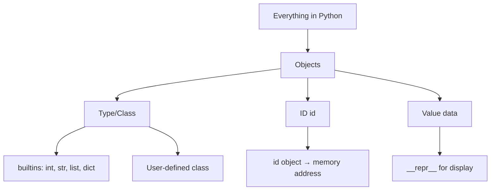
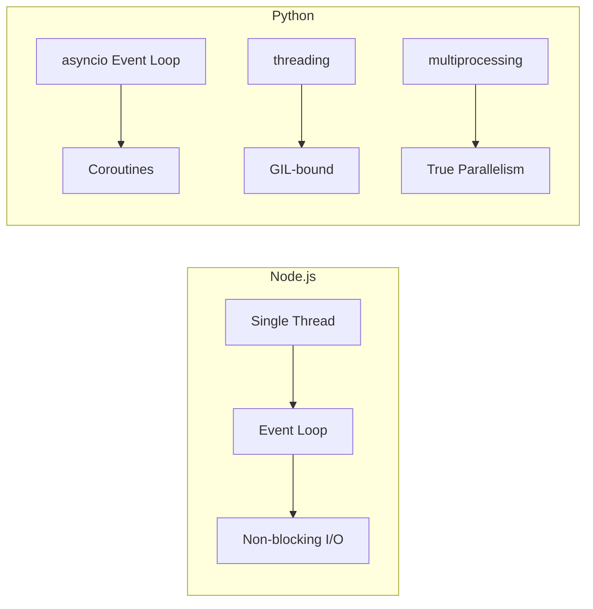
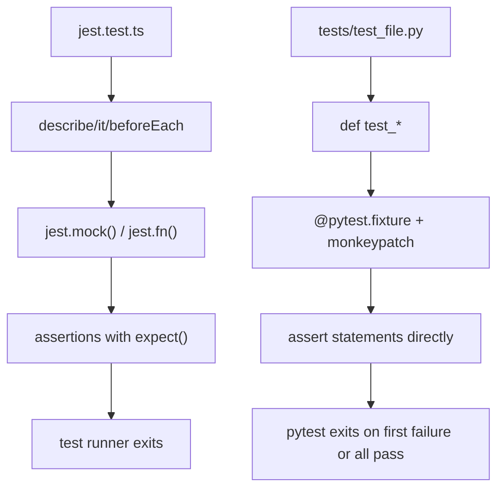

# Python for TypeScript Developers

> A complete, side-by-side journey from TypeScript to Python — with code, diagrams, and comparison tables in every chapter.

---

## Overview

This course is designed for TypeScript developers who want to **read, write, and think in Python** without unlearning strong typing or modern tooling concepts you already know. Every chapter maps TypeScript constructs to their Python equivalents, highlights what Python does differently (and often better), and gives you runnable code you can execute immediately.

**Who this is for:** Developers comfortable with interfaces, generics, decorators, async/await, ESLint/Prettier/Jest, and Node.js who want to add Python to their toolkit — whether for data science, web backends, scripting, or general-purpose programming.

### Why This Course Exists

| TypeScript Strength | Python Complement | Why It Matters |
|---------------------|-------------------|----------------|
| Compile-time type safety via `tsc` | Runtime duck typing + `mypy` optional types | Python gives you flexibility without sacrificing safety when you want it |
| Interfaces define shapes at compile time | `Protocol` (structural subtyping) in stdlib | Same pattern, same power — but checkable by mypy at any time |
| Generics for reusable types | `TypeVar` + `Generic[T]` + `ParamSpec` | Full generic type system with variance control |
| Decorators for cross-cutting concerns | Function/class decorators (same concept, different syntax) | Python's decorators are runtime function wrappers — more flexible than TS metadata approach |
| `async/await` on single-threaded event loop | `asyncio` + multiprocessing — multi-model concurrency | Python chooses between GIL-aware threading and true process parallelism; Node.js has one model only |
| npm ecosystem (4M+ packages) | PyPI ecosystem (500K+ packages) + stdlib 4x larger than Node.js core | Python ships more utilities out of the box; TypeScript ships fewer but relies on community |

### Key Insights for TypeScript Developers

> **Key Insight #1 — Everything is an object in Python.** Even `int`, `str`, and `None` are objects with methods, attributes, and type. In TypeScript, primitives like `number`, `string`, `boolean` are boxed/unboxed; in Python there's no distinction — `"hello".upper()` works just as naturally as `42.bit_length()`.

> **Key Insight #2 — Python has no `default` exports.** Every import is explicit (`from module import name`). This prevents naming collisions but feels unusual coming from JS/TS where `import x from './module'` is the norm.

> **Key Insight #3 — The GIL (Global Interpreter Lock) makes threading unsuitable for CPU-bound work.** Python threads can run simultaneously for I/O, but only one thread executes bytecode at a time. For CPU parallelism, use `multiprocessing`. Node.js has no such restriction because it's single-threaded by design — just know that Python offers *more* concurrency models (at the cost of complexity).

> **Key Insight #4 — Python's stdlib is enormous.** Node.js core modules: ~20. Python's `sys.stdlib_module_names` lists 200+ modules. Many npm packages (`lodash`, `path-to-regexp`, `uuid`, `date-fns`) have stdlib equivalents built in.

> **Key Insight #5 — Type hints are optional at runtime.** Unlike TypeScript (compile-only, no runtime checks), Python type hints exist for static analysis tools only. You can ignore them and run code that fails at runtime. Tools like `mypy` catch this statically; `pydantic` adds runtime validation.

---

## Table of Contents

### Part 0 — Getting Started

| Ch | Chapter | Summary |
|----|---------|---------|
| 00 | [Setup & Tooling](./00-introduction.md) | Python installation, PyCharm setup, virtual environments (venv), package management (pip/uv/Poetry), mypy, ruff, pytest — complete toolchain mapping from npm/eslint/tsc. |

### Part I — Foundations

| Ch | Chapter | Summary |
|----|---------|---------|
| 01 | [Fundamentals](./01-fundamentals.md) | Python's philosophy, object model, core types, control flow, functions — with direct TS syntax comparisons and Mermaid flow diagrams. |
| 02 | [Advanced Types](./02-advanced-types.md) | Full coverage of `typing` module: TypeVar, Generic, Protocol, Literal, TypedDict, dataclasses, enums, Self/Never/ParamSpec, and type narrowing. |
| 03 | [OOP Deep Dive](./03-oop-deep-dive.md) | Classes, MRO, dunder methods, descriptors, slots, mixins, metaclasses — plus a composition-vs-inheritance decision framework mapped from TS patterns. |
| 04 | [Functional Python](./04-functional-python.md) | Comprehensions, generators, itertools, closures, decorators, lru_cache — with performance notes and TS generator/lodash equivalents. |

### Part II — Core Language Mechanics

| Ch | Chapter | Summary |
|----|---------|---------|
| 05 | [Concurrency & Parallelism](./05-concurrency-parallelism.md) | GIL explained, threading vs asyncio vs multiprocessing with a decision framework and Node.js event loop comparisons. |
| 06 | [Modules & Packages](./06-modules-packages.md) | Import system internals, pyproject.toml/src layout, relative imports, circular import detection, namespace packages. |
| 07 | [Exception Handling & Context Managers](./07-exception-handling.md) | Full exception hierarchy, try/except/else/finally anatomy, context managers (class + generator-based), exception chaining, with Mermaid error-flow diagrams. |
| 08 | [Stdlib Deep Dive](./08-stdlib-deep-dive.md) | collections, functools, itertools, pathlib, dataclasses — with TS/lodash equivalents shown side-by-side. |

### Part III — Applied Python

| Ch | Chapter | Summary |
|----|---------|---------|
| 09 | [Data Science Stack](./09-data-science-stack.md) | NumPy arrays, pandas DataFrames, Matplotlib/Seaborn, SciPy — with TypeScript array method comparisons and tooling tables. |
| 10 | [Web Development](./10-web-development.md) | FastAPI (Express → FastAPI side-by-side), Flask, Django (NestJS comparison), middleware/auth patterns, request-flow Mermaid diagrams. |
| 11 | [Testing & Mocking](./11-testing-mocking.md) | pytest fixtures/parametrize, unittest alternative, unittest.mock (surpasses jest.mock), coverage, plus Jest ↔ pytest mapping table. |
| 12 | [Async/Await Patterns](./12-async-await-patterns.md) | Coroutines, gather/Semaphore/TaskGroup, aiohttp/aiofiles, event loop architecture — with Node.js ↔ asyncio comparison diagrams. |

### Part IV — Advanced & Systems

| Ch | Chapter | Summary |
|----|---------|---------|
| 13 | [Metaprogramming](./13-metaprogramming.md) | Descriptors, decorators vs TS decorators, `__call__`, dynamic attribute access, AST manipulation — fully visualized with Mermaid diagrams. |
| 14 | [Memory & Performance](./14-memory-performance.md) | Reference counting + cyclic GC vs V8 generational GC, profiling tools (cProfile/pyinstrument/tracemalloc), GIL internals, memory optimization patterns. |
| 15 | [Tooling & Ecosystem](./15-tooling-ecosystem.md) | venv vs node_modules, pip vs npm, Poetry vs build tools, mypy vs tsc, ruff/black vs ESLint/Prettier, pre-commit hooks — complete mapping table. |

### Part V — Reference & Cheatsheets

| Ch | Chapter | Summary |
|----|---------|---------|
| 16 | [Node.js → Python Equivalents](./16-nodejs-python-equivalents.md) | Every Node.js core module and popular npm package mapped to its Python equivalent with side-by-side code. |
| 17 | [Keywords Deep Dive](./18-keywords-deep-dive.md) | All 35 Python keywords vs 70+ TypeScript keywords — complete mapping table, Python-only, TS-only, similar-but-different pairs, quizzes. |
| 18 | [Regex In-Depth](./19-regex-in-depth.md) | Every metacharacter, all re/RegExp methods, feature comparison matrix, pattern recipes, lookarounds/recursion, performance pitfalls, quizzes. |
| 24 | [Master Cheat Sheet](./24-master-cheat-sheet.md) | The complete TS → Python reference: 30+ tables + 10+ Mermaid diagrams — keywords, types, data structures, concurrency, testing, web, stdlib, memory models. (Previously Module 20 in the v1 course.) |
| 26 | [Python Glossary](./26-glossary.md) | Complete tutorial glossary: 60+ terms from the official Python docs, each with TS/JS equivalents, code examples, and tutorial chapter links. |

### Part VI — Topic Deep Dives

| Ch | Chapter | Summary |
|----|---------|---------|
| 20 | [Built-In Functions Masterclass](./20-python-builtins-masterclass.md) | All 69 built-in functions: syntax, types, time complexity, edge cases, and TS equivalents — documented one by one. |
| 21 | [File Handling Deep Dive](./21-file-handling-deep-dive.md) | open() modes, pathlib modern API (replaces os.path), CSV/JSON modules, binary I/O, temp files, Node.js fs ↔ Python mapping. |
| 22 | [Error Handling & Debugging](./22-error-handling-debugging.md) | Full exception hierarchy, custom exceptions with attributes, pdb commands, structured logging, retry/backoff patterns, TS comparison. |
| 23 | [Node.js vs Python Modules](./23-nodejs-vs-python-modules.md) | Every Node.js built-in module mapped to Python, decision frameworks, pip alternatives, migration patterns, GIL implications for concurrency modules. |

---

## Introduction

This course is a comprehensive guide for **TypeScript developers** who want to learn Python. Every concept is explained with direct **TypeScript ↔ Python** syntax comparisons, side-by-side code examples, and visual diagrams (Mermaid flowcharts).

### What You'll Learn

- How Python's dynamic duck-typing compares to TypeScript's static type system
- The mental model shifts needed when moving from TS/JS to Python
- Complete coverage of Python fundamentals through advanced topics
- Tooling mappings: pip ↔ npm, pytest ↔ Jest, mypy ↔ tsc, and more

### Where to Start

Begin with [Module 00 — Setup & Tooling](./00-introduction.md) to get your environment configured (Python installation, PyCharm, virtual environments, type checking). Then proceed to [Chapter 01 — Fundamentals](./01-fundamentals.md) for the core mental model shifts. Use [Module 26 — Glossary](./26-glossary.md) as a quick reference for Python terms with TypeScript equivalents.

---

## Key Notes — TypeScript → Python Mental Model Shifts

### 1. Naming Conventions

TypeScript and Python use different conventions even for the same concept:

| Concept | TypeScript Convention | Python Convention | Example (TS) | Example (PY) |
|---------|----------------------|-------------------|-------------|-------------|
| File names | `camelCase.ts` or `PascalCase.ts` | `snake_case.py` | `userService.ts` | `user_service.py` |
| Class names | `PascalCase` | `PascalCase` (same!) | `UserService` | `UserService` |
| Functions/methods | `camelCase` | `snake_case` | `getUser()` | `get_user()` |
| Variables | `camelCase` | `snake_case` | `maxRetries` | `max_retries` |
| Constants | `UPPER_SNAKE_CASE` | `UPPER_SNAKE_CASE` (same!) | `MAX_SIZE` | `MAX_SIZE` |
| Interfaces | `interface Foo` | Protocol via docstring convention or PEP 8 | `interface Config` | `config: ConfigDict` |
| Private members | `private prop` | `_prefix` or `__dunder_prefix` | `private x` | `_x` / `__x` |

> **Key Point:** Python doesn't enforce private/public at runtime. The `_` prefix is a convention; `__` triggers name mangling (not true privacy). TS's `private` is compile-time only too — the same limitation, different mechanism.

### 2. Type System Philosophy

| Aspect | TypeScript | Python |
|--------|-----------|--------|
| Enforcement | Compile-time (`tsc --noEmit`) | Static analysis (`mypy`) + optional runtime (`pydantic`) |
| Structural typing | Yes (duck-typed interfaces) | Yes (`Protocol` since 3.8) |
| Nominal typing | No (by default) | No by default; use `typing.NamedTuple` + explicit casts for nominal patterns |
| Runtime type info | None (erased at compile time) | Full via `inspect`, `type()`, `isinstance()` |
| Generics variance | Covariant `in out` modifiers | `TypeVar("T", covariant=True)` / `contravariant=True` |
| Type guards | `is` checks, type predicates | `isinstance()` narrowing; `typing.TypeGuard` (3.10+) |

> **Key Point:** TypeScript types vanish at runtime. Python type hints remain in `__annotations__`. You can inspect them: `MyClass.__annotations__` or via `typing.get_type_hints()`. This enables libraries like Pydantic, click, and attrs to work at runtime — nothing TypeScript's erased types can do.

### 3. Concurrency Model Differences

| Aspect | Node.js / TypeScript | Python |
|--------|---------------------|--------|
| Threading | OS threads (`worker_threads`) | `threading` (limited by GIL) |
| Async model | Single event loop, non-blocking I/O | Multiple models: `asyncio`, threading, multiprocessing |
| Parallelism | Worker threads or child processes | `multiprocessing` (true parallel on multi-core) |
| Concurrency primitive | Promises / async-await | `async/await` + `TaskGroup` (3.11+) |
| CPU-bound workaround | `worker_threads` (limited) | `multiprocessing` (scales with cores) |

> **Key Point:** Node.js and Python's asyncio share the same single-threaded event loop model for I/O. But Python goes further: if you need real CPU parallelism, use `multiprocessing`. Node.js can't do that without spawning child processes or using worker threads (which have limited API support).

### 4. Module Resolution

| Feature | TypeScript / JS | Python |
|---------|-----------------|--------|
| Resolution | File extension inference (.ts → .js), `node_modules` fallback | Explicit paths, `sys.path`, `__init__.py` packages |
| Default export | `export default` | Doesn't exist — use convention (`if __name__ == "__main__"`) |
| Relative import | `import x from './x'` | `from . import x` or `from ..pkg import x` |
| Package manager | npm / pnpm / yarn | pip / poetry / uv |
| Lock file | `package-lock.json` / `yarn.lock` | `poetry.lock` / `uv.lock` / `pip freeze > requirements.txt` |

---

## How to Use This Course

1. **Start at Chapter 01** and work sequentially — later chapters build on earlier ones
2. **Read the TS ↔ PY comparison tables** first to anchor new Python concepts to what you know
3. **Study the Mermaid diagrams** — they visualize execution models that are hard to grasp from text alone
4. **Run every example** — activate a venv and execute each snippet to see it work firsthand

---

## Prerequisites

- Comfortable with TypeScript, Node.js, npm/pnpm/yarn, modern JavaScript (ES2020+)
- Familiar with interfaces, generics, decorators, async/await, ESLint/Prettier/Jest

---

## Quick Start

```bash
cd course
python --version              # Ensure Python 3.10+ is installed
python -m venv .venv
source .venv/bin/activate     # Windows: .venv\Scripts\activate
pip install mypy ruff black pytest ipython pydantic fastapi aiohttp pendulum faker
```

---

## What You'll Gain

- **Translate any TypeScript concept** directly into Python — no guessing
- **Build production APIs** with FastAPI (auto-documented via OpenAPI/Swagger)
- **Master dataclasses, Protocols, metaclasses** — clean OOP beyond TS boilerplate
- **Choose the right concurrency** primitive: asyncio for I/O, multiprocessing for CPU
- **Ship less dependencies** — Python's stdlib covers what requires dozens of npm packages
- **Profile and optimize** with cProfile, pyinstrument, tracemalloc, and memory models
- **Set up professional tooling** — Poetry + mypy + ruff/black + pytest + pre-commit
- **Navigate the ecosystem gap** between Node.js built-ins and Python's pip-first world

---

## Appendix A — Essential Reading & Citations

### Official Documentation

| Resource | URL | Why It Matters |
|----------|-----|----------------|
| [Python Tutorial (official)](https://docs.python.org/3/tutorial/) | docs.python.org/3/tutorial | The canonical introduction — read chapters 1–6 for fundamentals, then dive deeper as needed |
| [Python Data Model (dunder methods)](https://docs.python.org/3/reference/datamodel.html) | docs.python.org/3/reference/datamodel | Every `__method__` is documented here with exact semantics |
| [The Zen of Python](https://peps.python.org/pep-0020/) | peps.python.org/pep-0020 | 19 guiding principles of the language — run `import this` to see them |
| [PEP 8 — Style Guide](https://peps.python.org/pep-0008/) | peps.python.org/pep-0008 | The official style guide (what ruff/black enforce) |
| [typing module docs](https://docs.python.org/3/library/typing.html) | docs.python.org/3/library/typing | Full reference for TypeVar, Generic, Protocol, Literal, TypedDict, etc. |
| [asyncio docs](https://docs.python.org/3/library/asyncio.html) | docs.python.org/3/library/asyncio | Official asyncio API with event loop, TaskGroup (3.11+), gather, wait_for, Semaphore |
| [cpython C API — GIL](https://docs.python.org/3/c-api/init.html#the-gil) | docs.python.org/3/c-api/init.html | Technical spec for the Global Interpreter Lock |
| [Python stdlib module names](https://docs.python.org/3/py-modindex.html) | docs.python.org/3/py-modindex | Full index of 200+ standard library modules |

### Key PEPs (Language Proposals Implemented)

| PEP | Title | Relevance |
|-----|-------|-----------|
| [PEP 484](https://peps.python.org/pep-0484/) | Type Hints | Introduced `typing` module — the foundation of Python's type system |
| [PEP 544](https://peps.python.org/pep-0544/) | Protocols | Structural subtyping (duck typing with mypy checks) |
| [PEP 557](https://peps.python.org/pep-0557/) | Data Classes | `@dataclass` decorator — the closest thing to TypeScript's `class` for data |
| [PEP 563](https://peps.python.org/pep-0563/) | Postponed Annotations | `from __future__ import annotations` — enables forward references naturally |
| [PEP 572](https://peps.python.org/pep-0572/) | Assignment Expressions | Walrus operator `:=` — named expressions for compact code |
| [PEP 604](https://peps.python.org/pep-0604/) | Union Operators | `X | Y` syntax replacing `Union[X, Y]` (Python 3.10+) |
| [PEP 675](https://peps.python.org/pep-0675/) | Arbitrary Literals Strings | `LiteralString` and `Never` types for better narrowing |
| [PEP 695](https://peps.python.org/pep-0695/) | Type Parameters | New generic syntax: `def identity[T](x: T) -> T` (Python 3.12+) |
| [PEP 702](https://peps.python.org/pep-0702/) | Stackless Closures | Performance optimization for closures — relevant to decorator performance |
| [PEP 747](https://peps.python.org/pep-0747/) | Narrower Numeric Types | `list[int]` vs `list[Any]` performance optimization in CPython 3.13+ |

### TypeScript Documentation (For Reference)

| Resource | URL | Why It Matters |
|----------|-----|----------------|
| [TypeScript Handbook](https://www.typescriptlang.org/docs/) | typescriptlang.org/docs | Complete reference for every TS feature mentioned in this course |
| [TS Language Server Protocol](https://microsoft.github.io/language-server-protocol/) | microsoft.github.io/language-server-protocol | The basis for VS Code's TypeScript support — relevant when migrating to Python LSP |
| [TS Compiler API](https://github.com/microsoft/TypeScript/wiki/Using-the-Compiler-API) | github.com/microsoft/TypeScript/wiki | Understanding TS's AST → useful for metaprogramming parallels in Python's `ast` module |

---

## Appendix B — Comparison Tables at a Glance

### Operators

| Operation | TypeScript | Python | Notes |
|-----------|-----------|--------|-------|
| Equality | `===` / `!==` | `is` / `is not` | TS `===` checks value; Python `is` checks identity (object address) |
| Loose equality | `==` / `!=` | N/A (no coercion) | Python deliberately lacks JS's weird `==` coercion rules |
| Nullish coalescing | `a ?? b` | `a if a is not None else b` | No nullish-coalesce operator in Python; use `or` for falsy fallback |
| Logical OR shortcut | `a || b` | `a or b` | Same semantics but different keyword syntax |
| Logical AND shortcut | `a && b` | `a and b` | Short-circuits the same way |
| Ternary | `a ? b : c` | `b if a else c` | Python's conditional expression is value-returning, not statement |
| Optional chaining | `obj?.prop` | `getattr(obj, "prop", default)` | No optional-chaining operator in Python |
| Type assertion | `x as T` / `x as any` | `cast(T, x)` from `typing` or `isinstance(x, T)` check | Python doesn't need casts for type narrowing at runtime |
| Instance of | `x instanceof Foo` | `isinstance(x, Foo)` | Same concept; Python also supports tuples: `isinstance(x, (A, B))` |

### Data Structure Comparison

| Feature | TypeScript | Python | Best For |
|---------|-----------|--------|----------|
| Ordered key-value | `Record<K,V>` / `Map<K,V>` | `dict` | General purpose — dict is Python's workhorse |
| Immutable map | `Readonly<T>` | `Mapping[K,V]` (Protocol) or `frozenset` of tuples | Read-only contracts |
| Tuple (fixed size) | `[T, U, V]` | `(T, U, V)` | Fixed-length homogeneous/heterogeneous records |
| Immutable tuple | readonly `[T, U]` | `tuple[T, ...]` or `NamedTuple` | Data transfer objects; function return types |
| Set (unique) | `Set<T>` / `new Set()` | `set` | Uniqueness checks; set operations |
| Ordered dict | `Map<K,V>` preserves insertion | `dict` (3.7+ preserves insertion) | Both preserve order now |
| Stack / Queue | Array `.push()`/`.pop()` / `deque` from lib | `list.append()`/`.pop()` / `collections.deque` | Use `deque` for both ends; `list` for stack only |
| Counter / frequency map | Manual with Map | `collections.Counter` | Python's stdlib wins here — no npm equivalent |

### Async/Await Comparison

| Concept | TypeScript / Node.js | Python |
|---------|---------------------|--------|
| Promise | `Promise<T>` | `Coroutine[T]` / `asyncio.Task[T]` |
| All parallel | `Promise.all([p1, p2])` | `await asyncio.gather(c1, c2)` |
| Race | `Promise.race([p1, p2])` | `await first_completed(...)` or custom implementation |
| Timeout | `setTimeout` / `AbortController` | `asyncio.wait_for(coroutine, timeout)` |
| Semaphore | N/A (native) | `asyncio.Semaphore(n)` |
| Event loop | Global (Node.js) | `asyncio.new_event_loop()` + `set_event_loop()` |
| Fiber/green thread | N/A | `asyncio.create_task(coro)` — cooperative multitasking |

---

## Appendix C — Tooling Mapping Table

| TypeScript Ecosystem | Python Equivalent | Notes |
|----------------------|-------------------|-------|
| `tsc` (TypeScript Compiler) | `mypy` + `pyright` (Pylance) | mypy is closest; pyright is faster and VS Code's default |
| `eslint` | `ruff` or `flake8` | ruff is 10-100x faster than eslint-equivalent tooling |
| `prettier` | `black` or `ruff format` | Black enforces one style; Prettier gives some options. Black wins for simplicity. |
| `npm` / `yarn` / `pnpm` | `pip` / `poetry` / `uv` | uv is the new fastest installer (Rust-based) |
| `package.json` scripts | `pyproject.toml [tool.poetry.scripts]` or `Makefile` | Poetry handles deps + scripts in one file |
| `jest` | `pytest` | pytest fixtures are more powerful than Jest's; unittest.mock is more powerful than jest.mock |
| `ts-node` | `python -m` / `uvicorn` / `ipython` | IPython is the interactive REPL equivalent |
| `webpack` / `esbuild` | N/A (not needed for Python backend) | Python doesn't bundle; Docker/containerize instead |
| `@types/node` | `stdlib` docs + `types-*` stubs on PyPI | Some packages ship types; others need `pip install types-package` |
| VS Code TypeScript extension | Pylance (Pyright) | Same editor, same Microsoft tech stack |

---

## Appendix D — Common Pitfalls for TypeScript Developers

### 1. Mutable Default Arguments

```typescript
// TypeScript: no problem
function createArr(acc: string[] = []) {
  acc.push("item");
  return acc;
}
```

```python
# Python: BUG! The default list is shared across all calls
def create_arr(acc=[]):  # ❌ Default evaluated once at function definition
    acc.append("item")
    return acc

# ✅ Fix: use None as sentinel
def create_arr(acc=None):
    if acc is None:
        acc = []
    acc.append("item")
    return acc
```

> **Key Point:** In Python, default arguments are evaluated **once** at function definition time, not every call. This applies to all mutable defaults (lists, dicts, sets). Always use `None` as the sentinel and create the new value inside the function.

### 2. Closure Variable Capture in Loops

```python
# TypeScript: works as expected with let
const fns = [];
for (let i = 0; i < 3; i++) {
  fns.push(() => i);  // returns 0, 1, 2
}

# Python: same issue! All closures capture the SAME variable
fns = []
for i in range(3):
    fns.append(lambda: i)  # all return 2 (the final value of i)
```

> **Key Point:** Python closures capture variables by reference, not by value. Fix with a default argument: `lambda i=i: i`.

### 3. `is` vs `==` Confusion

```typescript
// TypeScript: === checks value equality for primitives
"hello" === "hello";  // true

# Python: == checks value; is checks identity (same object)
"hello" == "hello"   # True — same value
"hello" is "hello"   # Implementation-dependent! CPython interns short strings, but don't rely on it
```

> **Key Point:** Use `is` only for singletons (`None`, `True`, `False`). Never use `is` for value comparison. In Python 3.8+, `is None` is the only idiomatic use.

### 4. Type Hinting Without Runtime Enforcement

```python
def process(data: dict[str, int]) -> str:
    # No runtime check! If you pass a list, it won't error here
    return ", ".join(str(v) for v in data.values())

process([1, 2, 3])  # ✅ Passes type checking but crashes at runtime — if dict methods are called
```

> **Key Point:** Type hints don't enforce anything at runtime. Use `pydantic` models or `isinstance()` checks for runtime validation, especially in public APIs.

### 5. List vs Generator Confusion

```typescript
// TypeScript: array.filter returns a new array (eager)
const result = items.filter(x => x > 0);  // New array allocated immediately
```

```python
# Python: list comprehensions are eager; generator expressions are lazy
result = [x for x in items if x > 0]      # ✅ Eager — same as TS filter
result = (x for x in items if x > 0)       # Lazy — doesn't allocate until iterated
```

> **Key Point:** Python list comprehensions `[...]` are eager (allocate). Generator expressions `(...)` are lazy (compute on demand). Use generators for large/unknown-size data to save memory.

---

## Appendix E — Learning Path Recommendations

### Fast Track (1–2 weeks)
Read chapters in this order if you just need the essentials:
**01 → 04 → 06 → 08 → 10 → 15**

Covers: fundamentals, types, OOP, functional patterns, modules, stdlib, web frameworks, tooling. This is enough to build and ship a FastAPI app with proper structure and tooling.

### Data Science Track (2–3 weeks)
Read chapters in this order if you're coming from TypeScript for data work:
**01 → 02 → 04 → 08 → 09 → 14**

Covers: fundamentals, types, functional patterns, stdlib, NumPy/pandas/SciPy, performance profiling.

### Backend Engineering Track (2–3 weeks)
Read chapters in this order for building production backends:
**01 → 02 → 03 → 05 → 07 → 10 → 11 → 15**

Covers: fundamentals through web, testing, concurrency, tooling — the full production stack.

### Deep Dive (all chapters, 4–6 weeks)
Read sequentially. Each chapter adds one layer of depth. The Mermaid diagrams and comparison tables are your fastest path to understanding.

---

## Appendix F — Useful Commands Cheat Sheet

| Task | TypeScript / Node.js | Python Equivalent |
|------|---------------------|-------------------|
| Interactive REPL | `node` | `python` or `ipython` (better) |
| Run a script | `node index.ts` (with ts-node) | `python script.py` |
| Format code | `prettier --write .` | `black .` or `ruff format .` |
| Lint code | `eslint .` | `ruff check .` or `flake8 .` |
| Type check | `tsc --noEmit` | `mypy .` |
| Run tests | `jest` | `pytest` |
| Install dependency | `npm install pkg` | `pip install pkg` |
| Save as dev dependency | `npm install -D pkg` | `pip install -e ".[dev]"` (Poetry) |
| Lock file | `npm install` (generates package-lock.json) | `poetry lock` or `uv lock` |
| Project init | `npm init -y` | `poetry new myproject` |
| Script execution | `"scripts": { "dev": "..." }` | `[tool.poetry.scripts]` or `Makefile` |

---

## Appendix G — Python vs TypeScript Feature Matrix

| Feature | TypeScript | Python | Implemented In |
|---------|-----------|--------|----------------|
| Compile/static types | Yes (erased at runtime) | Optional (runtime-preserving via annotations) | All |
| Interfaces | `interface Foo {}` | `Protocol` (structural) / ABC (nominal) | 02, 03 |
| Generics | `<T>`, `in/out` variance | `TypeVar`, `Generic[T]`, covariance flags | 02 |
| Decorators | `@decorator` (metadata-based) | `@decorator` (function wrapper) | 04, 13 |
| Enums | `enum E { A, B }` | `enum.Enum`, `enum.IntEnum`, `enum.Flag` | 02 |
| Data classes | `class C { prop: T }` | `@dataclass` class | 02, 08 |
| Async/await | Native (single event loop) | Native (`asyncio` module) | 05, 12 |
| Pattern matching | Destructuring + type guards | `match/case` (structural) | 01 |
| Metaprogramming | Reflect API (`Reflect`) | Descriptors, `type()`, `ast` module | 13 |
| Concurrency | Event loop + worker_threads | Threading, asyncio, multiprocessing | 05, 12 |
| Memory management | V8 generational GC | Reference counting + cyclic GC | 14 |
| Exception system | Error classes (hierarchy) | Exception classes (`BaseException` tree) | 07, 22 |
| Type narrowing | `is`, `instanceof`, type predicates | `isinstance()` narrowing, `TypeGuard` | 02 |

---

## Appendix H — Quick Reference: Key Libraries by Domain

### Web & APIs
| Need | Library | Alternative | Source |
|------|---------|-------------|--------|
| HTTP server / API | [FastAPI](https://fastapi.tiangolo.com/) | Flask, Django REST Framework | fastapi.tiangolo.com |
| HTTP client | [httpx](https://www.python-httpx.org/) (async) / [requests](https://docs.python-requests.org/) (sync) | aiohttp | httpx.dev |
| Validation | [pydantic](https://docs.pydantic.dev/) | marshmallow, colander | pydantic.dev |
| ORM | [SQLAlchemy 2.0](https://docs.sqlalchemy.org/) / [Tortoise ORM](https://tortoise.github.io/) (async) | Django ORM | sqlalchemy.org |
| Auth | [python-jose](https://github.com/mpdavis/python-jose) / [passlib](https://passlib.readthedocs.io/) | jsonwebtoken (Node.js) | — |

### Data Science
| Need | Library | Source |
|------|---------|--------|
| Array computing | [NumPy](https://numpy.org/doc/stable/) | numpy.org |
| Data manipulation | [pandas](https://pandas.pydata.org/) | pandas.pydata.org |
| Visualization | [Matplotlib](https://matplotlib.org/) / [Seaborn](https://seaborn.pydata.org/) | matplotlib.org, seaborn.pydata.org |
| Machine learning | [scikit-learn](https://scikit-learn.org/) / [PyTorch](https://pytorch.org/) / [TensorFlow](https://www.tensorflow.org/) | scikit-learn.org |
| Notebooks | [Jupyter](https://jupyter.org/) | jupyter.org |

### Tooling
| Need | Library | Source |
|------|---------|--------|
| Dependency management | [Poetry](https://python-poetry.org/) / [uv](https://docs.astral.sh/uv/) | python-poetry.org, docs.astral.sh/uv |
| Type checking | [mypy](http://mypy-lang.org/) / [pyright](https://github.com/microsoft/pyright) | mypy-lang.org |
| Linting | [ruff](https://docs.astral.sh/ruff/) | docs.astral.sh/ruff |
| Formatting | [black](https://black.readthedocs.io/) / [ruff format](https://docs.astral.sh/ruff/formatter/) | black.readthedocs.io |
| Testing | [pytest](https://docs.pytest.org/) | docs.pytest.org |

---

## Appendix I — Frequently Asked Questions (TS → PY)

### Q: Does Python have a type system like TypeScript?
**A:** Yes. Python 3.10+ supports full static typing via `mypy` or `pyright`. The syntax differs (`def f(x: int) -> str:` vs TS's `(x: number): string =>`) but the concepts (interfaces→Protocols, generics→TypeVar, union types→X\|Y, optional→X\|None) are equivalent. Python 3.12 added new generic syntax (`def identity[T](x: T) -> T`) bringing it closer to TS's ergonomics.

### Q: Should I use type hints in production?
**A:** For team projects: **yes**. `mypy --strict` catches ~30% of bugs before runtime (based on internal Microsoft studies with TypeScript). For scripts: optional. Tools like Pydantic use your type hints at runtime for validation, so they're not just comments.

### Q: Is Python slower than TypeScript/Node.js?
**A:** Raw execution is slower (Python CPython is interpreted; Node.js V8 compiles to machine code). But:
- For I/O-bound work (APIs, scraping), the difference is negligible — both are async event-loop driven
- For CPU-bound work, Python can use `multiprocessing` or compiled extensions (NumPy uses C/Fortran under the hood)
- PyPy (an alternative interpreter) can make Python ~5x faster for CPU-bound code

### Q: How do I handle environment variables?
**A:** TypeScript/Node.js commonly uses `dotenv`. In Python:
```python
# Option 1: os.environ (stdlib, no deps)
import os
api_key = os.getenv("API_KEY", "default")

# Option 2: pydantic-settings (recommended for apps)
from pydantic_settings import BaseSettings
class Settings(BaseSettings):
    api_key: str
    db_url: str
settings = Settings()
```

### Q: What's the Python equivalent of `node_modules`?
**A:** There is no local `node_modules`-style directory. Dependencies are installed into your virtual environment (`.venv`). Each project has its own `.venv`, so there's no hoisting or deduplication like npm. This is simpler but means disk usage per project:
```bash
# Node.js: deps in node_modules/
npm install express

# Python: deps in .venv/lib/pythonX.X/site-packages/
python -m venv .venv && source .venv/bin/activate
pip install fastapi
```

### Q: How do I do destructuring like TS?
**A:** Python supports tuple unpacking (the primary destructuring mechanism):
```typescript
// TypeScript
const [first, ...rest] = array;
const { name, age } = person;
```
```python
# Python
first, *rest = array
name = person["name"]  # dict unpacking is less elegant
# OR use dataclasses/pattern matching:
match person:
    case {"name": n, "age": a}:
        name, age = n, a  # ✅ Structural pattern matching (3.10+)
```

---

## Appendix J — Mermaid Diagrams Preview

Every chapter includes visual diagrams. Here are examples of the kinds you'll find:

### Python Object Model (Chapter 01)



### Async Event Loop Comparison (Chapter 05)



### Testing Flow: Jest → pytest (Chapter 11)



---

## Appendix K — Glossary of TypeScript Terms → Python Equivalents

| TypeScript Term | Python Equivalent | Notes |
|-----------------|-------------------|-------|
| Interface | `Protocol` (structural) / ABC (nominal) | Protocols check structural compatibility at runtime via mypy |
| Type alias | `TypeAlias` / simple `type X = Y` (3.12+) | `from typing import TypeAlias` or just `type Foo = bar` |
| Union type | `X \| Y` (3.10+) / `Union[X, Y]` | Pipe syntax is preferred in modern Python |
| Optional | `X \| None` | Same concept as `X | undefined` in TS |
| Generic | `TypeVar("T")` + `Generic[T]` or `[T]` (3.12+) | Covariance via `TypeVar("T", covariant=True)` |
| Readonly | Not natively enforced; use `Mapping[K, V]` Protocol or `frozenset` | No runtime immutability by default |
| Enum | `enum.Enum`, `IntEnum`, `Flag`, `auto()` | More variants than TypeScript's enum |
| Tuple | `tuple[T, U, ...]` | Fixed-size, heterogeneous type annotations |
| Array | `list[T]` or `Sequence[T]` for readonly | `tuple[T, ...]` for readonly arrays |
| Record/Map | `dict[K, V]` / `Mapping[K, V]` (readonly) | `collections.defaultdict` for auto-initialization |
| Set | `set[T]` / `frozenset[T]` | Same concepts as TS Set |
| Class decorator | `@dataclass`, `@attr.s`, `@pydantic.dataclasses.dataclass` | Function wrappers that modify class at definition time |
| Interface/Type guard | Type predicate function + mypy narrowing | Runtime: `isinstance(x, T)`; static: mypy narrows |
| Error class | Custom exception class inheriting `Exception` | Python's exception hierarchy is deeper/more granular than JS Error |

---

> **Begin with [Chapter 01 — Fundamentals](./01-fundamentals.md) and work through each chapter sequentially.** Each builds on the previous one, giving you a complete understanding of how TypeScript concepts map to Python with practical examples and visual diagrams.
